# 第01章 计算机系统漫游

> 原书: Chapter 01 - A Tour of Computer Systems

## 本章概述

本章通过追踪一个简单的 hello 程序的生命周期，介绍计算机系统的主要概念和术语。我们将了解程序是如何被编译、执行的，以及硬件和操作系统如何协同工作来运行应用程序。

---

**目录**

- 1.1 [信息就是位 + 上下文](#11-信息就是位--上下文)
- 1.2 [程序被其他程序翻译成不同的形式](#12-程序被其他程序翻译成不同的形式)
- 1.3 [了解编译系统如何工作是大有裨益的](#13-了解编译系统如何工作是大有裨益的)
- 1.4 [处理器读取并解释存储在内存中的指令](#14-处理器读取并解释存储在内存中的指令)
- 1.5 [高速缓存至关重要](#15-高速缓存至关重要)
- 1.6 [存储设备形成层次结构](#16-存储设备形成层次结构)
- 1.7 [操作系统管理硬件](#17-操作系统管理硬件)
- 1.8 [系统之间利用网络通信](#18-系统之间利用网络通信)
- 1.9 [重要主题](#19-重要主题)
- 1.10 [小结](#110-小结)

---

计算机系统由硬件和系统软件组成，它们共同协作以运行应用程序。尽管系统的具体实现方式随着时间的推移不断演变，但其内在的基本概念始终不变。所有计算机系统都有相似的硬件和软件组件，它们执行着相似的功能。本书旨在帮助那些希望通过了解这些组件如何协作、以及它们如何影响程序的正确性和性能，来提升编程技能的程序员。

你即将踏上一段激动人心的旅程。如果你全心投入本书中的概念学习，你将走上成为稀有的“高能程序员”之路，获得通过深入理解底层计算机系统及其对应用程序影响所带来的丰厚回报。

在本书中，你将学到许多实用技能，比如如何避免由计算机数字表示方式引起的奇异数值错误。你将掌握如何利用现代处理器和内存系统的设计，采用巧妙的技巧来优化 C 代码。你将深入理解编译器如何实现过程调用，以及如何利用这些知识来避免缓冲区溢出漏洞，这些漏洞一直是网络和互联网软件的安全隐患。你将学会如何识别并规避链接过程中那些令大多数程序员困惑的棘手错误。你还将学会如何编写自己的 Unix shell、动态内存分配包，甚至是自己的 Web 服务器。并且，你将了解并发的挑战和陷阱——随着多核处理器被集成到单一芯片中，这一主题愈加重要。

在 Kernighan 和 Ritchie 的经典著作《C programming language》 [61] 中，他们通过图 1.1 所示的简单 hello 程序向读者介绍了 C 语言。虽然 hello 是一个非常简单的程序，但系统的每个主要部分必须协调工作才能成功运行它。从某种角度来说，本书的目标就是帮助你理解在系统上运行 hello 程序时，究竟发生了什么，为什么会发生。

我们将通过追踪 hello 程序的生命周期来开始对系统的学习——从程序员创建程序开始，到程序在系统上运行，打印出简单的消息并终止。我们会简要介绍程序生命周期中关键的概念、术语和组件，后续章节将深入探讨这些内容。

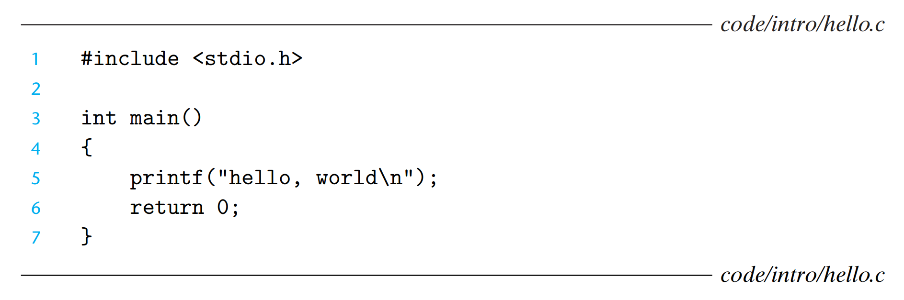

**图 1.1** hello 程序。（来源：[60]）

---

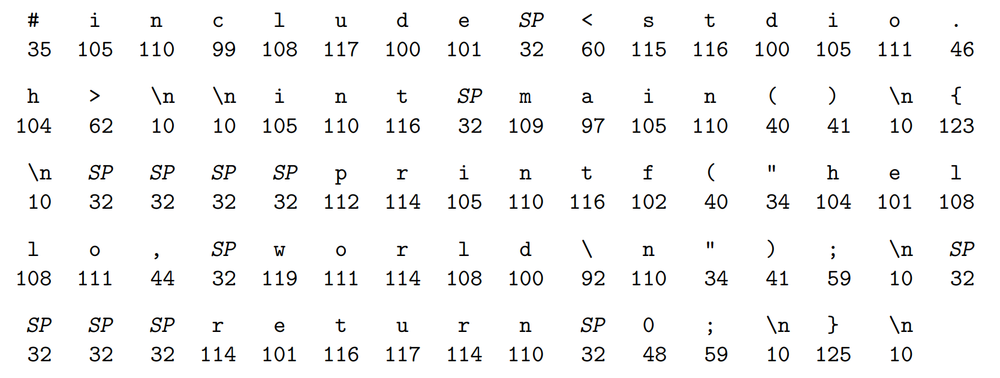

**图 1.2** `hello.c` 的 ASCII 文本表示。

---

## 1.1 信息就是位 + 上下文

我们的 hello 程序的生命周期始于一个**源程序**（或**源文件**），该程序由程序员使用编辑器创建，并保存为文本文件，名为 `hello.c`。源程序是由值为 0 和 1 的位组成的序列，每 8 位组成一个**字节**，每个字节代表程序中的一个文本字符。

大多数计算机系统使用 ASCII 标准来表示文本字符，这种方式使用一个唯一的单字节整数值来表示每个字符。¹ 例如，图 1.2 展示了 `hello.c` 程序的 ASCII 表示。

`hello.c` 程序以字节序列的方式存储在文件中，每个字节都有一个整数值，表示某个字符。例如，第一个字节的整数值是 35，对应字符 '#'，第二个字节的整数值是 105，对应字符 'i'，以此类推。需要注意的是，每行文本都以不可见的换行符 '\n' 结尾，其对应的整数值是 10。像 `hello.c` 这样的文件，由 ASCII 字符组成，称为**文本文件**；其他类型的文件则称为**二进制文件**。

`hello.c` 的表示方法体现了一个基本思想：系统中的所有信息——包括磁盘文件、内存中的程序、内存中的用户数据以及网络上传输的数据——都是通过一串位来表示的。区分不同数据对象的唯一方法是根据我们读取这些对象时的上下文。例如，在不同的上下文中，相同的字节序列可能表示一个整数、浮点数、字符串或机器指令。

作为程序员，我们需要理解数字的机器表示方式，因为它们与实际的整数和实数有所不同。它们是有限的近似值，可能以意想不到的方式表现出来。这个基本思想将在第 2 章中详细探讨。

---

> **旁注：C 编程语言的起源**
>
> C 语言由贝尔实验室的 Dennis Ritchie 于 1969 至 1973 年间开发。1989 年，美国国家标准协会（ANSI）批准了 ANSI C 标准，随后该标准的制定和维护工作转交给国际标准组织（ISO）。这些标准定义了 C 语言及其标准库（C 标准库）。Kernighan 和 Ritchie 在他们的经典著作中对 ANSI C 进行了阐述，这本书被人们亲切地称为 "K&R" [61]。用 Ritchie 的话来说 [92]，C 语言“古怪、有缺陷，但却取得了巨大的成功”。那么，为什么它会如此成功呢？
>
> - **C 与 Unix 操作系统的紧密关系。** C 最初作为 Unix 的系统编程语言被开发出来。Unix 内核（操作系统的核心部分）以及所有相关工具和库都是用 C 编写的。20 世纪 70 年代末和 80 年代初，Unix 在大学中广泛传播，许多人接触到 C 并发现它非常有吸引力。由于 Unix 完全是用 C 编写的，因此它可以轻松移植到新的计算机上，从而为 C 语言和 Unix 操作系统赢得了更广泛的受众。
>
> - **C 是一种小巧而简洁的语言。** C 的设计由单一设计者负责，而非委员会，这使得其设计简洁、一致，且没有多余的负担。K&R 这本书仅用 261 页便详细描述了完整的语言和标准库，并提供了大量的示例与练习。C 的简洁性使得它易于学习，并能够方便地移植到不同的计算机平台上。
>
> - **C 是为实际目的而设计的。** C 被设计用来实现 Unix 操作系统。后来，其他开发者发现他们同样可以使用 C 编写各类程序，而不受语言本身的限制。
>
> C 语言是系统级编程的首选工具，且衍生出了大量基于 C 的应用级程序。然而，它并非完美无缺。C 的指针常常成为混乱和编程错误的根源。此外，C 缺乏对有用的抽象（如类、对象和异常）的显式支持。较新的编程语言，如 C++ 和 Java，针对应用级程序解决了这些问题。

---

¹ 其他编码方法用于表示非英语文本。详情请参见第 86 页的旁注。

---

## 1.2 程序被其他程序翻译成不同的形式

hello 程序的生命周期始于一个高级 C 程序，因为这种形式易于人类阅读和理解。然而，为了在系统上运行 `hello.c`，各条 C 语句必须被其他程序翻译成一系列低级**机器语言指令**。这些指令随后被打包成一种称为**可执行目标程序**的格式，并以二进制磁盘文件的形式保存。目标程序也被称为**可执行目标文件**。

在 Unix 系统中，从源文件到目标文件的转换是由**编译器驱动程序**完成的：

```bash
linux> gcc -o hello hello.c
```

在此过程中，gcc 编译器驱动程序读取源文件 `hello.c`，并将其翻译为可执行目标文件 `hello`。该翻译过程分为四个阶段，如图 1.3 所示。执行这四个阶段的程序（**预处理器**、**编译器**、**汇编器**和**链接器**）共同构成了**编译系统**。


**图 1.3** 编译系统。

```
hello.c → [预处理器(cpp)] → hello.i → [编译器(cc1)] → hello.s → [汇编器(as)] → hello.o → [链接器(ld)] → hello
源程序                  修改后的源程序                 汇编程序             可重定位目标程序      ↑    可执行目标程序
(文本)                     (文本)                    (文本)                  (二进制)         ↑       (二进制)
                                                                                           ↑
                                                                                        printf.o
```

- **预处理阶段**  
  预处理器（cpp）根据以字符 `#` 开头的命令修改原始的 C 程序。例如，`hello.c` 第 1 行的 `#include <stdio.h>` 命令告诉预处理器读取系统头文件 `stdio.h` 的内容，并将其直接插入程序文本中。结果是另一个 C 程序，通常以 `.i` 作为文件扩展名。

- **编译阶段**  
  编译器（cc1）将文本文件 `hello.i` 翻译成文本文件 `hello.s`，它包含一个汇编语言程序。该程序包含 `main` 函数的定义，如下所示：

  ```asm
    main:
        subq    $8, %rsp
        movl    $.LC0, %edi
        call    puts
        movl    $0, %eax
        addq    $8, %rsp
        ret
    ```
    上述定义中，第 2~7 行的每一行都描述了一条低级机器语言指令的文本形式。汇编语言非常有用，因为它为不同高级语言的编译器提供了通用的输出格式。例如，C 编译器和 Fortran 编译器都生成相同汇编语言的输出文件。

- **汇编阶段**  
  接下来，汇编器（as）将 `hello.s` 翻译成机器语言指令，把这些指令打包成一种叫做 **可重定位目标程序** 的格式，并将结果保存在目标文件 `hello.o` 中。这个文件是一个二进制文件，包含 17 个字节来编码 `main` 函数的指令。如果我们用文本编辑器查看 `hello.o`，它看起来会像乱码一样。

- **链接阶段**  
  注意，我们的 `hello` 程序调用了 `printf` 函数，它是每个 C 编译器都提供的标准 C 库中的一个函数。`printf` 函数存在于一个名为 `printf.o` 的单独预编译好的目标文件中，这个文件必须以某种方式合并到我们的 `hello.o` 程序中。链接器（ld）负责处理这种合并。结果是 `hello` 文件，它是一个 **可执行目标文件**（或简称为 **可执行文件**），可以被加载到内存中，由系统执行。

---

> **旁注：GNU 项目**
>
> GCC 是由 GNU（GNU's Not Unix 的缩写）项目开发的众多有用工具之一。GNU 项目是 Richard Stallman 于 1984 年发起的一个非营利慈善项目，其宏伟目标是开发一个完整的类 Unix 系统，且其源代码不受任何修改或发布的限制。GNU 项目已成功开发出一个包含 Unix 操作系统所有主要组件的环境，唯独内核部分由 Linux 项目单独开发。GNU 环境包括 emacs 编辑器、gcc 编译器、gdb 调试器、汇编器、链接器、处理二进制文件的工具以及其他组件。gcc 编译器已发展为支持多种编程语言，并能为不同的机器生成代码。支持的语言包括 C、C++、Fortran、Java、Pascal、Objective-C 和 Ada。
>
> GNU 项目是一项非凡的成就，但常常被低估。现代开源运动（通常与 Linux 相关联）的思想起源于 GNU 项目的自由软件理念（此处“自由”指的是“言论自由”，而非“免费啤酒”）。更重要的是，Linux 的流行很大程度上要归功于 GNU 工具，它们为 Linux 内核提供了运行环境。

---

## 1.3 了解编译系统如何工作是大有裨益的

对于像 `hello.c` 这样简单的程序，我们可以依赖编译系统生成正确且高效的机器代码。然而，程序员需要了解编译系统如何工作有以下几个重要原因：

- **优化程序性能。** 现代编译器作为复杂的工具，通常会生成高效的代码。作为程序员，我们无需深入了解编译器的内部工作原理来写出高效的代码。然而，为了在 C 程序中做出更好的编程决策，我们确实需要对机器级代码以及编译器如何将不同的 C 语句翻译成机器代码有一定的了解。例如，switch 语句总是比一系列 if-else 语句更高效吗？一个函数调用的开销有多大？while 循环比 for 循环更高效吗？指针引用比数组索引更高效吗？为什么将结果累加到局部变量而不是通过引用传递的参数，循环就会运行得更快？简单地重新排列算术表达式中的括号时，为什么函数会运行得更快？

  在第 3 章中，我们将介绍 x86-64 架构，这是近几代 Linux、Macintosh 和 Windows 计算机所使用的机器语言。我们将描述编译器如何将不同的 C 语言结构翻译成这种语言。在第 5 章中，你将学会如何通过对 C 代码进行简单的转换来调优程序性能，从而帮助编译器更好地完成优化工作。在第 6 章中，你将深入了解内存系统的层次结构、C 编译器如何存储数据数组以及如何利用这些知识使程序运行得更高效。

- **理解链接时错误。** 根据我们的经验，许多最令人困惑的编程错误都与链接器的操作有关，尤其是在构建大型软件系统时。例如，链接器报告无法解析引用时意味着什么？静态变量和全局变量有何不同？如果在不同的 C 文件中定义了两个同名的全局变量会发生什么？静态库与动态库有何区别？为什么命令行中库的顺序如此重要？更让人困惑的是，为什么有些链接相关的错误直到程序运行时才会出现？你将在第 7 章中学到这些问题的答案。

- **避免安全漏洞。** 多年来，缓冲区溢出漏洞一直是导致网络和互联网服务器安全漏洞的主要原因。这些漏洞的产生，源于许多程序员未能充分理解如何谨慎地限制从不受信任来源接收的数据的数量与形式。学习安全编程的第一步，是理解数据和控制信息在程序栈上的存储方式，以及这些存储方式可能带来的安全后果。在第 3 章中，作为汇编语言学习的一部分，我们将介绍栈的工作原理和缓冲区溢出漏洞的形成。我们还将学习程序员、编译器和操作系统如何共同采取措施，减少这些安全威胁。

---

## 1.4 处理器读取并解释存储在内存中的指令

此时，我们的 `hello.c` 源程序已经被编译系统转换为一个名为 `hello` 的可执行文件，并存储在磁盘上。要在 Unix 系统上运行该可执行文件，我们只需将其名称输入到被称为 **shell** 的应用程序中：

```bash
linux> ./hello
hello, world
linux>
```

shell 是一个命令行解释器，它首先打印一个提示符，等待用户输入命令。输入的命令如果第一个单词不是内置的 shell 命令，shell 就会假设它是一个可执行文件的名称，会加载并运行该程序。以此为例，shell 会加载并执行 `hello` 程序，之后等待程序终止。`hello` 程序执行后，会在屏幕上输出消息并终止。接着，shell 会再次打印提示符，等待下一个命令的输入。

### 1.4.1 系统的硬件组成

为了理解运行 `hello` 程序时发生了什么，我们需要了解一个典型系统的硬件组成，如图 1.4 所示。该图以最新的 Intel 系列系统为模型，但几乎所有系统的结构和功能都大致相同。无需担心这幅图的复杂性，我们将在本书的后续章节中逐步介绍其中的细节。

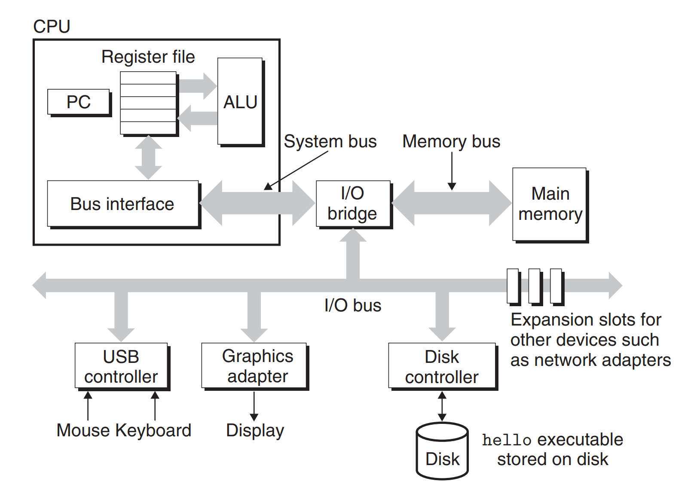

**图 1.4** 一个典型系统的硬件组成：  
CPU：中央处理单元  
ALU：算术逻辑单元  
PC：程序计数器  
USB：通用串行总线

#### 总线 (Buses)

整个系统的核心是一组电子管道，统称为**总线**，其负责在各个组件之间传输信息字节。通常，设计时总线会传输定长的字节块，称为**字（word）**。字中的字节数（即**字长**）是系统的重要参数，不同系统可能有所不同。当前，大多数系统的字长为 4 字节（32 位）或 8 字节（64 位）。在本书中，我们不预设字长的固定值，而是在特定的上下文中明确字的含义。

#### I/O 设备 (I/O Devices)

输入/输出（I/O）设备是系统与外部世界交互的桥梁。我们的示例系统包括四种 I/O 设备：键盘和鼠标作为用户输入设备，显示器作为用户输出设备，以及磁盘驱动器（简称磁盘）用于存储数据和程序。最初，执行程序 `hello` 存放在磁盘上。

每个 I/O 设备通过一个**控制器**或**适配器**与 I/O 总线相连。它们的主要区别在于封装方式：控制器通常集成在设备本身或系统的主板上，而适配器则是插在主板插槽中的扩展卡。无论是控制器还是适配器，它们的功能都是在 I/O 总线与 I/O 设备之间传递信息。

第 6 章将深入讨论 I/O 设备（如磁盘）的工作原理，而第 10 章将介绍如何使用 Unix I/O 接口在应用程序中访问这些设备，特别是网络设备等。尽管我们重点讲解网络设备，但这些技术同样适用于其他类型的设备。

#### 主存 (Main Memory)

**主存**是一种临时存储设备，用于存放正在执行的程序及其数据。从物理上来看，主存由一组**动态随机存取存储器（DRAM）** 芯片组成。从逻辑上讲，主存是一个线性的字节数组，每个字节都具有唯一地址（从零开始）。程序中的每条机器指令由不同数量的字节组成。与 C 程序中的变量类型对应，数据项的大小根据类型有所变化。例如，在运行 Linux 的 x86-64 系统中，`short` 类型占用 2 字节，`int` 和 `float` 类型占用 4 字节，`long` 和 `double` 类型占用 8 字节。

第 6 章将详细介绍 DRAM 存储技术及其如何组合形成主存。

#### 处理器 (Processor)

**中央处理单元（CPU）**，或简称**处理器**，是负责解释（或**执行**）存储在主存中的指令的引擎。处理器的核心是一个存储设备，大小为一个字（即**寄存器**），被称为**程序计数器（PC）**。在任何时刻，PC 都指向主存中的某条机器指令的地址。

从系统启动到关机，处理器一直根据程序计数器指向的地址执行指令，并更新程序计数器，使其指向下一条指令。虽然处理器的操作看似简单，按照严格的指令顺序执行，但实际上每条指令包含一系列步骤。处理器从程序计数器指向的内存读取指令，解析指令中的位，执行简单操作，然后更新 PC，指向下一条指令，下一条指令不一定与刚刚执行的指令相邻。

这些简单的操作主要围绕主存、**寄存器文件**和**算术逻辑单元**展开。寄存器文件是一个小型存储设备，包含多个单字长的寄存器，每个寄存器都有唯一的名称。**算术逻辑单元**则负责进行算术运算并生成新数据或地址值。以下是 CPU 在执行指令时可能进行的一些基本操作：

- **加载（Load）：** 从主存将一个字节或字复制到寄存器中，覆盖原有数据。
- **存储（Store）：** 将一个字节或字从寄存器复制到主存中的指定位置，覆盖该位置的原有数据。
- **操作（Operate）：** 将两个寄存器的内容送入 ALU，ALU 对这两个字进行算术运算，并将结果存回寄存器，覆盖原有内容。
- **跳转（Jump）：** 从指令中提取一个字，将其赋值给程序计数器（PC），覆盖原有的 PC 值。

尽管处理器的操作遵循指令集架构（ISA）的基本模型，现代处理器却采用了复杂的技术来加速指令的执行。因此，我们可以将处理器的**指令集架构**（定义机器指令的行为）与其**微体系结构**（描述处理器的具体实现）进行区分。第 3 章将探讨指令集架构的抽象概念，第 4 章将深入分析处理器的实际实现，第 5 章则聚焦于现代处理器的运行机制，并展示如何预测与优化机器语言程序的性能。

---

² "PC" 通常是 "个人计算机" 的缩写。然而，二者的区别应根据具体上下文来明确区分。

---

### 1.4.2 运行 hello 程序

有了系统硬件组成和操作的基本视图后，我们可以开始理解执行示例程序时的发生过程。虽然这里省略了许多细节，后续会进行补充，但当前我们已足够理解整体流程。

最初，shell 程序在执行指令，等待用户输入命令。当我们在键盘上输入字符串 `./hello` 时，shell 程序会逐个字符地将其读取到寄存器，并将其存放到内存中，如图 1.5 所示。

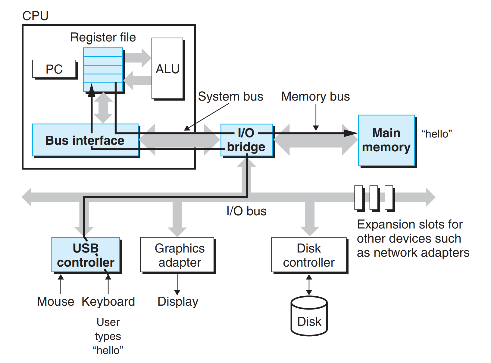

**图 1.5** 从键盘读取 `hello` 命令。

当我们按下回车键时，shell 知道命令输入已经完成。接着，shell 会执行一系列指令，加载可执行的 `hello` 文件，这些指令将 `hello` 目标文件中的代码和数据从磁盘复制到主存，数据包括最终会显示的字符串 `"hello, world\n"`。

通过一种称为**直接存储器访问**（DMA，详见第 6 章）的技术，数据可以直接从磁盘传输到主存，无需经过处理器。这个过程如图 1.6 所示。

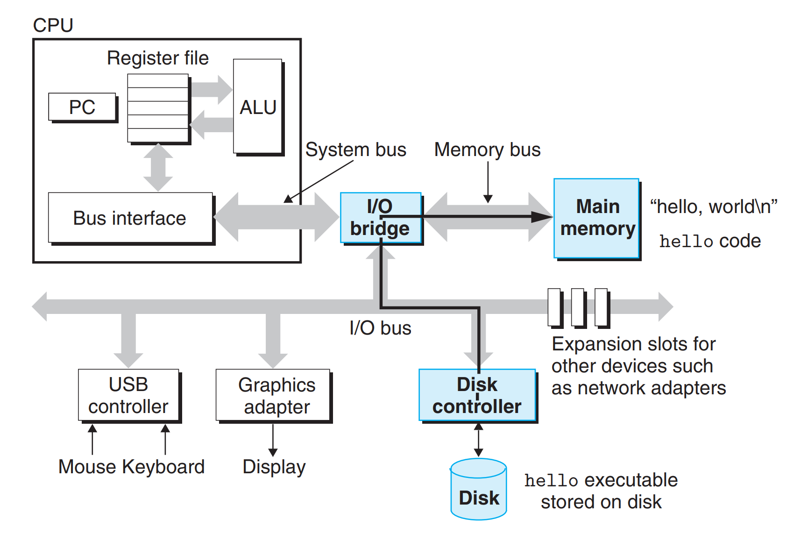

**图 1.6** 从磁盘加载可执行文件到主存。

当目标文件 `hello` 中的代码和数据被加载到主存后，处理器开始执行 `hello` 程序 `main` 函数中的机器语言指令。这些指令将 `"hello, world\n"` 字符串中的字节从主存复制到寄存器文件，再将其从寄存器文件传输到显示设备，最终显示在屏幕上。这个步骤如图 1.7 所示。

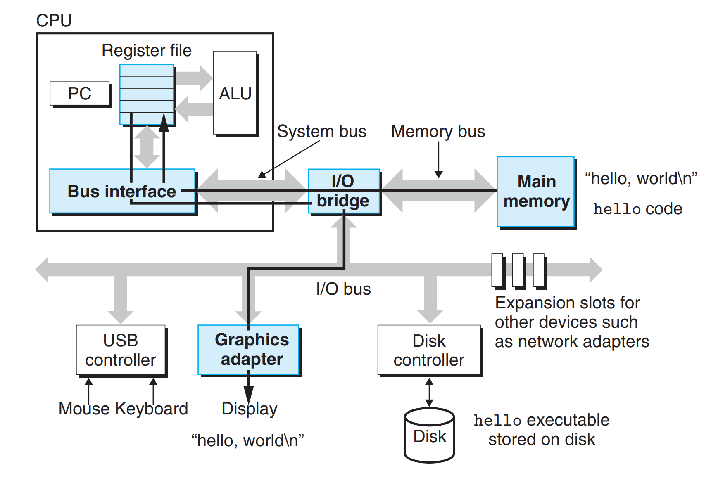

**图 1.7** 将输出字符串从存储器写入显示器。

---

## 1.5 高速缓存至关重要

这个简单的例子为我们提供了一个重要的启示：系统在将信息从一个地方传输到另一个地方时，往往会消耗大量的时间。`hello` 程序的机器指令最初存储在磁盘上，当程序加载时，这些指令会被复制到主存。接着，处理器在运行程序时，又会将指令从主存复制到处理器中。类似地，数据字符串 `"hello, world\n"` 最初存储在磁盘上，然后被复制到主存，最后从主存复制到显示设备。对于程序员来说，这些复制操作就是所谓的开销，它们会拖慢程序“真正”工作的速度。因此，系统设计者的主要目标之一，就是尽可能提高这些复制操作的效率，从而加速整体执行过程。

根据物理定律，较大存储设备的访问速度通常低于较小存储设备，高速设备的成本远高于其低速同类产品。例如，典型系统中的磁盘驱动器可能比主存大 1000 倍，但处理器从磁盘读取一个字的时间要比从主存读取的时间长 1000 万倍。

类似地，一个典型的寄存器文件只存储几百字节的数据，而主存可以存储几十亿字节。然而，处理器从寄存器文件读取数据的速度几乎是从主存读取的 100 倍。更为严重的是，随着半导体技术的进步，**处理器-存储器差距**正在不断扩大。提升处理器速度比提升主存速度更加容易且成本更低。

为了弥补处理器和主存之间的速度差异，系统设计者采用了更小、更快的存储设备——**高速缓存存储器**（cache memory）。它作为一个暂时的存放区域，用来存储处理器近期可能会用到的数据。图 1.8 展示了一个典型系统中的高速缓存存储器。位于处理器芯片上的 **L1 高速缓存**，其容量可以达到数万字节，访问速度几乎与寄存器文件一样快。更大的 **L2 高速缓存** 通过一条专用总线与处理器连接，容量可以是数十万到数百万字节。处理器访问 L2 高速缓存的时间大约是访问 L1 高速缓存时间的 5 倍，但仍然比访问主存快 5 到 10 倍。L1 和 L2 高速缓存通常使用**静态随机存取存储器（SRAM）**技术实现。更新更强大的系统甚至会有三级高速缓存：L1、L2 和 L3。高速缓存的工作原理基于**局部性原理**——即程序通常倾向于访问局部区域内的数据和代码。通过这一特性，系统可以提供大容量的存储器，同时保持高效的访问速度。将可能频繁访问的数据存储在高速缓存中，使得绝大多数存储操作能够通过高速缓存迅速完成。

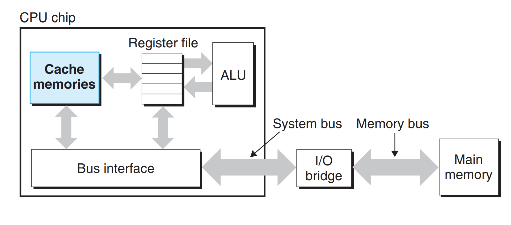

**图 1.8** 高速缓存存储器。

本书最重要的启示之一是：理解高速缓存存储器的程序员能够充分利用这些设备，显著提升程序性能。你将在第六章深入了解这些关键设备及其应用。

---

## 1.6 存储设备形成层次结构

在处理器与较大且较慢的设备（如主存）之间，插入一个更小更快的存储设备（如高速缓存存储器）的概念是普遍存在的。实际上，每个计算机系统中的存储设备都被组织成一个**存储器层次结构**，如图 1.9 所示。当我们从层次结构的顶部往下看，设备变得更慢、更大，而且每字节的成本也更低。寄存器文件位于层次结构的最顶端，称为第 0 层或 L0。我们展示了三级高速缓存 L1 到 L3，它们分别位于存储器层次结构的第 1 到第 3 层。主存位于第 4 层，依此类推。

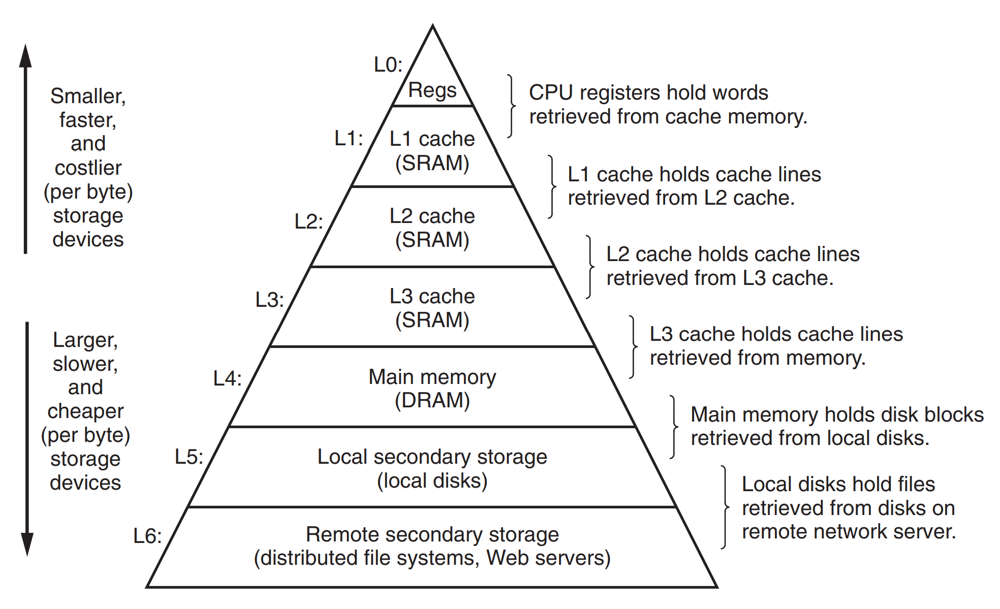

**图 1.9** 一个存储器层次结构的例子。

存储器层次结构的核心思想是，较高层次的存储器充当较低层次存储器的高速缓存。因此，寄存器文件是 L1 高速缓存的高速缓存，L1 和 L2 分别是 L2 和 L3 的高速缓存，而 L3 高速缓存则是主存的高速缓存。主存则作为磁盘的高速缓存。在一些具有分布式文件系统的网络系统中，本地磁盘充当存储在其他系统磁盘上的数据的高速缓存。

正如程序员可以通过理解不同高速缓存的工作原理来提高性能一样，他们也可以通过全面了解存储器的层次结构来进行性能优化。第 6 章将进一步探讨这一点。

---

## 1.7 操作系统管理硬件

让我们回到 `hello` 例子。当 shell 加载并运行 `hello` 程序时，以及当 `hello` 程序打印它的消息时，程序并没有直接访问键盘、显示器、磁盘或主存。它们依赖的是 **操作系统** 提供的服务。我们可以将操作系统看作是应用程序与硬件之间插入的一层软件，如图 1.10 所示。所有应用程序对硬件的操作尝试都必须通过操作系统。

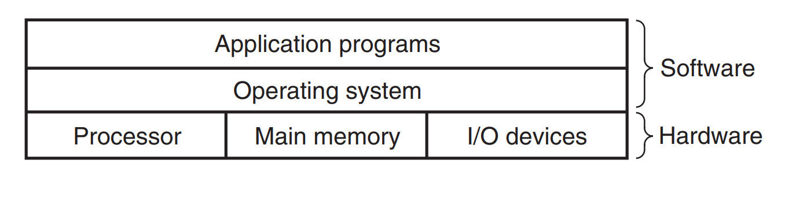

**图 1.10** 计算机系统的分层视图。

操作系统有两个主要目的：（1）保护硬件不被失控的应用程序误用；（2）向应用程序提供简单一致的机制，以控制那些复杂且通常大不相同的低级硬件设备。操作系统通过图 1.11 所示的几个基本抽象概念（**进程**、**虚拟内存**和**文件**）来实现这两个目标。如图所示，文件是对 I/O 设备的抽象，虚拟内存是对主存和磁盘 I/O 设备的抽象，进程则是对处理器、主存和 I/O 设备的抽象。接下来，我们将依次讨论每个概念。

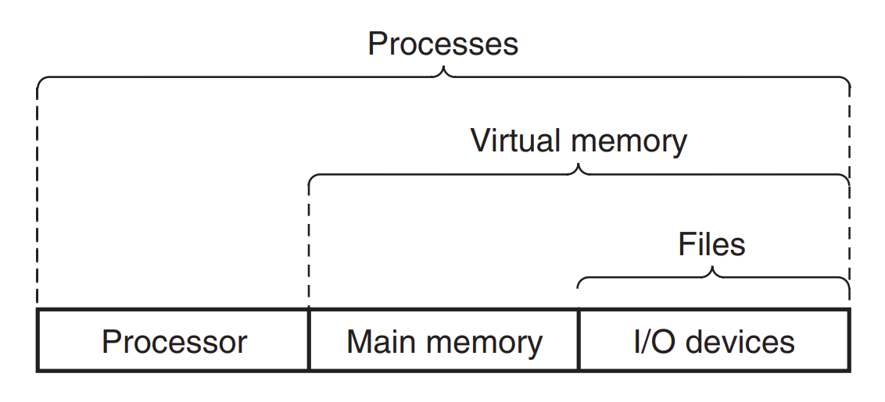

**图 1.11** 操作系统提供的抽象。


### 1.7.1 进程(Process)

当一个程序如 `hello` 在现代系统上运行时，操作系统会提供一种假象，使得系统看起来好像只有这个程序在运行。程序似乎独占地使用处理器、主存和 I/O 设备，处理器似乎在一条接一条地执行程序中的指令，且没有中断。而且，程序的代码和数据好像是系统内存中唯一的对象。这些假象由**进程**这一概念提供，进程是计算机科学中最重要和最成功的概念之一。

**进程**是操作系统对一个正在运行的程序的抽象。在一个系统中，可以同时运行多个进程，每个进程看起来都像是独占使用硬件。我们所说的**并发**运行，指的是一个进程的指令和另一个进程的指令交错执行。在大多数系统中，所需运行的进程数往往多于可供它们运行的 CPU 数量。

---

> **旁注：Unix、Posix 和标准 Unix 规范**
>
> 20 世纪 60 年代是大型复杂操作系统的时代，例如 IBM 的 OS/360 和 Honeywell 的 Multics 系统。尽管 OS/360 是历史上最成功的软件项目之一，但 Multics 拖延多年，始终未能获得广泛使用。贝尔实验室最初是 Multics 项目的合作伙伴，但因对项目复杂性和进展缓慢的担忧，于 1969 年退出。作为对不愉快的 Multics 经历的反应，一群贝尔实验室的研究人员——Ken Thompson、Dennis Ritchie、Doug McIlroy 和 Joe Ossanna——在 1969 年开始为 DEC PDP-7 计算机开发一个更简单的操作系统，完全用机器语言编写。新系统中的许多思想，例如层次文件系统和作为用户级进程的 shell 概念，都是从 Multics 借鉴而来，但以更小、更简单的方式实现。1970 年，Brian Kernighan 将这个新系统命名为 "Unix"，作为对 "Multics" 复杂性的一个玩笑。1973 年，内核用 C 语言重写，并于 1974 年向外界公布 [93]。
>
> 由于贝尔实验室以优惠条款向学校提供源代码，Unix 在大学中获得了大量追随者。最有影响力的工作来自加州大学伯克利分校，在 20 世纪 70 年代末和 80 年代初，伯克利的研究人员在一系列称为 Unix 4.xBSD（Berkeley Software Distribution）的版本中添加了虚拟内存和 Internet 协议。同时，贝尔实验室也发布了他们自己的版本，称为 System V Unix。其他供应商的版本，如 Sun Microsystems 的 Solaris 系统，都是从这些原始的 BSD 和 System V 版本衍生而来。
>
> 麻烦出现在 20 世纪 80 年代中期，Unix 供应商试图通过添加新的、常常是不兼容的功能来区分自己。为了应对这种趋势，IEEE 发起了一项标准化 Unix 的工作，后被 Richard Stallman 称为 "Posix"。结果产生了一系列标准，称为 Posix 标准，涵盖了 Unix 系统调用的 C 语言接口、shell 程序和工具、线程以及网络编程等问题。最近，另一项单独的标准化工作，称为 "标准 Unix 规范"，已与 Posix 联合起来，为 Unix 系统创建了一个统一的标准。由于这些标准化工作的成果，Unix 版本之间的差异基本消失了。

---

传统系统在同一时刻只能执行一个程序，而较新的多核处理器则可以同时执行多个程序。无论是哪种情况，单个 CPU 看起来都像是在同时执行多个进程，这是通过处理器在进程间切换来实现的。操作系统通过一种称为 **上下文切换** 的机制来实现这种交错执行。为了简化后续的讨论，我们只考虑包含单个 CPU 的单处理器系统，关于多处理器系统的内容将在 1.9.2 节进一步讨论。

操作系统负责跟踪进程运行所需的所有状态信息，这些状态被称为 **上下文**，其中包括许多关键信息，如程序计数器 (PC) 的当前值、寄存器文件以及主存的内容。在任何时刻，单处理器系统只能执行一个进程的代码。当操作系统决定将控制权从当前进程转移到某个新进程时，会进行 **上下文切换**，即保存当前进程的上下文、恢复新进程的上下文，并将控制权交给新进程。新进程将从它上次停止的地方继续执行。图 1.12 展示了 hello 程序的基本实现思路。

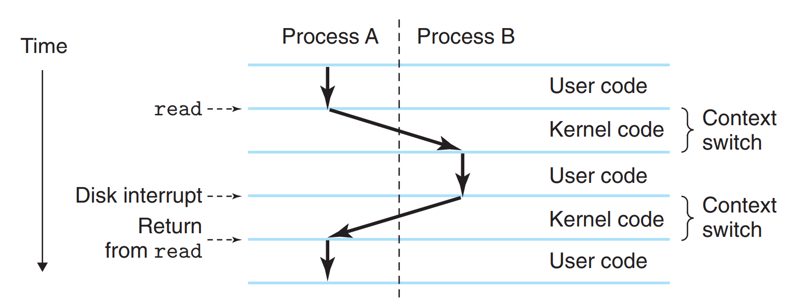

**图 1.12** 进程上下文切换示意图。

在我们的示例场景中，有两个并发进程：shell 进程和 hello 进程。最初，只有 shell 进程在运行，并等待命令行输入。当我们启动 hello 程序时，shell 通过调用一个专门的函数，即 **系统调用**，来请求操作系统执行该任务。系统调用将控制权交给操作系统，操作系统保存 shell 进程的上下文，创建一个新的 hello 进程及其上下文，然后将控制权交给新的 hello 进程。hello 进程终止后，操作系统恢复 shell 进程的上下文，并将控制权传回给 shell，shell 继续等待下一个命令行输入。

如图 1.12 所示，从一个进程切换到另一个进程的过程是由操作系统 **内核（kernel）** 管理的。内核是操作系统中常驻主存的部分。当应用程序需要操作系统提供某些服务（例如读写文件）时，它通过执行一条特殊的 **系统调用** 指令，将控制权交给内核。内核随后执行所请求的操作，并将控制权返回给应用程序。需要注意的是，内核并不是一个独立的进程，而是系统中负责管理所有进程的代码和数据结构的集合。

实现进程这一抽象概念需要低级硬件与操作系统软件的紧密协作。我们将在第 8 章深入探讨这一过程，以及应用程序如何创建和控制它们自己的进程。

### 1.7.2 线程(Thread)

尽管我们通常认为一个进程只有单一的控制流，但在现代系统中，一个进程实际上可以由多个执行单元组成，这些执行单元被称为**线程**。每个线程都在进程的上下文中运行，并共享相同的代码和全局数据。线程作为一种编程模型在现代计算中变得愈发重要，原因有三：首先，网络服务器往往需要并发；其次，多个线程之间共享数据比多个进程之间共享数据更加简便；最后，线程通常比进程更高效。在多处理器环境下，多线程能够加速程序运行，这一点将在第 1.9.2 节进行讨论。并发编程的基本概念，包括如何编写多线程程序，将在第 12 章中详细讲解。

### 1.7.3 虚拟内存(Virtual Memory)

**虚拟内存**是一个抽象概念，它为每个进程提供了一个假象：每个进程都在独占地使用主存。每个进程看到的内存都是一致的，这一内存空间称为**虚拟地址空间**。Linux 进程的虚拟地址空间如图 1.13 所示（其他 Unix 系统使用类似的布局）。在 Linux 中，地址空间的顶部区域专门为操作系统中的通用代码和数据保留，而地址空间的较低部分则存放用户进程定义的代码和数据。需要注意的是，图中的地址是从下往上增大的。

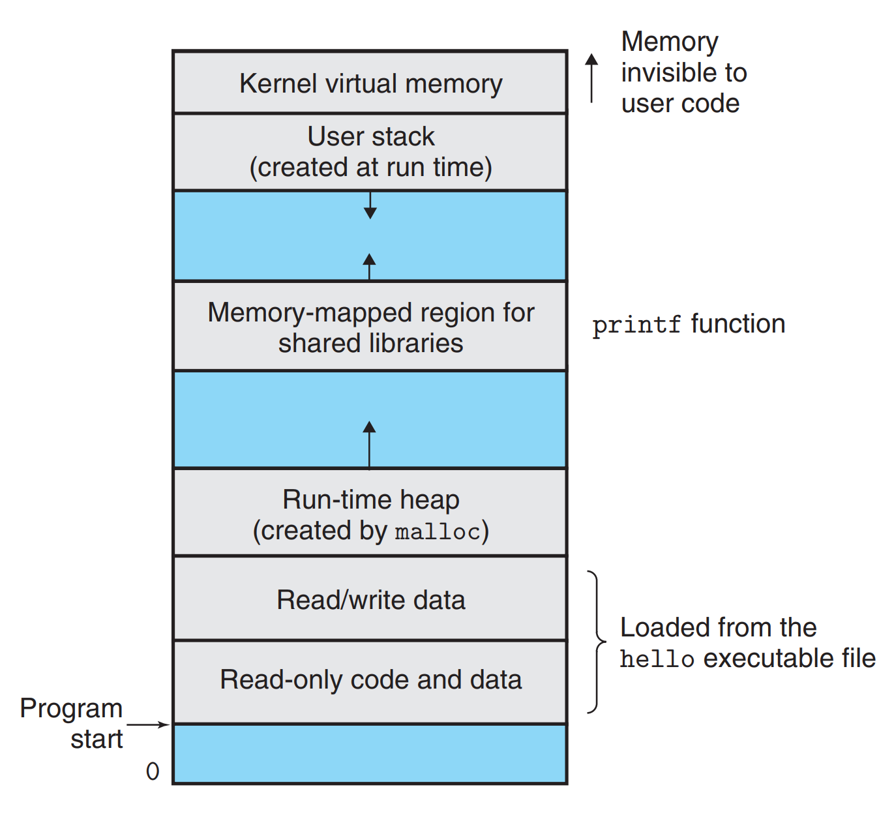

**图 1.13** 进程虚拟地址空间示意图（各区域并非按比例绘制）。

每个进程所见的虚拟地址空间由若干个区域构成，每个区域承担着特定的功能。虽然你将在本书后续章节中学到更多关于这些区域的细节，但现在简要了解每个区域的作用是有益的。以下是从最低地址开始，逐层介绍这些区域：

- **程序代码和数据。** 所有进程的代码从同一固定地址开始，紧接着是对应 C 全局变量的数据位置。代码和数据区是根据可执行目标文件的内容初始化的——以我们例子中的可执行文件 hello 为例。你将在第 7 章学习链接和加载时，进一步了解这一区域的具体实现。

- **堆。** 紧随代码和数据区后的是运行时**堆**。与代码和数据区在进程启动时即固定大小不同，堆可以在运行时动态地扩展和收缩，这通常是调用 C 标准库函数如 malloc 和 free 的结果。我们将在第 9 章深入研究如何管理虚拟内存中的堆。

- **共享库。** 地址空间的中间部分用于存放诸如 C 标准库和数学库等**共享库**的代码和数据。共享库是一个强大的概念，但也较为复杂。你将在第 7 章学习动态链接时，详细了解它们是如何运作的。

- **栈。** 位于用户虚拟地址空间顶部的是**用户栈**，编译器用它来实现函数调用。与堆类似，用户栈在程序执行过程中也能动态地扩展和收缩。特别地，每当调用一个函数时，栈会增长；当从函数返回时，栈则会收缩。第 3 章将带你了解编译器如何利用栈进行操作。

- **内核虚拟内存。** 地址空间的最顶部区域为内核保留。应用程序不能直接读取或写入该区域，也不能直接调用内核中定义的函数。相反，应用程序必须通过调用内核来执行这些操作。

虚拟内存的运行需要硬件与操作系统之间精密协作，尤其是对处理器生成的每个地址进行硬件翻译。基本的原理是将进程的虚拟内存内容存储在磁盘上，而使用主存作为磁盘的高速缓存。第 9 章将详细解释这一机制的工作原理，以及它为何对现代系统的高效运行至关重要。

### 1.7.4 文件(File)

**文件**本质上只是字节序列。无论是磁盘、键盘、显示器，还是网络，所有 I/O 设备都可以被视作文件。系统中的所有输入输出操作，均通过一组称为 **Unix I/O** 的系统调用来进行文件的读写。

这种简单而优雅的文件概念极具威力，因为它为应用程序提供了一个统一的视角，来访问系统中可能存在的各种 I/O 设备。例如，负责处理磁盘文件内容的程序员无需深入了解具体的磁盘技术。更进一步，同一程序可以在使用各类磁盘技术的系统上运行。有关 Unix I/O 的更多内容，你将在第 10 章中学习。

---

## 1.8 系统之间利用网络通信

到目前为止，我们一直把系统视为一个孤立的硬件和软件的集合体。在实践中，现代系统通常通过网络和其他系统连接在一起。从单一系统的角度来看，网络可以被视为另一个 I/O 设备，如图 1.14 所示。当系统将一串字节从主存复制到网络适配器时，数据流经过网络到达另一台机器，而不是本地磁盘驱动器。类似地，系统可以从其他机器读取数据，并将这些数据复制到它的主存。

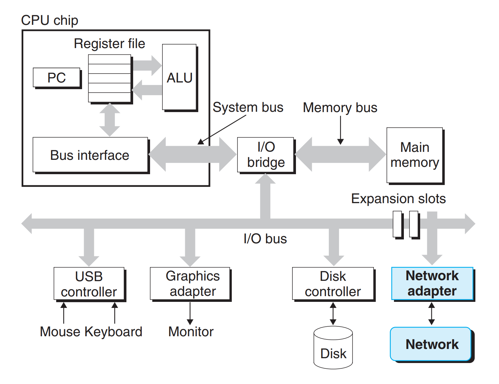

**图 1.14** 网络也是一种 I/O 设备。

随着像 Internet 这样的全球网络的普及，从一台主机复制信息到另一台主机已成为计算机系统最重要的用途之一。例如，电子邮件、即时消息、万维网、FTP 和 telnet 等应用都基于网络信息复制的能力。

---

> **旁注：Linux 项目**
>
> 1991 年 8 月，芬兰研究生 Linus Torvalds 谦逊地宣布了一个新的类 Unix 操作系统内核：
>
> ```
> From: torvalds@klaava.Helsinki.FI (Linus Benedict Torvalds)
> Newsgroups: comp.os.minix
> Subject: What would you like to see most in minix?
> Summary: small poll for my new operating system
> Date: 25 Aug 91 20:57:08 GMT
>
> Hello everybody out there using minix -
>
> I'm doing a (free) operating system (just a hobby, won't be big and
> professional like gnu) for 386(486) AT clones. This has been brewing
> since April, and is starting to get ready. I'd like any feedback on
> things people like/dislike in minix, as my OS resembles it somewhat
> (same physical layout of the file-system (due to practical reasons)
> among other things).
>
> I've currently ported bash(1.08) and gcc(1.40), and things seem to work.
> This implies that I'll get something practical within a few months, and
> I'd like to know what features most people would want. Any suggestions
> are welcome, but I won't promise I'll implement them :-)
>
> Linus (torvalds@kruuna.helsinki.fi)
> ```
>
> 正如 Torvalds 所说，他创建 Linux 的起点是 Minix，这是 Andrew S. Tanenbaum 为教学目的开发的操作系统 [113]。
>
> 后来的事情，正如人们所说，已成为历史。Linux 已发展成为一种技术和文化现象。通过与 GNU 项目的结合，Linux 项目开发出了一个完整的、Posix 兼容版本的 Unix 操作系统，包括内核和所有配套的基础设施。Linux 可用于各种计算机上，从手持设备到大型计算机。IBM 的一个小组甚至将 Linux 移植到了手表上！

---
回到我们的 hello 示例，我们可以使用熟悉的 telnet 应用程序在远程机器上运行 hello。假设我们通过本地机器上的 telnet 客户端连接远程机器上的 telnet 服务器。登录远程机器并运行一个 shell 后，远程 shell 会开始等待接收输入命令。从这时起，远程运行 hello 程序将遵循图 1.15 所示的五个基本步骤。

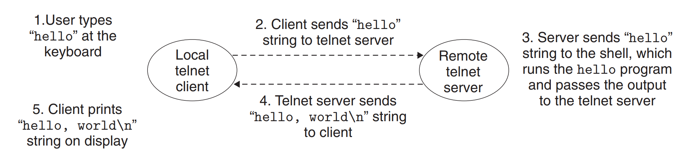

**图 1.15** 使用 telnet 通过网络远程运行 hello。

当我们在 telnet 客户端输入 hello 字符串并按下回车键时，客户端将该字符串发送到 telnet 服务器。telnet 服务器接收到字符串后，将其传递给远程 shell 程序。接着，远程 shell 运行 hello 程序，并将输出结果返回给 telnet 服务器。最后，telnet 服务器通过网络将输出字符串转发给 telnet 客户端，客户端将在本地终端显示该输出字符串。

这种客户端与服务器之间的交互模式是所有网络应用的典型模式。在第 11 章中，你将学习如何构建网络应用程序，并运用所学知识开发一个简单的 Web 服务器。

---

## 1.9 重要主题

这标志着我们对系统的初步探索的结束。从这次讨论中，应该理解的一个关键点是：系统不仅仅是硬件的堆砌。它是硬件与系统软件的有机结合，二者必须紧密协作，才能实现运行应用程序的最终目标。本书的后续章节将深入探讨硬件和软件的细节，并展示如何通过理解这些细节，编写出更高效、更可靠、更安全的程序。

在本章的结尾，我们将强调一些贯穿计算机系统各个领域的重要概念。我们将在全书的多个章节中，详细讨论这些概念的重要性。

### 1.9.1 阿姆达尔定律

Gene Amdahl，作为计算领域的早期先驱之一，曾就提升系统某一部分性能所产生的效果，提出过一个简洁而深刻的观点——这一观点被正式命名为**阿姆达尔定律**。该定律的核心思想在于：当我们对系统的某一部分进行性能加速时，这种加速对整个系统性能的提升效果，主要取决于两个关键因素：一是该部分在系统整体运行中所占的重要程度，二是该部分本身被加速的幅度。

考虑一个运行某应用程序需耗时 $T_{\text{old}}$ 的系统。假设该系统中某一部分占用的时间占比为 $\alpha$，我们对这一部分进行性能优化后，其性能提升至原来的 $k$ 倍。具体而言，该组件原本所需时间为 $\alpha T_{\text{old}}$，优化后仅需 $\frac{\alpha T_{\text{old}}}{k}$。基于此，系统的总执行时间可表示为：

$$
T_{\text{new}} = (1 - \alpha) T_{\text{old}} + \frac{\alpha T_{\text{old}}}{k} = T_{\text{old}} \left[ (1 - \alpha) + \frac{\alpha}{k} \right]
$$

由此，我们可以计算加速比 $S = \frac{T_{\text{old}}}{T_{\text{new}}}$ 为：

$$
S = \frac{1}{(1 - \alpha) + \frac{\alpha}{k}} \tag{1.1}
$$

举个例子，假设一个系统中某部分最初占用了 60% 的时间（$\alpha = 0.6$），并且被加速了 3 倍（$k = 3$）。此时，根据阿姆达尔定律计算得到的系统加速比为：

$$
S = \frac{1}{0.4 + \frac{0.6}{3}} = 1.67
$$

可以看到，尽管我们对系统的关键部分进行了实质性改进，但其加速效果并未完全体现在整个系统上，最终的净加速比远小于该部分自身的加速比。这正是阿姆达尔定律的核心观点——若要显著提升整个系统的运行效率，必须优先改进系统中时间占比最大的关键部分。

---

**练习题 1.1**（[答案见本章末尾](#习题-11-的解答)）

假设你是一名卡车司机，被雇佣来将一车土豆从爱达荷州的博伊西运到明尼苏达州的明尼阿波利斯，总距离 2500 公里。你估计在限速范围内，平均时速可以达到 100 公里/小时，全程需要 25 小时。

A. 你从新闻中得知蒙大拿州刚刚取消了限速，这段路程有 1500 公里。你的卡车可以达到 150 公里/小时。那么，你的行程加速比是多少？

B. 你可以从 [www.fasttrucks.com](http://www.fasttrucks.com) 网站为你的卡车购买一个新的涡轮增压器。该网站提供多种型号，但你希望跑得越快，价格就越贵。你需要将速度提升到多快，才能使整个行程的加速比达到 1.67 倍？

---

**练习题 1.2**（[答案见本章末尾](#习题-12-的解答)）

一家汽车制造公司承诺其客户，新发动机的下一版本将展示 4 倍的性能提升。你被分配完成这一任务。你发现，只有 90% 的发动机可以改进。为了达到整体性能目标，你需要将这部分改进多少（即 $k$ 的值是多少）？

---

> **旁注：表示相对性能**
>
> 表示性能提升的最好方式是以 $T_{\text{old}} / T_{\text{new}}$ 的比率形式，其中 $T_{\text{old}}$ 是原始版本所需时间，$T_{\text{new}}$ 是修改版本所需时间。如果有任何真正的改进，这将是一个大于 1.0 的数字。我们用后缀 '$\times$' 来表示这样一个比率，其中因子 "$2.2\times$" 读作 "2.2 倍"。
>
> 用百分比表示相对变化的方式在变化较小时效果很好，但其定义是模糊的。它应该是 $100 \cdot (T_{\text{old}} - T_{\text{new}}) / T_{\text{new}}$，还是 $100 \cdot (T_{\text{old}} - T_{\text{new}}) / T_{\text{old}}$，或者别的什么？此外，对于大的变化，它不够直观。说 "性能提高了 120%" 比简单地说性能提高了 $2.2 \times$ 更难理解。

---

阿姆达尔定律的一个有趣特例，是考虑当 $k$ 趋近于 $\infty$ 时的效果——这意味着我们可将系统的某个部分加速到所需时间可忽略不计的程度。此时可得：

$$
S_{\infty} = \frac{1}{(1 - \alpha)} \tag{1.2}
$$

例如，若我们能将系统中 60% 的部分加速至几乎无需耗时，最终的净加速比也仅为 $\frac{1}{0.4} = 2.5$ 倍。

阿姆达尔定律揭示了改进任意过程的通用原则。它不仅可应用于计算机系统的性能加速，还能为试图降低剃须刀片制造成本的企业、或是希望提高平均绩点的学生提供指导。不过在计算机领域，该定律的意义最为突出——我们常常需要以 2 倍及以上的因子提升性能，而这样高的性能提升，唯有通过优化系统的大部分环节才能实现。

### 1.9.2 并发和并行

纵观数字计算机的发展历程，有两个核心需求始终是推动其持续迭代的恒定动力：我们希望它们能处理更多任务，也希望它们能运行得更快。而当处理器能够同时处理更多事务时，这两个目标便能同步得到改善。我们用术语**并发（concurrency）** 来描述一个系统同时存在多个活动的通用概念，用术语**并行（parallelism）** 来指代通过并发技术提升系统运行速度的具体方式。并行能力可在计算机系统的多个抽象层次上得以利用，本文将重点聚焦三个核心层次，按照系统层次结构从高层到低层的顺序依次展开介绍。

#### 线程级并发

基于进程这一抽象概念，我们能够设计出可同时执行多个程序的系统，这也催生了**并发**技术。借助线程，我们甚至可以在单个进程内部实现多个控制流的并行执行。自 20 世纪 60 年代初“分时系统”问世以来，计算机系统便始终支持并发执行。传统意义上，这种并发执行仅为**模拟实现**——由单台计算机在其运行的多个进程之间快速切换完成，类似杂耍演员让多个球同时在空中保持飞舞状态。这种并发形式不仅支持多用户同时与系统交互（例如，当大量用户试图从同一台 Web 服务器获取页面时），还允许单个用户同时处理多项任务，比如同步打开 Web 浏览器窗口、文字处理程序与流媒体音乐播放器。直到近年来，绝大多数实际计算任务仍由单个处理器完成，即便该处理器需在多个任务间频繁切换，这种系统配置被称为**单处理器系统**。

当我们构建由多个处理器组成、且均在单个操作系统内核控制下运行的系统时，便得到了**多处理器系统**。此类系统自 20 世纪 80 年代起便应用于大规模计算场景，但随着**多核处理器**与**超线程**技术的兴起，其应用近年来愈发广泛。图 1.16 展示了不同处理器类型的分类情况。

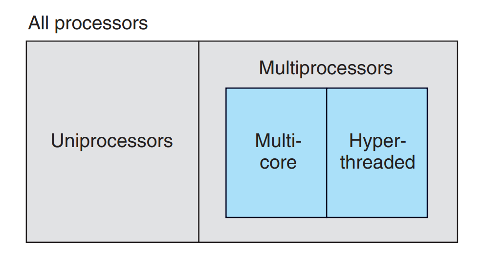

**图 1.16** 不同处理器配置的分类。随着多核处理器和超线程技术的普及，多处理器系统正逐渐成为主流配置。

**多核处理器**是在单个集成电路芯片上集成多个CPU（称为“核心”）的处理器。图 1.17 展示了典型多核处理器的组成结构：该芯片包含四个 CPU 核心，每个核心均配备专属的 L1 和 L2 高速缓存，其中每个 L1 高速缓存又分为两部分——一部分用于存储最近获取的指令，另一部分用于存储数据。这些核心共享更高层级的高速缓存，以及连接主存的接口。业界专家预测，未来单个芯片上将能够集成数十个乃至上百个核心。

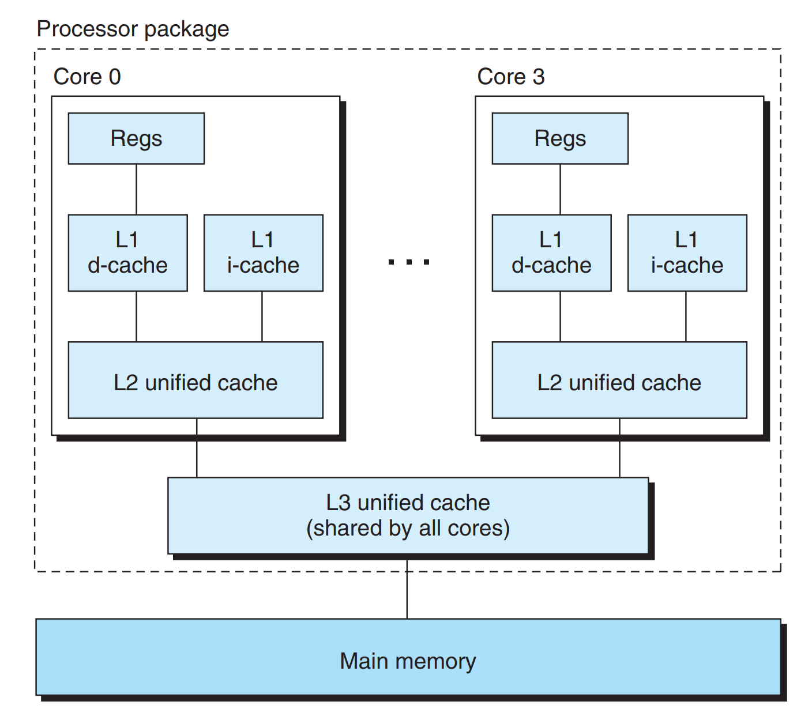

**图 1.17** 多核处理器组织结构。四个处理器核心集成在单个芯片上。

**超线程**（有时也称为**同时多线程**）是一项可让单个 CPU 执行多个控制流的技术。其核心原理是：为 CPU 硬件的部分组件（如程序计数器、寄存器文件）配备多个副本，而另一部分组件（如浮点运算执行单元）仅保留单个副本。传统处理器在不同线程间切换通常需要约 20000 个时钟周期，而超线程处理器可在每个时钟周期内动态决定执行哪个线程，从而使 CPU 能更充分地利用自身处理资源。例如，当一个线程需等待数据加载至高速缓存时，CPU 可同步执行另一个线程；以 Intel Core i7 处理器为例，其每个核心可支持两个线程运行，因此一个四核系统实际上能够并行执行八个线程。

多处理技术的应用可从两个维度提升系统性能：其一，减少了执行多个任务时模拟并发的需求——如前所述，即便是单人使用的个人计算机，也需同时处理多项活动；其二，可加快单个应用程序的运行速度，但前提是该程序需以可高效并行执行的多线程形式编写。因此，尽管并发原理已被提出并研究了 50 余年，但多核与超线程系统的问世，极大地激发了人们探索如何利用硬件提供的线程级并行性编写应用程序的需求。第 12 章将深入探讨并发技术，以及其在共享处理资源、实现程序更高程度并行执行中的应用。

#### 指令级并行

在更低的抽象层次上，现代处理器可同时执行多条指令，这种特性被称为**指令级并行**。例如，早期微处理器（如 1978 年的 Intel 8086）执行一条指令需消耗多个时钟周期（通常为 3~10 个）；而近期的处理器则能维持每时钟周期 2~4 条指令的执行速率。尽管单条指令从启动到完成的总耗时更长（可能达到 20 个及以上时钟周期），但处理器通过多种巧妙技术，可同时处理多达 100 条指令。在第 4 章中，我们将探讨**流水线**技术的应用：该技术将单条指令的执行过程拆解为多个步骤，处理器硬件则被组织为一系列对应阶段，每个阶段负责执行其中一个步骤。这些阶段可并行运作，同步处理不同指令的不同部分。我们将发现，一套相当简洁的硬件设计，便能维持接近每时钟周期1条指令的执行速率。

能够实现高于每时钟周期 1 条指令执行速率的处理器，被称为**超标量**处理器。当前大多数现代处理器均支持超标量操作。在第 5 章中，我们将介绍这类处理器的高级模型——应用程序员可借助该模型理解程序性能，并通过编写特定程序，使生成的代码获得更高程度的指令级并行性，进而提升程序运行速度。

#### 单指令、多数据（SIMD）并行

在最低抽象层次上，许多现代处理器配备了特殊硬件，允许单条指令触发多个操作并行执行，这种模式被称为**单指令、多数据（SIMD）并行**。例如，最新几代 Intel 和 AMD 处理器所搭载的指令，可并行完成 8 对单精度浮点数（对应 C 语言中的 float 数据类型）的加法运算。

SIMD 指令的设计初衷，主要是为了加速图像、声音及视频数据相关应用程序的处理效率。尽管部分编译器会尝试从 C 程序中自动提取 SIMD 并行性，但更可靠的方式是利用 `gcc` 等编译器支持的特殊向量数据类型进行编程。我们在 Web 附录 opt:simd 中详细描述了这种编程风格，作为第 5 章程序优化通用介绍的补充内容。

### 1.9.3 计算机系统中抽象的重要性

**抽象**的使用是计算机科学中最重要的概念之一。例如，良好编程实践的一个重要方面，就是为一组函数制定简洁的**应用程序接口（API）** ——它能让程序员直接使用代码，而无需深入探究其内部工作机制。不同编程语言提供的抽象支持，在形式和层次上各有差异，例如 Java 的类声明与 C 语言的函数原型，都是抽象能力的具体体现。

我们已经介绍了计算机系统中几种可见的抽象形式，如图 1.18 所示。在处理器层面，**指令集架构**为实际的处理器硬件提供了抽象层。借助这一抽象，机器代码程序的运行行为，仿佛是在一个一次仅执行一条指令的处理器上进行的。而底层硬件的结构要复杂得多：它会并行执行多条指令，但始终确保运行结果与简单的顺序执行模型保持一致。通过维持统一的执行模型，不同的处理器实现可以运行相同的机器代码，同时在成本与性能上呈现出不同的表现。

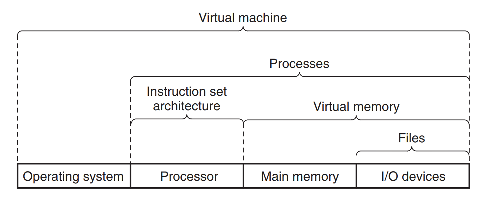

**图 1.18** 计算机系统提供的一些抽象。计算机系统的核心主题之一，就是在不同层次上提供抽象表示，以此隐藏实际实现的复杂性。

在操作系统层面，我们已介绍过三种核心抽象：**文件**是 I/O 设备的抽象，**虚拟内存**是程序存储器的抽象，**进程**则是正在运行的程序的抽象。在此基础上，我们将引入一种新的抽象——**虚拟机**，它能对整个计算机（包括操作系统、处理器和程序）进行抽象。虚拟机的概念由 IBM 于 20 世纪 60 年代提出，近年来随着计算机管理需求的升级，其重要性日益凸显：如今的计算机需运行为多个操作系统（如 Microsoft Windows、Mac OS X 和 Linux）或同一操作系统不同版本设计的程序，而虚拟机恰好能满足这一需求。

后续章节中，我们将重新回到这些抽象概念，展开更深入的探讨。

---

## 1.10 小结

计算机系统由硬件与系统软件协同构成，二者相互配合以运行各类应用程序。计算机内部的信息均以二进制位（bit）形式表示，其具体含义会根据所处上下文的不同而有所差异。程序需经过一系列翻译过程转换为不同形式：初始状态为 ASCII 文本格式的源代码，随后通过编译器与链接器的处理，最终转化为可直接执行的二进制文件。

处理器的核心功能是读取并解析存储在主存中的二进制指令。由于计算机在运行过程中，大部分时间都用于在内存、I/O 设备与 CPU 寄存器之间传输数据，因此系统中的存储设备被设计为层次化结构。该结构自上而下依次为：CPU 寄存器、多层硬件高速缓存、DRAM 主存以及磁盘存储。在这一层次结构中，位置越靠上的存储设备，读写速度越快，但单位存储成本也越高；同时，上层存储设备会作为下层存储设备的高速缓存，以提升数据访问效率。程序员通过深入理解并合理利用存储器层次结构的特性，能够有效优化 C 语言程序的运行性能。

操作系统内核是应用程序与计算机硬件之间的关键中介，它为应用程序提供了三个核心抽象概念：（1）文件，作为 I/O 设备的抽象表示；（2）虚拟内存，作为主存与磁盘存储的抽象表示；（3）进程，作为处理器、主存与 I/O 设备的抽象表示。

最后，网络为计算机系统提供了与其他外部系统通信的重要途径。从特定计算机系统的视角来看，网络设备本质上可视为一种特殊的 I/O 设备。

---

## 参考文献说明

Ritchie 撰写了关于 C 语言和 Unix 早期历史的生动亲身记述 [91, 92]。Ritchie 与 Thompson 发表了关于 Unix 的第一篇公开论文 [93]。Silberschatz、Galvin 及 Gagne [102] 则对不同 Unix 版本的发展历程进行了全面梳理与总结。GNU（www.gnu.org）和 Linux（www.linux.org）官方网站收录了大量关于二者的当前动态与历史资料。Posix 标准可通过 www.unix.org 网站查询获取。

最后，网络为计算机系统提供了与其他系统进行数据通信的重要途径。从特定系统的视角来看，网络本质上只是另一种 I/O 设备。

---

## 练习题答案

### 习题 1.1 的解答

这道题说明阿姆达尔定律适用的范围远不止计算机系统。

A. 根据公式 (1.1)，我们有 $\alpha = 0.6$，$k = 1.5$。更直接地计算，穿越蒙大拿的 1500 公里需要 10 小时，其余路程也需要 10 小时。这将给出 $25/(10 + 10) = 1.25\times$ 的加速比。

B. 根据公式 (1.1)，我们有 $\alpha = 0.6$，要求 $S = 1.67$，由此可以解出 $k$。更直接地计算，要将行程加速 $1.67\times$，我们必须将总时间减少到 15 小时。蒙大拿以外的路段仍需要 10 小时，因此我们必须用 5 小时穿越蒙大拿。这要求以 300 公里/小时的速度行驶，对于卡车来说这相当快！

### 习题 1.2 的解答

阿姆达尔定律最好通过一些例子来理解。这道题要求你从一个不寻常的角度来看公式 (1.1)。这道题是公式的简单应用。给定 $S = 4$，$\alpha = 0.9$，你必须求解 $k$：

$$
4 = \frac{1}{(1 - 0.9) + 0.9/k}
$$

$$
0.4 + \frac{3.6}{k} = 1.0
$$

$$
k = 6.0
$$

---

## 本章小结

本章介绍了计算机系统的基本概念和组成部分，主要要点包括：

- **系统组成**：计算机系统由硬件和系统软件共同协作来运行应用程序。
- **信息表示**：所有信息（代码、数据）都以位的形式表示，不同的上下文决定了位的解释方式。
- **编译系统**：程序从源代码到可执行文件需要经过预处理、编译、汇编、链接四个阶段。
- **硬件组织**：系统由总线、I/O 设备、主存和处理器组成，通过总线互连。
- **存储层次**：存储设备形成从寄存器到远程存储的层次结构，利用高速缓存来弥补速度差异。
- **操作系统抽象**：操作系统提供进程、虚拟内存和文件三个核心抽象来管理硬件资源。
- **并发与并行**：包括线程级并发、指令级并行和 SIMD 并行三个层次。
- **阿姆达尔定律**：要显著加速整个系统，必须改进系统中相当大的一部分。其数学表达为：

$$
S = \frac{1}{(1 - P) + \frac{P}{N}}
$$

其中，\( S \) 表示加速比，\( P \) 表示可以并行化的部分比例，\( N \) 表示加速部分的倍数。
