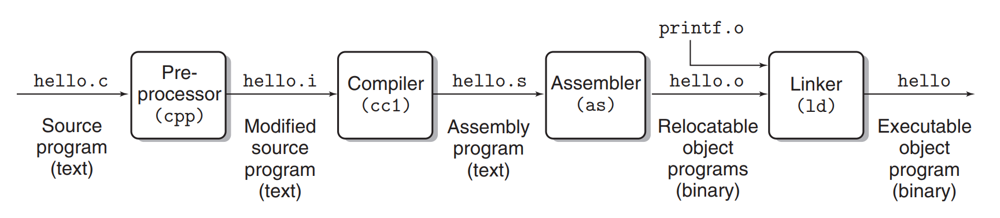

# 第01章 计算机系统漫游

> 原书: Chapter 01 - A Tour of Computer Systems

## 本章概述

本章通过追踪一个简单的 hello 程序的生命周期，介绍计算机系统的主要概念和术语。我们将了解程序是如何被编译、执行的，以及硬件和操作系统如何协同工作来运行应用程序。

---

**目录**

- 1.1 [信息就是位 + 上下文](#11-信息就是位--上下文)
- 1.2 [程序被其他程序翻译成不同的形式](#12-程序被其他程序翻译成不同的形式)
- 1.3 [了解编译系统如何工作是大有裨益的](#13-了解编译系统如何工作是大有裨益的)
- 1.4 [处理器读取并解释存储在内存中的指令](#14-处理器读取并解释存储在内存中的指令)
- 1.5 [高速缓存至关重要](#15-高速缓存至关重要)
- 1.6 [存储设备形成层次结构](#16-存储设备形成层次结构)
- 1.7 [操作系统管理硬件](#17-操作系统管理硬件)
- 1.8 [系统之间利用网络通信](#18-系统之间利用网络通信)
- 1.9 [重要主题](#19-重要主题)
- 1.10 [小结](#110-小结)

---

计算机系统由硬件和系统软件组成，它们共同协作以运行应用程序。尽管系统的具体实现方式随着时间的推移不断演变，但其内在的基本概念始终不变。所有计算机系统都有相似的硬件和软件组件，它们执行着相似的功能。本书旨在帮助那些希望通过了解这些组件如何协作、以及它们如何影响程序的正确性和性能，来提升编程技能的程序员。

你即将踏上一段激动人心的旅程。如果你全心投入本书中的概念学习，你将走上成为稀有的“高能程序员”之路，获得通过深入理解底层计算机系统及其对应用程序影响所带来的丰厚回报。

在本书中，你将学到许多实用技能，比如如何避免由计算机数字表示方式引起的奇异数值错误。你将掌握如何利用现代处理器和内存系统的设计，采用巧妙的技巧来优化 C 代码。你将深入理解编译器如何实现过程调用，以及如何利用这些知识来避免缓冲区溢出漏洞，这些漏洞一直是网络和互联网软件的安全隐患。你将学会如何识别并规避链接过程中那些令大多数程序员困惑的棘手错误。你还将学会如何编写自己的 Unix shell、动态内存分配包，甚至是自己的 Web 服务器。并且，你将了解并发的挑战和陷阱——随着多核处理器被集成到单一芯片中，这一主题愈加重要。

在 Kernighan 和 Ritchie 的经典著作《C programming language》 [61] 中，他们通过图 1.1 所示的简单 hello 程序向读者介绍了 C 语言。虽然 hello 是一个非常简单的程序，但系统的每个主要部分必须协调工作才能成功运行它。从某种角度来说，本书的目标就是帮助你理解在系统上运行 hello 程序时，究竟发生了什么，为什么会发生。

我们将通过追踪 hello 程序的生命周期来开始对系统的学习——从程序员创建程序开始，到程序在系统上运行，打印出简单的消息并终止。我们会简要介绍程序生命周期中关键的概念、术语和组件，后续章节将深入探讨这些内容。


**代码示例：code/intro/hello.c**

```c
#include <stdio.h>

int main()
{
    printf("hello, world\n");
    return 0;
}
```

**图 1.1** hello 程序。（来源：[60]）

---


**图 1.2** `hello.c` 的 ASCII 文本表示。

---

## 1.1 信息就是位 + 上下文

我们的 hello 程序的生命周期始于一个**源程序**（或**源文件**），该程序由程序员使用编辑器创建，并保存为文本文件，名为 `hello.c`。源程序是由值为 0 和 1 的位组成的序列，每 8 位组成一个**字节**，每个字节代表程序中的一个文本字符。

大多数计算机系统使用 ASCII 标准来表示文本字符，这种方式使用一个唯一的单字节整数值来表示每个字符。¹ 例如，图 1.2 展示了 `hello.c` 程序的 ASCII 表示。

`hello.c` 程序以字节序列的方式存储在文件中，每个字节都有一个整数值，表示某个字符。例如，第一个字节的整数值是 35，对应字符 '#'，第二个字节的整数值是 105，对应字符 'i'，以此类推。需要注意的是，每行文本都以不可见的换行符 '\n' 结尾，其对应的整数值是 10。像 `hello.c` 这样的文件，由 ASCII 字符组成，称为**文本文件**；其他类型的文件则称为**二进制文件**。

`hello.c` 的表示方法体现了一个基本思想：系统中的所有信息——包括磁盘文件、内存中的程序、内存中的用户数据以及网络上传输的数据——都是通过一串位来表示的。区分不同数据对象的唯一方法是根据我们读取这些对象时的上下文。例如，在不同的上下文中，相同的字节序列可能表示一个整数、浮点数、字符串或机器指令。

作为程序员，我们需要理解数字的机器表示方式，因为它们与实际的整数和实数有所不同。它们是有限的近似值，可能以意想不到的方式表现出来。这个基本思想将在第 2 章中详细探讨。

---

> **旁注：C 编程语言的起源**
>
> C 语言由贝尔实验室的 Dennis Ritchie 于 1969 至 1973 年间开发。1989 年，美国国家标准协会（ANSI）批准了 ANSI C 标准，随后该标准的制定和维护工作转交给国际标准组织（ISO）。这些标准定义了 C 语言及其标准库（C 标准库）。Kernighan 和 Ritchie 在他们的经典著作中对 ANSI C 进行了阐述，这本书被人们亲切地称为 "K&R" [61]。用 Ritchie 的话来说 [92]，C 语言“古怪、有缺陷，但却取得了巨大的成功”。那么，为什么它会如此成功呢？
>
> - **C 与 Unix 操作系统的紧密关系。** C 最初作为 Unix 的系统编程语言被开发出来。Unix 内核（操作系统的核心部分）以及所有相关工具和库都是用 C 编写的。20 世纪 70 年代末和 80 年代初，Unix 在大学中广泛传播，许多人接触到 C 并发现它非常有吸引力。由于 Unix 完全是用 C 编写的，因此它可以轻松移植到新的计算机上，从而为 C 语言和 Unix 操作系统赢得了更广泛的受众。
>
> - **C 是一种小巧而简洁的语言。** C 的设计由单一设计者负责，而非委员会，这使得其设计简洁、一致，且没有多余的负担。K&R 这本书仅用 261 页便详细描述了完整的语言和标准库，并提供了大量的示例与练习。C 的简洁性使得它易于学习，并能够方便地移植到不同的计算机平台上。
>
> - **C 是为实际目的而设计的。** C 被设计用来实现 Unix 操作系统。后来，其他开发者发现他们同样可以使用 C 编写各类程序，而不受语言本身的限制。
>
> C 语言是系统级编程的首选工具，且衍生出了大量基于 C 的应用级程序。然而，它并非完美无缺。C 的指针常常成为混乱和编程错误的根源。此外，C 缺乏对有用的抽象（如类、对象和异常）的显式支持。较新的编程语言，如 C++ 和 Java，针对应用级程序解决了这些问题。

---

¹ 其他编码方法用于表示非英语文本。详情请参见第 86 页的旁注。

---

## 1.2 程序被其他程序翻译成不同的形式

hello 程序的生命周期始于一个高级 C 程序，因为这种形式易于人类阅读和理解。然而，为了在系统上运行 `hello.c`，各条 C 语句必须被其他程序翻译成一系列低级**机器语言指令**。这些指令随后被打包成一种称为**可执行目标程序**的格式，并以二进制磁盘文件的形式保存。目标程序也被称为**可执行目标文件**。

在 Unix 系统中，从源文件到目标文件的转换是由**编译器驱动程序**完成的：

```bash
linux> gcc -o hello hello.c
```

在此过程中，gcc 编译器驱动程序读取源文件 `hello.c`，并将其翻译为可执行目标文件 `hello`。该翻译过程分为四个阶段，如图 1.3 所示。执行这四个阶段的程序（**预处理器**、**编译器**、**汇编器**和**链接器**）共同构成了**编译系统**。



**图 1.3** 编译系统。

```
hello.c → [预处理器(cpp)] → hello.i → [编译器(cc1)] → hello.s → [汇编器(as)] → hello.o → [链接器(ld)] → hello
源程序                  修改后的源程序                 汇编程序             可重定位目标程序      ↑    可执行目标程序
(文本)                     (文本)                    (文本)                  (二进制)         ↑       (二进制)
                                                                                           ↑
                                                                                        printf.o
```

- **预处理阶段**  
  预处理器（cpp）根据以字符 `#` 开头的命令修改原始的 C 程序。例如，`hello.c` 第 1 行的 `#include <stdio.h>` 命令告诉预处理器读取系统头文件 `stdio.h` 的内容，并将其直接插入程序文本中。结果是另一个 C 程序，通常以 `.i` 作为文件扩展名。

- **编译阶段**  
  编译器（cc1）将文本文件 `hello.i` 翻译成文本文件 `hello.s`，它包含一个汇编语言程序。该程序包含 `main` 函数的定义，如下所示：

    ```asm
    main:
        subq    $8, %rsp
        movl    $.LC0, %edi
        call    puts
        movl    $0, %eax
        addq    $8, %rsp
        ret
    ```
    上述定义中，第 2~7 行的每一行都描述了一条低级机器语言指令的文本形式。汇编语言非常有用，因为它为不同高级语言的编译器提供了通用的输出格式。例如，C 编译器和 Fortran 编译器都生成相同汇编语言的输出文件。

- **汇编阶段**
接下来，汇编器（as）将 `hello.s` 翻译成机器语言指令，把这些指令打包成一种叫做 **可重定位目标程序** 的格式，并将结果保存在目标文件 `hello.o` 中。这个文件是一个二进制文件，包含 17 个字节来编码 `main` 函数的指令。如果我们用文本编辑器查看 `hello.o`，它看起来会像乱码一样。

- **链接阶段**
  注意，我们的 `hello` 程序调用了 `printf` 函数，它是每个 C 编译器都提供的标准 C 库中的一个函数。`printf` 函数存在于一个名为 `printf.o` 的单独预编译好的目标文件中，这个文件必须以某种方式合并到我们的 `hello.o` 程序中。链接器（ld）负责处理这种合并。结果是 `hello` 文件，它是一个 **可执行目标文件**（或简称为 **可执行文件**），可以被加载到内存中，由系统执行。

---

> **旁注：GNU 项目**
>
> Gcc 是由 GNU（GNU's Not Unix 的缩写）项目开发的许多有用工具之一。GNU 项目是 Richard Stallman 在 1984 年发起的一个免税慈善项目，其宏伟目标是开发一个完整的类 Unix 系统，其源代码不受任何关于如何修改或发布的限制。GNU 项目已经开发出了一个环境，包含 Unix 操作系统的所有主要组件，除了内核，内核由 Linux 项目单独开发。GNU 环境包括 emacs 编辑器、gcc 编译器、gdb 调试器、汇编器、链接器、处理二进制文件的工具，以及其他组件。gcc 编译器已经发展到支持许多不同的语言，能够为许多不同的机器生成代码。支持的语言包括 C、C++、Fortran、Java、Pascal、Objective-C 和 Ada。
>
> GNU 项目是一项非凡的成就，但它常常被忽视。现代开源运动（通常与 Linux 相关联）在思想上起源于 GNU 项目的自由软件概念（这里的"free"是指"言论自由"，而不是"免费啤酒"）。此外，Linux 的大部分流行度要归功于 GNU 工具，这些工具为 Linux 内核提供了运行环境。

---

## 1.3 了解编译系统如何工作是大有裨益的

对于像 `hello.c` 这样简单的程序，我们可以依赖编译系统生成正确且高效的机器代码。然而，程序员需要了解编译系统如何工作有一些重要原因：

- **优化程序性能。** 现代编译器都是复杂的工具，通常会生成良好的代码。作为程序员，我们不需要为了写出高效的代码就去了解编译器的内部工作原理。然而，为了在 C 程序中做出好的编程决策，我们确实需要对机器级代码以及编译器如何将不同的 C 语句翻译成机器代码有一个基本的了解。例如，switch 语句总是比一系列 if-else 语句更高效吗？一个函数调用的开销有多大？while 循环比 for 循环更高效吗？指针引用比数组索引更高效吗？为什么如果我们把结果累加到一个局部变量而不是一个通过引用传递的参数，循环就会运行得快得多？当我们简单地重新排列算术表达式中的括号时，函数怎么就会运行得更快？

  在第 3 章中，我们将介绍 x86-64，这是近几代 Linux、Macintosh 和 Windows 计算机所使用的机器语言。我们将描述编译器如何将不同的 C 语言结构翻译成这种语言。在第 5 章中，你将学会如何通过对 C 代码进行简单的转换来调优 C 程序的性能，这些转换可以帮助编译器更好地完成工作。在第 6 章中，你将了解内存系统的层次性质，C 编译器如何将数据数组存储在内存中，以及 C 程序如何利用这些知识来更高效地运行。

- **理解链接时错误。** 根据我们的经验，一些最令人困惑的编程错误都与链接器的操作有关，尤其是当你试图构建大型软件系统时。例如，链接器报告它无法解析一个引用意味着什么？静态变量和全局变量有什么区别？如果你在不同的 C 文件中定义了两个同名的全局变量会发生什么？静态库和动态库有什么区别？为什么我们在命令行上列出库的顺序很重要？更可怕的是，为什么有些链接相关的错误直到运行时才会出现？你将在第 7 章中学到这些问题的答案。

- **避免安全漏洞。** 多年来，缓冲区溢出漏洞是造成网络和 Internet 服务器安全漏洞的主要原因。存在这些漏洞是因为太少的程序员理解需要谨慎地限制他们从不受信任的来源接受的数据的数量和形式。学习安全编程的第一步是理解数据和控制信息存储在程序栈上的方式所带来的后果。在第 3 章中，作为汇编语言学习的一部分，我们将介绍栈的规则和缓冲区溢出漏洞。我们还将学习程序员、编译器和操作系统可以用来减少攻击威胁的方法。

---

## 1.4 处理器读取并解释存储在内存中的指令

此时，我们的 `hello.c` 源程序已经被编译系统翻译成了一个名为 hello 的可执行目标文件，并被存放在磁盘上。要在 Unix 系统上运行该可执行文件，我们将它的名字输入到称为 **shell** 的应用程序中：

```bash
linux> ./hello
hello, world
linux>
```

shell 是一个命令行解释器，它打印一个提示符，等待你输入一个命令行，然后执行这个命令。如果命令行的第一个单词不是一个内置的 shell 命令，那么 shell 就假定这是一个可执行文件的名字，它将加载并运行这个程序。所以在这个例子中，shell 加载并运行 hello 程序，然后等待它终止。hello 程序在屏幕上打印它的消息，然后终止。shell 接着打印一个提示符并等待下一个输入的命令行。

### 1.4.1 系统的硬件组成

为了理解运行 hello 程序时发生了什么，我们需要了解一个典型系统的硬件组成，如图 1.4 所示。这幅图是以最近的 Intel 系统系列为模型画出的，但所有系统都有相似的外观和感觉。现在不必担心这幅图的复杂性。在本书的后续章节中，我们会分阶段介绍它的各个细节。

**图 1.4** 一个典型系统的硬件组成。CPU：中央处理单元，ALU：算术逻辑单元，PC：程序计数器，USB：通用串行总线。

```
                            CPU 芯片
                    ┌─────────────────────┐
                    │  寄存器文件         │
                    │  ┌──┐              │
                    │  │PC│    ALU       │
                    │  └──┘              │
                    │     总线接口        │
                    └─────────┬──────────┘
                              │
    ┌─────────────────────────┴───────────────────────────┐
    │                      系统总线                        │
    └─────────────────────────┬───────────────────────────┘
                              │
                         ┌────┴────┐
                         │ I/O 桥  │
                         └────┬────┘
                              │
    ┌─────────────────────────┴───────────────────────────┐
    │                      内存总线                        │
    └─────────────────────────┬───────────────────────────┘
                              │
                        ┌─────┴─────┐
                        │  主存     │
                        └───────────┘

    ┌─────────────────────────────────────────────────────┐
    │                       I/O 总线                       │
    └───┬───────┬───────┬───────┬───────┬───────┬────────┘
        │       │       │       │       │       │
     ┌──┴──┐ ┌──┴──┐ ┌──┴──┐   │   ┌───┴───┐ ┌─┴─┐
     │USB  │ │图形 │ │ 磁盘 │   │   │扩展槽  │ │...│
     │控制器│ │适配器│ │控制器│   │   │(网络等)│
     └──┬──┘ └──┬──┘ └──┬──┘   │   └───────┘
        │       │       │      │
     ┌──┴──┐ ┌──┴──┐ ┌──┴──┐ ┌─┴─┐
     │鼠标 │ │显示器│ │磁盘  │ │键盘│
     │键盘 │ │     │ │     │ └───┘
     └─────┘ └─────┘ └─────┘
```

#### 总线

贯穿整个系统的是一组电子管道，称为**总线**，它在组件之间来回传送信息字节。通常总线被设计成传送定长的字节块，也就是**字（word）**。字中的字节数（即**字长**）是一个基本的系统参数，各个系统不尽相同。现在大多数机器字长要么是 4 字节（32 位），要么是 8 字节（64 位）。在本书中，我们不假设字长有固定的定义。相反，我们会在需要定义的上下文中说明字的含义。

#### I/O 设备

输入/输出（I/O）设备是系统与外部世界的联系通道。我们的示例系统有四个 I/O 设备：作为用户输入的键盘和鼠标，作为用户输出的显示器，以及用于长期存储数据和程序的磁盘驱动器（简称磁盘）。最初，可执行程序 hello 就存放在磁盘上。

每个 I/O 设备都通过一个**控制器**或**适配器**与 I/O 总线相连。两者的区别主要在于封装方式。控制器是置于设备本身或系统的主印刷电路板（通常称为**主板**）上的芯片组。适配器则是一块插在主板槽上的卡。无论如何，它们的功能都是在 I/O 总线和 I/O 设备之间来回传送信息。

第 6 章将更详细地讨论 I/O 设备（如磁盘）如何工作。在第 10 章中，你将学会如何使用 Unix I/O 接口在应用程序中访问设备。我们将特别关注网络这类特别有趣的设备，但这些技术也可以推广到其他类型的设备。

#### 主存

**主存**是一个临时存储设备，在处理器执行程序时，用来存放程序和程序处理的数据。从物理上来说，主存是由一组**动态随机存取存储器（DRAM）** 芯片组成的。从逻辑上来说，存储器是一个线性的字节数组，每个字节都有唯一的地址（数组索引），地址从零开始。一般来说，组成程序的每条机器指令都由不同数量的字节组成。与 C 程序变量相对应的数据项的大小是根据类型变化的。例如，在一台运行 Linux 的 x86-64 机器上，short 类型的数据需要 2 个字节，int 和 float 类型需要 4 个字节，而 long 和 double 类型需要 8 个字节。

第 6 章将更详细地介绍像 DRAM 芯片这样的存储器技术如何工作，以及它们是如何组合起来构成主存的。

#### 处理器

**中央处理单元（CPU）**，或简称**处理器**，是解释（或**执行**）存储在主存中的指令的引擎。处理器的核心是一个大小为一个字的存储设备（或**寄存器**），称为**程序计数器（PC）**。在任何时刻，PC 都指向（包含某条）主存中的机器语言指令的地址。²

从系统通电开始，直到系统断电，处理器一直在不断地执行程序计数器指向的指令，并更新程序计数器，使其指向下一条指令。处理器看起来是按照一个非常简单的指令执行模型来操作的，这个模型是由它的**指令集架构**定义的。在这个模型中，指令按照严格的顺序执行，而执行一条指令包含执行一系列的步骤。处理器从程序计数器指向的内存处读取指令，解释指令中的位，执行指令指示的某个简单操作，然后更新 PC，使其指向下一条指令，这条指令并不一定和在内存中刚刚执行的指令相邻。

这些简单的操作只有几个，它们围绕着主存、**寄存器文件**和**算术逻辑单元（ALU）** 进行。寄存器文件是一个小的存储设备，由一些单字长的寄存器组成，每个寄存器都有唯一的名字。ALU 计算新的数据和地址值。下面是 CPU 可能在指令的请求下执行的一些简单操作的例子：

- **加载（Load）：** 从主存复制一个字节或一个字到寄存器，覆盖寄存器原来的内容。
- **存储（Store）：** 从寄存器复制一个字节或一个字到主存的某个位置，覆盖这个位置原来的内容。
- **操作（Operate）：** 把两个寄存器的内容复制到 ALU，ALU 对这两个字做算术运算，并将结果存放到一个寄存器中，覆盖该寄存器原来的内容。
- **跳转（Jump）：** 从指令本身中抽取一个字，并将这个字复制到程序计数器（PC）中，覆盖 PC 中原来的值。

我们说处理器看起来是它的指令集架构的简单实现，但实际上现代处理器使用了更加复杂的机制来加速程序执行。因此，我们可以区分处理器的**指令集架构**（描述每条机器代码指令的效果）和它的**微体系结构**（描述处理器实际上是如何实现的）。当我们在第 3 章学习机器代码时，我们会考虑机器的指令集架构提供的抽象。第 4 章会更多地介绍处理器实际上是如何实现的。第 5 章描述了一种现代处理器工作方式的模型，这个模型使我们可以预测和优化机器语言程序的性能。

---

² PC 也是"个人计算机"的常用缩写。然而，两者的区别应该在上下文中很清楚。

---

### 1.4.2 运行 hello 程序

有了系统硬件组成和操作的这个简单视图，我们可以开始理解运行示例程序时发生了什么。这里我们必须省略很多细节，稍后会补充，但现在我们满足于对全局有个了解。

最初，shell 程序正在执行它的指令，等待我们输入命令。当我们在键盘上输入字符串 "./hello" 时，shell 程序将每个字符逐一读入寄存器，再把它存放到内存中，如图 1.5 所示。

**图 1.5** 从键盘读取 hello 命令。

当我们在键盘上敲回车键时，shell 知道我们已经结束了命令的输入。然后 shell 通过执行一系列指令来加载可执行的 hello 文件，这些指令将 hello 目标文件中的代码和数据从磁盘复制到主存。数据包括最终会被输出的字符串 "hello, world\n"。

利用一种称为**直接存储器访问（DMA，将在第 6 章讨论）** 的技术，数据可以不通过处理器而直接从磁盘到达主存。这个步骤如图 1.6 所示。

**图 1.6** 从磁盘加载可执行文件到主存。

一旦目标文件 hello 中的代码和数据被加载到主存，处理器就开始执行 hello 程序的 main 函数中的机器语言指令。这些指令将 "hello, world\n" 字符串中的字节从主存复制到寄存器文件，再从寄存器文件复制到显示设备，最终显示在屏幕上。这个步骤如图 1.7 所示。

**图 1.7** 将输出字符串从存储器写到显示器。

---

## 1.5 高速缓存至关重要

这个简单的例子给我们的一个重要教训是，系统花费了大量的时间把信息从一个地方搬运到另一个地方。hello 程序的机器指令最初是存放在磁盘上的，当程序被加载时，它们被复制到主存。当处理器运行程序时，指令又从主存复制到处理器。类似地，数据字符串 "hello, world\n" 最初在磁盘上，然后复制到主存，最后从主存复制到显示设备。从程序员的角度来看，这些复制就是开销，它们减慢了程序"真正"的工作。因此，系统设计者的一个主要目标就是使这些复制操作尽可能快地完成。

根据物理定律，较大的存储设备要比较小的存储设备慢，而快速设备的造价远高于同类的低速设备。例如，一个典型系统的磁盘驱动器可能比主存大 1000 倍，但是处理器从磁盘读取一个字的时间要比从主存读取的时间长 1000 万倍。

类似地，一个典型的寄存器文件只存储几百字节的信息，而主存可以存放几十亿字节。然而，处理器从寄存器文件读取数据的速度几乎比从主存读取快 100 倍。更糟糕的是，随着这些年半导体技术的进步，这个**处理器-存储器差距**在持续增大。提高处理器速度比提高主存速度更容易也更便宜。

为了解决处理器和主存之间的速度差异，系统设计者采用了更小更快的存储设备，称为**高速缓存存储器（cache memory，简称 cache 或高速缓存）**，作为暂时的存放区域，存放处理器近期可能会用到的信息。图 1.8 展示了一个典型系统中的高速缓存存储器。位于处理器芯片上的 **L1 高速缓存**的容量可以达到数万字节，访问速度几乎和访问寄存器文件一样快。更大的 **L2 高速缓存**通过一条特殊的总线连接到处理器，容量可以是数十万到数百万字节。处理器访问 L2 高速缓存的时间大约是访问 L1 高速缓存时间的 5 倍，但这仍然比访问主存快 5~10 倍。L1 和 L2 高速缓存是用一种称为**静态随机访问存储器（SRAM）** 的硬件技术实现的。更新更强大的系统甚至有三级高速缓存：L1、L2 和 L3。高速缓存的工作原理是这样的：系统可以获得一个很大的存储器，同时访问速度也很快，方法是利用了**局部性**——程序具有访问局部区域里的数据和代码的倾向性。通过把可能经常访问的数据存放在高速缓存中，大部分存储器操作都可以使用快速的高速缓存来完成。

**图 1.8** 高速缓存存储器。

本书最重要的教训之一就是：理解高速缓存存储器的应用程序员能够利用高速缓存将程序的性能提高一个数量级。你将在第 6 章学到更多关于这些重要设备以及如何利用它们的知识。

---

## 1.6 存储设备形成层次结构

在处理器和一个较大较慢的设备（如主存）之间插入一个更小更快的存储设备（如高速缓存存储器）的想法是一个普遍的概念。实际上，每个计算机系统中的存储设备都被组织成了一个**存储器层次结构**，类似于图 1.9 所示。当我们从层次结构的顶部往下看，设备变得更慢、更大，而且每字节更便宜。寄存器文件在层次结构中位于最顶部，称为第 0 层或 L0。我们展示了三级高速缓存 L1 到 L3，分别位于存储器层次结构的第 1 到第 3 层。主存位于第 4 层，依此类推。

**图 1.9** 一个存储器层次结构的例子。

```
                    更小、
                    更快、
                    每字节成本更高
                    的存储设备
                        ↑
        L0:    ┌──────────┐  CPU 寄存器保存从高速缓存取回的字
               │  寄存器  │
               └──────────┘
        L1:    ┌──────────┐  L1 高速缓存保存从 L2 高速缓存取回的缓存行
               │ L1 缓存  │
               │ (SRAM)   │
               └──────────┘
        L2:    ┌──────────┐  L2 高速缓存保存从 L3 高速缓存取回的缓存行
               │ L2 缓存  │
               │ (SRAM)   │
               └──────────┘
        L3:    ┌──────────┐  L3 高速缓存保存从主存取回的缓存行
               │ L3 缓存  │
               │ (SRAM)   │
               └──────────┘
        L4:    ┌──────────┐  主存保存从本地磁盘取回的磁盘块
               │  主存    │
               │ (DRAM)   │
               └──────────┘
        L5:    ┌──────────┐  本地磁盘保存从远程网络服务器磁盘取回的文件
               │ 本地磁盘 │
               └──────────┘
        L6:    ┌──────────┐
               │ 远程存储 │
               │(分布式文件│
               │系统,Web  │
               │ 服务器)  │
               └──────────┘
                        ↓
                    更大、
                    更慢、
                    每字节成本更低
                    的存储设备
```

存储器层次结构的主要思想是上层存储器作为下层存储器的高速缓存。因此，寄存器文件是 L1 高速缓存的高速缓存。L1 和 L2 分别是 L2 和 L3 的高速缓存。L3 高速缓存是主存的高速缓存，主存是磁盘的高速缓存。在一些具有分布式文件系统的网络系统中，本地磁盘是存储在其他系统磁盘上数据的高速缓存。

就像程序员可以利用对不同高速缓存的了解来提高性能一样，程序员可以利用他们对整个存储器层次结构的理解。第 6 章将对此进行更多的讨论。

---

## 1.7 操作系统管理硬件

让我们回到 hello 例子。当 shell 加载并运行 hello 程序时，以及当 hello 程序打印它的消息时，程序都没有直接访问键盘、显示器、磁盘或主存。它们依赖的是**操作系统**提供的服务。我们可以把操作系统看成是应用程序和硬件之间插入的一层软件，如图 1.10 所示。所有应用程序对硬件的操作尝试都必须通过操作系统。

**图 1.10** 计算机系统的分层视图。

```
┌─────────────────────────┐
│      应用程序           │  软件
├─────────────────────────┤
│       操作系统          │
├─────────────────────────┤
│  处理器  主存  I/O设备  │  硬件
└─────────────────────────┘
```

操作系统有两个主要目的：（1）保护硬件不被失控的应用程序误用；（2）向应用程序提供简单一致的机制来控制复杂而又通常大不相同的低级硬件设备。操作系统通过图 1.11 所示的几个基本抽象概念（**进程**、**虚拟内存**和**文件**）来实现这两个目的。如图所示，文件是对 I/O 设备的抽象，虚拟内存是对主存和磁盘 I/O 设备的抽象，进程是对处理器、主存和 I/O 设备的抽象。我们将依次讨论每个概念。

**图 1.11** 操作系统提供的抽象。

```
┌─────────────────────────────────────┐
│  处理器    主存    I/O 设备         │
├─────────────────────────────────────┤
│  进程                               │
├─────────────────────────────────────┤
│  虚拟内存                           │
├─────────────────────────────────────┤
│  文件                               │
└─────────────────────────────────────┘
```

### 1.7.1 进程

当一个程序如 hello 在现代系统上运行时，操作系统提供一种假象，好像系统上只有这个程序在运行。程序看起来独占地使用处理器、主存和 I/O 设备。处理器看起来在一条接一条地执行程序中的指令，没有中断。而且程序的代码和数据好像是系统内存中唯一的对象。这些假象是由**进程**这一概念提供的，进程是计算机科学中最重要和最成功的概念之一。

**进程**是操作系统对一个正在运行的程序的一种抽象。在一个系统上可以同时运行多个进程，而每个进程都好像在独占使用硬件。我们说的**并发**运行，是指一个进程的指令和另一个进程的指令是交错执行的。在大多数系统中，需要运行的进程数是多于可以运行它们的 CPU 数的。

---

> **旁注：Unix、Posix 和标准 Unix 规范**
>
> 20 世纪 60 年代是大型复杂操作系统的时代，如 IBM 的 OS/360 和 Honeywell 的 Multics 系统。虽然 OS/360 是历史上最成功的软件项目之一，但 Multics 拖延多年，始终没有获得广泛使用。贝尔实验室最初是 Multics 项目的合作伙伴，但由于对项目的复杂性和缺乏进展感到担忧，在 1969 年退出了。作为对不愉快的 Multics 经历的反应，一群贝尔实验室的研究人员——Ken Thompson、Dennis Ritchie、Doug McIlroy 和 Joe Ossanna——在 1969 年开始为 DEC PDP-7 计算机开发一个更简单的操作系统，完全用机器语言编写。新系统中的许多思想，如层次文件系统和作为用户级进程的 shell 概念，都是从 Multics 借鉴来的，但以更小更简单的方式实现。1970 年，Brian Kernighan 把这个新系统命名为"Unix"，作为对"Multics"复杂性的一个玩笑。1973 年内核用 C 语言重写，1974 年 Unix 向外部世界公布 [93]。
>
> 由于贝尔实验室以优惠条款向学校提供源代码，Unix 在大学中发展出了大量追随者。最有影响力的工作是加州大学伯克利分校在 20 世纪 70 年代末和 80 年代初完成的，伯克利的研究人员在一系列称为 Unix 4.xBSD（Berkeley Software Distribution）的版本中添加了虚拟内存和 Internet 协议。同时，贝尔实验室也在发布他们自己的版本，称为 System V Unix。其他供应商的版本，如 Sun Microsystems 的 Solaris 系统，都是从这些原始的 BSD 和 System V 版本衍生出来的。
>
> 麻烦出现在 20 世纪 80 年代中期，Unix 供应商试图通过添加新的、常常是不兼容的功能来区分自己。为了对抗这种趋势，IEEE 发起了一项标准化 Unix 的工作，后来被 Richard Stallman 称为"Posix"。结果产生了一系列标准，称为 Posix 标准，涵盖了 Unix 系统调用的 C 语言接口、shell 程序和工具、线程以及网络编程等问题。最近，另一项单独的标准化工作，称为"标准 Unix 规范"，已经与 Posix 联合起来，为 Unix 系统创建一个统一的标准。由于这些标准化工作的结果，Unix 版本之间的差异已经基本消失了。

---

传统系统在同一时刻只能执行一个程序，而较新的多核处理器可以同时执行多个程序。无论哪种情况，单个 CPU 看起来都像是在同时执行多个进程，这是通过处理器在进程间切换来实现的。操作系统通过一种称为**上下文切换**的机制来实现这种交错执行。为了简化后面的讨论，我们只考虑包含单个 CPU 的单处理器系统。我们将在 1.9.2 节再讨论多处理器系统。

操作系统保持跟踪进程运行所需的所有状态信息。这种状态，也就是**上下文**，包括许多信息，如 PC 的当前值、寄存器文件以及主存的内容。在任何一个时刻，单处理器系统只能执行一个进程的代码。当操作系统决定要把控制权从当前进程转移到某个新进程时，就会进行**上下文切换**，即保存当前进程的上下文、恢复新进程的上下文，然后把控制权传递给新进程。新进程就会从它上次停止的地方继续执行。图 1.12 展示了 hello 例子的基本思想。

**图 1.12** 进程上下文切换。

```
                进程 A                           进程 B
                  │                                │
用户代码 ─────────┤                                │
                  │                                │
                  ├──────────→ 上下文切换          │
                  │              │                 │
                  │              │                 │
内核代码 ─────────┼──────────────┤                 │
                  │              │                 │
                  │              ├─────────────────┤ 用户代码
                  │              │                 │
            read  │              │   磁盘中断      │
                  │              ├─────────────────┤
                  │              │                 │
内核代码 ─────────┼──────────────┤                 │
                  │ 从 read 返回 │                 │
                  ├──────────→ 上下文切换          │
                  │                                │
用户代码 ─────────┤                                │
                  │                                │
                  ↓                                ↓
                               时间
```

在我们的示例场景中有两个并发进程：shell 进程和 hello 进程。最初，只有 shell 进程在运行，等待命令行的输入。当我们让它运行 hello 程序时，shell 通过调用一个专门的函数，即**系统调用**，来执行我们的请求，系统调用会把控制权传递给操作系统。操作系统保存 shell 进程的上下文，创建一个新的 hello 进程及其上下文，然后把控制权传递给新的 hello 进程。hello 进程终止后，操作系统恢复 shell 进程的上下文，并把控制权传回给它，shell 继续等待下一个命令行输入。

如图 1.12 所示，从一个进程到另一个进程的转换是由操作系统**内核（kernel）** 管理的。内核是操作系统代码常驻主存的部分。当应用程序需要操作系统的某些动作时，比如读写文件，它就执行一条特殊的**系统调用**指令，把控制权传递给内核。内核然后执行所请求的操作并返回到应用程序。注意，内核不是一个独立的进程。相反，它是系统管理全部进程所用代码和数据结构的集合。

实现进程这个抽象需要低级硬件和操作系统软件之间的紧密协作。我们将在第 8 章探究这是如何工作的，以及应用程序如何创建和控制它们自己的进程。

### 1.7.2 线程

尽管通常我们认为一个进程只有单一的控制流，但在现代系统中一个进程实际上可以由多个称为**线程**的执行单元组成，每个线程都运行在进程的上下文中，并共享相同的代码和全局数据。线程作为一种编程模型越来越重要，因为网络服务器需要并发；因为在多个线程之间共享数据比在多个进程之间共享更容易；还因为线程通常比进程更高效。当有多个处理器可用时，多线程也是使程序运行更快的一种方式，我们将在 1.9.2 节讨论这个问题。你将在第 12 章学习并发的基本概念，包括如何编写多线程程序。

### 1.7.3 虚拟内存

**虚拟内存**是一个抽象概念，它为每个进程提供了一个假象，即每个进程都在独占地使用主存。每个进程看到的内存都是一致的，称为**虚拟地址空间**。Linux 进程的虚拟地址空间如图 1.13 所示。（其他 Unix 系统使用类似的布局。）在 Linux 中，地址空间最顶部的区域是为操作系统中对所有进程都通用的代码和数据保留的。地址空间的较低部分存放用户进程定义的代码和数据。注意，图中的地址是从下往上增大的。

**图 1.13** 进程虚拟地址空间。（各区域并非按比例绘制。）

```
           ┌───────────────────────┐ ← 高地址
           │  内核虚拟内存         │   用户代码不可见
           ├───────────────────────┤
           │  用户栈              │   运行时创建
           │  (运行时创建)         │
           ├───────────────────────┤
           │                       │
           │  共享库的内存映射区域  │
           │                       │
           ├───────────────────────┤
           │  运行时堆             │
           │  (由 malloc 创建)     │
           ├───────────────────────┤
           │  读/写数据            │   从 hello
           ├───────────────────────┤   可执行文件
           │  只读代码和数据       │   加载
           ├───────────────────────┤ ← 程序起始
           │                       │
           └───────────────────────┘ ← 0 地址
```

每个进程看到的虚拟地址空间由若干个区域构成，每个区域都有专门的功能。你将在本书后面学到更多关于这些区域的知识，但现在简要了解每个区域是有帮助的，从最低的地址开始，向上介绍：

- **程序代码和数据。** 对所有进程来说，代码都是从同一固定地址开始的，紧接着是和 C 全局变量相对应的数据位置。代码和数据区是直接根据可执行目标文件的内容初始化的——在我们的例子中就是可执行文件 hello。你将在第 7 章学习链接和加载时更多地了解地址空间的这个区域。

- **堆。** 代码和数据区后紧跟着的是运行时**堆**。代码和数据区在进程一开始运行时就被规定了大小，而堆可以在运行时动态地扩展和收缩，这是调用如 malloc 和 free 这样的 C 标准库函数的结果。我们将在第 9 章学习管理虚拟内存时详细研究堆。

- **共享库。** 在地址空间的中间部分是一块用来存放像 C 标准库和数学库这样的**共享库**的代码和数据的区域。共享库的概念非常强大但也相当难懂。你将在第 7 章学习动态链接时了解它们是如何工作的。

- **栈。** 位于用户虚拟地址空间顶部的是**用户栈**，编译器用它来实现函数调用。和堆一样，用户栈在程序执行期间可以动态地扩展和收缩。特别地，每次调用一个函数时，栈就会增长；从函数返回时，栈就会收缩。你将在第 3 章学习编译器如何使用栈。

- **内核虚拟内存。** 地址空间顶部的区域是为内核保留的。应用程序不能读写这个区域的内容，也不能直接调用内核代码中定义的函数。相反，它们必须调用内核来执行这些操作。

虚拟内存的运行需要硬件和操作系统软件之间的精密交互，包括对处理器生成的每个地址进行硬件翻译。基本思想是把进程虚拟内存的内容存储在磁盘上，然后用主存作为磁盘的高速缓存。第 9 章将解释这是如何工作的，以及为什么它对现代系统的运行如此重要。

### 1.7.4 文件

**文件**就是字节序列，仅此而已。每个 I/O 设备，包括磁盘、键盘、显示器，甚至网络，都可以被看作是文件。系统中的所有输入输出都是通过一小组称为 **Unix I/O** 的系统调用读写文件来实现的。

这个简单而优雅的文件概念是非常强大的，因为它向应用程序提供了一个统一的视角来看系统中可能含有的各种各样的 I/O 设备。例如，处理磁盘文件内容的应用程序员完全不用了解具体的磁盘技术。进一步地，同一程序可以在使用不同磁盘技术的不同系统上运行。你将在第 10 章学习 Unix I/O。

---

## 1.8 系统之间利用网络通信

到目前为止，我们一直把系统视为一个孤立的硬件和软件的集合体。在实践中，现代系统通常通过网络和其他系统连接在一起。从一个单独的系统的角度来看，网络可以被看作另一个 I/O 设备，如图 1.14 所示。当系统把一串字节从主存复制到网络适配器时，数据流经过网络到达另一台机器，而不是比如说到达本地磁盘驱动器。类似地，系统可以读取从其他机器发送来的数据，并把这些数据复制到它的主存。

**图 1.14** 网络也是一种 I/O 设备。

随着 Internet 这样的全球网络的出现，从一台主机复制信息到另一台主机已经成为计算机系统最重要的用途之一。例如，电子邮件、即时消息、万维网、FTP 和 telnet 这样的应用都是基于网络复制信息的能力。

---

> **旁注：Linux 项目**
>
> 1991 年 8 月，芬兰研究生 Linus Torvalds 谦逊地宣布了一个新的类 Unix 操作系统内核：
>
> ```
> From: torvalds@klaava.Helsinki.FI (Linus Benedict Torvalds)
> Newsgroups: comp.os.minix
> Subject: What would you like to see most in minix?
> Summary: small poll for my new operating system
> Date: 25 Aug 91 20:57:08 GMT
>
> Hello everybody out there using minix -
>
> I'm doing a (free) operating system (just a hobby, won't be big and
> professional like gnu) for 386(486) AT clones. This has been brewing
> since April, and is starting to get ready. I'd like any feedback on
> things people like/dislike in minix, as my OS resembles it somewhat
> (same physical layout of the file-system (due to practical reasons)
> among other things).
>
> I've currently ported bash(1.08) and gcc(1.40), and things seem to work.
> This implies that I'll get something practical within a few months, and
> I'd like to know what features most people would want. Any suggestions
> are welcome, but I won't promise I'll implement them :-)
>
> Linus (torvalds@kruuna.helsinki.fi)
> ```
>
> 正如 Torvalds 所说，他创建 Linux 的起点是 Minix，这是 Andrew S. Tanenbaum 为教学目的开发的一个操作系统 [113]。
>
> 后来的事情，正如人们所说的，已成为历史。Linux 已经发展成为一种技术和文化现象。通过与 GNU 项目的结合，Linux 项目开发出了一个完整的、Posix 兼容版本的 Unix 操作系统，包括内核和所有配套的基础设施。Linux 可用于各种计算机上，从手持设备到大型计算机。IBM 的一个小组甚至把 Linux 移植到了手表上！

---

回到我们的 hello 例子，我们可以使用熟悉的 telnet 应用程序在一台远程机器上运行 hello。假设我们用本地机器上的 telnet 客户端连接远程机器上的 telnet 服务器。在我们登录到远程机器并运行一个 shell 之后，远程 shell 就在等待接收输入命令。从这时起，远程运行 hello 程序需要图 1.15 所示的五个基本步骤。

**图 1.15** 使用 telnet 通过网络远程运行 hello。

```
1. 用户在键盘上输入 "hello"
         ↓
   ┌──────────┐
   │ 本地     │  2. 客户端发送 "hello" 字符串到 telnet 服务器
   │ telnet   │─────────────────────────────────────────────→
   │ 客户端   │                                              │
   └──────────┘                                              │
         ↑                                                   │
         │                                                   ↓
5. 客户端在显示器上                                    ┌──────────┐
   打印 "hello, world\n"                              │ 远程     │
   字符串                                              │ telnet   │
         ↑                                              │ 服务器   │
         │  4. Telnet 服务器发送                        └────┬─────┘
         │     "hello, world\n" 字符串到客户端               │
         ←────────────────────────────────────────────────────┤
                                                              │
                                              3. 服务器发送 "hello"
                                                 字符串给 shell，shell
                                                 运行 hello 程序并把
                                                 输出传给 telnet 服务器
```

当我们把 hello 字符串输入到 telnet 客户端并敲回车键后，客户端把这个字符串发送到 telnet 服务器。telnet 服务器从网络接收到这个字符串后，将它传递给远程 shell 程序。接下来，远程 shell 运行 hello 程序，并将输出行传回给 telnet 服务器。最后，telnet 服务器通过网络把输出字符串转发给 telnet 客户端，客户端将输出字符串打印到我们的本地终端上。

这种客户端和服务器之间的交换是所有网络应用的典型模式。在第 11 章中，你将学会如何构建网络应用程序，并将这些知识用来构建一个简单的 Web 服务器。

---

## 1.9 重要主题

这就结束了我们对系统的初步旅行。从这个讨论中应该带走的一个重要观点是，系统不仅仅是硬件。它是硬件和系统软件的集合，它们必须相互配合才能实现运行应用程序的最终目的。本书的其余部分将填充一些关于硬件和软件的细节，并展示如何通过了解这些细节来编写更快、更可靠、更安全的程序。

为了结束这一章，我们要强调几个贯穿计算机系统各个方面的重要概念。我们将在本书的多个地方讨论这些概念的重要性。

### 1.9.1 阿姆达尔定律

Gene Amdahl，计算领域的早期先驱之一，对提升系统某一部分性能所带来的效果做了一个简单但有深刻见解的观察。这个观察被称为**阿姆达尔定律**。其主要思想是，当我们加快系统某一部分的速度时，对整个系统性能的影响取决于该部分的重要程度以及它被加速了多少。考虑一个运行某个应用程序需要时间 T_old 的系统。假设系统的某个部分需要这一时间的一个比例 α，我们将它的性能提升了 k 倍。也就是说，该组件原来需要时间 αT_old，现在只需要时间 (αT_old)/k。因此，总执行时间将为：

T_new = (1 - α)T_old + (αT_old)/k = T_old[(1 - α) + α/k]

由此，我们可以计算加速比 S = T_old/T_new 为：

**S = 1 / [(1 - α) + α/k]** （公式 1.1）

举个例子，考虑一个系统中某部分最初占用了 60% 的时间（α = 0.6）被加速了 3 倍（k = 3）的情况。那么我们得到的加速比是 1/[0.4 + 0.6/3] = 1.67×。尽管我们对系统的主要部分做了实质性的改进，但我们的净加速比明显小于该部分的加速比。这就是阿姆达尔定律的主要观点——要想显著加速整个系统，我们必须改进系统中相当大的一部分。

---

> **练习题 1.1**（答案见第 64 页）
>
> 假设你是一名卡车司机，被雇来把一车土豆从爱达荷州的博伊西运到明尼苏达州的明尼阿波利斯，总距离 2500 公里。你估计在限速范围内平均时速可以达到 100 公里/小时，全程需要 25 小时。
>
> A. 你从新闻中听说蒙大拿州刚刚取消了限速，这段路程有 1500 公里。你的卡车可以达到 150 公里/小时。你的行程加速比是多少？
>
> B. 你可以从 www.fasttrucks.com 网站为你的卡车购买一个新的涡轮增压器。他们有各种型号，但你想跑得越快，就越贵。通过蒙大拿要多快才能使整个行程的加速比达到 1.67×？

---

> **练习题 1.2**（答案见第 64 页）
>
> 一家汽车制造公司承诺其客户，新发动机的下一版本将展示 4× 的性能提升。你被分配完成这个任务。你确定只有 90% 的发动机可以改进。你需要将这部分改进多少（即 k 的值是多少）才能达到发动机的整体性能目标？

---

> **旁注：表示相对性能**
>
> 表示性能提升的最好方式是以 T_old/T_new 的比率形式，其中 T_old 是原始版本所需时间，T_new 是修改版本所需时间。如果有任何真正的改进，这将是一个大于 1.0 的数字。我们用后缀 '×' 来表示这样一个比率，其中因子"2.2×"读作"2.2 倍"。
>
> 用百分比表示相对变化的更传统方式在变化较小时效果很好，但其定义是模糊的。它应该是 100·(T_old - T_new)/T_new，还是 100·(T_old - T_new)/T_old，或者别的什么？此外，对于大的变化，它不够直观。说"性能提高了 120%"比简单地说性能提高了 2.2× 更难理解。

---

阿姆达尔定律的一个有趣的特例是考虑 k 趋近于 ∞ 的效果。也就是说，我们可以把系统的某个部分加速到它只需要可忽略不计的时间。我们得到：

**S∞ = 1 / (1 - α)** （公式 1.2）

因此，例如，如果我们可以将系统的 60% 加速到几乎不需要时间，我们的净加速比仍然只有 1/0.4 = 2.5×。

阿姆达尔定律描述了改进任何过程的一般原则。除了应用于加速计算机系统之外，它还可以指导一家试图降低剃须刀片制造成本的公司，或者一个试图提高平均绩点的学生。也许在计算机世界中它最有意义，因为我们经常以 2 倍或更高的因子来提高性能。这样高的因子只能通过优化系统的大部分来实现。

### 1.9.2 并发和并行

纵观数字计算机的历史，有两个需求一直是推动改进的恒定力量：我们希望它们做得更多，我们希望它们运行得更快。当处理器同时做更多的事情时，这两个因素都会改善。我们用术语**并发（concurrency）** 来指代一个同时具有多个活动的系统的一般概念，用术语**并行（parallelism）** 来指代用并发使系统运行更快。并行可以在计算机系统的多个抽象层次上被利用。我们这里强调三个层次，从系统层次结构的最高层到最低层依次介绍。

#### 线程级并发

基于进程这个抽象，我们能够设计出同时执行多个程序的系统，这就导致了**并发**。利用线程，我们甚至可以在单个进程中有多个控制流执行。自从 20 世纪 60 年代初出现分时系统以来，计算机系统中就一直支持并发执行。传统上，这种并发执行只是**模拟**的，是由单台计算机在其执行的进程之间快速切换来实现的，就像杂耍演员让多个球同时在空中飞舞一样。这种形式的并发允许多个用户同时与系统交互，例如当很多人想从同一台 Web 服务器获取页面时。它还允许单个用户同时从事多项任务，例如同时打开 Web 浏览器窗口、文字处理程序和流媒体音乐播放器。直到最近，大多数实际的计算都是由单个处理器完成的，即使该处理器必须在多个任务之间切换。这种配置称为**单处理器系统**。

当我们构建一个由多个处理器组成、都在单个操作系统内核控制之下的系统时，就得到了**多处理器系统**。这样的系统自 20 世纪 80 年代以来就可用于大规模计算，但随着**多核处理器**和**超线程**的出现，它们最近变得更加普遍。图 1.16 展示了这些不同处理器类型的分类。

**图 1.16** 不同处理器配置的分类。随着多核处理器和超线程的出现，多处理器正变得越来越普遍。

```
               所有处理器
              /          \
        单处理器        多处理器
                       /        \
                    多核       超线程
```

**多核处理器**是在单个集成电路芯片上集成了多个 CPU（称为"核心"）。图 1.17 展示了一个典型多核处理器的组成，其中芯片有四个 CPU 核心，每个核心都有自己的 L1 和 L2 高速缓存，每个 L1 高速缓存分为两部分——一部分保存最近获取的指令，一部分保存数据。这些核心共享更高层次的高速缓存以及连接到主存的接口。业界专家预测，未来单个芯片上将能够集成数十个甚至上百个核心。

**图 1.17** 多核处理器组织结构。四个处理器核心集成在单个芯片上。

```
                      处理器封装
    ┌───────────────────────────────────────────────┐
    │                                               │
    │  ┌─────────┐                    ┌─────────┐  │
    │  │  核心 0 │       . . .       │  核心 3 │  │
    │  │         │                    │         │  │
    │  │ ┌─────┐ │                    │ ┌─────┐ │  │
    │  │ │寄存器│ │                    │ │寄存器│ │  │
    │  │ └─────┘ │                    │ └─────┘ │  │
    │  │ ┌───┬───┐                    │ ┌───┬───┐  │
    │  │ │L1 │L1 │                    │ │L1 │L1 │  │
    │  │ │d  │i  │                    │ │d  │i  │  │
    │  │ └───┴───┘                    │ └───┴───┘  │
    │  │ ┌───────┐                    │ ┌───────┐  │
    │  │ │L2 统一│                    │ │L2 统一│  │
    │  │ │高速缓存│                   │ │高速缓存│  │
    │  │ └───────┘                    │ └───────┘  │
    │  └─────────┘                    └─────────┘  │
    │                                               │
    │          ┌─────────────────────┐             │
    │          │  L3 统一高速缓存     │             │
    │          │  (所有核心共享)      │             │
    │          └─────────────────────┘             │
    └───────────────────┬───────────────────────────┘
                        │
                        ↓
                     主存
```

**超线程**，有时称为**同时多线程**，是一项允许单个 CPU 执行多个控制流的技术。它涉及拥有某些 CPU 硬件的多个副本，如程序计数器和寄存器文件，而只有其他部分硬件的单个副本，如执行浮点运算的单元。传统处理器需要大约 20,000 个时钟周期在不同线程之间切换，而超线程处理器可以在每个周期的基础上决定执行哪个线程。这使 CPU 能够更好地利用其处理资源。例如，如果一个线程必须等待某些数据被加载到高速缓存中，CPU 可以继续执行另一个线程。举个例子，Intel Core i7 处理器可以让每个核心执行两个线程，因此一个四核系统实际上可以并行执行八个线程。

多处理的使用可以从两个方面提高系统性能。首先，它减少了在执行多个任务时模拟并发的需要。如前所述，即使是单人使用的个人计算机也期望同时执行许多活动。其次，它可以使单个应用程序运行得更快，但前提是该程序是以可以有效并行执行的多线程形式编写的。因此，虽然并发的原理已经被制定和研究了 50 多年，但多核和超线程系统的出现极大地增加了人们寻找能够利用硬件提供的线程级并行性来编写应用程序的方法的愿望。第 12 章将深入探讨并发以及它在共享处理资源和实现程序执行更多并行方面的应用。

#### 指令级并行

在更低的抽象层次上，现代处理器可以同时执行多条指令，这种特性称为**指令级并行**。例如，早期的微处理器，如 1978 年的 Intel 8086，需要多个（通常 3~10 个）时钟周期来执行一条指令。更近期的处理器可以维持每个时钟周期 2~4 条指令的执行速率。任何一条指令从开始到结束需要更长的时间，可能是 20 个或更多的周期，但处理器使用许多巧妙的技巧来同时处理多达 100 条指令。在第 4 章中，我们将探讨**流水线**的使用，其中执行一条指令所需的动作被划分为不同的步骤，处理器硬件被组织成一系列的阶段，每个阶段执行其中一个步骤。这些阶段可以并行操作，处理不同指令的不同部分。我们将看到，一个相当简单的硬件设计可以维持接近每个时钟周期 1 条指令的执行速率。

能够维持比每周期 1 条指令更快执行速率的处理器称为**超标量**处理器。大多数现代处理器都支持超标量操作。在第 5 章中，我们将描述这类处理器的高级模型。我们将看到，应用程序员可以使用这个模型来理解他们程序的性能。他们可以编写程序，使生成的代码获得更高程度的指令级并行，从而运行得更快。

#### 单指令、多数据（SIMD）并行

在最低的层次上，许多现代处理器具有特殊的硬件，允许一条指令引发多个并行执行的操作，这种模式称为**单指令、多数据（SIMD）并行**。例如，较新几代的 Intel 和 AMD 处理器具有可以并行对 8 对单精度浮点数（C 数据类型 float）进行加法运算的指令。

这些 SIMD 指令主要是为了加速处理图像、声音和视频数据的应用程序。虽然有些编译器试图从 C 程序中自动提取 SIMD 并行性，但更可靠的方法是使用 gcc 等编译器支持的特殊向量数据类型编写程序。我们在 Web 附录 opt:simd 中描述了这种编程风格，作为第 5 章中程序优化更一般性介绍的补充。

### 1.9.3 计算机系统中抽象的重要性

**抽象**的使用是计算机科学中最重要的概念之一。例如，良好的编程实践的一个方面是为一组函数制定一个简单的**应用程序接口（API）**，它允许程序员使用代码而不必深入了解其内部工作原理。不同的编程语言提供了不同形式和层次的抽象支持，如 Java 类声明和 C 函数原型。

我们已经介绍了计算机系统中可见的几种抽象，如图 1.18 所示。在处理器端，**指令集架构**提供了对实际处理器硬件的抽象。有了这个抽象，一个机器代码程序的行为就好像它是在一个一次只执行一条指令的处理器上执行的。底层的硬件要复杂得多，它并行执行多条指令，但总是以与简单顺序模型一致的方式。通过保持相同的执行模型，不同的处理器实现可以执行相同的机器代码，同时提供不同的成本和性能。

**图 1.18** 计算机系统提供的一些抽象。计算机系统的一个主要主题是在不同层次上提供抽象表示，以隐藏实际实现的复杂性。

```
┌─────────────────────────────────┐
│          虚拟机                 │
├─────────────────────────────────┤
│  进程  │  虚拟内存  │  文件     │
├────────┴────────────┴───────────┤
│          操作系统               │
├─────────────────────────────────┤
│        指令集架构               │
├─────────────────────────────────┤
│  处理器  │  主存  │  I/O 设备   │
└─────────────────────────────────┘
```

在操作系统端，我们介绍了三种抽象：**文件**是 I/O 设备的抽象，**虚拟内存**是程序存储器的抽象，**进程**是正在运行程序的抽象。我们在这些抽象之上再加上一个新的抽象：**虚拟机**，它提供了整个计算机的抽象，包括操作系统、处理器和程序。虚拟机的概念是 IBM 在 20 世纪 60 年代引入的，但最近由于需要管理能够运行为多个操作系统（如 Microsoft Windows、Mac OS X 和 Linux）或同一操作系统的不同版本设计的程序的计算机而变得更加突出。

我们将在本书的后续章节中回到这些抽象。

---

## 1.10 小结

计算机系统由硬件和系统软件组成，它们合作运行应用程序。计算机内部的信息被表示为一组位，根据上下文有不同的解释。程序被其他程序翻译成不同的形式，开始是 ASCII 文本，然后被编译器和链接器翻译成二进制可执行文件。

处理器读取并解释存储在主存中的二进制指令。由于计算机大部分时间用于在内存、I/O 设备和 CPU 寄存器之间复制数据，因此系统中的存储设备被组织成一个层次结构，CPU 寄存器在顶部，然后是多层硬件高速缓存存储器、DRAM 主存和磁盘存储。在层次结构中较高的存储设备比较低的设备更快，每位的成本也更高。层次结构中较高的存储设备作为较低层设备的高速缓存。程序员可以通过理解和利用存储器层次结构来优化他们 C 程序的性能。

操作系统内核是应用和硬件之间的中介。它提供三个基本抽象：（1）文件是 I/O 设备的抽象。（2）虚拟内存是主存和磁盘的抽象。（3）进程是处理器、主存和 I/O 设备的抽象。

最后，网络为计算机系统提供了与其他系统通信的途径。从某个特定系统的角度来看，网络只是另一种 I/O 设备。

---

## 参考文献说明

Ritchie 撰写了关于 C 和 Unix 早期历史的有趣的亲身描述 [91, 92]。Ritchie 和 Thompson 发表了关于 Unix 的第一篇公开论文 [93]。Silberschatz、Galvin 和 Gagne [102] 提供了不同 Unix 版本的综合历史。GNU (www.gnu.org) 和 Linux (www.linux.org) 网站有大量当前和历史信息。Posix 标准可在 www.unix.org 网上获得。

---

## 练习题答案

### 习题 1.1 的解答（第 58 页）

这道题说明阿姆达尔定律适用的范围远不止计算机系统。

A. 根据公式 1.1，我们有 α = 0.6，k = 1.5。更直接地计算，穿越蒙大拿的 1500 公里需要 10 小时，其余路程也需要 10 小时。这将给出 25/(10 + 10) = 1.25× 的加速比。

B. 根据公式 1.1，我们有 α = 0.6，要求 S = 1.67，由此可以解出 k。更直接地计算，要将行程加速 1.67×，我们必须将总时间减少到 15 小时。蒙大拿以外的路段仍需要 10 小时，因此我们必须用 5 小时穿越蒙大拿。这要求以 300 公里/小时的速度行驶，对于卡车来说这相当快！

### 习题 1.2 的解答（第 59 页）

阿姆达尔定律最好通过一些例子来理解。这道题要求你从一个不寻常的角度来看公式 1.1。这道题是公式的简单应用。给定 S = 4，α = 0.9，你必须求解 k：

4 = 1/[(1 - 0.9) + 0.9/k]

0.4 + 3.6/k = 1.0

k = 6.0

---

## 本章小结

本章介绍了计算机系统的基本概念和组成部分，主要要点包括：

- **系统组成**：计算机系统由硬件和系统软件共同协作来运行应用程序
- **信息表示**：所有信息（代码、数据）都以位的形式表示，不同的上下文决定了位的解释方式
- **编译系统**：程序从源代码到可执行文件需要经过预处理、编译、汇编、链接四个阶段
- **硬件组织**：系统由总线、I/O 设备、主存和处理器组成，通过总线互连
- **存储层次**：存储设备形成从寄存器到远程存储的层次结构，利用高速缓存来弥补速度差异
- **操作系统抽象**：操作系统提供进程、虚拟内存和文件三个核心抽象来管理硬件资源
- **并发与并行**：包括线程级并发、指令级并行和 SIMD 并行三个层次
- **阿姆达尔定律**：要显著加速整个系统，必须改进系统中相当大的一部分
