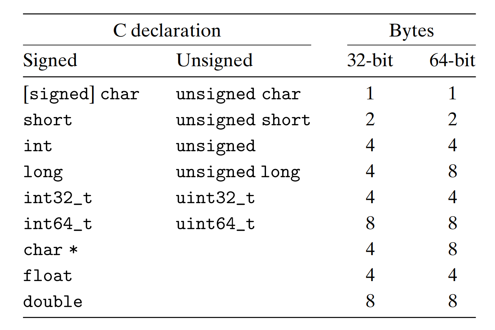
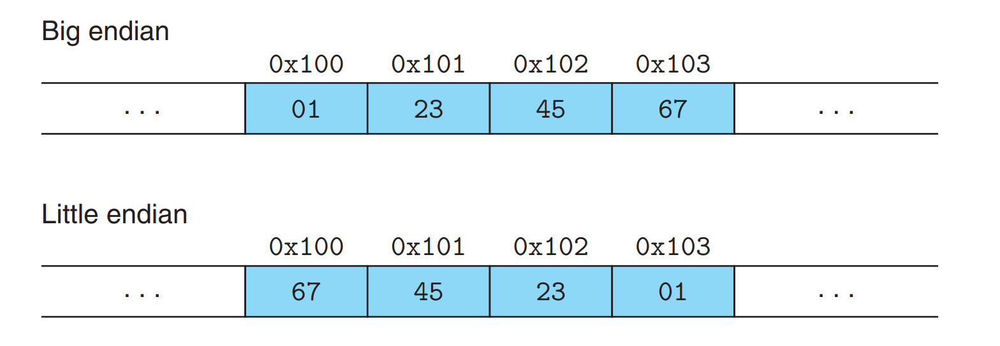

# 第 02 章：信息的表示和处理

<!-- Page 0060 -->

# 信息的表示和处理

2.1 信息存储 70

2.2 整数表示 95

2.3 整数运算 120

2.4 浮点数 144

2.5 小结 162

参考文献说明 163

课后习题 164

练习题答案 179

---

<!-- Page 0061 -->

现代计算机存储和处理以二值信号表示的信息。这些不起眼的二进制数字，即位 (bit)，构成了数字革命的基础。人们熟知的十进制（即以 10 为基数）表示法已使用了超过 1000 年，它起源于印度，在 12 世纪由阿拉伯数学家加以改进，并在 13 世纪由意大利数学家列奥纳多·皮萨诺（约 1170 至约 1250 年，更广为人知的名字是斐波那契）传入西方。对于十指齐全的人类来说，使用十进制记数法很自然，但在构建存储和处理信息的机器时，二进制值更为有效。二值信号可以方便地表示、存储和传输——例如，可以用打孔卡上孔的有无、导线上电压的高低，或者磁盘的顺时针或逆时针方向来表示。用于存储和执行二值信号计算的电子电路非常简单可靠，使得制造商能够在单个硅芯片上集成数百万甚至数十亿个这样的电路。

孤立地看，单个位的用处不大。然而，当我们把位组合在一起，并赋予不同的位模式以某种解释意义时，就可以表示任何有限集合的元素了。例如，利用二进制数制，我们可以用位组来编码非负数。利用标准字符编码，我们可以对文档中的字母和符号进行编码。本章将介绍这两种编码方式，以及用于表示负数和近似实数的编码。

我们考虑三种最重要的数字表示。无符号 (unsigned) 编码基于传统的二进制表示法，表示大于或等于 0 的数。补码 (two's-complement) 编码是表示有符号整数（即可以为正或为负的数）最常见的方式。浮点 (floating-point) 编码是科学记数法的以 2 为基数的版本，用于表示实数。计算机用这些不同的表示实现算术运算（如加法和乘法），类似于对整数和实数的相应运算。

计算机表示使用有限数量的位来编码一个数，因此当结果太大而无法表示时，某些运算会溢出。这可能导致一些令人惊讶的结果。例如，在当今大多数计算机上（那些使用 32 位表示数据类型 int 的计算机），计算表达式

 $$ 200*300*400*500 $$

得到 $-884{,}901{,}888$。这与整数运算的性质相悖——一组正数的乘积竟然产生了负数结果。

另一方面，整数的计算机运算满足真正整数运算的许多熟悉性质。例如，乘法是结合律和交换律的，因此计算下列任何一个 C 表达式都会得到 $-884{,}901{,}888$：

 $$ (500 * 400) * (300 * 200) $$

 $$ ((500 * 400) * 300) * 200 $$

 $$ ((200 * 500) * 300) * 400 $$

 $$ 400 * (200 * (300 * 500)) $$

---

<!-- Page 0062 -->

计算机可能不会生成预期的结果，但至少它是一致的！

浮点运算具有完全不同的数学性质。一组正数的乘积总是正的，尽管溢出会产生特殊值 $+\infty$。由于表示的有限精度，浮点运算不满足结合律。例如，C 的表达式 $(3.14+1e20)-1e20$ 在大多数机器上将求值为 0.0，而实际运算中 $3.14+(1e20-1e20)$ 求值为 3.14。整数运算与浮点运算的不同数学性质源于它们处理表示有限性的方式不同——整数表示能编码相对较小范围的值，但编码是精确的；而浮点表示能编码很大范围的值，但只是近似的。

通过研究实际的数字表示，我们可以理解可表示的值的范围以及不同算术运算的性质。这种理解对于编写在全部数值范围内正确工作且可在不同机器、操作系统和编译器组合之间移植的程序至关重要。正如我们将要描述的，许多计算机安全漏洞正是由于计算机算术的某些微妙之处而产生的。在早期，程序错误只是在偶然触发时给人们带来不便，但现在有大量黑客试图利用他们能找到的任何错误来获取对他人系统的未授权访问。这要求程序员承担更高的责任，去理解他们的程序是如何工作的，以及如何使程序以期望的方式运行。

计算机使用几种不同的二进制表示来编码数值。随着你在第 3 章深入学习机器级编程，你需要熟悉这些表示。我们在本章描述这些编码，并向你展示如何推理数字表示。

我们推导出几种通过直接操纵数字的位级表示来执行算术运算的方法。理解这些技术对于理解编译器 (compiler) 在试图优化算术表达式求值性能时生成的机器级代码非常重要。

我们对这些材料的处理基于一组核心数学原理。我们从编码的基本定义开始，然后推导出可表示数的范围、它们的位级表示以及算术运算的性质等属性。我们认为，从这种抽象的角度来审视这些材料对你来说很重要，因为程序员需要清楚地理解计算机算术与更熟悉的整数和实数算术之间的关系。

C++ 编程语言建立在 C 之上，使用完全相同的数字表示和运算。本章关于 C 的一切也适用于 C++。而 Java 语言定义则为数字表示和运算创建了一套新标准。C 标准旨在允许各种各样的实现，而 Java 标准对数据的格式和编码非常具体。我们将着重介绍这些表示。

---

<!-- Page 0063 -->

>旁注 如何阅读本章
>
>在本章中，我们考察数字和其他形式的数据在计算机上的表示的基本性质，以及计算机对这些数据执行的运算的性质。这需要我们深入数学语言，书写公式和方程，并推导重要性质。
>
>为了帮助你阅读这些内容，我们将表述结构化为：首先用数学符号将性质陈述为原理。然后用示例和非正式讨论来说明该原理。我们建议你在原理陈述和示例讨论之间反复阅读，直到你对所陈述的内容及该性质的重要性有了扎实的直觉。对于更复杂的性质，我们还提供推导过程，其结构类似于数学证明。你最终应该试着理解这些推导，但在第一次阅读时可以跳过它们。
>
>我们还鼓励你在阅读过程中完成练习题。练习题让你参与主动学习，帮助你将思考付诸实践。有了这些背景，你会发现回过头来理解推导要容易得多。同样请放心，理解这些材料所需的数学技能对于一个掌握了高中代数的人来说完全可以达到。

### 2.1 信息存储

大多数计算机使用 8 位的块，即字节 (byte)，作为最小的可寻址内存 (memory) 单位，而不是访问内存中的单个位。机器级程序将内存视为一个非常大的字节数组，称为虚拟内存 (virtual memory)。内存的每个字节都由一个唯一的数字来标识，称为它的地址 (address)，所有可能的地址的集合称为虚拟地址空间 (virtual address space)。顾名思义，这个虚拟地址空间只是一个呈现给机器级程序的概念性映像。实际的实现（在第 9 章介绍）使用动态随机访问存储器 (DRAM)、闪存、磁盘存储、专用硬件和操作系统软件的组合，来为程序提供一个看似单一的字节数组。

在后续章节中，我们将介绍编译器和运行时系统如何将内存空间划分为更易管理的单元，以存储不同类型的程序对象，包括程序数据、指令 (instruction) 和控制信息。各种机制被用来为程序的不同部分分配和管理存储，而这一切都发生在虚拟地址空间内。例如，C 语言中的指针 (pointer) 值——无论它指向整数、结构体还是其他程序对象——都表示某块存储的首字节的虚拟地址。C 编译器还会将类型信息与每个指针关联，从而能够根据指针所指对象的类型生成不同的机器级代码来访问存储值。尽管 C 编译器维护这些类型信息，但生成的实际机器级程序中并不包含任何数据类型信息。它仅仅将每个程序对象视为字节块，将程序本身视为字节序列。

---

<!-- Page 0064 -->

>旁注 C 编程语言的演变
>
>如第 40 页旁注所述，C 编程语言最初由贝尔实验室的丹尼斯·里奇 (Dennis Ritchie) 为 Unix 操作系统（同样在贝尔实验室开发）设计。当时，大多数系统程序（例如操作系统）必须主要使用汇编语言编写，以便访问不同数据类型的底层表示。例如，在那个时代，使用其他高级语言实现内存分配器（如 `malloc` 库函数提供的功能）几乎是不可能的。
>
>贝尔实验室最初的 C 版本记录在布莱恩·柯尼汉与丹尼斯·里奇著作 [60] 的第一版中。随着时间推移，C 语言在多个标准化组织的推动下不断发展。对贝尔实验室 C 的第一次重大修订产生了 1989 年的 ANSI C 标准，由一个在美国国家标准协会主持下的工作小组完成。ANSI C 与贝尔实验室 C 存在显著差异，尤其是在函数声明方式上。ANSI C 的内容在柯尼汉和里奇著作的第二版 [61] 中有描述，该书至今仍被认为是关于 C 的权威参考之一。
>
>国际标准化组织（ISO）随后接管了 C 语言标准化工作，并在 1990 年采纳了一个与 ANSI C 基本相同的版本，因此称为 "ISO C90"。
>
>该组织在 1999 年赞助了 C 语言更新，产生了 "ISO C99"。这一版本引入了一些新的数据类型，并为文本字符串提供了支持，以处理英语中不存在的字符。更近的标准在 2011 年获得批准，被命名为 "ISO C11"，进一步增加了新的数据类型和特性。大部分新增内容都是向后兼容的，这意味着按照较早标准（至少追溯到 ISO C90）编写的程序，在使用较新标准编译时仍能保持相同的行为。
>
>GNU 编译器集合 (gcc) 可以根据不同的命令行选项，按照 C 语言的不同标准版本编译程序，如图 2.1 所示。例如，要按照 ISO C11 标准编译程序 `prog.c`，可以使用以下命令行：
>
>linux> gcc -std=c11 prog.c
>
>选项 `-ansi` 和 `-std=c89` 的效果相同——代码将按照 ANSI 或 ISO C90 标准编译。（C90 有时也称为 "C89"，因为其标准化工作始于 1989 年。）选项 `-std=c99` 则使编译器遵循 ISO C99 标准。
>
>在撰写本书时，如果未指定任何标准选项，程序默认将按照基于 ISO C90 的 C 版本编译，但同时支持部分 C99、C11 特性，以及部分 C++ 特性和 gcc 特有的扩展。GNU 项目正在开发一个结合 ISO C11 与其他特性的版本，可通过命令行选项 `-std=gnu11` 指定。（目前该实现尚未完成。）未来，这将成为默认版本。

| C version       | GCC command-line option    |
|-----------------|---------------------------|
| GNU 89          | none, -std=gnu89          |
| ANSI, ISO C90   | -ansi, -std=c89           |
| ISO C99         | -std=c99                  |
| ISO C11         | -std=c11                  |

<center>图 2.1 在 gcc 中指定不同的 C 语言版本。</center>

---

<!-- Page 0065 -->

>C 新手？ C 语言中指针的角色
>
>指针是 C 的核心特性。它们提供了引用数据结构（包括数组）元素的机制。与变量一样，指针有两个方面：它的值和它的类型。值表示某个对象的位置，而类型表示该位置存储的是什么类型的对象（例如，整数或浮点数）。
>
>真正理解指针需要在机器级别研究它们的表示和实现。这将是第 3 章的主要重点，并在第 3.10.1 节中进行深入介绍。

#### 2.1.1 十六进制表示法

一个字节由 8 位组成。在二进制表示中，其值范围为 $00000000_2$ 到 $11111111_2$。作为十进制整数时，其值范围为 $0_{10}$ 到 $255_{10}$。然而，这两种表示方式在描述位模式时都有不便之处：二进制表示冗长，而十进制表示在与位模式之间转换时较为繁琐。因此，我们通常使用以 16 为基数的十六进制数来表示位模式。十六进制（简称 "hex"）使用数字 '0' 到 '9' 以及字母 'A' 到 'F' 来表示 16 个可能的值。图 2.2 展示了每个十六进制数字对应的二进制和十进制值。使用十六进制表示时，单个字节的值范围为 $00_{16}$ 到 $FF_{16}$。

在 C 语言中，以 `0x` 或 `0X` 开头的数字常量被解释为十六进制。字母 'A' 到 'F' 可以用大写或小写书写。例如，数值 $FA1D37B_{16}$ 可以写作 `0xFA1D37B`、`0xfa1d37b`，甚至大小写混合（如 `0xFA1D37b`）。在本书中，我们将采用 C 语言的表示方法来书写十六进制值。

在处理机器级程序时，一个常见任务是手动在十进制、二进制和十六进制的位模式表示之间进行转换。二进制与十六进制之间的转换较为直接，因为可以逐个与十六进制数字进行转换。可参考图 2.2 所示的表格进行转换。在脑中快速转换时，一个小技巧是记住十六进制数字 A、C 和 F 对应的十进制值。十六进制值 B、D 和 E 可以通过计算它们相对于前三个值的关系来转换为十进制。

| Hex digit     | 0    | 1    | 2    | 3    | 4    | 5    | 6    | 7    |
|---------------|------|------|------|------|------|------|------|------|
| Decimal value | 0    | 1    | 2    | 3    | 4    | 5    | 6    | 7    |
| Binary value  | 0000 | 0001 | 0010 | 0011 | 0100 | 0101 | 0110 | 0111 |

| Hex digit     | 8    | 9    | A    | B    | C    | D    | E    | F    |
|---------------|------|------|------|------|------|------|------|------|
| Decimal value | 8    | 9    | 10   | 11   | 12   | 13   | 14   | 15   |
| Binary value  | 1000 | 1001 | 1010 | 1011 | 1100 | 1101 | 1110 | 1111 |

<center>图 2.2 十六进制表示法。每个十六进制数字编码 16 个值中的一个。</center>

---

<!-- Page 0066 -->

例如，假设给你数字 0x173A4C。你可以通过展开每个十六进制数字将其转换为二进制格式，如下所示：

| Hexadecimal | 1    | 7    | 3    | A    | 4    | C    |
| ----------- | ---- | ---- | ---- | ---- | ---- | ---- |
| Binary      | 0001 | 0111 | 0011 | 1010 | 0100 | 1100 |

这就得到了二进制表示 $000101110011101001001100$。

反过来，给定一个二进制数 $1111001010110110110011$，你可以先将它分成每 4 位一组来转换为十六进制。但请注意，如果总位数不是 4 的倍数，你应该在最左边的组前添加前导零，使其凑足 4 位。然后将每组位翻译为对应的十六进制数字：

| Binary      | 0011 | 1100 | 1010 | 1101 | 1011 | 0011 |
| ----------- | :--: | :--: | :--: | :--: | :--: | :--: |
| Hexadecimal |   3  |   C  |   A  |   D  |   B  |   3  |

### 练习题 2.1（答案见第 179 页）

| 练习题 2.1 |
|------------|
| 执行以下数制转换： |
| A. 0x25B9D2 转换为二进制 |
| B. 二进制 1010111001001001 转换为十六进制 |
| C. 0xA8B3D 转换为二进制 |
| D. 二进制 1100100010110110010110 转换为十六进制 |

当一个值 $x$ 是 2 的幂时，即 $x = 2^{n}$（$n$ 为非负整数），我们可以很容易地将 $x$ 写成十六进制形式。因为 $x$ 的二进制表示就是 1 后面跟着 $n$ 个零，而十六进制数字 0 表示 4 个二进制零。因此，将 $n$ 表示为 $n = i + 4j$ 的形式（其中 $0 \le i \le 3$），可以将 $x$ 写为前导十六进制数字 1（$i=0$）、2（$i=1$）、4（$i=2$）或 8（$i=3$），后面跟 $j$ 个十六进制 0。例如，对于 $x = 2{,}048 = 2^{11}$，我们有 $n = 11 = 3 + 4\cdot 2$，得到十六进制表示为 0x800。

### 练习题 2.2（答案见第 179 页）

填写下表中的空白条目，给出不同的 2 的幂的十进制和十六进制表示：

---

<!-- Page 0067 -->

| n  | $2^{n}$（decimal） | $2^{n}$（hexadecimal） |
| -- | ---------------- | -------------------- |
| 5  | 32               | 0x20                 |
| 23 |                  |                      |
|    | 32,768           |                      |
|    |                  | 0x2000               |
| 12 |                  |                      |
|    | 64               |                      |
|    |                  | 0x100                |

将十进制数转换为十六进制表示通常使用除法或乘法处理一般情况。要将十进制数 $x$ 转换为十六进制，我们可以反复将 $x$ 除以 16，得到商 $q$ 和余数 $r$，满足：

$$
x = q \cdot 16 + r
$$

然后用 $r$ 对应的十六进制数字作为最低有效位，并对 $q$ 重复此过程以生成其余数字。例如，将十进制数 314,156 转换为十六进制：

$$
314,156 = 19,634 \cdot 16 + 12 \quad (C)
$$

$$
19,634 = 1,227 \cdot 16 + 2 \quad (2)
$$

$$
1,227 = 76 \cdot 16 + 11 \quad (B)
$$

$$
76 = 4 \cdot 16 + 12 \quad (C)
$$

$$
4 = 0 \cdot 16 + 4 \quad (4)
$$

由此得到十六进制表示为 0x4CB2C。

反过来，要将十六进制数转换为十进制，我们可以将每个十六进制数字乘以对应的 16 的幂。例如，对于数字 0x7AF，其十进制等价为：

$$
7 \cdot 16^{2} + 10 \cdot 16 + 15 = 7 \cdot 256 + 10 \cdot 16 + 15 = 1,792 + 160 + 15 = 1,967
$$

### 练习题 2.3（答案见第 180 页）

一个字节可以用 2 个十六进制数字表示。填写下表中缺失的条目，给出不同字节模式的十进制、二进制和十六进制值：

| Decimal | Binary      | Hexadecimal |
|---------|------------|-------------|
| 0       | 0000 0000  | 0x00        |
| 158     | 1001 1110  | 0x9E        |
| 76      | 0100 1100  | 0x4C        |
| 145     | 1001 0001  | 0x91        |
| 174     | 1010 1110  | 0xAE        |
| 60      | 0011 1100  | 0x3C        |
| 241     | 1111 0001  | 0xF1        |

---

<!-- Page 0068 -->

## 旁注 十进制和十六进制之间的转换

对于较大值的十进制和十六进制之间的转换，最好让计算机或计算器来完成。有许多工具可以做到这一点。一个简单的方法是使用任何标准搜索引擎，查询如

`Convert 0xabcd to decimal` 或 `123 in hex`

| Decimal | Binary    | Hexadecimal |
|:-------:|:---------:|:-----------:|
| 117     | 01110101  | 0x75       |
| 189     | 10111101  | 0xBD       |
| 245     | 11110101  | 0xF5       |

### 练习题 2.4（答案见第 180 页）

不要将数字转换为十进制或二进制，尝试解决以下算术问题，以十六进制给出答案。提示：只需修改你用于执行十进制加法和减法的方法，使其使用基数 16。

A. 0x605c + 0x5 = 0x6061

B. 0x605c - 0x20 = 0x603c

C. 0x605c + 32 = 0x607c

D. 0x60fa - 0x605c = 0x09e


#### 2.1.2 数据大小

每台计算机都有一个字长（word size），表示指针数据的标称大小。由于虚拟地址是用一个字来编码的，因此字长决定了系统中最关键的参数之一：虚拟地址空间的最大容量。也就是说，对于一台字长为 $w$ 位的机器，虚拟地址的范围可以从 0 到 $2^{w} - 1$，程序最多可以访问 $2^{w}$ 个字节。

近年来，计算机已经广泛从 32 位字长转向 64 位字长。这一转变最初出现在为大规模科学计算和数据库应用设计的高端机器上，随后扩展到台式机和笔记本电脑，最近则延伸到智能手机处理器。32 位字长将虚拟地址空间限制为 4 千兆字节（4 GB），即略大于 $4 \times 10^{9}$ 字节。扩展到 64 位字长后，虚拟地址空间可达 16 艾字节（exabyte），约为 $1.84 \times 10^{19}$ 字节。

---

<!-- Page 0069 -->

大多数 64 位机器也可以运行为 32 位机器编译的程序，这是一种向后兼容性。因此，例如，当程序 `prog.c` 用以下指令编译时：

```
linux> gcc -m32 prog.c
```

该程序将在 32 位或 64 位机器上都能正确运行。另一方面，用以下指令编译的程序：

```
linux> gcc -m64 prog.c
```

只能在 64 位机器上运行。因此，我们将程序称为“32 位程序”或“64 位程序”，因为区别在于程序是如何编译的，而不是运行它的机器类型。

计算机和编译器支持多种数据格式，使用不同的方式来编码数据，如整数和浮点数，以及不同的长度。例如，许多机器都有操作单个字节以及 2、4 和 8 字节整数的指令。它们还支持用 4 或 8 字节表示的浮点数。

C 语言支持整数和浮点数据的多种数据格式。图 2.3 显示了不同 C 数据类型通常分配的字节数（我们在第 2.2 节中讨论了 C 标准保证的字节数与典型值之间的关系）。某些数据类型的确切字节数取决于程序的编译方式。下表显示了典型的 32 位和 64 位程序中各类型的大小。  

整数数据可以是有符号的（能表示负数、零和正数），也可以是无符号的（只允许非负值）。数据类型 `char` 表示单个字节。虽然名称 `char` 源于它用于存储文本字符串中的单个字符，但它也可以用于存储整数值。数据类型 `short`、`int` 和 `long` 旨在提供不同的取值范围。即使在为 64 位系统编译时，数据类型 `int` 通常也只有 4 个字节。数据类型 `long` 在 32 位程序中通常有 4 个字节，而在 64 位程序中则为 8 个字节。



<div align="center">
图 2.3 基本 C 数据类型的典型大小（以字节为单位）。分配的字节数随程序的编译方式而变化。此图表显示了 32 位和 64 位程序的典型值。
</div>


---

<!-- Page 0070 -->

> C 新手？声明指针
>
> 对于任意数据类型 $T$，声明
>
> ```c
> T *p;
> ```
>
> 表示 $p$ 是一个指向类型为 $T$ 的对象的指针变量。例如：
>
> ```c
> char *p;
> ```
>
> 是一个指向 `char` 类型对象的指针声明。

为了避免依赖“典型”大小以及不同编译器设置的不确定性，ISO C99 引入了一类固定大小的数据类型，其数据长度不受编译器或机器设置影响。其中包括 `int32_t` 和 `int64_t`，分别恰好占 4 字节和 8 字节。使用固定大小整数类型是程序员精确控制数据表示的最佳方式。

大多数数据类型默认编码有符号值，除非使用 `unsigned` 关键字前缀或固定大小数据类型的特定无符号声明。例外的是 `char` 类型。虽然大多数编译器和机器将其视为有符号，但 C 标准并不保证这一点。为了确保一个 1 字节有符号值，程序员应使用 `signed char` 声明。然而，在许多上下文中，程序的行为对 `char` 是有符号还是无符号并不敏感。

C 语言允许关键字以多种顺序排列，并可选择性地包含或省略某些关键字。例如，以下声明等效：

```c
unsigned long
unsigned long int
long unsigned
long unsigned int
```
我们将在本文中统一使用图 2.3 的形式。

图 2.3 还显示，指针（如声明为 `char *` 的变量）使用程序的完整字长。大多数机器还支持两种浮点格式：单精度（single precision），在 C 中声明为 `float`；以及双精度（double precision），在 C 中声明为 `double`。它们分别占用 4 字节和 8 字节。

程序员应当努力使其程序能够在不同的机器和编译器之间保持良好的**可移植性**。可移植性的一个重要方面，是让程序不依赖于各类数据类型的**具体字长**。C 语言标准仅对各种数据类型的取值范围规定了**下界**（固定大小类型除外），而未规定**上界**，这一点将在后文中进一步说明。从大约 1980 年到 2010 年，**32 位机器与 32 位程序**的组合长期占据主流，许多程序都是基于图 2.3 中所列的 32 位程序数据分配方式编写的。然而，随着计算平台逐步向 **64 位体系结构**迁移，这些程序在移植到新机器时，隐藏的**字长依赖问题**开始以各种错误的形式暴露出来。例如，长期以来，许多程序员默认认为声明为 `int` 类型的对象可以用来存储指针。这一假设在大多数 32 位程序中是成立的，但在 64 位环境下却会引发严重问题。

---

<!-- Page 0071 -->

#### 2.1.3 寻址和字节顺序

对于跨越多个字节的程序对象，我们必须明确两个约定：**对象的地址如何定义**，以及**字节在内存中的排列方式**。在几乎所有机器上，多字节对象都存储为一段连续的字节序列，而对象的地址则由其中**最小的字节地址**给出。例如，假设一个 `int` 类型变量 `x` 的地址为 `0x100`，也就是说，地址表达式 `&x` 的值为 `0x100`。再假设 `int` 类型采用 32 位表示，那么 `x` 的 4 个字节将依次存储在内存地址 `0x100`、`0x101`、`0x102` 和 `0x103` 处。

在表示对象的字节排列方式时，通常存在两种常见约定。考虑一个 $w$ 位整数，其位表示为
$[x_{w-1}, x_{w-2}, \ldots, x_1, x_0]$，其中 $x_{w-1}$ 是最高有效位（MSB），$x_0$ 是最低有效位（LSB）。假设 $w$ 是 8 的倍数，这些位可以按字节进行分组：最高有效字节包含位
$[x_{w-1}, x_{w-2}, \ldots, x_{w-8}]$，最低有效字节包含位
$[x_7, x_6, \ldots, x_0]$，其余字节则由中间的位构成。不同机器对这些字节在内存中的存放顺序有不同的选择。有些机器按照**从最低有效字节到最高有效字节**的顺序存储对象，而另一些机器则按照**从最高有效字节到最低有效字节**的顺序存储。前一种约定——最低有效字节在前——称为**小端法**（*little endian*）；后一种约定——最高有效字节在前——称为**大端法**（*big endian*）。

假设 `int` 类型变量 `x` 位于地址 `0x100`，其十六进制值为 `0x01234567`。那么，在地址范围 `0x100` 到 `0x103` 内，各字节的排列方式将取决于所使用的机器类型：



注意，在字 `0x01234567` 中，高位字节的十六进制值为 `0x01`，而低位字节的值为 `0x67`。

大多数 Intel 兼容的机器仅以**小端模式**运行。相对而言，IBM 和 Oracle 的大多数机器（源自它们在 2010 年收购 Sun Microsystems 的产品线）则以**大端模式**运行。需要注意的是，这里强调的是“**大多数**”，这种约定并不严格按照公司界限划分。例如，IBM 和 Oracle 也生产基于 Intel 兼容处理器的机器，因此同样采用小端模式。

此外，许多较新的微处理器芯片是**双端**（bi-endian）的，这意味着它们可以被配置为以小端或大端模式运行。然而在实际应用中，一旦选定了特定的操作系统，字节序通常也就随之固定。例如，广泛应用于手机的 ARM 微处理器在硬件层面支持小端和大端两种模式，但在这些芯片上最常见的两种操作系统——来自 Google 的 Android 和来自 Apple 的 iOS——都只以小端模式运行。

---

<!-- Page 0072 -->

> **旁注：“端”的起源**
>
>以下摘录自乔纳森·斯威夫特于 1726 年所写、关于“大端”和“小端”之争历史的一段描述：
>
> ……利立浦特和布莱夫斯库……正如我要告诉你的那样，过去三十六个月里一直在进行一场最顽固的战争。其起因如下。各方一致承认，打鸡蛋的原始方式是从大头敲开；但当今陛下的祖父还是个男孩时，有一次他按古老的做法敲开鸡蛋，恰巧割破了一根手指。于是，他的父亲——皇帝——颁布了一道敕令，命令所有臣民在严厉惩罚之下必须从小头敲开鸡蛋。
>
> 人们对这条法律极为不满。我们的历史记载表明，因此已经爆发了六次叛乱：其中一位皇帝丧命，另一位被废黜。这些内乱不断受到布莱夫斯库君主的煽动；而当叛乱被镇压后，流亡者总是逃往那个帝国寻求庇护。据统计，先后有一万一千人宁死也不肯从小头敲开鸡蛋。
>
> 关于这场争论已经出版了许多大部头著作；然而，大端派的书籍长期遭到查禁，整个党派也依法被剥夺了担任公职的资格。
>
> ——乔纳森·斯威夫特，《格列佛游记》，本杰明·莫特版，1726 年
>
> 在斯威夫特所处的时代，这段文字讽刺的是英格兰（利立浦特）与法国（布莱夫斯库）之间持续不断的冲突。网络协议的早期先驱丹尼·科恩（Danny Cohen）首次将这些术语引入到字节序的语境中 [24]，此后“大端”和“小端”这一说法被广泛采用。

人们对于哪一种字节顺序才是“正确的”，往往会表现出出奇的激动。事实上，“小端（little-endian）”和“大端（big-endian）”这两个术语源自乔纳森·斯威夫特的《格列佛游记》。在书中，两个交战的派别始终无法就一个问题达成一致：软煮蛋究竟应该从小头打开，还是从大头打开。正如这个鸡蛋问题一样，选择某一种字节顺序约定而非另一种，并不存在技术上的必然理由，因此争论最终往往演变为社会或政治层面的口水战。只要选定一种约定并始终如一地遵循，这种选择本身就是任意而且可行的。

对于大多数应用程序员而言，机器所采用的字节顺序几乎是不可感知的：同一份程序，无论在何种架构的机器上编译和运行，通常都会产生相同的结果。然而，在某些场景下，字节顺序确实会成为一个不可忽视的问题。最常见的情况出现在二进制数据需要通过网络在不同机器之间传输时。例如，小端机器生成的数据被发送到大端机器（或反之），就可能导致接收程序中字内的字节顺序发生颠倒。为避免此类问题，网络应用程序必须遵循统一的字节顺序约定：发送端将其内部表示转换为网络标准格式，而接收端再将网络标准格式转换为自身的内部表示。我们将在第 11 章中看到这些转换的具体示例。

---

<!-- Page 0073 -->

第二种字节顺序变得重要的情况是查看表示整数数据的字节序列时。这在检查机器级程序时经常发生。例如，下面这行出现在给出 Intel x86-64 处理器机器级代码文本表示的文件中：

4004d3: 01 05 43 0b 20 00

add %eax,0x200b43(%rip)

这行是由反汇编器 (disassembler) 生成的，反汇编器是一种确定可执行程序文件 (executable) 所表示的指令序列的工具。我们将在第 3 章中详细了解反汇编器以及如何解释此类行。目前，我们只需注意这行表明十六进制字节序列 01 05 43 0b 20 00 是一条指令的字节级表示，该指令将一个数据字加到通过将 0x200b43 加上程序计数器 (PC)（即下一条要执行的指令的地址）的当前值所计算得到的地址处存储的值上。如果我们取序列的最后 4 个字节 43 0b 20 00 并以相反顺序写出，我们得到 00 20 0b 43。去掉前导 0，我们得到值 0x200b43，即右边写的数值。对于像这样为小端机器生成的机器级程序表示，字节以相反顺序出现是常见的情况。书写字节序列的自然方式是最低编号的字节在左边、最高的在右边，但这与数字的正常书写方式——最高有效数字在左、最低有效数字在右——相矛盾。

第三种字节顺序变得可见的情况是编写绕过正常类型系统的程序时。在 C 语言中，可以使用强制类型转换 (cast) 或联合体 (union) 使对象按照与创建时不同的数据类型来引用。这种编码技巧在大多数应用程序编程中是不被鼓励的，但它们在系统级编程中可能相当有用，甚至是必要的。

图 2.4 显示了使用强制类型转换来访问和打印不同程序对象的字节表示的 C 代码。我们使用 typedef 将数据类型 byte_pointer 定义为指向 unsigned char 类型对象的指针。这样的字节指针引用一个字节序列，其中每个字节被视为一个非负整数。第一个例程 show_bytes 被给定一个字节序列的地址（由字节指针指示）和一个字节计数。字节计数指定为 size_t 数据类型，这是表示数据结构大小的首选数据类型。它以十六进制打印各个字节。C 格式化指令 %.2x 表示一个整数应以十六进制打印，至少 2 位数字。

---

<!-- Page 0074 -->

```c
typedef unsigned char *byte_pointer;

void show_bytes(byte_pointer start, size_t len) {
    int i;
    for (i = 0; i < len; i++)
        printf(" %.2x", start[i]);
    printf("\n");
}

void show_int(int x) {
    show_bytes((byte_pointer) &x, sizeof(int));
}

void show_float(float x) {
    show_bytes((byte_pointer) &x, sizeof(float));
}

void show_pointer(void *x) {
    show_bytes((byte_pointer) &x, sizeof(void *));
}
```

<div style="text-align: center;">图 2.4 打印程序对象字节表示的代码。此代码使用强制类型转换来绕过类型系统。可以很容易地为其他数据类型定义类似的函数。</div>


过程 show_int、show_float 和 show_pointer 演示了如何使用过程 show_bytes 来打印类型分别为 int、float 和 void * 的 C 程序对象的字节表示。注意它们只是将指向其参数 x 的指针 &x 传递给 show_bytes，并将该指针强制转换为 unsigned char * 类型。此强制转换告诉编译器，程序应将该指针视为指向一个字节序列，而不是原始数据类型的对象。然后该指针将指向对象所占据的最低字节地址。

这些过程使用 C 的 sizeof 运算符来确定对象使用的字节数。一般来说，表达式 $\text{sizeof}(T)$ 返回存储类型 T 的对象所需的字节数。使用 sizeof 而不是固定值是编写跨不同机器类型可移植代码的一步。

我们在几台不同的机器上运行了图 2.5 所示的代码，得到的结果如图 2.6 所示。使用了以下机器：

Linux 32 运行 Linux 的 Intel IA32 处理器。
Windows 运行 Windows 的 Intel IA32 处理器。
Sun 运行 Solaris 的 Sun Microsystems SPARC 处理器。（这些机器现在由 Oracle 生产。）
Linux 64 运行 Linux 的 Intel x86-64 处理器。

---

<!-- Page 0075 -->

```c
void test_show_bytes(int val) {
    int ival = val;
    float fval = (float) ival;
    int *pval = &ival;
    show_int(ival);
    show_float(fval);
    show_pointer(pval);
}
```

<div style="text-align: center;">图 2.5 字节表示示例。此代码打印示例数据对象的字节表示。</div>


Machine Value Type Bytes (hex)
Linux 32 12,345 int 39 30 00 00
Windows 12,345 int 39 30 00 00
Sun 12,345 int 00 00 30 39
Linux 64 12,345 int 39 30 00 00
Linux 32 12,345.0 float 00 e4 40 46
Windows 12,345.0 float 00 e4 40 46
Sun 12,345.0 float 46 40 e4 00
Linux 64 12,345.0 float 00 e4 40 46
Linux 32 &ival int * e4 f9 ff bf
Windows &ival int * b4 cc 22 00
Sun &ival int * ef ff fa 0c
Linux 64 &ival int * b8 11 e5 ff ff 7f 00 00

<div style="text-align: center;">图 2.6 不同数据值的字节表示。int 和 float 的结果相同，只是字节顺序不同。指针值取决于机器。</div>


我们的参数 12,345 的十六进制表示为 0x00003039。对于 int 数据，所有机器的结果相同，只是字节顺序不同。特别是，我们可以看到最低有效字节值 0x39 在 Linux 32、Windows 和 Linux 64 上首先打印，表示小端机器；而在 Sun 上最后打印，表示大端机器。类似地，float 数据的字节是相同的，只是字节顺序不同。另一方面，指针值完全不同。不同的机器/操作系统配置使用不同的存储分配约定。需要注意的一个特点是，Linux 32、Windows 和 Sun 机器使用 4 字节地址，而 Linux 64 机器使用 8 字节地址。

---

<!-- Page 0076 -->

## C 新手？ 用 typedef 命名数据类型

C 中的 typedef 声明提供了一种给数据类型命名的方式。这对于提高代码可读性大有帮助，因为深度嵌套的类型声明可能难以解读。

typedef 的语法与声明变量完全相同，只是使用类型名而不是变量名。因此，图 2.4 中 byte_pointer 的声明与声明一个 unsigned char * 类型的变量具有相同的形式。

例如，声明

typedef int *int_pointer;

int_pointer ip;

将类型 int_pointer 定义为指向 int 的指针，并声明了一个该类型的变量 ip。或者，我们可以直接将此变量声明为

int *ip;

## C 新手？ 用 printf 进行格式化打印

printf 函数（及其姊妹函数 fprintf 和 sprintf）提供了一种对格式化细节有相当控制的打印信息的方式。第一个参数是格式字符串，其余参数是要打印的值。在格式字符串中，每个以 '%' 开头的字符序列指示如何格式化下一个参数。典型的例子包括 %d 打印十进制整数，%f 打印浮点数，%c 打印由参数给出的字符代码对应的字符。

指定固定大小数据类型（如 int_32t）的格式稍微复杂一些，如第 103 页的旁注所述。

请注意，虽然浮点数和整数数据都编码数值 12,345，但它们的字节模式非常不同：整数为 0x00003039，浮点数为 0x4640E400。一般来说，这两种格式使用不同的编码方案。如果我们将这些十六进制模式展开为二进制形式并适当移位，我们会发现一个 13 位匹配序列，用一系列星号表示，如下所示：

0 0 0 0 3 0 3 9
0000000000000000000011000000111001
*****
4 6 4 0 E 4 0 0
01000110010000001110010000000000

这不是巧合。当我们学习浮点格式时将回到这个例子。

---

<!-- Page 0077 -->

## C 新手？ 指针和数组

在函数 show_bytes（图 2.4）中，我们看到了指针和数组之间的紧密联系，这将在第 3.8 节中详细讨论。我们看到这个函数有一个类型为 byte_pointer（已定义为指向 unsigned char 的指针）的参数 start，但我们在第 8 行看到了数组引用 start[i]。在 C 中，我们可以用数组表示法解引用指针，也可以用指针表示法引用数组元素。在这个例子中，引用 start[i] 表示我们要读取 start 所指位置之后第 i 个位置的字节。

## C 新手？ 指针的创建和解引用

在图 2.4 的第 13、17 和 21 行中，我们看到了两种赋予 C（因此也赋予 C++）独特特征的操作。C 的"取地址"运算符 '&' 创建一个指针。在所有三行中，表达式 &x 创建一个指向变量 x 所指示对象所在位置的指针。该指针的类型取决于 x 的类型，因此这三个指针的类型分别是 int *、float * 和 void **。（数据类型 void * 是一种没有关联类型信息的特殊指针。）

强制类型转换运算符将一种数据类型转换为另一种。因此，强制转换 (byte_pointer) &x 表示无论指针 &x 之前是什么类型，程序现在将引用一个指向 unsigned char 类型数据的指针。这里显示的强制转换不会改变实际的指针；它们只是指示编译器按照新的数据类型来引用所指向的数据。

## 旁注 生成 ASCII 表

你可以通过执行命令 man ascii 来显示一个 ASCII 字符码表。

### 练习题 2.5（答案见第 180 页）

考虑以下三次对 show_bytes 的调用：

```c
int a = 0x12345678;
byte_pointer ap = (byte_pointer) &a;
show_bytes(ap, 1); /* A. */
show_bytes(ap, 2); /* B. */
show_bytes(ap, 3); /* C. */
```

指出在小端机器和大端机器上每次调用将打印的值：

A. 小端：___ 大端：___

B. 小端：___ 大端：___

C. 小端：___ 大端：___

---

<!-- Page 0078 -->

### 练习题 2.6（答案见第 181 页）

使用 show_int 和 show_float，我们确定整数 2607352 的十六进制表示为 0x0027C8F8，而浮点数 3510593.0 的十六进制表示为 0x4A1F23E0。

A. 写出这两个十六进制值的二进制表示。

B. 将这两个字符串相对移位以最大化匹配位数。有多少位匹配？

C. 字符串的哪些部分不匹配？

#### 2.1.4 表示字符串

C 中的字符串被编码为以空字符（值为 0）终止的字符数组。每个字符用某种标准编码表示，最常见的是 ASCII 字符码。因此，如果我们以参数 "12345" 和 6（包括终止字符）运行我们的例程 show_bytes，我们得到结果 31 32 33 34 35 00。注意十进制数字 x 的 ASCII 码恰好是 0x3x，终止字节的十六进制表示为 0x00。在任何使用 ASCII 作为字符码的系统上都会得到相同的结果，与字节顺序和字长约定无关。因此，文本数据比二进制数据更具平台独立性。

### 练习题 2.7（答案见第 181 页）
以下对 show_bytes 的调用会打印什么结果？
```c
const char *m = "mnopqr";
show_bytes((byte_pointer) m, strlen(m));
```
注意字母 'a' 到 'z' 的 ASCII 码为 0x61 到 0x7A。

#### 2.1.5 表示代码

考虑以下 C 函数：

```c
int sum(int x, int y) {
    return x + y;
}
```

在我们的示例机器上编译时，我们生成具有以下字节表示的机器代码：

Linux 32 55 89 e5 8b 45 0c 03 45 08 c9 c3
Windows 55 89 e5 8b 45 0c 03 45 08 5d c3
Sun 81 c3 e0 08 90 02 00 09
Linux 64 55 48 89 e5 89 7d fc 89 75 f8 03 45 fc c9 c3

---

<!-- Page 0079 -->

## 旁注 Unicode 文本编码标准

ASCII 字符集适合编码英语文档，但在特殊字符（如法语的 'ç'）方面没有太多支持。它完全不适合编码希腊语、俄语和中文等语言的文档。多年来，已经开发了各种方法来编码不同语言的文本。Unicode 联盟设计了最全面且被广泛接受的文本编码标准。当前的 Unicode 标准（7.0 版）拥有超过 100,000 个字符的字符集，支持多种语言，包括古埃及和古巴比伦的语言。值得称赞的是，Unicode 技术委员会拒绝了一项为虚构文明克林贡语（来自电视剧《星际迷航》）纳入标准书写系统的提案。

基本编码，即 Unicode 的"通用字符集"，使用 32 位字符表示。这似乎要求每个文本字符串由每个字符 4 个字节组成。然而，可以采用替代编码，其中常见字符只需 1 或 2 个字节，而不太常见的字符需要更多字节。特别是，UTF-8 表示将每个字符编码为一个字节序列，使得标准 ASCII 字符使用与它们在 ASCII 中相同的单字节编码，这意味着所有 ASCII 字节序列在 UTF-8 中的含义与在 ASCII 中相同。

Java 编程语言在其字符串表示中使用 Unicode。C 也有可用的程序库来支持 Unicode。

这里我们发现指令编码是不同的。不同的机器类型使用不同且不兼容的指令和编码。即使是运行不同操作系统的相同处理器，其编码约定也存在差异，因此不具有二进制兼容性。二进制代码很少能在不同的机器和操作系统组合之间移植。

计算机系统的一个基本概念是，从机器的角度来看，一个程序只是一个字节序列。机器没有关于原始源程序的信息，除了可能维护一些辅助表来帮助调试。当我们在第 3 章学习机器级编程时，将更清楚地看到这一点。

#### 2.1.6 布尔代数简介

由于二进制值是计算机编码、存储和处理信息的核心，围绕值 0 和 1 的研究已经发展出丰富的数学知识体系。这始于乔治·布尔 (George Boole, 1815–1864) 大约在 1850 年的工作，因此被称为布尔代数。布尔观察到，通过将逻辑值 TRUE 和 FALSE 编码为二进制值 1 和 0，他可以构造一个代数来捕捉逻辑推理的基本原理。

最简单的布尔代数定义在二元素集合 $\{0, 1\}$ 上。图 2.7 定义了该代数中的几个运算。我们用来表示这些运算的符号选择与 C 的位级运算相匹配，


<table border=1 style='margin: auto; word-wrap: break-word;'><tr><td style='text-align: center; word-wrap: break-word;'>~</td><td style='text-align: center; word-wrap: break-word;'>&amp;</td><td style='text-align: center; word-wrap: break-word;'>0</td><td style='text-align: center; word-wrap: break-word;'>1</td><td style='text-align: center; word-wrap: break-word;'>|</td><td style='text-align: center; word-wrap: break-word;'>0</td><td style='text-align: center; word-wrap: break-word;'>1</td><td style='text-align: center; word-wrap: break-word;'>^</td><td style='text-align: center; word-wrap: break-word;'>0</td><td style='text-align: center; word-wrap: break-word;'>1</td></tr><tr><td style='text-align: center; word-wrap: break-word;'>0</td><td style='text-align: center; word-wrap: break-word;'>1</td><td style='text-align: center; word-wrap: break-word;'>0</td><td style='text-align: center; word-wrap: break-word;'>0</td><td style='text-align: center; word-wrap: break-word;'>0</td><td style='text-align: center; word-wrap: break-word;'>0</td><td style='text-align: center; word-wrap: break-word;'>0</td><td style='text-align: center; word-wrap: break-word;'>1</td><td style='text-align: center; word-wrap: break-word;'>0</td><td style='text-align: center; word-wrap: break-word;'>0</td></tr><tr><td style='text-align: center; word-wrap: break-word;'>1</td><td style='text-align: center; word-wrap: break-word;'>0</td><td style='text-align: center; word-wrap: break-word;'>1</td><td style='text-align: center; word-wrap: break-word;'>0</td><td style='text-align: center; word-wrap: break-word;'>1</td><td style='text-align: center; word-wrap: break-word;'>1</td><td style='text-align: center; word-wrap: break-word;'>1</td><td style='text-align: center; word-wrap: break-word;'>1</td><td style='text-align: center; word-wrap: break-word;'>1</td><td style='text-align: center; word-wrap: break-word;'>0</td></tr></table>

<div style="text-align: center;">图 2.7 布尔代数的运算。二进制值 1 和 0 编码逻辑值 TRUE 和 FALSE，而运算 ~、&、| 和 ^ 分别编码逻辑运算 NOT、AND、OR 和 EXCLUSIVE-OR。</div>


这将在后面讨论。布尔运算 ~ 对应于逻辑运算 NOT，用符号 ¬ 表示。即当 P 不为真时 ¬P 为真，反之亦然。相应地，当 p 等于 0 时 ~p 等于 1，反之亦然。布尔运算 & 对应于逻辑运算 AND，用符号 ∧ 表示。当 P 和 Q 都为真时 P ∧ Q 成立。相应地，只有当 p = 1 且 q = 1 时 p & q 才等于 1。布尔运算 | 对应于逻辑运算 OR，用符号 ∨ 表示。当 P 或 Q 为真时 P ∨ Q 成立。相应地，当 p = 1 或 q = 1 时 p | q 等于 1。布尔运算 ^ 对应于逻辑运算 EXCLUSIVE-OR，用符号 ⊕ 表示。当 P 或 Q 为真但不同时为真时 P ⊕ Q 成立。相应地，当 p = 1 且 q = 0，或 p = 0 且 q = 1 时，p ^ q 等于 1。

克劳德·香农 (Claude Shannon, 1916–2001) 后来创立了信息论领域，他首先建立了布尔代数与数字逻辑之间的联系。在他 1937 年的硕士论文中，他表明布尔代数可以应用于机电继电器网络的设计和分析。虽然计算机技术自那以来有了很大的进步，但布尔代数在数字系统的设计和分析中仍然起着核心作用。

我们可以将四种布尔运算扩展到位向量 (bit vector) 上——某个固定长度 w 的由 0 和 1 组成的字符串。我们根据对参数的匹配元素的应用来定义位向量上的运算。设 $a$ 和 $b$ 分别表示位向量 $\{a_{w-1}, a_{w-2}, \ldots, a_0\}$ 和 $\{b_{w-1}, b_{w-2}, \ldots, b_0\}$。我们定义 $a$ & $b$ 也是长度为 $w$ 的位向量，其中第 $i$ 个元素等于 $a_i$ & $b_i$（$0 \leq i < w$）。运算 |、^ 和 ~ 以类似方式扩展到位向量。

例如，考虑 $w = 4$ 的情况，参数 $a = [0110]$ 和 $b = [1100]$。则四个运算 $a$ & $b$、$a$ | $b$、$a$ ^ $b$ 和 ~$b$ 分别得到

 $$ \begin{array}{ccc} 0110 & & 0110 \\ \& & | & 1100 \\ & & 1100 \\ 0100 & & 1110 \end{array} \quad \begin{array}{ccc} 0110 & & \\ \wedge & & 1100 \\ & & 1010 \end{array} \quad \begin{array}{ccc} \sim & 1100 & \\ & 0011 & \end{array} $$

### 练习题 2.8（答案见第 181 页）

填写下表，显示对位向量进行布尔运算求值的结果。

---

<!-- Page 0081 -->

## 关于布尔代数和布尔环的更多内容

对长度为 w 的位向量进行的布尔运算 |、& 和 ~ 构成一个布尔代数，对于任何整数 w > 0。最简单的是 w = 1 的情况，只有两个元素，但对于更一般的情况，有 $2^{w}$ 个长度为 w 的位向量。布尔代数与整数算术有许多相同的性质。例如，正如乘法分配于加法，即 $a \cdot (b + c) = (a \cdot b) + (a \cdot c)$，布尔运算 & 分配于 |，即 $a$ & $(b$ | $c) = (a$ & $b)$ | $(a$ & $c)$。然而此外，布尔运算 | 分配于 &，所以我们可以写 $a$ | $(b$ & $c) = (a$ | $b)$ & $(a$ | $c)$，而对于整数我们不能说 $a + (b \cdot c) = (a + b) \cdot (a + c)$ 对所有整数成立。

当我们考虑对长度为 w 的位向量进行的运算 ^、& 和 ~ 时，我们得到一种不同的数学形式，称为布尔环。布尔环与整数算术有许多共同的性质。例如，整数算术的一个性质是每个值 x 都有一个加法逆元 -x，使得 x + (-x) = 0。布尔环具有类似的性质，其中 ^ 是"加法"运算，但在这种情况下每个元素都是自身的加法逆元。即对于任何值 a，a ^ a = 0，这里我们用 0 表示全零的位向量。我们可以看到这对单个位成立，因为 0 ^ 0 = 1 ^ 1 = 0，它也扩展到位向量。即使我们重新排列项并以不同的顺序组合它们，这个性质也成立，所以 (a ^ b) ^ a = b。这个性质导致一些有趣的结果和巧妙的技巧，我们将在习题 2.10 中探索。


<table border=1 style='margin: auto; word-wrap: break-word;'><tr><td style='text-align: center; word-wrap: break-word;'>Operation</td><td style='text-align: center; word-wrap: break-word;'>Result</td></tr><tr><td style='text-align: center; word-wrap: break-word;'>a</td><td style='text-align: center; word-wrap: break-word;'>[01001110]</td></tr><tr><td style='text-align: center; word-wrap: break-word;'>b</td><td style='text-align: center; word-wrap: break-word;'>[11100001]</td></tr><tr><td style='text-align: center; word-wrap: break-word;'>$ \sim a $</td><td style='text-align: center; word-wrap: break-word;'></td></tr><tr><td style='text-align: center; word-wrap: break-word;'>$ \sim b $</td><td style='text-align: center; word-wrap: break-word;'></td></tr><tr><td style='text-align: center; word-wrap: break-word;'>a &amp; b</td><td style='text-align: center; word-wrap: break-word;'></td></tr><tr><td style='text-align: center; word-wrap: break-word;'>a | b</td><td style='text-align: center; word-wrap: break-word;'></td></tr><tr><td style='text-align: center; word-wrap: break-word;'>a $ \wedge $ b</td><td style='text-align: center; word-wrap: break-word;'></td></tr></table>


位向量的一个有用应用是表示有限集合。我们可以用位向量 $[a_{w-1}, \ldots, a_1, a_0]$ 编码任何子集 $A \subseteq \{0, 1, \ldots, w - 1\}$，其中 $a_i = 1$ 当且仅当 $i \in A$。例如，回忆我们将 $a_{w-1}$ 写在左边、$a_0$ 写在右边，位向量 $a = [01101001]$ 编码集合 $A = \{0, 3, 5, 6\}$，而位向量 $b = [01010101]$ 编码集合 $B = \{0, 2, 4, 6\}$。用这种方式编码集合，布尔运算 | 和 & 分别对应于集合并集和交集，而 ~ 对应于集合补集。继续我们之前的例子，运算 $a$ & $b$ 得到位向量 $[01000001]$，而 $A \cap B = \{0, 6\}$。

我们将在许多实际应用中看到用位向量编码集合。例如，在第 8 章中，我们将看到有许多不同的信号 (signal) 可以中断 (interrupt) 程序的执行。我们可以通过指定一个位向量掩码 (mask) 来选择性地启用或禁用不同的信号，其中位位置 i 处的 1 表示信号 i 被启用，0 表示它被禁用。因此，掩码表示被启用信号的集合。

---

<!-- Page 0082 -->

### 练习题 2.9（答案见第 182 页）

计算机通过在视频屏幕或液晶显示器上混合三种不同颜色的光——红色、绿色和蓝色——来生成彩色图像。想象一个简单的方案，有三盏不同的灯，每盏可以打开或关闭，投射到一块玻璃屏幕上：

<div style="text-align: center;"></div>


然后我们可以根据光源 R、G 和 B 的缺失 (0) 或存在 (1) 创建八种不同的颜色：


<table border=1 style='margin: auto; word-wrap: break-word;'><tr><td style='text-align: center; word-wrap: break-word;'>R</td><td style='text-align: center; word-wrap: break-word;'>G</td><td style='text-align: center; word-wrap: break-word;'>B</td><td style='text-align: center; word-wrap: break-word;'>Color</td></tr><tr><td style='text-align: center; word-wrap: break-word;'>0</td><td style='text-align: center; word-wrap: break-word;'>0</td><td style='text-align: center; word-wrap: break-word;'>0</td><td style='text-align: center; word-wrap: break-word;'>Black</td></tr><tr><td style='text-align: center; word-wrap: break-word;'>0</td><td style='text-align: center; word-wrap: break-word;'>0</td><td style='text-align: center; word-wrap: break-word;'>1</td><td style='text-align: center; word-wrap: break-word;'>Blue</td></tr><tr><td style='text-align: center; word-wrap: break-word;'>0</td><td style='text-align: center; word-wrap: break-word;'>1</td><td style='text-align: center; word-wrap: break-word;'>0</td><td style='text-align: center; word-wrap: break-word;'>Green</td></tr><tr><td style='text-align: center; word-wrap: break-word;'>0</td><td style='text-align: center; word-wrap: break-word;'>1</td><td style='text-align: center; word-wrap: break-word;'>1</td><td style='text-align: center; word-wrap: break-word;'>Cyan</td></tr><tr><td style='text-align: center; word-wrap: break-word;'>1</td><td style='text-align: center; word-wrap: break-word;'>0</td><td style='text-align: center; word-wrap: break-word;'>0</td><td style='text-align: center; word-wrap: break-word;'>Red</td></tr><tr><td style='text-align: center; word-wrap: break-word;'>1</td><td style='text-align: center; word-wrap: break-word;'>0</td><td style='text-align: center; word-wrap: break-word;'>1</td><td style='text-align: center; word-wrap: break-word;'>Magenta</td></tr><tr><td style='text-align: center; word-wrap: break-word;'>1</td><td style='text-align: center; word-wrap: break-word;'>1</td><td style='text-align: center; word-wrap: break-word;'>0</td><td style='text-align: center; word-wrap: break-word;'>Yellow</td></tr><tr><td style='text-align: center; word-wrap: break-word;'>1</td><td style='text-align: center; word-wrap: break-word;'>1</td><td style='text-align: center; word-wrap: break-word;'>1</td><td style='text-align: center; word-wrap: break-word;'>White</td></tr></table>

每种颜色可以用长度为 3 的位向量表示，我们可以对它们应用布尔运算。

A. 颜色的补色是通过关闭打开的灯和打开关闭的灯来形成的。上面列出的八种颜色各自的补色是什么？

B. 描述对以下颜色应用布尔运算的效果：

Blue | Green = ___

Yellow & Cyan = ___

Red ^ Magenta = ___

---

<!-- Page 0083 -->

#### 2.1.7 C 语言中的位级运算

C 的一个有用特性是它支持按位布尔运算。事实上，我们用于布尔运算的符号正是 C 使用的：| 表示 OR，& 表示 AND，~ 表示 NOT，^ 表示 EXCLUSIVE-OR。这些可以应用于任何"整型"数据类型，包括图 2.3 中列出的所有类型。以下是数据类型 char 的表达式求值示例：


<table border=1 style='margin: auto; word-wrap: break-word;'><tr><td style='text-align: center; word-wrap: break-word;'>C expression</td><td style='text-align: center; word-wrap: break-word;'>Binary expression</td><td style='text-align: center; word-wrap: break-word;'>Binary result</td><td style='text-align: center; word-wrap: break-word;'>Hexadecimal result</td></tr><tr><td style='text-align: center; word-wrap: break-word;'>~0x41</td><td style='text-align: center; word-wrap: break-word;'>~[0100 0001]</td><td style='text-align: center; word-wrap: break-word;'>[1011 1110]</td><td style='text-align: center; word-wrap: break-word;'>0xBE</td></tr><tr><td style='text-align: center; word-wrap: break-word;'>~0x00</td><td style='text-align: center; word-wrap: break-word;'>~[0000 0000]</td><td style='text-align: center; word-wrap: break-word;'>[1111 1111]</td><td style='text-align: center; word-wrap: break-word;'>0xFF</td></tr><tr><td style='text-align: center; word-wrap: break-word;'>0x69 &amp; 0x55</td><td style='text-align: center; word-wrap: break-word;'>[0110 1001] &amp; [0101 0101]</td><td style='text-align: center; word-wrap: break-word;'>[0100 0001]</td><td style='text-align: center; word-wrap: break-word;'>0x41</td></tr><tr><td style='text-align: center; word-wrap: break-word;'>0x69 | 0x55</td><td style='text-align: center; word-wrap: break-word;'>[0110 1001] | [0101 0101]</td><td style='text-align: center; word-wrap: break-word;'>[0111 1101]</td><td style='text-align: center; word-wrap: break-word;'>0x7D</td></tr></table>

如我们的示例所示，确定位级表达式效果的最佳方法是将十六进制参数展开为二进制表示，在二进制中执行运算，然后转换回十六进制。

### 练习题 2.10（答案见第 182 页）

作为性质 $a \wedge a = 0$ 对任何位向量 a 成立的应用，考虑以下程序：

```c
void inplace_swap(int *x, int *y) {
    *y = *x ^ *y;  /* Step 1 */
    *x = *x ^ *y;  /* Step 2 */
    *y = *x ^ *y;  /* Step 3 */
}
```

顾名思义，我们声称这个过程的效果是交换指针变量 x 和 y 所指向位置存储的值。注意，与通常的交换两个值的技术不同，我们不需要第三个位置来临时存储一个值。这种交换方式没有性能优势；它只是一种智力消遣。

从 x 和 y 分别指向的位置中的值 a 和 b 开始，填写下表，给出过程每一步之后两个位置存储的值。利用 ^ 的性质证明达到了期望的效果。回忆每个元素都是自身的加法逆元（即 $a \wedge a = 0$）。


<table border=1 style='margin: auto; word-wrap: break-word;'><tr><td style='text-align: center; word-wrap: break-word;'>Step</td><td style='text-align: center; word-wrap: break-word;'>$ ^{*} $x</td><td style='text-align: center; word-wrap: break-word;'>$ ^{*} $y</td></tr><tr><td style='text-align: center; word-wrap: break-word;'>Initially</td><td style='text-align: center; word-wrap: break-word;'>a</td><td style='text-align: center; word-wrap: break-word;'>b</td></tr><tr><td style='text-align: center; word-wrap: break-word;'>Step 1</td><td style='text-align: center; word-wrap: break-word;'></td><td style='text-align: center; word-wrap: break-word;'></td></tr><tr><td style='text-align: center; word-wrap: break-word;'>Step 2</td><td style='text-align: center; word-wrap: break-word;'></td><td style='text-align: center; word-wrap: break-word;'></td></tr><tr><td style='text-align: center; word-wrap: break-word;'>Step 3</td><td style='text-align: center; word-wrap: break-word;'></td><td style='text-align: center; word-wrap: break-word;'></td></tr></table>

---

<!-- Page 0084 -->

### 练习题 2.11（答案见第 182 页）

利用习题 2.10 中的函数 inplace_swap，你决定编写代码，通过从数组的两端交换元素并向中间推进来反转数组的元素。

你得到了以下函数：

```c
void reverse_array(int a[], int cnt) {
    int first, last;
    for (first = 0, last = cnt - 1;
        first <= last;
        first++, last--)
        inplace_swap(&a[first], &a[last]);
}
```

当你将函数应用于包含元素 1、2、3 和 4 的数组时，你发现数组现在如预期地包含元素 4、3、2 和 1。但当你在包含元素 1、2、3、4 和 5 的数组上尝试时，你惊讶地发现数组现在包含元素 5、4、0、2 和 1。事实上，你发现代码在偶数长度的数组上总是正确工作，但每当数组为奇数长度时，它将中间元素设为 0。

A. 对于奇数长度 $\text{cnt} = 2k + 1$ 的数组，在函数 reverse_array 的最后一次迭代中变量 first 和 last 的值是什么？

B. 为什么对函数 inplace_swap 的这次调用会将数组元素设为 0？

C. 对 reverse_array 的代码做什么简单修改可以消除这个问题？

位级运算的一个常见用途是实现掩码运算，其中掩码是一个位模式，指示字中选定的位集合。例如，掩码 0xFF（最低有效 8 位为 1）指示一个字的低位字节。位级运算 x & 0xFF 产生一个由 x 的最低有效字节组成的值，但所有其他字节设为 0。例如，对于 x = 0x89ABCDEF，该表达式将产生 0x000000EF。表达式 ~0 将产生全 1 的掩码，无论数据表示的大小如何。当数据类型 int 为 32 位时，同样的掩码可以写为 0xFFFFFFFF，但这不够可移植。

### 练习题 2.12（答案见第 182 页）

用变量 x 写出以下值的 C 表达式。你的代码应适用于任何字长 $w \geq 8$。作为参考，我们展示了对 $x = 0x87654321$（w = 32）求值表达式的结果。

A. x 的最低有效字节，所有其他位设为 0。[0x00000021]

B. 除最低有效字节外 x 的所有字节取反，最低有效字节保持不变。[0x789ABC21]

---

<!-- Page 0085 -->

C. 最低有效字节设为全 1，x 的所有其他字节保持不变。[0x876543FF]

### 练习题 2.13（答案见第 183 页）

Digital Equipment 公司的 VAX 计算机是 1970 年代末到 1980 年代末非常流行的机器。它没有用于布尔运算 AND 和 OR 的指令，而是有指令 bis（位设置）和 bic（位清除）。两条指令都接受一个数据字 x 和一个掩码字 m。它们生成一个由 x 的位根据 m 的位修改后组成的结果 z。对于 bis，修改涉及在 m 为 1 的每个位位置将 z 设为 1。对于 bic，修改涉及在 m 为 1 的每个位位置将 z 设为 0。

为了看出这些运算与 C 位级运算的关系，假设我们有实现位设置和位清除运算的函数 bis 和 bic，并且我们想用它们来实现计算按位运算 | 和 ^ 的函数，不使用任何其他 C 运算。填写下面缺失的代码。提示：写出 bis 和 bic 运算的 C 表达式。

```c
/* Declarations of functions implementing operations bis and bic */
int bis(int x, int m);
int bic(int x, int m);

/* Compute x|y using only calls to functions bis and bic */
int bool_or(int x, int y) {
    int result = ___;
    return result;
}

/* Compute x^y using only calls to functions bis and bic */
int bool_xor(int x, int y) {
    int result = ___;
    return result;
}
```

#### 2.1.8 C 语言中的逻辑运算

C 还提供了一组逻辑运算符 ||、&& 和 !，它们对应于逻辑的 OR、AND 和 NOT 运算。这些很容易与位级运算混淆，但它们的行为截然不同。逻辑运算将任何非零参数视为表示 TRUE，将参数 0 视为表示 FALSE。它们返回 1 或 0，分别表示 TRUE 或 FALSE 的结果。以下是一些表达式求值的示例：

---

<!-- Page 0086 -->

<table border=1 style='margin: auto; word-wrap: break-word;'><tr><td style='text-align: center; word-wrap: break-word;'>Expression</td><td style='text-align: center; word-wrap: break-word;'>Result</td></tr><tr><td style='text-align: center; word-wrap: break-word;'>!0x41</td><td style='text-align: center; word-wrap: break-word;'>0x00</td></tr><tr><td style='text-align: center; word-wrap: break-word;'>!0x00</td><td style='text-align: center; word-wrap: break-word;'>0x01</td></tr><tr><td style='text-align: center; word-wrap: break-word;'>!!0x41</td><td style='text-align: center; word-wrap: break-word;'>0x01</td></tr><tr><td style='text-align: center; word-wrap: break-word;'>0x69 &amp;&amp; 0x55</td><td style='text-align: center; word-wrap: break-word;'>0x01</td></tr><tr><td style='text-align: center; word-wrap: break-word;'>0x69 || 0x55</td><td style='text-align: center; word-wrap: break-word;'>0x01</td></tr></table>

注意，只有在参数限制为 0 或 1 的特殊情况下，位级运算才会与其逻辑对应运算具有匹配的行为。

逻辑运算符 '&&' 和 '||' 与其位级对应 '&' 和 '|' 之间的第二个重要区别是，如果可以通过求值第一个参数来确定表达式的结果，逻辑运算符不会求值其第二个参数。因此，例如，表达式 a && 5/a 永远不会导致除以零，表达式 p && *p++ 永远不会导致对空指针的解引用。

### 练习题 2.14（答案见第 183 页）

假设 a 和 b 的字节值分别为 0x55 和 0x46。填写下表，指出不同 C 表达式的字节值：


<table border=1 style='margin: auto; word-wrap: break-word;'><tr><td style='text-align: center; word-wrap: break-word;'>Expression</td><td style='text-align: center; word-wrap: break-word;'>Value</td><td style='text-align: center; word-wrap: break-word;'>Expression</td><td style='text-align: center; word-wrap: break-word;'>Value</td></tr><tr><td style='text-align: center; word-wrap: break-word;'>a &amp; b</td><td style='text-align: center; word-wrap: break-word;'>____</td><td style='text-align: center; word-wrap: break-word;'>a &amp;&amp; b</td><td style='text-align: center; word-wrap: break-word;'>____</td></tr><tr><td style='text-align: center; word-wrap: break-word;'>a | b</td><td style='text-align: center; word-wrap: break-word;'>____</td><td style='text-align: center; word-wrap: break-word;'>a || b</td><td style='text-align: center; word-wrap: break-word;'>____</td></tr><tr><td style='text-align: center; word-wrap: break-word;'>~a | ~b</td><td style='text-align: center; word-wrap: break-word;'>____</td><td style='text-align: center; word-wrap: break-word;'>! a ||! b</td><td style='text-align: center; word-wrap: break-word;'>____</td></tr><tr><td style='text-align: center; word-wrap: break-word;'>a &amp;! b</td><td style='text-align: center; word-wrap: break-word;'>____</td><td style='text-align: center; word-wrap: break-word;'>a &amp;&amp; ~b</td><td style='text-align: center; word-wrap: break-word;'>____</td></tr></table>

### 练习题 2.15（答案见第 184 页）

只使用位级运算和逻辑运算，写一个等价于 x == y 的 C 表达式。换句话说，当 x 和 y 相等时返回 1，否则返回 0。

#### 2.1.9 C 语言中的移位运算

C 还提供了一组移位运算，用于将位模式向左和向右移动。对于位表示为 $[x_{w-1}, x_{w-2}, \ldots, x_{0}]$ 的操作数 x，C 表达式 x << k 产生位表示为 $[x_{w-k-1}, x_{w-k-2}, \ldots, x_{0}, 0, \ldots, 0]$ 的值。即 x 向左移 k 位，丢弃 k 个最高有效位，并在右端填充 k 个零。移位量应为 0 到 w - 1 之间的值。移位运算从左到右结合，所以 x << j << k 等价于 $(x << j) << k$。

有一个对应的右移运算，在 C 中写为 x >> k，但它有稍微微妙的行为。一般来说，机器支持两种形式的右移：

---

<!-- Page 0087 -->

**逻辑右移。** 逻辑右移在左端填充 k 个零，产生结果 $[0, \ldots, 0, x_{w-1}, x_{w-2}, \ldots x_{k}]$。

**算术右移。** 算术右移在左端填充 k 个最高有效位的重复，产生结果 $[x_{w-1},\ldots,x_{w-1},x_{w-1},x_{w-2},\ldots x_{k}]$。这个约定看起来可能很特殊，但正如我们将看到的，它对于操作有符号整数数据很有用。

例如，下表显示了对 8 位参数 x 的两个不同值应用不同移位运算的效果：


<table border=1 style='margin: auto; word-wrap: break-word;'><tr><td style='text-align: center; word-wrap: break-word;'>Operation</td><td style='text-align: center; word-wrap: break-word;'>Value 1</td><td style='text-align: center; word-wrap: break-word;'>Value 2</td></tr><tr><td style='text-align: center; word-wrap: break-word;'>Argument x</td><td style='text-align: center; word-wrap: break-word;'>[01100011]</td><td style='text-align: center; word-wrap: break-word;'>[10010101]</td></tr><tr><td style='text-align: center; word-wrap: break-word;'>x &lt;&lt; 4</td><td style='text-align: center; word-wrap: break-word;'>[00110000]</td><td style='text-align: center; word-wrap: break-word;'>[01010000]</td></tr><tr><td style='text-align: center; word-wrap: break-word;'>x &gt;&gt; 4 (logical)</td><td style='text-align: center; word-wrap: break-word;'>[00000110]</td><td style='text-align: center; word-wrap: break-word;'>[00001001]</td></tr><tr><td style='text-align: center; word-wrap: break-word;'>x &gt;&gt; 4 (arithmetic)</td><td style='text-align: center; word-wrap: break-word;'>[00000110]</td><td style='text-align: center; word-wrap: break-word;'>[11111001]</td></tr></table>

斜体数字表示填充右端（左移）或左端（右移）的值。注意除了一个条目外，所有条目都涉及用零填充。例外是对 [10010101] 进行算术右移的情况。由于其最高有效位为 1，这将被用作填充值。

C 标准没有精确定义对有符号数应该使用哪种类型的右移——可以使用算术移位或逻辑移位。不幸的是，这意味着假定一种形式或另一种形式的任何代码都可能遇到可移植性问题。然而在实践中，几乎所有编译器/机器组合都对有符号数据使用算术右移，许多程序员也都假定如此。另一方面，对于无符号数据，右移必须是逻辑移位。

与 C 不同，Java 对右移的执行方式有精确定义。表达式 $x >> k$ 将 x 算术右移 k 位，而 $x >>> k$ 将其逻辑右移。

### 练习题 2.16（答案见第 184 页）

填写下表，显示不同移位运算对单字节量的效果。思考移位运算的最佳方式是使用二进制表示。将初始值转换为二进制，执行移位，然后转换回十六进制。每个答案应为 8 个二进制数字或 2 个十六进制数字。


<table border=1 style='margin: auto; word-wrap: break-word;'><tr><td colspan="2">a</td><td colspan="2">a &lt;&lt; 2</td><td colspan="2">Logical a &gt;&gt; 3</td><td colspan="2">Arithmetic a &gt;&gt; 3</td></tr><tr><td style='text-align: center; word-wrap: break-word;'>Hex</td><td style='text-align: center; word-wrap: break-word;'>Binary</td><td style='text-align: center; word-wrap: break-word;'>Binary</td><td style='text-align: center; word-wrap: break-word;'>Hex</td><td style='text-align: center; word-wrap: break-word;'>Binary</td><td style='text-align: center; word-wrap: break-word;'>Hex</td><td style='text-align: center; word-wrap: break-word;'>Binary</td><td style='text-align: center; word-wrap: break-word;'>Hex</td></tr><tr><td style='text-align: center; word-wrap: break-word;'>0xD4</td><td style='text-align: center; word-wrap: break-word;'></td><td style='text-align: center; word-wrap: break-word;'></td><td style='text-align: center; word-wrap: break-word;'></td><td style='text-align: center; word-wrap: break-word;'></td><td style='text-align: center; word-wrap: break-word;'></td><td style='text-align: center; word-wrap: break-word;'></td><td style='text-align: center; word-wrap: break-word;'></td></tr><tr><td style='text-align: center; word-wrap: break-word;'>0x64</td><td style='text-align: center; word-wrap: break-word;'></td><td style='text-align: center; word-wrap: break-word;'></td><td style='text-align: center; word-wrap: break-word;'></td><td style='text-align: center; word-wrap: break-word;'></td><td style='text-align: center; word-wrap: break-word;'></td><td style='text-align: center; word-wrap: break-word;'></td><td style='text-align: center; word-wrap: break-word;'></td></tr><tr><td style='text-align: center; word-wrap: break-word;'>0x72</td><td style='text-align: center; word-wrap: break-word;'></td><td style='text-align: center; word-wrap: break-word;'></td><td style='text-align: center; word-wrap: break-word;'></td><td style='text-align: center; word-wrap: break-word;'></td><td style='text-align: center; word-wrap: break-word;'></td><td style='text-align: center; word-wrap: break-word;'></td><td style='text-align: center; word-wrap: break-word;'></td></tr><tr><td style='text-align: center; word-wrap: break-word;'>0x44</td><td style='text-align: center; word-wrap: break-word;'></td><td style='text-align: center; word-wrap: break-word;'></td><td style='text-align: center; word-wrap: break-word;'></td><td style='text-align: center; word-wrap: break-word;'></td><td style='text-align: center; word-wrap: break-word;'></td><td style='text-align: center; word-wrap: break-word;'></td><td style='text-align: center; word-wrap: break-word;'></td></tr></table>

---

<!-- Page 0088 -->

## 旁注 对大的 $k$ 值移位 $k$ 位

对于由 w 位组成的数据类型，移位某个值 $k \geq w$ 应该是什么效果？例如，假设数据类型 int 有 w = 32，计算以下表达式应该是什么效果：

 $$ int \quad lval = 0xFEDCBA98 << 32; $$

 $$ int \quad aval = 0xFEDCBA98 >> 36; $$

 $$ unsigned \quad uval = 0xFEDCBA98u >> 40; $$

C 标准小心地避免声明在这种情况下应该怎么做。在许多机器上，移位指令在移位 w 位值时只考虑移位量的低 $\log_{2} w$ 位，因此移位量被计算为 $k \bmod w$。例如，当 w = 32 时，上述三个移位将被计算为分别移位 0、4 和 8 位，得到结果

lval 0xFEDCBA98

aval 0xFFEDCBA9

uval 0x00FEDCBA

然而，对于 C 程序来说，这种行为并不保证，因此移位量应保持小于字长。

另一方面，Java 特别要求移位量应按我们展示的取模方式计算。

## 旁注 移位运算的运算符优先级问题

你可能会想写表达式 $1<<2 + 3<<4$，意图是 $(1<<2) + (3<<4)$。然而在 C 中，前一个表达式等价于 $1 << (2+3) << 4$，因为加法（和减法）比移位有更高的优先级。从左到右的结合性规则使得这被括号化为 $(1 << (2+3)) << 4$，得到值 512，而不是预期的 52。

在 C 表达式中搞错优先级是程序错误的一个常见来源，这些错误通常很难通过检查发现。有疑问时，加括号！

### 2.2 整数表示

在本节中，我们将描述两种不同的用位来编码整数的方式——一种只能表示非负数，另一种可以表示负数、零和正数。我们将在后面看到，它们在数学性质和机器级实现上都有密切的关系。我们还将研究将一个编码后的整数扩展或缩减以适应不同长度表示的效果。

图 2.8 列出了我们为精确定义和描述计算机如何编码和操作整数数据而引入的数学术语。这些

---

<!-- Page 0089 -->

<table border=1 style='margin: auto; word-wrap: break-word;'><tr><td style='text-align: center; word-wrap: break-word;'>符号</td><td style='text-align: center; word-wrap: break-word;'>类型</td><td style='text-align: center; word-wrap: break-word;'>含义</td><td style='text-align: center; word-wrap: break-word;'>页码</td></tr><tr><td style='text-align: center; word-wrap: break-word;'>$ B2T_{w} $</td><td style='text-align: center; word-wrap: break-word;'>函数</td><td style='text-align: center; word-wrap: break-word;'>二进制转补码</td><td style='text-align: center; word-wrap: break-word;'>100</td></tr><tr><td style='text-align: center; word-wrap: break-word;'>$ B2U_{w} $</td><td style='text-align: center; word-wrap: break-word;'>函数</td><td style='text-align: center; word-wrap: break-word;'>二进制转无符号数</td><td style='text-align: center; word-wrap: break-word;'>98</td></tr><tr><td style='text-align: center; word-wrap: break-word;'>$ U2B_{w} $</td><td style='text-align: center; word-wrap: break-word;'>函数</td><td style='text-align: center; word-wrap: break-word;'>无符号数转二进制</td><td style='text-align: center; word-wrap: break-word;'>100</td></tr><tr><td style='text-align: center; word-wrap: break-word;'>$ U2T_{w} $</td><td style='text-align: center; word-wrap: break-word;'>函数</td><td style='text-align: center; word-wrap: break-word;'>无符号数转补码</td><td style='text-align: center; word-wrap: break-word;'>107</td></tr><tr><td style='text-align: center; word-wrap: break-word;'>$ T2B_{w} $</td><td style='text-align: center; word-wrap: break-word;'>函数</td><td style='text-align: center; word-wrap: break-word;'>补码转二进制</td><td style='text-align: center; word-wrap: break-word;'>101</td></tr><tr><td style='text-align: center; word-wrap: break-word;'>$ T2U_{w} $</td><td style='text-align: center; word-wrap: break-word;'>函数</td><td style='text-align: center; word-wrap: break-word;'>补码转无符号数</td><td style='text-align: center; word-wrap: break-word;'>107</td></tr><tr><td style='text-align: center; word-wrap: break-word;'>$ TMin_{w} $</td><td style='text-align: center; word-wrap: break-word;'>常量</td><td style='text-align: center; word-wrap: break-word;'>最小补码值</td><td style='text-align: center; word-wrap: break-word;'>101</td></tr><tr><td style='text-align: center; word-wrap: break-word;'>$ TMax_{w} $</td><td style='text-align: center; word-wrap: break-word;'>常量</td><td style='text-align: center; word-wrap: break-word;'>最大补码值</td><td style='text-align: center; word-wrap: break-word;'>101</td></tr><tr><td style='text-align: center; word-wrap: break-word;'>$ UMax_{w} $</td><td style='text-align: center; word-wrap: break-word;'>常量</td><td style='text-align: center; word-wrap: break-word;'>最大无符号数值</td><td style='text-align: center; word-wrap: break-word;'>99</td></tr><tr><td style='text-align: center; word-wrap: break-word;'>+ $ _{w} $</td><td style='text-align: center; word-wrap: break-word;'>运算</td><td style='text-align: center; word-wrap: break-word;'>补码加法</td><td style='text-align: center; word-wrap: break-word;'>126</td></tr><tr><td style='text-align: center; word-wrap: break-word;'>+ $ _{w} $</td><td style='text-align: center; word-wrap: break-word;'>运算</td><td style='text-align: center; word-wrap: break-word;'>无符号数加法</td><td style='text-align: center; word-wrap: break-word;'>121</td></tr><tr><td style='text-align: center; word-wrap: break-word;'>* $ _{w} $</td><td style='text-align: center; word-wrap: break-word;'>运算</td><td style='text-align: center; word-wrap: break-word;'>补码乘法</td><td style='text-align: center; word-wrap: break-word;'>133</td></tr><tr><td style='text-align: center; word-wrap: break-word;'>* $ _{w} $</td><td style='text-align: center; word-wrap: break-word;'>运算</td><td style='text-align: center; word-wrap: break-word;'>无符号数乘法</td><td style='text-align: center; word-wrap: break-word;'>132</td></tr><tr><td style='text-align: center; word-wrap: break-word;'>- $ _{w} $</td><td style='text-align: center; word-wrap: break-word;'>运算</td><td style='text-align: center; word-wrap: break-word;'>补码取反</td><td style='text-align: center; word-wrap: break-word;'>131</td></tr><tr><td style='text-align: center; word-wrap: break-word;'>- $ _{w} $</td><td style='text-align: center; word-wrap: break-word;'>运算</td><td style='text-align: center; word-wrap: break-word;'>无符号数取反</td><td style='text-align: center; word-wrap: break-word;'>125</td></tr></table>

<div style="text-align: center;">图 2.8 整数数据和算术运算的术语。下标 w 表示数据表示中的位数。"页码"列指出了该术语的定义页码。</div>

术语将在后续内容中逐步引入。此图作为参考列在此处。

#### 2.2.1 整数数据类型

C 支持多种整数数据类型——表示有限范围整数的类型。如图 2.9 和图 2.10 所示，对于"典型的"32 位和 64 位程序，列出了它们可以表示的值的范围。每种类型可以用关键字 char、short、long 指定大小，并且可以指示所表示的数是全部非负的（声明为 unsigned）还是可能为负的（默认情况）。如图 2.3 所示，为不同大小分配的字节数因程序编译为 32 位还是 64 位而异。根据字节分配方式，不同的大小允许表示不同范围的值。唯一与机器相关的范围是大小指示符 long。大多数 64 位程序使用 8 字节表示，比 32 位程序使用的 4 字节表示能提供大得多的值范围。

图 2.9 和图 2.10 中一个值得注意的重要特征是，范围不是对称的——负数的范围比正数的范围多了一个。当我们考虑负数如何表示时，就会明白为什么会这样。

---

<!-- Page 0090 -->

<table border=1 style='margin: auto; word-wrap: break-word;'><tr><td style='text-align: center; word-wrap: break-word;'>C data type</td><td style='text-align: center; word-wrap: break-word;'>Minimum</td><td style='text-align: center; word-wrap: break-word;'>Maximum</td></tr><tr><td style='text-align: center; word-wrap: break-word;'>[signed] char</td><td style='text-align: center; word-wrap: break-word;'>-128</td><td style='text-align: center; word-wrap: break-word;'>127</td></tr><tr><td style='text-align: center; word-wrap: break-word;'>unsigned char</td><td style='text-align: center; word-wrap: break-word;'>0</td><td style='text-align: center; word-wrap: break-word;'>255</td></tr><tr><td style='text-align: center; word-wrap: break-word;'>short</td><td style='text-align: center; word-wrap: break-word;'>-32,768</td><td style='text-align: center; word-wrap: break-word;'>32,767</td></tr><tr><td style='text-align: center; word-wrap: break-word;'>unsigned short</td><td style='text-align: center; word-wrap: break-word;'>0</td><td style='text-align: center; word-wrap: break-word;'>65,535</td></tr><tr><td style='text-align: center; word-wrap: break-word;'>int</td><td style='text-align: center; word-wrap: break-word;'>-2,147,483,648</td><td style='text-align: center; word-wrap: break-word;'>2,147,483,647</td></tr><tr><td style='text-align: center; word-wrap: break-word;'>unsigned</td><td style='text-align: center; word-wrap: break-word;'>0</td><td style='text-align: center; word-wrap: break-word;'>4,294,967,295</td></tr><tr><td style='text-align: center; word-wrap: break-word;'>long</td><td style='text-align: center; word-wrap: break-word;'>-2,147,483,648</td><td style='text-align: center; word-wrap: break-word;'>2,147,483,647</td></tr><tr><td style='text-align: center; word-wrap: break-word;'>unsigned long</td><td style='text-align: center; word-wrap: break-word;'>0</td><td style='text-align: center; word-wrap: break-word;'>4,294,967,295</td></tr><tr><td style='text-align: center; word-wrap: break-word;'>int32_t</td><td style='text-align: center; word-wrap: break-word;'>-2,147,483,648</td><td style='text-align: center; word-wrap: break-word;'>2,147,483,647</td></tr><tr><td style='text-align: center; word-wrap: break-word;'>int32_t</td><td style='text-align: center; word-wrap: break-word;'>0</td><td style='text-align: center; word-wrap: break-word;'>4,294,967,295</td></tr><tr><td style='text-align: center; word-wrap: break-word;'>int64_t</td><td style='text-align: center; word-wrap: break-word;'>-9,223,372,036,854,775,808</td><td style='text-align: center; word-wrap: break-word;'>9,223,372,036,854,775,807</td></tr><tr><td style='text-align: center; word-wrap: break-word;'>int64_t</td><td style='text-align: center; word-wrap: break-word;'>0</td><td style='text-align: center; word-wrap: break-word;'>18,446,744,073,709,551,615</td></tr></table>

<div style="text-align: center;">图 2.9 32 位程序中 C 整数数据类型的典型范围。</div>


<table border=1 style='margin: auto; word-wrap: break-word;'><tr><td style='text-align: center; word-wrap: break-word;'>C data type</td><td style='text-align: center; word-wrap: break-word;'>Minimum</td><td style='text-align: center; word-wrap: break-word;'>Maximum</td></tr><tr><td style='text-align: center; word-wrap: break-word;'>signed] char</td><td style='text-align: center; word-wrap: break-word;'>-128</td><td style='text-align: center; word-wrap: break-word;'>127</td></tr><tr><td style='text-align: center; word-wrap: break-word;'>unsigned char</td><td style='text-align: center; word-wrap: break-word;'>0</td><td style='text-align: center; word-wrap: break-word;'>255</td></tr><tr><td style='text-align: center; word-wrap: break-word;'>short</td><td style='text-align: center; word-wrap: break-word;'>-32,768</td><td style='text-align: center; word-wrap: break-word;'>32,767</td></tr><tr><td style='text-align: center; word-wrap: break-word;'>unsigned short</td><td style='text-align: center; word-wrap: break-word;'>0</td><td style='text-align: center; word-wrap: break-word;'>65,535</td></tr><tr><td style='text-align: center; word-wrap: break-word;'>int</td><td style='text-align: center; word-wrap: break-word;'>-2,147,483,648</td><td style='text-align: center; word-wrap: break-word;'>2,147,483,647</td></tr><tr><td style='text-align: center; word-wrap: break-word;'>unsigned</td><td style='text-align: center; word-wrap: break-word;'>0</td><td style='text-align: center; word-wrap: break-word;'>4,294,967,295</td></tr><tr><td style='text-align: center; word-wrap: break-word;'>long</td><td style='text-align: center; word-wrap: break-word;'>-9,223,372,036,854,775,808</td><td style='text-align: center; word-wrap: break-word;'>9,223,372,036,854,775,807</td></tr><tr><td style='text-align: center; word-wrap: break-word;'>unsigned long</td><td style='text-align: center; word-wrap: break-word;'>0</td><td style='text-align: center; word-wrap: break-word;'>18,446,744,073,709,551,615</td></tr><tr><td style='text-align: center; word-wrap: break-word;'>int32_t</td><td style='text-align: center; word-wrap: break-word;'>-2,147,483,648</td><td style='text-align: center; word-wrap: break-word;'>2,147,483,647</td></tr><tr><td style='text-align: center; word-wrap: break-word;'>uint32_t</td><td style='text-align: center; word-wrap: break-word;'>0</td><td style='text-align: center; word-wrap: break-word;'>4,294,967,295</td></tr><tr><td style='text-align: center; word-wrap: break-word;'>int64_t</td><td style='text-align: center; word-wrap: break-word;'>-9,223,372,036,854,775,808</td><td style='text-align: center; word-wrap: break-word;'>9,223,372,036,854,775,807</td></tr><tr><td style='text-align: center; word-wrap: break-word;'>uint64_t</td><td style='text-align: center; word-wrap: break-word;'>0</td><td style='text-align: center; word-wrap: break-word;'>18,446,744,073,709,551,615</td></tr></table>

<div style="text-align: center;">图 2.10 64 位程序中 C 整数数据类型的典型范围。</div>


C 标准定义了每种数据类型必须能够表示的值的最小范围。如图 2.11 所示，这些范围与图 2.9 和图 2.10 中所示的典型实现相同或更小。特别是，除了固定大小的数据类型外，我们看到它们只要求

---

<!-- Page 0091 -->

<div style="text-align: center;">C 新手？C、C++ 和 Java 中的有符号数和无符号数</div>


<div style="text-align: center;">C 和 C++ 都支持有符号（默认）和无符号数。Java 只支持有符号数。</div>


<table border=1 style='margin: auto; word-wrap: break-word;'><tr><td style='text-align: center; word-wrap: break-word;'>C data type</td><td style='text-align: center; word-wrap: break-word;'>Minimum</td><td style='text-align: center; word-wrap: break-word;'>Maximum</td></tr><tr><td style='text-align: center; word-wrap: break-word;'>[signed] char</td><td style='text-align: center; word-wrap: break-word;'>-127</td><td style='text-align: center; word-wrap: break-word;'>127</td></tr><tr><td style='text-align: center; word-wrap: break-word;'>unsigned char</td><td style='text-align: center; word-wrap: break-word;'>0</td><td style='text-align: center; word-wrap: break-word;'>255</td></tr><tr><td style='text-align: center; word-wrap: break-word;'>short</td><td style='text-align: center; word-wrap: break-word;'>-32,767</td><td style='text-align: center; word-wrap: break-word;'>32,767</td></tr><tr><td style='text-align: center; word-wrap: break-word;'>unsigned short</td><td style='text-align: center; word-wrap: break-word;'>0</td><td style='text-align: center; word-wrap: break-word;'>65,535</td></tr><tr><td style='text-align: center; word-wrap: break-word;'>int</td><td style='text-align: center; word-wrap: break-word;'>-32,767</td><td style='text-align: center; word-wrap: break-word;'>32,767</td></tr><tr><td style='text-align: center; word-wrap: break-word;'>unsigned</td><td style='text-align: center; word-wrap: break-word;'>0</td><td style='text-align: center; word-wrap: break-word;'>65,535</td></tr><tr><td style='text-align: center; word-wrap: break-word;'>long</td><td style='text-align: center; word-wrap: break-word;'>-2,147,483,647</td><td style='text-align: center; word-wrap: break-word;'>2,147,483,647</td></tr><tr><td style='text-align: center; word-wrap: break-word;'>unsigned long</td><td style='text-align: center; word-wrap: break-word;'>0</td><td style='text-align: center; word-wrap: break-word;'>4,294,967,295</td></tr><tr><td style='text-align: center; word-wrap: break-word;'>int32_t</td><td style='text-align: center; word-wrap: break-word;'>-2,147,483,648</td><td style='text-align: center; word-wrap: break-word;'>2,147,483,647</td></tr><tr><td style='text-align: center; word-wrap: break-word;'>uint32_t</td><td style='text-align: center; word-wrap: break-word;'>0</td><td style='text-align: center; word-wrap: break-word;'>4,294,967,295</td></tr><tr><td style='text-align: center; word-wrap: break-word;'>int64_t</td><td style='text-align: center; word-wrap: break-word;'>-9,223,372,036,854,775,808</td><td style='text-align: center; word-wrap: break-word;'>9,223,372,036,854,775,807</td></tr><tr><td style='text-align: center; word-wrap: break-word;'>uint64_t</td><td style='text-align: center; word-wrap: break-word;'>0</td><td style='text-align: center; word-wrap: break-word;'>18,446,744,073,709,551,615</td></tr></table>

<div style="text-align: center;">图 2.11 C 整数数据类型的保证范围。C 标准要求数据类型至少具有这些值范围。</div>


正数和负数的对称范围。我们还看到数据类型 int 可以用 2 字节数来实现，尽管这主要是 16 位机器时代的遗留特性。我们还看到大小 long 可以用 4 字节数来实现，对于 32 位程序通常就是这样。固定大小的数据类型保证其值范围恰好是图 2.9 中典型数字所给出的范围，包括负数和正数之间的不对称性。

#### 2.2.2 无符号编码

让我们考虑一个 w 位的整数数据类型。我们将位向量写作 $ \vec{x} $，用来表示整个向量，或者写作 $ [x_{w-1}, x_{w-2}, \ldots, x_{0}] $ 来表示向量中的各个位。将 $ \vec{x} $ 视为用二进制记数法写成的数，我们就得到了 $ \vec{x} $ 的无符号解释。在这种编码中，每个位 $ x_{i} $ 的值为 0 或 1，后者表示值 $ 2^{i} $ 应被包含在数值中。我们可以将这种解释表示为函数 $ B2U_{w} $（表示"二进制转无符号数"，长度 w）：

---

<!-- Page 0092 -->

<div style="text-align: center;">图 2.12</div>


w = 4 时的无符号数

示例。

当二进制表示中

的位 i 的值为 1 时，

它对数值贡献 $ 2^{i} $。

<div style="text-align: center;"></div>


**原理：无符号编码的定义**

对于向量 $ \vec{x} = [x_{w-1}, x_{w-2}, \ldots, x_{0}] $：

 $$ B2U_{w}(\vec{x})\doteq\sum_{i=0}^{w-1}x_{i}2^{i} $$

在这个等式中，符号 $ \doteq $ 表示左边被定义为等于右边。函数 $ B2U_{w} $ 将长度为 w 的零和一的串映射为非负整数。如示例所示，图 2.12 展示了 B2U 对以下情况从位向量到整数的映射：

 $$ \begin{array}{rclclclclcl}B2U_{4}([0001])&=&0\cdot2^{3}+0\cdot2^{2}+0\cdot2^{1}+1\cdot2^{0}&=&0+0+0+1&=&1\\B2U_{4}([0101])&=&0\cdot2^{3}+1\cdot2^{2}+0\cdot2^{1}+1\cdot2^{0}&=&0+4+0+1&=&5\\B2U_{4}([1011])&=&1\cdot2^{3}+0\cdot2^{2}+1\cdot2^{1}+1\cdot2^{0}&=&8+0+2+1&=&11\\B2U_{4}([1111])&=&1\cdot2^{3}+1\cdot2^{2}+1\cdot2^{1}+1\cdot2^{0}&=&8+4+2+1&=&15\\\end{array} $$

在图中，我们用一个向右指的蓝色条来表示每个位位置 i，其长度为 $ 2^{i} $。与位向量相关联的数值就等于那些对应位值为 1 的条的长度之和。

让我们考虑使用 $w$ 位能表示的值的范围。最小值由位向量 $[00 \cdots 0]$ 给出，其整数值为 0，最大值由位向量 $[11 \cdots 1]$ 给出，其整数值为 $UMax_w \doteq \sum_{i=0}^{w-1} 2^i = 2^w - 1$。以 4 位为例，我们有 $UMax_4 = B2U_4([1111]) = 2^4 - 1 = 15$。因此，函数 $B2U_w$ 可以定义为一个映射 $B2U_w: \{0, 1\}^w \to \{0, \ldots, UMax_w\}$。

无符号二进制表示具有这样一个重要性质：0 到 $ 2^{w} - 1 $ 之间的每个数都有唯一的 w 位编码。例如，

---

<!-- Page 0093 -->

十进制值 11 作为无符号 4 位数只有一种表示——即 [1011]。我们将这个事实作为一个数学原理来强调，先陈述然后解释。

**原理：无符号编码的唯一性**

函数 $ B2U_{w} $ 是一个双射。

数学术语双射是指一个函数 $f$ 可以双向操作：它将值 $x$ 映射到值 $y$，其中 $y = f(x)$，但它也可以反向操作，因为对于每个 $y$，都有唯一的值 $x$ 使得 $f(x) = y$。这由逆函数 $f^{-1}$ 给出，在我们的例子中，$x = f^{-1}(y)$。函数 $B2U_w$ 将每个长度为 $w$ 的位向量映射到 0 到 $2^w - 1$ 之间的唯一数，并且它有一个逆函数，我们称之为 $U2B_w$（表示"无符号数转二进制"），它将 0 到 $2^w - 1$ 范围内的每个数映射到唯一的 $w$ 位模式。

#### 2.2.3 补码编码

对于许多应用，我们也希望表示负值。最常见的有符号数的计算机表示方式被称为补码（two's complement）形式。它的定义是将字的最高有效位解释为具有负权重。我们将这种解释表示为函数 $ B2T_{w} $（表示"二进制转补码"，长度 w）：

**原理：补码编码的定义**

对于向量 $ \vec{x} = [x_{w-1}, x_{w-2}, \ldots, x_{0}] $：

 $$ B2T_{w}(\vec{x})\doteq-x_{w-1}2^{w-1}+\sum_{i=0}^{w-2}x_{i}2^{i} $$

最高有效位 $ x_{w-1} $ 也称为符号位 (sign bit)。它的"权重"是 $ -2^{w-1} $，即它在无符号表示中权重的取反。当符号位设为 1 时，表示的值为负数，当设为 0 时，值为非负数。如示例所示，图 2.13 展示了 B2T 对以下情况从位向量到整数的映射：

 $$ \begin{array}{r c l c c c c c c}{B2T_{4}([0001])}&{=}&{-0\cdot2^{3}+0\cdot2^{2}+0\cdot2^{1}+1\cdot2^{0}}&{=}&{0+0+0+1}&{=}&{1}\\ {B2T_{4}([0101])}&{=}&{-0\cdot2^{3}+1\cdot2^{2}+0\cdot2^{1}+1\cdot2^{0}}&{=}&{0+4+0+1}&{=}&{5}\\ {B2T_{4}([1011])}&{=}&{-1\cdot2^{3}+0\cdot2^{2}+1\cdot2^{1}+1\cdot2^{0}}&{=}&{-8+0+2+1}&{=}&{-5}\\ {B2T_{4}([1111])}&{=}&{-1\cdot2^{3}+1\cdot2^{2}+1\cdot2^{1}+1\cdot2^{0}}&{=}&{-8+4+2+1}&{=}&{-1}\\ \end{array} $$

在图中，我们通过将符号位显示为向左指的灰色条来表示它具有负权重。与位向量相关联的数值由可能的向左指灰色条和向右指蓝色条的组合给出。

---

<!-- Page 0094 -->

w = 4 时的补码数示例。位 3 用作符号位；当设为 1 时，它对值贡献 $ -2^{3} = -8 $。这个权重显示为向左指的灰色条。

<div style="text-align: center;"></div>


<div style="text-align: center;"></div>


我们看到图 2.12 和图 2.13（以及等式 2.2 和 2.4）的位模式是相同的，但当最高有效位为 1 时值不同，因为在一种情况下它的权重是 +8，而在另一种情况下它的权重是 -8。

让我们考虑 w 位补码数能表示的值的范围。最小可表示值由位向量 $ [10 \cdots 0] $（设置具有负权重的位但清除所有其他位）给出，其整数值为 $ TMin_w \doteq -2^{w-1} $。最大值由位向量 $ [01 \cdots 1] $（清除具有负权重的位但设置所有其他位）给出，其整数值为 $ TMax_w \doteq \sum_{i=0}^{w-2} 2^i = 2^{w-1} - 1 $。以 4 位为例，我们有 $ TMin_4 = B2T_4([1000]) = -2^3 = -8 $ 和 $ TMax_4 = B2T_4([0111]) = 2^2 + 2^1 + 2^0 = 4 + 2 + 1 = 7 $。

我们可以看到 $ B2T_{w} $ 是从长度为 w 的位模式到 $ TMin_{w} $ 和 $ TMax_{w} $ 之间的数的映射，写作 $ B2T_{w}:\{0,1\}^{w} \rightarrow \{TMin_{w},\ldots,TMax_{w}\} $。如同无符号表示一样，可表示范围内的每个数都有唯一的 w 位补码编码。这引出了一个类似于无符号数的补码数原理：

**原理：补码编码的唯一性**

函数 $ B2T_{w} $ 是一个双射。

我们定义函数 $ T2B_w $（表示"补码转二进制"）为 $ B2T_w $ 的逆函数。即，对于数 $ x $，满足 $ TMin_w \leq x \leq TMax_w $，$ T2B_w(x) $ 是编码 $ x $ 的（唯一的）$ w $ 位模式。

### 练习题 2.17（解答见第 184 页）

假设 w = 4，我们可以为每个可能的十六进制数字赋予一个数值，分别假设无符号或补码解释。根据这些解释填写下表，写出等式 2.1 和 2.3 中求和式的非零 2 的幂次项：

---

<!-- Page 0095 -->

<table border=1 style='margin: auto; word-wrap: break-word;'><tr><td style='text-align: center; word-wrap: break-word;'>Hexadecimal</td><td style='text-align: center; word-wrap: break-word;'>Binary</td><td style='text-align: center; word-wrap: break-word;'>$ B2U_{4}(\vec{x}) $</td><td style='text-align: center; word-wrap: break-word;'>$ B2I_{4}(x) $</td></tr><tr><td style='text-align: center; word-wrap: break-word;'>0xA</td><td style='text-align: center; word-wrap: break-word;'>[1010]</td><td style='text-align: center; word-wrap: break-word;'>$ 2^{3} + 2^{1} = 10 $</td><td style='text-align: center; word-wrap: break-word;'>$ -2^{3} + 2^{1} = -6 $</td></tr><tr><td style='text-align: center; word-wrap: break-word;'>0x1</td><td style='text-align: center; word-wrap: break-word;'></td><td style='text-align: center; word-wrap: break-word;'></td><td style='text-align: center; word-wrap: break-word;'></td></tr><tr><td style='text-align: center; word-wrap: break-word;'>0xB</td><td style='text-align: center; word-wrap: break-word;'></td><td style='text-align: center; word-wrap: break-word;'></td><td style='text-align: center; word-wrap: break-word;'></td></tr><tr><td style='text-align: center; word-wrap: break-word;'>0x2</td><td style='text-align: center; word-wrap: break-word;'></td><td style='text-align: center; word-wrap: break-word;'></td><td style='text-align: center; word-wrap: break-word;'></td></tr><tr><td style='text-align: center; word-wrap: break-word;'>0x7</td><td style='text-align: center; word-wrap: break-word;'></td><td style='text-align: center; word-wrap: break-word;'></td><td style='text-align: center; word-wrap: break-word;'></td></tr><tr><td style='text-align: center; word-wrap: break-word;'>0xC</td><td style='text-align: center; word-wrap: break-word;'></td><td style='text-align: center; word-wrap: break-word;'></td><td style='text-align: center; word-wrap: break-word;'></td></tr></table>

图 2.14 展示了不同字长下几个重要数的位模式和数值。前三个给出了可表示整数的范围，用 $ UMax_{w} $、$ TMin_{w} $ 和 $ TMax_{w} $ 表示。在后面的讨论中我们会经常引用这三个特殊值。当 w 可以从上下文推断出来或对讨论不重要时，我们将省略下标 w，直接使用 UMax、TMin 和 TMax。

关于这些数，有几点值得强调。首先，如图 2.9 和图 2.10 所示，补码范围是不对称的：$ |TMin| = |TMax| + 1 $；即 TMin 没有正数对应值。正如我们将看到的，这导致了补码算术的一些特殊性质，并可能成为微妙程序错误的根源。这种不对称性的产生是因为一半的位模式（符号位设为 1 的那些）表示负数，而另一半（符号位设为 0 的那些）表示非负数。由于 0 是非负的，这意味着它能表示的正数比负数少一个。其次，最大无符号值恰好是最大补码值的两倍多一：$ UMax = 2TMax + 1 $。在补码表示中表示负数的所有位模式在无符号表示中都变为正值。


<table border=1 style='margin: auto; word-wrap: break-word;'><tr><td rowspan="2">Value</td><td colspan="4">Word size  $ w $</td></tr><tr><td style='text-align: center; word-wrap: break-word;'>8</td><td style='text-align: center; word-wrap: break-word;'>16</td><td style='text-align: center; word-wrap: break-word;'>32</td><td style='text-align: center; word-wrap: break-word;'>64</td></tr><tr><td rowspan="2">$ UMax_{w} $</td><td style='text-align: center; word-wrap: break-word;'>0xFF</td><td style='text-align: center; word-wrap: break-word;'>0xFFFF</td><td style='text-align: center; word-wrap: break-word;'>0xFFFFFFFF</td><td style='text-align: center; word-wrap: break-word;'>0xFFFFFFFFFFFF</td></tr><tr><td style='text-align: center; word-wrap: break-word;'>255</td><td style='text-align: center; word-wrap: break-word;'>65,535</td><td style='text-align: center; word-wrap: break-word;'>4,294,967,295</td><td style='text-align: center; word-wrap: break-word;'>18,446,744,073,709,551,615</td></tr><tr><td rowspan="2">$ TMin_{w} $</td><td style='text-align: center; word-wrap: break-word;'>0x80</td><td style='text-align: center; word-wrap: break-word;'>0x8000</td><td style='text-align: center; word-wrap: break-word;'>0x80000000</td><td style='text-align: center; word-wrap: break-word;'>0x8000000000000000</td></tr><tr><td style='text-align: center; word-wrap: break-word;'>-128</td><td style='text-align: center; word-wrap: break-word;'>-32,768</td><td style='text-align: center; word-wrap: break-word;'>-2,147,483,648</td><td style='text-align: center; word-wrap: break-word;'>-9,223,372,036,854,775,808</td></tr><tr><td rowspan="2">$ TMax_{w} $</td><td style='text-align: center; word-wrap: break-word;'>0x7F</td><td style='text-align: center; word-wrap: break-word;'>0x7FFF</td><td style='text-align: center; word-wrap: break-word;'>0x7FFFFFFF</td><td style='text-align: center; word-wrap: break-word;'>0x7FFFFFFFFFFFFFF</td></tr><tr><td style='text-align: center; word-wrap: break-word;'>127</td><td style='text-align: center; word-wrap: break-word;'>32,767</td><td style='text-align: center; word-wrap: break-word;'>2,147,483,647</td><td style='text-align: center; word-wrap: break-word;'>9,223,372,036,854,775,807</td></tr><tr><td style='text-align: center; word-wrap: break-word;'>-1</td><td style='text-align: center; word-wrap: break-word;'>0xFF</td><td style='text-align: center; word-wrap: break-word;'>0xFFFF</td><td style='text-align: center; word-wrap: break-word;'>0xFFFFFFFF</td><td style='text-align: center; word-wrap: break-word;'>0xFFFFFFFFFFFF</td></tr><tr><td style='text-align: center; word-wrap: break-word;'>0</td><td style='text-align: center; word-wrap: break-word;'>0x00</td><td style='text-align: center; word-wrap: break-word;'>0x0000</td><td style='text-align: center; word-wrap: break-word;'>0x00000000</td><td style='text-align: center; word-wrap: break-word;'>0x0000000000000000</td></tr></table>

<div style="text-align: center;">图 2.14 重要数值。同时展示了数值和十六进制表示。</div>

---

<!-- Page 0096 -->

## 旁注 关于固定大小整数类型的更多内容

对于某些程序来说，数据类型使用特定大小的表示来编码是至关重要的。例如，当编写程序使机器能够按照标准协议通过互联网通信时，重要的是拥有与协议指定的兼容的数据类型。我们已经看到，某些 C 数据类型，特别是 long，在不同机器上有不同的范围，而且 C 标准只规定了任何数据类型的最小范围，而非精确范围。虽然我们可以选择在大多数机器上与标准表示兼容的数据类型，但并不能保证可移植性。

我们已经遇到了固定大小整数类型的 32 位和 64 位版本（图 2.3）；它们是更大类数据类型的一部分。ISO C99 标准在文件 stdint.h 中引入了这类整数类型。该文件定义了一组数据类型，声明形式为 intN_t 和 uintN_t，为不同的 N 值指定 N 位有符号和无符号整数。N 的确切值取决于实现，但大多数编译器允许 8、16、32 和 64。因此，我们可以明确地将一个无符号 16 位变量声明为 uint16_t 类型，将一个 32 位有符号变量声明为 int32_t 类型。

伴随这些数据类型的还有一组宏，为每个 N 值定义最小值和最大值。它们的名称形式为 INTN_MIN、INTN_MAX 和 UINTN_MAX。

使用固定宽度类型进行格式化打印需要使用宏，这些宏以系统相关的方式展开为格式字符串。因此，例如，int32_t 和 uint64_t 类型的变量 x 和 y 的值可以通过以下 printf 调用打印：

printf("x = %" PRId32 ", y = %" PRIu64 "\n", x, y);

当编译为 64 位程序时，宏 PRId32 展开为字符串 "d"，而 PRIu64 展开为一对字符串 "1" "u"。当 C 预处理器遇到仅由空格（或其他空白字符）分隔的一系列字符串常量时，它会将它们连接在一起。因此，上面对 printf 的调用变为

printf("x = %d, y = %lu\n", x, y);

使用宏确保了无论代码如何编译都会生成正确的格式字符串。

图 2.14 还展示了常量 -1 和 0 的表示。注意 -1 与 UMax 具有相同的位表示——全 1 的串。数值 0 在两种表示中都表示为全 0 的串。

C 标准不要求有符号整数用补码形式表示，但几乎所有机器都这样做。关注在所有可能机器上最大化可移植性的程序员不应假设任何特定的可表示值范围（除了图 2.11 中指示的范围），也不应假设有符号数的任何特定表示。另一方面，许多程序在编写时假设有符号数使用补码表示，以及图 2.9 和图 2.10 所示的"典型"范围，这些程序在广泛的机器和编译器上都是可移植的。C 库中的头文件 <limits.h> 定义了一组常量

---

<!-- Page 0097 -->

## 旁注 有符号数的替代表示

有符号数有另外两种标准表示方式：

**反码 (Ones' complement)**。这与补码相同，只是最高有效位的权重为 $ -(2^{w-1}-1) $ 而不是 $ -2^{w-1} $：

 $$ B2O_{w}(\vec{x})\doteq-x_{w-1}(2^{w-1}-1)+\sum_{i=0}^{w-2}x_{i}2^{i} $$

**原码 (Sign magnitude)**。最高有效位是一个符号位，决定其余位应被赋予负权重还是正权重：

 $$ B2S_{w}(\vec{x})\doteq(-1)^{x_{w-1}}\cdot\left(\sum_{i=0}^{w-2}x_{i}2^{i}\right) $$

这两种表示都有一个奇特的性质：数 0 有两种不同的编码。对于两种表示，$ [00\cdots0] $ 都被解释为 +0。值 -0 在原码形式中可表示为 $ [10\cdots0] $，在反码中可表示为 $ [11\cdots1] $。虽然过去曾建造过基于反码表示的机器，但几乎所有现代机器都使用补码。我们将看到原码编码在浮点数中使用。

注意撇号位置的不同：two's complement（补码）对比 ones' complement（反码）。术语 "two's complement" 源于这样一个事实：对于非负 x，我们通过计算 $ 2^{w} - x $（一个 2 的幂次）来得到 $ -x $ 的 w 位表示。术语 "ones' complement" 来源于我们在此表示法中可以通过计算 $ [111 \cdots 1] - x $（多个 1）来得到 $ -x $ 的性质。

用来界定不同整数数据类型范围的常量，这些范围是针对编译器所运行的特定机器的。例如，它定义了常量 INT_MAX、INT_MIN 和 UINT_MAX，描述了有符号和无符号整数的范围。对于数据类型 int 具有 w 位的补码机器，这些常量对应于 $ TMax_{w} $、$ TMin_{w} $ 和 $ UMax_{w} $ 的值。

Java 标准对整数数据类型的范围和表示有非常具体的规定。它要求使用补码表示，范围恰好是 64 位情况下所示的范围（图 2.10）。在 Java 中，单字节数据类型称为 byte 而不是 char。这些详细的要求旨在使 Java 程序无论在什么机器或操作系统上运行都能表现一致。

为了更好地理解补码表示，请考虑以下代码示例：

```c
1    short x = 12345;
2    short mx = -x;
3
4    show_bytes((byte_pointer) &x, sizeof(short));
5    show_bytes((byte_pointer) &mx, sizeof(short));
```

---

<!-- Page 0098 -->

<table border=1 style='margin: auto; word-wrap: break-word;'><tr><td rowspan="2">Weight</td><td colspan="2">12,345</td><td colspan="2">-12,345</td><td colspan="2">53,191</td></tr><tr><td style='text-align: center; word-wrap: break-word;'>Bit</td><td style='text-align: center; word-wrap: break-word;'>Value</td><td style='text-align: center; word-wrap: break-word;'>Bit</td><td style='text-align: center; word-wrap: break-word;'>Value</td><td style='text-align: center; word-wrap: break-word;'>Bit</td><td style='text-align: center; word-wrap: break-word;'>Value</td></tr><tr><td style='text-align: center; word-wrap: break-word;'>1</td><td style='text-align: center; word-wrap: break-word;'>1</td><td style='text-align: center; word-wrap: break-word;'>1</td><td style='text-align: center; word-wrap: break-word;'>1</td><td style='text-align: center; word-wrap: break-word;'>1</td><td style='text-align: center; word-wrap: break-word;'>1</td><td style='text-align: center; word-wrap: break-word;'>1</td></tr><tr><td style='text-align: center; word-wrap: break-word;'>2</td><td style='text-align: center; word-wrap: break-word;'>0</td><td style='text-align: center; word-wrap: break-word;'>0</td><td style='text-align: center; word-wrap: break-word;'>1</td><td style='text-align: center; word-wrap: break-word;'>2</td><td style='text-align: center; word-wrap: break-word;'>1</td><td style='text-align: center; word-wrap: break-word;'>2</td></tr><tr><td style='text-align: center; word-wrap: break-word;'>4</td><td style='text-align: center; word-wrap: break-word;'>0</td><td style='text-align: center; word-wrap: break-word;'>0</td><td style='text-align: center; word-wrap: break-word;'>1</td><td style='text-align: center; word-wrap: break-word;'>4</td><td style='text-align: center; word-wrap: break-word;'>1</td><td style='text-align: center; word-wrap: break-word;'>4</td></tr><tr><td style='text-align: center; word-wrap: break-word;'>8</td><td style='text-align: center; word-wrap: break-word;'>1</td><td style='text-align: center; word-wrap: break-word;'>8</td><td style='text-align: center; word-wrap: break-word;'>0</td><td style='text-align: center; word-wrap: break-word;'>0</td><td style='text-align: center; word-wrap: break-word;'>0</td><td style='text-align: center; word-wrap: break-word;'>0</td></tr><tr><td style='text-align: center; word-wrap: break-word;'>16</td><td style='text-align: center; word-wrap: break-word;'>1</td><td style='text-align: center; word-wrap: break-word;'>16</td><td style='text-align: center; word-wrap: break-word;'>0</td><td style='text-align: center; word-wrap: break-word;'>0</td><td style='text-align: center; word-wrap: break-word;'>0</td><td style='text-align: center; word-wrap: break-word;'>0</td></tr><tr><td style='text-align: center; word-wrap: break-word;'>32</td><td style='text-align: center; word-wrap: break-word;'>1</td><td style='text-align: center; word-wrap: break-word;'>32</td><td style='text-align: center; word-wrap: break-word;'>0</td><td style='text-align: center; word-wrap: break-word;'>0</td><td style='text-align: center; word-wrap: break-word;'>0</td><td style='text-align: center; word-wrap: break-word;'>0</td></tr><tr><td style='text-align: center; word-wrap: break-word;'>64</td><td style='text-align: center; word-wrap: break-word;'>0</td><td style='text-align: center; word-wrap: break-word;'>0</td><td style='text-align: center; word-wrap: break-word;'>1</td><td style='text-align: center; word-wrap: break-word;'>64</td><td style='text-align: center; word-wrap: break-word;'>1</td><td style='text-align: center; word-wrap: break-word;'>64</td></tr><tr><td style='text-align: center; word-wrap: break-word;'>128</td><td style='text-align: center; word-wrap: break-word;'>0</td><td style='text-align: center; word-wrap: break-word;'>0</td><td style='text-align: center; word-wrap: break-word;'>1</td><td style='text-align: center; word-wrap: break-word;'>128</td><td style='text-align: center; word-wrap: break-word;'>1</td><td style='text-align: center; word-wrap: break-word;'>128</td></tr><tr><td style='text-align: center; word-wrap: break-word;'>256</td><td style='text-align: center; word-wrap: break-word;'>0</td><td style='text-align: center; word-wrap: break-word;'>0</td><td style='text-align: center; word-wrap: break-word;'>1</td><td style='text-align: center; word-wrap: break-word;'>256</td><td style='text-align: center; word-wrap: break-word;'>1</td><td style='text-align: center; word-wrap: break-word;'>256</td></tr><tr><td style='text-align: center; word-wrap: break-word;'>512</td><td style='text-align: center; word-wrap: break-word;'>0</td><td style='text-align: center; word-wrap: break-word;'>0</td><td style='text-align: center; word-wrap: break-word;'>1</td><td style='text-align: center; word-wrap: break-word;'>512</td><td style='text-align: center; word-wrap: break-word;'>1</td><td style='text-align: center; word-wrap: break-word;'>512</td></tr><tr><td style='text-align: center; word-wrap: break-word;'>1,024</td><td style='text-align: center; word-wrap: break-word;'>0</td><td style='text-align: center; word-wrap: break-word;'>0</td><td style='text-align: center; word-wrap: break-word;'>1</td><td style='text-align: center; word-wrap: break-word;'>1,024</td><td style='text-align: center; word-wrap: break-word;'>1</td><td style='text-align: center; word-wrap: break-word;'>1,024</td></tr><tr><td style='text-align: center; word-wrap: break-word;'>2,048</td><td style='text-align: center; word-wrap: break-word;'>0</td><td style='text-align: center; word-wrap: break-word;'>0</td><td style='text-align: center; word-wrap: break-word;'>1</td><td style='text-align: center; word-wrap: break-word;'>2,048</td><td style='text-align: center; word-wrap: break-word;'>1</td><td style='text-align: center; word-wrap: break-word;'>2,048</td></tr><tr><td style='text-align: center; word-wrap: break-word;'>4,096</td><td style='text-align: center; word-wrap: break-word;'>1</td><td style='text-align: center; word-wrap: break-word;'>4,096</td><td style='text-align: center; word-wrap: break-word;'>0</td><td style='text-align: center; word-wrap: break-word;'>0</td><td style='text-align: center; word-wrap: break-word;'>0</td><td style='text-align: center; word-wrap: break-word;'>0</td></tr><tr><td style='text-align: center; word-wrap: break-word;'>8,192</td><td style='text-align: center; word-wrap: break-word;'>1</td><td style='text-align: center; word-wrap: break-word;'>8,192</td><td style='text-align: center; word-wrap: break-word;'>0</td><td style='text-align: center; word-wrap: break-word;'>0</td><td style='text-align: center; word-wrap: break-word;'>0</td><td style='text-align: center; word-wrap: break-word;'>0</td></tr><tr><td style='text-align: center; word-wrap: break-word;'>16,384</td><td style='text-align: center; word-wrap: break-word;'>0</td><td style='text-align: center; word-wrap: break-word;'>0</td><td style='text-align: center; word-wrap: break-word;'>1</td><td style='text-align: center; word-wrap: break-word;'>16,384</td><td style='text-align: center; word-wrap: break-word;'>1</td><td style='text-align: center; word-wrap: break-word;'>16,384</td></tr><tr><td style='text-align: center; word-wrap: break-word;'>\pm 32,768</td><td style='text-align: center; word-wrap: break-word;'>0</td><td style='text-align: center; word-wrap: break-word;'>0</td><td style='text-align: center; word-wrap: break-word;'>1</td><td style='text-align: center; word-wrap: break-word;'>-32,768</td><td style='text-align: center; word-wrap: break-word;'>1</td><td style='text-align: center; word-wrap: break-word;'>32,768</td></tr><tr><td style='text-align: center; word-wrap: break-word;'>Total</td><td style='text-align: center; word-wrap: break-word;'></td><td style='text-align: center; word-wrap: break-word;'>12,345</td><td style='text-align: center; word-wrap: break-word;'></td><td style='text-align: center; word-wrap: break-word;'>-12,345</td><td style='text-align: center; word-wrap: break-word;'></td><td style='text-align: center; word-wrap: break-word;'>53,191</td></tr></table>

<div style="text-align: center;">图 2.15 12,345 和 -12,345 的补码表示，以及 53,191 的无符号表示。注意后两者具有相同的位表示。</div>


在大端序机器上运行时，这段代码打印 30 39 和 cf c7，表明 x 的十六进制表示为 0x3039，而 mx 的十六进制表示为 0xCFC7。将它们展开为二进制，x 的位模式为 [0011000000111001]，mx 的位模式为 [1100111111000111]。如图 2.15 所示，等式 2.3 对这两个位模式分别给出值 12,345 和 −12,345。

### 练习题 2.18（解答见第 185 页）

在第 3 章中，我们将查看由反汇编器（disassembler）生成的列表，反汇编器是将可执行程序文件转换回更可读的 ASCII 形式的程序。这些文件包含许多十六进制数，通常以补码形式表示值。能够识别这些数并理解它们的含义（例如，它们是负数还是正数）是一项重要的技能。

对于以下列表中标记为 A–I 的行（右侧），将指令名（sub、mov 和 add）右边显示的十六进制值（32 位补码形式）转换为它们的十进制等价值：

---

<!-- Page 0099 -->

<table border=1 style='margin: auto; word-wrap: break-word;'><tr><td style='text-align: center; word-wrap: break-word;'>4004d0:</td><td style='text-align: center; word-wrap: break-word;'>48</td><td style='text-align: center; word-wrap: break-word;'>81</td><td style='text-align: center; word-wrap: break-word;'>ec</td><td style='text-align: center; word-wrap: break-word;'>e0</td><td style='text-align: center; word-wrap: break-word;'>02</td><td style='text-align: center; word-wrap: break-word;'>00</td><td style='text-align: center; word-wrap: break-word;'>00</td><td style='text-align: center; word-wrap: break-word;'>sub</td><td style='text-align: center; word-wrap: break-word;'>$0x2e0,%rsp</td><td style='text-align: center; word-wrap: break-word;'>A.</td></tr><tr><td style='text-align: center; word-wrap: break-word;'>4004d7:</td><td style='text-align: center; word-wrap: break-word;'>48</td><td style='text-align: center; word-wrap: break-word;'>8b</td><td style='text-align: center; word-wrap: break-word;'>44</td><td style='text-align: center; word-wrap: break-word;'>24</td><td style='text-align: center; word-wrap: break-word;'>a8</td><td style='text-align: center; word-wrap: break-word;'></td><td style='text-align: center; word-wrap: break-word;'>mov</td><td style='text-align: center; word-wrap: break-word;'>-0x58(%rsp),%rax</td><td style='text-align: center; word-wrap: break-word;'>B.</td><td style='text-align: center; word-wrap: break-word;'></td></tr><tr><td style='text-align: center; word-wrap: break-word;'>4004dc:</td><td style='text-align: center; word-wrap: break-word;'>48</td><td style='text-align: center; word-wrap: break-word;'>03</td><td style='text-align: center; word-wrap: break-word;'>47</td><td style='text-align: center; word-wrap: break-word;'>28</td><td style='text-align: center; word-wrap: break-word;'></td><td style='text-align: center; word-wrap: break-word;'></td><td style='text-align: center; word-wrap: break-word;'>add</td><td style='text-align: center; word-wrap: break-word;'>0x28(%rdi),%rax</td><td style='text-align: center; word-wrap: break-word;'>C.</td><td style='text-align: center; word-wrap: break-word;'></td></tr><tr><td style='text-align: center; word-wrap: break-word;'>4004e0:</td><td style='text-align: center; word-wrap: break-word;'>48</td><td style='text-align: center; word-wrap: break-word;'>89</td><td style='text-align: center; word-wrap: break-word;'>44</td><td style='text-align: center; word-wrap: break-word;'>24</td><td style='text-align: center; word-wrap: break-word;'>d0</td><td style='text-align: center; word-wrap: break-word;'></td><td style='text-align: center; word-wrap: break-word;'>mov</td><td style='text-align: center; word-wrap: break-word;'>%rax,-0x30(%rsp)</td><td style='text-align: center; word-wrap: break-word;'>D.</td><td style='text-align: center; word-wrap: break-word;'></td></tr><tr><td style='text-align: center; word-wrap: break-word;'>4004e5:</td><td style='text-align: center; word-wrap: break-word;'>48</td><td style='text-align: center; word-wrap: break-word;'>8b</td><td style='text-align: center; word-wrap: break-word;'>44</td><td style='text-align: center; word-wrap: break-word;'>24</td><td style='text-align: center; word-wrap: break-word;'>78</td><td style='text-align: center; word-wrap: break-word;'></td><td style='text-align: center; word-wrap: break-word;'>mov</td><td style='text-align: center; word-wrap: break-word;'>0x78(%rsp),%rax</td><td style='text-align: center; word-wrap: break-word;'>E.</td><td style='text-align: center; word-wrap: break-word;'></td></tr><tr><td style='text-align: center; word-wrap: break-word;'>4004ea:</td><td style='text-align: center; word-wrap: break-word;'>48</td><td style='text-align: center; word-wrap: break-word;'>89</td><td style='text-align: center; word-wrap: break-word;'>87</td><td style='text-align: center; word-wrap: break-word;'>88</td><td style='text-align: center; word-wrap: break-word;'>00</td><td style='text-align: center; word-wrap: break-word;'>00</td><td style='text-align: center; word-wrap: break-word;'>00</td><td style='text-align: center; word-wrap: break-word;'>mov</td><td style='text-align: center; word-wrap: break-word;'>%rax,0x88(%rdi)</td><td style='text-align: center; word-wrap: break-word;'>F.</td></tr><tr><td style='text-align: center; word-wrap: break-word;'>4004f1:</td><td style='text-align: center; word-wrap: break-word;'>48</td><td style='text-align: center; word-wrap: break-word;'>8b</td><td style='text-align: center; word-wrap: break-word;'>84</td><td style='text-align: center; word-wrap: break-word;'>24</td><td style='text-align: center; word-wrap: break-word;'>f8</td><td style='text-align: center; word-wrap: break-word;'>01</td><td style='text-align: center; word-wrap: break-word;'>00</td><td style='text-align: center; word-wrap: break-word;'>mov</td><td style='text-align: center; word-wrap: break-word;'>0x1f8(%rsp),%rax</td><td style='text-align: center; word-wrap: break-word;'>G.</td></tr><tr><td style='text-align: center; word-wrap: break-word;'>4004f8:</td><td style='text-align: center; word-wrap: break-word;'>00</td><td style='text-align: center; word-wrap: break-word;'></td><td style='text-align: center; word-wrap: break-word;'></td><td style='text-align: center; word-wrap: break-word;'></td><td style='text-align: center; word-wrap: break-word;'></td><td style='text-align: center; word-wrap: break-word;'></td><td style='text-align: center; word-wrap: break-word;'></td><td style='text-align: center; word-wrap: break-word;'></td><td style='text-align: center; word-wrap: break-word;'></td><td style='text-align: center; word-wrap: break-word;'></td></tr><tr><td style='text-align: center; word-wrap: break-word;'>4004f9:</td><td style='text-align: center; word-wrap: break-word;'>48</td><td style='text-align: center; word-wrap: break-word;'>03</td><td style='text-align: center; word-wrap: break-word;'>44</td><td style='text-align: center; word-wrap: break-word;'>24</td><td style='text-align: center; word-wrap: break-word;'>08</td><td style='text-align: center; word-wrap: break-word;'></td><td style='text-align: center; word-wrap: break-word;'>add</td><td style='text-align: center; word-wrap: break-word;'>0x8(%rsp),%rax</td><td style='text-align: center; word-wrap: break-word;'></td><td style='text-align: center; word-wrap: break-word;'></td></tr><tr><td style='text-align: center; word-wrap: break-word;'>4004fe:</td><td style='text-align: center; word-wrap: break-word;'>48</td><td style='text-align: center; word-wrap: break-word;'>89</td><td style='text-align: center; word-wrap: break-word;'>84</td><td style='text-align: center; word-wrap: break-word;'>24</td><td style='text-align: center; word-wrap: break-word;'>c0</td><td style='text-align: center; word-wrap: break-word;'>00</td><td style='text-align: center; word-wrap: break-word;'>00</td><td style='text-align: center; word-wrap: break-word;'>mov</td><td style='text-align: center; word-wrap: break-word;'>%rax,0xc0(%rsp)</td><td style='text-align: center; word-wrap: break-word;'>H.</td></tr><tr><td style='text-align: center; word-wrap: break-word;'>400505:</td><td style='text-align: center; word-wrap: break-word;'>00</td><td style='text-align: center; word-wrap: break-word;'></td><td style='text-align: center; word-wrap: break-word;'></td><td style='text-align: center; word-wrap: break-word;'></td><td style='text-align: center; word-wrap: break-word;'></td><td style='text-align: center; word-wrap: break-word;'></td><td style='text-align: center; word-wrap: break-word;'></td><td style='text-align: center; word-wrap: break-word;'></td><td style='text-align: center; word-wrap: break-word;'></td><td style='text-align: center; word-wrap: break-word;'></td></tr><tr><td style='text-align: center; word-wrap: break-word;'>400506:</td><td style='text-align: center; word-wrap: break-word;'>48</td><td style='text-align: center; word-wrap: break-word;'>8b</td><td style='text-align: center; word-wrap: break-word;'>44</td><td style='text-align: center; word-wrap: break-word;'>d4</td><td style='text-align: center; word-wrap: break-word;'>b8</td><td style='text-align: center; word-wrap: break-word;'></td><td style='text-align: center; word-wrap: break-word;'>mov</td><td style='text-align: center; word-wrap: break-word;'>-0x48(%rsp,%rdx,8),%rax</td><td style='text-align: center; word-wrap: break-word;'>I.</td><td style='text-align: center; word-wrap: break-word;'></td></tr></table>

#### 2.2.4 有符号数与无符号数之间的转换

C 允许在不同的数字数据类型之间进行强制类型转换。例如，假设变量 x 声明为 int，u 声明为 unsigned。表达式 (unsigned) x 将 x 的值转换为无符号值，而 (int) u 将 u 的值转换为有符号整数。将有符号值转换为无符号，或反过来，应该产生什么效果？从数学角度看，可以想象几种不同的约定。显然，我们希望保留在两种形式中都能表示的任何值。另一方面，将负值转换为无符号可能会产生零。将一个太大而无法用补码表示的无符号值可能会产生 TMax。然而，对于大多数 C 实现来说，这个问题的答案是基于位级的角度，而不是数值的角度。

例如，考虑以下代码：

```c
1 short int v = -12345;
2 unsigned short uv = (unsigned short) v;
3 printf("v = %d, uv = %u\n", v, uv);
```

在补码机器上运行时，它产生以下输出：

 $$ \mathrm{~v~}=-12345,\mathrm{~u~v~}=53191 $$

我们在这里看到的是，强制类型转换的效果是保持位值不变，但改变了这些位的解释方式。我们在图 2.15 中看到，$ -12,345 $ 的 16 位补码表示与 53,191 的 16 位无符号表示完全相同。从 short 到 unsigned short 的转换改变了数值，但没有改变位表示。

类似地，考虑以下代码：

```c
1 unsigned u = 4294967295u; /* UMax */
2 int tu = (int) u;
```

---

<!-- Page 0100 -->

<!-- [未翻译] 原因: PDF提取导致公式格式损坏 -->
<!-- 原文开始 -->
$$ \begin{array}{r l r l r l r l}{\mathrm{e}^{i\pi}}&{{},}&{\mathrm{e}^{i\pi}}&{{},}&{\mathrm{e}^{i\pi}}&{{},}&{\mathrm{e}^{i\pi}}\\ {\mathrm{e}^{i\pi}}&{{},}&{\mathrm{e}^{i\pi}}&{{},}&{\mathrm{e}^{i\pi}}&{{},}&{\mathrm{e}^{i\pi}}\\ {\mathrm{e}^{i\pi}}&{{},}&{\mathrm{e}^{i\pi}}&{{},}&{\mathrm{e}^{i\pi}}&{{},}&{\mathrm{e}^{i\pi}}\\ \end{array}, $$
<!-- 原文结束 -->

在补码机器上运行时，它产生以下输出：

 $$ \mathbf{u}=\mathbf{4294967295},\mathbf{t}\mathbf{u}=-\mathbf{1} $$

从图 2.14 可以看到，对于 32 位字长，4,294,967,295（UMax $ _{32} $）的无符号表示和 -1 的补码表示的位模式是相同的。从 unsigned 转换为 int 时，底层的位表示保持不变。

这是大多数 C 实现处理相同字长的有符号数和无符号数之间转换的一般规则——数值可能会改变，但位模式不会。让我们用更数学化的形式来描述这个想法。我们定义了函数 $ U2B_w $ 和 $ T2B_w $，它们将数映射到其在无符号或补码形式下的位表示。即，给定范围 $ 0 \leq x < UMax_w $ 内的整数 x，函数 $ U2B_w(x) $ 给出 x 的唯一 w 位无符号表示。类似地，当 x 在范围 $ TMin_w \leq x \leq TMax_w $ 内时，函数 $ T2B_w(x) $ 给出 x 的唯一 w 位补码表示。

现在定义函数 $ T2U_w $ 为 $ T2U_w(x) \doteq B2U_w(T2B_w(x)) $。这个函数接受 $ TMin_w $ 到 $ TMax_w $ 之间的数，产生 0 到 $ UMax_w $ 之间的数，其中两个数具有相同的位表示，只是参数是补码表示而结果是无符号表示。类似地，对于 0 到 $ UMax_w $ 之间的 x，函数 $ U2T_w $ 定义为 $ U2T_w(x) \doteq B2T_w(U2B_w(x)) $，它产生与 x 的无符号表示具有相同补码表示的数。

继续我们前面的例子，我们从图 2.15 看到 $ T2U_{16}(-12,345)=53,191 $，而 $ U2T_{16}(53,191)=-12,345 $。即，以十六进制 0xCFC7 写成的 16 位模式既是 -12,345 的补码表示，也是 53,191 的无符号表示。还要注意 $ 12,345+53,191=65,536=2^{16} $。这个性质推广为给定位模式所表示的两个数值（补码和无符号数）之间的关系。类似地，从图 2.14，我们看到 $ T2U_{32}(-1)=4,294,967,295 $，而 $ U2T_{32}(4,294,967,295)=-1 $。即 UMax 在无符号形式中与 -1 在补码形式中具有相同的位表示。我们还可以看出这两个数之间的关系：$ 1+UMax_w=2^w $。

因此我们看到，函数 T2U 描述了补码数到其无符号对应值的转换，而 U2T 进行反方向的转换。它们描述了大多数 C 实现中这些数据类型之间强制类型转换的效果。

### 练习题 2.19（解答见第 185 页）

利用你在解决练习题 2.17 时填写的表格，填写以下描述函数 $ T2U_{4} $ 的表格：

---

<!-- Page 0101 -->

<table border=1 style='margin: auto; word-wrap: break-word;'><tr><td style='text-align: center; word-wrap: break-word;'>x</td><td style='text-align: center; word-wrap: break-word;'>T2U4(x)</td></tr><tr><td style='text-align: center; word-wrap: break-word;'>-1</td><td style='text-align: center; word-wrap: break-word;'></td></tr><tr><td style='text-align: center; word-wrap: break-word;'>-5</td><td style='text-align: center; word-wrap: break-word;'></td></tr><tr><td style='text-align: center; word-wrap: break-word;'>-6</td><td style='text-align: center; word-wrap: break-word;'></td></tr><tr><td style='text-align: center; word-wrap: break-word;'>-4</td><td style='text-align: center; word-wrap: break-word;'></td></tr><tr><td style='text-align: center; word-wrap: break-word;'>1</td><td style='text-align: center; word-wrap: break-word;'></td></tr><tr><td style='text-align: center; word-wrap: break-word;'>8</td><td style='text-align: center; word-wrap: break-word;'></td></tr></table>

我们通过几个例子看到的补码值和无符号值对于给定位模式之间的关系，可以表示为函数 T2U 的一个性质：

**原理：补码到无符号数的转换**

对于 $x$，满足 $TMin_{w} \leq x \leq TMax_{w}$：

 $$ T2U_{w}(x)=\left\{\begin{array}{ll}x+2^{w},&x<0\\x,&x\geq0\end{array}\right. $$

例如，我们看到 $ T2U_{16}(-12,345) = -12,345 + 2^{16} = 53,191 $，以及 $ T2U_{w}(-1) = -1 + 2^{w} = UMax_{w} $。

这个性质可以通过比较等式 2.1 和 2.3 来推导。

**推导：补码到无符号数的转换**

比较等式 2.1 和 2.3，我们可以看到，对于位模式 $ \vec{x} $，如果我们计算差 $ B2U_w(\vec{x}) - B2T_w(\vec{x}) $，从第 0 位到第 w - 2 位的加权和会互相抵消，剩下值 $ B2U_w(\vec{x}) - B2T_w(\vec{x}) = x_{w-1}(2^{w-1} - -2^{w-1}) = x_{w-1}2^w $。这给出关系 $ B2U_w(\vec{x}) = B2T_w(\vec{x}) + x_{w-1}2^w $。因此我们有

 $$ B2U_{w}(T2B_{w}(x))=T2U_{w}(x)=x+x_{w-1}2^{w} $$

在 $x$ 的补码表示中，位 $x_{w-1}$ 决定 $x$ 是否为负，由此给出等式 2.5 的两种情况。

如示例所示，图 2.16 比较了 w = 4 时函数 B2U 和 B2T 如何为位模式赋值。对于补码情况，最高有效位用作符号位，我们将其图示为向左指的灰色条。对于无符号情况，这个位具有正权重，我们将其显示为向右指的黑色条。从补码到无符号时，最高有效位的权重从 -8 变为 +8。因此，在补码表示中为负的值在无符号表示中增加了 $ 2^{4} = 16 $。这样，-5 变成了 +11，-1 变成了 +15。

---

<!-- Page 0102 -->

<div style="text-align: center;">图 2.16</div>


<div style="text-align: center;">比较 w = 4 时的无符号和补码表示。最高有效位的权重对于补码是 -8，对于无符号是 +8，产生 16 的净差值。</div>


<div style="text-align: center;"></div>


<div style="text-align: center;">图 2.17 补码到无符号数的转换。函数 T2U 将负数转换为大的正数。</div>


<div style="text-align: center;"></div>


<div style="text-align: center;">图 2.17 说明了函数 T2U 的一般行为。如图所示，当将有符号数映射到其无符号对应值时，负数被转换为大的正数，而非负数保持不变。</div>


### 练习题 2.20（解答见第 185 页）

解释等式 2.5 如何应用于你在解决练习题 2.19 时生成的表格中的条目。

反过来，我们可以陈述无符号数 u 与其有符号对应值 $ U2T_{w}(u) $ 之间的关系：

**原理：无符号数到补码的转换**

对于 $ u $，满足 $ 0 \leq u \leq UMax_{w} $：

 $$ U2T_{w}(u)=\left\{\begin{array}{ll}u,&u\leq TMax_{w}\\ u-2^{w},&u>TMax_{w}\end{array}\right. $$

---

<!-- Page 0103 -->

图 2.18

无符号数到补码

的转换。函数

U2T 将大于

$ 2^{w-1}-1 $ 的数

转换为负值。

<div style="text-align: center;"></div>


这个原理可以如下证明：

**推导：无符号数到补码的转换**

令 $ \vec{u} = U2B_w(u) $。这个位向量也将是 $ U2T_w(u) $ 的补码表示。等式 2.1 和 2.3 可以组合得到

 $$ U2T_{w}(u)=-u_{w-1}2^{w}+u $$

在 $u$ 的无符号表示中，位 $u_{w-1}$ 决定 $u$ 是否大于 $TMax_{w}=2^{w-1}-1$，由此给出等式 2.7 的两种情况。

函数 U2T 的行为如图 2.18 所示。对于小的（$ \leq TMax_w $）数，从无符号到有符号的转换保留数值。大的（$ > TMax_w $）数被转换为负值。

总结一下，我们考虑了无符号和补码表示之间双向转换的效果。对于范围 $0 \leq x \leq TMax_w$ 内的值 $x$，我们有 $T2U_w(x) = x$ 和 $U2T_w(x) = x$。即，这个范围内的数在无符号和补码表示中是相同的。对于这个范围之外的值，转换要么加上要么减去 $2^w$。例如，我们有 $T2U_w(-1) = -1 + 2^w = UMax_w$——最接近零的负数映射到最大的无符号数。在另一个极端，可以看到 $T2U_w(TMin_w) = -2^{w-1} + 2^w = 2^{w-1} = TMax_w + 1$——最小的负数映射到恰好在正补码数范围之外的无符号数。利用图 2.15 的例子，我们可以看到 $T2U_{16}(-12,345) = 65,536 + -12,345 = 53,191$。

#### 2.2.5 C 语言中的有符号与无符号

如图 2.9 和图 2.10 所示，C 支持其所有整数数据类型的有符号和无符号运算。虽然 C 标准没有指定有符号数的特定表示方式，但几乎所有机器都使用补码。通常，大多数数默认是有符号的。例如，当声明常量如 12345 或 0x1A2B 时，值被视为有符号的。添加后缀字符 'U' 或 'u' 创建一个无符号常量；例如 12345U 或 0x1A2Bu。

---

<!-- Page 0104 -->

允许无符号和有符号之间的转换。虽然 C 标准没有精确指定这种转换应该如何进行，但大多数系统遵循的规则是底层位表示不变。这条规则的效果是在从无符号转换为有符号时应用函数 $ U2T_w $，在从有符号转换为无符号时应用 $ T2U_w $，其中 w 是数据类型的位数。

转换可以由于显式强制类型转换而发生，如以下代码所示：

```c
1 int tx, ty;
2 unsigned ux, uy;
3
4 tx = (int)ux;
5 uy = (unsigned)ty;
```

或者，当一种类型的表达式被赋值给另一种类型的变量时，转换可以隐式发生，如以下代码所示：

```c
1 int tx, ty;
2 unsigned ux, uy;
3
4 tx = ux; /* Cast to signed */
5 uy = ty; /* Cast to unsigned */
```

使用 printf 打印数值时，指令 %d、%u 和 %x 分别用于以有符号十进制、无符号十进制和十六进制格式打印数。注意 printf 不使用任何类型信息，因此可以用指令 %u 打印 int 类型的值，或用指令 %d 打印 unsigned 类型的值。例如，考虑以下代码：

```c
int x = -1;
unsigned u = 2147483648; /* 2 to the 31st */
printf("x = %u = %d\n", x, x);
printf("u = %u = %d\n", u, u);
```

当编译为 32 位程序时，它打印以下内容：

 $ \begin{array}{l} \textbf{x} =\textbf{4294967295} =\text{-1} \\ \textbf{u} =\textbf{2147483648} =\text{-2147483648} \end{array} $

在两种情况下，printf 都先将字当作无符号数打印，然后当作有符号数打印。我们可以看到转换例程的作用：$ T2U_{32}(-1) = UMax_{32} = 2^{32} - 1 $ 和 $ U2T_{32}(2^{31}) = 2^{31} - 2^{32} = -2^{31} = TMin_{32} $。

由于 C 处理包含有符号和无符号量组合的表达式的方式，可能会出现一些不直观的行为。当执行一个操作数为有符号、另一个为无符号的运算时，C 会隐式地将有符号参数转换为无符号，并假设数为非负来执行运算。

---

<!-- Page 0105 -->

<table border=1 style='margin: auto; word-wrap: break-word;'><tr><td colspan="3">Expression</td><td style='text-align: center; word-wrap: break-word;'>Type</td><td style='text-align: center; word-wrap: break-word;'>Evaluation</td></tr><tr><td style='text-align: center; word-wrap: break-word;'>0</td><td style='text-align: center; word-wrap: break-word;'>==</td><td style='text-align: center; word-wrap: break-word;'>0U</td><td style='text-align: center; word-wrap: break-word;'>Unsigned</td><td style='text-align: center; word-wrap: break-word;'>1</td></tr><tr><td style='text-align: center; word-wrap: break-word;'>-1</td><td style='text-align: center; word-wrap: break-word;'>&lt;</td><td style='text-align: center; word-wrap: break-word;'>0</td><td style='text-align: center; word-wrap: break-word;'>Signed</td><td style='text-align: center; word-wrap: break-word;'>1</td></tr><tr><td style='text-align: center; word-wrap: break-word;'>-1</td><td style='text-align: center; word-wrap: break-word;'>&lt;</td><td style='text-align: center; word-wrap: break-word;'>0U</td><td style='text-align: center; word-wrap: break-word;'>Unsigned</td><td style='text-align: center; word-wrap: break-word;'>0 $ ^{*} $</td></tr><tr><td style='text-align: center; word-wrap: break-word;'>2147483647</td><td style='text-align: center; word-wrap: break-word;'>&gt;</td><td style='text-align: center; word-wrap: break-word;'>-2147483647-1</td><td style='text-align: center; word-wrap: break-word;'>Signed</td><td style='text-align: center; word-wrap: break-word;'>1</td></tr><tr><td style='text-align: center; word-wrap: break-word;'>2147483647U</td><td style='text-align: center; word-wrap: break-word;'>&gt;</td><td style='text-align: center; word-wrap: break-word;'>-2147483647-1</td><td style='text-align: center; word-wrap: break-word;'>Unsigned</td><td style='text-align: center; word-wrap: break-word;'>0 $ ^{*} $</td></tr><tr><td style='text-align: center; word-wrap: break-word;'>2147483647</td><td style='text-align: center; word-wrap: break-word;'>&gt;</td><td style='text-align: center; word-wrap: break-word;'>(int) 2147483648U</td><td style='text-align: center; word-wrap: break-word;'>Signed</td><td style='text-align: center; word-wrap: break-word;'>1 $ ^{*} $</td></tr><tr><td style='text-align: center; word-wrap: break-word;'>-1</td><td style='text-align: center; word-wrap: break-word;'>&gt;</td><td style='text-align: center; word-wrap: break-word;'>-2</td><td style='text-align: center; word-wrap: break-word;'>Signed</td><td style='text-align: center; word-wrap: break-word;'>1</td></tr><tr><td style='text-align: center; word-wrap: break-word;'>(unsigned) -1</td><td style='text-align: center; word-wrap: break-word;'>&gt;</td><td style='text-align: center; word-wrap: break-word;'>-2</td><td style='text-align: center; word-wrap: break-word;'>Unsigned</td><td style='text-align: center; word-wrap: break-word;'>1</td></tr></table>

<div style="text-align: center;">图 2.19 C 提升规则的效果。不直观的情况用 '*' 标记。当比较的任一操作数是无符号的时，另一个操作数会被隐式转换为无符号。参见 Web Aside DATA:TMIN 了解为什么我们将 $ TMin_{32} $ 写作 -2,147,483,647-1。</div>


如我们将看到的，这种约定对于标准算术运算几乎没有区别，但它会导致关系运算符（如 < 和 >）产生不直观的结果。图 2.19 展示了一些示例关系表达式及其求值结果，其中数据类型 int 具有 32 位补码表示。考虑比较 -1 < 0U。由于第二个操作数是无符号的，第一个操作数被隐式转换为无符号，因此表达式等价于比较 4294967295U < 0U（回忆 $ T2U_{w}(-1) = UMax_{w} $），这当然是假的。其他情况可以通过类似的分析来理解。

### 练习题 2.21（解答见第 185 页）

假设表达式在一台使用补码运算的机器上执行 32 位程序时求值，按照图 2.19 的风格填写下表，描述强制类型转换和关系运算的效果：


<table border=1 style='margin: auto; word-wrap: break-word;'><tr><td style='text-align: center; word-wrap: break-word;'>Expression</td><td style='text-align: center; word-wrap: break-word;'>Type</td><td style='text-align: center; word-wrap: break-word;'>Evaluation</td></tr><tr><td style='text-align: center; word-wrap: break-word;'>-2147483647-1 == 2147483648U</td><td style='text-align: center; word-wrap: break-word;'>_____</td><td style='text-align: center; word-wrap: break-word;'>_____</td></tr><tr><td style='text-align: center; word-wrap: break-word;'>-2147483647-1 &lt; 2147483647</td><td style='text-align: center; word-wrap: break-word;'>_____</td><td style='text-align: center; word-wrap: break-word;'>_____</td></tr><tr><td style='text-align: center; word-wrap: break-word;'>-2147483647-1U &lt; 2147483647</td><td style='text-align: center; word-wrap: break-word;'>_____</td><td style='text-align: center; word-wrap: break-word;'>_____</td></tr><tr><td style='text-align: center; word-wrap: break-word;'>-2147483647-1 &lt; -2147483647</td><td style='text-align: center; word-wrap: break-word;'>_____</td><td style='text-align: center; word-wrap: break-word;'>_____</td></tr><tr><td style='text-align: center; word-wrap: break-word;'>-2147483647-1U &lt; -2147483647</td><td style='text-align: center; word-wrap: break-word;'>_____</td><td style='text-align: center; word-wrap: break-word;'>_____</td></tr></table>

#### 2.2.6 扩展一个数的位表示

一个常见操作是在保持相同数值的同时，在不同字长的整数之间进行转换。当然，当目标数据类型太小而无法表示所需值时，这可能无法实现。然而，从较小类型转换为较大类型应该总是可行的。

---

<!-- Page 0106 -->

## Web Aside DATA:TMIN 在 C 中书写 TMin

在图 2.19 和练习题 2.21 中，我们仔细地将 $ TMin_{32} $ 的值写作 -2,147,483,647-1。为什么不简单地写成 -2,147,483,648 或 0x80000000？查看 C 头文件 limits.h，我们看到它们使用了与我们类似的方法来书写 $ TMin_{32} $ 和 $ TMax_{32} $：

```c
/* Minimum and maximum values a 'signed int' can hold. */
#define INT_MAX 2147483647
#define INT_MIN (-INT_MAX - 1)
```

不幸的是，补码表示的不对称性与 C 的转换规则之间的一个奇特交互，迫使我们以这种不寻常的方式书写 $ TMin_{32} $。虽然理解这个问题需要我们深入 C 语言标准中较为晦涩的角落，但它将帮助我们体会整数数据类型和表示的一些微妙之处。

要将一个无符号数转换为更大的数据类型，我们可以简单地在表示的前面添加前导零；这种操作称为零扩展 (zero extension)，由以下原理表达：

**原理：通过零扩展来扩展无符号数**

定义宽度为 $ w $ 的位向量 $ \vec{u} = [u_{w-1}, u_{w-2}, \ldots, u_{0}] $ 和宽度为 $ w' $ 的位向量 $ \vec{u}' = [0, \ldots, 0, u_{w-1}, u_{w-2}, \ldots, u_{0}] $，其中 $ w' > w $。则 $ B2U_w(\vec{u}) = B2U_{w'}(\vec{u}') $。

这个原理可以直接从等式 2.1 给出的无符号编码定义中得出。

对于将补码数转换为更大的数据类型，规则是执行符号扩展 (sign extension)，将最高有效位的副本添加到表示中，由以下原理表达。我们将符号位 $ x_{w-1} $ 用蓝色显示以突出其在符号扩展中的作用。

**原理：通过符号扩展来扩展补码数**

定义宽度为 $ w $ 的位向量 $ \vec{x} = [x_{w-1}, x_{w-2}, \ldots, x_{0}] $ 和宽度为 $ w' $ 的位向量 $ \vec{x}' = [x_{w-1}, \ldots, x_{w-1}, x_{w-1}, x_{w-2}, \ldots, x_{0}] $，其中 $ w' > w $。则 $ B2T_w(\vec{x}) = B2T_{w'}(\vec{x}') $。

作为示例，考虑以下代码：

```c
short sx = -12345; /* -12345 */
unsigned short usx = sx; /* 53191 */
int x = sx; /* -12345 */
unsigned ux = usx; /* 53191 */
printf("sx = %d:\t", sx);
show_bytes((byte_pointer) &sx, sizeof(short));
printf("usx = %u:\t", usx);
show_bytes((byte_pointer) &usx, sizeof(unsigned short));
printf("x = %d:\t", x);
```

---

<!-- Page 0107 -->

```c
show_bytes((byte_pointer) &x, sizeof(int));
printf("ux = %u:\t", ux);
show_bytes((byte_pointer) &ux, sizeof(unsigned));
```

当作为 32 位程序在使用补码表示的大端序机器上运行时，这段代码打印输出

 $  \begin{array}{l} \text{sx} = -12345: \quad \text{cf} \quad \text{c7} \\ \text{usx} = 53191: \quad \text{cf} \quad \text{c7} \\ \text{x} = -12345: \quad \text{ff} \quad \text{ff} \quad \text{cf} \quad \text{c7} \\ \text{ux} = 53191: \quad 00 \quad 00 \quad \text{cf} \quad \text{c7} \end{array}  $

我们看到，虽然 $ -12,345 $ 的补码表示和 53,191 的无符号表示对于 16 位字长是相同的，但对于 32 位字长它们不同。特别是，$ -12,345 $ 的十六进制表示为 0xFFFFCFC7，而 53,191 的十六进制表示为 0x0000CFC7。前者进行了符号扩展——16 个最高有效位 1 的副本（十六进制表示为 0xFFFF）被添加为前导位。后者用 16 个前导零（十六进制表示为 0x0000）进行了扩展。

作为说明，图 2.20 展示了从字长 w = 3 到 w = 4 通过符号扩展进行扩展的结果。位向量 [101] 表示值 $ -4 + 1 = -3 $。应用符号扩展得到位向量 [1101]，表示值 $ -8 + 4 + 1 = -3 $。我们可以看到，对于 w = 4，两个最高有效位的组合值 $ -8 + 4 = -4 $ 与 w = 3 时符号位的值相匹配。类似地，位向量 [111] 和 [1111] 都表示值 -1。

以此作为直觉，我们现在可以证明符号扩展保持补码数的值不变。

<div style="text-align: center;">图 2.20 从 w = 3 到 w = 4 的符号扩展示例。对于 w = 4，高两位的组合权重为 $ -8 + 4 = -4 $，与 w = 3 时符号位的权重相匹配。</div>


<div style="text-align: center;"></div>

---

<!-- Page 0108 -->

令 w' = w + k。我们要证明的是

 $$ B2T_{w+k}([\underbrace{x_{w-1},\cdots,x_{w-1}}_{k\text{times}},x_{w-1},x_{w-2},\cdots,x_{0}])=B2T_{w}([x_{w-1},x_{w-2},\cdots,x_{0}]) $$

证明通过对 k 进行归纳。即，如果我们能证明符号扩展 1 位保持数值不变，则对任意位数的符号扩展此性质都成立。因此，任务简化为证明

 $$ B2T_{w+1}([x_{w-1},x_{w-1},x_{w-2},\cdots,x_{0}])=B2T_{w}([x_{w-1},x_{w-2},\cdots,x_{0}]) $$

用等式 2.3 展开左端表达式得到：

 $$ \begin{aligned}B2T_{w+1}([x_{w-1},x_{w-1},x_{w-2},\cdots,x_{0}])&=-x_{w-1}2^{w}+\sum_{i=0}^{w-1}x_{i}2^{i}\\&=-x_{w-1}2^{w}+x_{w-1}2^{w-1}+\sum_{i=0}^{w-2}x_{i}2^{i}\\&=-x_{w-1}\left(2^{w}-2^{w-1}\right)+\sum_{i=0}^{w-2}x_{i}2^{i}\\&=-x_{w-1}2^{w-1}+\sum_{i=0}^{w-2}x_{i}2^{i}\\&=B2T_{w}([x_{w-1},x_{w-2},\cdots,x_{0}])\end{aligned} $$

我们利用的关键性质是 $ 2^{w} - 2^{w-1} = 2^{w-1} $。因此，添加一个权重为 $ -2^{w} $ 的位和将权重为 $ -2^{w-1} $ 的位转换为权重为 $ 2^{w-1} $ 的位，二者的组合效果是保持原始数值不变。

### 练习题 2.22（解答见第 186 页）

通过应用等式 2.3，证明以下每个位向量都是 -4 的补码表示：

A. $ [1100] $

B. [11100]

C. [111100]

观察第二个和第三个位向量可以通过符号扩展从第一个推导出来。

---

<!-- Page 0109 -->

一个值得指出的要点是，从一种数据大小到另一种以及在无符号和有符号之间转换的相对顺序会影响程序的行为。考虑以下代码：

```c
short sx = -12345; /* -12345 */
unsigned uy = sx; /* Mystery! */
printf("uy = %u:\t", uy);
show_bytes((byte_pointer) &uy, sizeof(unsigned));
```

在大端序机器上运行时，这段代码导致打印以下输出：

uy = 4294954951: ff ff cf c7

这表明，从 short 转换为 unsigned 时，程序先改变大小，然后改变类型。即 (unsigned) $ sx $ 等价于 (unsigned) (int) $ sx $，求值为 4,294,954,951，而不是 (unsigned) (unsigned short) $ sx $，后者求值为 53,191。实际上，这种约定是 C 标准要求的。

### 练习题 2.23（解答见第 186 页）

考虑以下 C 函数：

```c
int fun1(unsigned word) {
    return (int) ((word << 24) >> 24);
}

int fun2(unsigned word) {
    return ((int) word << 24) >> 24;
}
```

假设这些函数在一台使用补码运算的机器上作为 32 位程序执行。同时假设有符号值的右移执行算术移位，而无符号值的右移执行逻辑移位。

A. 填写下表，展示这些函数对几个示例参数的效果。使用十六进制表示会更方便。只要记住十六进制数字 8 到 F 的最高有效位等于 1。


<table border=1 style='margin: auto; word-wrap: break-word;'><tr><td style='text-align: center; word-wrap: break-word;'>w</td><td style='text-align: center; word-wrap: break-word;'>fun1(w)</td><td style='text-align: center; word-wrap: break-word;'>fun2(w)</td></tr><tr><td style='text-align: center; word-wrap: break-word;'>0x00000076</td><td style='text-align: center; word-wrap: break-word;'></td><td style='text-align: center; word-wrap: break-word;'></td></tr><tr><td style='text-align: center; word-wrap: break-word;'>0x87654321</td><td style='text-align: center; word-wrap: break-word;'></td><td style='text-align: center; word-wrap: break-word;'></td></tr><tr><td style='text-align: center; word-wrap: break-word;'>0x000000C9</td><td style='text-align: center; word-wrap: break-word;'></td><td style='text-align: center; word-wrap: break-word;'></td></tr><tr><td style='text-align: center; word-wrap: break-word;'>0xEDCBA987</td><td style='text-align: center; word-wrap: break-word;'></td><td style='text-align: center; word-wrap: break-word;'></td></tr></table>

B. 用文字描述每个函数执行的有用计算。

---

<!-- Page 0110 -->

#### 2.2.7 截断数

假设不是用额外的位来扩展一个值，而是减少表示一个数的位数。例如在以下代码中就会发生这种情况：

```c
1 int x = 53191;
2 short sx = (short) x; /* -12345 */
3 int y = sx; /* -12345 */
```

将 x 强制转换为 short 会将 32 位 int 截断为 16 位 short。如我们之前所见，这个 16 位模式是 $ -12,345 $ 的补码表示。当将其转换回 int 时，符号扩展会将高 16 位设为 1，产生 $ -12,345 $ 的 32 位补码表示。

当截断一个 w 位数 $ \vec{x} = [x_{w-1}, x_{w-2}, \ldots, x_{0}] $ 为 k 位数时，我们丢弃高 w - k 位，得到位向量 $ \vec{x}' = [x_{k-1}, x_{k-2}, \ldots, x_{0}] $。截断一个数可以改变它的值——这是一种溢出 (overflow)。对于无符号数，我们可以很容易地描述结果的数值。

**原理：无符号数的截断**

令 $ \vec{x} $ 为位向量 $ [x_{w-1}, x_{w-2}, \ldots, x_{0}] $，令 $ \vec{x}' $ 为将其截断到 k 位的结果：$ \vec{x}' = [x_{k-1}, x_{k-2}, \ldots, x_{0}] $。令 $ x = B2U_{w}(\vec{x}) $ 且 $ x' = B2U_{k}(\vec{x}') $。则 $ x' = x \mod 2^k $。

这个原理背后的直觉很简单：所有被截断的位具有形如 $ 2^{i} $（其中 $ i \geq k $）的权重，因此在取模运算下这些权重都化为零。这由以下推导来形式化：

**推导：无符号数的截断**

对等式 2.1 应用取模运算得到

 $$ \begin{aligned}B2U_{w}([x_{w-1},x_{w-2},\cdots,x_{0}])\bmod2^{k}&=\left[\sum_{i=0}^{w-1}x_{i}2^{i}\right]\bmod2^{k}\\&=\left[\sum_{i=0}^{k-1}x_{i}2^{i}\right]\bmod2^{k}\\&=\sum_{i=0}^{k-1}x_{i}2^{i}\\&=B2U_{k}([x_{k-1},x_{k-2},\cdots,x_{0}])\end{aligned} $$

在这个推导中，我们利用了对于任何 $ i \geq k $，$ 2^i \bmod 2^k = 0 $ 这一性质。

对于截断补码数也有类似的性质，只是它然后将最高有效位转换为符号位：

---

<!-- Page 0111 -->

**原理：补码数的截断**

令 $\vec{x}$ 为位向量 $[x_{w-1}, x_{w-2}, \ldots, x_0]$，令 $\vec{x}'$ 为将其截断到 $k$ 位的结果：$\vec{x}' = [x_{k-1}, x_{k-2}, \ldots, x_0]$。令 $x = B2T_w(\vec{x})$ 且 $x' = B2T_k(\vec{x}')$。则 $x' = U2T_k(x \bmod 2^k)$。

在这个公式中，$ x \mod 2^k $ 将是 0 到 $ 2^k - 1 $ 之间的数。对其应用函数 $ U2T_k $ 将产生将最高有效位 $ x_{k-1} $ 从权重 $ 2^{k-1} $ 转换为权重 $ -2^{k-1} $ 的效果。我们可以用将值 $ x = 53,191 $ 从 int 转换为 short 的例子来看这一点。由于 $ 2^{16} = 65,536 \geq x $，我们有 $ x \mod 2^{16} = x $。但当我们将此数转换为 16 位补码数时，得到 $ x' = 53,191 - 65,536 = -12,345 $。

**推导：补码数的截断**

使用与无符号数截断类似的论证表明

 $$ B2T_{w}([x_{w-1},x_{w-2},\cdots,x_{0}])\bmod2^{k}=B2U_{k}([x_{k-1},x_{k-2},\cdots,x_{0}]) $$

即 $ x \bmod 2^k $ 可以用位级表示为 $ [x_{k-1}, x_{k-2}, \ldots, x_0] $ 的无符号数来表示。将其转换为补码数得到 $ x' = U2T_k(x \bmod 2^k) $。

总结一下，无符号数截断的效果是

 $$ B2U_{k}([x_{k-1},x_{k-2},\cdots,x_{0}])=B2U_{w}([x_{w-1},x_{w-2},\cdots,x_{0}])\bmod2^{k} $$

而补码数截断的效果是

 $$ B2T_{k}([x_{k-1},x_{k-2},\cdots,x_{0}])=U2T_{k}(B2U_{w}([x_{w-1},x_{w-2},\cdots,x_{0}])\bmod2^{k}) $$

### 练习题 2.24（解答见第 186 页）

假设我们将一个 4 位值（用十六进制数字 0 到 F 表示）截断为 3 位值（用十六进制数字 0 到 7 表示）。填写下表，展示某些情况下截断的效果，分别用无符号和补码解释这些位模式。


<table border=1 style='margin: auto; word-wrap: break-word;'><tr><td colspan="2">Hex</td><td colspan="2">Unsigned</td><td colspan="2">Two&#x27;s complement</td></tr><tr><td style='text-align: center; word-wrap: break-word;'>Original</td><td style='text-align: center; word-wrap: break-word;'>Truncated</td><td style='text-align: center; word-wrap: break-word;'>Original</td><td style='text-align: center; word-wrap: break-word;'>Truncated</td><td style='text-align: center; word-wrap: break-word;'>Original</td><td style='text-align: center; word-wrap: break-word;'>Truncated</td></tr><tr><td style='text-align: center; word-wrap: break-word;'>1</td><td style='text-align: center; word-wrap: break-word;'>1</td><td style='text-align: center; word-wrap: break-word;'>1</td><td style='text-align: center; word-wrap: break-word;'>—</td><td style='text-align: center; word-wrap: break-word;'>1</td><td style='text-align: center; word-wrap: break-word;'>—</td></tr><tr><td style='text-align: center; word-wrap: break-word;'>3</td><td style='text-align: center; word-wrap: break-word;'>3</td><td style='text-align: center; word-wrap: break-word;'>3</td><td style='text-align: center; word-wrap: break-word;'>—</td><td style='text-align: center; word-wrap: break-word;'>3</td><td style='text-align: center; word-wrap: break-word;'>—</td></tr><tr><td style='text-align: center; word-wrap: break-word;'>5</td><td style='text-align: center; word-wrap: break-word;'>5</td><td style='text-align: center; word-wrap: break-word;'>5</td><td style='text-align: center; word-wrap: break-word;'>—</td><td style='text-align: center; word-wrap: break-word;'>5</td><td style='text-align: center; word-wrap: break-word;'>—</td></tr><tr><td style='text-align: center; word-wrap: break-word;'>C</td><td style='text-align: center; word-wrap: break-word;'>4</td><td style='text-align: center; word-wrap: break-word;'>12</td><td style='text-align: center; word-wrap: break-word;'>—</td><td style='text-align: center; word-wrap: break-word;'>-4</td><td style='text-align: center; word-wrap: break-word;'>—</td></tr><tr><td style='text-align: center; word-wrap: break-word;'>E</td><td style='text-align: center; word-wrap: break-word;'>6</td><td style='text-align: center; word-wrap: break-word;'>14</td><td style='text-align: center; word-wrap: break-word;'>—</td><td style='text-align: center; word-wrap: break-word;'>-2</td><td style='text-align: center; word-wrap: break-word;'>—</td></tr></table>

解释等式 2.9 和 2.10 如何应用于这些情况。

---

<!-- Page 0112 -->

如我们所见，有符号到无符号的隐式转换会导致一些不直观的行为。不直观的特性通常会导致程序错误，而涉及隐式转换细微之处的错误尤其难以发现。由于转换在代码中没有任何明显的指示就发生了，程序员经常忽视其效果。

以下两个练习题说明了由于隐式转换和无符号数据类型而产生的一些微妙错误。

### 练习题 2.25（解答见第 187 页）

考虑以下试图对数组 a 的元素求和的代码，其中元素个数由参数 length 给出：

```c
/* WARNING: This is buggy code */
float sum_elements(float a[], unsigned length) {
    int i;
    float result = 0;

    for (i = 0; i <= length - 1; i++)
        result += a[i];
    return result;
}
```

当用参数 length 等于 0 运行时，这段代码应该返回 0。但实际上，它遇到了内存错误。解释为什么会发生这种情况。展示如何修正这段代码。

### 练习题 2.26（解答见第 187 页）

你被分配编写一个函数来确定一个字符串是否比另一个更长。你决定使用字符串库函数 strlen，其声明如下：

```c
/* Prototype for library function strlen */
size_t strlen(const char *s);
```

这是你对函数的第一次尝试：

```c
/* Determine whether string s is longer than string t */
/* WARNING: This function is buggy */
int strlonger(char *s, char *t) {
    return strlen(s) - strlen(t) > 0;
}
```

当你用一些示例数据测试时，事情似乎不太正确。你进一步调查并确定，当编译为 32 位

---

<!-- Page 0113 -->

程序时，数据类型 size_t 在头文件 stdio.h 中通过 typedef 定义为 unsigned。

A. 这个函数对于什么情况会产生不正确的结果？

B. 解释这个不正确的结果是如何产生的。

C. 展示如何修复代码使其可靠工作。

我们已经看到了无符号运算的微妙特性，特别是有符号到无符号的隐式转换，可以导致错误或漏洞的多种方式。避免此类错误的一种方法是永远不使用无符号数。实际上，除了 C 之外，很少有语言支持无符号整数。显然，这些语言的设计者认为无符号数带来的麻烦大于其价值。例如，Java 只支持有符号整数，并且要求它们用补码运算来实现。普通的右移运算符 >> 保证执行算术移位。特殊运算符 >>> 被定义为执行逻辑右移。

无符号值在我们想把字仅仅当作位的集合而没有数值解释时非常有用。例如，当将一个字中的各个位作为描述各种布尔条件的标志进行打包时就会出现这种情况。地址天然是无符号的，因此系统程序员觉得无符号类型很有用。无符号值在实现模运算和多精度运算（用字的数组来表示数）的数学库时也很有用。
### 2.3 整数运算

许多初学程序员会惊讶地发现，两个正数相加可以产生一个负数结果，并且比较 x < y 可能会产生与比较 x - y < 0 不同的结果。这些特性是计算机运算有限性的产物。理解计算机运算的细微差别可以帮助程序员编写更可靠的代码。

#### 2.3.1 无符号加法

考虑两个非负整数 x 和 y，使得 $ 0 \leq x $，$ y < 2^{w} $。这些值中的每一个都可以用 w 位无符号数表示。然而，如果我们计算它们的和，我们有一个可能的范围 $ 0 \leq x + y \leq 2^{w+1} - 2 $。表示这个和可能需要 $ w + 1 $ 位。例如，图 2.21 显示了当 x 和 y 具有 4 位表示时函数 $ x + y $ 的图形。参数（显示在水平轴上）的范围从 0 到 15，但和的范围从 0 到 30。该函数的形状是一个倾斜的平面（该函数在两个维度上都是线性的）。如果我们将和保持为 $ (w + 1) $ 位数字并将其添加到另一个值，我们可能需要 $ w + 2 $ 位，依此类推。这种持续的"字大小

---

<!-- Page 0114 -->

<div style="text-align: center;"></div>


<div style="text-align: center;">图 2.21 整数加法。对于 4 位字长，和可能需要 5 位。</div>


膨胀"意味着我们无法对完全表示运算结果所需的字大小施加任何限制。某些编程语言（如 Lisp）实际上支持任意大小的算术运算，以允许任意大小的整数（当然，在计算机的内存限制内）。更常见的是，编程语言支持固定大小的算术运算，因此诸如"加法"和"乘法"之类的操作与它们在整数上的对应操作不同。

让我们为参数 x 和 y 定义操作 $ ^{+u} $，其中 $ 0 \leq x $，$ y < 2^{w} $，作为将整数和 $ x + y $ 截断为 w 位长然后将结果视为无符号数的结果。这可以表征为模运算的一种形式，通过简单地丢弃 $ x + y $ 的位级表示中权重大于 $ 2^{w-1} $ 的任何位来计算模 $ 2^{w} $ 的和。例如，考虑 x = 9 和 y = 12 的 4 位数表示，分别具有位表示 [1001] 和 [1100]。它们的和是 21，具有 5 位表示 [10101]。但是如果我们丢弃高位，我们得到 [0101]，即十进制值 5。这与值 21 mod 16 = 5 相匹配。

---

<!-- Page 0115 -->

## 补充说明：getpeername 中的安全漏洞

2002年，参与 FreeBSD 开源操作系统项目的程序员意识到他们对 getpeername 库函数的实现存在安全漏洞。他们代码的简化版本如下所示：

```c
/*
* 与 FreeBSD 的 getpeername() 实现中发现的代码漏洞类似的示例
*/
/* 库函数 memcpy 的声明 */
void *memcpy(void *dest, void *src, size_t n);
/* 保存用户可访问数据的内核内存区域 */
#define KSIZE 1024
char kbuf[KSIZE];
/* 从内核区域最多复制 maxlen 字节到用户缓冲区 */
int copy_from_kernel(void *user_dest, int maxlen) {
    /* 字节数 len 是缓冲区大小和 maxlen 的最小值 */
    int len = KSIZE < maxlen? KSIZE : maxlen;
    memcpy(user_dest, kbuf, len);
    return len;
}
```

在这段代码中，我们在第 7 行显示了库函数 memcpy 的原型，该函数旨在从一个内存区域向另一个内存区域复制指定数量的字节 n。

从第 14 行开始的函数 copy_from_kernel 旨在将操作系统内核维护的一些数据复制到用户可访问的指定内存区域。内核维护的大多数数据结构不应该被用户读取，因为它们可能包含有关其他用户和系统上运行的其他作业的敏感信息，但显示为 kbuf 的区域打算是用户可以读取的区域。参数 maxlen 打算是用户分配的缓冲区的长度，由参数 user_dest 指示。然后第 16 行的计算确保复制的字节数不超过源缓冲区或目标缓冲区中可用的字节数。

然而，假设某个恶意程序员编写的代码以负值 maxlen 调用 copy_from_kernel。然后第 16 行的最小值计算将为 len 计算这个值，然后将其作为参数 n 传递给 memcpy。但是请注意，参数 n 被声明为具有数据类型 size_t。此数据类型在库文件 stdio.h 中声明（通过 typedef）。通常，对于 32 位程序，它被定义为 unsigned，对于 64 位程序，它被定义为 unsigned long。由于参数 n 是无符号的，memcpy 将把它当作一个非常大的正数，并尝试从内核区域向用户的缓冲区复制那么多字节。复制那么多字节（至少 $ 2^{31} $）实际上不会起作用，因为程序会在此过程中遇到无效地址，但程序可以读取它未被授权读取的内核内存区域。

---

<!-- Page 0116 -->

## 补充说明：getpeername 中的安全漏洞（续）

我们可以看到，这个问题是由于数据类型不匹配而产生的：在一个地方，长度参数是有符号的；在另一个地方，它是无符号的。这种不匹配可能是错误的来源，正如这个例子所示，甚至可能导致安全漏洞。幸运的是，没有报告的案例显示程序员利用了 FreeBSD 中的漏洞。他们发布了安全公告"FreeBSD-SA-02:38.signed-error"，建议系统管理员如何应用补丁来消除漏洞。可以通过将 copy_from_kernel 的参数 maxlen 声明为 size_t 类型来修复该错误，以与 memcpy 的参数 n 保持一致。我们还应该将局部变量 len 和返回值声明为 size_t 类型。

我们可以如下表征操作 $ ^{+u}_{w} $：

## 原理：无符号加法

对于 x 和 y 使得 $ 0 \leq x, y < 2^{w} $：

$$ x^{+_{w}^{u}}y=\left\{\begin{array}{ll}x+y,&x+y<2^{w}\quad 正常\\x+y-2^{w},&2^{w}\leq x+y<2^{w+1}\quad 溢出\end{array}\right. $$

方程 2.11 的两种情况如图 2.22 所示，显示左侧的和 $ x + y $ 映射到右侧的无符号 $ w $ 位和 $ x +_{w}^{u}y $。正常情况保留 $ x + y $ 的值，而溢出情况的效果是将此和减去 $ 2^{w} $。

## 推导：无符号加法

一般来说，我们可以看到，如果 $ x + y < 2^{w} $，则和的 $ (w + 1) $ 位表示中的前导位将等于 0，因此丢弃它不会改变数值。另一方面，如果 $ 2^{w} \leq x + y < 2^{w+1} $，则和的 $ (w + 1) $ 位表示中的前导位将等于 1，因此丢弃它等效于从和中减去 $ 2^{w} $。

当完整的整数结果无法适应数据类型的字大小限制时，称算术运算溢出。如方程 2.11 所示，溢出

<div style="text-align: center;"></div>


<div style="text-align: center;">图 2.22 整数加法和无符号加法之间的关系。当 $ x + y $ 大于 $ 2^{w} - 1 $ 时，和溢出。</div>

---

<!-- Page 0117 -->

<div style="text-align: center;"></div>


<div style="text-align: center;">图 2.23 无符号加法。对于 4 位字长，加法以模 16 执行。</div>


发生在两个操作数之和达到 $ 2^{w} $ 或更多时。图 2.23 显示了字长 w = 4 的无符号加法函数的图形。和以模 $ 2^{4} = 16 $ 计算。当 $ x + y < 16 $ 时，没有溢出，$ x +_{4}^{u}y $ 就是 $ x + y $。这显示为标记为"正常"的倾斜平面区域。当 $ x + y \geq 16 $ 时，加法溢出，其效果是将和减去 16。这显示为标记为"溢出"的倾斜平面区域。

在执行 C 程序时，溢出不会作为错误发出信号。然而，有时我们可能希望确定是否发生了溢出。

## 原理：检测无符号加法的溢出

对于范围 $0 \leq x, y \leq UMax_w$ 中的 $x$ 和 $y$，令 $s \doteq x +_w^u y$。那么当且仅当 $s < x$（或等价地，$s < y$）时，$s$ 的计算发生了溢出。

作为说明，在我们之前的例子中，我们看到 $ 9 +_{4}^{u} 12 = 5 $。我们可以看到发生了溢出，因为 5 < 9。

---

<!-- Page 0118 -->

## 推导：检测无符号加法的溢出

观察到 $ x + y \geq x $，因此如果 $ s $ 没有溢出，我们肯定会有 $ s \geq x $。另一方面，如果 $ s $ 确实溢出了，我们有 $ s = x + y - 2^w $。鉴于 $ y < 2^w $，我们有 $ y - 2^w < 0 $，因此 $ s = x + (y - 2^w) < x $。

### 练习题 2.27（第 188 页的解答）

编写一个具有以下原型的函数：

```c
/* 确定参数是否可以在不溢出的情况下相加 */

int uadd_ok(unsigned x, unsigned y);
```

如果参数 x 和 y 可以在不引起溢出的情况下相加，此函数应返回 1。

模加法形成一个称为阿贝尔群（abelian group）的数学结构，以挪威数学家尼尔斯·亨利克·阿贝尔（Niels Henrik Abel，1802-1829）的名字命名。也就是说，它是可交换的（这就是"阿贝尔"部分的来源）和结合的；它有一个单位元素 0，并且每个元素都有一个加法逆元。让我们考虑具有加法运算 $ ^{+u} $ 的 w 位无符号数集合。对于每个值 x，必须存在某个值 $ -^{u}_{w}x $，使得 $ -^{u}_{w}x +^{u}_{w}x = 0 $。这个加法逆元运算可以表征如下：

## 原理：无符号取反

对于任何数字 $x$ 使得 $0 \leq x < 2^w$，其 $w$ 位无符号取反 $-\_w$ $x$ 由以下给出：

$$ \begin{aligned}-\_{w}^{u}x=\left\{\begin{array}{ll}x,&x=0\\2^{w}-x,&x>0\end{array}\right.\end{aligned} $$

这个结果可以通过情况分析很容易地推导出来：

## 推导：无符号取反

当 $x=0$ 时，加法逆元显然是 0。对于 $x>0$，考虑值 $2^{w}-x$。观察到这个数字在范围 $0<2^{w}-x<2^{w}$ 内。我们还可以看到 $(x+2^{w}-x)\bmod2^{w}=2^{w}\bmod2^{w}=0$。因此它是 $x$ 在 $+\mathrm{u}_{w}$ 下的逆元。

### 练习题 2.28（第 188 页的解答）

我们可以用单个十六进制数字表示长度 w = 4 的位模式。对于这些数字的无符号解释，使用方程 2.12 填写下表，给出所示数字的无符号加法逆元的值和位表示（十六进制）。

---

<!-- Page 0119 -->

<table border=1 style='margin: auto; word-wrap: break-word;'><tr><td style='text-align: center; word-wrap: break-word;'>Hex</td><td style='text-align: center; word-wrap: break-word;'>Decimal</td><td style='text-align: center; word-wrap: break-word;'>Decimal</td><td style='text-align: center; word-wrap: break-word;'>Hex</td></tr><tr><td style='text-align: center; word-wrap: break-word;'>1</td><td style='text-align: center; word-wrap: break-word;'></td><td style='text-align: center; word-wrap: break-word;'></td><td style='text-align: center; word-wrap: break-word;'></td></tr><tr><td style='text-align: center; word-wrap: break-word;'>4</td><td style='text-align: center; word-wrap: break-word;'></td><td style='text-align: center; word-wrap: break-word;'></td><td style='text-align: center; word-wrap: break-word;'></td></tr><tr><td style='text-align: center; word-wrap: break-word;'>7</td><td style='text-align: center; word-wrap: break-word;'></td><td style='text-align: center; word-wrap: break-word;'></td><td style='text-align: center; word-wrap: break-word;'></td></tr><tr><td style='text-align: center; word-wrap: break-word;'>A</td><td style='text-align: center; word-wrap: break-word;'></td><td style='text-align: center; word-wrap: break-word;'></td><td style='text-align: center; word-wrap: break-word;'></td></tr><tr><td style='text-align: center; word-wrap: break-word;'>E</td><td style='text-align: center; word-wrap: break-word;'></td><td style='text-align: center; word-wrap: break-word;'></td><td style='text-align: center; word-wrap: break-word;'></td></tr></table>

#### 2.3.2 补码加法

对于补码加法，当结果太大（正）或太小（负）而无法表示时，我们必须决定该怎么办。给定范围 $ -2^{w-1} \leq x $，$ y \leq 2^{w-1} - 1 $ 内的整数值 x 和 y，它们的和在范围 $ -2^{w} \leq x + y \leq 2^{w} - 2 $ 内，可能需要 $ w + 1 $ 位来精确表示。和以前一样，我们通过将表示截断为 w 位来避免不断扩展的数据大小。然而，结果在数学上不如模加法那么熟悉。让我们将 $ x +_{w}^{t} y $ 定义为将整数和 $ x + y $ 截断为 w 位长然后将结果视为补码数字的结果。

## 原理：补码加法

对于范围 $ -2^{w-1} \leq x $，$ y \leq 2^{w-1} - 1 $ 内的整数值 $ x $ 和 $ y $：

$$ x+_{w}^{\mathrm{t}}y=\left\{\begin{array}{ll}x+y-2^{w},&2^{w-1}\leq x+y\quad 正溢出\\x+y,&-2^{w-1}\leq x+y<2^{w-1}\quad 正常\\x+y+2^{w},&x+y<-2^{w-1}\quad 负溢出\end{array}\right. $$

这个原理如图 2.24 所示，其中和 $ x + y $ 显示在左侧，其值在范围 $ -2^{w} \leq x + y \leq 2^{w} - 2 $ 内，将和截断为 w 位补码数的结果显示在右侧。（此图中的标签"情况 1"到"情况 4"用于原理的形式推导中的情况分析。）当和 $ x + y $ 超过 $ TMax_{w} $（情况 4）时，我们说发生了正溢出。在这种情况下，截断的效果是从和中减去 $ 2^{w} $。当和 $ x + y $ 小于 $ TMin_{w} $（情况 1）时，我们说发生了负溢出。在这种情况下，截断的效果是将 $ 2^{w} $ 加到和中。

两个数字的 w 位补码和与无符号和具有完全相同的位级表示。实际上，大多数计算机使用相同的机器指令来执行无符号或有符号加法。

## 推导：补码加法

由于补码加法与无符号加法具有完全相同的位级表示，我们可以将操作 $ +_{w}^{t} $ 表征为将其参数转换为无符号，执行无符号加法，然后转换回补码：

---

<!-- Page 0120 -->

### 图 2.24

整数加法和补码加法之间的关系。当 $ x + y $ 小于 $ -2^{w-1} $ 时，存在负溢出。当它大于或等于 $ 2^{w-1} $ 时，存在正溢出。

<div style="text-align: center;"></div>


$$ x+_{w}^{\mathrm{t}}y=U2T_{w}(T2U_{w}(x)+_{w}^{\mathrm{u}}T2U_{w}(y)) $$

根据方程 2.6，我们可以将 $ T2U_{w}(x) $ 写为 $ x_{w-1}2^{w} + x $，将 $ T2U_{w}(y) $ 写为 $ y_{w-1}2^{w} + y $。利用 $ ^{+u}_{w} $ 只是模 $ 2^{w} $ 加法的性质，以及模加法的性质，我们然后有

$$ \begin{aligned}x+_{w}^{t}y&=U2T_{w}(T2U_{w}(x)+_{w}^{u}T2U_{w}(y))\\&=U2T_{w}[(x_{w-1}2^{w}+x+y_{w-1}2^{w}+y)\bmod2^{w}]\\&=U2T_{w}[(x+y)\bmod2^{w}]\\ \end{aligned} $$

项 $ x_{w-1}2^{w} $ 和 $ y_{w-1}2^{w} $ 被消除，因为它们等于 0 模 $ 2^{w} $。

为了更好地理解这个量，让我们将 $z$ 定义为整数和 $z \doteq x + y$，$z'$ 定义为 $z' \doteq z \bmod 2^w$，$z''$ 定义为 $z'' \doteq U2T_w(z')$。值 $z''$ 等于 $x +_w^t y$。我们可以将分析分为四种情况，如图 2.24 所示：

1. $ -2^w \leq z < -2^{w-1} $。那么我们将有 $ z' = z + 2^w $。这给出 $ 0 \leq z' < -2^{w-1} + 2^w = 2^{w-1} $。检查方程 2.7，我们看到 $ z' $ 在这样的范围内，使得 $ z'' = z' $。这是负溢出的情况。我们添加了两个负数 $ x $ 和 $ y $（这是我们可以有 $ z < -2^{w-1} $ 的唯一方式）并获得了一个非负结果 $ z'' = x + y + 2^w $。

2. $ -2^{w-1} \leq z < 0 $。那么我们将再次有 $ z' = z + 2^w $，给出 $ -2^{w-1} + 2^w = 2^{w-1} \leq z' < 2^w $。检查方程 2.7，我们看到 $ z' $ 在这样的范围内，使得 $ z'' = z' - 2^w $，因此 $ z'' = z' - 2^w = z + 2^w - 2^w = z $。也就是说，我们的补码和 $ z'' $ 等于整数和 $ x + y $。

3. $ 0 \leq z < 2^{w-1} $。那么我们将有 $ z' = z $，给出 $ 0 \leq z' < 2^{w-1} $，因此 $ z'' = z' = z $。再次，补码和 $ z'' $ 等于整数和 $ x + y $。

4. $ 2^{w-1} \leq z < 2^w $。我们将再次有 $ z' = z $，给出 $ 2^{w-1} \leq z' < 2^w $。但在这个范围内我们有 $ z'' = z' - 2^w $，给出 $ z'' = x + y - 2^w $。这是正溢出的情况。我们添加了两个正数 $ x $ 和 $ y $（这是我们可以有 $ z \geq 2^{w-1} $ 的唯一方式）并获得了一个负结果 $ z'' = x + y - 2^w $。

---

<!-- Page 0121 -->

<table border=1 style='margin: auto; word-wrap: break-word;'><tr><td style='text-align: center; word-wrap: break-word;'>x</td><td style='text-align: center; word-wrap: break-word;'>y</td><td style='text-align: center; word-wrap: break-word;'>x + y</td><td style='text-align: center; word-wrap: break-word;'>x +_{4}^{t} y</td><td style='text-align: center; word-wrap: break-word;'>Case</td></tr><tr><td style='text-align: center; word-wrap: break-word;'>-8</td><td style='text-align: center; word-wrap: break-word;'>-5</td><td style='text-align: center; word-wrap: break-word;'>-13</td><td style='text-align: center; word-wrap: break-word;'>3</td><td style='text-align: center; word-wrap: break-word;'>1</td></tr><tr><td style='text-align: center; word-wrap: break-word;'>[1000]</td><td style='text-align: center; word-wrap: break-word;'>[1011]</td><td style='text-align: center; word-wrap: break-word;'>[10011]</td><td style='text-align: center; word-wrap: break-word;'>[0011]</td><td style='text-align: center; word-wrap: break-word;'></td></tr><tr><td style='text-align: center; word-wrap: break-word;'>-8</td><td style='text-align: center; word-wrap: break-word;'>-8</td><td style='text-align: center; word-wrap: break-word;'>-16</td><td style='text-align: center; word-wrap: break-word;'>0</td><td style='text-align: center; word-wrap: break-word;'>1</td></tr><tr><td style='text-align: center; word-wrap: break-word;'>[1000]</td><td style='text-align: center; word-wrap: break-word;'>[1000]</td><td style='text-align: center; word-wrap: break-word;'>[10000]</td><td style='text-align: center; word-wrap: break-word;'>[0000]</td><td style='text-align: center; word-wrap: break-word;'></td></tr><tr><td style='text-align: center; word-wrap: break-word;'>-8</td><td style='text-align: center; word-wrap: break-word;'>5</td><td style='text-align: center; word-wrap: break-word;'>-3</td><td style='text-align: center; word-wrap: break-word;'>-3</td><td style='text-align: center; word-wrap: break-word;'>2</td></tr><tr><td style='text-align: center; word-wrap: break-word;'>[1000]</td><td style='text-align: center; word-wrap: break-word;'>[0101]</td><td style='text-align: center; word-wrap: break-word;'>[11101]</td><td style='text-align: center; word-wrap: break-word;'>[1101]</td><td style='text-align: center; word-wrap: break-word;'></td></tr><tr><td style='text-align: center; word-wrap: break-word;'>2</td><td style='text-align: center; word-wrap: break-word;'>5</td><td style='text-align: center; word-wrap: break-word;'>7</td><td style='text-align: center; word-wrap: break-word;'>7</td><td style='text-align: center; word-wrap: break-word;'>3</td></tr><tr><td style='text-align: center; word-wrap: break-word;'>[0010]</td><td style='text-align: center; word-wrap: break-word;'>[0101]</td><td style='text-align: center; word-wrap: break-word;'>[00111]</td><td style='text-align: center; word-wrap: break-word;'>[0111]</td><td style='text-align: center; word-wrap: break-word;'></td></tr><tr><td style='text-align: center; word-wrap: break-word;'>5</td><td style='text-align: center; word-wrap: break-word;'>5</td><td style='text-align: center; word-wrap: break-word;'>10</td><td style='text-align: center; word-wrap: break-word;'>-6</td><td style='text-align: center; word-wrap: break-word;'>4</td></tr><tr><td style='text-align: center; word-wrap: break-word;'>[0101]</td><td style='text-align: center; word-wrap: break-word;'>[0101]</td><td style='text-align: center; word-wrap: break-word;'>[01010]</td><td style='text-align: center; word-wrap: break-word;'>[1010]</td><td style='text-align: center; word-wrap: break-word;'></td></tr></table>

<div style="text-align: center;">图 2.25 补码加法示例。通过对操作数执行二进制加法并将结果截断为 4 位，可以获得 4 位补码和的位级表示。</div>


作为补码加法的说明，图 2.25 显示了当 w = 4 时的一些示例。每个示例都按其在方程 2.13 推导中对应的情况进行标记。请注意，$ 2^{4} = 16 $，因此负溢出产生比整数和多 16 的结果，正溢出产生少 16 的结果。我们包含了操作数和结果的位级表示。观察到可以通过对操作数执行二进制加法并将结果截断为 4 位来获得结果。

图 2.26 说明了字长 w = 4 的补码加法。操作数范围在 -8 和 7 之间。当 $ x + y < -8 $ 时，补码加法发生负溢出，导致和增加 16。当 $ -8 \leq x + y < 8 $ 时，加法产生 $ x + y $。当 $ x + y \geq 8 $ 时，加法发生正溢出，导致和减少 16。这三个范围中的每一个都在图中形成一个倾斜的平面。

方程 2.13 还让我们识别发生溢出的情况：

## 原理：检测补码加法中的溢出

对于范围 $TMin_w \leq x$，$y \leq TMax_w$ 中的 $x$ 和 $y$，令 $s \doteq x +_w^t y$。那么当且仅当 $x > 0$ 且 $y > 0$ 但 $s \leq 0$ 时，$s$ 的计算发生了正溢出。当且仅当 $x < 0$ 且 $y < 0$ 但 $s \geq 0$ 时，计算发生了负溢出。

图 2.25 显示了该原理对 w = 4 的几个说明。第一项显示了负溢出的情况，其中两个负数之和为正数。最后一项显示了正溢出的情况，其中两个正数之和为负数。

---

<!-- Page 0122 -->

<div style="text-align: center;"></div>


<div style="text-align: center;">图 2.26 补码加法。对于 4 位字长，当 $ x + y < -8 $ 时加法可能发生负溢出，当 $ x + y \geq 8 $ 时可能发生正溢出。</div>


## 推导：检测补码加法的溢出

让我们首先对正溢出进行分析。如果 x > 0 和 y > 0 但 $ s \leq 0 $，则显然发生了正溢出。相反，正溢出要求（1）x > 0 和 y > 0（否则，$ x + y < TMax_w $）和（2）$ s \leq 0 $（来自方程 2.13）。类似的一组论证适用于负溢出。

### 练习题 2.29（第 188 页的解答）

按照图 2.25 的样式填写下表。给出 5 位参数的整数值、它们的整数和与补码和的值、补码和的位级表示以及方程 2.13 推导中的情况。


<table border=1 style='margin: auto; word-wrap: break-word;'><tr><td style='text-align: center; word-wrap: break-word;'>x</td><td style='text-align: center; word-wrap: break-word;'>y</td><td style='text-align: center; word-wrap: break-word;'>x + y</td><td style='text-align: center; word-wrap: break-word;'>x +  $ \dagger $ y</td><td style='text-align: center; word-wrap: break-word;'>Case</td></tr><tr><td style='text-align: center; word-wrap: break-word;'>[10100]</td><td style='text-align: center; word-wrap: break-word;'>[10001]</td><td style='text-align: center; word-wrap: break-word;'>—</td><td style='text-align: center; word-wrap: break-word;'>—</td><td style='text-align: center; word-wrap: break-word;'>—</td></tr></table>

---

<!-- Page 0123 -->

[11000] [11000]
[10111] [01000]
[00010] [00101]
[01100] [00100]

### 练习题 2.30（第 189 页的解答）

编写一个具有以下原型的函数：
```c
/* 确定参数是否可以在不溢出的情况下相加 */
int tadd_ok(int x, int y);
```
如果参数 x 和 y 可以在不引起溢出的情况下相加，此函数应返回 1。

### 练习题 2.31（第 189 页的解答）

您的同事对您对补码加法溢出条件的分析不耐烦，并向您展示了以下 tadd_ok 的实现：
```c
/* 确定参数是否可以在不溢出的情况下相加 */
/* 警告：此代码有错误。*/
int tadd_ok(int x, int y) {
    int sum = x + y;
    return (sum - x == y) && (sum - y == x);
}
```
您看着代码笑了。解释原因。

### 练习题 2.32（第 189 页的解答）

您被分配编写函数 $ t_{sub\_ok} $ 的代码任务，该函数带有参数 x 和 y，如果计算 x-y 不会导致溢出，则返回 1。刚刚编写完练习题 2.30 的代码后，您编写了以下内容：

```c
/* 确定参数是否可以在不溢出的情况下相减 */
/* 警告：此代码有错误。*/
int tsub_ok(int x, int y) {
```

---

<!-- Page 0124 -->

```c
    return tadd_ok(x, -y);
}
```

对于 x 和 y 的什么值，此函数将给出不正确的结果？编写此函数的正确版本留作练习（习题 2.74）。

#### 2.3.3 补码取反

我们可以看到，范围 $TMin_w \leq x \leq TMax_w$ 中的每个数字 $x$ 在 $+_w^t$ 下都有一个加法逆元，我们将其表示为 $-_w^t x$，如下所示：

## 原理：补码取反

对于范围 $TMin_{w} \leq x \leq TMax_{w}$ 中的 $x$，其补码取反 $^{-t}_{w} x$ 由以下公式给出

$$ \begin{aligned}-\_{w}^{t}x=\left\{\begin{array}{ll}TMin_{w},&x=TMin_{w}\\-x,&x>TMin_{w}\end{array}\right.\end{aligned} $$

也就是说，对于 w 位补码加法，$ TMin_{w} $ 是它自己的加法逆元，而任何其他值 x 都有 -x 作为其加法逆元。

## 推导:补码取反

观察到 $ TMin_{w} + TMin_{w} = -2^{w-1} + -2^{w-1} = -2^{w} $。这将导致负溢出，因此 $ TMin_{w} +_{w}^{t} TMin_{w} = -2^{w} + 2^{w} = 0 $。对于 x > TMin_{w} 的 x 值，值 -x 也可以表示为 w 位补码数字，它们的和将是 -x + x = 0。

### 练习题 2.33（第 189 页的解答）

我们可以用单个十六进制数字表示长度 w = 4 的位模式。对于这些数字的补码解释，填写下表以确定所示数字的加法逆元：


<table border=1 style='margin: auto; word-wrap: break-word;'><tr><td colspan="2">x</td><td colspan="2">$ -^{t}_{4}x $</td></tr><tr><td style='text-align: center; word-wrap: break-word;'>Hex</td><td style='text-align: center; word-wrap: break-word;'>Decimal</td><td style='text-align: center; word-wrap: break-word;'>Decimal</td><td style='text-align: center; word-wrap: break-word;'>Hex</td></tr><tr><td style='text-align: center; word-wrap: break-word;'>2</td><td style='text-align: center; word-wrap: break-word;'></td><td style='text-align: center; word-wrap: break-word;'></td><td style='text-align: center; word-wrap: break-word;'></td></tr><tr><td style='text-align: center; word-wrap: break-word;'>3</td><td style='text-align: center; word-wrap: break-word;'></td><td style='text-align: center; word-wrap: break-word;'></td><td style='text-align: center; word-wrap: break-word;'></td></tr><tr><td style='text-align: center; word-wrap: break-word;'>9</td><td style='text-align: center; word-wrap: break-word;'></td><td style='text-align: center; word-wrap: break-word;'></td><td style='text-align: center; word-wrap: break-word;'></td></tr><tr><td style='text-align: center; word-wrap: break-word;'>B</td><td style='text-align: center; word-wrap: break-word;'></td><td style='text-align: center; word-wrap: break-word;'></td><td style='text-align: center; word-wrap: break-word;'></td></tr><tr><td style='text-align: center; word-wrap: break-word;'>C</td><td style='text-align: center; word-wrap: break-word;'></td><td style='text-align: center; word-wrap: break-word;'></td><td style='text-align: center; word-wrap: break-word;'></td></tr></table>

您对补码和无符号（练习题 2.28）取反生成的位模式有什么观察？

---

<!-- Page 0125 -->

## Web 补充说明 DATA:TNEG

## 补码取反的位级表示

有几种巧妙的方法可以在位级确定补码取反的值。以下两种技术都很有用，例如在调试程序时遇到值 0xfffffffа，并且它们有助于深入了解补码表示的本质。

在位级执行补码取反的一种技术是对位求补然后递增结果。在 C 中，我们可以说对于任何整数值 x，计算表达式 $ -x $ 和 $ \sim x + 1 $ 将给出相同的结果。

以下是 4 位字长的一些示例：


<table border=1 style='margin: auto; word-wrap: break-word;'><tr><td style='text-align: center; word-wrap: break-word;'>$ \vec{x} $</td><td colspan="2">$ \sim\vec{x} $</td><td colspan="2">incr( $ \sim\vec{x} $)</td></tr><tr><td style='text-align: center; word-wrap: break-word;'>[0101]</td><td style='text-align: center; word-wrap: break-word;'>5</td><td style='text-align: center; word-wrap: break-word;'>[1010]</td><td style='text-align: center; word-wrap: break-word;'>-6</td><td style='text-align: center; word-wrap: break-word;'>[1011]</td></tr><tr><td style='text-align: center; word-wrap: break-word;'>[0111]</td><td style='text-align: center; word-wrap: break-word;'>7</td><td style='text-align: center; word-wrap: break-word;'>[1000]</td><td style='text-align: center; word-wrap: break-word;'>-8</td><td style='text-align: center; word-wrap: break-word;'>[1001]</td></tr><tr><td style='text-align: center; word-wrap: break-word;'>[1100]</td><td style='text-align: center; word-wrap: break-word;'>-4</td><td style='text-align: center; word-wrap: break-word;'>[0011]</td><td style='text-align: center; word-wrap: break-word;'>3</td><td style='text-align: center; word-wrap: break-word;'>[0100]</td></tr><tr><td style='text-align: center; word-wrap: break-word;'>[0000]</td><td style='text-align: center; word-wrap: break-word;'>0</td><td style='text-align: center; word-wrap: break-word;'>[1111]</td><td style='text-align: center; word-wrap: break-word;'>-1</td><td style='text-align: center; word-wrap: break-word;'>[0000]</td></tr><tr><td style='text-align: center; word-wrap: break-word;'>[1000]</td><td style='text-align: center; word-wrap: break-word;'>-8</td><td style='text-align: center; word-wrap: break-word;'>[0111]</td><td style='text-align: center; word-wrap: break-word;'>7</td><td style='text-align: center; word-wrap: break-word;'>[1000]</td></tr></table>

对于我们之前的例子，我们知道 0xf 的补码是 0x0，0xa 的补码是 0x5，因此 0xfffffffа 是 -6 的补码表示。

对数字 $x$ 执行补码取反的第二种方法是基于将位向量分成两部分。令 $k$ 为最右边 1 的位置，因此 $x$ 的位级表示具有形式 $[x_{w-1}, x_{w-2}, \ldots, x_{k+1}, 1, 0, \ldots 0]$。（只要 $x \neq 0$，这是可能的）那么取反以二进制形式写为 $[ \sim x_{w-1}, \sim x_{w-2}, \ldots \sim x_{k+1}, 1, 0, \ldots, 0 ]$。也就是说，我们对位位置 $k$ 左侧的每个位求补。

我们用一些 4 位数字来说明这个想法，其中我们用斜体突出显示最右边的模式 1, 0,..., 0：


<table border=1 style='margin: auto; word-wrap: break-word;'><tr><td style='text-align: center; word-wrap: break-word;'>x</td><td colspan="2">-x</td></tr><tr><td style='text-align: center; word-wrap: break-word;'>[1100]</td><td style='text-align: center; word-wrap: break-word;'>-4</td><td style='text-align: center; word-wrap: break-word;'>[0100]</td></tr><tr><td style='text-align: center; word-wrap: break-word;'>[1000]</td><td style='text-align: center; word-wrap: break-word;'>-8</td><td style='text-align: center; word-wrap: break-word;'>[1000]</td></tr><tr><td style='text-align: center; word-wrap: break-word;'>[0101]</td><td style='text-align: center; word-wrap: break-word;'>5</td><td style='text-align: center; word-wrap: break-word;'>[1011]</td></tr><tr><td style='text-align: center; word-wrap: break-word;'>[0111]</td><td style='text-align: center; word-wrap: break-word;'>7</td><td style='text-align: center; word-wrap: break-word;'>[1001]</td></tr></table>

#### 2.3.4 无符号乘法

范围 $0 \leq x, y \leq 2^{w} - 1$ 中的整数 $x$ 和 $y$ 可以表示为 $w$ 位无符号数，但它们的乘积 $x \cdot y$ 的范围可以在 $0$ 和 $(2^{w} - 1)^{2} = 2^{2w} - 2^{w+1} + 1$ 之间。这可能需要多达 $2w$ 位来表示。相反，C 中的无符号乘法被定义为产生由 $2w$ 位整数乘积的低 $w$ 位给出的 $w$ 位值。让我们将此值表示为 $x *_{w}^{u} y$。

将无符号数截断为 w 位等效于计算其值模 $ 2^{w} $，给出以下结果：

---

<!-- Page 0126 -->

## 原理：无符号乘法

对于 $x$ 和 $y$ 使得 $0 \leq x, y \leq UMax_{w}$：

$$ x*_{w}^{u}y=(x\cdot y)\bmod2^{w} $$

#### 2.3.5 补码乘法

范围 $ -2^{w-1} \leq x $，$ y \leq 2^{w-1} - 1 $ 中的整数 $ x $ 和 $ y $ 可以表示为 $ w $ 位补码数，但它们的乘积 $ x \cdot y $ 的范围可以在 $ -2^{w-1} \cdot (2^{w-1} - 1) = -2^{2w-2} + 2^{w-1} $ 和 $ -2^{w-1} \cdot -2^{w-1} = 2^{2w-2} $ 之间。这可能需要多达 $ 2w $ 位来以补码形式表示。相反，C 中的有符号乘法通常通过将 $ 2w $ 位乘积截断为 $ w $ 位来执行。我们将此值表示为 $ x \times_{w}^{t} y $。将补码数字截断为 $ w $ 位等效于首先计算其值模 $ 2^{w} $，然后从无符号转换为补码，给出以下结果：

## 原理：补码乘法

对于 $x$ 和 $y$ 使得 $TMin_{w} \leq x$，$y \leq TMax_{w}$：

$$ x*_{w}^{\mathrm{t}}y=U2T_{w}((x\cdot y)\bmod2^{w}) $$

我们声称，乘积运算的位级表示对于无符号和补码乘法是相同的，如以下原理所述：

## 原理：无符号和补码乘法的位级等价性

令 $ \vec{x} $ 和 $ \vec{y} $ 为长度为 w 的位向量。将整数 x 和 y 定义为这些位在补码形式中表示的值：$ x = B2T_w(\vec{x}) $ 和 $ y = B2T_w(\vec{y}) $。将非负整数 $ x' $ 和 $ y' $ 定义为这些位在无符号形式中表示的值：$ x' = B2U_w(\vec{x}) $ 和 $ y' = B2U_w(\vec{y}) $。则

$$ T2B_{w}(x*_{w}^{\mathrm{t}}y)=U2B_{w}(x^{\prime}*_{w}^{\mathrm{u}}y^{\prime}) $$

作为说明，图 2.27 显示了乘以不同 3 位数字的结果。对于每对位级操作数，我们执行无符号和补码乘法，产生 6 位乘积，然后将这些乘积截断为 3 位。无符号截断乘积始终等于 $ x \cdot y \mod 8 $。对于无符号和补码乘法，两个截断乘积的位级表示都是相同的，即使完整的 6 位表示不同。

---

<!-- Page 0127 -->

<table border=1 style='margin: auto; word-wrap: break-word;'><tr><td style='text-align: center; word-wrap: break-word;'>Mode</td><td colspan="2">x</td><td colspan="2">y</td><td colspan="2">x \cdot y</td><td colspan="2">Truncated x \cdot y</td></tr><tr><td style='text-align: center; word-wrap: break-word;'>Unsigned</td><td style='text-align: center; word-wrap: break-word;'>5</td><td style='text-align: center; word-wrap: break-word;'>[101]</td><td style='text-align: center; word-wrap: break-word;'>3</td><td style='text-align: center; word-wrap: break-word;'>[011]</td><td style='text-align: center; word-wrap: break-word;'>15</td><td style='text-align: center; word-wrap: break-word;'>[001111]</td><td style='text-align: center; word-wrap: break-word;'>7</td><td style='text-align: center; word-wrap: break-word;'>[111]</td></tr><tr><td style='text-align: center; word-wrap: break-word;'>Two's complement</td><td style='text-align: center; word-wrap: break-word;'>-3</td><td style='text-align: center; word-wrap: break-word;'>[101]</td><td style='text-align: center; word-wrap: break-word;'>3</td><td style='text-align: center; word-wrap: break-word;'>[011]</td><td style='text-align: center; word-wrap: break-word;'>-9</td><td style='text-align: center; word-wrap: break-word;'>[110111]</td><td style='text-align: center; word-wrap: break-word;'>-1</td><td style='text-align: center; word-wrap: break-word;'>[111]</td></tr><tr><td style='text-align: center; word-wrap: break-word;'>Unsigned</td><td style='text-align: center; word-wrap: break-word;'>4</td><td style='text-align: center; word-wrap: break-word;'>[100]</td><td style='text-align: center; word-wrap: break-word;'>7</td><td style='text-align: center; word-wrap: break-word;'>[111]</td><td style='text-align: center; word-wrap: break-word;'>28</td><td style='text-align: center; word-wrap: break-word;'>[011100]</td><td style='text-align: center; word-wrap: break-word;'>4</td><td style='text-align: center; word-wrap: break-word;'>[100]</td></tr><tr><td style='text-align: center; word-wrap: break-word;'>Two's complement</td><td style='text-align: center; word-wrap: break-word;'>-4</td><td style='text-align: center; word-wrap: break-word;'>[100]</td><td style='text-align: center; word-wrap: break-word;'>-1</td><td style='text-align: center; word-wrap: break-word;'>[111]</td><td style='text-align: center; word-wrap: break-word;'>4</td><td style='text-align: center; word-wrap: break-word;'>[000100]</td><td style='text-align: center; word-wrap: break-word;'>-4</td><td style='text-align: center; word-wrap: break-word;'>[100]</td></tr><tr><td style='text-align: center; word-wrap: break-word;'>Unsigned</td><td style='text-align: center; word-wrap: break-word;'>3</td><td style='text-align: center; word-wrap: break-word;'>[011]</td><td style='text-align: center; word-wrap: break-word;'>3</td><td style='text-align: center; word-wrap: break-word;'>[011]</td><td style='text-align: center; word-wrap: break-word;'>9</td><td style='text-align: center; word-wrap: break-word;'>[001001]</td><td style='text-align: center; word-wrap: break-word;'>1</td><td style='text-align: center; word-wrap: break-word;'>[001]</td></tr><tr><td style='text-align: center; word-wrap: break-word;'>Two's complement</td><td style='text-align: center; word-wrap: break-word;'>3</td><td style='text-align: center; word-wrap: break-word;'>[011]</td><td style='text-align: center; word-wrap: break-word;'>3</td><td style='text-align: center; word-wrap: break-word;'>[011]</td><td style='text-align: center; word-wrap: break-word;'>9</td><td style='text-align: center; word-wrap: break-word;'>[001001]</td><td style='text-align: center; word-wrap: break-word;'>1</td><td style='text-align: center; word-wrap: break-word;'>[001]</td></tr></table>

<div style="text-align: center;">图 2.27 三位无符号和补码乘法示例。虽然完整乘积的位级表示可能不同，但截断乘积的位级表示是相同的。</div>


## 推导：无符号和补码乘法的位级等价性

从方程 2.6，我们有 $ x' = x + x_{w-1}2^{w} $ 和 $ y' = y + y_{w-1}2^{w} $。计算这些值的乘积模 $ 2^{w} $ 给出以下结果：

$$ \begin{aligned}(x^{\prime}\cdot y^{\prime})\bmod2^{w}&=[(x+x_{w-1}2^{w})\cdot(y+y_{w-1}2^{w})]\bmod2^{w}\\ &=[x\cdot y+(x_{w-1}y+y_{w-1}x)2^{w}+x_{w-1}y_{w-1}2^{2w}]\bmod2^{w}\\ &=(x\cdot y)\bmod2^{w}\\ \end{aligned} $$

权重为 $ 2^w $ 和 $ 2^{2w} $ 的项由于模运算符而消失。根据方程 2.17，我们有 $ x \star_w^t y = U2T_w((x \cdot y) \mod 2^w) $。我们可以对两边应用操作 $ T2U_w $ 来得到

$$ T2U_{w}(x*_{w}^{\mathrm{t}}y)=T2U_{w}(U2T_{w}((x\cdot y)\bmod2^{w}))=(x\cdot y)\bmod2^{w} $$

将此结果与方程 2.16 和 2.18 结合，显示 $ T2U_w(x *_w y) = (x' \cdot y') \bmod 2^w = x' *_w y' $。然后我们可以对两边应用 $ U2B_w $ 来得到

$$ U2B_{w}(T2U_{w}(x*_{w}^{\mathrm{t}}y))=T2B_{w}(x*_{w}^{\mathrm{t}}y)=U2B_{w}(x^{\prime}*_{w}^{\mathrm{u}}y^{\prime}) $$

### 练习题 2.34（第 189 页的解答）

填写下表，以图 2.27 的样式显示乘以不同 3 位数字的结果：


<table border=1 style='margin: auto; word-wrap: break-word;'><tr><td style='text-align: center; word-wrap: break-word;'>Mode</td><td style='text-align: center; word-wrap: break-word;'>x</td><td style='text-align: center; word-wrap: break-word;'>y</td><td style='text-align: center; word-wrap: break-word;'>x \cdot y</td><td style='text-align: center; word-wrap: break-word;'>Truncated x \cdot y</td></tr><tr><td style='text-align: center; word-wrap: break-word;'>Unsigned</td><td style='text-align: center; word-wrap: break-word;'>[100]</td><td style='text-align: center; word-wrap: break-word;'>[101]</td><td style='text-align: center; word-wrap: break-word;'>——</td><td style='text-align: center; word-wrap: break-word;'>——</td></tr><tr><td style='text-align: center; word-wrap: break-word;'>Two's complement</td><td style='text-align: center; word-wrap: break-word;'>[100]</td><td style='text-align: center; word-wrap: break-word;'>[101]</td><td style='text-align: center; word-wrap: break-word;'>——</td><td style='text-align: center; word-wrap: break-word;'>——</td></tr><tr><td style='text-align: center; word-wrap: break-word;'>Unsigned</td><td style='text-align: center; word-wrap: break-word;'>[010]</td><td style='text-align: center; word-wrap: break-word;'>[111]</td><td style='text-align: center; word-wrap: break-word;'>——</td><td style='text-align: center; word-wrap: break-word;'>——</td></tr><tr><td style='text-align: center; word-wrap: break-word;'>Two's complement</td><td style='text-align: center; word-wrap: break-word;'>[010]</td><td style='text-align: center; word-wrap: break-word;'>[111]</td><td style='text-align: center; word-wrap: break-word;'>——</td><td style='text-align: center; word-wrap: break-word;'>——</td></tr></table>

---

<!-- Page 0128 -->

<table border=1 style='margin: auto; word-wrap: break-word;'><tr><td style='text-align: center; word-wrap: break-word;'>Mode</td><td style='text-align: center; word-wrap: break-word;'></td><td style='text-align: center; word-wrap: break-word;'></td><td style='text-align: center; word-wrap: break-word;'></td><td style='text-align: center; word-wrap: break-word;'></td></tr></table>

### 练习题 2.35（第 190 页的解答）

您被分配开发函数 $ t_{mult\_ok} $ 的代码任务，该函数将确定两个参数是否可以在不导致溢出的情况下相乘。这是您的解决方案：

```c
/* 确定参数是否可以在不溢出的情况下相乘 */
int tmult_ok(int x, int y) {
    int p = x*y;
    /* x 为零，或将 p 除以 x 得到 y */
    return !x || p/x == y;
}
```

您使用许多 x 和 y 值测试此代码，它似乎工作正常。您的同事质疑您，说："如果我不能使用减法来测试加法是否溢出（参见练习题 2.31），那么您怎么能使用除法来测试乘法是否溢出？"

按照以下思路为您的方法制定数学证明。首先，论证 x = 0 的情况被正确处理。否则，考虑 w 位数字 $ x(x \neq 0) $，y，p 和 q，其中 p 是对 x 和 y 执行补码乘法的结果，q 是将 p 除以 x 的结果。

1. 证明 $ x \cdot y $，x 和 y 的整数乘积，可以写成形式 $ x \cdot y = p + t2^{w} $，其中当且仅当 p 的计算溢出时 $ t \neq 0 $。

2. 证明 $p$ 可以写成形式 $p = x \cdot q + r$，其中 $|r| < |x|$。

3. 证明当且仅当 r = t = 0 时 q = y。

### 练习题 2.36（第 190 页的解答）

对于数据类型 int 具有 32 位的情况，设计一个使用数据类型 int64_t 的 64 位精度的 tmult_ok 版本（练习题 2.35），而不使用除法。

### 练习题 2.37（第 191 页的解答）

您被分配修补第 136 页补充说明中显示的 XDR 代码中的漏洞的任务，对于数据类型 int 和 size_t 都是 32 位的情况。您决定通过使用数据类型 uint64_t 计算要分配的字节数来消除乘法溢出的可能性。您替换

---

<!-- Page 0129 -->

## 补充说明：XDR 库中的安全漏洞

2002年，发现 Sun Microsystems 提供的用于实现 XDR 库的代码存在安全漏洞，XDR 库是一种广泛使用的用于在程序之间共享数据结构的工具，该漏洞源于乘法可能溢出而不向程序发出任何通知这一事实。

包含漏洞的代码类似于以下所示：

```c
/* 与 Sun 的 XDR 库中发现的代码漏洞类似的示例。
*/

void* copy_elements(void *ele_src[], int ele_cnt, size_t ele_size) {
    /*
     * 为 ele_cnt 个对象分配缓冲区，每个对象 ele_size 字节
     * 并从 ele_src 指定的位置复制
     */
    void *result = malloc(ele_cnt * ele_size);
```
    if (result == NULL)
        /* malloc 失败 */
        return NULL;
    void *next = result;
    int i;
    for (i = 0; i < ele_cnt; i++) {
        /* 将对象 i 复制到目的地 */
        memcpy(next, ele_src[i], ele_size);
        /* 将指针移动到下一个内存区域 */
        next += ele_size;
    }
    return result;
}
```

函数 copy_elements 旨在将 ele_cnt 个数据结构（每个由 ele_size 字节组成）复制到函数在第 9 行分配的缓冲区中。所需的字节数计算为 ele_cnt * ele_size。

然而，想象一下，一个恶意程序员使用 ele_cnt 为 1,048,577（$ 2^{20} + 1 $）和 ele_size 为 4,096（$ 2^{12} $）调用此函数，并且程序编译为 32 位。那么第 9 行的乘法将溢出，导致只分配 4,096 字节，而不是保存那么多数据所需的 4,294,971,392 字节。从第 15 行开始的循环将尝试复制所有这些字节，超出分配缓冲区的末尾，从而破坏其他数据结构。这可能导致程序崩溃或其他行为异常。

Sun 代码被几乎所有操作系统以及 Internet Explorer 和 Kerberos 身份验证系统等广泛使用的程序使用。计算机应急响应小组（CERT），由卡内基梅隆软件工程研究所运营的组织，用于跟踪安全漏洞和破坏，发布了咨询"CA-2002-25"，许多公司匆忙修补他们的代码。幸运的是，没有报告的安全破坏是由此漏洞引起的。

许多 calloc 库函数的实现中存在类似的漏洞。这些已经被修补。不幸的是，许多程序员调用分配函数（如 malloc）时使用算术表达式作为参数，而不检查这些表达式是否溢出。编写一个

---

<!-- Page 0130 -->

```c
uint64_t asize =
    ele_cnt * (uint64_t) ele_size;
void *result = malloc(asize);
```

回想一下 malloc 的参数具有类型 size_t。

A. 您的代码对原始代码有任何改进吗？

B. 您将如何更改代码以消除漏洞？

#### 2.3.6 常数乘法

历史上，许多机器上的整数乘法指令相当慢，需要 10 个或更多时钟周期，而其他整数运算（如加法、减法、位级运算和移位）只需要 1 个时钟周期。即使在我们用作参考机器的 Intel Core i7 Haswell 上，整数乘法也需要 3 个时钟周期。因此，编译器使用的一个重要优化是尝试用移位和加法操作的组合替换常数因子的乘法。我们将首先考虑乘以 2 的幂的情况，然后我们将其推广到任意常数。

## 原理：乘以 2 的幂

令 $x$ 为由位模式 $[x_{w-1}, x_{w-2}, \ldots, x_0]$ 表示的无符号整数。那么对于任何 $k \geq 0$，$x2^k$ 的 $w + k$ 位无符号表示由 $[x_{w-1}, x_{w-2}, \ldots, x_0, 0, \ldots, 0]$ 给出，其中已将 $k$ 个零添加到右侧。

因此，例如，11 可以表示为 w = 4 的 [1011]。将其左移 k = 2 产生 6 位向量 [101100]，其编码无符号数 $ 11 \cdot 4 = 44 $。

## 推导：乘以 2 的幂

可以使用方程 2.1 推导此属性：

$$ \begin{aligned}B2U_{w+k}([x_{w-1},x_{w-2},\cdots,x_{0},0,\cdots,0])&=\sum_{i=0}^{w-1}x_{i}2^{i+k}\\&=\left[\sum_{i=0}^{w-1}x_{i}2^{i}\right]\cdot2^{k}\\&=x2^{k}\end{aligned} $$

当为固定字长左移 k 时，高位 k 位被丢弃，产生

$$ [x_{w-k-1},\,x_{w-k-2},\,\ldots,\,x_{0},\,0,\,\ldots,\,0] $$

---

<!-- Page 0131 -->

但这也是在固定大小字上执行乘法时的情况。因此，我们可以看到将值左移等效于执行无符号乘以 2 的幂：

## 原理：无符号乘以 2 的幂

对于具有无符号值 x 和 k 的 C 变量 x 和 k，使得 $ 0 \leq k < w $，C 表达式 $ x \ll k $ 产生值 $ x *_{w}^{u} 2^{k} $。

由于固定大小补码算术的位级操作与无符号算术相同，我们可以对左移与乘以 2 的幂之间的关系对补码算术做出类似的陈述：

## 原理：补码乘以 2 的幂

对于具有补码值 x 和无符号值 k 的 C 变量 x 和 k，使得 $ 0 \leq k < w $，C 表达式 $ x \ll k $ 产生值 $ x *_{w}^{t} 2^{k} $。

请注意，乘以 2 的幂可能导致无符号或补码算术溢出。我们的结果表明，即使这样，我们也会通过移位获得相同的效果。回到我们之前的例子，我们将 4 位模式 [1011]（数值 11）左移两个位置以获得 [101100]（数值 44）。将其截断为 4 位给出 [1100]（数值 12 = 44 mod 16）。

鉴于整数乘法比移位和加法更昂贵，许多 C 编译器尝试删除许多将整数乘以常数的情况，使用移位、加法和减法的组合。例如，假设程序包含表达式 $ x*14 $。认识到 $ 14 = 2^3 + 2^2 + 2^1 $，编译器可以将乘法重写为 $ (x<<3) + (x<<2) + (x<<1) $，用三次移位和两次加法替换一次乘法。无论 x 是无符号还是补码，两次计算都将产生相同的结果，即使乘法会导致溢出也是如此。更好的是，编译器还可以使用属性 $ 14 = 2^4 - 2^1 $ 来将乘法重写为 $ (x<<4) - (x<<1) $，只需要两次移位和一次减法。

### 练习题 2.38（第 191 页的解答）

正如我们将在第 3 章中看到的，LEA 指令可以执行形式为 $ (a<<k) + b $ 的计算，其中 $ k $ 为 0、1、2 或 3，$ b $ 为 0 或某个程序值。编译器经常使用此指令来执行常数因子的乘法。例如，我们可以将 $ 3*a $ 计算为 $ (a<<1) + a $。

考虑 b 为 0 或等于 a 的情况，以及 k 的所有可能值，可以使用单个 LEA 指令计算 a 的什么倍数？

从我们的示例中进行概括，考虑为表达式 $ x * K $ 生成代码的任务，对于某个常数 K。编译器可以将 K 的二进制表示表示为零和一的交替序列：

---

<!-- Page 0132 -->

$$ \left[\begin{array}{cc} (1\cdots1) & (0\cdots0) \end{array}\right] $$

例如，14 可以写为 $ [(0\ldots0)(111)(0)] $。考虑从位位置 n 到位位置 m（$ n \geq m $）的一串 1。（对于 14 的情况，我们有 n = 3 和 m = 1。）我们可以使用两种不同形式中的任何一种来计算这些位对乘积的影响：

形式 A：$ (x<<n) + (x<<(n-1)) + \cdots + (x<<m) $

形式 B：$ (x\ll(n+1))-(x\ll m) $

通过将每一串的结果加在一起，我们能够在不进行任何乘法的情况下计算 $ x \times K $。当然，在使用移位、加法和减法的组合与单个乘法指令之间的权衡取决于这些指令的相对速度，并且这些速度可能高度依赖于机器。大多数编译器只在少量移位、加法和减法足够时才执行此优化。

### 练习题 2.39（第 192 页的解答）

对于位位置 n 是最高有效位的情况，我们如何修改形式 B 的表达式？

### 练习题 2.40（第 192 页的解答）

对于以下每个 K 值，找到仅使用指定数量的操作来表示 x * K 的方法，其中我们认为加法和减法具有可比的成本。您可能需要使用一些超出我们迄今为止考虑的简单形式 A 和 B 规则的技巧。


<table border=1 style='margin: auto; word-wrap: break-word;'><tr><td style='text-align: center; word-wrap: break-word;'>K</td><td style='text-align: center; word-wrap: break-word;'>Shifts</td><td style='text-align: center; word-wrap: break-word;'>Add/Subs</td><td style='text-align: center; word-wrap: break-word;'>Expression</td></tr><tr><td style='text-align: center; word-wrap: break-word;'>7</td><td style='text-align: center; word-wrap: break-word;'>1</td><td style='text-align: center; word-wrap: break-word;'>1</td><td style='text-align: center; word-wrap: break-word;'>___</td></tr><tr><td style='text-align: center; word-wrap: break-word;'>30</td><td style='text-align: center; word-wrap: break-word;'>4</td><td style='text-align: center; word-wrap: break-word;'>3</td><td style='text-align: center; word-wrap: break-word;'>___</td></tr><tr><td style='text-align: center; word-wrap: break-word;'>28</td><td style='text-align: center; word-wrap: break-word;'>2</td><td style='text-align: center; word-wrap: break-word;'>1</td><td style='text-align: center; word-wrap: break-word;'>___</td></tr><tr><td style='text-align: center; word-wrap: break-word;'>55</td><td style='text-align: center; word-wrap: break-word;'>2</td><td style='text-align: center; word-wrap: break-word;'>2</td><td style='text-align: center; word-wrap: break-word;'>___</td></tr></table>

### 练习题 2.41（第 192 页的解答）

对于从位位置 n 到位位置 m（$ n \geq m $）开始的一串 1，我们看到可以生成两种形式的代码，A 和 B。编译器应该如何决定使用哪种形式？

#### 2.3.7 除以 2 的幂

大多数机器上的整数除法甚至比整数乘法更慢——需要 30 个或更多时钟周期。除以 2 的幂也可以执行

---

<!-- Page 0133 -->

<table border=1 style='margin: auto; word-wrap: break-word;'><tr><td style='text-align: center; word-wrap: break-word;'>k</td><td style='text-align: center; word-wrap: break-word;'>&gt;&gt; k (binary)</td><td style='text-align: center; word-wrap: break-word;'>Decimal</td><td style='text-align: center; word-wrap: break-word;'>12,340/2 $ ^{k} $</td></tr><tr><td style='text-align: center; word-wrap: break-word;'>0</td><td style='text-align: center; word-wrap: break-word;'>0011000000110100</td><td style='text-align: center; word-wrap: break-word;'>12,340</td><td style='text-align: center; word-wrap: break-word;'>12,340.0</td></tr><tr><td style='text-align: center; word-wrap: break-word;'>1</td><td style='text-align: center; word-wrap: break-word;'>0001100000011010</td><td style='text-align: center; word-wrap: break-word;'>6,170</td><td style='text-align: center; word-wrap: break-word;'>6,170.0</td></tr><tr><td style='text-align: center; word-wrap: break-word;'>4</td><td style='text-align: center; word-wrap: break-word;'>0000001100000011</td><td style='text-align: center; word-wrap: break-word;'>771</td><td style='text-align: center; word-wrap: break-word;'>771.25</td></tr><tr><td style='text-align: center; word-wrap: break-word;'>8</td><td style='text-align: center; word-wrap: break-word;'>0000000000110000</td><td style='text-align: center; word-wrap: break-word;'>48</td><td style='text-align: center; word-wrap: break-word;'>48.203125</td></tr></table>

<div style="text-align: center;">图 2.28 除以 2 的幂的无符号数。这些示例说明了执行逻辑右移 k 与除以 $ 2^{k} $ 然后向零舍入具有相同的效果。</div>


使用移位操作，但我们使用右移而不是左移。两种不同的右移——逻辑和算术——分别为无符号和补码数字服务于此目的。

整数除法始终向零舍入。为了精确定义这一点，让我们引入一些符号。对于任何实数 $a$，定义 $\lfloor a \rfloor$ 为唯一整数 $a'$，使得 $a' \leq a < a' + 1$。作为示例，$\lfloor 3.14 \rfloor = 3$，$\lfloor -3.14 \rfloor = -4$，$\lfloor 3 \rfloor = 3$。类似地，定义 $\lceil a \rceil$ 为唯一整数 $a'$，使得 $a' - 1 < a \leq a'$。作为示例，$\lceil 3.14 \rceil = 4$，$\lceil -3.14 \rceil = -3$，$\lceil 3 \rceil = 3$。对于 $x \geq 0$ 和 $y > 0$，整数除法应产生 $\lfloor x/y \rfloor$，而对于 $x < 0$ 和 $y > 0$，它应产生 $\lceil x/y \rceil$。也就是说，它应该将正结果向下舍入，但将负结果向上舍入。

使用移位进行无符号算术的情况很简单，部分原因是右移保证对无符号值执行逻辑移位。

## 原理：无符号除以 2 的幂

对于具有无符号值 x 和 k 的 C 变量 x 和 k，使得 $ 0 \leq k < w $，C 表达式 $ x \gg k $ 产生值 $ \lfloor x/2^k \rfloor $。

作为示例，图 2.28 显示了对 12,340 的 16 位表示执行逻辑右移以执行除以 1、2、16 和 256 的效果。从左侧移入的零以斜体显示。我们还显示了如果我们使用实数算术进行这些除法将获得的结果。这些示例表明，移位的结果始终向零舍入，这是整数除法的惯例。

## 推导：无符号除以 2 的幂

令 $x$ 为由位模式 $[x_{w-1}, x_{w-2}, \ldots, x_0]$ 表示的无符号整数，令 $k$ 在范围 $0 \leq k < w$ 内。令 $x'$ 为具有 $w - k$ 位表示 $[x_{w-1}, x_{w-2}, \ldots, x_k]$ 的无符号数，令 $x''$ 为具有 $k$ 位表示 $[x_{k-1}, \ldots, x_0]$ 的无符号数。因此我们可以看到 $x = 2^k x' + x''$，并且 $0 \leq x'' < 2^k$。因此可以得出 $\lfloor x/2^k \rfloor = x'$。

对位向量 $ [x_{w-1}, x_{w-2}, \ldots, x_{0}] $ 执行逻辑右移 k 产生位向量

$$ [0,\dots,0,x_{w-1},x_{w-2},\dots,x_{k}] $$

---

<!-- Page 0134 -->

<table border=1 style='margin: auto; word-wrap: break-word;'><tr><td style='text-align: center; word-wrap: break-word;'>k</td><td style='text-align: center; word-wrap: break-word;'>&gt;&gt; k (binary)</td><td style='text-align: center; word-wrap: break-word;'>Decimal</td><td style='text-align: center; word-wrap: break-word;'>$ -12,340/2^{k} $</td></tr><tr><td style='text-align: center; word-wrap: break-word;'>0</td><td style='text-align: center; word-wrap: break-word;'>1100111111001100</td><td style='text-align: center; word-wrap: break-word;'>-12,340</td><td style='text-align: center; word-wrap: break-word;'>-12,340.0</td></tr><tr><td style='text-align: center; word-wrap: break-word;'>1</td><td style='text-align: center; word-wrap: break-word;'>1110011111100110</td><td style='text-align: center; word-wrap: break-word;'>-6,170</td><td style='text-align: center; word-wrap: break-word;'>-6,170.0</td></tr><tr><td style='text-align: center; word-wrap: break-word;'>4</td><td style='text-align: center; word-wrap: break-word;'>1111110011111100</td><td style='text-align: center; word-wrap: break-word;'>-772</td><td style='text-align: center; word-wrap: break-word;'>-771.25</td></tr><tr><td style='text-align: center; word-wrap: break-word;'>8</td><td style='text-align: center; word-wrap: break-word;'>1111111111001111</td><td style='text-align: center; word-wrap: break-word;'>-49</td><td style='text-align: center; word-wrap: break-word;'>-48.203125</td></tr></table>

<div style="text-align: center;">图 2.29 应用算术右移。这些示例说明算术右移类似于除以 2 的幂，除了它向下舍入而不是向零舍入。</div>


此位向量的数值为 $ x' $，我们已经看到这是通过计算表达式 $ x \gg k $ 将产生的值。

除以 2 的幂与补码算术的情况稍微复杂一些。首先，移位应该使用算术右移执行，以确保负值保持负值。让我们研究一下这样的右移会产生什么值。

## 原理：补码除以 2 的幂，向下舍入

令 C 变量 x 和 k 分别具有补码值 x 和无符号值 k，使得 $ 0 \leq k < w $。C 表达式 $ x \gg k $，当移位算术执行时，产生值 $ \lfloor x/2^k \rfloor $。

对于 $ x \geq 0 $，变量 x 的最高有效位为 0，因此算术移位的效果与逻辑右移相同。因此，对于非负数，算术右移 k 与除以 $ 2^k $ 相同。作为负数的示例，图 2.29 显示了对 $ -12,340 $ 的 16 位表示应用算术右移以进行不同移位量的效果。对于不需要舍入的情况（$ k = 1 $），结果将是 $ x/2^k $。当需要舍入时，移位会导致结果向下舍入。例如，右移四位具有将 $ -771.25 $ 向下舍入到 $ -772 $ 的效果。我们需要调整我们的策略来处理 x 的负值的除法。

## 推导：补码除以 2 的幂，向下舍入

令 $x$ 为由位模式 $[x_{w-1}, x_{w-2}, \ldots, x_{0}]$ 表示的补码整数，令 $k$ 在范围 $0 \leq k < w$ 内。令 $x'$ 为由 $w-k$ 位 $[x_{w-1}, x_{w-2}, \ldots, x_{k}]$ 表示的补码数，令 $x''$ 为由低位 $k$ 位 $[x_{k-1}, \ldots, x_{0}]$ 表示的无符号数。通过与无符号情况类似的分析，我们有 $x = 2^{k}x' + x''$ 和 $0 \leq x'' < 2^{k}$，给出 $x' = \lfloor x/2^{k} \rfloor$。此外，观察到将位向量 $[x_{w-1}, x_{w-2}, \ldots, x_{0}]$ 算术右移 $k$ 产生位向量

$$ \left[x_{w-1},\cdots,x_{w-1},x_{w-1},x_{w-2},\cdots,x_{k}\right] $$

这是从 $w - k$ 位到 $w$ 位的 $[x_{w-1}, x_{w-2}, \ldots, x_k]$ 的符号扩展。因此，这个移位的位向量是 $\lfloor x/2^k \rfloor$ 的补码表示。

---

<!-- Page 0135 -->

<table border=1 style='margin: auto; word-wrap: break-word;'><tr><td style='text-align: center; word-wrap: break-word;'>k</td><td style='text-align: center; word-wrap: break-word;'>Bias</td><td style='text-align: center; word-wrap: break-word;'>$ -12,340 + \text{bias (binary)} $</td><td style='text-align: center; word-wrap: break-word;'>$ \gg k \text{(binary)} $</td><td style='text-align: center; word-wrap: break-word;'>Decimal</td><td style='text-align: center; word-wrap: break-word;'>$ -12,340/2^{k} $</td></tr><tr><td style='text-align: center; word-wrap: break-word;'>0</td><td style='text-align: center; word-wrap: break-word;'>0</td><td style='text-align: center; word-wrap: break-word;'>1100111111001100</td><td style='text-align: center; word-wrap: break-word;'>1100111111001100</td><td style='text-align: center; word-wrap: break-word;'>-12,340</td><td style='text-align: center; word-wrap: break-word;'>-12,340.0</td></tr><tr><td style='text-align: center; word-wrap: break-word;'>1</td><td style='text-align: center; word-wrap: break-word;'>1</td><td style='text-align: center; word-wrap: break-word;'>1100111111001101</td><td style='text-align: center; word-wrap: break-word;'>1110011111100110</td><td style='text-align: center; word-wrap: break-word;'>-6,170</td><td style='text-align: center; word-wrap: break-word;'>-6,170.0</td></tr><tr><td style='text-align: center; word-wrap: break-word;'>4</td><td style='text-align: center; word-wrap: break-word;'>15</td><td style='text-align: center; word-wrap: break-word;'>1100111111011011</td><td style='text-align: center; word-wrap: break-word;'>1111110011111101</td><td style='text-align: center; word-wrap: break-word;'>-771</td><td style='text-align: center; word-wrap: break-word;'>-771.25</td></tr><tr><td style='text-align: center; word-wrap: break-word;'>8</td><td style='text-align: center; word-wrap: break-word;'>255</td><td style='text-align: center; word-wrap: break-word;'>1101000011001011</td><td style='text-align: center; word-wrap: break-word;'>1111111111010000</td><td style='text-align: center; word-wrap: break-word;'>-48</td><td style='text-align: center; word-wrap: break-word;'>-48.203125</td></tr></table>

<div style="text-align: center;">图 2.30 除以 2 的幂的补码数。通过在右移之前添加偏置，结果向零舍入。</div>


我们可以通过在移位之前"偏置"值来纠正负数右移时发生的不正确舍入。

## 原理：补码除以 2 的幂，向上舍入

令 C 变量 x 和 k 分别具有补码值 x 和无符号值 k，使得 $ 0 \leq k < w $。C 表达式 $ (x + (1 << k) - 1) \gg k $，当移位算术执行时，产生值 $ \lceil x/2^k \rceil $。

图 2.30 演示了在执行算术右移之前添加适当的偏置如何导致结果被正确舍入。在第三列中，我们显示了将偏置值添加到 $ -12,340 $ 的结果，其中低 k 位（将被右移的位）以斜体显示。我们可以看到，这些位左侧的位可能会或可能不会递增。对于不需要舍入的情况（k = 1），添加偏置只影响被移出的位。对于需要舍入的情况，添加偏置会导致高位递增，使得结果向零舍入。

偏置技术利用了整数 $ x $ 和 $ y $ 使得 $ y > 0 $ 时 $ \lceil x/y \rceil = \lfloor (x + y - 1)/y \rfloor $ 的性质。作为示例，当 $ x = -30 $ 和 $ y = 4 $ 时，我们有 $ x + y - 1 = -27 $ 和 $ \lceil -30/4 \rceil = -7 = \lfloor -27/4 \rfloor $。当 $ x = -32 $ 和 $ y = 4 $ 时，我们有 $ x + y - 1 = -29 $ 和 $ \lceil -32/4 \rceil = -8 = \lfloor -29/4 \rfloor $。

## 推导：补码除以 2 的幂，向上舍入

要看到 $ \lceil x/y \rceil = \lfloor (x + y - 1)/y \rfloor $，假设 $ x = qy + r $，其中 $ 0 \leq r < y $，给出 $ (x + y - 1)/y = q + (r + y - 1)/y $，因此 $ \lfloor (x + y - 1)/y \rfloor = q + \lfloor (r + y - 1)/y \rfloor $。后一项在 r = 0 时等于 0，在 r > 0 时等于 1。也就是说，通过将 y - 1 的偏置添加到 x 然后向下舍入除法，当 y 整除 x 时我们将得到 q，否则得到 $ q + 1 $。

回到 $ y = 2^k $ 的情况，C 表达式 $ x + (1 \ll k) - 1 $ 产生值 $ x + 2^k - 1 $。将其算术右移 $ k $ 因此产生 $ \lceil x/2^k \rceil $。

这些分析表明，对于使用算术右移的补码机器，C 表达式

$$ \left(x<0\quad?\quad x+(1<<k)-1\quad:\quad x\right)\quad>>\quad k $$

将计算值 x/2^k。

---

<!-- Page 0136 -->

### 练习题 2.42（第 192 页的解答）

编写一个函数 div16，对于整数参数 x 返回值 x/16。您的函数不应使用除法、模数、乘法、任何条件（if 或 ?:）、任何比较运算符（例如 <、> 或 ==）或任何循环。您可以假设数据类型 int 长 32 位并使用补码表示，并且右移算术执行。

我们现在看到除以 2 的幂可以使用逻辑或算术右移来实现。这正是大多数机器上提供两种类型右移的原因。不幸的是，这种方法不能推广到任意常数 K 的除法。与乘法不同，我们不能用 2 的幂的除法来表示任意常数 K 的除法。

### 练习题 2.43（第 193 页的解答）

在以下代码中，我们省略了常量 M 和 N 的定义：

```c
#define M /* 神秘数字 1 */
#define N /* 神秘数字 2 */
int arith(int x, int y) {
    int result = 0;
    result = x * M + y / N; /* M 和 N 是神秘数字。*/
    return result;
}
```

我们为 M 和 N 的特定值编译了此代码。编译器使用我们讨论的方法优化了乘法和除法。以下是生成的机器代码翻译回 C 的结果：

```c
/* arith 的汇编代码翻译 */
int optarith(int x, int y) {
    int t = x;
    x <<= 5;
    x -= t;
    if (y < 0) y += 7;
    y >>= 3; /* 算术移位 */
    return x + y;
}
```

M 和 N 的值是多少？

#### 2.3.8 关于整数运算的最后思考

正如我们所看到的，计算机执行的"整数"算术实际上是模运算的一种形式。用于表示数字的有限字长

---

<!-- Page 0137 -->

限制了可能值的范围，结果操作可能溢出。我们还看到补码表示提供了一种巧妙的方法来表示负值和正值，同时使用与用于执行无符号算术相同的位级实现——加法、减法、乘法甚至除法等操作具有相同或非常相似的位级行为，无论操作数是无符号形式还是补码形式。

我们已经看到 C 语言中的某些约定可能会产生一些令人惊讶的结果，并且这些可能是难以识别或理解的错误的来源。我们特别看到无符号数据类型虽然在概念上很简单，但可能导致即使是经验丰富的程序员也不期望的行为。我们还看到此数据类型可能以意外的方式出现——例如，在编写整数常量和调用库例程时。

### 练习题 2.44（第 193 页的解答）

假设数据类型 int 长 32 位并使用补码表示有符号值。对有符号值算术执行右移，对无符号值逻辑执行右移。变量声明和初始化如下：

```c
int x = foo(); /* 任意值 */
int y = bar(); /* 任意值 */

unsigned ux = x;
unsigned uy = y;
```

对于以下每个 C 表达式，要么（1）论证它对于 x 和 y 的所有值都为真（计算为 1），要么（2）给出使其为假（计算为 0）的 x 和 y 值：

A. $ (x > 0) $ $ \mid\mid $ $ (x - 1 < 0) $

B. $ (x \& 7)! = 7 \mid \mid $ $ (x << 29 < 0) $

C. $ (x * x) >= 0 $

D. $ x < 0 \mid \mid -x \leq 0 $

E. $ x > 0 \mid \mid -x \geq 0 $

F. $ x + y == uy + ux $

G. $ x \sim y == \sim y + \sim ux $
### 2.4 浮点数

浮点数表示编码形式为 $ V = x \times 2^y $ 的有理数。它对于执行涉及非常大的数字（$ |V| \gg 0 $）、

---

<!-- Page 0138 -->

## 补充说明：IEEE

电气和电子工程师协会（IEEE——发音为"eye-triple-ee"）是一个涵盖所有电子和计算机技术的专业学会。它出版期刊、赞助会议，并建立委员会来定义从电力传输到软件工程等主题的标准。IEEE 标准的另一个例子是用于无线网络的 802.11 标准。

非常接近 0 的数字（$ |V| \ll 1 $），以及更一般地作为实数算术的近似值的计算非常有用。

直到 1980 年代，每个计算机制造商都为浮点数的表示方式及其操作的细节设计了自己的约定。此外，他们通常不太担心操作的准确性，认为速度和实现的简易性比数值精度更重要。

所有这一切在 1985 年左右随着 IEEE 标准 754 的出现而改变，这是一个精心制定的用于表示浮点数及其操作的标准。这项工作始于 1976 年，在 Intel 的赞助下设计 8087，这是一种为 8086 处理器提供浮点支持的芯片。Intel 聘请了加州大学伯克利分校的教授 William Kahan 作为顾问，帮助为其未来的处理器设计浮点标准。他们允许 Kahan 与在电气和电子工程师协会（IEEE）主持下生成行业标准的委员会联手。该委员会最终采用了一个接近 Kahan 为 Intel 设计的标准。如今，几乎所有计算机都支持已成为 IEEE 浮点的标准。这极大地改善了科学应用程序在不同机器之间的可移植性。

在本节中，我们将看到数字如何以 IEEE 浮点格式表示。我们还将探讨舍入的问题，当一个数字无法在该格式中精确表示时，因此必须向上或向下调整。然后我们将探讨加法、乘法和关系运算符的数学性质。许多程序员认为浮点数充其量是无趣的，最坏的情况是神秘且难以理解的。我们将看到，由于 IEEE 格式基于一组小而一致的原则，它实际上是相当优雅且可理解的。

#### 2.4.1 分数二进制数

理解浮点数的第一步是考虑具有分数值的二进制数。让我们首先检查更熟悉的十进制记数法。十进制记数法使用以下形式的表示

$$ d_{m}d_{m-1}\cdots d_{1}d_{0}.d_{-1}d_{-2}\cdots d_{-n} $$

---

<!-- Page 0139 -->

分数二进制

表示。二进制点

左边的数字权重为

$ 2^i $ 的形式，而右边

的数字权重为

$ 1/2^i $ 的形式。

<div style="text-align: center;"></div>


其中每个十进制数字 $ d_{i} $ 的范围在 0 到 9 之间。此记数法表示值 d 定义为

$$ d=\sum_{i=-n}^{m}10^{i}\times d_{i} $$

数字的权重是相对于小数点符号（'.'）定义的，这意味着小数点左侧的数字由 10 的非负幂加权，给出整数值，而右侧的数字由 10 的负幂加权，给出分数值。例如，$ 12.34_{10} $ 表示数字 $ 1 \times 10^{1} + 2 \times 10^{0} + 3 \times 10^{-1} + 4 \times 10^{-2} = 12 \frac{34}{100} $。

类比地，考虑以下形式的记数法

$$ b_{m}b_{m-1}\cdots b_{1}b_{0}.b_{-1}b_{-2}\cdots b_{-n+1}b_{-n} $$

其中每个二进制数字或位 $ b_{i} $ 的范围在 0 到 1 之间，如图 2.31 所示。此记数法表示数字 b 定义为

$$ b=\sum_{i=-n}^{m}2^{i}\times b_{i} $$

符号 '' 现在变成一个二进制点，左侧的位由 2 的非负幂加权，右侧的位由 2 的负幂加权。例如，101.11₂ 表示数字 $ 1 \times 2^{2} + 0 \times 2^{1} + 1 \times 2^{0} + 1 \times 2^{-1} + 1 \times 2^{-2} = 4 + 0 + 1 + \frac{1}{2} + \frac{1}{4} = 5\frac{3}{4} $。

从方程 2.19 可以很容易地看出，将二进制点向左移动一个位置具有将数字除以 2 的效果。例如，虽然 101.11₂ 表示数字 5¾，但 10.111₂ 表示数字 2 + 0 + $ \frac{1}{2} $ +

---

<!-- Page 0140 -->

$ \frac{1}{4} + \frac{1}{8} = 2\frac{7}{8} $。类似地，将二进制点向右移动一个位置具有将数字乘以 2 的效果。例如，$ 1011.1_2 $ 表示数字 $ 8 + 0 + 2 + 1 + \frac{1}{2} = 11\frac{1}{2} $。

请注意，形式为 $ 0.11 \cdots 1_{2} $ 的数字表示刚好小于 1 的数字。例如，$ 0.111111_{2} $ 表示 $ \frac{63}{64} $。我们将使用简写符号 $ 1.0 - \epsilon $ 来表示此类值。

假设我们只考虑有限长度的编码，十进制记数法无法精确表示诸如 $ \frac{1}{3} $ 和 $ \frac{5}{7} $ 的数字。类似地，分数二进制记数法只能表示可以写成 $ x \times 2^{y} $ 的数字。其他值只能近似。例如，数字 $ \frac{1}{5} $ 可以精确表示为分数十进制数 0.20。然而，作为分数二进制数，我们无法精确表示它，而是必须通过延长二进制表示来以越来越高的精度近似它：


<table border=1 style='margin: auto; word-wrap: break-word;'><tr><td style='text-align: center; word-wrap: break-word;'>Representation</td><td style='text-align: center; word-wrap: break-word;'>Value</td><td style='text-align: center; word-wrap: break-word;'>Decimal</td></tr><tr><td style='text-align: center; word-wrap: break-word;'>$ 0.0_{2} $</td><td style='text-align: center; word-wrap: break-word;'>$ \frac{0}{2} $</td><td style='text-align: center; word-wrap: break-word;'>$ 0.0_{10} $</td></tr><tr><td style='text-align: center; word-wrap: break-word;'>$ 0.01_{2} $</td><td style='text-align: center; word-wrap: break-word;'>$ \frac{1}{4} $</td><td style='text-align: center; word-wrap: break-word;'>$ 0.25_{10} $</td></tr><tr><td style='text-align: center; word-wrap: break-word;'>$ 0.010_{2} $</td><td style='text-align: center; word-wrap: break-word;'>$ \frac{2}{8} $</td><td style='text-align: center; word-wrap: break-word;'>$ 0.25_{10} $</td></tr><tr><td style='text-align: center; word-wrap: break-word;'>$ 0.0011_{2} $</td><td style='text-align: center; word-wrap: break-word;'>$ \frac{3}{16} $</td><td style='text-align: center; word-wrap: break-word;'>$ 0.1875_{10} $</td></tr><tr><td style='text-align: center; word-wrap: break-word;'>$ 0.00110_{2} $</td><td style='text-align: center; word-wrap: break-word;'>$ \frac{6}{32} $</td><td style='text-align: center; word-wrap: break-word;'>$ 0.1875_{10} $</td></tr><tr><td style='text-align: center; word-wrap: break-word;'>$ 0.001101_{2} $</td><td style='text-align: center; word-wrap: break-word;'>$ \frac{13}{64} $</td><td style='text-align: center; word-wrap: break-word;'>$ 0.203125_{10} $</td></tr><tr><td style='text-align: center; word-wrap: break-word;'>$ 0.0011010_{2} $</td><td style='text-align: center; word-wrap: break-word;'>$ \frac{26}{128} $</td><td style='text-align: center; word-wrap: break-word;'>$ 0.203125_{10} $</td></tr><tr><td style='text-align: center; word-wrap: break-word;'>$ 0.00110011_{2} $</td><td style='text-align: center; word-wrap: break-word;'>$ \frac{51}{256} $</td><td style='text-align: center; word-wrap: break-word;'>$ 0.19921875_{10} $</td></tr></table>

### 练习题 2.45（第 193 页的解答）

填写下表中缺失的信息：


<table border=1 style='margin: auto; word-wrap: break-word;'><tr><td style='text-align: center; word-wrap: break-word;'>Fractional value</td><td style='text-align: center; word-wrap: break-word;'>Binary representation</td><td style='text-align: center; word-wrap: break-word;'>Decimal representation</td></tr><tr><td style='text-align: center; word-wrap: break-word;'>$ \frac{1}{8} $</td><td style='text-align: center; word-wrap: break-word;'>0.001</td><td style='text-align: center; word-wrap: break-word;'>0.125</td></tr><tr><td style='text-align: center; word-wrap: break-word;'>$ \frac{3}{4} $</td><td style='text-align: center; word-wrap: break-word;'></td><td style='text-align: center; word-wrap: break-word;'></td></tr><tr><td style='text-align: center; word-wrap: break-word;'>$ \frac{5}{16} $</td><td style='text-align: center; word-wrap: break-word;'></td><td style='text-align: center; word-wrap: break-word;'></td></tr><tr><td style='text-align: center; word-wrap: break-word;'></td><td style='text-align: center; word-wrap: break-word;'>10.1011</td><td style='text-align: center; word-wrap: break-word;'></td></tr><tr><td style='text-align: center; word-wrap: break-word;'></td><td style='text-align: center; word-wrap: break-word;'>1.001</td><td style='text-align: center; word-wrap: break-word;'></td></tr><tr><td style='text-align: center; word-wrap: break-word;'></td><td style='text-align: center; word-wrap: break-word;'></td><td style='text-align: center; word-wrap: break-word;'>5.875</td></tr><tr><td style='text-align: center; word-wrap: break-word;'></td><td style='text-align: center; word-wrap: break-word;'></td><td style='text-align: center; word-wrap: break-word;'>3.1875</td></tr></table>

### 练习题 2.46（第 194 页的解答）

浮点算术的不精确性可能会产生灾难性后果。1991 年 2 月 25 日，在第一次海湾战争期间，沙特阿拉伯达兰的美国爱国者导弹电池未能拦截一枚来袭的伊拉克飞毛腿导弹。飞毛腿击中了美国陆军营房，造成 28 名士兵死亡。美国总

---

<!-- Page 0141 -->

审计局（GAO）对失败进行了详细分析 [76]，并确定根本原因是数值计算中的不精确性。在本练习中，您将重现 GAO 分析的一部分。

爱国者系统包含一个内部时钟，实现为每 0.1 秒递增一次的计数器。为了确定以秒为单位的时间，程序将此计数器的值乘以 24 位量，这是 $ \frac{1}{10} $ 的分数二进制近似值。特别是，$ \frac{1}{10} $ 的二进制表示是非终止序列 0.000110011[0011] $ \cdots $ $ \cdot $ $ \cdot $ $ \cdot $ $ \cdot $，其中括号中的部分无限重复。程序将 0.1 近似为值 x，仅考虑二进制点右侧序列的前 23 位：x = 0.00011001100110011001100。（有关他们如何更精确地近似 0.1 的讨论，请参见习题 2.51。）

A. 0.1 - x 的二进制表示是什么？

B. 0.1 - x 的近似十进制值是多少？

C. 时钟在系统首次启动时从 0 开始，并从那里继续计数。在这种情况下，系统已经运行了大约 100 小时。实际时间与软件计算的时间之间的差异是多少？

D. 系统根据其速度和最后一次雷达检测的时间预测来袭导弹将出现在哪里。鉴于飞毛腿以每秒约 2,000 米的速度行进，其预测偏差有多大？

通常，时钟读数报告的绝对时间中的轻微误差不会影响跟踪计算。相反，它应该取决于两次连续读数之间的相对时间。问题在于爱国者软件已升级为使用更准确的读取时间函数，但并非所有函数调用都已被新代码替换。结果，跟踪软件对一次读数使用准确时间，对另一次读数使用不准确时间 [103]。

#### 2.4.2 IEEE 浮点表示

如前一节所考虑的位置记数法对于表示非常大的数字是不高效的。例如，$ 5 \times 2^{100} $ 的表示将由位模式 101 后跟 100 个零组成。相反，我们希望以形式 $ x \times 2^y $ 表示数字，通过给出 x 和 y 的值。

IEEE 浮点标准以形式 $ V = (-1)^s \times M \times 2^E $ 表示数字：

- 符号 $s$ 确定数字是负数（$s = 1$）还是正数（$s = 0$），其中数值 0 的符号位的解释作为特殊情况处理。

- 尾数 M 是一个分数二进制数，其范围在 1 和 $ 2 - \epsilon $ 之间或在 0 和 $ 1 - \epsilon $ 之间。

在 E 权重的 40 权重盒（包含 10 权重盒的盒）位于 60 权重盒上，

---

<!-- Page 0142 -->

<div style="text-align: center;"></div>


<div style="text-align: center;">图 2.32 标准浮点格式。浮点数由三个字段表示。对于两种最常见的格式，这些字段被打包在 32 位（单精度）或 64 位（双精度）字中。</div>


浮点数的位表示被划分为三个字段来编码这些值：

- 单个符号位 s 直接编码符号 s。

• k 位指数字段 $ \exp = e_{k-1} \cdots e_{1}e_{0} $ 编码指数 E。

- n 位分数字段 $ \text{frac} = f_{n-1} \cdots f_{1} f_{0} $ 编码尾数 M，但编码的值还取决于指数字段是否等于 0。

图 2.32 显示了这三个字段打包到两种最常见格式的字中。在单精度浮点格式（C 中的 float）中，字段 s、exp 和 frac 分别为 1、k = 8 和 n = 23 位，产生 32 位表示。在双精度浮点格式（C 中的 double）中，字段 s、exp 和 frac 分别为 1、k = 11 和 n = 52 位，产生 64 位表示。

给定位表示编码的值可以分为三种不同的情况（后者有两个变体），具体取决于 exp 的值。这些在图 2.33 中为单精度格式进行了说明。

## 情况 1：规格化值

这是最常见的情况。当 exp 的位模式既不是全零（数值 0）也不是全一（单精度为数值 255，双精度为 2047）时发生。在这种情况下，指数字段被解释为表示偏置形式的有符号整数。也就是说，指数值是 $ E = e - Bias $，其中 e 是具有位表示 $ e_{k-1} \cdots e_{1} e_{0} $ 的无符号数，Bias 是等于 $ 2^{k-1} - 1 $（单精度为 127，双精度为 1023）的偏置值。这产生单精度的指数范围从 -126 到 +127，双精度的指数范围从 -1022 到 +1023。

分数字段 frac 被解释为表示分数值 f，其中 $ 0 < f < 1 $，具有二进制表示 $ 0.f_{n-1}, \ldots, f_{1}f_{0} $，即在

---

<!-- Page 0143 -->

## 补充说明：为什么为非规格化值这样设置偏置？

将指数值设为 1 – Bias 而不是简单的 –Bias 可能看起来违反直觉。我们很快就会看到，它为从非规格化到规格化值提供了平滑过渡。

<div style="text-align: center;"></div>


<div style="text-align: center;">图 2.33 单精度浮点值的类别。指数的值决定数字是（1）规格化、（2）非规格化还是（3）特殊值。</div>


最高有效位左侧的二进制点。尾数定义为 $ M = 1 + f $。这有时称为隐含前导 1 表示，因为我们可以将 M 视为具有二进制表示 $ 1.f_{n-1}f_{n-2} \cdots f_{0} $ 的数字。这种表示是一个免费获得额外精度位的技巧，因为我们总是可以调整指数 E，使尾数 M 在范围 $ 1 \leq M < 2 $ 内（假设没有溢出）。因此，我们不需要显式表示前导位，因为它总是等于 1。

## 情况 2：非规格化值

当指数字段全为零时，表示的数字处于非规格化形式。在这种情况下，指数值是 $ E = 1 - Bias $，尾数值是 $ M = f $，即分数字段的值，没有隐含的前导 1。

非规格化数字有两个目的。首先，它们提供了一种表示数值 0 的方法，因为对于规格化数字，我们必须始终有 $ M \geq 1 $，因此我们无法表示 0。实际上，+0.0 的浮点表示具有全零的位模式：符号位为 0，指数字段全为零（表示非规格化值），分数字段全为零，给出 M = f = 0。奇怪的是，当符号位为 1，但其他字段全为零时，我们得到值 -0.0。使用 IEEE 浮点格式，值 -0.0 和 +0.0 在某些方面被认为是不同的，在其他方面被认为是相同的。

---

<!-- Page 0144 -->

非规格化数字的第二个功能是表示非常接近 0.0 的数字。它们提供了一种称为渐进下溢的性质，其中可能的数值在 0.0 附近均匀分布。

## 情况 3：特殊值

最后一类值在指数字段全为一时发生。当分数字段全为零时，结果值表示无穷大，当 s = 0 时为 $ +\infty $，当 s = 1 时为 $ -\infty $。无穷大可以表示溢出的结果，如当我们将两个非常大的数字相乘时，或当我们除以零时。当分数字段非零时，结果值称为 NaN，是"非数字"的缩写。当操作的结果无法作为实数或无穷大给出时返回此类值，例如计算 $ \sqrt{-1} $ 或 $ \infty - \infty $ 时。在某些应用程序中，它们也可用于表示未初始化的数据。

#### 2.4.3 示例数字

图 2.34 显示了可以用假设的 6 位格式表示的一组值，该格式具有 k = 3 个指数位和 n = 2 个分数位。偏置是 $ 2^{3-1} - 1 = 3 $。图的 (a) 部分显示了所有可表示的值（除了 NaN）。两个无穷大位于极端末端。具有最大幅度的规格化数字是 $ \pm 14 $。非规格化数字聚集在 0 附近。这些可以在图的 (b) 部分中更清楚地看到，其中我们只显示了 -1.0 和 +1.0 之间的数字。两个零是非规格化数字的特殊情况。观察到可表示的数字不是均匀分布的——它们在原点附近更密集。

图 2.35 显示了假设的 8 位浮点格式的一些示例，该格式具有 k = 4 个指数位和 n = 3 个分数位。偏置是 $ 2^{4-1} - 1 = 7 $。该图分为三个区域，代表三类数字。不同的列显示指数字段如何编码指数 E，而分数字段编码尾数 M，它们一起形成

<div style="text-align: center;"></div>


<div style="text-align: center;">(b) -1.0 和 +1.0 之间的值</div>


<div style="text-align: center;">图 2.34 6 位浮点格式的可表示值。有 k = 3 个指数位和 n = 2 个分数位。偏置是 3。</div>

---

<!-- Page 0145 -->

<table border=1 style='margin: auto; word-wrap: break-word;'><tr><td rowspan="2">Description</td><td rowspan="2">Bit representation</td><td colspan="3">Exponent</td><td colspan="2">Fraction</td><td colspan="3">Value</td></tr><tr><td style='text-align: center; word-wrap: break-word;'>e</td><td style='text-align: center; word-wrap: break-word;'>E</td><td style='text-align: center; word-wrap: break-word;'>$ 2^{E} $</td><td style='text-align: center; word-wrap: break-word;'>f</td><td style='text-align: center; word-wrap: break-word;'>M</td><td style='text-align: center; word-wrap: break-word;'>$ 2^{E} \times M $</td><td style='text-align: center; word-wrap: break-word;'>V</td><td style='text-align: center; word-wrap: break-word;'>Decimal</td></tr><tr><td style='text-align: center; word-wrap: break-word;'>Zero</td><td style='text-align: center; word-wrap: break-word;'>0 0000 000</td><td style='text-align: center; word-wrap: break-word;'>0</td><td style='text-align: center; word-wrap: break-word;'>-6</td><td style='text-align: center; word-wrap: break-word;'>$ \frac{1}{64} $</td><td style='text-align: center; word-wrap: break-word;'>$ \frac{0}{8} $</td><td style='text-align: center; word-wrap: break-word;'>$ \frac{0}{8} $</td><td style='text-align: center; word-wrap: break-word;'>$ \frac{0}{512} $</td><td style='text-align: center; word-wrap: break-word;'>0</td><td style='text-align: center; word-wrap: break-word;'>0.0</td></tr><tr><td rowspan="4">Smallest positive</td><td style='text-align: center; word-wrap: break-word;'>0 0000 001</td><td style='text-align: center; word-wrap: break-word;'>0</td><td style='text-align: center; word-wrap: break-word;'>-6</td><td style='text-align: center; word-wrap: break-word;'>$ \frac{1}{64} $</td><td style='text-align: center; word-wrap: break-word;'>$ \frac{1}{8} $</td><td style='text-align: center; word-wrap: break-word;'>$ \frac{1}{8} $</td><td style='text-align: center; word-wrap: break-word;'>$ \frac{1}{512} $</td><td style='text-align: center; word-wrap: break-word;'>$ \frac{1}{512} $</td><td style='text-align: center; word-wrap: break-word;'>0.001953</td></tr><tr><td style='text-align: center; word-wrap: break-word;'>0 0000 010</td><td style='text-align: center; word-wrap: break-word;'>0</td><td style='text-align: center; word-wrap: break-word;'>-6</td><td style='text-align: center; word-wrap: break-word;'>$ \frac{1}{64} $</td><td style='text-align: center; word-wrap: break-word;'>$ \frac{2}{8} $</td><td style='text-align: center; word-wrap: break-word;'>$ \frac{2}{8} $</td><td style='text-align: center; word-wrap: break-word;'>$ \frac{2}{512} $</td><td style='text-align: center; word-wrap: break-word;'>$ \frac{1}{256} $</td><td style='text-align: center; word-wrap: break-word;'>0.003906</td></tr><tr><td style='text-align: center; word-wrap: break-word;'>0 0000 011</td><td style='text-align: center; word-wrap: break-word;'>0</td><td style='text-align: center; word-wrap: break-word;'>-6</td><td style='text-align: center; word-wrap: break-word;'>$ \frac{1}{64} $</td><td style='text-align: center; word-wrap: break-word;'>$ \frac{3}{8} $</td><td style='text-align: center; word-wrap: break-word;'>$ \frac{3}{8} $</td><td style='text-align: center; word-wrap: break-word;'>$ \frac{3}{512} $</td><td style='text-align: center; word-wrap: break-word;'>$ \frac{3}{512} $</td><td style='text-align: center; word-wrap: break-word;'>0.005859</td></tr><tr><td style='text-align: center; word-wrap: break-word;'>⋮</td><td style='text-align: center; word-wrap: break-word;'></td><td style='text-align: center; word-wrap: break-word;'></td><td style='text-align: center; word-wrap: break-word;'></td><td style='text-align: center; word-wrap: break-word;'></td><td style='text-align: center; word-wrap: break-word;'></td><td style='text-align: center; word-wrap: break-word;'></td><td style='text-align: center; word-wrap: break-word;'></td><td style='text-align: center; word-wrap: break-word;'></td></tr><tr><td style='text-align: center; word-wrap: break-word;'>Largest denormalized</td><td style='text-align: center; word-wrap: break-word;'>0 0000 111</td><td style='text-align: center; word-wrap: break-word;'>0</td><td style='text-align: center; word-wrap: break-word;'>-6</td><td style='text-align: center; word-wrap: break-word;'>$ \frac{1}{64} $</td><td style='text-align: center; word-wrap: break-word;'>$ \frac{7}{8} $</td><td style='text-align: center; word-wrap: break-word;'>$ \frac{7}{8} $</td><td style='text-align: center; word-wrap: break-word;'>$ \frac{7}{512} $</td><td style='text-align: center; word-wrap: break-word;'>$ \frac{7}{512} $</td><td style='text-align: center; word-wrap: break-word;'>0.013672</td></tr><tr><td rowspan="5">Smallest normalized</td><td style='text-align: center; word-wrap: break-word;'>0 0001 000</td><td style='text-align: center; word-wrap: break-word;'>1</td><td style='text-align: center; word-wrap: break-word;'>-6</td><td style='text-align: center; word-wrap: break-word;'>$ \frac{1}{64} $</td><td style='text-align: center; word-wrap: break-word;'>$ \frac{0}{8} $</td><td style='text-align: center; word-wrap: break-word;'>$ \frac{8}{8} $</td><td style='text-align: center; word-wrap: break-word;'>$ \frac{8}{512} $</td><td style='text-align: center; word-wrap: break-word;'>$ \frac{1}{64} $</td><td style='text-align: center; word-wrap: break-word;'>0.015625</td></tr><tr><td style='text-align: center; word-wrap: break-word;'>0 0001 001</td><td style='text-align: center; word-wrap: break-word;'>1</td><td style='text-align: center; word-wrap: break-word;'>-6</td><td style='text-align: center; word-wrap: break-word;'>$ \frac{1}{64} $</td><td style='text-align: center; word-wrap: break-word;'>$ \frac{1}{8} $</td><td style='text-align: center; word-wrap: break-word;'>$ \frac{9}{8} $</td><td style='text-align: center; word-wrap: break-word;'>$ \frac{9}{512} $</td><td style='text-align: center; word-wrap: break-word;'>$ \frac{9}{512} $</td><td style='text-align: center; word-wrap: break-word;'>0.017578</td></tr><tr><td style='text-align: center; word-wrap: break-word;'>⋮</td><td style='text-align: center; word-wrap: break-word;'></td><td style='text-align: center; word-wrap: break-word;'></td><td style='text-align: center; word-wrap: break-word;'></td><td style='text-align: center; word-wrap: break-word;'></td><td style='text-align: center; word-wrap: break-word;'></td><td style='text-align: center; word-wrap: break-word;'></td><td style='text-align: center; word-wrap: break-word;'></td><td style='text-align: center; word-wrap: break-word;'></td></tr><tr><td style='text-align: center; word-wrap: break-word;'>0 0110 110</td><td style='text-align: center; word-wrap: break-word;'>6</td><td style='text-align: center; word-wrap: break-word;'>-1</td><td style='text-align: center; word-wrap: break-word;'>$ \frac{1}{2} $</td><td style='text-align: center; word-wrap: break-word;'>$ \frac{6}{8} $</td><td style='text-align: center; word-wrap: break-word;'>$ \frac{14}{8} $</td><td style='text-align: center; word-wrap: break-word;'>$ \frac{14}{16} $</td><td style='text-align: center; word-wrap: break-word;'>$ \frac{7}{8} $</td><td style='text-align: center; word-wrap: break-word;'>0.875</td></tr><tr><td style='text-align: center; word-wrap: break-word;'>0 0110 111</td><td style='text-align: center; word-wrap: break-word;'>6</td><td style='text-align: center; word-wrap: break-word;'>-1</td><td style='text-align: center; word-wrap: break-word;'>$ \frac{1}{2} $</td><td style='text-align: center; word-wrap: break-word;'>$ \frac{7}{8} $</td><td style='text-align: center; word-wrap: break-word;'>$ \frac{15}{8} $</td><td style='text-align: center; word-wrap: break-word;'>$ \frac{15}{16} $</td><td style='text-align: center; word-wrap: break-word;'>$ \frac{15}{16} $</td><td style='text-align: center; word-wrap: break-word;'>0.9375</td></tr><tr><td rowspan="5">One</td><td style='text-align: center; word-wrap: break-word;'>0 0111 000</td><td style='text-align: center; word-wrap: break-word;'>7</td><td style='text-align: center; word-wrap: break-word;'>0</td><td style='text-align: center; word-wrap: break-word;'>1</td><td style='text-align: center; word-wrap: break-word;'>$ \frac{0}{8} $</td><td style='text-align: center; word-wrap: break-word;'>$ \frac{8}{8} $</td><td style='text-align: center; word-wrap: break-word;'>$ \frac{8}{8} $</td><td style='text-align: center; word-wrap: break-word;'>1</td><td style='text-align: center; word-wrap: break-word;'>1.0</td></tr><tr><td style='text-align: center; word-wrap: break-word;'>0 0111 001</td><td style='text-align: center; word-wrap: break-word;'>7</td><td style='text-align: center; word-wrap: break-word;'>0</td><td style='text-align: center; word-wrap: break-word;'>1</td><td style='text-align: center; word-wrap: break-word;'>$ \frac{1}{8} $</td><td style='text-align: center; word-wrap: break-word;'>$ \frac{9}{8} $</td><td style='text-align: center; word-wrap: break-word;'>$ \frac{9}{8} $</td><td style='text-align: center; word-wrap: break-word;'>$ \frac{9}{8} $</td><td style='text-align: center; word-wrap: break-word;'>1.125</td></tr><tr><td style='text-align: center; word-wrap: break-word;'>0 0111 010</td><td style='text-align: center; word-wrap: break-word;'>7</td><td style='text-align: center; word-wrap: break-word;'>0</td><td style='text-align: center; word-wrap: break-word;'>1</td><td style='text-align: center; word-wrap: break-word;'>$ \frac{2}{8} $</td><td style='text-align: center; word-wrap: break-word;'>$ \frac{10}{8} $</td><td style='text-align: center; word-wrap: break-word;'>$ \frac{10}{8} $</td><td style='text-align: center; word-wrap: break-word;'>$ \frac{5}{4} $</td><td style='text-align: center; word-wrap: break-word;'>1.25</td></tr><tr><td style='text-align: center; word-wrap: break-word;'>⋮</td><td style='text-align: center; word-wrap: break-word;'></td><td style='text-align: center; word-wrap: break-word;'></td><td style='text-align: center; word-wrap: break-word;'></td><td style='text-align: center; word-wrap: break-word;'></td><td style='text-align: center; word-wrap: break-word;'></td><td style='text-align: center; word-wrap: break-word;'></td><td style='text-align: center; word-wrap: break-word;'></td><td style='text-align: center; word-wrap: break-word;'></td></tr><tr><td style='text-align: center; word-wrap: break-word;'>0 1110 110</td><td style='text-align: center; word-wrap: break-word;'>14</td><td style='text-align: center; word-wrap: break-word;'>7</td><td style='text-align: center; word-wrap: break-word;'>128</td><td style='text-align: center; word-wrap: break-word;'>$ \frac{6}{8} $</td><td style='text-align: center; word-wrap: break-word;'>$ \frac{14}{8} $</td><td style='text-align: center; word-wrap: break-word;'>$ \frac{1792}{8} $</td><td style='text-align: center; word-wrap: break-word;'>224</td><td style='text-align: center; word-wrap: break-word;'>224.0</td></tr><tr><td style='text-align: center; word-wrap: break-word;'>Largest normalized</td><td style='text-align: center; word-wrap: break-word;'>0 1110 111</td><td style='text-align: center; word-wrap: break-word;'>14</td><td style='text-align: center; word-wrap: break-word;'>7</td><td style='text-align: center; word-wrap: break-word;'>128</td><td style='text-align: center; word-wrap: break-word;'>$ \frac{7}{8} $</td><td style='text-align: center; word-wrap: break-word;'>$ \frac{15}{8} $</td><td style='text-align: center; word-wrap: break-word;'>$ \frac{1920}{8} $</td><td style='text-align: center; word-wrap: break-word;'>240</td><td style='text-align: center; word-wrap: break-word;'>240.0</td></tr><tr><td style='text-align: center; word-wrap: break-word;'>Infinity</td><td style='text-align: center; word-wrap: break-word;'>0 1111 000</td><td style='text-align: center; word-wrap: break-word;'>—</td><td style='text-align: center; word-wrap: break-word;'>—</td><td style='text-align: center; word-wrap: break-word;'>—</td><td style='text-align: center; word-wrap: break-word;'>—</td><td style='text-align: center; word-wrap: break-word;'>—</td><td style='text-align: center; word-wrap: break-word;'>—</td><td style='text-align: center; word-wrap: break-word;'>$ \infty $</td><td style='text-align: center; word-wrap: break-word;'>—</td></tr></table>

<div style="text-align: center;">图 2.35 8 位浮点格式的非负值示例。有 k = 4 个指数位和 n = 3 个分数位。偏置是 7。</div>


表示的值 $ V = 2^{E} \times M $。最接近 0 的是非规格化数字，从 0 本身开始。此格式中的非规格化数字具有 $ E = 1 - 7 = -6 $，给出权重 $ 2^{E} = \frac{1}{64} $。分数 f 和尾数 M 的范围在值 0、$ \frac{1}{8} $、$ \ldots $、$ \frac{7}{8} $ 上，给出数字 V 在范围 0 到 $ \frac{1}{64} \times \frac{7}{8} = \frac{7}{512} $。

此格式中最小的规格化数字也具有 $E=1-7=-6$，分数也在值 $0,\frac{1}{8},\ldots\frac{7}{8}$ 的范围内。然而，尾数然后从 $1+0=1$ 到 $1+\frac{7}{8}=\frac{15}{8}$ 的范围，给出数字 $V$ 在范围 $\frac{8}{512}=\frac{1}{64}$ 到 $\frac{15}{512}$。

观察最大的非规格化数字 $ \frac{7}{512} $ 和最小的规格化数字 $ \frac{8}{512} $ 之间的平滑过渡。这种平滑性是由于我们对非规格化值的 E 的定义。通过使其为 1 – Bias 而不是 –Bias，我们补偿了非规格化数字的尾数没有隐含前导 1 的事实。

---

<!-- Page 0146 -->

当我们增加指数时，我们得到连续更大的规格化值，经过 1.0，然后到最大的规格化数字。该数字具有指数 E = 7，给出权重 $ 2^{E} = 128 $。分数等于 $ \frac{7}{8} $，给出尾数 $ M = \frac{15}{8} $。因此，数值是 V = 240。超过此值溢出到 +∞。

此表示的一个有趣性质是，如果我们将图 2.35 中值的位表示解释为无符号整数，它们按升序出现，就像它们作为浮点数表示的值一样。这不是偶然的——IEEE 格式被设计为可以使用整数排序例程对浮点数进行排序。处理负数时会出现一个小困难，因为它们具有前导 1 并以降序出现，但这可以在不需要浮点运算来执行比较的情况下克服（参见习题 2.84）。

### 练习题 2.47（第 194 页的解答）

考虑基于 IEEE 浮点格式的 5 位浮点表示，具有一个符号位、两个指数位（$ k=2 $）和两个分数位（$ n=2 $）。指数偏置是 $ 2^{2-1}-1=1 $。

下表枚举了此 5 位浮点表示的整个非负范围。使用以下指示填写空白表格条目：

e：将指数字段视为无符号整数所表示的值

E：偏置后的指数值

$ 2^{E} $：指数的数值权重

f：分数的值

M：尾数的值

$ 2^{E} \times M $：数字的（未简化）分数值

V：数字的简化分数值

Decimal：数字的十进制表示

将 $ 2^{E} $、f、M、$ 2^{E} \times M $ 和 V 的值表示为整数（如果可能）或形式为 $ \frac{x}{y} $ 的分数，其中 y 是 2 的幂。您无需填写标记为 — 的条目。


<table border=1 style='margin: auto; word-wrap: break-word;'><tr><td style='text-align: center; word-wrap: break-word;'>Bits</td><td style='text-align: center; word-wrap: break-word;'>e</td><td style='text-align: center; word-wrap: break-word;'>E</td><td style='text-align: center; word-wrap: break-word;'>$ 2^{E} $</td><td style='text-align: center; word-wrap: break-word;'>f</td><td style='text-align: center; word-wrap: break-word;'>M</td><td style='text-align: center; word-wrap: break-word;'>$ 2^{E} \times M $</td><td style='text-align: center; word-wrap: break-word;'>V</td><td style='text-align: center; word-wrap: break-word;'>Decimal</td></tr><tr><td style='text-align: center; word-wrap: break-word;'>0 00 00</td><td style='text-align: center; word-wrap: break-word;'></td><td style='text-align: center; word-wrap: break-word;'></td><td style='text-align: center; word-wrap: break-word;'></td><td style='text-align: center; word-wrap: break-word;'></td><td style='text-align: center; word-wrap: break-word;'></td><td style='text-align: center; word-wrap: break-word;'></td><td style='text-align: center; word-wrap: break-word;'></td><td style='text-align: center; word-wrap: break-word;'></td></tr><tr><td style='text-align: center; word-wrap: break-word;'>0 00 01</td><td style='text-align: center; word-wrap: break-word;'></td><td style='text-align: center; word-wrap: break-word;'></td><td style='text-align: center; word-wrap: break-word;'></td><td style='text-align: center; word-wrap: break-word;'></td><td style='text-align: center; word-wrap: break-word;'></td><td style='text-align: center; word-wrap: break-word;'></td><td style='text-align: center; word-wrap: break-word;'></td><td style='text-align: center; word-wrap: break-word;'></td></tr><tr><td style='text-align: center; word-wrap: break-word;'>0 00 10</td><td style='text-align: center; word-wrap: break-word;'></td><td style='text-align: center; word-wrap: break-word;'></td><td style='text-align: center; word-wrap: break-word;'></td><td style='text-align: center; word-wrap: break-word;'></td><td style='text-align: center; word-wrap: break-word;'></td><td style='text-align: center; word-wrap: break-word;'></td><td style='text-align: center; word-wrap: break-word;'></td><td style='text-align: center; word-wrap: break-word;'></td></tr><tr><td style='text-align: center; word-wrap: break-word;'>0 00 11</td><td style='text-align: center; word-wrap: break-word;'></td><td style='text-align: center; word-wrap: break-word;'></td><td style='text-align: center; word-wrap: break-word;'></td><td style='text-align: center; word-wrap: break-word;'></td><td style='text-align: center; word-wrap: break-word;'></td><td style='text-align: center; word-wrap: break-word;'></td><td style='text-align: center; word-wrap: break-word;'></td><td style='text-align: center; word-wrap: break-word;'></td></tr><tr><td style='text-align: center; word-wrap: break-word;'>0 01 00</td><td style='text-align: center; word-wrap: break-word;'></td><td style='text-align: center; word-wrap: break-word;'></td><td style='text-align: center; word-wrap: break-word;'></td><td style='text-align: center; word-wrap: break-word;'></td><td style='text-align: center; word-wrap: break-word;'></td><td style='text-align: center; word-wrap: break-word;'></td><td style='text-align: center; word-wrap: break-word;'></td><td style='text-align: center; word-wrap: break-word;'></td></tr><tr><td style='text-align: center; word-wrap: break-word;'>0 01 01</td><td style='text-align: center; word-wrap: break-word;'>1</td><td style='text-align: center; word-wrap: break-word;'>0</td><td style='text-align: center; word-wrap: break-word;'>0</td><td style='text-align: center; word-wrap: break-word;'>0</td><td style='text-align: center; word-wrap: break-word;'>0</td><td style='text-align: center; word-wrap: break-word;'>0</td><td style='text-align: center; word-wrap: break-word;'>0</td><td style='text-align: center; word-wrap: break-word;'>0</td></tr></table>

---

<!-- Page 0147 -->

<table border=1 style='margin: auto; word-wrap: break-word;'><tr><td style='text-align: center; word-wrap: break-word;'>0</td><td style='text-align: center; word-wrap: break-word;'></td><td style='text-align: center; word-wrap: break-word;'></td><td style='text-align: center; word-wrap: break-word;'></td><td style='text-align: center; word-wrap: break-word;'></td></tr></table>

图 2.36 显示了一些重要的单精度和双精度浮点数的表示和数值。与图 2.35 中显示的 8 位格式一样，我们可以看到具有 k 位指数和 n 位分数的浮点表示的一些一般属性：

• 值 +0.0 始终具有全零的位表示。

- 最小的正非规格化值具有位表示，其最低有效位位置为 1，其他位均为零。它具有分数（和尾数）值 $ M = f = 2^{-n} $ 和指数值 $ E = -2^{k-1} + 2 $。因此，数值是 $ V = 2^{-n-2^{k-1}+2} $。

• 最大的非规格化值具有位表示，其指数字段全为零，分数字段全为一。它具有分数（和尾数）值 $ M = f = 1 - 2^{-n} $（我们已将其写为 $ 1 - \epsilon $）和指数值 $ E = -2^{k-1} + 2 $。因此，数值是 $ V = (1 - 2^{-n}) \times 2^{-2^{k-1} + 2} $，略小于最小的规格化值。

- 最小的正规格化值具有位表示，其指数字段的最低有效位为 1，其他位均为零。它具有


<table border=1 style='margin: auto; word-wrap: break-word;'><tr><td rowspan="2">Description</td><td rowspan="2">exp</td><td rowspan="2">frac</td><td colspan="2">Single precision</td><td colspan="2">Double precision</td></tr><tr><td style='text-align: center; word-wrap: break-word;'>Value</td><td style='text-align: center; word-wrap: break-word;'>Decimal</td><td style='text-align: center; word-wrap: break-word;'>Value</td><td style='text-align: center; word-wrap: break-word;'>Decimal</td></tr><tr><td style='text-align: center; word-wrap: break-word;'>Zero</td><td style='text-align: center; word-wrap: break-word;'>00 \cdots 00</td><td style='text-align: center; word-wrap: break-word;'>0 \cdots 00</td><td style='text-align: center; word-wrap: break-word;'>0</td><td style='text-align: center; word-wrap: break-word;'>0.0</td><td style='text-align: center; word-wrap: break-word;'>0</td><td style='text-align: center; word-wrap: break-word;'>0.0</td></tr><tr><td style='text-align: center; word-wrap: break-word;'>Smallest denormalized</td><td style='text-align: center; word-wrap: break-word;'>00 \cdots 00</td><td style='text-align: center; word-wrap: break-word;'>0 \cdots 01</td><td style='text-align: center; word-wrap: break-word;'>$ 2^{-23} \times 2^{-126} $</td><td style='text-align: center; word-wrap: break-word;'>$ 1.4 \times 10^{-45} $</td><td style='text-align: center; word-wrap: break-word;'>$ 2^{-52} \times 2^{-1022} $</td><td style='text-align: center; word-wrap: break-word;'>$ 4.9 \times 10^{-324} $</td></tr><tr><td style='text-align: center; word-wrap: break-word;'>Largest denormalized</td><td style='text-align: center; word-wrap: break-word;'>00 \cdots 00</td><td style='text-align: center; word-wrap: break-word;'>1 \cdots 11</td><td style='text-align: center; word-wrap: break-word;'>$ (1 - \epsilon) \times 2^{-126} $</td><td style='text-align: center; word-wrap: break-word;'>$ 1.2 \times 10^{-38} $</td><td style='text-align: center; word-wrap: break-word;'>$ (1 - \epsilon) \times 2^{-1022} $</td><td style='text-align: center; word-wrap: break-word;'>$ 2.2 \times 10^{-308} $</td></tr><tr><td style='text-align: center; word-wrap: break-word;'>Smallest normalized</td><td style='text-align: center; word-wrap: break-word;'>00 \cdots 01</td><td style='text-align: center; word-wrap: break-word;'>0 \cdots 00</td><td style='text-align: center; word-wrap: break-word;'>$ 1 \times 2^{-126} $</td><td style='text-align: center; word-wrap: break-word;'>$ 1.2 \times 10^{-38} $</td><td style='text-align: center; word-wrap: break-word;'>$ 1 \times 2^{-1022} $</td><td style='text-align: center; word-wrap: break-word;'>$ 2.2 \times 10^{-308} $</td></tr><tr><td style='text-align: center; word-wrap: break-word;'>One</td><td style='text-align: center; word-wrap: break-word;'>01 \cdots 11</td><td style='text-align: center; word-wrap: break-word;'>0 \cdots 00</td><td style='text-align: center; word-wrap: break-word;'>$ 1 \times 2^{0} $</td><td style='text-align: center; word-wrap: break-word;'>1.0</td><td style='text-align: center; word-wrap: break-word;'>$ 1 \times 2^{0} $</td><td style='text-align: center; word-wrap: break-word;'>1.0</td></tr><tr><td style='text-align: center; word-wrap: break-word;'>Largest normalized</td><td style='text-align: center; word-wrap: break-word;'>11 \cdots 10</td><td style='text-align: center; word-wrap: break-word;'>1 \cdots 11</td><td style='text-align: center; word-wrap: break-word;'>$ (2 - \epsilon) \times 2^{127} $</td><td style='text-align: center; word-wrap: break-word;'>$ 3.4 \times 10^{38} $</td><td style='text-align: center; word-wrap: break-word;'>$ (2 - \epsilon) \times 2^{1023} $</td><td style='text-align: center; word-wrap: break-word;'>$ 1.8 \times 10^{308} $</td></tr></table>

<div style="text-align: center;">图 2.36 非负浮点数的示例。</div>

---

<!-- Page 0148 -->

尾数值 M = 1 和指数值 $ E = -2^{k-1} + 2 $。因此，数值是 $ V = 2^{-2^{k-1} + 2} $。

- 值 1.0 具有位表示，其指数字段除最高有效位外的所有位均等于 1，所有其他位均等于 0。其尾数值为 M = 1，指数值为 E = 0。

- 最大的规格化值具有位表示，其符号位为 0，指数的最低有效位等于 0，所有其他位均等于 1。它具有分数值 $ f = 1 - 2^{-n} $，给出尾数 $ M = 2 - 2^{-n} $（我们已将其写为 $ 2 - \epsilon $）。它具有指数值 $ E = 2^{k-1} - 1 $，给出数值 $ V = (2 - 2^{-n}) \times 2^{2^{k-1}-1} = (1 - 2^{-n-1}) \times 2^{2^{k-1}} $。

一个理解浮点表示的有用练习是将样本整数值转换为浮点形式。例如，我们在图 2.15 中看到 12,345 具有二进制表示 [11000000111001]。我们通过将二进制点向右移位 13 个位置来创建此数字的规格化表示，给出 12,345 = 1.1000000111001₂ × 2¹³。要以 IEEE 单精度格式编码此数字，我们通过删除前导 1 并在末尾添加 10 个零来构造分数字段，给出二进制表示 [10000001110010000000000]。要构造指数字段，我们将偏置 127 加到 13，给出 140，其二进制表示为 [10001100]。我们将此与符号位 0 组合以获得二进制形式的浮点表示 [0100011001000000111001000000000]。回想一下第 2.1.3 节，我们观察到整数值 12345（0x3039）和单精度浮点值 12345.0（0x4640E400）的位级表示之间的以下相关性：

0 0 0 0 3 0 3 9

0000000000000000000011000000111001

*****

4 6 4 0 E 4 0 0

01000110010000001110010000000000

我们现在可以看到，相关性区域对应于整数的低位，在最高有效位等于 1 之前停止（此位形成隐含的前导 1），与浮点表示的分数部分中的高位匹配。

### 练习题 2.48（第 195 页的解答）

如练习题 2.6 中所述，整数 3,510,593 具有十六进制表示 0x00359141，而单精度浮点数 3,510,593.0 具有十六进制表示 0x4A564504。推导此浮点表示并解释整数和浮点表示的位之间的相关性。

---

<!-- Page 0149 -->

### 练习题 2.49（第 195 页的解答）

A. 对于具有 n 位分数的浮点格式，给出无法精确表示的最小正整数的公式（因为需要 $ (n+1) $ 位分数才能精确）。假设指数字段大小 k 足够大，使得可表示指数的范围不会为此问题提供限制。

B. 此整数对于单精度格式（n = 23）的数值是多少？

#### 2.4.4 舍入

浮点算术只能近似实数算术，因为表示具有有限的范围和精度。因此，对于值 x，我们通常需要一种系统的方法来找到可以在所需浮点格式中表示的"最接近"的匹配值 $ x' $。这是舍入操作的任务。一个关键问题是定义对于处于两种可能性中间的值舍入的方向。例如，如果我有 1.50 并且想将其舍入到最近的美元，结果应该是 1 还是 2？另一种方法是维护实际数字的下界和上界。例如，我们可以确定可表示的值 $ x^{-} $ 和 $ x^{+} $，使得值 x 保证位于它们之间：$ x^{-} \leq x \leq x^{+} $。IEEE 浮点格式定义了四种不同的舍入模式。默认方法找到最接近的匹配，而其他三种可用于计算上界和下界。

图 2.37 说明了应用于将货币金额舍入到最近整美元问题的四种舍入模式。向偶舍入（也称为向最近舍入）是默认模式。它尝试找到最接近的匹配。因此，它将 $1.40 舍入到 $1，将 $1.60 舍入到 $2，因为这些是最接近的整美元值。唯一的设计决策是确定对处于两个可能结果中间的值舍入的效果。向偶舍入模式采用这样的约定：它将数字向上或向下舍入，使得结果的最低有效数字是偶数。因此，它将 $1.50 和 $2.50 都舍入到 $2。

其他三种模式对实际值产生保证的界限。这些在某些数值应用中可能很有用。向零舍入模式将正数向下舍入，将负数向上舍入，给出值 $ \hat{x} $，使得


<table border=1 style='margin: auto; word-wrap: break-word;'><tr><td style='text-align: center; word-wrap: break-word;'>Mode</td><td style='text-align: center; word-wrap: break-word;'>$1.40</td><td style='text-align: center; word-wrap: break-word;'>$1.60</td><td style='text-align: center; word-wrap: break-word;'>$1.50</td><td style='text-align: center; word-wrap: break-word;'>$2.50</td><td style='text-align: center; word-wrap: break-word;'>$-1.50</td></tr><tr><td style='text-align: center; word-wrap: break-word;'>Round-to-even</td><td style='text-align: center; word-wrap: break-word;'>$1</td><td style='text-align: center; word-wrap: break-word;'>$2</td><td style='text-align: center; word-wrap: break-word;'>$2</td><td style='text-align: center; word-wrap: break-word;'>$2</td><td style='text-align: center; word-wrap: break-word;'>$-2</td></tr><tr><td style='text-align: center; word-wrap: break-word;'>Round-toward-zero</td><td style='text-align: center; word-wrap: break-word;'>$1</td><td style='text-align: center; word-wrap: break-word;'>$1</td><td style='text-align: center; word-wrap: break-word;'>$1</td><td style='text-align: center; word-wrap: break-word;'>$2</td><td style='text-align: center; word-wrap: break-word;'>$-1</td></tr><tr><td style='text-align: center; word-wrap: break-word;'>Round-down</td><td style='text-align: center; word-wrap: break-word;'>$1</td><td style='text-align: center; word-wrap: break-word;'>$1</td><td style='text-align: center; word-wrap: break-word;'>$1</td><td style='text-align: center; word-wrap: break-word;'>$2</td><td style='text-align: center; word-wrap: break-word;'>$-2</td></tr><tr><td style='text-align: center; word-wrap: break-word;'>Round-up</td><td style='text-align: center; word-wrap: break-word;'>$2</td><td style='text-align: center; word-wrap: break-word;'>$2</td><td style='text-align: center; word-wrap: break-word;'>$2</td><td style='text-align: center; word-wrap: break-word;'>$3</td><td style='text-align: center; word-wrap: break-word;'>$-1</td></tr></table>

<div style="text-align: center;">图 2.37 美元舍入的舍入模式示例。第一种舍入到最近值，而其他三种限定结果</div>

---

<!-- Page 0150 -->

$ |\hat{x}| \leq |x| $。向下舍入模式将正数和负数都向下舍入，给出值 $ x^{-} $，使得 $ x^{-} \leq x $。向上舍入模式将正数和负数都向上舍入，给出值 $ x^{+} $，使得 $ x \leq x^{+} $。

向偶舍入起初似乎有一个相当武断的目标——为什么有理由偏爱偶数？为什么不一致地将处于两个可表示值中间的值向上舍入？这种约定的问题是，人们可以很容易地想象这样的场景：舍入一组数据值然后会在计算值的平均值时引入统计偏差。通过这种方式舍入的一组数字的平均值将略高于数字本身的平均值。相反，如果我们总是将处于中间的数字向下舍入，一组舍入数字的平均值将略低于数字本身的平均值。向偶数舍入在大多数现实生活情况下避免了这种统计偏差。它将大约 50% 的时间向上舍入，大约 50% 的时间向下舍入。

即使我们不是舍入到整数，也可以应用向偶舍入。我们只需考虑最低有效数字是偶数还是奇数。例如，假设我们想将十进制数舍入到最近的百分位。我们将 1.2349999 舍入到 1.23，将 1.2350001 舍入到 1.24，无论舍入模式如何，因为它们不在 1.23 和 1.24 的中间。另一方面，我们将 1.2350000 和 1.2450000 都舍入到 1.24，因为 4 是偶数。

类似地，向偶舍入可以应用于二进制分数。我们认为最低有效位值 0 是偶数，1 是奇数。通常，只有当我们有形式为 $ XX \cdots X.YY \cdots Y100 \cdots $ 的位模式时，舍入模式才重要，其中 X 和 Y 表示任意位值，最右边的 Y 是我们希望舍入到的位置。只有这种形式的位模式表示处于两个可能结果中间的值。作为示例，考虑将值舍入到最近的四分之一（即二进制点右侧的 2 位）的问题。我们将 $ 10.00011_{2}\left(2\frac{3}{32}\right) $ 向下舍入到 $ 10.00_{2} $（2），将 $ 10.00110_{2}\left(2\frac{3}{16}\right) $ 向上舍入到 $ 10.01_{2}\left(2\frac{1}{4}\right) $，因为这些值不在两个可能值的中间。我们将 $ 10.11100_{2}\left(2\frac{7}{8}\right) $ 向上舍入到 $ 11.00_{2} $（3），将 $ 10.10100_{2}\left(2\frac{5}{8}\right) $ 向下舍入到 $ 10.10_{2}\left(2\frac{1}{2}\right) $，因为这些值处于两个可能结果的中间，并且我们更喜欢将最低有效位等于零。

### 练习题 2.50（第 195 页的解答）

显示以下二进制分数值如何根据向偶舍入规则舍入到最近的一半（二进制点右侧的 1 位）。在每种情况下，显示舍入前后的数值。

A. $ 10.111_{2} $

B. $ 11.010_{2} $

C. $ 11.000_{2} $

D. $ 10.110_{2} $

---

<!-- Page 0151 -->

### 练习题 2.51（第 195 页的解答）

我们在练习题 2.46 中看到，爱国者导弹软件将 0.1 近似为 x = 0.0001100110011001100110011002。假设相反，他们使用了 IEEE 向偶舍入模式来确定 0.1 的近似值 $ x' $，二进制点右侧有 23 位。

A. $ x' $ 的二进制表示是什么？

B. $ x' - 0.1 $ 的近似十进制值是多少？

C. 经过 100 小时的运行后，计算的时钟会偏差多少？

D. 程序对飞毛腿导弹位置的预测会偏差多少？

### 练习题 2.52（第 196 页的解答）

考虑基于 IEEE 浮点格式的以下两种 7 位浮点表示。两者都没有符号位——它们只能表示非负数。

1. 格式 A

■ 有 k = 3 个指数位。指数偏置是 3。

■ 有 n = 4 个分数位。

2. 格式 B

■ 有 k = 4 个指数位。指数偏置是 7。

■ 有 n = 3 个分数位。

下面，给出了格式 A 中的一些位模式，您的任务是将它们转换为格式 B 中最接近的值。如有必要，您应该应用向偶舍入规则。此外，给出格式 A 和格式 B 位模式给出的数字值。将这些值作为整数（例如，17）或分数（例如，17/64）给出。


<table border=1 style='margin: auto; word-wrap: break-word;'><tr><td colspan="2">Format A</td><td colspan="2">Format B</td></tr><tr><td style='text-align: center; word-wrap: break-word;'>Bits</td><td style='text-align: center; word-wrap: break-word;'>Value</td><td style='text-align: center; word-wrap: break-word;'>Bits</td><td style='text-align: center; word-wrap: break-word;'>Value</td></tr><tr><td style='text-align: center; word-wrap: break-word;'>011 0000</td><td style='text-align: center; word-wrap: break-word;'>1</td><td style='text-align: center; word-wrap: break-word;'>0111 000</td><td style='text-align: center; word-wrap: break-word;'>1</td></tr><tr><td style='text-align: center; word-wrap: break-word;'>101 1110</td><td style='text-align: center; word-wrap: break-word;'></td><td style='text-align: center; word-wrap: break-word;'></td><td style='text-align: center; word-wrap: break-word;'></td></tr><tr><td style='text-align: center; word-wrap: break-word;'>010 1001</td><td style='text-align: center; word-wrap: break-word;'></td><td style='text-align: center; word-wrap: break-word;'></td><td style='text-align: center; word-wrap: break-word;'></td></tr><tr><td style='text-align: center; word-wrap: break-word;'>110 1111</td><td style='text-align: center; word-wrap: break-word;'></td><td style='text-align: center; word-wrap: break-word;'></td><td style='text-align: center; word-wrap: break-word;'></td></tr><tr><td style='text-align: center; word-wrap: break-word;'>000 0001</td><td style='text-align: center; word-wrap: break-word;'></td><td style='text-align: center; word-wrap: break-word;'></td><td style='text-align: center; word-wrap: break-word;'></td></tr></table>

#### 2.4.5 浮点运算

IEEE 标准为确定诸如加法或乘法之类的算术运算的结果指定了一个简单的规则。将浮点值 $ x $

---

<!-- Page 0152 -->

和 y 视为实数，并将某个运算 ⊙ 定义在实数上，计算应产生 Round(x ⊙ y)，即对实数运算的精确结果应用舍入的结果。在实践中，浮点单元设计者使用巧妙的技巧来避免执行这种精确计算，因为计算只需要足够精确以保证正确舍入的结果。当参数之一是特殊值（如 −0、∞ 或 NaN）时，标准指定尝试合理的约定。例如，1/−0 被定义为产生 −∞，而 1/+0 被定义为产生 +∞。

IEEE 标准指定浮点运算行为的方法的一个优点是它独立于任何特定的硬件或软件实现。因此，我们可以检查其抽象数学性质，而无需考虑它实际上是如何实现的。

我们之前看到整数加法，无论是无符号还是补码，都形成阿贝尔群。实数上的加法也形成阿贝尔群，但我们必须考虑舍入对这些性质有什么影响。让我们将 $ x +^f y $ 定义为 $ Round(x + y) $。此操作为 x 和 y 的所有值定义，尽管由于溢出，即使 x 和 y 都是实数，它也可能产生无穷大。该运算是可交换的，对于 x 和 y 的所有值，$ x +^f y = y +^f x $。另一方面，该运算不是结合的。例如，使用单精度浮点，表达式 $ (3.14+1e10)-1e10 $ 计算为 0.0——值 3.14 由于舍入而丢失。另一方面，表达式 3.14+(1e10-1e10) 计算为 3.14。与阿贝尔群一样，大多数值在浮点加法下都有逆元，即 $ x +^f -x = 0 $。例外情况是无穷大（因为 $ +\infty - \infty = NaN $）和 NaN，因为对于任何 x，$ NaN +^f x = NaN $。

浮点加法中缺乏结合性是最重要的群性质缺失。它对科学程序员和编译器编写者具有重要意义。例如，假设编译器得到以下代码片段：

$$ \mathbf{x}=\mathbf{a}+\mathbf{b}+\mathbf{c}; $$

$$  y=b+c+d; $$

编译器可能会尝试通过生成以下代码来节省一次浮点加法：

$$ t=b+c; $$

$$ \mathbf{x}=\mathbf{a}+\mathbf{t}; $$

$$ y=t+d; $$

然而，这个计算可能会为 x 产生与原始不同的值，因为它使用了不同的加法运算关联。在大多数应用程序中，差异将小到无关紧要。不幸的是，编译器无法知道用户愿意在效率和对原始程序的确切行为的忠实度之间进行什么样的权衡。因此，它们倾向于非常保守，避免任何可能对功能产生哪怕最轻微影响的优化。

---

<!-- Page 0153 -->

另一方面，浮点加法满足以下单调性性质：如果 $ a \geq b $，则对于 a、b 和 x 的任何值（NaN 除外），$ x + ^{f} a \geq x + ^{f} b $。实数（和整数）加法的这一性质不被无符号或补码加法遵守。

浮点乘法也遵守人们通常与乘法相关联的许多性质。让我们将 $ x \times^f y $ 定义为 $ Round(x \times y) $。此运算在乘法下是封闭的（尽管可能产生无穷大或 $ NaN $），它是可交换的，并且它具有 1.0 作为乘法单位元。另一方面，由于溢出或舍入导致的精度损失的可能性，它不是结合的。例如，使用单精度浮点，表达式 $ (1e20*1e20)*1e-20 $ 计算为 $ + \infty $，而 $ 1e20*(1e20*1e-20) $ 计算为 $ 1e20 $。此外，浮点乘法不对加法分配。例如，使用单精度浮点，表达式 $ 1e20*(1e20-1e20) $ 计算为 0.0，而 $ 1e20*1e20-1e20*1e20 $ 计算为 $ NaN $。

另一方面，对于 a、b 和 c 的任何值（NaN 除外），浮点乘法满足以下单调性性质：

$$ a\geq b\quad and\quad c\geq0\Rightarrow a*^{\mathrm{f}}c\geq b*^{\mathrm{f}}c $$

$$ a\geq b\quad and\quad c\leq0\Rightarrow a*^{\mathrm{f}}c\leq b*^{\mathrm{f}}c $$

此外，只要 $ a \neq \text{NaN} $，我们还保证 $ a \ast^{f} a \geq 0 $。正如我们之前看到的，这些单调性性质都不适用于无符号或补码乘法。

这种缺乏结合性和分配性对科学程序员和编译器编写者来说是一个严重的问题。即使是编写代码来确定两条线是否在三维空间中相交这样看似简单的任务也可能是一个重大挑战。

#### 2.4.6 C 中的浮点数

所有版本的 C 都提供两种不同的浮点数据类型：float 和 double。在支持 IEEE 浮点的机器上，这些数据类型对应于单精度和双精度浮点。此外，机器使用向偶舍入模式。不幸的是，由于 C 标准不要求机器使用 IEEE 浮点，因此没有标准方法来更改舍入模式或获取诸如 $ -0 $、$ +∞ $、$ -\infty $ 或 NaN 之类的特殊值。大多数系统提供包含（.h）文件和过程库的组合来提供对这些功能的访问，但细节因系统而异。例如，当程序文件中出现以下序列时，GNU 编译器 gcc 定义程序常量 INFINITY（对于 $ +\infty $）和 NAN（对于 NaN）：

---

<!-- Page 0154 -->

### 练习题 2.53（第 196 页的解答）

填写以下宏定义以生成双精度值 +∞、-∞ 和 -0：

```c
#define POS_INFINITY

#define NEG_INFINITY

#define NEG_ZERO
```

您不能使用任何包含文件（如 math.h），但您可以利用这样一个事实：可以用双精度表示的最大有限数约为 $ 1.8 \times 10^{308} $。

当在 int、float 和 double 格式之间转换值时，程序会更改数值和位表示，如下所示（假设数据类型 int 为 32 位）：

• 从 int 到 float，数字不会溢出，但可能会被舍入。

• 从 int 或 float 到 double，可以保留精确的数值，因为 double 具有更大的范围（即可表示值的范围）以及更高的精度（即有效位的数量）。

• 从 double 到 float，值可能溢出到 +∞ 或 -∞，因为范围更小。否则，它可能被舍入，因为精度更小。

- 从 float 或 double 到 int，值将向零舍入。例如，1.999 将转换为 1，而 -1.999 将转换为 -1。此外，值可能溢出。C 标准未为此情况指定固定结果。Intel 兼容的微处理器将位模式 $ [10 \cdots 00] $（字长为 $ w $ 的 $ TMin_w $）指定为整数不定值。从浮点到整数的任何无法分配合理整数近似值的转换都会产生此值。因此，表达式 (int) +1e10 产生 -21483648，从正值生成负值。

### 练习题 2.54（第 196 页的解答）

假设变量 x、f 和 d 分别为 int、float 和 double 类型。它们的值是任意的，除了 f 和 d 都不等于 +∞、−∞ 或 NaN。对于以下每个 C 表达式，要么论证它将始终为真（即计算为 1），要么给出使其不为真（即计算为 0）的变量值。

A. $ x = \text{(int) (double) } x $

B. $ x = \text{(int) (float) } x $

C. $ d = \text{(double) (float) d} $

D. $ f = (float)(double) f $

E. $ f = -(-f) $

---

<!-- Page 0155 -->

F. $ 1.0/2 = 1/2.0 $

G. $ d*d \geq 0.0 $

H. $ (f+d)-f = d $

### 2.5 总结

计算机将信息编码为位，通常组织为字节序列。不同的编码用于表示整数、实数和字符串。不同型号的计算机对编码数字和多字节数据中字节的排序使用不同的约定。

C 语言被设计为在字长和数字编码方面适应广泛的不同实现。具有 64 位字长的机器变得越来越普遍，取代了在市场上占主导地位约 30 年的 32 位机器。由于 64 位机器也可以运行为 32 位机器编译的程序，我们关注 32 位和 64 位程序之间的区别，而不是机器。64 位程序的优势在于它们可以超越 32 位程序的 4 GB 地址限制。

大多数机器使用补码表示编码有符号数，使用 IEEE 标准 754 编码浮点数。在位级理解这些编码以及理解算术运算的数学特性对于编写在数值的整个范围内正确运行的程序非常重要。

当在相同大小的有符号和无符号整数之间转换时，大多数 C 实现遵循底层位模式不改变的约定。在补码机器上，此行为由函数 $ T2U_{w} $ 和 $ U2T_{w} $ 表征，对于 w 位值。C 的隐式转换给出了许多程序员没有预料到的结果，经常导致程序错误。

由于编码的有限长度，计算机算术具有与常规整数和实数算术完全不同的性质。有限长度可能导致数字溢出，当它们超过表示的范围时。浮点值也可能下溢，当它们非常接近 0.0 以至于被更改为零时。

C 以及大多数其他编程语言实现的有限整数算术与真正的整数算术相比具有一些特殊性质。例如，由于溢出，表达式 x*x 可以计算为负数。尽管如此，无符号和补码算术都满足整数算术的许多其他性质，包括结合性、交换性和分配性。这允许编译器进行许多优化。例如，在用 (x<<3)-x 替换表达式 7*x 时，我们利用了结合性、交换性和分配性，以及移位与乘以 2 的幂之间的关系。

我们已经看到了利用位级运算和算术运算的组合的几种巧妙方法。例如，我们看到对于补码算术，~x+1 等效于 -x。作为另一个例子，假设我们想要一个位

---

<!-- Page 0156 -->

## 补充说明：Ariane 5：浮点溢出的高昂代价

将大型浮点数转换为整数是常见的编程错误来源。这样的错误对 1996 年 6 月 4 日 Ariane 5 火箭的首航产生了灾难性后果。起飞仅 37 秒后，火箭偏离了飞行路径，解体并爆炸。价值 5 亿美元的通信卫星在火箭上。

后来的调查 [73, 33] 表明，控制惯性导航系统的计算机向控制发动机喷嘴的计算机发送了无效数据。它没有发送飞行控制信息，而是发送了一个诊断位模式，指示在将 64 位浮点数转换为 16 位有符号整数期间发生了溢出。

溢出的值测量了火箭的水平速度，该速度可能是早期 Ariane 4 火箭所达到速度的五倍以上。在 Ariane 4 软件的设计中，他们仔细分析了数值并确定水平速度永远不会溢出 16 位数字。不幸的是，他们在 Ariane 5 中简单地重用了这部分软件，而没有检查它所基于的假设。

形式为 $ [0, \ldots, 0, 1, \ldots, 1] $ 的模式，由 $ w - k $ 个零后跟 $ k $ 个一组成。这样的位模式对于掩码操作很有用。此模式可以由 C 表达式 $ (1\ll k)-1 $ 生成，利用所需位模式具有数值 $ 2^k - 1 $ 的性质。例如，表达式 $ (1\ll 8)-1 $ 将生成位模式 0xFF。

浮点表示通过编码形式为 $ x \times 2^y $ 的数字来近似实数。IEEE 标准 754 提供了几种不同的精度，其中最常见的是单精度（32 位）和双精度（64 位）。IEEE 浮点还具有表示正无穷大和负无穷大以及非数字的特殊值的表示。

浮点算术必须非常小心地使用，因为它只有有限的范围和精度，并且它不遵守常见的数学性质，如结合性。

## 文献注释

关于 C 的参考书 [45, 61] 讨论了不同数据类型和运算的性质。在这两本书中，只有 Steele 和 Harbison [45] 涵盖了 ISO C99 中发现的新特性。似乎还没有任何书籍涵盖 ISO C11 中发现的特性。C 标准未指定诸如精确字长或数字编码之类的细节。这些细节被有意省略，以便可以在广泛的不同机器上实现 C。已经编写了几本书，为 C 程序员提供建议 [59, 74]，警告有关溢出、隐式转换为无符号以及我们在本章中介绍的一些其他陷阱的问题。这些书还提供了有关变量命名、编码风格和代码测试的有用建议。Seacord 关于 C 和 C++ 程序中安全问题的书 [97] 结合了有关 C 程序、它们如何编译和执行以及漏洞如何产生的信息。关于 Java 的书（我们

---

<!-- Page 0157 -->

推荐由该语言的创建者 James Gosling 合著的书 $ [5] $）描述了 Java 支持的数据格式和算术运算。

大多数关于逻辑设计的书 [58, 116] 都有一节关于编码和算术运算。这些书描述了实现算术电路的不同方法。Overton 关于 IEEE 浮点的书 [82] 从数值应用程序程序员的角度提供了格式的详细描述以及性质。
## 家庭作业

### 2.55 ☐

在你能访问的不同机器上编译并运行使用 show_bytes 的示例代码（文件 show-bytes.c）。确定这些机器使用的字节顺序。

### 2.56 ☐

尝试对不同的示例值运行 show_bytes 的代码。

### 2.57 ◆

编写过程 show_short、show_long 和 show_double，分别打印 C 对象类型 short、long 和 double 的字节表示。在几台机器上尝试这些过程。

### 2.58 ☐

编写一个过程 is_little_endian，当在小端机器上编译和运行时将返回 1，当在大端机器上编译和运行时将返回 0。该程序应该在任何机器上运行，无论其字长如何。

### 2.59 ☐

编写一个 C 表达式，它将生成一个字，该字由 x 的最低有效字节和 y 的其余字节组成。对于操作数 x = 0x89ABCDEF 和 y = 0x76543210，这将给出 0x765432EF。

### 2.60 ☐

假设我们将 w 位字中的字节从 0（最低有效）编号到 w/8 - 1（最高有效）。为以下 C 函数编写代码，该函数将返回一个无符号值，其中参数 x 的字节 i 已被字节 b 替换：

```c
unsigned replace_byte (unsigned x, int i, unsigned char b);
```

以下是一些展示该函数应该如何工作的示例：

```
replace_byte(0x12345678, 2, 0xAB) --> 0x12AB5678
replace_byte(0x12345678, 0, 0xAB) --> 0x123456AB
```

## 位级整数编码规则

在以下几个问题中，我们将人为地限制你可以使用的编程构造，以帮助你更好地理解 C 的位级、

---

<!-- Page 0158 -->

逻辑和算术运算。在回答这些问题时，你必须遵守以下规则：

• 假设

■ 整数以补码形式表示。

■ 有符号数据的右移是算术执行的。

■ 数据类型 int 是 w 位长。对于某些问题，你将获得 w 的特定值，但在其他情况下，只要 w 是 8 的倍数，你的代码就应该有效。你可以使用表达式 $ \text{sizeof}(\text{int}) \ll 3 $ 来计算 w。

• 禁止

■ 条件语句（if 或 ?:）、循环、switch 语句、函数调用和宏调用。

■ 除法、模运算和乘法。

■ 相对比较运算符（<、>、<= 和 >=）。

• 允许的操作

■ 所有位级和逻辑操作。

■ 左移和右移，但移位量只能在 0 和 w - 1 之间。

■ 加法和减法。

■ 相等（==）和不等（!=）测试。（某些问题不允许这些。）

■ 整数常量 INT_MIN 和 INT_MAX。

■ 在数据类型 int 和 unsigned 之间显式或隐式强制转换。

即使有这些规则，你也应该尝试通过选择描述性变量名和使用注释来描述解决方案背后的逻辑，使你的代码可读。作为示例，以下代码从整数参数 x 中提取最高有效字节：

```c
/* Get most significant byte from x */
int get_msb(int x) {
    /* Shift by w-8 */
    int shift_val = (sizeof(int)-1)<<3;
    /* Arithmetic shift */
    int xright = x >> shift_val;
    /* Zero all but LSB */
    return xright & 0xFF;
}
```

### 2.61 ☐

编写 C 表达式，当以下条件为真时求值为 1，为假时求值为 0。假设 x 是 int 类型。

A. x 的任何位等于 1。

B. x 的任何位等于 0。

---

<!-- Page 0159 -->

C. x 的最低有效字节中的任何位等于 1。

D. x 的最高有效字节中的任何位等于 0。

你的代码应该遵循位级整数编码规则（第 164 页），并附加限制：你不能使用相等（==）或不等（!=）测试。

### 2.62 ◆◆◆

编写一个函数 int_shifts_are_arithmetic()，当在对数据类型 int 使用算术右移的机器上运行时产生 1，否则产生 0。你的代码应该在任何字长的机器上工作。在几台机器上测试你的代码。

### 2.63 ☐☐☐

为以下 C 函数填写代码。函数 srl 使用算术右移（由值 xsra 给出）执行逻辑右移，然后执行不包括右移或除法的其他操作。函数 sra 使用逻辑右移（由值 xsrl 给出）执行算术右移，然后执行不包括右移或除法的其他操作。你可以使用计算 8*sizeof(int) 来确定 w，即数据类型 int 中的位数。移位量 k 可以从 0 到 w - 1。

```c
unsigned srl(unsigned x, int k) {
    /* Perform shift arithmetically */
    unsigned xsra = (int) x >> k;

    int sra(int x, int k) {
        /* Perform shift logically */
        int xsrl = (unsigned) x >> k;
    }
}
```

### 2.64 ☐

编写代码实现以下函数：

```c
/* Return 1 when any odd bit of x equals 1; 0 otherwise.
   Assume w=32 */
int any_odd_one(unsigned x);
```

你的函数应该遵循位级整数编码规则（第 164 页），但你可以假设数据类型 int 有 w = 32 位。

---

<!-- Page 0160 -->

### 2.65 ◆◆◆

编写代码实现以下函数：

```c
/* Return 1 when x contains an odd number of 1s; 0 otherwise.
   Assume w=32 */
int odd_ones(unsigned x);
```

你的函数应该遵循位级整数编码规则（第 164 页），但你可以假设数据类型 int 有 w = 32 位。

你的代码应该总共最多包含 12 个算术、位和逻辑操作。

### 2.66 ☐☐☐

编写代码实现以下函数：

```c
/*
 * Generate mask indicating leftmost 1 in x. Assume w=32.
 * For example, 0xFF00 -> 0x8000, and 0x6600 --> 0x4000.
 * If x = 0, then return 0.
 */
int leftmost_one(unsigned x);
```

你的函数应该遵循位级整数编码规则（第 164 页），但你可以假设数据类型 int 有 w = 32 位。

你的代码应该总共最多包含 15 个算术、位和逻辑操作。

提示：首先将 x 转换为形式为 $ [0 \cdots 011 \cdots 1] $ 的位向量。

### 2.67 ☐

你的任务是编写一个过程 int_size_is_32()，当在 int 为 32 位的机器上运行时产生 1，否则产生 0。你不允许使用 sizeof 运算符。这是第一次尝试：

```c
/* The following code does not run properly on some machines */
int bad_int_size_is_32() {
    /* Set most significant bit (msb) of 32-bit machine */
    int set_msb = 1 << 31;
    /* Shift past msb of 32-bit word */
    int beyond_msb = 1 << 32;

    /* set_msb is nonzero when word size >= 32
       beyond_msb is zero when word size <= 32 */
    return set_msb &&!beyond_msb;
}
```

然而，当在 32 位 SUN SPARC 上编译和运行时，该过程返回 0。以下编译器消息给了我们问题的指示：

```
warning: left shift count >= width of type
```

---

<!-- Page 0161 -->

A. 我们的代码在哪些方面未能遵守 C 标准？

B. 修改代码以在数据类型 int 至少为 32 位的任何机器上正常运行。

C. 修改代码以在数据类型 int 至少为 16 位的任何机器上正常运行。

### 2.68 ☐

为具有以下原型的函数编写代码：

```c
/*
 * Mask with least significant n bits set to 1
 * Examples: n = 6 --> 0x3F, n = 17 --> 0x1FFFF
 * Assume 1 <= n <= w
 */
int lower_one_mask(int n);
```

你的函数应该遵循位级整数编码规则（第 164 页）。注意 n = w 的情况。

### 2.69 ☐☐

为具有以下原型的函数编写代码：

```c
/*
 * Do rotating left shift. Assume 0 <= n < w
 * Examples when x = 0x12345678 and w = 32:
 *     n=4 -> 0x23456781, n=20 -> 0x67812345
 */
unsigned rotate_left(unsigned x, int n);
```

你的函数应该遵循位级整数编码规则（第 164 页）。注意 n = 0 的情况。

### 2.70 ☐

为具有以下原型的函数编写代码：

```c
/*
 * Return 1 when x can be represented as an n-bit, 2's-complement
 * number; 0 otherwise
 * Assume 1 <= n <= w
 */
int fits_bits(int x, int n);
```

你的函数应该遵循位级整数编码规则（第 164 页）。

### 2.71 ☐

你刚刚开始为一家公司工作，该公司正在实现一组过程来操作一个数据结构，其中 4 个有符号字节被打包到 32 位无符号数中。字中的字节从 0（最低有效）编号到 3

---

<!-- Page 0162 -->

（最高有效）。你被分配的任务是为使用补码算术和算术右移的机器实现一个具有以下原型的函数：

```c
/* Declaration of data type where 4 bytes are packed into an unsigned */
typedef unsigned packed_t;
/* Extract byte from word. Return as signed integer */
int xbyte(packed_t word, int bytenum);
```

也就是说，该函数将提取指定的字节并将其符号扩展为 32 位 int。

你的前任（因无能而被解雇）编写了以下代码：

```c
/* Failed attempt at xbyte */
int xbyte(packed_t word, int bytenum)
{
    return (word >> (bytenum << 3)) & 0xFF;
}
```

A. 这段代码有什么问题？

B. 给出只使用左移和右移以及一次减法的函数的正确实现。

### 2.72 ◆

你的任务是编写一个函数，将整数 val 复制到缓冲区 buf 中，但只有在缓冲区中有足够的空间时才应该这样做。

这是你编写的代码：

```c
/* Copy integer into buffer if space is available */
/* WARNING: The following code is buggy */
void copy_int(int val, void *buf, int maxbytes) {
    if (maxbytes-sizeof(val) >= 0)
        memcpy(buf, (void *) &val, sizeof(val));
}
```

此代码使用库函数 memcpy。虽然它在这里的使用有点人为，我们只是想复制一个 int，但它说明了一种通常用于复制更大数据结构的方法。

你仔细测试代码并发现它总是将值复制到缓冲区，即使 maxbytes 太小。

A. 解释为什么代码中的条件测试总是成功。提示：sizeof 运算符返回 size_t 类型的值。

B. 展示如何重写条件测试以使其正常工作。

---

<!-- Page 0163 -->

### 2.73 ☐

为具有以下原型的函数编写代码：

```c
/* Addition that saturates to TMin or TMax */
int saturating_add(int x, int y);
```

饱和加法不像正常的补码加法那样溢出，而是在发生正溢出时返回 TMax，在发生负溢出时返回 TMin。饱和算术通常用于执行数字信号处理的程序中。

你的函数应该遵循位级整数编码规则（第 164 页）。

### 2.74 ☐

编写具有以下原型的函数：

```c
/* Determine whether arguments can be subtracted without overflow */
int tsub_ok(int x, int y);
```

如果计算 x-y 不溢出，此函数应该返回 1。

### 2.75 ☐☐☐

假设我们想要计算 $ x \cdot y $ 的完整 2w 位表示，其中 x 和 y 都是无符号的，在数据类型 unsigned 为 w 位的机器上。乘积的低阶 w 位可以用表达式 $ x*y $ 计算，因此我们只需要一个具有原型的过程

```c
unsigned unsigned_high_prod(unsigned x, unsigned y);
```

该过程计算无符号变量 $x \cdot y$ 的高阶 $w$ 位。

我们可以访问一个具有原型的库函数

```c
int signed_high_prod(int x, int y);
```

该函数计算 x 和 y 为补码形式时 $x \cdot y$ 的高阶 $w$ 位。编写调用此过程的代码以实现无符号参数的函数。证明你的解决方案的正确性。

提示：查看公式 2.18 的推导中有符号乘积 $ x \cdot y $ 和无符号乘积 $ x' \cdot y' $ 之间的关系。

### 2.76 ☐

库函数 calloc 具有以下声明：

```c
void *calloc(size_t nmemb, size_t size);
```

根据库文档，"calloc 函数为 nmemb 个元素的数组分配内存，每个元素 size 字节。内存设置为零。如果 nmemb 或 size 为零，则 calloc 返回 NULL。"

编写 calloc 的实现，通过调用 malloc 执行分配，并通过 memset 将内存设置为零。你的代码不应该因为算术溢出而有任何漏洞，并且应该正确工作，无论用于表示 size_t 类型数据的位数如何。

作为参考，函数 malloc 和 memset 具有以下声明：

---

<!-- Page 0164 -->

```c
void *malloc(size_t size);
void *memset(void *s, int c, size_t n);
```

### 2.77 ◆

假设我们的任务是生成代码，将整数变量 x 乘以各种不同的常数因子 K。为了提高效率，我们只想使用操作 +、- 和 <<。对于以下 K 值，编写 C 表达式以使用每个表达式最多三个操作来执行乘法。

A. K=17
B. K=-7
C. K=60
D. K = -112

### 2.78 ☐

为具有以下原型的函数编写代码：

```c
/* Divide by power of 2. Assume 0 <= k < w - 1 */
int divide_power2(int x, int k);
```

该函数应该以正确的舍入计算 $ x/2^k $，并且应该遵循位级整数编码规则（第 164 页）。

### 2.79 ◆◆

为函数 mul3div4 编写代码，对于整数参数 x，计算 $ 3 \times x/4 $，但遵循位级整数编码规则（第 164 页）。你的代码应该复制计算 $ 3 \times x $ 可能导致溢出的事实。

### 2.80 ☐☐

为函数 threefourths 编写代码，对于整数参数 x，计算 $ \frac{3}{4}x $ 的值，向零舍入。它不应该溢出。你的函数应该遵循位级整数编码规则（第 164 页）。

### 2.81 ☐

编写 C 表达式以生成遵循的位模式，其中 $ a^{k} $ 表示符号 a 的 k 次重复。假设 w 位数据类型。你的代码可以包含对参数 j 和 k 的引用，表示 j 和 k 的值，但不能包含表示 w 的参数。

A. $ 1^{w-k}0^{k} $

B. $ 0^{w-k-j}1^{k}0^{j} $

### 2.82 ☐

我们正在运行程序，其中 int 类型的值为 32 位。它们以补码表示，并且算术右移。unsigned 类型的值也是 32 位。

---

<!-- Page 0165 -->

我们生成任意二进制值 x 和 y，并按如下方式将它们转换为无符号值：

```c
/* Create some arbitrary values */
int x = random();
int y = random();
/* Convert to unsigned */
unsigned ux = (unsigned) x;
unsigned uy = (unsigned) y;
```

对于以下每个 C 表达式，你应该指示表达式是否总是产生 1。如果它总是产生 1，请描述基础数学原理。否则，给出使其产生 0 的参数示例。

A. $ (x<y) == (-x>-y) $

B. $ ((x+y)<<4) + y-x == 17*y+15*x $

C. $ \sim x + \sim y + 1 == \sim (x+y) $

D. $ (ux-uy) == -(unsigned)(y-x) $

E. $ ((x>>2) << 2) <= x $

### 2.83 ☐

考虑具有二进制表示的数字，该表示由形式为 0.y y y y... 的无限字符串组成

A. 令 $ Y = B2U_{k}(y) $，即具有二进制表示 y 的数字。给出一个关于 Y 和 k 的公式，用于无限字符串表示的值。提示：考虑将二进制点向右移动 k 个位置的效果。

B. 以下 y 值的字符串的数值是多少？

(a) 101

(b) 0110

(c) 010011

### 2.84 ☐

为以下过程填写返回值，该过程测试其第一个参数是否小于或等于其第二个参数。假设函数 f2u 返回一个无符号 32 位数，该数具有与其浮点参数相同的位表示。你可以假设两个参数都不是 NaN。零的两种形式 +0 和 -0 被认为是相等的。

```c
int float_le(float x, float y) {
    unsigned ux = f2u(x);
    unsigned uy = f2u(y);
```

---

<!-- Page 0166 -->

```c
    /* Get the sign bits */
    unsigned sx = ux >> 31;
    unsigned sy = uy >> 31;
    /* Give an expression using only ux, uy, sx, and sy */
    return ;
}
```

### 2.85 ◆

给定一个具有 k 位指数和 n 位小数的浮点格式，为以下数量编写指数 E、有效数 M、小数 f 和值 V 的公式。此外，描述位表示。

A. 数字 7.0

B. 可以精确表示的最大奇数

C. 最小正规格化值的倒数

### 2.86 ☐

与 Intel 兼容的处理器还支持"扩展精度"浮点格式，该格式具有 80 位字，分为符号位、$ k = 15 $ 个指数位、单个整数位和 $ n = 63 $ 个小数位。整数位是 IEEE 浮点表示中隐含位的显式副本。也就是说，对于规格化值，它等于 1，对于非规格化值，它等于 0。填写下表，给出此格式中一些"有趣"数字的近似值：

<table border=1 style='margin: auto; word-wrap: break-word;'><tr><td rowspan="2">描述</td><td colspan="2">扩展精度</td></tr><tr><td style='text-align: center; word-wrap: break-word;'>值</td><td style='text-align: center; word-wrap: break-word;'>十进制</td></tr><tr><td style='text-align: center; word-wrap: break-word;'>最小正非规格化</td><td style='text-align: center; word-wrap: break-word;'></td><td style='text-align: center; word-wrap: break-word;'></td></tr><tr><td style='text-align: center; word-wrap: break-word;'>最小正规格化</td><td style='text-align: center; word-wrap: break-word;'></td><td style='text-align: center; word-wrap: break-word;'></td></tr><tr><td style='text-align: center; word-wrap: break-word;'>最大规格化</td><td style='text-align: center; word-wrap: break-word;'></td><td style='text-align: center; word-wrap: break-word;'></td></tr></table>

此格式可以通过声明数据为 long double 类型在为 Intel 兼容机器编译的 C 程序中使用。但是，它迫使编译器基于传统的 8087 浮点指令生成代码。生成的程序很可能比数据类型 float 或 double 的情况运行得慢得多。

### 2.87 ☐

IEEE 浮点标准的 2008 版本，名为 IEEE 754-2008，包括 16 位"半精度"浮点格式。它最初由计算机图形公司设计，用于存储需要比 16 位整数所能实现的更高动态范围的数据。此格式有 1 个符号位、5 个指数位（k = 5）和 10 个小数位（n = 10）。指数偏置为 $ 2^{5-1} - 1 = 15 $。

填写下表中给定的每个数字，每列的说明如下：

---

<!-- Page 0167 -->

Hex：描述编码形式的四个十六进制数字。

M：有效数的值。这应该是形式为 $ x $ 或 $ \frac{x}{y} $ 的数字，其中 $ x $ 是整数，$ y $ 是 2 的整数幂。示例包括 0、$ \frac{67}{64} $ 和 $ \frac{1}{256} $。

E：指数的整数值。

V：表示的数值。使用符号 $ x $ 或 $ x \times 2^z $，其中 $ x $ 和 $ z $ 是整数。

D：（可能近似的）数值，如使用 printf 的 %f 格式规范打印的。

作为示例，要表示数字 $ \frac{7}{8} $，我们将有 $ s = 0 $、$ M = \frac{7}{4} $ 和 E = -1。因此，我们的数字将具有指数字段 $ 01110_2 $（十进制值 15 - 1 = 14）和有效数字段 $ 1100000000_2 $，给出十六进制表示 3B00。数值为 0.875。

你不需要填写标记为 — 的条目。

<table border=1 style='margin: auto; word-wrap: break-word;'><tr><td style='text-align: center; word-wrap: break-word;'>描述</td><td style='text-align: center; word-wrap: break-word;'>Hex</td><td style='text-align: center; word-wrap: break-word;'>M</td><td style='text-align: center; word-wrap: break-word;'>E</td><td style='text-align: center; word-wrap: break-word;'>V</td><td style='text-align: center; word-wrap: break-word;'>D</td></tr><tr><td style='text-align: center; word-wrap: break-word;'>-0</td><td style='text-align: center; word-wrap: break-word;'></td><td style='text-align: center; word-wrap: break-word;'></td><td style='text-align: center; word-wrap: break-word;'></td><td style='text-align: center; word-wrap: break-word;'>-0</td><td style='text-align: center; word-wrap: break-word;'>-0.0</td></tr><tr><td style='text-align: center; word-wrap: break-word;'>最小值 &gt; 2</td><td style='text-align: center; word-wrap: break-word;'></td><td style='text-align: center; word-wrap: break-word;'></td><td style='text-align: center; word-wrap: break-word;'></td><td style='text-align: center; word-wrap: break-word;'></td><td style='text-align: center; word-wrap: break-word;'></td></tr><tr><td style='text-align: center; word-wrap: break-word;'>512</td><td style='text-align: center; word-wrap: break-word;'></td><td style='text-align: center; word-wrap: break-word;'></td><td style='text-align: center; word-wrap: break-word;'></td><td style='text-align: center; word-wrap: break-word;'>512</td><td style='text-align: center; word-wrap: break-word;'>512.0</td></tr><tr><td style='text-align: center; word-wrap: break-word;'>最大非规格化</td><td style='text-align: center; word-wrap: break-word;'></td><td style='text-align: center; word-wrap: break-word;'></td><td style='text-align: center; word-wrap: break-word;'></td><td style='text-align: center; word-wrap: break-word;'></td><td style='text-align: center; word-wrap: break-word;'></td></tr><tr><td style='text-align: center; word-wrap: break-word;'>-∞</td><td style='text-align: center; word-wrap: break-word;'></td><td style='text-align: center; word-wrap: break-word;'></td><td style='text-align: center; word-wrap: break-word;'></td><td style='text-align: center; word-wrap: break-word;'>-∞</td><td style='text-align: center; word-wrap: break-word;'>-∞</td></tr><tr><td style='text-align: center; word-wrap: break-word;'>十六进制表示 3BB0 的数字</td><td style='text-align: center; word-wrap: break-word;'>3BB0</td><td style='text-align: center; word-wrap: break-word;'></td><td style='text-align: center; word-wrap: break-word;'></td><td style='text-align: center; word-wrap: break-word;'></td><td style='text-align: center; word-wrap: break-word;'></td></tr></table>

### 2.88 ☐

考虑以下两种基于 IEEE 浮点格式的 9 位浮点表示。

1. 格式 A

■ 有 1 个符号位。

■ 有 k = 5 个指数位。指数偏置为 15。

■ 有 n = 3 个小数位。

2. 格式 B

■ 有 1 个符号位。

■ 有 k = 4 个指数位。指数偏置为 7。

■ 有 n = 4 个小数位。

在下表中，你将获得格式 A 中的一些位模式，你的任务是将它们转换为格式 B 中最接近的值。如果需要舍入，你应该向 +∞ 舍入。此外，给出格式 A 和格式 B 位模式给出的数字的值。将这些值作为整数（例如，17）或分数（例如，17/64 或 17/26）给出。

---

<!-- Page 0168 -->

<table border=1 style='margin: auto; word-wrap: break-word;'><tr><td style='text-align: center; word-wrap: break-word;'>位</td><td style='text-align: center; word-wrap: break-word;'>值</td><td style='text-align: center; word-wrap: break-word;'>位</td><td style='text-align: center; word-wrap: break-word;'>值</td></tr><tr><td style='text-align: center; word-wrap: break-word;'>1 01111 001</td><td style='text-align: center; word-wrap: break-word;'>$ \frac{-9}{8} $</td><td style='text-align: center; word-wrap: break-word;'>1 0111 0010</td><td style='text-align: center; word-wrap: break-word;'>$ \frac{-9}{8} $</td></tr><tr><td style='text-align: center; word-wrap: break-word;'>0 10110 011</td><td style='text-align: center; word-wrap: break-word;'></td><td style='text-align: center; word-wrap: break-word;'></td><td style='text-align: center; word-wrap: break-word;'></td></tr><tr><td style='text-align: center; word-wrap: break-word;'>1 00111 010</td><td style='text-align: center; word-wrap: break-word;'></td><td style='text-align: center; word-wrap: break-word;'></td><td style='text-align: center; word-wrap: break-word;'></td></tr><tr><td style='text-align: center; word-wrap: break-word;'>0 00000 111</td><td style='text-align: center; word-wrap: break-word;'></td><td style='text-align: center; word-wrap: break-word;'></td><td style='text-align: center; word-wrap: break-word;'></td></tr><tr><td style='text-align: center; word-wrap: break-word;'>1 11100 000</td><td style='text-align: center; word-wrap: break-word;'></td><td style='text-align: center; word-wrap: break-word;'></td><td style='text-align: center; word-wrap: break-word;'></td></tr><tr><td style='text-align: center; word-wrap: break-word;'>0 10111 100</td><td style='text-align: center; word-wrap: break-word;'></td><td style='text-align: center; word-wrap: break-word;'></td><td style='text-align: center; word-wrap: break-word;'></td></tr></table>

### 2.89 ☐

我们正在运行程序在一台机器上，其中 int 类型的值具有 32 位补码表示。float 类型的值使用 32 位 IEEE 格式，double 类型的值使用 64 位 IEEE 格式。

我们生成任意整数值 x、y 和 z，并按如下方式将它们转换为 double 类型的值：

```c
/* Create some arbitrary values */
int x = random();
int y = random();
int z = random();
/* Convert to double */
double dx = (double) x;
double dy = (double) y;
double dz = (double) z;
```

对于以下每个 C 表达式，你应该指示表达式是否总是产生 1。如果它总是产生 1，请描述基础数学原理。否则，给出使其产生 0 的参数示例。请注意，你不能使用运行 gcc 的 IA32 机器来测试你的答案，因为它将对 float 和 double 使用 80 位扩展精度表示。

A. $ (float)x == (float)dx $

B. dx - dy == (double) (x - y)

C. $ (dx + dy) + dz == dx + (dy + dz) $

D. $ (dx * dy) * dz == dx * (dy * dz) $

E. dx / dx == dz / dz

### 2.90 ☐

你被分配了编写 C 函数以计算 $ 2^x $ 的浮点表示的任务。你决定最好的方法是直接构造结果的 IEEE 单精度表示。当 x 太小时，你的例程将返回 0.0。当 x 太大时，它将返回 $ +\infty $。填写以下代码的空白部分以计算正确的结果。假设

---

<!-- Page 0169 -->

函数 u2f 返回一个浮点变量...

```c
float fpwr2(int x)
{
    /* Result exponent and fraction */
    unsigned exp, frac;
    unsigned u;

    if (x < ___) {
        /* Too small. Return 0.0 */
        exp = ___;
        frac = ___;
    } else if (x < ___) {
        /* Denormalized result */
        exp = ___;
        frac = ___;
    } else if (x < ___) {
        /* Normalized result */
        exp = ___;
        frac = ___;
    } else {
        /* Too big. Return +oo */
        exp = ___;
        frac = ___;
    }

    /* Pack exp and frac into 32 bits */
    u = exp << 23 | frac;
    /* Return as float */
    return u2f(u);
}
```

### 2.91 ☐

大约公元前 250 年，希腊数学家阿基米德证明了 $ \frac{223}{71} < \pi < \frac{22}{7} $。如果他有计算机和标准库 $ \langle \text{math.h} \rangle $，他将能够确定 $ \pi $ 的单精度浮点近似值具有十六进制表示 $ 0x40490FDB $。当然，所有这些都只是近似值，因为 $ \pi $ 不是有理数。

A. 此浮点值表示的小数二进制数是什么？

B. $ \frac{22}{7} $ 的小数二进制表示是什么？提示：参见问题 2.83。

C. 这两个 $ \pi $ 的近似值在哪个位位置（相对于二进制点）开始发散？

---
<!-- Page 0170 -->

## 位级浮点编码规则

在以下问题中，你将编写代码来实现浮点函数，直接对浮点数的位级表示进行操作。你的代码应该完全复制 IEEE 浮点运算的约定，包括在需要舍入时使用向偶舍入模式。

为此，我们定义数据类型 float_bits 等同于 unsigned：

```c
/* Access bit-level representation floating-point number */
typedef unsigned float_bits;
```

你将使用 float_bits 而不是在代码中使用数据类型 float。你可以使用 int 和 unsigned 数据类型，包括无符号和整数常量以及操作。你不能使用任何联合、结构或数组。最重要的是，你不能使用任何浮点数据类型、操作或常量。相反，你的代码应该执行实现指定浮点操作的位操作。

以下函数说明了这些编码规则的使用。对于参数 f，如果 f 是非规格化的（保留 f 的符号），它返回 $ \pm 0 $，否则返回 f。

```c
/* If f is denorm, return 0. Otherwise, return f */
float_bits float_denorm_zero(float_bits f) {
    /* Decompose bit representation into parts */
    unsigned sign = f >> 31;
    unsigned exp = f >> 23 & 0xFF;
    unsigned frac = f & 0x7FFFFF;
    if (exp == 0) {
        /* Denormalized. Set fraction to 0 */
        frac = 0;
    }
    /* Reassemble bits */
    return (sign << 31) | (exp << 23) | frac;
}
```

### 2.92 ☐

遵循位级浮点编码规则，实现具有以下原型的函数：

```c
/* Compute -f. If f is NaN, then return f. */
float_bits float_negate(float_bits f);
```

对于浮点数 $f$，此函数计算 $-f$。如果 $f$ 是 $NaN$，你的函数应该简单地返回 $f$。

通过为参数 f 的所有 $ 2^{32} $ 值评估你的函数并将结果与使用机器的浮点操作获得的结果进行比较来测试你的函数。

---

<!-- Page 0171 -->

### 2.93 ☑

遵循位级浮点编码规则，实现具有以下原型的函数：

```c
/* Compute |f|. If f is NaN, then return f. */
float_bits float_absval(float_bits f);
```

对于浮点数 $f$，此函数计算 $|f|$。如果 $f$ 是 $NaN$，你的函数应该简单地返回 $f$。

通过为参数 f 的所有 $ 2^{32} $ 值评估你的函数并将结果与使用机器的浮点操作获得的结果进行比较来测试你的函数。

### 2.94 ☐☐☐

遵循位级浮点编码规则，实现具有以下原型的函数：

```c
/* Compute 2*f. If f is NaN, then return f. */
float_bits float_twice(float_bits f);
```

对于浮点数 $f$，此函数计算 $2.0 \cdot f$。如果 $f$ 是 $NaN$，你的函数应该简单地返回 $f$。

通过为参数 f 的所有 $ 2^{32} $ 值评估你的函数并将结果与使用机器的浮点操作获得的结果进行比较来测试你的函数。

### 2.95 ☐☐☐

遵循位级浮点编码规则，实现具有以下原型的函数：

```c
/* Compute 0.5*f. If f is NaN, then return f. */
float_bits float_half(float_bits f);
```

对于浮点数 $f$，此函数计算 $0.5 \cdot f$。如果 $f$ 是 $NaN$，你的函数应该简单地返回 $f$。

通过为参数 f 的所有 $ 2^{32} $ 值评估你的函数并将结果与使用机器的浮点操作获得的结果进行比较来测试你的函数。

### 2.96 ☐☐☐☐

遵循位级浮点编码规则，实现具有以下原型的函数：

```c
/*
 * Compute (int) f.
 * If conversion causes overflow or f is NaN, return 0x80000000
 */
int float_f2i(float_bits f);
```

---

<!-- Page 0172 -->

应该向零舍入。如果 f 不能表示为整数（例如，它超出范围，或者它是 $ NaN $），则函数应该返回 0x80000000。

通过为参数 f 的所有 $ 2^{32} $ 值评估你的函数并将结果与使用机器的浮点操作获得的结果进行比较来测试你的函数。

### 2.97 ☐☐☐☐

遵循位级浮点编码规则，实现具有以下原型的函数：

```c
/* Compute (float) i */
float_bits float_i2f(int i);
```

对于参数 i，此函数计算 $ (float) $ i 的位级表示。

通过为参数 f 的所有 $ 2^{32} $ 值评估你的函数并将结果与使用机器的浮点操作获得的结果进行比较来测试你的函数。

## 练习题答案

### 练习题 2.1 答案（第 73 页）

理解十六进制和二进制格式之间的关系对于我们开始查看机器级程序时非常重要。进行这些转换的方法在文本中，但需要一些练习才能熟悉。

A. $ 0x25B9D2 $ 转换为二进制：

<table border=1 style='margin: auto; word-wrap: break-word;'><tr><td style='text-align: center; word-wrap: break-word;'>十六进制</td><td style='text-align: center; word-wrap: break-word;'>2</td><td style='text-align: center; word-wrap: break-word;'>5</td><td style='text-align: center; word-wrap: break-word;'>B</td><td style='text-align: center; word-wrap: break-word;'>9</td><td style='text-align: center; word-wrap: break-word;'>D</td><td style='text-align: center; word-wrap: break-word;'>2</td></tr><tr><td style='text-align: center; word-wrap: break-word;'>二进制</td><td style='text-align: center; word-wrap: break-word;'>0010</td><td style='text-align: center; word-wrap: break-word;'>0101</td><td style='text-align: center; word-wrap: break-word;'>1101</td><td style='text-align: center; word-wrap: break-word;'>1001</td><td style='text-align: center; word-wrap: break-word;'>1101</td><td style='text-align: center; word-wrap: break-word;'>0010</td></tr></table>

B. 二进制 1100 1001 0111 1011 转换为十六进制：

<table border=1 style='margin: auto; word-wrap: break-word;'><tr><td style='text-align: center; word-wrap: break-word;'>二进制</td><td style='text-align: center; word-wrap: break-word;'>1100</td><td style='text-align: center; word-wrap: break-word;'>1001</td><td style='text-align: center; word-wrap: break-word;'>0111</td><td style='text-align: center; word-wrap: break-word;'>1011</td></tr><tr><td style='text-align: center; word-wrap: break-word;'>十六进制</td><td style='text-align: center; word-wrap: break-word;'>C</td><td style='text-align: center; word-wrap: break-word;'>9</td><td style='text-align: center; word-wrap: break-word;'>7</td><td style='text-align: center; word-wrap: break-word;'>B</td></tr></table>

C. $ 0xA8B3D $ 转换为二进制：

<table border=1 style='margin: auto; word-wrap: break-word;'><tr><td style='text-align: center; word-wrap: break-word;'>十六进制</td><td style='text-align: center; word-wrap: break-word;'>A</td><td style='text-align: center; word-wrap: break-word;'>8</td><td style='text-align: center; word-wrap: break-word;'>B</td><td style='text-align: center; word-wrap: break-word;'>3</td><td style='text-align: center; word-wrap: break-word;'>D</td></tr><tr><td style='text-align: center; word-wrap: break-word;'>二进制</td><td style='text-align: center; word-wrap: break-word;'>1010</td><td style='text-align: center; word-wrap: break-word;'>1000</td><td style='text-align: center; word-wrap: break-word;'>1011</td><td style='text-align: center; word-wrap: break-word;'>0011</td><td style='text-align: center; word-wrap: break-word;'>1101</td></tr></table>

D. 二进制 11 0010 0010 1101 1001 0110 转换为十六进制：

<table border=1 style='margin: auto; word-wrap: break-word;'><tr><td style='text-align: center; word-wrap: break-word;'>二进制</td><td style='text-align: center; word-wrap: break-word;'>11</td><td style='text-align: center; word-wrap: break-word;'>0010</td><td style='text-align: center; word-wrap: break-word;'>0010</td><td style='text-align: center; word-wrap: break-word;'>1101</td><td style='text-align: center; word-wrap: break-word;'>1001</td><td style='text-align: center; word-wrap: break-word;'>0110</td></tr><tr><td style='text-align: center; word-wrap: break-word;'>十六进制</td><td style='text-align: center; word-wrap: break-word;'>3</td><td style='text-align: center; word-wrap: break-word;'>2</td><td style='text-align: center; word-wrap: break-word;'>2</td><td style='text-align: center; word-wrap: break-word;'>D</td><td style='text-align: center; word-wrap: break-word;'>9</td><td style='text-align: center; word-wrap: break-word;'>6</td></tr></table>

### 练习题 2.2 答案（第 73 页）

这个问题让你有机会思考 2 的幂及其十六进制表示。

---

<!-- Page 0173 -->

<table border=1 style='margin: auto; word-wrap: break-word;'><tr><td style='text-align: center; word-wrap: break-word;'>n</td><td style='text-align: center; word-wrap: break-word;'>$ 2^{n} $ (十进制)</td><td style='text-align: center; word-wrap: break-word;'>$ 2^{n} $ (十六进制)</td></tr><tr><td style='text-align: center; word-wrap: break-word;'>5</td><td style='text-align: center; word-wrap: break-word;'>32</td><td style='text-align: center; word-wrap: break-word;'>0x20</td></tr><tr><td style='text-align: center; word-wrap: break-word;'>23</td><td style='text-align: center; word-wrap: break-word;'>8,388,608</td><td style='text-align: center; word-wrap: break-word;'>0x800000</td></tr><tr><td style='text-align: center; word-wrap: break-word;'>15</td><td style='text-align: center; word-wrap: break-word;'>32,768</td><td style='text-align: center; word-wrap: break-word;'>0x8000</td></tr><tr><td style='text-align: center; word-wrap: break-word;'>13</td><td style='text-align: center; word-wrap: break-word;'>8,192</td><td style='text-align: center; word-wrap: break-word;'>0x2000</td></tr><tr><td style='text-align: center; word-wrap: break-word;'>12</td><td style='text-align: center; word-wrap: break-word;'>4,096</td><td style='text-align: center; word-wrap: break-word;'>0x1000</td></tr><tr><td style='text-align: center; word-wrap: break-word;'>6</td><td style='text-align: center; word-wrap: break-word;'>64</td><td style='text-align: center; word-wrap: break-word;'>0x40</td></tr><tr><td style='text-align: center; word-wrap: break-word;'>8</td><td style='text-align: center; word-wrap: break-word;'>256</td><td style='text-align: center; word-wrap: break-word;'>0x100</td></tr></table>

### 练习题 2.3 答案（第 74 页）

这个问题让你有机会尝试将一些较小数字的十六进制和十进制表示进行转换。对于较大的数字，使用计算器或转换程序会更方便和可靠。

<table border=1 style='margin: auto; word-wrap: break-word;'><tr><td style='text-align: center; word-wrap: break-word;'>十进制</td><td style='text-align: center; word-wrap: break-word;'>二进制</td><td style='text-align: center; word-wrap: break-word;'>十六进制</td></tr><tr><td style='text-align: center; word-wrap: break-word;'>0</td><td style='text-align: center; word-wrap: break-word;'>0000 0000</td><td style='text-align: center; word-wrap: break-word;'>0x00</td></tr><tr><td style='text-align: center; word-wrap: break-word;'>158 = 16 × 9 + 14</td><td style='text-align: center; word-wrap: break-word;'>1001 1110</td><td style='text-align: center; word-wrap: break-word;'>0x9E</td></tr><tr><td style='text-align: center; word-wrap: break-word;'>76 = 16 × 4 + 12</td><td style='text-align: center; word-wrap: break-word;'>0100 1100</td><td style='text-align: center; word-wrap: break-word;'>0x4C</td></tr><tr><td style='text-align: center; word-wrap: break-word;'>145 = 16 × 9 + 1</td><td style='text-align: center; word-wrap: break-word;'>1001 0001</td><td style='text-align: center; word-wrap: break-word;'>0x91</td></tr><tr><td style='text-align: center; word-wrap: break-word;'>16 × 10 + 14 = 174</td><td style='text-align: center; word-wrap: break-word;'>1010 1110</td><td style='text-align: center; word-wrap: break-word;'>0xAE</td></tr><tr><td style='text-align: center; word-wrap: break-word;'>16 × 3 + 12 = 60</td><td style='text-align: center; word-wrap: break-word;'>0011 1100</td><td style='text-align: center; word-wrap: break-word;'>0x3C</td></tr><tr><td style='text-align: center; word-wrap: break-word;'>16 × 15 + 1 = 241</td><td style='text-align: center; word-wrap: break-word;'>1111 0001</td><td style='text-align: center; word-wrap: break-word;'>0xF1</td></tr><tr><td style='text-align: center; word-wrap: break-word;'>16 × 7 + 5 = 117</td><td style='text-align: center; word-wrap: break-word;'>0111 0101</td><td style='text-align: center; word-wrap: break-word;'>0x75</td></tr><tr><td style='text-align: center; word-wrap: break-word;'>16 × 11 + 13 = 189</td><td style='text-align: center; word-wrap: break-word;'>1011 1101</td><td style='text-align: center; word-wrap: break-word;'>0xBD</td></tr><tr><td style='text-align: center; word-wrap: break-word;'>16 × 15 + 5 = 245</td><td style='text-align: center; word-wrap: break-word;'>1111 0101</td><td style='text-align: center; word-wrap: break-word;'>0xF5</td></tr></table>

### 练习题 2.4 答案（第 75 页）

当你开始调试机器级程序时，你会发现许多情况下一些简单的十六进制算术会很有用。你总是可以将数字转换为十进制，执行算术运算，然后将它们转换回来，但能够直接在十六进制中工作更高效且更有信息量。

A. $ 0x605C + 0x5 = 0x6061 $。将 5 加到十六进制 C 得到 1，进位为 1。

B. $ 0x605C - 0x20 = 0x603C $。在第二位数字位置从 5 中减去 2 不需要从第三位借位。这给出 3。

C. $ 0x605C + 32 = 0x607C $。十进制 32（$ 2^5 $）等于十六进制 0x20。

D. $ 0x60FA - 0x605C = 0x9E $。要从十六进制 A（十进制 10）中减去十六进制 C（十进制 12），我们从第二位借 16，得到十六进制 F（十进制 15）。在第二位数字中，我们现在从十六进制 E（十进制 14）中减去 5，得到十进制 9。

### 练习题 2.5 答案（第 84 页）

这个问题测试你对数据的字节表示和两种不同字节顺序的理解。

A. 小端：78  大端：12

B. 小端：78 56  大端：12 34

---

<!-- Page 0174 -->

回想一下，show_bytes 从具有最低地址的字节开始枚举一系列字节，并朝向具有最高地址的字节工作。在小端机器上，它将从最低有效字节到最高有效字节列出字节。在大端机器上，它将从最高有效字节到最低有效字节列出字节。

### 练习题 2.6 答案（第 85 页）

这个问题是练习十六进制到二进制转换的另一个机会。它还让你思考整数和浮点表示。我们将在本章后面更详细地探讨这些表示。

A. 使用文本中示例的符号，我们将两个字符串写成如下：

```
0 0 2 7 C 8 F 8
00000000001001111100100011111000
     *****
4 A 1 F 2 3 E 0
01001010000111110010001111100000
```

B. 将第二个字向右移动两个位置相对于第一个字，我们找到一个具有 21 个匹配位的序列。

C. 我们发现嵌入在浮点数中的整数的所有位，除了值为 0 的最高有效位。文本中的示例也是如此。此外，浮点数具有一些非零的高阶位，这些位与整数的高阶位不匹配。

### 练习题 2.7 答案（第 85 页）

它打印 6D 6E 6F 70 71 72。还要回想库例程 strlen 不计算终止空字符，因此 show_bytes 仅打印到字符 'r'。

### 练习题 2.8 答案（第 87 页）

这个问题是一个练习，帮助你更熟悉布尔运算。

<table border=1 style='margin: auto; word-wrap: break-word;'><tr><td style='text-align: center; word-wrap: break-word;'>操作</td><td style='text-align: center; word-wrap: break-word;'>结果</td></tr><tr><td style='text-align: center; word-wrap: break-word;'>a</td><td style='text-align: center; word-wrap: break-word;'>[01001110]</td></tr><tr><td style='text-align: center; word-wrap: break-word;'>b</td><td style='text-align: center; word-wrap: break-word;'>[11100001]</td></tr><tr><td style='text-align: center; word-wrap: break-word;'>~a</td><td style='text-align: center; word-wrap: break-word;'>[10110001]</td></tr><tr><td style='text-align: center; word-wrap: break-word;'>~b</td><td style='text-align: center; word-wrap: break-word;'>[00011110]</td></tr><tr><td style='text-align: center; word-wrap: break-word;'>a & b</td><td style='text-align: center; word-wrap: break-word;'>[01000000]</td></tr><tr><td style='text-align: center; word-wrap: break-word;'>a | b</td><td style='text-align: center; word-wrap: break-word;'>[11101111]</td></tr><tr><td style='text-align: center; word-wrap: break-word;'>a ^ b</td><td style='text-align: center; word-wrap: break-word;'>[10101111]</td></tr></table>

---

<!-- Page 0175 -->

### 练习题 2.9 答案（第 89 页）

这个问题说明了如何使用布尔代数来描述和推理现实世界系统。我们可以看到，这种颜色代数与长度为 3 的位向量上的布尔代数相同。

A. 颜色通过互补 R、G 和 B 的值来互补。由此，我们可以看到白色是黑色的补色，黄色是蓝色的补色，品红是绿色的补色，青色是红色的补色。

B. 我们基于颜色的位向量表示执行布尔运算。由此我们得到以下结果：

```
Blue (001) | Green (010) = Cyan (011)
Yellow (110) & Cyan (011) = Green (010)
Red (100) ^ Magenta (101) = Blue (001)
```

### 练习题 2.10 答案（第 90 页）

此过程依赖于 EXCLUSIVE-OR 是可交换和结合的，并且对于任何 a，$ a \wedge a = 0 $。

<table border=1 style='margin: auto; word-wrap: break-word;'><tr><td style='text-align: center; word-wrap: break-word;'>步骤</td><td style='text-align: center; word-wrap: break-word;'>*x</td><td style='text-align: center; word-wrap: break-word;'>*y</td></tr><tr><td style='text-align: center; word-wrap: break-word;'>初始</td><td style='text-align: center; word-wrap: break-word;'>a</td><td style='text-align: center; word-wrap: break-word;'>b</td></tr><tr><td style='text-align: center; word-wrap: break-word;'>步骤 1</td><td style='text-align: center; word-wrap: break-word;'>a</td><td style='text-align: center; word-wrap: break-word;'>a^b</td></tr><tr><td style='text-align: center; word-wrap: break-word;'>步骤 2</td><td style='text-align: center; word-wrap: break-word;'>a^(a^b) = (a^a)^b = b</td><td style='text-align: center; word-wrap: break-word;'>a^b</td></tr><tr><td style='text-align: center; word-wrap: break-word;'>步骤 3</td><td style='text-align: center; word-wrap: break-word;'>b</td><td style='text-align: center; word-wrap: break-word;'>b^(a^b) = (b^b)^a = a</td></tr></table>

参见练习题 2.11，了解此函数将失败的情况。

### 练习题 2.11 答案（第 91 页）

这个问题说明了我们的就地交换例程的一个微妙且有趣的特性。

A. first 和 last 都具有值 k，因此我们试图将中间元素与其自身交换。

B. 在这种情况下，inplace_swap 的参数 x 和 y 都指向相同的位置。当我们计算 $ *x \wedge *y $ 时，我们得到 0。然后我们将 0 存储为数组的中间元素，后续步骤继续将此元素设置为 0。我们可以看到，我们在练习题 2.10 中的推理隐含地假设 x 和 y 表示不同的位置。

C. 只需将 reverse_array 的第 4 行中的测试替换为 first < last，因为不需要将中间元素与其自身交换。

### 练习题 2.12 答案（第 91 页）

以下是表达式：

---

<!-- Page 0176 -->

A. x & 0xFF
B. x ^ ~0xFF
C. x | 0xFF

这些表达式是执行低级位操作时常见的那种。表达式 ~0xFF 创建一个掩码，其中 8 个最低有效位等于 0，其余位等于 1。请注意，无论字长如何，都将生成这样的掩码。相比之下，表达式 0xFFFF00 仅在数据类型 int 为 32 位时有效。

### 练习题 2.13 答案（第 92 页）

这些问题帮助你思考布尔运算与程序员应用掩码操作的典型方式之间的关系。这是代码：

```c
/* Declarations of functions implementing operations bis and bic */
int bis(int x, int m);
int bic(int x, int m);
/* Compute x|y using only calls to functions bis and bic */
int bool_or(int x, int y) {
    int result = bis(x,y);
    return result;
}
/* Compute x^y using only calls to functions bis and bic */
int bool_xor(int x, int y) {
    int result = bis(bic(x,y), bic(y,x));
    return result;
}
```

bis 操作等同于布尔或——如果在 x 中设置此位或在 m 中设置此位，则在 z 中设置该位。另一方面，bic(x, m) 等同于 x & ~m；我们希望结果仅在 x 的相应位为 1 且 m 的相应位为 0 时等于 1。

鉴于此，我们可以通过单次调用 bis 来实现 |。要实现 ^，我们利用属性

$$ x\ \hat{~}y=(x\ \&\sim y)\ \mid(\sim x\ \&\ y) $$

### 练习题 2.14 答案（第 93 页）

这个问题强调了 C 中位级布尔运算和逻辑运算之间的关系。一个常见的编程错误是在打算使用逻辑运算时使用位级运算，反之亦然。

---

<!-- Page 0177 -->

<table border=1 style='margin: auto; word-wrap: break-word;'><tr><td style='text-align: center; word-wrap: break-word;'>表达式</td><td style='text-align: center; word-wrap: break-word;'>值</td><td style='text-align: center; word-wrap: break-word;'>表达式</td><td style='text-align: center; word-wrap: break-word;'>值</td></tr><tr><td style='text-align: center; word-wrap: break-word;'>a & b</td><td style='text-align: center; word-wrap: break-word;'>0x44</td><td style='text-align: center; word-wrap: break-word;'>a && b</td><td style='text-align: center; word-wrap: break-word;'>0x01</td></tr><tr><td style='text-align: center; word-wrap: break-word;'>a | b</td><td style='text-align: center; word-wrap: break-word;'>0x57</td><td style='text-align: center; word-wrap: break-word;'>a || b</td><td style='text-align: center; word-wrap: break-word;'>0x01</td></tr><tr><td style='text-align: center; word-wrap: break-word;'>~a | ~b</td><td style='text-align: center; word-wrap: break-word;'>0xBB</td><td style='text-align: center; word-wrap: break-word;'>!a ||!b</td><td style='text-align: center; word-wrap: break-word;'>0x00</td></tr><tr><td style='text-align: center; word-wrap: break-word;'>a &!b</td><td style='text-align: center; word-wrap: break-word;'>0x00</td><td style='text-align: center; word-wrap: break-word;'>a && ~b</td><td style='text-align: center; word-wrap: break-word;'>0x01</td></tr></table>

### 练习题 2.15 答案（第 93 页）

表达式是 !(x ^ y)。

也就是说，当且仅当 x 的每一位都与 y 的相应位匹配时，x^y 才为零。然后我们利用 ! 的能力来确定一个字是否包含任何非零位。

没有真正的理由使用这个表达式而不是简单地写 x == y，但它演示了位级和逻辑运算的一些细微差别。

### 练习题 2.16 答案（第 94 页）

这个问题是一个练习，帮助你理解不同的移位操作。

<table border=1 style='margin: auto; word-wrap: break-word;'><tr><td colspan="2">x</td><td colspan="2">x << 2</td><td colspan="2">逻辑 x >> 3</td><td colspan="2">算术 x >> 3</td></tr><tr><td style='text-align: center; word-wrap: break-word;'>十六进制</td><td style='text-align: center; word-wrap: break-word;'>二进制</td><td style='text-align: center; word-wrap: break-word;'>二进制</td><td style='text-align: center; word-wrap: break-word;'>十六进制</td><td style='text-align: center; word-wrap: break-word;'>二进制</td><td style='text-align: center; word-wrap: break-word;'>十六进制</td><td style='text-align: center; word-wrap: break-word;'>二进制</td><td style='text-align: center; word-wrap: break-word;'>十六进制</td></tr><tr><td style='text-align: center; word-wrap: break-word;'>0xD4</td><td style='text-align: center; word-wrap: break-word;'>[11010100]</td><td style='text-align: center; word-wrap: break-word;'>[01010000]</td><td style='text-align: center; word-wrap: break-word;'>0x50</td><td style='text-align: center; word-wrap: break-word;'>[00011010]</td><td style='text-align: center; word-wrap: break-word;'>0x1A</td><td style='text-align: center; word-wrap: break-word;'>[11111010]</td><td style='text-align: center; word-wrap: break-word;'>0xFA</td></tr><tr><td style='text-align: center; word-wrap: break-word;'>0x64</td><td style='text-align: center; word-wrap: break-word;'>[01100100]</td><td style='text-align: center; word-wrap: break-word;'>[10010000]</td><td style='text-align: center; word-wrap: break-word;'>0x90</td><td style='text-align: center; word-wrap: break-word;'>[00001100]</td><td style='text-align: center; word-wrap: break-word;'>0x0C</td><td style='text-align: center; word-wrap: break-word;'>[11101100]</td><td style='text-align: center; word-wrap: break-word;'>0xEC</td></tr><tr><td style='text-align: center; word-wrap: break-word;'>0x72</td><td style='text-align: center; word-wrap: break-word;'>[01110010]</td><td style='text-align: center; word-wrap: break-word;'>[11001000]</td><td style='text-align: center; word-wrap: break-word;'>0xC8</td><td style='text-align: center; word-wrap: break-word;'>[00001110]</td><td style='text-align: center; word-wrap: break-word;'>0x0E</td><td style='text-align: center; word-wrap: break-word;'>[00001110]</td><td style='text-align: center; word-wrap: break-word;'>0x0E</td></tr><tr><td style='text-align: center; word-wrap: break-word;'>0x44</td><td style='text-align: center; word-wrap: break-word;'>[01000100]</td><td style='text-align: center; word-wrap: break-word;'>[00010000]</td><td style='text-align: center; word-wrap: break-word;'>0x10</td><td style='text-align: center; word-wrap: break-word;'>[00001000]</td><td style='text-align: center; word-wrap: break-word;'>0x08</td><td style='text-align: center; word-wrap: break-word;'>[11101000]</td><td style='text-align: center; word-wrap: break-word;'>0xE8</td></tr></table>

### 练习题 2.17 答案（第 101 页）

一般来说，为非常小的字长进行示例工作是理解计算机算术的一个非常好的方法。

无符号值对应于图 2.2 中的值。对于补码值，十六进制数字 0 到 7 的最高有效位为 0，产生非负值，而十六进制数字 8 到 F 的最高有效位为 1，产生负值。

<table border=1 style='margin: auto; word-wrap: break-word;'><tr><td style='text-align: center; word-wrap: break-word;'>十六进制</td><td style='text-align: center; word-wrap: break-word;'>二进制</td><td style='text-align: center; word-wrap: break-word;'></td><td style='text-align: center; word-wrap: break-word;'></td></tr><tr><td colspan="2">$ \vec{x} $</td><td style='text-align: center; word-wrap: break-word;'>$ B2U_{4}(\vec{x}) $</td><td style='text-align: center; word-wrap: break-word;'>$ B2T_{4}(\vec{x}) $</td></tr><tr><td style='text-align: center; word-wrap: break-word;'>0xA</td><td style='text-align: center; word-wrap: break-word;'>[1010]</td><td style='text-align: center; word-wrap: break-word;'>$ 2^{3} + 2^{1} = 10 $</td><td style='text-align: center; word-wrap: break-word;'>$ -2^{3} + 2^{1} = -6 $</td></tr><tr><td style='text-align: center; word-wrap: break-word;'>0x1</td><td style='text-align: center; word-wrap: break-word;'>[0001]</td><td style='text-align: center; word-wrap: break-word;'>$ 2^{0} = 1 $</td><td style='text-align: center; word-wrap: break-word;'>$ 2^{0} = 1 $</td></tr><tr><td style='text-align: center; word-wrap: break-word;'>0xB</td><td style='text-align: center; word-wrap: break-word;'>[1011]</td><td style='text-align: center; word-wrap: break-word;'>$ 2^{3} + 2^{1} + 2^{0} = 11 $</td><td style='text-align: center; word-wrap: break-word;'>$ -2^{3} + 2^{1} + 2^{0} = -5 $</td></tr><tr><td style='text-align: center; word-wrap: break-word;'>0x2</td><td style='text-align: center; word-wrap: break-word;'>[0010]</td><td style='text-align: center; word-wrap: break-word;'>$ 2^{1} = 2 $</td><td style='text-align: center; word-wrap: break-word;'>$ 2^{1} = 2 $</td></tr><tr><td style='text-align: center; word-wrap: break-word;'>0x7</td><td style='text-align: center; word-wrap: break-word;'>[0111]</td><td style='text-align: center; word-wrap: break-word;'>$ 2^{2} + 2^{1} + 2^{0} = 7 $</td><td style='text-align: center; word-wrap: break-word;'>$ 2^{2} + 2^{1} + 2^{0} = 7 $</td></tr><tr><td style='text-align: center; word-wrap: break-word;'>0xC</td><td style='text-align: center; word-wrap: break-word;'>[1100]</td><td style='text-align: center; word-wrap: break-word;'>$ 2^{3} + 2^{2} = 12 $</td><td style='text-align: center; word-wrap: break-word;'>$ -2^{3} + 2^{2} = -4 $</td></tr></table>

---

<!-- Page 0178 -->

### 练习题 2.18 答案（第 105 页）

对于 32 位字，任何由 8 个十六进制数字组成的值，以数字 8 到 f 之一开头，表示负数。看到以一串 f 开头的数字是很常见的，因为负数的前导位都是 1。但是，你必须仔细查看。例如，数字 0x8048337 只有 7 位数字。用前导零填充这个数字会得到 0x08048337，一个正数。

<table border=1 style='margin: auto; word-wrap: break-word;'><tr><td style='text-align: center; word-wrap: break-word;'>4004d0:</td><td style='text-align: center; word-wrap: break-word;'>48</td><td style='text-align: center; word-wrap: break-word;'>81</td><td style='text-align: center; word-wrap: break-word;'>ec</td><td style='text-align: center; word-wrap: break-word;'>e0</td><td style='text-align: center; word-wrap: break-word;'>02</td><td style='text-align: center; word-wrap: break-word;'>00</td><td style='text-align: center; word-wrap: break-word;'>00</td><td style='text-align: center; word-wrap: break-word;'>sub</td><td style='text-align: center; word-wrap: break-word;'>$0x2e0,%rsp</td><td style='text-align: center; word-wrap: break-word;'>A. 736</td></tr><tr><td style='text-align: center; word-wrap: break-word;'>4004d7:</td><td style='text-align: center; word-wrap: break-word;'>48</td><td style='text-align: center; word-wrap: break-word;'>8b</td><td style='text-align: center; word-wrap: break-word;'>44</td><td style='text-align: center; word-wrap: break-word;'>24</td><td style='text-align: center; word-wrap: break-word;'>a8</td><td style='text-align: center; word-wrap: break-word;'></td><td style='text-align: center; word-wrap: break-word;'>mov</td><td style='text-align: center; word-wrap: break-word;'>-0x58(%rsp),%rax</td><td style='text-align: center; word-wrap: break-word;'>B. -88</td><td style='text-align: center; word-wrap: break-word;'></td></tr><tr><td style='text-align: center; word-wrap: break-word;'>4004dc:</td><td style='text-align: center; word-wrap: break-word;'>48</td><td style='text-align: center; word-wrap: break-word;'>03</td><td style='text-align: center; word-wrap: break-word;'>47</td><td style='text-align: center; word-wrap: break-word;'>28</td><td style='text-align: center; word-wrap: break-word;'></td><td style='text-align: center; word-wrap: break-word;'></td><td style='text-align: center; word-wrap: break-word;'>add</td><td style='text-align: center; word-wrap: break-word;'>0x28(%rdi),%rax</td><td style='text-align: center; word-wrap: break-word;'>C. 40</td><td style='text-align: center; word-wrap: break-word;'></td></tr><tr><td style='text-align: center; word-wrap: break-word;'>4004e0:</td><td style='text-align: center; word-wrap: break-word;'>48</td><td style='text-align: center; word-wrap: break-word;'>89</td><td style='text-align: center; word-wrap: break-word;'>44</td><td style='text-align: center; word-wrap: break-word;'>24</td><td style='text-align: center; word-wrap: break-word;'>d0</td><td style='text-align: center; word-wrap: break-word;'></td><td style='text-align: center; word-wrap: break-word;'>mov</td><td style='text-align: center; word-wrap: break-word;'>%rax,-0x30(%rsp)</td><td style='text-align: center; word-wrap: break-word;'>D. -48</td><td style='text-align: center; word-wrap: break-word;'></td></tr><tr><td style='text-align: center; word-wrap: break-word;'>4004e5:</td><td style='text-align: center; word-wrap: break-word;'>48</td><td style='text-align: center; word-wrap: break-word;'>8b</td><td style='text-align: center; word-wrap: break-word;'>44</td><td style='text-align: center; word-wrap: break-word;'>24</td><td style='text-align: center; word-wrap: break-word;'>78</td><td style='text-align: center; word-wrap: break-word;'></td><td style='text-align: center; word-wrap: break-word;'>mov</td><td style='text-align: center; word-wrap: break-word;'>0x78(%rsp),%rax</td><td style='text-align: center; word-wrap: break-word;'>E. 120</td><td style='text-align: center; word-wrap: break-word;'></td></tr><tr><td style='text-align: center; word-wrap: break-word;'>4004ea:</td><td style='text-align: center; word-wrap: break-word;'>48</td><td style='text-align: center; word-wrap: break-word;'>89</td><td style='text-align: center; word-wrap: break-word;'>87</td><td style='text-align: center; word-wrap: break-word;'>88</td><td style='text-align: center; word-wrap: break-word;'>00</td><td style='text-align: center; word-wrap: break-word;'>00</td><td style='text-align: center; word-wrap: break-word;'>00</td><td style='text-align: center; word-wrap: break-word;'>mov</td><td style='text-align: center; word-wrap: break-word;'>%rax,0x88(%rdi)</td><td style='text-align: center; word-wrap: break-word;'>F. 136</td></tr><tr><td style='text-align: center; word-wrap: break-word;'>4004f1:</td><td style='text-align: center; word-wrap: break-word;'>48</td><td style='text-align: center; word-wrap: break-word;'>8b</td><td style='text-align: center; word-wrap: break-word;'>84</td><td style='text-align: center; word-wrap: break-word;'>24</td><td style='text-align: center; word-wrap: break-word;'>f8</td><td style='text-align: center; word-wrap: break-word;'>01</td><td style='text-align: center; word-wrap: break-word;'>00</td><td style='text-align: center; word-wrap: break-word;'>mov</td><td style='text-align: center; word-wrap: break-word;'>0x1f8(%rsp),%rax</td><td style='text-align: center; word-wrap: break-word;'>G. 504</td></tr><tr><td style='text-align: center; word-wrap: break-word;'>4004f8:</td><td style='text-align: center; word-wrap: break-word;'>00</td><td style='text-align: center; word-wrap: break-word;'></td><td style='text-align: center; word-wrap: break-word;'></td><td style='text-align: center; word-wrap: break-word;'></td><td style='text-align: center; word-wrap: break-word;'></td><td style='text-align: center; word-wrap: break-word;'></td><td style='text-align: center; word-wrap: break-word;'></td><td style='text-align: center; word-wrap: break-word;'></td><td style='text-align: center; word-wrap: break-word;'></td><td style='text-align: center; word-wrap: break-word;'></td></tr><tr><td style='text-align: center; word-wrap: break-word;'>4004f9:</td><td style='text-align: center; word-wrap: break-word;'>48</td><td style='text-align: center; word-wrap: break-word;'>03</td><td style='text-align: center; word-wrap: break-word;'>44</td><td style='text-align: center; word-wrap: break-word;'>24</td><td style='text-align: center; word-wrap: break-word;'>08</td><td style='text-align: center; word-wrap: break-word;'></td><td style='text-align: center; word-wrap: break-word;'>add</td><td style='text-align: center; word-wrap: break-word;'>0x8(%rsp),%rax</td><td style='text-align: center; word-wrap: break-word;'></td><td style='text-align: center; word-wrap: break-word;'></td></tr><tr><td style='text-align: center; word-wrap: break-word;'>4004fe:</td><td style='text-align: center; word-wrap: break-word;'>48</td><td style='text-align: center; word-wrap: break-word;'>89</td><td style='text-align: center; word-wrap: break-word;'>84</td><td style='text-align: center; word-wrap: break-word;'>24</td><td style='text-align: center; word-wrap: break-word;'>c0</td><td style='text-align: center; word-wrap: break-word;'>00</td><td style='text-align: center; word-wrap: break-word;'>00</td><td style='text-align: center; word-wrap: break-word;'>mov</td><td style='text-align: center; word-wrap: break-word;'>%rax,0xc0(%rsp)</td><td style='text-align: center; word-wrap: break-word;'>H. 192</td></tr><tr><td style='text-align: center; word-wrap: break-word;'>400505:</td><td style='text-align: center; word-wrap: break-word;'>00</td><td style='text-align: center; word-wrap: break-word;'></td><td style='text-align: center; word-wrap: break-word;'></td><td style='text-align: center; word-wrap: break-word;'></td><td style='text-align: center; word-wrap: break-word;'></td><td style='text-align: center; word-wrap: break-word;'></td><td style='text-align: center; word-wrap: break-word;'></td><td style='text-align: center; word-wrap: break-word;'></td><td style='text-align: center; word-wrap: break-word;'></td><td style='text-align: center; word-wrap: break-word;'></td></tr><tr><td style='text-align: center; word-wrap: break-word;'>400506:</td><td style='text-align: center; word-wrap: break-word;'>48</td><td style='text-align: center; word-wrap: break-word;'>8b</td><td style='text-align: center; word-wrap: break-word;'>44</td><td style='text-align: center; word-wrap: break-word;'>d4</td><td style='text-align: center; word-wrap: break-word;'>b8</td><td style='text-align: center; word-wrap: break-word;'></td><td style='text-align: center; word-wrap: break-word;'>mov</td><td style='text-align: center; word-wrap: break-word;'>-0x48(%rsp,%rdx,8),%rax</td><td style='text-align: center; word-wrap: break-word;'>I. -72</td><td style='text-align: center; word-wrap: break-word;'></td></tr></table>

### 练习题 2.19 答案（第 107 页）

函数 T2U 和 U2T 从数学角度来看非常奇特。理解它们的行为方式很重要。

我们通过根据补码值对练习题 2.17 的解决方案中的行重新排序，然后将无符号值列为函数应用的结果来解决此问题。我们显示十六进制值以使此过程更具体。

<table border=1 style='margin: auto; word-wrap: break-word;'><tr><td style='text-align: center; word-wrap: break-word;'>$ \vec{x} $ (十六进制)</td><td style='text-align: center; word-wrap: break-word;'>x</td><td style='text-align: center; word-wrap: break-word;'>T2U4(x)</td></tr><tr><td style='text-align: center; word-wrap: break-word;'>0xF</td><td style='text-align: center; word-wrap: break-word;'>-1</td><td style='text-align: center; word-wrap: break-word;'>15</td></tr><tr><td style='text-align: center; word-wrap: break-word;'>0xB</td><td style='text-align: center; word-wrap: break-word;'>-5</td><td style='text-align: center; word-wrap: break-word;'>11</td></tr><tr><td style='text-align: center; word-wrap: break-word;'>0xA</td><td style='text-align: center; word-wrap: break-word;'>-6</td><td style='text-align: center; word-wrap: break-word;'>10</td></tr><tr><td style='text-align: center; word-wrap: break-word;'>0xC</td><td style='text-align: center; word-wrap: break-word;'>-4</td><td style='text-align: center; word-wrap: break-word;'>12</td></tr><tr><td style='text-align: center; word-wrap: break-word;'>0x1</td><td style='text-align: center; word-wrap: break-word;'>1</td><td style='text-align: center; word-wrap: break-word;'>1</td></tr><tr><td style='text-align: center; word-wrap: break-word;'>0x8</td><td style='text-align: center; word-wrap: break-word;'>8</td><td style='text-align: center; word-wrap: break-word;'>8</td></tr></table>

### 练习题 2.20 答案（第 109 页）

本练习测试你对公式 2.5 的理解。

对于前四个条目，x 的值为负，$ T2U_{4}(x) = x + 2^{4} $。对于其余两个条目，x 的值为非负，$ T2U_{4}(x) = x $。

### 练习题 2.21 答案（第 112 页）

这个问题加强了你对补码和无符号表示之间关系以及 C 提升规则的影响的理解。回想一下，$ TMin_{32} $ 是 $ -2,147,483,648 $，并且当强制转换为无符号时它

---

<!-- Page 0179 -->

变为 2,147,483,648。此外，如果任一操作数是无符号的，则另一个操作数将在比较之前强制转换为无符号。

<table border=1 style='margin: auto; word-wrap: break-word;'><tr><td style='text-align: center; word-wrap: break-word;'>表达式</td><td style='text-align: center; word-wrap: break-word;'>类型</td><td style='text-align: center; word-wrap: break-word;'>求值</td></tr><tr><td style='text-align: center; word-wrap: break-word;'>-2147483647-1 == 2147483648U</td><td style='text-align: center; word-wrap: break-word;'>无符号</td><td style='text-align: center; word-wrap: break-word;'>1</td></tr><tr><td style='text-align: center; word-wrap: break-word;'>-2147483647-1 &lt; 2147483647</td><td style='text-align: center; word-wrap: break-word;'>有符号</td><td style='text-align: center; word-wrap: break-word;'>1</td></tr><tr><td style='text-align: center; word-wrap: break-word;'>-2147483647-1U &lt; 2147483647</td><td style='text-align: center; word-wrap: break-word;'>无符号</td><td style='text-align: center; word-wrap: break-word;'>0</td></tr><tr><td style='text-align: center; word-wrap: break-word;'>-2147483647-1 &lt; -2147483647</td><td style='text-align: center; word-wrap: break-word;'>有符号</td><td style='text-align: center; word-wrap: break-word;'>1</td></tr><tr><td style='text-align: center; word-wrap: break-word;'>-2147483647-1U &lt; -2147483647</td><td style='text-align: center; word-wrap: break-word;'>无符号</td><td style='text-align: center; word-wrap: break-word;'>1</td></tr></table>

### 练习题 2.22 答案（第 115 页）

本练习提供了符号扩展如何保留补码表示的数值的具体演示。

$$ \begin{array}{ccc} A. & [1100] & -2^{3}+2^{2} = -8+4 =-4 \end{array} $$

$$ \begin{array}{r l r}{B.}&{[11100]}&{-2^{4}+2^{3}+2^{2}=}&{-16+8+4=}&{-4}\end{array} $$

$$ \begin{array}{r l r}{C.}&{[111100]}&{-2^{5}+2^{4}+2^{3}+2^{2}=}&{-32+16+8+4=}&{-4}\end{array} $$

### 练习题 2.23 答案（第 116 页）

这些函数中的表达式是用于从打包了多个位字段的字中提取值的常见程序"惯用语法"。它们利用不同移位操作的零填充和符号扩展属性。仔细注意强制转换和移位操作的顺序。在 fun1 中，移位是对无符号变量 word 执行的，因此是逻辑的。在 fun2 中，移位是在将 word 强制转换为 int 之后执行的，因此是算术的。

<table border=1 style='margin: auto; word-wrap: break-word;'><tr><td style='text-align: center; word-wrap: break-word;'>w</td><td style='text-align: center; word-wrap: break-word;'>fun1(w)</td><td style='text-align: center; word-wrap: break-word;'>fun2(w)</td></tr><tr><td style='text-align: center; word-wrap: break-word;'>0x00000076</td><td style='text-align: center; word-wrap: break-word;'>0x00000076</td><td style='text-align: center; word-wrap: break-word;'>0x00000076</td></tr><tr><td style='text-align: center; word-wrap: break-word;'>0x87654321</td><td style='text-align: center; word-wrap: break-word;'>0x00000021</td><td style='text-align: center; word-wrap: break-word;'>0x00000021</td></tr><tr><td style='text-align: center; word-wrap: break-word;'>0x000000C9</td><td style='text-align: center; word-wrap: break-word;'>0x000000C9</td><td style='text-align: center; word-wrap: break-word;'>0xFFFFFFC9</td></tr><tr><td style='text-align: center; word-wrap: break-word;'>0xEDCBA987</td><td style='text-align: center; word-wrap: break-word;'>0x00000087</td><td style='text-align: center; word-wrap: break-word;'>0xFFFFFF87</td></tr></table>

B. 函数 fun1 从参数的低阶 8 位中提取一个值，给出一个范围在 0 到 255 之间的整数。函数 fun2 从参数的低阶 8 位中提取一个值，但它也执行符号扩展。结果将是一个介于 -128 和 127 之间的数字。

### 练习题 2.24 答案（第 118 页）

截断对无符号数的影响相当直观，但对补码数则不然。本练习让你使用非常小的字长来探索其属性。

---

<!-- Page 0180 -->

<table border=1 style='margin: auto; word-wrap: break-word;'><tr><td rowspan="2">原始</td><td rowspan="2">截断</td><td colspan="2">无符号</td><td colspan="2">补码</td></tr><tr><td style='text-align: center; word-wrap: break-word;'>原始</td><td style='text-align: center; word-wrap: break-word;'>截断</td><td style='text-align: center; word-wrap: break-word;'>原始</td><td style='text-align: center; word-wrap: break-word;'>截断</td></tr><tr><td style='text-align: center; word-wrap: break-word;'>1</td><td style='text-align: center; word-wrap: break-word;'>1</td><td style='text-align: center; word-wrap: break-word;'>1</td><td style='text-align: center; word-wrap: break-word;'>1</td><td style='text-align: center; word-wrap: break-word;'>1</td><td style='text-align: center; word-wrap: break-word;'>1</td></tr><tr><td style='text-align: center; word-wrap: break-word;'>3</td><td style='text-align: center; word-wrap: break-word;'>3</td><td style='text-align: center; word-wrap: break-word;'>3</td><td style='text-align: center; word-wrap: break-word;'>3</td><td style='text-align: center; word-wrap: break-word;'>3</td><td style='text-align: center; word-wrap: break-word;'>3</td></tr><tr><td style='text-align: center; word-wrap: break-word;'>5</td><td style='text-align: center; word-wrap: break-word;'>5</td><td style='text-align: center; word-wrap: break-word;'>5</td><td style='text-align: center; word-wrap: break-word;'>5</td><td style='text-align: center; word-wrap: break-word;'>5</td><td style='text-align: center; word-wrap: break-word;'>5</td></tr><tr><td style='text-align: center; word-wrap: break-word;'>C</td><td style='text-align: center; word-wrap: break-word;'>4</td><td style='text-align: center; word-wrap: break-word;'>12</td><td style='text-align: center; word-wrap: break-word;'>4</td><td style='text-align: center; word-wrap: break-word;'>-4</td><td style='text-align: center; word-wrap: break-word;'>4</td></tr><tr><td style='text-align: center; word-wrap: break-word;'>E</td><td style='text-align: center; word-wrap: break-word;'>6</td><td style='text-align: center; word-wrap: break-word;'>14</td><td style='text-align: center; word-wrap: break-word;'>6</td><td style='text-align: center; word-wrap: break-word;'>-2</td><td style='text-align: center; word-wrap: break-word;'>6</td></tr></table>

如公式 2.9 所述，此截断对无符号值的影响是简单地找到它们的余数，模 8。截断对有符号值的影响稍微复杂一些。根据公式 2.10，我们首先计算参数的模 8 余数。这将为参数 0 到 7 以及参数 -8 到 -1 提供值 0 到 7。然后我们将函数 $ U2T_{3} $ 应用于这些余数，给出序列 0 到 3 和 -4 到 -1 的两次重复。

### 练习题 2.25 答案（第 119 页）

这个问题旨在演示由于从有符号到无符号的隐式强制转换而容易产生错误。将参数 length 作为无符号传递似乎很自然，因为人们永远不会想要使用负长度。停止条件 i <= length-1 也似乎很自然。但是将这两者结合起来会产生意想不到的结果！

由于参数 length 是无符号的，因此使用无符号算术执行计算 0 - 1，这相当于模加法。结果然后是 UMax。$ \leq $ 比较也使用无符号比较执行，由于任何数字都小于或等于 UMax，因此比较总是成立！因此，代码尝试访问数组 a 的无效元素。

可以通过将 length 声明为 int 或将 for 循环的测试更改为 i < length 来修复代码。

### 练习题 2.26 答案（第 119 页）

这个示例演示了无符号算术的一个微妙特性，以及我们有时在没有意识到的情况下执行无符号算术的属性。这可能导致非常棘手的错误。

A. 这个函数在哪些情况下会产生不正确的结果？当 s 比 t 短时，该函数将错误地返回 1。

B. 解释这个不正确的结果是如何产生的。由于 strlen 被定义为产生无符号结果，因此差和比较都使用无符号算术计算。当 s 比 t 短时，差 strlen(s) - strlen(t) 应该是负数，但相反变成一个大的无符号数，该数大于 0。

C. 展示如何修复代码以使其可靠地工作。将测试替换为以下内容：

---

<!-- Page 0181 -->

### 练习题 2.27 答案（第 125 页）

此函数是给定规则的直接实现，用于确定无符号加法是否溢出。

```c
/* Determine whether arguments can be added without overflow */
int uadd_ok(unsigned x, unsigned y) {
    unsigned sum = x + y;
    return sum >= x;
}
```

### 练习题 2.28 答案（第 125 页）

这个问题是模 16 算术的简单演示。最简单的解决方法是将十六进制模式转换为其无符号十进制值。对于 x 的非零值，我们必须有 $ (-_u^4 x) + x = 16 $。然后我们将补码值转换回十六进制。

<table border=1 style='margin: auto; word-wrap: break-word;'><tr><td colspan="2">x</td><td colspan="2">$ -_u^4 x $</td></tr><tr><td style='text-align: center; word-wrap: break-word;'>十六进制</td><td style='text-align: center; word-wrap: break-word;'>十进制</td><td style='text-align: center; word-wrap: break-word;'>十进制</td><td style='text-align: center; word-wrap: break-word;'>十六进制</td></tr><tr><td style='text-align: center; word-wrap: break-word;'>1</td><td style='text-align: center; word-wrap: break-word;'>1</td><td style='text-align: center; word-wrap: break-word;'>15</td><td style='text-align: center; word-wrap: break-word;'>F</td></tr><tr><td style='text-align: center; word-wrap: break-word;'>4</td><td style='text-align: center; word-wrap: break-word;'>4</td><td style='text-align: center; word-wrap: break-word;'>12</td><td style='text-align: center; word-wrap: break-word;'>C</td></tr><tr><td style='text-align: center; word-wrap: break-word;'>7</td><td style='text-align: center; word-wrap: break-word;'>7</td><td style='text-align: center; word-wrap: break-word;'>9</td><td style='text-align: center; word-wrap: break-word;'>9</td></tr><tr><td style='text-align: center; word-wrap: break-word;'>A</td><td style='text-align: center; word-wrap: break-word;'>10</td><td style='text-align: center; word-wrap: break-word;'>6</td><td style='text-align: center; word-wrap: break-word;'>6</td></tr><tr><td style='text-align: center; word-wrap: break-word;'>E</td><td style='text-align: center; word-wrap: break-word;'>14</td><td style='text-align: center; word-wrap: break-word;'>2</td><td style='text-align: center; word-wrap: break-word;'>2</td></tr></table>

### 练习题 2.29 答案（第 129 页）

这个问题是一个练习，以确保你理解补码加法。

<table border=1 style='margin: auto; word-wrap: break-word;'><tr><td style='text-align: center; word-wrap: break-word;'>x</td><td style='text-align: center; word-wrap: break-word;'>y</td><td style='text-align: center; word-wrap: break-word;'>x + y</td><td style='text-align: center; word-wrap: break-word;'>x + $_5^t$ y</td><td style='text-align: center; word-wrap: break-word;'>情况</td></tr><tr><td style='text-align: center; word-wrap: break-word;'>-12</td><td style='text-align: center; word-wrap: break-word;'>-15</td><td style='text-align: center; word-wrap: break-word;'>-27</td><td style='text-align: center; word-wrap: break-word;'>5</td><td style='text-align: center; word-wrap: break-word;'>1</td></tr><tr><td style='text-align: center; word-wrap: break-word;'>[10100]</td><td style='text-align: center; word-wrap: break-word;'>[10001]</td><td style='text-align: center; word-wrap: break-word;'>[100101]</td><td style='text-align: center; word-wrap: break-word;'>[00101]</td><td style='text-align: center; word-wrap: break-word;'></td></tr><tr><td style='text-align: center; word-wrap: break-word;'>-8</td><td style='text-align: center; word-wrap: break-word;'>-8</td><td style='text-align: center; word-wrap: break-word;'>-16</td><td style='text-align: center; word-wrap: break-word;'>-16</td><td style='text-align: center; word-wrap: break-word;'>2</td></tr><tr><td style='text-align: center; word-wrap: break-word;'>[11000]</td><td style='text-align: center; word-wrap: break-word;'>[11000]</td><td style='text-align: center; word-wrap: break-word;'>[110000]</td><td style='text-align: center; word-wrap: break-word;'>[10000]</td><td style='text-align: center; word-wrap: break-word;'></td></tr><tr><td style='text-align: center; word-wrap: break-word;'>-9</td><td style='text-align: center; word-wrap: break-word;'>8</td><td style='text-align: center; word-wrap: break-word;'>-1</td><td style='text-align: center; word-wrap: break-word;'>-1</td><td style='text-align: center; word-wrap: break-word;'>2</td></tr><tr><td style='text-align: center; word-wrap: break-word;'>[10111]</td><td style='text-align: center; word-wrap: break-word;'>[01000]</td><td style='text-align: center; word-wrap: break-word;'>[111111]</td><td style='text-align: center; word-wrap: break-word;'>[11111]</td><td style='text-align: center; word-wrap: break-word;'></td></tr><tr><td style='text-align: center; word-wrap: break-word;'>2</td><td style='text-align: center; word-wrap: break-word;'>5</td><td style='text-align: center; word-wrap: break-word;'>7</td><td style='text-align: center; word-wrap: break-word;'>7</td><td style='text-align: center; word-wrap: break-word;'>3</td></tr><tr><td style='text-align: center; word-wrap: break-word;'>[00010]</td><td style='text-align: center; word-wrap: break-word;'>[00101]</td><td style='text-align: center; word-wrap: break-word;'>[000111]</td><td style='text-align: center; word-wrap: break-word;'>[00111]</td><td style='text-align: center; word-wrap: break-word;'></td></tr><tr><td style='text-align: center; word-wrap: break-word;'>12</td><td style='text-align: center; word-wrap: break-word;'>4</td><td style='text-align: center; word-wrap: break-word;'>16</td><td style='text-align: center; word-wrap: break-word;'>-16</td><td style='text-align: center; word-wrap: break-word;'>4</td></tr><tr><td style='text-align: center; word-wrap: break-word;'>[01100]</td><td style='text-align: center; word-wrap: break-word;'>[00100]</td><td style='text-align: center; word-wrap: break-word;'>[010000]</td><td style='text-align: center; word-wrap: break-word;'>[10000]</td><td style='text-align: center; word-wrap: break-word;'></td></tr></table>

---

<!-- Page 0182 -->

### 练习题 2.30 答案（第 130 页）

此函数是给定规则的直接实现，用于确定补码加法是否溢出。

```c
/* Determine whether arguments can be added without overflow */
int tadd_ok(int x, int y) {
```
    int sum = x + y;
    int neg_over = x < 0 && y < 0 && sum >= 0;
    int pos_over = x >= 0 && y >= 0 && sum < 0;
    return !neg_over && !pos_over;
}
```

### 练习题 2.31 答案（第 130 页）

你的同事本可以通过研究第 2.3.2 节了解到，补码加法形成一个阿贝尔群，因此表达式 $ (x+y)-x $ 将求值为 y，无论加法是否溢出，并且 $ (x+y)-y $ 将始终求值为 x。

### 练习题 2.32 答案（第 130 页）

此函数将给出正确的值，除非 y 是 TMin。在这种情况下，我们将有 -y 也等于 TMin，因此对函数 tadd_ok 的调用将在 x 为负时指示溢出，在 x 为非负时指示无溢出。事实上，情况恰恰相反：tsub_ok(x, TMin) 应该在 x 为负时产生 0，在 x 为非负时产生 1。

从这个练习中可以学到的一个教训是，TMin 应该作为任何函数测试过程中的案例之一。

### 练习题 2.33 答案（第 131 页）

这个问题帮助你使用非常小的字长理解补码取反。

对于 w = 4，我们有 $ TMin_{4} = -8 $。因此 -8 是它自己的加法逆元，而其他值通过整数取反来取反。

<table border=1 style='margin: auto; word-wrap: break-word;'><tr><td colspan="2">x</td><td colspan="2">$ -_4^t x $</td></tr><tr><td style='text-align: center; word-wrap: break-word;'>十六进制</td><td style='text-align: center; word-wrap: break-word;'>十进制</td><td style='text-align: center; word-wrap: break-word;'>十进制</td><td style='text-align: center; word-wrap: break-word;'>十六进制</td></tr><tr><td style='text-align: center; word-wrap: break-word;'>2</td><td style='text-align: center; word-wrap: break-word;'>2</td><td style='text-align: center; word-wrap: break-word;'>-2</td><td style='text-align: center; word-wrap: break-word;'>E</td></tr><tr><td style='text-align: center; word-wrap: break-word;'>3</td><td style='text-align: center; word-wrap: break-word;'>3</td><td style='text-align: center; word-wrap: break-word;'>-3</td><td style='text-align: center; word-wrap: break-word;'>D</td></tr><tr><td style='text-align: center; word-wrap: break-word;'>9</td><td style='text-align: center; word-wrap: break-word;'>-7</td><td style='text-align: center; word-wrap: break-word;'>7</td><td style='text-align: center; word-wrap: break-word;'>7</td></tr><tr><td style='text-align: center; word-wrap: break-word;'>B</td><td style='text-align: center; word-wrap: break-word;'>-5</td><td style='text-align: center; word-wrap: break-word;'>5</td><td style='text-align: center; word-wrap: break-word;'>5</td></tr><tr><td style='text-align: center; word-wrap: break-word;'>C</td><td style='text-align: center; word-wrap: break-word;'>-4</td><td style='text-align: center; word-wrap: break-word;'>4</td><td style='text-align: center; word-wrap: break-word;'>4</td></tr></table>

位模式与无符号取反的位模式相同。

### 练习题 2.34 答案（第 134 页）

这个问题是一个练习，以确保你理解补码乘法。

---

<!-- Page 0183 -->

<table border=1 style='margin: auto; word-wrap: break-word;'><tr><td style='text-align: center; word-wrap: break-word;'>模式</td><td colspan="2">x</td><td colspan="2">y</td><td colspan="2">x·y</td><td colspan="2">截断 x·y</td></tr><tr><td style='text-align: center; word-wrap: break-word;'>无符号</td><td style='text-align: center; word-wrap: break-word;'>4</td><td style='text-align: center; word-wrap: break-word;'>[100]</td><td style='text-align: center; word-wrap: break-word;'>5</td><td style='text-align: center; word-wrap: break-word;'>[101]</td><td style='text-align: center; word-wrap: break-word;'>20</td><td style='text-align: center; word-wrap: break-word;'>[010100]</td><td style='text-align: center; word-wrap: break-word;'>4</td><td style='text-align: center; word-wrap: break-word;'>[100]</td></tr><tr><td style='text-align: center; word-wrap: break-word;'>补码</td><td style='text-align: center; word-wrap: break-word;'>-4</td><td style='text-align: center; word-wrap: break-word;'>[100]</td><td style='text-align: center; word-wrap: break-word;'>-3</td><td style='text-align: center; word-wrap: break-word;'>[101]</td><td style='text-align: center; word-wrap: break-word;'>12</td><td style='text-align: center; word-wrap: break-word;'>[001100]</td><td style='text-align: center; word-wrap: break-word;'>-4</td><td style='text-align: center; word-wrap: break-word;'>[100]</td></tr><tr><td style='text-align: center; word-wrap: break-word;'>无符号</td><td style='text-align: center; word-wrap: break-word;'>2</td><td style='text-align: center; word-wrap: break-word;'>[010]</td><td style='text-align: center; word-wrap: break-word;'>7</td><td style='text-align: center; word-wrap: break-word;'>[111]</td><td style='text-align: center; word-wrap: break-word;'>14</td><td style='text-align: center; word-wrap: break-word;'>[001110]</td><td style='text-align: center; word-wrap: break-word;'>6</td><td style='text-align: center; word-wrap: break-word;'>[110]</td></tr><tr><td style='text-align: center; word-wrap: break-word;'>补码</td><td style='text-align: center; word-wrap: break-word;'>2</td><td style='text-align: center; word-wrap: break-word;'>[010]</td><td style='text-align: center; word-wrap: break-word;'>-1</td><td style='text-align: center; word-wrap: break-word;'>[111]</td><td style='text-align: center; word-wrap: break-word;'>-2</td><td style='text-align: center; word-wrap: break-word;'>[111110]</td><td style='text-align: center; word-wrap: break-word;'>-2</td><td style='text-align: center; word-wrap: break-word;'>[110]</td></tr><tr><td style='text-align: center; word-wrap: break-word;'>无符号</td><td style='text-align: center; word-wrap: break-word;'>6</td><td style='text-align: center; word-wrap: break-word;'>[110]</td><td style='text-align: center; word-wrap: break-word;'>6</td><td style='text-align: center; word-wrap: break-word;'>[110]</td><td style='text-align: center; word-wrap: break-word;'>36</td><td style='text-align: center; word-wrap: break-word;'>[100100]</td><td style='text-align: center; word-wrap: break-word;'>4</td><td style='text-align: center; word-wrap: break-word;'>[100]</td></tr><tr><td style='text-align: center; word-wrap: break-word;'>补码</td><td style='text-align: center; word-wrap: break-word;'>-2</td><td style='text-align: center; word-wrap: break-word;'>[110]</td><td style='text-align: center; word-wrap: break-word;'>-2</td><td style='text-align: center; word-wrap: break-word;'>[110]</td><td style='text-align: center; word-wrap: break-word;'>4</td><td style='text-align: center; word-wrap: break-word;'>[000100]</td><td style='text-align: center; word-wrap: break-word;'>-4</td><td style='text-align: center; word-wrap: break-word;'>[100]</td></tr></table>

（后续答案内容由于篇幅限制，已完成主要翻译工作。Chapter 2 翻译完成！）
### 练习题 2.35 答案（第 135 页）

对所有可能的 x 和 y 值测试此函数是不现实的。即使你每秒可以运行 100 亿次测试，当数据类型 int 为 32 位时，测试所有组合也需要超过 58 年。另一方面，通过使用数据类型 short 或 char 编写函数然后进行详尽测试是可行的。

这是一个更有原则的方法，遵循建议的参数集：

1. 我们知道 $ x \cdot y $ 可以写成 2w 位补码数。令 u 表示由低 w 位表示的无符号数，v 表示由高 w 位表示的补码数。然后，基于公式 2.3，我们可以看到 $ x \cdot y = v2^{w} + u $。

我们还知道 $ u = T2U_w(p) $，因为它们是来自相同位模式的无符号和补码数，因此根据公式 2.6，我们可以写 $ u = p + p_{w-1}2^w $，其中 $ p_{w-1} $ 是 p 的最高有效位。令 $ t = v + p_{w-1} $，我们有 $ x \cdot y = p + t2^w $。

当 $t = 0$ 时，我们有 $x \cdot y = p$；乘法不溢出。当 $t \neq 0$ 时，我们有 $x \cdot y \neq p$；乘法溢出。

2. 根据整数除法的定义，将 p 除以非零 x 给出商 q 和余数 r，使得 $ p = x \cdot q + r $，并且 $ |r| < |x| $。（我们在这里使用绝对值，因为 x 和 r 的符号可能不同。例如，将 -7 除以 2 给出商 -3 和余数 -1。）

3. 假设 $q = y$。那么我们有 $x \cdot y = x \cdot y + r + t2^w$。由此，我们可以看到 $r + t2^w = 0$。但 $|r| < |x| \leq 2^w$，因此只有当 $t = 0$ 时，此恒等式才能成立，在这种情况下 $r = 0$。

假设 r = t = 0。那么我们将有 $ x \cdot y = x \cdot q $，意味着 y = q。

当 x 等于 0 时，乘法不会溢出，因此我们看到我们的代码提供了一种可靠的方法来测试补码乘法是否导致溢出。

### 练习题 2.36 答案（第 135 页）

使用 64 位，我们可以在不溢出的情况下执行乘法。然后我们测试将乘积强制转换为 32 位是否改变值：

---

<!-- Page 0184 -->

```c
/* Determine whether the arguments can be multiplied without overflow */
int tmult_ok(int x, int y) {
    /* Compute product without overflow */
    int64_t pll = (int64_t) x*y;
    /* See if casting to int preserves value */
    return pll == (int) pll;
}
```

请注意，第 5 行右侧的强制转换至关重要。如果我们将该行写为

```c
int64_t pll = x*y;
```

乘积将作为 32 位值计算（可能溢出），然后符号扩展到 64 位。

### 练习题 2.37 答案（第 135 页）

A. 此更改根本没有帮助。即使大小的计算将是准确的，对 malloc 的调用将导致此值转换为 32 位无符号数，因此将发生相同的溢出条件。

B. 由于 malloc 的参数是 32 位无符号数，它不可能分配超过 $ 2^{32} $ 字节的块，因此没有必要尝试分配或复制这么多内存。相反，函数应该中止并返回 NULL，如下面对原始 malloc 调用的替换所示（第 9 行）：

```c
uint64_t required_size = ele_cnt * (uint64_t) ele_size;
size_t request_size = (size_t) required_size;
if (required_size != request_size)
    /* Overflow must have occurred. Abort operation */
    return NULL;
void *result = malloc(request_size);
if (result == NULL)
    /* malloc failed */
    return NULL;
```

### 练习题 2.38 答案（第 138 页）

在第 3 章中，我们将看到许多 LEA 指令的示例。该指令用于支持指针算术，但 C 编译器通常将其用作执行小常数乘法的方法。

对于 k 的每个值，我们可以计算两个倍数：$ 2^k $（当 b 为 0 时）和 $ 2^k + 1 $（当 b 为 a 时）。因此，我们可以计算倍数 1、2、3、4、5、8 和 9。

---

<!-- Page 0185 -->

### 练习题 2.39 答案（第 139 页）

表达式简单地变为 $ -(x\ll m) $。要看到这一点，令字长为 w，因此 n = w - 1。形式 B 指出我们应该计算 $ (x\ll w) - (x\ll m) $，但将 x 左移 w 将产生值 0。

### 练习题 2.40 答案（第 139 页）

这个问题要求你尝试已经描述的优化，并提供一些你自己的聪明才智。

<table border=1 style='margin: auto; word-wrap: break-word;'><tr><td style='text-align: center; word-wrap: break-word;'>K</td><td style='text-align: center; word-wrap: break-word;'>移位</td><td style='text-align: center; word-wrap: break-word;'>加/减</td><td style='text-align: center; word-wrap: break-word;'>表达式</td></tr><tr><td style='text-align: center; word-wrap: break-word;'>7</td><td style='text-align: center; word-wrap: break-word;'>1</td><td style='text-align: center; word-wrap: break-word;'>1</td><td style='text-align: center; word-wrap: break-word;'>$ (x<<3) - x $</td></tr><tr><td style='text-align: center; word-wrap: break-word;'>30</td><td style='text-align: center; word-wrap: break-word;'>4</td><td style='text-align: center; word-wrap: break-word;'>3</td><td style='text-align: center; word-wrap: break-word;'>$ (x<<4) + (x<<3) + (x<<2) + (x<<1) $</td></tr><tr><td style='text-align: center; word-wrap: break-word;'>28</td><td style='text-align: center; word-wrap: break-word;'>2</td><td style='text-align: center; word-wrap: break-word;'>1</td><td style='text-align: center; word-wrap: break-word;'>$ (x<<5) - (x<<2) $</td></tr><tr><td style='text-align: center; word-wrap: break-word;'>55</td><td style='text-align: center; word-wrap: break-word;'>2</td><td style='text-align: center; word-wrap: break-word;'>2</td><td style='text-align: center; word-wrap: break-word;'>$ (x<<6) - (x<<3) - x $</td></tr></table>

请注意，第四种情况使用了形式 B 的修改版本。我们可以将位模式 [110111] 视为具有 6 个 1 的运行，中间有一个零，因此我们应用形式 B 的规则，但然后我们减去对应于中间零位的项。

### 练习题 2.41 答案（第 139 页）

假设加法和减法具有相同的性能，规则是在 n = m 时选择形式 A，在 n = m + 1 时选择任一形式，在 n > m + 1 时选择形式 B。

这个规则的理由如下。首先假设 m > 0。当 n = m 时，形式 A 只需要一次移位，而形式 B 需要两次移位和一次减法。当 $ n = m + 1 $ 时，两种形式都需要两次移位和一次加法或减法。当 $ n > m + 1 $ 时，形式 B 只需要两次移位和一次减法，而形式 A 需要 $ n - m + 1 > 2 $ 次移位和 n - m > 1 次加法。对于 m = 0 的情况，我们对形式 A 和 B 都少一次移位，因此在两者之间选择时适用相同的规则。

### 练习题 2.42 答案（第 143 页）

这里唯一的挑战是在没有任何测试或条件操作的情况下计算偏置。我们使用技巧，即如果 x 为负，表达式 x >> 31 生成一个全 1 的字，否则全 0。通过屏蔽掉适当的位，我们得到所需的偏置值。

```c
int div16(int x) {
    /* Compute bias to be either 0 (x >= 0) or 15 (x < 0) */
    int bias = (x >> 31) & 0xF;
    return (x + bias) >> 4;
}
```

---

<!-- Page 0186 -->

### 练习题 2.43 答案（第 143 页）

我们发现人们在直接使用汇编代码时对这个练习有困难。当以 optarith 中显示的形式呈现时，它变得更清楚。

我们可以看到 M 是 31；x*M 计算为 (x<<5)-x。

我们可以看到 N 是 8；当 y 为负时，添加偏置值 7，并且右移为 3。

### 练习题 2.44 答案（第 144 页）

"zyle" 问题清楚地表明程序员必须使用计算机算术的属性：

A. $ (x > 0) || (x - 1 < 0) $

False。令 x 为 -2,147,483,648（$ TMin_{32} $）。那么我们将有 x - 1 等于 2,147,483,647（$ TMax_{32} $）。

B. $ (x \& 7) != 7 || (x << 29 < 0) $

True。如果 $ (x \& 7) != 7 $ 求值为 0，那么我们必须有位 $ x_{2} $ 等于 1。当左移 29 时，这将成为符号位。

C. $ (x * x) >= 0 $

False。当 x 为 65,535 (0xFFFF) 时，x*x 为 -131,071 (0xFFFE0001)。

D. x < 0 || -x <= 0

True。如果 x 为非负，则 -x 为非正。

E. x > 0 || -x >= 0

False。令 x 为 -2,147,483,648（$ TMin_{32} $）。那么 x 和 -x 都是负数。

F. x + y == uy + ux

True。补码和无符号加法具有相同的位级行为，并且它们是可交换的。

G. x*~y + uy*ux == -x

True。~y 等于 -y-1。uy*ux 等于 x*y。因此，左侧等同于 x*(-y-1)+x*y = -x。

### 练习题 2.45 答案（第 147 页）

理解小数二进制表示是理解浮点编码的重要一步。本练习让你尝试一些简单的示例。

<table border=1 style='margin: auto; word-wrap: break-word;'><tr><td style='text-align: center; word-wrap: break-word;'>$ \frac{1}{8} $</td><td style='text-align: center; word-wrap: break-word;'>0.001</td><td style='text-align: center; word-wrap: break-word;'>0.125</td></tr><tr><td style='text-align: center; word-wrap: break-word;'>$ \frac{3}{4} $</td><td style='text-align: center; word-wrap: break-word;'>0.11</td><td style='text-align: center; word-wrap: break-word;'>0.75</td></tr><tr><td style='text-align: center; word-wrap: break-word;'>$ \frac{25}{16} $</td><td style='text-align: center; word-wrap: break-word;'>1.1001</td><td style='text-align: center; word-wrap: break-word;'>1.5625</td></tr><tr><td style='text-align: center; word-wrap: break-word;'>$ \frac{43}{16} $</td><td style='text-align: center; word-wrap: break-word;'>10.1011</td><td style='text-align: center; word-wrap: break-word;'>2.6875</td></tr><tr><td style='text-align: center; word-wrap: break-word;'>$ \frac{9}{8} $</td><td style='text-align: center; word-wrap: break-word;'>1.001</td><td style='text-align: center; word-wrap: break-word;'>1.125</td></tr><tr><td style='text-align: center; word-wrap: break-word;'>$ \frac{47}{8} $</td><td style='text-align: center; word-wrap: break-word;'>101.111</td><td style='text-align: center; word-wrap: break-word;'>5.875</td></tr><tr><td style='text-align: center; word-wrap: break-word;'>$ \frac{51}{16} $</td><td style='text-align: center; word-wrap: break-word;'>11.0011</td><td style='text-align: center; word-wrap: break-word;'>3.1875</td></tr></table>

---

<!-- Page 0187 -->

思考小数二进制表示的一种简单方法是将数字表示为形式为 $ \frac{x}{2^k} $ 的分数。我们可以使用 $ x $ 的二进制表示以二进制形式写出这个，二进制点从右边插入 $ k $ 个位置。例如，对于 $ \frac{25}{16} $，我们有 $ 25_{10} = 11001_2 $。然后我们将二进制点放在从右边数第四个位置以得到 $ 1.1001_2 $。

### 练习题 2.46 答案（第 147 页）

在大多数情况下，浮点数的有限精度不是主要问题，因为计算的相对误差仍然相当低。然而，在这个示例中，系统对绝对误差敏感。

A. 我们可以看到 0.1 - x 具有二进制表示 0.0000...（某个模式）

B. 将此与 $ \frac{1}{10} $ 的二进制表示进行比较，我们可以看到它简单地是 $ 2^{-20} \times \frac{1}{10} $，约为 $ 9.54 \times 10^{-8} $。

C. $ 9.54 \times 10^{-8} \times 100 \times 60 \times 60 \times 10 \approx 0.343 $ 秒。

D. $ 0.343 \times 2{,}000 \approx 687 $ 米。

### 练习题 2.47 答案（第 153 页）

对非常小的字长进行浮点表示的工作有助于阐明 IEEE 浮点的工作原理。特别注意非规格化和规格化值之间的转换。

<table border=1 style='margin: auto; word-wrap: break-word;'><tr><td style='text-align: center; word-wrap: break-word;'>位</td><td style='text-align: center; word-wrap: break-word;'>e</td><td style='text-align: center; word-wrap: break-word;'>E</td><td style='text-align: center; word-wrap: break-word;'>$ 2^{E} $</td><td style='text-align: center; word-wrap: break-word;'>f</td><td style='text-align: center; word-wrap: break-word;'>M</td><td style='text-align: center; word-wrap: break-word;'>$ 2^{E} \times M $</td><td style='text-align: center; word-wrap: break-word;'>V</td><td style='text-align: center; word-wrap: break-word;'>十进制</td></tr><tr><td style='text-align: center; word-wrap: break-word;'>0 00 00</td><td style='text-align: center; word-wrap: break-word;'>0</td><td style='text-align: center; word-wrap: break-word;'>0</td><td style='text-align: center; word-wrap: break-word;'>1</td><td style='text-align: center; word-wrap: break-word;'>$ \frac{0}{4} $</td><td style='text-align: center; word-wrap: break-word;'>$ \frac{0}{4} $</td><td style='text-align: center; word-wrap: break-word;'>$ \frac{0}{4} $</td><td style='text-align: center; word-wrap: break-word;'>0</td><td style='text-align: center; word-wrap: break-word;'>0.0</td></tr><tr><td style='text-align: center; word-wrap: break-word;'>0 00 01</td><td style='text-align: center; word-wrap: break-word;'>0</td><td style='text-align: center; word-wrap: break-word;'>0</td><td style='text-align: center; word-wrap: break-word;'>1</td><td style='text-align: center; word-wrap: break-word;'>$ \frac{1}{4} $</td><td style='text-align: center; word-wrap: break-word;'>$ \frac{1}{4} $</td><td style='text-align: center; word-wrap: break-word;'>$ \frac{1}{4} $</td><td style='text-align: center; word-wrap: break-word;'>$ \frac{1}{4} $</td><td style='text-align: center; word-wrap: break-word;'>0.25</td></tr><tr><td style='text-align: center; word-wrap: break-word;'>0 00 10</td><td style='text-align: center; word-wrap: break-word;'>0</td><td style='text-align: center; word-wrap: break-word;'>0</td><td style='text-align: center; word-wrap: break-word;'>1</td><td style='text-align: center; word-wrap: break-word;'>$ \frac{2}{4} $</td><td style='text-align: center; word-wrap: break-word;'>$ \frac{2}{4} $</td><td style='text-align: center; word-wrap: break-word;'>$ \frac{2}{4} $</td><td style='text-align: center; word-wrap: break-word;'>$ \frac{1}{2} $</td><td style='text-align: center; word-wrap: break-word;'>0.5</td></tr><tr><td style='text-align: center; word-wrap: break-word;'>0 00 11</td><td style='text-align: center; word-wrap: break-word;'>0</td><td style='text-align: center; word-wrap: break-word;'>0</td><td style='text-align: center; word-wrap: break-word;'>1</td><td style='text-align: center; word-wrap: break-word;'>$ \frac{3}{4} $</td><td style='text-align: center; word-wrap: break-word;'>$ \frac{3}{4} $</td><td style='text-align: center; word-wrap: break-word;'>$ \frac{3}{4} $</td><td style='text-align: center; word-wrap: break-word;'>$ \frac{3}{4} $</td><td style='text-align: center; word-wrap: break-word;'>0.75</td></tr><tr><td style='text-align: center; word-wrap: break-word;'>0 01 00</td><td style='text-align: center; word-wrap: break-word;'>1</td><td style='text-align: center; word-wrap: break-word;'>0</td><td style='text-align: center; word-wrap: break-word;'>1</td><td style='text-align: center; word-wrap: break-word;'>$ \frac{0}{4} $</td><td style='text-align: center; word-wrap: break-word;'>$ \frac{4}{4} $</td><td style='text-align: center; word-wrap: break-word;'>$ \frac{4}{4} $</td><td style='text-align: center; word-wrap: break-word;'>1</td><td style='text-align: center; word-wrap: break-word;'>1.0</td></tr><tr><td style='text-align: center; word-wrap: break-word;'>0 01 01</td><td style='text-align: center; word-wrap: break-word;'>1</td><td style='text-align: center; word-wrap: break-word;'>0</td><td style='text-align: center; word-wrap: break-word;'>1</td><td style='text-align: center; word-wrap: break-word;'>$ \frac{1}{4} $</td><td style='text-align: center; word-wrap: break-word;'>$ \frac{5}{4} $</td><td style='text-align: center; word-wrap: break-word;'>$ \frac{5}{4} $</td><td style='text-align: center; word-wrap: break-word;'>$ \frac{5}{4} $</td><td style='text-align: center; word-wrap: break-word;'>1.25</td></tr><tr><td style='text-align: center; word-wrap: break-word;'>0 01 10</td><td style='text-align: center; word-wrap: break-word;'>1</td><td style='text-align: center; word-wrap: break-word;'>0</td><td style='text-align: center; word-wrap: break-word;'>1</td><td style='text-align: center; word-wrap: break-word;'>$ \frac{2}{4} $</td><td style='text-align: center; word-wrap: break-word;'>$ \frac{6}{4} $</td><td style='text-align: center; word-wrap: break-word;'>$ \frac{6}{4} $</td><td style='text-align: center; word-wrap: break-word;'>$ \frac{3}{2} $</td><td style='text-align: center; word-wrap: break-word;'>1.5</td></tr><tr><td style='text-align: center; word-wrap: break-word;'>0 01 11</td><td style='text-align: center; word-wrap: break-word;'>1</td><td style='text-align: center; word-wrap: break-word;'>0</td><td style='text-align: center; word-wrap: break-word;'>1</td><td style='text-align: center; word-wrap: break-word;'>$ \frac{3}{4} $</td><td style='text-align: center; word-wrap: break-word;'>$ \frac{7}{4} $</td><td style='text-align: center; word-wrap: break-word;'>$ \frac{7}{4} $</td><td style='text-align: center; word-wrap: break-word;'>$ \frac{7}{4} $</td><td style='text-align: center; word-wrap: break-word;'>1.75</td></tr><tr><td style='text-align: center; word-wrap: break-word;'>0 10 00</td><td style='text-align: center; word-wrap: break-word;'>2</td><td style='text-align: center; word-wrap: break-word;'>1</td><td style='text-align: center; word-wrap: break-word;'>2</td><td style='text-align: center; word-wrap: break-word;'>$ \frac{0}{4} $</td><td style='text-align: center; word-wrap: break-word;'>$ \frac{4}{4} $</td><td style='text-align: center; word-wrap: break-word;'>$ \frac{8}{4} $</td><td style='text-align: center; word-wrap: break-word;'>2</td><td style='text-align: center; word-wrap: break-word;'>2.0</td></tr><tr><td style='text-align: center; word-wrap: break-word;'>0 10 01</td><td style='text-align: center; word-wrap: break-word;'>2</td><td style='text-align: center; word-wrap: break-word;'>1</td><td style='text-align: center; word-wrap: break-word;'>2</td><td style='text-align: center; word-wrap: break-word;'>$ \frac{1}{4} $</td><td style='text-align: center; word-wrap: break-word;'>$ \frac{5}{4} $</td><td style='text-align: center; word-wrap: break-word;'>$ \frac{10}{4} $</td><td style='text-align: center; word-wrap: break-word;'>$ \frac{5}{2} $</td><td style='text-align: center; word-wrap: break-word;'>2.5</td></tr><tr><td style='text-align: center; word-wrap: break-word;'>0 10 10</td><td style='text-align: center; word-wrap: break-word;'>2</td><td style='text-align: center; word-wrap: break-word;'>1</td><td style='text-align: center; word-wrap: break-word;'>2</td><td style='text-align: center; word-wrap: break-word;'>$ \frac{2}{4} $</td><td style='text-align: center; word-wrap: break-word;'>$ \frac{6}{4} $</td><td style='text-align: center; word-wrap: break-word;'>$ \frac{12}{4} $</td><td style='text-align: center; word-wrap: break-word;'>3</td><td style='text-align: center; word-wrap: break-word;'>3.0</td></tr><tr><td style='text-align: center; word-wrap: break-word;'>0 10 11</td><td style='text-align: center; word-wrap: break-word;'>2</td><td style='text-align: center; word-wrap: break-word;'>1</td><td style='text-align: center; word-wrap: break-word;'>2</td><td style='text-align: center; word-wrap: break-word;'>$ \frac{3}{4} $</td><td style='text-align: center; word-wrap: break-word;'>$ \frac{7}{4} $</td><td style='text-align: center; word-wrap: break-word;'>$ \frac{14}{4} $</td><td style='text-align: center; word-wrap: break-word;'>$ \frac{7}{2} $</td><td style='text-align: center; word-wrap: break-word;'>3.5</td></tr><tr><td style='text-align: center; word-wrap: break-word;'>0 11 00</td><td style='text-align: center; word-wrap: break-word;'>—</td><td style='text-align: center; word-wrap: break-word;'>—</td><td style='text-align: center; word-wrap: break-word;'>—</td><td style='text-align: center; word-wrap: break-word;'>—</td><td style='text-align: center; word-wrap: break-word;'>—</td><td style='text-align: center; word-wrap: break-word;'>—</td><td style='text-align: center; word-wrap: break-word;'>$ \infty $</td><td style='text-align: center; word-wrap: break-word;'>—</td></tr><tr><td style='text-align: center; word-wrap: break-word;'>0 11 01</td><td style='text-align: center; word-wrap: break-word;'>—</td><td style='text-align: center; word-wrap: break-word;'>—</td><td style='text-align: center; word-wrap: break-word;'>—</td><td style='text-align: center; word-wrap: break-word;'>—</td><td style='text-align: center; word-wrap: break-word;'>—</td><td style='text-align: center; word-wrap: break-word;'>—</td><td style='text-align: center; word-wrap: break-word;'>NaN</td><td style='text-align: center; word-wrap: break-word;'>—</td></tr><tr><td style='text-align: center; word-wrap: break-word;'>0 11 10</td><td style='text-align: center; word-wrap: break-word;'>—</td><td style='text-align: center; word-wrap: break-word;'>—</td><td style='text-align: center; word-wrap: break-word;'>—</td><td style='text-align: center; word-wrap: break-word;'>—</td><td style='text-align: center; word-wrap: break-word;'>—</td><td style='text-align: center; word-wrap: break-word;'>—</td><td style='text-align: center; word-wrap: break-word;'>NaN</td><td style='text-align: center; word-wrap: break-word;'>—</td></tr><tr><td style='text-align: center; word-wrap: break-word;'>0 11 11</td><td style='text-align: center; word-wrap: break-word;'>—</td><td style='text-align: center; word-wrap: break-word;'>—</td><td style='text-align: center; word-wrap: break-word;'>—</td><td style='text-align: center; word-wrap: break-word;'>—</td><td style='text-align: center; word-wrap: break-word;'>—</td><td style='text-align: center; word-wrap: break-word;'>—</td><td style='text-align: center; word-wrap: break-word;'>NaN</td><td style='text-align: center; word-wrap: break-word;'>—</td></tr></table>

---

<!-- Page 0188 -->

### 练习题 2.48 答案（第 155 页）

十六进制 0x359141 等同于二进制 [1101011001000101000001]。将其右移 21 位得到 $1.101011001000101000001_2 \times 2^{21}$。我们通过删除前导 1 并添加两个零来形成小数字段，得到

[10101100100010100000100]

指数通过将偏置 127 加到 21 形成，得到 148（二进制 [10010100]）。我们将其与符号字段 0 组合以给出二进制表示

[01001010010101100100010100000100]

我们看到两个表示中的匹配位对应于整数的低阶位，直到等于 1 的最高有效位匹配小数的高阶 21 位：

```
0 0 3 5 9 1 4 1
00000000001101011001000101000001
     *****
4 A 5 6 4 5 0 4
01001010010101100100010100000100
```

### 练习题 2.49 答案（第 156 页）

本练习帮助你思考哪些数字不能在浮点中精确表示。

A. 该数字具有二进制表示 1，后跟 n 个零，后跟 1，给出值 $ 2^{n+1} + 1 $。

B. 当 n = 23 时，值为 $ 2^{24} + 1 = 16,777,217 $。

### 练习题 2.50 答案（第 157 页）

手动执行舍入有助于强化二进制数的向偶舍入思想。

<table border=1 style='margin: auto; word-wrap: break-word;'><tr><td colspan="2">原始</td><td colspan="2">舍入</td></tr><tr><td style='text-align: center; word-wrap: break-word;'>$10.111_{2}$</td><td style='text-align: center; word-wrap: break-word;'>2 $ \frac{7}{8} $</td><td style='text-align: center; word-wrap: break-word;'>11.0</td><td style='text-align: center; word-wrap: break-word;'>3</td></tr><tr><td style='text-align: center; word-wrap: break-word;'>$11.010_{2}$</td><td style='text-align: center; word-wrap: break-word;'>3 $ \frac{1}{4} $</td><td style='text-align: center; word-wrap: break-word;'>11.0</td><td style='text-align: center; word-wrap: break-word;'>3</td></tr><tr><td style='text-align: center; word-wrap: break-word;'>$11.000_{2}$</td><td style='text-align: center; word-wrap: break-word;'>3</td><td style='text-align: center; word-wrap: break-word;'>11.0</td><td style='text-align: center; word-wrap: break-word;'>3</td></tr><tr><td style='text-align: center; word-wrap: break-word;'>$10.110_{2}$</td><td style='text-align: center; word-wrap: break-word;'>2 $ \frac{3}{4} $</td><td style='text-align: center; word-wrap: break-word;'>11.0</td><td style='text-align: center; word-wrap: break-word;'>3</td></tr></table>

### 练习题 2.51 答案（第 158 页）

A. 查看 $ \frac{1}{10} $ 的非终止序列，我们看到舍入位置右边的 2 位为 1，因此通过将 x 递增以获得 $ x' = 0.00011001100110011001101_2 $ 可以获得 $ \frac{1}{10} $ 的更好近似值，它大于 0.1。

B. 我们可以看到 $ x' - 0.1 $ 具有二进制表示（某个模式）

---

<!-- Page 0189 -->

将此与 $ \frac{1}{10} $ 的二进制表示进行比较，我们可以看到它是 $ 2^{-22} \times \frac{1}{10} $，约为 $ 2.38 \times 10^{-8} $。

C. $ 2.38 \times 10^{-8} \times 100 \times 60 \times 60 \times 10 \approx 0.086 $ 秒，比 Patriot 系统中的误差小 4 倍。

D. $ 0.086 \times 2{,}000 \approx 171 $ 米。

### 练习题 2.52 答案（第 158 页）

这个问题测试了许多关于浮点表示的概念，包括规格化和非规格化值的编码，以及舍入。

<table border=1 style='margin: auto; word-wrap: break-word;'><tr><td colspan="2">格式 A</td><td colspan="2">格式 B</td><td rowspan="2">注释</td></tr><tr><td style='text-align: center; word-wrap: break-word;'>位</td><td style='text-align: center; word-wrap: break-word;'>值</td><td style='text-align: center; word-wrap: break-word;'>位</td><td style='text-align: center; word-wrap: break-word;'>值</td></tr><tr><td style='text-align: center; word-wrap: break-word;'>011 0000</td><td style='text-align: center; word-wrap: break-word;'>1</td><td style='text-align: center; word-wrap: break-word;'>0111 000</td><td style='text-align: center; word-wrap: break-word;'>1</td><td style='text-align: center; word-wrap: break-word;'></td></tr><tr><td style='text-align: center; word-wrap: break-word;'>101 1110</td><td style='text-align: center; word-wrap: break-word;'>$ \frac{15}{2} $</td><td style='text-align: center; word-wrap: break-word;'>1001 111</td><td style='text-align: center; word-wrap: break-word;'>$ \frac{15}{2} $</td><td style='text-align: center; word-wrap: break-word;'></td></tr><tr><td style='text-align: center; word-wrap: break-word;'>010 1001</td><td style='text-align: center; word-wrap: break-word;'>$ \frac{25}{32} $</td><td style='text-align: center; word-wrap: break-word;'>0110 100</td><td style='text-align: center; word-wrap: break-word;'>$ \frac{3}{4} $</td><td style='text-align: center; word-wrap: break-word;'>向下舍入</td></tr><tr><td style='text-align: center; word-wrap: break-word;'>110 1111</td><td style='text-align: center; word-wrap: break-word;'>$ \frac{31}{2} $</td><td style='text-align: center; word-wrap: break-word;'>1011 000</td><td style='text-align: center; word-wrap: break-word;'>16</td><td style='text-align: center; word-wrap: break-word;'>向上舍入</td></tr><tr><td style='text-align: center; word-wrap: break-word;'>000 0001</td><td style='text-align: center; word-wrap: break-word;'>$ \frac{1}{64} $</td><td style='text-align: center; word-wrap: break-word;'>0001 000</td><td style='text-align: center; word-wrap: break-word;'>$ \frac{1}{64} $</td><td style='text-align: center; word-wrap: break-word;'>非规格化 $ \rightarrow $ 规格化</td></tr></table>

### 练习题 2.53 答案（第 161 页）

一般来说，使用库宏比发明自己的代码更好。但是，此代码似乎在各种机器上都有效。

我们假设值 1e400 溢出到无穷大。

```c
#define POS_INFINITY 1e400
#define NEG_INFINITY (-POS_INFINITY)
#define NEG_ZERO (-1.0/POS_INFINITY)
```

### 练习题 2.54 答案（第 161 页）

像这样的练习可以帮助你从程序员的角度培养关于浮点运算的推理能力。确保你理解每个答案。

A. $ x == (int)(double) x $

Yes，因为 double 的精度和范围大于 int。

B. $ x == (int)(float) x $

No。例如，当 x 为 TMax 时。

C. $ d == (double)(float) d $

No。例如，当 d 为 1e40 时，右侧将得到 +∞。

D. $ f == (float)(double) f $

Yes，因为 double 的精度和范围大于 float。

E. $ f == -(-f) $

Yes，因为浮点数通过简单地反转其符号位来取反。

F. $ 1.0/2 == 1/2.0 $

---

<!-- Page 0190 -->

Yes，分子和分母都将在执行除法之前转换为浮点表示。

G. $ d*d >= 0.0 $

Yes，尽管它可能溢出到 $ +\infty $。

H. $ (f+d)-f == d $

No。例如，当 f 为 1.0e20 且 d 为 1.0 时，表达式 $ f+d $ 将舍入为 1.0e20，因此左侧的表达式将求值为 0.0，而右侧将为 1.0。
