# 第 02 章：信息的表示和处理

<!-- Page 0060 -->

2.1 信息存储 70

2.2 整数表示 95

2.3 整数运算 120

2.4 浮点数 144

2.5 小结 162

参考文献说明 163

课后习题 164

练习题答案 179

---

<!-- Page 0061 -->

现代计算机存储和处理以二值信号表示的信息。这些不起眼的二进制数字，即位 (bit)，构成了数字革命的基础。人们熟知的十进制（即以 10 为基数）表示法已使用了超过 1000 年，它起源于印度，在 12 世纪由阿拉伯数学家加以改进，并在 13 世纪由意大利数学家列奥纳多·皮萨诺（约 1170 至约 1250 年，更广为人知的名字是斐波那契）传入西方。对于十指齐全的人类来说，使用十进制记数法很自然，但在构建存储和处理信息的机器时，二进制值更为有效。二值信号可以方便地表示、存储和传输——例如，可以用打孔卡上孔的有无、导线上电压的高低，或者磁盘的顺时针或逆时针方向来表示。用于存储和执行二值信号计算的电子电路非常简单可靠，使得制造商能够在单个硅芯片上集成数百万甚至数十亿个这样的电路。

孤立地看，单个位的用处不大。然而，当我们把位组合在一起，并赋予不同的位模式以某种解释意义时，就可以表示任何有限集合的元素了。例如，利用二进制数制，我们可以用位组来编码非负数。利用标准字符编码，我们可以对文档中的字母和符号进行编码。本章将介绍这两种编码方式，以及用于表示负数和近似实数的编码。

我们考虑三种最重要的数字表示。无符号 (unsigned) 编码基于传统的二进制表示法，表示大于或等于 0 的数。补码 (two's-complement) 编码是表示有符号整数（即可以为正或为负的数）最常见的方式。浮点 (floating-point) 编码是科学记数法的以 2 为基数的版本，用于表示实数。计算机用这些不同的表示实现算术运算（如加法和乘法），类似于对整数和实数的相应运算。

计算机表示使用有限数量的位来编码一个数，因此当结果太大而无法表示时，某些运算会溢出。这可能导致一些令人惊讶的结果。例如，在当今大多数计算机上（那些使用 32 位表示数据类型 int 的计算机），计算表达式

 $$ 200*300*400*500 $$

得到 $-884{,}901{,}888$。这与整数运算的性质相悖——一组正数的乘积竟然产生了负数结果。

另一方面，整数的计算机运算满足真正整数运算的许多熟悉性质。例如，乘法是结合律和交换律的，因此计算下列任何一个 C 表达式都会得到 $-884{,}901{,}888$：

 $$ (500 * 400) * (300 * 200) $$

 $$ ((500 * 400) * 300) * 200 $$

 $$ ((200 * 500) * 300) * 400 $$

 $$ 400 * (200 * (300 * 500)) $$

---

<!-- Page 0062 -->

计算机可能不会生成预期的结果，但至少它是一致的！

浮点运算具有完全不同的数学性质。一组正数的乘积总是正的，尽管溢出会产生特殊值 $+\infty$。由于表示的有限精度，浮点运算不满足结合律。例如，C 的表达式 $(3.14+1e20)-1e20$ 在大多数机器上将求值为 0.0，而实际运算中 $3.14+(1e20-1e20)$ 求值为 3.14。整数运算与浮点运算的不同数学性质源于它们处理表示有限性的方式不同——整数表示能编码相对较小范围的值，但编码是精确的；而浮点表示能编码很大范围的值，但只是近似的。

通过研究实际的数字表示，我们可以理解可表示的值的范围以及不同算术运算的性质。这种理解对于编写在全部数值范围内正确工作且可在不同机器、操作系统和编译器组合之间移植的程序至关重要。正如我们将要描述的，许多计算机安全漏洞正是由于计算机算术的某些微妙之处而产生的。在早期，程序错误只是在偶然触发时给人们带来不便，但现在有大量黑客试图利用他们能找到的任何错误来获取对他人系统的未授权访问。这要求程序员承担更高的责任，去理解他们的程序是如何工作的，以及如何使程序以期望的方式运行。

计算机使用几种不同的二进制表示来编码数值。随着你在第 3 章深入学习机器级编程，你需要熟悉这些表示。我们在本章描述这些编码，并向你展示如何推理数字表示。

我们推导出几种通过直接操纵数字的位级表示来执行算术运算的方法。理解这些技术对于理解编译器 (compiler) 在试图优化算术表达式求值性能时生成的机器级代码非常重要。

我们对这些材料的处理基于一组核心数学原理。我们从编码的基本定义开始，然后推导出可表示数的范围、它们的位级表示以及算术运算的性质等属性。我们认为，从这种抽象的角度来审视这些材料对你来说很重要，因为程序员需要清楚地理解计算机算术与更熟悉的整数和实数算术之间的关系。

C++ 编程语言建立在 C 之上，使用完全相同的数字表示和运算。本章关于 C 的一切也适用于 C++。而 Java 语言定义则为数字表示和运算创建了一套新标准。C 标准旨在允许各种各样的实现，而 Java 标准对数据的格式和编码非常具体。我们将着重介绍这些表示。

---

<!-- Page 0063 -->

>**旁注 如何阅读本章**
>
>在本章中，我们考察数字和其他形式的数据在计算机上的表示的基本性质，以及计算机对这些数据执行的运算的性质。这需要我们深入数学语言，书写公式和方程，并推导重要性质。
>
>为了帮助你阅读这些内容，我们将表述结构化为：首先用数学符号将性质陈述为原理。然后用示例和非正式讨论来说明该原理。我们建议你在原理陈述和示例讨论之间反复阅读，直到你对所陈述的内容及该性质的重要性有了扎实的直觉。对于更复杂的性质，我们还提供推导过程，其结构类似于数学证明。你最终应该试着理解这些推导，但在第一次阅读时可以跳过它们。
>
>我们还鼓励你在阅读过程中完成练习题。练习题让你参与主动学习，帮助你将思考付诸实践。有了这些背景，你会发现回过头来理解推导要容易得多。同样请放心，理解这些材料所需的数学技能对于一个掌握了高中代数的人来说完全可以达到。

## 2.1 信息存储

大多数计算机使用 8 位的块，即字节 (byte)，作为最小的可寻址内存 (memory) 单位，而不是访问内存中的单个位。机器级程序将内存视为一个非常大的字节数组，称为虚拟内存 (virtual memory)。内存的每个字节都由一个唯一的数字来标识，称为它的地址 (address)，所有可能的地址的集合称为虚拟地址空间 (virtual address space)。顾名思义，这个虚拟地址空间只是一个呈现给机器级程序的概念性映像。实际的实现（在第 9 章介绍）使用动态随机访问存储器 (DRAM)、闪存、磁盘存储、专用硬件和操作系统软件的组合，来为程序提供一个看似单一的字节数组。

在后续章节中，我们将介绍编译器和运行时系统如何将内存空间划分为更易管理的单元，以存储不同类型的程序对象，包括程序数据、指令 (instruction) 和控制信息。各种机制被用来为程序的不同部分分配和管理存储，而这一切都发生在虚拟地址空间内。例如，C 语言中的指针 (pointer) 值——无论它指向整数、结构体还是其他程序对象——都表示某块存储的首字节的虚拟地址。C 编译器还会将类型信息与每个指针关联，从而能够根据指针所指对象的类型生成不同的机器级代码来访问存储值。尽管 C 编译器维护这些类型信息，但生成的实际机器级程序中并不包含任何数据类型信息。它仅仅将每个程序对象视为字节块，将程序本身视为字节序列。

---

<!-- Page 0064 -->

>**旁注 C 编程语言的演变**
>
>如第 40 页旁注所述，C 编程语言最初由贝尔实验室的丹尼斯·里奇 (Dennis Ritchie) 为 Unix 操作系统（同样在贝尔实验室开发）设计。当时，大多数系统程序（例如操作系统）必须主要使用汇编语言编写，以便访问不同数据类型的底层表示。例如，在那个时代，使用其他高级语言实现内存分配器（如 `malloc` 库函数提供的功能）几乎是不可能的。
>
>贝尔实验室最初的 C 版本记录在布莱恩·柯尼汉与丹尼斯·里奇著作 [60] 的第一版中。随着时间推移，C 语言在多个标准化组织的推动下不断发展。对贝尔实验室 C 的第一次重大修订产生了 1989 年的 ANSI C 标准，由一个在美国国家标准协会主持下的工作小组完成。ANSI C 与贝尔实验室 C 存在显著差异，尤其是在函数声明方式上。ANSI C 的内容在柯尼汉和里奇著作的第二版 [61] 中有描述，该书至今仍被认为是关于 C 的权威参考之一。
>
>国际标准化组织（ISO）随后接管了 C 语言标准化工作，并在 1990 年采纳了一个与 ANSI C 基本相同的版本，因此称为 "ISO C90"。
>
>该组织在 1999 年赞助了 C 语言更新，产生了 "ISO C99"。这一版本引入了一些新的数据类型，并为文本字符串提供了支持，以处理英语中不存在的字符。更近的标准在 2011 年获得批准，被命名为 "ISO C11"，进一步增加了新的数据类型和特性。大部分新增内容都是向后兼容的，这意味着按照较早标准（至少追溯到 ISO C90）编写的程序，在使用较新标准编译时仍能保持相同的行为。
>
>GNU 编译器集合 (gcc) 可以根据不同的命令行选项，按照 C 语言的不同标准版本编译程序，如图 2.1 所示。例如，要按照 ISO C11 标准编译程序 `prog.c`，可以使用以下命令行：
>
>linux> gcc -std=c11 prog.c
>
>选项 `-ansi` 和 `-std=c89` 的效果相同——代码将按照 ANSI 或 ISO C90 标准编译。（C90 有时也称为 "C89"，因为其标准化工作始于 1989 年。）选项 `-std=c99` 则使编译器遵循 ISO C99 标准。
>
>在撰写本书时，如果未指定任何标准选项，程序默认将按照基于 ISO C90 的 C 版本编译，但同时支持部分 C99、C11 特性，以及部分 C++ 特性和 gcc 特有的扩展。GNU 项目正在开发一个结合 ISO C11 与其他特性的版本，可通过命令行选项 `-std=gnu11` 指定。（目前该实现尚未完成。）未来，这将成为默认版本。

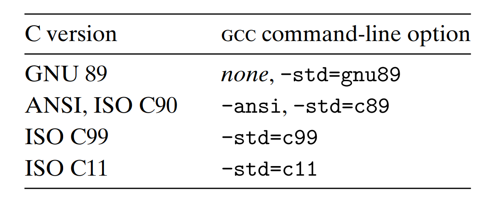

| 图 2.1 在 gcc 中指定不同的 C 语言版本。 |
|:----------------:|

---

<!-- Page 0065 -->

>**C 新手？ C 语言中指针的角色**
>
>指针是 C 的核心特性。它们提供了引用数据结构（包括数组）元素的机制。与变量一样，指针有两个方面：它的值和它的类型。值表示某个对象的位置，而类型表示该位置存储的是什么类型的对象（例如，整数或浮点数）。
>
>真正理解指针需要在机器级别研究它们的表示和实现。这将是第 3 章的主要重点，并在第 3.10.1 节中进行深入介绍。

### 2.1.1 十六进制表示法

一个字节由 8 位组成。在二进制表示中，其值范围为 $00000000_2$ 到 $11111111_2$。作为十进制整数时，其值范围为 $0_{10}$ 到 $255_{10}$。然而，这两种表示方式在描述位模式时都有不便之处：二进制表示冗长，而十进制表示在与位模式之间转换时较为繁琐。因此，我们通常使用以 16 为基数的十六进制数来表示位模式。十六进制（简称 "hex"）使用数字 '0' 到 '9' 以及字母 'A' 到 'F' 来表示 16 个可能的值。图 2.2 展示了每个十六进制数字对应的二进制和十进制值。使用十六进制表示时，单个字节的值范围为 $00_{16}$ 到 $FF_{16}$。

在 C 语言中，以 `0x` 或 `0X` 开头的数字常量被解释为十六进制。字母 'A' 到 'F' 可以用大写或小写书写。例如，数值 $FA1D37B_{16}$ 可以写作 `0xFA1D37B`、`0xfa1d37b`，甚至大小写混合（如 `0xFA1D37b`）。在本书中，我们将采用 C 语言的表示方法来书写十六进制值。

在处理机器级程序时，一个常见任务是手动在十进制、二进制和十六进制的位模式表示之间进行转换。二进制与十六进制之间的转换较为直接，因为可以逐个与十六进制数字进行转换。可参考图 2.2 所示的表格进行转换。在脑中快速转换时，一个小技巧是记住十六进制数字 A、C 和 F 对应的十进制值。十六进制值 B、D 和 E 可以通过计算它们相对于前三个值的关系来转换为十进制。

| Hex digit     | 0    | 1    | 2    | 3    | 4    | 5    | 6    | 7    |
|---------------|------|------|------|------|------|------|------|------|
| Decimal value | 0    | 1    | 2    | 3    | 4    | 5    | 6    | 7    |
| Binary value  | 0000 | 0001 | 0010 | 0011 | 0100 | 0101 | 0110 | 0111 |

| Hex digit     | 8    | 9    | A    | B    | C    | D    | E    | F    |
|---------------|------|------|------|------|------|------|------|------|
| Decimal value | 8    | 9    | 10   | 11   | 12   | 13   | 14   | 15   |
| Binary value  | 1000 | 1001 | 1010 | 1011 | 1100 | 1101 | 1110 | 1111 |

|图 2.2 十六进制表示法。每个十六进制数字编码 16 个值中的一个。|
|:----------------:|

---

<!-- Page 0066 -->

例如，假设给你数字 0x173A4C。你可以通过展开每个十六进制数字将其转换为二进制格式，如下所示：

| Hexadecimal | 1    | 7    | 3    | A    | 4    | C    |
| ----------- | ---- | ---- | ---- | ---- | ---- | ---- |
| Binary      | 0001 | 0111 | 0011 | 1010 | 0100 | 1100 |

这就得到了二进制表示 $000101110011101001001100$。

反过来，给定一个二进制数 $1111001010110110110011$，你可以先将它分成每 4 位一组来转换为十六进制。但请注意，如果总位数不是 4 的倍数，你应该在最左边的组前添加前导零，使其凑足 4 位。然后将每组位翻译为对应的十六进制数字：

| Binary      | 0011 | 1100 | 1010 | 1101 | 1011 | 0011 |
| ----------- | :--: | :--: | :--: | :--: | :--: | :--: |
| Hexadecimal |   3  |   C  |   A  |   D  |   B  |   3  |

---

**练习题 2.1（答案见第 179 页）**

执行以下数制转换： 

A. 0x25B9D2 转换为二进制 

B. 二进制 1010111001001001 转换为十六进制 

C. 0xA8B3D 转换为二进制 

D. 二进制 1100100010110110010110 转换为十六进制 

---

当一个值 $x$ 是 2 的幂时，即 $x = 2^{n}$（$n$ 为非负整数），我们可以很容易地将 $x$ 写成十六进制形式。因为 $x$ 的二进制表示就是 1 后面跟着 $n$ 个零，而十六进制数字 0 表示 4 个二进制零。因此，将 $n$ 表示为 $n = i + 4j$ 的形式（其中 $0 \le i \le 3$），可以将 $x$ 写为前导十六进制数字 1（$i=0$）、2（$i=1$）、4（$i=2$）或 8（$i=3$），后面跟 $j$ 个十六进制 0。例如，对于 $x = 2{,}048 = 2^{11}$，我们有 $n = 11 = 3 + 4\cdot 2$，得到十六进制表示为 0x800。

---

**练习题 2.2（答案见第 179 页）**

填写下表中的空白条目，给出不同的 2 的幂的十进制和十六进制表示：

---

<!-- Page 0067 -->

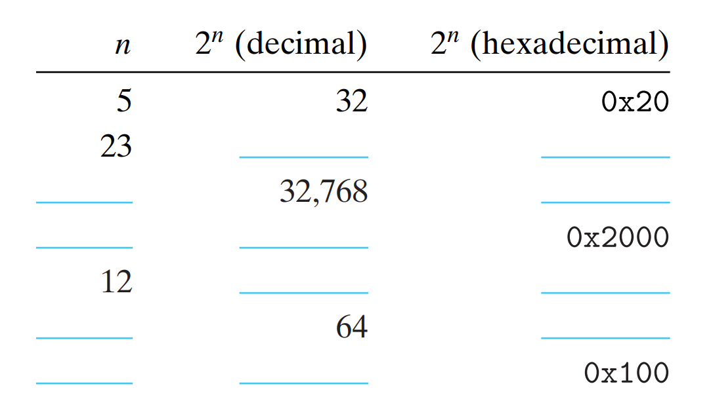

---

将十进制数转换为十六进制表示通常使用除法或乘法处理一般情况。要将十进制数 $x$ 转换为十六进制，我们可以反复将 $x$ 除以 16，得到商 $q$ 和余数 $r$，满足：

$$
x = q \cdot 16 + r
$$

然后用 $r$ 对应的十六进制数字作为最低有效位，并对 $q$ 重复此过程以生成其余数字。例如，将十进制数 314,156 转换为十六进制：

$$
314,156 = 19,634 \cdot 16 + 12 \quad (C)
$$

$$
19,634 = 1,227 \cdot 16 + 2 \quad (2)
$$

$$
1,227 = 76 \cdot 16 + 11 \quad (B)
$$

$$
76 = 4 \cdot 16 + 12 \quad (C)
$$

$$
4 = 0 \cdot 16 + 4 \quad (4)
$$

由此得到十六进制表示为 0x4CB2C。

反过来，要将十六进制数转换为十进制，我们可以将每个十六进制数字乘以对应的 16 的幂。例如，对于数字 0x7AF，其十进制等价为：

$$
7 \cdot 16^{2} + 10 \cdot 16 + 15 = 7 \cdot 256 + 10 \cdot 16 + 15 = 1,792 + 160 + 15 = 1,967
$$

---

**练习题 2.3（答案见第 180 页）**

一个字节可以用 2 个十六进制数字表示。填写下表中缺失的条目，给出不同字节模式的十进制、二进制和十六进制值：

| Decimal | Binary      | Hexadecimal |
|---------|------------|-------------|
| 0       | 0000 0000  | 0x00        |
| 158     | 1001 1110  | 0x9E        |
| 76      | 0100 1100  | 0x4C        |
| 145     | 1001 0001  | 0x91        |
| 174     | 1010 1110  | 0xAE        |
| 60      | 0011 1100  | 0x3C        |
| 241     | 1111 0001  | 0xF1        |
| 117     | 01110101   | 0x75        |
| 189     | 10111101   | 0xBD        |
| 245     | 11110101   | 0xF5        |

---

<!-- Page 0068 -->

>**旁注 十进制和十六进制之间的转换**
>
>对于较大值的十进制和十六进制之间的转换，最好让计算机或计算器来完成。有许多工具可以做到这一点。一个简单的方法是使用任何标准搜索引擎，查询如
>
>`Convert 0xabcd to decimal` 或 `123 in hex`

| Decimal | Binary    | Hexadecimal |


---

**练习题 2.4（答案见第 180 页）**

不要将数字转换为十进制或二进制，尝试解决以下算术问题，以十六进制给出答案。提示：只需修改你用于执行十进制加法和减法的方法，使其使用基数 16。

A. 0x605c + 0x5 = 0x6061

B. 0x605c - 0x20 = 0x603c

C. 0x605c + 32 = 0x607c

D. 0x60fa - 0x605c = 0x09e


### 2.1.2 数据大小

每台计算机都有一个字长（word size），表示指针数据的标称大小（nominal size）。由于虚拟地址是用一个字来编码的，因此字长决定了系统中最关键的参数之一：虚拟地址空间的最大容量。也就是说，对于一台字长为 $w$ 位的机器，虚拟地址的范围可以从 0 到 $2^{w} - 1$，程序最多可以访问 $2^{w}$ 个字节。

近年来，计算机已经广泛从 32 位字长转向 64 位字长。这一转变最初出现在为大规模科学计算和数据库应用设计的高端机器上，随后扩展到台式机和笔记本电脑，最近则延伸到智能手机处理器。32 位字长将虚拟地址空间限制为 4 千兆字节（4 GB），即略大于 $4 \times 10^{9}$ 字节。扩展到 64 位字长后，虚拟地址空间可达 16 艾字节（exabyte），约为 $1.84 \times 10^{19}$ 字节。

---

<!-- Page 0069 -->

大多数 64 位机器也可以运行为 32 位机器编译的程序，这是一种向后兼容性。因此，例如，当程序 `prog.c` 用以下指令编译时：

```
linux> gcc -m32 prog.c
```

该程序将在 32 位或 64 位机器上都能正确运行。另一方面，用以下指令编译的程序：

```
linux> gcc -m64 prog.c
```

只能在 64 位机器上运行。因此，我们将程序称为“32 位程序”或“64 位程序”，因为区别在于程序是如何编译的，而不是运行它的机器类型。

计算机和编译器支持多种数据格式，使用不同的方式来编码数据，如整数和浮点数，以及不同的长度。例如，许多机器都有操作单个字节以及 2、4 和 8 字节整数的指令。它们还支持用 4 或 8 字节表示的浮点数。

C 语言支持整数和浮点数据的多种数据格式。图 2.3 显示了不同 C 数据类型通常分配的字节数（我们在第 2.2 节中讨论了 C 标准保证的字节数与典型值之间的关系）。某些数据类型的确切字节数取决于程序的编译方式。下表显示了典型的 32 位和 64 位程序中各类型的大小。  

整数数据可以是有符号的（能表示负数、零和正数），也可以是无符号的（只允许非负值）。数据类型 `char` 表示单个字节。虽然名称 `char` 源于它用于存储文本字符串中的单个字符，但它也可以用于存储整数值。数据类型 `short`、`int` 和 `long` 旨在提供不同的取值范围。即使在为 64 位系统编译时，数据类型 `int` 通常也只有 4 个字节。数据类型 `long` 在 32 位程序中通常有 4 个字节，而在 64 位程序中则为 8 个字节。

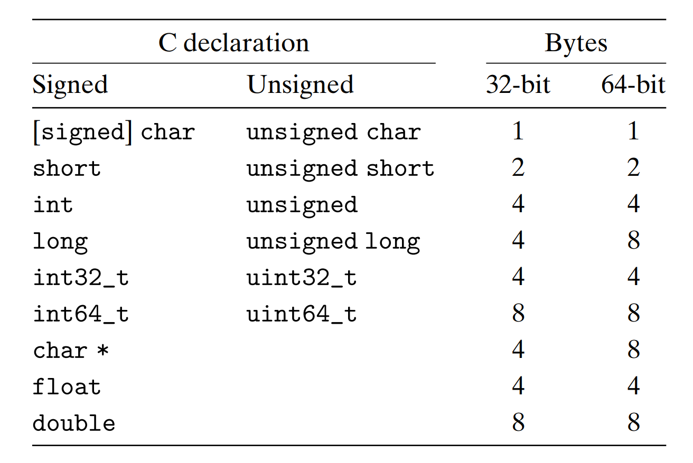

<div align="center">
图 2.3 基本 C 数据类型的典型大小（以字节为单位）。分配的字节数随程序的编译方式而变化。此图表显示了 32 位和 64 位程序的典型值。
</div>

---

<!-- Page 0070 -->

> C 新手？声明指针
>
> 对于任意数据类型 $T$，声明
>
> ```c
> T *p;
> ```
>
> 表示 $p$ 是一个指向类型为 $T$ 的对象的指针变量。例如：
>
> ```c
> char *p;
> ```
>
> 是一个指向 `char` 类型对象的指针声明。

为了避免依赖“类型”大小以及不同编译器设置的不确定性，ISO C99 引入了一类固定大小的数据类型，其数据长度不受编译器或机器设置影响。其中包括 `int32_t` 和 `int64_t`，分别恰好占 4 字节和 8 字节。使用固定大小整数类型是程序员精确控制数据表示的最佳方式。

大多数数据类型默认编码有符号值，除非使用 `unsigned` 关键字前缀或固定大小数据类型的特定无符号声明。例外的是 `char` 类型。虽然大多数编译器和机器将其视为有符号，但 C 标准并不保证这一点。为了确保一个 1 字节有符号值，程序员应使用 `signed char` 声明。然而，在许多上下文中，程序的行为对 `char` 是有符号还是无符号并不敏感。

C 语言允许关键字以多种顺序排列，并可选择性地包含或省略某些关键字。例如，以下声明等效：

```c
unsigned long
unsigned long int
long unsigned
long unsigned int
```
我们将在本文中统一使用图 2.3 的形式。

图 2.3 还显示，指针（如声明为 `char *` 的变量）使用程序的完整字长。大多数机器还支持两种浮点格式：单精度（single precision），在 C 中声明为 `float`；以及双精度（double precision），在 C 中声明为 `double`。它们分别占用 4 字节和 8 字节。

程序员应当努力使其程序能够在不同的机器和编译器之间保持良好的**可移植性**。可移植性的一个重要方面，是让程序不依赖于各类数据类型的**具体字长**。C 语言标准仅对各种数据类型的取值范围规定了**下界**（固定大小类型除外），而未规定**上界**，这一点将在后文中进一步说明。从大约 1980 年到 2010 年，**32 位机器与 32 位程序**的组合长期占据主流，许多程序都是基于图 2.3 中所列的 32 位程序数据分配方式编写的。然而，随着计算平台逐步向 **64 位体系结构**迁移，这些程序在移植到新机器时，隐藏的**字长依赖问题**开始以各种错误的形式暴露出来。例如，长期以来，许多程序员默认认为声明为 `int` 类型的对象可以用来存储指针。这一假设在大多数 32 位程序中是成立的，但在 64 位环境下却会引发严重问题。

---

<!-- Page 0071 -->

### 2.1.3 寻址和字节顺序

对于跨越多个字节的程序对象，我们必须明确两个约定：**对象的地址如何定义**，以及**字节在内存中的排列方式**。在几乎所有机器上，多字节对象都存储为一段连续的字节序列，而对象的地址则由其中**最小的字节地址**给出。例如，假设一个 `int` 类型变量 `x` 的地址为 `0x100`，也就是说，地址表达式 `&x` 的值为 `0x100`。再假设 `int` 类型采用 32 位表示，那么 `x` 的 4 个字节将依次存储在内存地址 `0x100`、`0x101`、`0x102` 和 `0x103` 处。

在表示对象的字节排列方式时，通常存在两种常见约定。考虑一个 $w$ 位整数，其位表示为
$[x_{w-1}, x_{w-2}, \ldots, x_1, x_0]$，其中 $x_{w-1}$ 是最高有效位（MSB），$x_0$ 是最低有效位（LSB）。假设 $w$ 是 8 的倍数，这些位可以按字节进行分组：最高有效字节包含位
$[x_{w-1}, x_{w-2}, \ldots, x_{w-8}]$，最低有效字节包含位
$[x_7, x_6, \ldots, x_0]$，其余字节则由中间的位构成。不同机器对这些字节在内存中的存放顺序有不同的选择。有些机器按照**从最低有效字节到最高有效字节**的顺序存储对象，而另一些机器则按照**从最高有效字节到最低有效字节**的顺序存储。前一种约定——最低有效字节在前——称为**小端法**（*little endian*）；后一种约定——最高有效字节在前——称为**大端法**（*big endian*）。

假设 `int` 类型变量 `x` 位于地址 `0x100`，其十六进制值为 `0x01234567`。那么，在地址范围 `0x100` 到 `0x103` 内，各字节的排列方式将取决于所使用的机器类型：

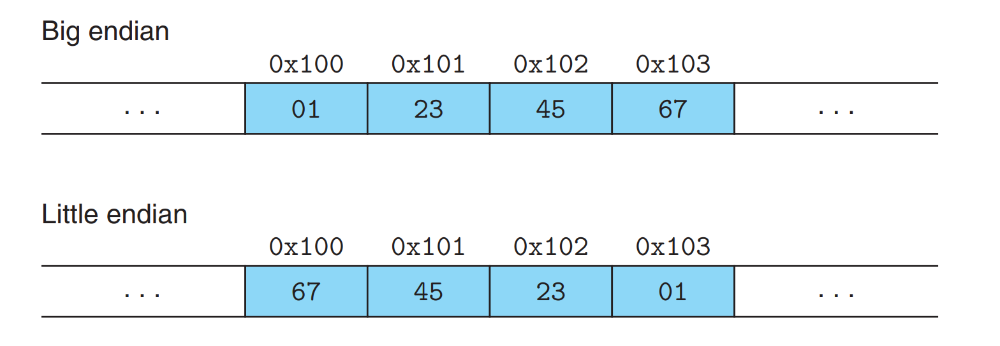

注意，在字 `0x01234567` 中，高位字节的十六进制值为 `0x01`，而低位字节的值为 `0x67`。

大多数 Intel 兼容的机器仅以**小端模式**运行。相对而言，IBM 和 Oracle 的大多数机器（源自它们在 2010 年收购 Sun Microsystems 的产品线）则以**大端模式**运行。需要注意的是，这里强调的是“**大多数**”，这种约定并不严格按照公司界限划分。例如，IBM 和 Oracle 也生产基于 Intel 兼容处理器的机器，因此同样采用小端模式。

此外，许多较新的微处理器芯片是**双端**（bi-endian）的，这意味着它们可以被配置为以小端或大端模式运行。然而在实际应用中，一旦选定了特定的操作系统，字节序通常也就随之固定。例如，广泛应用于手机的 ARM 微处理器在硬件层面支持小端和大端两种模式，但在这些芯片上最常见的两种操作系统——来自 Google 的 Android 和来自 Apple 的 iOS——都只以小端模式运行。

---

<!-- Page 0072 -->

> **旁注：“端”的起源**
>
>以下摘录自乔纳森·斯威夫特于 1726 年所写、关于“大端”和“小端”之争历史的一段描述：
>
> ……利立浦特和布莱夫斯库……正如我要告诉你的那样，过去三十六个月里一直在进行一场最顽固的战争。其起因如下。各方一致承认，打鸡蛋的原始方式是从大头敲开；但当今陛下的祖父还是个男孩时，有一次他按古老的做法敲开鸡蛋，恰巧割破了一根手指。于是，他的父亲——皇帝——颁布了一道敕令，命令所有臣民在严厉惩罚之下必须从小头敲开鸡蛋。
>
> 人们对这条法律极为不满。我们的历史记载表明，因此已经爆发了六次叛乱：其中一位皇帝丧命，另一位被废黜。这些内乱不断受到布莱夫斯库君主的煽动；而当叛乱被镇压后，流亡者总是逃往那个帝国寻求庇护。据统计，先后有一万一千人宁死也不肯从小头敲开鸡蛋。
>
> 关于这场争论已经出版了许多大部头著作；然而，大端派的书籍长期遭到查禁，整个党派也依法被剥夺了担任公职的资格。
>
> ——乔纳森·斯威夫特，《格列佛游记》，本杰明·莫特版，1726 年
>
> 在斯威夫特所处的时代，这段文字讽刺的是英格兰（利立浦特）与法国（布莱夫斯库）之间持续不断的冲突。网络协议的早期先驱丹尼·科恩（Danny Cohen）首次将这些术语引入到字节序的语境中 [24]，此后“大端”和“小端”这一说法被广泛采用。

人们对于哪一种字节顺序才是“正确的”，往往会表现出出奇的激动。事实上，“小端（little-endian）”和“大端（big-endian）”这两个术语源自乔纳森·斯威夫特的《格列佛游记》。在书中，两个交战的派别始终无法就一个问题达成一致：软煮蛋究竟应该从小头打开，还是从大头打开。正如这个鸡蛋问题一样，选择某一种字节顺序约定而非另一种，并不存在技术上的必然理由，因此争论最终往往演变为社会或政治层面的口水战。只要选定一种约定并始终如一地遵循，这种选择本身就是任意而且可行的。

对于大多数应用程序员而言，机器所采用的字节顺序几乎是不可感知的：同一份程序，无论在何种架构的机器上编译和运行，通常都会产生相同的结果。然而，在某些场景下，字节顺序确实会成为一个不可忽视的问题。最常见的情况出现在二进制数据需要通过网络在不同机器之间传输时。例如，小端机器生成的数据被发送到大端机器（或反之），就可能导致接收程序中字内的字节顺序发生颠倒。为避免此类问题，网络应用程序必须遵循统一的字节顺序约定：发送端将其内部表示转换为网络标准格式，而接收端再将网络标准格式转换为自身的内部表示。我们将在第 11 章中看到这些转换的具体示例。

---

<!-- Page 0073 -->

第二种需要关注**字节顺序**的情况，是在查看表示整数数据的字节序列时。这在分析机器级程序时经常出现。例如，下面这行内容出现在描述 Intel x86-64 处理器机器级代码的文本文件中：

```
4004d3: 01 05 43 0b 20 00        add    %eax,0x200b43(%rip)
```

这行信息由**反汇编器**（disassembler）生成。反汇编器是一种用于确定可执行程序文件（executable）中所包含指令序列的工具。我们将在第 3 章中详细介绍反汇编器以及如何解读此类输出。此处只需注意：该行表明，十六进制字节序列 `01 05 43 0b 20 00` 是一条指令的**字节级表示**。这条指令的语义是：将一个数据字加到某个内存地址处存储的值上，而该内存地址由程序计数器（PC，即下一条将要执行的指令地址）的当前值加上偏移量 `0x200b43` 计算得到。如果我们取该字节序列的最后 4 个字节 `43 0b 20 00`，并将其按相反顺序书写，得到 `00 20 0b 43`。再去掉前导的 `0`，即可得到数值 `0x200b43`，正是右侧指令中显示的偏移量。对于为**小端序**机器生成的机器级程序表示而言，这种“字节按相反顺序出现”的现象非常常见。人们书写字节序列时，通常将编号最低的字节放在左侧、编号最高的字节放在右侧；但这恰好与数字的常规书写方式相反——数字通常是**最高有效位在左、最低有效位在右**。

第三种字节顺序变得显而易见的情况，出现在编写**绕过正常类型系统**的程序时。在 C 语言中，可以通过**强制类型转换**（cast）或**联合体**（union），以与对象创建时不同的数据类型来引用同一块内存。这类编码技巧在大多数应用层程序设计中并不被鼓励，但在系统级编程中，它们往往十分有用，甚至在某些场景下是不可或缺的。

图 2.4 展示了一段 C 代码，该代码通过**强制类型转换**来访问并打印不同程序对象的字节表示。我们使用 `typedef` 将数据类型 `byte_pointer` 定义为指向 `unsigned char` 类型对象的指针。这样的字节指针用于引用一个字节序列，其中每个字节都被视为一个非负整数。第一个函数 `show_bytes` 接收两个参数：一个字节序列的起始地址（由字节指针表示）以及一个字节计数。字节计数采用 `size_t` 数据类型，这是用于表示数据结构大小的首选类型。该例程以十六进制形式逐字节打印内存内容。C 的格式化指令 `%.2x` 表示一个整数应以十六进制输出，并且至少占用 2 位数字。

---

<!-- Page 0074 -->

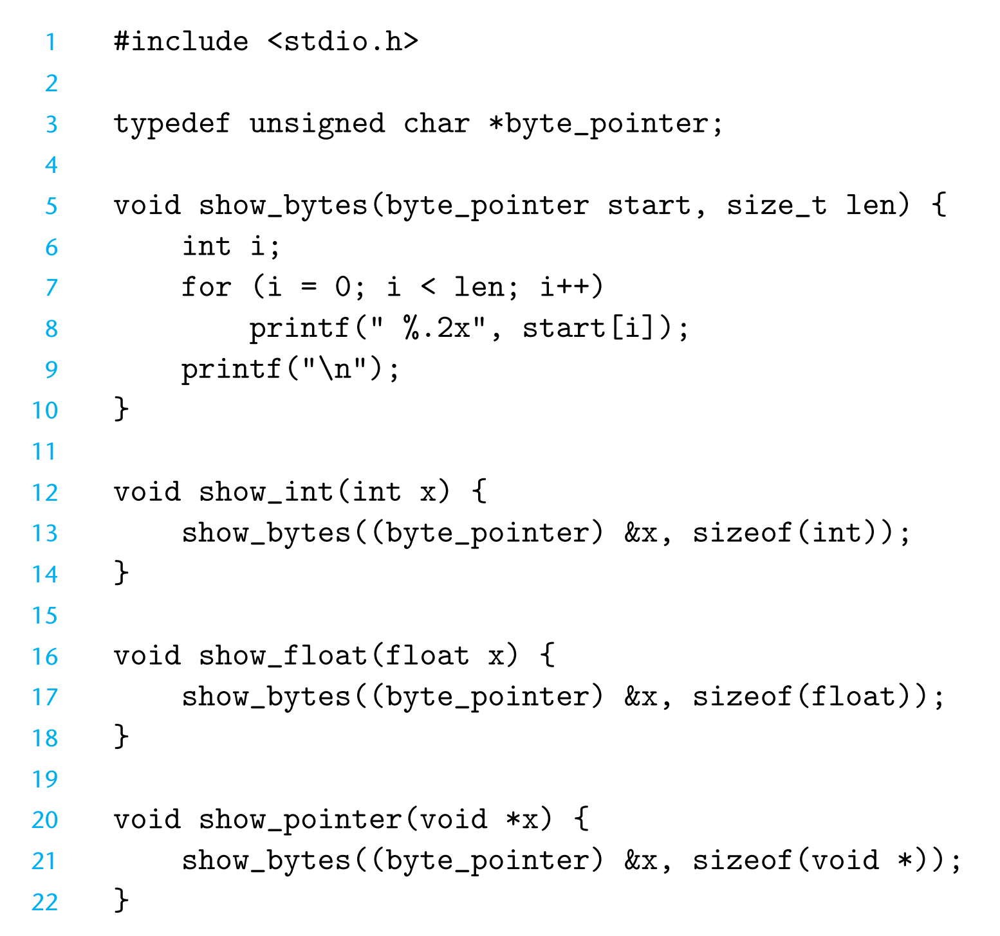
<div align="center">
图 2.4 给出了用于打印程序对象字节表示的示例代码。该代码通过强制类型转换绕过了类型系统的限制，从而直接访问对象的底层字节表示。采用同样的思路，可以很容易地为其他数据类型定义类似的函数。
</div>

过程 `show_int`、`show_float` 和 `show_pointer` 分别演示了如何使用 `show_bytes` 来打印类型为 `int`、`float` 和 `void *` 的 C 程序对象的字节表示。需要注意的是，它们仅仅将参数 `x` 的地址 `&x` 传递给 `show_bytes`，并将该指针强制转换为 `unsigned char *` 类型。这种强制转换明确告知编译器，应当把该指针视为指向一个字节序列，而不是原始数据类型的对象。这样，指针便指向该对象在内存中所占据的最低字节地址。

这些过程使用 C 语言的 `sizeof` 运算符来确定对象所占用的字节数。一般而言，表达式 $\text{sizeof}(T)$ 返回存储类型 $T$ 的对象所需的字节数量。使用 `sizeof` 而不是硬编码的常数，是编写能够跨不同机器体系结构运行的可移植代码的重要一步。

我们在多种不同的机器上运行了图 2.5 所示的代码，得到的实验结果如图 2.6 所示。所使用的机器包括：

* **Linux 32**：运行 Linux 操作系统的 Intel IA32 处理器
* **Windows**：运行 Windows 操作系统的 Intel IA32 处理器
* **Sun**：运行 Solaris 操作系统的 Sun Microsystems SPARC 处理器（现由 Oracle 生产）
* **Linux 64**：运行 Linux 操作系统的 Intel x86-64 处理器

---

<!-- Page 0075 -->

```c
void test_show_bytes(int val) {
    int ival = val;
    float fval = (float) ival;
    int *pval = &ival;
    show_int(ival);
    show_float(fval);
    show_pointer(pval);
}
```

<div style="text-align: center;">图 2.5 字节表示示例。此代码打印示例数据对象的字节表示。</div>

| Machine      | Value     | Type  | Bytes (hex)                 |
|--------------|-----------|-------|-----------------------------|
| Linux 32     | 12,345    | int   | 39 30 00 00                 |
| Windows      | 12,345    | int   | 39 30 00 00                 |
| Sun          | 12,345    | int   | 00 00 30 39                 |
| Linux 64     | 12,345    | int   | 39 30 00 00                 |
| Linux 32     | 12,345.0  | float | 00 e4 40 46                 |
| Windows      | 12,345.0  | float | 00 e4 40 46                 |
| Sun          | 12,345.0  | float | 46 40 e4 00                 |
| Linux 64     | 12,345.0  | float | 00 e4 40 46                 |
| Linux 32     | &ival     | int * | e4 f9 ff bf                 |
| Windows      | &ival     | int * | b4 cc 22 00                 |
| Sun          | &ival     | int * | ef ff fa 0c                 |
| Linux 64     | &ival     | int * | b8 11 e5 ff ff 7f 00 00     |

<div style="text-align: center;">图 2.6 不同数据值的字节表示。int 和 float 的结果相同，只是字节顺序不同。指针值取决于机器。</div>

我们的参数 12,345 的十六进制表示为 `0x00003039`。对于 `int` 类型的数据，不同机器上的数值结果是相同的，差异仅体现在字节存储顺序上。具体来说，最低有效字节 `0x39` 在 Linux 32、Windows 和 Linux 64 系统中最先打印，表明这些平台采用的是**小端序**；而在 Sun 机器上，该字节最后打印，说明其采用的是**大端序**。类似地，`float` 类型数据在不同平台上的字节内容是一致的，只是字节顺序有所不同。相比之下，**指针值**则完全不同，这是因为不同的机器和操作系统组合采用了不同的内存分配与寻址约定。需要特别注意的是，Linux 32、Windows 和 Sun 平台使用的是 **4 字节地址**，而 Linux 64 平台则使用 **8 字节地址**。

---

<!-- Page 0076 -->

> **C 新手？用 `typedef` 命名数据类型**
>
> 在 C 语言中，`typedef` 声明提供了一种为数据类型命名的方式。对于提升代码可读性，这一点尤为重要，因为深度嵌套或复杂的类型声明往往难以理解。
>
> `typedef` 的语法与变量声明完全一致，只是使用**类型名**而不是**变量名**。因此，图 2.4 中 `byte_pointer` 的声明形式，与声明一个 `unsigned char *` 类型的变量在语法上是等价的。
>
> 例如，下面的声明：
>
> ```c
> typedef int *int_pointer;
> ```
>
> 随后使用：
>
> ```c
> int_pointer ip;
> ```
>
> 将类型 `int_pointer` 定义为“指向 `int` 的指针”，并声明了一个该类型的变量 `ip`。当然，也可以直接将该变量声明为：
>
> ```c
> int *ip;
> ```

---

> **C 新手？用 `printf` 进行格式化打印**
>
> `printf` 函数（以及其姊妹函数 `fprintf` 和 `sprintf`）提供了一种对输出格式进行精细控制的打印方式。它的第一个参数是格式字符串，其余参数则是需要打印的值。
>
> 在格式字符串中，每一个以 `%` 开头的格式说明符都指示如何格式化下一个参数。常见示例如下：
>
> * `%d`：打印十进制整数
> * `%f`：打印浮点数
> * `%c`：打印由参数给出的字符代码所对应的字符
>
> 对于固定大小的数据类型（如 `int32_t`），其格式化输出稍微复杂一些，具体可参考第 103 页的旁注说明。

---

请注意，尽管浮点数和整数都可以表示数值 12345，但它们在内存中的**字节模式**却截然不同：

* 整数表示为 `0x00003039`
* 浮点数表示为 `0x4640E400`

一般而言，这两种数据类型采用的是完全不同的编码方案。如果将上述十六进制表示展开为二进制形式，并进行适当的对齐和移位，就会发现其中存在一个长度为 13 位的匹配序列。下面用一系列星号标出该公共部分：

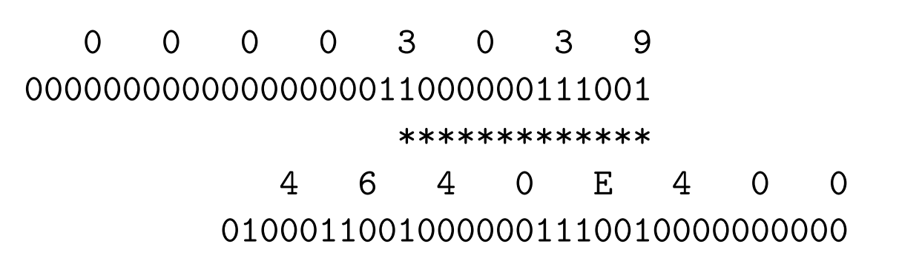

这并非巧合。在后续学习浮点数表示格式时，我们还会再次回到这个示例进行深入分析。

---

<!-- Page 0077 -->

> **C 新手？指针与数组**
>
> 在函数 `show_bytes`（见图 2.4）中，我们已经初步看到了指针与数组之间的紧密联系，这一点将在第 3.8 节中进一步详细讨论。该函数有一个类型为 `byte_pointer`（已定义为指向 `unsigned char` 的指针）的参数 `start`，但在第 8 行中却出现了数组形式的引用 `start[i]`。在 C 语言中，既可以使用数组表示法来解引用指针，也可以使用指针表示法来访问数组元素。在这个例子里，表达式 `start[i]` 表示读取从 `start` 所指位置开始、偏移 $i$ 个字节处的内容。

---

> **C 新手？指针的创建与解引用**
>
> 在图 2.4 的第 13、17 和 21 行中，我们看到了两种赋予 C（以及 C++）独特特征的操作。C 语言中的“取地址”运算符 `&` 用于创建指针。在这三行代码中，表达式 `&x` 都会生成一个指向变量 `x` 所在内存位置的指针。该指针的类型取决于 `x` 的类型，因此这三个指针的类型分别为 `int *`、`float *` 和 `void **`。（其中，`void *` 是一种不包含任何类型信息的特殊指针。）
>
> 强制类型转换运算符用于将一种数据类型转换为另一种数据类型。因此，强制转换 `(byte_pointer) &x` 表示：无论指针 `&x` 原本的类型是什么，程序现在都将其视为一个指向 `unsigned char` 类型数据的指针。需要注意的是，这种强制转换并不会改变指针实际指向的地址；它只是告诉编译器，应当按照新的数据类型来解释和访问该地址中的数据。

---

> **旁注：生成 ASCII 表**
>
> 你可以通过执行命令 `man ascii` 来查看完整的 ASCII 字符编码表。

**练习题 2.5（答案见第 180 页）**

考虑以下三次对 show_bytes 的调用：

```c
int a = 0x12345678;
byte_pointer ap = (byte_pointer) &a;
show_bytes(ap, 1); /* A. */
show_bytes(ap, 2); /* B. */
show_bytes(ap, 3); /* C. */
```

指出在小端机器和大端机器上每次调用将打印的值：

A. 小端：______ 大端：______

B. 小端：______ 大端：______

C. 小端：______ 大端：______

---

<!-- Page 0078 -->

*练习题 2.6（答案见第 181 页）*

使用 `show_int` 和 `show_float`，我们确定整数 2607352 的十六进制表示为 0x0027C8F8，而浮点数 3510593.0 的十六进制表示为 0x4A1F23E0。

**A.** 写出这两个十六进制值对应的二进制表示。

**B.** 将这两个二进制字符串进行相对移位，以最大化匹配的位数。共有多少位能够匹配？

**C.** 哪些部分的位不匹配？

---

### 2.1.4 表示字符串

在 C 语言中，字符串被编码为以空字符（值为 0）结尾的字符数组。每个字符都采用某种标准编码表示，最常见的是 **ASCII** 字符编码。

因此，如果我们以参数 `"12345"` 和长度 **6**（包括终止字符）运行示例例程 `show_bytes`，将得到如下结果：

```
31 32 33 34 35 00
```

注意，十进制数字 $x$ 的 ASCII 编码恰好是 $\text{0x3}x$，而终止字节的十六进制表示为 0x00。在任何使用 ASCII 作为字符编码的系统上，这一结果都是一致的，与字节序和字长约定无关。因此，相较于二进制数据，文本数据具有更强的平台独立性。

---

**练习题 2.7（答案见第 181 页）**

下面对 `show_bytes` 的调用将打印出什么结果？

```c
const char *m = "mnopqr";
show_bytes((byte_pointer) m, strlen(m));
```

注意，字母 `'a'` 到 `'z'` 的 ASCII 编码范围是 0x61 到 0x7A。

---

### 2.1.5 表示代码

考虑下面的 C 函数：

```c
int sum(int x, int y) {
    return x + y;
}
```

在我们的示例机器上对其进行编译，会生成如下字节表示的机器代码：

```
Linux 32   55 89 e5 8b 45 0c 03 45 08 c9 c3
Windows    55 89 e5 8b 45 0c 03 45 08 5d c3
Sun        81 c3 e0 08 90 02 00 09
Linux 64   55 48 89 e5 89 7d fc 89 75 f8 03 45 fc c9 c3
```

---

<!-- Page 0079 -->

> **旁注：Unicode 文本编码标准**
>
> ASCII 字符集适合用于编码英语文档，但对特殊字符（如法语中的 *ç*）支持有限，更完全不适合用于编码希腊语、俄语和中文等语言的文本。多年来，人们提出了多种方法来对不同语言的文本进行编码。Unicode 联盟设计并推广了目前最全面、也最被广泛接受的文本编码标准。当前的 Unicode 标准（7.0 版）包含超过 100,000 个字符，覆盖了多种语言，甚至包括古埃及语和古巴比伦语。值得一提的是，Unicode 技术委员会曾拒绝将虚构文明的克林贡语（出自电视剧《星际迷航》）纳入标准书写系统的提案。
>
> 基本编码形式，即 Unicode 的“通用字符集”，使用 32 位来表示每个字符。这看起来似乎要求每个字符占用 4 个字节，从而导致文本字符串体积较大。然而，Unicode 也支持多种替代编码方案，其中常见字符只需要 1 或 2 个字节，而较少使用的字符则使用更多字节。尤其重要的是 UTF-8 编码，它将每个字符表示为一个字节序列，使得所有标准 ASCII 字符在 UTF-8 中仍采用与 ASCII 完全相同的单字节编码。这意味着，任何合法的 ASCII 字节序列在 UTF-8 中都保持原有含义。
>
> Java 编程语言在其字符串表示中原生使用 Unicode。C 语言虽然本身不强制使用 Unicode，但已经有成熟的程序库可用于支持 Unicode 编码。

在这里，我们可以看到指令编码存在差异。不同类型的机器使用不同且彼此不兼容的指令集和编码方式。即使是相同处理器，在运行不同操作系统时，其编码约定也可能不同，因此无法实现二进制兼容。这也解释了为什么二进制程序通常难以在不同的机器和操作系统组合之间移植。

计算机系统中的一个基本概念是：从机器的视角来看，程序仅仅是一个字节序列。机器并不了解原始源程序的任何结构或语义信息，除非额外维护了一些辅助表（例如用于调试）。在第 3 章学习机器级编程时，这一点将体现得更加清楚。

### 2.1.6 布尔代数简介

由于二进制值是计算机编码、存储和处理信息的核心，围绕数值 0 和 1 的研究逐渐发展出一套内容丰富的数学理论体系。这一体系起源于乔治·布尔（George Boole，1815–1864）在大约 1850 年的工作，因此被称为**布尔代数**。布尔注意到，如果将逻辑值 TRUE 和 FALSE 分别编码为二进制值 1 和 0，就可以构建一种代数结构，用来刻画逻辑推理的基本规律。

最简单的布尔代数定义在二元素集合 ${0, 1}$ 上。图 2.7 给出了该代数中的若干基本运算。我们所采用的符号选择与 C 语言中的位级运算保持一致，后文将对此进行进一步讨论。

* 布尔运算 `~` 对应于逻辑运算 **NOT**，通常用符号 $\lnot$ 表示。当命题 $P$ 不为真时，$\lnot P$ 为真；反之亦然。对应到二进制表示，当 $p = 0$ 时，$\sim p = 1$，当 $p = 1$ 时，$\sim p = 0$。
* 布尔运算 `&` 对应于逻辑运算 **AND**，用符号 $\land$ 表示。当且仅当 $P$ 和 $Q$ 都为真时，$P \land Q$ 成立。相应地，只有当 $p = 1$ 且 $q = 1$ 时，$p \& q = 1$。
* 布尔运算 `|` 对应于逻辑运算 **OR**，用符号 $\lor$ 表示。当 $P$ 或 $Q$ 至少有一个为真时，$P \lor Q$ 成立。相应地，只要 $p = 1$ 或 $q = 1$，就有 $p | q = 1$。
* 布尔运算 `^` 对应于逻辑运算 **EXCLUSIVE-OR**（异或），用符号 $\oplus$ 表示。当 $P$ 和 $Q$ 中恰有一个为真时，$P \oplus Q$ 成立。对应到二进制，当 $p = 1, q = 0$ 或 $p = 0, q = 1$ 时，$p \wedge q = 1$。

---

<!-- Page 0080 -->

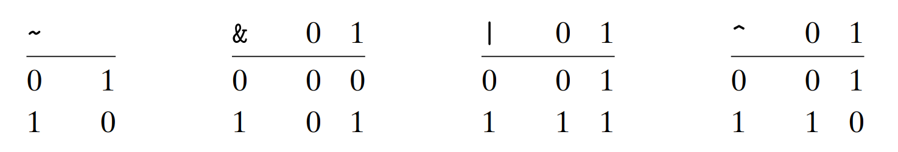

<div style="text-align: center;">图 2.7 布尔代数的运算。二进制值 1 和 0 编码逻辑值 TRUE 和 FALSE，而运算 ~、&、| 和 ^ 分别编码逻辑运算 NOT、AND、OR 和 EXCLUSIVE-OR。</div>

克劳德·香农 (Claude Shannon, 1916–2001) 是信息论领域的创始人，他首次建立了布尔代数与数字逻辑之间的联系。在他 1937 年的硕士论文中，他证明了布尔代数可以应用于机电继电器网络的设计和分析。尽管计算机技术自那时以来取得了巨大进步，但布尔代数在数字系统的设计与分析中仍然发挥着核心作用。

我们可以将四种布尔运算扩展到位向量（bit vector）上——即由 0 和 1 组成的固定长度 $w$ 的字符串。位向量上的运算是按对应元素进行的。设 $a$ 和 $b$ 分别表示位向量 $a = \{a_{w-1}, a_{w-2}, \dots, a_0\}$ 和 $b = \{b_{w-1}, b_{w-2}, \dots, b_0\}$。我们定义 $a \& b$ 也是长度为 $w$ 的位向量，其中第 $i$ 个元素为 $a_i \& b_i$（$0 \le i < w$）。运算 $|$、$\wedge$ 和 $\sim$ 也可以以类似方式扩展到位向量。

例如，考虑 $w = 4$ 的情况，参数 $a = [0110]$ 和 $b = [1100]$。则四个运算 $a \& b$、$a | b$、$a \wedge b$ 和 $\sim b$ 的结果分别为：

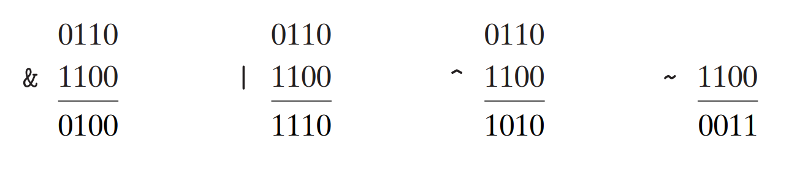

**练习题 2.8（答案见第 181 页）**

填写下表，显示对位向量进行布尔运算后的结果。

---

<!-- Page 0081 -->

> **旁注：关于布尔代数与布尔环的进一步说明**
>
> 对长度为 $w$ 的位向量所进行的布尔运算 `|`、`&` 和 `~` 构成一个布尔代数，其中 $w > 0$。最简单的情形是 $w = 1$，此时只有两个元素；而在更一般的情况下，长度为 $w$ 的位向量共有 $2^w$ 个。
>
> 布尔代数在许多性质上与整数算术相似。例如，整数乘法对加法具有分配律：
>
> $$a \cdot (b + c) = (a \cdot b) + (a \cdot c)$$
>
> 类似地，布尔运算 `&` 对 `|` 也满足分配律：
>
> $$a \,\&\, (b \,|\, c) = (a \,\&\, b) \,|\, (a \,\&\, c)$$
>
> 不同的是，在布尔代数中，`|` 同样对 `&` 具有分配律：
>
> $$a \,|\, (b \,\&\, c) = (a \,|\, b) \,\&\, (a \,|\, c)$$
>
> 而在整数算术中，并不存在对所有整数都成立的等式
>
> $$a + (b \cdot c) = (a + b) \cdot (a + c)$$
>
> 如果我们考虑长度为 $w$ 的位向量上的运算 `^`、`&` 和 `~`，则会得到一种不同的数学结构，称为**布尔环**。布尔环同样与整数算术具有许多相似之处。例如，在整数算术中，每个数 $x$ 都存在一个加法逆元 $-x$，使得
>
> $$x + (-x) = 0$$
>
> 在布尔环中，`^` 扮演“加法”的角色，但其特点是：每个元素都是自身的加法逆元。也就是说，对任意 $a$，都有
>
> $$a \wedge a = 0$$
>
> 其中 $0$ 表示全零位向量。对于单个位而言，这一点显然成立，因为
>
> $$0 \wedge 0 = 1 \wedge 1 = 0$$
>
> 该性质可以自然推广到位向量，并且即使重新排列运算项或改变组合顺序，也依然成立。例如：
>
> $$ (a \wedge b) \wedge a = b $$
>
> 这一特性引出了许多有趣的结论和巧妙的技巧，我们将在习题 2.10 中进一步探讨。

<table border=1 style="margin: auto; word-wrap: break-word;">
  <tr>
    <td style="text-align: center;">Operation</td>
    <td style="text-align: center;">Result</td>
  </tr>
  <tr>
    <td style="text-align: center;">a</td>
    <td style="text-align: center;">[01001110]</td>
  </tr>
  <tr>
    <td style="text-align: center;">b</td>
    <td style="text-align: center;">[11100001]</td>
  </tr>
  <tr>
    <td style="text-align: center;">~a</td>
    <td style="text-align: center;"></td>
  </tr>
  <tr>
    <td style="text-align: center;">~b</td>
    <td style="text-align: center;"></td>
  </tr>
  <tr>
    <td style="text-align: center;">a &amp; b</td>
    <td style="text-align: center;"></td>
  </tr>
  <tr>
    <td style="text-align: center;">a | b</td>
    <td style="text-align: center;"></td>
  </tr>
  <tr>
    <td style="text-align: center;">a ^ b</td>
    <td style="text-align: center;"></td>
  </tr>
</table>

位向量的一个重要应用是用于表示有限集合。我们可以用位向量
$[a_{w-1}, \ldots, a_1, a_0]$
来编码任意子集
$A \subseteq \{0, 1, \ldots, w - 1\}$，
其中当且仅当 $i \in A$ 时，有 $a_i = 1$。

例如，按照约定将 $a_{w-1}$ 写在最左侧、$a_0$ 写在最右侧，位向量
$a = [01101001]$
编码的集合为
$A = \{0, 3, 5, 6\}$，
而位向量
$b = [01010101]$
编码的集合为
$B = \{0, 2, 4, 6\}$。

在这种编码方式下，布尔运算 `|` 和 `&` 分别对应集合的并集与交集，而 `~` 对应集合的补集。继续上述例子，运算
$a \,\&\, b$
得到位向量
$[01000001]$，
而对应的集合交集为
$A \cap B = \{0, 6\}$。

在许多实际应用中，都可以看到使用位向量来表示集合的做法。例如，在第 8 章中，我们将看到程序执行过程中可能会被多种不同的信号（signal）中断（interrupt）。通过指定一个位向量形式的掩码（mask），可以选择性地启用或禁用不同的信号：位位置 $i$ 上的 1 表示信号 $i$ 被启用，0 则表示该信号被禁用。因此，这样的掩码本质上就是“被启用信号集合”的一种表示。


---

<!-- Page 0082 -->

**练习题 2.9（答案见第 182 页）**

计算机通过在视频屏幕或液晶显示器上混合三种不同颜色的光——红色（Red）、绿色（Green）和蓝色（Blue）——来生成彩色图像。可以将这一过程想象为一个简单的方案：有三盏不同的灯，每一盏都可以打开或关闭，并将光投射到一块玻璃屏幕上：

<div style="text-align: center;">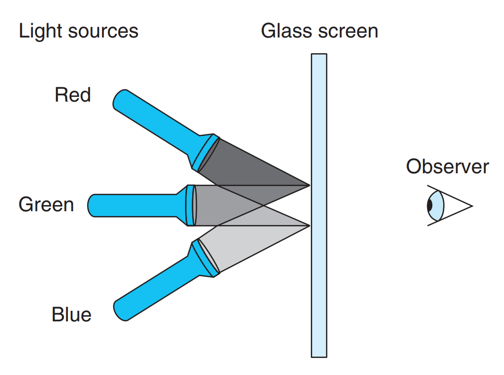</div>

根据光源 R、G 和 B 的缺失（0）或存在（1），我们可以组合出八种不同的颜色：

<table border=1 style="margin: auto; word-wrap: break-word;">
<tr>
  <td style="text-align: center;">R</td>
  <td style="text-align: center;">G</td>
  <td style="text-align: center;">B</td>
  <td style="text-align: center;">Color</td>
</tr>
<tr>
  <td style="text-align: center;">0</td>
  <td style="text-align: center;">0</td>
  <td style="text-align: center;">0</td>
  <td style="text-align: center;">Black</td>
</tr>
<tr>
  <td style="text-align: center;">0</td>
  <td style="text-align: center;">0</td>
  <td style="text-align: center;">1</td>
  <td style="text-align: center;">Blue</td>
</tr>
<tr>
  <td style="text-align: center;">0</td>
  <td style="text-align: center;">1</td>
  <td style="text-align: center;">0</td>
  <td style="text-align: center;">Green</td>
</tr>
<tr>
  <td style="text-align: center;">0</td>
  <td style="text-align: center;">1</td>
  <td style="text-align: center;">1</td>
  <td style="text-align: center;">Cyan</td>
</tr>
<tr>
  <td style="text-align: center;">1</td>
  <td style="text-align: center;">0</td>
  <td style="text-align: center;">0</td>
  <td style="text-align: center;">Red</td>
</tr>
<tr>
  <td style="text-align: center;">1</td>
  <td style="text-align: center;">0</td>
  <td style="text-align: center;">1</td>
  <td style="text-align: center;">Magenta</td>
</tr>
<tr>
  <td style="text-align: center;">1</td>
  <td style="text-align: center;">1</td>
  <td style="text-align: center;">0</td>
  <td style="text-align: center;">Yellow</td>
</tr>
<tr>
  <td style="text-align: center;">1</td>
  <td style="text-align: center;">1</td>
  <td style="text-align: center;">1</td>
  <td style="text-align: center;">White</td>
</tr>
</table>

每一种颜色都可以用一个长度为 3 的位向量来表示，因此可以对这些颜色直接应用布尔运算。

**A.** 颜色的补色是通过“关闭原本打开的灯，并打开原本关闭的灯”得到的。上表中列出的八种颜色，各自的补色是什么？

**B.** 描述对下列颜色应用布尔运算后的结果：

* Blue | Green = ___
* Yellow & Cyan = ___
* Red ^ Magenta = ___

---

<!-- Page 0083 -->

### 2.1.7 C 语言中的位级运算

C 语言的一个重要特性是支持**按位布尔运算**。事实上，我们常用的布尔运算符号正是 C 语言所采用的表示方式：`|` 表示 **OR**，`&` 表示 **AND**，`~` 表示 **NOT**，`^` 表示 **EXCLUSIVE-OR（异或）**。这些运算可以作用于任何“整型”数据类型，包括图 2.3 中列出的所有类型。下面给出了若干针对 `char` 类型的按位运算表达式求值示例：

<table border=1 style='margin: auto; word-wrap: break-word;'>
<tr>
<td style='text-align: center;'>C expression</td>
<td style='text-align: center;'>Binary expression</td>
<td style='text-align: center;'>Binary result</td>
<td style='text-align: center;'>Hexadecimal result</td>
</tr>
<tr>
<td style='text-align: center;'>~0x41</td>
<td style='text-align: center;'>~[0100 0001]</td>
<td style='text-align: center;'>[1011 1110]</td>
<td style='text-align: center;'>0xBE</td>
</tr>
<tr>
<td style='text-align: center;'>~0x00</td>
<td style='text-align: center;'>~[0000 0000]</td>
<td style='text-align: center;'>[1111 1111]</td>
<td style='text-align: center;'>0xFF</td>
</tr>
<tr>
<td style='text-align: center;'>0x69 &amp; 0x55</td>
<td style='text-align: center;'>[0110 1001] &amp; [0101 0101]</td>
<td style='text-align: center;'>[0100 0001]</td>
<td style='text-align: center;'>0x41</td>
</tr>
<tr>
<td style='text-align: center;'>0x69 | 0x55</td>
<td style='text-align: center;'>[0110 1001] | [0101 0101]</td>
<td style='text-align: center;'>[0111 1101]</td>
<td style='text-align: center;'>0x7D</td>
</tr>
</table>

如上述示例所示，理解位级表达式效果的最佳方法，是先将十六进制操作数展开为二进制形式，在二进制层面执行相应的按位运算，然后再将结果转换回十六进制表示。

---

**练习题 2.10（答案见第 182 页）**

作为性质 $a \wedge a = 0$（对任意位向量 $a$ 都成立）的一个应用，考虑如下程序：

```c
void inplace_swap(int *x, int *y) {
    *y = *x ^ *y;  /* Step 1 */
    *x = *x ^ *y;  /* Step 2 */
    *y = *x ^ *y;  /* Step 3 */
}
```

顾名思义，该过程的作用是交换指针变量 `x` 和 `y` 所指向位置中存储的值。需要注意的是，与通常借助第三个临时变量来完成交换的做法不同，这里并不需要额外的存储空间。这种交换方式在性能上并无优势，更多只是一种富有趣味性的思想实验。

设 `x` 和 `y` 最初分别指向的值为 $a$ 和 $b$。请填写下表，给出该过程在每一步执行完成后，这两个位置中存储的值，并利用异或运算的性质证明最终确实实现了交换。回忆：对于任意位向量 $a$，都有 $a \wedge a = 0$。

<table border=1 style='margin: auto; word-wrap: break-word;'>
<tr>
<td style='text-align: center;'>Step</td>
<td style='text-align: center;'>*x</td>
<td style='text-align: center;'>*y</td>
</tr>
<tr>
<td style='text-align: center;'>Initially</td>
<td style='text-align: center;'>a</td>
<td style='text-align: center;'>b</td>
</tr>
<tr>
<td style='text-align: center;'>Step 1</td>
<td style='text-align: center;'></td>
<td style='text-align: center;'></td>
</tr>
<tr>
<td style='text-align: center;'>Step 2</td>
<td style='text-align: center;'></td>
<td style='text-align: center;'></td>
</tr>
<tr>
<td style='text-align: center;'>Step 3</td>
<td style='text-align: center;'></td>
<td style='text-align: center;'></td>
</tr>
</table>

---

<!-- Page 0084 -->

**练习题 2.11（答案见第 182 页）**

利用习题 2.10 中的函数 `inplace_swap`，你决定通过从数组两端开始交换元素并逐步向中间推进的方式，来反转数组中的元素。

你得到了如下函数：

```c
void reverse_array(int a[], int cnt) {
    int first, last;
    for (first = 0, last = cnt - 1;
         first <= last;
         first++, last--)
        inplace_swap(&a[first], &a[last]);
}
```

当你将该函数应用于包含元素 1、2、3 和 4 的数组时，结果符合预期，数组变为 4、3、2 和 1。但当你在包含元素 1、2、3、4 和 5 的数组上尝试时，却惊讶地发现数组变成了 5、4、0、2 和 1。事实上，你发现该代码在数组长度为偶数时总能正确工作，而当数组长度为奇数时，总会将中间元素置为 0。

A. 对于长度为奇数、$\text{cnt} = 2k + 1$ 的数组，在函数 `reverse_array` 的最后一次循环迭代中，变量 `first` 和 `last` 的值分别是多少？

B. 为什么对函数 `inplace_swap` 的这一次调用会将数组中的元素置为 0？

C. 对 `reverse_array` 的代码做出什么简单的修改可以消除这一问题？

---

位级运算的一个常见用途是实现掩码操作，其中掩码是一个位模式，用来指示字中被选定的一组位。例如，掩码 `0xFF`（最低有效 8 位为 1）表示一个字的低位字节。位级运算 `x & 0xFF` 会产生一个仅由 `x` 的最低有效字节组成的值，其余所有字节都被置为 0。
例如，当 `x = 0x89ABCDEF` 时，该表达式的结果为 `0x000000EF`。表达式 `~0` 会生成一个全 1 的掩码，与数据表示的位数无关。当 `int` 类型为 32 位时，同样的掩码也可以写作 `0xFFFFFFFF`，但这种写法的可移植性较差。

---

**练习题 2.12（答案见第 182 页）**

用变量 x 写出下列值对应的 C 表达式。你的代码应适用于任意字长 $w \geq 8$。作为参考，我们给出了在 `x = 0x87654321`（$w = 32$）时，各表达式的求值结果。

A. `x` 的最低有效字节，其余所有位均置为 0。
[0x00000021]

B. 除最低有效字节外，将 `x` 的其余所有字节取反，而最低有效字节保持不变。
[0x789ABC21]

C. 最低有效字节设为全 1，x 的所有其他字节保持不变。[0x876543FF]

---

<!-- Page 0085 -->

**练习题 2.13（答案见第 183 页）**

Digital Equipment 公司推出的 VAX 计算机在 20 世纪 70 年代末至 80 年代末曾广泛流行。该体系结构中并未提供用于布尔运算 AND 和 OR 的指令，而是引入了两条特殊指令：**bis**（bit set，位设置）和 **bic**（bit clear，位清除）。这两条指令都接受一个数据字 `x` 和一个掩码字 `m`，并生成结果 `z`，其值由 `x` 的各个位根据 `m` 的对应位进行修改而得。

* 对于 **bis**，凡是 `m` 中为 1 的位位置，`z` 对应位被设置为 1；
* 对于 **bic**，凡是 `m` 中为 1 的位位置，`z` 对应位被清除为 0。

为了理解这些操作与 C 语言位级运算之间的关系，假设我们已经有实现位设置和位清除操作的函数 **bis** 和 **bic**，并希望仅通过调用它们来实现按位 OR（`|`）和按位 XOR（`^`）运算，而不使用任何其他 C 运算符。请补全下面代码中的缺失部分。
**提示**：先写出 **bis** 和 **bic** 操作对应的 C 语言表达式。

```c
/* Declarations of functions implementing operations bis and bic */
int bis(int x, int m);
int bic(int x, int m);

/* Compute x|y using only calls to functions bis and bic */
int bool_or(int x, int y) {
    int result = ___;
    return result;
}

/* Compute x^y using only calls to functions bis and bic */
int bool_xor(int x, int y) {
    int result = ___;
    return result;
}
```

### 2.1.8 C 语言中的逻辑运算

C 语言还提供了一组逻辑运算符 `||`、`&&` 和 `!`，分别对应逻辑意义上的 OR、AND 和 NOT 运算。这些运算符很容易与位级运算混淆，但二者的行为有着本质区别。

逻辑运算将任何非零值视为 TRUE，将 0 视为 FALSE，其返回结果只能是 1 或 0，分别表示 TRUE 或 FALSE。下面给出了一些逻辑表达式求值的示例：

---

<!-- Page 0086 -->

| Expression      | Result |
|-----------------|--------|
| `!0x41`         | `0x00` |
| `!0x00`         | `0x01` |
| `!!0x41`        | `0x01` |
| `0x69 && 0x55`  | `0x01` |
| `0x69 || 0x55`  | `0x01` |

需要注意的是，**只有在操作数被限制为 0 或 1 的特殊情况下**，位级运算才会与其对应的逻辑运算表现出一致的行为。

逻辑运算符 `&&` 和 `||` 与其位级对应运算符 `&` 和 `|` 之间的第二个重要区别在于：  
**如果仅通过对第一个操作数求值即可确定整个表达式的结果，逻辑运算符将不会对第二个操作数求值。**

因此，例如：
- 表达式 `a && 5/a` 永远不会导致除以 0；
- 表达式 `p && *p++` 永远不会对空指针进行解引用。

---

**练习题 2.14（答案见第 183 页）**

假设 `a` 和 `b` 的字节值分别为 `0x55` 和 `0x46`。填写下表，给出下列 C 表达式的字节值：

| Expression | Value |  Expression  | Value |
|------------|-------|--------------|-------|
| `a & b`    | ____  |   `a && b`   | ____  |
| `a \| b`   | ____  |  `a \|\| b`  | ____  |
| `~a \| ~b` | ____  | `!a \|\| !b` | ____  |
| `a & !b`   | ____  |   `a && ~b`  | ____  |

---

**练习题 2.15（答案见第 184 页）**

只使用位级运算和逻辑运算，写一个与 `x == y` 等价的 C 表达式。  
换句话说，当 `x` 和 `y` 相等时返回 `1`，否则返回 `0`。

---

### 2.1.9 C 语言中的移位运算

C 语言还提供了一组移位运算，用于将位模式向左或向右移动。  
对于位表示为

$$
[x_{w-1}, x_{w-2}, \ldots, x_0]
$$

的操作数 `x`，C 表达式

$$
x \ll k
$$

生成的位表示为

$$
[x_{w-k-1}, x_{w-k-2}, \ldots, x_0, 0, \ldots, 0]
$$

也就是说，`x` 向左移动 `k` 位，丢弃 `k` 个最高有效位，并在右端补充 `k` 个零。  
移位量 `k` 应满足 $0 \le k \le w-1$。

移位运算是**从左到右结合**的，因此：

$$
x \ll j \ll k
$$

等价于：

$$
(x \ll j) \ll k
$$

与之对应的右移运算在 C 中写作：

$$
x \gg k
$$

不过，它的行为稍微更加微妙。一般来说，机器支持两种形式的右移：

---

<!-- Page 0087 -->

**逻辑右移。**
逻辑右移在左端填充 $k$ 个零，得到结果
$[0, \ldots, 0, x_{w-1}, x_{w-2}, \ldots, x_k]$。

**算术右移。**
算术右移在左端填充 $k$ 个最高有效位的重复值，得到结果
$[x_{w-1}, \ldots, x_{w-1}, x_{w-1}, x_{w-2}, \ldots, x_k]$。
这一约定乍看之下可能有些特殊，但正如后文将看到的，它在处理有符号整数数据时非常有用。

例如，下表展示了对 8 位参数 $x$ 的两个不同取值分别执行多种移位运算后的结果：

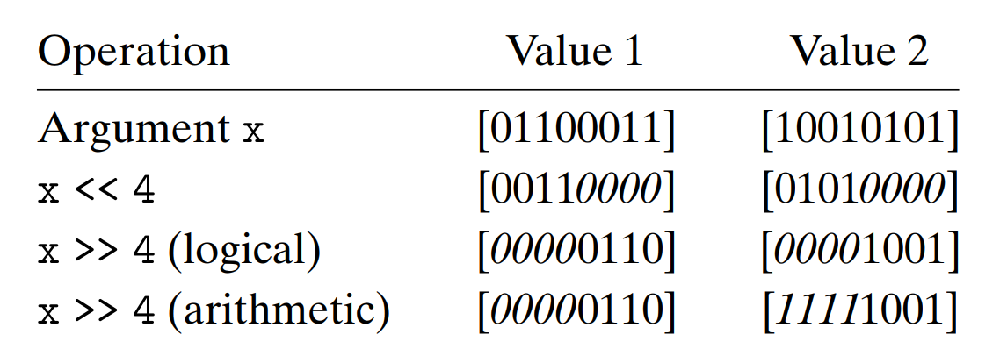

斜体数字表示在右端（左移）或左端（右移）填充的位。可以看到，除一个条目外，其余情况均采用零填充。例外是对 `[10010101]` 执行算术右移的情形：由于其最高有效位为 1，该位会被复制并用于填充。

C 语言标准并未精确定义对有符号整数右移时应采用算术移位还是逻辑移位。这意味着，假定某一种移位形式的代码在不同平台上可能存在可移植性问题。不过在实践中，几乎所有编译器和硬件平台都会对有符号整数采用算术右移，许多程序员也默认如此。相对地，对于无符号整数，右移操作必须是逻辑右移。

与 C 不同，Java 对右移操作有明确规定：表达式 `x >> k` 表示对 `x` 进行算术右移 `k` 位，而 `x >>> k` 则表示对其进行逻辑右移。

---

**练习题 2.16（答案见第 184 页）**

填写下表，展示不同移位运算对单字节数值的影响。理解移位运算的最佳方式是使用二进制表示：先将初始值转换为二进制形式，执行相应的移位操作，再将结果转换回十六进制。每个答案应给出 8 位二进制数或 2 位十六进制数。

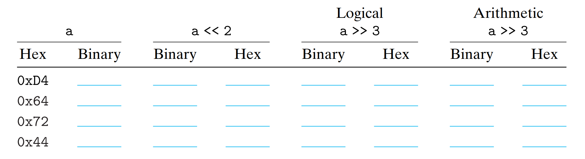

---

<!-- Page 0088 -->

> **旁注 对大的 $k$ 值移位 $k$ 位**
>
> 对于由 $w$ 位组成的数据类型，移位某个值 $k \geq w$ 应该产生什么效果？例如，假设数据类型 `int` 有 $w = 32$，计算以下表达式的结果应该是什么：
>
> int lval = 0xFEDCBA98 << 32;
>
> int aval = 0xFEDCBA98 >> 36;
>
> unsigned uval = 0xFEDCBA98u >> 40;
>
> C 标准小心地避免对这种情况给出明确规定。在许多机器上，移位指令在移位 $w$ 位或以上时只考虑移位量的低 $\log_2 w$ 位，因此实际移位量计算为 $k \bmod w$。例如，当 $w = 32$ 时，上述三个移位将分别被视作移位 $0$、$4$ 和 $8$ 位，得到结果：
>
>lval = 0xFEDCBA98
>
>aval = 0xFFEDCBA9
>
>uval = 0x00FEDCBA
>
> 然而，对于 C 程序来说，这种行为并不保证，因此应确保移位量小于字长。另一方面，Java 特别规定移位量按这种模运算方式计算。

> **旁注 移位运算的运算符优先级问题**
>
> 你可能想写表达式 `1 << 2 + 3 << 4`，意图是 `(1 << 2) + (3 << 4)`。然而在 C 中，前者等价于 `1 << (2 + 3) << 4`，因为加法（和减法）的优先级高于移位运算。结合性规则使其被解释为 `(1 << (2 + 3)) << 4`，得到值 512，而不是预期的 52。
>
> 在 C 表达式中弄错优先级是程序错误的常见来源，这类错误通常难以通过简单检查发现。有疑问时，请加括号！

## 2.2 整数表示

在本节中，我们将描述两种不同的位编码整数的方式——一种仅表示非负数，另一种可以表示负数、零和正数。稍后我们将看到，它们在数学性质和机器级实现上有密切联系。我们还将研究如何将一个编码后的整数扩展或截断，以适应不同长度的表示。

图 2.8 列出了为精确定义和描述计算机如何编码与操作整数数据而引入的数学术语。这些术语将在后续内容中逐步引入，此图在此处作为参考。

---

<!-- Page 0089 -->

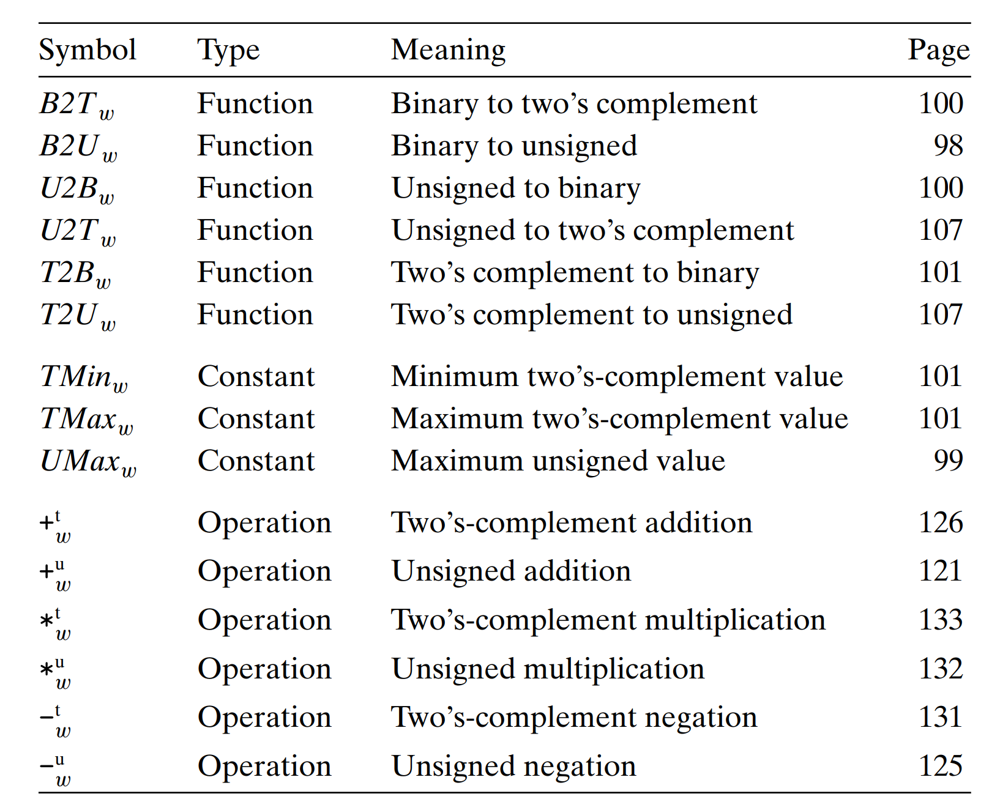

| 图 2.8 整数数据和算术运算的术语。下标 $w$ 表示数据表示中的位数。"页码"列指出了该术语的定义页码。 |
|:----------------:|

### 2.2.1 整数数据类型

C 支持多种整数数据类型——用于表示有限范围的整数。如图 2.9 和图 2.10 所示，对于“典型的”32 位和 64 位程序，列出了各类型可表示的值的范围。每种类型可以通过关键字 `char`、`short`、`long` 指定大小，并且可以标明所表示的数是全部非负的（声明为 `unsigned`）还是可能为负的（默认情况）。如图 2.3 所示，为不同大小分配的字节数会因程序编译为 32 位还是 64 位而有所不同。根据字节分配方式，不同大小允许表示不同范围的值。唯一与机器相关的范围是大小指示符 `long`。大多数 64 位程序使用 8 字节表示，比 32 位程序使用的 4 字节表示能提供更大的值范围。

图 2.9 和图 2.10 中一个值得注意的特征是，范围并非对称——负数的范围比正数多 1。当我们考虑负数的表示方式时，就会明白这是为什么。

---

<!-- Page 0090 -->

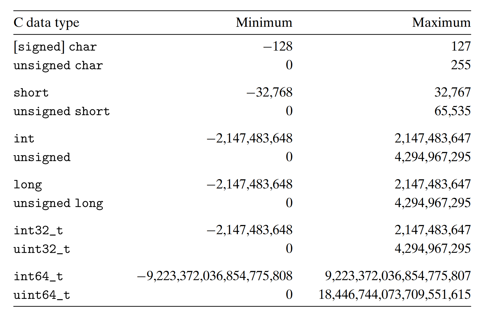

| 图 2.9 32 位程序中 C 整数数据类型的典型范围。|
|:----------------:|

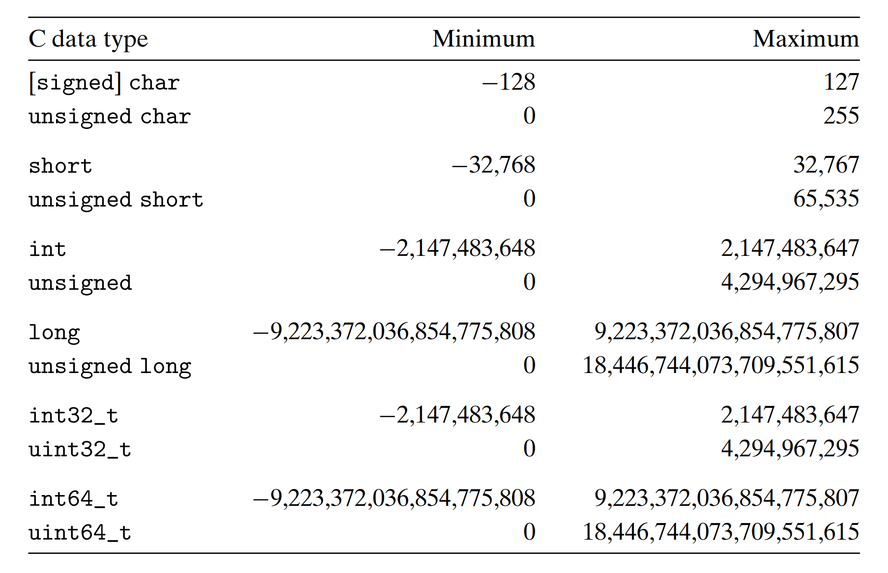

| 图 2.10 64 位程序中 C 整数数据类型的典型范围。|
|:----------------:|

C 标准定义了每种数据类型必须能够表示的值的最小范围。如图 2.11 所示，这些范围与图 2.9 和图 2.10 中所示的典型实现相同或更小。特别是，除了固定大小的数据类型外，它们只要求正数和负数的范围对称。我们还看到数据类型 `int` 可以用 2 字节表示，这主要是 16 位机器时代的遗留特性。大小为 `long` 的类型可以用 4 字节表示，对于 32 位程序通常就是这样。固定大小的数据类型保证其值范围恰好等于图 2.9 中典型数字所示的范围，包括负数和正数之间可能存在的不对称性。

---

<!-- Page 0091 -->

> **C 新手？C、C++ 和 Java 中的有符号数和无符号数**
>
> C 和 C++ 都支持有符号（默认）和无符号数。Java 只支持有符号数。

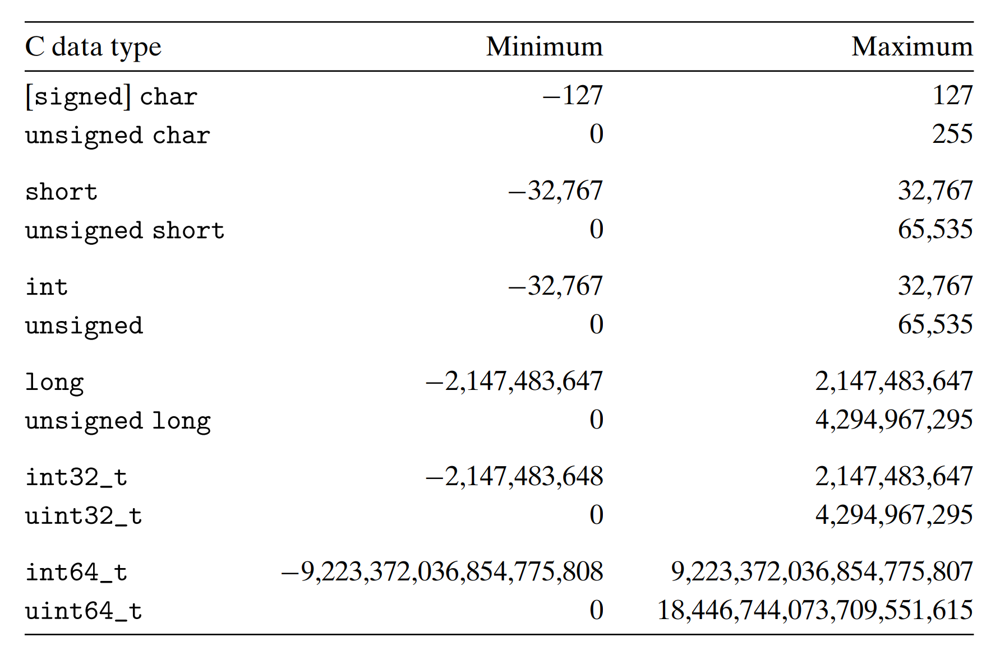

| 图 2.11 C 整数数据类型的保证范围。C 标准要求数据类型至少具有这些值范围。 |
| :---------------------------------------: |

### 2.2.2 无符号编码

让我们考虑一个 $w$ 位的整数数据类型。我们将位向量写作 $\vec{x}$，用来表示整个向量，或者写作 $[x_{w-1}, x_{w-2}, \ldots, x_0]$ 来表示向量中的各个位。将 $\vec{x}$ 视为用二进制记数法写成的数，我们就得到了 $\vec{x}$ 的无符号解释。在这种编码中，每个位 $x_i$ 的值为 0 或 1，后者表示值 $2^i$ 应被包含在数值中。我们可以将这种解释表示为函数 $B2U_w$（表示“二进制转无符号数”，长度 $w$）：

---

<!-- Page 0092 -->

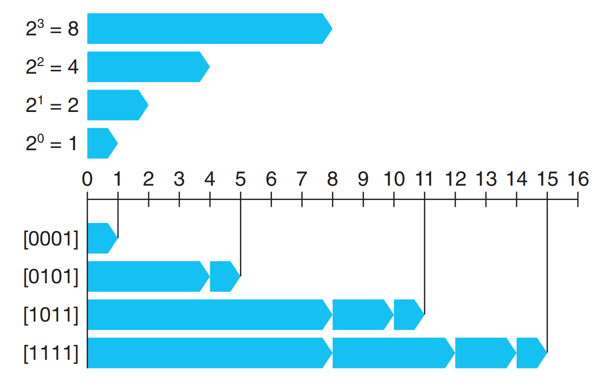

| 图 2.12 $w = 4$ 时的无符号数示例。当二进制表示中的位 $i$ 的值为 1 时，它对数值的贡献为 $2^{i}$。|
| :---------------------------------------: |

**原理：无符号编码的定义**

对于向量 $\vec{x} = [x_{w-1}, x_{w-2}, \ldots, x_{0}]$：

$$
B2U_{w}(\vec{x}) \doteq \sum_{i=0}^{w-1} x_{i} 2^{i}
$$

其中，符号 $\doteq$ 表示左边被定义为等于右边。函数 $B2U_{w}$ 将长度为 $w$ 的 0-1 串映射为非负整数。如图 2.12 所示，B2U 对以下位向量到整数的映射为：

$$
\begin{aligned}
B2U_{4}([0001]) &= 0 \cdot 2^3 + 0 \cdot 2^2 + 0 \cdot 2^1 + 1 \cdot 2^0 &= 0 + 0 + 0 + 1 &= 1 \\
B2U_{4}([0101]) &= 0 \cdot 2^3 + 1 \cdot 2^2 + 0 \cdot 2^1 + 1 \cdot 2^0 &= 0 + 4 + 0 + 1 &= 5 \\
B2U_{4}([1011]) &= 1 \cdot 2^3 + 0 \cdot 2^2 + 1 \cdot 2^1 + 1 \cdot 2^0 &= 8 + 0 + 2 + 1 &= 11 \\
B2U_{4}([1111]) &= 1 \cdot 2^3 + 1 \cdot 2^2 + 1 \cdot 2^1 + 1 \cdot 2^0 &= 8 + 4 + 2 + 1 &= 15
\end{aligned}
$$

在图中，我们用向右的蓝色条表示每个位位置 $i$，条的长度为 $2^{i}$。与位向量相关联的数值即对应位为 1 的条长度之和。

接下来考虑 $w$ 位表示的数值范围。最小值由位向量 $[0 0 \cdots 0]$ 给出，其整数值为 0；最大值由位向量 $[1 1 \cdots 1]$ 给出，其整数值为 

$$
UMax_w \doteq \sum_{i=0}^{w-1} 2^i = 2^w - 1
$$

以 4 位为例，我们有 $UMax_4 = B2U_4([1111]) = 2^4 - 1 = 15$。因此，函数 $B2U_w$ 定义为映射：

$$
B2U_w: \{0,1\}^w \to \{0, \ldots, UMax_w\}
$$

无符号二进制表示具有一个重要性质：从 0 到 $2^w - 1$ 的每个整数都有唯一的 $w$ 位编码。例如，十进制值 11 作为无符号 4 位数仅对应 [1011]。这一事实可以作为数学原理强调，先陈述再解释。

---

<!-- Page 0093 -->

**原理：无符号编码的唯一性**

函数 $B2U_{w}$ 是一个双射。

在数学中，双射指的是一个函数 $f$ 可以双向操作：它将值 $x$ 映射到值 $y$，即 $y = f(x)$，同时它也可以反向操作，因为对于每个 $y$，都有唯一的值 $x$ 使得 $f(x) = y$。这由逆函数 $f^{-1}$ 给出，在我们的例子中，$x = f^{-1}(y)$。函数 $B2U_w$ 将每个长度为 $w$ 的位向量映射到 $0$ 到 $2^w - 1$ 之间的唯一整数，并且它有一个逆函数，我们称之为 $U2B_w$（表示“无符号数转二进制”），它将 $0$ 到 $2^w - 1$ 范围内的每个整数映射回唯一的 $w$ 位模式。

### 2.2.3 补码编码

在许多应用中，我们也希望表示负数。计算机中最常用的有符号数表示方式被称为补码（two's complement）。其定义是将字的最高有效位解释为具有负权重。我们将这种映射表示为函数 $B2T_{w}$（表示“二进制转补码”，长度 $w$）：

**原理：补码编码的定义**

对于向量 $\vec{x} = [x_{w-1}, x_{w-2}, \ldots, x_0]$：

$$
B2T_{w}(\vec{x}) \doteq -x_{w-1} 2^{w-1} + \sum_{i=0}^{w-2} x_i 2^i
$$

最高有效位 $x_{w-1}$ 也称为符号位 (sign bit)，其权重为 $-2^{w-1}$，即其在无符号表示中的权重取反。当符号位为 $1$ 时，表示负数；当符号位为 $0$ 时，表示非负数。如下示例所示，图 2.13 展示了 $B2T$ 对不同位向量的映射结果：

$$
\begin{aligned}
B2T_{4}([0001]) &= -0\cdot 2^3 + 0\cdot 2^2 + 0\cdot 2^1 + 1\cdot 2^0 = 0 + 0 + 0 + 1 &= 1 \\
B2T_{4}([0101]) &= -0\cdot 2^3 + 1\cdot 2^2 + 0\cdot 2^1 + 1\cdot 2^0 = 0 + 4 + 0 + 1 &= 5 \\
B2T_{4}([1011]) &= -1\cdot 2^3 + 0\cdot 2^2 + 1\cdot 2^1 + 1\cdot 2^0 = -8 + 0 + 2 + 1 &= -5 \\
B2T_{4}([1111]) &= -1\cdot 2^3 + 1\cdot 2^2 + 1\cdot 2^1 + 1\cdot 2^0 = -8 + 4 + 2 + 1 &= -1
\end{aligned}
$$

在图中，符号位通过向左指的灰色条表示其负权重。与位向量关联的数值由灰色条（向左指，表示负）与蓝色条（向右指，表示正）的组合表示。

---

<!-- Page 0094 -->

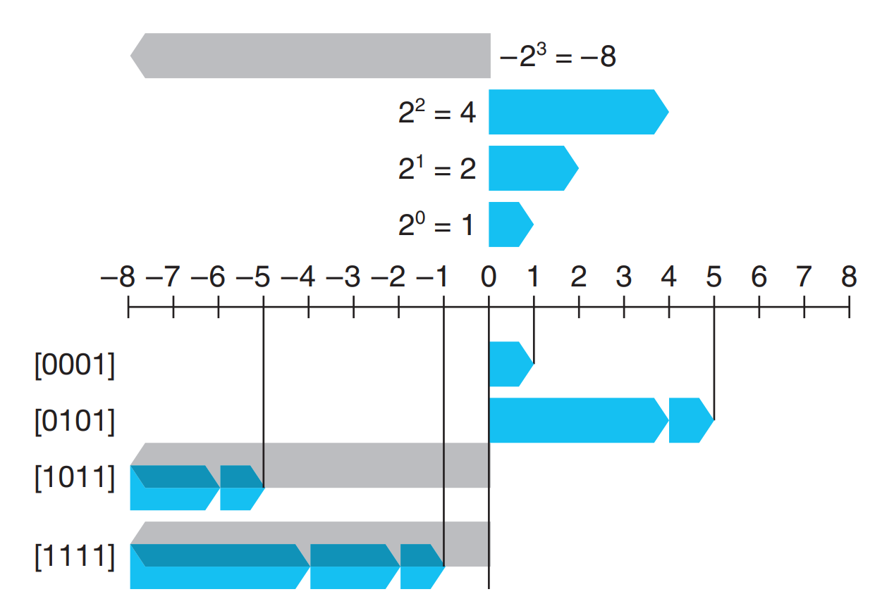

| 图 2.13：当 $w = 4$ 时的补码数示例。位 3 用作符号位；当其设为 1 时，对数值的贡献为 $-2^{3} = -8$。该权重以向左指的灰色条表示。 |
| :------------------------------------------------------------------------------: |

我们可以看到，图 2.12 和图 2.13（以及等式 2.2 和 2.4）中的位模式是相同的，但当最高有效位为 1 时，其表示的数值却不同。这是因为在一种情况下，该位的权重是 $+8$，而在另一种情况下，其权重是 $-8$。

下面考虑 $w$ 位补码数所能表示的取值范围。最小可表示值由位向量 $[10\cdots0]$ 给出，即设置具有负权重的位并清除所有其他位，其整数值为
$$
TMin_w \doteq -2^{w-1}.
$$
最大可表示值由位向量 $[01\cdots1]$ 给出，即清除具有负权重的位并设置所有其他位，其整数值为
$$
TMax_w \doteq \sum_{i=0}^{w-2} 2^i = 2^{w-1} - 1.
$$

以 4 位为例，有
$$
TMin_4 = B2T_4([1000]) = -2^3 = -8,
$$
以及
$$
TMax_4 = B2T_4([0111]) = 2^2 + 2^1 + 2^0 = 4 + 2 + 1 = 7.
$$

由此可见，$B2T_w$ 是一个从长度为 $w$ 的位模式到区间 $[TMin_w, TMax_w]$ 内整数的映射，记作
$$
B2T_w : \{0,1\}^w \rightarrow \{TMin_w, \ldots, TMax_w\}.
$$
与无符号表示类似，在可表示范围内的每一个整数，都有唯一的 $w$ 位补码编码。这引出了一个与无符号数类似的重要结论：

---

**原理：补码编码的唯一性**

函数 $B2T_w$ 是一个双射。

我们定义函数 $T2B_w$（表示“补码转二进制”）为 $B2T_w$ 的逆函数。也就是说，对于任意满足
$$
TMin_w \le x \le TMax_w
$$
的整数 $x$，$T2B_w(x)$ 是编码 $x$ 的唯一 $w$ 位二进制位模式。

---

**练习题 2.17（解答见第 184 页）**

假设 $w = 4$，我们可以为每一个可能的十六进制数字分别赋予一个数值，既可以按无符号数解释，也可以按补码数解释。根据这两种解释填写下表，并写出等式 2.1 和 2.3 中求和表达式里非零的 2 的幂次项。

---

<!-- Page 0095 -->

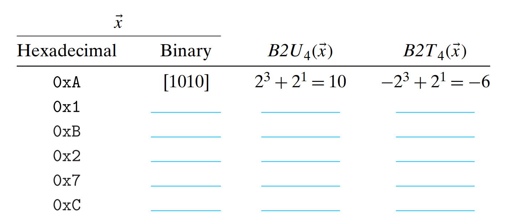

图 2.14 展示了在不同字长下若干重要数值的位模式及其对应的数值。前三项给出了可表示整数的范围，分别记为 $UMax_w$、$TMin_w$ 和 $TMax_w$。在后续讨论中，我们会频繁引用这三个特殊值。当字长 $w$ 可以由上下文推断，或对当前讨论并不重要时，我们将省略下标 $w$，直接使用 $UMax$、$TMin$ 和 $TMax$。

关于这些数值，有几点值得特别强调。首先，如图 2.9 和图 2.10 所示，补码表示的数值范围是不对称的：
$$
|TMin| = |TMax| + 1
$$
也就是说，$TMin$ 没有对应的正数值。正如我们后面将看到的，这种不对称性导致了补码算术的一些特殊性质，并且可能成为某些微妙程序错误的根源。这种现象的产生源于如下事实：一半的位模式（符号位为 1）表示负数，另一半的位模式（符号位为 0）表示非负数。由于 0 属于非负数，这就意味着可表示的正数比负数少一个。

其次，最大的无符号数恰好比最大的补码正数大一倍再加一，即
$$
UMax = 2TMax + 1
$$
在补码表示中用于表示负数的所有位模式，在无符号表示中都会被解释为正数。

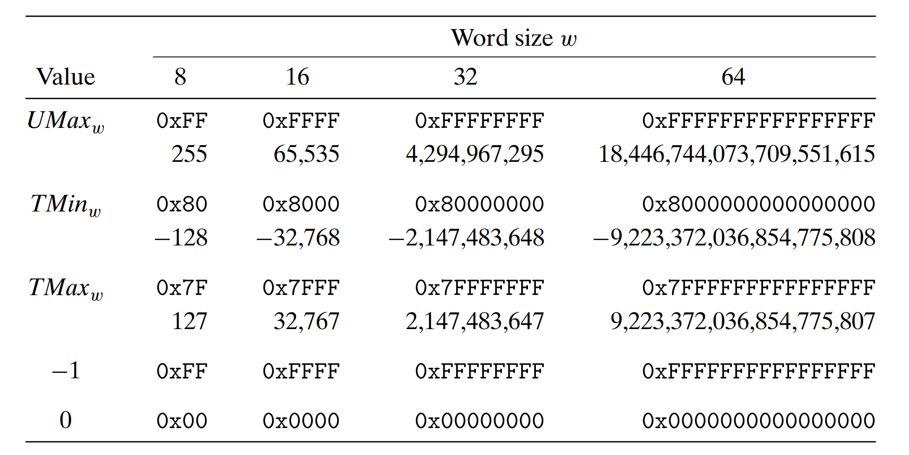

| 图 2.14 重要数值：同时给出了对应的数值表示和十六进制表示 |
| :-----------------------------: |

---

<!-- Page 0096 -->

> **旁注：关于固定大小整数类型的更多内容**
>
> 对于某些程序而言，使用具有特定大小的数据类型来编码数据至关重要。例如，在编写遵循标准协议通过互联网进行通信的程序时，必须确保所使用的数据类型与协议规定的表示方式相兼容。我们已经看到，某些 C 数据类型（尤其是 `long`）在不同机器上的取值范围并不相同，而 C 标准只规定了各类数据类型的**最小范围**，并未给出精确范围。因此，即使在大多数机器上可以选择与标准表示兼容的数据类型，也无法完全保证程序的可移植性。
>
> 我们已经接触过 32 位和 64 位的固定大小整数类型（见图 2.3），它们只是更大一类数据类型的一部分。ISO C99 标准在头文件 `stdint.h` 中正式引入了这类整数类型。该文件定义了一组数据类型，其声明形式为 `intN_t` 和 `uintN_t`，分别表示 N 位的有符号和无符号整数。N 的具体取值依赖于实现，但大多数编译器都支持 8、16、32 和 64 位。因此，我们可以明确地将一个无符号 16 位变量声明为 `uint16_t`，将一个 32 位有符号变量声明为 `int32_t`。
>
> 与这些数据类型配套的，还有一组宏，用于为每个 N 值定义其最小值和最大值，命名形式为 `INTN_MIN`、`INTN_MAX` 和 `UINTN_MAX`。
>
> 使用固定宽度整数类型进行格式化输出时，需要借助一组宏。这些宏会以系统相关的方式展开为正确的格式字符串。例如，对于 `int32_t` 和 `uint64_t` 类型的变量 `x` 和 `y`，可以通过如下 `printf` 调用来输出其值：
>
> ```c
> printf("x = %" PRId32 ", y = %" PRIu64 "\n", x, y);
> ```
>
> 当程序被编译为 64 位版本时，宏 `PRId32` 会展开为字符串 `"d"`，而 `PRIu64` 会展开为两个字符串 `"l"` 和 `"u"`。当 C 预处理器遇到一系列仅由空白字符分隔的字符串常量时，会自动将它们连接在一起。因此，上述 `printf` 调用最终等价于：
>
> ```c
> printf("x = %d, y = %lu\n", x, y);
> ```
>
> 使用这些宏可以确保无论代码在何种体系结构或编译模式下编译，都能生成正确的格式字符串。
>
> 图 2.14 还展示了常量 `-1` 和 `0` 的表示方式。需要注意的是，`-1` 与 `UMax` 具有完全相同的位表示形式——即全 1 的比特串；而数值 `0` 在有符号和无符号表示中都对应全 0 的比特串。
>
> C 标准并不要求有符号整数必须采用补码表示，但实际上几乎所有现代机器都使用补码形式。那些追求在**所有可能机器上**实现最大可移植性的程序员，不应假设任何特定的可表示值范围（除图 2.11 中明确给出的范围外），也不应假设有符号整数采用某种特定的表示方式。另一方面，许多程序在编写时默认有符号整数使用补码表示，并假定其取值范围为图 2.9 和图 2.10 所示的“典型”范围；事实证明，这类程序在绝大多数机器和编译器上依然具有良好的可移植性。
>
> C 标准库头文件 `limits.h` 定义了一组常量，用于描述不同整数数据类型在**当前编译器和目标机器**上的取值范围。例如，其中定义了 `INT_MAX`、`INT_MIN` 和 `UINT_MAX`，分别刻画了有符号和无符号整数的范围。对于一个采用补码表示、`int` 类型宽度为 $w$ 位的机器而言，这些常量分别对应于 $TMax_w$、$TMin_w$ 和 $UMax_w$。

---

<!-- Page 0097 -->

> **旁注：有符号数的替代表示**
>
> 有符号数还存在另外两种标准表示方式：
>
> **反码（Ones' Complement）**。该表示方式与补码类似，不同之处在于最高有效位的权重为 $-(2^{w-1}-1)$，而不是 $-2^{w-1}$：
>
> $$B2O_w(\vec{x}) \doteq -x_{w-1}(2^{w-1}-1) + \sum_{i=0}^{w-2} x_i 2^i$$
>
> **原码（Sign Magnitude）**。最高有效位作为符号位，用于决定其余各位应被赋予正权重还是负权重：
>
> $$B2S_w(\vec{x}) \doteq (-1)^{x_{w-1}} \cdot \left(\sum_{i=0}^{w-2} x_i 2^i\right)$$
>
> 这两种表示方式都有一个有趣的特性：数值 0 存在两种不同的编码形式。在这两种表示中，$[00\cdots0]$ 都被解释为 $+0$。而数值 $-0$ 在原码表示中可写为 $[10\cdots0]$，在反码表示中则为 $[11\cdots1]$。尽管历史上曾出现过基于反码表示的机器，但几乎所有现代计算机系统都采用补码表示。我们还将看到，原码表示在浮点数中仍然被使用。
>
> 注意撇号位置的差异：*two's complement*（补码）与 *ones' complement*（反码）。术语 “two's complement” 源于这样一个事实：对于非负数 $x$，可以通过计算 $2^w - x$（一个 2 的幂）来得到 $-x$ 的 $w$ 位补码表示；而术语 “ones' complement” 则来源于这样一种性质：在反码表示中，可以通过计算 $[111\cdots1] - x$（全 1 减去 $x$）来得到 $-x$ 的表示。

Java 标准对整数数据类型的取值范围和表示方式做出了非常严格的规定。它强制要求采用补码表示，并且其取值范围恰好对应于 64 位补码所能表示的范围（见图 2.10）。在 Java 中，单字节数据类型被称为 `byte`，而不是 `char`。这些明确而统一的规定旨在保证 Java 程序无论运行于何种硬件平台或操作系统之上，都能表现出一致的行为。

为了更直观地理解补码表示，请考虑如下代码示例：

```c
short x = 12345;
short mx = -x;

show_bytes((byte_pointer) &x, sizeof(short));
show_bytes((byte_pointer) &mx, sizeof(short));
```

---

<!-- Page 0098 -->

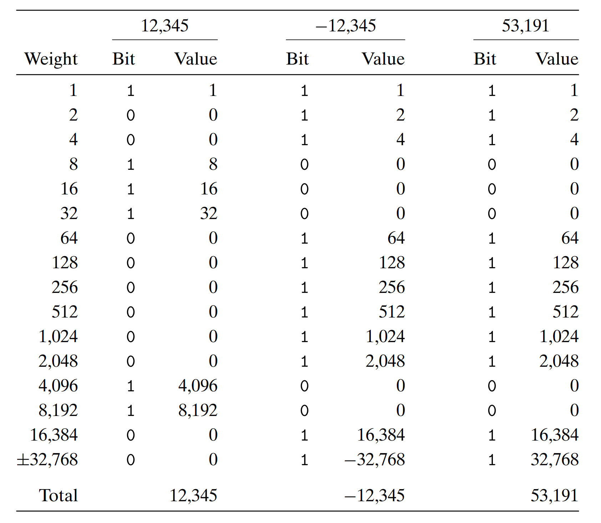

| 图 2.15　12,345 和 −12,345 的补码表示，以及 53,191 的无符号表示。注意，后两者具有完全相同的位表示。 |
| :--------------------------------------------------------------: |

当这段代码在大端序机器上运行时，会打印出 `30 39` 和 `cf c7`，表明 `x` 的十六进制表示为 `0x3039`，而 `mx` 的十六进制表示为 `0xCFC7`。将它们展开为二进制形式，`x` 的位模式为 `[0011000000111001]`，`mx` 的位模式为 `[1100111111000111]`。如图 2.15 所示，根据等式 2.3，这两个位模式分别对应的数值为 12,345 和 −12,345。

---

**练习题 2.18（解答见第 185 页）**

在第 3 章中，我们将考察由反汇编器（disassembler）生成的代码列表。反汇编器是一种将可执行程序文件转换为更易读的 ASCII 形式的工具。这类文件中通常包含大量以补码形式表示的十六进制数。能够识别这些数值并理解它们的含义（例如判断其为正数还是负数）是一项非常重要的技能。

对于下面列表中右侧标记为 A–I 的各行，请将指令名（`sub`、`mov` 和 `add`）右侧给出的十六进制值（32 位补码表示）转换为对应的十进制数值。

---

<!-- Page 0099 -->

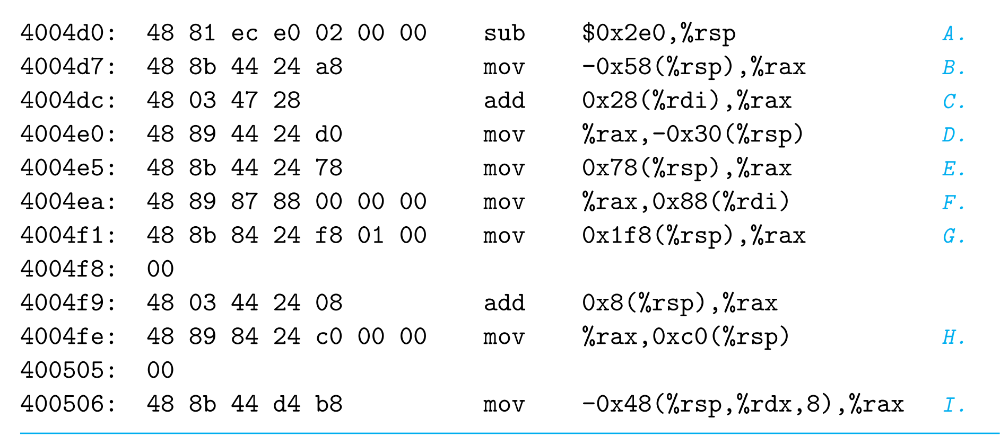

### 2.2.4 有符号数与无符号数之间的转换

C 语言允许在不同的数值数据类型之间进行强制类型转换。例如，假设变量 `x` 声明为 `int` 类型，变量 `u` 声明为 `unsigned` 类型，则表达式 `(unsigned)x` 会将 `x` 的值转换为无符号数，而 `(int)u` 会将 `u` 的值转换为有符号整数。

那么，在有符号数与无符号数之间相互转换时，究竟应该产生什么样的结果呢？从数学角度来看，可以设想多种不同的约定。显然，我们希望对于两种表示形式都能表示的数值，转换后仍能保持其数值不变。然而，如果将一个负数转换为无符号数，是否应该得到 0？反之，将一个过大而无法用补码形式表示的无符号数转换为有符号数，是否应该得到 $T_{\text{Max}}$？

事实上，对于绝大多数 C 语言实现而言，这类转换并不是基于“数值意义”来进行的，而是基于**位级表示**来完成的。

例如，考虑如下代码：

```c
1 short int v = -12345;
2 unsigned short uv = (unsigned short) v;
3 printf("v = %d, uv = %u\n", v, uv);
```

在一台采用补码表示的机器上运行，该程序会产生如下输出：

$$
\mathrm{v} = -12345,\ \mathrm{uv} = 53191
$$

这里可以看到，强制类型转换的实际效果是**保持位模式不变，仅改变这些位的解释方式**。如图 2.15 所示，$-12345$ 的 16 位补码表示，与 $53191$ 的 16 位无符号表示在位级上是完全相同的。因此，从 `short` 转换为 `unsigned short` 改变的是数值的含义，而不是底层的位表示。

类似地，再考虑下面这段代码：

```c
1 unsigned u = 4294967295u; /* UMax */
2 int tu = (int) u;
3 printf("u = %u, tu = %d\n", u, tu);
```

---

<!-- Page 0100 -->

在补码机器上运行时，它会产生如下输出：

$$
\mathbf{u} = 4294967295, \quad \mathbf{tu} = -1
$$

从图 2.14 可以看到，对于 32 位字长，4,294,967,295（$UMax_{32}$）的无符号表示与 −1 的补码表示具有相同的位模式。当从 `unsigned` 转换为 `int` 时，底层的位表示保持不变。

这是大多数 C 实现中处理相同字长的有符号数与无符号数之间转换的一般规则——数值可能发生变化，但位模式不会改变。下面我们用更数学化的形式来描述这一思想。定义函数 $U2B_w$ 和 $T2B_w$，它们分别将数映射为其无符号表示或补码表示下的位模式。也就是说，给定范围 $0 \le x < UMax_w$ 内的整数 $x$，函数 $U2B_w(x)$ 给出 $x$ 的唯一 $w$ 位无符号表示；类似地，当 $x$ 处于范围 $TMin_w \le x \le TMax_w$ 内时，函数 $T2B_w(x)$ 给出 $x$ 的唯一 $w$ 位补码表示。

现在定义函数 $T2U_w$ 为 $T2U_w(x) \doteq B2U_w(T2B_w(x))$。
该函数接受 $TMin_w$ 到 $TMax_w$ 之间的数，并产生一个介于 $0$ 到 $UMax_w$ 之间的数；这两个数具有完全相同的位表示，只是输入被解释为补码数，而输出被解释为无符号数。类似地，对于 $0$ 到 $UMax_w$ 之间的 $x$，函数 $U2T_w$ 定义为
$U2T_w(x) \doteq B2T_w(U2B_w(x))$，
它产生一个与 $x$ 的无符号表示具有相同位模式的补码数。

继续前面的例子，从图 2.15 可见，$T2U_{16}(-12{,}345) = 53{,}191$，而 $U2T_{16}(53{,}191) = -12{,}345$。也就是说，以十六进制表示为 `0xCFC7` 的 16 位模式，既是 −12,345 的补码表示，也是 53,191 的无符号表示。还可以注意到：

$$
12{,}345 + 53{,}191 = 65{,}536 = 2^{16}
$$

这一性质可以推广，用以刻画同一位模式所表示的两个数值（补码数与无符号数）之间的关系。类似地，从图 2.14 可见，$T2U_{32}(-1) = 4{,}294{,}967{,}295$，而 $U2T_{32}(4{,}294{,}967{,}295) = -1$。也就是说，$UMax$ 在无符号表示中与 −1 在补码表示中具有相同的位模式。由此还能看出它们之间的关系：

$$
1 + UMax_w = 2^w
$$

因此，函数 $T2U$ 描述了补码数到其对应无符号值的转换，而 $U2T$ 则描述了反方向的转换。它们刻画了大多数 C 实现中这两种数据类型之间进行强制类型转换时所产生的效果。

---

**练习题 2.19（解答见第 185 页）**

利用你在完成练习题 2.17 时填写的表格，填写下表以描述函数 $T2U_{4}$：

---

<!-- Page 0101 -->

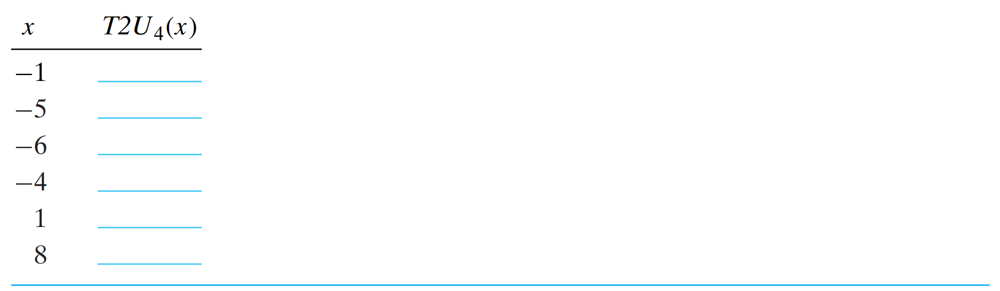

通过若干示例，我们已经观察到：在给定位模式下，补码值与无符号值之间存在确定的对应关系。这一关系可以概括为函数 $T2U$ 的一个重要性质。

---

**原理：补码到无符号数的转换**

对于任意整数 $x$，只要满足 $TMin_w \le x \le TMax_w$，就有：

$$
T2U_w(x)=
\begin{cases}
x + 2^w, & x < 0 \\
x, & x \ge 0
\end{cases}
$$

例如，
$T2U_{16}(-12{,}345) = -12{,}345 + 2^{16} = 53{,}191$，
以及
$T2U_w(-1) = -1 + 2^w = UMax_w$。

该性质可以通过对比等式 2.1 与等式 2.3 推导得到。

---

**推导：补码到无符号数的转换**

比较等式 2.1 和 2.3 可以发现：对于位模式 $\vec{x}$，若计算差值
$B2U_w(\vec{x}) - B2T_w(\vec{x})$，则从第 0 位到第 $w-2$ 位的加权和会相互抵消，仅剩最高位的贡献：

$$
B2U_w(\vec{x}) - B2T_w(\vec{x})
= x_{w-1}\bigl(2^{w-1} - (-2^{w-1})\bigr)
= x_{w-1} 2^w
$$

因此可得关系式：

$$
B2U_w(\vec{x}) = B2T_w(\vec{x}) + x_{w-1} 2^w
$$

进一步有：

$$
B2U_w(T2B_w(x)) = T2U_w(x) = x + x_{w-1} 2^w
$$

在 $x$ 的补码表示中，最高位 $x_{w-1}$ 决定了 $x$ 是否为负数，这正好对应等式 2.5 中的两种情况。

---

如图所示，图 2.16 对比了在 $w = 4$ 时，函数 $B2U$ 与 $B2T$ 对同一位模式的不同赋值方式。对于补码表示，最高有效位作为符号位，其权重为负，我们用向左指的灰色条表示；而在无符号表示中，该位具有正权重，用向右指的黑色条表示。由补码转换为无符号数时，最高有效位的权重从 $-8$ 变为 $+8$。因此，补码表示中的负值在无符号表示下会整体增加 $2^4 = 16$：例如，$-5$ 变为 $+11$，$-1$ 变为 $ +15$。

---

<!-- Page 0102 -->

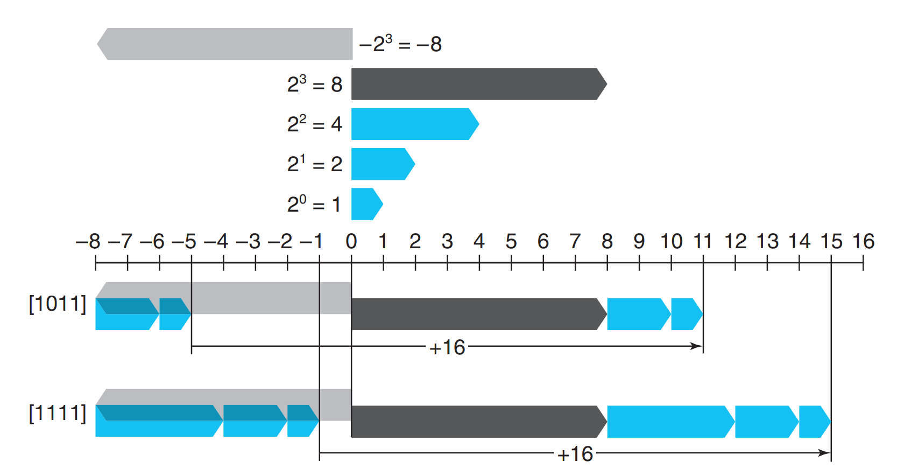

| 图 2.16 当 $w = 4$ 时，无符号数与补码表示的比较。最高有效位在补码表示中的权重为 $-8$，在无符号表示中为 $+8$，两者产生了 $16$ 的净差值。 |
| :---------------------------------------------------------------------------------: |

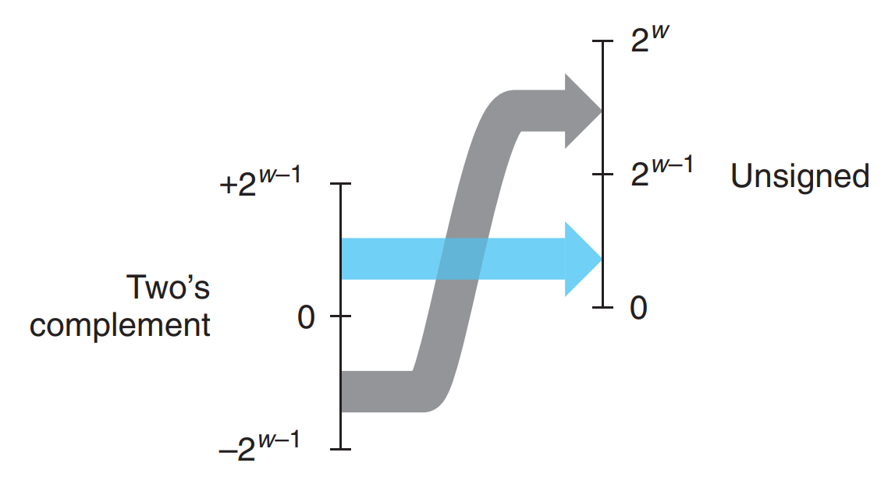

| 图 2.17 补码到无符号数的转换。函数 $T2U$ 将负数转换为较大的正数。 |
| :-------------------------------------: |

图 2.17 展示了函数 $T2U$ 的一般行为。如图所示，当一个有符号数被映射为其无符号对应值时，负数会被转换为较大的正数，而非负数则保持不变。

---

**练习题 2.20（解答见第 185 页）**

解释等式 2.5 是如何应用到你在解决练习题 2.19 时构造的表格条目中的。

---

反过来，我们也可以表述无符号数 $u$ 与其有符号对应值 $U2T_w(u)$ 之间的关系：

---

**原理：无符号数到补码的转换**

对于满足 $0 \leq u \leq UMax_w$ 的 $u$，有

$$
U2T_w(u)=
\begin{cases}
u, & u \leq TMax_w \\
u - 2^w, & u > TMax_w
\end{cases}
$$

---

<!-- Page 0103 -->

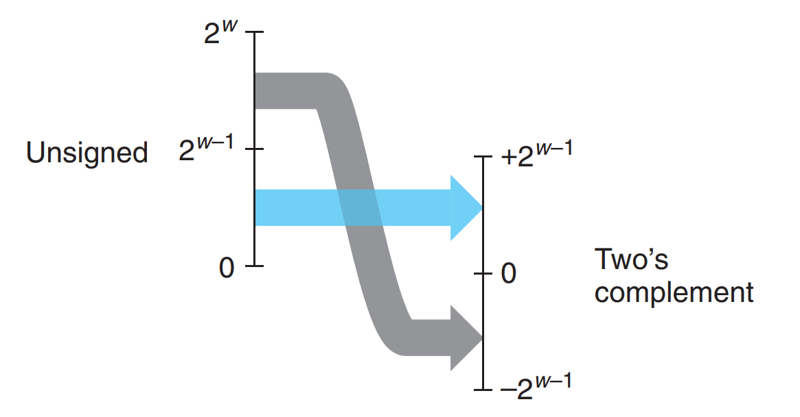

| 图 2.18 无符号数到补码的转换。函数 $U2T$ 将大于 $2^{w-1}-1$ 的数转换为负值。 |
| :-------------------------------------: |

这个原理可以如下证明：

---

**推导：无符号数到补码的转换**

令 $\vec{u} = U2B_w(u)$。这个位向量也将是 $U2T_w(u)$ 的补码表示。等式 2.1 和 2.3 可以组合得到：

$$
U2T_{w}(u) = -u_{w-1} 2^{w} + u \tag{2.8}
$$

在 $u$ 的无符号表示中，位 $u_{w-1}$ 决定 $u$ 是否大于 $TMax_{w} = 2^{w-1}-1$，由此给出等式 2.7 的两种情况。

函数 $U2T$ 的行为如图 2.18 所示。对于小的（$\le TMax_w$）数，从无符号到有符号的转换保留数值；大的（$> TMax_w$）数被转换为负值。

总结一下，我们考虑了无符号和补码表示之间双向转换的效果。对于范围 $0 \le x \le TMax_w$ 内的值 $x$，我们有 $T2U_w(x) = x$ 和 $U2T_w(x) = x$。即，这个范围内的数在无符号和补码表示中是相同的。对于这个范围之外的值，转换要么加上要么减去 $2^w$。例如：

- $T2U_w(-1) = -1 + 2^w = UMax_w$ ——最接近零的负数映射到最大的无符号数。
- $T2U_w(TMin_w) = -2^{w-1} + 2^w = 2^{w-1} = TMax_w + 1$ ——最小的负数映射到恰好在正补码数范围之外的无符号数。

利用图 2.15 的例子，我们可以看到 $T2U_{16}(-12,345) = 65,536 + (-12,345) = 53,191$。

### 2.2.5 C 语言中的有符号与无符号

如图 2.9 和图 2.10 所示，C 支持其所有整数数据类型的有符号和无符号运算。虽然 C 标准没有指定有符号数的特定表示方式，但几乎所有机器都使用补码。通常，大多数数默认是有符号的。例如，当声明常量如 `12345` 或 `0x1A2B` 时，值被视为有符号的。添加后缀字符 `U` 或 `u` 创建一个无符号常量；例如 `12345U` 或 `0x1A2Bu`。

---

<!-- Page 0104 -->

C 允许无符号和有符号类型之间进行转换。虽然 C 标准没有严格规定这种转换的具体行为，但大多数系统遵循的规则是保持底层位表示不变。该规则的效果是：从无符号转换为有符号时应用函数 $U2T_w$，从有符号转换为无符号时应用函数 $T2U_w$，其中 $w$ 为数据类型的位数。

转换可以通过显式强制类型转换发生，如以下代码所示：

```c
int tx, ty;
unsigned ux, uy;

tx = (int) ux;
uy = (unsigned) ty;
```

或者，当一种类型的表达式被赋值给另一种类型的变量时，转换可以隐式发生，如以下代码所示：

```c
int tx, ty;
unsigned ux, uy;

tx = ux; /* 隐式转换为有符号 */
uy = ty; /* 隐式转换为无符号 */
```

使用 `printf` 打印数值时，格式说明符 `%d`、`%u` 和 `%x` 分别用于有符号十进制、无符号十进制和十六进制输出。注意 `printf` 并不使用变量的类型信息，因此可以用 `%u` 打印 `int` 类型的值，也可以用 `%d` 打印 `unsigned` 类型的值。例如，考虑以下代码：

```c
int x = -1;
unsigned u = 2147483648; /* 2 的 31 次方 */
printf("x = %u = %d\n", x, x);
printf("u = %u = %d\n", u, u);
```

当在 32 位程序上运行时，输出为：

$$
\begin{array}{l}
\mathbf{x} = 4294967295 = -1 \\
\mathbf{u} = 2147483648 = -2147483648
\end{array}
$$

在这两种情况下，`printf` 都先将数当作无符号数打印，然后再当作有符号数打印。由此可见转换函数的作用：

$$
T2U_{32}(-1) = UMax_{32} = 2^{32} - 1
$$

$$
U2T_{32}(2^{31}) = 2^{31} - 2^{32} = -2^{31} = TMin_{32}
$$

由于 C 处理有符号与无符号混合表达式的方式，可能会出现一些不直观的行为。当一个操作数为有符号类型，另一个为无符号类型时，C 会隐式将有符号操作数转换为无符号类型，并按非负数进行运算。

---

<!-- Page 0105 -->

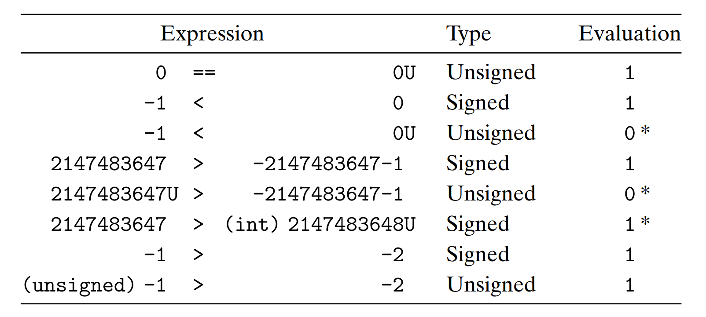

| 图 2.19 C 提升规则的效果。不直观的情况用 '*' 标记。当比较的任一操作数是无符号的时，另一个操作数会被隐式转换为无符号。参见 Web Aside DATA:TMIN 了解为什么我们将 $TMin_{32}$ 写作 $-2{,}147{,}483{,}647-1$。 |
| :-------------------------------------: |

如我们将看到的，这种约定对于标准算术运算几乎没有区别，但它会导致关系运算符（如 < 和 >）产生不直观的结果。图 2.19 展示了一些示例关系表达式及其求值结果，其中数据类型 `int` 具有 32 位补码表示。考虑比较 $-1 < 0U$。由于第二个操作数是无符号的，第一个操作数被隐式转换为无符号，因此表达式等价于比较 $4294967295U < 0U$（回忆 $T2U_{w}(-1) = UMax_{w}$），这当然是假的。其他情况可以通过类似的分析来理解。

---

**练习题 2.21（解答见第 185 页）**

假设表达式在一台使用补码运算的机器上执行 32 位程序时求值，按照图 2.19 的风格填写下表，描述强制类型转换和关系运算的效果：

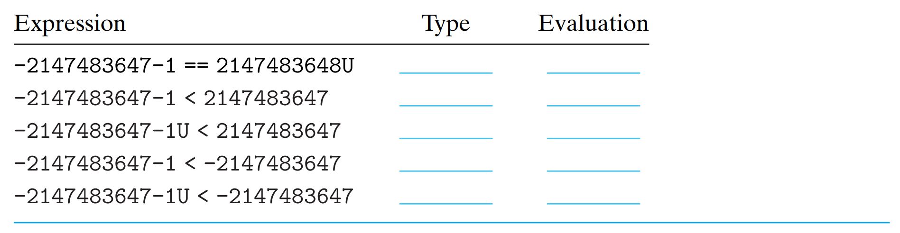

### 2.2.6 扩展一个数的位表示

一个常见操作是在保持相同数值的同时，在不同字长的整数之间进行转换。当然，当目标数据类型太小而无法表示所需值时，这可能无法实现。然而，从较小类型转换为较大类型应该总是可行的。

---

<!-- Page 0106 -->

>**Web Aside DATA:TMIN 在 C 中书写 TMin**
>
>在图 2.19 和练习题 2.21 中，我们仔细地将 $TMin_{32}$ 的值写作 -2,147,483,647-1。为什么不直接写成 -2,147,483,648 或 0x80000000 呢？查看 C 头文件 `limits.h`，我们会发现它们采用了类似的写法来表示 $TMin_{32}$ 和 $TMax_{32}$：
>
>```c
>/* Minimum and maximum values a 'signed int' can hold. */
>#define INT_MAX 2147483647
>#define INT_MIN (-INT_MAX - 1)
>```
>
>这源于补码表示的不对称性与 C 语言转换规则之间的特殊交互，使得我们不得不采用这种稍显不寻常的书写方式。虽然理解这一点需要深入 C 标准中较为晦涩的部分，但它有助于我们体会整数数据类型表示的一些微妙之处。

要将一个无符号数转换为更大的数据类型，我们可以在表示前添加前导零；这种操作称为**零扩展 (zero extension)**，其原理如下：

---

**原理：通过零扩展扩展无符号数**

定义宽度为 $w$ 的位向量 $\vec{u} = [u_{w-1}, u_{w-2}, \ldots, u_0]$，以及宽度为 $w'$ 的位向量 

$$
\vec{u}' = [0, \ldots, 0, u_{w-1}, u_{w-2}, \ldots, u_0], \quad w' > w
$$

则有：

$$
B2U_w(\vec{u}) = B2U_{w'}(\vec{u}')
$$

---

该原理可以直接从等式 2.1 中无符号编码的定义推导而来。

对于补码数的扩展，规则是执行**符号扩展 (sign extension)**，即将最高有效位的副本添加到更宽的表示中。下面的原理展示了这一点，其中符号位 $x_{w-1}$ 被强调以显示其在符号扩展中的作用。

---

**原理：通过符号扩展扩展补码数**

定义宽度为 $w$ 的位向量 $\vec{x} = [x_{w-1}, x_{w-2}, \ldots, x_0]$，以及宽度为 $w'$ 的位向量 

$$
\vec{x}' = [\underbrace{x_{w-1}, \ldots, x_{w-1}}_{w'-w \text{ 个}}, x_{w-1}, x_{w-2}, \ldots, x_0], \quad w' > w
$$

则有：

$$
B2T_w(\vec{x}) = B2T_{w'}(\vec{x}')
$$

作为示例，考虑以下代码：

```c
short sx = -12345;         /* -12345 */
unsigned short usx = sx;   /*  53191 */
int x = sx;                /* -12345 */
unsigned ux = usx;         /*  53191 */
printf("sx = %d:\t", sx);
show_bytes((byte_pointer) &sx, sizeof(short));
printf("usx = %u:\t", usx);
show_bytes((byte_pointer) &usx, sizeof(unsigned short));
printf("x = %d:\t", x);
show_bytes((byte_pointer) &x, sizeof(int));
printf("ux = %u:\t", ux);
show_bytes((byte_pointer) &ux, sizeof(unsigned));
```

---

<!-- Page 0107 -->

当作为 32 位程序在使用补码表示的大端序机器上运行时，这段代码打印输出：

$$
\begin{array}{l}
\text{sx} = -12345: \quad \text{cf} \quad \text{c7} \\
\text{usx} = 53191: \quad \text{cf} \quad \text{c7} \\
\text{x} = -12345: \quad \text{ff} \quad \text{ff} \quad \text{cf} \quad \text{c7} \\
\text{ux} = 53191: \quad 00 \quad 00 \quad \text{cf} \quad \text{c7}
\end{array}
$$

我们可以看到，虽然 $-12,345$ 的补码表示与 $53,191$ 的无符号表示在 16 位字长下相同，但在 32 位字长下它们是不同的。具体而言，$-12,345$ 的十六进制表示为 `0xFFFFCFC7`，而 $53,191$ 的十六进制表示为 `0x0000CFC7`。前者进行了符号扩展——在高 16 位填充了 1（十六进制表示为 0xFFFF），后者则用 16 个前导零（十六进制表示为 0x0000）进行扩展。

为了说明，图 2.20 展示了从字长 $w = 3$ 扩展到 $w = 4$ 时的符号扩展结果。位向量 $[101]$ 表示值 $-4 + 1 = -3$。应用符号扩展后得到位向量 $[1101]$，表示值 $-8 + 4 + 1 = -3$。可以看到，对于 $w = 4$，高两位组合的值 $-8 + 4 = -4$ 与 $w = 3$ 时符号位的值一致。类似地，位向量 $[111]$ 和 $[1111]$ 都表示值 $-1$。

基于此直觉，我们可以证明符号扩展保持补码数的值不变。

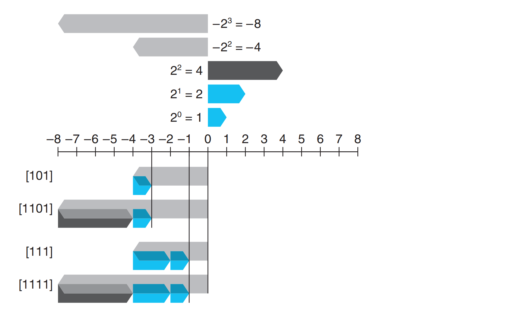

| 图 2.20 从 $w = 3$ 到 $w = 4$ 的符号扩展示例。对于 $w = 4$，高两位的组合权重为 $-8 + 4 = -4$，与 $w = 3$ 时符号位的权重一致。 |
| :----------------------------------------------------------------------------------------: |

---

<!-- Page 0108 -->

**推导：通过符号扩展对二进制补码数进行扩展**

令 $w' = w + k$。我们要证明的是

$$
B2T_{w+k}([\underbrace{x_{w-1},\cdots,x_{w-1}}_{k\text{ times}},x_{w-1},x_{w-2},\cdots,x_{0}])
=
B2T_{w}([x_{w-1},x_{w-2},\cdots,x_{0}])
$$

证明通过对 $k$ 进行归纳。即，如果我们能证明符号扩展 1 位保持数值不变，则对任意位数的符号扩展此性质都成立。因此，任务简化为证明

$$
B2T_{w+1}([x_{w-1},x_{w-1},x_{w-2},\cdots,x_{0}])
=
B2T_{w}([x_{w-1},x_{w-2},\cdots,x_{0}])
$$

用等式 2.3 展开左端表达式得到：

$$
\begin{aligned}
B2T_{w+1}([x_{w-1},x_{w-1},x_{w-2},\cdots,x_{0}])
&= -x_{w-1} 2^{w} + \sum_{i=0}^{w-1} x_i 2^i \\
&= -x_{w-1} 2^{w} + x_{w-1} 2^{w-1} + \sum_{i=0}^{w-2} x_i 2^i \\
&= -x_{w-1} (2^{w} - 2^{w-1}) + \sum_{i=0}^{w-2} x_i 2^i \\
&= -x_{w-1} 2^{w-1} + \sum_{i=0}^{w-2} x_i 2^i \\
&= B2T_{w}([x_{w-1},x_{w-2},\cdots,x_{0}])
\end{aligned}
$$

我们利用的关键性质是 $2^{w} - 2^{w-1} = 2^{w-1}$。因此，添加一个权重为 $-2^{w}$ 的位，并将权重为 $-2^{w-1}$ 的位转换为权重为 $2^{w-1}$ 的位，二者的组合效果是保持原始数值不变。

---

**练习题 2.22（解答见第 186 页）**

通过应用等式 2.3，证明以下每个位向量都是 -4 的补码表示：

A. $[1100]$

B. $[11100]$

C. $[111100]$

观察可知，第二个和第三个位向量可以通过符号扩展从第一个推导出来。

---

<!-- Page 0109 -->

一个值得指出的要点是，从一种数据大小到另一种以及在无符号和有符号之间转换的相对顺序会影响程序的行为。考虑以下代码：

```c
short sx = -12345;   /* -12345 */
unsigned uy = sx;    /* Mystery! */
printf("uy = %u:\t", uy);
show_bytes((byte_pointer) &uy, sizeof(unsigned));
```

在大端序机器上运行时，这段代码会打印如下输出：

```
uy = 4294954951: ff ff cf c7
```

这表明，从 `short` 转换为 `unsigned` 时，程序先执行整型提升再进行类型转换。也就是说，`(unsigned) sx` 等价于 `(unsigned) (int) sx`，其值为 4,294,954,951，而不是 `(unsigned) (unsigned short) sx`，后者的值为 53,191。实际上，这种行为是 C 标准所要求的。

---

**练习题 2.23（解答见第 186 页）**

考虑以下 C 函数：

```c
int fun1(unsigned word) {
    return (int) ((word << 24) >> 24);
}

int fun2(unsigned word) {
    return ((int) word << 24) >> 24;
}
```

假设这些函数在一台使用补码运算的机器上作为 32 位程序执行，同时假设有符号值的右移执行算术移位，而无符号值的右移执行逻辑移位。

A. 填写下表，展示这些函数对几个示例参数的效果。使用十六进制表示会更方便。只需记住十六进制数字 8 到 F 的最高有效位等于 1。

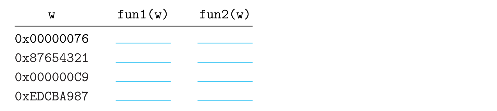

B. 用文字描述每个函数执行的有用计算。

---

<!-- Page 0110 -->

### 2.2.7 截断数

假设不是用额外的位来扩展一个值，而是减少表示一个数的位数。例如在以下代码中就会发生这种情况：

```c
int x = 53191;
short sx = (short) x;  /* -12345 */
int y = sx;            /* -12345 */
```

将 `x` 强制转换为 `short` 会将 32 位 `int` 截断为 16 位 `short`。如我们之前所见，这个 16 位模式是 $-12,345$ 的补码表示。当将其转换回 `int` 时，符号扩展会将高 16 位设为 1，产生 $-12,345$ 的 32 位补码表示。

当截断一个 $w$ 位数 $\vec{x} = [x_{w-1}, x_{w-2}, \ldots, x_{0}]$ 为 $k$ 位数时，我们丢弃高 $w - k$ 位，得到位向量 $\vec{x}' = [x_{k-1}, x_{k-2}, \ldots, x_{0}]$。截断一个数可以改变它的值——这是一种溢出 (overflow)。对于无符号数，我们可以很容易地描述结果的数值。

---

**原理：无符号数的截断**

令 $\vec{x}$ 为位向量 $[x_{w-1}, x_{w-2}, \ldots, x_{0}]$，令 $\vec{x}'$ 为将其截断到 $k$ 位的结果：$\vec{x}' = [x_{k-1}, x_{k-2}, \ldots, x_{0}]$。令 $x = B2U_{w}(\vec{x})$ 且 $x' = B2U_{k}(\vec{x}')$。则有：

$$
x' = x \bmod 2^k
$$

---

这个原理背后的直觉很简单：所有被截断的位具有形如 $2^{i}$（其中 $i \ge k$）的权重，因此在取模运算下这些权重都化为零。这可以通过以下推导形式化：

---

**推导：无符号数的截断**

对等式 2.1 应用取模运算得到：

$$
\begin{aligned}
B2U_{w}([x_{w-1},x_{w-2},\cdots,x_{0}]) \bmod 2^{k}
&= \left[\sum_{i=0}^{w-1} x_i 2^i \right] \bmod 2^{k} \\
&= \left[\sum_{i=0}^{k-1} x_i 2^i \right] \bmod 2^{k} \\
&= \sum_{i=0}^{k-1} x_i 2^i \\
&= B2U_{k}([x_{k-1}, x_{k-2}, \cdots, x_0])
\end{aligned}
$$

在这个推导中，我们利用了对于任何 $i \ge k$，$2^i \bmod 2^k = 0$ 的性质。

---

对于截断补码数也有类似的性质，只是它会将最高有效位转换为符号位：

---

<!-- Page 0111 -->

**原理：补码数的截断**

令 $\vec{x}$ 为位向量 $[x_{w-1}, x_{w-2}, \ldots, x_0]$，令 $\vec{x}'$ 为将其截断到 $k$ 位的结果：$\vec{x}' = [x_{k-1}, x_{k-2}, \ldots, x_0]$。令 $x = B2T_w(\vec{x})$ 且 $x' = B2T_k(\vec{x}')$。则有：

$$
x' = U2T_k(x \bmod 2^k)
$$

在这个公式中，$x \bmod 2^k$ 是 $0$ 到 $2^k - 1$ 之间的数。对其应用函数 $U2T_k$ 会将最高有效位 $x_{k-1}$ 的权重从 $2^{k-1}$ 转换为 $-2^{k-1}$。例如，将 $x = 53,191$ 从 int 转换为 short。由于 $2^{16} = 65,536 \ge x$，所以 $x \bmod 2^{16} = x$。但将此数转换为 16 位补码数时，得到：

$$
x' = 53,191 - 65,536 = -12,345
$$

---

**推导：补码数的截断**

使用与无符号数截断类似的论证可得：

$$
B2T_{w}([x_{w-1},x_{w-2},\cdots,x_{0}]) \bmod 2^{k} = B2U_{k}([x_{k-1},x_{k-2},\cdots,x_{0}])
$$

即 $x \bmod 2^k$ 可以用位级表示 $[x_{k-1}, x_{k-2}, \ldots, x_0]$ 的无符号数表示。将其转换为补码数得到：

$$
x' = U2T_k(x \bmod 2^k)
$$

---

总结：

- **无符号数截断效果：**

$$
B2U_{k}([x_{k-1},x_{k-2},\cdots,x_{0}]) = B2U_{w}([x_{w-1},x_{w-2},\cdots,x_{0}]) \bmod 2^{k} \tag{2.9}
$$

- **补码数截断效果：**

$$
B2T_{k}([x_{k-1},x_{k-2},\cdots,x_{0}]) = U2T_{k}\big(B2U_{w}([x_{w-1},x_{w-2},\cdots,x_{0}]) \bmod 2^{k}\big) \tag{2.10}
$$

---

**练习题 2.24（解答见第 186 页）**

假设将一个 4 位值（十六进制 0 到 F）截断为 3 位值（十六进制 0 到 7）。填写下表，展示某些情况下截断的效果，并分别用无符号和补码解释这些位模式。

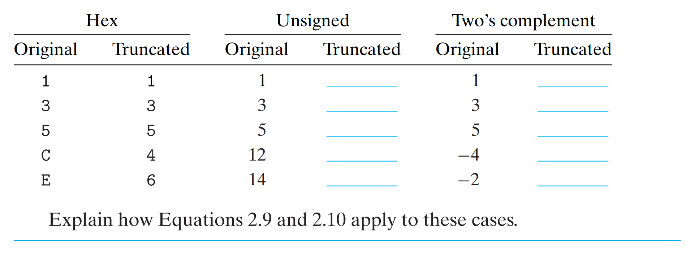

请解释等式 2.9 和 2.10 如何应用于这些情况。

---

<!-- Page 0112 -->

### 2.2.8 有符号与无符号类型的建议

如我们所见，从有符号类型到无符号类型的隐式转换，往往会带来一些不直观的行为。这类不直观特性极易引发程序错误，而涉及隐式类型转换细节的问题尤为隐蔽。由于转换过程在代码中没有任何显式提示，程序员往往会忽略其潜在影响。

下面两个练习展示了由隐式转换和无符号数据类型引发的典型微妙错误。

---

**练习题 2.25（解答见第 187 页）**

考虑如下代码，其目的是对数组 `a` 的元素求和，数组长度由参数 `length` 给出：

```c
/* WARNING: This is buggy code */
float sum_elements(float a[], unsigned length) {
    int i;
    float result = 0;

    for (i = 0; i <= length - 1; i++)
        result += a[i];
    return result;
}
```

当以参数 `length = 0` 调用该函数时，按理应返回 0。然而实际运行却会触发内存错误。请解释产生该问题的原因，并给出修正方案。

---

**练习题 2.26（解答见第 187 页）**

现要求编写一个函数，用于判断一个字符串是否比另一个字符串更长。你决定使用标准库函数 `strlen`，其声明如下：

```c
/* Prototype for library function strlen */
size_t strlen(const char *s);
```

以下是函数的初始实现：

```c
/* Determine whether string s is longer than string t */
/* WARNING: This function is buggy */
int strlonger(char *s, char *t) {
    return strlen(s) - strlen(t) > 0;
}
```

在使用若干测试数据进行验证时，结果并不符合预期。进一步分析发现，在 32 位程序中，类型 `size_t` 在头文件中通过 `typedef` 定义为 `unsigned`。

A. 在什么情况下，该函数会产生错误结果？

B. 请解释错误产生的原因。

C. 给出一种可靠的修正方法，使该函数能够正确工作。

---

<!-- Page 0113 -->

我们已经看到无符号运算的一些微妙特性，尤其是从有符号到无符号的隐式类型转换，可能以多种方式引发错误甚至安全漏洞。避免这类问题的一种方法是始终不使用无符号数。事实上，除 C 语言外，很少有语言支持无符号整数。显然，这些语言的设计者认为，无符号数带来的复杂性超过了其实际价值。例如，Java 仅支持有符号整数，并规定必须采用补码表示实现。常规右移运算符 `>>` 保证执行算术右移，而特殊运算符 `>>>` 则执行逻辑右移。

当我们仅将一个字视为位的集合，而不赋予其数值意义时，无符号值就显得非常有用。例如，将一个字中的各个位打包为表示不同布尔条件的标志时，便属于这种情况。地址本质上也是无符号的，因此系统程序员往往认为无符号类型十分实用。此外，在实现模运算以及多精度运算（通过字数组表示大整数）的数学库时，无符号值同样具有重要作用。

## 2.3 整数运算

许多初学者会惊讶地发现：两个正数相加竟可能得到一个负数结果；而比较 $x < y$ 与比较 $x - y < 0$ 的结果也可能不同。这些现象源于计算机算术的有限字长特性。理解这些细微差别，有助于程序员编写更加可靠和健壮的代码。

### 2.3.1 无符号加法

考虑两个非负整数 $x$ 和 $y$，满足 $0 \le x, y < 2^w$。它们都可以用 $w$ 位无符号数表示。然而，当计算它们的和时，其取值范围为：

$$
0 \le x + y \le 2^{w+1} - 2
$$

因此，表示该和可能需要 $w+1$ 位。例如，当 $x$ 和 $y$ 均为 4 位表示时，函数 $x + y$ 的参数范围为 0 到 15，而结果范围为 0 到 30。该函数在两个维度上都是线性的，其图形呈现为一个倾斜平面。

如果我们将该和保留为 $w+1$ 位并继续参与后续运算，结果可能需要 $w+2$ 位，依此类推。这种持续的“字长膨胀”意味着，我们无法对精确表示运算结果所需的字长施加固定上界。

某些编程语言（如 Lisp）支持任意精度算术，从而允许表示任意大小的整数（当然受限于计算机内存）。而更常见的做法是采用固定字长算术，因此“加法”“乘法”等运算在机器上的行为，与数学意义下的整数运算并不完全相同。

---

<!-- Page 0114 -->

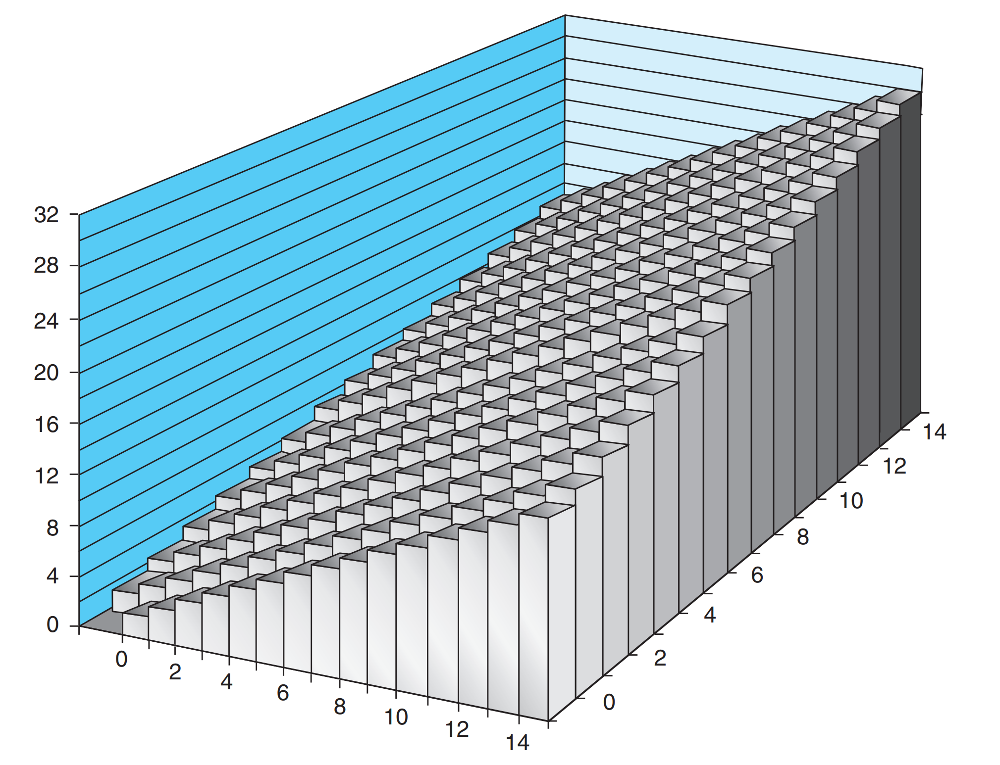

| 图 2.21 整数加法。对于 4 位字长，它们的和可能需要 5 位。 |
| :--------------------------------: |

我们为参数 $x$ 和 $y$ 定义运算 $+^{u}_{w}$，其中 $0 \le x, y < 2^w$，该运算表示：先计算整数和 $x + y$，再将结果截断为 $w$ 位，并将其视为无符号数。

这一过程可以表述为模运算的一种形式：通过丢弃 $x + y$ 的二进制表示中所有权重大于 $2^{w-1}$ 的位，从而得到模 $2^w$ 的结果。

例如，考虑 $x = 9$ 和 $y = 12$ 的 4 位表示，它们的二进制形式分别为 $[1001]$ 和 $[1100]$。两者之和为 21，其 5 位二进制表示为 $[10101]$。若丢弃最高位，则得到 $[0101]$，对应的十进制值为 5。这与计算结果 $21 \bmod 16 = 5$ 完全一致。

---

<!-- Page 0115 -->

> **补充说明：getpeername 中的安全漏洞**
>
> 2002 年，参与 FreeBSD 开源操作系统项目的程序员发现，其 `getpeername` 库函数的实现中存在安全漏洞。其简化后的代码示例如下：
>
> ```c
> /*
>  * 与 FreeBSD 的 getpeername() 实现中发现的代码漏洞类似的示例
>  */
>
> /* 库函数 memcpy 的声明 */
> void *memcpy(void *dest, void *src, size_t n);
>
> /* 保存用户可访问数据的内核内存区域 */
> #define KSIZE 1024
> char kbuf[KSIZE];
>
> /* 从内核区域最多复制 maxlen 字节到用户缓冲区 */
> int copy_from_kernel(void *user_dest, int maxlen) {
>     /* 字节数 len 为缓冲区大小与 maxlen 的最小值 */
>     int len = KSIZE < maxlen ? KSIZE : maxlen;
>     memcpy(user_dest, kbuf, len);
>     return len;
> }
> ```
>
> 在这段代码中，第 7 行给出了库函数 `memcpy` 的原型。该函数用于从一个内存区域向另一个内存区域复制指定数量的字节 $n$。
>
> 从第 14 行开始的函数 `copy_from_kernel`，其目的是将操作系统内核维护的部分数据复制到用户可访问的指定内存区域。通常，内核维护的大多数数据结构不应被用户读取，因为它们可能包含有关其他用户或系统中运行任务的敏感信息。不过，这里所示的 `kbuf` 区域被设计为允许用户读取。参数 `maxlen` 表示用户为目标缓冲区分配的长度，目标缓冲区由参数 `user_dest` 指示。第 16 行的计算通过取源缓冲区大小与目标缓冲区大小之间的最小值，确保复制的字节数不会超过任一缓冲区的容量。
>
> 然而，假设某个恶意程序员以负值 `maxlen` 调用 `copy_from_kernel`。此时，第 16 行的最小值计算结果将为该负值，并赋给变量 `len`，随后作为参数 $n$ 传递给 `memcpy`。需要注意的是，参数 $n$ 的数据类型为 `size_t`。该类型在标准库中通过 `typedef` 定义：在 32 位程序中通常为 `unsigned`，在 64 位程序中通常为 `unsigned long`。由于 $n$ 为无符号类型，当负数被转换为 `size_t` 时，将被解释为一个非常大的正整数。因此，`memcpy` 会尝试从内核区域向用户缓冲区复制一个极大的字节数。尽管实际复制如此大量的数据（至少 $2^{31}$ 字节）通常会因访问非法地址而导致程序异常终止，但在此过程中，程序可能已经读取了未被授权访问的内核内存区域，从而造成严重的安全漏洞。

---

<!-- Page 0116 -->

> **补充说明：getpeername 中的安全漏洞（续）**
>
> 该问题源于数据类型不匹配：某处长度参数被声明为有符号类型，而在另一处却使用无符号类型。这种不一致往往是错误的根源，正如此例所示，甚至可能引发安全漏洞。幸运的是，目前尚未发现有程序员利用 FreeBSD 中该漏洞的案例。官方已发布安全公告 **“FreeBSD-SA-02:38.signed-error”**，指导系统管理员通过补丁修复该问题。
>
> 具体而言，可将 `copy_from_kernel` 的参数 `maxlen` 声明为 `size_t` 类型，使其与 `memcpy` 的参数 `n` 保持一致。同时，应将局部变量 `len` 以及函数返回值也声明为 `size_t` 类型，以避免符号不一致带来的潜在风险。

我们可以如下刻画运算 $+_w^u$：

---

**原理：无符号加法**

对于满足 $0 \le x, y < 2^w$ 的 $x$ 和 $y$，有：

$$
x +_w^u y =
\begin{cases}
x + y, & x + y < 2^w \quad \text{（正常）} \\
x + y - 2^w, & 2^w \le x + y < 2^{w+1} \quad \text{（溢出）} \tag{2.11}
\end{cases}
$$

式（2.11）的两种情况如图 2.22 所示：左侧的和 $x + y$ 被映射为右侧的无符号 $w$ 位和 $x +_w^u y$。在正常情况下，结果保持为 $x + y$；而在溢出情况下，其效果等价于将和减去 $2^w$。

---

**推导：无符号加法**

一般而言：

- 若 $x + y < 2^w$，则其 $(w + 1)$ 位二进制表示的最高位为 0，丢弃该位不会改变数值；
- 若 $2^w \le x + y < 2^{w+1}$，则其 $(w + 1)$ 位表示的最高位为 1，丢弃该位等价于从结果中减去 $2^w$。

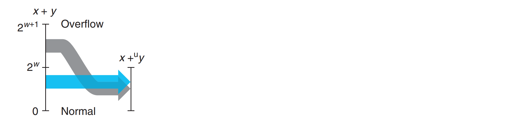

| 图 2.22 整数加法与无符号加法之间的关系。当 $x + y > 2^w - 1$ 时，结果发生溢出。 |
| :--------------------------------------------------: |

---

<!-- Page 0117 -->

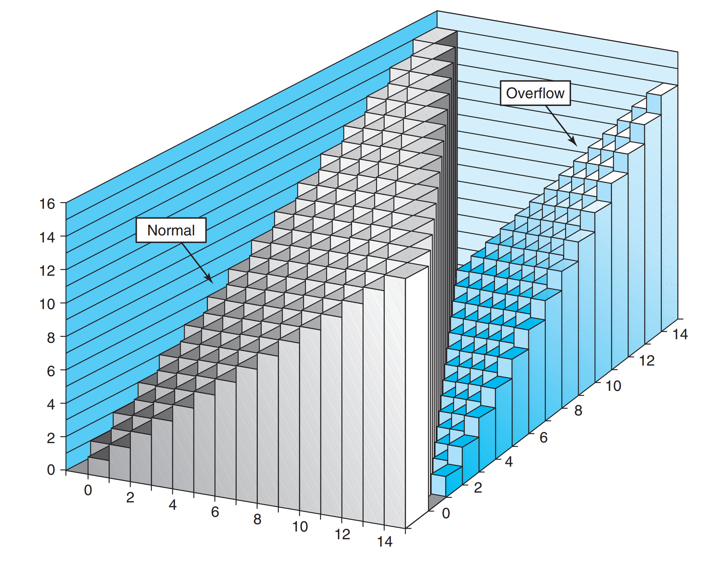

| 图 2.23 无符号加法。对于 4 位字长，加法以模 16 执行。 |
| :-------------------------------: |

当整数运算的精确结果无法用给定字长的数据类型表示时，称该运算发生**溢出**。如式（2.11）所示，当两个操作数之和达到 $2^{w}$ 或更大时，就会发生溢出。图 2.23 展示了字长 $w = 4$ 时无符号加法函数的图形表示。运算按照模 $2^{4} = 16$ 进行计算。

当 $x + y < 16$ 时，不会发生溢出，此时 $x +_4^u y = x + y$。图中标记为“正常”的倾斜平面区域对应的正是这种情况。

当 $x + y \ge 16$ 时，加法发生溢出，其效果等价于将和减去 16，即：

$$
x +_4^u y = x + y - 16
$$

图中标记为“溢出”的倾斜平面区域对应的正是这一情形。

在执行 C 程序时，无符号加法溢出不会被视为错误或发出异常信号。然而，在某些情况下，我们可能希望判断是否发生了溢出。

---

**原理：检测无符号加法的溢出**

对于范围 $0 \le x, y \le UMax_w$ 内的 $x$ 和 $y$，令

$$
s \doteq x +_w^u y
$$

则当且仅当 $s < x$（或等价地 $s < y$）时，计算 $s$ 时发生了溢出。

例如，在前面的例子中：

$$
9 +_4^u 12 = 5
$$

由于 $5 < 9$，因此可以判定该运算发生了溢出。

---

<!-- Page 0118 -->

**推导：检测无符号加法的溢出**

观察到 $x + y \geq x$，因此如果 $s$ 没有溢出，我们肯定有 $s \geq x$。另一方面，如果 $s$ 确实溢出了，我们有 $s = x + y - 2^w$。由于 $y < 2^w$，可知 $y - 2^w < 0$，因此 $s = x + (y - 2^w) < x$。

---

**练习题 2.27（第 188 页解答）**

编写一个具有以下原型的函数：

```c
/* 确定参数是否可以在不溢出的情况下相加 */
int uadd_ok(unsigned x, unsigned y);
```

如果参数 $x$ 和 $y$ 可以在不引起溢出的情况下相加，此函数应返回 1。

---

模加法形成了一个称为阿贝尔群（abelian group）的数学结构，以挪威数学家尼尔斯·亨利克·阿贝尔（Niels Henrik Abel, 1802–1829）的名字命名。也就是说，它是可交换的（"阿贝尔"部分由此而来）和结合的；它有一个单位元素 0，并且每个元素都有加法逆元。考虑具有加法运算 $+^u_w$ 的 $w$ 位无符号数集合。对于每个值 $x$，必须存在某个值 $-^u_w x$，使得 $-^u_w x +^u_w x = 0$。这个加法逆元运算可以表征如下：

---

**原理：无符号取反**

对于任何数字 $x$，满足 $0 \le x < 2^w$，其 $w$ 位无符号取反 $-^u_w x$ 由下式给出：

$$
-^u_w x =
\begin{cases}
0, & x = 0 \\
2^w - x, & x > 0 \tag{2.12}
\end{cases}
$$

这个结果可以通过情况分析轻松推导出来：

---

**推导：无符号取反**

当 $x = 0$ 时，加法逆元显然是 0。对于 $x > 0$，考虑值 $2^w - x$。注意这个数字满足 $0 < 2^w - x < 2^w$。同时，我们有

$$
(x + 2^w - x) \bmod 2^w = 2^w \bmod 2^w = 0
$$

因此它是 $x$ 在 $+^u_w$ 下的逆元。

---

**练习题 2.28（第 188 页解答）**

我们可以用单个十六进制数字表示长度 $w = 4$ 的位模式。对于这些数字的无符号解释，使用等式 2.12 填写下表，给出所示数字的无符号加法逆元的值和位表示（十六进制）。

---

<!-- Page 0119 -->

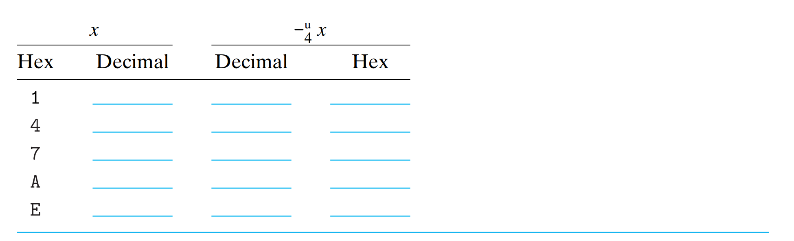

### 2.3.2 补码加法

对于补码加法，当结果过大（正数）或过小（负数）而无法表示时，我们必须决定如何处理。给定范围 $-2^{w-1} \leq x, y \leq 2^{w-1} - 1$ 内的整数 $x$ 和 $y$，它们的和可能落在 $-2^{w} \leq x + y \leq 2^{w} - 2$ 范围内，需要 $w+1$ 位才能精确表示。与之前一样，我们通过将结果截断为 $w$ 位来避免数据位数无限扩展。然而，这样得到的结果在数学上不如模加法直观。我们将 $x +_{w}^{t} y$ 定义为：先将整数和 $x + y$ 截断为 $w$ 位，再将结果视为补码表示。

---

**原理：补码加法**

对于范围 $-2^{w-1} \leq x, y \leq 2^{w-1} - 1$ 内的整数 $x$ 和 $y$：

$$
x +_{w}^{\mathrm{t}} y = 
\begin{cases}
x + y - 2^{w}, & 2^{w-1} \leq x + y \quad \text{正溢出} \\
x + y, & -2^{w-1} \leq x + y < 2^{w-1} \quad \text{正常} \\
x + y + 2^{w}, & x + y < -2^{w-1} \quad \text{负溢出} \tag{2.13}
\end{cases}
$$

---

如图 2.24 所示，左侧显示整数和 $x + y$，其值位于 $-2^{w} \leq x + y \leq 2^{w} - 2$ 内；右侧显示将和截断为 $w$ 位补码后的结果。（图中标签“情况 1”到“情况 4”对应原理推导中的不同情况。）当 $x + y$ 超过 $TMax_{w}$（情况 4）时，发生正溢出，此时截断效果相当于从和中减去 $2^{w}$。当 $x + y$ 小于 $TMin_{w}$（情况 1）时，发生负溢出，此时截断效果相当于向和中加上 $2^{w}$。

两个数字的 $w$ 位补码和与无符号和在位级表示上完全一致。实际上，大多数计算机使用相同的机器指令执行无符号或有符号加法。

---

**推导：补码加法**

由于补码加法与无符号加法在位级表示上完全相同，我们可以将操作 $+_{w}^{t}$ 表示为：先将操作数视作无符号整数，执行无符号加法，再将结果转换回补码。

---

<!-- Page 0120 -->

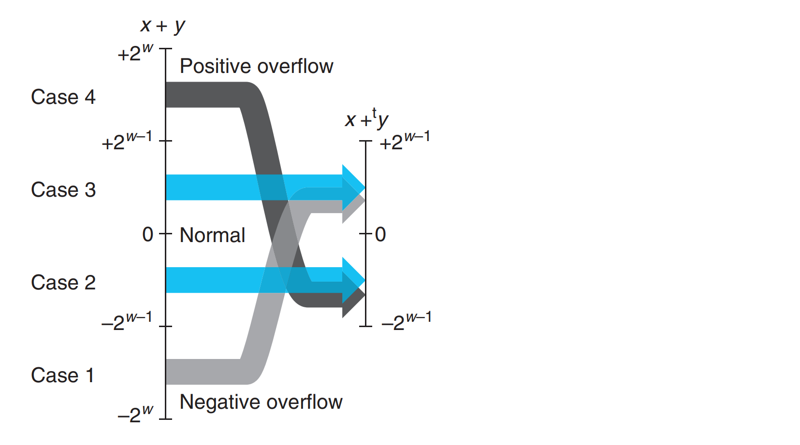

| 图 2.24 整数加法和补码加法之间的关系。当 $x + y$ 小于 $-2^{w-1}$ 时，发生负溢出；当它大于或等于 $2^{w-1}$ 时，发生正溢出。 |
| :-------------------------------: |

$$
x+_{w}^{\mathrm{t}}y = U2T_{w}\big(T2U_{w}(x) +_{w}^{\mathrm{u}} T2U_{w}(y)\big) \tag{2.14}
$$

根据方程 2.6，可将 $T2U_{w}(x)$ 表示为 $x_{w-1}2^{w} + x$，$T2U_{w}(y)$ 表示为 $y_{w-1}2^{w} + y$。利用 $+_{w}^{\mathrm{u}}$ 为模 $2^w$ 加法，以及模加法的性质，可得

$$
\begin{aligned}
x+_{w}^{\mathrm{t}}y &= U2T_{w}\big(T2U_{w}(x) +_{w}^{\mathrm{u}} T2U_{w}(y)\big) \\
&= U2T_{w}\big((x_{w-1}2^{w} + x + y_{w-1}2^{w} + y) \bmod 2^{w}\big) \\
&= U2T_{w}\big((x + y) \bmod 2^{w}\big)
\end{aligned}
$$

项 $x_{w-1}2^{w}$ 和 $y_{w-1}2^{w}$ 被消去，因为它们在模 $2^w$ 下等于 0。

为了更直观地理解，将 $z$ 定义为整数和 $z \doteq x + y$，$z'$ 定义为 $z' \doteq z \bmod 2^w$，$z''$ 定义为 $z'' \doteq U2T_w(z')$。则 $z''$ 即为 $x +_w^t y$。分析可分四种情况，如图 2.24 所示：

1. $-2^w \le z < -2^{w-1}$。此时 $z' = z + 2^w$，得到 $0 \le z' < -2^{w-1} + 2^w = 2^{w-1}$。由方程 2.7 可知 $z'' = z'$，这是负溢出的情况：两个负数 $x$ 和 $y$ 的和得到非负结果 $z'' = x + y + 2^w$。

2. $-2^{w-1} \le z < 0$。此时 $z' = z + 2^w$，得到 $2^{w-1} \le z' < 2^w$。由方程 2.7 可知 $z'' = z' - 2^w = z$，即补码和 $z''$ 等于整数和 $x + y$。

3. $0 \le z < 2^{w-1}$。此时 $z' = z$，得到 $0 \le z' < 2^{w-1}$，故 $z'' = z' = z$。同样，补码和 $z''$ 等于整数和 $x + y$。

4. $2^{w-1} \le z < 2^w$。此时 $z' = z$，得到 $2^{w-1} \le z' < 2^w$。在该范围内 $z'' = z' - 2^w = x + y - 2^w$，这是正溢出的情况：两个正数 $x$ 和 $y$ 的和得到负结果 $z'' = x + y - 2^w$。

---

<!-- Page 0121 -->

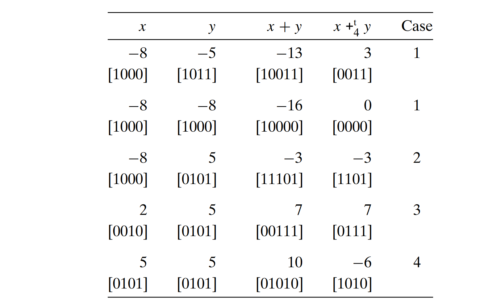

| 图 2.25 补码加法示例。通过对操作数执行二进制加法并将结果截断为 4 位，可以获得 4 位补码和的位级表示。 |
| :-------------------------------: |

作为补码加法的说明，图 2.25 展示了当 $w = 4$ 时的一些示例。每个示例都按其在方程 2.13 推导中对应的情况进行标记。请注意，$2^{4} = 16$，因此负溢出会产生比整数和多 16 的结果，而正溢出会产生比整数和少 16 的结果。我们展示了操作数和结果的位级表示。可以观察到，通过对操作数执行二进制加法并将结果截断为 4 位，即可获得最终结果。

图 2.26 说明了字长 $w = 4$ 的补码加法。操作数范围在 $-8$ 和 $7$ 之间。当 $x + y < -8$ 时，补码加法发生负溢出，导致和增加 16。当 $-8 \le x + y < 8$ 时，加法产生 $x + y$。当 $x + y \ge 8$ 时，加法发生正溢出，导致和减少 16。这三个范围在图中分别形成倾斜的平面。

方程 2.13 还可用来识别溢出的情况：

---

**原理：检测补码加法中的溢出**

对于范围 $TMin_w \le x, y \le TMax_w$ 中的 $x$ 和 $y$，令 $s \doteq x +_w^t y$。当且仅当 $x > 0$ ， $y > 0$ 且 $s \le 0$ 时，$s$ 的计算发生正溢出；当且仅当 $x < 0$ ， $y < 0$ 且 $s \ge 0$ 时，计算发生负溢出。

---

图 2.25 展示了该原理在 $w = 4$ 下的几个示例。第一项显示了负溢出的情况，即两个负数之和为正数；最后一项显示了正溢出的情况，即两个正数之和为负数。

---

<!-- Page 0122 -->

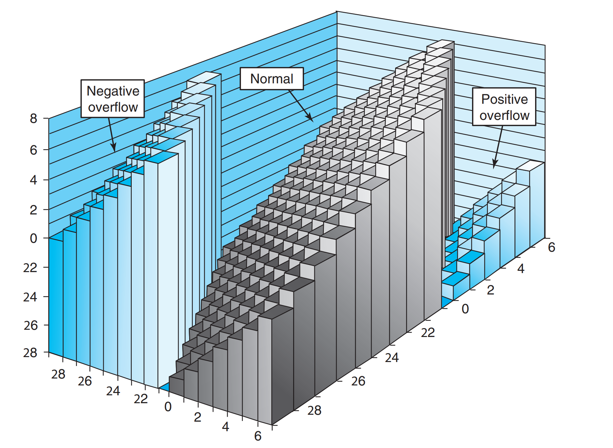

| 图 2.26 补码加法。对于 4 位字长，当 $ x + y < -8 $ 时加法可能发生负溢出，当 $ x + y \geq 8 $ 时可能发生正溢出。 |
| :-------------------------------: |

---

**推导：检测补码加法的溢出**

让我们首先对正溢出进行分析。如果 x > 0 和 y > 0 但 $ s \leq 0 $，则显然发生了正溢出。相反，正溢出要求（1）x > 0 和 y > 0（否则，$ x + y < TMax_w $）和（2）$ s \leq 0 $（来自方程 2.13）。类似的一组论证适用于负溢出。

---
**练习题 2.29（第 188 页的解答）**

按照图 2.25 的样式填写下表。给出 5 位参数的整数值、它们的整数和与补码和的值、补码和的位级表示以及方程 2.13 推导中的情况。

| $x$     | $y$     | $x + y$ | $x +^t_5 y$ | Case |
|:-------:|:-------:|:-------:|:-------:|:----:|
| [10100] | [10001] |         |         |      |
| [11000] | [11000] |         |         |      |
| [10111] | [01000] |         |         |      |
| [00010] | [00101] |         |         |      |
| [01100] | [00100] |         |         |      |

---

<!-- Page 0123 -->

**练习题 2.30（第 189 页的解答）**

编写一个具有以下原型的函数：

```c
/* 判断两个参数相加是否会发生溢出 */
int tadd_ok(int x, int y);
```

如果参数 $x$ 和 $y$ 可以在不引起溢出的情况下相加，函数应返回 1，否则返回 0。

---

**练习题 2.31（第 189 页的解答）**

您的同事对您对补码加法溢出条件的分析感到不耐烦，并向您展示了以下 `tadd_ok` 的实现：

```c
/* 判断两个参数相加是否会发生溢出 */
/* 警告：此代码有错误。*/
int tadd_ok(int x, int y) {
    int sum = x + y;
    return (sum - x == y) && (sum - y == x);
}
```

您看着代码笑了。请解释原因。

---

**练习题 2.32（第 189 页的解答）**

您需要编写函数 `tsub_ok`，带有参数 $x$ 和 $y$，如果计算 $x - y$ 不会导致溢出，则返回 1。刚刚完成练习题 2.30 的代码后，您尝试编写如下函数：

```c
/* 判断两个参数相减是否会发生溢出 */
/* 警告：此代码有错误。*/
int tsub_ok(int x, int y) {
    return tadd_ok(x, -y);
}
```

对于 $x$ 和 $y$ 的什么值，此函数将给出不正确的结果？编写此函数的正确版本留作练习（习题 2.74）。

---

<!-- Page 0124 -->

### 2.3.3 补码取反

我们可以看到，范围 $TMin_w \leq x \leq TMax_w$ 中的每个数字 $x$ 在 $+_w^t$ 下都有一个加法逆元，记作 $-_w^t x$，具体如下：

---

**原理：补码取反**

对于范围 $TMin_{w} \leq x \leq TMax_{w}$ 中的 $x$，其补码取反 $-_w^t x$ 可表示为：

$$
-_w^t x =
\begin{cases}
TMin_w, & x = TMin_w \\
-x, & x > TMin_w \tag{2.15}
\end{cases}
$$

也就是说，对于 $w$ 位补码加法，$TMin_w$ 是其自身的加法逆元，而其他任意值 $x$ 的加法逆元为 $-x$。

---

**推导：补码取反**

注意到：

$$
TMin_w + TMin_w = -2^{w-1} + (-2^{w-1}) = -2^w
$$

这会导致负溢出，因此在 $w$ 位补码加法下：

$$
TMin_w +_w^t TMin_w = -2^w + 2^w = 0
$$

对于 $x > TMin_w$ 的任意 $x$，其加法逆元 $-x$ 也能表示为 $w$ 位补码数字，并且有：

$$
x + (-x) = 0
$$

---

**练习题 2.33（第 189 页解答）**

对于 $w = 4$ 的位模式，可以用单个十六进制数字表示。根据这些数字的补码解释，填写下表以确定所示数字的加法逆元：

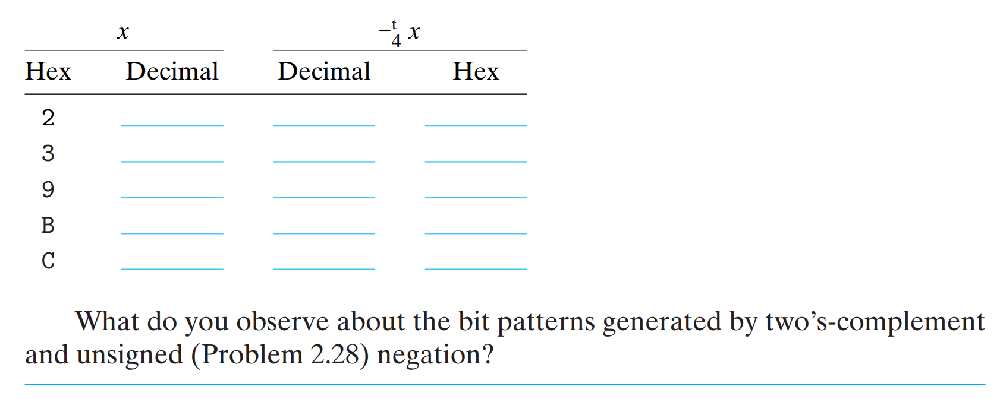

思考：与无符号数（练习题 2.28）取反生成的位模式相比，补码取反有什么特点？

---

<!-- Page 0125 -->

> **Web 补充说明 DATA:TNEG 补码取反的位级表示**
>
>有几种巧妙的方法可以在位级确定补码取反的值。以下两种技术在调试程序时非常有用，例如遇到值 `0xfffffffа` 时，它们有助于深入理解补码表示的本质。
>
> 在位级执行补码取反的一种方法是先对每个位求补，然后对结果加 1。在 C 语言中，对于任何整数 $x$，表达式 $-x$ 与 ~$ x + 1$ 的结果是相同的。
>
> 以下是 4 位字长的一些示例：
>
>| $ \vec{x} $ |        | ~$ \vec{x} $ |        | incr(~$ \vec{x}$) |        |
>| ----------: | :----: | -----------: | :----: | ----------------: | :----: |
>|    [0101]   |    5   |    [1010]    |   -6   |      [1011]       |   -5   |
>|    [0111]   |    7   |    [1000]    |   -8   |      [1001]       |   -7   |
>|    [1100]   |   -4   |    [0011]    |    3   |      [0100]       |    4   |
>|    [0000]   |    0   |    [1111]    |   -1   |      [0000]       |    0   |
>|    [1000]   |   -8   |    [0111]    |    7   |      [1000]       |    8   |
>
> 对于之前的例子，我们知道 `0xf` 的补码是 `0x0`，`0xa` 的补码是 `0x5`，因此 `0xfffffffа` 是 $-6$ 的补码表示。
>
> 对数字 $x$ 执行补码取反的第二种方法是基于将位向量分为两部分。设 $k$ 为最右边 1 的位置，则 $x$ 的位级表示为：
>
> $$[x_{w-1}, x_{w-2}, \ldots, x_{k+1}, 1, 0, \ldots, 0] \quad (x \neq 0)$$
>
> 对应的取反形式为：
>
> $$[\sim x_{w-1}, \sim x_{w-2}, \ldots, \sim x_{k+1}, 1, 0, \ldots, 0]$$
>
> 也就是说，仅对位位置 $k$ 左侧的每个位求补。
>
> 用一些 4 位数字来说明这个方法（用斜体表示最右边的模式 1, 0,…,0）：
>
>|    $x$   |      |   $-x$   |      |
>| -------: | :--: | -------: | :--: |
>| [1*100*] |  -4  | [0*100*] |   4  |
>| [*1000*] |  -8  | [*1000*] |  -8  |
>| [010*1*] |   5  | [101*1*] |  -5  |
>| [011*1*] |   7  | [100*1*] |  -7  |

### 2.3.4 无符号乘法

范围 $0 \leq x, y \leq 2^{w} - 1$ 中的整数 $x$ 和 $y$ 可以表示为 $w$ 位无符号数，但它们的乘积 $x \cdot y$ 的取值范围为 $0$ 到 $(2^{w} - 1)^{2} = 2^{2w} - 2^{w+1} + 1$，这可能需要多达 $2w$ 位来表示。相反，C 语言中的无符号乘法定义为仅保留由 $2w$ 位整数乘积的低 $w$ 位所给出的 $w$ 位结果。我们将此值记为 $x *_{w}^{u} y$。

将无符号数截断为 $w$ 位等价于对其取模 $2^{w}$，因此有：

---

<!-- Page 0126 -->

**原理：无符号乘法**

对于 $x$ 和 $y$，满足 $0 \leq x, y \leq UMax_{w}$：

$$
x*_{w}^{u}y = (x \cdot y) \bmod 2^{w} \tag{2.16}
$$

---

### 2.3.5 补码乘法

对于范围 $-2^{w-1} \leq x, y \leq 2^{w-1} - 1$ 的整数 $x$ 和 $y$，它们可以表示为 $w$ 位补码数，但乘积 $x \cdot y$ 的范围在

$$
-2^{w-1} \cdot (2^{w-1} - 1) = -2^{2w-2} + 2^{w-1} \quad \text{和} \quad -2^{w-1} \cdot (-2^{w-1}) = 2^{2w-2}
$$

之间。这可能需要多达 $2w$ 位来以补码形式表示。相反，C 语言中的有符号乘法通常通过将 $2w$ 位乘积截断为 $w$ 位来实现。我们将此截断结果表示为 $x *_{w}^{t} y$。将补码数字截断为 $w$ 位等价于先对 $2^w$ 取模，再从无符号转换为补码，从而得到：

---

**原理：补码乘法**

对于 $x$ 和 $y$，满足 $TMin_{w} \leq x, y \leq TMax_{w}$：

$$
x*_{w}^{\mathrm{t}}y = U2T_{w}((x \cdot y) \bmod 2^{w}) \tag{2.17}
$$

---

我们可以声明，乘积运算的位级表示对于无符号和补码乘法是相同的，如下所示：

---

**原理：无符号与补码乘法的位级等价性**

令 $\vec{x}$ 和 $\vec{y}$ 为长度为 $w$ 的位向量。将整数 $x$ 和 $y$ 定义为这些位在补码形式下表示的值：

$$
x = B2T_w(\vec{x}), \quad y = B2T_w(\vec{y})
$$

将非负整数 $x'$ 和 $y'$ 定义为这些位在无符号形式下表示的值：

$$
x' = B2U_w(\vec{x}), \quad y' = B2U_w(\vec{y})
$$

则有：

$$
T2B_{w}(x*_{w}^{\mathrm{t}}y) = U2B_{w}(x' *_{w}^{\mathrm{u}} y')
$$

---

作为说明，图 2.27 展示了乘以不同 3 位数字的结果。对于每对位级操作数，我们执行无符号和补码乘法，得到 6 位乘积，然后将这些乘积截断为 3 位。无符号截断乘积总是等于 $x \cdot y \bmod 8$。对于无符号和补码乘法，截断后的位级表示始终相同，即使完整的 6 位表示不同。

---

<!-- Page 0127 -->

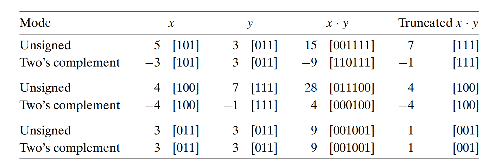

| 图 2.27 三位无符号和补码乘法示例。虽然完整乘积的位级表示可能不同，但截断乘积的位级表示是相同的。|
| :-------------------------------: |

---

**推导：无符号和补码乘法的位级等价性**

从方程 2.6，我们有 $ x' = x + x_{w-1}2^{w} $ 和 $ y' = y + y_{w-1}2^{w} $。计算这些值的乘积模 $ 2^{w} $ 给出以下结果：

$$ \begin{aligned}(x^{\prime}\cdot y^{\prime})\bmod2^{w}&=[(x+x_{w-1}2^{w})\cdot(y+y_{w-1}2^{w})]\bmod2^{w}\\ &=[x\cdot y+(x_{w-1}y+y_{w-1}x)2^{w}+x_{w-1}y_{w-1}2^{2w}]\bmod2^{w}\\ &=(x\cdot y)\bmod2^{w}\\ \end{aligned} $$

权重为 $ 2^w $ 和 $ 2^{2w} $ 的项由于模运算符而消失。根据方程 2.17，我们有 $ x \star_w^t y = U2T_w((x \cdot y) \mod 2^w) $。我们可以对两边应用操作 $ T2U_w $ 来得到

$$ T2U_{w}(x*_{w}^{\mathrm{t}}y)=T2U_{w}(U2T_{w}((x\cdot y)\bmod2^{w}))=(x\cdot y)\bmod2^{w} $$

将此结果与方程 2.16 和 2.18 结合，显示 $ T2U_w(x *_w y) = (x' \cdot y') \bmod 2^w = x' *_w y' $。然后我们可以对两边应用 $ U2B_w $ 来得到

$$ U2B_{w}(T2U_{w}(x*_{w}^{\mathrm{t}}y))=T2B_{w}(x*_{w}^{\mathrm{t}}y)=U2B_{w}(x^{\prime}*_{w}^{\mathrm{u}}y^{\prime}) $$

---

**练习题 2.34（第 189 页的解答）**

填写下表，以图 2.27 的样式显示乘以不同 3 位数字的结果：

| Mode             | x              | y              | x·y              | Truncated x·y      |
|------------------|:--------------:|:--------------:|:----------------:|:------------------:|
| Unsigned         | _______  [100] | _______  [101] | _______ _______  | _______ _______    |
| Two's complement | _______  [100] | _______  [101] | _______ _______  | _______ _______    |
| Unsigned         | _______  [010] | _______  [111] | _______ _______  | _______ _______    |
| Two's complement | _______  [010] | _______  [111] | _______ _______  | _______ _______    |
| Unsigned         | _______  [110] | _______  [110] | _______ _______  | _______ _______    |
| Two's complement | _______  [110] | _______  [110] | _______ _______  | _______ _______    |

---

<!-- Page 0128 -->

**练习题 2.35（第 190 页解答）**

您被分配实现函数 `tmult_ok`，用于判断两个参数在相乘时是否会发生溢出。代码如下：

```c
/* 确定参数是否可以在不溢出的情况下相乘 */
int tmult_ok(int x, int y) {
    int p = x*y;
    /* x 为零，或将 p 除以 x 得到 y */
    return !x || p/x == y;
}
```

在大量测试数据下，该函数表现正常。但同事提出质疑：“既然不能用减法检测加法是否溢出（见练习题 2.31），为什么可以用除法检测乘法是否溢出？”

下面给出数学证明思路。

首先，考虑 $x = 0$ 的情况。此时 $x \cdot y = 0$，显然不会发生溢出，函数返回真，因此处理正确。

否则，设 $x \ne 0$。令 $x$、$y$、$p$ 和 $q$ 为 $w$ 位整数，其中：

* $p$ 是对 $x$ 和 $y$ 执行补码乘法得到的结果（截断为 $w$ 位）；
* $q$ 是将 $p$ 除以 $x$ 的结果。

1. 证明：整数乘积 $x \cdot y$ 可以表示为
   $$
   x \cdot y = p + t2^w
   $$
   其中，当且仅当 $p$ 的计算发生溢出时，$t \ne 0$。

2. 证明：$p$ 可以表示为
   $$
   p = x \cdot q + r
   $$
   其中 $|r| < |x|$。

3. 证明：当且仅当 $r = 0$ 且 $t = 0$ 时，$q = y$。

---

**练习题 2.36（第 190 页解答）**

对于 `int` 为 32 位的数据类型，设计一个使用 `int64_t` 实现的 64 位精度版本 `tmult_ok`（对应练习题 2.35），并且不使用除法运算。

---

**练习题 2.37（第 191 页解答）**

您被要求修补第 129 页补充说明中 XDR 代码的漏洞。在该场景中，`int` 和 `size_t` 均为 32 位。为避免乘法溢出，您决定使用 `uint64_t` 计算待分配的字节数，并将原代码第 9 行的 `malloc` 调用替换为：

```c
uint64_t asize = ele_cnt * (uint64_t) ele_size;
void *result = malloc(asize);
```

请注意，`malloc` 的参数类型为 `size_t`。

A. 您的代码相比原始代码是否有改进？

B. 您应如何修改代码以彻底消除该漏洞？

---

<!-- Page 0129 -->

> **补充说明：XDR 库中的安全漏洞**
>
> 2002 年，人们发现 Sun Microsystems 提供的 XDR 库实现代码中存在一个安全漏洞。XDR（External Data Representation）是一种广泛用于在程序之间共享数据结构的工具。该漏洞源于一个关键问题：乘法运算可能发生溢出，却不会向程序发出任何错误提示。
>
> 存在漏洞的代码示例如下：
>
> ```c
> /* 与 Sun 的 XDR 库中发现的代码漏洞类似的示例 */
>
> void* copy_elements(void *ele_src[], int ele_cnt, size_t ele_size) {
>     /*
>      * 为 ele_cnt 个对象分配缓冲区，每个对象 ele_size 字节，
>      * 并从 ele_src 指定的位置复制数据。
>      */
>     void *result = malloc(ele_cnt * ele_size);
>     if (result == NULL)
>         /* malloc 失败 */
>         return NULL;
>
>     void *next = result;
>     int i;
>     for (i = 0; i < ele_cnt; i++) {
>         /* 将第 i 个对象复制到目标位置 */
>         memcpy(next, ele_src[i], ele_size);
>         /* 指针移动到下一个内存区域 */
>         next += ele_size;
>     }
>     return result;
> }
> ```
>
> 函数 `copy_elements` 的设计目标是：将 `ele_cnt` 个数据结构（每个大小为 `ele_size` 字节）复制到函数中分配的缓冲区。所需的总字节数计算为：
>
> $$
> ele_cnt \times ele_size
> $$
>
> 然而，假设一个恶意程序员以如下参数调用该函数：
>
> * $ele_cnt = 2^{20} + 1 = 1{,}048{,}577$
> * $ele_size = 2^{12} = 4{,}096$
>
> 若程序编译为 32 位，第 9 行的乘法运算将发生溢出。理论上所需的内存大小为：
>
> $$
> (2^{20} + 1) \times 2^{12} = 4{,}294{,}971{,}392 \text{ 字节}
> $$
>
> 但由于 32 位无符号整数溢出，实际只会分配：
>
> $$
> 4{,}096 \text{ 字节}
> $$
>
> 随后的循环仍会尝试复制全部数据，从而越过已分配缓冲区的边界，破坏相邻的数据结构。这种越界写入可能导致程序崩溃，甚至引发严重的安全问题。
>
> 当时，Sun 的这段代码被几乎所有主流操作系统，以及诸如 Internet Explorer 和 Kerberos 身份验证系统等广泛使用的软件所采用。计算机应急响应小组（CERT，隶属于卡内基梅隆大学软件工程研究所）发布了编号为 “CA-2002-25” 的安全公告，促使大量厂商紧急修补相关代码。幸运的是，没有已知的安全攻击事件与该漏洞直接相关。
>
> 类似的问题也曾出现在许多 `calloc` 函数的实现中，这些漏洞后来均已修复。然而，不少程序员在调用内存分配函数（如 `malloc`）时，仍然直接使用算术表达式作为参数，而未检查表达式是否发生溢出。
>
> 作为练习，请尝试编写一个健壮且安全的 `calloc` 实现（见问题 2.76）。

---

<!-- Page 0130 -->

### 2.3.6 常数乘法

历史上，许多机器上的整数乘法指令相当缓慢，往往需要 10 个甚至更多时钟周期，而其他整数运算（如加法、减法、位运算和移位）通常只需 1 个时钟周期。即便是在我们作为参考的 Intel Core i7 Haswell 处理器上，整数乘法也需要 3 个时钟周期。因此，编译器中的一项重要优化策略，是尝试用移位与加法的组合来替代带有常数因子的乘法运算。我们首先讨论乘以 2 的幂的情况，然后将其推广到任意常数。

---

**原理：乘以 2 的幂**

设 $x$ 为一个无符号整数，其位模式表示为 $[x_{w-1}, x_{w-2}, \ldots, x_0]$。对于任意 $k \ge 0$，$x2^k$ 的 $w+k$ 位无符号表示为

$$
[x_{w-1}, x_{w-2}, \ldots, x_0, 0, \ldots, 0]
$$

即在原位模式右侧补充 $k$ 个 0。

---

例如，十进制数 11 在 $w = 4$ 时可表示为 $[1011]$。将其左移 $k = 2$ 位，可得到 6 位向量 $[101100]$，其表示的无符号数为 $11 \cdot 4 = 44$。

---

**推导：乘以 2 的幂**

该性质可由公式 2.1 推导得到：

$$
\begin{aligned}
B2U_{w+k}([x_{w-1}, x_{w-2}, \cdots, x_0, 0, \cdots, 0])
&= \sum_{i=0}^{w-1} x_i 2^{i+k} \\
&= \left( \sum_{i=0}^{w-1} x_i 2^i \right) \cdot 2^k \\
&= x 2^k
\end{aligned}
$$

---

当在固定字长下进行左移 $k$ 位时，最高的 $k$ 位会被丢弃，结果为

$$
[x_{w-k-1},, x_{w-k-2},, \ldots,, x_0,, 0,, \ldots,, 0]
$$

但以上讨论基于**固定字长**上的运算。因此，可以看到：将一个值左移等价于执行一次**无符号乘以 $2$ 的幂**。

---

<!-- Page 0131 -->

**原理：无符号乘以 2 的幂**

对于具有无符号值 $x$ 和 $k$ 的 C 变量 `x` 与 `k`，且满足 $0 \le k < w$，C 表达式

$$
\text{x} \ll \text{k}
$$

产生的结果为

$$
x *_w^u 2^k
$$

---

由于固定字长补码算术在位级操作上与无符号算术完全一致，我们可以对左移与乘以 $2$ 的幂之间的关系在补码算术下给出类似表述。

---

**原理：补码乘以 2 的幂**

对于具有补码值 $x$ 和无符号值 $k$ 的 C 变量 `x` 与 `k`，且满足 $0 \le k < w$，C 表达式

$$
\text{x} \ll \text{k}
$$

产生的结果为

$$
x *_w^t 2^k
$$

---

需要注意，乘以 2 的幂可能导致无符号或补码算术发生溢出。上述结论表明：即使发生溢出，通过移位仍可得到与对应乘法相同的位级效果。

回顾前面的示例：将 4 位二进制模式 $[1011]$（数值 $11$）左移两位得到 $[101100]$（数值 $44$）。若截断为 4 位，则得到 $[1100]$（数值 $12 = 44 \bmod 16$）。

由于整数乘法通常比移位与加减法开销更高，许多 C 编译器会在可能的情况下，将“乘以常数”的操作优化为移位与加减法的组合。

例如，若程序中包含表达式

$$
x * 14
$$

注意到

$$
14 = 2^3 + 2^2 + 2^1
$$

编译器可以将其改写为

$$
(x \ll 3) + (x \ll 2) + (x \ll 1)
$$

即用三次移位与两次加法替代一次乘法。无论 $x$ 为无符号还是补码表示，两种计算方式都会产生相同的结果，即使乘法产生溢出也成立。

进一步地，由于

$$
14 = 2^4 - 2^1
$$

还可以改写为

$$
(x \ll 4) - (x \ll 1)
$$

此时仅需两次移位和一次减法，代价更低。

---

**练习题 2.38（第 191 页的解答）**

正如我们将在第 3 章中看到的，`LEA` 指令可以执行形如

$$
(a \ll k) + b
$$

的计算，其中 $k \in {0,1,2,3}$，且 $b$ 为 $0$ 或某个程序变量。编译器常利用该指令实现常数因子的乘法。例如：

$$
3a = (a \ll 1) + a
$$

考虑 $b = 0$ 或 $b = a$，以及 $k$ 的所有可能取值，使用单条 `LEA` 指令最多可以计算 $a$ 的哪些倍数？

---

推广上述示例，考虑为表达式

$$
x * K
$$

生成代码，其中 $K$ 为常数。编译器可以将 $K$ 的二进制表示写为 0 与 1 交替出现的若干序列：

---

<!-- Page 0132 -->

$$
\left[\begin{array}{cc}
(0\cdots0) (1\cdots1) (0\cdots0) (1\cdots1)
\end{array}\right]
$$

例如，14 可以写成 $[(0\ldots0)(111)(0)]$。考虑从位位置 $n$ 到位位置 $m$（$n \geq m$）的一串连续的 1。（对于 14，有 $n = 3$、$m = 1$。）我们可以使用以下两种不同形式之一来计算这些位对乘积的影响：

形式 A：
$$(x \ll n) + (x \ll (n-1)) + \cdots + (x \ll m)$$

形式 B：
$$(x \ll (n+1)) - (x \ll m)$$

通过将每一段连续 1 的结果累加起来，我们可以在**不使用乘法指令**的情况下计算 $x * K$。当然，在“移位 + 加减法”与单条乘法指令之间进行权衡，取决于各类指令的相对执行速度，而这些速度通常高度依赖具体机器架构。大多数编译器仅在所需的移位与加减操作数量较少时才会采用这种优化策略。

---

**练习题 2.39（第 192 页的解答）**

当位位置 $n$ 为最高有效位时，应如何修改形式 B 的表达式？

---

**练习题 2.40（第 192 页的解答）**

对于以下每个 $K$ 值，给出仅使用指定数量操作来表示 $x * K$ 的方法。这里我们认为加法与减法具有相近的代价。你可能需要使用一些超出简单形式 A 与 B 规则的技巧。

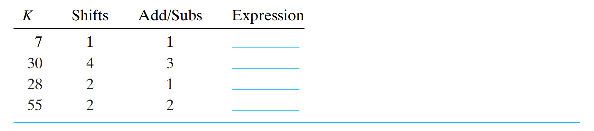

---

**练习题 2.41（第 192 页的解答）**

对于从位位置 $n$ 到位位置 $m$（$n \geq m$）的一串连续 1，我们已经看到可以生成两种形式的代码 A 和 B。编译器应当如何决定采用哪种形式？

---

### 2.3.7 除以 2 的幂

在大多数机器上，整数除法通常比整数乘法更慢——往往需要 30 个甚至更多的时钟周期。不过，对于除以 $2$ 的幂次，可以通过更高效的移位操作方式实现。使用时，我们采用右移而不是左移。右移分为逻辑右移和算术右移两种形式，分别适用于无符号数和补码整数。

---

<!-- Page 0133 -->

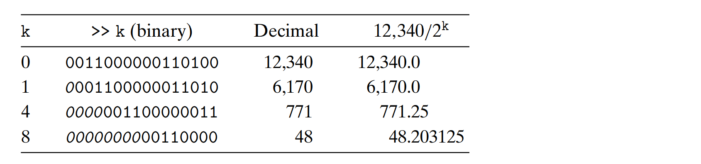

| 图 2.28 除以 2 的幂的无符号数。这些示例说明，执行逻辑右移 $k$ 与除以 $2^k$ 并向零舍入具有相同的效果。|
| :-------------------------------: |

整数除法总是向零舍入。为精确定义这一点，引入如下符号。对于任意实数 $a$，定义 $\lfloor a \rfloor$ 为唯一满足 $a' \le a < a' + 1$ 的整数 $a'$。例如，$\lfloor 3.14 \rfloor = 3$，$\lfloor -3.14 \rfloor = -4$，$\lfloor 3 \rfloor = 3$。类似地，定义 $\lceil a \rceil$ 为唯一满足 $a' - 1 < a \le a'$ 的整数 $a'$。例如，$\lceil 3.14 \rceil = 4$，$\lceil -3.14 \rceil = -3$，$\lceil 3 \rceil = 3$。

当 $x \ge 0$ 且 $y > 0$ 时，整数除法应产生 $\lfloor x/y \rfloor$；当 $x < 0$ 且 $y > 0$ 时，应产生 $\lceil x/y \rceil$。也就是说，正结果向下舍入，负结果向上舍入，这正是“向零舍入”的含义。

对于无符号算术，使用移位实现除法的情形较为简单，其原因在于：对无符号数执行右移时，保证采用逻辑右移。

---

**原理：无符号除以 2 的幂**

对于无符号 C 变量 $x$ 和 $k$，当 $0 \le k < w$ 时，表达式 $x \gg k$ 的结果为

$$
\left\lfloor \frac{x}{2^k} \right\rfloor
$$

---

例如，图 2.28 展示了对整数 $12,340$ 的 $16$ 位表示执行逻辑右移，以实现除以 $1$、$2$、$16$ 和 $256$ 的效果。左侧移入的零以斜体标示。同时也给出了使用实数算术进行除法所得的结果。可以看出，移位运算的结果始终向零舍入，这与整数除法的规则一致。

---

**推导：无符号除以 2 的幂**

设 $x$ 为由位模式 $[x_{w-1}, x_{w-2}, \ldots, x_0]$ 表示的无符号整数，其中 $0 \le k < w$。定义：

* $x'$ 为具有 $w - k$ 位表示 $[x_{w-1}, x_{w-2}, \ldots, x_k]$ 的无符号数；
* $x''$ 为具有 $k$ 位表示 $[x_{k-1}, \ldots, x_0]$ 的无符号数。

则有

$$
x = 2^k x' + x'', \qquad 0 \le x'' < 2^k
$$

因此，

$$
\left\lfloor \frac{x}{2^k} \right\rfloor = x'
$$

对位向量 $[x_{w-1}, x_{w-2}, \ldots, x_0]$ 执行逻辑右移 $k$ 位，得到的新位向量为

$$
[0, \dots, 0, x_{w-1}, x_{w-2}, \dots, x_k]
$$

此位向量的数值为 $x'$，我们已经看到，它正是通过计算表达式 $x \gg k$ 所得到的结果。

---

<!-- Page 0134 -->

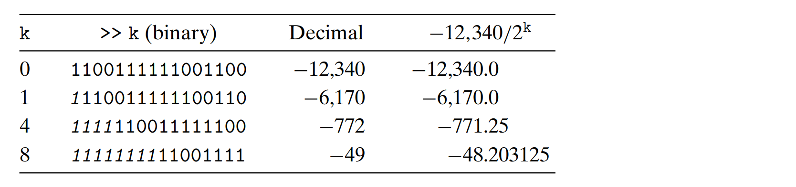

| 图 2.29 应用算术右移。这些示例说明算术右移类似于除以 2 的幂，但其舍入方式为向下舍入（floor），而非向零舍入。|
| :-------------------------------: |

在补码算术中，除以 $2$ 的幂稍微复杂一些。首先，移位必须采用**算术右移**，以确保负数在移位后仍保持为负。下面我们分析这种右移究竟会产生什么样的数值。

---

**原理：补码除以 2 的幂，向下舍入**

设 C 变量 `x` 和 `k` 分别具有补码值 $x$ 和无符号值 $k$，其中 $0 \leq k < w$。当采用算术移位时，C 表达式 $x \gg k$ 产生的值为 $ \left\lfloor \frac{x}{2^k} \right\rfloor $.

---

当 $x \geq 0$ 时，变量 `x` 的最高有效位为 0，因此算术右移与逻辑右移效果相同。对于非负数而言，算术右移 $k$ 位等价于除以 $2^k$。

作为负数示例，图 2.29 展示了对 $-12{,}340$ 的 16 位补码表示进行不同位数算术右移的结果。当无需舍入时（如 $k = 1$），结果恰为 $x / 2^k$。但在需要舍入的情况下，算术右移会产生向下舍入的效果。例如，右移 4 位相当于将 $-771.25$ 向下舍入为 $-772$。因此，在处理负数除法时，需要特别注意这种向下舍入的性质。

---

**推导：补码除以 2 的幂，向下舍入**

设 $x$ 为由位模式 $[x_{w-1}, x_{w-2}, \ldots, x_0]$ 表示的补码整数，$k$ 满足 $0 \leq k < w$。

定义：

* $x'$ 为由高 $w-k$ 位 $[x_{w-1}, x_{w-2}, \ldots, x_k]$ 表示的补码整数；
* $x''$ 为由低 $k$ 位 $[x_{k-1}, \ldots, x_0]$ 表示的无符号整数。

类似于无符号数的分析，可得：

$$
x = 2^k x' + x''
$$

且

$$
0 \leq x'' < 2^k
$$

因此有：

$$
x' = \left\lfloor \frac{x}{2^k} \right\rfloor
$$

另一方面，将位向量 $[x_{w-1}, x_{w-2}, \ldots, x_0]$ 算术右移 $k$ 位，会得到位向量：

$$
[x_{w-1}, \ldots, x_{w-1}, x_{w-2}, \ldots, x_k]
$$

其中高位由符号位 $x_{w-1}$ 进行扩展。这正是对 $[x_{w-1}, x_{w-2}, \ldots, x_k]$ 进行符号扩展后的结果。

因此，算术右移 $k$ 位所得位向量，恰为

$$
\left\lfloor \frac{x}{2^k} \right\rfloor
$$

的补码表示。

---

<!-- Page 0135 -->

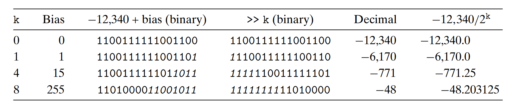

| 图 2.30 除以 2 的幂的补码数。通过在右移之前添加偏置，结果向零舍入。 |
| :------------------------------------: |

我们可以在移位之前为数值添加“偏置”（bias），从而纠正负数在算术右移时产生的不正确舍入结果。

---

**原理：补码除以 2 的幂，向上舍入**

设 C 变量 `x` 和 `k` 分别表示补码整数 $x$ 与无符号整数 $k$，满足 $0 \le k < w$。当采用算术右移时，C 表达式

$$
(x + (1 << k) - 1) >> k
$$

产生的结果为

$$
\left\lceil \frac{x}{2^k} \right\rceil
$$

---

图 2.30 展示了在执行算术右移之前添加适当偏置如何实现正确舍入。在第三列中，我们给出了对 $-12{,}340$ 加上偏置后的结果，其中最低的 $k$ 位（即将被右移移出的位）以斜体表示。可以看到，这些位左侧的高位可能递增，也可能保持不变。

* 当不需要舍入时（例如 $k = 1$），添加偏置仅影响将被移出的低位；
* 当需要舍入时，添加偏置会导致高位产生进位，从而使结果向零方向舍入。

该偏置技巧利用了如下恒等式：对于整数 $x$ 和正整数 $y$（$y > 0$），有

$$
\left\lceil \frac{x}{y} \right\rceil = \left\lfloor \frac{x + y - 1}{y} \right\rfloor
$$

例如：

* 当 $x = -30$、$y = 4$ 时，$x + y - 1 = -27$，并且
  $$
  \left\lceil \frac{-30}{4} \right\rceil = -7 = \left\lfloor \frac{-27}{4} \right\rfloor
  $$

* 当 $x = -32$、$y = 4$ 时，$x + y - 1 = -29$，并且
  $$
  \left\lceil \frac{-32}{4} \right\rceil = -8 = \left\lfloor \frac{-29}{4} \right\rfloor
  $$

---

**推导：补码除以 2 的幂，向上舍入**

为证明

$$
\left\lceil \frac{x}{y} \right\rceil = \left\lfloor \frac{x + y - 1}{y} \right\rfloor
$$

设

$$
x = qy + r
$$

其中 $0 \le r < y$。则

$$
\frac{x + y - 1}{y} = q + \frac{r + y - 1}{y}
$$

因此

$$
\left\lfloor \frac{x + y - 1}{y} \right\rfloor = q + \left\lfloor \frac{r + y - 1}{y} \right\rfloor
$$

注意：

* 当 $r = 0$ 时，$\left\lfloor \frac{r + y - 1}{y} \right\rfloor = 0$；
* 当 $r > 0$ 时，$\left\lfloor \frac{r + y - 1}{y} \right\rfloor = 1$。

也就是说，对 $x$ 加上偏置 $y - 1$ 后再向下取整：

* 若 $y$ 整除 $x$，结果为 $q$；
* 否则结果为 $q + 1$。

回到 $y = 2^k$ 的情形，C 表达式

$$
x + (1 \ll k) - 1
$$

得到的值为

$$
x + 2^k - 1
$$

对其进行算术右移 $k$ 位，便得到

$$
\left\lceil \frac{x}{2^k} \right\rceil
$$

综上，对于采用算术右移的补码机器，C 表达式

$$
(x < 0 \quad ? \quad  x + (1 << k) - 1 \quad : \quad x) >> k
$$

即可计算表达式

$$
\frac{x}{2^k}
$$

并实现向零舍入。

---

<!-- Page 0136 -->

**练习题 2.42（第 192 页的解答）**

编写一个函数 `div16`，对于整数参数 `x` 返回值 `x/16`。函数中不得使用除法、取模、乘法、任何条件语句（`if` 或 `?:`）、任何比较运算符（如 `<`、`>`、`==`），也不得使用循环。可以假设数据类型 `int` 为 32 位、采用补码表示，并且执行算术右移。

---

我们已经看到，除以 $2$ 的幂可以通过逻辑右移或算术右移来实现。这也是大多数机器提供两种右移方式的原因。然而，这种方法无法推广到对任意常数 $K$ 的除法。与乘法不同，我们不能通过若干次对 $2$ 的幂的除法来表示对任意常数 $K$ 的除法。

---

**练习题 2.43（第 193 页的解答）**

在下面的代码中，我们省略了常量 `M` 和 `N` 的定义：

```c
#define M       /* 神秘数字 1 */
#define N       /* 神秘数字 2 */
int arith(int x, int y) {
    int result = 0;
    result = x * M + y / N;       /* M 和 N 是神秘数字 */
    return result;
}
```

我们为特定的 `M` 和 `N` 值编译了该代码。编译器使用前面讨论的方法对乘法和除法进行了优化。下面是将生成的机器代码翻译回 C 后的结果：

```c
/* arith 的汇编代码翻译 */
int optarith(int x, int y) {
    int t = x;
    x <<= 5;
    x -= t;
    if (y < 0) y += 7;
    y >>= 3; /* 算术移位 */
    return x + y;
}
```

问：`M` 和 `N` 的值分别是多少？

---

### 2.3.8 关于整数运算的最后思考

正如我们所看到的，计算机执行的“整数”算术本质上是一种模运算。由于用于表示数字的字长是有限的，可表示数值的范围也受到限制，因此运算结果可能发生溢出。

我们还看到，补码表示为同时表示负数和正数提供了一种巧妙的方法，而且其位级实现与无符号算术高度一致——无论操作数是无符号表示还是补码表示，加法、减法、乘法乃至除法等操作在位级层面都具有相同或非常相似的行为。

---

<!-- Page 0137 -->

我们已经看到，C 语言中的某些约定可能会产生令人意外的结果，这些结果往往成为难以识别或理解的错误根源。尤其是无符号数据类型，虽然概念上看似简单，却可能导致连经验丰富的程序员也未曾预料的行为。此外，这种数据类型还可能以意想不到的方式出现——例如在编写整数常量或调用库函数时。

---

**练习题 2.44（第 193 页的解答）**

假设数据类型 `int` 为 32 位，并采用补码表示有符号整数。对有符号值进行算术右移，对无符号值进行逻辑右移。变量声明与初始化如下：

```c
int x = foo();        /* 任意值 */
int y = bar();        /* 任意值 */

unsigned ux = x;
unsigned uy = y;
```

对于以下每个 C 表达式，要么：

1. 论证其对所有可能的 `x` 和 `y` 值恒为真（结果为 1）；
2. 要么给出使其为假（结果为 0）的 `x` 和 `y` 的具体取值。

A. $(x > 0) \mid\mid (x - 1 < 0)$

B. $(x \& 7) != 7 \mid\mid (x << 29 < 0)$

C. $(x * x) \ge 0$

D. $x < 0 \mid\mid -x \le 0$

E. $x > 0 \mid\mid -x \ge 0$

F. $x + y == uy + ux$

G. $x * \sim y + uy*ux == -x$

## 2.4 浮点数

浮点数用于表示形如

$$
V = x \times 2^y
$$

的有理数。它在处理非常大的数（$|V| \gg 0$）、非常接近 0 的数（$|V| \ll 1$），以及更一般意义上作为实数运算的近似表示时，具有重要作用。

---

<!-- Page 0138 -->

> **补充说明：IEEE**
>
> Institute of Electrical and Electronics Engineers（IEEE，发音为“eye-triple-ee”）是一个涵盖电子与计算机技术领域的专业学会。它出版学术期刊、赞助各类会议，并设立委员会制定涵盖从电力传输到软件工程等广泛主题的技术标准。IEEE 标准的典型例子之一是用于无线网络的 802.11 标准。

直到 20 世纪 80 年代，各计算机制造商在浮点数表示方式及其运算细节方面均采用各自的设计规范。此外，他们通常并不过分强调运算的精确性，而是更看重运算速度与实现的简易性，往往将数值精度置于次要位置。

这一局面在 1985 年前后随着 IEEE 754 标准的发布而发生根本改变。该标准为浮点数的表示与运算制定了严谨而统一的规范。其相关工作始于 1976 年，当时在 Intel 的支持下设计 8087——一款为 8086 处理器提供浮点支持的协处理器芯片。Intel 邀请加州大学伯克利分校教授 William Kahan 担任顾问，协助为其未来处理器制定浮点标准。同时，Kahan 还与在 IEEE 主持下负责制定行业标准的委员会合作。最终，该委员会采纳了与 Kahan 为 Intel 设计方案高度接近的标准。如今，几乎所有计算机系统都支持 IEEE 浮点标准，这极大提升了科学计算程序在不同机器之间的可移植性。

在本节中，我们将介绍数字如何以 IEEE 浮点格式表示，并讨论当某个数值无法被精确表示时所涉及的舍入问题——即必须对结果进行向上或向下调整的过程。随后，我们将分析加法、乘法及关系运算符的数学性质。许多程序员认为浮点数要么乏味无趣，要么神秘难懂。然而，我们将看到，由于 IEEE 格式建立在一组简洁且一致的原则之上，其设计实际上相当优雅且易于理解。

### 2.4.1 分数二进制数

理解浮点数的第一步，是考察带有小数部分的二进制表示。我们先从更为熟悉的十进制记数法入手。十进制记数法通常采用如下形式表示：

$$
d_{m}d_{m-1}\cdots d_{1}d_{0}.d_{-1}d_{-2}\cdots d_{-n}
$$

---

<!-- Page 0139 -->

其中每个十进制数字 $d_i$ 的取值范围为 0 到 9。该记数法所表示的数 $d$ 定义为

$$
d=\sum_{i=-n}^{m}10^{i}\times d_{i}
$$

数字的权重是相对于小数点符号（`.`）定义的。这意味着，小数点左侧的数字由 10 的非负幂加权，表示整数部分；右侧的数字由 10 的负幂加权，表示小数部分。例如，$12.34_{10}$ 表示

$$
1 \times 10^{1} + 2 \times 10^{0} + 3 \times 10^{-1} + 4 \times 10^{-2}
= 12 \frac{34}{100}
$$

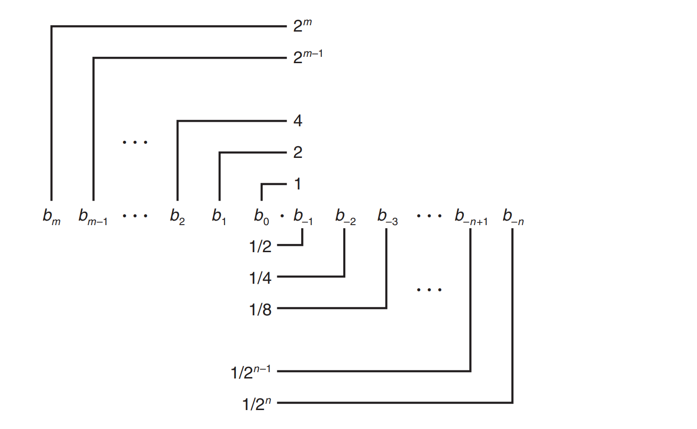

| 图 2.31 分数的二进制表示。二进制点左侧各位的权重为 $2^i$，右侧各位的权重为 $\frac{1}{2^i}$。 |
| :----------------------------------------------------------: |

类似地，考虑如下形式的二进制记数法：

$$
b_{m}b_{m-1}\cdots b_{1}b_{0}.b_{-1}b_{-2}\cdots b_{-n+1}b_{-n}
$$

其中每个二进制数字（位）$b_i$ 的取值范围为 0 或 1，如图 2.31 所示。该记数法所表示的数 $b$ 定义为

$$
b=\sum_{i=-n}^{m}2^{i}\times b_{i} \tag{2.19}
$$

此处的符号 `.` 为二进制点。其左侧各位由 2 的非负幂加权，右侧各位由 2 的负幂加权。例如，$101.11_2$ 表示

$$
1 \times 2^{2} + 0 \times 2^{1} + 1 \times 2^{0} + 1 \times 2^{-1} + 1 \times 2^{-2}
= 4 + 0 + 1 + \frac{1}{2} + \frac{1}{4}
= 5\frac{3}{4}
$$

由上式可以很容易看出，将二进制点向左移动一位，相当于将该数除以 2。例如，$101.11_2$ 表示 $5\frac{3}{4}$，而 $10.111_2$ 表示

$$
2 + 0 + \frac{1}{2} + \frac{1}{4} + \frac{1}{8}
= 2\frac{7}{8}
$$

类似地，将二进制点向右移动一位，相当于将该数乘以 2。例如，$1011.1_2$ 表示

$$
8 + 0 + 2 + 1 + \frac{1}{2}
= 11\frac{1}{2}
$$

---

<!-- Page 0140 -->

请注意，形式为 $0.11 \cdots 1_{2}$ 的数字表示刚好小于 $1$ 的数。例如，$0.111111_{2}$ 表示 $\frac{63}{64}$。我们将使用简写符号 $1.0 - \epsilon$ 来表示此类值。

假设我们只考虑有限长度的编码，十进制记数法无法精确表示诸如 $\frac{1}{3}$ 和 $\frac{5}{7}$ 的数字。类似地，分数二进制记数法只能表示可以写成 $x \times 2^{y}$ 的数字，其他值只能近似。例如，数字 $\frac{1}{5}$ 可以精确表示为分数十进制数 $0.20$。然而，作为分数二进制数，我们无法精确表示它，而是必须通过延长二进制表示来以越来越高的精度近似它：

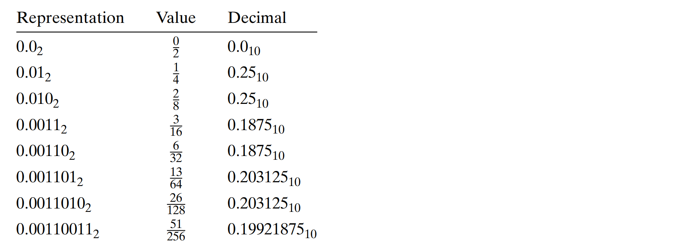

**练习题 2.45（第 193 页的解答）**

填写下表中缺失的信息：

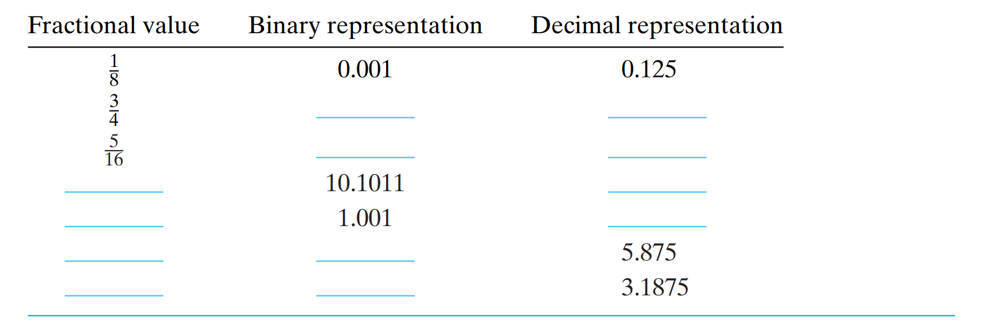

**练习题 2.46（第 194 页的解答）**

浮点算术的不精确性可能会产生灾难性后果。1991 年 2 月 25 日，在第一次海湾战争期间，沙特阿拉伯达兰的美国爱国者导弹电池未能拦截一枚来袭的伊拉克飞毛腿导弹。飞毛腿击中了美国陆军营房，造成 28 名士兵死亡。美国总审计局（GAO）对这次失败进行了详细分析 [76]，并确定其根本原因是数值计算中的不精确性。在本练习中，您将重现 GAO 分析的一部分。

---

<!-- Page 0141 -->

爱国者系统包含一个内部时钟，实现为每 0.1 秒递增一次的计数器。为了确定以秒为单位的时间，程序将该计数器的值乘以一个 24 位量，这是 $ \frac{1}{10} $ 的分数二进制近似值。特别地，$ \frac{1}{10} $ 的二进制表示是非终止序列 $0.000110011[0011]\cdots_2$，其中括号中的部分无限重复。程序将 0.1 近似为数值 $x$，仅考虑二进制小数点右侧序列的前 23 位：
$$
x = 0.00011001100110011001100
$$
（有关如何更精确地近似 0.1 的讨论，请参见习题 2.51。）

A. $0.1 - x$ 的二进制表示是什么？

B. $0.1 - x$ 的近似十进制值是多少？

C. 时钟在系统首次启动时从 0 开始，并持续计数。在这种情况下，系统已经运行了大约 100 小时。实际时间与软件计算时间之间的差异是多少？

D. 系统根据其速度以及最后一次雷达检测的时间来预测来袭导弹的位置。已知飞毛腿导弹以约 2,000 米/秒的速度飞行，其预测偏差有多大？

通常，时钟读数所报告的绝对时间中的微小误差不会影响跟踪计算；相反，计算应依赖于两次连续读数之间的相对时间。问题在于，爱国者软件虽已升级为使用更精确的时间读取函数，但并非所有函数调用都被新代码替换。结果，跟踪软件对一次读数使用准确时间，而对另一次读数使用不准确时间 [103]。

### 2.4.2 IEEE 浮点表示

如前一节所讨论的位置记数法在表示非常大的数值时效率较低。例如，$5 \times 2^{100}$ 的表示将由位模式 101 后跟 100 个零组成。相比之下，我们更希望以 $x \times 2^y$ 的形式表示数值，通过给出 $x$ 和 $y$ 的取值即可。

IEEE 浮点标准采用如下形式表示数值：
$$
V = (-1)^s \times M \times 2^E
$$

- 符号位 $s$ 用于确定数值的正负：当 $s = 1$ 时为负数，当 $s = 0$ 时为正数；数值 0 的符号位解释为特殊情况。

- 尾数 $M$ 是一个分数二进制数，其范围为 $[1, 2 - \epsilon)$ 或 $[0, 1 - \epsilon)$。

- 指数 $E$ 通过 2 的幂次（可能为负数）对数值进行加权。

---

<!-- Page 0142 -->

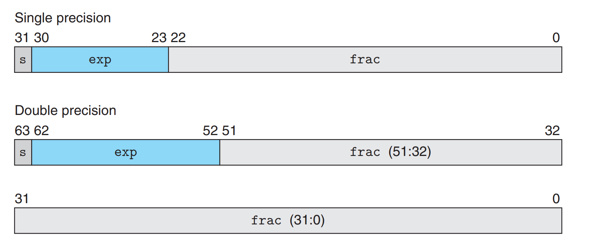

| 图 2.32 标准浮点格式。浮点数由三个字段表示。对于两种最常见的格式，这些字段被打包在 32 位（单精度）或 64 位（双精度）字中。 |
| :------------------------------------------------------------------: |

<div style="text-align: center;"></div>

浮点数的位表示被划分为三个字段来编码这些值：

* 单个符号位 $s$ 直接编码符号。

* $k$ 位指数字段 $\exp = e_{k-1}\cdots e_{1}e_{0}$ 编码指数 $E$。

* $n$ 位分数字段 $\text{frac} = f_{n-1}\cdots f_{1}f_{0}$ 编码尾数 $M$，但其编码值还取决于指数字段是否等于 0。

图 2.32 显示了这三个字段打包到两种最常见格式的字中。在单精度浮点格式（C 中的 float）中，字段 $s$、$\exp$ 和 $\text{frac}$ 分别为 1、$k=8$ 和 $n=23$ 位，产生 32 位表示。在双精度浮点格式（C 中的 double）中，字段 $s$、$\exp$ 和 $\text{frac}$ 分别为 1、$k=11$ 和 $n=52$ 位，产生 64 位表示。

给定位表示编码的值可以分为三种不同的情况（后者有两个变体），具体取决于 $\exp$ 的值。这些在图 2.33 中为单精度格式进行了说明。

**情况 1：标准化值**

这是最常见的情况。当 $\exp$ 的位模式既不是全零（数值 0）也不是全一（单精度为数值 255，双精度为 2047）时发生。在这种情况下，指数字段被解释为表示偏置形式的有符号整数。也就是说，指数值为 $E = e - \text{Bias}$，其中 $e$ 是具有位表示 $e_{k-1}\cdots e_{1}e_{0}$ 的无符号数，Bias 等于 $2^{k-1}-1$（单精度为 127，双精度为 1023）。这产生单精度的指数范围 $-126$ 到 $+127$，双精度的指数范围 $-1022$ 到 $+1023$。

分数字段 $\text{frac}$ 被解释为表示分数值 $f$，其中 $0\leq f<1$，具有二进制表示 $0.f_{n-1}\ldots f_{1}f_{0}$，即在最高有效位左侧的二进制点。尾数定义为 $M = 1+f$。这有时称为隐含前导 1 表示，因为我们可以将 $M$ 视为具有二进制表示 $1.f_{n-1}f_{n-2}\cdots f_{0}$ 的数字。这种表示是一种“免费”获得额外精度位的技巧，因为我们总是可以调整指数 $E$，使尾数 $M$ 位于范围 $1 \le M < 2$ 内（假设没有溢出）。因此，不需要显式表示前导位，因为它始终等于 1。

---

<!-- Page 0143 -->

> 补充说明：为什么为非标准化值这样设置偏置？
> 将指数值设为 $1-\text{Bias}$ 而不是简单的 $-\text{Bias}$ 可能看起来违反直觉。我们很快就会看到，它为从非标准化到标准化值提供了平滑过渡。

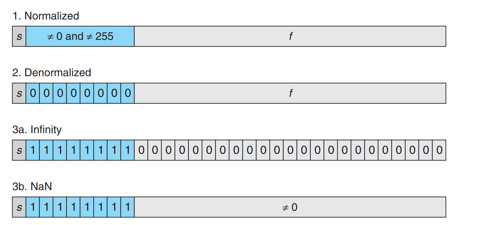

| 图 2.33 单精度浮点值的类别。指数的值决定数字是（1）标准化、（2）非标准化还是（3）特殊值。 |
| :-----------------------------------------------: |

**情况 2：非标准化值**

当指数字段全为零时，表示的数字处于非标准化形式。在这种情况下，指数值为 $E = 1-\text{Bias}$，尾数值为 $M = f$，即分数字段的值，不包含隐含的前导 1。

非标准化数字有两个目的。首先，它们提供了一种表示数值 0 的方法，因为对于标准化数字，我们必须始终有 $M \ge 1$，因此无法表示 0。实际上，+0.0 的浮点表示具有全零位模式：符号位为 0，指数字段全为零（表示非标准化值），分数字段全为零，从而得到 $M=f=0$。有趣的是，当符号位为 1 而其他字段全为零时，我们得到值 -0.0。使用 IEEE 浮点格式，值 -0.0 和 +0.0 在某些方面被认为不同，而在其他方面则被认为相同。

---

<!-- Page 0144 -->

非标准化数字的第二个功能是表示非常接近 0.0 的数值。它们提供了一种称为渐进下溢的性质，使得可表示数值在 0.0 附近呈均匀分布。

**情况 3：特殊值**

最后一类值在指数字段全为 1 时出现。当分数字段全为 0 时，结果值表示无穷大：当 $s = 0$ 时为 $+\infty$，当 $s = 1$ 时为 $-\infty$。无穷大可用于表示溢出结果，例如将两个非常大的数相乘或进行除以 0 的运算。当分数字段非 0 时，结果值称为 NaN（Not a Number）。当运算结果无法表示为实数或无穷大时返回该值，例如计算 $\sqrt{-1}$ 或 $\infty$、$- \infty$。在某些应用中，NaN 也用于表示未初始化的数据。

### 2.4.3 示例数字

图 2.34 展示了假设的 6 位浮点格式可表示的一组数值，其中包含 $k = 3$ 个指数位和 $n = 2$ 个分数位。偏置为 $2^{3-1} - 1 = 3$。图 (a) 显示了除 NaN 以外的全部可表示数值，两个无穷大位于两端。幅度最大的标准化数为 $\pm 14$。非标准化数聚集在 0 附近，这一点在图 (b) 中更加明显，其中仅显示了 -1.0 与 +1.0 之间的数值。两个 0 是非标准化数的特殊情况。可以观察到，可表示数值并非均匀分布，而是在原点附近更为密集。

图 2.35 展示了假设的 8 位浮点格式示例，其中包含 $k = 4$ 个指数位和 $n = 3$ 个分数位，偏置为 $2^{4-1} - 1 = 7$。该图分为三个区域，对应三类数值。不同列显示指数字段如何编码指数 $E$，分数字段如何编码尾数 $M$，两者共同形成表示的数值
$$
V = 2^{E} \times M
$$

最接近 0 的数为非标准化数，从 0 本身开始。该格式中的非标准化数具有 $E = 1 - 7 = -6$，因此权重为 $2^{E} = \frac{1}{64}$。分数 $f$ 与尾数 $M$ 的取值范围为 $0, \frac{1}{8}, \ldots, \frac{7}{8}$，从而得到 $V$ 的范围为
$$
0 \le V \le \frac{1}{64} \times \frac{7}{8} = \frac{7}{512}.
$$

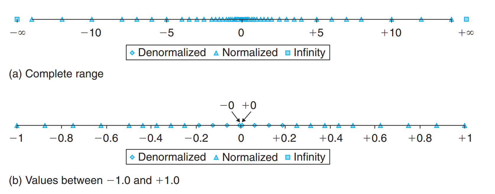

| 图 2.34 6 位浮点格式的可表示值。有 k = 3 个指数位和 n = 2 个分数位。偏置是 3。 |
| :-------------------------------------------------: |

---

<!-- Page 0145 -->

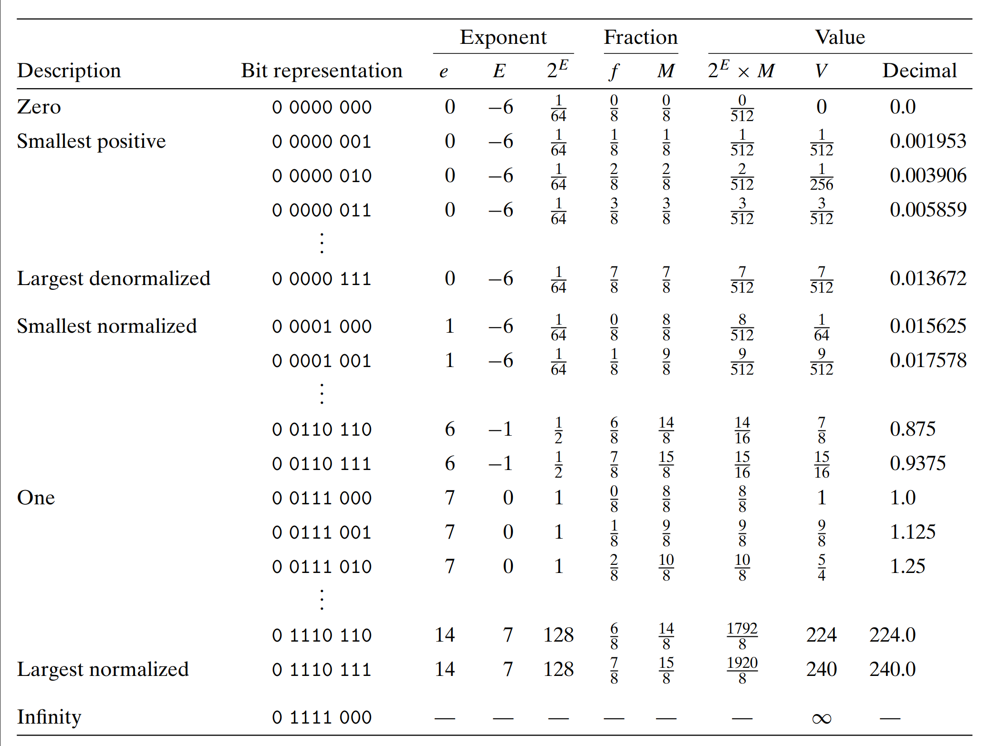

| 图 2.35 8 位浮点格式的非负值示例。有 k = 4 个指数位和 n = 3 个分数位。偏置是 7。 |
| :--------------------------------------------------: |

该格式中最小的标准化数同样具有 $E = 1 - 7 = -6$，分数范围仍为 $0, \frac{1}{8}, \ldots, \frac{7}{8}$。但此时尾数范围为
$$
1 + 0 = 1 \quad \text{到} \quad 1 + \frac{7}{8} = \frac{15}{8},
$$
因此对应的 $V$ 范围为
$$
\frac{8}{512} = \frac{1}{64} \quad \text{到} \quad \frac{15}{512}.
$$

可以观察到，最大的非标准化数 $\frac{7}{512}$ 与最小的标准化数 $\frac{8}{512}$ 之间实现了平滑过渡。这种平滑性来源于对非标准化数指数 $E$ 的定义：通过使用 $1-\text{Bias}$ 而非 $-\text{Bias}$，补偿了非标准化数尾数中不存在隐含前导 1 的事实。

---

<!-- Page 0146 -->

当我们增加指数时，我们得到连续更大的标准化值，经过 1.0，然后到最大的标准化数值。该数值具有指数 E = 7，给出权重 $ 2^{E} = 128 $。分数等于 $ \frac{7}{8} $，给出尾数 $ M = \frac{15}{8} $。因此，数值是 V = 240。超过此值溢出到 +∞。

此表示的一个有趣性质是，如果我们将图 2.35 中值的位表示解释为无符号整数，它们按升序出现，就像它们作为浮点数表示的值一样。这不是偶然的——IEEE 格式被设计为可以使用整数排序例程对浮点数进行排序。处理负数时会出现一个小困难，因为它们具有前导 1 并以降序出现，但这可以在不需要浮点运算来执行比较的情况下克服（参见习题 2.84）。

---

**练习题 2.47（第 194 页的解答）**

考虑基于 IEEE 浮点格式的 5 位浮点表示，具有一个符号位、两个指数位（$ k=2 $）和两个分数位（$ n=2 $）。指数偏置是 $ 2^{2-1}-1=1 $。

下表枚举了此 5 位浮点表示的整个非负范围。使用以下指示填写空白表格条目：

$e$：将指数字段视为无符号整数所表示的值

$E$：偏置后的指数值

$ 2^{E} $：指数的数值权重

$f$：分数的值

$M$：尾数的值

$ 2^{E} \times M $：数字的（未简化）分数值

$V$：数字的简化分数值

Decimal：数字的十进制表示

将 $ 2^{E} $、$f$、$M$、$ 2^{E} \times M $ 和 $V$ 的值表示为整数（如果可能）或形式为 $ \frac{x}{y} $ 的分数，其中 $y$ 是 2 的幂。您无需填写标记为 — 的条目。

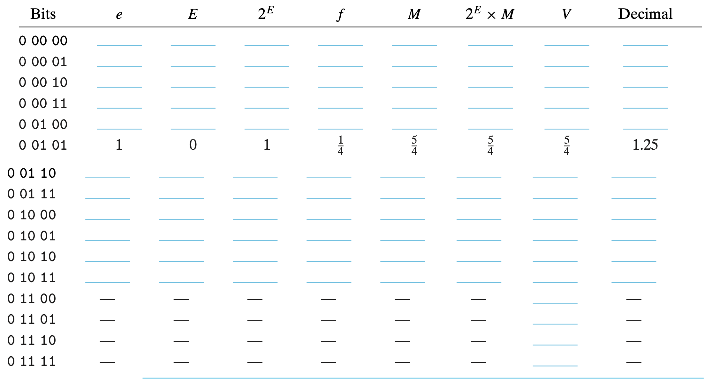

---

<!-- Page 0147 -->

图 2.36 显示了一些重要的单精度和双精度浮点数的表示和数值。与图 2.35 中展示的 8 位格式类似，我们可以总结具有 $k$ 位指数和 $n$ 位分数的浮点表示的一般属性：

* 值 +0.0 始终具有全零的位表示。

* 最小的正非标准化值具有如下位表示：最低有效位为 1，其余位均为 0。其分数（尾数）值为 $M = f = 2^{-n}$，指数值为 $E = -2^{k-1} + 2$。因此，其数值为 $V = 2^{-n-2^{k-1}+2}$。

* 最大的非标准化值具有位表示：指数字段全为 0，分数字段全为 1。其分数（尾数）值为 $M = f = 1 - 2^{-n}$（亦可写作 $1 - \epsilon$），指数值为 $E = -2^{k-1} + 2$。因此，其数值为
  $$
  V = (1 - 2^{-n}) \times 2^{-2^{k-1} + 2}
  $$
  略小于最小的标准化值。

* 最小的正标准化值具有位表示：指数字段最低有效位为 1，其余位均为 0。

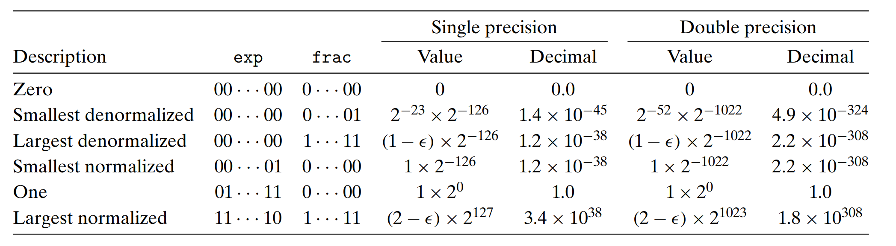

| 图 2.36 非负浮点数的示例。 |
| :--------------: |

---

<!-- Page 0148 -->

其尾数值为 $M = 1$，指数值为 $E = -2^{k-1} + 2$。因此，其数值为
$$
V = 2^{-2^{k-1} + 2}
$$

* 值 1.0 的位表示中，指数字段除最高有效位外均为 1，其余位均为 0。其尾数值为 $M = 1$，指数值为 $E = 0$。

* 最大的标准化值具有如下位表示：符号位为 0，指数最低有效位为 0，其余位均为 1。其分数值为 $f = 1 - 2^{-n}$，因此尾数为 $M = 2 - 2^{-n}$（亦可写作 $2 - \epsilon$）。指数值为 $E = 2^{k-1} - 1$，从而得到数值
  $$
  V = (2 - 2^{-n}) \times 2^{2^{k-1}-1}
  = (1 - 2^{-n-1}) \times 2^{2^{k-1}}
  $$

一个理解浮点表示的有效练习是将示例整数转换为浮点形式。例如，图 2.15 中整数 12,345 的二进制表示为 [11000000111001]。通过将二进制点向左移动 13 位，可得到其标准化表示：
$$
12345 = 1.1000000111001_2 \times 2^{13}
$$

为以 IEEE 单精度格式编码该数，我们删除前导 1，并在末尾补 10 个 0 构造分数字段，得到二进制表示 [10000001110010000000000]。构造指数字段时，将偏置 127 与 13 相加得到 140，其二进制表示为 [10001100]。再与符号位 0 组合，可得到浮点数的二进制表示 [0100011001000000111001000000000]。

回顾第 2.1.3 节，我们曾观察到整数值 12345（0x3039）与单精度浮点值 12345.0（0x4640E400）在位级表示上的如下对应关系：

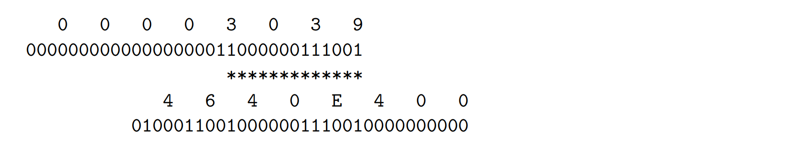

可以看到，该相关区域对应于整数的低位部分，并在最高有效位为 1 之前结束（该位形成隐含的前导 1），这些位与浮点表示分数部分的高位相匹配。

---

**练习题 2.48（第 195 页的解答）**

如练习题 2.6 所述，整数 3,510,593 的十六进制表示为 0x00359141，而单精度浮点数 3,510,593.0 的十六进制表示为 0x4A564504。请推导该浮点表示，并解释整数表示与浮点表示之间的位级对应关系。

---

<!-- Page 0149 -->

**练习题 2.49（第 195 页的解答）**

A. 对于具有 n 位分数的浮点格式，给出无法精确表示的最小正整数的公式（因为需要 $(n+1)$ 位分数才能精确）。假设指数字段大小 $k$ 足够大，使得可表示指数的范围不会对该问题形成限制。

B. 此整数在单精度格式（$n = 23$）下的数值是多少？

---

### 2.4.4 舍入

浮点算术只能近似实数算术，因为其表示具有有限的范围和精度。因此，对于任意数值 $x$，通常需要一种系统方法来找到能够在目标浮点格式中表示的“最接近”值 $x'$。这一过程称为**舍入**。一个关键问题是如何处理恰好位于两个可选值中间的情况。例如，若数值为 1.50 并希望将其舍入到最接近的整数美元，则结果应为 1 还是 2？另一种思路是维护实际数值的上下界，即确定可表示值 $x^{-}$ 和 $x^{+}$，使得

$$
x^{-} \le x \le x^{+}
$$

IEEE 浮点格式定义了四种不同的舍入模式。默认模式是寻找最接近的可表示值，而另外三种模式则可用于计算数值的上下界。

图 2.37 展示了将货币金额舍入到最近整数美元时的四种舍入模式示例。**向偶舍入**（亦称为向最近舍入）是默认模式，其目标是获得最接近的匹配值。例如，1.40 被舍入为 1，1.60 被舍入为 2，因为这些是距离最近的整数值。唯一需要决策的是当数值恰好位于两个候选结果中间时的处理方式。向偶舍入采用如下规则：将数值向上或向下舍入，使得结果的最低有效数字为偶数。因此，1.50 与 2.50 均被舍入为 2。

其余三种模式用于给出结果的确定界限，在某些数值计算应用中尤为重要。**向零舍入**模式对正数向下舍入、对负数向上舍入，得到 $\hat{x}$，满足

$$
|\hat{x}| \le |x|
$$

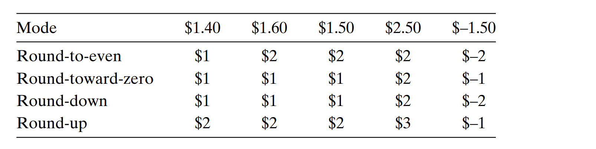
| 图 2.37 美元舍入的舍入模式示例。第一种舍入到最近值，而其他三种限定结果 |
| :-------------------------------: |

---

<!-- Page 0150 -->

**向下舍入**模式对正数和负数均向下舍入，得到 $x^{-}$，满足 $x^{-} \le x$。**向上舍入**模式对正数和负数均向上舍入，得到 $x^{+}$，满足 $x \le x^{+}$。

向偶舍入初看似乎带有一定的任意性——为何要偏好偶数？为何不始终将中间值向上舍入？问题在于，这样的策略会在统计意义上引入偏差。例如，将一组数据统一按中间值向上舍入，则其平均值会略高于真实平均值；若统一向下舍入，则平均值会略低。向偶舍入通过在约一半情况下向上舍入、另一半情况下向下舍入，有效避免了这种统计偏差。

即使不舍入到整数，向偶舍入同样适用。只需判断目标精度位置上的最低有效数字是偶数还是奇数。例如，将十进制数舍入到百分位时，1.2349999 舍入为 1.23，1.2350001 舍入为 1.24，因为它们并不处于 1.23 与 1.24 的中点；而 1.2350000 与 1.2450000 则均舍入为 1.24，因为 4 为偶数。

类似地，向偶舍入也可应用于二进制分数。在二进制中，最低有效位为 0 视为偶数，1 视为奇数。通常，仅当位模式呈现为

$$
XX\cdots X.YY\cdots Y100\cdots
$$

时，舍入模式才会影响结果，其中 X 与 Y 表示任意位值，最右侧的 Y 为目标舍入位置。该形式表示数值恰好位于两个可能结果的中间。

例如，考虑将数值舍入到最近的四分之一（即二进制小数点后保留 2 位）。  
我们将 $10.00011_2\left(2\frac{3}{32}\right)$ 向下舍入为 $10.00_2$（2），将 $10.00110_2\left(2\frac{3}{16}\right)$ 向上舍入为 $10.01_2\left(2\frac{1}{4}\right)$，因为它们并不位于中间。  
而 $10.11100_2\left(2\frac{7}{8}\right)$ 被向上舍入为 $11.00_2$（3），$10.10100_2\left(2\frac{5}{8}\right)$ 被向下舍入为 $10.10_2\left(2\frac{1}{2}\right)$，因为它们处于两个候选结果的中间，且向偶舍入倾向于使最低有效位为 0。

---

**练习题 2.50（第 195 页的解答）**

说明以下二进制分数在向偶舍入规则下如何舍入到最近的二分之一（即二进制小数点后保留 1 位），并在每种情况下给出舍入前后的数值。

A. $10.111_2$

B. $11.010_2$

C. $11.000_2$

D. $10.110_2$

---

<!-- Page 0151 -->

**练习题 2.51（第 195 页的解答）**

我们在练习题 2.46 中看到，爱国者导弹软件将 0.1 近似为
$x = 0.000110011001100110011001100_2$。
假设相反，他们使用 IEEE 向偶舍入模式来确定 0.1 的近似值 $x'$，且二进制点右侧有 23 位。

A. $x'$ 的二进制表示是什么？

B. $x' - 0.1$ 的近似十进制值是多少？

C. 经过 100 小时的运行后，计算的时钟会偏差多少？

D. 程序对飞毛腿导弹位置的预测会偏差多少？

---

**练习题 2.52（第 196 页的解答）**

考虑基于 IEEE 浮点格式的以下两种 7 位浮点表示。两者都没有符号位——只能表示非负数。

1. **格式 A**

   ■ 指数位数 $k = 3$，指数偏置为 3。

   ■ 分数位数 $n = 4$。

2. **格式 B**

   ■ 指数位数 $k = 4$，指数偏置为 7。

   ■ 分数位数 $n = 3$。

下面给出了格式 A 中的一些位模式。任务是将它们转换为格式 B 中最接近的值。如有必要，应用向偶舍入规则。同时给出格式 A 与格式 B 位模式对应的数值，并以整数（如 17）或分数（如 17/64）形式表示。

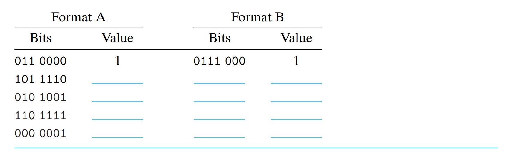

---

### 2.4.5 浮点运算

IEEE 标准为确定加法、乘法等算术运算的结果规定了一个简单规则。将浮点值 $x$ 和 $y$ 视为实数，并令某个运算 $\odot$ 定义在实数域上，则计算应产生

$$
Round(x \odot y)
$$

即对实数精确运算结果进行舍入后的值。

在实践中，浮点单元设计者通过巧妙技术避免执行完全精确的计算，因为只需达到能够保证正确舍入的精度即可。当某个操作数为特殊值（如 $-0$、$\infty$ 或 NaN）时，标准也规定了合理约定。例如：

* $1 / -0$ 定义为产生 $-\infty$
* $1 / +0$ 定义为产生 $+\infty$

---

<!-- Page 0152 -->

IEEE 标准描述浮点运算行为的方法的一个优点是，它独立于具体的硬件或软件实现。因此，我们可以研究其抽象数学性质，而无需关注具体实现方式。

此前我们已经看到，无符号整数加法与补码加法都构成阿贝尔群。实数加法同样构成阿贝尔群，但在浮点运算中必须考虑舍入带来的影响。令

$$
x +^f y = Round(x + y)
$$

该运算对所有 $x$ 和 $y$ 都有定义，但由于溢出，即使 $x$ 和 $y$ 为实数，也可能得到无穷大。

该运算满足交换律：

$$
x +^f y = y +^f x
$$

但不满足结合律。例如，在单精度浮点中：

* 表达式 $(3.14 + 1\mathrm{e}{10}) - 1\mathrm{e}{10}$ 计算结果为 0.0 —— 数值 3.14 因舍入而丢失
* 表达式 $3.14 + (1\mathrm{e}{10} - 1\mathrm{e}{10})$ 的结果为 3.14

与阿贝尔群类似，大多数值在浮点加法下存在逆元，即

$$
x +^f (-x) = 0
$$

例外情况包括：

* 无穷大（因为 $+\infty - \infty = \mathrm{NaN}$）
* NaN（因为对于任意 $x$，都有 $\mathrm{NaN} +^f x = \mathrm{NaN}$）

浮点加法缺乏结合性是其最重要的群性质缺失，对科学计算程序员与编译器开发者具有重要影响。例如，编译器可能遇到如下代码：

$$
\mathbf{x} = \mathbf{a} + \mathbf{b} + \mathbf{c};
$$

$$
\mathbf{y} = \mathbf{b} + \mathbf{c} + \mathbf{d};
$$

编译器可能尝试通过以下方式减少一次浮点加法：

$$
\mathbf{t} = \mathbf{b} + \mathbf{c};
$$

$$
\mathbf{x} = \mathbf{a} + \mathbf{t};
$$

$$
\mathbf{y} = \mathbf{t} + \mathbf{d};
$$

然而，该变换可能使 $x$ 的结果不同于原始程序，因为加法的结合顺序发生了改变。在大多数应用中，这种差异通常微不足道。但编译器无法预知用户在效率与严格语义一致性之间的取舍，因此通常采取保守策略，避免任何可能对程序功能产生影响的优化。

---

<!-- Page 0153 -->

另一方面，浮点加法满足以下单调性性质：如果 $a \geq b$，则对于 $a$、$b$ 和 $x$ 的任何值（NaN 除外），$x +^f a \geq x +^f b$。实数（和整数）加法的这一性质不被无符号或补码加法遵守。

浮点乘法也遵守人们通常与乘法相关联的许多性质。令 $x *^f y = Round(x \times y)$。该运算在乘法下是封闭的（尽管可能产生无穷大或 NaN），它是可交换的，并且以 $1.0$ 作为乘法单位元。另一方面，由于溢出或舍入导致的精度损失，它并不满足结合律。例如，在单精度浮点下，表达式 $(1e20 \times 1e20) \times 1e-20$ 计算为 $+\infty$，而 $1e20 \times (1e20 \times 1e-20)$ 计算为 $1e20$。此外，浮点乘法也不满足对加法的分配律。例如，在单精度浮点下，表达式 $1e20 \times (1e20 - 1e20)$ 计算为 $0.0$，而 $1e20 \times 1e20 - 1e20 \times 1e20$ 计算为 NaN。

另一方面，对于 $a$、$b$ 和 $c$ 的任何值（NaN 除外），浮点乘法满足如下单调性性质：

$$
a \geq b \quad \text{and} \quad c \geq 0 \Rightarrow a *^f c \geq b *^f c
$$

$$
a \geq b \quad \text{and} \quad c \leq 0 \Rightarrow a *^f c \leq b *^f c
$$

条件是需要 $a \neq \mathrm{NaN}$，且保证 $a *^f a \geq 0$。正如我们之前看到的，这些单调性性质均不适用于无符号或补码乘法。

这种缺乏结合性和分配性对科学程序员和编译器编写者而言是一个严重问题。即使是编写代码判断两条直线是否在三维空间中相交这样看似简单的任务，也可能成为一项具有挑战性的工作。

### 2.4.6 C 中的浮点数

所有版本的 C 都提供两种不同的浮点数据类型：float 和 double。在支持 IEEE 浮点的机器上，这些数据类型分别对应单精度和双精度浮点表示，并采用向偶舍入模式。不幸的是，由于 C 标准并不强制要求机器使用 IEEE 浮点，因此不存在统一的标准方法来更改舍入模式或获取诸如 $-0$、$+\infty$、$-\infty$ 或 NaN 等特殊值。大多数系统通过头文件与过程库的组合提供对这些功能的访问，但具体细节因系统而异。例如，当程序文件中出现如下序列时，GNU 编译器 gcc 会定义程序常量 INFINITY（表示 $+\infty$）和 NAN（表示 NaN）：

```c
#define _GNU_SOURCE 1

#include <math.h>
```

---

<!-- Page 0154 -->

**练习题 2.53（第 196 页的解答）**

填写以下宏定义以生成双精度值 $+\infty$、$-\infty$ 和 $-0$：

```c
#define POS_INFINITY

#define NEG_INFINITY

#define NEG_ZERO
```

不能使用任何包含文件（如 `math.h`），但可以利用如下事实：可用双精度表示的最大有限数约为 $1.8 \times 10^{308}$。

当在 int、float 和 double 格式之间转换值时，程序会同时改变数值及其位表示（假设 int 为 32 位）：

* 从 int 到 float：数值不会溢出，但可能发生舍入。
* 从 int 或 float 到 double：可保持精确数值，因为 double 具有更大的范围（即可表示值的范围）和更高的精度（即有效位数量）。
* 从 double 到 float：由于范围更小，数值可能溢出为 $+\infty$ 或 $-\infty$；否则可能因精度较低而被舍入。
* 从 float 或 double 到 int：数值将向零舍入。例如，$1.999$ 转换为 $1$，而 $-1.999$ 转换为 $-1$。此外还可能发生溢出，且 C 标准未对此指定固定结果。Intel 兼容微处理器将位模式 $[10 \cdots 00]$（字长为 $w$ 的 $TMin_w$）作为整数不定值。从浮点到整数的任何无法给出合理整数近似的转换都会产生该值。因此，表达式 $(int)+1e10$ 可能产生 $-21483648$，即由正值生成负值。

---

**练习题 2.54（第 196 页的解答）**

假设变量 $x$、$f$ 和 $d$ 分别为 int、float 和 double 类型。它们的取值任意，但 $f$ 和 $d$ 均不等于 $+\infty$、$-\infty$ 或 NaN。对于以下每个 C 表达式，要么论证其恒为真（即计算结果为 1），要么给出使其为假（即计算结果为 0）的变量取值。

A. $x = (int)(double) x$

B. $x = (int)(float) x$

C. $d = (double)(float) d$

D. $f = (float)(double) f$

E. $f = -(-f)$

F. $1.0/2 = 1/2.0$

G. $d \times d \geq 0.0$

H. $(f+d)-f = d$

---

<!-- Page 0155 -->

## 2.5 总结

计算机将信息编码为位，通常组织为字节序列。不同的编码用于表示整数、实数和字符串，而不同型号的计算机在编码数字以及多字节数据中字节排序方面也采用不同的约定。

C 语言被设计为能够在字长和数字编码方面适配广泛的实现环境。如今，64 位字长的机器日益普及，逐渐取代了在市场上占主导地位约 30 年的 32 位机器。由于 64 位机器仍可运行为 32 位机器编译的程序，因此我们更关注 32 位程序与 64 位程序之间的区别，而非机器本身。64 位程序的主要优势在于能够突破 32 位程序的 4 GB 地址空间限制。

大多数机器采用补码表示有符号整数，并使用 IEEE 754 标准表示浮点数。从位级角度理解这些编码方式，以及理解算术运算的数学特性，对于编写能够在整个数值范围内正确运行的程序至关重要。

在相同位宽的有符号整数与无符号整数之间进行转换时，大多数 C 实现遵循“底层位模式保持不变”的约定。在补码机器上，这一行为可由函数 $T2U_w$ 和 $U2T_w$（针对 $w$ 位值）来表征。C 的隐式类型转换往往会产生程序员未曾预料的结果，从而导致程序错误。

由于编码长度有限，计算机算术表现出与常规整数算术和实数算术截然不同的性质。有限长度可能导致数值溢出，即当结果超出表示范围时发生错误；浮点数也可能发生下溢，即当其值过于接近 0.0 时被舍入为零。

C 以及大多数编程语言所实现的有限精度整数算术，相比真实整数算术具有一些特殊性质。例如，由于溢出的存在，表达式 $x*x$ 可能计算为负数。尽管如此，无符号算术和补码算术仍满足许多整数算术性质，包括结合律、交换律和分配律，这使编译器能够进行多种优化。例如，将表达式 $(x<<3)-x$ 替换为 $7*x$ 的优化，就利用了这些代数性质以及移位与乘以 $2$ 的幂之间的关系。

我们还观察到多种结合位级运算与算术运算的巧妙方法。例如，在补码算术中，$\sim x+1$ 等价于 $-x$。再如，假设我们需要一个位形式为 $[0,\ldots,0,1,\ldots,1]$ 的位模式由 $w-k$ 个零后接 $k$ 个一组成。这类位模式在掩码操作中非常有用。该模式可以通过 C 表达式 $(1\ll k)-1$ 生成，其依据是所需位模式对应的数值为 $2^k-1$。例如，表达式 $(1\ll 8)-1$ 将生成位模式 0xFF。

---

<!-- Page 0156 -->

>**补充说明：Ariane 5：浮点溢出的高昂代价**
>
>将大型浮点数转换为整数是常见的编程错误来源之一。这类错误在 1996 年 6 月 4 日 Ariane 5 火箭的首次发射中造成了灾难性后果。起飞仅 37 秒后，火箭偏离飞行轨道，随后解体并爆炸，搭载的价值 5 亿美元的通信卫星随之损毁。
>
>后续调查 [73, 33] 表明，控制惯性导航系统的计算机向负责发动机喷嘴控制的计算机发送了无效数据。系统未发送飞行控制信息，而是发送了一段诊断位模式，该位模式指示在将 64 位浮点数转换为 16 位有符号整数时发生了溢出。
>
>发生溢出的数值用于表示火箭的水平速度，而该速度可能达到早期 Ariane 4 火箭的五倍以上。在 Ariane 4 软件设计中，工程师曾对数值范围进行严格分析，并确定水平速度不会溢出 16 位整数。不幸的是，在 Ariane 5 中，这部分软件被直接复用，而未重新验证其所依赖的假设。

浮点表示通过编码形如 $x\times 2^y$ 的数值来近似实数。IEEE 754 标准定义了多种精度格式，其中最常见的是单精度（32 位）和双精度（64 位）。IEEE 浮点表示还包含用于表示正无穷、负无穷以及 NaN（非数字）的特殊编码。

浮点算术在使用时必须格外谨慎，因为其范围和精度均有限，并且不满足某些常见的数学性质（如结合律）。

## 文献注释

关于 C 语言的参考书 [45, 61] 讨论了不同数据类型及运算的性质。在这两本书中，仅 Steele 和 Harbison [45] 涵盖了 ISO C99 中引入的新特性，而目前似乎尚无书籍系统覆盖 ISO C11 的新增内容。C 标准未规定诸如精确字长或数字编码等细节，这些内容被有意留给具体实现，以保证 C 能在广泛的体系结构上运行。多本面向 C 程序员的书籍 [59, 74] 提供了实践建议，提醒读者注意溢出、隐式无符号转换以及本章讨论的其他潜在陷阱，同时也给出了变量命名、编码风格和测试方面的建议。Seacord 关于 C 和 C++ 程序安全问题的著作 [97] 综合介绍了 C 程序的编译执行过程以及漏洞产生机制。关于 Java 的参考书（我们推荐由该语言创建者 James Gosling 合著的著作 $[5]$）则描述了 Java 所支持的数据格式与算术运算。

---

<!-- Page 0157 -->

大多数关于逻辑设计的书 [58, 116] 都有一节讨论编码和算术运算。这些书描述了实现算术电路的多种方法。Overton 关于 IEEE 浮点的著作 [82] 则从数值应用程序程序员的角度，对其格式及性质进行了详细说明。

## 家庭作业

**练习题 2.55 ◆**

在你能够访问的不同机器上编译并运行使用 `show_bytes` 的示例代码（文件 `show-bytes.c`），并确定这些机器采用的字节序。

---

**练习题 2.56 ◆**

尝试对不同的示例值运行 `show_bytes` 代码。

---

**练习题 2.57 ◆**

编写过程 `show_short`、`show_long` 和 `show_double`，分别打印 C 对象类型 `short`、`long` 和 `double` 的字节表示，并在多台机器上进行测试。

---

**练习题 2.58 ◆**

编写一个过程 `is_little_endian`，在小端机器上编译和运行时返回 1，在大端机器上编译和运行时返回 0。程序应能够在任意字长的机器上运行。

---

**练习题 2.59 ◆**

编写一个 C 表达式，生成一个字，该字由 `x` 的最低有效字节和 `y` 的其余字节组成。例如，当操作数 `x = 0x89ABCDEF` 且 `y = 0x76543210` 时，结果应为 `0x765432EF`。

---

**练习题 2.60 ◆**

假设将一个 $w$ 位字中的字节编号为 $0$（最低有效字节）到 $w/8 - 1$（最高有效字节）。为下列 C 函数编写代码，使其返回一个无符号值，其中参数 `x` 的第 `i` 个字节被字节 `b` 替换：

```c
unsigned replace_byte (unsigned x, int i, unsigned char b);
```

以下示例展示了函数的期望行为：

```
replace_byte(0x12345678, 2, 0xAB) --> 0x12AB5678
replace_byte(0x12345678, 0, 0xAB) --> 0x123456AB
```

## 位级整数编码规则

在接下来的问题中，我们将人为限制可使用的编程构造，以帮助你更深入理解 C 的位级、逻辑和算术运算。在回答这些问题时，必须遵循以下规则：

* **假设**

  * 整数以补码形式表示。
  * 有符号数据的右移按算术方式执行。
  * 数据类型 `int` 的长度为 $w$ 位。对于某些问题，将给出 $w$ 的具体值；在其他情况下，只要 $w$ 为 8 的倍数，你的代码都应有效。可以使用表达式 $\text{sizeof}(\text{int}) \ll 3$ 计算 $w$。

* **禁止**

  * 条件语句（`if` 或 `?:`）、循环、`switch` 语句、函数调用和宏调用。
  * 除法、取模运算和乘法。
  * 相对比较运算符（`<`、`>`、`<=` 和 `>=`）。

* **允许的操作**

  * 所有位级和逻辑操作。
  * 左移和右移，但移位量必须位于 $0$ 和 $w-1$ 之间。
  * 加法和减法。
  * 相等（`==`）和不等（`!=`）测试（部分问题可能不允许）。
  * 整数常量 `INT_MIN` 和 `INT_MAX`。
  * 在数据类型 `int` 与 `unsigned` 之间进行显式或隐式类型转换。

即便存在上述限制，你仍应通过选择具有描述性的变量名并使用注释说明实现逻辑，从而保证代码的可读性。以下示例代码展示了如何从整数参数 `x` 中提取最高有效字节：

```c
/* Get most significant byte from x */
int get_msb(int x) {
    /* Shift by w-8 */
    int shift_val = (sizeof(int)-1)<<3;
    /* Arithmetic shift */
    int xright = x >> shift_val;
    /* Zero all but LSB */
    return xright & 0xFF;
}
```

---

**练习题 2.61 ◆**

编写 C 表达式，使其在以下条件为真时求值为 1，为假时求值为 0。假设 `x` 为 `int` 类型。

A. `x` 的任意位等于 1。

B. `x` 的任意位等于 0。

C. `x` 的最低有效字节中是否存在任意一位等于 1。

D. `x` 的最高有效字节中是否存在任意一位等于 0。

你的代码应遵循位级整数编码规则（第 164 页），并满足附加限制：不得使用相等（==）或不等（!=）测试。

---

<!-- Page 0159 -->

**练习题 2.62 ◆◆◆**

编写函数 `int_shifts_are_arithmetic()`：当在对数据类型 `int` 采用算术右移的机器上运行时返回 1，否则返回 0。你的代码应能在任意字长的机器上正确运行，并在多台机器上进行测试。

---

**练习题 2.63 ◆◆◆**

为下列 C 函数补全代码。函数 `srl` 使用算术右移（结果为 `xsra`）来实现逻辑右移，随后通过不包含右移或除法的操作完成修正。函数 `sra` 使用逻辑右移（结果为 `xsrl`）来实现算术右移，随后同样通过不包含右移或除法的操作完成修正。

你可以使用 `8*sizeof(int)` 来确定 $w$（即 `int` 类型的位宽）。移位量 $k$ 的范围为 $0$ 到 $w-1$。

```c
unsigned srl(unsigned x, int k) {
    /* Perform shift arithmetically */
    unsigned xsra = (int) x >> k;
.
.
.
    int sra(int x, int k) {
        /* Perform shift logically */
        int xsrl = (unsigned) x >> k;
.
.
.
    }
}
```

---

**练习题 2.64 ◆**

编写代码实现下列函数：

```c
/* Return 1 when any odd bit of x equals 1; 0 otherwise.
   Assume w=32 */
int any_odd_one(unsigned x);
```

你的函数应遵循位级整数编码规则（第 164 页），但可以假设 `int` 类型位宽为 $w=32$。

---

<!-- Page 0160 -->

**练习题 2.65 ◆◆◆**

编写代码实现下列函数：

```c
/* Return 1 when x contains an odd number of 1s; 0 otherwise.
   Assume w=32 */
int odd_ones(unsigned x);
```

你的函数应遵循位级整数编码规则（第 164 页），并可假设 `int` 类型位宽为 $w=32$。

要求：代码中算术、位运算与逻辑运算的总数不超过 12 个。

---

**练习题 2.66 ◆◆◆**

编写代码实现下列函数：

```c
/*
 * Generate mask indicating leftmost 1 in x. Assume w=32.
 * For example, 0xFF00 -> 0x8000, and 0x6600 --> 0x4000.
 * If x = 0, then return 0.
 */
int leftmost_one(unsigned x);
```

你的函数应遵循位级整数编码规则（第 164 页），并可假设 `int` 类型位宽为 $w=32$。

要求：代码中算术、位运算与逻辑运算的总数不超过 15 个。

提示：首先将 $x$ 转换为形如 $[0\cdots011\cdots1]$ 的位向量。

---

**练习题 2.67 ◆**

你的任务是编写过程 `int_size_is_32()`：当在 `int` 为 32 位的机器上运行时返回 1，否则返回 0。不得使用 `sizeof` 运算符。以下是首次尝试：

```c
/* The following code does not run properly on some machines */
int bad_int_size_is_32() {
    /* Set most significant bit (msb) of 32-bit machine */
    int set_msb = 1 << 31;
    /* Shift past msb of 32-bit word */
    int beyond_msb = 1 << 32;

    /* set_msb is nonzero when word size >= 32
       beyond_msb is zero when word size <= 32 */
    return set_msb && !beyond_msb;
}
```

然而，在 32 位 SUN SPARC 上编译运行时，该过程返回 0。编译器给出的如下警告信息揭示了问题所在：

```
warning: left shift count >= width of type
```

---

<!-- Page 0161 -->

A. 我们的代码在哪些方面未能遵守 C 标准？

B. 修改代码以在数据类型 int 至少为 32 位的任何机器上正常运行。

C. 修改代码以在数据类型 int 至少为 16 位的任何机器上正常运行。

**练习题 2.68 ◆**

为具有以下原型的函数编写代码：

```c
/*
 * Mask with least significant n bits set to 1
 * Examples: n = 6 --> 0x3F, n = 17 --> 0x1FFFF
 * Assume 1 <= n <= w
 */
int lower_one_mask(int n);
```

你的函数应该遵循位级整数编码规则（第 164 页）。注意 n = w 的情况。

**练习题 2.69 ◆◆**

为具有以下原型的函数编写代码：

```c
/*
 * Do rotating left shift. Assume 0 <= n < w
 * Examples when x = 0x12345678 and w = 32:
 *     n=4 -> 0x23456781, n=20 -> 0x67812345
 */
unsigned rotate_left(unsigned x, int n);
```

你的函数应该遵循位级整数编码规则（第 164 页）。注意 n = 0 的情况。

**练习题 2.70 ◆**

为具有以下原型的函数编写代码：

```c
/*
 * Return 1 when x can be represented as an n-bit, 2's-complement
 * number; 0 otherwise
 * Assume 1 <= n <= w
 */
int fits_bits(int x, int n);
```

你的函数应该遵循位级整数编码规则（第 164 页）。

**练习题 2.71 ◆**

你刚刚开始为一家公司工作，该公司正在实现一组过程来操作一种数据结构，其中 4 个有符号字节被打包到一个 32 位无符号数中。字中的字节按从 0（最低有效字节）到 3（最高有效字节）编号。

---

<!-- Page 0162 -->

你被分配的任务是在一台使用补码算术并支持算术右移的机器上，实现一个具有以下原型的函数：

```c
/* Declaration of data type where 4 bytes are packed into an unsigned */
typedef unsigned packed_t;
/* Extract byte from word. Return as signed integer */
int xbyte(packed_t word, int bytenum);
```

也就是说，该函数需要提取指定字节，并将其符号扩展为 32 位 int。

你的前任（因能力不足而被解雇）编写了如下代码：

```c
/* Failed attempt at xbyte */
int xbyte(packed_t word, int bytenum)
{
    return (word >> (bytenum << 3)) & 0xFF;
}
```

A. 这段代码存在什么问题？

B. 给出一个只使用左移、右移以及一次减法的正确实现。

**练习题 2.72 ◆**

你的任务是编写一个函数，将整数 val 复制到缓冲区 buf 中，但仅在缓冲区空间充足时才执行复制。

你编写的代码如下：

```c
/* Copy integer into buffer if space is available */
/* WARNING: The following code is buggy */
void copy_int(int val, void *buf, int maxbytes) {
    if (maxbytes-sizeof(val) >= 0)
        memcpy(buf, (void *) &val, sizeof(val));
}
```

该代码使用了库函数 memcpy。尽管在此处复制一个 int 显得有些刻意，但它展示了一种常用于复制更大数据结构的方法。

你在测试中发现，该代码总是将值复制到缓冲区，即使 maxbytes 太小。

A. 解释为什么条件测试总是成立。提示：sizeof 运算符返回 size_t 类型的值。

B. 说明应如何重写条件测试，使其能够正确工作。

---

<!-- Page 0163 -->

**练习题 2.73 ◆**

为具有以下原型的函数编写代码：

```c
/* Addition that saturates to TMin or TMax */
int saturating_add(int x, int y);
```

饱和加法不同于正常的补码加法：当发生正溢出时返回 TMax，当发生负溢出时返回 TMin。饱和算术通常用于数字信号处理程序中。

你的函数应遵循位级整数编码规则（第 164 页）。

---

**练习题 2.74 ◆**

编写具有以下原型的函数：

```c
/* Determine whether arguments can be subtracted without overflow */
int tsub_ok(int x, int y);
```

若计算 $x - y$ 不会产生溢出，该函数应返回 1。

---

**练习题 2.75 ◆◆◆**

假设我们希望计算 $x \cdot y$ 的完整 $2w$ 位表示，其中 $x$ 和 $y$ 均为无符号数，且运行在 unsigned 类型为 $w$ 位的机器上。乘积的低阶 $w$ 位可以通过表达式 $x * y$ 得到，因此只需实现如下过程：

```c
unsigned unsigned_high_prod(unsigned x, unsigned y);
```

该过程用于计算无符号乘积 $x \cdot y$ 的高阶 $w$ 位。

现有一个库函数：

```c
int signed_high_prod(int x, int y);
```

该函数在 $x$ 和 $y$ 以补码形式表示时，计算乘积 $x \cdot y$ 的高阶 $w$ 位。请编写代码，通过调用该过程实现无符号参数版本的函数，并证明解法的正确性。

提示：参考公式 2.18 的推导，分析有符号乘积 $x \cdot y$ 与无符号乘积 $x' \cdot y'$ 之间的关系。

---

**练习题 2.76 ◆**

库函数 calloc 的声明如下：

```c
void *calloc(size_t nmemb, size_t size);
```

根据库文档说明：“calloc 为包含 nmemb 个元素的数组分配内存，每个元素大小为 size 字节。分配的内存会被置零。若 nmemb 或 size 为 0，则 calloc 返回 NULL。”

请通过调用 malloc 完成内存分配，并使用 memset 将内存置零，实现 calloc。要求代码不存在算术溢出漏洞，并且在任意 size_t 位宽下均能正确工作。

作为参考，malloc 和 memset 的声明如下：

---

<!-- Page 0164 -->

```c
void *malloc(size_t size);
void *memset(void *s, int c, size_t n);
```

---

**练习题 2.77 ◆**

设任务为生成代码，使整数变量 $x$ 乘以不同的常数因子 $K$。为提高效率，仅允许使用运算符 $+$、$-$ 和 $<<$。对于下列 $K$ 值，编写 C 表达式，使每个表达式最多使用三个操作：

A. $K = 17$
B. $K = -7$
C. $K = 60$
D. $K = -112$

---

**练习题 2.78 ◆**

为具有如下原型的函数编写代码：

```c
/* Divide by power of 2. Assume 0 <= k < w - 1 */
int divide_power2(int x, int k);
```

该函数应正确实现 $x / 2^k$ 的舍入计算，并遵循位级整数编码规则（第 164 页）。

---

**练习题 2.79 ◆◆**

为函数 mul3div4 编写代码。对于整数参数 $x$，计算 $3 \times x / 4$，并遵循位级整数编码规则（第 164 页）。代码应体现计算 $3 \times x$ 时可能产生溢出的事实。

---

**练习题 2.80 ◆◆**

为函数 threefourths 编写代码。对于整数参数 $x$，计算 $\frac{3}{4}x$，结果向零舍入，并且不得发生溢出。函数应遵循位级整数编码规则（第 164 页）。

---

**练习题 2.81 ◆**

编写 C 表达式以生成满足如下位模式的值，其中 $a^{k}$ 表示符号 $a$ 的 $k$ 次重复。假设数据类型宽度为 $w$ 位。代码可以引用参数 $j$ 和 $k$，但不能显式使用表示 $w$ 的参数。

A. $1^{w-k}0^{k}$

B. $0^{w-k-j}1^{k}0^{j}$

---

**练习题 2.82 ◆**

设程序运行环境中 int 类型为 32 位，采用补码表示并执行算术右移；unsigned 类型同样为 32 位。

---

<!-- Page 0165 -->

我们生成任意二进制值 `x` 和 `y`，并按如下方式将它们转换为无符号值：

```c
/* Create some arbitrary values */
int x = random();
int y = random();
/* Convert to unsigned */
unsigned ux = (unsigned) x;
unsigned uy = (unsigned) y;
```

对于以下每个 C 表达式，你应该指示表达式是否总是产生 1。如果它总是产生 1，请描述其基础数学原理；否则，给出使其产生 0 的参数示例。

A. $(x < y) == (-x > -y)$

B. $((x + y) << 4) + y - x == 17y + 15x$

C. $\sim x + \sim y + 1 == \sim (x + y)$

D. $(ux - uy) == -(unsigned)(y - x)$

E. $((x >> 2) << 2) \le x$

---

**练习题 2.83 ◆**

考虑具有二进制表示的数字，该表示由形式为 $0.yyyy\ldots$ 的无限字符串组成。

A. 令 $Y = B2U_k(y)$，即具有二进制表示 $y$ 的数字。给出一个关于 $Y$ 和 $k$ 的公式，用于表示该无限字符串的值。提示：考虑将二进制点向右移动 $k$ 个位置的效果。

B. 以下 $y$ 值对应的字符串的数值是多少？

(a) 101

(b) 0110

(c) 010011

---

**练习题 2.84 ◆**

为以下过程填写返回值，该过程测试其第一个参数是否小于或等于其第二个参数。假设函数 `f2u` 返回一个无符号 32 位数，该数具有与其浮点参数相同的位表示。你可以假设两个参数都不是 NaN。零的两种形式 +0 和 -0 被认为是相等的。

```c
int float_le(float x, float y) {
    unsigned ux = f2u(x);
    unsigned uy = f2u(y);
    /* Get the sign bits */
    unsigned sx = ux >> 31;
    unsigned sy = uy >> 31;
    /* Give an expression using only ux, uy, sx, and sy */
    return ;
}
```

---

<!-- Page 0166 -->

**练习题 2.85 ◆**

给定一个具有 $k$ 位指数和 $n$ 位小数的浮点格式，为以下数量编写指数 $E$、有效数 $M$、小数 $f$ 和值 $V$ 的公式，并描述其位表示。

A. 数字 7.0

B. 可以精确表示的最大奇数

C. 最小正标准化值的倒数

---

**练习题 2.86 ◆**

与 Intel 兼容的处理器还支持“扩展精度”浮点格式，该格式具有 80 位字，分为符号位、$k = 15$ 个指数位、单个整数位和 $n = 63$ 个小数位。整数位是 IEEE 浮点表示中隐含位的显式副本。也就是说，对于标准化值，它等于 1；对于非标准化值，它等于 0。填写下表，给出此格式中一些“有趣”数字的近似值：

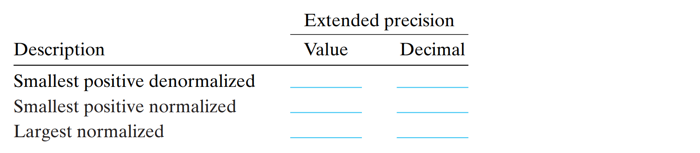

此格式可以通过在为 Intel 兼容机器编译的 C 程序中将数据声明为 `long double` 类型来使用。但它会迫使编译器基于传统的 8087 浮点指令生成代码，生成的程序很可能比使用 `float` 或 `double` 数据类型时运行得慢得多。

---

**练习题 2.87 ◆**

IEEE 浮点标准的 2008 版本（IEEE 754-2008）包含 16 位“半精度”浮点格式。它最初由计算机图形公司设计，用于存储需要比 16 位整数所能实现的更高动态范围的数据。此格式包含 1 个符号位、5 个指数位（$k = 5$）和 10 个小数位（$n = 10$），指数偏置为 $2^{5-1} - 1 = 15$。

填写下表中给定的每个数字，每列的说明如下：

---

<!-- Page 0167 -->

Hex：描述编码形式的四个十六进制数字。

M：有效数的值。这应该是形式为 $ x $ 或 $ \frac{x}{y} $ 的数字，其中 $ x $ 是整数，$ y $ 是 2 的整数幂。示例包括 0、$ \frac{67}{64} $ 和 $ \frac{1}{256} $。

E：指数的整数值。

V：表示的数值。使用符号 $ x $ 或 $ x \times 2^z $，其中 $ x $ 和 $ z $ 是整数。

D：（可能近似的）数值，如使用 printf 的 %f 格式规范打印的。

作为示例，要表示数字 $ \frac{7}{8} $，我们将有 $ s = 0 $、$ M = \frac{7}{4} $ 和 E = -1。因此，我们的数字将具有指数字段 $ 01110_2 $（十进制值 15 - 1 = 14）和有效数字段 $ 1100000000_2 $，给出十六进制表示 3B00。数值为 0.875。

你不需要填写标记为 — 的条目。

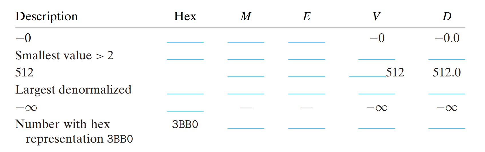

**练习题 2.88 ◆**

考虑以下两种基于 IEEE 浮点格式的 9 位浮点表示。

1. 格式 A

■ 有 1 个符号位。

■ 有 k = 5 个指数位。指数偏置为 15。

■ 有 n = 3 个小数位。

2. 格式 B

■ 有 1 个符号位。

■ 有 k = 4 个指数位。指数偏置为 7。

■ 有 n = 4 个小数位。

在下表中，你将获得格式 A 中的一些位模式，你的任务是将它们转换为格式 B 中最接近的值。如果需要舍入，你应该向 +∞ 舍入。此外，给出格式 A 和格式 B 位模式给出的数字的值。将这些值作为整数（例如，17）或分数（例如，17/64 或 17/26）给出。

---

<!-- Page 0168 -->

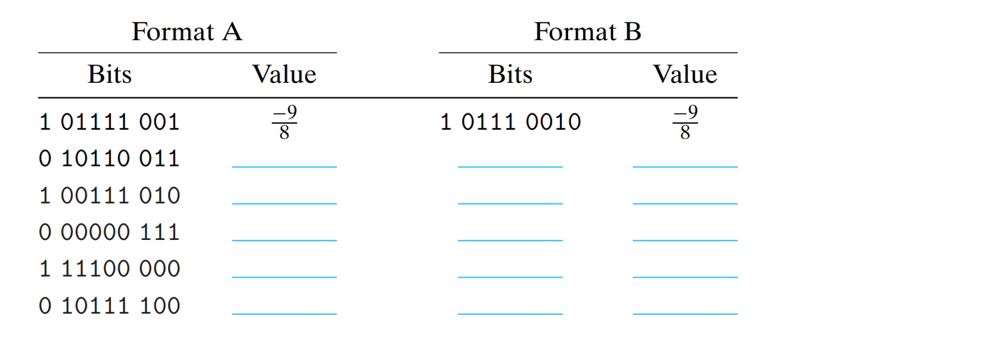

**练习题 2.89 ◆**

我们正在运行程序在一台机器上，其中 int 类型的值具有 32 位补码表示。float 类型的值使用 32 位 IEEE 格式，double 类型的值使用 64 位 IEEE 格式。

我们生成任意整数值 x、y 和 z，并按如下方式将它们转换为 double 类型的值：

```c
/* Create some arbitrary values */
int x = random();
int y = random();
int z = random();
/* Convert to double */
double dx = (double) x;
double dy = (double) y;
double dz = (double) z;
```

对于以下每个 C 表达式，你应该指示表达式是否总是产生 1。如果它总是产生 1，请描述基础数学原理。否则，给出使其产生 0 的参数示例。请注意，你不能使用运行 gcc 的 IA32 机器来测试你的答案，因为它将对 float 和 double 使用 80 位扩展精度表示。

A. $ (float)x == (float)dx $

B. dx - dy == (double) (x - y)

C. $ (dx + dy) + dz == dx + (dy + dz) $

D. $ (dx * dy) * dz == dx * (dy * dz) $

E. dx / dx == dz / dz

**练习题 2.90 ◆**

你被分配了编写 C 函数以计算 $ 2^x $ 的浮点表示的任务。你决定最好的方法是直接构造结果的 IEEE 单精度表示。当 x 太小时，你的例程将返回 0.0。当 x 太大时，它将返回 $ +\infty $。填写以下代码的空白部分以计算正确的结果。假设

---

<!-- Page 0169 -->

函数 u2f 返回一个浮点变量...

```c
float fpwr2(int x)
{
    /* Result exponent and fraction */
    unsigned exp, frac;
    unsigned u;

    if (x < ___) {
        /* Too small. Return 0.0 */
        exp = ___;
        frac = ___;
    } else if (x < ___) {
        /* Denormalized result */
        exp = ___;
        frac = ___;
    } else if (x < ___) {
        /* Normalized result */
        exp = ___;
        frac = ___;
    } else {
        /* Too big. Return +oo */
        exp = ___;
        frac = ___;
    }

    /* Pack exp and frac into 32 bits */
    u = exp << 23 | frac;
    /* Return as float */
    return u2f(u);
}
```

**练习题 2.91 ◆**

大约公元前 250 年，希腊数学家阿基米德证明了 $ \frac{223}{71} < \pi < \frac{22}{7} $。如果他有计算机和标准库 $ \langle \text{math.h} \rangle $，他将能够确定 $ \pi $ 的单精度浮点近似值具有十六进制表示 $ 0x40490FDB $。当然，所有这些都只是近似值，因为 $ \pi $ 不是有理数。

A. 此浮点值表示的小数二进制数是什么？

B. $ \frac{22}{7} $ 的小数二进制表示是什么？提示：参见问题 2.83。

C. 这两个 $ \pi $ 的近似值在哪个位位置（相对于二进制点）开始发散？

---
<!-- Page 0170 -->

## 位级浮点编码规则

在以下问题中，你将编写代码来实现浮点函数，直接对浮点数的位级表示进行操作。你的代码应该完全复制 IEEE 浮点运算的约定，包括在需要舍入时使用向偶舍入模式。

为此，我们定义数据类型 float_bits 等同于 unsigned：

```c
/* Access bit-level representation floating-point number */
typedef unsigned float_bits;
```

你将使用 float_bits 而不是在代码中使用数据类型 float。你可以使用 int 和 unsigned 数据类型，包括无符号和整数常量以及操作。你不能使用任何联合、结构或数组。最重要的是，你不能使用任何浮点数据类型、操作或常量。相反，你的代码应该执行实现指定浮点操作的位操作。

以下函数说明了这些编码规则的使用。对于参数 f，如果 f 是非标准化的（保留 f 的符号），它返回 $ \pm 0 $，否则返回 f。

```c
/* If f is denorm, return 0. Otherwise, return f */
float_bits float_denorm_zero(float_bits f) {
    /* Decompose bit representation into parts */
    unsigned sign = f >> 31;
    unsigned exp = f >> 23 & 0xFF;
    unsigned frac = f & 0x7FFFFF;
    if (exp == 0) {
        /* Denormalized. Set fraction to 0 */
        frac = 0;
    }
    /* Reassemble bits */
    return (sign << 31) | (exp << 23) | frac;
}
```

**练习题 2.92 ◆**

遵循位级浮点编码规则，实现具有以下原型的函数：

```c
/* Compute -f. If f is NaN, then return f. */
float_bits float_negate(float_bits f);
```

对于浮点数 $f$，此函数计算 $-f$。如果 $f$ 是 NaN，你的函数应该简单地返回 $f$。

通过为参数 f 的所有 $ 2^{32} $ 值评估你的函数并将结果与使用机器的浮点操作获得的结果进行比较来测试你的函数。

---

<!-- Page 0171 -->

**练习题 2.93 ☑**

遵循位级浮点编码规则，实现具有以下原型的函数：

```c
/* Compute |f|. If f is NaN, then return f. */
float_bits float_absval(float_bits f);
```

对于浮点数 $f$，此函数计算 $|f|$。如果 $f$ 是 NaN，你的函数应该简单地返回 $f$。

通过为参数 f 的所有 $ 2^{32} $ 值评估你的函数并将结果与使用机器的浮点操作获得的结果进行比较来测试你的函数。

**练习题 2.94 ◆◆◆**

遵循位级浮点编码规则，实现具有以下原型的函数：

```c
/* Compute 2*f. If f is NaN, then return f. */
float_bits float_twice(float_bits f);
```

对于浮点数 $f$，此函数计算 $2.0 \cdot f$。如果 $f$ 是 NaN，你的函数应该简单地返回 $f$。

通过为参数 f 的所有 $ 2^{32} $ 值评估你的函数并将结果与使用机器的浮点操作获得的结果进行比较来测试你的函数。

**练习题 2.95 ◆◆◆**

遵循位级浮点编码规则，实现具有以下原型的函数：

```c
/* Compute 0.5*f. If f is NaN, then return f. */
float_bits float_half(float_bits f);
```

对于浮点数 $f$，此函数计算 $0.5 \cdot f$。如果 $f$ 是 NaN，你的函数应该简单地返回 $f$。

通过为参数 f 的所有 $ 2^{32} $ 值评估你的函数并将结果与使用机器的浮点操作获得的结果进行比较来测试你的函数。

**练习题 2.96 ◆◆◆◆**

遵循位级浮点编码规则，实现具有以下原型的函数：

```c
/*
 * Compute (int) f.
 * If conversion causes overflow or f is NaN, return 0x80000000
 */
int float_f2i(float_bits f);
```

---

<!-- Page 0172 -->

应该向零舍入。如果 f 不能表示为整数（例如，它超出范围，或者它是 $ NaN $），则函数应该返回 0x80000000。

通过为参数 f 的所有 $ 2^{32} $ 值评估你的函数并将结果与使用机器的浮点操作获得的结果进行比较来测试你的函数。

**练习题 2.97 ◆◆◆◆**

遵循位级浮点编码规则，实现具有以下原型的函数：

```c
/* Compute (float) i */
float_bits float_i2f(int i);
```

对于参数 i，此函数计算 $ (float) $ i 的位级表示。

通过为参数 f 的所有 $ 2^{32} $ 值评估你的函数并将结果与使用机器的浮点操作获得的结果进行比较来测试你的函数。

## 练习题答案

**练习题 2.1 答案（第 73 页）**

理解十六进制和二进制格式之间的关系对于我们开始查看机器级程序时非常重要。进行这些转换的方法在文本中，但需要一些练习才能熟悉。

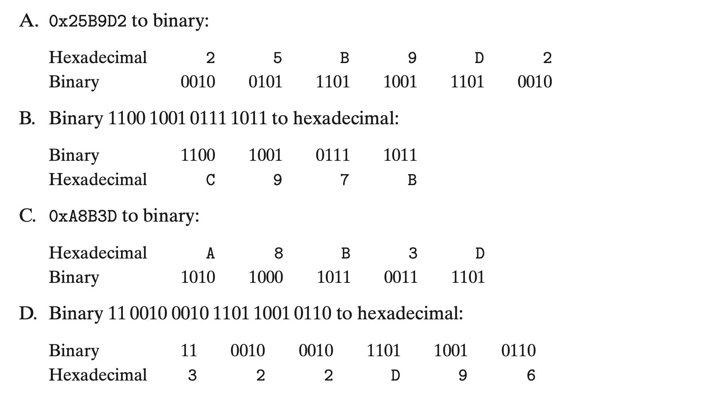

**练习题 2.2 答案（第 73 页）**

这个问题让你有机会思考 2 的幂及其十六进制表示。

---

<!-- Page 0173 -->

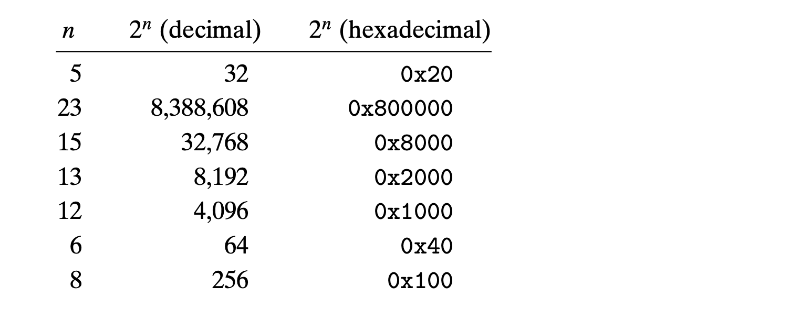

**练习题 2.3 答案（第 74 页）**

这个问题让你有机会尝试将一些较小数字的十六进制和十进制表示进行转换。对于较大的数字，使用计算器或转换程序会更方便和可靠。

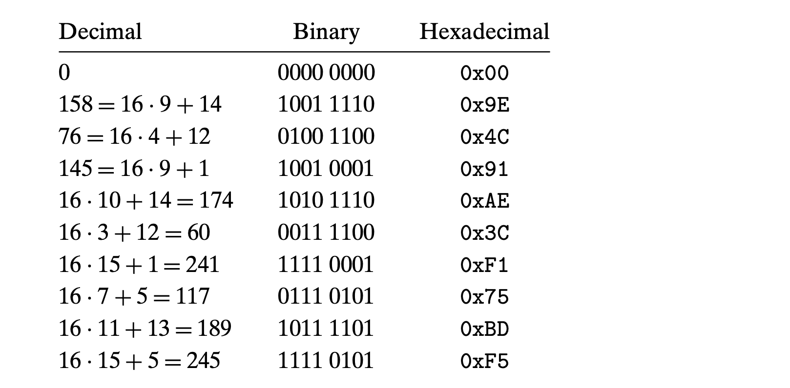

**练习题 2.4 答案（第 75 页）**

当你开始调试机器级程序时，你会发现许多情况下一些简单的十六进制算术会很有用。你总是可以将数字转换为十进制，执行算术运算，然后将它们转换回来，但能够直接在十六进制中工作更高效且更有信息量。

A. $ 0x605C + 0x5 = 0x6061 $。将 5 加到十六进制 C 得到 1，进位为 1。

B. $ 0x605C - 0x20 = 0x603C $。在第二位数字位置从 5 中减去 2 不需要从第三位借位。这给出 3。

C. $ 0x605C + 32 = 0x607C $。十进制 32（$ 2^5 $）等于十六进制 0x20。

D. $ 0x60FA - 0x605C = 0x9E $。要从十六进制 A（十进制 10）中减去十六进制 C（十进制 12），我们从第二位借 16，得到十六进制 F（十进制 15）。在第二位数字中，我们现在从十六进制 E（十进制 14）中减去 5，得到十进制 9。

**练习题 2.5 答案（第 84 页）**

这个问题测试你对数据的字节表示和两种不同字节顺序的理解。

A. 小端：78  大端：12

B. 小端：78 56  大端：12 34

---

<!-- Page 0174 -->

回想一下，show_bytes 从具有最低地址的字节开始枚举一系列字节，并朝向具有最高地址的字节工作。在小端机器上，它将从最低有效字节到最高有效字节列出字节。在大端机器上，它将从最高有效字节到最低有效字节列出字节。

**练习题 2.6 答案（第 85 页）**

这个问题是练习十六进制到二进制转换的另一个机会。它还让你思考整数和浮点表示。我们将在本章后面更详细地探讨这些表示。

A. 使用文本中示例的符号，我们将两个字符串写成如下：

```
0 0 2 7 C 8 F 8
00000000001001111100100011111000
     *****
4 A 1 F 2 3 E 0
01001010000111110010001111100000
```

B. 将第二个字向右移动两个位置相对于第一个字，我们找到一个具有 21 个匹配位的序列。

C. 我们发现嵌入在浮点数中的整数的所有位，除了值为 0 的最高有效位。文本中的示例也是如此。此外，浮点数具有一些非零的高阶位，这些位与整数的高阶位不匹配。

**练习题 2.7 答案（第 85 页）**

它打印 6D 6E 6F 70 71 72。还要回想库例程 strlen 不计算终止空字符，因此 show_bytes 仅打印到字符 'r'。

**练习题 2.8 答案（第 87 页）**

这个问题是一个练习，帮助你更熟悉布尔运算。

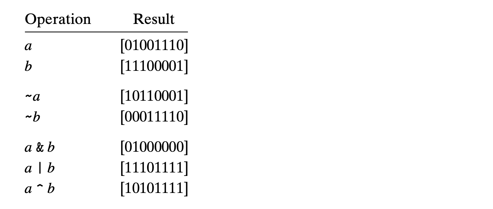

---

<!-- Page 0175 -->

**练习题 2.9 答案（第 89 页）**

这个问题说明了如何使用布尔代数来描述和推理现实世界系统。我们可以看到，这种颜色代数与长度为 3 的位向量上的布尔代数相同。

A. 颜色通过互补 R、G 和 B 的值来互补。由此，我们可以看到白色是黑色的补色，黄色是蓝色的补色，品红是绿色的补色，青色是红色的补色。

B. 我们基于颜色的位向量表示执行布尔运算。由此我们得到以下结果：

```
Blue (001) | Green (010) = Cyan (011)
Yellow (110) & Cyan (011) = Green (010)
Red (100) ^ Magenta (101) = Blue (001)
```

**练习题 2.10 答案（第 90 页）**

此过程依赖于 EXCLUSIVE-OR 是可交换和结合的，并且对于任何 a，$ a \wedge a = 0 $。

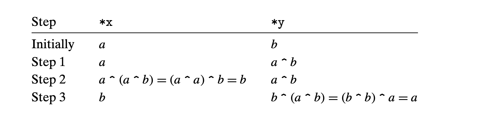

参见练习题 2.11，了解此函数将失败的情况。

**练习题 2.11 答案（第 91 页）**

这个问题说明了我们的就地交换例程的一个微妙且有趣的特性。

A. first 和 last 都具有值 k，因此我们试图将中间元素与其自身交换。

B. 在这种情况下，inplace_swap 的参数 x 和 y 都指向相同的位置。当我们计算 $ *x \wedge *y $ 时，我们得到 0。然后我们将 0 存储为数组的中间元素，后续步骤继续将此元素设置为 0。我们可以看到，我们在练习题 2.10 中的推理隐含地假设 x 和 y 表示不同的位置。

C. 只需将 reverse_array 的第 4 行中的测试替换为 first < last，因为不需要将中间元素与其自身交换。

**练习题 2.12 答案（第 91 页）**

以下是表达式：

---

<!-- Page 0176 -->

A. x & 0xFF
B. x ^ ~0xFF
C. x | 0xFF

这些表达式是执行低级位操作时常见的那种。表达式 ~0xFF 创建一个掩码，其中 8 个最低有效位等于 0，其余位等于 1。请注意，无论字长如何，都将生成这样的掩码。相比之下，表达式 0xFFFF00 仅在数据类型 int 为 32 位时有效。

**练习题 2.13 答案（第 92 页）**

这些问题帮助你思考布尔运算与程序员应用掩码操作的典型方式之间的关系。这是代码：

```c
/* Declarations of functions implementing operations bis and bic */
int bis(int x, int m);
int bic(int x, int m);
/* Compute x|y using only calls to functions bis and bic */
int bool_or(int x, int y) {
    int result = bis(x,y);
    return result;
}
/* Compute x^y using only calls to functions bis and bic */
int bool_xor(int x, int y) {
    int result = bis(bic(x,y), bic(y,x));
    return result;
}
```

bis 操作等同于布尔或——如果在 x 中设置此位或在 m 中设置此位，则在 z 中设置该位。另一方面，bic(x, m) 等同于 x & ~m；我们希望结果仅在 x 的相应位为 1 且 m 的相应位为 0 时等于 1。

鉴于此，我们可以通过单次调用 bis 来实现 |。要实现 ^，我们利用属性

$$ x\ \hat{~}y=(x\ \&\sim y)\ \mid(\sim x\ \&\ y) $$

**练习题 2.14 答案（第 93 页）**

这个问题强调了 C 中位级布尔运算和逻辑运算之间的关系。一个常见的编程错误是在打算使用逻辑运算时使用位级运算，反之亦然。

---

<!-- Page 0177 -->

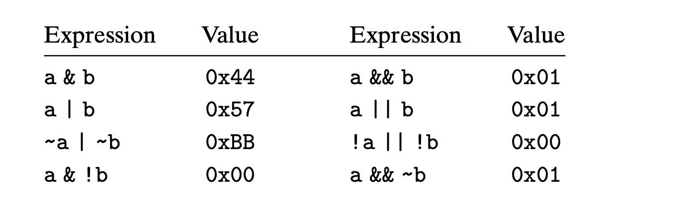

**练习题 2.15 答案（第 93 页）**

表达式是 !(x ^ y)。

也就是说，当且仅当 x 的每一位都与 y 的相应位匹配时，x^y 才为零。然后我们利用 ! 的能力来确定一个字是否包含任何非零位。

没有真正的理由使用这个表达式而不是简单地写 x == y，但它演示了位级和逻辑运算的一些细微差别。

**练习题 2.16 答案（第 94 页）**

这个问题是一个练习，帮助你理解不同的移位操作。

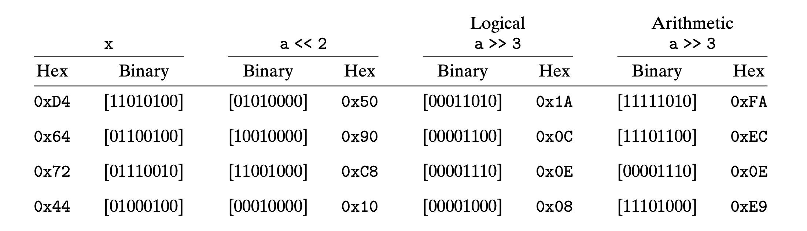

**练习题 2.17 答案（第 101 页）**

一般来说，为非常小的字长进行示例工作是理解计算机算术的一个非常好的方法。

无符号值对应于图 2.2 中的值。对于补码值，十六进制数字 0 到 7 的最高有效位为 0，产生非负值，而十六进制数字 8 到 F 的最高有效位为 1，产生负值。

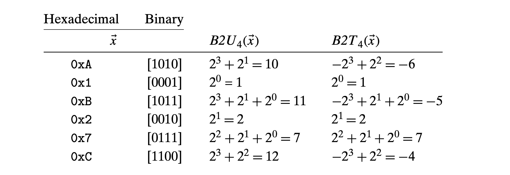

---

<!-- Page 0178 -->

**练习题 2.18 答案（第 105 页）**

对于 32 位字，任何由 8 个十六进制数字组成的值，以数字 8 到 f 之一开头，表示负数。看到以一串 f 开头的数字是很常见的，因为负数的前导位都是 1。但是，你必须仔细查看。例如，数字 0x8048337 只有 7 位数字。用前导零填充这个数字会得到 0x08048337，一个正数。

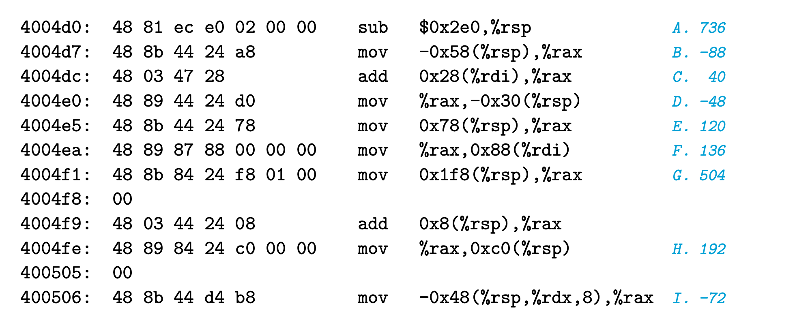

**练习题 2.19 答案（第 107 页）**

函数 T2U 和 U2T 从数学角度来看非常奇特。理解它们的行为方式很重要。

我们通过根据补码值对练习题 2.17 的解决方案中的行重新排序，然后将无符号值列为函数应用的结果来解决此问题。我们显示十六进制值以使此过程更具体。

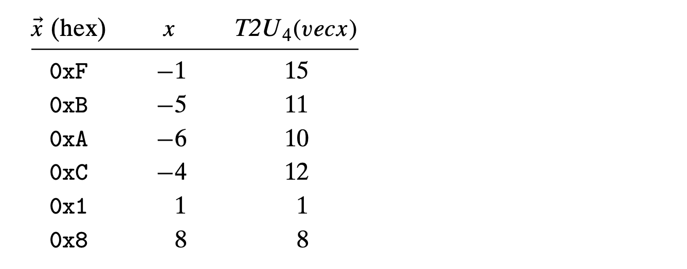

**练习题 2.20 答案（第 109 页）**

本练习测试你对公式 2.5 的理解。

对于前四个条目，x 的值为负，$ T2U_{4}(x) = x + 2^{4} $。对于其余两个条目，x 的值为非负，$ T2U_{4}(x) = x $。

**练习题 2.21 答案（第 112 页）**

这个问题加强了你对补码和无符号表示之间关系以及 C 提升规则的影响的理解。回想一下，$ TMin_{32} $ 是 $ -2,147,483,648 $，并且当强制转换为无符号时它

---

<!-- Page 0179 -->

变为 2,147,483,648。此外，如果任一操作数是无符号的，则另一个操作数将在比较之前强制转换为无符号。

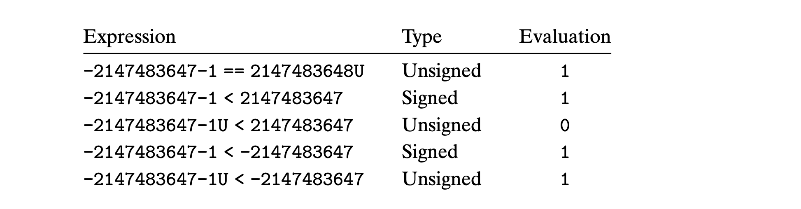

**练习题 2.22 答案（第 115 页）**

本练习提供了符号扩展如何保留补码表示的数值的具体演示。

$$ \begin{array}{ccc} A. & [1100] & -2^{3}+2^{2} = -8+4 =-4 \end{array} $$

$$ \begin{array}{r l r}{B.}&{[11100]}&{-2^{4}+2^{3}+2^{2}=}&{-16+8+4=}&{-4}\end{array} $$

$$ \begin{array}{r l r}{C.}&{[111100]}&{-2^{5}+2^{4}+2^{3}+2^{2}=}&{-32+16+8+4=}&{-4}\end{array} $$

**练习题 2.23 答案（第 116 页）**

这些函数中的表达式是用于从打包了多个位字段的字中提取值的常见程序"惯用语法"。它们利用不同移位操作的零填充和符号扩展属性。仔细注意强制转换和移位操作的顺序。在 fun1 中，移位是对无符号变量 word 执行的，因此是逻辑的。在 fun2 中，移位是在将 word 强制转换为 int 之后执行的，因此是算术的。

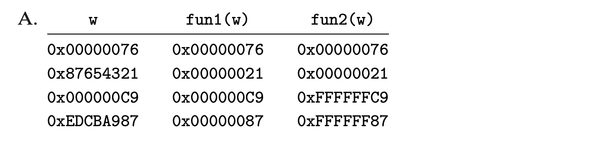

B. 函数 fun1 从参数的低阶 8 位中提取一个值，给出一个范围在 0 到 255 之间的整数。函数 fun2 从参数的低阶 8 位中提取一个值，但它也执行符号扩展。结果将是一个介于 -128 和 127 之间的数字。

**练习题 2.24 答案（第 118 页）**

截断对无符号数的影响相当直观，但对补码数则不然。本练习让你使用非常小的字长来探索其属性。

---

<!-- Page 0180 -->

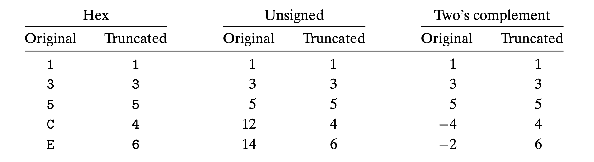

如公式 2.9 所述，此截断对无符号值的影响是简单地找到它们的余数，模 8。截断对有符号值的影响稍微复杂一些。根据公式 2.10，我们首先计算参数的模 8 余数。这将为参数 0 到 7 以及参数 -8 到 -1 提供值 0 到 7。然后我们将函数 $ U2T_{3} $ 应用于这些余数，给出序列 0 到 3 和 -4 到 -1 的两次重复。

**练习题 2.25 答案（第 119 页）**

这个问题旨在演示由于从有符号到无符号的隐式强制转换而容易产生错误。将参数 length 作为无符号传递似乎很自然，因为人们永远不会想要使用负长度。停止条件 i <= length-1 也似乎很自然。但是将这两者结合起来会产生意想不到的结果！

由于参数 length 是无符号的，因此使用无符号算术执行计算 0 - 1，这相当于模加法。结果然后是 UMax。$ \leq $ 比较也使用无符号比较执行，由于任何数字都小于或等于 UMax，因此比较总是成立！因此，代码尝试访问数组 a 的无效元素。

可以通过将 length 声明为 int 或将 for 循环的测试更改为 i < length 来修复代码。

**练习题 2.26 答案（第 119 页）**

这个示例演示了无符号算术的一个微妙特性，以及我们有时在没有意识到的情况下执行无符号算术的属性。这可能导致非常棘手的错误。

A. 这个函数在哪些情况下会产生不正确的结果？当 s 比 t 短时，该函数将错误地返回 1。

B. 解释这个不正确的结果是如何产生的。由于 strlen 被定义为产生无符号结果，因此差和比较都使用无符号算术计算。当 s 比 t 短时，差 strlen(s) - strlen(t) 应该是负数，但相反变成一个大的无符号数，该数大于 0。

C. 展示如何修复代码以使其可靠地工作。将测试替换为以下内容：

---

<!-- Page 0181 -->

**练习题 2.27 答案（第 125 页）**

此函数是给定规则的直接实现，用于确定无符号加法是否溢出。

```c
/* Determine whether arguments can be added without overflow */
int uadd_ok(unsigned x, unsigned y) {
    unsigned sum = x + y;
    return sum >= x;
}
```

**练习题 2.28 答案（第 125 页）**

这个问题是模 16 算术的简单演示。最简单的解决方法是将十六进制模式转换为其无符号十进制值。对于 x 的非零值，我们必须有 $ (-_u^4 x) + x = 16 $。然后我们将补码值转换回十六进制。

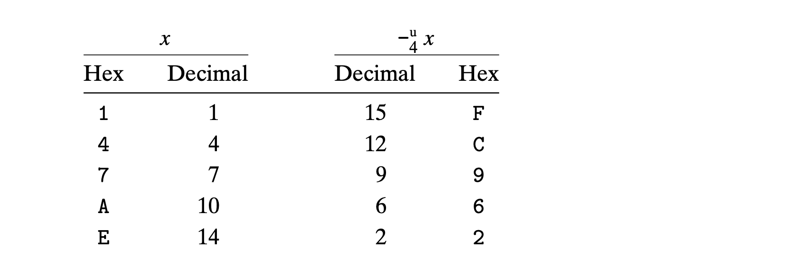

**练习题 2.29 答案（第 129 页）**

这个问题是一个练习，以确保你理解补码加法。

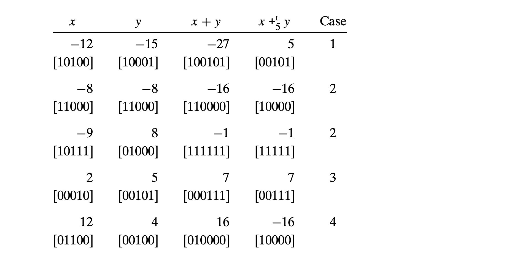

---

<!-- Page 0182 -->

**练习题 2.30 答案（第 130 页）**

此函数是给定规则的直接实现，用于确定补码加法是否溢出。

```c
/* Determine whether arguments can be added without overflow */
int tadd_ok(int x, int y) {
    int sum = x + y;
    int neg_over = x < 0 && y < 0 && sum >= 0;
    int pos_over = x >= 0 && y >= 0 && sum < 0;
    return !neg_over && !pos_over;
}
```

**练习题 2.31 答案（第 130 页）**

你的同事本可以通过研究第 2.3.2 节了解到，补码加法形成一个阿贝尔群，因此表达式 $ (x+y)-x $ 将求值为 y，无论加法是否溢出，并且 $ (x+y)-y $ 将始终求值为 x。

**练习题 2.32 答案（第 130 页）**

此函数将给出正确的值，除非 y 是 TMin。在这种情况下，我们将有 -y 也等于 TMin，因此对函数 tadd_ok 的调用将在 x 为负时指示溢出，在 x 为非负时指示无溢出。事实上，情况恰恰相反：tsub_ok(x, TMin) 应该在 x 为负时产生 0，在 x 为非负时产生 1。

从这个练习中可以学到的一个教训是，TMin 应该作为任何函数测试过程中的案例之一。

**练习题 2.33 答案（第 131 页）**

这个问题帮助你使用非常小的字长理解补码取反。

对于 w = 4，我们有 $ TMin_{4} = -8 $。因此 -8 是它自己的加法逆元，而其他值通过整数取反来取反。

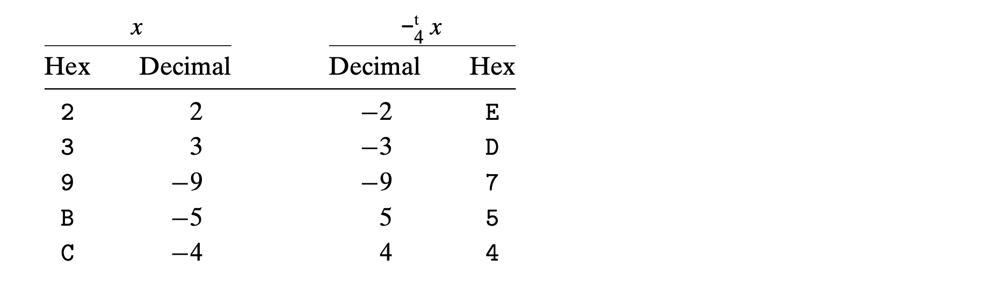

位模式与无符号取反的位模式相同。

**练习题 2.34 答案（第 134 页）**

这个问题是一个练习，以确保你理解补码乘法。

---

<!-- Page 0183 -->

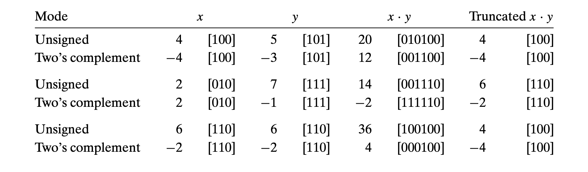

**练习题 2.35 答案（第 135 页）**

对所有可能的 x 和 y 值测试此函数是不现实的。即使你每秒可以运行 100 亿次测试，当数据类型 int 为 32 位时，测试所有组合也需要超过 58 年。另一方面，通过使用数据类型 short 或 char 编写函数然后进行详尽测试是可行的。

这是一个更有原则的方法，遵循建议的参数集：

1. 我们知道 $ x \cdot y $ 可以写成 2w 位补码数。令 u 表示由低 w 位表示的无符号数，v 表示由高 w 位表示的补码数。然后，基于公式 2.3，我们可以看到 $ x \cdot y = v2^{w} + u $。

我们还知道 $ u = T2U_w(p) $，因为它们是来自相同位模式的无符号和补码数，因此根据公式 2.6，我们可以写 $ u = p + p_{w-1}2^w $，其中 $ p_{w-1} $ 是 p 的最高有效位。令 $ t = v + p_{w-1} $，我们有 $ x \cdot y = p + t2^w $。

当 $t = 0$ 时，我们有 $x \cdot y = p$；乘法不溢出。当 $t \neq 0$ 时，我们有 $x \cdot y \neq p$；乘法溢出。

2. 根据整数除法的定义，将 p 除以非零 x 给出商 q 和余数 r，使得 $ p = x \cdot q + r $，并且 $ |r| < |x| $。（我们在这里使用绝对值，因为 x 和 r 的符号可能不同。例如，将 -7 除以 2 给出商 -3 和余数 -1。）

3. 假设 $q = y$。那么我们有 $x \cdot y = x \cdot y + r + t2^w$。由此，我们可以看到 $r + t2^w = 0$。但 $|r| < |x| \leq 2^w$，因此只有当 $t = 0$ 时，此恒等式才能成立，在这种情况下 $r = 0$。

假设 r = t = 0。那么我们将有 $ x \cdot y = x \cdot q $，意味着 y = q。

当 x 等于 0 时，乘法不会溢出，因此我们看到我们的代码提供了一种可靠的方法来测试补码乘法是否导致溢出。

**练习题 2.36 答案（第 135 页）**

使用 64 位，我们可以在不溢出的情况下执行乘法。然后我们测试将乘积强制转换为 32 位是否改变值：

---

<!-- Page 0184 -->

```c
/* Determine whether the arguments can be multiplied without overflow */
int tmult_ok(int x, int y) {
    /* Compute product without overflow */
    int64_t pll = (int64_t) x*y;
    /* See if casting to int preserves value */
    return pll == (int) pll;
}
```

请注意，第 5 行右侧的强制转换至关重要。如果我们将该行写为

```c
int64_t pll = x*y;
```

乘积将作为 32 位值计算（可能溢出），然后符号扩展到 64 位。

**练习题 2.37 答案（第 135 页）**

A. 此更改根本没有帮助。即使大小的计算将是准确的，对 malloc 的调用将导致此值转换为 32 位无符号数，因此将发生相同的溢出条件。

B. 由于 malloc 的参数是 32 位无符号数，它不可能分配超过 $ 2^{32} $ 字节的块，因此没有必要尝试分配或复制这么多内存。相反，函数应该中止并返回 NULL，如下面对原始 malloc 调用的替换所示（第 9 行）：

```c
uint64_t required_size = ele_cnt * (uint64_t) ele_size;
size_t request_size = (size_t) required_size;
if (required_size != request_size)
    /* Overflow must have occurred. Abort operation */
    return NULL;
void *result = malloc(request_size);
if (result == NULL)
    /* malloc failed */
    return NULL;
```

**练习题 2.38 答案（第 138 页）**

在第 3 章中，我们将看到许多 LEA 指令的示例。该指令用于支持指针算术，但 C 编译器通常将其用作执行小常数乘法的方法。

对于 k 的每个值，我们可以计算两个倍数：$ 2^k $（当 b 为 0 时）和 $ 2^k + 1 $（当 b 为 a 时）。因此，我们可以计算倍数 1、2、3、4、5、8 和 9。

---

<!-- Page 0185 -->

**练习题 2.39 答案（第 139 页）**

表达式简单地变为 $ -(x\ll m) $。要看到这一点，令字长为 w，因此 n = w - 1。形式 B 指出我们应该计算 $ (x\ll w) - (x\ll m) $，但将 x 左移 w 将产生值 0。

**练习题 2.40 答案（第 139 页）**

这个问题要求你尝试已经描述的优化，并提供一些你自己的聪明才智。

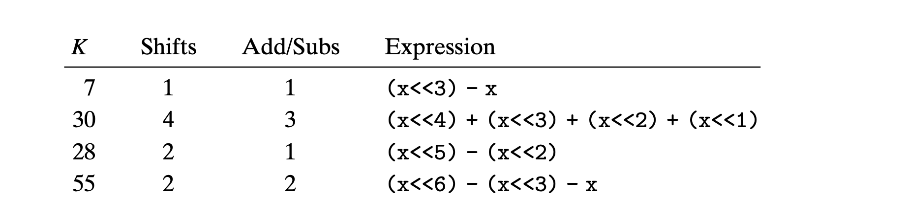

请注意，第四种情况使用了形式 B 的修改版本。我们可以将位模式 [110111] 视为具有 6 个 1 的运行，中间有一个零，因此我们应用形式 B 的规则，但然后我们减去对应于中间零位的项。

**练习题 2.41 答案（第 139 页）**

假设加法和减法具有相同的性能，规则是在 n = m 时选择形式 A，在 n = m + 1 时选择任一形式，在 n > m + 1 时选择形式 B。

这个规则的理由如下。首先假设 m > 0。当 n = m 时，形式 A 只需要一次移位，而形式 B 需要两次移位和一次减法。当 $ n = m + 1 $ 时，两种形式都需要两次移位和一次加法或减法。当 $ n > m + 1 $ 时，形式 B 只需要两次移位和一次减法，而形式 A 需要 $ n - m + 1 > 2 $ 次移位和 n - m > 1 次加法。对于 m = 0 的情况，我们对形式 A 和 B 都少一次移位，因此在两者之间选择时适用相同的规则。

**练习题 2.42 答案（第 143 页）**

这里唯一的挑战是在没有任何测试或条件操作的情况下计算偏置。我们使用技巧，即如果 x 为负，表达式 x >> 31 生成一个全 1 的字，否则全 0。通过屏蔽掉适当的位，我们得到所需的偏置值。

```c
int div16(int x) {
    /* Compute bias to be either 0 (x >= 0) or 15 (x < 0) */
    int bias = (x >> 31) & 0xF;
    return (x + bias) >> 4;
}
```

---

<!-- Page 0186 -->

**练习题 2.43 答案（第 143 页）**

我们发现人们在直接使用汇编代码时对这个练习有困难。当以 optarith 中显示的形式呈现时，它变得更清楚。

我们可以看到 M 是 31；x*M 计算为 (x<<5)-x。

我们可以看到 N 是 8；当 y 为负时，添加偏置值 7，并且右移为 3。

**练习题 2.44 答案（第 144 页）**

"zyle" 问题清楚地表明程序员必须使用计算机算术的属性：

A. $ (x > 0) || (x - 1 < 0) $

False。令 x 为 -2,147,483,648（$ TMin_{32} $）。那么我们将有 x - 1 等于 2,147,483,647（$ TMax_{32} $）。

B. $ (x \& 7) != 7 || (x << 29 < 0) $

True。如果 $ (x \& 7) != 7 $ 求值为 0，那么我们必须有位 $ x_{2} $ 等于 1。当左移 29 时，这将成为符号位。

C. $ (x * x) >= 0 $

False。当 x 为 65,535 (0xFFFF) 时，x*x 为 -131,071 (0xFFFE0001)。

D. x < 0 || -x <= 0

True。如果 x 为非负，则 -x 为非正。

E. x > 0 || -x >= 0

False。令 x 为 -2,147,483,648（$ TMin_{32} $）。那么 x 和 -x 都是负数。

F. x + y == uy + ux

True。补码和无符号加法具有相同的位级行为，并且它们是可交换的。

G. x*~y + uy*ux == -x

True。~y 等于 -y-1。uy*ux 等于 x*y。因此，左侧等同于 x*(-y-1)+x*y = -x。

**练习题 2.45 答案（第 147 页）**

理解小数二进制表示是理解浮点编码的重要一步。本练习让你尝试一些简单的示例。

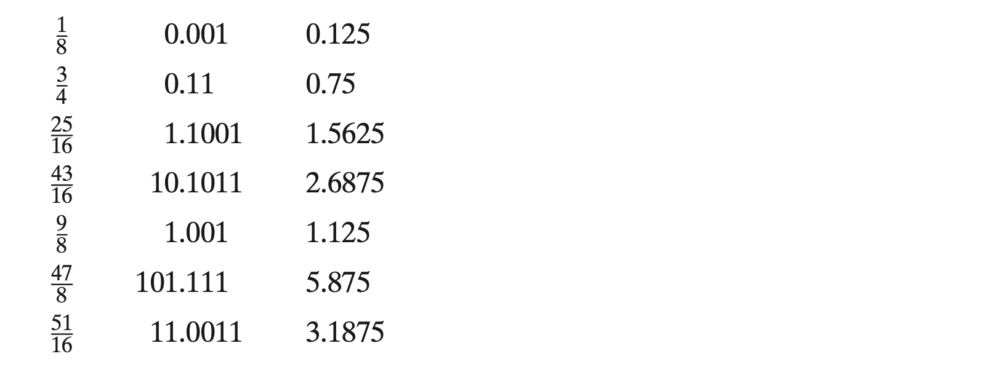

---

<!-- Page 0187 -->

思考小数二进制表示的一种简单方法是将数字表示为形式为 $ \frac{x}{2^k} $ 的分数。我们可以使用 $ x $ 的二进制表示以二进制形式写出这个，二进制点从右边插入 $ k $ 个位置。例如，对于 $ \frac{25}{16} $，我们有 $ 25_{10} = 11001_2 $。然后我们将二进制点放在从右边数第四个位置以得到 $ 1.1001_2 $。

**练习题 2.46 答案（第 147 页）**

在大多数情况下，浮点数的有限精度不是主要问题，因为计算的相对误差仍然相当低。然而，在这个示例中，系统对绝对误差敏感。

A. 我们可以看到 0.1 - x 具有二进制表示 0.0000...（某个模式）

B. 将此与 $ \frac{1}{10} $ 的二进制表示进行比较，我们可以看到它简单地是 $ 2^{-20} \times \frac{1}{10} $，约为 $ 9.54 \times 10^{-8} $。

C. $ 9.54 \times 10^{-8} \times 100 \times 60 \times 60 \times 10 \approx 0.343 $ 秒。

D. $ 0.343 \times 2{,}000 \approx 687 $ 米。

**练习题 2.47 答案（第 153 页）**

对非常小的字长进行浮点表示的工作有助于阐明 IEEE 浮点的工作原理。特别注意非标准化和标准化值之间的转换。

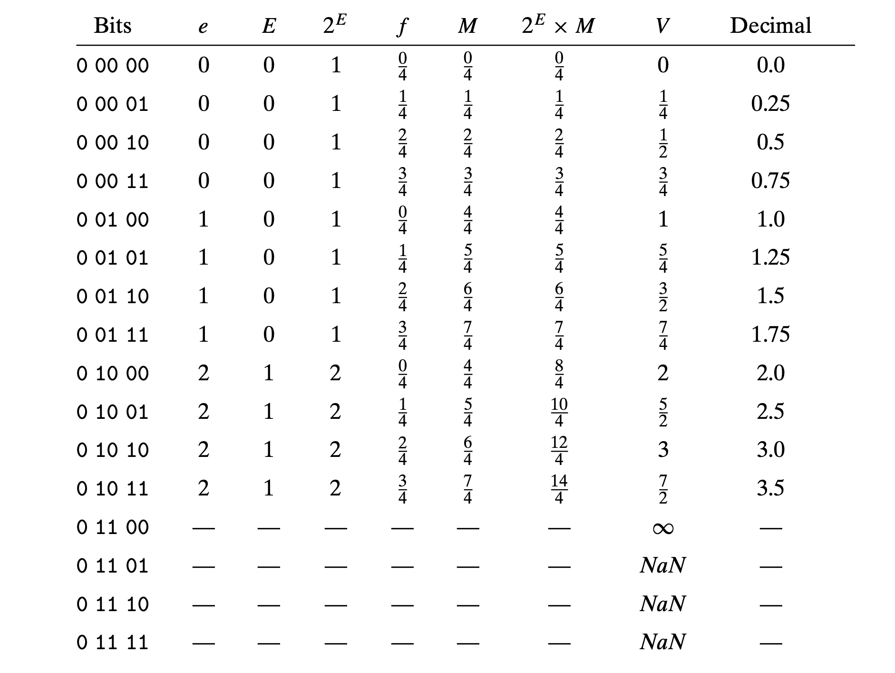

---

<!-- Page 0188 -->

**练习题 2.48 答案（第 155 页）**

十六进制 0x359141 等同于二进制 [1101011001000101000001]。将其右移 21 位得到 $1.101011001000101000001_2 \times 2^{21}$。我们通过删除前导 1 并添加两个零来形成小数字段，得到

[10101100100010100000100]

指数通过将偏置 127 加到 21 形成，得到 148（二进制 [10010100]）。我们将其与符号字段 0 组合以给出二进制表示

[01001010010101100100010100000100]

我们看到两个表示中的匹配位对应于整数的低阶位，直到等于 1 的最高有效位匹配小数的高阶 21 位：

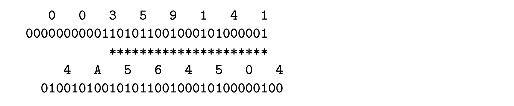

**练习题 2.49 答案（第 156 页）**

本练习帮助你思考哪些数字不能在浮点中精确表示。

A. 该数字具有二进制表示 1，后跟 n 个零，后跟 1，给出值 $ 2^{n+1} + 1 $。

B. 当 n = 23 时，值为 $ 2^{24} + 1 = 16,777,217 $。

**练习题 2.50 答案（第 157 页）**

手动执行舍入有助于强化二进制数的向偶舍入思想。

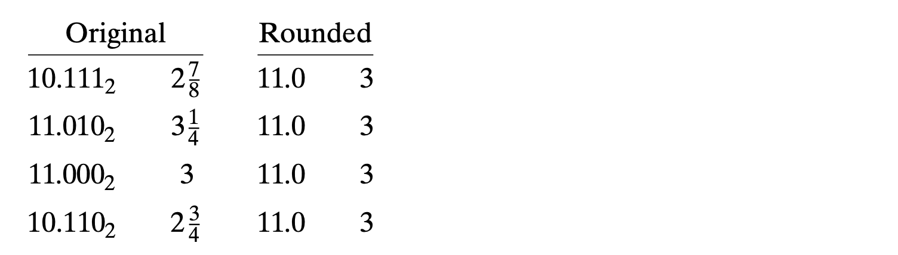

**练习题 2.51 答案（第 158 页）**

A. 查看 $ \frac{1}{10} $ 的非终止序列，我们看到舍入位置右边的 2 位为 1，因此通过将 x 递增以获得 $ x' = 0.00011001100110011001101_2 $ 可以获得 $ \frac{1}{10} $ 的更好近似值，它大于 0.1。

B. 我们可以看到 $ x' - 0.1 $ 具有二进制表示（某个模式）

---

<!-- Page 0189 -->

将此与 $ \frac{1}{10} $ 的二进制表示进行比较，我们可以看到它是 $ 2^{-22} \times \frac{1}{10} $，约为 $ 2.38 \times 10^{-8} $。

C. $ 2.38 \times 10^{-8} \times 100 \times 60 \times 60 \times 10 \approx 0.086 $ 秒，比 Patriot 系统中的误差小 4 倍。

D. $ 0.086 \times 2{,}000 \approx 171 $ 米。

**练习题 2.52 答案（第 158 页）**

这个问题测试了许多关于浮点表示的概念，包括标准化和非标准化值的编码，以及舍入。

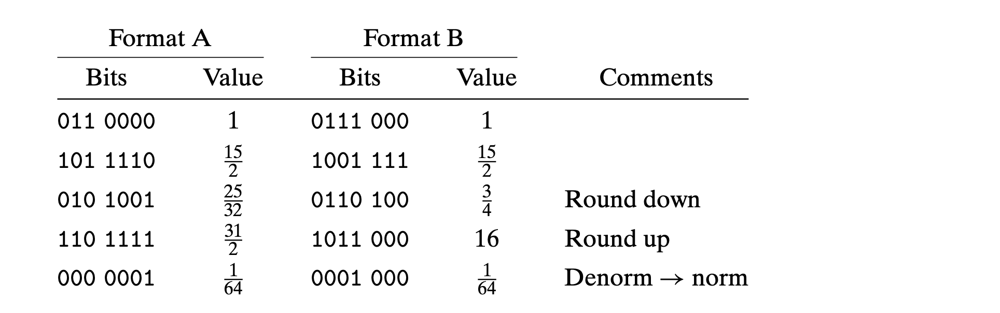

**练习题 2.53 答案（第 161 页）**

一般来说，使用库宏比发明自己的代码更好。但是，此代码似乎在各种机器上都有效。

我们假设值 1e400 溢出到无穷大。

```c
#define POS_INFINITY 1e400
#define NEG_INFINITY (-POS_INFINITY)
#define NEG_ZERO (-1.0/POS_INFINITY)
```

**练习题 2.54 答案（第 161 页）**

像这样的练习可以帮助你从程序员的角度培养关于浮点运算的推理能力。确保你理解每个答案。

A. $ x == (int)(double) x $

Yes，因为 double 的精度和范围大于 int。

B. $ x == (int)(float) x $

No。例如，当 x 为 TMax 时。

C. $ d == (double)(float) d $

No。例如，当 d 为 1e40 时，右侧将得到 +∞。

D. $ f == (float)(double) f $

Yes，因为 double 的精度和范围大于 float。

E. $ f == -(-f) $

Yes，因为浮点数通过简单地反转其符号位来取反。

F. $ 1.0/2 == 1/2.0 $

---

<!-- Page 0190 -->

Yes，分子和分母都将在执行除法之前转换为浮点表示。

G. $ d*d >= 0.0 $

Yes，尽管它可能溢出到 $ +\infty $。

H. $ (f+d)-f == d $

No。例如，当 f 为 1.0e20 且 d 为 1.0 时，表达式 $ f+d $ 将舍入为 1.0e20，因此左侧的表达式将求值为 0.0，而右侧将为 1.0。
