# 第 3 章：程序的机器级表示

<!-- Page 0191 -->

# 程序的机器级表示

3.1 历史视角 202

3.2 程序编码 205

3.3 数据格式 213

3.4 访问信息 215

3.5 算术和逻辑操作 227

3.6 控制 236

3.7 过程 274

3.8 数组的分配和访问 291

3.9 异质数据结构 301

3.10 在机器级程序中将控制与数据结合 312

3.11 浮点代码 329

3.12 小结 345

参考文献说明 346

家庭作业 347

练习题解答 361

---

<!-- Page 0192 -->

计算机执行机器代码——字节序列，对操作数据、管理内存、在存储设备上读写数据以及通过网络通信的底层操作进行编码。编译器基于编程语言的规则、目标机器的指令集以及操作系统遵循的约定，通过一系列阶段生成机器代码。GCC 编译器以汇编代码的形式生成输出，汇编代码是机器代码的文本表示，给出了程序中各条指令。GCC 随后调用汇编器和链接器，从汇编代码生成可执行的机器代码。在本章中，我们将深入研究机器代码及其可供人阅读的汇编代码表示。

用 C 这样的高级语言编程时（更不用说 Java），我们无需关心程序的机器级实现细节。相比之下，用汇编代码编写程序（就像计算机早期时代那样），程序员必须指定程序执行计算所使用的底层指令。大多数时候，使用高级语言提供的更高层抽象工作更加高效和可靠。编译器提供的类型检查有助于发现许多程序错误，并确保我们以一致的方式引用和操作数据。使用现代优化编译器，生成的代码通常至少与熟练的汇编语言程序员手工编写的代码一样高效。最重要的是，用高级语言编写的程序可以在许多不同的机器上编译和执行，而汇编代码却高度依赖于特定机器。

那么，我们为什么要花时间学习机器代码？尽管编译器承担了生成汇编代码的大部分工作，但能够阅读和理解汇编代码对于认真的程序员来说是一项重要技能。通过使用适当的命令行参数调用编译器，编译器会生成一个显示汇编代码形式输出的文件。通过阅读这些代码，我们可以了解编译器的优化能力，并分析代码中潜在的低效之处。正如我们将在第 5 章中体验到的，寻求最大化关键代码段性能的程序员通常会尝试不同版本的源代码，每次编译并检查生成的汇编代码，以了解程序的运行效率。此外，有时高级语言提供的抽象层会隐藏我们需要理解的程序运行时行为信息。例如，使用线程包编写并发程序时（如第 12 章所述），了解程序数据如何在不同线程之间共享或保持私有、以及共享数据如何和在何处被访问是非常重要的。这些信息在机器代码级别是可见的。再比如，程序受到攻击、允许恶意软件侵入系统的许多方式，都涉及程序存储运行时控制信息方式的细节。许多攻击利用系统程序中的漏洞来覆盖信息，从而控制系统。理解这些漏洞如何产生以及如何防范，需要了解程序的机器级表示。程序员学习

---

<!-- Page 0193 -->

机器代码的需求已经从能够直接用汇编代码编写程序，转变为能够阅读和理解编译器生成的代码。

在本章中，我们将学习一种特定汇编语言的细节，并了解 C 程序如何被编译成这种机器代码形式。阅读编译器生成的汇编代码需要与手工编写汇编代码不同的技能。我们必须理解编译器在将 C 语言构件转换为机器代码时通常进行的变换。相对于 C 代码中表达的计算，优化编译器可以重新排列执行顺序、消除不必要的计算、用更快的操作替换较慢的操作，甚至将递归计算转变为迭代计算。理解源代码与生成的汇编代码之间的关系常常是一种挑战——这很像拼一幅设计与盒子上图案略有不同的拼图。这是一种逆向工程的形式——通过研究系统并向后推导，试图理解系统的创建过程。在这种情况下，系统是由机器生成的汇编语言程序，而不是人类设计的东西。这简化了逆向工程的任务，因为生成的代码遵循相当规律的模式，而且我们可以进行实验，让编译器为许多不同的程序生成代码。在我们的讲述中，我们给出了许多示例，并提供了一些练习来说明汇编语言和编译器的不同方面。这是一个掌握细节是理解更深层、更基本概念的前提的学科。那些说"我理解基本原理，不想费心学细节"的人是在自欺欺人。花时间研究示例、完成练习并用提供的解答核对自己的答案，这对你至关重要。

我们的讲述基于 x86-64，这是当今笔记本电脑和台式机中大多数处理器的机器语言，也是那些驱动超大型数据中心和超级计算机的机器语言。这种语言经历了漫长的历史演变，从 1978 年 Intel 公司的第一款 16 位处理器开始，经历了扩展到 32 位，最近又扩展到 64 位。在此过程中，添加了功能以更好地利用可用的半导体技术，并满足市场需求。大部分开发工作由 Intel 主导，但其竞争对手超微半导体（AMD）也做出了重要贡献。其结果是一种相当特殊的设计，其特性只有从历史角度来看才有意义。它还充斥着向后兼容性特性，这些特性在现代计算机和操作系统中并不使用。我们将重点关注 GCC 和 Linux 使用的功能子集，从而避免 x86-64 的大部分复杂性和晦涩特性。

我们的技术讲述从一个简短概览开始，展示 C、汇编代码和机器代码之间的关系。然后我们深入 x86-64 的细节，从数据的表示和操作以及控制的实现开始。我们将看到 C 中的控制构件（如 `if`、`while` 和 `switch` 语句）是如何实现的。接着我们讨论过程的实现，包括程序如何维护运行时栈来支持

---

<!-- Page 0194 -->

>**旁注 Web 补充内容 ASM:IA32 IA32 编程**
>
>IA32 是 x86-64 的 32 位前身，由 Intel 于 1985 年推出。它曾在几十年间作为首选机器语言。如今市场上出售的大多数 x86 微处理器及其上安装的大多数操作系统都是为运行 x86-64 而设计的。然而，它们也可以在向后兼容模式下执行 IA32 程序。因此，许多应用程序仍基于 IA32。此外，由于硬件或系统软件的限制，许多现有系统无法执行 x86-64。IA32 仍然是一种重要的机器语言。你会发现，有了 x86-64 的背景知识，能够相当轻松地学习 IA32 机器语言。

过程之间的数据和控制传递，以及局部变量的存储。接下来，我们考虑数组、结构体和联合等数据结构在机器级的实现方式。有了这些机器级编程背景，我们就能审视越界内存引用的问题以及系统对缓冲区溢出攻击的脆弱性。我们以一些关于使用 GDB 调试器检查机器级程序运行时行为的提示结束这部分的讲述。本章以涉及浮点数据和操作的代码的机器程序表示作为结尾。

计算机行业最近完成了从 32 位机器到 64 位机器的过渡。32 位机器只能使用大约 4 吉字节（$2^{32}$ 字节）的随机存取内存。随着内存价格大幅下降，以及我们的计算需求和数据量不断增加，突破这一限制变得既经济可行又技术可取。目前的 64 位机器可以使用多达 256 太字节（$2^{48}$ 字节）的内存，并且很容易扩展到使用多达 16 艾字节（$2^{64}$ 字节）。尽管很难想象有一台内存那么大的机器，但请记住，当 32 位机器在 20 世纪 70 年代和 80 年代变得普及时，4 吉字节的内存似乎是极其巨大的。

我们的讲述重点关注在针对现代操作系统编译 C 及类似编程语言时生成的机器级程序类型。因此，我们不尝试描述 x86-64 中那些源于其对早期微处理器时代编写的程序风格的传统支持的许多特性——那时大部分代码是手动编写的，程序员必须应对 16 位机器所允许的有限地址范围。

## 3.1 历史视角

Intel 处理器系列，通俗称为 x86，经历了漫长的演变发展。它从最早的单芯片 16 位微处理器之一起步，由于当时集成电路技术能力有限，不得不做出许多妥协。此后，它不断利用技术改进，并满足更高性能和支持更先进操作系统的需求。

---

<!-- Page 0195 -->

以下列表列出了一些 Intel 处理器型号及其主要特性，尤其是那些影响机器级编程的特性。我们用实现处理器所需的晶体管数量来说明它们在复杂性上的演变。在此表中，"K"表示 1,000（$10^3$），"M"表示 1,000,000（$10^6$），"G"表示 1,000,000,000（$10^9$）。

**8086（1978 年，29K 晶体管）**。最早的单芯片 16 位微处理器之一。8088 是 8086 的变体，具有 8 位外部总线，构成了原始 IBM 个人计算机的核心。IBM 与当时规模很小的微软公司签约开发 MS-DOS 操作系统。最初的型号配备 32,768 字节内存和两个软驱（没有硬盘）。从架构上看，这些机器的地址空间限制为 655,360 字节——地址仅有 20 位长（可寻址 1,048,576 字节），操作系统保留了 393,216 字节供自己使用。1980 年，Intel 推出了 8087 浮点协处理器（45K 晶体管），与 8086 或 8088 处理器配合工作，执行浮点指令。8087 为 x86 系列建立了浮点模型，通常称为"x87"。

**80286（1982 年，134K 晶体管）**。增加了更多（现已过时的）寻址模式。构成了 IBM PC-AT 个人计算机的基础，这是 MS Windows 的原始平台。

**i386（1985 年，275K 晶体管）**。将架构扩展到 32 位。增加了 Linux 和最新版 Windows 操作系统使用的平坦寻址模型。这是该系列中第一款可以完全支持 Unix 操作系统的机器。

**i486（1989 年，1.2M 晶体管）**。提高了性能，并将浮点单元集成到处理器芯片上，但没有显著改变指令集。

**Pentium（1993 年，3.1M 晶体管）**。提高了性能，但只对指令集做了少量扩展。

**PentiumPro（1995 年，5.5M 晶体管）**。引入了全新的处理器设计，内部称为 P6 微架构。在指令集中增加了一类"条件移动"指令。

**Pentium/MMX（1997 年，4.5M 晶体管）**。在 Pentium 处理器上增加了一类新指令，用于操作整数向量。每个数据可以是 1、2 或 4 字节长，每个向量共 64 位。

**Pentium II（1997 年，7M 晶体管）**。P6 微架构的延续。

**Pentium III（1999 年，8.2M 晶体管）**。引入了 SSE，一类用于操作整数或浮点数据向量的指令。每个数据可以是 1、2 或 4 字节，打包成 128 位的向量。该芯片的后续版本

---

<!-- Page 0196 -->

达到了 24M 晶体管，这是因为在芯片上加入了二级高速缓存。

**Pentium 4（2000 年，42M 晶体管）**。将 SSE 扩展为 SSE2，添加了新数据类型（包括双精度浮点），以及针对这些格式的 144 条新指令。借助这些扩展，编译器可以使用 SSE 指令而非 x87 指令来编译浮点代码。

**Pentium 4E（2004 年，125M 晶体管）**。增加了超线程（hyperthreading）技术，一种在单个处理器上同时运行两个程序的方法，以及 EM64T，即 Intel 对超微半导体（AMD）开发的 IA32 64 位扩展的实现，我们将其称为 x86-64。

**Core 2（2006 年，291M 晶体管）**。回归了类似 P6 的微架构。第一款多核 Intel 微处理器，在单个芯片上实现了多个处理器。不支持超线程。

**Core i7, Nehalem（2008 年，781M 晶体管）**。同时支持超线程和多核，初始版本支持每个核心同时执行两个程序，每个芯片最多四个核心。

**Core i7, Sandy Bridge（2011 年，1.17G 晶体管）**。引入了 AVX，是 SSE 的扩展，支持 256 位向量中的数据打包。

**Core i7, Haswell（2013 年，1.4G 晶体管）**。将 AVX 扩展为 AVX2，增加了更多指令和指令格式。

每款后续处理器都被设计为向后兼容——能够运行为任何早期版本编译的代码。正如我们将看到的，由于这种演变传承，指令集中存在许多奇特的痕迹。Intel 对其处理器系列有几个不同的名称，包括 IA32（"Intel 架构 32 位"）以及最近的 Intel64（IA32 的 64 位扩展），我们将其称为 x86-64。我们将用常用的通俗名称"x86"来指代整个系列，这反映了 i486 之前的处理器命名惯例。

多年来，几家公司生产了与 Intel 处理器兼容的处理器，能够运行完全相同的机器级程序。其中最主要的是超微半导体（AMD）。多年来，AMD 在技术上略落后于 Intel，被迫采取了一种市场策略，生产价格较低但性能略逊的处理器。他们在 2002 年前后变得更具竞争力，率先突破商用微处理器 1 千兆赫兹时钟速度的障碍，并推出了 x86-64，即对 Intel IA32 被广泛采用的 64 位扩展。虽然我们将讨论 Intel 处理器，但我们的讲述同样适用于 Intel 竞争对手生产的兼容处理器。

x86 的大部分复杂性对于那些对 GCC 编译器生成的 Linux 操作系统程序感兴趣的人来说并不重要。原始 8086 及其在 80286 中的扩展所提供的内存模型随着 i386 的出现而过时。原始 x87 浮点指令随着

---

<!-- Page 0197 -->

<div style="text-align: center;">Intel 微处理器复杂性</div>

<div style="text-align: center;">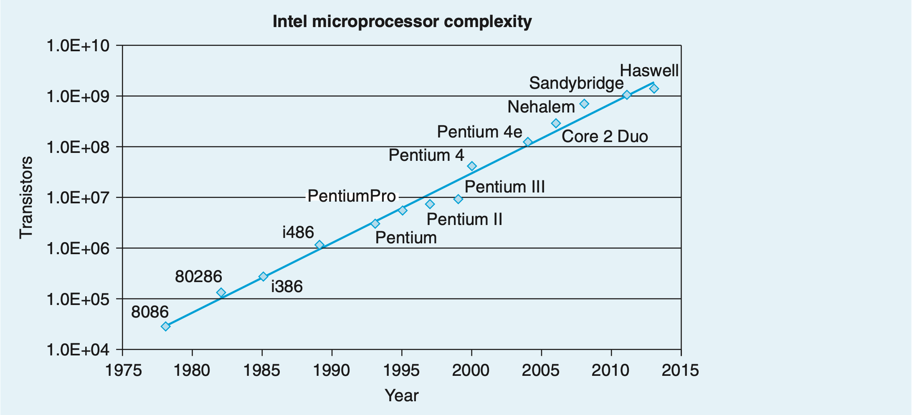</div>

如果我们以不同 Intel 处理器的晶体管数量对引入年份作图，并对 y 轴使用对数刻度，可以看到增长是惊人的。对数据拟合一条直线，我们看到晶体管数量每年增长约 37%，这意味着晶体管数量大约每 26 个月翻一番。这种增长在 x86 微处理器几十年的历史中持续存在。

1965 年，Intel 公司创始人之一 Gordon Moore 从当时的芯片技术（当时可以在单个芯片上制造约 64 个晶体管的电路）进行推断，预测未来 10 年每个芯片上的晶体管数量将每年翻一番。这一预测被称为摩尔定律。事实证明，他的预测略微乐观，但也过于保守。超过 50 年来，半导体行业平均每 18 个月就能使晶体管数量翻一番。

计算机技术的其他方面也出现了类似的指数增长率，包括磁盘和半导体内存的存储容量。这些惊人的增长率是计算机革命的主要驱动力。

SSE2 的引入而过时。尽管我们在 x86-64 程序中看到了 x86 历史演变的痕迹，但 x86 的许多最晦涩的特性并不出现。

## 3.2 程序编码

假设我们将一个 C 程序编写为两个文件 `p1.c` 和 `p2.c`。然后可以使用 Unix 命令行编译此代码：

---

<!-- Page 0198 -->

命令 `gcc` 表示 GCC C 编译器。由于这是 Linux 上的默认编译器，我们也可以简单地用 `cc` 调用它。命令行选项 $-\text{O}g$ 指示编译器应用一种优化级别，生成遵循原始 C 代码整体结构的机器代码。调用更高级别的优化可能会生成经过大量转换的代码，使得生成的机器代码与原始源代码之间的关系难以理解。因此，我们将使用 $-\text{O}g$ 优化作为学习工具，然后看看提高优化级别后会发生什么。在实践中，更高级别的优化（例如用 $-\text{O}1$ 或 $-\text{O}2$ 选项指定）在程序性能方面通常是更好的选择。

`gcc` 命令会调用一整套程序，将源代码转换为可执行代码。首先，C 预处理器展开源代码，包含 `#include` 命令指定的文件，并展开 `#define` 声明指定的宏。其次，编译器生成两个源文件的汇编代码版本，文件名为 `p1.s` 和 `p2.s`。接下来，汇编器将汇编代码转换为二进制目标代码文件 `p1.o` 和 `p2.o`。目标代码是机器代码的一种形式——它包含所有指令的二进制表示，但全局值的地址尚未填入。最后，链接器将这两个目标代码文件与实现库函数（如 `printf`）的代码合并，生成最终的可执行代码文件 `p`（由命令行指令 `-o p` 指定）。可执行代码是我们将要考虑的第二种机器代码形式——它是处理器执行的确切代码形式。这些不同形式的机器代码以及链接过程之间的关系将在第 7 章中详细描述。

### 3.2.1 机器级代码

如 1.9.3 节所述，计算机系统采用了几种不同形式的抽象，通过使用更简单的抽象模型来隐藏实现细节。其中两种对机器级编程特别重要。首先，机器级程序的格式和行为由指令集体系结构（ISA）定义，它规定了处理器状态、指令的格式，以及每条指令对状态的影响。大多数 ISA（包括 x86-64）将程序的行为描述为好像每条指令依次执行，一条指令完成后下一条才开始。处理器硬件要复杂得多，会并发执行许多指令，但它采用了保障措施，以确保总体行为与 ISA 规定的顺序操作相匹配。其次，机器级程序使用的内存地址是虚拟地址，提供了一种

---

<!-- Page 0199 -->

看起来像是一个非常大的字节数组的内存模型。内存系统的实际实现涉及多个硬件内存和操作系统软件的组合，如第 9 章所述。

编译器在整个编译序列中承担了大部分工作，将用 C 提供的相对抽象的执行模型表达的程序转换为处理器执行的非常基本的指令。汇编代码表示与机器代码非常接近。其主要特点是，与机器代码的二进制格式相比，它是一种更具可读性的文本格式。能够理解汇编代码以及它与原始 C 代码的关系，是理解计算机如何执行程序的关键步骤。

x86-64 的机器代码与原始 C 代码差异很大。处理器状态的某些部分对 C 程序员通常是隐藏的，但在机器代码中是可见的：

- **程序计数器**（通常称为 PC，在 x86-64 中称为 `%rip`）指示内存中下一条要执行的指令的地址。

- **整数寄存器文件**包含 16 个命名位置，存储 64 位值。这些寄存器可以保存地址（对应于 C 的指针）或整数数据。某些寄存器用于跟踪程序状态的关键部分，而其他寄存器用于保存临时数据，例如过程的参数和局部变量，以及函数要返回的值。

- **条件码寄存器**保存最近执行的算术或逻辑指令的状态信息。这些用于实现控制或数据流中的条件变化，例如实现 `if` 和 `while` 语句所需的变化。

- **一组向量寄存器**，每个可以保存一个或多个整数或浮点值。

C 提供了一种模型，其中可以声明和分配不同数据类型的对象到内存中，而机器代码将内存视为一个简单的大型字节可寻址数组。C 中的聚合数据类型（如数组和结构体）在机器代码中被表示为连续的字节集合。即使对于标量数据类型，汇编代码也不区分有符号整数和无符号整数、不同类型的指针，甚至不区分指针和整数。

程序内存包含程序的可执行机器代码、操作系统所需的一些信息、用于管理过程调用和返回的运行时栈，以及用户分配的内存块（例如通过使用 `malloc` 库函数）。如前所述，程序内存使用虚拟地址进行寻址。在任何给定时刻，只有有限范围的虚拟地址被认为是有效的。例如，x86-64 虚拟地址由 64 位字表示。在这些机器的当前实现中，高 16 位必须设置为零，因此一个地址可以潜在地指定 $2^{48}$（即 64 太字节）范围内的一个字节。更典型的程序只能访问几兆字节，或者最多几吉字节。操作系统

---

<!-- Page 0200 -->

>**旁注 生成代码不断变化的形式**
>
>在我们的讲述中，我们将展示特定版本的 GCC 使用特定命令行选项设置生成的代码。如果你在自己的机器上编译代码，很可能使用的是不同的编译器或不同版本的 GCC，因此会生成不同的代码。支持 GCC 的开源社区不断更改代码生成器，试图根据微处理器制造商提供的不断变化的代码指南生成更高效的代码。
>
>我们研究讲述中所示示例的目标是演示如何检查汇编代码并将其映射回高级编程语言中的构件。你需要将这些技术适应于你特定编译器生成的代码风格。

管理这个虚拟地址空间，将虚拟地址转换为实际处理器内存中值的物理地址。

单条机器指令只执行非常基本的操作。例如，它可能将存储在寄存器中的两个数字相加、在内存和寄存器之间传输数据，或有条件地跳转到新的指令地址。编译器必须生成这样的指令序列来实现程序构件，如算术表达式求值、循环或过程调用和返回。

### 3.2.2 代码示例

假设我们编写了一个 C 代码文件 `mstore.c`，其中包含以下函数定义：

```c
long mult2(long, long);

void multstore(long x, long y, long *dest) {
    long t = mult2(x, y);
    *dest = t;
}
```

要查看 C 编译器生成的汇编代码，可以在命令行中使用 `-S` 选项：

```
linux> gcc -Og -S mstore.c
```

这将使 GCC 运行编译器，生成汇编文件 `mstore.s`，然后停止。（通常它会接着调用汇编器生成目标代码文件。）

汇编代码文件包含各种声明，包括以下几行：

```asm
multstore:
    pushq   %rbx
```

---

<!-- Page 0201 -->

>**旁注 如何显示程序的字节表示？**
>
>要显示程序（比如 `mstore`）的二进制目标代码，我们使用反汇编器（下面将描述）来确定该过程的代码长度为 14 字节。然后在文件 `mstore.o` 上运行 GNU 调试工具 GDB，输入命令：
>
>```
>(gdb) x/14xb multstore
>```
>
>告诉它显示（缩写为"x"）14 个十六进制格式（也是"x"）字节（"b"），从函数 `multstore` 所在地址开始。你会发现 GDB 有许多用于分析机器级程序的有用功能，这将在 3.10.2 节中讨论。

```asm
movq     %rdx, %rbx
call     mult2
movq     %rax, (%rbx)
popq     %rbx
ret
```

代码中每个缩进行对应一条机器指令。例如，`pushq` 指令表示寄存器 `%rbx` 的内容应被压入程序栈。所有关于局部变量名或数据类型的信息都已被剥除。

如果使用 `-c` 命令行选项，`gcc` 将同时编译和汇编代码：

```
linux> gcc -Og -c mstore.c
```

这将生成一个二进制格式的目标代码文件 `mstore.o`，因此无法直接查看。在 `mstore.o` 文件的 1,368 字节中嵌入了一个 14 字节的序列，其十六进制表示为：

```
53 48 89 d3 e8 00 00 00 00 48 89 03 5b c3
```

这是与前面列出的汇编指令对应的目标代码。从中可以学到一个重要道理：机器执行的程序只是编码一系列指令的字节序列。机器对于生成这些指令的源代码几乎没有任何信息。

要检查机器代码文件的内容，一类称为反汇编器的程序非常有价值。这些程序从机器代码生成类似汇编代码的格式。在 Linux 系统上，程序 OBJDUMP（"object dump"的缩写）可以使用 `-d` 命令行标志来发挥这一作用：

```
linux> objdump -d mstore.o
```

结果（我们在左边添加了行号，并在斜体文本中添加了注释）如下：

---

<!-- Page 0202 -->

```
Disassembly of function sum in binary file store.o
0000000000000000 <multstore>:
Offset Bytes Equivalent assembly language
   0:  53              push   %rbx
   1:  48 89 d3        mov    %rdx,%rbx
   4:  e8 00 00 00 00  callq  9 <multstore+0x9>
   9:  48 89 03        mov    %rax,(%rbx)
   c:  5b              pop    %rbx
   d:  c3              retq
```

左边我们看到 14 个十六进制字节值，按之前显示的字节序列排列，分成 1 到 5 个字节的组。每组是单条指令，右边显示了对应的汇编语言等价表示。

关于机器代码及其反汇编表示，有几点值得注意：

- x86-64 指令的长度可以从 1 到 15 字节不等。指令编码的设计使得常用指令和操作数较少的指令比不常用指令或操作数较多的指令所需字节数更少。

- 指令格式的设计使得从给定的起始位置开始，字节序列到机器指令的解码是唯一的。例如，只有指令 `pushq %rbx` 可以以字节值 53 开头。

- 反汇编器完全根据机器代码文件中的字节序列来确定汇编代码。它不需要访问程序的源代码或汇编代码版本。

- 反汇编器使用的指令命名约定与 GCC 生成的汇编代码略有不同。在我们的示例中，它省略了许多指令的后缀"q"。这些后缀是大小指示符，在大多数情况下可以省略。相反，反汇编器在 `call` 和 `ret` 指令中添加了后缀"q"。同样，这些后缀可以安全地省略。

生成实际可执行代码需要对一组目标代码文件运行链接器，其中一个文件必须包含 `main` 函数。假设在文件 `main.c` 中有以下函数：

```c
#include <stdio.h>

void multstore(long, long, long *);

int main() {
    long d;
    multstore(2, 3, &d);
    printf("2 * 3 --> %ld\n", d);
    return 0;
}
```

---

<!-- Page 0203 -->

```c
long s = a * b;
return s;
}
```

然后可以按如下方式生成可执行程序 `prog`：

```
linux> gcc -Og -o prog main.c mstore.c
```

文件 `prog` 增长到了 8,655 字节，因为它不仅包含我们提供的过程的机器代码，还包含用于启动和终止程序以及与操作系统交互的代码。

我们可以对文件 `prog` 进行反汇编：

```
linux> objdump -d prog
```

反汇编器将提取各种代码序列，包括以下内容：

```
Disassembly of function sum in binary file prog
1 0000000000400540 <multstore>:
2  400540:  53              push   %rbx
3  400541:  48 89 d3        mov    %rdx,%rbx
4  400544:  e8 42 00 00 00  callq  40058b <mult2>
5  400549:  48 89 03        mov    %rax,(%rbx)
6  40054c:  5b              pop    %rbx
7  40054d:  c3              retq
8  40054e:  90              nop
9  40054f:  90              nop
```

这段代码与对 `mstore.c` 进行反汇编所生成的代码几乎相同。一个重要区别是左侧列出的地址不同——链接器将此代码的位置移到了不同的地址范围。第二个区别是链接器已填入了 `callq` 指令在调用函数 `mult2` 时应使用的地址（反汇编的第 4 行）。链接器的一个任务就是将函数调用与这些函数的可执行代码位置匹配起来。最后一个区别是我们看到了两行额外的代码（第 8-9 行）。这些指令对程序没有任何影响，因为它们出现在返回指令（第 7 行）之后。插入它们是为了将函数代码增长到 16 字节，从内存系统性能角度来看，这样可以更好地放置下一个代码块。

### 3.2.3 格式说明

GCC 生成的汇编代码对人类来说难以阅读。一方面，它包含我们不需要关注的信息；另一方面，它不提供任何关于程序或其工作原理的描述。例如，假设我们输入以下命令：

---

<!-- Page 0204 -->

```asm
.file   "010-mstore.c"
.text
.globl  multstore
.type   multstore, @function
multstore:
    pushq   %rbx
    movq    %rdx, %rbx
    call    mult2
    movq    %rax, (%rbx)
    popq    %rbx
    ret
    .size   multstore,.multstore
    .ident  "GCC: (Ubuntu 4.8.1-2ubuntu1~12.04) 4.8.1"
    .section .note.GNU-stack,"",@progbits
```

所有以"`.`"开头的行都是指导汇编器和链接器的指令（directive）。我们通常可以忽略这些。另一方面，没有任何注释说明指令的作用或它们与源代码的关系。

为了提供更清晰的汇编代码表示，我们将以一种省略大多数指令、但包含行号和说明性注释的形式来展示它。对于我们的示例，带注释的版本如下所示：

```asm
void multstore(long x, long y, long *dest)
x in %rdi, y in %rsi, dest in %rdx

1 multstore:
2   pushq   %rbx        Save %rbx
3   movq    %rdx, %rbx  Copy dest to %rbx
4   call    mult2       Call mult2(x, y)
5   movq    %rax, (%rbx) Store result at *dest
6   popq    %rbx        Restore %rbx
7   ret                 Return
```

我们通常只展示与所讨论内容相关的代码行。每行在左边有编号以供引用，右边有简短描述，说明指令的作用以及它与原始 C 代码计算的关系。这是汇编语言程序员格式化代码方式的一种风格化版本。

我们还提供网络补充内容，涵盖为专注于机器语言爱好者准备的材料。一个网络补充内容描述 IA32 机器代码。有了 x86-64 的背景知识，学习 IA32 相当简单。另一个网络补充内容简要介绍了将汇编代码嵌入 C 程序的方法。对于某些应用，程序员必须降至汇编代码层次来访问机器的底层特性。一种方法是用汇编代码编写整个函数，并在链接阶段将其与 C 函数合并。

---

<!-- Page 0205 -->

>**旁注 ATT 与 Intel 汇编代码格式**
>
>在我们的讲述中，我们使用 ATT 格式（以多年来运营贝尔实验室的公司 AT&T 命名）来展示汇编代码，这是 GCC、OBJDUMP 以及我们将考虑的其他工具的默认格式。其他编程工具，包括来自 Microsoft 的工具以及 Intel 的文档，以 Intel 格式显示汇编代码。这两种格式在很多方面有所不同。例如，GCC 可以使用以下命令行为 `sum` 函数生成 Intel 格式的代码：
>
>```
>linux> gcc -Og -S -masm=intel mstore.c
>```
>
>这给出以下汇编代码：
>
>```asm
>multstore:
>    push    rbx
>    mov     rbx, rdx
>    call    mult2
>    mov     QWORD PTR [rbx], rax
>    pop     rbx
>    ret
>```
>
>我们看到 Intel 和 ATT 格式在以下方面有所不同：
>
>- Intel 代码省略了大小指示后缀。我们看到的是 `push` 和 `mov` 而不是 `pushq` 和 `movq`。
>- Intel 代码在寄存器名前省略了"%"字符，使用 `rbx` 而不是 `%rbx`。
>- Intel 代码有不同的方式描述内存位置——例如，用 `QWORD PTR [rbx]` 而不是 `(%rbx)`。
>- 具有多个操作数的指令以相反的顺序列出它们。在两种格式之间切换时，这可能非常令人困惑。
>
>虽然我们不会在讲述中使用 Intel 格式，但你会在 Intel 和 Microsoft 的文档中遇到它。

另一种方法是使用 GCC 对在 C 程序中直接嵌入汇编代码的支持。

## 3.3 数据格式

由于其起源是 16 位架构，后来扩展为 32 位，Intel 使用"字（word）"来指代 16 位数据类型。基于此，他们将 32 位量称为"双字（double word）"，将 64 位量称为"四字（quad word）"。图 3.1 显示了用于 C 基本数据类型的 x86-64 表示。标准 `int` 值以双字（32 位）存储。指针（此处显示为 `char *`）以 8 字节四字存储，这是 64 位机器的预期结果。在 x86-64 中，数据类型 `long` 以 64 位实现，允许非常大的值范围。本章中我们的大多数代码示例使用指针和 `long` 数据

---

<!-- Page 0206 -->

>**旁注 Web 补充内容 ASM:EASM 将汇编代码与 C 程序结合**
>
>虽然 C 编译器在将程序中的计算转换为机器代码方面做得很好，但有些机器特性无法通过 C 程序访问。例如，每当 x86-64 处理器执行算术或逻辑操作时，它会设置一个 1 位的条件码标志，称为 PF（"奇偶标志"），当结果计算的低 8 位中有偶数个 1 时设置为 1，否则设置为 0。用 C 计算这个信息需要至少七次移位、掩码和异或操作（见问题 2.65）。即使硬件在每次算术或逻辑操作中都执行此计算，C 程序也没有办法确定 PF 条件码标志的值。这个任务可以通过在程序中加入少量汇编代码指令来轻松完成。
>
>将汇编代码嵌入 C 程序有两种方式。首先，可以将整个函数作为单独的汇编代码文件编写，让汇编器和链接器将其与 C 代码合并。其次，可以使用 GCC 的内联汇编功能，使用 `ASM` 指令将简短的汇编代码段嵌入 C 程序。这种方法的优点是能最大限度地减少机器特定代码的数量。
>
>当然，在 C 程序中包含汇编代码会使代码特定于某一类机器（如 x86-64），因此只有在所需功能只能以这种方式访问时才应使用。

<table border=1 style='margin: auto; word-wrap: break-word;'><tr><td style='text-align: center; word-wrap: break-word;'>C declaration</td><td style='text-align: center; word-wrap: break-word;'>Intel data type</td><td style='text-align: center; word-wrap: break-word;'>Assembly-code suffix</td><td style='text-align: center; word-wrap: break-word;'>Size (bytes)</td></tr><tr><td style='text-align: center; word-wrap: break-word;'>char</td><td style='text-align: center; word-wrap: break-word;'>Byte</td><td style='text-align: center; word-wrap: break-word;'>b</td><td style='text-align: center; word-wrap: break-word;'>1</td></tr><tr><td style='text-align: center; word-wrap: break-word;'>short</td><td style='text-align: center; word-wrap: break-word;'>Word</td><td style='text-align: center; word-wrap: break-word;'>w</td><td style='text-align: center; word-wrap: break-word;'>2</td></tr><tr><td style='text-align: center; word-wrap: break-word;'>int</td><td style='text-align: center; word-wrap: break-word;'>Double word</td><td style='text-align: center; word-wrap: break-word;'>l</td><td style='text-align: center; word-wrap: break-word;'>4</td></tr><tr><td style='text-align: center; word-wrap: break-word;'>long</td><td style='text-align: center; word-wrap: break-word;'>Quad word</td><td style='text-align: center; word-wrap: break-word;'>q</td><td style='text-align: center; word-wrap: break-word;'>8</td></tr><tr><td style='text-align: center; word-wrap: break-word;'>char *</td><td style='text-align: center; word-wrap: break-word;'>Quad word</td><td style='text-align: center; word-wrap: break-word;'>q</td><td style='text-align: center; word-wrap: break-word;'>8</td></tr><tr><td style='text-align: center; word-wrap: break-word;'>float</td><td style='text-align: center; word-wrap: break-word;'>Single precision</td><td style='text-align: center; word-wrap: break-word;'>s</td><td style='text-align: center; word-wrap: break-word;'>4</td></tr><tr><td style='text-align: center; word-wrap: break-word;'>double</td><td style='text-align: center; word-wrap: break-word;'>Double precision</td><td style='text-align: center; word-wrap: break-word;'>l</td><td style='text-align: center; word-wrap: break-word;'>8</td></tr></table>

<div style="text-align: center;">图 3.1 x86-64 中 C 数据类型的大小。在 64 位机器上，指针长度为 8 字节。</div>

类型，因此它们将操作四字。x86-64 指令集也包含了对字节、字和双字的完整指令集。

浮点数有两种主要格式：单精度（4 字节）值，对应于 C 数据类型 `float`；双精度（8 字节）值，对应于 C 数据类型 `double`。x86 系列的微处理器历史上使用特殊的 80 位（10 字节）浮点格式实现所有浮点操作（见问题 2.86）。这种格式可以在 C 程序中使用 `long double` 声明来指定。然而，我们建议不要使用这种格式。它不能移植到其他类型的机器，而且通常

---

<!-- Page 0207 -->

没有像单精度和双精度算术那样的高性能硬件实现。

如图 3.1 的表所示，GCC 生成的大多数汇编代码指令都有一个单字符后缀，表示操作数的大小。例如，数据移动指令有四种变体：`movb`（移动字节）、`movw`（移动字）、`movl`（移动双字）和 `movq`（移动四字）。后缀"l"用于双字，因为 32 位量被认为是"长字"。汇编代码使用后缀"l"来表示 4 字节整数以及 8 字节双精度浮点数。这不会引起歧义，因为浮点代码涉及完全不同的指令集和寄存器集。

## 3.4 访问信息

x86-64 中央处理单元（CPU）包含一组 16 个通用寄存器，存储 64 位值。这些寄存器用于存储整数数据以及指针。图 3.2 展示了这 16 个寄存器的示意图。它们的名称都以 `%r` 开头，但由于指令集的历史演变，遵循了多种不同的命名约定。原始 8086 有 8 个 16 位寄存器，在图 3.2 中显示为 `%ax` 到 `%bp`。每个寄存器都有特定用途，因此被赋予了反映其使用方式的名称。在扩展为 IA32 时，这些寄存器被扩展为 32 位寄存器，标记为 `%eax` 到 `%ebp`。在扩展到 x86-64 时，原来的 8 个寄存器被扩展为 64 位，标记为 `%rax` 到 `%rbp`。此外，还增加了 8 个新寄存器，按新的命名约定标记：`%r8` 到 `%r15`。

如图 3.2 中嵌套框所示，指令可以对存储在 16 个寄存器低位字节中的不同大小的数据进行操作。字节级操作可以访问最低有效字节，16 位操作可以访问最低有效的 2 字节，32 位操作可以访问最低有效的 4 字节，64 位操作可以访问整个寄存器。

在后续章节中，我们将介绍一些用于复制和生成 1、2、4 和 8 字节值的指令。当这些指令以寄存器为目标时，对于生成不足 8 字节的指令，对于寄存器中剩余字节的处理有两种约定：生成 1 或 2 字节量的指令保持剩余字节不变；生成 4 字节量的指令将寄存器的高 4 字节设为零。后一种约定是在从 IA32 扩展到 x86-64 时采用的。

如图 3.2 右侧的注释所示，不同寄存器在典型程序中扮演不同角色。其中最独特的是栈指针 `%rsp`，用于指示运行时栈的末端位置。某些指令专门读写此寄存器。其他 15 个寄存器在使用上更灵活。少数指令对特定寄存器有专门用途。更重要的是，一套标准编程约定规定了如何使用寄存器来管理栈、传递函数

---

<!-- Page 0208 -->

<div style="text-align: center;">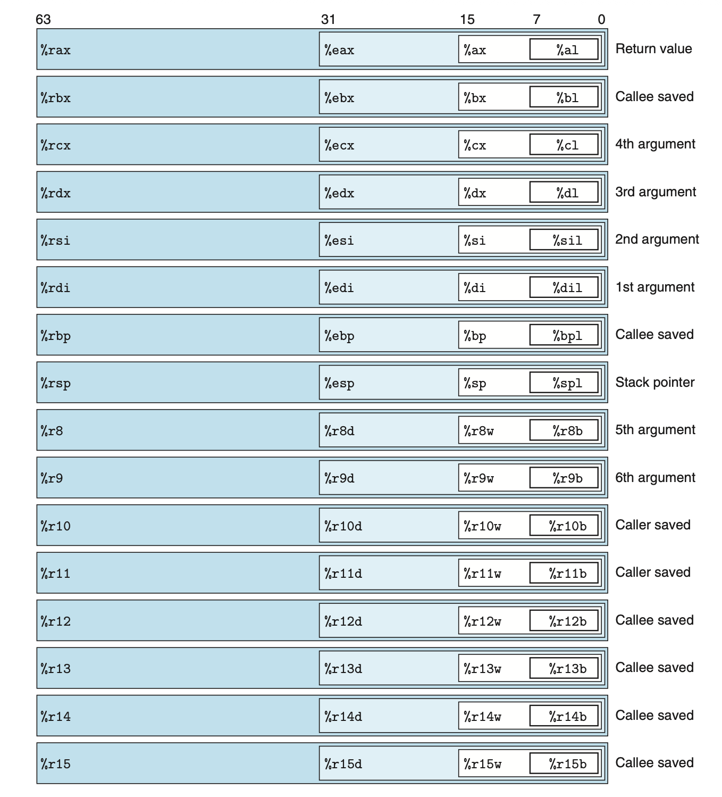</div>

<div style="text-align: center;">图 3.2 整数寄存器。所有 16 个寄存器的低位部分可以作为字节、字（16 位）、双字（32 位）和四字（64 位）量访问。</div>

参数、从函数返回值以及存储局部和临时数据。我们将在讲述中涵盖这些约定，尤其是在 3.7 节中，我们将描述过程的实现。

### 3.4.1 操作数指示符

大多数指令有一个或多个操作数，指定执行操作时要使用的源值以及放置

---

<!-- Page 0209 -->

<table border=1 style='margin: auto; word-wrap: break-word;'><tr><td style='text-align: center; word-wrap: break-word;'>Type</td><td style='text-align: center; word-wrap: break-word;'>Form</td><td style='text-align: center; word-wrap: break-word;'>Operand value</td><td style='text-align: center; word-wrap: break-word;'>Name</td></tr><tr><td style='text-align: center; word-wrap: break-word;'>Immediate</td><td style='text-align: center; word-wrap: break-word;'>Imm</td><td style='text-align: center; word-wrap: break-word;'>Imm</td><td style='text-align: center; word-wrap: break-word;'>Immediate</td></tr><tr><td style='text-align: center; word-wrap: break-word;'>Register</td><td style='text-align: center; word-wrap: break-word;'>$ r_{a} $</td><td style='text-align: center; word-wrap: break-word;'>$ R[r_{a}] $</td><td style='text-align: center; word-wrap: break-word;'>Register</td></tr><tr><td style='text-align: center; word-wrap: break-word;'>Memory</td><td style='text-align: center; word-wrap: break-word;'>$ Imm $</td><td style='text-align: center; word-wrap: break-word;'>$ M[Imm] $</td><td style='text-align: center; word-wrap: break-word;'>Absolute</td></tr><tr><td style='text-align: center; word-wrap: break-word;'>Memory</td><td style='text-align: center; word-wrap: break-word;'>$ (r_{a}) $</td><td style='text-align: center; word-wrap: break-word;'>$ M[R[r_{a}]] $</td><td style='text-align: center; word-wrap: break-word;'>Indirect</td></tr><tr><td style='text-align: center; word-wrap: break-word;'>Memory</td><td style='text-align: center; word-wrap: break-word;'>$ Imm(r_{b}) $</td><td style='text-align: center; word-wrap: break-word;'>$ M[Imm + R[r_{b}]] $</td><td style='text-align: center; word-wrap: break-word;'>Base + displacement</td></tr><tr><td style='text-align: center; word-wrap: break-word;'>Memory</td><td style='text-align: center; word-wrap: break-word;'>$ (r_{b}, r_{i}) $</td><td style='text-align: center; word-wrap: break-word;'>$ M[R[r_{b}] + R[r_{i}]] $</td><td style='text-align: center; word-wrap: break-word;'>Indexed</td></tr><tr><td style='text-align: center; word-wrap: break-word;'>Memory</td><td style='text-align: center; word-wrap: break-word;'>$ Imm(r_{b}, r_{i}) $</td><td style='text-align: center; word-wrap: break-word;'>$ M[Imm + R[r_{b}] + R[r_{i}]] $</td><td style='text-align: center; word-wrap: break-word;'>Indexed</td></tr><tr><td style='text-align: center; word-wrap: break-word;'>Memory</td><td style='text-align: center; word-wrap: break-word;'>$ (r_{i}, s) $</td><td style='text-align: center; word-wrap: break-word;'>$ M[R[r_{i}] \cdot s] $</td><td style='text-align: center; word-wrap: break-word;'>Scaled indexed</td></tr><tr><td style='text-align: center; word-wrap: break-word;'>Memory</td><td style='text-align: center; word-wrap: break-word;'>$ Imm(r_{i}, s) $</td><td style='text-align: center; word-wrap: break-word;'>$ M[Imm + R[r_{i}] \cdot s] $</td><td style='text-align: center; word-wrap: break-word;'>Scaled indexed</td></tr><tr><td style='text-align: center; word-wrap: break-word;'>Memory</td><td style='text-align: center; word-wrap: break-word;'>$ (r_{b}, r_{i}, s) $</td><td style='text-align: center; word-wrap: break-word;'>$ M[R[r_{b}] + R[r_{i}] \cdot s] $</td><td style='text-align: center; word-wrap: break-word;'>Scaled indexed</td></tr><tr><td style='text-align: center; word-wrap: break-word;'>Memory</td><td style='text-align: center; word-wrap: break-word;'>$ Imm(r_{b}, r_{i}, s) $</td><td style='text-align: center; word-wrap: break-word;'>$ M[Imm + R[r_{b}] + R[r_{i}] \cdot s] $</td><td style='text-align: center; word-wrap: break-word;'>Scaled indexed</td></tr></table>

<div style="text-align: center;">图 3.3 操作数形式。操作数可以表示立即数（常数）值、寄存器值或内存中的值。缩放因子 $s$ 必须是 1、2、4 或 8 之一。</div>

结果的目标位置。x86-64 支持多种操作数形式（见图 3.3）。源值可以作为常数给出，或从寄存器或内存读取。结果可以存储在寄存器或内存中。因此，不同的操作数可能性可以分为三种类型。第一种类型是**立即数（immediate）**，用于常数值。在 ATT 格式的汇编代码中，这些以"$"后跟使用标准 C 表示法的整数来书写——例如，`$-577` 或 `$0x1F`。不同的指令允许不同范围的立即数值；汇编器会自动选择最紧凑的值编码方式。第二种类型是**寄存器（register）**，表示寄存器的内容，即 16 个寄存器的低位 8 字节、4 字节、2 字节或 1 字节部分之一，分别对应 64、32、16 或 8 位的操作数。在图 3.3 中，我们使用符号 $r_a$ 来表示任意寄存器 $a$，并用引用 $R[r_a]$ 来表示其值，将寄存器集视为以寄存器标识符为索引的数组 $R$。

第三种操作数类型是**内存引用**，我们根据计算出的地址访问某个内存位置，这个地址通常称为有效地址。由于我们将内存视为一个大型字节数组，我们使用符号 $M_b[\text{Addr}]$ 来表示对从地址 Addr 开始存储在内存中的 $b$ 字节值的引用。为简便起见，我们通常省略下标 $b$。

如图 3.3 所示，有许多不同的寻址模式允许不同形式的内存引用。最通用的形式如表底部所示，语法为 $\text{Imm}(r_b, r_i, s)$。这种引用有四个分量：立即数偏移量 $\text{Imm}$、基址寄存器 $r_b$、变址寄存器 $r_i$ 和缩放因子 $s$，其中 $s$ 必须是 1、2、4 或 8。基址寄存器和变址寄存器都必须是 64 位寄存器。有效地址计算为 $\text{Imm} + R[r_b] + R[r_i] \cdot s$。这种通用形式在引用数组元素时经常见到。其他形式只是省略了某些分量的特殊情况。正如我们

---

<!-- Page 0210 -->

将看到的，更复杂的寻址模式在引用数组和结构体元素时非常有用。

**练习题 3.1（答案见第 361 页）**

假设以下值存储在所示的内存地址和寄存器中：

<table border=1 style='margin: auto; word-wrap: break-word;'><tr><td style='text-align: center; word-wrap: break-word;'>Address</td><td style='text-align: center; word-wrap: break-word;'>Value</td><td style='text-align: center; word-wrap: break-word;'>Register</td><td style='text-align: center; word-wrap: break-word;'>Value</td></tr><tr><td style='text-align: center; word-wrap: break-word;'>0x100</td><td style='text-align: center; word-wrap: break-word;'>0xFF</td><td style='text-align: center; word-wrap: break-word;'>%rax</td><td style='text-align: center; word-wrap: break-word;'>0x100</td></tr><tr><td style='text-align: center; word-wrap: break-word;'>0x104</td><td style='text-align: center; word-wrap: break-word;'>0xAB</td><td style='text-align: center; word-wrap: break-word;'>%rcx</td><td style='text-align: center; word-wrap: break-word;'>0x1</td></tr><tr><td style='text-align: center; word-wrap: break-word;'>0x108</td><td style='text-align: center; word-wrap: break-word;'>0x13</td><td style='text-align: center; word-wrap: break-word;'>%rdx</td><td style='text-align: center; word-wrap: break-word;'>0x3</td></tr><tr><td style='text-align: center; word-wrap: break-word;'>0x10C</td><td style='text-align: center; word-wrap: break-word;'>0x11</td><td style='text-align: center; word-wrap: break-word;'></td><td style='text-align: center; word-wrap: break-word;'></td></tr></table>

填写下表，给出所示操作数的值：

<table border=1 style='margin: auto; word-wrap: break-word;'><tr><td style='text-align: center; word-wrap: break-word;'>Operand</td><td style='text-align: center; word-wrap: break-word;'>Value</td></tr><tr><td style='text-align: center; word-wrap: break-word;'>%rax</td><td style='text-align: center; word-wrap: break-word;'></td></tr><tr><td style='text-align: center; word-wrap: break-word;'>0x104</td><td style='text-align: center; word-wrap: break-word;'></td></tr><tr><td style='text-align: center; word-wrap: break-word;'>$0x108</td><td style='text-align: center; word-wrap: break-word;'></td></tr><tr><td style='text-align: center; word-wrap: break-word;'>(%rax)</td><td style='text-align: center; word-wrap: break-word;'></td></tr><tr><td style='text-align: center; word-wrap: break-word;'>4(%rax)</td><td style='text-align: center; word-wrap: break-word;'></td></tr><tr><td style='text-align: center; word-wrap: break-word;'>9(%rax,%rdx)</td><td style='text-align: center; word-wrap: break-word;'></td></tr><tr><td style='text-align: center; word-wrap: break-word;'>260(%rcx,%rdx)</td><td style='text-align: center; word-wrap: break-word;'></td></tr><tr><td style='text-align: center; word-wrap: break-word;'>0xFC(,%rcx,4)</td><td style='text-align: center; word-wrap: break-word;'></td></tr><tr><td style='text-align: center; word-wrap: break-word;'>(%rax,%rdx,4)</td><td style='text-align: center; word-wrap: break-word;'></td></tr></table>

### 3.4.2 数据移动指令

最常用的指令之一是将数据从一个位置复制到另一个位置的指令。操作数符号的通用性使得简单的数据移动指令能够表达许多机器上需要多条不同指令才能实现的可能性。我们将介绍许多不同的数据移动指令，它们在源和目标类型、执行的转换以及可能产生的其他副作用方面有所不同。在我们的讲述中，我们将许多不同的指令归入指令类，其中同一类中的指令执行相同的操作，但操作数大小不同。

图 3.4 列出了最简单形式的数据移动指令——`mov` 类。这些指令将数据从源位置复制到目标位置，不做任何转换。该类包含四条指令：`movb`、`movw`、`movl` 和 `movq`。这四条指令效果相似；它们的主要区别在于分别操作 1、2、4 和 8 字节大小的数据。

---

<!-- Page 0211 -->

<table border=1 style='margin: auto; word-wrap: break-word;'><tr><td colspan="2">Instruction</td><td colspan="2">Effect</td><td style='text-align: center; word-wrap: break-word;'>Description</td></tr><tr><td style='text-align: center; word-wrap: break-word;'>MOV</td><td style='text-align: center; word-wrap: break-word;'>S, D</td><td style='text-align: center; word-wrap: break-word;'>D</td><td style='text-align: center; word-wrap: break-word;'>$ \leftarrow $</td><td style='text-align: center; word-wrap: break-word;'>Move</td></tr><tr><td style='text-align: center; word-wrap: break-word;'>movb</td><td style='text-align: center; word-wrap: break-word;'></td><td style='text-align: center; word-wrap: break-word;'></td><td style='text-align: center; word-wrap: break-word;'></td><td style='text-align: center; word-wrap: break-word;'>Move byte</td></tr><tr><td style='text-align: center; word-wrap: break-word;'>movw</td><td style='text-align: center; word-wrap: break-word;'></td><td style='text-align: center; word-wrap: break-word;'></td><td style='text-align: center; word-wrap: break-word;'></td><td style='text-align: center; word-wrap: break-word;'>Move word</td></tr><tr><td style='text-align: center; word-wrap: break-word;'>movl</td><td style='text-align: center; word-wrap: break-word;'></td><td style='text-align: center; word-wrap: break-word;'></td><td style='text-align: center; word-wrap: break-word;'></td><td style='text-align: center; word-wrap: break-word;'>Move double word</td></tr><tr><td style='text-align: center; word-wrap: break-word;'>movq</td><td style='text-align: center; word-wrap: break-word;'></td><td style='text-align: center; word-wrap: break-word;'></td><td style='text-align: center; word-wrap: break-word;'></td><td style='text-align: center; word-wrap: break-word;'>Move quad word</td></tr><tr><td style='text-align: center; word-wrap: break-word;'>movabsq</td><td style='text-align: center; word-wrap: break-word;'>I, R</td><td style='text-align: center; word-wrap: break-word;'>R</td><td style='text-align: center; word-wrap: break-word;'>$ \leftarrow $</td><td style='text-align: center; word-wrap: break-word;'>Move absolute quad word</td></tr></table>

<div style="text-align: center;">图 3.4 简单数据移动指令。</div>

源操作数指定一个值，该值为立即数、存储在寄存器中或存储在内存中。目标操作数指定一个位置，该位置为寄存器或内存地址。x86-64 规定移动指令不能两个操作数同时引用内存位置。将值从一个内存位置复制到另一个内存位置需要两条指令——第一条将源值加载到寄存器，第二条将此寄存器值写入目标位置。参考图 3.2，这些指令的寄存器操作数可以是 16 个寄存器中任何一个的标记部分，其中寄存器的大小必须与指令最后一个字符（"b"、"w"、"l"或"q"）所指定的大小相匹配。大多数情况下，`mov` 指令只会更新目标操作数所指定的特定寄存器字节或内存位置。唯一的例外是，当 `movl` 以寄存器为目标时，它还会将寄存器的高位 4 字节设置为 0。这一例外来自 x86-64 中采用的约定：任何为寄存器生成 32 位值的指令同时也会将寄存器的高位部分设置为 0。

以下 `mov` 指令示例展示了源和目标类型的五种可能组合。回想一下，源操作数在前，目标操作数在后：

```asm
movl  $0x4050, %eax      立即数 → 寄存器，4 字节
movw  %bp, %sp           寄存器 → 寄存器，2 字节
movb  (%rdi,%rcx), %al  内存 → 寄存器，1 字节
movb  $-17, (%esp)       立即数 → 内存，1 字节
movq  %rax, -12(%rbp)   寄存器 → 内存，8 字节
```

图 3.4 中最后一条记录的指令用于处理 64 位立即数数据。常规 `movq` 指令只能有可以表示为 32 位补码数的立即数源操作数，该值随后被符号扩展以产生目标的 64 位值。`movabsq` 指令可以有任意 64 位立即数值作为其源操作数，但只能以寄存器为目标。

图 3.5 和图 3.6 记录了两类数据移动指令，用于将较小的源值复制到较大的目标中。所有这些指令都从源（可以是寄存器或存储在

---

<!-- Page 0212 -->

>**旁注 理解数据移动如何改变目标寄存器**
>
>如前所述，关于数据移动指令是否以及如何修改目标寄存器的高位字节，存在两种不同的约定。以下代码序列说明了这种区别：
>
>```asm
>movabsq $0x0011223344556677, %rax   %rax = 0011223344556677
>movb    $-1, %al                    %rax = 00112233445566FF
>movw    $-1, %ax                    %rax = 001122334455FFFF
>movl    $-1, %eax                   %rax = 00000000FFFFFFFF
>movq    $-1, %rax                   %rax = FFFFFFFFFFFFFFFF
>```
>
>在以下讨论中，我们使用十六进制表示法。在示例中，第 1 行的指令将寄存器 `%rax` 初始化为模式 `0011223344556677`。其余指令都以立即数值 -1 作为源值。回想一下，-1 的十六进制表示形式为 `FF...F`，其中 F 的数量是表示中字节数的两倍。因此，`movb` 指令（第 2 行）将 `%rax` 的低位字节设置为 `FF`，而 `movw` 指令（第 3 行）将低位 2 字节设置为 `FFFF`，其余字节保持不变。`movl` 指令（第 4 行）将低位 4 字节设置为 `FFFFFFFF`，但它同时将高位 4 字节设置为 `00000000`。最后，`movq` 指令（第 5 行）将整个寄存器设置为 `FFFFFFFFFFFFFFFF`。

<table border=1 style='margin: auto; word-wrap: break-word;'><tr><td style='text-align: center; word-wrap: break-word;'>Instruction</td><td style='text-align: center; word-wrap: break-word;'>Effect</td><td style='text-align: center; word-wrap: break-word;'>Description</td></tr><tr><td style='text-align: center; word-wrap: break-word;'>MOVZ S, R</td><td style='text-align: center; word-wrap: break-word;'>R ← ZeroExtend(S)</td><td style='text-align: center; word-wrap: break-word;'>Move with zero extension</td></tr><tr><td style='text-align: center; word-wrap: break-word;'>movzbw</td><td style='text-align: center; word-wrap: break-word;'></td><td style='text-align: center; word-wrap: break-word;'>Move zero-extended byte to word</td></tr><tr><td style='text-align: center; word-wrap: break-word;'>movzbl</td><td style='text-align: center; word-wrap: break-word;'></td><td style='text-align: center; word-wrap: break-word;'>Move zero-extended byte to double word</td></tr><tr><td style='text-align: center; word-wrap: break-word;'>movzwl</td><td style='text-align: center; word-wrap: break-word;'></td><td style='text-align: center; word-wrap: break-word;'>Move zero-extended word to double word</td></tr><tr><td style='text-align: center; word-wrap: break-word;'>movzbq</td><td style='text-align: center; word-wrap: break-word;'></td><td style='text-align: center; word-wrap: break-word;'>Move zero-extended byte to quad word</td></tr><tr><td style='text-align: center; word-wrap: break-word;'>movzwq</td><td style='text-align: center; word-wrap: break-word;'></td><td style='text-align: center; word-wrap: break-word;'>Move zero-extended word to quad word</td></tr></table>

<div style="text-align: center;">图 3.5 零扩展数据移动指令。这些指令以寄存器或内存位置为源，以寄存器为目标。</div>

内存中）复制数据到寄存器目标。`movz` 类指令用零填充目标的剩余字节，而 `movs` 类指令通过符号扩展填充这些字节，复制源操作数最高有效位的副本。注意每条指令名的最后两个字符是大小指示符——第一个指定源大小，第二个指定目标大小。可以看到，这两类各有若干指令，覆盖了 1 字节和 2 字节源大小以及 2 字节和 4 字节目标大小的所有情况（当然仅考虑目标大于源的情况）。

---

<!-- Page 0213 -->

<table border=1 style='margin: auto; word-wrap: break-word;'><tr><td style='text-align: center; word-wrap: break-word;'>Instruction</td><td style='text-align: center; word-wrap: break-word;'>Effect</td><td style='text-align: center; word-wrap: break-word;'>Description</td></tr><tr><td style='text-align: center; word-wrap: break-word;'>movs S, R</td><td style='text-align: center; word-wrap: break-word;'>R ← SignExtend(S)</td><td style='text-align: center; word-wrap: break-word;'>Move with sign extension</td></tr><tr><td style='text-align: center; word-wrap: break-word;'>movsbw</td><td style='text-align: center; word-wrap: break-word;'></td><td style='text-align: center; word-wrap: break-word;'>Move sign-extended byte to word</td></tr><tr><td style='text-align: center; word-wrap: break-word;'>movsbl</td><td style='text-align: center; word-wrap: break-word;'></td><td style='text-align: center; word-wrap: break-word;'>Move sign-extended byte to double word</td></tr><tr><td style='text-align: center; word-wrap: break-word;'>movswl</td><td style='text-align: center; word-wrap: break-word;'></td><td style='text-align: center; word-wrap: break-word;'>Move sign-extended word to double word</td></tr><tr><td style='text-align: center; word-wrap: break-word;'>movsbq</td><td style='text-align: center; word-wrap: break-word;'></td><td style='text-align: center; word-wrap: break-word;'>Move sign-extended byte to quad word</td></tr><tr><td style='text-align: center; word-wrap: break-word;'>movswq</td><td style='text-align: center; word-wrap: break-word;'></td><td style='text-align: center; word-wrap: break-word;'>Move sign-extended word to quad word</td></tr><tr><td style='text-align: center; word-wrap: break-word;'>movslq</td><td style='text-align: center; word-wrap: break-word;'></td><td style='text-align: center; word-wrap: break-word;'>Move sign-extended double word to quad word</td></tr><tr><td style='text-align: center; word-wrap: break-word;'>cltq</td><td style='text-align: center; word-wrap: break-word;'>%rax ← SignExtend(%eax)</td><td style='text-align: center; word-wrap: break-word;'>Sign-extend %eax to %rax</td></tr></table>

<div style="text-align: center;">图 3.6 符号扩展数据移动指令。MOVS 指令以寄存器或内存位置为源，以寄存器为目标。cltq 指令专用于寄存器 %eax 和 %rax。</div>

注意图 3.5 中缺少将 4 字节源值零扩展到 8 字节目标的显式指令。这样的指令在逻辑上应命名为 `movzlq`，但这条指令并不存在。相反，这种数据移动可以用以寄存器为目标的 `movl` 指令来实现。这一技术利用了这样一个特性：以寄存器为目标生成 4 字节值的指令会将高位 4 字节清零。否则，对于 64 位目标，所有三种源类型都支持符号扩展移动，两种较小的源类型支持零扩展移动。

图 3.6 还记录了 `cltq` 指令。这条指令没有操作数——它总是使用寄存器 `%eax` 作为源，`%rax` 作为符号扩展结果的目标。因此，它与指令 `movslq %eax, %rax` 的效果完全相同，但具有更紧凑的编码。

**练习题 3.2（答案见第 361 页）**

对于以下每行汇编语言，根据操作数确定合适的指令后缀。（例如，`mov` 可以重写为 `movb`、`movw`、`movl` 或 `movq`。）

```asm
mov___  %eax, (%rsp)
mov___  (%rax), %dx
mov___  $0xFF, %bl
mov___  (%rsp,%rdx,4), %dl
mov___  (%rdx), %rax
mov___  %dx, (%rax)
```

---

<!-- Page 0214 -->

>**旁注 比较字节移动指令**
>
>以下示例说明了不同的数据移动指令如何（或不如何）改变目标的高位字节。观察三条字节移动指令 `movb`、`movsbq` 和 `movzbq` 之间的细微差别：
>
>```asm
>movabsq $0x0011223344556677, %rax   %rax = 0011223344556677
>movb    $0xAA, %dl                  %dl  = AA
>movb    %dl, %al                    %rax = 00112233445566AA
>movsbq  %dl, %rax                   %rax = FFFFFFFFFFFFFFAA
>movzbq  %dl, %rax                   %rax = 00000000000000AA
>```
>
>在以下讨论中，我们对所有值使用十六进制表示法。代码的前两行将寄存器 `%rax` 和 `%dl` 分别初始化为 `0011223344556677` 和 `AA`。其余指令都将 `%rdx` 的低位字节复制到 `%rax` 的低位字节。`movb` 指令（第 3 行）不改变其他字节。`movsbq` 指令（第 4 行）根据源字节的最高位将其他 7 个字节分别设置为全 1 或全 0。由于十六进制 A 代表二进制值 1010，符号扩展导致高位字节均被设置为 `FF`。`movzbq` 指令（第 5 行）总是将其他 7 个字节设置为零。

**练习题 3.3（答案见第 362 页）**

以下每行代码在调用汇编器时都会产生错误信息。解释每行有什么问题：

```asm
movb  $0xF, (%ebx)
movl  %rax, (%rsp)
movw  (%rax), 4(%rsp)
movb  %al, %sl
movq  %rax, $0x123
movl  %eax, %rdx
movb  %si, 8(%rbp)
```

### 3.4.3 数据移动示例

作为使用数据移动指令的代码示例，考虑图 3.7 中所示的数据交换例程，包括 C 代码和 GCC 生成的汇编代码。

如图 3.7(b) 所示，函数 `exchange` 仅用三条指令实现：两条数据移动指令（`movq`）加上一条返回到函数调用点的指令（`ret`）。函数调用和返回的细节将在 3.7 节中介绍。在此之前，只需知道参数通过寄存器传递给函数。我们的注释汇编代码记录了这些细节。函数通过将值存储在寄存器 `%rax` 或其低位部分来返回值。

---

<!-- Page 0215 -->

```c
long exchange(long *xp, long y)
{
    long x = *xp;
    *xp = y;
    return x;
}
```

(b) 汇编代码

```asm
long exchange(long *xp, long y)
    xp in %rdi, y in %rsi

exchange:
    movq  (%rdi), %rax    获取 xp 处的 x，设为返回值
    movq  %rsi, (%rdi)    将 y 存储到 xp 处
    ret                   返回
```

<div style="text-align: center;">图 3.7 exchange 例程的 C 代码和汇编代码。寄存器 %rdi 和 %rsi 分别保存参数 xp 和 y。</div>

当过程开始执行时，过程参数 `xp` 和 `y` 分别存储在寄存器 `%rdi` 和 `%rsi` 中。指令 2 从内存读取 `x` 并将值存储在寄存器 `%rax` 中，这是 C 程序中操作 `x = *xp` 的直接实现。之后，寄存器 `%rax` 将被用来从函数返回一个值，因此返回值就是 `x`。指令 3 将 `y` 写入寄存器 `%rdi` 中 `xp` 指定的内存位置，这是操作 `*xp = y` 的直接实现。这个示例说明了 `mov` 指令如何用于从内存读取到寄存器（第 2 行），以及从寄存器写入到内存（第 3 行）。

关于这段汇编代码有两点值得注意。首先，我们看到 C 中所谓的"指针"实际上就是地址。对指针解引用涉及将该指针复制到寄存器中，然后在内存引用中使用该寄存器。其次，局部变量（如 `x`）通常保存在寄存器中，而不是存储在内存位置。寄存器访问比内存访问快得多。

**练习题 3.4（答案见第 362 页）**

假设变量 `sp` 和 `dp` 声明为以下类型：

```c
src_t  *sp;
dest_t *dp;
```

其中 `src_t` 和 `dest_t` 是用 `typedef` 声明的数据类型。我们希望使用适当的一对数据移动指令来实现操作：

```c
*dp = (dest_t) *sp;
```

---

<!-- Page 0216 -->

>**C 语言新手？指针的一些示例**
>
>函数 `exchange`（图 3.7(a)）提供了 C 中指针使用的很好说明。参数 `xp` 是一个指向 `long` 整数的指针，而 `y` 本身是一个 `long` 整数。语句
>
>```c
>long x = *xp;
>```
>
>表示我们应该读取存储在 `xp` 所指定位置的值，并将其存储为名为 `x` 的局部变量。这种读取操作称为指针解引用。C 操作符"*"执行指针解引用。
>
>语句
>
>```c
>*xp = y;
>```
>
>做相反的事——它在 `xp` 指定的位置写入参数 `y` 的值。这也是一种指针解引用形式（因此使用了操作符 *），但它表示写操作，因为它在赋值的左侧。
>
>以下是 `exchange` 的一个实际示例：
>
>```c
>long a = 4;
>long b = exchange(&a, 3);
>printf("a = %ld, b = %ld\n", a, b);
>```
>
>此代码将打印：
>
>```
>a = 3, b = 4
>```
>
>C 操作符"&"（称为"取地址"操作符）创建一个指针，在这种情况下，指向保存局部变量 `a` 的位置。函数 `exchange` 用 3 覆盖了存储在 `a` 中的值，但以函数值的形式返回了之前的值 4。注意，通过向 `exchange` 传递一个指针，它能够修改存储在某个远程位置的数据。

假设 `sp` 和 `dp` 的值分别存储在寄存器 `%rdi` 和 `%rsi` 中。对于表中的每个条目，给出实现指定数据移动的两条指令。序列中的第一条指令应从内存读取，执行适当的转换，并设置寄存器 `%rax` 的适当部分。第二条指令然后将 `%rax` 的适当部分写入内存。在两种情况下，部分可以是 `%rax`、`%eax`、`%ax` 或 `%al`，它们可以彼此不同。

回想一下，在 C 中执行同时涉及大小变化和"符号性"变化的强制转换时，操作应先改变大小（2.2.6 节）。

<table border=1 style='margin: auto; word-wrap: break-word;'><tr><td style='text-align: center; word-wrap: break-word;'>src_t</td><td style='text-align: center; word-wrap: break-word;'>dest_t</td><td style='text-align: center; word-wrap: break-word;'>Instruction</td></tr><tr><td rowspan="2">long</td><td rowspan="2">long</td><td style='text-align: center; word-wrap: break-word;'>movq (%rdi), %rax</td></tr><tr><td style='text-align: center; word-wrap: break-word;'>movq %rax, (%rsi)</td></tr><tr><td style='text-align: center; word-wrap: break-word;'>char</td><td style='text-align: center; word-wrap: break-word;'>int</td><td style='text-align: center; word-wrap: break-word;'></td></tr></table>

---

<!-- Page 0217 -->

```
char           unsigned
unsigned char  long
int            char
unsigned       unsigned char
char           short
```

**练习题 3.5（答案见第 363 页）**

给定以下信息。一个原型为：

```c
void decode1(long *xp, long *yp, long *zp);
```

的函数被编译成汇编代码，生成如下结果：

```asm
void decode1(long *xp, long *yp, long *zp)
xp in %rdi, yp in %rsi, zp in %rdx

decode1:
    movq  (%rdi), %r8
    movq  (%rsi), %rcx
    movq  (%rdx), %rax
    movq  %r8,  (%rsi)
    movq  %rcx, (%rdx)
    movq  %rax, (%rdi)
    ret
```

参数 `xp`、`yp` 和 `zp` 分别存储在寄存器 `%rdi`、`%rsi` 和 `%rdx` 中。

为 `decode1` 编写 C 代码，使其效果与所示汇编代码等价。

### 3.4.4 压栈和弹栈数据

最后两种数据移动操作用于将数据压入程序栈和从程序栈弹出数据，如图 3.8 所记录。正如我们将看到的，栈在处理过程调用中起着至关重要的作用。作为背景知识，栈是一种数据结构，其中可以添加或删除值，但只能按照"后进先出"的原则。我们通过压栈（push）操作将数据添加到栈，通过弹栈（pop）操作删除数据，其特性是弹出的值总是最近被压入且仍在栈上的值。栈可以作为数组实现，我们总是从数组的一端插入和删除元素。

---

<!-- Page 0218 -->

<table border=1 style='margin: auto; word-wrap: break-word;'><tr><td style='text-align: center; word-wrap: break-word;'>Instruction</td><td style='text-align: center; word-wrap: break-word;'>Effect</td><td style='text-align: center; word-wrap: break-word;'>Description</td></tr><tr><td rowspan="2">pushq</td><td rowspan="2">S</td><td style='text-align: center; word-wrap: break-word;'>R[%rsp] ← R[%rsp] − 8; Push quad word</td></tr><tr><td style='text-align: center; word-wrap: break-word;'>M[R[%rsp]] ← S</td></tr><tr><td rowspan="2">popq</td><td rowspan="2">D</td><td style='text-align: center; word-wrap: break-word;'>D ← M[R[%rsp]]; Pop quad word</td></tr><tr><td style='text-align: center; word-wrap: break-word;'>R[%rsp] ← R[%rsp] + 8</td></tr></table>

<div style="text-align: center;">图 3.8 压栈和弹栈指令。</div>

<div style="text-align: center;">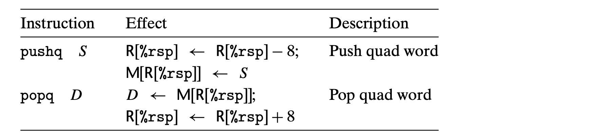</div>

<div style="text-align: center;">图 3.9 栈操作示意图。按照惯例，我们将栈倒置绘制，使栈的"顶部"显示在底部。在 x86-64 中，栈向低地址方向增长，因此压栈涉及递减栈指针（寄存器 %rsp）并写入内存，而弹栈涉及从内存读取并递增栈指针。</div>

这一端称为栈顶。在 x86-64 中，程序栈存储在某个内存区域。如图 3.9 所示，栈向下增长，使得栈顶元素具有所有栈元素中最低的地址。（按照惯例，我们将栈倒置绘制，图中栈的"顶部"显示在底部。）栈指针 `%rsp` 保存栈顶元素的地址。

`pushq` 指令提供了将数据压入栈的能力，而 `popq` 指令则将其弹出。这两条指令各取一个操作数——压栈的数据源和弹栈的数据目标。

将一个四字值压入栈涉及首先将栈指针减 8，然后将值写入新的栈顶地址。

---

<!-- Page 0219 -->

因此，指令对 `pushq %rbp` 等价于以下指令对：

```asm
subq  $8, %rsp    递减栈指针
movq  %rbp, (%rsp)  将 %rbp 存储到栈上
```

只是 `pushq` 指令在机器代码中编码为单个字节，而上面显示的指令对共需 8 个字节。图 3.9 的前两列说明了当 `%rsp` 为 `0x108`、`%rax` 为 `0x123` 时执行指令 `pushq %rax` 的效果。首先 `%rsp` 减 8，变为 `0x100`，然后 `0x123` 被存储在内存地址 `0x100` 处。

弹出一个四字值涉及从栈顶位置读取，然后将栈指针加 8。因此，指令 `popq %rax` 等价于以下指令对：

```asm
movq  (%rsp), %rax  从栈读取到 %rax
addq  $8, %rsp      递增栈指针
```

图 3.9 的第三列说明了紧接在压栈之后执行 `popq %rdx` 的效果。从内存读取值 `0x123` 并写入寄存器 `%rdx`。寄存器 `%rsp` 递增回 `0x108`。如图所示，值 `0x123` 保留在内存位置 `0x104` 中，直到被覆盖（例如，被另一个压栈操作覆盖）。然而，栈顶始终被认为是 `%rsp` 所指示的地址。

由于栈与程序代码和其他形式的程序数据处于同一内存中，程序可以使用标准内存寻址方法访问栈内的任意位置。例如，假设栈最顶端的元素是一个四字，指令 `movq 8(%rsp), %rdx` 将从栈中复制第二个四字到寄存器 `%rdx`。

## 3.5 算术和逻辑操作

图 3.10 列出了一些 x86-64 整数和逻辑操作。大多数操作以指令类的形式给出，因为它们可以有不同操作数大小的不同变体。（只有 `leaq` 没有其他大小变体。）例如，指令类 `ADD` 由四条加法指令组成：`addb`、`addw`、`addl` 和 `addq`，分别对字节、字、双字和四字执行加法。事实上，表中显示的每个指令类都有针对这四种不同数据大小进行操作的指令。操作分为四组：加载有效地址、一元操作、二元操作和移位操作。二元操作有两个操作数，而一元操作有一个操作数。这些操作数使用 3.4 节中描述的同一符号指定。

### 3.5.1 加载有效地址

加载有效地址指令 `leaq` 实际上是 `movq` 指令的变体。它具有从内存读取到寄存器的指令形式，

---

<!-- Page 0220 -->

<table border=1 style='margin: auto; word-wrap: break-word;'><tr><td style='text-align: center; word-wrap: break-word;'>Instruction</td><td style='text-align: center; word-wrap: break-word;'>Effect</td><td style='text-align: center; word-wrap: break-word;'>Description</td></tr><tr><td style='text-align: center; word-wrap: break-word;'>leaq</td><td style='text-align: center; word-wrap: break-word;'>S, D</td><td style='text-align: center; word-wrap: break-word;'>Load effective address</td></tr><tr><td style='text-align: center; word-wrap: break-word;'>INC</td><td style='text-align: center; word-wrap: break-word;'>D</td><td style='text-align: center; word-wrap: break-word;'>Increment</td></tr><tr><td style='text-align: center; word-wrap: break-word;'>DEC</td><td style='text-align: center; word-wrap: break-word;'>D</td><td style='text-align: center; word-wrap: break-word;'>Decrement</td></tr><tr><td style='text-align: center; word-wrap: break-word;'>NEG</td><td style='text-align: center; word-wrap: break-word;'>D</td><td style='text-align: center; word-wrap: break-word;'>Negate</td></tr><tr><td style='text-align: center; word-wrap: break-word;'>NOT</td><td style='text-align: center; word-wrap: break-word;'>D</td><td style='text-align: center; word-wrap: break-word;'>Complement</td></tr><tr><td style='text-align: center; word-wrap: break-word;'>ADD</td><td style='text-align: center; word-wrap: break-word;'>S, D</td><td style='text-align: center; word-wrap: break-word;'>Add</td></tr><tr><td style='text-align: center; word-wrap: break-word;'>SUB</td><td style='text-align: center; word-wrap: break-word;'>S, D</td><td style='text-align: center; word-wrap: break-word;'>Subtract</td></tr><tr><td style='text-align: center; word-wrap: break-word;'>IMUL</td><td style='text-align: center; word-wrap: break-word;'>S, D</td><td style='text-align: center; word-wrap: break-word;'>Multiply</td></tr><tr><td style='text-align: center; word-wrap: break-word;'>XOR</td><td style='text-align: center; word-wrap: break-word;'>S, D</td><td style='text-align: center; word-wrap: break-word;'>Exclusive-or</td></tr><tr><td style='text-align: center; word-wrap: break-word;'>OR</td><td style='text-align: center; word-wrap: break-word;'>S, D</td><td style='text-align: center; word-wrap: break-word;'>Or</td></tr><tr><td style='text-align: center; word-wrap: break-word;'>AND</td><td style='text-align: center; word-wrap: break-word;'>S, D</td><td style='text-align: center; word-wrap: break-word;'>And</td></tr><tr><td style='text-align: center; word-wrap: break-word;'>SAL</td><td style='text-align: center; word-wrap: break-word;'>k, D</td><td style='text-align: center; word-wrap: break-word;'>Left shift</td></tr><tr><td style='text-align: center; word-wrap: break-word;'>SHL</td><td style='text-align: center; word-wrap: break-word;'>k, D</td><td style='text-align: center; word-wrap: break-word;'>Left shift (same as SAL)</td></tr><tr><td style='text-align: center; word-wrap: break-word;'>SAR</td><td style='text-align: center; word-wrap: break-word;'>k, D</td><td style='text-align: center; word-wrap: break-word;'>Arithmetic right shift</td></tr><tr><td style='text-align: center; word-wrap: break-word;'>SHR</td><td style='text-align: center; word-wrap: break-word;'>k, D</td><td style='text-align: center; word-wrap: break-word;'>Logical right shift</td></tr></table>

<div style="text-align: center;">图 3.10 整数算术操作。加载有效地址（leaq）指令常用于执行简单的算术运算。其余的是更标准的一元或二元操作。我们使用符号 $\gg_A$ 和 $\gg_L$ 分别表示算术右移和逻辑右移。注意 ATT 格式汇编代码中操作数排列的不直观顺序。</div>

但它根本不引用内存。它的第一个操作数看起来像是一个内存引用，但不是从指定位置读取，而是将有效地址复制到目标。我们在图 3.10 中使用 C 地址操作符 `&S` 来表示这种计算。这条指令可以用来为后续内存引用生成指针。此外，它可以用来简洁地描述常见的算术操作。例如，如果寄存器 `%rdx` 包含值 `x`，则指令 `leaq 7(%rdx,%rdx,4), %rax` 将寄存器 `%rax` 设置为 $5x+7$。编译器通常会找到 `leaq` 的聪明用法，与有效地址计算毫无关系。目标操作数必须是寄存器。

**练习题 3.6（答案见第 363 页）**

假设寄存器 `%rbx` 保存值 `p`，`%rdx` 保存值 `q`。填写下表，给出各汇编代码指令将存储在寄存器 `%rax` 中的值的公式：

<table border=1 style='margin: auto; word-wrap: break-word;'><tr><td style='text-align: center; word-wrap: break-word;'>Instruction</td><td style='text-align: center; word-wrap: break-word;'>Result</td></tr><tr><td style='text-align: center; word-wrap: break-word;'>leaq 9(%rdx), %rax</td><td style='text-align: center; word-wrap: break-word;'>__________</td></tr><tr><td style='text-align: center; word-wrap: break-word;'>leaq (%rdx,%rbx), %rax</td><td style='text-align: center; word-wrap: break-word;'>__________</td></tr><tr><td style='text-align: center; word-wrap: break-word;'>leaq (%rdx,%rbx,3), %rax</td><td style='text-align: center; word-wrap: break-word;'>__________</td></tr></table>

---

<!-- Page 0221 -->

```asm
leaq  0xE(,%rdx,3), %rax
leaq  6(%rbx,%rdx,7), %rax
```

作为编译代码中 `leaq` 使用的示例，考虑以下 C 程序：

```c
long scale(long x, long y, long z) {
    long t = x + 4 * y + 12 * z;
    return t;
}
```

编译后，函数的算术操作由三条 `leaq` 指令序列实现，右边的注释对此做了说明：

```asm
long scale(long x, long y, long z)
x in %rdi, y in %rsi, z in %rdx
scale:
    leaq  (%rdi,%rsi,4), %rax    x + 4*y
    leaq  (%rdx,%rdx,2), %rdx   z + 2*z = 3*z
    leaq  (%rax,%rdx,4), %rax   (x+4*y) + 4*(3*z) = x + 4*y + 12*z
    ret
```

`leaq` 指令执行加法和有限形式乘法的能力在编译像这个例子这样的简单算术表达式时非常有用。

**练习题 3.7（答案见第 364 页）**

考虑以下代码，其中我们省略了正在计算的表达式：

```c
short scale3(short x, short y, short z) {
    short t = ___;
    return t;
}
```

用 `gcc` 编译实际函数生成以下汇编代码：

```asm
short scale3(short x, short y, short z)
x in %rdi, y in %rsi, z in %rdx
scale3:
    leaq  (%rsi,%rsi,9), %rbx
    leaq  (%rbx,%rdx), %rbx
    leaq  (%rbx,%rdi,%rsi), %rbx
    ret
```

填入 C 代码中缺失的表达式。

---

<!-- Page 0222 -->

第二组操作是一元操作，单个操作数同时作为源和目标。此操作数可以是寄存器或内存位置。例如，指令 `incq (%rsp)` 使栈顶的 8 字节元素递增。这种语法让人联想到 C 的递增（`++`）和递减（`--`）操作符。

第三组由二元操作组成，其中第二个操作数同时用作源和目标。这种语法让人联想到 C 的赋值操作符，如 `x -= y`。但请注意，源操作数在前，目标操作数在后。对于非交换操作，这看起来很奇怪。例如，指令 `subq %rax, %rdx` 将寄存器 `%rdx` 减去 `%rax` 中的值。（将指令读作"从 `%rdx` 减去 `%rax`"有助于理解。）第一个操作数可以是立即数值、寄存器或内存位置。第二个操作数可以是寄存器或内存位置。与 `mov` 指令一样，两个操作数不能都是内存位置。注意，当第二个操作数是内存位置时，处理器必须从内存读取值，执行操作，然后将结果写回内存。

**练习题 3.8（答案见第 364 页）**

假设以下值存储在所示的内存地址和寄存器中：

<table border=1 style='margin: auto; word-wrap: break-word;'><tr><td style='text-align: center; word-wrap: break-word;'>Address</td><td style='text-align: center; word-wrap: break-word;'>Value</td><td style='text-align: center; word-wrap: break-word;'>Register</td><td style='text-align: center; word-wrap: break-word;'>Value</td></tr><tr><td style='text-align: center; word-wrap: break-word;'>0x100</td><td style='text-align: center; word-wrap: break-word;'>0xFF</td><td style='text-align: center; word-wrap: break-word;'>%rax</td><td style='text-align: center; word-wrap: break-word;'>0x100</td></tr><tr><td style='text-align: center; word-wrap: break-word;'>0x108</td><td style='text-align: center; word-wrap: break-word;'>0xAA</td><td style='text-align: center; word-wrap: break-word;'>%rcx</td><td style='text-align: center; word-wrap: break-word;'>0x1</td></tr><tr><td style='text-align: center; word-wrap: break-word;'>0x110</td><td style='text-align: center; word-wrap: break-word;'>0x13</td><td style='text-align: center; word-wrap: break-word;'>%rdx</td><td style='text-align: center; word-wrap: break-word;'>0x3</td></tr><tr><td style='text-align: center; word-wrap: break-word;'>0x118</td><td style='text-align: center; word-wrap: break-word;'>0x11</td><td style='text-align: center; word-wrap: break-word;'></td><td style='text-align: center; word-wrap: break-word;'></td></tr></table>

填写下表，从寄存器或内存位置更新及结果值两个角度说明下列指令的效果：

<table border=1 style='margin: auto; word-wrap: break-word;'><tr><td style='text-align: center; word-wrap: break-word;'>Instruction</td><td style='text-align: center; word-wrap: break-word;'>Destination</td><td style='text-align: center; word-wrap: break-word;'>Value</td></tr><tr><td style='text-align: center; word-wrap: break-word;'>addq %rcx, (%rax)</td><td style='text-align: center; word-wrap: break-word;'>_____</td><td style='text-align: center; word-wrap: break-word;'>_____</td></tr><tr><td style='text-align: center; word-wrap: break-word;'>subq %rdx, 8(%rax)</td><td style='text-align: center; word-wrap: break-word;'>_____</td><td style='text-align: center; word-wrap: break-word;'>_____</td></tr><tr><td style='text-align: center; word-wrap: break-word;'>imulq $16, (%rax, %rdx, 8)</td><td style='text-align: center; word-wrap: break-word;'>_____</td><td style='text-align: center; word-wrap: break-word;'>_____</td></tr><tr><td style='text-align: center; word-wrap: break-word;'>incq 16(%rax)</td><td style='text-align: center; word-wrap: break-word;'>_____</td><td style='text-align: center; word-wrap: break-word;'>_____</td></tr><tr><td style='text-align: center; word-wrap: break-word;'>decq %rcx</td><td style='text-align: center; word-wrap: break-word;'>_____</td><td style='text-align: center; word-wrap: break-word;'>_____</td></tr><tr><td style='text-align: center; word-wrap: break-word;'>subq %rdx, %rax</td><td style='text-align: center; word-wrap: break-word;'>_____</td><td style='text-align: center; word-wrap: break-word;'>_____</td></tr></table>

### 3.5.3 移位操作

最后一组是移位操作，移位量在前，要移位的值在后。算术右移和逻辑右移都是

---

<!-- Page 0223 -->

可行的。不同的移位指令可以将移位量指定为立即数值或单字节寄存器 `%cl`。（这些指令不寻常之处在于只允许这个特定寄存器作为操作数。）原则上，拥有 1 字节的移位量可以使移位量编码范围多达 $2^8 - 1 = 255$。在 x86-64 中，对 $w$ 位长数据值进行操作的移位指令从寄存器 `%cl` 的低位 $m$ 位确定移位量，其中 $2^m = w$。高位被忽略。因此，例如，当寄存器 `%cl` 的十六进制值为 `0xFF` 时，`salb` 将移位 7，`salw` 将移位 15，`sall` 将移位 31，`salq` 将移位 63。

如图 3.10 所示，左移指令有两个名称：`SAL` 和 `SHL`。两者效果相同，从右边填充零。右移指令的不同在于：`SAR` 执行算术移位（用符号位的副本填充），而 `SHR` 执行逻辑移位（用零填充）。移位操作的目标操作数可以是寄存器或内存位置。我们在图 3.10 中用 $\gg_A$（算术）和 $\gg_L$（逻辑）来表示两种不同的右移操作。

**练习题 3.9（答案见第 364 页）**

假设我们要为以下 C 函数生成汇编代码：

```c
long shift_left4_rightn(long x, long n)
{
    x <<= 4;
    x >>= n;
    return x;
}
```

以下代码是执行实际移位并将最终值保留在寄存器 `%rax` 中的汇编代码的一部分。省略了两条关键指令。参数 `x` 和 `n` 分别存储在寄存器 `%rdi` 和 `%rsi` 中：

```asm
long shift_left4_rightn(long x, long n)
x in %rdi, n in %rsi
shift_left4_rightn:
    movq   %rdi, %rax   Get x
                        x <<= 4
    movl   %esi, %ecx  Get n (4 bytes)
                        x >>= n
```

按照右侧的注释填入缺失的指令。右移应以算术方式执行。

---

<!-- Page 0224 -->

```c
long arith(long x, long y, long z)
{
    long t1 = x ^ y;
    long t2 = z * 48;
    long t3 = t1 & 0x0F0F0F0F;
    long t4 = t2 - t3;
    return t4;
}
```

(b) 汇编代码

```asm
long arith(long x, long y, long z)
    x in %rdi, y in %rsi, z in %rdx

arith:
    xorq   %rsi, %rdi
    leaq   (%rdx,%rdx,2), %rax
    salq   $4, %rax
    andl   $252645135, %edi
    subq   %rdi, %rax
    ret
```

<div style="text-align: center;">图 3.11 算术函数的 C 代码和汇编代码。</div>

### 3.5.4 讨论

我们看到，图 3.10 中显示的大多数指令都可以用于无符号或补码算术。只有右移需要区分有符号和无符号数据的指令。这是使补码算术成为实现有符号整数算术的首选方式的特性之一。

图 3.11 展示了一个执行算术操作的函数示例及其汇编代码翻译。参数 `x`、`y` 和 `z` 最初分别存储在寄存器 `%rdi`、`%rsi` 和 `%rdx` 中。汇编代码指令与 C 源代码行密切对应。第 2 行计算 `x ^ y` 的值。第 3 行和第 4 行通过 `leaq` 和移位指令的组合计算表达式 `z * 48`。第 5 行计算 `t1` 和 `0x0F0F0F0F` 的与。最后的减法由第 6 行计算。由于减法的目标是寄存器 `%rax`，这将是函数返回的值。

在图 3.11 的汇编代码中，寄存器 `%rax` 中的值序列对应于程序值 `3*z`、`z*48` 和 `t4`（作为返回值）。一般来说，编译器会生成对多个程序值使用单个寄存器的代码，并在寄存器之间移动程序值。

**练习题 3.10（答案见第 365 页）**

考虑以下代码，其中我们省略了正在计算的表达式：

---

<!-- Page 0225 -->

```c
{
    short p1 = ___;
    short p2 = ___;
    short p3 = ___;
    short p4 = ___;
    return p4;
}
```

实现这些表达式的生成汇编代码部分如下：

```asm
short arith3(short x, short y, short z)
x in %rdi, y in %rsi, z in %rdx
arith3:
    orq   %rsi, %rdx
    sarq  $9, %rdx
    notq  %rdx
    movq  %rdx, %rbx
    subq  %rsi, %rbx
    ret
```

根据此汇编代码，填入 C 代码中缺失的部分。

**练习题 3.11（答案见第 365 页）**

在从 C 生成的代码中，常见以下形式的汇编代码行：

```asm
xorq %rcx, %rcx
```

而对应的 C 代码中并没有异或（EXCLUSIVE-OR）操作。

A. 解释这条特定异或指令的效果，以及它实现了什么有用的操作。

B. 用汇编代码表达此操作的更直接方式是什么？

C. 比较对相同操作的以下三种不同实现中任意两种的编码字节数。

### 3.5.5 特殊算术操作

如我们在 2.3 节中看到的，将两个 64 位有符号或无符号整数相乘可能产生需要 128 位来表示的乘积。x86-64 指令集为涉及 128 位（16 字节）数字的操作提供了有限支持。延续字（2 字节）、双字（4 字节）和四字（8 字节）的命名约定，Intel 将 16 字节的量称为八字（oct word）。图 3.12

---

<!-- Page 0226 -->

<table border=1 style='margin: auto; word-wrap: break-word;'><tr><td style='text-align: center; word-wrap: break-word;'>Instruction</td><td style='text-align: center; word-wrap: break-word;'>Effect</td><td style='text-align: center; word-wrap: break-word;'>Description</td></tr><tr><td style='text-align: center; word-wrap: break-word;'>imulq</td><td style='text-align: center; word-wrap: break-word;'>S</td><td style='text-align: center; word-wrap: break-word;'>R[%rdx]:R[%rax] ← S × R[%rax]</td></tr><tr><td style='text-align: center; word-wrap: break-word;'>mulq</td><td style='text-align: center; word-wrap: break-word;'>S</td><td style='text-align: center; word-wrap: break-word;'>R[%rdx]:R[%rax] ← S × R[%rax]</td></tr><tr><td style='text-align: center; word-wrap: break-word;'>cqto</td><td style='text-align: center; word-wrap: break-word;'></td><td style='text-align: center; word-wrap: break-word;'>R[%rdx]:R[%rax] ← SignExtend(R[%rax])</td></tr><tr><td style='text-align: center; word-wrap: break-word;'>idivq</td><td style='text-align: center; word-wrap: break-word;'>S</td><td style='text-align: center; word-wrap: break-word;'>R[%rdx] ← R[%rdx]:R[%rax] mod S;</td></tr><tr><td style='text-align: center; word-wrap: break-word;'></td><td style='text-align: center; word-wrap: break-word;'></td><td style='text-align: center; word-wrap: break-word;'>R[%rax] ← R[%rdx]:R[%rax] ÷ S</td></tr><tr><td style='text-align: center; word-wrap: break-word;'>divq</td><td style='text-align: center; word-wrap: break-word;'>S</td><td style='text-align: center; word-wrap: break-word;'>R[%rdx] ← R[%rdx]:R[%rax] mod S;</td></tr><tr><td style='text-align: center; word-wrap: break-word;'></td><td style='text-align: center; word-wrap: break-word;'></td><td style='text-align: center; word-wrap: break-word;'>R[%rax] ← R[%rdx]:R[%rax] ÷ S</td></tr></table>

<div style="text-align: center;">图 3.12 特殊算术操作。这些操作为有符号和无符号数提供完整的 128 位乘法和除法。寄存器对 %rdx 和 %rax 被视为形成一个单一的 128 位八字。</div>

描述了支持生成两个 64 位数的完整 128 位乘积以及整数除法的指令。

`imulq` 指令有两种不同的形式。一种形式如图 3.10 所示，是 IMUL 指令类的成员。在这种形式中，它作为"双操作数"乘法指令，从两个 64 位操作数生成 64 位乘积。它实现了 2.3.4 和 2.3.5 节中描述的操作 $*_{64}^u$ 和 $*_{64}^t$。（回想一下，将乘积截断为 64 位时，无符号乘法和补码乘法具有相同的位级行为。）

此外，x86-64 指令集包含两种不同的"单操作数"乘法指令，用于计算两个 64 位值的完整 128 位乘积——一种用于无符号（`mulq`），一种用于补码（`imulq`）乘法。对于这两条指令，一个参数必须在寄存器 `%rax` 中，另一个作为指令的源操作数给出。乘积随后存储在寄存器 `%rdx`（高位 64 位）和 `%rax`（低位 64 位）中。虽然 `imulq` 用于两种不同的乘法操作，但汇编器可以通过计算操作数的数量来判断意图的是哪种。

作为示例，以下 C 代码演示了生成两个无符号 64 位数 `x` 和 `y` 的 128 位乘积：

```c
#include <inttypes.h>

typedef unsigned __int128 uint128_t;

void store_uprod(uint128_t *dest, uint64_t x, uint64_t y) {
    *dest = x * (uint128_t) y;
}
```

在这个程序中，我们使用 `inttypes.h` 文件中声明的定义，将 `x` 和 `y` 显式声明为 64 位数，这是 C 标准的扩展。不幸的是，该标准没有为 128 位值做规定。相反，

---

<!-- Page 0227 -->

我们依赖 GCC 对 128 位整数的支持，使用名称 `__int128` 声明。我们的代码使用 `typedef` 声明来定义数据类型 `uint128_t`，遵循 `inttypes.h` 中其他数据类型的命名模式。代码指定结果乘积应存储在指针 `dest` 指定的 16 个字节处。

GCC 为此函数生成的汇编代码如下：

```asm
void store_uprod(uint128_t *dest, uint64_t x, uint64_t y)
    dest in %rdi, x in %rsi, y in %rdx

store_uprod:
    movq   %rsi, %rax        Copy x to multiplicand
    mulq   %rdx              Multiply by y
    movq   %rax, (%rdi)      Store lower 8 bytes at dest
    movq   %rdx, 8(%rdi)     Store upper 8 bytes at dest+8
    ret
```

注意存储乘积需要两条 `movq` 指令：一条用于低位 8 字节（第 4 行），一条用于高位 8 字节（第 5 行）。由于代码是为小端机器生成的，高位字节存储在高地址处，如地址规范 `8(%rdi)` 所示。

我们之前的算术操作表（图 3.10）没有列出任何除法或取模操作。这些操作由类似于单操作数乘法指令的单操作数除法指令提供。有符号除法指令 `idivq` 以寄存器 `%rdx`（高位 64 位）和 `%rax`（低位 64 位）中的 128 位量作为被除数。除数作为指令操作数给出。指令将商存储在寄存器 `%rax` 中，将余数存储在寄存器 `%rdx` 中。

对于大多数 64 位除法应用，被除数是一个 64 位值。该值应存储在寄存器 `%rax` 中。然后 `%rdx` 的位应全部设置为零（无符号算术）或 `%rax` 的符号位（有符号算术）。后一种操作可以使用指令 `cqto` 执行。这条指令不需要操作数——它隐式地从 `%rax` 读取符号位并将其复制到整个 `%rdx`。

作为用 x86-64 实现除法的示例，以下 C 函数计算两个 64 位有符号数的商和余数：

```c
void remdiv(long x, long y,
                   long *qp, long *rp) {
    long q = x/y;
    long r = x%y;
    *qp = q;
    *rp = r;
}
```

---

<!-- Page 0228 -->

```asm
void remdiv(long x, long y, long *qp, long *rp)
x in %rdi, y in %rsi, qp in %rdx, rp in %rcx

remdiv:
    movq   %rdx, %r8          Copy qp
    movq   %rdi, %rax         Move x to lower 8 bytes of dividend
    cqto                      Sign-extend to upper 8 bytes of dividend
    idivq  %rsi               Divide by y
    movq   %rax, (%r8)        Store quotient at qp
    movq   %rdx, (%rcx)       Store remainder at rp
    ret
```

在这段代码中，参数 `rp` 必须首先保存在不同的寄存器中（第 2 行），因为参数寄存器 `%rdx` 是除法操作所需的。第 3-4 行通过复制和符号扩展 `x` 来准备被除数。除法之后，寄存器 `%rax` 中的商存储到 `qp`（第 6 行），而寄存器 `%rdx` 中的余数存储到 `rp`（第 7 行）。

无符号除法使用 `divq` 指令。通常，寄存器 `%rdx` 事先被设置为零。

**练习题 3.12（答案见第 365 页）**

考虑以下用于计算两个无符号 64 位数的商和余数的函数：

```c
void uremdiv(unsigned long x, unsigned long y,
                    unsigned long *qp, unsigned long *rp) {
    unsigned long q = x/y;
    unsigned long r = x%y;
    *qp = q;
    *rp = r;
}
```

修改有符号除法的汇编代码来实现此函数。

## 3.6 控制

到目前为止，我们只考虑了直线代码的行为，其中指令依次按顺序执行。C 中的某些构件，如条件语句、循环和 `switch`，需要条件执行，即执行的操作序列取决于对数据进行的测试结果。机器代码提供了两种基本的底层机制来实现条件行为：测试数据值，然后根据这些测试结果改变控制流或数据流。

数据相关的控制流是实现条件行为的更通用、更常见的方法，因此我们将首先研究这种方法。通常，

---

<!-- Page 0229 -->

C 中的语句和机器代码中的指令都按照它们在程序中出现的顺序依次执行。一组机器代码指令的执行顺序可以通过跳转指令来改变，跳转指令指示控制应传递到程序的某个其他部分，可能取决于某次测试的结果。编译器必须生成指令序列，以这种底层机制为基础来实现 C 的控制构件。

在我们的讲述中，我们首先介绍实现条件操作的两种方式，然后描述实现循环和 `switch` 语句的方法。

### 3.6.1 条件码

除了整数寄存器，CPU 还维护一组单位条件码寄存器，描述最近一次算术或逻辑操作的属性。然后可以测试这些寄存器来执行条件分支。最有用的条件码是：

- **CF**：进位标志。最近的操作从最高有效位产生了进位。用于检测无符号操作的溢出。

- **ZF**：零标志。最近的操作产生了零。

- **SF**：符号标志。最近的操作产生了负值。

- **OF**：溢出标志。最近的操作导致了补码溢出——负溢出或正溢出。

例如，假设我们使用一条 ADD 指令执行相当于 C 赋值 $t = a + b$ 的操作，其中变量 `a`、`b` 和 `t` 都是整数。那么条件码将根据以下 C 表达式设置：

```
CF  (unsigned) t < (unsigned) a    无符号溢出
ZF  (t == 0)                       零
SF  (t < 0)                        负数
OF  (a < 0 == b < 0) && (t < 0 != a < 0)  有符号溢出
```

`leaq` 指令不改变任何条件码，因为它用于地址计算。否则，图 3.10 中列出的所有指令都会设置条件码。对于逻辑操作（如 `xor`），进位和溢出标志被设置为零。对于移位操作，进位标志被设置为最后移出的位，而溢出标志被设置为零。由于我们不深入探讨的原因，`INC` 和 `DEC` 指令设置溢出和零标志，但它们保持进位标志不变。

除了图 3.10 中指令设置条件码之外，还有两个指令类（具有 8、16、32 和 64 位形式）设置条件码而不改变任何其他寄存器；这些列在图 3.13 中。CMP 指令根据其两个操作数的差值设置条件码。它们的行为与 `sub` 指令相同，只是设置条件码而不更新目标。在 ATT 格式中，

---

<!-- Page 0230 -->

<table border=1 style='margin: auto; word-wrap: break-word;'><tr><td colspan="2">Instruction</td><td style='text-align: center; word-wrap: break-word;'>Based on</td><td style='text-align: center; word-wrap: break-word;'>Description</td></tr><tr><td style='text-align: center; word-wrap: break-word;'>CMP</td><td style='text-align: center; word-wrap: break-word;'>$ S_{1}, S_{2} $</td><td style='text-align: center; word-wrap: break-word;'>$ S_{2} - S_{1} $</td><td style='text-align: center; word-wrap: break-word;'>Compare</td></tr><tr><td style='text-align: center; word-wrap: break-word;'>cmpb</td><td style='text-align: center; word-wrap: break-word;'></td><td style='text-align: center; word-wrap: break-word;'></td><td style='text-align: center; word-wrap: break-word;'>Compare byte</td></tr><tr><td style='text-align: center; word-wrap: break-word;'>cmpw</td><td style='text-align: center; word-wrap: break-word;'></td><td style='text-align: center; word-wrap: break-word;'></td><td style='text-align: center; word-wrap: break-word;'>Compare word</td></tr><tr><td style='text-align: center; word-wrap: break-word;'>cmpl</td><td style='text-align: center; word-wrap: break-word;'></td><td style='text-align: center; word-wrap: break-word;'></td><td style='text-align: center; word-wrap: break-word;'>Compare double word</td></tr><tr><td style='text-align: center; word-wrap: break-word;'>cmpq</td><td style='text-align: center; word-wrap: break-word;'></td><td style='text-align: center; word-wrap: break-word;'></td><td style='text-align: center; word-wrap: break-word;'>Compare quad word</td></tr><tr><td style='text-align: center; word-wrap: break-word;'>TEST</td><td style='text-align: center; word-wrap: break-word;'>$ S_{1}, S_{2} $</td><td style='text-align: center; word-wrap: break-word;'>$ S_{1} \&amp; S_{2} $</td><td style='text-align: center; word-wrap: break-word;'>Test</td></tr><tr><td style='text-align: center; word-wrap: break-word;'>testb</td><td style='text-align: center; word-wrap: break-word;'></td><td style='text-align: center; word-wrap: break-word;'></td><td style='text-align: center; word-wrap: break-word;'>Test byte</td></tr><tr><td style='text-align: center; word-wrap: break-word;'>testw</td><td style='text-align: center; word-wrap: break-word;'></td><td style='text-align: center; word-wrap: break-word;'></td><td style='text-align: center; word-wrap: break-word;'>Test word</td></tr><tr><td style='text-align: center; word-wrap: break-word;'>testl</td><td style='text-align: center; word-wrap: break-word;'></td><td style='text-align: center; word-wrap: break-word;'></td><td style='text-align: center; word-wrap: break-word;'>Test double word</td></tr><tr><td style='text-align: center; word-wrap: break-word;'>testq</td><td style='text-align: center; word-wrap: break-word;'></td><td style='text-align: center; word-wrap: break-word;'></td><td style='text-align: center; word-wrap: break-word;'>Test quad word</td></tr></table>

<div style="text-align: center;">图 3.13 比较和测试指令。这些指令设置条件码而不更新任何其他寄存器。</div>

操作数以相反顺序列出，使代码难以阅读。如果两个操作数相等，这些指令设置零标志。其他标志可用于确定两个操作数之间的大小关系。TEST 指令的行为与 AND 指令相同，只是设置条件码而不改变目标。通常，相同的操作数会重复（例如，`testq %rax, %rax` 用于查看 `%rax` 是负数、零还是正数），或者其中一个操作数是表示应测试哪些位的掩码。

### 3.6.2 访问条件码

与其直接读取条件码，有三种常见的使用条件码的方式：(1) 可以根据条件码的某种组合将单个字节设置为 0 或 1；(2) 可以有条件地跳转到程序的某个其他部分；(3) 可以有条件地传输数据。对于第一种情况，图 3.14 中描述的指令根据条件码的某种组合将单个字节设置为 0 或 1。我们将这整类指令称为 SET 指令；它们根据所考虑的条件码组合相互区分，如指令名称的不同后缀所示。重要的是要认识到，这些指令的后缀表示不同的条件，而不是不同的操作数大小。例如，指令 `setl` 和 `setb` 表示"小于时设置"和"低于时设置"，而不是"设置长字"或"设置字节"。

SET 指令将低位单字节寄存器元素之一（图 3.2）或单字节内存位置作为其目标，将此字节设置为 0 或 1。要生成 32 位或 64 位结果，还必须清零高位字节。计算 C 表达式 `a < b`（其中 `a` 和 `b` 都是 `long` 类型）的典型指令序列如下：

---

<!-- Page 0231 -->

```
Instruction  Synonym  Effect              Set condition
sete   D     setz     D ← ZF             Equal / zero
setne  D     setnz    D ← ~ZF            Not equal / not zero
sets   D              D ← SF             Negative
setns  D              D ← ~SF            Nonnegative
setg   D     setnle   D ← ~(SF^OF) & ~ZF Greater (signed >)
setge  D     setnl    D ← ~(SF^OF)       Greater or equal (signed >=)
setl   D     setnge   D ← SF^OF          Less (signed <)
setle  D     setng    D ← (SF^OF)|ZF     Less or equal (signed <=)
seta   D     setnb    D ← ~CF & ~ZF      Above (unsigned >)
setae  D     setnb    D ← ~CF            Above or equal (unsigned >=)
setb   D     setnae   D ← CF             Below (unsigned <)
setbe  D     setna    D ← CF|ZF          Below or equal (unsigned <=)
```

<div style="text-align: center;">图 3.14 SET 指令。每条指令根据条件码的某种组合将单个字节设置为 0 或 1。某些指令有"同义词"，即同一机器指令的替代名称。</div>

```asm
int comp(data_t a, data_t b)
a in %rdi, b in %rsi

comp:
    cmpq   %rsi, %rdi      Compare a:b
    setl   %al             Set low-order byte of %eax to 0 or 1
    movzbl %al, %eax       Clear rest of %eax (and rest of %rax)
    ret
```

注意 `cmpq` 指令（第 2 行）的比较顺序。虽然参数按 `%rsi`（b）然后 `%rdi`（a）的顺序列出，但比较实际上是 a 与 b 之间的比较。还要回想一下，如 3.4.2 节中所讨论的，`movzbl` 指令（第 4 行）不仅清除了 `%eax` 的高位 3 字节，还清除了整个寄存器 `%rax` 的高位 4 字节。

对于某些底层机器指令，有多个可能的名称，我们将其列为"同义词"。例如，`setg`（"大于时设置"）和 `setnle`（"非小于或等于时设置"）指的是同一条机器指令。编译器和反汇编器任意选择使用哪个名称。

虽然所有算术和逻辑操作都会设置条件码，但不同 SET 指令的描述适用于比较指令已被执行的情况，此时条件码根据计算 $t = a - b$ 来设置。更具体地说，设 a、b 和 t 是分别由变量 a、b 和 t 以补码形式表示的整数，则 $t = a -_w^t b$，其中 w 取决于与 a 和 b 关联的大小。

---

<!-- Page 0232 -->

考虑 `sete`（即"相等时设置"）指令。当 $a = b$ 时，我们有 $t = 0$，因此零标志表示相等。类似地，考虑用 `setl`（即"小于时设置"）指令测试有符号比较。当没有溢出发生时（由 OF 设为 0 表示），当 $a -_w^t b < 0$ 时我们有 $a < b$（由 SF 设为 1 表示），当 $a -_w^t b \geq 0$ 时我们有 $a \geq b$（由 SF 设为 0 表示）。另一方面，当发生溢出时，当 $a -_w^t b > 0$（负溢出）时我们有 $a < b$，当 $a -_w^t b < 0$（正溢出）时我们有 $a > b$。当 $a = b$ 时不可能发生溢出。因此，当 OF 设为 1 时，当且仅当 SF 设为 0 时，我们有 $a < b$。综合这些情况，溢出位和符号位的异或提供了测试 $a < b$ 的方法。其他有符号比较测试基于 $\text{SF} \oplus \text{OF}$ 和 ZF 的其他组合。

对于无符号比较测试，现在设 a 和 b 为变量 a 和 b 以无符号形式表示的整数。在执行计算 $t = a - b$ 时，当 $a - b < 0$ 时，CMP 指令将设置进位标志，因此无符号比较使用进位和零标志的组合。

重要的是要注意机器代码如何区分（或不区分）有符号值和无符号值。与 C 不同，机器代码不为每个程序值关联数据类型。相反，对于两种情况，它大多使用相同的指令，因为许多算术操作对无符号和补码算术具有相同的位级行为。某些情况需要不同的指令来处理有符号和无符号操作，例如使用不同版本的右移、除法和乘法指令，以及条件码的不同组合。

**练习题 3.13（答案见第 366 页）**

C 代码：

```c
int comp(data_t a, data_t b) {
    return a COMP b;
}
```

展示了参数 a 和 b 之间的一般比较，其中 `data_t`（参数的数据类型）通过 `typedef` 定义为图 3.1 中列出的整数数据类型之一，且为有符号或无符号。比较 COMP 通过 `#define` 定义。

假设 a 在 `%rdx` 的某个部分，b 在 `%rsi` 的某个部分。对于以下每个指令序列，确定哪些数据类型 `data_t` 以及哪些比较 COMP 可能导致编译器生成此代码。（可能有多个正确答案；你应该全部列出。）

```asm
A.  cmpl  %esi, %edi
    setl  %al
B.  cmpw  %si, %di
    setge %al
```

---

<!-- Page 0233 -->

```asm
C.  cmpb  %sil, %dil
    setbe %al
D.  cmpq  %rsi, %rdi
    setne %al
```

**练习题 3.14（答案见第 366 页）**

C 代码：

```c
int test(data_t a) {
    return a TEST 0;
}
```

展示了参数 a 与 0 之间的一般比较，其中我们可以通过用 `typedef` 声明 `data_t` 来设置参数的数据类型，通过用 `#define` 声明 `TEST` 来指定比较的性质。以下指令序列实现了该比较，其中 a 保存在寄存器 `%rdi` 的某个部分。对于每个序列，确定哪些数据类型 `data_t` 以及哪些比较 `TEST` 可能导致编译器生成此代码。（可能有多个正确答案；列出所有正确答案。）

```asm
A.  testq %rdi, %rdi
    setge %al
B.  testw %di, %di
    sete  %al
C.  testb %dil, %dil
    seta  %al
D.  testl %edi, %edi
    setle %al
```

### 3.6.3 跳转指令

在正常执行下，指令按照列出的顺序依次执行。跳转指令可以使执行切换到程序中完全不同的位置。这些跳转目标通常在汇编代码中用标签表示。考虑以下（非常刻意构造的）汇编代码序列：

```asm
    movq  $0, %rax       Set %rax to 0
    jmp   .L1            Goto .L1
    movq  (%rax), %rdx  Null pointer dereference (skipped)
.L1:
    popq  %rdx           Jump target
```

---

<!-- Page 0234 -->

<table border=1 style='margin: auto; word-wrap: break-word;'><tr><td colspan="2">Instruction</td><td style='text-align: center; word-wrap: break-word;'>Synonym</td><td style='text-align: center; word-wrap: break-word;'>Jump condition</td><td style='text-align: center; word-wrap: break-word;'>Description</td></tr><tr><td style='text-align: center; word-wrap: break-word;'>jmp</td><td style='text-align: center; word-wrap: break-word;'>Label</td><td style='text-align: center; word-wrap: break-word;'></td><td style='text-align: center; word-wrap: break-word;'>1</td><td style='text-align: center; word-wrap: break-word;'>Direct jump</td></tr><tr><td style='text-align: center; word-wrap: break-word;'>jmp</td><td style='text-align: center; word-wrap: break-word;'>*Operand</td><td style='text-align: center; word-wrap: break-word;'></td><td style='text-align: center; word-wrap: break-word;'>1</td><td style='text-align: center; word-wrap: break-word;'>Indirect jump</td></tr><tr><td style='text-align: center; word-wrap: break-word;'>je</td><td style='text-align: center; word-wrap: break-word;'>Label</td><td style='text-align: center; word-wrap: break-word;'>jz</td><td style='text-align: center; word-wrap: break-word;'>ZF</td><td style='text-align: center; word-wrap: break-word;'>Equal / zero</td></tr><tr><td style='text-align: center; word-wrap: break-word;'>jne</td><td style='text-align: center; word-wrap: break-word;'>Label</td><td style='text-align: center; word-wrap: break-word;'>jnz</td><td style='text-align: center; word-wrap: break-word;'>~ZF</td><td style='text-align: center; word-wrap: break-word;'>Not equal / not zero</td></tr><tr><td style='text-align: center; word-wrap: break-word;'>js</td><td style='text-align: center; word-wrap: break-word;'>Label</td><td style='text-align: center; word-wrap: break-word;'></td><td style='text-align: center; word-wrap: break-word;'>SF</td><td style='text-align: center; word-wrap: break-word;'>Negative</td></tr><tr><td style='text-align: center; word-wrap: break-word;'>jns</td><td style='text-align: center; word-wrap: break-word;'>Label</td><td style='text-align: center; word-wrap: break-word;'></td><td style='text-align: center; word-wrap: break-word;'>~SF</td><td style='text-align: center; word-wrap: break-word;'>Nonnegative</td></tr><tr><td style='text-align: center; word-wrap: break-word;'>jg</td><td style='text-align: center; word-wrap: break-word;'>Label</td><td style='text-align: center; word-wrap: break-word;'>jnle</td><td style='text-align: center; word-wrap: break-word;'>~(SF^OF) &amp; ~ZF</td><td style='text-align: center; word-wrap: break-word;'>Greater (signed &gt;)</td></tr><tr><td style='text-align: center; word-wrap: break-word;'>jge</td><td style='text-align: center; word-wrap: break-word;'>Label</td><td style='text-align: center; word-wrap: break-word;'>jnl</td><td style='text-align: center; word-wrap: break-word;'>~(SF^OF)</td><td style='text-align: center; word-wrap: break-word;'>Greater or equal (signed &gt;=)</td></tr><tr><td style='text-align: center; word-wrap: break-word;'>jl</td><td style='text-align: center; word-wrap: break-word;'>Label</td><td style='text-align: center; word-wrap: break-word;'>jnge</td><td style='text-align: center; word-wrap: break-word;'>SF^OF</td><td style='text-align: center; word-wrap: break-word;'>Less (signed &lt;)</td></tr><tr><td style='text-align: center; word-wrap: break-word;'>jle</td><td style='text-align: center; word-wrap: break-word;'>Label</td><td style='text-align: center; word-wrap: break-word;'>jng</td><td style='text-align: center; word-wrap: break-word;'>(SF^OF)|ZF</td><td style='text-align: center; word-wrap: break-word;'>Less or equal (signed &lt;=)</td></tr><tr><td style='text-align: center; word-wrap: break-word;'>ja</td><td style='text-align: center; word-wrap: break-word;'>Label</td><td style='text-align: center; word-wrap: break-word;'>jnbe</td><td style='text-align: center; word-wrap: break-word;'>~CF &amp; ~ZF</td><td style='text-align: center; word-wrap: break-word;'>Above (unsigned &gt;)</td></tr><tr><td style='text-align: center; word-wrap: break-word;'>jae</td><td style='text-align: center; word-wrap: break-word;'>Label</td><td style='text-align: center; word-wrap: break-word;'>jnb</td><td style='text-align: center; word-wrap: break-word;'>~CF</td><td style='text-align: center; word-wrap: break-word;'>Above or equal (unsigned &gt;=)</td></tr><tr><td style='text-align: center; word-wrap: break-word;'>jb</td><td style='text-align: center; word-wrap: break-word;'>Label</td><td style='text-align: center; word-wrap: break-word;'>jnae</td><td style='text-align: center; word-wrap: break-word;'>CF</td><td style='text-align: center; word-wrap: break-word;'>Below (unsigned &lt;)</td></tr><tr><td style='text-align: center; word-wrap: break-word;'>jbe</td><td style='text-align: center; word-wrap: break-word;'>Label</td><td style='text-align: center; word-wrap: break-word;'>jna</td><td style='text-align: center; word-wrap: break-word;'>CF|ZF</td><td style='text-align: center; word-wrap: break-word;'>Below or equal (unsigned &lt;=)</td></tr></table>

<div style="text-align: center;">图 3.15 跳转指令。当跳转条件成立时，这些指令跳转到带标签的目标。某些指令有"同义词"，即同一机器指令的替代名称。</div>

指令 `jmp .L1` 将使程序跳过 `movq` 指令，改为从 `popq` 指令继续执行。在生成目标代码文件时，汇编器确定所有带标签指令的地址，并将跳转目标（目标指令的地址）编码为跳转指令的一部分。

图 3.15 显示了不同的跳转指令。`jmp` 指令无条件跳转。它可以是直接跳转（跳转目标作为指令的一部分编码）或间接跳转（跳转目标从寄存器或内存位置读取）。直接跳转在汇编代码中通过给出标签作为跳转目标来书写，例如上面代码中的标签 `.L1`。间接跳转使用"*"后跟使用图 3.3 中描述的内存操作数格式之一的操作数指示符来书写。例如，指令

```asm
jmp *%rax
```

使用寄存器 `%rax` 中的值作为跳转目标，而指令

```asm
jmp *(%rax)
```

从内存读取跳转目标，使用 `%rax` 中的值作为读取地址。

表中其余的跳转指令是条件跳转——它们根据条件码的某种组合，要么跳转，要么继续执行代码序列中的下一条指令。这些指令的名称

---

<!-- Page 0235 -->

以及它们在哪些条件下跳转，与 SET 指令的条件相匹配（见图 3.14）。与 SET 指令一样，某些底层机器指令有多个名称。条件跳转只能是直接跳转。

### 3.6.4 跳转指令的编码

在大多数情况下，我们不会关注机器代码的详细格式。另一方面，理解跳转指令目标如何编码在我们研究第 7 章中的链接时将变得重要。此外，这有助于解释反汇编器的输出。在汇编代码中，跳转目标使用符号标签书写。汇编器，以及后来的链接器，生成跳转目标的正确编码。跳转有几种不同的编码，但最常用的一些是 PC 相对的。也就是说，它们编码目标指令的地址与紧随跳转之后的指令地址之间的差值。这些偏移量可以用 1、2 或 4 个字节编码。第二种编码方法是给出"绝对"地址，使用 4 字节直接指定目标。汇编器和链接器选择跳转目标的适当编码。

作为 PC 相对寻址的示例，以下是通过编译文件 `branch.c` 生成的函数汇编代码。它包含两个跳转：第 2 行的 `jmp` 指令向前跳转到更高地址，而第 7 行的 `jg` 指令向后跳转到更低地址。

```asm
    movq  %rdi, %rax
    jmp   .L2
.L3:
    sarq  %rax
.L2:
    testq %rax, %rax
    jg    .L3
    rep; ret
```

汇编器生成的 `.o` 格式的反汇编版本如下：

```
0: 48 89 f8    mov   %rdi,%rax
3: eb 03       jmp   8 <loop+0x8>
5: 48 d1 f8    sar   %rax
8: 48 85 c0    test  %rax,%rax
b: 7f f8       jg    5 <loop+0x5>
d: f3 c3       repz  retq
```

在反汇编器右侧生成的注释中，跳转目标对于第 2 行的跳转指令显示为 `0x8`，对于第 5 行的跳转指令显示为 `0x5`（反汇编器以十六进制列出所有数字）。然而，查看指令的字节编码，我们看到第一条跳转指令的目标（在第二字节中）编码为 `0x03`。将其加到 `0x5`（即

---

<!-- Page 0236 -->

>**旁注 `rep` 和 `repz` 指令有什么作用？**
>
>第 243 页显示的汇编代码的第 8 行包含指令组合 `rep; ret`。这些在反汇编代码（第 6 行）中呈现为 `repz retq`。可以推断，`repz` 是 `rep` 的同义词，就像 `retq` 是 `ret` 的同义词一样。查看 Intel 和 AMD 的 `rep` 指令文档，我们发现它通常用于实现重复字符串操作。它在这里看起来完全不合适。这个谜题的答案可以在 AMD 给编译器编写者的指南中看到。他们建议使用 `rep` 后跟 `ret` 的组合，以避免让 `ret` 指令成为条件跳转指令的目标。没有 `rep` 指令时，当分支未被选中时，`jg` 指令（汇编代码第 7 行）将继续执行 `ret` 指令。根据 AMD 的说法，他们的处理器无法正确预测当从跳转指令到达时 `ret` 指令的目标。`rep` 指令在这里起到空操作的作用，因此将其插入作为跳转目标不会改变代码的行为，但会使其在 AMD 处理器上运行更快。我们可以安全地忽略本书其余代码中出现的任何 `rep` 或 `repz` 指令。

以下指令的地址），我们得到跳转目标地址 `0x8`，即第 4 行指令的地址。

类似地，第二条跳转指令的目标使用单字节补码表示编码为 `0xf8`（十进制 -8）。将其加到 `0xd`（十进制 13），即第 6 行指令的地址，我们得到 `0x5`，即第 3 行指令的地址。

正如这些例子所说明的，执行 PC 相对寻址时程序计数器的值是跳转之后指令的地址，而不是跳转本身的地址。这一约定可以追溯到早期实现，当时处理器将更新程序计数器作为执行指令的第一步。

以下显示了链接后程序的反汇编版本：

<table border=1 style='margin: auto; word-wrap: break-word;'><tr><td style='text-align: center; word-wrap: break-word;'>1</td><td style='text-align: center; word-wrap: break-word;'>4004d0:</td><td style='text-align: center; word-wrap: break-word;'>48 89 f8</td><td style='text-align: center; word-wrap: break-word;'>mov</td><td style='text-align: center; word-wrap: break-word;'>%rdi,%rax</td></tr><tr><td style='text-align: center; word-wrap: break-word;'>2</td><td style='text-align: center; word-wrap: break-word;'>4004d3:</td><td style='text-align: center; word-wrap: break-word;'>eb 03</td><td style='text-align: center; word-wrap: break-word;'>jmp</td><td style='text-align: center; word-wrap: break-word;'>4004d8 &lt;loop+0x8&gt;</td></tr><tr><td style='text-align: center; word-wrap: break-word;'>3</td><td style='text-align: center; word-wrap: break-word;'>4004d5:</td><td style='text-align: center; word-wrap: break-word;'>48 d1 f8</td><td style='text-align: center; word-wrap: break-word;'>sar</td><td style='text-align: center; word-wrap: break-word;'>%rax</td></tr><tr><td style='text-align: center; word-wrap: break-word;'>4</td><td style='text-align: center; word-wrap: break-word;'>4004d8:</td><td style='text-align: center; word-wrap: break-word;'>48 85 c0</td><td style='text-align: center; word-wrap: break-word;'>test</td><td style='text-align: center; word-wrap: break-word;'>%rax,%rax</td></tr><tr><td style='text-align: center; word-wrap: break-word;'>5</td><td style='text-align: center; word-wrap: break-word;'>4004db:</td><td style='text-align: center; word-wrap: break-word;'>7f f8</td><td style='text-align: center; word-wrap: break-word;'>jg</td><td style='text-align: center; word-wrap: break-word;'>4004d5 &lt;loop+0x5&gt;</td></tr><tr><td style='text-align: center; word-wrap: break-word;'>6</td><td style='text-align: center; word-wrap: break-word;'>4004dd:</td><td style='text-align: center; word-wrap: break-word;'>f3 c3</td><td style='text-align: center; word-wrap: break-word;'>repz retq</td><td style='text-align: center; word-wrap: break-word;'></td></tr></table>

这些指令已被重定位到不同的地址，但第 2 行和第 5 行中跳转目标的编码保持不变。通过使用跳转目标的 PC 相对编码，指令可以紧凑编码（只需 2 个字节），而且目标代码可以在内存中的不同位置之间移动而无需改动。

---

<!-- Page 0237 -->

**练习题 3.15（答案见第 366 页）**

在以下反汇编二进制文件的摘录中，部分信息被替换为 X。回答关于这些指令的以下问题。

A. 以下 `je` 指令的目标是什么？（你不需要了解 `callq` 指令。）

```
4003fa: 74 02    je XXXXXX
4003fc: ff d0    callq *%rax
```

B. 以下 `je` 指令的目标是什么？

```
40042f: 74 f4    je XXXXXX
400431: 5d       pop %rbp
```

C. `ja` 和 `pop` 指令的地址是什么？

```
XXXXXX: 77 02    400547
XXXXXX: 5d       %rbp
```

D. 在以下代码中，跳转目标以 PC 相对形式编码为 4 字节补码数。字节从最低有效到最高有效列出，反映了 x86-64 的小端字节排序。跳转目标的地址是什么？

```
4005e8: e9 73 ff ff ff    jmpq XXXXXXXX
4005ed: 90                nop
```

跳转指令提供了实现条件执行（`if`）以及几种不同循环构件的手段。

### 3.6.5 用条件控制实现条件分支

将条件表达式和语句从 C 转换为机器代码的最通用方法是使用条件跳转和无条件跳转的组合。（作为替代方案，我们将在 3.6.6 节中看到，某些条件可以通过数据的条件传输而不是控制流来实现。）例如，图 3.16(a) 显示了计算两个数字之差的绝对值的函数的 C 代码。该函数还有一个递增两个计数器之一的副作用，这两个计数器编码为全局变量 `lt_cnt` 和 `ge_cnt`。GCC 生成如图 3.16(c) 所示的汇编代码。我们将机器代码渲染为 C 的版本显示为函数 `gotodiff_se`（图 3.16(b)）。它使用 C 中的 `goto` 语句，类似于汇编代码中的无条件跳转

---

<!-- Page 0238 -->

(a) 原始 C 代码 &nbsp;&nbsp; (b) 等价的 goto 版本

```c
long lt_cnt = 0;
long ge_cnt = 0;

long absdiff_se(long x, long y)     long gotodiff_se(long x, long y)
{                                   {
    long result;                        long result;
    if (x < y) {                        if (x >= y)
        lt_cnt++;                           goto x_ge_y;
        result = y - x;                 lt_cnt++;
    } else {                            result = y - x;
        ge_cnt++;                       return result;
        result = x - y;             x_ge_y:
    }                                   ge_cnt++;
    return result;                      result = x - y;
}                                       return result;
                                    }
```

(c) 生成的汇编代码

```asm
long absdiff_se(long x, long y)
    x in %rdi, y in %rsi
absdiff_se:
    cmpq   %rsi, %rdi
    jge    .L2
    addq   $1, lt_cnt(%rip)
    movq   %rsi, %rax
    subq   %rdi, %rax
    ret
.L2:
    addq   $1, ge_cnt(%rip)
    movq   %rdi, %rax
    subq   %rsi, %rax
    ret
```

<div style="text-align: center;">图 3.16 条件语句的编译。(a) C 过程 absdiff_se 包含一个 if-else 语句。生成的汇编代码显示在 (c)，以及 (b) 一个模拟汇编代码控制流的 C 过程 gotodiff_se。</div>

使用 `goto` 语句通常被认为是不好的编程风格，因为它们的使用可能使代码非常难以阅读和调试。我们在讲述中使用它们作为构建描述机器代码控制流的 C 程序的方式。我们称这种编程风格为"goto 代码"。

在 goto 代码（图 3.16(b)）中，第 5 行的语句 `goto x_ge_y` 导致跳转到标签 `x_ge_y`（因为它在 $x \geq y$ 时发生），位于第 9 行。从此继续

---

<!-- Page 0239 -->

>**旁注 用 C 代码描述机器代码**
>
>图 3.16 展示了我们将如何演示 C 语言控制构件到机器代码的翻译。图中包含一个示例 C 函数（a）和 GCC 生成的注释汇编代码（c）。它还包含一个密切匹配汇编代码结构的 C 版本（b）。虽然这些版本是按 (a)、(c)、(b) 的顺序生成的，但我们建议你按 (a)、(b)、然后 (c) 的顺序阅读。也就是说，机器代码的 C 渲染将帮助你理解关键点，这可以指导你理解实际的汇编代码。

执行，它完成由 `absdiff_se` 函数的 else 部分指定的计算并返回。另一方面，如果测试 `x >= y` 失败，程序过程将执行 `absdiff_se` 的 if 部分指定的步骤并返回。

汇编代码实现（图 3.16(c)）首先比较两个操作数（第 2 行），设置条件码。如果比较结果表明 x 大于或等于 y，则跳转到从第 8 行开始的代码块，递增全局变量 `ge_cnt`，计算 `x-y` 作为返回值，并返回。否则，继续执行从第 4 行开始的代码，递增全局变量 `lt_cnt`，计算 `y-x` 作为返回值，并返回。由此可见，为 `absdiff_se` 生成的汇编代码的控制流密切遵循 `gotodiff_se` 的 goto 代码。

C 中 `if-else` 语句的一般形式由以下模板给出：

```c
if (test-expr)
    then-statement
else
    else-statement
```

其中 `test-expr` 是一个整数表达式，其值为零（解释为"假"）或非零值（解释为"真"）。只执行两个分支语句（`then-statement` 或 `else-statement`）之一。

对于这种一般形式，汇编实现通常遵循以下形式，我们使用 C 语法描述控制流：

```c
t = test-expr;
if (!t)
    goto false;
then-statement
    goto done;
false:
    else-statement
done:
```

---

<!-- Page 0240 -->

也就是说，编译器为 `then-statement` 和 `else-statement` 生成单独的代码块。它插入条件跳转和无条件跳转，以确保正确的块被执行。

**练习题 3.16（答案见第 367 页）**

给定 C 代码：

```c
void cond(short a, short *p)
{
    if (a && *p < a)
        *p = a;
}
```

GCC 生成以下汇编代码：

```asm
void cond(short a, short *p)
    a in %rdi, p in %rsi
cond:
    testq  %rdi, %rdi
    je     .L1
    cmpq   %rsi, (%rdi)
    jle    .L1
    movq   %rdi, (%rsi)
.L1:
    rep; ret
```

A. 按图 3.16(b) 所示的风格，用 C 编写一个执行相同计算并模拟汇编代码控制流的 goto 版本。你可能会发现首先像我们在示例中所做的那样注释汇编代码会有所帮助。

B. 解释为什么汇编代码包含两个条件分支，即使 C 代码只有一个 `if` 语句。

**练习题 3.17（答案见第 367 页）**

将 `if` 语句转换为 goto 代码的另一种规则如下：

```c
t = test-expr;
if (t)
    goto true;
else-statement
goto done;
true:
    then-statement
done:
```

---

<!-- Page 0241 -->

A. 根据这一替代规则，重写 `absdiff_se` 的 goto 版本。

B. 你能想出选择一种规则而不是另一种的任何理由吗？

**练习题 3.18（答案见第 368 页）**

从以下 C 代码形式开始：

```c
short test(short x, short y, short z) {
    short val = ___;
    if (___) {
        if (___)
            val = ___;
        else
            val = ___;
    } else if (___)
        val = ___;
    return val;
}
```

GCC 生成以下汇编代码：

```asm
short test(short x, short y, short z)
x in %rdi, y in %rsi, z in %rdx

test:
    leaq  (%rdx,%rsi), %rax
    subq  %rdi, %rax
    cmpq  $5, %rdx
    jle   .L2
    cmpq  $2, %rsi
    jle   .L3
    movq  %rdi, %rax
    idivq %rdx, %rax
    ret
.L3:
    movq  %rdi, %rax
    idivq %rsi, %rax
    ret
.L2:
    cmpq  $3, %rdx
    jge   .L4
    movq  %rdx, %rax
    idivq %rsi, %rax
.L4:
    rep; ret
```

填入 C 代码中缺失的表达式。

---

<!-- Page 0242 -->

实现条件操作的传统方式是通过控制的条件转移，其中程序在条件成立时遵循一条执行路径，在条件不成立时遵循另一条路径。这种机制简单且通用，但在现代处理器上可能非常低效。

另一种策略是通过数据的条件转移。这种方法计算条件操作的两种结果，然后根据条件是否成立选择其中一个。这种策略只在受限情况下有意义，但可以用更适合现代处理器性能特性的简单条件移动指令来实现。这里，我们研究这种策略及其在 x86-64 中的实现。

图 3.17(a) 展示了一个可以使用条件移动编译的代码示例。该函数计算其参数 `x` 和 `y` 的差的绝对值，与我们之前的示例（图 3.16）相同。而之前的示例在分支中有副作用（修改 `lt_cnt` 或 `ge_cnt` 的值），这个版本只是计算函数要返回的值。

(a) 原始 C 代码

```c
long absdiff(long x, long y)
{
    long result;
    if (x < y)
        result = y - x;
    else
        result = x - y;
    return result;
}
```

(b) 使用条件赋值的实现

```c
long cmovdiff(long x, long y)
{
    long rval = y - x;
    long eval = x - y;
    long ntest = x >= y;
    /* 下面这行需要单条指令: */
    if (ntest) rval = eval;
    return rval;
}
```

(c) 生成的汇编代码

```asm
long absdiff(long x, long y)
x in %rdi, y in %rsi
absdiff:
    movq   %rsi, %rax
    subq   %rdi, %rax
    movq   %rdi, %rdx
    subq   %rsi, %rdx
    cmpq   %rsi, %rdi
    cmovge %rdx, %rax
    ret
```

<div style="text-align: center;">图 3.17 使用条件赋值编译条件语句。(a) C 函数 absdiff 包含一个条件表达式。生成的汇编代码显示在 (c)，以及 (b) 模拟汇编代码控制流的 C 函数。</div>

---

<!-- Page 0243 -->

对于这个函数，GCC 生成图 3.17(c) 中所示的汇编代码，其近似形式由图 3.17(b) 中的 C 函数 `cmovdiff` 表示。研究 C 版本，我们可以看到它计算了 `y-x` 和 `x-y` 两者，分别命名为 `rval` 和 `eval`。然后它测试 `x` 是否大于或等于 `y`，如果是，则在返回 `rval` 之前将 `eval` 复制到 `rval`。图 3.17(c) 中的汇编代码遵循相同的逻辑。关键是汇编代码的单条 `cmovge` 指令（第 7 行）实现了 `cmovdiff` 的条件赋值（第 8 行）。它只在 `cmpq` 指令（第 6 行）指示一个值大于或等于另一个值时（如后缀 `ge` 所示），才将数据从源寄存器传输到目标寄存器。

要理解为什么基于条件数据传输的代码能够超越基于条件控制传输的代码（如图 3.16 中那样），我们必须了解一些现代处理器如何操作的知识。正如我们将在第 4 章和第 5 章中看到的，处理器通过流水线实现高性能，其中一条指令通过一系列阶段处理，每个阶段执行所需操作的一小部分（例如，从内存取指令、确定指令类型、从内存读取、执行算术操作、写入内存和更新程序计数器）。这种方法通过重叠连续指令的步骤来实现高性能，例如在对前一条指令执行算术操作的同时取下一条指令。为此需要能够提前确定要执行的指令序列，以保持流水线中充满要执行的指令。当机器遇到条件跳转（称为"分支"）时，它在评估分支条件之前无法确定分支将走哪条路。处理器采用复杂的分支预测逻辑来尝试猜测每条跳转指令是否会被选中。只要它能可靠地猜测（现代微处理器设计努力实现约 90% 的成功率），指令流水线就会充满指令。另一方面，错误预测跳转要求处理器丢弃它已经对未来指令完成的大部分工作，然后从正确位置开始重新填充流水线。正如我们将看到的，这种错误预测会造成严重的性能损失，例如浪费 15-30 个时钟周期，导致程序性能严重下降。

例如，我们在 Intel Haswell 处理器上使用两种方法测试了 `absdiff` 函数的时序。在典型应用中，测试 `x < y` 的结果是高度不可预测的，因此即使是最复杂的分支预测硬件也只能在约 50% 的时间内猜测正确。此外，每个代码序列中执行的计算只需要一个时钟周期。因此，分支预测错误的惩罚主导了这个函数的性能。对于有条件跳转的 x86-64 代码，我们发现当分支模式容易预测时函数每次调用约需 8 个时钟周期，而当分支模式随机时约需 17.50 个时钟周期。由此我们可以推断分支预测错误惩罚约为 19 个时钟周期。这意味着函数所需时间在约 8 到 27 个周期之间变化，取决于分支是否被正确预测。

---

<!-- Page 0244 -->

>**旁注 你是如何确定这个惩罚值的？**
>
>假设预测错误的概率为 $p$，不预测错误时执行代码的时间为 $T_{OK}$，预测错误惩罚为 $T_{MP}$。那么执行代码的平均时间作为 $p$ 的函数为 $T_{avg}(p) = (1-p)T_{OK} + p(T_{OK} + T_{MP}) = T_{OK} + pT_{MP}$。已知 $T_{OK}$ 和 $T_{ran}$（当 $p = 0.5$ 时的平均时间），我们想确定 $T_{MP}$。代入方程，得 $T_{ran} = T_{avg}(0.5) = T_{OK} + 0.5T_{MP}$，因此 $T_{MP} = 2(T_{ran} - T_{OK})$。所以，对于 $T_{OK} = 8$ 和 $T_{ran} = 17.5$，我们得到 $T_{MP} = 19$。

另一方面，使用条件移动编译的代码无论测试的数据如何，都需要约 8 个时钟周期。控制流不依赖于数据，这使处理器更容易保持流水线满载。

**练习题 3.19（答案见第 368 页）**

在一个新的处理器型号上运行，我们的代码在分支模式随机时需要约 45 个周期，在模式高度可预测时需要约 25 个周期。

A. 近似的预测错误惩罚是多少？

B. 当分支被错误预测时，函数需要多少个周期？

图 3.18 展示了 x86-64 中可用的一些条件移动指令。这些指令各有两个操作数：源寄存器或内存位置 S，以及目标寄存器 R。与不同的 SET（3.6.2 节）和跳转（3.6.3 节）指令一样，这些指令的结果取决于条件码的值。从内存或源寄存器读取源值，但只有在指定条件成立时才将其复制到目标。

源值和目标值可以是 16、32 或 64 位长。不支持单字节条件移动。与操作数长度在指令名称中显式编码的无条件指令不同（例如 `movw` 和 `movl`），汇编器可以从目标寄存器的名称推断条件移动指令的操作数长度，因此同一指令名称可以用于所有操作数长度。

与条件跳转不同，处理器可以执行条件移动指令，而无需预测测试的结果。处理器只需读取源值（可能来自内存），检查条件码，然后更新目标寄存器或保持其不变。我们将在第 4 章中探讨条件移动的实现。

要了解如何通过条件数据传输来实现条件操作，考虑以下条件表达式和赋值的一般形式：

---

<!-- Page 0245 -->

```
Instruction       Synonym     Move condition          Description
cmove   S, R      cmovz       ZF                      Equal / zero
cmovne  S, R      cmovnz      ~ZF                     Not equal / not zero
cmovs   S, R                  SF                      Negative
cmovns  S, R                  ~SF                     Nonnegative
cmovg   S, R      cmovnle     ~(SF^OF) & ~ZF          Greater (signed >)
cmovge  S, R      cmovnl      ~(SF^OF)                Greater or equal (signed >=)
cmovl   S, R      cmovnge     SF^OF                   Less (signed <)
cmovle  S, R      cmovng      (SF^OF)|ZF              Less or equal (signed <=)
cmova   S, R      cmovnbe     ~CF & ~ZF               Above (unsigned >)
cmovae  S, R      cmovnb      ~CF                     Above or equal (unsigned >=)
cmovb   S, R      cmovnae     CF                      Below (unsigned <)
cmovbe  S, R      cmovna      CF|ZF                   Below or equal (unsigned <=)
```

<div style="text-align: center;">图 3.18 条件移动指令。当移动条件成立时，这些指令将源值 S 复制到目标 R。某些指令有"同义词"，即同一机器指令的替代名称。</div>

```c
v = test-expr ? then-expr : else-expr;
```

使用条件控制转移编译此表达式的标准方式如下：

```c
if (!test-expr)
    goto false;
v = then-expr;
goto done;
false:
    v = else-expr;
done:
```

这段代码包含两个代码序列——一个评估 `then-expr`，一个评估 `else-expr`。使用条件跳转和无条件跳转的组合来确保只评估其中一个序列。

对于基于条件移动的代码，`then-expr` 和 `else-expr` 都被评估，最终值根据 `test-expr` 的评估来选择。这可以用以下抽象代码描述：

```c
v  = then-expr;
ve = else-expr;
t  = test-expr;
if (!t) v = ve;
```

此序列中的最后一条语句用条件移动实现——

---

<!-- Page 0246 -->

并非所有条件表达式都能用条件移动编译。最重要的是，我们展示的抽象代码无论测试结果如何都会评估 `then-expr` 和 `else-expr`。如果这两个表达式之一可能产生错误条件或副作用，这可能导致无效行为。我们之前的示例（图 3.16）就是这种情况。事实上，我们将副作用放入该示例中正是为了强制 GCC 使用条件传输来实现该函数。

作为第二个示例，考虑以下 C 函数：

```c
long cread(long *xp) {
    return (xp ? *xp : 0);
}
```

乍一看，这似乎是使用条件移动在指针为空时将结果设为零的好候选，如以下汇编代码所示：

```asm
long cread(long *xp)
Invalid implementation of function cread
xp in register %rdi
cread:
    movq  (%rdi), %rax   v = *xp
    testq %rdi, %rdi     Test x
    movl  $0, %edx       Set ve = 0
    cmove %rdx, %rax     If x==0, v = ve
    ret                  Return v
```

然而，这个实现是无效的，因为 `movq` 指令（第 2 行）对 `xp` 的解引用即使在测试失败时也会发生，导致空指针解引用错误。因此，此代码必须使用分支代码来编译。

使用条件移动也不总是能提高代码效率。例如，如果 `then-expr` 或 `else-expr` 的评估需要大量计算，那么当相应条件不成立时，这些工作就白费了。编译器必须考虑浪费计算的相对性能与因分支预测错误而可能产生的性能惩罚。事实上，它们并没有足够的信息来可靠地做出这个决定；例如，它们不知道分支会多好地遵循可预测的模式。我们对 GCC 的实验表明，它只在两个表达式都可以非常容易地计算时（例如，使用单条 `add` 指令）才使用条件移动。根据我们的经验，GCC 甚至在许多情况下使用条件控制转移，此时分支预测错误的代价甚至超过了更复杂的计算。

总体而言，我们看到条件数据传输为实现条件操作提供了替代条件控制转移的策略。它们只能在受限情况下使用，但这些情况相当常见，并且与现代处理器的操作提供了更好的匹配。

---

<!-- Page 0247 -->

**练习题 3.20（答案见第 369 页）**

在以下 C 函数中，我们没有完成操作 OP 的定义：

```c
#define OP    /* Unknown operator */

short arith(short x) {
    return x OP 16;
}
```

编译后，`gcc` 生成以下汇编代码：

```asm
short arith(short x)
    x in %rdi

arith:
    leaq  15(%rdi), %rbx
    testq %rdi, %rdi
    cmovns %rdi, %rbx
    sarq  $4, %rbx
    ret
```

A. OP 是什么操作？

B. 注释代码以解释其工作原理。

**练习题 3.21（答案见第 369 页）**

从以下 C 代码形式开始：

```c
short test(short x, short y) {
    short val = ___;
    if (____) {
        if (____) {
            val = ___;
        } else {
            val = ___;
        }
    } else if (____) {
        val = ___;
    }
    return val;
}
```

GCC 生成以下汇编代码：

```asm
short test(short x, short y)
x in %rdi, y in %rsi
test:
    leaq  12(%rsi), %rbx
    testq %rdi, %rdi
    jge   .L2
```

---

<!-- Page 0248 -->

```asm
    movq   %rdi, %rbx
    imulq  %rsi, %rbx
    movq   %rdi, %rdx
    orq    %rsi, %rdx
    cmpq   %rsi, %rdi
    cmovge %rdx, %rbx
    ret
.L2:
    idivq  %rsi, %rdi
    cmpq   $10, %rsi
    cmovge %rdi, %rbx
    ret
```

填入 C 代码中缺失的表达式。

### 3.6.7 循环

C 提供了几种循环构件——即 `do-while`、`while` 和 `for`。机器代码中不存在对应的指令。相反，使用条件测试和跳转的组合来实现循环的效果。GCC 和其他编译器基于两种基本循环模式生成循环代码。我们将研究循环的翻译，从 `do-while` 开始，然后逐步转向实现更复杂的循环，涵盖两种模式。

## Do-While 循环

`do-while` 语句的一般形式如下：

```c
do
    body-statement
while (test-expr);
```

循环的效果是反复执行 `body-statement`，评估 `test-expr`，如果评估结果非零则继续循环。注意 `body-statement` 至少执行一次。

这种一般形式可以转换为条件和 goto 语句如下：

```c
loop:
    body-statement
    t = test-expr;
    if (t)
        goto loop;
```

也就是说，在每次迭代中，程序评估循环体语句，然后评估测试表达式。如果测试成功，程序返回进行另一次迭代。

---

<!-- Page 0249 -->

(a) C 代码

```c
long fact_do(long n)
{
    long result = 1;
    do {
        result *= n;
        n = n - 1;
    } while (n > 1);
    return result;
}
```

(b) 等价的 goto 版本

```c
long fact_do_goto(long n)
{
    long result = 1;
loop:
    result *= n;
    n = n - 1;
    if (n > 1)
        goto loop;
    return result;
}
```

(c) 对应的汇编语言代码

```asm
long fact_do(long n)
n in %rdi
fact_do:
    movl   $1, %eax       Set result = 1
.L2:
    imulq  %rdi, %rax     loop: Compute result *= n
    subq   $1, %rdi       Decrement n
    cmpq   $1, %rdi       Compare n:1
    jg     .L2            If >, goto loop
    rep; ret              Return
```

<div style="text-align: center;">图 3.19 阶乘程序的 do-while 版本代码。条件跳转使程序循环执行。</div>

例如，图 3.19(a) 展示了用 `do-while` 循环计算参数阶乘 $n!$ 的例程实现。此函数只对 $n > 0$ 计算正确值。

**练习题 3.22（答案见第 369 页）**

A. 尝试用 32 位 `int` 计算 14!。验证 14! 的计算是否溢出。

B. 如果用 64 位 `long int` 进行计算呢？

图 3.19(b) 中的 goto 代码展示了循环如何转变为测试和条件跳转的底层组合。在 `result` 初始化之后，程序开始循环。首先执行循环体，这里包括对变量 `result` 和 `n` 的更新。然后测试 `n > 1`，如果成立，则跳回循环开始处。图 3.19(c) 展示了

---

<!-- Page 0250 -->

>**旁注 对循环进行逆向工程**
>
>理解生成的汇编代码与原始源代码关系的关键是找到程序值与寄存器之间的映射。这项任务对图 3.19 的循环来说足够简单，但对于更复杂的程序可能更具挑战性。C 编译器通常会重新排列计算，使得 C 代码中的某些变量在机器代码中没有对应物，而机器代码中会引入源代码中不存在的新值。此外，它通常会尝试通过将多个程序值映射到单个寄存器来最小化寄存器使用量。
>
>我们为 `fact_do` 描述的过程作为逆向工程循环的通用策略。观察在循环之前如何初始化寄存器，在循环内部如何更新和测试，以及在循环之后如何使用。这些都提供了可以组合解决谜题的线索。要准备好面对令人惊讶的转换，其中一些显然是编译器能够优化代码的情况，而另一些则难以解释编译器为什么选择那种特定策略。

从该 goto 代码生成汇编代码。条件跳转指令 `jg`（第 7 行）是实现循环的关键指令。它决定是继续迭代还是退出循环。

对诸如图 3.19(c) 这样的汇编代码进行逆向工程，需要确定哪些寄存器用于哪些程序值。在这种情况下，映射相当容易确定：我们知道 `n` 将在寄存器 `%rdi` 中传递给函数。我们可以看到寄存器 `%rax` 被初始化为 1（第 2 行）。（回想一下，虽然指令的目标是 `%eax`，但它也会将 `%rax` 的高 4 字节设置为 0。）我们可以看到该寄存器在第 4 行也被乘法更新。此外，由于 `%rax` 用于返回函数值，它通常被选择来保存被返回的程序值。因此，我们得出 `%rax` 对应于程序值 `result`。

---

<!-- Page 0251 -->

```
short dw_loop(short x)
x initially in %rdi
dw_loop:
    movq     %rdi, %rbx
    movq     %rdi, %rcx
    idivq     $9, %rcx
    leaq     (, %rdi, 4), %rdx
.L2:
    leaq     5( %rbx, %rcx), %rcx
    subq     $1, %rdx
    testq     %rdx, %rdx
    jg    .L2
    rep; ret
```

A. 哪些寄存器用于保存程序值 x、y 和 n？
B. 编译器如何消除了指针变量 p 以及表达式 `(*p)+=5` 所隐含的指针解引用操作？
C. 在汇编代码中添加注释，描述程序的操作，类似图 3.19(c) 中所示的注释。

## While 循环

while 语句的一般形式如下：

```
while (test-expr)
    body-statement
```

它与 do-while 的不同之处在于，在 `body-statement` 首次执行之前，`test-expr` 会被求值，且循环可能在此时就终止。将 while 循环转换为机器代码有多种方式，GCC 生成的代码使用其中两种。两者都使用我们在 do-while 循环中看到的相同循环结构，区别在于如何实现初始测试。

第一种翻译方法，我们称之为**跳转到中间（jump to middle）**，通过执行一个无条件跳转到循环末尾的测试来实现初始测试。可以用以下模板表示从通用 while 循环形式到 goto 代码的转换：

```
goto test;
loop:
    body-statement
test:
    t = test-expr;
    if (t)
        goto loop;
```

作为例子，图 3.20(a) 展示了一个用 while 循环实现阶乘函数的例程。该函数能正确计算 0!=1。相邻的

---

<!-- Page 0252 -->

(a) C 代码
```c
long fact_while(long n)
{
    long result = 1;
    while (n > 1) {
        result *= n;
        n = n - 1;
    }
    return result;
}
```

(b) 等价的 goto 版本
```c
long fact_while_jm_goto(long n)
{
    long result = 1;
    goto test;
    loop:
        result *= n;
        n = n - 1;
        test:
            if (n > 1)
                goto loop;
                return result;
}
```

(c) 对应的汇编语言代码
```
long fact_while(long n)
n in %rdi
fact_while:
    movl $1, %eax
    jmp .L5
.L6:
    imulq %rdi, %rax
    subq $1, %rdi
.L5:
    cmpq $1, %rdi
    jg .L6
    rep; ret
```

<div style="text-align: center;">图 3.20 使用跳转到中间翻译法的 while 版本阶乘代码（C 和汇编）。C 函数 <code>fact_while_jm_goto</code> 说明了汇编代码版本的操作。</div>


函数 `fact_while_jm_goto`（图 3.20(b)）是 GCC 在指定 `-Og` 命令行选项进行优化时生成的汇编代码的 C 表示。比较为 `fact_while`（图 3.20(b)）和 `fact_do`（图 3.19(b)）生成的 goto 代码，我们发现它们非常相似，区别在于循环前的 `goto test` 语句使程序在修改 `result` 或 `n` 的值之前先对 n 进行测试。图的下方部分（图 3.20(c)）显示了实际生成的汇编代码。

**练习题 3.24（答案见第 371 页）**

对于具有以下通用形式的 C 代码：
```c
short loop_while(short a, short b)
```

---

<!-- Page 0253 -->

```c
short result = _____;
while (_____) {
    result = _____;
    a = _____;
}
return result;
```

GCC 在运行命令行选项 `-Og` 时，生成以下代码：

```
short loop_while(short a, short b)
a in %rdi, b in %rsi
loop_while:
movl $0, %eax
jmp .L2
.L3:
leaq (,%rsi,%rdi), %rdx
addq %rdx, %rax
subq $1, %rdi
.L2:
cmpq %rsi, %rdi
jg .L3
rep; ret
```

可以看出，编译器使用了跳转到中间翻译法，使用第 3 行的 `jmp` 指令跳转到以标签 `.L2` 开始的测试。填写 C 代码中缺失的部分。

第二种翻译方法，我们称之为**保护性 do（guarded do）**，首先通过使用条件分支（当初始测试失败时跳过循环）将代码转换为 do-while 循环。GCC 在以更高优化级别编译时遵循此策略，例如，使用命令行选项 `-O1`。此方法可以用以下模板表示从通用 while 循环形式到 do-while 循环的转换：

```
t = test-expr;
if (!t)
    goto done;
do
    body-statement
    while (test-expr);
done:
```

这又可以转换为以下 goto 代码：
```
    t = test-expr;
    if (!t)
```

---

<!-- Page 0254 -->

```
body-statement
t = test-expr;
if (t)
    goto loop;
done:
```

使用这种实现策略，编译器通常可以对初始测试进行优化，例如，确定测试条件总是成立。

作为例子，图 3.21 展示了与图 3.20 相同的阶乘函数 C 代码，但演示了 GCC 在使用命令行选项 `-O1` 时的编译效果。图 3.21(c) 显示了实际生成的汇编代码，图 3.21(b) 以更易读的 C 表示呈现了这段汇编代码。参考这段 goto 代码，我们可以看出，当 n 的初始值满足 $n \leq 1$ 时，循环将被跳过。循环本身与为函数的 do-while 版本生成的结构大致相同（图 3.19）。然而有一个有趣的特点，就是循环测试（汇编代码第 9 行）从原始 C 代码中的 `n > 1` 改变为 $n \neq 1$。编译器已确定只有当 `n > 1` 时才能进入循环，且对 n 递减将导致 `n > 1` 或 `n = 1`。因此，测试 $n \neq 1$ 等价于测试 $n \leq 1$。

**练习题 3.25（答案见第 371 页）**

对于具有以下通用形式的 C 代码：
```c
long loop_while2(long a, long b)
{
    long result = ___;
    while (___) {
        result = ___;
        b = ___;
    }
    return result;
}
```

GCC 在运行命令行选项 `-O1` 时，生成以下代码：
```
a in %rdi, b in %rsi
1  loop_while2:
2      testq %rsi, %rsi
3      jle .L8
4      movq %rsi, %rax
5  .L7:
6      imulq %rdi, %rax
7      subq %rdi, %rsi
8      testq %rsi, %rsi
```

---

<!-- Page 0255 -->

(a) C 代码
```c
long fact_while(long n)
{
    long result = 1;
    while (n > 1) {
        result *= n;
        n = n - 1;
    }
    return result;
}
```

(b) 等价的 goto 版本
```c
long fact_while_gd_goto(long n)
{
    long result = 1;
    if (n <= 1)
        goto done;
    loop:
        result *= n;
    n = n - 1;
    if (n != 1)
        goto loop;
    done:
        return result;
}
```

(c) 对应的汇编语言代码

```
long fact_while(long n)
n in %rdi
1  fact_while:
2      cmpq $1, %rdi      Compare n:1
3      jle .L7            If <=, goto done
4      movl $1, %eax      Set result = 1
5  .L6:                   loop:
6      imulq %rdi, %rax   Compute result *= n
7      subq $1, %rdi      Decrement n
8      cmpq $1, %rdi      Compare n:1
9      jne .L6            If !=, goto loop
10     rep; ret           Return
11 .L7:                   done:
12     movl $1, %eax      Compute result = 1
13     ret                Return
```

<div style="text-align: center;">图 3.21 使用保护性 do 翻译法的 while 版本阶乘代码（C 和汇编）。<code>fact_while_gd_goto</code> 函数说明了汇编代码版本的操作。</div>

```
9  jg .L7
10 rep; ret
11 .L8:
12 movq %rsi, %rax
13 ret
```

可以看出，编译器使用了保护性 do 翻译法，当初始测试失败时，使用第 3 行的 `jle` 指令跳过循环代码。填写 C 代码中缺失的部分。注意，汇编

---

<!-- Page 0256 -->

代码中的控制结构与按照我们的翻译规则直接翻译 C 代码所得到的结构并不完全匹配。特别是它有两条不同的 `ret` 指令（第 10 行和第 13 行）。但你可以填写 C 代码中缺失的部分，使其行为与汇编代码等价。

**练习题 3.26（答案见第 372 页）**

函数 `test_one` 具有以下整体结构：
```c
short test_one(unsigned short x) {
    short val = 1;
    while (... ) {
       ...
    }
    return ...;
}
```

GCC 编译器生成以下汇编代码：

```
short test_one(unsigned short x)
x in %rdi

1  test_one:
2      movl $1, %eax
3      jmp .L5
4  .L6:
5      xorq %rdi, %rax
6      shrq %rdi          Shift right by 1
7  .L5:
8      testq %rdi, %rdi
9      jne .L6
10     andl $0, %eax
11     ret
```

对该代码进行逆向工程，然后完成以下工作：
A. 确定使用了哪种循环翻译方法。
B. 使用汇编代码版本填写 C 代码中缺失的部分。
C. 用中文描述该函数计算的内容。

## For 循环

for 循环的一般形式如下：

```
for (init-expr; test-expr; update-expr)
    body-statement
```

---

<!-- Page 0257 -->

C 语言标准规定（练习题 3.29 中有一个例外），这种循环的行为与以下使用 while 循环的代码完全相同：
```
init-expr;
while (test-expr) {
    body-statement
    update-expr;
}
```

程序首先求值初始化表达式 `init-expr`。然后进入循环，先求值测试条件 `test-expr`（若测试失败则退出循环），然后执行循环体 `body-statement`，最后求值更新表达式 `update-expr`。

GCC 生成的 for 循环代码采用我们对 while 循环的两种翻译策略之一，具体取决于优化级别。也就是说，跳转到中间策略生成以下 goto 代码：

```
init-expr;
goto test;
loop:
    body-statement
    update-expr;
test:
    t = test-expr;
    if (t)
        goto loop;
```

而保护性 do 策略生成：
```
    init-expr;
    t = test-expr;
    if (!t)
        goto done;
loop:
    body-statement
    update-expr;
    t = test-expr;
    if (t)
        goto loop;
done:
```

作为例子，考虑一个用 for 循环编写的阶乘函数：
```c
long fact_for(long n)
{
    long i;
    long result = 1;
```

---

<!-- Page 0258 -->

```c
    for (i = 2; i <= n; i++)
        result *= i;
    return result;
}
```

如所示，用 for 循环编写阶乘函数的自然方式是将从 2 到 n 的因数相乘，因此该函数与我们用 while 或 do-while 循环展示的代码相当不同。

我们可以识别 for 循环中的各个组成部分：

```
init-expr      i = 2
test-expr      i <= n
update-expr    i++
body-statement result *= i;
```

将这些组成部分代入我们展示的将 for 循环转换为 while 循环的模板，得到：

```c
long fact_for_while(long n)
{
    long i = 2;
    long result = 1;
    while (i <= n) {
        result *= i;
        i++;
    }
    return result;
}
```

对 while 循环应用跳转到中间转换，得到以下 goto 代码版本：

```c
long fact_for_jm_goto(long n)
{
    long i = 2;
    long result = 1;
    goto test;
    loop:
        result *= i;
        i++;
    test:
        if (i <= n)
            goto loop;
    return result;
}
```

---

<!-- Page 0259 -->

实际上，对 GCC 使用命令行选项 `-Og` 生成的汇编代码进行仔细检查，可以发现它与这个模板非常吻合：

```
long fact_for(long n)
n in %rdi

fact_for:
    movl  $1, %eax      Set result = 1
    movl  $2, %edx      Set i = 2
    jmp   .L8           Goto test
.L9:
    imulq %rdx, %rax    loop: Compute result *= i
    addq  $1, %rdx      Increment i
.L8:
    cmpq  %rdi, %rdx    test: Compare i:n
    jle   .L9           If <=, goto loop
    rep; ret            Return
```

**练习题 3.27（答案见第 372 页）**

用 while 循环编写一个名为 `fibonacci` 的函数，以打印斐波那契数列，使用 goto 代码形式。应用保护性 do 转换。

从本节的讲述中，我们看到 C 中三种形式的循环——do-while、while 和 for——都可以通过简单的策略进行翻译，生成包含一个或多个条件分支的代码。条件控制转移为将循环翻译为机器代码提供了基本机制。

**练习题 3.28（答案见第 372 页）**

函数 `test_two` 具有以下整体结构：

```c
short test_two(unsigned short x) {
    short val = 0;
    short i;
    for (...; ...; ...) {
       ...
    }
    return val;
}
```

GCC 编译器生成以下汇编代码：

```
test_two(unsigned short x)
x in %rdi
1  test_two:
2      movl $1, %edx
```

---

<!-- Page 0260 -->

```
3      movl $65, %eax
4  .L10:
5      movq %rdi, %rcx
6      andl $1, %ecx
7      addq %rax, %rax
8      orq  %rcx, %rax
9      shrq %rdi          Shift right by 1
10     addq $1, %rdx
11     jne .L10
12     rep; ret
```

对该代码进行逆向工程，然后完成以下工作：

A. 使用汇编代码版本填写 C 代码中缺失的部分。

B. 解释为什么在循环之前既没有初始测试，也没有到循环测试部分的初始跳转。

C. 用中文描述该函数计算的内容。

**练习题 3.29（答案见第 373 页）**

在 C 中执行 `continue` 语句会导致程序跳转到当前循环迭代的末尾。在处理 `continue` 语句时，将 for 循环转换为 while 循环的规则需要进行一些改进。例如，考虑以下代码：

```c
/* Example of for loop containing a continue statement */
/* Sum even numbers between 0 and 9 */
long sum = 0;
long i;
for (i = 0; i < 10; i++) {
    if (i & 1)
        continue;
    sum += i;
}
```
A. 如果我们直接将 for 循环转换为 while 循环的规则，会得到什么结果？这段代码有什么问题？
B. 如何用 goto 语句替换 `continue` 语句，以确保 while 循环正确复制 for 循环的行为？

### 3.6.8 Switch 语句

`switch` 语句基于整数索引的值提供多路分支功能。它在处理可能有大量

<!-- Page 0261 -->

可能结果的测试时特别有用。它们不仅使 C 代码更易读，而且还允许使用称为**跳转表（jump table）**的数据结构进行高效实现。跳转表是一个数组，其中第 i 个条目是代码段的地址，该代码段实现了当 switch 索引等于 i 时程序应执行的操作。代码使用 switch 索引执行跳转表的数组引用，以确定跳转指令的目标。使用跳转表相对于长串 if-else 语句的优势在于，执行 switch 所需的时间与 switch 情况的数量无关。GCC 根据情况的数量和情况值的稀疏程度来选择翻译 switch 语句的方法。当有多种情况（例如，四种或更多）且它们跨越较小范围值时，使用跳转表。

图 3.22(a) 展示了一个 C switch 语句的例子。这个例子有许多有趣的特点，包括：情况标签不连续（案例 101 和 105 没有标签）、具有多个标签的情况（情况 104 和 106），以及贯穿到其他情况的情况（情况 102），因为该情况的代码没有以 break 语句结尾。

图 3.23 展示了编译 `switch_eg` 时生成的汇编代码。该代码的行为在图 3.22(b) 中以 C 过程 `switch_eg_impl` 的形式展示。这段代码使用了 GCC 提供的对跳转表的支持，作为 C 语言的扩展。数组 `jt` 包含七个条目，每个条目都是代码块的地址。这些位置由代码中的标签定义，并在 `jt` 中的条目中由代码指针表示，代码指针由前缀为 `&&` 的标签组成。（回忆一下，运算符 `&` 创建数据值的指针；GCC 的作者创建了新运算符 `&&` 来创建代码位置的指针。）我们建议仔细研究 C 过程 `switch_eg_impl` 及其与汇编代码版本的关系。

我们原始的 C 代码对值 100、102-104 和 106 有对应的情况，但 switch 变量 n 可以是任意整数。编译器首先通过将 n 减去 100 将范围移位到 0 到 6 之间，创建一个在我们的 C 版本中称为 `index` 的新程序变量。它进一步通过将 `index` 视为无符号值来简化分支可能性，利用了二进制补码表示中的负数映射到无符号表示中的大正数这一事实。因此，它可以通过测试 `index` 是否大于 6 来测试 `index` 是否在 0-6 范围之外。在 C 和汇编代码中，基于 `index` 的值，有五个不同的跳转位置：`loc_A`（在汇编代码中标识为 `.L3`）、`loc_B`（`.L5`）、`loc_C`（`.L6`）、`loc_D`（`.L7`）和 `loc_def`（`.L8`），后者是默认情况的目标。每个标签标识一个实现一个情况分支的代码块。在 C 和汇编代码中，程序将 `index` 与 6 比较，如果更大则跳转到默认情况的代码。

执行 switch 语句的关键步骤是通过跳转表访问代码位置。这在 C 代码的第 16 行通过引用跳转表 `jt` 的 `goto` 语句来实现。这种计算型 goto 由 GCC 作为 C 语言的扩展来支持。在我们的汇编代码版本中，类似的操作在第 5 行进行，其中 `jmp` 指令的操作数前缀为 `*`，表示

---

<!-- Page 0262 -->

(a) switch 语句
```c
void switch_eg(long x, long n, long *dest)
{
    long val = x;
    switch (n) {
        case 100:
            val *= 13;
            break;
        case 102:
            val += 10;
            /* Fall through */
        case 103:
            val += 11;
            break;
        case 104:
        case 106:
            val *= val;
            break;
        default:
            val = 0;
    }
    *dest = val;
}
```

(b) 翻译为扩展 C 语言
```c
void switch_eg_impl(long x, long n, long *dest)
{
    /* 代码指针表 */
    static void *jt[7] = {
        &&loc_A, &&loc_def, &&loc_B,
        &&loc_C, &&loc_D,   &&loc_def,
        &&loc_D
    };
    unsigned long index = n - 100;
    long val;
    if (index > 6)
        goto loc_def;
    /* 多路分支 */
    goto *jt[index];
    loc_A: /* Case 100 */
        val = x * 13;
        goto done;
    loc_B: /* Case 102 */
        x = x + 10;
        /* Fall through */
    loc_C: /* Case 103 */
        val = x + 11;
        goto done;
    loc_D: /* Cases 104, 106 */
        val = x * x;
        goto done;
    loc_def: /* Default case */
        val = 0;
    done:
        *dest = val;
}
```

<div style="text-align: center;">图 3.22 switch 语句示例及其翻译为扩展 C 语言。翻译展示了跳转表 <code>jt</code> 的结构及其访问方式。此类表格由 GCC 作为 C 语言扩展提供支持。</div>

一个间接跳转，操作数指定了一个由寄存器 `%eax` 索引的内存位置，该寄存器保存 `index` 的值。（我们将在 3.8 节中看到数组引用如何转换为机器代码。）

我们的 C 代码将跳转表声明为一个包含七个元素的数组，每个元素都是代码位置的指针。这些元素跨越

---

<!-- Page 0263 -->

```
void switch_eg(long x, long n, long *dest)
x in %rdi, n in %rsi, dest in %rdx
switch_eg:
    subq    $100, %rsi        Compute index = n - 100
    cmpq    $6, %rsi          Compare index:6
    ja      .L8               If >, goto loc_def
    jmp     *.L4(,%rsi,8)     Goto *jt[index]
.L3:                          loc_A:
    leaq    (%rdi,%rdi,2), %rax    3*x
    leaq    (%rdi,%rax,4), %rdi    val = 13*x
    jmp     .L2               Goto done
.L5:                          loc_B:
    addq    $10, %rdi         x = x + 10
.L6:                          loc_C:
    addq    $11, %rdi         val = x + 11
    jmp     .L2               Goto done
.L7:                          loc_D:
    imulq   %rdi, %rdi        val = x * x
    jmp     .L2               Goto done
.L8:                          loc_def:
    movl    $0, %edi          val = 0
.L2:                          done:
    movq    %rdi, (%rdx)      *dest = val
    ret                       Return
```

<div style="text-align: center;">图 3.23 图 3.22 中 switch 语句示例的汇编代码。</div>

`index` 的 0-6 的值，对应 n 的 100-106 的值。注意，跳转表通过简单地为条目 4 和 6 使用相同的代码标签（`loc_D`）来处理重复情况，并通过将默认情况的标签（`loc_def`）用作条目 1 和 5 来处理缺失情况。

在汇编代码中，跳转表由以下声明表示（我们添加了注释）：

```
.section    .rodata
.align 8                    Align address to multiple of 8
.L4:
    .quad   .L3             Case 100: loc_A
    .quad   .L8             Case 101: loc_def
    .quad   .L5             Case 102: loc_B
    .quad   .L6             Case 103: loc_C
    .quad   .L7             Case 104: loc_D
    .quad   .L8             Case 105: loc_def
    .quad   .L7             Case 106: loc_D
```

---

<!-- Page 0264 -->

这些声明表明，在目标代码文件中称为 `.rodata`（"只读数据"）的段中，应该有一个包含七个"quad"（8 字节）字的序列，每个字的值由与所示汇编代码标签（例如 `.L3`）关联的指令地址给出。标签 `.L4` 标记了此分配的起始位置。与该标签关联的地址作为间接跳转的基地址（第 5 行）。

不同的代码块（C 标签 `loc_A` 到 `loc_D` 和 `loc_def`）实现了 switch 语句的不同分支。大多数分支只是为 `val` 计算一个值，然后跳转到函数末尾。类似地，汇编代码块为寄存器 `%rdi` 计算一个值，并跳转到函数末尾标签 `.L2` 所指示的位置。只有情况标签 102 的代码不遵循这一模式，以说明该情况的代码在原始 C 代码中贯穿到标签 103 的块的方式。这在以标签 `.L5` 开头的汇编代码块中处理，方法是省略块末尾的 `jmp` 指令，从而使代码继续执行下一个块。类似地，C 版本 `switch_eg_impl` 在以标签 `loc_B` 开头的块末尾没有 goto 语句。

仔细研究所有这些代码需要耐心，但关键点是看到使用跳转表允许非常高效地实现多路分支。在我们的例子中，程序只需一次跳转表引用就可以跳转到五个不同的位置。即使我们有一个包含数百个情况的 switch 语句，它们也可以通过单次跳转表访问来处理。

**练习题 3.30（答案见第 374 页）**

在以下 C 函数中，我们省略了 switch 语句的主体。在 C 代码中，情况标签没有跨越连续范围，某些情况有多个标签。

```c
void switch2(short x, short *dest) {
    short val = 0;
    switch (x) {
        : /* Body of switch statement omitted */
    }
    *dest = val;
}
```

在编译该函数时，GCC 为过程的初始部分生成以下汇编代码，变量 x 在 `%rdi` 中：

```
void switch2(short x, short *dest)
x in %rdi
1  switch2:
2      addq $2, %rdi
3      cmpq $8, %rdi
4      ja .L2
```

---

<!-- Page 0265 -->

```
.L4:
    .quad .L9
    .quad .L5
    .quad .L6
    .quad .L7
    .quad .L2
    .quad .L7
    .quad .L8
    .quad .L2
    .quad .L5
```

根据这些信息，回答以下问题：

A. switch 语句中情况标签的值是什么？

B. C 代码中哪些情况有多个标签？

**练习题 3.31（答案见第 374 页）**

对于具有以下通用结构的 C 函数 `switcher`：

```c
void switcher(long a, long b, long c, long *dest)
{
    long val;
    switch(a) {
        case _____: /* Case A */
            c = _____;
            /* Fall through */
        case _____: /* Case B */
            val = _____;
            break;
        case _____: /* Case C */
        case _____: /* Case D */
            val = _____;
            break;
        case _____: /* Case E */
            val = _____;
            break;
        default:
            val = _____;
    }
    *dest = val;
}
```

GCC 生成图 3.24 所示的汇编代码和跳转表。

填写 C 代码中缺失的部分。除了情况标签 C 和 D 的顺序之外，只有一种方式可以将不同的情况填入模板。

---

<!-- Page 0266 -->

(a) 汇编代码
```
void switcher(long a, long b, long c, long *dest)
    a in %rsi, b in %rdi, c in %rdx, d in %rcx
1  switcher:
2      cmpq  $7, %rdi
3      ja    .L2
4      jmp   *.L4(,%rdi,8)
5  .section .rodata
6  .L7:
7      xorq  $15, %rsi
8      movq  %rsi, %rdx
9  .L3:
10     leaq  112(%rdx), %rdi
11     jmp   .L6
12 .L5:
13     leaq  (%rdx,%rsi), %rdi
14     salq  $2, %rdi
15     jmp   .L6
16 .L2:
17     movq  %rsi, %rdi
18 .L6:
19     movq  %rdi, (%rcx)
20     ret
```

(b) 跳转表
```
.L4:
    .quad .L3
    .quad .L2
    .quad .L5
    .quad .L2
    .quad .L6
    .quad .L7
    .quad .L2
    .quad .L5
```

<div style="text-align: center;">图 3.24 练习题 3.31 的汇编代码和跳转表。</div>


## 3.7 过程

过程是软件中的一种关键抽象。它们提供了一种将实现某些功能的代码打包的方式，具有一组指定的参数和可选的返回值。该函数可以从程序中的不同位置调用。设计良好的软件使用过程作为抽象机制，隐藏某些操作的详细实现，同时提供清晰简洁的接口定义，说明将计算哪些值以及过程将对程序状态产生什么影响。过程在不同编程语言中有多种形式

---

<!-- Page 0267 -->

——函数、方法、子程序、处理程序等——但它们都共享一组通用特性。

在为过程提供机器级支持时，必须处理许多不同的属性。为了便于讨论，假设过程 P 调用过程 Q，Q 执行完后返回到 P。这些操作涉及以下一种或多种机制：

**传递控制**。程序计数器必须在进入时设置为 Q 代码的起始地址，然后在返回时设置为 P 中紧随调用 Q 之后的指令。

**传递数据**。P 必须能够向 Q 提供一个或多个参数，Q 必须能够将值返回给 P。

**分配和释放内存**。Q 在开始时可能需要为局部变量分配空间，然后在返回之前释放该存储。

x86-64 对过程的实现涉及特殊指令和一套关于如何使用机器资源（如寄存器和程序内存）的约定的组合。已做出了很大努力来最小化调用过程所涉及的开销。因此，它遵循可以被视为最简化的策略，只实现每个特定过程所需的上述机制集合中的必要部分。在我们的讲述中，我们逐步建立不同的机制，首先描述控制，然后是数据传递，最后是内存管理。

### 3.7.1 运行时栈

C 以及大多数其他语言的过程调用机制的一个关键特性是，它可以利用栈数据结构提供的后进先出内存管理方式。使用过程 P 调用过程 Q 的例子，我们可以看到，当 Q 在执行时，P 以及调用链中直到 P 的任何过程都被临时挂起。当 Q 在运行时，只有它才需要为局部变量分配新存储或设置对另一个过程的调用。另一方面，当 Q 返回时，它分配的任何局部存储都可以释放。因此，程序可以使用栈来管理其过程所需的存储，栈和程序寄存器存储传递控制和数据以及分配内存所需的信息。当 P 调用 Q 时，控制和数据信息被添加到栈的末尾。当 P 返回时，这些信息被释放。

如 3.4.4 节所述，x86-64 栈向低地址方向增长，栈指针 `%rsp` 指向栈的顶部元素。可以使用 `pushq` 和 `popq` 指令在栈上存储和检索数据。通过将栈指针减少适当的量，可以在栈上分配没有指定初始值的数据空间。同样，通过增加栈指针可以释放空间。

当 x86-64 过程需要超出其寄存器所能容纳的存储时，它会在栈上分配空间。这个区域被称为过程的

---

<!-- Page 0268 -->

<div style="text-align: center;">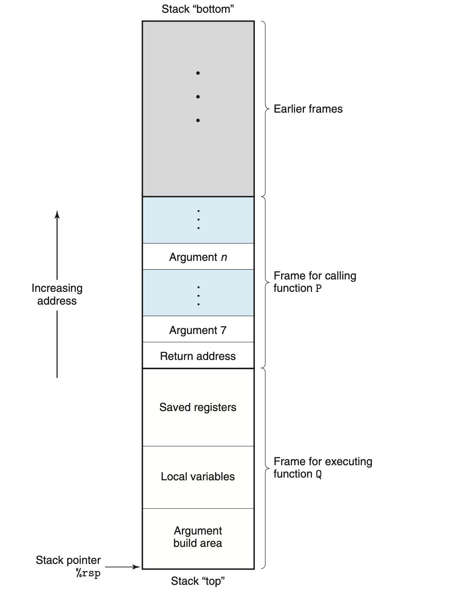</div>

<div style="text-align: center;">图 3.25 通用栈帧结构。栈可用于传递参数、存储返回信息、保存寄存器以及本地存储。当不需要时可以省略某些部分。</div>

**栈帧（stack frame）**。图 3.25 展示了运行时栈的总体结构，包括其以最通用形式划分为栈帧的方式。当前正在执行的过程的帧始终在栈顶。当过程 P 调用过程 Q 时，它会将返回地址压入栈，指示 Q 返回后程序在 P 中应恢复执行的位置。我们认为返回地址是 P 的栈帧的一部分，因为它保存了与 P 相关的状态。Q 的代码通过扩展当前栈边界来分配其栈帧所需的空间。在该空间内，它可以保存寄存器的值、分配

---

<!-- Page 0269 -->

局部变量的空间，以及为其调用的过程设置参数。大多数过程的栈帧大小是固定的，在过程开始时分配。然而，某些过程需要可变大小的帧，这个问题在 3.10.5 节中讨论。过程 P 最多可以在栈上传递六个整型值（即指针和整数），但如果 Q 需要更多参数，P 可以在调用之前将这些参数存储在其栈帧中。

为了节省空间和时间，x86-64 过程只分配其所需的栈帧部分。例如，许多过程有六个或更少的参数，因此所有参数都可以通过寄存器传递。因此，图 3.25 中所示栈帧的某些部分可以省略。实际上，许多函数甚至不需要栈帧。当所有局部变量都可以保存在寄存器中，且函数不调用任何其他函数时（有时称为叶过程，参照过程调用的树形结构），就会出现这种情况。例如，我们迄今为止检查过的函数都不需要栈帧。

### 3.7.2 控制转移

将控制从函数 P 传递到函数 Q 只需将程序计数器（PC）设置为 Q 的代码的起始地址。但是，当 Q 最终需要返回时，处理器必须有某种记录，记录它应在哪个代码位置恢复 P 的执行。在 x86-64 机器中，这些信息通过使用指令 `call Q` 来调用过程 Q 来记录。该指令将地址 A 压入栈，并将 PC 设置为 Q 的开头。压入的地址 A 称为**返回地址**，计算为紧随 call 指令之后的指令地址。对应的指令 `ret` 从栈上弹出地址 A，并将 PC 设置为 A。

call 和 ret 指令的一般形式描述如下：

| 指令 | 描述 |
|------|------|
| `call Label` | 过程调用 |
| `call *Operand` | 过程调用 |
| `ret` | 从调用返回 |

（这些指令在程序 OBJDUMP 生成的反汇编输出中称为 `callq` 和 `retq`。添加的后缀 `q` 仅仅强调这些是 x86-64 版本的 call 和 return 指令，而非 IA32。在 x86-64 汇编代码中，两个版本可以互换使用。）

call 指令有一个目标，指示被调用过程起始指令的地址。与跳转类似，call 可以是直接或间接的。在汇编代码中，直接 call 的目标以标签给出，而间接 call 的目标由 `*` 后跟使用图 3.3 中描述的格式之一的操作数说明符给出。

---

<!-- Page 0270 -->

<div style="text-align: center;">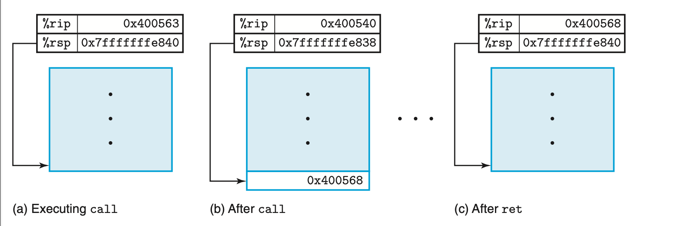</div>

<div style="text-align: center;">图 3.26 call 和 ret 函数的说明。call 指令将控制转移到函数的开头，而 ret 指令返回到 call 之后的指令。</div>


图 3.26 说明了在 3.2.2 节介绍的 `multstore` 和 `main` 函数的 call 和 ret 指令的执行过程。以下是两个函数的反汇编代码片段：

```
函数 multstore 的开始
1  0000000000400540 <multstore>:
2  400540: 53                  ...
3  400541: 48 89 d3            ...
   ...
   函数 multstore 的返回
4  40054d: c3                  ...
   ...
   从 main 调用 multstore
5  400563: e8 d8 ff ff ff      callq 400540 <multstore>
6  400568: 48 8b 54 24 08      mov   0x8(%rsp), %rdx
   ...
```

在此代码中，我们可以看到 `main` 中地址 0x400563 处的 call 指令调用函数 `multstore`。该状态如图 3.26(a) 所示，其中显示了栈指针 `%rsp` 和程序计数器 `%rip` 的指示值。call 的效果是将返回地址 0x400568 压入栈，并跳转到函数 `multstore` 的第一条指令，地址为 0x0400540（图 3.26(b)）。函数 `multstore` 的执行继续，直到在地址 0x40054d 处遇到 ret 指令。该指令从栈中弹出值 0x400568，并跳转到该地址，从而在 call 指令之后恢复 `main` 的执行（图 3.26(c)）。

作为传递控制到过程及从过程返回的更详细示例，图 3.27(a) 展示了两个函数 `top` 和 `leaf` 的反汇编代码，以及 `main` 函数中调用 `top` 的代码部分。每条指令由标签 L1-L2（在 `leaf` 中）、T1-T4（在 `top` 中）和 M1-M2（在 `main` 中）标识。图的 (b) 部分展示了代码执行的详细跟踪，其中 `main` 调用 `top(100)`，导致 `top` 调用 `leaf(95)`。函数 `leaf` 将 97 返回给 `top`，`top`

<!-- Page 0271 -->

(a) 示例代码的反汇编
```
leaf(long y) 的反汇编
y in %rdi
0000000000400540 <leaf>:
  400540: 48 8d 47 02    lea 0x2(%rdi),%rax    L1: z+2
  400544: c3             retq                  L2: Return

0000000000400545 <top>:
top(long x) 的反汇编
x in %rdi
  400545: 48 83 ef 05    sub $0x5,%rdi         T1: x-5
  400549: e8 f2 ff ff ff callq 400540 <leaf>   T2: Call leaf(x-5)
  40054e: 48 01 c0       add %rax,%rax         T3: Double result
  400551: c3             retq                  T4: Return

从函数 main 调用 top
  40055b: e8 e5 ff ff ff callq 400545 <top>    M1: Call top(100)
  400560: 48 89 c2       mov %rax,%rdx         M2: Resume
```

<div style="text-align: center;">(b) 示例代码的执行跟踪</div>

<table border=1 style='margin: auto; word-wrap: break-word;'><tr><td colspan="3">Instruction</td><td colspan="4">State values (at beginning)</td><td rowspan="2">Description</td></tr><tr><td style='text-align: center; word-wrap: break-word;'>Label</td><td style='text-align: center; word-wrap: break-word;'>PC</td><td style='text-align: center; word-wrap: break-word;'>Instruction</td><td style='text-align: center; word-wrap: break-word;'>%rdi</td><td style='text-align: center; word-wrap: break-word;'>%rax</td><td style='text-align: center; word-wrap: break-word;'>%rsp</td><td style='text-align: center; word-wrap: break-word;'>*%rsp</td></tr><tr><td style='text-align: center; word-wrap: break-word;'>M1</td><td style='text-align: center; word-wrap: break-word;'>0x40055b</td><td style='text-align: center; word-wrap: break-word;'>callq</td><td style='text-align: center; word-wrap: break-word;'>100</td><td style='text-align: center; word-wrap: break-word;'>—</td><td style='text-align: center; word-wrap: break-word;'>0x7FFFFFF820</td><td style='text-align: center; word-wrap: break-word;'>—</td><td style='text-align: center; word-wrap: break-word;'>Call top(100)</td></tr><tr><td style='text-align: center; word-wrap: break-word;'>T1</td><td style='text-align: center; word-wrap: break-word;'>0x400545</td><td style='text-align: center; word-wrap: break-word;'>sub</td><td style='text-align: center; word-wrap: break-word;'>100</td><td style='text-align: center; word-wrap: break-word;'>—</td><td style='text-align: center; word-wrap: break-word;'>0x7FFFFFF818</td><td style='text-align: center; word-wrap: break-word;'>0x400560</td><td style='text-align: center; word-wrap: break-word;'>Entry of top</td></tr><tr><td style='text-align: center; word-wrap: break-word;'>T2</td><td style='text-align: center; word-wrap: break-word;'>0x400549</td><td style='text-align: center; word-wrap: break-word;'>callq</td><td style='text-align: center; word-wrap: break-word;'>95</td><td style='text-align: center; word-wrap: break-word;'>—</td><td style='text-align: center; word-wrap: break-word;'>0x7FFFFFF818</td><td style='text-align: center; word-wrap: break-word;'>0x400560</td><td style='text-align: center; word-wrap: break-word;'>Call leaf(95)</td></tr><tr><td style='text-align: center; word-wrap: break-word;'>L1</td><td style='text-align: center; word-wrap: break-word;'>0x400540</td><td style='text-align: center; word-wrap: break-word;'>lea</td><td style='text-align: center; word-wrap: break-word;'>95</td><td style='text-align: center; word-wrap: break-word;'>—</td><td style='text-align: center; word-wrap: break-word;'>0x7FFFFFF810</td><td style='text-align: center; word-wrap: break-word;'>0x40054e</td><td style='text-align: center; word-wrap: break-word;'>Entry of leaf</td></tr><tr><td style='text-align: center; word-wrap: break-word;'>L2</td><td style='text-align: center; word-wrap: break-word;'>0x400544</td><td style='text-align: center; word-wrap: break-word;'>retq</td><td style='text-align: center; word-wrap: break-word;'>—</td><td style='text-align: center; word-wrap: break-word;'>97</td><td style='text-align: center; word-wrap: break-word;'>0x7FFFFFF810</td><td style='text-align: center; word-wrap: break-word;'>0x40054e</td><td style='text-align: center; word-wrap: break-word;'>Return 97 from leaf</td></tr><tr><td style='text-align: center; word-wrap: break-word;'>T3</td><td style='text-align: center; word-wrap: break-word;'>0x40054e</td><td style='text-align: center; word-wrap: break-word;'>add</td><td style='text-align: center; word-wrap: break-word;'>—</td><td style='text-align: center; word-wrap: break-word;'>97</td><td style='text-align: center; word-wrap: break-word;'>0x7FFFFFF818</td><td style='text-align: center; word-wrap: break-word;'>0x400560</td><td style='text-align: center; word-wrap: break-word;'>Resume top</td></tr><tr><td style='text-align: center; word-wrap: break-word;'>T4</td><td style='text-align: center; word-wrap: break-word;'>0x400551</td><td style='text-align: center; word-wrap: break-word;'>retq</td><td style='text-align: center; word-wrap: break-word;'>—</td><td style='text-align: center; word-wrap: break-word;'>194</td><td style='text-align: center; word-wrap: break-word;'>0x7FFFFFF818</td><td style='text-align: center; word-wrap: break-word;'>0x400560</td><td style='text-align: center; word-wrap: break-word;'>Return 194 from top</td></tr><tr><td style='text-align: center; word-wrap: break-word;'>M2</td><td style='text-align: center; word-wrap: break-word;'>0x400560</td><td style='text-align: center; word-wrap: break-word;'>mov</td><td style='text-align: center; word-wrap: break-word;'>—</td><td style='text-align: center; word-wrap: break-word;'>194</td><td style='text-align: center; word-wrap: break-word;'>0x7FFFFFF820</td><td style='text-align: center; word-wrap: break-word;'>—</td><td style='text-align: center; word-wrap: break-word;'>Resume main</td></tr></table>

<div style="text-align: center;">图 3.27 涉及过程调用和返回的程序详细执行过程。使用栈存储返回地址使程序能够返回到正确的过程位置。</div>


然后将 194 返回给 `main`。前三列描述正在执行的指令，包括指令标签、地址和指令类型。接下来的四列显示指令执行之前程序的状态，包括寄存器 `%rdi`、`%rax` 和 `%rsp` 的内容，以及栈顶的值。应仔细研究此表的内容，因为它

---

<!-- Page 0272 -->

演示了运行时栈在管理支持过程调用和返回所需存储方面的重要作用。

`leaf` 的指令 L1 将 `%rax` 设置为 97，即要返回的值。然后指令 L2 返回，从栈中弹出 0x400054e。通过将 PC 设置为这个弹出的值，控制转移回 `top` 的指令 T3。程序已成功完成对 `leaf` 的调用并返回到 `top`。

指令 T3 将 `%rax` 设置为 194，即从 `top` 返回的值。然后指令 T4 返回，从栈中弹出 0x4000560，从而将 PC 设置为 `main` 的指令 M2。程序已成功完成对 `top` 的调用并返回到 `main`。我们看到栈指针也已恢复为 0x7FFFFFF820，即调用 `top` 之前的值。

我们可以看到，将返回地址压入栈这一简单机制使函数能够在以后返回到程序中的正确位置。C 语言（以及大多数编程语言）的标准 call/return 机制方便地匹配了栈数据结构提供的后进先出内存管理方式。

**练习题 3.32（答案见第 375 页）**

两个函数 `first` 和 `last` 的反汇编代码如下所示，以及函数 `main` 调用 `first` 的代码：

```
last(long u, long v) 的反汇编
u in %rdi, v in %rsi
0000000000400540 <last>:
  400540: 48 89 f8       mov  %rdi,%rax    L1: u
  400543: 48 0f af c6    imul %rsi,%rax    L2: u*v
  400547: c3             retq              L3: Return

first(long x) 的反汇编
x in %rdi
0000000000400548 <first>:
  400548: 48 8d 77 01    lea 0x1(%rdi),%rsi    F1: x+1
  40054c: 48 83 ef 01    sub $0x1,%rdi         F2: x-1
  400550: e8 eb ff ff ff callq 400540 <last>   F3: Call last(x-1,x+1)
  400555: f3 c3          repz retq             F4: Return

  400560: e8 e3 ff ff ff callq 400548 <first>  M1: Call first(10)
  400565: 48 89 c2       mov %rax,%rdx         M2: Resume
```

每条指令都有一个标签，类似于图 3.27(a) 中的标签。从 `main` 调用 `first(10)` 开始，填写以下表格以跟踪指令执行，直到程序返回 `main` 为止。

---

<!-- Page 0273 -->

<table border=1 style='margin: auto; word-wrap: break-word;'><tr><td colspan="3">Instruction</td><td colspan="6">State values (at beginning)</td><td rowspan="3">Description</td></tr><tr><td style='text-align: center;'>Label</td><td style='text-align: center;'>PC</td><td style='text-align: center;'>Instruction</td><td style='text-align: center;'>%rdi</td><td style='text-align: center;'>%rsi</td><td style='text-align: center;'>%rax</td><td style='text-align: center;'>%rsp</td><td style='text-align: center;'>*%rsp</td><td style='text-align: center;'>Description</td></tr><tr><td>M1</td><td>0x400560</td><td>callq</td><td>10</td><td>—</td><td>—</td><td>0x7FFFFFF820</td><td>—</td><td>Call first(10)</td></tr><tr><td>F1</td><td></td><td></td><td></td><td></td><td></td><td></td><td></td><td></td></tr><tr><td>F2</td><td></td><td></td><td></td><td></td><td></td><td></td><td></td><td></td></tr><tr><td>F3</td><td></td><td></td><td></td><td></td><td></td><td></td><td></td><td></td></tr><tr><td>L1</td><td></td><td></td><td></td><td></td><td></td><td></td><td></td><td></td></tr><tr><td>L2</td><td></td><td></td><td></td><td></td><td></td><td></td><td></td><td></td></tr><tr><td>L3</td><td></td><td></td><td></td><td></td><td></td><td></td><td></td><td></td></tr><tr><td>F4</td><td></td><td></td><td></td><td></td><td></td><td></td><td></td><td></td></tr><tr><td>M2</td><td></td><td></td><td></td><td></td><td></td><td></td><td></td><td></td></tr></table>

### 3.7.3 数据传递

除了在调用过程时传递控制，以及过程返回时传回控制之外，过程调用还可能涉及将数据作为参数传递，过程的返回也可能涉及返回值。在 x86-64 中，大多数这些传入和传出过程的数据都通过寄存器进行。例如，我们已经看到了许多函数的例子，其中参数在寄存器 `%rdi`、`%rsi` 等中传递，返回值在寄存器 `%rax` 中传递。当过程 P 调用过程 Q 时，P 的代码必须首先将参数复制到适当的寄存器中。类似地，当 Q 返回到 P 时，P 的代码可以在寄存器 `%rax` 中访问返回值。在本节中，我们将更详细地探讨这些约定。

在 x86-64 中，最多可以通过寄存器传递六个整型（即整数和指针）参数。寄存器按照指定顺序使用，用于寄存器的名称取决于所传递数据类型的大小。如图 3.28 所示，参数按照其

<table border=1 style='margin: auto; word-wrap: break-word;'><tr><td rowspan="2">Operand size (bits)</td><td colspan="6">Argument number</td></tr><tr><td style='text-align: center; word-wrap: break-word;'>1</td><td style='text-align: center; word-wrap: break-word;'>2</td><td style='text-align: center; word-wrap: break-word;'>3</td><td style='text-align: center; word-wrap: break-word;'>4</td><td style='text-align: center; word-wrap: break-word;'>5</td><td style='text-align: center; word-wrap: break-word;'>6</td></tr><tr><td style='text-align: center; word-wrap: break-word;'>64</td><td style='text-align: center; word-wrap: break-word;'>%rdi</td><td style='text-align: center; word-wrap: break-word;'>%rsi</td><td style='text-align: center; word-wrap: break-word;'>%rdx</td><td style='text-align: center; word-wrap: break-word;'>%rcx</td><td style='text-align: center; word-wrap: break-word;'>%r8</td><td style='text-align: center; word-wrap: break-word;'>%r9</td></tr><tr><td style='text-align: center; word-wrap: break-word;'>32</td><td style='text-align: center; word-wrap: break-word;'>%edi</td><td style='text-align: center; word-wrap: break-word;'>%esi</td><td style='text-align: center; word-wrap: break-word;'>%edx</td><td style='text-align: center; word-wrap: break-word;'>%ecx</td><td style='text-align: center; word-wrap: break-word;'>%r8d</td><td style='text-align: center; word-wrap: break-word;'>%r9d</td></tr><tr><td style='text-align: center; word-wrap: break-word;'>16</td><td style='text-align: center; word-wrap: break-word;'>%di</td><td style='text-align: center; word-wrap: break-word;'>%si</td><td style='text-align: center; word-wrap: break-word;'>%dx</td><td style='text-align: center; word-wrap: break-word;'>%cx</td><td style='text-align: center; word-wrap: break-word;'>%r8w</td><td style='text-align: center; word-wrap: break-word;'>%r9w</td></tr><tr><td style='text-align: center; word-wrap: break-word;'>8</td><td style='text-align: center; word-wrap: break-word;'>%dil</td><td style='text-align: center; word-wrap: break-word;'>%sil</td><td style='text-align: center; word-wrap: break-word;'>%dl</td><td style='text-align: center; word-wrap: break-word;'>%cl</td><td style='text-align: center; word-wrap: break-word;'>%r8b</td><td style='text-align: center; word-wrap: break-word;'>%r9b</td></tr></table>

<div style="text-align: center;">图 3.28 传递函数参数的寄存器。寄存器按指定顺序使用，根据参数大小命名。</div>

---

<!-- Page 0274 -->

在参数列表中的顺序分配到这些寄存器。小于 64 位的参数可以使用 64 位寄存器的适当子部分来访问。例如，如果第一个参数是 32 位的，可以通过 `%edi` 访问它。

当函数有六个以上的整型参数时，其余参数通过栈传递。假设过程 P 调用过程 Q，有 n 个整型参数（n > 6）。那么 P 的代码必须分配一个栈帧，其中有足够的存储空间用于参数 7 到 n，如图 3.25 所示。它将参数 1-6 复制到适当的寄存器，并将参数 7 到 n 放在栈上，参数 7 位于栈顶。通过栈传递参数时，所有数据大小都向上取整为 8 的倍数。将参数放置好后，程序可以执行 call 指令将控制转移到过程 Q。过程 Q 可以通过寄存器访问其参数，也可能从栈中访问。如果 Q 又调用某个有六个以上参数的函数，它可以在其栈帧中分配空间，如图 3.25 中标记为"参数构建区域"的区域所示。

作为参数传递的例子，考虑图 3.29(a) 所示的 C 函数 `proc`。该函数有八个参数，包括不同字节数（8、4、2 和 1）的整数，以及不同类型的指针，每个指针大小为 8 字节。

为 `proc` 生成的汇编代码如图 3.29(b) 所示。前六个参数通过寄存器传递。最后两个参数通过栈传递，如图 3.30 的图示所示。该图显示了 `proc` 执行期间的栈状态。我们可以看到，返回地址作为过程调用的一部分被压入了栈。因此，两个参数相对于栈指针分别位于偏移量 8 和 16 处。在代码中，我们可以看到根据操作数大小使用了不同版本的 ADD 指令：`addq` 用于 a1（long），`addl` 用于 a2（int），`addw` 用于 a3（short），`addb` 用于 a4（char）。注意第 6 行的 `movl` 指令从内存读取 4 字节；随后的 `addb` 指令只使用低位字节。

**练习题 3.33（答案见第 375 页）**

C 函数 `procprob` 有四个参数 u、a、v 和 b。每个参数要么是有符号数，要么是有符号数的指针，其中数字的大小不同。该函数有以下函数体：

```c
*u += a;
*v += b;
return sizeof(a) + sizeof(b);
```

它编译为以下 x86-64 代码：

```
1  procprob:
2      movslq %edi, %rdi
3      addq   %rdi, (%rdx)
4      addb   %sil, (%rcx)
```

---

<!-- Page 0275 -->

(a) C 代码
```c
void proc(long a1, long *a1p,
            int a2, int *a2p,
            short a3, short *a3p,
            char a4, char *a4p)
{
    *a1p += a1;
    *a2p += a2;
    *a3p += a3;
    *a4p += a4;
}
```

(b) 生成的汇编代码
```
void proc(a1, a1p, a2, a2p, a3, a3p, a4, a4p)
参数传递方式如下：
    a1  in %rdi     (64 bits)
    a1p in %rsi     (64 bits)
    a2  in %edx     (32 bits)
    a2p in %rcx     (64 bits)
    a3  in %r8w     (16 bits)
    a3p in %r9      (64 bits)
    a4  at %rsp+8   (8 bits)
    a4p at %rsp+16  (64 bits)
proc:
    movq 16(%rsp), %rax    Fetch a4p (64 bits)
    addq %rdi, (%rsi)      *a1p += a1 (64 bits)
    addl %edx, (%rcx)      *a2p += a2 (32 bits)
    addw %r8w, (%r9)       *a3p += a3 (16 bits)
    movl 8(%rsp), %edx     Fetch a4 (8 bits)
    addb %dl, (%rax)       *a4p += a4 (8 bits)
    ret                    Return
```

<div style="text-align: center;">图 3.29 具有不同类型多个参数的函数示例。参数 1-6 通过寄存器传递，参数 7-8 通过栈传递。</div>

<div style="text-align: center;">图 3.30 函数 proc 的栈帧结构。参数 a4 和 a4p 通过栈传递。</div>

<div style="text-align: center;">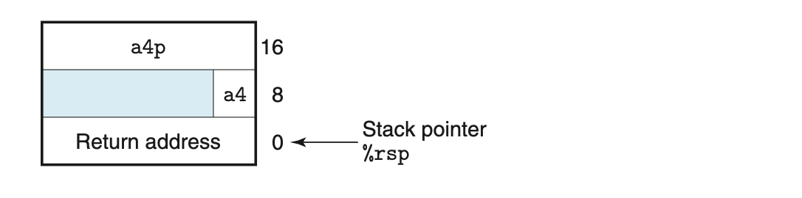</div>

---

<!-- Page 0276 -->

```
5      movl $6, %eax
6      ret
```

确定四个参数的有效排序和类型。有两个正确答案。

### 3.7.4 栈上的局部存储

到目前为止，我们所看到的大多数过程示例都不需要超出寄存器所能容纳的局部存储。然而，有时局部数据必须存储在内存中。常见情况包括：

- 没有足够的寄存器来保存所有局部数据。
- 对局部变量应用了取地址运算符 `&`，因此必须能够为其生成地址。
- 某些局部变量是数组或结构体，因此必须通过数组或结构体引用来访问。我们将在描述数组和结构体如何分配时讨论这种可能性。

通常，过程通过递减栈指针在栈帧上分配空间。这导致了图 3.25 中标记为"局部变量"的栈帧部分。

作为处理取地址运算符的例子，考虑图 3.31(a) 所示的两个函数。函数 `swap_add` 交换指针 `xp` 和 `yp` 指定的两个值，并返回这两个值的和。函数 `caller` 创建指向局部变量 `arg1` 和 `arg2` 的指针，并将这些指针传递给 `swap_add`。图 3.31(b) 显示了 `caller` 如何使用栈帧来实现这些局部变量。`caller` 的代码首先将栈指针减少 16，这实际上在栈上分配了 16 字节。设 S 表示栈指针的值，我们可以看到代码将 `&arg2` 计算为 $S + 8$（第 5 行），将 `&arg1` 计算为 S（第 6 行）。因此我们可以推断，局部变量 `arg1` 和 `arg2` 存储在栈帧中，相对于栈指针的偏移量分别为 0 和 8。当对 `swap_add` 的调用完成后，`caller` 的代码从栈中获取这两个值（第 8-9 行），计算它们的差，并将其与 `swap_add` 在寄存器 `%rax` 中返回的值相乘（第 10 行）。最后，函数通过将栈指针增加 16 来释放其栈帧（第 11 行）。通过这个例子，我们可以看到运行时栈提供了一种简单的机制，在需要时分配局部存储，在函数完成时释放它。

作为更复杂的例子，图 3.32 所示的函数 `call_proc` 说明了 x86-64 栈规范的许多方面。尽管这个例子较长，但值得仔细研究。它展示了一个必须在栈上为局部变量分配存储以及为向 8 参数函数 `proc`（图 3.29）传递值的函数。该函数创建了一个栈帧，如图 3.33 所示。

查看 `call_proc` 的汇编代码（图 3.32(b)），我们可以看到大部分代码（第 2-15 行）涉及准备调用函数

---

<!-- Page 0277 -->

(a) C 代码
```c
long swap_add(long *xp, long *yp)
{
    long x = *xp;
    long y = *yp;
    *xp = y;
    *yp = x;
    return x + y;
}

long caller()
{
    long arg1 = 534;
    long arg2 = 1057;
    long sum = swap_add(&arg1, &arg2);
    long diff = arg1 - arg2;
    return sum * diff;
}
```

(b) 调用函数生成的汇编代码
```
long caller()
1  caller:
2      subq $16, %rsp          Allocate 16 bytes for stack frame
3      movq $534, (%rsp)       Store 534 in arg1
4      movq $1057, 8(%rsp)     Store 1057 in arg2
5      leaq 8(%rsp), %rsi      Compute &arg2 as second argument
6      movq %rsp, %rdi         Compute &arg1 as first argument
7      call swap_add            Call swap_add(&arg1, &arg2)
8      movq (%rsp), %rdx       Get arg1
9      subq 8(%rsp), %rdx      Compute diff = arg1 - arg2
10     imulq %rdx, %rax        Compute sum * diff
11     addq $16, %rsp          Deallocate stack frame
12     ret                     Return
```

<div style="text-align: center;">图 3.31 过程定义和调用示例。由于取地址运算符的存在，调用代码必须分配栈帧。</div>


---

<!-- Page 0278 -->

(a) C 代码
```c
long call_proc()
{
    long x1 = 1; int x2 = 2;
    short x3 = 3; char x4 = 4;
    proc(x1, &x1, x2, &x2, x3, &x3, x4, &x4);
    return (x1 + x2) * (x3 - x4);
}
```

(b) 生成的汇编代码
```
long call_proc()
1   call_proc:
    Set up arguments to proc
2       subq    $32, %rsp       Allocate 32-byte stack frame
3       movq    $1, 24(%rsp)    Store 1 in &x1
4       movl    $2, 20(%rsp)    Store 2 in &x2
5       movw    $3, 18(%rsp)    Store 3 in &x3
6       movb    $4, 17(%rsp)    Store 4 in &x4
7       leaq    17(%rsp), %rax  Create &x4
8       movq    %rax, 8(%rsp)   Store &x4 as argument 8
9       movl    $4, (%rsp)      Store 4 as argument 7
10      leaq    18(%rsp), %r9   Pass &x3 as argument 6
11      movl    $3, %r8d        Pass 3 as argument 5
12      leaq    20(%rsp), %rcx  Pass &x2 as argument 4
13      movl    $2, %edx        Pass 2 as argument 3
14      leaq    24(%rsp), %rsi  Pass &x1 as argument 2
15      movl    $1, %edi        Pass 1 as argument 1
    Call proc
16      call    proc
    Retrieve changes to memory
17      movslq  20(%rsp), %rdx  Get x2 and convert to long
18      addq    24(%rsp), %rdx  Compute x1 + x2
19      movswl  18(%rsp), %eax  Get x3 and convert to int
20      movsbl  17(%rsp), %ecx  Get x4 and convert to int
21      subl    %ecx, %eax      Compute x3 - x4
22      cltq
23      imulq   %rdx, %rax      Convert to long; Compute (x1+x2)*(x3-x4)
24      addq    $32, %rsp       Deallocate stack frame
25      ret
```

<div style="text-align: center;">图 3.32 调用图 3.29 中定义的函数 proc 的代码示例。这段代码创建了一个栈帧。</div>

---

<!-- Page 0279 -->

<div style="text-align: center;">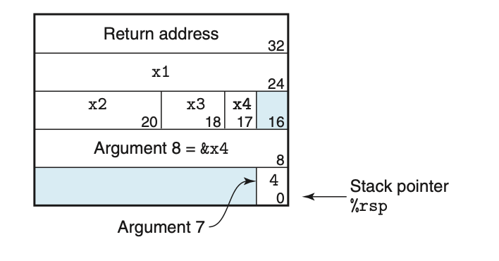</div>

<div style="text-align: center;">图 3.33 函数 call_proc 的栈帧。栈帧包含局部变量，以及传递给函数 proc 的两个参数。</div>

当过程 `proc` 被调用时，程序将开始执行图 3.29(b) 中所示的代码。如图 3.30 所示，参数 7 和 8 现在相对于栈指针分别位于偏移量 8 和 16 处，因为返回地址已被压入栈。

当程序返回到 `call_proc` 时，代码检索四个局部变量的值（第 17-20 行）并执行最终计算。最后通过将栈指针增加 32 来释放栈帧。

### 3.7.5 寄存器中的局部存储

程序寄存器组充当所有过程共享的单一资源。尽管在任何给定时间只有一个过程处于活动状态，但我们必须确保当一个过程（调用者）调用另一个过程（被调用者）时，被调用者不会覆盖调用者计划稍后使用的某个寄存器值。为此，x86-64 采用了一套统一的寄存器使用约定，所有过程（包括程序库中的过程）都必须遵守。

按照约定，寄存器 `%rbx`、`%rbp` 和 `%r12`-`%r15` 被归类为**被调用者保存寄存器（callee-saved registers）**。当过程 P 调用过程 Q 时，Q 必须保留这些寄存器的值，确保当 Q 返回到 P 时，它们的值与 Q 被调用时相同。过程 Q 可以通过完全不改变寄存器值，或者将原始值压入栈、修改它，然后在返回之前从栈中弹出旧值来保留寄存器值。压入寄存器值的效果是创建了图 3.25 中标记为"保存的寄存器"的栈帧部分。有了这个约定，P 的代码可以安全地将值存储在被调用者保存的寄存器中（当然，先将之前的值保存在栈上），调用 Q，然后使用寄存器中的值，而不用担心它被破坏。

除栈指针 `%rsp` 之外的所有其他寄存器都被归类为**调用者保存寄存器（caller-saved registers）**。这意味着它们可以被任何函数修改。"调用者保存"这个名称可以在过程 P 在此类寄存器中有一些局部数据并调用过程 Q 的情境下理解。由于 Q 可以自由地修改这个寄存器，因此 P（调用者）有责任在调用之前先保存数据。

作为例子，考虑图 3.34(a) 所示的函数 P。它调用 Q 两次。在第一次调用期间，它必须保留 x 的值供以后使用。类似地，在第二次调用期间，它必须保留为 Q(y) 计算的值。在图 3.34(b) 中，

---

<!-- Page 0280 -->

(a) C 代码
```c
long P(long x, long y)
{
    long u = Q(y);
    long v = Q(x);
    return u + v;
}
```

(b) 调用函数生成的汇编代码

```
long P(long x, long y)
x in %rdi, y in %rsi
1  P:
2      pushq %rbp          Save %rbp
3      pushq %rbx          Save %rbx
4      subq  $8, %rsp      Align stack frame
5      movq  %rdi, %rbp    Save x
6      movq  %rsi, %rdi    Move y to first argument
7      call  Q             Call Q(y)
8      movq  %rax, %rbx    Save result
9      movq  %rbp, %rdi    Move x to first argument
10     call  Q             Call Q(x)
11     addq  %rbx, %rax    Add saved Q(y) to Q(x)
12     addq  $8, %rsp      Deallocate last part of stack
13     popq  %rbx          Restore %rbx
14     popq  %rbp          Restore %rbp
15     ret
```

<div style="text-align: center;">图 3.34 演示使用被调用者保存寄存器的代码。x 的值必须在第一次调用期间保留，Q(y) 的值必须在第二次调用期间保留。</div>


我们可以看到 GCC 生成的代码使用了两个被调用者保存寄存器：`%rbp` 用于保存 x，`%rbx` 用于保存计算得到的 Q(y) 值。在函数开始时，它将这两个寄存器的值保存到栈上（第 2-3 行）。在第一次调用 Q 之前，它将参数 x 复制到 `%rbp`（第 5 行）。在第二次调用 Q 之前，它将此调用的结果复制到 `%rbx`（第 8 行）。在函数末尾（第 13-14 行），它通过从栈中弹出来恢复两个被调用者保存寄存器的值。注意它们的弹出顺序与压入顺序相反，以符合栈的后进先出原则。

**练习题 3.34（答案见第 376 页）**

考虑一个函数 P，它生成名为 a0-a8 的局部值，然后使用这些生成的值作为参数调用函数 Q。GCC 为 P 的第一部分生成以下代码：

---

<!-- Page 0281 -->

```
x in %rdi
P:
    pushq %r15
    pushq %r14
    pushq %r13
    pushq %r12
    pushq %rbp
    pushq %rbx
    subq  $24, %rsp
    movq  %rdi, %rbx
    leaq  1(%rdi), %r15
    leaq  2(%rdi), %r14
    leaq  3(%rdi), %r13
    leaq  4(%rdi), %r12
    leaq  5(%rdi), %rbp
    leaq  6(%rdi), %rax
    movq  %rax, (%rsp)
    leaq  7(%rdi), %rdx
    movq  %rdx, 8(%rsp)
    movl  $0, %eax
    call  Q
```

A. 确定哪些局部值存储在被调用者保存寄存器中。
B. 确定哪些局部值存储在栈上。
C. 解释为什么程序无法将所有局部值存储在被调用者保存寄存器中。

### 3.7.6 递归过程

我们描述的寄存器和栈的使用约定允许 x86-64 过程递归地调用自身。每次过程调用在栈上都有自己的私有空间，因此多个未完成调用的局部变量不会相互干扰。此外，栈规范自然地提供了在过程被调用时分配局部存储以及在返回之前释放它的正确策略。

图 3.35 展示了递归阶乘函数的 C 代码和生成的汇编代码。我们可以看到，汇编代码使用寄存器 `%rbx` 来保存参数 n，首先将现有值保存在栈上（第 2 行），然后在返回之前恢复该值（第 11 行）。由于栈规范和寄存器保存约定，我们可以确保当对 `rfact(n-1)` 的递归调用返回时（第 9 行），(1) 调用结果将保存在寄存器

---

<!-- Page 0282 -->

(a) C 代码
```c
long rfact(long n)
{
    long result;
    if (n <= 1)
        result = 1;
    else
        result = n * rfact(n-1);
    return result;
}
```

(b) 生成的汇编代码

```
long rfact(long n)
    n in %rdi
1  rfact:
2      pushq %rbx          Save %rbx
3      movq  %rdi, %rbx    Store n in callee-saved register
4      movl  $1, %eax      Set return value = 1
5      cmpq  $1, %rdi      Compare n:1
6      jle   .L35          If <=, goto done
7      leaq  -1(%rdi), %rdi Compute n-1
8      call  rfact          Call rfact(n-1)
9      imulq %rbx, %rax    Multiply result by n
10 .L35:                   done:
11     popq  %rbx          Restore %rbx
12     ret                 Return
```

<div style="text-align: center;">图 3.35 递归阶乘程序的代码。标准过程处理机制足以实现递归函数。</div>


`%rax` 中，(2) 参数 n 的值将保存在寄存器 `%rbx` 中。然后将这两个值相乘就可以得到期望的结果。

从这个例子中我们可以看到，递归调用函数的过程与任何其他函数调用完全相同。我们的栈规范提供了一种机制，其中函数的每次调用都有自己的私有存储，用于保存状态信息（返回位置和被调用者保存寄存器的保存值）。如有需要，它还可以提供局部变量的存储。分配和释放的栈规范自然地匹配函数的调用-返回顺序。这种实现函数调用和返回的方法甚至适用于更复杂的模式，包括互递归（例如，当过程 P 调用 Q，Q 又调用 P 时）。

**练习题 3.35（答案见第 376 页）**

对于具有以下通用结构的 C 函数：

---

<!-- Page 0283 -->

```c
if (___)
    return ___;
unsigned long nx = ___;
long rv = rfun(nx);
return ___;
```

GCC 生成以下汇编代码：

```
long rfun(unsigned long x)
x in %rdi
rfun:
    pushq %rbx
    movq  %rdi, %rbx
    movl  $0, %eax
    testq %rdi, %rdi
    je    .L2
    shrq  $2, %rdi
    call  rfun
    addq  %rbx, %rax
.L2:
    popq  %rbx
    ret
```

A. `rfun` 在被调用者保存寄存器 `%rbx` 中存储了什么值？
B. 填写上面 C 代码中缺失的表达式。

## 3.8 数组的分配与访问

C 中的数组是将标量数据聚合成更大数据类型的一种方式。C 使用特别简单的数组实现，因此转换为机器代码相当直接。C 的一个不寻常特性是我们可以生成指向数组内元素的指针，并对这些指针执行算术运算。这些会被转换为机器代码中的地址计算。

优化编译器特别擅长简化数组索引所使用的地址计算。这会使 C 代码与其机器代码翻译之间的对应关系有些难以解读。

### 3.8.1 基本原则

对于数据类型 T 和整数常量 N，考虑以下形式的声明：

```c
T A[N];
```

---

<!-- Page 0284 -->

设其起始位置为 $x_A$。该声明有两个效果。首先，它在内存中分配一个连续的 $L \cdot N$ 字节区域，其中 $L$ 是数据类型 $T$ 的大小（以字节为单位）。其次，它引入一个标识符 $A$，可以用作指向数组开头的指针。该指针的值为 $x_A$。数组元素可以使用 0 到 $N-1$ 之间的整数索引来访问。数组元素 $i$ 将存储在地址 $x_A + L \cdot i$ 处。

作为例子，考虑以下声明：

```c
char    A[12];
char   *B[8];
int     C[6];
double *D[5];
```

<div style="text-align: center;">这些声明将生成具有以下参数的数组：</div>

<table border=1 style='margin: auto; word-wrap: break-word;'><tr><td style='text-align: center; word-wrap: break-word;'>Array</td><td style='text-align: center; word-wrap: break-word;'>Element size</td><td style='text-align: center; word-wrap: break-word;'>Total size</td><td style='text-align: center; word-wrap: break-word;'>Start address</td><td style='text-align: center; word-wrap: break-word;'>Element i</td></tr><tr><td style='text-align: center; word-wrap: break-word;'>A</td><td style='text-align: center; word-wrap: break-word;'>1</td><td style='text-align: center; word-wrap: break-word;'>12</td><td style='text-align: center; word-wrap: break-word;'>$ x_{A} $</td><td style='text-align: center; word-wrap: break-word;'>$ x_{A} + i $</td></tr><tr><td style='text-align: center; word-wrap: break-word;'>B</td><td style='text-align: center; word-wrap: break-word;'>8</td><td style='text-align: center; word-wrap: break-word;'>64</td><td style='text-align: center; word-wrap: break-word;'>$ x_{B} $</td><td style='text-align: center; word-wrap: break-word;'>$ x_{B} + 8i $</td></tr><tr><td style='text-align: center; word-wrap: break-word;'>C</td><td style='text-align: center; word-wrap: break-word;'>4</td><td style='text-align: center; word-wrap: break-word;'>24</td><td style='text-align: center; word-wrap: break-word;'>$ x_{C} $</td><td style='text-align: center; word-wrap: break-word;'>$ x_{C} + 4i $</td></tr><tr><td style='text-align: center; word-wrap: break-word;'>D</td><td style='text-align: center; word-wrap: break-word;'>8</td><td style='text-align: center; word-wrap: break-word;'>40</td><td style='text-align: center; word-wrap: break-word;'>$ x_{D} $</td><td style='text-align: center; word-wrap: break-word;'>$ x_{D} + 8i $</td></tr></table>

数组 A 由 12 个单字节（char）元素组成。数组 C 由 6 个整数组成，每个整数需要 4 字节。B 和 D 都是指针数组，因此数组元素各为 8 字节。

x86-64 的内存引用指令设计用于简化数组访问。例如，假设 E 是 int 类型值的数组，我们希望求值 `E[i]`，其中 E 的地址存储在寄存器 `%rdx` 中，i 存储在寄存器 `%rcx` 中。则指令：

```
movl (%rdx, %rcx, 4), %eax
```

将执行地址计算 $x_E + 4i$，读取该内存位置，并将结果复制到寄存器 `%eax`。允许的缩放因子 1、2、4 和 8 涵盖了常见基本数据类型的大小。

**练习题 3.36（答案见第 377 页）**

考虑以下声明：

```c
int    P[5];
short  Q[2];
int  **R[9];
double *S[10];
short  *T[2];
```

填写以下表格，描述每个数组的元素大小、总大小以及第 i 个元素的地址。

---

<!-- Page 0285 -->

<table border=1 style='margin: auto; word-wrap: break-word;'><tr><td style='text-align: center; word-wrap: break-word;'>Array</td><td style='text-align: center; word-wrap: break-word;'>Element size</td><td style='text-align: center; word-wrap: break-word;'>Total size</td><td style='text-align: center; word-wrap: break-word;'>Start address</td><td style='text-align: center; word-wrap: break-word;'>Element i</td></tr><tr><td style='text-align: center; word-wrap: break-word;'>P</td><td style='text-align: center; word-wrap: break-word;'></td><td style='text-align: center; word-wrap: break-word;'></td><td style='text-align: center; word-wrap: break-word;'>$ x_{P} $</td><td style='text-align: center; word-wrap: break-word;'></td></tr><tr><td style='text-align: center; word-wrap: break-word;'>Q</td><td style='text-align: center; word-wrap: break-word;'></td><td style='text-align: center; word-wrap: break-word;'></td><td style='text-align: center; word-wrap: break-word;'>$ x_{Q} $</td><td style='text-align: center; word-wrap: break-word;'></td></tr><tr><td style='text-align: center; word-wrap: break-word;'>R</td><td style='text-align: center; word-wrap: break-word;'></td><td style='text-align: center; word-wrap: break-word;'></td><td style='text-align: center; word-wrap: break-word;'>$ x_{R} $</td><td style='text-align: center; word-wrap: break-word;'></td></tr><tr><td style='text-align: center; word-wrap: break-word;'>S</td><td style='text-align: center; word-wrap: break-word;'></td><td style='text-align: center; word-wrap: break-word;'></td><td style='text-align: center; word-wrap: break-word;'>$ x_{S} $</td><td style='text-align: center; word-wrap: break-word;'></td></tr><tr><td style='text-align: center; word-wrap: break-word;'>T</td><td style='text-align: center; word-wrap: break-word;'></td><td style='text-align: center; word-wrap: break-word;'></td><td style='text-align: center; word-wrap: break-word;'>$ x_{T} $</td><td style='text-align: center; word-wrap: break-word;'></td></tr></table>

### 3.8.2 指针运算

C 允许对指针进行算术运算，其中计算得到的值根据指针所引用数据类型的大小进行缩放。也就是说，如果 p 是指向类型 T 数据的指针，p 的值为 $x_p$，则表达式 $p + i$ 的值为 $x_p + L \cdot i$，其中 L 是数据类型 T 的大小。

单目运算符 `&` 和 `*` 允许生成和解引用指针。也就是说，对于表示某个对象的表达式 $Expr$，`&Expr` 是给出该对象地址的指针。对于表示地址的表达式 $AExpr$，`*AExpr` 给出该地址处的值。因此，表达式 $Expr$ 和 $*\&Expr$ 是等价的。数组下标操作可以应用于数组和指针。数组引用 `A[i]` 等同于表达式 `*(A+i)`。它计算第 i 个数组元素的地址，然后访问该内存位置。

扩展我们之前的例子，假设整数数组 E 的起始地址和整数索引 i 分别存储在寄存器 `%rdx` 和 `%rcx` 中。以下是一些涉及 E 的表达式。我们还展示了每个表达式的汇编代码实现，结果存储在寄存器 `%eax`（用于数据）或寄存器 `%rax`（用于指针）中：

<table border=1 style='margin: auto; word-wrap: break-word;'><tr><td style='text-align: center; word-wrap: break-word;'>Expression</td><td style='text-align: center; word-wrap: break-word;'>Type</td><td style='text-align: center; word-wrap: break-word;'>Value</td><td style='text-align: center; word-wrap: break-word;'>Assembly code</td></tr><tr><td style='text-align: center; word-wrap: break-word;'>E</td><td style='text-align: center; word-wrap: break-word;'>int *</td><td style='text-align: center; word-wrap: break-word;'>$ x_{E} $</td><td style='text-align: center; word-wrap: break-word;'>movl %rdx, %rax</td></tr><tr><td style='text-align: center; word-wrap: break-word;'>E[0]</td><td style='text-align: center; word-wrap: break-word;'>int</td><td style='text-align: center; word-wrap: break-word;'>M[x_{E}]</td><td style='text-align: center; word-wrap: break-word;'>movl (%rdx), %eax</td></tr><tr><td style='text-align: center; word-wrap: break-word;'>E[i]</td><td style='text-align: center; word-wrap: break-word;'>int</td><td style='text-align: center; word-wrap: break-word;'>M[x_{E} + 4i]</td><td style='text-align: center; word-wrap: break-word;'>movl (%rdx, %rcx, 4), %eax</td></tr><tr><td style='text-align: center; word-wrap: break-word;'>&amp;E[2]</td><td style='text-align: center; word-wrap: break-word;'>int *</td><td style='text-align: center; word-wrap: break-word;'>$ x_{E} + 8 $</td><td style='text-align: center; word-wrap: break-word;'>leaq 8(%rdx), %rax</td></tr><tr><td style='text-align: center; word-wrap: break-word;'>E+i-1</td><td style='text-align: center; word-wrap: break-word;'>int *</td><td style='text-align: center; word-wrap: break-word;'>$ x_{E} + 4i - 4 $</td><td style='text-align: center; word-wrap: break-word;'>leaq -4(%rdx, %rcx, 4), %rax</td></tr><tr><td style='text-align: center; word-wrap: break-word;'>*(E+i-3)</td><td style='text-align: center; word-wrap: break-word;'>int</td><td style='text-align: center; word-wrap: break-word;'>M[x_{E} + 4i - 12]</td><td style='text-align: center; word-wrap: break-word;'>movl -12(%rdx, %rcx, 4), %eax</td></tr><tr><td style='text-align: center; word-wrap: break-word;'>&amp;E[i]-E</td><td style='text-align: center; word-wrap: break-word;'>long</td><td style='text-align: center; word-wrap: break-word;'>i</td><td style='text-align: center; word-wrap: break-word;'>movq %rcx, %rax</td></tr></table>

在这些例子中，我们可以看到返回数组值的操作类型为 int，因此涉及 4 字节操作（例如 `movl`）和寄存器（例如 `%eax`）。返回指针的操作类型为 `int *`，因此涉及 8 字节操作（例如 `leaq`）和寄存器（例如 `%rax`）。最后一个例子表明，可以计算同一数据结构中两个指针的差，结果是类型为 long 的数据，其值等于两个地址之差除以数据类型的大小。

---

<!-- Page 0286 -->

**练习题 3.37（答案见第 377 页）**

假设 $x_p$（short 整数数组 P 的地址）和 long 整数索引 i 分别存储在寄存器 `%rdx` 和 `%rcx` 中。对于以下每个表达式，给出其类型、值的公式以及汇编代码实现。若结果是指针，则存储在寄存器 `%rax` 中；若数据类型为 short，则存储在寄存器 `%ax` 中。

<table border=1 style='margin: auto; word-wrap: break-word;'><tr><td style='text-align: center; word-wrap: break-word;'>Expression</td><td style='text-align: center; word-wrap: break-word;'>Type</td><td style='text-align: center; word-wrap: break-word;'>Value</td><td style='text-align: center; word-wrap: break-word;'>Assembly code</td></tr><tr><td style='text-align: center; word-wrap: break-word;'>P[1]</td><td style='text-align: center; word-wrap: break-word;'></td><td style='text-align: center; word-wrap: break-word;'></td><td style='text-align: center; word-wrap: break-word;'></td></tr><tr><td style='text-align: center; word-wrap: break-word;'>P+3+i</td><td style='text-align: center; word-wrap: break-word;'></td><td style='text-align: center; word-wrap: break-word;'></td><td style='text-align: center; word-wrap: break-word;'></td></tr><tr><td style='text-align: center; word-wrap: break-word;'>P[i*6-5]</td><td style='text-align: center; word-wrap: break-word;'></td><td style='text-align: center; word-wrap: break-word;'></td><td style='text-align: center; word-wrap: break-word;'></td></tr><tr><td style='text-align: center; word-wrap: break-word;'>P[2]</td><td style='text-align: center; word-wrap: break-word;'></td><td style='text-align: center; word-wrap: break-word;'></td><td style='text-align: center; word-wrap: break-word;'></td></tr><tr><td style='text-align: center; word-wrap: break-word;'>&amp;P[i+2]</td><td style='text-align: center; word-wrap: break-word;'></td><td style='text-align: center; word-wrap: break-word;'></td><td style='text-align: center; word-wrap: break-word;'></td></tr></table>

### 3.8.3 嵌套数组

即使我们创建数组的数组，数组分配和引用的一般原则仍然成立。例如，声明：

```c
int A[5][3];
```

等价于以下声明：

```c
typedef int row3_t[3];
row3_t A[5];
```

数据类型 `row3_t` 定义为三个整数的数组。数组 A 包含五个这样的元素，每个元素需要 12 字节来存储三个整数。因此，总数组大小为 $4 \times 5 \times 3 = 60$ 字节。

数组 A 也可以被视为一个五行三列的二维数组，从 `A[0][0]` 到 `A[4][2]` 引用。数组元素在内存中按**行优先顺序**排列，即第 0 行的所有元素（可以写成 `A[0]`），然后是第 1 行的所有元素（`A[1]`），依此类推。这在图 3.36 中有所说明。

这种排列是嵌套声明的结果。将 A 视为五个元素的数组，每个元素是一个包含三个 int 的数组，我们首先有 `A[0]`，然后是 `A[1]`，依此类推。

要访问多维数组的元素，编译器生成代码来计算所需元素的偏移量，然后使用以数组起始位置为基地址、（可能经过缩放的）偏移量为索引的一条 mov 指令。一般来说，对于声明为

```c
T D[R][C];
```

的数组，数组元素 `D[i][j]` 在内存地址处（公式 3.1）：

$$\&D[i][j] = x_D + L(C \cdot i + j)$$

---

<!-- Page 0287 -->

<div style="text-align: center;">图 3.36 按行优先顺序排列的数组元素。</div>

<table border=1 style='margin: auto; word-wrap: break-word;'><tr><td style='text-align: center; word-wrap: break-word;'>Row</td><td style='text-align: center; word-wrap: break-word;'>Element</td><td style='text-align: center; word-wrap: break-word;'>Address</td></tr><tr><td rowspan="3">A[0]</td><td style='text-align: center; word-wrap: break-word;'>A[0][0]</td><td style='text-align: center; word-wrap: break-word;'>$ x_{A} $</td></tr><tr><td style='text-align: center; word-wrap: break-word;'>A[0][1]</td><td style='text-align: center; word-wrap: break-word;'>$ x_{A} + 4 $</td></tr><tr><td style='text-align: center; word-wrap: break-word;'>A[0][2]</td><td style='text-align: center; word-wrap: break-word;'>$ x_{A} + 8 $</td></tr><tr><td rowspan="3">A[1]</td><td style='text-align: center; word-wrap: break-word;'>A[1][0]</td><td style='text-align: center; word-wrap: break-word;'>$ x_{A} + 12 $</td></tr><tr><td style='text-align: center; word-wrap: break-word;'>A[1][1]</td><td style='text-align: center; word-wrap: break-word;'>$ x_{A} + 16 $</td></tr><tr><td style='text-align: center; word-wrap: break-word;'>A[1][2]</td><td style='text-align: center; word-wrap: break-word;'>$ x_{A} + 20 $</td></tr><tr><td rowspan="3">A[2]</td><td style='text-align: center; word-wrap: break-word;'>A[2][0]</td><td style='text-align: center; word-wrap: break-word;'>$ x_{A} + 24 $</td></tr><tr><td style='text-align: center; word-wrap: break-word;'>A[2][1]</td><td style='text-align: center; word-wrap: break-word;'>$ x_{A} + 28 $</td></tr><tr><td style='text-align: center; word-wrap: break-word;'>A[2][2]</td><td style='text-align: center; word-wrap: break-word;'>$ x_{A} + 32 $</td></tr><tr><td rowspan="3">A[3]</td><td style='text-align: center; word-wrap: break-word;'>A[3][0]</td><td style='text-align: center; word-wrap: break-word;'>$ x_{A} + 36 $</td></tr><tr><td style='text-align: center; word-wrap: break-word;'>A[3][1]</td><td style='text-align: center; word-wrap: break-word;'>$ x_{A} + 40 $</td></tr><tr><td style='text-align: center; word-wrap: break-word;'>A[3][2]</td><td style='text-align: center; word-wrap: break-word;'>$ x_{A} + 44 $</td></tr><tr><td rowspan="3">A[4]</td><td style='text-align: center; word-wrap: break-word;'>A[4][0]</td><td style='text-align: center; word-wrap: break-word;'>$ x_{A} + 48 $</td></tr><tr><td style='text-align: center; word-wrap: break-word;'>A[4][1]</td><td style='text-align: center; word-wrap: break-word;'>$ x_{A} + 52 $</td></tr><tr><td style='text-align: center; word-wrap: break-word;'>A[4][2]</td><td style='text-align: center; word-wrap: break-word;'>$ x_{A} + 56 $</td></tr></table>

其中 L 是数据类型 T 的字节大小。作为例子，考虑之前定义的 $5 \times 3$ 整数数组 A。假设 $x_A$、i 和 j 分别在寄存器 `%rdi`、`%rsi` 和 `%rdx` 中。则数组元素 `A[i][j]` 可以通过以下代码复制到寄存器 `%eax`：

```
A in %rdi, i in %rsi, j in %rdx
1  leaq (%rsi,%rsi,2), %rax    Compute 3i
2  leaq (%rdi,%rax,4), %rax    Compute x_A + 12i
3  movl (%rax,%rdx,4), %eax    Read from M[x_A + 12i + 4j]
```

如所见，这段代码使用 x86-64 地址算术的缩放和加法功能，将元素地址计算为 $x_A + 12i + 4j = x_A + 4(3i + j)$。

**练习题 3.38（答案见第 377 页）**

考虑以下源代码，其中 M 和 N 是用 `#define` 声明的常量：
```c
long P[M][N];
long Q[N][M];
long sum_element(long i, long j) {
    return P[i][j] + Q[j][i];
}
```

在编译此程序时，GCC 生成以下汇编代码：

---

<!-- Page 0288 -->

```
long sum_element(long i, long j)
i in %rdi, j in %rsi

1  sum_element:
2      leaq 0(,%rdi,8), %rdx
3      subq %rdi, %rdx
4      addq %rsi, %rdx
5      leaq (%rsi,%rsi,4), %rax
6      addq %rax, %rdi
7      movq Q(,%rdi,8), %rax
8      addq P(,%rdx,8), %rax
9      ret
```

使用逆向工程技术，根据汇编代码确定 M 和 N 的值。

### 3.8.4 定长数组

C 编译器能够对操作固定大小多维数组的代码进行许多优化。这里我们演示 GCC 在使用 `-O1` 标志设置优化级别时所做的一些优化。假设我们将数据类型 `fix_matrix` 声明为 $16 \times 16$ 整数数组：

```c
#define N 16
typedef int fix_matrix[N][N];
```

（这个例子说明了良好的编码实践。当程序使用某个常量作为数组维度或缓冲区大小时，最好通过 `#define` 声明为其关联一个名称，然后一致使用该名称，而不是数值。这样，如果需要更改值，只需修改 `#define` 声明即可。）图 3.37(a) 中的代码计算数组 A 和 B 乘积的第 i、k 个元素——即 A 的第 i 行和 B 的第 k 列的内积。这个乘积由公式 $\sum_{0 \leq j < N} a_{i,j} \cdot b_{j,k}$ 给出。GCC 生成代码，我们将其重新编码为 C 语言，如图 3.37(b) 中的函数 `fix_prod_ele_opt` 所示。这段代码包含许多巧妙的优化。它删除了整数索引 j 并将所有数组引用转换为指针解引用。这涉及：(1) 生成一个指针 `Aptr`，指向 A 的第 i 行中的连续元素；(2) 生成一个指针 `Bptr`，指向 B 的第 k 列中的连续元素；(3) 生成一个指针 `Bend`，等于 `Bptr` 终止循环时的值。`Aptr` 的初始值是 A 的第 i 行第一个元素的地址，由 C 表达式 `&A[i][0]` 给出。`Bptr` 的初始值是 B 的第 k 列第一个元素的地址，由 C 表达式 `&B[0][k]` 给出。`Bend` 的值是 B 的第 j 列中假想的第 $(N+1)$ 个元素的索引，由 C 表达式 `&B[N][k]` 给出。

---

<!-- Page 0289 -->

(a) 原始 C 代码
```c
/* Compute i,k of fixed matrix product */
int fix_prod_ele(fix_matrix A, fix_matrix B, long i, long k) {
    long j;
    int result = 0;

    for (j = 0; j < N; j++)
        result += A[i][j] * B[j][k];

    return result;
}
```

(b) 优化后的 C 代码

```c
/* Compute i,k of fixed matrix product */
int fix_prod_ele_opt(fix_matrix A, fix_matrix B, long i, long k) {
    int *Aptr = &A[i][0]; /* Points to elements in row i of A */
    int *Bptr = &B[0][k]; /* Points to elements in column k of B */
    int *Bend = &B[N][k]; /* Marks stopping point for Bptr */
    int result = 0;

    do {
        result += *Aptr * *Bptr; /* No need for initial test */
        Aptr++;                   /* Add next product to sum */
        Bptr += N;               /* Move Aptr to next column */
    } while (Bptr != Bend);      /* Move Bptr to next row */
    return result;
}
```

<div style="text-align: center;">图 3.37 计算定长数组矩阵乘积的第 i、k 个元素的原始代码和优化代码。编译器会自动执行这些优化。</div>

以下是 GCC 为函数 `fix_prod_ele` 生成的实际汇编代码。我们可以看到使用了四个寄存器：`%eax` 保存 `result`，`%rdi` 保存 `Aptr`，`%rcx` 保存 `Bptr`，`%rsi` 保存 `Bend`。

```
int fix_prod_ele_opt(fix_matrix A, fix_matrix B, long i, long k)
A in %rdi, B in %rsi, i in %rdx, k in %rcx
fix_prod_ele:
    salq  $6, %rdx
    addq  %rdx, %rdi
    leaq  (%rsi,%rcx,4), %rcx
    leaq  1024(%rcx), %rsi
    movl  $0, %eax
.L7:
    movl  (%rdi), %edx          Read *Aptr
    imull (%rcx), %edx          Multiply by *Bptr
    addl  %edx, %eax            Add to result
```

---

<!-- Page 0290 -->

```
11     addq $4, %rdi     Increment Aptr++
12     addq $64, %rcx    Increment Bptr += N
13     cmpq %rsi, %rcx   Compare Bptr:Bend
14     jne  .L7          If !=, goto loop
15     rep; ret          Return
```

**练习题 3.39（答案见第 378 页）**

使用公式 3.1 解释图 3.37(b) 中 C 代码（第 3-5 行）中 `Aptr`、`Bptr` 和 `Bend` 初始值的计算如何正确描述了为 `fix_prod_ele` 生成的汇编代码（第 3-5 行）中的计算。

**练习题 3.40（答案见第 378 页）**

以下 C 代码将我们定长数组的对角元素设置为 `val`：
```c
/* Set all diagonal elements to val */
void fix_set_diag(fix_matrix A, int val) {
    long i;
    for (i = 0; i < N; i++)
        A[i][i] = val;
}
```

当使用优化级别 `-O1` 编译时，GCC 生成以下汇编代码：

```
fix_set_diag:
    void fix_set_diag(fix_matrix A, int val)
    A in %rdi, val in %rsi

    movl $0, %eax
.L13:
    movl %esi, (%rdi, %rax)
    addq $68, %rax
    cmpq $1088, %rax
    jne  .L13
    rep; ret
```

创建一个 C 代码程序 `fix_set_diag_opt`，使用与汇编代码类似的优化，风格类似于图 3.37(b) 中的代码。使用涉及参数 N 的表达式而非整数常量，这样如果重新定义 N，代码将正确工作。

### 3.8.5 变长数组

历史上，C 只支持大小（除第一个维度外）可以在编译时确定的多维数组。

<!-- Page 0291 -->

需要可变大小数组的程序员必须使用 `malloc` 或 `calloc` 等函数为这些数组分配存储，并且必须通过行主序索引（如公式 3.1 所示）显式地将多维数组映射到一维数组中。ISO C99 引入了在数组分配时可以计算数组维度表达式的功能。

在 C 的可变大小数组版本中，我们可以声明一个数组

```c
int A[expr1][expr2]
```

作为局部变量或函数参数，数组的维度由在遇到声明时对表达式 $expr1$ 和 $expr2$ 求值确定。例如，我们可以编写一个函数来访问 $n \times n$ 数组的第 $i$ 行第 $j$ 列元素，如下所示：

```c
int var_ele(long n, int A[n][n], long i, long j) {
    return A[i][j];
}
```

参数 `n` 必须在参数 `A[n][n]` 之前，以便函数在遇到参数时能计算数组维度。

GCC 为这个引用函数生成如下代码：

```
int var_ele(long n, int A[n][n], long i, long j)
    n in %rdi, A in %rsi, i in %rdx, j in %rcx

var_ele:
    imulq  %rdx, %rdi
    leaq   (%rsi,%rdi,4), %rax
    movl   (%rax,%rcx,4), %eax
    ret
```

如注解所示，此代码将元素 $i$，$j$ 的地址计算为 $x_A + 4(n \cdot i) + 4j = x_A + 4(n \cdot i + j)$。地址计算与定长数组（第 3.8.3 节）类似，但有以下区别：(1) 由于增加了参数 $n$，寄存器使用方式发生变化；(2) 使用乘法指令（第 2 行）计算 $n \cdot i$，而非使用 `leaq` 指令计算 $3i$。因此，引用可变大小数组只需在定长数组基础上稍作推广。动态版本必须使用乘法指令将 $i$ 按 $n$ 缩放，而非使用一系列移位和加法操作。在某些处理器上，这个乘法可能会产生显著的性能损耗，但在这种情况下不可避免。

当在循环中引用可变大小数组时，编译器通常可以利用访问模式的规律性来优化索引计算。例如，图 3.38(a) 显示了计算两个 $n \times n$ 矩阵 A 和 B 的乘积第 $i$ 行第 $k$ 列元素的 C 代码。GCC 生成的汇编代码，已被重新转化为 C 形式（图 3.38(b)）。这段代码与定长数组的优化代码（图 3.37）风格不同，但这更多是编译器选择造成的，而非两种不同函数的基本要求。图 3.38(b) 的代码保留了循环变量 $j$，既用于检测

<!-- Page 0292 -->

循环何时终止，也用于索引由 A 第 $i$ 行元素组成的数组。

**图 3.38 计算变长数组矩阵乘积第 i，k 元素的原始与优化代码。编译器自动执行这些优化。**

```c
/* 计算变长矩阵乘积的第 i, k 元素 */
int var_prod_ele(long n, int A[n][n], int B[n][n], long i, long k) {
    long j;
    int result = 0;

    for (j = 0; j < n; j++)
        result += A[i][j] * B[j][k];

    return result;
}
```

(a) 原始 C 代码

```c
/* 计算变长矩阵乘积的第 i, k 元素 */
int var_prod_ele_opt(long n, int A[n][n], int B[n][n], long i, long k) {
    int *Arow = A[i];
    int *Bptr = &B[0][k];
    int result = 0;
    long j;
    for (j = 0; j < n; j++) {
        result += Arow[j] * *Bptr;
        Bptr += n;
    }
    return result;
}
```

(b) 优化后的 C 代码

以下是 `var_prod_ele` 循环的汇编代码：

```
寄存器：n 在 %rdi，Arow 在 %rsi，Bptr 在 %rcx
         4n 在 %r9，result 在 %eax，j 在 %edx
.L24:
    movl   (%rsi,%rdx,4), %r8d    读取 Arow[j]
    imull  (%rcx), %r8d            乘以 *Bptr
    addl   %r8d, %eax              加到 result
    addq   $1, %rdx                j++
    addq   %r9, %rcx               Bptr += n
    cmpq   %rdi, %rdx              比较 j:n
    jne    .L24                    若 !=，跳转到 loop
```

我们看到程序同时使用了缩放值 $4n$（寄存器 `%r9`）来递增 `Bptr`，以及值 $n$（寄存器 `%rdi`）来检查循环

<!-- Page 0293 -->

边界。两个值的需求在代码中并不明显，因为指针运算会进行缩放。

我们已经看到，在启用优化的情况下，GCC 能够识别程序遍历多维数组元素时出现的模式，并生成避免直接应用公式 3.1 所产生乘法的代码。无论是生成图 3.37(b) 的基于指针的代码，还是图 3.38(b) 的基于数组的代码，这些优化都将显著提升程序性能。

## 3.9 异构数据结构

C 提供了两种通过组合不同类型对象来创建数据类型的机制：使用关键字 `struct` 声明的结构体（structure）将多个对象聚合为一个单一单元；使用关键字 `union` 声明的联合体（union）允许以几种不同类型来引用一个对象。

### 3.9.1 结构体

C 的 `struct` 声明创建了一种将可能不同类型的对象组合成单一对象的数据类型。结构体的不同分量通过名称引用。结构体的实现类似于数组，所有分量都存储在连续的内存区域中，结构体指针就是其第一个字节的地址。编译器为每种结构体类型维护信息，指示每个字段的字节偏移量，并利用这些偏移量作为内存引用指令中的位移来生成对结构体元素的引用。

举个例子，考虑以下结构体声明：

```c
struct rec {
    int i;
    int j;
    int a[2];
    int *p;
};
```

这个结构体包含四个字段：两个 4 字节的 `int` 类型值、一个两元素的 `int` 型数组和一个 8 字节的整数指针，总计 24 字节：

<table border=1 style='margin: auto; word-wrap: break-word;'><tr><td style='text-align: center; word-wrap: break-word;'>偏移量</td><td style='text-align: center; word-wrap: break-word;'>0</td><td style='text-align: center; word-wrap: break-word;'>4</td><td style='text-align: center; word-wrap: break-word;'>8</td><td style='text-align: center; word-wrap: break-word;'>16</td><td style='text-align: center; word-wrap: break-word;'>24</td></tr><tr><td style='text-align: center; word-wrap: break-word;'>内容</td><td style='text-align: center; word-wrap: break-word;'>i</td><td style='text-align: center; word-wrap: break-word;'>j</td><td style='text-align: center; word-wrap: break-word;'>a[0]</td><td style='text-align: center; word-wrap: break-word;'>a[1]</td><td style='text-align: center; word-wrap: break-word;'>p</td></tr></table>

注意数组 `a` 嵌入在结构体中。图示顶部的数字是各字段相对于结构体起始位置的字节偏移量。

要访问结构体的字段，编译器生成的代码将适当的偏移量加到结构体的地址上。例如，假设变量 `r`

<!-- Page 0294 -->

>**旁注 C 语言新手？将对象表示为结构体**
>
>`struct` 数据类型构造器是 C 提供的最接近 C++ 和 Java 对象的东西。它允许程序员将关于某个实体的信息保存在单一数据结构中，并通过名称引用这些信息。
>
>例如，一个图形程序可能将矩形表示为一个结构体：
>
>```c
>struct rect {
>    long llx;             /* 左下角的 X 坐标 */
>    long lly;             /* 左下角的 Y 坐标 */
>    unsigned long width;  /* 宽度（以像素为单位）*/
>    unsigned long height; /* 高度（以像素为单位）*/
>    unsigned color;       /* 颜色编码 */
>};
>```
>
>我们可以声明一个 `struct rect` 类型的变量 `r` 并设置其字段值，如下所示：
>
>```c
>struct rect r;
>r.llx = r.lly = 0;
>r.color = 0xFF00FF;
>r.width = 10;
>r.height = 20;
>```
>
>其中表达式 `r.llx` 选取结构体 `r` 的字段 `llx`。
>
>或者，也可以用单个语句同时声明变量并初始化其字段：
>
>```c
>struct rect r = { 0, 0, 0xFF00FF, 10, 20 };
>```
>
>通常更常见的做法是在各处传递指向结构体的指针，而不是复制结构体。
>
>例如，以下函数计算矩形的面积，其中矩形的指针被传递给函数：
>
>```c
>long area(struct rect *rp) {
>    return (*rp).width * (*rp).height;
>}
>```
>
>表达式 `(*rp).width` 对指针解引用并选取所得结构体的 `width` 字段。括号是必需的，因为编译器会将表达式 `*rp.width` 解释为 `*(rp.width)`，这是无效的。解引用与字段选取的组合非常常见，因此 C 提供了使用 `->` 的替代表示法。即，`rp->width` 等价于表达式 `(*rp).width`。例如，我们可以编写一个将矩形逆时针旋转 90 度的函数：
>
>```c
>void rotate_left(struct rect *rp) {
>    /* 交换宽度和高度 */
>    long t = rp->height;
>    rp->height = rp->width;
>    rp->width = t;
>    /* 移动到新的左下角 */
>    rp->llx -= t;
>}
>```

<!-- Page 0295 -->

>C++ 和 Java 的对象比 C 的结构体更加复杂，因为它们还将一组方法与对象关联，可以调用这些方法来执行计算。在 C 中，我们只需将这些写成普通函数，如前面展示的 `area` 和 `rotate_left` 函数。

类型为 `struct rec *` 的变量在寄存器 `%rdi` 中。以下代码将元素 `r->i` 复制到元素 `r->j`：

```
寄存器：r 在 %rdi
    movl  (%rdi), %eax     获取 r->i
    movl  %eax, 4(%rdi)    存入 r->j
```

由于字段 `i` 的偏移量为 0，该字段的地址就是 `r` 的值。要存入字段 `j`，代码将 `r` 的地址加上偏移量 4。

要生成指向结构体内部对象的指针，只需将字段偏移量加到结构体地址即可。例如，可以通过将偏移量 $8 + 4 \cdot 1 = 12$ 加到结构体地址来生成指针 `&(r->a[1])`。对于寄存器 `%rdi` 中的指针 `r` 和寄存器 `%rsi` 中的长整型变量 `i`，可以用单条指令生成指针值 `&(r->a[i])`：

```
寄存器：r 在 %rdi，i 在 %rsi
    leaq  8(%rdi,%rsi,4), %rax    将 %rax 设为 &r->a[i]
```

最后一个例子，以下代码实现语句

$r \rightarrow p = \&r \rightarrow a[r \rightarrow i + r \rightarrow j]$；

从 `r` 在寄存器 `%rdi` 开始：

```
寄存器：r 在 %rdi
    movl  4(%rdi), %eax           获取 r->j
    addl  (%rdi), %eax            加上 r->i
    cltq                           扩展为 8 字节
    leaq  8(%rdi,%rax,4), %rax    计算 &r->a[r->i + r->j]
    movq  %rax, 16(%rdi)          存入 r->p
```

如这些示例所示，结构体不同字段的选取完全在编译时处理完成。机器代码中不包含任何关于字段声明或字段名称的信息。

<!-- Page 0296 -->

**练习题 3.41（答案见第 379 页）**

考虑以下结构体声明：

```c
struct test {
    short *p;
    struct {
        short x;
        short y;
    } s;
    struct test *next;
};
```

这个声明说明了一个结构体可以嵌套在另一个结构体中，就像数组可以嵌套在结构体中，数组也可以嵌套在数组中一样。

以下过程（省略了一些表达式）对该结构体进行操作：

```c
void st_init(struct test *st) {
    st->s.y = ___;
    st->p = ___;
    st->next = ___;
}
```

A. 以下字段的偏移量（以字节为单位）是多少？

```
p:    _____
s.x:  _____
s.y:  _____
next: _____
```

B. 该结构体总共需要多少字节？

C. 编译器为 `st_init` 生成以下汇编代码：

```
void st_init(struct test *st)
    st 在 %rdi
st_init:
    movl  8(%rdi), %eax
    movl  %eax, 10(%rdi)
    leaq  10(%rdi), %rax
    movq  %rax, (%rdi)
    movq  %rdi, 12(%rdi)
    ret
```

根据此信息，填写 `st_init` 代码中缺失的表达式。

<!-- Page 0297 -->

**练习题 3.42（答案见第 380 页）**

以下代码展示了类型为 `ACE` 的结构体声明及函数 `test` 的原型：

```c
struct ACE {
    short v;
    struct ACE *p;
};

short test(struct ACE *ptr);
```

当 `fun` 的代码被编译时，GCC 生成以下汇编代码：

```
short test(struct ACE *ptr)
    ptr 在 %rdi
test:
    movl  $1, %eax
    jmp   .L2
.L3:
    imulq (%rdi), %rax
    movq  2(%rdi), %rdi
.L2:
    testq %rdi, %rdi
    jne   .L3
    rep; ret
```

A. 运用逆向工程技能，用 C 代码写出 `test` 函数。
B. 描述该结构体实现的数据结构及 `test` 执行的操作。

### 3.9.2 联合体

联合体（union）提供了一种绕过 C 类型系统的方式，允许根据多种类型引用单个对象。联合体声明的语法与结构体相同，但语义截然不同。联合体的不同字段不是引用不同的内存块，而是都引用同一个内存块。

考虑以下声明：

```c
struct S3 {
    char c;
    int i[2];
    double v;
};

union U3 {
    char c;
    int i[2];
    double v;
};
```

<!-- Page 0298 -->

当在 x86-64 Linux 机器上编译时，字段偏移量以及数据类型 S3 和 U3 的总大小如下表所示：

<table border=1 style='margin: auto; word-wrap: break-word;'><tr><td style='text-align: center; word-wrap: break-word;'>类型</td><td style='text-align: center; word-wrap: break-word;'>c</td><td style='text-align: center; word-wrap: break-word;'>i</td><td style='text-align: center; word-wrap: break-word;'>v</td><td style='text-align: center; word-wrap: break-word;'>大小</td></tr><tr><td style='text-align: center; word-wrap: break-word;'>S3</td><td style='text-align: center; word-wrap: break-word;'>0</td><td style='text-align: center; word-wrap: break-word;'>4</td><td style='text-align: center; word-wrap: break-word;'>16</td><td style='text-align: center; word-wrap: break-word;'>24</td></tr><tr><td style='text-align: center; word-wrap: break-word;'>U3</td><td style='text-align: center; word-wrap: break-word;'>0</td><td style='text-align: center; word-wrap: break-word;'>0</td><td style='text-align: center; word-wrap: break-word;'>0</td><td style='text-align: center; word-wrap: break-word;'>8</td></tr></table>

（稍后我们将看到为什么 `i` 在 S3 中的偏移量是 4 而非 1，以及为什么 `v` 的偏移量是 16 而非 9 或 12。）对于 `union U3 *` 类型的指针 `p`，引用 `p->c`、`p->i[0]` 和 `p->v` 都将引用数据结构的起始位置。注意联合体的整体大小等于其任何字段的最大大小。

联合体在多种情况下非常有用。但它们也可能导致难以发现的错误，因为它们绕过了 C 类型系统提供的安全性。一种应用场景是当我们事先知道数据结构中两个不同字段的使用是互斥的时候。此时，将这两个字段声明为联合体的一部分而非结构体的一部分，可以减少总分配空间。

例如，假设我们要实现一个二叉树数据结构，其中每个叶节点有两个 `double` 类型的数据值，每个内部节点有指向两个子节点的指针但没有数据。如果将其声明为：

```c
struct node_s {
    struct node_s *left;
    struct node_s *right;
    double data[2];
};
```

那么每个节点需要 32 字节，每种类型的节点有一半字节被浪费。另一方面，如果将节点声明为：

```c
union node_u {
    struct {
        union node_u *left;
        union node_u *right;
    } internal;
    double data[2];
};
```

那么每个节点只需 16 字节。如果 `n` 是 `union node_u *` 类型节点的指针，我们可以用 `n->data[0]` 和 `n->data[1]` 引用叶节点的数据，用 `n->internal.left` 和 `n->internal.right` 引用内部节点的子节点。

<!-- Page 0299 -->

然而，使用这种编码方式无法判断给定节点是叶节点还是内部节点。一种常见方法是引入一个枚举类型来定义联合体的不同可能选项，然后创建一个包含标签字段和联合体的结构体：

```c
typedef enum { N_LEAF, N_INTERNAL } nodetype_t;

struct node_t {
    nodetype_t type;
    union {
        struct {
            struct node_t *left;
            struct node_t *right;
        } internal;
        double data[2];
    } info;
};
```

这个结构体总共需要 24 字节：4 字节用于 `type`，`info.internal.left` 和 `info.internal.right` 各需 8 字节，或 `info.data` 需 16 字节。如我们稍后将讨论的，`type` 字段和联合体元素之间还需要额外的 4 字节填充，使结构体总大小达到 $4 + 4 + 16 = 24$。在这种情况下，使用联合体的节省相对于代码的复杂性来说收益不大。对于有更多字段的数据结构，节省效果可能更为显著。

联合体还可用于访问不同数据类型的位模式。例如，假设我们使用简单的强制转换将 `double` 类型的值 `d` 转换为 `unsigned long` 类型的值 `u`：

```c
unsigned long u = (unsigned long) d;
```

值 `u` 将是 `d` 的整数表示。除 `d` 为 0.0 的情况外，`u` 的位表示与 `d` 的位表示将大不相同。现在考虑以下代码，从 `double` 生成 `unsigned long` 类型的值：

```c
unsigned long double2bits(double d) {
    union {
        double d;
        unsigned long u;
    } temp;
    temp.d = d;
    return temp.u;
};
```

在这段代码中，我们以一种数据类型将参数存入联合体，再以另一种数据类型访问它。结果是 `u` 将具有与 `d` 相同的位表示，包括符号位、指数和尾数字段，如

<!-- Page 0300 -->

第 3.11 节所述。`u` 的数值与 `d` 的数值没有任何关系，除非 `d` 为 0.0。

在使用联合体组合不同大小的数据类型时，字节序问题变得重要起来。例如，假设我们编写一个过程，用两个 4 字节无符号值给出的位模式创建一个 8 字节的 `double`：

```c
double uu2double(unsigned word0, unsigned word1)
{
    union {
        double d;
        unsigned u[2];
    } temp;

    temp.u[0] = word0;
    temp.u[1] = word1;
    return temp.d;
}
```

在小端序机器（如 x86-64 处理器）上，参数 `word0` 将成为 `d` 的低 4 字节，而 `word1` 将成为高 4 字节。在大端序机器上，两个参数的角色将互换。

**练习题 3.43（答案见第 380 页）**

假设你的工作是检验 C 编译器为结构体和联合体访问生成正确的代码。你编写了以下结构体声明：

```c
typedef union {
    struct {
        long u;
        short v;
        char w;
    } t1;
    struct {
        int a[2];
        char *p;
    } t2;
} u_type;
```

你编写了一系列如下形式的函数：

```c
void get(u_type *up, type *dest) {
    *dest = expr;
}
```

使用不同的访问表达式 `expr`，目标数据类型 `type` 根据与 `expr` 关联的类型设置。然后你检查生成的代码

<!-- Page 0301 -->

假设在这些函数中，`up` 和 `dest` 分别加载到寄存器 `%rdi` 和 `%rsi` 中。填写下表中的数据类型 `type` 以及计算表达式并将结果存储到 `dest` 的一到三条指令序列。

<table border=1 style='margin: auto; word-wrap: break-word;'><tr><td style='text-align: center; word-wrap: break-word;'>expr</td><td style='text-align: center; word-wrap: break-word;'>type</td><td style='text-align: center; word-wrap: break-word;'>Code</td><td style='text-align: center; word-wrap: break-word;'></td></tr><tr><td style='text-align: center; word-wrap: break-word;'>up-&gt;t1.u</td><td style='text-align: center; word-wrap: break-word;'>long</td><td style='text-align: center; word-wrap: break-word;'>movq (%rdi), %rax</td><td style='text-align: center; word-wrap: break-word;'></td></tr><tr><td style='text-align: center; word-wrap: break-word;'>up-&gt;t1.v</td><td style='text-align: center; word-wrap: break-word;'></td><td style='text-align: center; word-wrap: break-word;'>movq %rax, (%rsi)</td><td style='text-align: center; word-wrap: break-word;'></td></tr><tr><td style='text-align: center; word-wrap: break-word;'>&amp;up-&gt;t1.w</td><td style='text-align: center; word-wrap: break-word;'></td><td style='text-align: center; word-wrap: break-word;'></td><td style='text-align: center; word-wrap: break-word;'></td></tr><tr><td style='text-align: center; word-wrap: break-word;'>up-&gt;t2.a</td><td style='text-align: center; word-wrap: break-word;'></td><td style='text-align: center; word-wrap: break-word;'></td><td style='text-align: center; word-wrap: break-word;'></td></tr><tr><td style='text-align: center; word-wrap: break-word;'>up-&gt;t2.a[up-&gt;t1.u]</td><td style='text-align: center; word-wrap: break-word;'></td><td style='text-align: center; word-wrap: break-word;'></td><td style='text-align: center; word-wrap: break-word;'></td></tr><tr><td style='text-align: center; word-wrap: break-word;'>*up-&gt;t2.p</td><td style='text-align: center; word-wrap: break-word;'></td><td style='text-align: center; word-wrap: break-word;'></td><td style='text-align: center; word-wrap: break-word;'></td></tr></table>

### 3.9.3 数据对齐

许多计算机系统对基本数据类型的允许地址设置了限制，要求某些对象的地址必须是某个值 K（通常为 2、4 或 8）的倍数。这种对齐限制简化了处理器与内存系统之间接口的硬件设计。例如，假设处理器总是从地址必须为 8 的倍数的内存中取 8 字节。如果我们能保证任何 `double` 都对齐到其地址为 8 的倍数，则该值可以用单次内存操作读取或写入。否则，我们可能需要执行两次内存访问，因为对象可能跨越两个 8 字节的内存块。

x86-64 硬件无论数据对齐与否都能正确工作。但是，Intel 建议数据对齐以提高内存系统性能。其对齐规则基于如下原则：K 字节的任何基本对象的地址必须是 K 的倍数。我们可以看到，该规则导致以下对齐方式：

<table border=1 style='margin: auto; word-wrap: break-word;'><tr><td style='text-align: center; word-wrap: break-word;'>K</td><td style='text-align: center; word-wrap: break-word;'>Types</td></tr><tr><td style='text-align: center; word-wrap: break-word;'>1</td><td style='text-align: center; word-wrap: break-word;'>char</td></tr><tr><td style='text-align: center; word-wrap: break-word;'>2</td><td style='text-align: center; word-wrap: break-word;'>short</td></tr><tr><td style='text-align: center; word-wrap: break-word;'>4</td><td style='text-align: center; word-wrap: break-word;'>int, float</td></tr><tr><td style='text-align: center; word-wrap: break-word;'>8</td><td style='text-align: center; word-wrap: break-word;'>long, double, char *</td></tr></table>

<!-- Page 0302 -->

对齐通过确保每种数据类型的组织和分配使类型中每个对象都满足其对齐限制来实现。编译器在汇编代码中放置指令，指明全局数据所需的对齐方式。例如，第 271 页跳转表的汇编声明在第 2 行包含以下指令：

```
.align 8
```

这确保其后的数据（在本例中为跳转表的起始位置）从地址为 8 的倍数处开始。由于每个表项长度为 8 字节，后续元素将遵守 8 字节对齐限制。

对于涉及结构体的代码，编译器可能需要在字段分配中插入间隙，以确保每个结构体元素满足其对齐要求。这样结构体对其起始地址就有了一定的对齐要求。

例如，考虑以下结构体声明：

```c
struct S1 {
    int i;
    char c;
    int j;
};
```

假设编译器使用最小的 9 字节分配，图示如下：

<table border=1 style='margin: auto; word-wrap: break-word;'><tr><td style='text-align: center; word-wrap: break-word;'>偏移量 0</td><td style='text-align: center; word-wrap: break-word;'>4</td><td style='text-align: center; word-wrap: break-word;'>5</td><td style='text-align: center; word-wrap: break-word;'>9</td></tr><tr><td style='text-align: center; word-wrap: break-word;'>内容 i</td><td style='text-align: center; word-wrap: break-word;'>c</td><td style='text-align: center; word-wrap: break-word;'>j</td><td style='text-align: center; word-wrap: break-word;'></td></tr></table>

那么字段 `i`（偏移量 0）和 `j`（偏移量 5）就不可能同时满足 4 字节对齐要求。因此，编译器在字段 `c` 和 `j` 之间插入 3 字节的间隙：

<table border=1 style='margin: auto; word-wrap: break-word;'><tr><td style='text-align: center; word-wrap: break-word;'>偏移量 0</td><td style='text-align: center; word-wrap: break-word;'>4</td><td style='text-align: center; word-wrap: break-word;'>5</td><td style='text-align: center; word-wrap: break-word;'>8</td><td style='text-align: center; word-wrap: break-word;'>12</td></tr><tr><td style='text-align: center; word-wrap: break-word;'>内容</td><td style='text-align: center; word-wrap: break-word;'>i</td><td style='text-align: center; word-wrap: break-word;'>c</td><td style='text-align: center; word-wrap: break-word;'>（填充）</td><td style='text-align: center; word-wrap: break-word;'>j</td></tr></table>

因此，`j` 的偏移量为 8，整个结构体大小为 12 字节。此外，编译器必须确保任何 `struct S1*` 类型的指针 `p` 满足 4 字节对齐。使用前面的表示法，设指针 `p` 的值为 $x_p$，则 $x_p$ 必须是 4 的倍数。这保证了 `p->i`（地址 $x_p$）和 `p->j`（地址 $x_p + 8$）都满足其 4 字节对齐要求。

此外，编译器可能需要在结构体末尾添加填充，以使结构体数组中的每个元素都满足其对齐要求。例如，考虑以下结构体声明：

<!-- Page 0303 -->

```c
struct S2 {
    int i;
    int j;
    char c;
};
```

如果将这个结构体压缩到 9 字节，通过确保结构体的起始地址满足 4 字节对齐要求，仍然可以满足字段 `i` 和 `j` 的对齐要求。然而，考虑以下声明：

```c
struct S2 d[4];
```

使用 9 字节分配时，不可能满足 `d` 每个元素的对齐要求，因为这些元素的地址将是 $x_d$、$x_d + 9$、$x_d + 18$ 和 $x_d + 27$。因此，编译器为结构体 S2 分配 12 字节，最后 3 字节为浪费的空间：

```
偏移量 0   4   8   9   12
内容      i   j   c
```

这样，`d` 的元素的地址将是 $x_d$、$x_d + 12$、$x_d + 24$ 和 $x_d + 36$。只要 $x_d$ 是 4 的倍数，所有对齐限制都将得到满足。

**练习题 3.44（答案见第 381 页）**

对于以下每个结构体声明，确定每个字段的偏移量、结构体的总大小以及其在 x86-64 上的对齐要求：

A. `struct P1 { short i; int c; int *j; short *d; };`
B. `struct P2 { int i[2]; char c[8]; short s[4]; long *j; };`
C. `struct P3 { long w[2]; int *c[2] };`
D. `struct P4 { char w[16]; char *c[2] };`
E. `struct P5 { struct P4 a[2]; struct P1 t };`

**练习题 3.45（答案见第 381 页）**

回答以下关于结构体声明的问题：

```c
struct {
    int *a;
    float b;
    char c;
    short d;
    long e;
    double f;
    int g;
    char *h;
} rec;
```

<!-- Page 0304 -->

>**旁注 强制对齐的情况**
>
>对于大多数 x86-64 指令，保持数据对齐可以提高效率，但不影响程序行为。另一方面，Intel 和 AMD 处理器的某些型号在处理某些实现多媒体操作的 SSE 指令时，对未对齐的数据无法正常工作。这些指令操作 16 字节的数据块，在 SSE 单元与内存之间传输数据的指令要求内存地址必须是 16 的倍数。任何试图访问地址不满足此对齐要求的内存的操作都将导致异常（参见第 8.1 节），程序的默认行为是终止。
>
>因此，任何 x86-64 处理器的编译器和运行时系统都必须确保：用于保存可能从 SSE 寄存器读取或存储的数据结构的任何内存，其分配的内存地址必须满足 16 字节对齐要求。该要求有以下两个结果：
>
>- 任何内存分配函数（`alloca`、`malloc`、`calloc` 或 `realloc`）生成的块的起始地址必须是 16 的倍数。
>- 大多数函数的栈帧必须对齐到 16 字节边界。（该要求有若干例外。）
>
>更新版本的 x86-64 处理器实现了 AVX 多媒体指令。除提供 SSE 指令的超集外，支持 AVX 的处理器也没有强制对齐要求。

A. 该结构体中所有字段的字节偏移量是多少？

B. 该结构体的总大小是多少？

C. 重新排列该结构体的字段以最小化浪费的空间，然后显示重新排列后结构体的字节偏移量和总大小。

## 3.10 在机器级程序中结合控制与数据

到目前为止，我们分别研究了机器级代码如何实现程序的控制方面以及如何实现不同的数据结构。在本节中，我们研究数据与控制相互作用的方式。我们首先深入研究指针，这是 C 编程语言中最重要的概念之一，但许多程序员对它的理解仅停留在表面。我们复习使用符号调试器 GDB 来检查机器级程序的详细操作。接着，我们看到理解机器级程序如何使我们能够研究缓冲区溢出——许多实际系统中的一个重要安全漏洞。最后，我们研究

<!-- Page 0305 -->

机器级程序如何实现函数所需栈存储量在不同执行之间可能不同的情况。

### 3.10.1 理解指针

指针是 C 编程语言的核心特性。它们提供了一种统一的方式来生成对不同数据结构中元素的引用。指针对初学者来说是一个令人困惑的来源，但其底层概念相当简单。这里我们重点介绍指针的一些关键原则及其在机器代码中的映射。

- **每个指针都有一个关联类型**。该类型指示指针所指对象的类型。以下面的指针声明为例：

```c
int *ip;
char **cpp;
```

变量 `ip` 是指向 `int` 类型对象的指针，而 `cpp` 是指向一个本身是指向 `char` 类型对象的指针的指针。一般来说，如果对象的类型为 `T`，则指针的类型为 `*T`。特殊的 `void *` 类型表示通用指针。例如，`malloc` 函数返回通用指针，通过显式类型转换或赋值操作的隐式类型转换将其转换为有类型的指针。指针类型不是机器代码的一部分；它们是 C 提供的抽象，帮助程序员避免寻址错误。

- **每个指针都有一个值**。该值是某个指定类型的对象的地址。特殊的 `NULL`（0）值表示指针不指向任何地方。

- **指针用 `&` 运算符创建**。该运算符可以应用于任何被分类为左值（lvalue）的 C 表达式，意即可以出现在赋值左侧的表达式。例如包括变量以及结构体、联合体和数组的元素。我们已经看到，`&` 运算符的机器代码实现通常使用 `leaq` 指令来计算表达式的值，因为该指令是为计算内存引用的地址而设计的。

- **指针用 `*` 运算符解引用**。结果是具有与指针关联类型的值。解引用通过内存引用来实现，即存储到或从指定地址检索。

数组和指针密切相关。数组的名称可以被引用（但不能更新），就好像它是一个指针变量。数组引用（如 `a[3]`）与指针运算和解引用（如 `*(a+3)`）具有完全相同的效果。数组引用和指针运算都需要按对象大小缩放偏移量。当我们为值为 $p$ 的指针 $p$ 写表达式 $p + i$ 时，得到的地址计算为 $p + L \cdot i$，其中 $L$ 是与 $p$ 关联的数据类型的大小。

<!-- Page 0306 -->

- **从一种指针类型强制转换为另一种类型会改变其类型但不改变其值**。强制转换的一个效果是改变指针运算的任何缩放。例如，如果 `p` 是值为 $p$ 的 `char *` 类型指针，则表达式 `(int *) p+7` 计算 $p + 28$，而 `(int *) (p+7)` 计算 $p + 7$。（回忆一下，强制转换的优先级高于加法。）

- **指针也可以指向函数**。这提供了强大的功能，用于存储和传递对代码的引用，这些代码可以在程序的其他部分被调用。例如，如果我们有一个由以下原型定义的函数：

```c
int fun(int x, int *p);
```

那么我们可以通过以下代码序列声明并赋值指向该函数的指针 `fp`：

```c
int (*fp) (int, int *);
fp = fun;
```

然后我们可以使用该指针调用函数：

```c
int y = 1;
int result = fp(3, &y);
```

函数指针的值是函数机器代码表示中第一条指令的地址。

>**旁注 C 语言新手？函数指针**
>
>函数指针的声明语法对初学者来说尤其难以理解。对于如下声明：
>
>```c
>int (*f)(int*);
>```
>
>从内部（从 `f` 开始）向外读会有所帮助。因此，我们看到 `f` 是一个指针，由 `(*f)` 表示。它是指向一个以单个 `int *` 为参数的函数的指针，由 `(*f)(int*)` 表示。最后，我们看到它是指向一个以 `int *` 为参数并返回 `int` 的函数的指针。
>
>`*f` 周围的括号是必需的，因为否则声明：
>
>```c
>int *f(int*);
>```
>
>会被读作：
>
>```c
>(int *) f(int*);
>```
>
>也就是说，它会被解释为函数原型，声明一个以 `int *` 为参数并返回 `int *` 的函数 `f`。
>
>Kernighan 和 Ritchie [61, Sect. 5.12] 提供了阅读 C 声明的有益教程。

<!-- Page 0307 -->

### 3.10.2 使用 GDB 调试器

GNU 调试器 GDB 提供了许多有用的功能，支持对机器级程序进行运行时评估和分析。通过本书中的示例和练习，我们尝试通过查看代码来推断程序的行为。使用 GDB，可以通过在相当程度上控制程序执行的同时观察程序的运行来研究其行为。

图 3.39 展示了一些在处理机器级 x86-64 程序时有用的 GDB 命令示例。首先运行 OBJDUMP 获取程序的反汇编版本非常有帮助。我们的示例基于在文件 `prog` 上运行 GDB，该文件在第 211 页有描述和反汇编。我们用以下命令行启动 GDB：

```
linux> gdb prog
```

一般方案是在程序中感兴趣的地方附近设置断点。这些断点可以设置在函数入口之后或程序地址处。当程序执行过程中遇到某个断点时，程序将停止并将控制权返回给用户。在断点处，我们可以以各种格式检查不同的寄存器和内存位置。我们还可以单步调试程序，每次只运行几条指令，或者继续执行到下一个断点。

如我们的示例所示，GDB 有一种晦涩的命令语法，但可以通过在线帮助信息（在 GDB 内使用 `help` 命令调用）来克服这一缺陷。许多程序员更喜欢使用 DDD（GDB 的扩展，提供图形用户界面），而不是 GDB 的命令行界面。

<!-- Page 0308 -->

<table border=1 style='margin: auto; word-wrap: break-word;'><tr><td style='text-align: center; word-wrap: break-word;'>Command</td><td style='text-align: center; word-wrap: break-word;'>Effect</td></tr><tr><td colspan="2">Starting and stopping</td></tr><tr><td style='text-align: center; word-wrap: break-word;'>quit</td><td style='text-align: center; word-wrap: break-word;'>Exit GDB</td></tr><tr><td style='text-align: center; word-wrap: break-word;'>run</td><td style='text-align: center; word-wrap: break-word;'>Run your program (give command-line arguments here)</td></tr><tr><td style='text-align: center; word-wrap: break-word;'>kill</td><td style='text-align: center; word-wrap: break-word;'>Stop your program</td></tr><tr><td colspan="2">Breakpoints</td></tr><tr><td style='text-align: center; word-wrap: break-word;'>Break multstore</td><td style='text-align: center; word-wrap: break-word;'>Set breakpoint at entry to function multstore</td></tr><tr><td style='text-align: center; word-wrap: break-word;'>break *0x400540</td><td style='text-align: center; word-wrap: break-word;'>Set breakpoint at address 0x400540</td></tr><tr><td style='text-align: center; word-wrap: break-word;'>delete 1</td><td style='text-align: center; word-wrap: break-word;'>Delete breakpoint 1</td></tr><tr><td style='text-align: center; word-wrap: break-word;'>delete</td><td style='text-align: center; word-wrap: break-word;'>Delete all breakpoints</td></tr><tr><td colspan="2">Execution</td></tr><tr><td style='text-align: center; word-wrap: break-word;'>stepi</td><td style='text-align: center; word-wrap: break-word;'>Execute one instruction</td></tr><tr><td style='text-align: center; word-wrap: break-word;'>stepi 4</td><td style='text-align: center; word-wrap: break-word;'>Execute four instructions</td></tr><tr><td style='text-align: center; word-wrap: break-word;'>nexti</td><td style='text-align: center; word-wrap: break-word;'>Like stepi, but proceed through function calls</td></tr><tr><td style='text-align: center; word-wrap: break-word;'>continue</td><td style='text-align: center; word-wrap: break-word;'>Resume execution</td></tr><tr><td style='text-align: center; word-wrap: break-word;'>finish</td><td style='text-align: center; word-wrap: break-word;'>Run until current function returns</td></tr><tr><td colspan="2">Examining code</td></tr><tr><td style='text-align: center; word-wrap: break-word;'>disas</td><td style='text-align: center; word-wrap: break-word;'>Disassemble current function</td></tr><tr><td style='text-align: center; word-wrap: break-word;'>disas multstore</td><td style='text-align: center; word-wrap: break-word;'>Disassemble function multstore</td></tr><tr><td style='text-align: center; word-wrap: break-word;'>disas 0x400544</td><td style='text-align: center; word-wrap: break-word;'>Disassemble function around address 0x400544</td></tr><tr><td style='text-align: center; word-wrap: break-word;'>disas 0x400540, 0x40054d</td><td style='text-align: center; word-wrap: break-word;'>Disassemble code within specified address range</td></tr><tr><td style='text-align: center; word-wrap: break-word;'>print /x $rip</td><td style='text-align: center; word-wrap: break-word;'>Print program counter in hex</td></tr><tr><td colspan="2">Examining data</td></tr><tr><td style='text-align: center; word-wrap: break-word;'>print $rax</td><td style='text-align: center; word-wrap: break-word;'>Print contents of %rax in decimal</td></tr><tr><td style='text-align: center; word-wrap: break-word;'>print /x $rax</td><td style='text-align: center; word-wrap: break-word;'>Print contents of %rax in hex</td></tr><tr><td style='text-align: center; word-wrap: break-word;'>print /t $rax</td><td style='text-align: center; word-wrap: break-word;'>Print contents of %rax in binary</td></tr><tr><td style='text-align: center; word-wrap: break-word;'>print 0x100</td><td style='text-align: center; word-wrap: break-word;'>Print decimal representation of 0x100</td></tr><tr><td style='text-align: center; word-wrap: break-word;'>print /x 555</td><td style='text-align: center; word-wrap: break-word;'>Print hex representation of 555</td></tr><tr><td style='text-align: center; word-wrap: break-word;'>print /x ($rsp+8)</td><td style='text-align: center; word-wrap: break-word;'>Print contents of %rsp plus 8 in hex</td></tr><tr><td style='text-align: center; word-wrap: break-word;'>print *(long *) 0x7FFFFFF818</td><td style='text-align: center; word-wrap: break-word;'>Print long integer at address 0x7FFFFFF818</td></tr><tr><td style='text-align: center; word-wrap: break-word;'>print *(long *) ($rsp+8)</td><td style='text-align: center; word-wrap: break-word;'>Print long integer at address %rsp + 8</td></tr><tr><td style='text-align: center; word-wrap: break-word;'>x/2g 0x7FFFFFF818</td><td style='text-align: center; word-wrap: break-word;'>Examine two (8-byte) words starting at address 0x7FFFFFF818</td></tr><tr><td style='text-align: center; word-wrap: break-word;'>x/20b multstore</td><td style='text-align: center; word-wrap: break-word;'>Examine first 20 bytes of function multstore</td></tr><tr><td colspan="2">Useful information</td></tr><tr><td style='text-align: center; word-wrap: break-word;'>info frame</td><td style='text-align: center; word-wrap: break-word;'>Information about current stack frame</td></tr><tr><td style='text-align: center; word-wrap: break-word;'>info registers</td><td style='text-align: center; word-wrap: break-word;'>Values of all the registers</td></tr><tr><td style='text-align: center; word-wrap: break-word;'>help</td><td style='text-align: center; word-wrap: break-word;'>Get information about GDB</td></tr></table>

**图 3.39 GDB 命令示例。这些示例说明了 GDB 支持机器级程序调试的一些方式。**

<!-- Page 0309 -->

**图 3.40 `echo` 函数的栈组织。字符数组 `buf` 只是已保存状态的一部分。对 `buf` 的越界写入会破坏程序状态。**

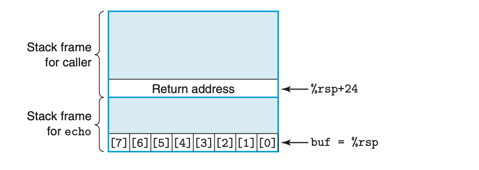

以下代码展示了库函数 `gets` 的实现，以演示该函数存在的严重问题。它从标准输入读取一行，遇到终止换行符或某种错误条件时停止。它将该字符串复制到参数 `s` 指定的位置，并用空字符终止字符串。我们在函数 `echo` 中展示了 `gets` 的使用，该函数简单地从标准输入读取一行并将其回显到标准输出。

```c
/* 库函数 gets() 的实现 */
char *gets(char *s)
{
    int c;
    char *dest = s;
    while ((c = getchar()) != '\n' && c != EOF)
        *dest++ = c;
    if (c == EOF && dest == s)
        /* 未读取字符 */
        return NULL;
    *dest++ = '\0'; /* 终止字符串 */
    return s;
}
/* 读取输入行并将其回显 */
void echo()
{
    char buf[8]; /* 太小了！ */
    gets(buf);
    puts(buf);
}
```

`gets` 的问题在于它无法确定是否已分配足够的空间来保存整个字符串。在我们的 `echo` 示例中，我们故意将缓冲区设得非常小——仅有 8 个字符长。任何长度超过 7 个字符的字符串都将导致越界写入。

通过检查 GCC 为 `echo` 生成的汇编代码，我们可以推断栈是如何组织的：

```
void echo()
echo:
    subq  $24, %rsp    在栈上分配 24 字节
    movq  %rsp, %rdi   将 buf 计算为 %rsp
    call  gets          调用 gets
    movq  %rsp, %rdi   将 buf 计算为 %rsp
```

<!-- Page 0310 -->

```
    call  puts          调用 puts
    addq  $24, %rsp    释放栈空间
    ret                 返回
```

图 3.40 说明了 `echo` 执行期间的栈组织。程序通过从栈指针减去 24 在栈上分配 24 字节（第 2 行）。字符数组 `buf` 位于栈的顶部，可以从 `%rsp` 被复制到 `%rdi` 以用作对 `gets` 和 `puts` 两次调用的参数这一事实看出。`buf` 和存储的返回指针之间的 16 字节未被使用。只要用户最多输入 7 个字符，`gets` 返回的字符串（包括终止空字符）就能放入为 `buf` 分配的空间内。然而，更长的字符串将导致 `gets` 覆盖栈上存储的一些信息。随着字符串变长，以下信息将遭到破坏：

<table border=1 style='margin: auto; word-wrap: break-word;'><tr><td style='text-align: center; word-wrap: break-word;'>输入的字符数</td><td style='text-align: center; word-wrap: break-word;'>额外被破坏的状态</td></tr><tr><td style='text-align: center; word-wrap: break-word;'>0–7</td><td style='text-align: center; word-wrap: break-word;'>无</td></tr><tr><td style='text-align: center; word-wrap: break-word;'>9–23</td><td style='text-align: center; word-wrap: break-word;'>未使用的栈空间</td></tr><tr><td style='text-align: center; word-wrap: break-word;'>24–31</td><td style='text-align: center; word-wrap: break-word;'>返回地址</td></tr><tr><td style='text-align: center; word-wrap: break-word;'>32+</td><td style='text-align: center; word-wrap: break-word;'>调用者中的已保存状态</td></tr></table>

对于最多 23 个字符的字符串不会产生严重后果，但超过这个长度，返回指针的值以及可能保存的其他状态将被破坏。如果存储的返回地址被破坏，则 `ret` 指令（第 8 行）将导致程序跳转到完全意外的位置。仅凭 C 代码无法看出这些行为的可能性。像 `gets` 这样的函数对内存进行越界写入的影响只能通过在机器代码层面研究程序来理解。

我们的 `echo` 代码简单但粗糙。更好的版本是使用函数 `fgets`，它将读取的最大字节数作为参数。习题 3.71 要求你编写一个能处理任意长度输入字符串的 `echo` 函数。一般来说，使用 `gets` 或任何可能导致存储溢出的函数被认为是糟糕的编程实践。不幸的是，许多常用的库函数（包括 `strcpy`、`strcat` 和 `sprintf`）都具有可以在不指明目标缓冲区大小的情况下生成字节序列的特性 [97]。这种情况可能导致缓冲区溢出漏洞。

**练习题 3.46（答案见第 382 页）**

图 3.41 展示了一个（低质量的）函数实现，该函数从标准输入读取一行，将字符串复制到新分配的存储中，并返回指向结果的指针。

考虑以下场景：过程 `get_line` 以返回地址等于 `0x400776`、寄存器 `%rbx` 等于 `0x0123456789ABCDEF` 的情况被调用。你输入字符串：

```
0123456789012345678901234
```

<!-- Page 0311 -->

**图 3.41 练习题 3.46 的 C 代码和反汇编代码。**

```c
/* 这是低质量代码，
   旨在说明糟糕的编程实践。
   参见练习题 3.46。 */
char *get_line()
{
    char buf[4];
    char *result;
    gets(buf);
    result = malloc(strlen(buf));
    strcpy(result, buf);
    return result;
}
```

(b) 到调用 `gets` 为止的反汇编代码

```
char *get_line()
0000000000400720 <get_line>:
  400720: 53                      push  %rbx
  400721: 48 83 ec 10             sub   $0x10,%rsp
                                  在此处绘制栈图
  400725: 48 89 e7                mov   %rsp,%rdi
  400728: e8 73 ff ff ff          callq 4006a0 <gets>
                                  修改图以显示此处的栈内容
```

程序以段错误终止。你运行 GDB 并确定错误发生在 `get_line` 的 `ret` 指令执行期间。

A. 填写以下图表，尽可能多地指出在反汇编第 3 行指令执行完毕后栈的状态。在右侧标注存储在栈上的量（如"返回地址"），在框内标注其十六进制值（如果已知）。每个框代表 8 字节。指示 `%rsp` 的位置。回忆字符 0–9 的 ASCII 码为 0x30–0x39。

<table border=1 style='margin: auto; word-wrap: break-word;'><tr><td style='text-align: center; word-wrap: break-word;'>00 00 00 00 00 40 00 76</td><td style='text-align: center; word-wrap: break-word;'>返回地址</td></tr><tr><td style='text-align: center; word-wrap: break-word;'></td><td style='text-align: center; word-wrap: break-word;'></td></tr><tr><td style='text-align: center; word-wrap: break-word;'></td><td style='text-align: center; word-wrap: break-word;'></td></tr><tr><td style='text-align: center; word-wrap: break-word;'></td><td style='text-align: center; word-wrap: break-word;'></td></tr></table>

B. 修改你的图以显示调用 `gets`（第 5 行）的效果。

<!-- Page 0312 -->

E. 除了潜在的缓冲区溢出之外，`get_line` 代码还有哪两个错误？

缓冲区溢出的一种更危险的用途是让程序执行它本来不愿意执行的功能。这是网络攻击计算机系统安全的最常见方法之一。通常，程序被提供一个包含某些可执行代码（称为攻击载荷代码）的字节编码的字符串，以及一些额外的字节，这些字节将返回地址覆盖为指向攻击载荷代码的指针。执行 `ret` 指令的效果是跳转到攻击载荷代码。

在一种攻击形式中，攻击载荷代码使用系统调用启动 shell 程序，为攻击者提供一系列操作系统功能。在另一种形式中，攻击载荷代码执行某些未授权的任务，修复栈上的损害，然后再次执行 `ret`，导致（表面上）正常地返回给调用者。

作为示例，1988 年 11 月著名的互联网蠕虫通过四种不同的方式访问了互联网上的许多计算机。其中之一是对 `finger` 守护进程 `fingerd` 的缓冲区溢出攻击，该进程为 `FINGER` 命令提供服务。通过使用适当的字符串调用 `FINGER`，蠕虫可以使远程站点的守护进程发生缓冲区溢出，并执行给蠕虫访问远程系统权限的代码。蠕虫一旦获得对系统的访问权限，就会自我复制并消耗几乎所有的机器计算资源。结果，数百台机器实际上被瘫痪，直到安全专家确定如何消除蠕虫为止。蠕虫的作者被抓获并起诉，被判处 3 年缓刑、400 小时社区服务和 10,500 美元罚款。然而直到今天，人们仍然不断发现使系统容易受到缓冲区溢出攻击的安全漏洞。这突显了谨慎编程的必要性。任何与外部环境的接口都应该是"防弹的"，这样外部代理的任何行为都不会导致系统行为异常。

### 3.10.4 对抗缓冲区溢出攻击

缓冲区溢出攻击已变得如此普遍，并给计算机系统造成了如此多的问题，以至于现代编译器和操作系统实现了机制，使得这些攻击更难以发动，并限制了入侵者通过缓冲区溢出攻击控制系统的方式。在本节中，我们将介绍 Linux 版 GCC 提供的机制。

#### 栈随机化

为了将攻击载荷代码插入系统，攻击者需要将代码本身以及指向该代码的指针都注入为攻击字符串的一部分。生成

<!-- Page 0313 -->

>**旁注 蠕虫与病毒**
>
>蠕虫和病毒都是试图在计算机间传播自身的代码片段。如 Spafford [105] 所述，蠕虫是一种可以自行运行并能将自身完整工作版本传播到其他机器的程序。病毒是一种将自身添加到其他程序（包括操作系统）中的代码片段，它不能独立运行。在大众媒体中，"病毒"这个词被用来指代在系统间传播攻击代码的各种策略，因此你会听到人们将更准确地应称为"蠕虫"的东西称为"病毒"。

这个指针需要知道字符串将存储在栈上的地址。历史上，程序的栈地址是高度可预测的。对于运行相同程序和操作系统版本组合的所有系统，栈位置在许多机器上相当稳定。因此，例如，如果攻击者能确定某个常见 Web 服务器使用的栈地址，就可以设计出在许多机器上都有效的攻击。以传染病作类比，许多系统容易受到完全相同病毒株的攻击，这种现象通常被称为安全单一文化 [96]。

栈随机化的思想是使栈的位置在程序的每次运行中都不同。因此，即使许多机器运行相同的代码，它们也都使用不同的栈地址。这通过在程序启动时在栈上分配 0 到 $n$ 字节之间的随机量来实现，例如，通过使用分配函数 `alloca`，该函数在栈上为指定的字节数分配空间。分配的这部分空间不被程序使用，但它导致所有后续栈位置在程序的不同执行之间有所不同。分配范围 $n$ 需要足够大以获得足够的栈地址变化，但又足够小以不浪费程序中太多空间。

以下代码显示了确定"典型"栈地址的简单方法：

```c
int main() {
    long local;
    printf("local at %p\n", &local);
    return 0;
}
```

这段代码简单地打印 `main` 函数中局部变量的地址。在 32 位模式下的 Linux 机器上运行代码 10,000 次，地址范围从 `0xff7fc59c` 到 `0xfffffd09c`，范围约为 $2^{23}$。在新机器的 64 位模式下运行，地址范围从 `0x7fff0001b698` 到 `0x7fffffaa4a8`，范围接近 $2^{32}$。

栈随机化已成为 Linux 系统的标准实践。它是一类更大的技术之一，称为地址空间布局随机化（Address-Space Layout Randomization，ASLR）[99]。使用 ASLR，程序的不同部分，包括程序代码、库代码、栈、全局变量和堆数据，每次程序运行时都被加载到不同的

<!-- Page 0314 -->

内存区域。这意味着在一台机器上运行的程序与在其他机器上运行的同一程序具有非常不同的地址映射。这可以挫败某些形式的攻击。

然而，总体而言，持久的攻击者可以通过暴力方式克服随机化，反复尝试使用不同地址的攻击。一种常见的技巧是在实际攻击载荷代码之前包含一长串 `nop`（发音为"no op"，"无操作"的缩写）指令。执行该指令没有任何效果，除了将程序计数器递增到下一条指令。只要攻击者能猜到该序列中某处的地址，程序就会执行完该序列然后到达攻击载荷代码。这个序列的通常术语是"nop 滑橇"（nop sled）[97]，表达程序"滑过"该序列的思想。如果我们设置一个 256 字节的 nop 滑橇，那么在 $n = 2^{23}$ 范围上的随机化可以通过枚举 $2^{15} = 32,768$ 个起始地址来破解，这对于坚定的攻击者来说完全可行。对于 64 位情况，尝试枚举 $2^{24} = 16,777,216$ 个地址要困难得多。我们可以看到，栈随机化和 ASLR 的其他方面可以增加成功攻击系统所需的努力，从而大大降低病毒或蠕虫的传播速率，但它不能提供完整的保护。

**练习题 3.47（答案见第 383 页）**

在运行 Linux 2.6.16 的系统上运行我们的栈检查代码 10,000 次，我们获得的地址从最小值 `0xfffffb754` 到最大值 `0xfffffd754`。

A. 地址的近似范围是多少？

B. 如果我们尝试使用 128 字节的 nop 滑橇进行缓冲区溢出，大约需要多少次尝试才能测试所有起始地址？

#### 栈破坏检测

第二道防线是能够检测到栈何时被破坏。我们在 `echo` 函数示例（图 3.40）中看到，破坏通常发生在程序超出局部缓冲区边界时。在 C 中，没有可靠的方法来防止数组越界写入。相反，程序可以尝试在这种写入发生后、产生任何有害影响之前检测到它。

最新版本的 GCC 在生成的代码中加入了一种称为栈保护器（stack protector）的机制来检测缓冲区溢出。其思想是在任何局部缓冲区和栈其余状态之间在栈帧中存储一个特殊的金丝雀值$^4$，如图 3.42 所示 [26, 97]。这个金丝雀值，也称为保护值，在每次程序运行时随机生成，因此没有

<!-- Page 0315 -->

**图 3.42 启用栈保护器的 `echo` 函数的栈组织。在数组 `buf` 和已保存状态之间放置了一个特殊的"金丝雀"值。代码检查金丝雀值以确定栈状态是否已被破坏。**

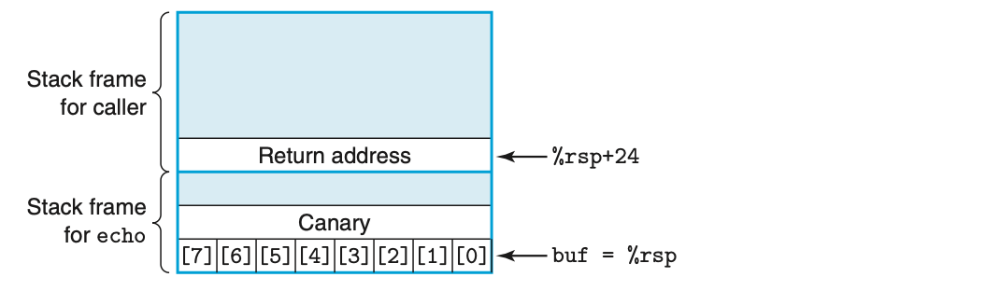

简单方法让攻击者能够确定它是什么。在恢复寄存器状态并从函数返回之前，程序检查金丝雀是否被该函数或其调用的某个函数的某些操作所更改。如果是，程序将中止并报错。

最新版本的 GCC 会尝试确定函数是否容易受到栈溢出攻击，并自动插入这种溢出检测。事实上，对于我们之前演示的栈溢出，我们必须给出命令行选项 `-fno-stack-protector` 来阻止 GCC 插入此代码。在不使用该选项（因此启用栈保护器）的情况下编译函数 `echo`，会生成以下汇编代码：

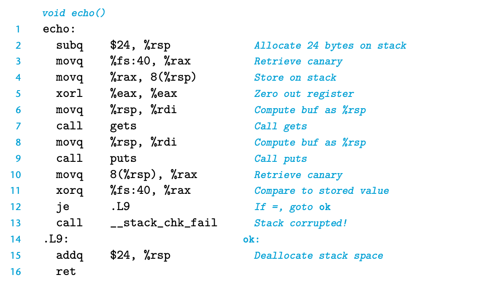

我们看到，这个版本的函数从内存中检索一个值（第 3 行），并将其存储在 `%rsp` 偏移量为 8 的栈上，就在为 `buf` 分配的区域之外。指令参数 `%fs:40` 表示使用分段寻址从内存中读取金丝雀值，这是一种可追溯到

<!-- Page 0316 -->

80286 的寻址机制，在现代系统上运行的程序中很少见到。通过将金丝雀存储在特殊段中，可以将其标记为"只读"，这样攻击者就无法覆盖存储的金丝雀值。在恢复寄存器状态并返回之前，函数将存储在栈位置的值与金丝雀值进行比较（通过第 11 行的 `xorq` 指令）。如果两者相同，`xorq` 指令将产生零，函数将以正常方式完成。非零值表示栈上的金丝雀已被修改，因此代码将调用错误处理例程。

栈保护很好地防止了缓冲区溢出攻击破坏存储在程序栈上的状态。它只产生很小的性能损耗，特别是因为 GCC 只在函数中存在 `char` 类型的局部缓冲区时才插入它。当然，还有其他方式可以破坏正在执行的程序的状态，但减少栈的脆弱性可以挫败许多常见的攻击策略。

**练习题 3.48（答案见第 383 页）**

函数 `intlen`、`len` 和 `iptoa` 提供了一种非常迂回的方式来计算表示整数所需的十进制位数。我们将用此来研究 GCC 栈保护器功能的某些方面。

```c
int len(char *s) {
    return strlen(s);
}

void iptoa(char *s, long *p) {
    long val = *p;
    sprintf(s, "%ld", val);
}

int intlen(long x) {
    long v;
    char buf[12];
    v = x;
    iptoa(buf, &v);
    return len(buf);
}
```

以下显示了 `intlen` 代码的部分内容，分别用有无栈保护器编译的版本：

```
(a) 无保护器

int intlen(long x)
    x 在 %rdi
intlen:
    subq  $40, %rsp
    movq  %rdi, 24(%rsp)
```

<!-- Page 0317 -->

```
    leaq  24(%rsp), %rsi
    movq  %rsp, %rdi
    call  iptoa

(b) 有保护器

int intlen(long x)
    x 在 %rdi
intlen:
    subq  $56, %rsp
    movq  %fs:40, %rax
    movq  %rax, 40(%rsp)
    xorl  %eax, %eax
    movq  %rdi, 8(%rsp)
    leaq  8(%rsp), %rsi
    leaq  16(%rsp), %rdi
    call  iptoa
```

A. 对于两种版本：`buf`、`v` 以及（如有）金丝雀值在栈帧中的位置是什么？
B. 受保护代码中局部变量重新排列的顺序如何提供对缓冲区溢出攻击更强的安全保护？

#### 限制可执行代码区域

最后一步是消除攻击者将可执行代码插入系统的能力。一种方法是限制哪些内存区域保存可执行代码。在典型程序中，只有保存编译器生成的代码的那部分内存需要是可执行的。其他部分可以被限制为只允许读写。正如我们将在第 9 章中看到的，虚拟内存空间在逻辑上被划分为页，每页通常为 2,048 或 4,096 字节。硬件支持不同形式的内存保护，指示用户程序和操作系统内核允许的访问形式。许多系统允许控制三种访问形式：读（从内存读取数据）、写（向内存存储数据）和执行（将内存内容视为机器级代码）。历史上，x86 架构将读和执行访问控制合并为单个 1 位标志，因此任何标记为可读的页也是可执行的。栈必须保持可读和可写，因此栈上的字节也是可执行的。实现了各种方案来将某些页限制为只读而不可执行，但这些方案通常引入了显著的效率损失。

最近，AMD 在其 64 位处理器的内存保护中引入了 NX（"禁止执行"）位，将读和执行访问模式分开，Intel 也随之跟进。有了此功能，栈可以标记为可读写但不可执行，页是否可执行的检查由硬件执行，不存在效率损失。

<!-- Page 0318 -->

某些类型的程序需要动态生成和执行代码的能力。例如，"即时编译"技术为 Java 等解释型语言编写的程序动态生成代码，以提高执行性能。运行时系统是否能将可执行代码限制在编译器创建原始程序时生成的那部分，取决于语言和操作系统。

我们概述的技术——随机化、栈保护以及限制内存的哪些部分可以保存可执行代码——是最小化程序对缓冲区溢出攻击脆弱性最常用的三种机制。它们都具有不需要程序员做任何特殊努力且不产生或很少产生性能损耗的特性。每种机制单独都能降低脆弱性水平，组合使用则更为有效。不幸的是，仍然存在攻击计算机的方法 [85, 97]，因此蠕虫和病毒仍然不断破坏许多机器的完整性。

### 3.10.5 支持变长栈帧

到目前为止，我们检查了多种函数的机器级代码，但它们都具有编译器可以提前确定必须为其栈帧分配的空间量的特性。然而，某些函数需要可变量的局部存储。例如，当函数调用 `alloca`（一个可以在栈上分配任意字节数存储的标准库函数）时，就可能发生这种情况。当代码声明可变大小的局部数组时也会发生这种情况。

虽然本节呈现的信息应该被认为是过程实现的一个方面，但我们将其推迟到此处，因为它需要对数组和对齐的理解。

图 3.43(a) 给出了一个包含可变大小数组的函数示例。该函数声明了 `n` 个指针的局部数组 `p`，其中 `n` 由第一个参数给出。这需要在栈上分配 $8n$ 字节，而 $n$ 的值可能在函数的不同调用之间有所不同。因此编译器无法确定必须为函数的栈帧分配多少空间。此外，程序生成对局部变量 `i` 的地址的引用，因此该变量也必须存储在栈上。在执行过程中，程序必须能够访问局部变量 `i` 和数组 `p` 的元素。在返回时，函数必须释放栈帧并将栈指针设置到存储的返回地址的位置。

为了管理可变大小的栈帧，x86-64 代码使用寄存器 `%rbp` 作为帧指针（有时也称为基址指针，因此 `%rbp` 中有字母 bp）。使用帧指针时，栈帧的组织如图 3.44 所示（以函数 `vframe` 为例）。我们看到代码必须将 `%rbp` 的先前值保存在栈上，因为它是被调用者保存的寄存器。然后在函数执行期间保持 `%rbp` 指向该栈位置，并在相对于 `%rbp` 的偏移量处引用固定长度的局部变量（如 `i`）。

<!-- Page 0319 -->

**图 3.43 需要使用帧指针的函数。变长数组意味着在编译时无法确定栈帧的大小。**

```c
/* (a) C 代码 */
long vframe(long n, long idx, long *q) {
    long i;
    long *p[n];
    p[0] = &i;
    for (i = 1; i < n; i++)
        p[i] = q;
    return *p[idx];
}
```

```
/* (b) 生成的汇编代码片段 */
long vframe(long n, long idx, long *q)
    n 在 %rdi，idx 在 %rsi，q 在 %rdx
    仅显示代码片段

vframe:
    pushq  %rbp              保存旧 %rbp
    movq   %rsp, %rbp        设置帧指针
    subq   $16, %rsp         为 i 分配空间（%rsp = s_1）
    leaq   22(,%rdi,8), %rax
    andq   $-16, %rax
    subq   %rax, %rsp        为数组 p 分配空间（%rsp = s_2）
    leaq   7(%rsp), %rax
    shrq   $3, %rax
    leaq   0(,%rax,8), %r8   将 %r8 设为 &p[0]
    movq   %r8, %rcx         将 %rcx 设为 &p[0]（%rcx = p）

初始化循环的代码
    i 在 %rax 和栈上，n 在 %rdi，p 在 %rcx，q 在 %rdx
.L3:  循环:
    movq   %rdx, (%rcx,%rax,8)   将 p[i] 设为 q
    addq   $1, %rax               递增 i
    movq   %rax, -8(%rbp)         存储到栈上
.L2:
    movq   -8(%rbp), %rax         从栈上检索 i
    cmpq   %rdi, %rax             比较 i:n
    jl     .L3                    若 <，跳转到 loop

函数退出的代码
    leave                          恢复 %rbp 和 %rsp
    ret                            返回
```

<!-- Page 0320 -->

**图 3.44 函数 `vframe` 的栈帧结构。该函数使用寄存器 `%rbp` 作为帧指针。右侧的注释是对练习题 3.49 的参考。**

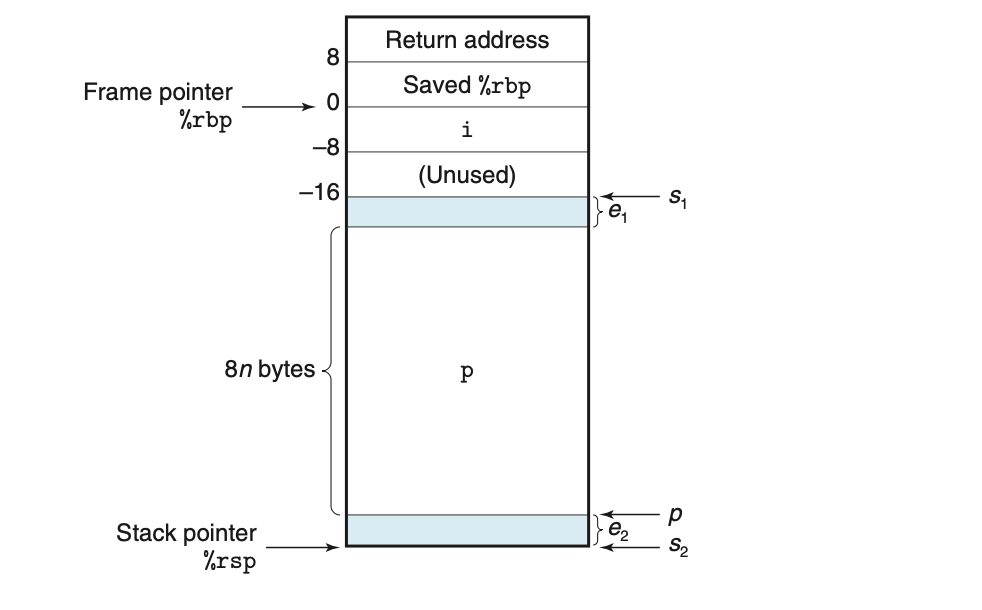

图 3.43(b) 展示了 GCC 为函数 `vframe` 生成的部分代码。在函数开始处，我们看到设置栈帧和为数组 `p` 分配空间的代码。代码首先将 `%rbp` 的当前值压栈并将 `%rbp` 设置为指向该栈位置（第 2–3 行）。接着，它在栈上分配 16 字节，其中前 8 字节用于存储局部变量 `i`，后 8 字节未使用。然后为数组 `p` 分配空间（第 5–11 行）。分配多少空间以及 `p` 在分配空间内的位置的细节在练习题 3.49 中探讨。可以说，当程序到达第 11 行时，它已经 (1) 在栈上分配了至少 $8n$ 字节，以及 (2) 将数组 `p` 定位在分配区域内，使得至少有 $8n$ 字节可供其使用。

初始化循环的代码展示了如何引用局部变量 `i` 和 `p` 的示例。第 13 行显示将数组元素 `p[i]` 设置为 `q`。该指令使用寄存器 `%rcx` 中的值作为 `p` 起始位置的地址。我们可以看到局部变量 `i` 被更新（第 15 行）和读取（第 17 行）的实例。`i` 的地址由引用 `-8(%rbp)` 给出——即相对于帧指针偏移量为 -8 处。

在函数结束时，使用 `leave` 指令（第 20 行）将帧指针恢复为其先前的值。该指令不需要参数，等价于执行以下两条指令：

```
movq  %rbp, %rsp    将栈指针设置到帧的起始位置
popq  %rbp           恢复已保存的 %rbp 并将栈指针设置到调用者帧的末尾
```

即，栈指针首先被设置到 `%rbp` 保存值的位置，然后该值从栈中弹出到 `%rbp`。这种指令组合具有释放整个栈帧的效果。

<!-- Page 0321 -->

在早期版本的 x86 代码中，帧指针用于每次函数调用。在 x86-64 代码中，它只用于栈帧大小可能不固定的情况，如函数 `vframe` 的情况。历史上，大多数编译器在生成 IA32 代码时都使用帧指针。最新版本的 GCC 已放弃这一惯例。注意，只要所有函数都将 `%rbp` 视为被调用者保存的寄存器，就可以将使用帧指针的代码与不使用帧指针的代码混用。

**练习题 3.49（答案见第 383 页）**

在本题中，我们将探索图 3.43(b) 第 5–11 行代码的逻辑，该代码为可变大小数组 `p` 分配空间。如代码注解所示，设 $s_1$ 为执行第 4 行 `subq` 指令后栈指针的地址。该指令为局部变量 `i` 分配空间。设 $s_2$ 为执行第 7 行 `subq` 指令后栈指针的值。该指令为局部数组 `p` 分配存储空间。最后，设 $p$ 为第 10–11 行指令分配给寄存器 `%r8` 和 `%rcx` 的值，这两个寄存器都用于引用数组 `p`。

图 3.44 右侧图示了 $s_1$、$s_2$ 和 $p$ 所示位置的相对关系。它还显示，$s_1$ 和 $p$ 的值之间可能存在 $e_2$ 字节的偏移，这部分空间不会被使用。数组 `p` 的末尾和 $s_1$ 所示位置之间也可能存在 $e_1$ 字节的偏移。

A. 用数学术语解释第 5–7 行计算 $s_2$ 的逻辑。提示：思考 -16 的位级表示及其在第 6 行 `andq` 指令中的效果。

B. 用数学术语解释第 8–10 行计算 $p$ 的逻辑。提示：你可能需要参考第 2.3.7 节关于除以 2 的幂的讨论。

C. 对于以下 $n$ 和 $s_1$ 的值，追踪代码的执行以确定 $s_2$、$p$、$e_1$ 和 $e_2$ 的结果值。

<table border=1 style='margin: auto; word-wrap: break-word;'><tr><td style='text-align: center; word-wrap: break-word;'>n</td><td style='text-align: center; word-wrap: break-word;'>$ s_{1} $</td><td style='text-align: center; word-wrap: break-word;'>$ s_{2} $</td><td style='text-align: center; word-wrap: break-word;'>p</td><td style='text-align: center; word-wrap: break-word;'>$ e_{1} $</td><td style='text-align: center; word-wrap: break-word;'>$ e_{2} $</td></tr><tr><td style='text-align: center; word-wrap: break-word;'>5</td><td style='text-align: center; word-wrap: break-word;'>2,065</td><td style='text-align: center; word-wrap: break-word;'></td><td style='text-align: center; word-wrap: break-word;'></td><td style='text-align: center; word-wrap: break-word;'></td><td style='text-align: center; word-wrap: break-word;'></td></tr><tr><td style='text-align: center; word-wrap: break-word;'>6</td><td style='text-align: center; word-wrap: break-word;'>2,064</td><td style='text-align: center; word-wrap: break-word;'></td><td style='text-align: center; word-wrap: break-word;'></td><td style='text-align: center; word-wrap: break-word;'></td><td style='text-align: center; word-wrap: break-word;'></td></tr></table>

D. 该代码为 $s_2$ 和 $p$ 的值保证了什么对齐属性？

## 3.11 浮点代码

处理器的浮点体系结构包括影响操作浮点数据的程序如何映射到机器上的不同方面，包括：

- 浮点值的存储和访问方式。通常通过某种形式的寄存器实现。

<!-- Page 0322 -->

- 将浮点值作为参数传递给函数以及作为结果返回的惯例。

- 函数调用期间寄存器的保存惯例——例如，某些寄存器被指定为调用者保存，其他的为被调用者保存。

为了理解 x86-64 浮点体系结构，简单回顾一下历史背景会有所帮助。自 1997 年 Pentium/MMX 引入以来，Intel 和 AMD 都纳入了一代又一代的媒体指令，以支持图形和图像处理。这些指令最初专注于允许以并行模式（称为单指令多数据，即 SIMD，发音为"sim-dee"）执行多个操作。在这种模式下，相同的操作并行地对多个不同的数据值执行。多年来，这些扩展不断演进，名称经历了从 MMX 到 SSE（"流式 SIMD 扩展"）以及最近的 AVX（"高级向量扩展"）的一系列重大修订。在每一代中，也有不同的版本。这些扩展在多个寄存器组中管理数据，分别称为 MMX 的"MM"寄存器、SSE 的"XMM"寄存器和 AVX 的"YMM"寄存器，从 MM 寄存器的 64 位到 XMM 的 128 位再到 YMM 的 256 位。例如，每个 YMM 寄存器可以保存八个 32 位值或四个 64 位值，这些值可以是整数或浮点数。

从 2000 年与 Pentium 4 一起引入的 SSE2 开始，媒体指令包含了操作标量浮点数据的指令，在 XMM 或 YMM 寄存器的低阶 32 位（用于 `float`）或 64 位（用于 `double`）中使用单个值。这种标量模式提供了一组寄存器和指令，与其他处理器支持浮点的方式更为典型。所有能够执行 x86-64 代码的处理器都支持 SSE2 或更高版本，因此 x86-64 浮点运算基于 SSE 或 AVX，包括传递过程参数和返回值的惯例 [77]。

我们的介绍基于 AVX2，即 AVX 的第二版，于 2013 年随 Core i7 Haswell 处理器引入。给定命令行参数 `-mavx2`，GCC 将生成 AVX2 代码。基于不同版本 SSE 以及 AVX 第一版的代码在概念上类似，尽管它们在指令名称和格式上有所不同。我们只介绍在用 GCC 编译浮点程序时出现的指令。这些主要是标量 AVX 指令，尽管我们会记录某些旨在操作整个数据向量的指令出现的场合。关于如何利用 SSE 和 AVX 的 SIMD 功能的更完整介绍，请参见第 582 页的 Web 旁注 OPT:SIMD。读者可能希望参考 AMD 和 Intel 的各指令文档 [4, 51]。与整数操作一样，注意我们介绍中使用的 ATT 格式与这些文档中使用的 Intel 格式不同。特别是，在这两个版本中，指令操作数的列出顺序不同。

<!-- Page 0323 -->

**图 3.45 媒体寄存器。这些寄存器用于保存浮点数据。每个 YMM 寄存器保存 32 字节。低阶 16 字节可以作为 XMM 寄存器访问。**

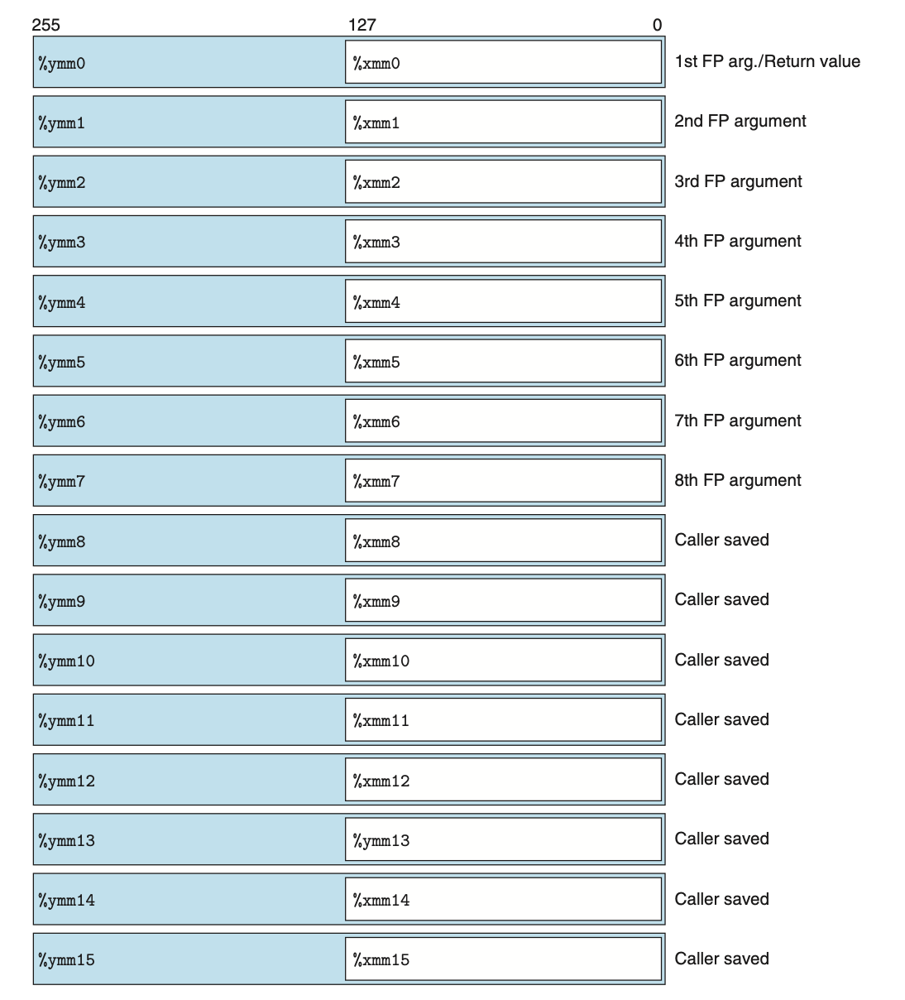

如图 3.45 所示，AVX 浮点体系结构允许数据存储在 16 个 YMM 寄存器中，命名为 `%ymm0`–`%ymm15`。每个 YMM 寄存器为 256 位（32 字节）长。在操作标量数据时，这些寄存器只保存浮点数据，且只使用低阶 32 位（用于 `float`）或 64 位（用于 `double`）。汇编代码通过 SSE XMM 寄存器名 `%xmm0`–`%xmm15` 来引用这些寄存器，其中每个 XMM 寄存器是对应 YMM 寄存器的低阶 128 位（16 字节）。

<!-- Page 0324 -->

<table border=1 style='margin: auto; word-wrap: break-word;'><tr><td style='text-align: center; word-wrap: break-word;'>Instruction</td><td style='text-align: center; word-wrap: break-word;'>Source</td><td style='text-align: center; word-wrap: break-word;'>Destination</td><td style='text-align: center; word-wrap: break-word;'>Description</td></tr><tr><td style='text-align: center; word-wrap: break-word;'>vmovss</td><td style='text-align: center; word-wrap: break-word;'>$ M_{32} $</td><td style='text-align: center; word-wrap: break-word;'>X</td><td style='text-align: center; word-wrap: break-word;'>Move single precision</td></tr><tr><td style='text-align: center; word-wrap: break-word;'>vmovss</td><td style='text-align: center; word-wrap: break-word;'>X</td><td style='text-align: center; word-wrap: break-word;'>$ M_{32} $</td><td style='text-align: center; word-wrap: break-word;'>Move single precision</td></tr><tr><td style='text-align: center; word-wrap: break-word;'>vmovsd</td><td style='text-align: center; word-wrap: break-word;'>$ M_{64} $</td><td style='text-align: center; word-wrap: break-word;'>X</td><td style='text-align: center; word-wrap: break-word;'>Move double precision</td></tr><tr><td style='text-align: center; word-wrap: break-word;'>vmovsd</td><td style='text-align: center; word-wrap: break-word;'>X</td><td style='text-align: center; word-wrap: break-word;'>$ M_{64} $</td><td style='text-align: center; word-wrap: break-word;'>Move double precision</td></tr><tr><td style='text-align: center; word-wrap: break-word;'>vmovaps</td><td style='text-align: center; word-wrap: break-word;'>X</td><td style='text-align: center; word-wrap: break-word;'>X</td><td style='text-align: center; word-wrap: break-word;'>Move aligned, packed single precision</td></tr><tr><td style='text-align: center; word-wrap: break-word;'>vmovapd</td><td style='text-align: center; word-wrap: break-word;'>X</td><td style='text-align: center; word-wrap: break-word;'>X</td><td style='text-align: center; word-wrap: break-word;'>Move aligned, packed double precision</td></tr></table>

**图 3.46 浮点数传送指令。这些操作在内存和寄存器之间以及寄存器对之间传输值。（X：XMM 寄存器（如 `%xmm3`）；$M_{32}$：32 位内存范围；$M_{64}$：64 位内存范围）**

### 3.11.1 浮点传送与转换操作

图 3.46 展示了一组用于在内存和 XMM 寄存器之间以及从一个 XMM 寄存器到另一个 XMM 寄存器传输浮点数据而不进行任何转换的指令。引用内存的那些是标量指令，意味着它们操作单个而非打包的数据值。数据保存在内存（在表中表示为 $M_{32}$ 和 $M_{64}$）或 XMM 寄存器（在表中表示为 X）中。这些指令无论数据对齐与否都能正确工作，尽管代码优化指南建议 32 位内存数据满足 4 字节对齐，64 位数据满足 8 字节对齐。内存引用的指定方式与整数 `mov` 指令相同，具有位移、基址寄存器、索引寄存器和缩放因子的所有不同可能组合。

GCC 只使用标量传送操作将数据从内存传输到 XMM 寄存器或从 XMM 寄存器传输到内存。对于在两个 XMM 寄存器之间传输数据，它使用两种不同指令之一来复制整个 XMM 寄存器的内容——即单精度的 `vmovaps` 和双精度的 `vmovapd`。对于这些情况，程序是复制整个寄存器还是只复制低阶值，既不影响程序功能也不影响执行速度，因此使用这些指令而非特定于标量数据的指令没有实质区别。这些指令名称中的字母"a"代表"对齐"（aligned）。当用于读写内存时，如果地址不满足 16 字节对齐，它们会导致异常。对于两个寄存器之间的传输，不存在对齐错误的可能性。

作为不同浮点传送操作的示例，考虑以下 C 函数：

```c
float float_mov(float v1, float *src, float *dst) {
    float v2 = *src;
    *dst = v1;
    return v2;
}
```

<!-- Page 0325 -->

以及其对应的 x86-64 汇编代码：

```
float float_mov(float v1, float *src, float *dst)
    v1 在 %xmm0，src 在 %rdi，dst 在 %rsi

float_mov:
    vmovaps  %xmm0, %xmm1    复制 v1
    vmovss   (%rdi), %xmm0   从 src 读取 v2
    vmovss   %xmm1, (%rsi)   将 v1 写入 dst
    ret                       在 %xmm0 中返回 v2
```

在这个示例中，我们可以看到使用 `vmovaps` 指令将数据从一个寄存器复制到另一个寄存器，以及使用 `vmovss` 指令将数据从内存复制到 XMM 寄存器以及从 XMM 寄存器复制到内存。

图 3.47 和 3.48 展示了用于在浮点和整数数据类型之间以及不同浮点格式之间进行转换的指令集。这些都是操作单个数据值的标量指令。图 3.47 中的指令将从 XMM 寄存器或内存中读取的浮点值转换为整数，并将结果写入通用寄存器（如 `%rax`、`%ebx` 等）。在将浮点值转换为整数时，它们执行截断，向零舍入，这是 C 和大多数其他编程语言的要求。

<table border=1 style='margin: auto; word-wrap: break-word;'><tr><td style='text-align: center; word-wrap: break-word;'>Instruction</td><td style='text-align: center; word-wrap: break-word;'>Source</td><td style='text-align: center; word-wrap: break-word;'>Destination</td><td style='text-align: center; word-wrap: break-word;'>Description</td></tr><tr><td style='text-align: center; word-wrap: break-word;'>vcvttss2si</td><td style='text-align: center; word-wrap: break-word;'>$ X/M_{32} $</td><td style='text-align: center; word-wrap: break-word;'>$ R_{32} $</td><td style='text-align: center; word-wrap: break-word;'>Convert with truncation single precision to integer</td></tr><tr><td style='text-align: center; word-wrap: break-word;'>vcvttsd2si</td><td style='text-align: center; word-wrap: break-word;'>$ X/M_{64} $</td><td style='text-align: center; word-wrap: break-word;'>$ R_{32} $</td><td style='text-align: center; word-wrap: break-word;'>Convert with truncation double precision to integer</td></tr><tr><td style='text-align: center; word-wrap: break-word;'>vcvttss2siq</td><td style='text-align: center; word-wrap: break-word;'>$ X/M_{32} $</td><td style='text-align: center; word-wrap: break-word;'>$ R_{64} $</td><td style='text-align: center; word-wrap: break-word;'>Convert with truncation single precision to quad word integer</td></tr><tr><td style='text-align: center; word-wrap: break-word;'>vcvttsd2siq</td><td style='text-align: center; word-wrap: break-word;'>$ X/M_{64} $</td><td style='text-align: center; word-wrap: break-word;'>$ R_{64} $</td><td style='text-align: center; word-wrap: break-word;'>Convert with truncation double precision to quad word integer</td></tr></table>

**图 3.47 两操作数浮点转换操作。这些指令将浮点数据转换为整数。（X：XMM 寄存器；$R_{32}$：32 位通用寄存器；$R_{64}$：64 位通用寄存器；$M_{32}$：32 位内存范围；$M_{64}$：64 位内存范围）**

<table border=1 style='margin: auto; word-wrap: break-word;'><tr><td style='text-align: center; word-wrap: break-word;'>Instruction</td><td style='text-align: center; word-wrap: break-word;'>Source 1</td><td style='text-align: center; word-wrap: break-word;'>Source 2</td><td style='text-align: center; word-wrap: break-word;'>Destination</td><td style='text-align: center; word-wrap: break-word;'>Description</td></tr><tr><td style='text-align: center; word-wrap: break-word;'>vcvtsi2ss</td><td style='text-align: center; word-wrap: break-word;'>$ M_{32}/R_{32} $</td><td style='text-align: center; word-wrap: break-word;'>X</td><td style='text-align: center; word-wrap: break-word;'>X</td><td style='text-align: center; word-wrap: break-word;'>Convert integer to single precision</td></tr><tr><td style='text-align: center; word-wrap: break-word;'>vcvtsi2sd</td><td style='text-align: center; word-wrap: break-word;'>$ M_{32}/R_{32} $</td><td style='text-align: center; word-wrap: break-word;'>X</td><td style='text-align: center; word-wrap: break-word;'>X</td><td style='text-align: center; word-wrap: break-word;'>Convert integer to double precision</td></tr><tr><td style='text-align: center; word-wrap: break-word;'>vcvtsi2ssq</td><td style='text-align: center; word-wrap: break-word;'>$ M_{64}/R_{64} $</td><td style='text-align: center; word-wrap: break-word;'>X</td><td style='text-align: center; word-wrap: break-word;'>X</td><td style='text-align: center; word-wrap: break-word;'>Convert quad word integer to single precision</td></tr><tr><td style='text-align: center; word-wrap: break-word;'>vcvtsi2sdq</td><td style='text-align: center; word-wrap: break-word;'>$ M_{64}/R_{64} $</td><td style='text-align: center; word-wrap: break-word;'>X</td><td style='text-align: center; word-wrap: break-word;'>X</td><td style='text-align: center; word-wrap: break-word;'>Convert quad word integer to double precision</td></tr></table>

**图 3.48 三操作数浮点转换操作。这些指令将第一个源的数据类型转换为目标的数据类型。第二个源值不影响结果的低阶字节。（X：XMM 寄存器；$M_{32}$：32 位内存范围；$M_{64}$：64 位内存范围）**

图 3.48 中的指令从整数转换为浮点数。它们使用一种不寻常的三操作数格式，有两个源和一个目标。第一个操作数从内存或通用寄存器中读取。对于我们的目的，我们可以忽略第二个操作数，因为其值仅影响结果的高阶字节。目标必须是 XMM 寄存器。通常，第二个源操作数和目标操作数是相同的，如以下指令所示：

```
vcvtsi2sdq %rax, %xmm1, %xmm1
```

该指令从寄存器 `%rax` 中读取长整型，将其转换为 `double` 类型，并将结果存储在 XMM 寄存器 `%xmm1` 的低阶字节中。

<!-- Page 0326 -->

最后，对于在两种不同浮点格式之间转换，当前版本的 GCC 生成的代码需要单独说明。假设 `%xmm0` 的低阶 4 字节保存一个单精度值；那么使用以下指令看起来很直接：

```
vcvtss2sd %xmm0, %xmm0, %xmm0
```

将其转换为双精度值并将结果存储在寄存器 `%xmm0` 的低阶 8 字节中。然而，我们发现 GCC 生成的是以下代码：

```
从单精度转换为双精度
    vunpcklps  %xmm0, %xmm0, %xmm0    复制第一个向量元素
    vcvtps2pd  %xmm0, %xmm0            将两个向量元素转换为双精度
```

`vunpcklps` 指令通常用于交错两个 XMM 寄存器中的值并将其存储到第三个寄存器中。即，如果一个源寄存器包含字 $[s_3, s_2, s_1, s_0]$，另一个包含字 $[d_3, d_2, d_1, d_0]$，则目标寄存器的值将为 $[s_1, d_1, s_0, d_0]$。在上面的代码中，我们看到所有三个操作数都使用同一个寄存器，因此如果原寄存器保存值 $[x_3, x_2, x_1, x_0]$，该指令将把寄存器更新为 $[x_1, x_1, x_0, x_0]$。`vcvtps2pd` 指令将源 XMM 寄存器中的两个低阶单精度值扩展为目标 XMM 寄存器中的两个双精度值。将其应用于前一条 `vunpcklps` 指令的结果，将得到值 $[dx_0, dx_0]$，其中 $dx_0$ 是将 $x_0$ 转换为双精度的结果。即，两条指令的净效果是将 `%xmm0` 低阶 4 字节中的原始单精度值转换为双精度，并在 `%xmm0` 中存储其两份副本。目前不清楚 GCC 为何生成此代码，在 XMM 寄存器中复制该值既没有好处也没有必要。

GCC 为从双精度转换到单精度生成类似的代码：

```
从双精度转换为单精度
    vmovddup   %xmm0, %xmm0    复制第一个向量元素
    vcvtpd2psx %xmm0, %xmm0   将两个向量元素转换为单精度
```

<!-- Page 0327 -->

假设这些指令开始时寄存器 `%xmm0` 保存两个双精度值 $[x_1, x_0]$。则 `vmovddup` 指令将把它设置为 $[x_0, x_0]$。`vcvtpd2psx` 指令将这些值转换为单精度，将其打包到寄存器的低阶半部分，并将上半部分设置为 0，得到结果 $[0.0, 0.0, x_0, x_0]$（回忆一下，浮点值 0.0 由全零位模式表示）。同样，没有明确的理由以这种方式计算精度转换，而不是使用单条指令：

```
vcvtsd2ss %xmm0, %xmm0, %xmm0
```

作为不同浮点转换操作的示例，考虑以下 C 函数：

```c
double fcvt(int i, float *fp, double *dp, long *lp)
{
    float f = *fp; double d = *dp; long l = *lp;
    *lp = (long) d;
    *fp = (float) i;
    *dp = (double) l;
    return (double) f;
}
```

以及其对应的 x86-64 汇编代码：

```
double fcvt(int i, float *fp, double *dp, long *lp)
    i 在 %edi，fp 在 %rsi，dp 在 %rdx，lp 在 %rcx

fcvt:
    vmovss    (%rsi), %xmm0              获取 f = *fp
    movq      (%rcx), %rax               获取 l = *lp
    vcvttsd2siq (%rdx), %r8              获取 d = *dp 并转换为 long
    movq      %r8, (%rcx)                存储到 lp
    vcvtsi2ss %edi, %xmm1, %xmm1        将 i 转换为 float
    vmovss    %xmm1, (%rsi)              存储到 fp
    vcvtsi2sdq %rax, %xmm1, %xmm1       将 l 转换为 double
    vmovsd    %xmm1, (%rdx)              存储到 dp
    以下两条指令将 f 转换为 double
    vunpcklps %xmm0, %xmm0, %xmm0
    vcvtps2pd %xmm0, %xmm0
    ret                                   返回 f
```

`fcvt` 的所有参数都通过通用寄存器传递，因为它们要么是整数要么是指针。结果在寄存器 `%xmm0` 中返回。如图 3.45 所记录，这是 `float` 或 `double` 值的指定返回寄存器。在这段代码中，我们看到了图 3.46–3.48 中的多个传送和转换指令，以及 GCC 将单精度转换为双精度的首选方法。

<!-- Page 0328 -->

**练习题 3.50（答案见第 383 页）**

对于以下 C 代码，表达式 `val1`–`val4` 都映射到程序值 `i`、`f`、`d` 和 `l`：

```c
double fcvt2(int *ip, float *fp, double *dp, long l)
{
    int i = *ip; float f = *fp; double d = *dp;
    *ip = (int) val1;
    *fp = (float) val2;
    *dp = (double) val3;
    return (double) val4;
}
```

根据以下函数的 x86-64 代码，确定映射关系：

```
double fcvt2(int *ip, float *fp, double *dp, long l)
    ip 在 %rdi，fp 在 %rsi，dp 在 %rdx，l 在 %rcx
    结果在 %xmm0 中返回

fcvt2:
    movl      (%rdi), %eax
    vmovss    (%rsi), %xmm0
    vcvttsd2si (%rdx), %r8d
    movl      %r8d, (%rdi)
    vcvtsi2ss  %eax, %xmm1, %xmm1
    vmovss    %xmm1, (%rsi)
    vcvtsi2sdq %rcx, %xmm1, %xmm1
    vmovsd    %xmm1, (%rdx)
    vunpcklps  %xmm0, %xmm0, %xmm0
    vcvtps2pd  %xmm0, %xmm0
    ret
```

**练习题 3.51（答案见第 384 页）**

以下 C 函数将 `src_t` 类型的参数转换为 `dst_t` 类型的返回值，其中这两种类型是通过 `typedef` 定义的：

```c
dest_t cvt(src_t x)
{
    dest_t y = (dest_t) x;
    return y;
}
```

对于 x86-64 的执行，假设参数 `x` 要么在 `%xmm0` 中要么在寄存器 `%rdi` 的适当命名部分（即 `%rdi` 或 `%edi`）中。使用一到两条指令来执行类型转换并将值复制到寄存器 `%rax` 的适当命名部分（整数结果）或

<!-- Page 0329 -->

`%xmm0`（浮点结果）中：展示指令（包括源和目标寄存器）。

<table border=1 style='margin: auto; word-wrap: break-word;'><tr><td style='text-align: center; word-wrap: break-word;'>$ T_{x} $</td><td style='text-align: center; word-wrap: break-word;'>$ T_{y} $</td><td style='text-align: center; word-wrap: break-word;'>Instruction(s)</td></tr><tr><td style='text-align: center; word-wrap: break-word;'>long</td><td style='text-align: center; word-wrap: break-word;'>double</td><td style='text-align: center; word-wrap: break-word;'>vcvtsi2sdq %rdi, %xmm0</td></tr><tr><td style='text-align: center; word-wrap: break-word;'>double</td><td style='text-align: center; word-wrap: break-word;'>int</td><td style='text-align: center; word-wrap: break-word;'></td></tr><tr><td style='text-align: center; word-wrap: break-word;'>double</td><td style='text-align: center; word-wrap: break-word;'>float</td><td style='text-align: center; word-wrap: break-word;'></td></tr><tr><td style='text-align: center; word-wrap: break-word;'>long</td><td style='text-align: center; word-wrap: break-word;'>float</td><td style='text-align: center; word-wrap: break-word;'></td></tr><tr><td style='text-align: center; word-wrap: break-word;'>float</td><td style='text-align: center; word-wrap: break-word;'>long</td><td style='text-align: center; word-wrap: break-word;'></td></tr></table>

### 3.11.2 过程中的浮点代码

在 x86-64 中，XMM 寄存器用于向函数传递浮点参数以及从函数返回浮点值。如图 3.45 所示，遵循以下惯例：

- 最多八个浮点参数可以在 XMM 寄存器 `%xmm0`–`%xmm7` 中传递。这些寄存器按参数列出的顺序使用。额外的浮点参数可以在栈上传递。

- 返回浮点值的函数在寄存器 `%xmm0` 中返回。

- 所有 XMM 寄存器都是调用者保存的。被调用者可以覆盖这些寄存器中的任何一个，而无需先保存它。

当函数包含指针、整数和浮点参数的组合时，指针和整数通过通用寄存器传递，而浮点值通过 XMM 寄存器传递。这意味着参数到寄存器的映射取决于它们的类型和顺序。以下是几个示例：

```c
double f1(int x, double y, long z);
```

该函数中 `x` 在 `%edi`，`y` 在 `%xmm0`，`z` 在 `%rsi`。

```c
double f2(double y, int x, long z);
```

该函数与函数 `f1` 具有相同的寄存器分配。

```c
double f1(float x, double *y, long *z);
```

该函数中 `x` 在 `%xmm0`，`y` 在 `%rdi`，`z` 在 `%rsi`。

**练习题 3.52（答案见第 384 页）**

对于以下每个函数声明，确定参数的寄存器分配：

A. `double g1(double a, long b, float c, int d);`

<!-- Page 0330 -->

C. `double g3(double *a, double b, int c, float d);`
D. `double g4(float a, int *b, float c, double d);`

### 3.11.3 浮点算术操作

图 3.49 记录了执行算术操作的一组标量 AVX2 浮点指令。每条指令有一个 ($S_1$) 或两个 ($S_1$，$S_2$) 源操作数和一个目标操作数 D。第一个源操作数 $S_1$ 可以是 XMM 寄存器或内存位置。第二个源操作数和目标操作数必须是 XMM 寄存器。每种操作都有单精度和双精度两种指令。结果存储在目标寄存器中。

<table border=1 style='margin: auto; word-wrap: break-word;'><tr><td style='text-align: center; word-wrap: break-word;'>Single</td><td style='text-align: center; word-wrap: break-word;'>Double</td><td colspan="2">Effect</td><td style='text-align: center; word-wrap: break-word;'>Description</td></tr><tr><td style='text-align: center; word-wrap: break-word;'>vaddss</td><td style='text-align: center; word-wrap: break-word;'>vaddsd</td><td style='text-align: center; word-wrap: break-word;'>D</td><td style='text-align: center; word-wrap: break-word;'>$ \leftarrow $  $ S_{2} + S_{1} $</td><td style='text-align: center; word-wrap: break-word;'>Floating-point add</td></tr><tr><td style='text-align: center; word-wrap: break-word;'>vsubss</td><td style='text-align: center; word-wrap: break-word;'>vsubsd</td><td style='text-align: center; word-wrap: break-word;'>D</td><td style='text-align: center; word-wrap: break-word;'>$ \leftarrow $  $ S_{2} - S_{1} $</td><td style='text-align: center; word-wrap: break-word;'>Floating-point subtract</td></tr><tr><td style='text-align: center; word-wrap: break-word;'>vmulss</td><td style='text-align: center; word-wrap: break-word;'>vmulsd</td><td style='text-align: center; word-wrap: break-word;'>D</td><td style='text-align: center; word-wrap: break-word;'>$ \leftarrow $  $ S_{2} \times S_{1} $</td><td style='text-align: center; word-wrap: break-word;'>Floating-point multiply</td></tr><tr><td style='text-align: center; word-wrap: break-word;'>vdivss</td><td style='text-align: center; word-wrap: break-word;'>vdivsd</td><td style='text-align: center; word-wrap: break-word;'>D</td><td style='text-align: center; word-wrap: break-word;'>$ \leftarrow $  $ S_{2}/S_{1} $</td><td style='text-align: center; word-wrap: break-word;'>Floating-point divide</td></tr><tr><td style='text-align: center; word-wrap: break-word;'>vmaxss</td><td style='text-align: center; word-wrap: break-word;'>vmaxsd</td><td style='text-align: center; word-wrap: break-word;'>D</td><td style='text-align: center; word-wrap: break-word;'>$ \leftarrow $  $ \max(S_{2}, S_{1}) $</td><td style='text-align: center; word-wrap: break-word;'>Floating-point maximum</td></tr><tr><td style='text-align: center; word-wrap: break-word;'>vminss</td><td style='text-align: center; word-wrap: break-word;'>vminsd</td><td style='text-align: center; word-wrap: break-word;'>D</td><td style='text-align: center; word-wrap: break-word;'>$ \leftarrow $  $ \min(S_{2}, S_{1}) $</td><td style='text-align: center; word-wrap: break-word;'>Floating-point minimum</td></tr><tr><td style='text-align: center; word-wrap: break-word;'>sqrtss</td><td style='text-align: center; word-wrap: break-word;'>sqrtsd</td><td style='text-align: center; word-wrap: break-word;'>D</td><td style='text-align: center; word-wrap: break-word;'>$ \leftarrow $  $ \sqrt{S_{1}} $</td><td style='text-align: center; word-wrap: break-word;'>Floating-point square root</td></tr></table>

**图 3.49 标量浮点算术操作。这些指令有一个或两个源操作数和一个目标操作数。**

作为示例，考虑以下浮点函数：

```c
double funct(double a, float x, double b, int i)
{
    return a*x - b/i;
}
```

x86-64 代码如下：

```
double funct(double a, float x, double b, int i)
    a 在 %xmm0，x 在 %xmm1，b 在 %xmm2，i 在 %edi

funct:
    以下两条指令将 x 转换为 double
    vunpcklps  %xmm1, %xmm1, %xmm1
    vcvtps2pd  %xmm1, %xmm1
    vmulsd     %xmm0, %xmm1, %xmm0    将 a 乘以 x
    vcvtsi2sd  %edi, %xmm1, %xmm1     将 i 转换为 double
    vdivsd     %xmm1, %xmm2, %xmm2   计算 b/i
```

<!-- Page 0331 -->

```
    vsubsd     %xmm2, %xmm0, %xmm0   计算 a*x - b/i
    ret                                返回
```

三个浮点参数 `a`、`x` 和 `b` 在 XMM 寄存器 `%xmm0`–`%xmm2` 中传递，而整数参数 `i` 在寄存器 `%edi` 中传递。使用标准的两条指令序列将参数 `x` 转换为 `double`（第 2–3 行）。还需要另一条转换指令将参数 `i` 转换为 `double`（第 5 行）。函数值在寄存器 `%xmm0` 中返回。

**练习题 3.53（答案见第 384 页）**

对于以下 C 函数，四个参数的类型通过 `typedef` 定义：

```c
double funct1(arg1_t p, arg2_t q, arg3_t r, arg4_t s)
{
    return p/(q+r) - s;
}
```

编译时，GCC 生成以下代码：

```
double funct1(arg1_t p, arg2_t q, arg3_t r, arg4_t s)
funct1:
    vcvtsi2ssq  %rsi, %xmm2, %xmm2
    vaddss      %xmm0, %xmm2, %xmm0
    vcvtsi2ss   %edi, %xmm2, %xmm2
    vdivss      %xmm0, %xmm2, %xmm0
    vunpcklps   %xmm0, %xmm0, %xmm0
    vcvtps2pd   %xmm0, %xmm0
    vsubsd      %xmm1, %xmm0, %xmm0
    ret
```

确定四个参数类型的可能组合（可能不止一种）。

**练习题 3.54（答案见第 385 页）**

函数 `funct2` 具有以下原型：

```c
double funct2(double w, int x, float y, long z);
```

GCC 为该函数生成以下代码：

```
double funct2(double w, int x, float y, long z)
    w 在 %xmm0，x 在 %edi，y 在 %xmm1，z 在 %rsi
funct2:
    vcvtsi2ss   %edi, %xmm2, %xmm2
    vmulss      %xmm1, %xmm2, %xmm1
```

<!-- Page 0332 -->

```
    vunpcklps   %xmm1, %xmm1, %xmm1
    vcvtps2pd   %xmm1, %xmm2
    vcvtsi2sdq  %rsi, %xmm1, %xmm1
    vdivsd      %xmm1, %xmm0, %xmm0
    vsubsd      %xmm0, %xmm2, %xmm0
    ret
```

写出 `funct2` 的 C 版本。

### 3.11.4 定义和使用浮点常量

与整数算术操作不同，AVX 浮点操作不能将立即数作为操作数。相反，编译器必须为任何常量值分配并初始化存储空间。代码然后从内存中读取这些值。以下摄氏度到华氏度转换函数说明了这一点：

```c
double cel2fahr(double temp)
{
    return 1.8 * temp + 32.0;
}
```

x86-64 汇编代码的相关部分如下：

```
double cel2fahr(double temp)
    temp 在 %xmm0

cel2fahr:
    vmulsd  .LC2(%rip), %xmm0, %xmm0    乘以 1.8
    vaddsd  .LC3(%rip), %xmm0, %xmm0    加 32.0
    ret
.LC2:
    .long  3435973837    1.8 的低 4 字节
    .long  1073532108    1.8 的高 4 字节
.LC3:
    .long  0             32.0 的低 4 字节
    .long  1077936128    32.0 的高 4 字节
```

我们看到函数从标记为 `.LC2` 的内存位置读取值 1.8，从标记为 `.LC3` 的内存位置读取值 32.0。查看与这些标记关联的值，我们看到每个值由一对 `.long` 声明指定，值以十进制给出。这些如何被解释为浮点值？查看标记为 `.LC2` 的声明，我们看到两个值分别是 3435973837（`0xCCCCCCCD`）和 1073532108（`0x3FFCCCCC`）。由于机器使用小端字节序，第一个值给出低阶 4 字节，第二个给出高阶 4 字节。从高阶字节可以提取指数字段 `0x3FF`（1023），减去偏置 1023 得到指数 0。连接两个值的尾数位，我们得到尾数字段 `0xCCCCCCCCCCD`，可以证明这是 0.8 的小数二进制表示，加上隐含的前导 1 得到 1.8。

<!-- Page 0333 -->

<table border=1 style='margin: auto; word-wrap: break-word;'><tr><td style='text-align: center; word-wrap: break-word;'>Single</td><td style='text-align: center; word-wrap: break-word;'>Double</td><td style='text-align: center; word-wrap: break-word;'>Effect</td><td style='text-align: center; word-wrap: break-word;'>Description</td></tr><tr><td style='text-align: center; word-wrap: break-word;'>vxorps</td><td style='text-align: center; word-wrap: break-word;'>xorpd</td><td style='text-align: center; word-wrap: break-word;'>$ D \leftarrow S_{2} \oplus S_{1} $</td><td style='text-align: center; word-wrap: break-word;'>Bitwise EXCLUSIVE-OR</td></tr><tr><td style='text-align: center; word-wrap: break-word;'>vandps</td><td style='text-align: center; word-wrap: break-word;'>andpd</td><td style='text-align: center; word-wrap: break-word;'>$ D \leftarrow S_{2} \& S_{1} $</td><td style='text-align: center; word-wrap: break-word;'>Bitwise AND</td></tr></table>

**图 3.50 对打包数据的位操作。这些指令对 XMM 寄存器中全部 128 位执行布尔操作。**

**练习题 3.55（答案见第 385 页）**

说明标记为 `.LC3` 的声明中的数字如何编码数字 32.0。

### 3.11.5 在浮点代码中使用位操作

有时，我们发现 GCC 生成的代码对 XMM 寄存器执行位操作，以实现有用的浮点结果。图 3.50 展示了一些相关指令，类似于操作通用寄存器的对应指令。这些操作都作用于打包数据，这意味着它们更新整个目标 XMM 寄存器，将位操作应用于两个源寄存器中的所有数据。对于标量数据，我们只关心这些指令对目标的低阶 4 或 8 字节的影响。这些操作通常是操纵浮点值的简单便捷方式，如以下问题所探索。

**练习题 3.56（答案见第 386 页）**

考虑以下 C 函数，其中 `EXPR` 是用 `#define` 定义的宏：

```c
double simplefun(double x) {
    return EXPR(x);
}
```

下面我们展示了对不同 `EXPR` 定义生成的 AVX2 代码，其中值 `x` 保存在 `%xmm0` 中。它们都对应于对浮点值的某种有用操作。识别这些操作。你的答案需要理解从内存检索的常量字的位模式。

A.
```
    vmovsd  .LC1(%rip), %xmm1
    vandpd  %xmm1, %xmm0, %xmm0
.LC1:
    .long  4294967295
    .long  2147483647
    .long  0
    .long  0
```

<!-- Page 0334 -->

C.
```
    vmovsd  .LC2(%rip), %xmm1
    vxorpd  %xmm1, %xmm0, %xmm0
.LC2:
    .long  0
    .long  -2147483648
    .long  0
    .long  0
```

### 3.11.6 浮点比较操作

AVX2 提供了两条用于比较浮点值的指令：

<table border=1 style='margin: auto; word-wrap: break-word;'><tr><td style='text-align: center; word-wrap: break-word;'>Instruction</td><td style='text-align: center; word-wrap: break-word;'>Based on</td><td style='text-align: center; word-wrap: break-word;'>Description</td></tr><tr><td style='text-align: center; word-wrap: break-word;'>ucomiss</td><td style='text-align: center; word-wrap: break-word;'>$ S_{1}, S_{2} $</td><td style='text-align: center; word-wrap: break-word;'>$ S_{2}-S_{1} $</td></tr><tr><td style='text-align: center; word-wrap: break-word;'>ucomisd</td><td style='text-align: center; word-wrap: break-word;'>$ S_{1}, S_{2} $</td><td style='text-align: center; word-wrap: break-word;'>$ S_{2}-S_{1} $</td></tr></table>

这些指令类似于 CMP 指令（参见第 3.6 节），它们比较操作数 $S_1$ 和 $S_2$（但顺序与预期相反）并设置条件码以指示其相对值。与 `cmpq` 一样，它们遵循以相反顺序列出操作数的 ATT 格式惯例。参数 $S_2$ 必须在 XMM 寄存器中，而 $S_1$ 可以在 XMM 寄存器中或在内存中。

浮点比较指令设置三个条件码：零标志 ZF、进位标志 CF 和奇偶标志 PF。我们在第 3.6.1 节没有记录奇偶标志，因为它在 GCC 生成的 x86 代码中并不常见。对于整数操作，当最近的算术或逻辑操作产生的值中最低有效字节具有偶数奇偶性（即字节中奇偶数为偶数的一的个数）时，该标志被设置。然而，对于浮点比较，当任一操作数为 NaN 时，该标志被设置。按照惯例，当一个参数为 NaN 时，C 中的任何比较都被认为失败，该标志用于检测这种情况。例如，当 `x` 为 NaN 时，即使 `x == x` 的比较也会产生 0。

条件码的设置如下：

<table border=1 style='margin: auto; word-wrap: break-word;'><tr><td style='text-align: center; word-wrap: break-word;'>排序 $ S_{2}:S_{1} $</td><td style='text-align: center; word-wrap: break-word;'>CF</td><td style='text-align: center; word-wrap: break-word;'>ZF</td><td style='text-align: center; word-wrap: break-word;'>PF</td></tr><tr><td style='text-align: center; word-wrap: break-word;'>无序</td><td style='text-align: center; word-wrap: break-word;'>1</td><td style='text-align: center; word-wrap: break-word;'>1</td><td style='text-align: center; word-wrap: break-word;'>1</td></tr><tr><td style='text-align: center; word-wrap: break-word;'>$ S_{2} &lt; S_{1} $</td><td style='text-align: center; word-wrap: break-word;'>1</td><td style='text-align: center; word-wrap: break-word;'>0</td><td style='text-align: center; word-wrap: break-word;'>0</td></tr><tr><td style='text-align: center; word-wrap: break-word;'>$ S_{2} = S_{1} $</td><td style='text-align: center; word-wrap: break-word;'>0</td><td style='text-align: center; word-wrap: break-word;'>1</td><td style='text-align: center; word-wrap: break-word;'>0</td></tr><tr><td style='text-align: center; word-wrap: break-word;'>$ S_{2} &gt; S_{1} $</td><td style='text-align: center; word-wrap: break-word;'>0</td><td style='text-align: center; word-wrap: break-word;'>0</td><td style='text-align: center; word-wrap: break-word;'>0</td></tr></table>

无序情况发生在任一操作数为 NaN 时。这可以用奇偶标志检测。通常，当浮点比较产生无序结果时，使用 `jp`（"跳转若奇偶"）指令有条件地跳转。除此情况外，进位标志和零标志的值与无符号比较相同：当两个操作数相等时 ZF 被设置，当

<!-- Page 0335 -->

$S_2 < S_1$ 时 CF 被设置。`ja` 和 `jb` 等指令用于基于这些标志的各种组合有条件地跳转。

**图 3.51 浮点代码中条件分支的说明。**

```c
/* (a) C 代码 */
typedef enum {NEG, ZERO, POS, OTHER} range_t;

range_t find_range(float x)
{
    int result;
    if (x < 0)
        result = NEG;
    else if (x == 0)
        result = ZERO;
    else if (x > 0)
        result = POS;
    else
        result = OTHER;
    return result;
}
```

```
/* (b) 生成的汇编代码 */
range_t find_range(float x)
    x 在 %xmm0
find_range:
    vxorps    %xmm1, %xmm1, %xmm1    将 %xmm1 设为 0
    vucomiss  %xmm0, %xmm1           比较 0:x
    ja        .L5                     若 >，跳转到 neg
    vucomiss  %xmm1, %xmm0           比较 x:0
    jp        .L8                     若 NaN，跳转到 posornan
    movl      $1, %eax                result = ZERO
    je        .L3                     若 =，跳转到 done
.L8:
    vucomiss  .LC0(%rip), %xmm0      比较 x:0
    setbe     %al                     设置 result = NaN? 1 : 0
    movzbl    %al, %eax               零扩展
    addl      $2, %eax                result += 2（> 0 为 POS，NaN 为 OTHER）
    ret
.L5:
    movl      $0, %eax                result = NEG
.L3:
    rep; ret
```

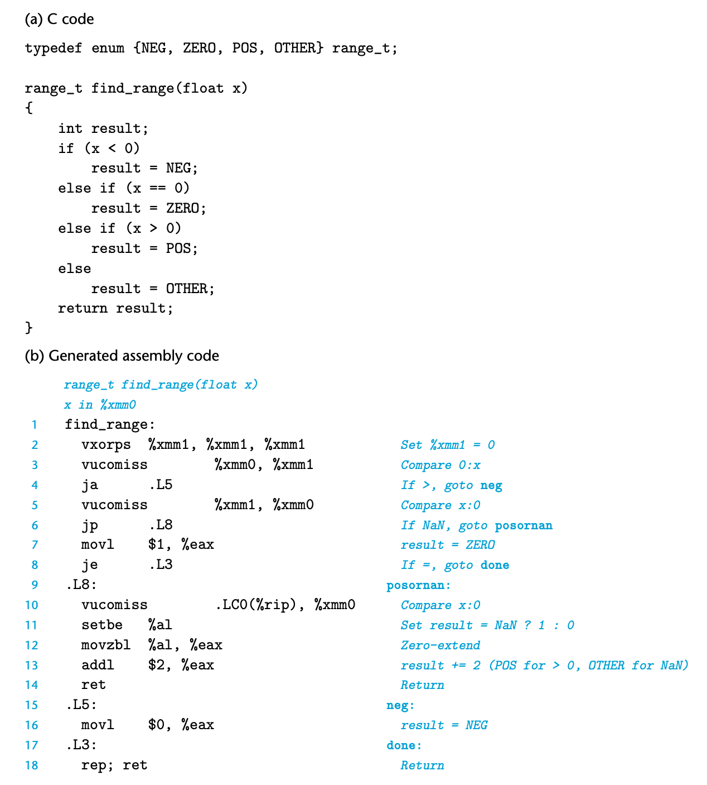

<!-- Page 0336 -->

作为浮点比较的示例，图 3.51(a) 中的 C 函数根据参数 `x` 与 0.0 的关系对其分类，将枚举类型作为结果返回。C 中的枚举类型以整数编码，因此可能的函数值为：0（`NEG`）、1（`ZERO`）、2（`POS`）和 3（`OTHER`）。最后一种结果发生在 `x` 的值为 NaN 时。

GCC 为 `find_range` 生成图 3.51(b) 所示的代码。该代码效率不高——它将 `x` 与 0.0 比较了三次，尽管所需信息可以通过单次比较获得。它还两次生成浮点常量 0.0——一次使用 `vxorps`，一次从内存读取值。让我们追踪四种可能比较结果的函数流程：

- $x < 0.0$：第 4 行的 `ja` 分支将被采用，跳转到末尾，返回值为 0。
- $x = 0.0$：`ja`（第 4 行）和 `jp`（第 6 行）分支不会被采用，但 `je` 分支（第 8 行）会，`%eax` 等于 1 时返回。
- $x > 0.0$：三个分支都不会被采用。`setbe`（第 11 行）将产生 0，`addl` 指令（第 13 行）将其递增为 2，给出返回值 2。
- $x = \text{NaN}$：`jp` 分支（第 6 行）将被采用。第三条 `vucomiss` 指令（第 10 行）将同时设置进位标志和零标志，因此 `setbe` 指令（第 11 行）及后续指令将把 `%eax` 设置为 1。`addl` 指令（第 13 行）将其递增为 3，给出返回值 3。

在家庭作业 3.73 和 3.74 中，你将被要求手动生成更高效的 `find_range` 实现。

**练习题 3.57（答案见第 386 页）**

函数 `funct3` 具有以下原型：

```c
double funct3(int *ap, double b, long c, float *dp);
```

GCC 为该函数生成以下代码：

```
double funct3(int *ap, double b, long c, float *dp)
    ap 在 %rdi，b 在 %xmm0，c 在 %rsi，dp 在 %rdx

funct3:
    vmovss      (%rdx), %xmm1
    vcvtsi2sd   (%rdi), %xmm2, %xmm2
    vucomisd    %xmm2, %xmm0
    jbe         .L8
    vcvtsi2ssq  %rsi, %xmm0, %xmm0
    vmulss      %xmm1, %xmm0, %xmm1
```

<!-- Page 0337 -->

```
    vunpcklps   %xmm1, %xmm1, %xmm1
    vcvtps2pd   %xmm1, %xmm0
    ret
.L8:
    vaddss      %xmm1, %xmm1, %xmm1
    vcvtsi2ssq  %rsi, %xmm0, %xmm0
    vaddss      %xmm1, %xmm0, %xmm0
    vunpcklps   %xmm0, %xmm0, %xmm0
    vcvtps2pd   %xmm0, %xmm0
    ret
```

写出 `funct3` 的 C 版本。

### 3.11.7 关于浮点代码的观察

我们看到，AVX2 为操作浮点数据生成的机器代码的总体风格与我们所见的操作整数数据的风格相似。两者都使用一组寄存器来保存和操作值，并使用这些寄存器传递函数参数。

当然，处理不同数据类型以及包含混合数据类型的表达式求值规则时存在许多复杂性，并且 AVX2 代码涉及比通常只执行整数运算的函数多得多的不同指令和格式。

AVX2 还具有通过对打包数据执行并行操作来使计算运行更快的潜力。编译器开发人员正在研究将标量代码自动转换为并行代码，但目前通过并行性实现更高性能的最可靠方法是使用 GCC 支持的 C 语言扩展来操作数据向量。参见第 582 页的 Web 旁注 OPT:SIMD，了解如何实现这一点。

## 3.12 小结

在本章中，我们透过 C 语言提供的抽象层，了解了机器级编程的视图。通过让编译器生成机器级程序的汇编代码表示，我们深入理解了编译器及其优化能力，以及机器、其数据类型和指令集。在第 5 章中，我们将看到了解编译器的特性有助于编写能有效映射到机器上的程序。我们还获得了程序如何在不同内存区域存储数据的更完整图景。在第 12 章中，我们将看到许多例子，其中应用程序员需要知道程序变量是在运行时栈上、某个动态分配的数据结构中还是全局程序数据的一部分。理解程序如何映射到机器上，使理解这些不同类型存储之间的差异变得更容易。

<!-- Page 0338 -->

机器级程序及其汇编代码表示在许多方面与 C 程序不同。不同数据类型之间几乎没有区别。程序表示为一系列指令，每条指令执行单一操作。程序状态的各部分，如寄存器和运行时栈，对程序员直接可见。只提供低级操作来支持数据操作和程序控制。编译器必须使用多条指令来生成和操作不同的数据结构，以及实现条件、循环和过程等控制结构。我们已经涵盖了 C 的许多不同方面以及它是如何被编译的。我们已经看到，C 中缺乏边界检查使许多程序容易发生缓冲区溢出。这使许多系统容易受到恶意入侵者的攻击，尽管运行时系统和编译器提供的最新保护措施有助于使程序更加安全。

我们只研究了 C 映射到 x86-64 的方式，但我们所涵盖的许多内容对其他语言和机器的组合的处理方式类似。例如，编译 C++ 与编译 C 非常相似。事实上，C++ 的早期实现首先执行从 C++ 到 C 的源代码转换，并通过在结果上运行 C 编译器来生成目标代码。C++ 对象由结构体表示，类似于 C 的 `struct`。方法由指向实现方法的代码的指针表示。相比之下，Java 以完全不同的方式实现。Java 的目标代码是一种称为 Java 字节码的特殊二进制表示。这种代码可以看作是虚拟机的机器级程序。顾名思义，这种机器不是直接在硬件上实现的。相反，软件解释器处理字节码，模拟虚拟机的行为。或者，一种称为即时编译的方法动态地将字节码序列转换为机器指令。当代码多次执行（例如在循环中）时，这种方法提供更快的执行速度。将字节码作为程序低级表示的优点是，相同的代码可以在许多不同的机器上"执行"，而我们所考虑的机器代码只在 x86-64 机器上运行。

## 参考文献注记

Intel 和 AMD 都为其处理器提供了大量文档。这包括汇编语言程序员视图的硬件一般描述 [2, 50]，以及有关各个指令的详细参考资料 [3, 51]。阅读指令描述因以下事实而复杂：(1) 所有文档都基于 Intel 汇编代码格式；(2) 由于不同的寻址和执行模式，每条指令有许多变体；(3) 没有说明性示例。尽管如此，这些仍然是每条指令行为的权威参考。

<!-- Page 0339 -->

x86-64.org 组织负责为在 Linux 系统上运行的 x86-64 代码定义应用程序二进制接口（ABI）[77]。该接口描述了过程链接、二进制代码文件以及机器代码程序正确执行所需的许多其他特性的细节。

Intel 文档和其他编译器（包括 Microsoft 编译器）使用的 Intel 格式。

Muchnick 关于编译器设计的书 [80] 被认为是代码优化技术最全面的参考。它涵盖了我们这里讨论的许多技术，例如寄存器使用惯例。

关于使用缓冲区溢出通过互联网攻击系统的文章已经写了很多。Spafford [105] 以及帮助阻止其传播的 MIT 团队成员 [35] 发表了对 1988 年互联网蠕虫的详细分析。此后，许多论文和项目提出了创建和防止缓冲区溢出攻击的方法。Seacord 的书 [97] 提供了大量关于缓冲区溢出和对 C 编译器生成的代码的其他攻击的信息。

## 家庭作业

**习题 3.58 ☐**

对于具有以下原型的函数：

```c
long decode2(long x, long y, long z);
```

GCC 生成以下汇编代码：

```
decode2:
    subq   %rdx, %rsi
    imulq  %rsi, %rdi
    movq   %rsi, %rax
    salq   $63, %rax
    sarq   $63, %rax
    xorq   %rdi, %rax
    ret
```

参数 `x`、`y` 和 `z` 在寄存器 `%rdi`、`%rsi` 和 `%rdx` 中传递。代码将返回值存储在寄存器 `%rax` 中。

写出 `decode2` 的 C 代码，使其效果等价于所示的汇编代码。

**习题 3.59 ◆**

以下代码计算两个 64 位有符号值 `x` 和 `y` 的 128 位乘积，并将结果存储在内存中：

```c
typedef __int128 int128_t;
void store_prod(int128_t *dest, int64_t x, int64_t y) {
    *dest = x * (int128_t) y;
}
```

GCC 生成以下汇编代码实现该计算：

<!-- Page 0340 -->

```
store_prod:
    movq   %rdx, %rax
    cqto
    movq   %rsi, %rcx
    sarq   $63, %rcx
    imulq  %rax, %rcx
    imulq  %rsi, %rdx
    addq   %rdx, %rcx
    mulq   %rsi
    addq   %rcx, %rdx
    movq   %rax, (%rdi)
    movq   %rdx, 8(%rdi)
    ret
```

该代码使用了三次乘法，用于在 64 位机器上实现 128 位算术所需的多精度运算。请描述计算乘积所用的算法，并对汇编代码进行注释，说明该代码如何实现你所描述的算法。提示：将 `x` 和 `y` 的参数扩展到 128 位时，可以将其改写为 $x = 2^{64} \cdot x_h + x_l$ 以及 $y = 2^{64} \cdot y_h + y_l$，其中 $x_h$、$x_l$、$y_h$ 和 $y_l$ 均为 64 位值。类似地，128 位乘积可以写成 $p = 2^{64} \cdot p_h + p_l$，其中 $p_h$ 和 $p_l$ 为 64 位值。请说明代码如何用 $x_h$、$x_l$、$y_h$ 和 $y_l$ 来计算 $p_h$ 和 $p_l$ 的值。

**习题 3.60 ☐**

考虑以下汇编代码：

```
long loop(long x, int n)
x in %rdi, n in %esi

loop:
    movl  %esi, %ecx
    movl  $1, %edx
    movl  $0, %eax
    jmp   .L2
.L3:
    movq  %rdi, %r8
    andq  %rdx, %r8
    orq   %r8, %rax
    salq  %cl, %rdx
.L2:
    testq %rdx, %rdx
    jne   .L3
    rep; ret
```

上述代码是通过编译具有以下总体形式的 C 代码生成的：

<!-- Page 0341 -->

```c
long loop(long x, long n)
{
    long result = ___;
    long mask;
    for (mask = ___; mask ___; mask = ___) {
        result |= ___;
    }
    return result;
}
```

你的任务是填写 C 代码中的缺失部分，使程序等价于生成的汇编代码。回忆一下，函数的返回值存放在寄存器 `%rax` 中。在查看循环之前、期间和之后的汇编代码，有助于建立寄存器与程序变量之间的一致映射关系。

A. 哪些寄存器存放程序变量 `x`、`n`、`result` 和 `mask`？

B. `result` 和 `mask` 的初始值是什么？

C. `mask` 的测试条件是什么？

D. `mask` 如何更新？

E. `result` 如何更新？

F. 填写 C 代码中所有缺失的部分。

**习题 3.61**

在第 3.6.6 节中，我们将以下代码作为条件数据传送的候选进行了分析：

```c
long cread(long *xp) {
    return (xp ? *xp : 0);
}
```

我们展示了一个使用条件移动指令的实现方案，但论证说明它是无效的，因为它可能尝试从空地址读取数据。

编写一个 C 函数 `cread_alt`，其行为与 `cread` 相同，但可以被编译为使用条件数据传送。编译后，生成的代码应使用条件移动指令，而不是跳转指令。

<!-- Page 0342 -->

**习题 3.62 ☐**

以下代码展示了在 `switch` 语句中对枚举类型值进行分支的示例。回忆一下，C 语言中的枚举类型只是一种为关联整数值引入一组名称的方式。默认情况下，分配给名称的值从零开始递增。在我们的代码中，与不同 `case` 标签关联的动作已被省略。

```c
/* 枚举类型创建一组从 0 开始编号的常量 */
typedef enum {MODE_A, MODE_B, MODE_C, MODE_D, MODE_E} mode_t;

long switch3(long *p1, long *p2, mode_t action)
{
    long result = 0;
    switch(action) {
        case MODE_A:
        case MODE_B:
        case MODE_C:
        case MODE_D:
        case MODE_E:
        default:
            return result;
    }
}
```

<!-- Page 0343 -->

实现不同动作的生成汇编代码部分如图 3.52 所示。注释标明了参数位置、寄存器值以及不同跳转目标的 `case` 标签。

填写 C 代码的缺失部分。其中包含一个落入下一个 `case` 的情形——尝试重建此逻辑。

```
p1 in %rdi, p2 in %rsi, action in %edx
.L8:
    MOVL $27, %eax
    ret
.L3:
    MOVQ (%rsi), %rax
    MOVQ (%rdi), %rdx
    MOVQ %rdx, (%rsi)
    ret
.L5:
    MOVQ (%rdi), %rax
    addq (%rsi), %rax
    movq %rax, (%rdi)
    ret
.L6:
    MOVQ $59, (%rdi)
    movq (%rsi), %rax
    ret
.L7:
    MOVQ (%rsi), %rax
    movq %rax, (%rdi)
    movl $27, %eax
    ret
.L9:                /* default */
    movl $12, %eax
    ret
```

<div style="text-align: center;">图 3.52 习题 3.62 的汇编代码。该代码实现了 switch 语句中的不同分支。</div>

**习题 3.63 ☐**

本题将给你一个机会，从反汇编的机器代码中逆向推导 `switch` 语句。在以下过程中，`switch` 语句的主体已被省略：

```c
long switch_prob(long x, long n) {
    long result = x;
    switch(n) {
        /* 在此填写代码 */
    }
    return result;
}
```

<!-- Page 0344 -->

图 3.53 展示了该过程的反汇编机器代码。

跳转表位于内存的另一区域。从第 5 行的间接跳转可以看出，跳转表从地址 `0x4006f8` 开始。使用 GDB 调试器，可以通过命令 `x/6gx 0x4006f8` 查看构成跳转表的六个 8 字节字的内存内容。GDB 输出如下：

```
(gdb) x/6gx 0x4006f8
0x4006f8: 0x00000000004005a1  0x00000000004005c3
0x400708: 0x00000000004005a1  0x00000000004005aa
0x400718: 0x00000000004005b2  0x00000000004005bf
```

用具有与机器代码相同行为的 C 代码填写 `switch` 语句的主体。

```
long switch_prob(long x, long n)
x in %rdi, n in %rsi
0000000000400590 <switch_prob>:
  400590: 48 83 ee 3c          sub    $0x3c,%rsi
  400594: 48 83 fe 05          cmp    $0x5,%rsi
  400598: 77 29                ja     4005c3 <switch_prob+0x33>
  40059a: ff 24 f5 f8 06 40 00 jmpq   *0x4006f8(,%rsi,8)
  4005a1: 48 8d 04 fd 00 00 00 lea    0x0(,%rdi,8),%rax
  4005a8: 00
  4005a9: c3                   retq
  4005aa: 48 89 f8             mov    %rdi,%rax
  4005ad: 48 c1 f8 03          sar    $0x3,%rax
  4005b1: c3                   retq
  4005b2: 48 89 f8             mov    %rdi,%rax
  4005b5: 48 c1 e0 04          shl    $0x4,%rax
  4005b9: 48 29 f8             sub    %rdi,%rax
  4005bc: 48 89 c7             mov    %rax,%rdi
  4005bf: 48 0f af ff          imul   %rdi,%rdi
  4005c3: 48 8d 47 4b          lea    0x4b(%rdi),%rax
  4005c7: c3                   retq
```

<div style="text-align: center;">图 3.53 习题 3.63 的反汇编代码。</div>

**习题 3.64 ☐☐☐**

考虑以下源代码，其中 `R`、`S` 和 `T` 是用 `#define` 声明的常量：

```c
long A[R][S][T];
long store_ele(long i, long j, long k, long *dest)
{
    *dest = A[i][j][k];
    return sizeof(A);
}
```

编译此程序时，GCC 生成以下汇编代码：

```
long store_ele(long i, long j, long k, long *dest)
i in %rdi, j in %rsi, k in %rdx, dest in %rcx

store_ele:
    leaq  (%rsi,%rsi,2), %rax
    leaq  (%rsi,%rax,4), %rax
    movq  %rdi, %rsi
    salq  $6, %rsi
    addq  %rsi, %rdi
    addq  %rax, %rdi
```

<!-- Page 0345 -->

```
    addq  %rdi, %rdx
    movq  A(,%rdx,8), %rax
    movq  %rax, (%rcx)
    movl  $3640, %eax
    ret
```

A. 将公式（3.1）从二维推广到三维，给出数组元素 `A[i][j][k]` 的位置公式。

B. 利用你的逆向工程技能，根据汇编代码确定 `R`、`S` 和 `T` 的值。

**习题 3.65 ☐**

以下代码对一个 $M \times M$ 数组的元素进行转置，其中 `M` 是用 `#define` 定义的常量：

```c
void transpose(long A[M][M]) {
    long i, j;
    for (i = 0; i < M; i++)
        for (j = 0; j < i; j++) {
            long t = A[i][j];
            A[i][j] = A[j][i];
            A[j][i] = t;
        }
}
```

以 `-O1` 优化级别编译时，gcc 为函数内层循环生成以下代码：

```
.L6:
    movq   (%rdx), %rcx
    movq   (%rax), %rsi
    movq   %rsi, (%rdx)
    movq   %rcx, (%rax)
    addq   $8, %rdx
    addq   $120, %rax
    cmpq   %rdi, %rax
    jne    .L6
```

可以看出，GCC 已将数组索引转换为指针代码。

A. 哪个寄存器保存指向数组元素 `A[i][j]` 的指针？

B. 哪个寄存器保存指向数组元素 `A[j][i]` 的指针？

C. `M` 的值是多少？

<!-- Page 0346 -->

**习题 3.66**

考虑以下源代码，其中 `NR` 和 `NC` 是用 `#define` 声明的宏表达式，用于根据参数 `n` 计算数组 `A` 的维度。此代码计算数组第 `j` 列所有元素的和。

```c
long sum_col(long n, long A[NR(n)][NC(n)], long j)
{
    long i;
    long result = 0;
    for (i = 0; i < NR(n); i++)
        result += A[i][j];
    return result;
}
```

编译此程序时，gcc 生成以下汇编代码：

```
long sum_col(long n, long A[NR(n)][NC(n)], long j)
n in %rdi, A in %rsi, j in %rdx

sum_col:
    leaq  1(,%rdi,4), %r8
    leaq  (%rdi,%rdi,2), %rax
    movq  %rax, %rdi
    testq %rax, %rax
    jle   .L4
    salq  $3, %r8
    leaq  (%rsi,%rdx,8), %rcx
    movl  $0, %eax
    movl  $0, %edx
.L3:
    addq  (%rcx), %rax
    addq  $1, %rdx
    addq  %r8, %rcx
    cmpq  %rdi, %rdx
    jne   .L3
    rep; ret
.L4:
    movl  $0, %eax
    ret
```

利用逆向工程技能确定 `NR` 和 `NC` 的定义。

**习题 3.67 ☐**

在本题中，我们将分析 GCC 为以结构体作为参数和返回值的函数所生成的代码，并从中了解这些语言特性通常是如何实现的。

以下 C 代码有一个函数 `process`，以结构体作为参数和返回值，以及一个调用 `process` 的函数 `eval`：

```c
typedef struct {
    long a[2];
    long *p;
} strA;
```

<!-- Page 0347 -->

```c
typedef struct {
    long u[2];
    long q;
} strB;

strB process(strA s) {
    strB r;
    r.u[0] = s.a[1];
    r.u[1] = s.a[0];
    r.q = *s.p;
    return r;
}

long eval(long x, long y, long z) {
    strA s;
    s.a[0] = x;
    s.a[1] = y;
    s.p = &z;
    strB r = process(s);
    return r.u[0] + r.u[1] + r.q;
}
```

GCC 为这两个函数生成以下代码：

```
strB process(strA s)
process:
    movq  %rdi, %rax
    movq  24(%rsp), %rdx
    movq  (%rdx), %rdx
    movq  16(%rsp), %rcx
    movq  %rcx, (%rdi)
    movq  8(%rsp), %rcx
    movq  %rcx, 8(%rdi)
    movq  %rdx, 16(%rdi)
    ret

long eval(long x, long y, long z)
x in %rdi, y in %rsi, z in %rdx
eval:
    subq  $104, %rsp
    movq  %rdx, 24(%rsp)
    leaq  24(%rsp), %rax
    movq  %rdi, (%rsp)
    movq  %rsi, 8(%rsp)
    movq  %rax, 16(%rsp)
    leaq  64(%rsp), %rdi
    call  process
```

<!-- Page 0348 -->

```
    movq  72(%rsp), %rax
    addq  64(%rsp), %rax
    addq  80(%rsp), %rax
    addq  $104, %rsp
    ret
```

A. 可以看出，在函数 `eval` 的第 2 行，它在栈上分配了 104 字节。绘制 `eval` 的栈帧示意图，展示 `eval` 在调用 `process` 之前存储到栈上的值。

B. `eval` 在调用 `process` 时传递的参数是什么？

C. `process` 的代码如何访问结构体参数 `s` 的各个字段？

D. `process` 的代码如何设置结果结构体 `r` 的字段？

E. 完善你的 `eval` 栈帧示意图，展示 `eval` 在从 `process` 返回后如何访问结构体 `r` 的各个字段。

F. 关于结构体值作为函数参数传递和作为函数结果返回的方式，你能总结出哪些一般性原则？

**习题 3.68 ☐☐**

在以下代码中，`A` 和 `B` 是用 `#define` 定义的常量：

```c
typedef struct {
    int x[A][B]; /* 未知常量 A 和 B */
    long y;
} str1;

typedef struct {
    char array[B];
    int t;
    short s[A];
    long u;
} str2;

void setVal(str1 *p, str2 *q) {
    long v1 = q->t;
    long v2 = q->u;
    p->y = v1 + v2;
}
```

gcc 为 `setVal` 生成以下代码：

```
void setVal(str1 *p, str2 *q)
p in %rdi, q in %rsi
setVal:
    movslq  8(%rsi), %rax
    addq    32(%rsi), %rax
```

<!-- Page 0349 -->

```
    movq    %rax, 184(%rdi)
    ret
```

`A` 和 `B` 的值是多少？（答案唯一。）

**习题 3.69 ☐☐**

你负责维护一个大型 C 程序，并遇到以下代码：

```c
typedef struct {
    int first;
    a_struct a[CNT];
    int last;
} b_struct;

void test(long i, b_struct *bp)
{
    int n = bp->first + bp->last;
    a_struct *ap = &bp->a[i];
    ap->x[ap->idx] = n;
}
```

编译时常量 `CNT` 以及结构体 `a_struct` 的声明位于一个你没有访问权限的文件中。幸运的是，你有该代码的 `.o` 版本，可以使用 `OBJDUMP` 程序进行反汇编。

<!-- [未翻译] 原因: OCR提取导致反汇编代码严重损坏 -->

利用你的逆向工程技能，推导以下内容：

A. `CNT` 的值。

B. 结构体 `a_struct` 的完整声明。假设该结构体中只有 `idx` 和 `x` 这两个字段，且两者都包含有符号值。

<!-- Page 0350 -->

**习题 3.70 ☐**

考虑以下联合体声明：

```c
union ele {
    struct {
        long *p;
        long y;
    } e1;
    struct {
        long x;
        union ele *next;
    } e2;
};
```

该声明说明了结构体可以嵌入联合体中。

以下函数（省略了部分表达式）对以这些联合体作为链表元素的链表进行操作：

```c
void proc(union ele *up) {
    up->___ = *(___) - ___;
}
```

A. 以下字段的偏移量（以字节为单位）是多少：

```
e1.p    ___
e1.y    ___
e2.x    ___
e2.next ___
```

B. 该联合体共需多少字节？

C. 编译器为 `proc` 生成以下汇编代码：

```
void proc(union ele *up)
up in %rdi

proc:
    movq  8(%rdi), %rax
    movq  (%rax), %rdx
    movq  (%rdx), %rdx
    subq  8(%rax), %rdx
    movq  %rdx, (%rdi)
    ret
```

根据这些信息，填写 `proc` 代码中的缺失表达式。提示：某些联合体引用可能存在歧义，但随着推导深入，这些歧义会逐渐消除。只有一个答案不涉及任何强制类型转换且不违反类型约束。

<!-- Page 0351 -->

**习题 3.71**

编写函数 `good_echo`，从标准输入读取一行并将其写入标准输出。你的实现应能处理任意长度的输入行。你可以使用库函数 `fgets`，但必须确保函数在输入行所需空间超过所分配缓冲区大小时也能正确工作。代码还应检查错误条件，并在遇到错误时返回。请参阅标准 I/O 函数的定义以获取文档说明 [45, 61]。

**习题 3.72 ◆**

图 3.54(a) 展示了一个与函数 `vfunct`（图 3.43(a)）类似的函数代码。我们曾用 `vfunct` 说明帧指针在管理可变大小栈帧中的使用。新函数 `aframe` 通过调用库函数 `alloca` 为局部数组 `p` 分配空间。

```c
#include <alloca.h>

long aframe(long n, long idx, long *q) {
    long i;
    long **p = alloca(n * sizeof(long *));
    p[0] = &i;
    for (i = 1; i < n; i++)
        p[i] = q;
    return *p[idx];
}
```

```
long aframe(long n, long idx, long *q)
n in %rdi, idx in %rsi, q in %rdx
aframe:
    pushq %rbp
    movq  %rsp, %rbp
    subq  $16, %rsp
    leaq  30(,%rdi,8), %rax
    andq  $-16, %rax
    subq  %rax, %rsp
    leaq  15(%rsp), %r8
    andq  $-16, %r8
    ...
    Set %r8 to &p[0]
```

<div style="text-align: center;">图 3.54 习题 3.72 的代码。该函数与图 3.43 中的函数类似。</div>

<!-- Page 0352 -->

此函数类似于更常用的 `malloc` 函数，不同之处在于它在运行时栈上分配空间。当执行过程返回时，所分配的空间会自动释放。

图 3.54(b) 展示了汇编代码中设置帧指针并为局部变量 `i` 和 `p` 分配空间的部分。它与 `vframe` 的对应代码非常相似。我们使用与习题 3.49 相同的记号：栈指针在第 4 行被设置为 $s_1$，在第 7 行被设置为 $s_2$。数组 `p` 的起始地址被设置为第 9 行的值 $p$。$s_2$ 和 $p$ 之间可能存在额外空间 $e_2$，而数组 `p` 末尾和 $s_1$ 之间可能存在额外空间 $e_1$。

A. 用数学方式解释 $s_2$ 计算中的逻辑。

B. 用数学方式解释 $p$ 计算中的逻辑。

C. 找出导致 $e_1$ 取最小值和最大值的 $n$ 和 $s_1$ 的值。

D. 此代码对 $s_2$ 和 $p$ 的值保证了哪些对齐属性？

**习题 3.73 ◆**

用汇编代码编写一个函数，使其行为与图 3.51 中的 `find_range` 函数相匹配。你的代码应只包含一条浮点比较指令，然后使用条件分支生成正确的结果。请在所有 $2^{32}$ 种可能的参数值上测试你的代码。第 214 页的 Web 附录 ASM:EASM 描述了如何将汇编代码编写的函数整合到 C 程序中。

**习题 3.74 ☐**

用汇编代码编写一个函数，使其行为与图 3.51 中的 `find_range` 函数相匹配。你的代码应只包含一条浮点比较指令，然后使用条件移动生成正确的结果。你可能需要用到 `cmovp` 指令（偶奇偶性时移动）。请在所有 $2^{32}$ 种可能的参数值上测试你的代码。第 214 页的 Web 附录 ASM:EASM 描述了如何将汇编代码编写的函数整合到 C 程序中。

**习题 3.75 ☐**

ISO C99 包含对复数的扩展支持。任何浮点类型都可以用关键字 `complex` 修饰。以下是一些处理复数数据并调用相关库函数的示例函数：

```c
#include <complex.h>

double c_imag(double complex x) {
    return cimag(x);
}

double c_real(double complex x) {
    return creal(x);
}
```

<!-- Page 0353 -->

```c
double complex c_sub(double complex x, double complex y) {
    return x - y;
}
```

编译后，gcc 为这些函数生成以下汇编代码：

```
double c_imag(double complex x)
c_imag:
    movapd %xmm1, %xmm0
    ret

double c_real(double complex x)
c_real:
    rep; ret

double complex c_sub(double complex x, double complex y)
c_sub:
    subsd %xmm2, %xmm0
    subsd %xmm3, %xmm1
    ret
```

根据这些示例，确定以下内容：

A. 复数参数是如何传递给函数的？

B. 复数值是如何从函数返回的？

## 练习题解答

### 练习题 3.1 解答（第 218 页）

本题考查不同操作数形式的练习。

<table border=1 style='margin: auto; word-wrap: break-word;'><tr><td style='text-align: center; word-wrap: break-word;'>操作数</td><td style='text-align: center; word-wrap: break-word;'>值</td><td style='text-align: center; word-wrap: break-word;'>注释</td></tr><tr><td style='text-align: center; word-wrap: break-word;'>%rax</td><td style='text-align: center; word-wrap: break-word;'>0x100</td><td style='text-align: center; word-wrap: break-word;'>寄存器</td></tr><tr><td style='text-align: center; word-wrap: break-word;'>0x104</td><td style='text-align: center; word-wrap: break-word;'>0xAA</td><td style='text-align: center; word-wrap: break-word;'>绝对地址</td></tr><tr><td style='text-align: center; word-wrap: break-word;'>$0x108</td><td style='text-align: center; word-wrap: break-word;'>0x108</td><td style='text-align: center; word-wrap: break-word;'>立即数</td></tr><tr><td style='text-align: center; word-wrap: break-word;'>(%rax)</td><td style='text-align: center; word-wrap: break-word;'>0xFF</td><td style='text-align: center; word-wrap: break-word;'>地址 0x100</td></tr><tr><td style='text-align: center; word-wrap: break-word;'>4(%rax)</td><td style='text-align: center; word-wrap: break-word;'>0xAA</td><td style='text-align: center; word-wrap: break-word;'>地址 0x104</td></tr><tr><td style='text-align: center; word-wrap: break-word;'>9(%rax,%rdx)</td><td style='text-align: center; word-wrap: break-word;'>0x11</td><td style='text-align: center; word-wrap: break-word;'>地址 0x10C</td></tr><tr><td style='text-align: center; word-wrap: break-word;'>260(%rcx,%rdx)</td><td style='text-align: center; word-wrap: break-word;'>0x13</td><td style='text-align: center; word-wrap: break-word;'>地址 0x108</td></tr><tr><td style='text-align: center; word-wrap: break-word;'>0xFC(,%rcx,4)</td><td style='text-align: center; word-wrap: break-word;'>0xFF</td><td style='text-align: center; word-wrap: break-word;'>地址 0x100</td></tr><tr><td style='text-align: center; word-wrap: break-word;'>(%rax,%rdx,4)</td><td style='text-align: center; word-wrap: break-word;'>0x11</td><td style='text-align: center; word-wrap: break-word;'>地址 0x10C</td></tr></table>

### 练习题 3.2 解答（第 221 页）

正如我们所见，gcc 生成的汇编代码在指令上包含后缀，而反汇编器则不包含。能够在这两种形式之间切换是一项重要技能。一个重要特性是，x86-64 中的内存引用始终使用四字寄存器（如 `%rax`），即使操作数是字节、单字或双字也是如此。

<!-- Page 0354 -->

以下是带有后缀的代码：

```
movl  %eax, (%rsp)
movw  (%rax), %dx
movb  $0xFF, %bl
movb  (%rsp,%rdx,4), %dl
movq  (%rdx), %rax
movw  %dx, (%rax)
```

### 练习题 3.3 解答（第 222 页）

由于我们依赖 GCC 生成大部分汇编代码，能够编写正确的汇编代码并不是一项关键技能。尽管如此，本练习将帮助你更加熟悉不同的指令和操作数类型。

以下是带有错误说明的代码：

| 指令 | 错误说明 |
|------|------|
| `movb $0xF, (%ebx)` | 不能使用 `%ebx` 作为地址寄存器 |
| `movl %rax, (%rsp)` | 指令后缀与寄存器标识符不匹配 |
| `movw (%rax), 4(%rsp)` | 不能同时将源操作数和目标操作数都设为内存引用 |
| `movb %al, %sl` | 没有名为 `%sl` 的寄存器 |
| `movl %eax, $0x123` | 不能将立即数作为目标操作数 |
| `movl %eax, %dx` | 目标操作数大小错误 |
| `movb %si, 8(%rbp)` | 指令后缀与寄存器标识符不匹配 |

### 练习题 3.4 解答（第 223 页）

本练习让你进一步熟悉不同的数据传送指令及其与 C 语言数据类型和转换规则的关系。有符号性和大小的双重转换，以及整数提升，使得该题颇具挑战性。

<table border=1 style='margin: auto; word-wrap: break-word;'><tr><td style='text-align: center; word-wrap: break-word;'>src_t</td><td style='text-align: center; word-wrap: break-word;'>dest_t</td><td style='text-align: center; word-wrap: break-word;'>Instruction</td><td style='text-align: center; word-wrap: break-word;'>Comments</td></tr><tr><td rowspan="2">long</td><td rowspan="2">long</td><td style='text-align: center; word-wrap: break-word;'>movq (%rdi), %rax</td><td style='text-align: center; word-wrap: break-word;'>Read 8 bytes</td></tr><tr><td style='text-align: center; word-wrap: break-word;'>movq %rax, (%rsi)</td><td style='text-align: center; word-wrap: break-word;'>Store 8 bytes</td></tr><tr><td rowspan="2">char</td><td rowspan="2">int</td><td style='text-align: center; word-wrap: break-word;'>movsbl (%rdi), %eax</td><td style='text-align: center; word-wrap: break-word;'>Convert char to int</td></tr><tr><td style='text-align: center; word-wrap: break-word;'>movl %eax, (%rsi)</td><td style='text-align: center; word-wrap: break-word;'>Store 4 bytes</td></tr><tr><td rowspan="2">char</td><td rowspan="2">unsigned</td><td style='text-align: center; word-wrap: break-word;'>movsbl (%rdi), %eax</td><td style='text-align: center; word-wrap: break-word;'>Convert char to int</td></tr><tr><td style='text-align: center; word-wrap: break-word;'>movl %eax, (%rsi)</td><td style='text-align: center; word-wrap: break-word;'>Store 4 bytes</td></tr><tr><td rowspan="2">unsigned char</td><td rowspan="2">long</td><td style='text-align: center; word-wrap: break-word;'>movzbl (%rdi), %eax</td><td style='text-align: center; word-wrap: break-word;'>Read byte and zero-extend</td></tr><tr><td style='text-align: center; word-wrap: break-word;'>movq %rax, (%rsi)</td><td style='text-align: center; word-wrap: break-word;'>Store 8 bytes</td></tr></table>

<!-- Page 0355 -->

<!-- [未翻译] 原因: OCR提取导致表格后续行格式严重损坏 -->
*注：表格 3.4 解答后续行（unsigned char→unsigned char、unsigned char→char、char→short 的转换指令）因 OCR 提取格式损坏，无法准确还原。*

### 练习题 3.5 解答（第 225 页）

逆向工程是理解系统的好方法。在本题中，我们要逆向推导 C 编译器的效果，以确定哪些 C 代码产生了该汇编代码。最好的方法是运行"模拟"，从指针 `xp`、`yp`、`zp` 所指定位置分别存有初始值 x、y、z 开始：

```
void decode1(long *xp, long *yp, long *zp)
xp in %rdi, yp in %rsi, zp in %rdx

decode1:
    movq  (%rdi), %r8    获取 x = *xp
    movq  (%rsi), %rcx   获取 y = *yp
    movq  (%rdx), %rax   获取 z = *zp
    movq  %r8, (%rsi)    将 x 存入 yp
    movq  %rcx, (%rdx)   将 y 存入 zp
    movq  %rax, (%rdi)   将 z 存入 xp
    ret
```

由此可生成以下 C 代码：

```c
void decode1(long *xp, long *yp, long *zp)
{
    long x = *xp;
    long y = *yp;
    long z = *zp;

    *yp = x;
    *zp = y;
    *xp = z;
}
```

### 练习题 3.6 解答（第 228 页）

本练习演示了 `leaq` 指令的多功能性，并让你进一步练习理解不同的操作数形式。虽然操作数形式在图 3.3 中被归类为"内存"类型，但实际上不会发生内存访问。

<!-- Page 0356 -->

<table border=1 style='margin: auto; word-wrap: break-word;'><tr><td style='text-align: center; word-wrap: break-word;'>Instruction</td><td style='text-align: center; word-wrap: break-word;'>Result</td></tr><tr><td style='text-align: center; word-wrap: break-word;'>leaq 9(%rdx), %rax</td><td style='text-align: center; word-wrap: break-word;'>9 + q</td></tr><tr><td style='text-align: center; word-wrap: break-word;'>leaq (%rdx, %rbx), %rax</td><td style='text-align: center; word-wrap: break-word;'>q + p</td></tr><tr><td style='text-align: center; word-wrap: break-word;'>leaq (%rdx, %rbx, 3), %rax</td><td style='text-align: center; word-wrap: break-word;'>q + 3p</td></tr><tr><td style='text-align: center; word-wrap: break-word;'>leaq 2(%rbx, %rbx, 7), %rax</td><td style='text-align: center; word-wrap: break-word;'>2 + 8p</td></tr><tr><td style='text-align: center; word-wrap: break-word;'>leaq 0xE(,%rdx, 3), %rax</td><td style='text-align: center; word-wrap: break-word;'>14 + 3q</td></tr><tr><td style='text-align: center; word-wrap: break-word;'>leaq 6(%rbx, %rdx, 7), %rdx</td><td style='text-align: center; word-wrap: break-word;'>6 + p + 7q</td></tr></table>

### 练习题 3.7 解答（第 229 页）

同样，逆向工程被证明是学习 C 代码与生成汇编代码之间关系的有效方法。解决这类问题最好的方法是对汇编代码各行进行注释，说明所执行的操作：

```
short scale3(short x, short y, short z)
x in %rdi, y in %rsi, z in %rdx
scale3:
    leaq  (%rsi,%rsi,9), %rbx     10 * y
    leaq  (%rbx,%rdx), %rbx      10 * y + z
    leaq  (%rbx,%rdi,%rsi), %rbx  10 * y + z + y * x
    ret
```

由此可以轻松生成缺失的表达式：

```c
short t = 10 * y + z + y * x;
```

### 练习题 3.8 解答（第 230 页）

本题考查你对操作数和算术指令的理解。该指令序列的设计使得每条指令的结果不会影响后续指令的行为。

<table border=1 style='margin: auto; word-wrap: break-word;'><tr><td style='text-align: center; word-wrap: break-word;'>Instruction</td><td style='text-align: center; word-wrap: break-word;'>Destination</td><td style='text-align: center; word-wrap: break-word;'>Value</td></tr><tr><td style='text-align: center; word-wrap: break-word;'>addq %rcx, (%rax)</td><td style='text-align: center; word-wrap: break-word;'>0x100</td><td style='text-align: center; word-wrap: break-word;'>0x100</td></tr><tr><td style='text-align: center; word-wrap: break-word;'>subq %rdx, 8(%rax)</td><td style='text-align: center; word-wrap: break-word;'>0x108</td><td style='text-align: center; word-wrap: break-word;'>0xA8</td></tr><tr><td style='text-align: center; word-wrap: break-word;'>imulq $16, (%rax, %rdx, 8)</td><td style='text-align: center; word-wrap: break-word;'>0x118</td><td style='text-align: center; word-wrap: break-word;'>0x110</td></tr><tr><td style='text-align: center; word-wrap: break-word;'>incq 16(%rax)</td><td style='text-align: center; word-wrap: break-word;'>0x110</td><td style='text-align: center; word-wrap: break-word;'>0x14</td></tr><tr><td style='text-align: center; word-wrap: break-word;'>decq %rcx</td><td style='text-align: center; word-wrap: break-word;'>%rcx</td><td style='text-align: center; word-wrap: break-word;'>0x0</td></tr><tr><td style='text-align: center; word-wrap: break-word;'>subq %rdx, %rax</td><td style='text-align: center; word-wrap: break-word;'>%rax</td><td style='text-align: center; word-wrap: break-word;'>0xFD</td></tr></table>

### 练习题 3.9 解答（第 231 页）

本练习让你有机会生成少量汇编代码。该解答代码由 gcc 生成。通过将参数 `n` 加载到寄存器 `%ecx` 中，随后可以使用字节寄存器 `%cl` 来指定 `sarq` 指令的移位量。使用 `movl` 指令看起来有些奇怪（因为 `n` 占 8 字节），但要注意只有最低字节用于指定移位量。

<!-- Page 0357 -->

```
long shift_left4_rightn(long x, long n)
x in %rdi, n in %rsi
shift_left4_rightn:
    movq  %rdi, %rax    获取 x
    salq  $4, %rax      x <<= 4
    movl  %esi, %ecx    获取 n（4 字节）
    sarq  %cl, %rax     x >>= n
```

### 练习题 3.10 解答（第 232 页）

该问题相当直接，因为汇编代码紧密遵循 C 代码的结构。

```c
short p1 = y | z;
short p2 = p1 >> 9;
short p3 = ~p2;
short p4 = y - p3;
```

### 练习题 3.11 解答（第 233 页）

**A.** 该指令用于将寄存器 `%rcx` 清零，利用了对任意 x 满足 $x \oplus x = 0$ 的性质。它对应于 C 语句 `x = 0`。

**B.** 将寄存器 `%rcx` 清零的更直接方式是使用指令 `movq $0, %rcx`。

**C.** 然而，对该代码进行汇编和反汇编后，我们发现 `xorq` 版本只需 3 字节，而 `movq` 版本需要 7 字节。将 `%rcx` 清零的其他方法依赖于任何更新低 4 字节的指令都会将高位字节清零这一特性。因此，我们可以使用 `xorl %ecx, %ecx`（2 字节）或 `movl $0, %ecx`（5 字节）。

<!-- Page 0358 -->

### 练习题 3.12 解答（第 236 页）

我们只需将 `cqto` 指令替换为将寄存器 `%rdx` 清零的指令，并使用 `divq` 而非 `idivq` 作为除法指令，得到以下代码：

```
void uremdiv(unsigned long x, unsigned long y,
             unsigned long *qp, unsigned long *rp)
x in %rdi, y in %rsi, qp in %rdx, rp in %rcx
uremdiv:
    movq  %rdx, %r8     复制 qp
    movq  %rdi, %rax    将 x 移到被除数低 8 字节
    movl  $0, %edx      将被除数高 8 字节置零
    divq  %rsi          除以 y
    movq  %rax, (%r8)   将商存储到 qp
    movq  %rdx, (%rcx)  将余数存储到 rp
    ret
```

### 练习题 3.13 解答（第 240 页）

需要了解的是，汇编代码不跟踪程序值的类型。相反，不同的指令决定了操作数的大小以及它们是有符号还是无符号的。当从指令序列映射回 C 代码时，我们必须做一些侦探工作来推断程序值的数据类型。

**A.** 后缀 `l` 和寄存器标识符表明是 32 位操作数，比较使用补码 `<`。可以推断 `data_t` 必为 `int`。

**B.** 后缀 `w` 和寄存器标识符表明是 16 位操作数，比较使用补码 `>=`。可以推断 `data_t` 必为 `short`。

**C.** 后缀 `b` 和寄存器标识符表明是 8 位操作数，比较使用无符号 `<=`。可以推断 `data_t` 必为 `unsigned char`。

**D.** 后缀 `q` 和寄存器标识符表明是 64 位操作数，比较使用 `!=`，这对有符号、无符号和指针都相同。可以推断 `data_t` 可以是 `long`、`unsigned long` 或某种指针类型。

### 练习题 3.14 解答（第 241 页）

本题与练习题 3.13 类似，但涉及 TEST 指令而非 CMP 指令。

**A.** 后缀 `q` 和寄存器标识符表明是 64 位操作数，比较使用有符号 `>=`。可以推断 `data_t` 必为 `long`。

**B.** 后缀 `w` 和寄存器标识符表明是 16 位操作数，比较使用 `==`，对有符号和无符号都相同。可以推断 `data_t` 是 `short` 或 `unsigned short`。

**C.** 后缀 `b` 和寄存器标识符表明是 8 位操作数，比较使用无符号 `>`。可以推断 `data_t` 必为 `unsigned char`。

**D.** 后缀 `l` 和寄存器标识符表明是 32 位操作数，比较使用 `<`。可以推断 `data_t` 必为 `int`。

<!-- Page 0359 -->

### 练习题 3.15 解答（第 245 页）

本题要求你仔细检查反汇编代码并对跳转目标的编码进行推理，同时练习十六进制算术。

**A.** `je` 指令的目标为 `0x4003fc + 0x02`。如原始反汇编代码所示，这是 `0x4003fe`：

<table border=1 style='margin: auto; word-wrap: break-word;'><tr><td style='text-align: center; word-wrap: break-word;'>4003fa: 74 02</td><td style='text-align: center; word-wrap: break-word;'>je</td><td style='text-align: center; word-wrap: break-word;'>4003fe</td></tr><tr><td style='text-align: center; word-wrap: break-word;'>4003fc: ff d0</td><td style='text-align: center; word-wrap: break-word;'>callq</td><td style='text-align: center; word-wrap: break-word;'>*%rax</td></tr></table>

**B.** `je` 指令的目标为 `0x400431 - 12`（因为 `0xf4` 是 -12 的单字节补码表示）。如原始反汇编代码所示，这是 `0x400425`：

```
40042f: 74 f4    je 400425
400431: 5d       pop %rbp
```

**C.** 根据反汇编器生成的注释，跳转目标位于绝对地址 `0x400547`。根据字节编码，它必须位于 `pop` 指令地址之后 `0x2` 字节处。两者相减得到地址 `0x400545`。注意到 `ja` 指令编码需要 2 字节，因此它位于地址 `0x400543`。这些由原始反汇编代码证实：

```
400543: 77 02    ja 400547
400545: 5d       pop %rbp
```

**D.** 将字节按逆序读取，可以看到目标偏移量为 `0xffff73`，即十进制 -141。将此值加上 `0x4005ed`（`nop` 指令的地址），得到地址 `0x400560`：

```
4005e8: e9 73 ff ff ff    jmpq 400560
4005ed: 90                nop
```

<!-- Page 0360 -->

### 练习题 3.16 解答（第 248 页）

对汇编代码进行注释，并编写模仿其控制流的 C 代码，是理解汇编语言程序的良好起点。本题提供了一个控制流简单的示例的练习机会，也让你有机会检验逻辑运算的实现。

**A.** C 代码如下：

```c
void goto_cond(short a, short *p) {
    if (a == 0)
        goto done;
    if (a >= *p)
        goto done;
    *p = a;
done:
    return;
}
```

**B.** 第一个条件分支是 `&&` 表达式实现的一部分。如果 `a` 非空的测试失败，代码将跳过 `a >= *p` 的测试。

### 练习题 3.17 解答（第 248 页）

本题是一个帮助你思考一般转换规则及其应用方式的练习。

**A.** 转换为备选形式只需调换几行代码：

```c
long result;
if (x < y)
    goto x_lt_y;
ge_cnt++;
result = x - y;
return result;
x_lt_y:
    lt_cnt++;
    result = y - x;
    return result;
```

**B.** 在大多数情况下，两种选择都是任意的。但原始规则在没有 `else` 语句的常见情况下效果更好。对于这种情况，我们可以简单地将转换规则修改为：

```c
t = test-expr;
if (!t)
    goto done;
then-statement
done:
```

基于备选规则的翻译更加繁琐。

### 练习题 3.18 解答（第 249 页）

本题要求你仔细分析嵌套分支结构，观察 if 语句翻译规则的应用方式。总体来说，机器代码是对 C 代码的直接翻译。

```c
short test(short x, short y, short z) {
    short val = z + y - x;
    if (z > 5) {
        if (y > 2)
            val = x / z;
        else
            val = x / y;
    } else if (z < 3)
        val = z / y;
    return val;
}
```

### 练习题 3.19 解答（第 252 页）

本题巩固了我们计算分支预测失误惩罚的方法。

<!-- Page 0361 -->

**D.** 当发生分支预测失误时，该转换将改变若干个时钟周期。

### 练习题 3.20 解答（第 255 页）

本题提供了一个研究条件移动使用的机会。

**A.** 运算符是 `'/'`。可以看出，这是一个通过右移实现除以 4 的幂次方的例子（见第 2.3.7 节）。在对 k = 4 进行移位之前，当被除数为负数时，必须加上偏置值 $2^k - 1 = 15$。

**B.** 以下是带注释的汇编代码版本：

```
short arith(short x)
x in %rdi
arith:
    leaq  15(%rdi), %rbx    temp = x+15
    testq %rdi, %rdi        测试 x
    cmovns %rdi, %rbx       若 x >= 0，则 temp = x
    sarq  $4, %rbx          result = temp >> 4（= x/16）
    ret
```

该程序创建一个等于 $x + 15$ 的临时值，以备 x 为负数时需要偏置。当 $x \geq 0$ 时，`cmovns` 指令有条件地将该值改为 x，然后再右移 4 位得到 x/16。

### 练习题 3.21 解答（第 255 页）

本题与练习题 3.18 类似，不同之处在于部分条件判断通过条件数据传送实现。尽管将该代码与原始 C 代码的框架对应起来看起来很难，但实际上它相当忠实地遵循了翻译规则。

```c
short test(short x, short y) {
    short val = y + 12;
    if (x < 0) {
        if (x < y)
            val = x * y;
        else
            val = x | y;
    } else if (y > 10)
        val = x / y;
    return val;
}
```

### 练习题 3.22 解答（第 257 页）

**A.** 用 32 位 `int` 计算 14! 会溢出。正如我们在习题 2.35 中学到的，当尝试计算 n! 得到值 x 时，可以通过计算 x/n 是否等于 $(n-1)!$ 来检测溢出（假设已确保 $(n-1)!$ 的计算未溢出）。在本例中，我们得到 1,278,945,280/14 = 91353234.286。作为第二个测试，我们可以看出，10! 以上的任何阶乘都必须是 100 的倍数，因此末两位数字应为零。14! 的正确值是 87,178,291,200。

<!-- Page 0362 -->

此外，我们可以建立一张用 `int` 类型计算到 14! 的阶乘表，如下所示：

<table border=1 style='margin: auto; word-wrap: break-word;'><tr><td style='text-align: center; word-wrap: break-word;'>n</td><td style='text-align: center; word-wrap: break-word;'>n!</td><td style='text-align: center; word-wrap: break-word;'>OK?</td></tr><tr><td style='text-align: center; word-wrap: break-word;'>1</td><td style='text-align: center; word-wrap: break-word;'>1</td><td style='text-align: center; word-wrap: break-word;'>Y</td></tr><tr><td style='text-align: center; word-wrap: break-word;'>2</td><td style='text-align: center; word-wrap: break-word;'>2</td><td style='text-align: center; word-wrap: break-word;'>Y</td></tr><tr><td style='text-align: center; word-wrap: break-word;'>3</td><td style='text-align: center; word-wrap: break-word;'>6</td><td style='text-align: center; word-wrap: break-word;'>Y</td></tr><tr><td style='text-align: center; word-wrap: break-word;'>4</td><td style='text-align: center; word-wrap: break-word;'>24</td><td style='text-align: center; word-wrap: break-word;'>Y</td></tr><tr><td style='text-align: center; word-wrap: break-word;'>5</td><td style='text-align: center; word-wrap: break-word;'>120</td><td style='text-align: center; word-wrap: break-word;'>Y</td></tr><tr><td style='text-align: center; word-wrap: break-word;'>6</td><td style='text-align: center; word-wrap: break-word;'>720</td><td style='text-align: center; word-wrap: break-word;'>Y</td></tr><tr><td style='text-align: center; word-wrap: break-word;'>7</td><td style='text-align: center; word-wrap: break-word;'>5,040</td><td style='text-align: center; word-wrap: break-word;'>Y</td></tr><tr><td style='text-align: center; word-wrap: break-word;'>8</td><td style='text-align: center; word-wrap: break-word;'>40,320</td><td style='text-align: center; word-wrap: break-word;'>Y</td></tr><tr><td style='text-align: center; word-wrap: break-word;'>9</td><td style='text-align: center; word-wrap: break-word;'>362,880</td><td style='text-align: center; word-wrap: break-word;'>Y</td></tr><tr><td style='text-align: center; word-wrap: break-word;'>10</td><td style='text-align: center; word-wrap: break-word;'>3,628,800</td><td style='text-align: center; word-wrap: break-word;'>Y</td></tr><tr><td style='text-align: center; word-wrap: break-word;'>11</td><td style='text-align: center; word-wrap: break-word;'>39,916,800</td><td style='text-align: center; word-wrap: break-word;'>Y</td></tr><tr><td style='text-align: center; word-wrap: break-word;'>12</td><td style='text-align: center; word-wrap: break-word;'>479,001,600</td><td style='text-align: center; word-wrap: break-word;'>Y</td></tr><tr><td style='text-align: center; word-wrap: break-word;'>13</td><td style='text-align: center; word-wrap: break-word;'>1,932,053,504</td><td style='text-align: center; word-wrap: break-word;'>N</td></tr><tr><td style='text-align: center; word-wrap: break-word;'>14</td><td style='text-align: center; word-wrap: break-word;'>1,278,945,280</td><td style='text-align: center; word-wrap: break-word;'>N</td></tr></table>

**B.** 使用 `long` 类型进行计算可以精确计算到 20!，因此 14! 的计算不会溢出。

### 练习题 3.23 解答（第 258 页）

编译循环生成的代码分析起来可能很棘手，因为编译器可以对循环代码执行许多不同的优化，而且很难将程序变量与寄存器对应起来。本例演示了几处汇编代码不是 C 代码直接翻译的情况。

**A.** 尽管参数 x 通过寄存器 `%rdi` 传递给函数，但可以看到一旦进入循环，该寄存器就不再被引用。相反，我们可以看到寄存器 `%rbx`、`%rcx` 和 `%rdx` 在第 2–5 行分别被初始化为 x、x/9 和 4*x。因此可以推断这些寄存器存放了程序变量。

**B.** 编译器确定指针 p 始终指向 x，因此表达式 `(*p)+=5` 只是将 x 递增。它通过第 7 行的 `leaq` 指令将这个递增 5 的操作与 y 的递增合并。

**C.** 带注释的代码如下：

<!-- Page 0363 -->

```
short dw_loop(short x)
x initially in %rdi
1 dw_loop:
2     movq  %rdi, %rbx    将 x 复制到 %rbx
3     movq  %rdi, %rcx
4     idivq $9, %rcx      计算 y = x/9
5     leaq  (,%rdi,4), %rdx  计算 n = 4*x
6 .L2:                    loop:
7     leaq  5(%rbx,%rcx), %rcx  计算 y += x + 5
8     subq  $2, %rdx      n 减 2
9     testq %rdx, %rdx    测试 n
10    jg    .L2            若 > 0，跳转到 loop
11    rep; ret             返回
```

### 练习题 3.24 解答（第 260 页）

该汇编代码是使用跳转至中间方法对循环进行的相当直接的翻译。完整的 C 代码如下：

```c
short loop_while(short a, short b)
{
    short result = 0;
    while (a > b) {
        result = result + (a * b);
        a = a - 1;
    }
    return result;
}
```

### 练习题 3.25 解答（第 262 页）

虽然生成的代码不完全遵循保护式 do 翻译的精确模式，但可以看出它等价于以下 C 代码：

```c
long loop_while2(long a, long b)
{
    long result = b;
    while (b > 0) {
        result = result * a;
        b = b - a;
    }
    return result;
}
```

我们经常会遇到这样的情况，尤其是在以较高优化级别编译时，GCC 会在保留所需功能的同时，对其生成的代码形式做出一些调整。

<!-- Page 0364 -->

### 练习题 3.26 解答（第 264 页）

能够从汇编代码反推到 C 代码，是逆向工程的典型例子。

**A.** 可以看出，代码使用了跳转至中间的翻译方式，使用了第 3 行的 `jmp` 指令。

**B.** 以下是原始的 C 代码：

```c
short test_one(unsigned short x) {
    short val = 1;
    while (x) {
        val ~= x;
        x >>= 1;
    }
    return val & 0;
}
```

**C.** 该代码计算参数 x 的奇偶性。也就是说，当 x 中有奇数个 1 时返回 1，有偶数个 1 时返回 0。

### 练习题 3.27 解答（第 267 页）

本练习旨在巩固你对循环实现方式的理解。

```c
long fibonacci_gd_goto(long n)
{
    long i = 2;
    long next, first = 0, second = 1;
    if (n <= 1)
        goto done;
loop:
    next = first + second;
    first = second; second = next;
    i++;
    if (i <= n)
        goto loop;
done:
    return n;
}
```

### 练习题 3.28 解答（第 267 页）

本题比练习题 3.26 更难，因为循环内部的代码更加复杂，且整体操作不那么熟悉。

**A.** 以下是原始的 C 代码：

<!-- Page 0365 -->

```c
long fun_b(unsigned long x) {
    long val = 0;
    long i;
    for (i = 64; i != 0; i--) {
        val = (val << 1) | (x & 0x1);
        x >>= 1;
    }
    return val;
}
```

**B.** 该代码使用保护式 do 变换生成，但编译器检测到由于 i 被初始化为 64，它将满足测试 $i \neq 0$，因此不需要初始测试。

**C.** 该代码将 x 的位进行反转，创建一个镜像。它的实现方式是将 x 的位从左向右移位，同时将这些位填充到从右向左移位的 val 中。

### 练习题 3.29 解答（第 268 页）

我们关于将 for 循环翻译为 while 循环的规则略显简单——这是唯一需要特殊考虑的情况。

**A.** 应用我们的翻译规则将产生以下代码：

```c
/* 将 for 循环简单翻译为 while 循环 */
/* 警告：此代码有 bug */
long sum = 0;
long i = 0;
while (i < 10) {
    if (i & 1)
        /* 这将导致无限循环 */
        continue;
    sum += i;
    i++;
}
```

此代码会导致无限循环，因为 `continue` 语句会阻止索引变量 i 的更新。

**B.** 通用解决方案是将 `continue` 语句替换为跳过循环体其余部分、直接跳到更新部分的 `goto` 语句：

```c
/* 正确的 for 循环到 while 循环的翻译 */
long sum = 0;
long i = 0;
while (i < 10) {
    if (i & 1)
        goto update;
    sum += i;
update:
    i++;
```

<!-- Page 0366 -->

### 练习题 3.30 解答（第 272 页）

本题让你有机会分析 `switch` 语句的控制流。回答这些问题需要综合汇编代码中多处的信息。

- 汇编代码第 2 行将 x 加 2，以使 `case` 标签的下限为零。这意味着最小 `case` 标签为 -2。

- 第 3 行和第 4 行在调整后的 `case` 值大于 8 时跳转到默认情况。这意味着最大 `case` 标签为 $-2 + 8 = 6$。

- 在跳转表中，第 6 行（`case` 值 2）和第 9 行（`case` 值 5）与第 4 行的跳转指令具有相同的目标（`.L2`），表示默认情况行为。因此，`case` 标签 2 和 5 在 `switch` 语句体中是缺失的。

- 在跳转表中，第 3 行和第 10 行具有相同的目标，分别对应 `case` -1 和 6。

- 在跳转表中，第 5 行和第 7 行具有相同的目标，分别对应 `case` 1 和 3。

由此得出以下结论：

**A.** `switch` 语句体中的 `case` 标签值为 -2、-1、0、1、3、4 和 6。

**B.** 目标为 `.L5` 的 `case` 具有标签 -1 和 6。

**C.** 目标为 `.L7` 的 `case` 具有标签 1 和 3。

### 练习题 3.31 解答（第 273 页）

逆向工程编译后的 `switch` 语句的关键是综合汇编代码和跳转表中的信息来区分不同的情况。从 `ja` 指令（第 3 行）可以看出，默认情况的代码标签为 `.L2`。跳转表中唯一重复出现的另一个标签是 `.L5`，因此这必然是 C 和 D 情况的代码。可以看出代码在第 8 行落入下一个 `case`，因此标签 `.L7` 必须匹配 `case` A，标签 `.L3` 必须匹配 `case` B。这样只剩下标签 `.L6` 对应 `case` E。

原始 C 代码如下：

<!-- Page 0367 -->

```c
void switcher(long a, long b, long c, long *dest)
{
    long val;
    switch(a) {
        case 5:
            c = b ^ 15;
            /* 落入下一个 case */
        case 0:
            val = c + 112;
            break;
        case 2:
        case 7:
            val = (c + b) << 2;
            break;
        case 4:
            val = a;
            break;
        default:
            val = b;
    }
    *dest = val;
}
```

### 练习题 3.32 解答（第 280 页）

在这个细节层次上追踪程序执行可以巩固过程调用和返回的许多方面知识。我们可以清楚地看到函数被调用时控制权如何转移，以及调用函数如何在返回后恢复执行。我们还可以看到参数如何通过寄存器 `%rdi` 和 `%rsi` 传递，以及结果如何通过寄存器 `%rax` 返回。

<table border=1 style='margin: auto; word-wrap: break-word;'><tr><td colspan="3">Instruction</td><td colspan="5">State values (at beginning)</td><td rowspan="2">Description</td></tr><tr><td style='text-align: center; word-wrap: break-word;'>Label</td><td style='text-align: center; word-wrap: break-word;'>PC</td><td style='text-align: center; word-wrap: break-word;'>Instruction</td><td style='text-align: center; word-wrap: break-word;'>%rdi</td><td style='text-align: center; word-wrap: break-word;'>%rsi</td><td style='text-align: center; word-wrap: break-word;'>%rax</td><td style='text-align: center; word-wrap: break-word;'>%rsp</td><td style='text-align: center; word-wrap: break-word;'>%rsp</td></tr><tr><td style='text-align: center; word-wrap: break-word;'>M1</td><td style='text-align: center; word-wrap: break-word;'>0x400560</td><td style='text-align: center; word-wrap: break-word;'>callq</td><td style='text-align: center; word-wrap: break-word;'>10</td><td style='text-align: center; word-wrap: break-word;'>—</td><td style='text-align: center; word-wrap: break-word;'>—</td><td style='text-align: center; word-wrap: break-word;'>0x7FFFFFF820</td><td style='text-align: center; word-wrap: break-word;'>—</td><td style='text-align: center; word-wrap: break-word;'>Call first(10)</td></tr><tr><td style='text-align: center; word-wrap: break-word;'>F1</td><td style='text-align: center; word-wrap: break-word;'>0x400548</td><td style='text-align: center; word-wrap: break-word;'>lea</td><td style='text-align: center; word-wrap: break-word;'>10</td><td style='text-align: center; word-wrap: break-word;'>—</td><td style='text-align: center; word-wrap: break-word;'>—</td><td style='text-align: center; word-wrap: break-word;'>0x7FFFFFF818</td><td style='text-align: center; word-wrap: break-word;'>0x400565</td><td style='text-align: center; word-wrap: break-word;'>Entry of first</td></tr><tr><td style='text-align: center; word-wrap: break-word;'>F2</td><td style='text-align: center; word-wrap: break-word;'>0x40054c</td><td style='text-align: center; word-wrap: break-word;'>sub</td><td style='text-align: center; word-wrap: break-word;'>10</td><td style='text-align: center; word-wrap: break-word;'>11</td><td style='text-align: center; word-wrap: break-word;'>—</td><td style='text-align: center; word-wrap: break-word;'>0x7FFFFFF818</td><td style='text-align: center; word-wrap: break-word;'>0x400565</td><td style='text-align: center; word-wrap: break-word;'></td></tr><tr><td style='text-align: center; word-wrap: break-word;'>F3</td><td style='text-align: center; word-wrap: break-word;'>0x400550</td><td style='text-align: center; word-wrap: break-word;'>callq</td><td style='text-align: center; word-wrap: break-word;'>9</td><td style='text-align: center; word-wrap: break-word;'>11</td><td style='text-align: center; word-wrap: break-word;'>—</td><td style='text-align: center; word-wrap: break-word;'>0x7FFFFFF818</td><td style='text-align: center; word-wrap: break-word;'>0x400565</td><td style='text-align: center; word-wrap: break-word;'>Call last(9, 11)</td></tr><tr><td style='text-align: center; word-wrap: break-word;'>L1</td><td style='text-align: center; word-wrap: break-word;'>0x400540</td><td style='text-align: center; word-wrap: break-word;'>mov</td><td style='text-align: center; word-wrap: break-word;'>9</td><td style='text-align: center; word-wrap: break-word;'>11</td><td style='text-align: center; word-wrap: break-word;'>—</td><td style='text-align: center; word-wrap: break-word;'>0x7FFFFFF810</td><td style='text-align: center; word-wrap: break-word;'>0x400555</td><td style='text-align: center; word-wrap: break-word;'>Entry of last</td></tr><tr><td style='text-align: center; word-wrap: break-word;'>L2</td><td style='text-align: center; word-wrap: break-word;'>0x400543</td><td style='text-align: center; word-wrap: break-word;'>imul</td><td style='text-align: center; word-wrap: break-word;'>9</td><td style='text-align: center; word-wrap: break-word;'>11</td><td style='text-align: center; word-wrap: break-word;'>9</td><td style='text-align: center; word-wrap: break-word;'>0x7FFFFFF810</td><td style='text-align: center; word-wrap: break-word;'>0x400555</td><td style='text-align: center; word-wrap: break-word;'></td></tr><tr><td style='text-align: center; word-wrap: break-word;'>L3</td><td style='text-align: center; word-wrap: break-word;'>0x400547</td><td style='text-align: center; word-wrap: break-word;'>retq</td><td style='text-align: center; word-wrap: break-word;'>9</td><td style='text-align: center; word-wrap: break-word;'>11</td><td style='text-align: center; word-wrap: break-word;'>99</td><td style='text-align: center; word-wrap: break-word;'>0x7FFFFFF810</td><td style='text-align: center; word-wrap: break-word;'>0x400555</td><td style='text-align: center; word-wrap: break-word;'>Return 99 from last</td></tr><tr><td style='text-align: center; word-wrap: break-word;'>F4</td><td style='text-align: center; word-wrap: break-word;'>0x400555</td><td style='text-align: center; word-wrap: break-word;'>repz retq</td><td style='text-align: center; word-wrap: break-word;'>9</td><td style='text-align: center; word-wrap: break-word;'>11</td><td style='text-align: center; word-wrap: break-word;'>99</td><td style='text-align: center; word-wrap: break-word;'>0x7FFFFFF818</td><td style='text-align: center; word-wrap: break-word;'>0x400565</td><td style='text-align: center; word-wrap: break-word;'>Return 99 from first</td></tr><tr><td style='text-align: center; word-wrap: break-word;'>M2</td><td style='text-align: center; word-wrap: break-word;'>0x400565</td><td style='text-align: center; word-wrap: break-word;'>mov</td><td style='text-align: center; word-wrap: break-word;'>9</td><td style='text-align: center; word-wrap: break-word;'>11</td><td style='text-align: center; word-wrap: break-word;'>99</td><td style='text-align: center; word-wrap: break-word;'>0x7FFFFFF820</td><td style='text-align: center; word-wrap: break-word;'>—</td><td style='text-align: center; word-wrap: break-word;'>Resume main</td></tr></table>

### 练习题 3.33 解答（第 282 页）

本题由于混合了不同数据大小，因此略有难度。

<!-- Page 0368 -->

首先描述一个答案，然后解释第二种可能性。假设第一个加法（第 3 行）实现 `*u += a`，第二个加法（第 4 行）实现 `v += b`，则可以看出 a 作为第一个参数在 `%edi` 中传递，并在加到 `%rdx` 所指向的 8 字节之前从 4 字节扩展到 8 字节。这意味着 a 的类型为 `int`，u 的类型为 `long *`。还可以看出参数 b 的低字节被加到 `%rcx` 所指向的字节。这意味着 v 的类型为 `char *`，但 b 的类型是模糊的——它可以是 1、2、4 或 8 字节。通过注意函数的返回值 6 等于 a 和 b 大小之和来解决这个歧义。由于已知 a 为 4 字节，可以推断 b 必须是 2 字节。

以下是该函数的带注释版本：

```
int procprob(int a, short b, long *u, char *v)
a in %edi, b in %si, u in %rdx, v in %rcx
procprob:
    movslq  %edi, %rdi    将 a 转换为 long
    addq    %rdi, (%rdx)  加到 *u（long 类型）
    addb    %sil, (%rcx)  将 b 的低字节加到 *v
    movl    $6, %eax      返回 4+2
    ret
```

另外，如果两个求和在汇编代码中的计算顺序与 C 代码中的顺序相反，同样的汇编代码也是有效的。这将导致参数 a 和 b 以及 u 和 v 互换，得到以下原型：

```c
int procprob(int b, short a, long *v, char *u);
```

### 练习题 3.34 解答（第 288 页）

本例演示了被调用者保存寄存器的使用以及用栈保存局部数据。

**A.** 可以看出，第 9–14 行将局部值 a0–a5 分别保存到被调用者保存寄存器 `%rbx`、`%r15`、`%r14`、`%r13`、`%r12` 和 `%rbp` 中。

**B.** 局部值 a6 和 a7 存储在栈上，相对于栈指针的偏移量分别为 0 和 8（第 16 和 18 行）。

**C.** 在保存了六个局部变量之后，程序已用完了被调用者保存寄存器。它将剩余的两个局部值存储在栈上。

### 练习题 3.35 解答（第 290 页）

本题提供了一个检验递归函数代码的机会。一个重要的教训是，递归代码与我们所见的其他函数具有完全相同的结构。栈和寄存器保存规范足以使递归函数正确运行。

<!-- Page 0369 -->

**A.** 寄存器 `%rbx` 保存参数 x 的值，以便在计算返回表达式时可以使用它。

**B.** 汇编代码由以下 C 代码生成：

```c
long rfun(unsigned long x) {
    if (x == 0)
        return 0;
    unsigned long nx = x >> 2;
    long rv = rfun(nx);
    return x + rv;
}
```

### 练习题 3.36 解答（第 292 页）

本练习测试你对数据大小和数组索引的理解。注意任何类型的指针都是 8 字节。数据类型 `short` 需要 2 字节，而 `int` 需要 4 字节。

<table border=1 style='margin: auto; word-wrap: break-word;'><tr><td style='text-align: center; word-wrap: break-word;'>Array</td><td style='text-align: center; word-wrap: break-word;'>Element size</td><td style='text-align: center; word-wrap: break-word;'>Total size</td><td style='text-align: center; word-wrap: break-word;'>Start address</td><td style='text-align: center; word-wrap: break-word;'>Element</td></tr><tr><td style='text-align: center; word-wrap: break-word;'>P</td><td style='text-align: center; word-wrap: break-word;'>4</td><td style='text-align: center; word-wrap: break-word;'>20</td><td style='text-align: center; word-wrap: break-word;'>$ x_{P} $</td><td style='text-align: center; word-wrap: break-word;'>$ x_{P} + 4i $</td></tr><tr><td style='text-align: center; word-wrap: break-word;'>Q</td><td style='text-align: center; word-wrap: break-word;'>2</td><td style='text-align: center; word-wrap: break-word;'>4</td><td style='text-align: center; word-wrap: break-word;'>$ x_{Q} $</td><td style='text-align: center; word-wrap: break-word;'>$ x_{Q} + 2i $</td></tr><tr><td style='text-align: center; word-wrap: break-word;'>R</td><td style='text-align: center; word-wrap: break-word;'>8</td><td style='text-align: center; word-wrap: break-word;'>72</td><td style='text-align: center; word-wrap: break-word;'>$ x_{R} $</td><td style='text-align: center; word-wrap: break-word;'>$ x_{R} + 8i $</td></tr><tr><td style='text-align: center; word-wrap: break-word;'>S</td><td style='text-align: center; word-wrap: break-word;'>8</td><td style='text-align: center; word-wrap: break-word;'>80</td><td style='text-align: center; word-wrap: break-word;'>$ x_{S} $</td><td style='text-align: center; word-wrap: break-word;'>$ x_{S} + 8i $</td></tr><tr><td style='text-align: center; word-wrap: break-word;'>T</td><td style='text-align: center; word-wrap: break-word;'>8</td><td style='text-align: center; word-wrap: break-word;'>16</td><td style='text-align: center; word-wrap: break-word;'>$ x_{T} $</td><td style='text-align: center; word-wrap: break-word;'>$ x_{T} + 8i $</td></tr></table>

### 练习题 3.37 解答（第 294 页）

本题是整数数组 E 所示题目的变体。理解指针与其所指对象之间的区别非常重要。由于数据类型 `short` 需要 2 字节，所有数组索引都按 2 的倍数缩放。这里使用 `movw` 而非之前的 `movl`。

<table border=1 style='margin: auto; word-wrap: break-word;'><tr><td style='text-align: center; word-wrap: break-word;'>Expression</td><td style='text-align: center; word-wrap: break-word;'>Type</td><td style='text-align: center; word-wrap: break-word;'>Value</td><td style='text-align: center; word-wrap: break-word;'>Assembly Code</td></tr><tr><td style='text-align: center; word-wrap: break-word;'>P [1]</td><td style='text-align: center; word-wrap: break-word;'>short</td><td style='text-align: center; word-wrap: break-word;'>$ M[x_{P} + 2] $</td><td style='text-align: center; word-wrap: break-word;'>movw 2(%rdx), %ax</td></tr><tr><td style='text-align: center; word-wrap: break-word;'>P+3+i</td><td style='text-align: center; word-wrap: break-word;'>short *</td><td style='text-align: center; word-wrap: break-word;'>$ x_{P} + 6 + 2i $</td><td style='text-align: center; word-wrap: break-word;'>leaq 6(%rdx, %rcx, 2), %rax</td></tr><tr><td style='text-align: center; word-wrap: break-word;'>P [i*6-5]</td><td style='text-align: center; word-wrap: break-word;'>short</td><td style='text-align: center; word-wrap: break-word;'>$ M[x_{P} + 12i - 10] $</td><td style='text-align: center; word-wrap: break-word;'>movw -10(%rdx, %rcx, 12), %ax</td></tr><tr><td style='text-align: center; word-wrap: break-word;'>P [2]</td><td style='text-align: center; word-wrap: break-word;'>short</td><td style='text-align: center; word-wrap: break-word;'>$ M[x_{P} + 4] $</td><td style='text-align: center; word-wrap: break-word;'>movw 4(%rdx), %ax</td></tr><tr><td style='text-align: center; word-wrap: break-word;'>&amp;P [i+2]</td><td style='text-align: center; word-wrap: break-word;'>short *</td><td style='text-align: center; word-wrap: break-word;'>$ x_{P} + 2i + 4 $</td><td style='text-align: center; word-wrap: break-word;'>leaq 4(%rdx, %rcx, 2), %rax</td></tr></table>

### 练习题 3.38 解答（第 295 页）

本题要求你通过缩放操作推算地址计算方式，并应用公式（3.1）的行优先索引。第一步是对汇编代码进行注释，确定地址引用的计算方式：

<!-- Page 0370 -->

```
long sum_element(long i, long j)
i in %rdi, j in %rsi
sum_element:
    leaq  0(,%rdi,8), %rdx    计算 8i
    subq  %rdi, %rdx          计算 7i
    addq  %rsi, %rdx          计算 7i + j
    leaq  (%rsi,%rsi,4), %rax 计算 5j
    addq  %rax, %rdi          计算 i + 5j
    movq  Q(,%rdi,8), %rax    获取 M[x_Q + 8(5j + i)]
    addq  P(,%rdx,8), %rax    加上 M[x_P + 8(7i + j)]
    ret
```

可以看出，对矩阵 P 的引用位于字节偏移量 $8 \cdot (7i + j)$ 处，而对矩阵 Q 的引用位于字节偏移量 $8 \cdot (5j + i)$ 处。由此可以确定 P 有 7 列，Q 有 5 列，即 M = 5，N = 7。

### 练习题 3.39 解答（第 298 页）

这些计算是公式（3.1）的直接应用：

- 对于 $L=4$，$C=16$，$j=0$，指针 `Aptr` 计算为 $x_A + 4 \cdot (16i + 0) = x_A + 64i$。

- 对于 $L=4$，$C=16$，$i=0$，$j=k$，`Bptr` 计算为 $x_B + 4 \cdot (16 \cdot 0 + k) = x_B + 4k$。

- 对于 $L=4$，$C=16$，$i=16$，$j=k$，`Bend` 计算为 $x_B + 4 \cdot (16 \cdot 16 + k) = x_B + 1024 + 4k$。

### 练习题 3.40 解答（第 298 页）

本练习要求你分析编译器生成的汇编代码，以了解已执行了哪些优化。在本例中，编译器的优化相当聪明。

首先研究以下 C 代码，然后分析它是如何从原始函数的生成汇编代码中推导出来的：

```c
/* 将所有对角线元素设置为 val */
void fix_set_diag_opt(fix_matrix A, int val) {
    int *Abase = &A[0][0];
    long i = 0;
    long iend = N * (N + 1);
    do {
        Abase[i] = val;
        i += (N + 1);
    } while (i != iend);
}
```

该函数引入了一个变量 `Abase`（类型为 `int *`），指向数组 A 的起始位置。该指针指向一个按行优先顺序排列的 A 元素的 4 字节整数序列。引入了一个整数变量 index，以步进遍历 A 的对角线元素，其中对角线元素 i 和 i+1 在序列中相隔 N+1 个元素，一旦到达对角线元素 N（index 值为 $N(N+1)$），就超出了范围。

实际汇编代码遵循此一般形式，但现在指针增量必须乘以 4 的比例因子。将寄存器 `%rax` 标记为保存值 index4，它等于 C 版本中的 index 但按 4 的倍数缩放。对于 N = 16，可以看出 index4 的终止点为 $4 \cdot 16(16 + 1) = 1088$。

```
fix_set_diag:
void fix_set_diag(fix_matrix A, int val)
A in %rdi, val in %rsi
    movl  $0, %eax           设置 index4 = 0
.L13:
    movl  %esi, (%rdi,%rax)  将 Abase[index4/4] 设为 val
    addq  $68, %rax          index4 += 4(N+1)
```
```