# 第 04 章：处理器体系结构

<!-- Page 0379 -->

## 处理器体系结构

4.1 Y86-64 指令集体系结构 391

4.2 逻辑设计与硬件控制语言 HCL 408

4.3 Y86-64 的顺序实现 420

4.4 流水线的通用原则 448

4.5 Y86-64 的流水线实现 457

4.6 小结 506

参考文献说明 509

家庭作业 509

练习题解答 516

---

<!-- Page 0380 -->

现代微处理器是人类有史以来创造的最复杂的系统之一。一块大约指甲盖大小的硅芯片，可以集成多个高性能处理器、大容量高速缓存，以及与外部设备接口所需的全部逻辑电路。从性能角度来看，当今单芯片上实现的处理器远远超越了 20 年前造价逾 1000 万美元、体积足以占满整个房间的超级计算机。即便是嵌入在手机、导航系统和可编程恒温器等日常家电中的嵌入式处理器，其性能也远超早期计算机开发者所能设想的极限。

迄今为止，我们对计算机系统的观察仅深入到机器语言程序这一层次。我们已经了解到，处理器必须执行一系列指令，每条指令完成某种基本操作，例如两个数相加。指令以二进制形式编码，表示为一个或多个字节的序列。特定处理器所支持的指令及其字节级编码统称为该处理器的指令集体系结构（ISA）。不同"系列"的处理器，如 Intel IA32 与 x86-64、IBM/Freescale Power 以及 ARM 处理器系列，各有不同的 ISA。为某种机器编译的程序无法在另一种机器上运行。但在同一系列内部，同一厂商会推出众多不同型号的处理器，这些型号虽在性能与复杂度上不断提升，却在 ISA 层面保持兼容。对于 x86-64 等热门系列，还有多家厂商供货。因此，ISA 在编译器编写者与处理器设计者之间提供了一个抽象层：编译器编写者只需了解哪些指令被允许及其编码方式，而处理器设计者则必须构建能够执行这些指令的机器。

在本章中，我们将简要介绍处理器硬件的设计。我们研究硬件系统执行特定 ISA 指令的方式。这一视角将帮助你更好地理解计算机的工作原理，以及计算机制造商所面临的技术挑战。一个重要的概念是：现代处理器的实际工作方式，可能与 ISA 所隐含的计算模型大相径庭。ISA 模型似乎意味着顺序执行指令——每条指令取指并完整执行后，下一条才开始。然而，通过同时执行多条指令的不同部分，处理器可以获得比一次只执行一条指令更高的性能，同时采用特殊机制确保计算结果与顺序执行相同。这种在保持更简单抽象模型功能的前提下，用巧妙技巧提升性能的思路在计算机科学中广为人知。Web 浏览器中的缓存机制、平衡二叉树和哈希表等信息检索数据结构均是典型例子。

你大概永远不会自己设计处理器——这项工作属于全球不足 100 家公司的专家。那么，为什么还要学习处理器设计？

- 这在智识上既有趣又重要。了解事物的运作方式本身就有其内在价值。尤其是了解这样一个系统的内部原理——它与计算机科学家和工程师的日常生活如此密切相关，却对许多人来说仍是个谜。处理器设计体现了优秀工程实践的诸多原则：它要求以简洁而规则的结构来完成复杂的任务。

---

<!-- Page 0381 -->

>**旁注 计算机技术的进步**
>
>为了感受计算机技术在过去四十年间取得了多大进步，不妨比较以下两款处理器。
>
>第一台 Cray 1 超级计算机于 1976 年交付洛斯阿拉莫斯国家实验室。它是当时世界上最快的计算机，每秒最多可执行 2.5 亿次算术运算，配备 8M 字节随机存取内存（硬件允许的最大配置）。这台机器体积庞大——重达 5000 千克，耗电 115 千瓦，造价 900 万美元。它总共只生产了约 80 台。
>
>苹果 ARM A7 微处理器芯片于 2013 年推出，用于驱动 iPhone 5S，集成两个 CPU，每个 CPU 每秒可执行数十亿次算术运算，并配备 1G 字节随机存取内存。整部手机仅重 112 克，功耗约 1 瓦，售价不足 800 美元。首个销售周期即售出逾 900 万台。它不仅是一台强大的计算机，还能拍照、打电话、提供驾驶导航——这些功能是 Cray 1 时代根本未曾考虑过的。
>
>这两个系统相隔仅 37 年，却展示了半导体技术的巨大进步。Cray 1 的 CPU 由约 10 万块半导体芯片构成，每块芯片不足 20 个晶体管；而 Apple A7 单片上集成了超过 10 亿个晶体管。Cray 1 的 8M 字节内存需要 8192 块芯片，而 iPhone 的 1G 字节内存仅用一块芯片即可实现。

- 理解处理器的工作方式有助于理解整个计算机系统的工作方式。在第 6 章，我们将研究内存系统，以及用于构建兼具超大容量与超快访问速度的内存映像所采用的技术。从处理器角度了解处理器与内存的接口，将使该部分内容更加完整。

- 尽管设计处理器的人很少，但设计包含处理器的硬件系统的人却很多。随着处理器被嵌入到汽车和家电等现实系统中，这种情况愈发普遍。嵌入式系统设计者必须理解处理器的工作原理，因为与桌面系统和服务器系统相比，这类系统通常在更低的抽象层次上进行设计和编程。

- 你很可能会从事处理器设计工作。尽管生产微处理器的公司数量不多，但致力于处理器设计的团队已经相当庞大且仍在增长。一个大型处理器设计项目可能涉及逾 1000 人参与不同方面的工作。

在本章中，我们首先定义一个简单的指令集，将其作为处理器实现的贯穿示例。我们称之为"Y86-64"指令集，因为它的灵感来源于 x86-64 指令集。与 x86-64 相比，Y86-64 指令集的数据类型、指令和寻址模式更少，同时具有简单的字节级编码，使机器码不如对应的 x86-64 代码紧凑，但 CPU 解码逻辑的设计也因此更为容易。尽管 Y86-64 指令集非常简单，但它足够完备，可以编写操作整数数据的程序。设计实现 Y86-64 的处理器需要我们应对处理器设计者面临的许多挑战。

---

<!-- Page 0382 -->

随后，我们提供一些数字硬件设计的背景知识，介绍处理器中使用的基本构建模块及其连接和操作方式。这部分内容建立在第 2 章对布尔代数和位级运算讨论的基础之上。我们还引入了一种简单的语言——HCL（硬件控制语言），用于描述硬件系统的控制部分，并将在后续的处理器设计描述中使用。即便你已有一定的逻辑设计背景，也请阅读本节以了解我们特定的符号约定。

作为设计处理器的第一步，我们提出一个功能正确但实用性有限的顺序操作 Y86-64 处理器。该处理器在每个时钟周期内执行一条完整的 Y86-64 指令，时钟频率必须足够低，以使所有操作能在一个周期内完成。这样的处理器可以实现，但其性能将远低于相同硬件量所能达到的水平。

以顺序设计为基础，我们随后通过一系列变换创建流水线处理器。该处理器将每条指令的执行分解为五个步骤，每个步骤由硬件的独立部分（阶段）处理。指令依次通过流水线各阶段，每个时钟周期进入一条新指令。由此，处理器可同时执行最多五条指令的不同步骤。要使该处理器保持 Y86-64 ISA 的顺序行为，需要处理各种冒险条件——即一条指令的位置或操作数依赖于仍在流水线中的其他指令。

我们设计了多种工具，用于研究和实验我们的处理器设计，包括：Y86-64 汇编器、在你的机器上运行 Y86-64 程序的模拟器，以及两个顺序处理器设计和一个流水线处理器设计的模拟器。这些设计的控制逻辑由 HCL 符号描述的文件记录。通过编辑这些文件并重新编译模拟器，可以修改和扩展模拟器的行为。书中提供了若干涉及实现新指令和修改机器处理指令方式的练习，并附有测试代码以帮助评估修改的正确性。这些练习将极大地加深你对本章内容的理解，并让你体会处理器设计者所面临的众多不同设计选择。

第 503 页的网络旁注 ARCH:VLOG 介绍了用 Verilog 硬件描述语言表示的流水线 Y86-64 处理器。这涉及为基本硬件构建模块和整体处理器结构创建模块，并自动将控制逻辑的 HCL 描述转换为 Verilog。通过首先用我们的模拟器调试 HCL 描述，我们消除了许多在硬件设计中可能出现的棘手错误。有了 Verilog 描述，就可以使用商业和开源工具进行仿真和逻辑综合，为微处理器生成实际的电路设计。因此，尽管我们在这里投入的大量精力是创建系统的图形和文字描述（就像编写软件一样），但这些设计能够被自动综合这一事实，证明我们确实在创建一个可以被实现为硬件的系统。

---

<!-- Page 0383 -->

## 4.1 Y86-64 指令集体系结构

定义 Y86-64 这样的指令集体系结构，包括定义其状态的不同组成部分、指令集及其编码、一套编程约定，以及异常事件的处理方式。

### 4.1.1 程序员可见状态

如图 4.1 所示，Y86-64 程序中的每条指令都可以读取和修改处理器状态的某个部分，这被称为程序员可见状态（programmer-visible state）。此处的"程序员"既可以是用汇编语言编写程序的人，也可以是生成机器级代码的编译器。在我们的处理器实现中，只要能确保机器级程序看起来可以访问程序员可见状态，我们并不需要严格按照 ISA 所隐含的方式来表示和组织这些状态。Y86-64 的状态与 x86-64 类似：共有 15 个程序寄存器：`%rax`、`%rcx`、`%rdx`、`%rbx`、`%rsp`、`%rbp`、`%rsi`、`%rdi` 以及 `%r8` 至 `%r14`（为简化指令编码，省略了 x86-64 的 `%r15` 寄存器），每个寄存器存储一个 64 位的字。寄存器 `%rsp` 被 push、pop、call 和 ret 指令用作栈指针，其他寄存器没有固定的含义或取值。还有三个单位条件码 ZF、SF 和 OF，用于存储最近一条算术或逻辑指令的执行效果。程序计数器（PC）保存当前正在执行的指令的地址。

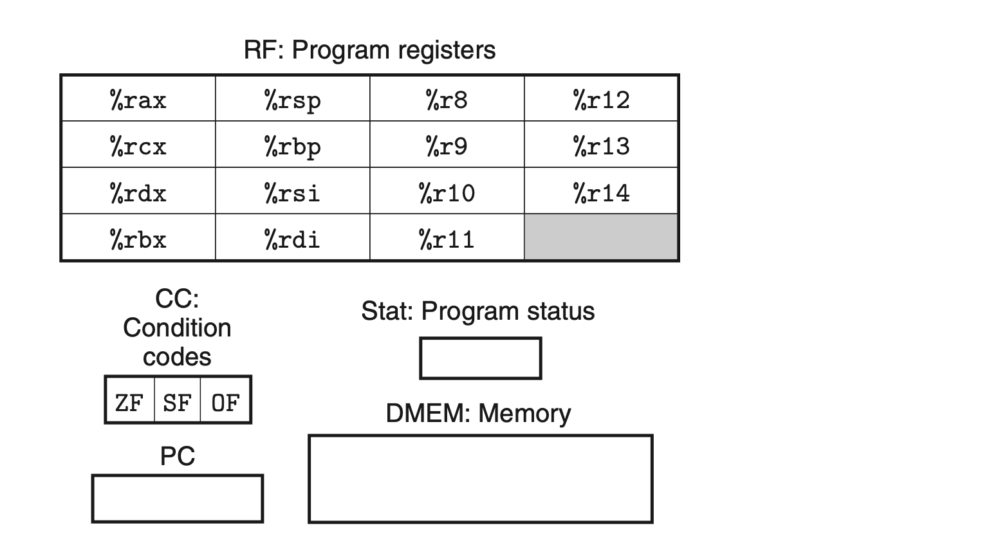

| 图 4.1 Y86-64 程序员可见状态。与 x86-64 一样，Y86-64 程序可以访问和修改程序寄存器、条件码、程序计数器（PC）和内存。状态码指示程序是在正常运行还是发生了某种特殊事件。|
| :-------------------------------: |

---

<!-- Page 0384 -->

内存在概念上是一个大型字节数组，同时保存程序和数据。Y86-64 程序使用虚拟地址引用内存位置。硬件和操作系统软件的组合将这些地址转换为实际的物理地址，指明值在内存中的实际存储位置。我们将在第 9 章详细研究虚拟内存。目前，我们可以将虚拟内存系统视为向 Y86-64 程序提供一个整体字节数组的映像。

程序状态的最后一部分是状态码 Stat，指示程序执行的总体状态：要么正常运行，要么发生了某种异常，例如指令试图读取无效内存地址。可能的状态码和异常处理将在 4.1.4 节中描述。

### 4.1.2 Y86-64 指令

图 4.2 给出了 Y86-64 ISA 各指令的简明描述。我们将以此指令集作为处理器实现的目标。Y86-64 指令集在很大程度上是 x86-64 指令集的子集：仅包含 8 字节整数操作，寻址模式更少，操作集合也更小。由于我们只使用 8 字节数据，可以将它们无歧义地称为"字"。图中左侧为指令的汇编代码表示，右侧为字节编码。图 4.3 给出了部分指令的更多细节。汇编代码格式与 x86-64 的 ATT 格式类似。

以下是 Y86-64 指令的一些细节。

- x86-64 的 `movq` 指令被拆分为四条不同指令：`irmovq`、`rrmovq`、`mrmovq` 和 `rmmovq`，明确指出了源操作数和目的操作数的形式。源操作数可以是立即数（i）、寄存器（r）或内存（m），由指令名称的第一个字符标识；目的操作数可以是寄存器（r）或内存（m），由第二个字符标识。明确区分四种数据传送类型，在决定如何实现它们时将大有裨益。

- 两条内存移动指令的内存引用采用简单的基址加偏移量格式，不支持 x86-64 中的第二个变址寄存器或寄存器值的缩放。

- 与 x86-64 一样，不允许直接在两个内存位置之间传送数据，也不允许将立即数直接写入内存。

- 共有四条整数操作指令，在图 4.2 中标注为 `OPq`：`addq`、`subq`、`andq` 和 `xorq`。它们只对寄存器数据进行操作，而 x86-64 还允许对内存数据进行操作。这些指令设置三个条件码 ZF、SF 和 OF（零标志、符号标志和溢出标志）。

---

<!-- Page 0385 -->

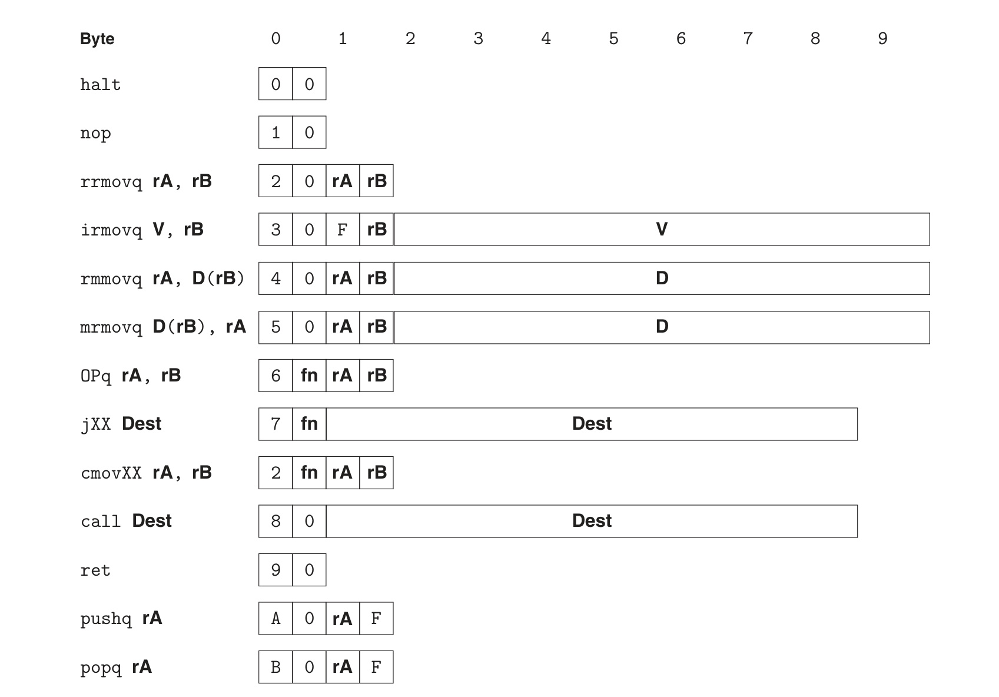

| 图 4.2 Y86-64 指令集。指令编码长度为 1 到 10 字节。一条指令由 1 字节指令说明符、可能包含的 1 字节寄存器说明符，以及可能包含的 8 字节常数字组成。字段 $f_n$ 指定特定的整数操作（OPq）、数据移动条件（cmovXX）或分支条件（jXX）。所有数值均以十六进制表示。|
| :-------------------------------: |

- 七条跳转指令（在图 4.2 中标注为 jXX）：`jmp`、`jle`、`jl`、`je`、`jne`、`jge` 和 `jg`。是否跳转取决于分支类型和条件码的设置，分支条件与 x86-64（图 3.15）相同。

- 六条条件传送指令（在图 4.2 中标注为 cmovXX）：`cmovle`、`cmovl`、`cmove`、`cmovne`、`cmovge` 和 `cmovg`。它们与寄存器到寄存器的传送指令 `rrmovq` 格式相同，但只有条件码满足要求时才更新目的寄存器。

- `call` 指令将返回地址压入栈，并跳转到目标地址；`ret` 指令从此类调用中返回。

- `pushq` 和 `popq` 指令实现压栈和弹栈操作，与 x86-64 中的行为完全相同。

- `halt` 指令停止指令执行。x86-64 中有一条类似指令，称为 `hlt`。x86-64 应用程序不允许使用该指令，因为它会导致整个系统暂停运行。对于 Y86-64，执行 `halt` 指令会使处理器停止运行，并将状态码设置为 HLT（见 4.1.4 节）。

---

<!-- Page 0386 -->

### 4.1.3 指令编码

图 4.2 还展示了指令的字节级编码。每条指令需要 1 到 10 字节，具体取决于所需字段。每条指令都有一个标识指令类型的初始字节，该字节分为两个 4 位部分：高位（code）部分和低位（function）部分。由图 4.2 可见，代码值范围为 0 到 0xB。功能值仅在一组相关指令共享同一代码时才有意义，具体见图 4.3，其中展示了整数操作、分支和条件传送指令的特定编码。注意，`rrmovq` 与条件传送指令具有相同的指令代码，可以视为"无条件传送"，正如 `jmp` 是无条件跳转一样，两者的功能码均为 0。

如图 4.4 所示，15 个程序寄存器各有一个关联的寄存器标识符（ID），范围为 0 到 0xE。Y86-64 中寄存器的编号与 x86-64 中使用的编号一致。程序寄存器存储在 CPU 内部的寄存器文件中，这是一个以寄存器 ID 作为地址的小型随机存取内存。当指令编码或硬件设计中需要表示不访问任何寄存器时，使用 ID 值 0xF。

某些指令长度仅为 1 字节，但需要操作数的指令编码更长。首先，可能有一个附加的寄存器说明符字节，用于指定一个或两个寄存器，在图 4.2 中称为 rA 和 rB。如汇编代码版本所示，根据指令类型，它们可以指定数据源和目的寄存器，以及地址计算中使用的基址寄存器。没有寄存器操作数的指令（如分支指令和 call 指令）没有寄存器说明符字节；只需要一个寄存器操作数的指令（`irmovq`、`pushq` 和 `popq`）将另一个寄存器指定符设置为值 0xF。这一约定在我们的处理器实现中将大有用处。

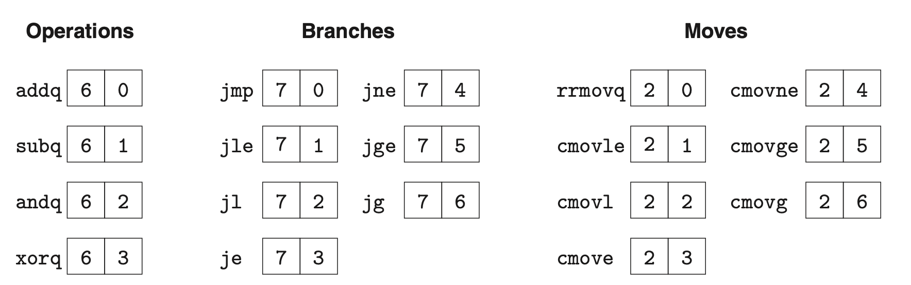

| 图 4.3 Y86-64 指令集的功能码。功能码指定特定的整数操作、分支条件或数据传送条件。这些指令在图 4.2 中分别标注为 OPq、jXX 和 cmovXX。|
| :-------------------------------: |

---

<!-- Page 0387 -->

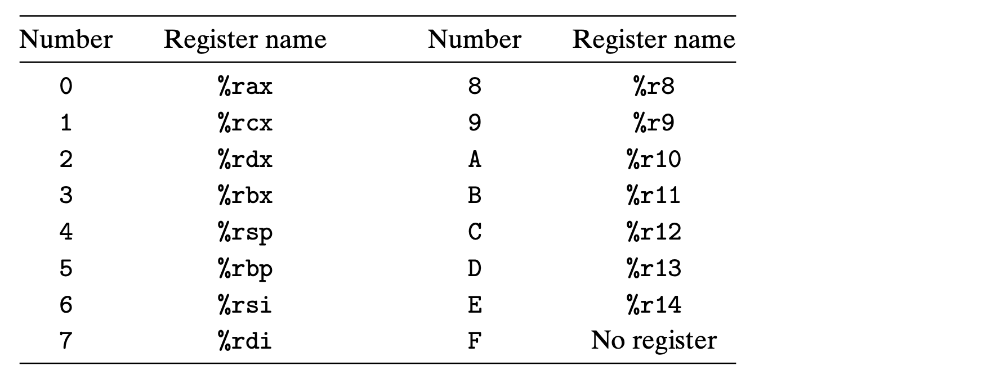

| 图 4.4 Y86-64 程序寄存器标识符。15 个程序寄存器各有一个关联的标识符（ID），范围为 0 到 0xE。指令寄存器字段中的 ID 0xF 表示不存在寄存器操作数。|
| :-------------------------------: |

某些指令还需要一个附加的 8 字节常数字，可以作为 `irmovq` 的立即数数据、`rmmovq` 和 `mrmovq` 地址说明符中的偏移量，以及分支和调用指令的目标地址。注意，分支和调用目标使用绝对地址，而非 x86-64 中的 PC 相对寻址。处理器使用 PC 相对寻址是为了使分支指令编码更紧凑，并允许代码在内存中移动而无需更新所有分支目标地址。由于我们更注重表述的简洁性，这里采用绝对寻址。与 x86-64 一样，所有整数均采用小端编码，在反汇编形式中，这些字节以逆序出现。

以一个例子来说明：生成指令 `rmmovq %rsp,0x123456789abcd(%rdx)` 的字节编码（十六进制）。由图 4.2 可知，`rmmovq `的初始字节为 40；源寄存器 `%rsp` 应编码到 rA 字段，基址寄存器 `%rdx` 应编码到 rB 字段，由图 4.4 的寄存器编号得寄存器说明符字节为 42；最后，偏移量编码为 8 字节常数字，将 `0x123456789abcd` 补零至 8 字节，得字节序列 `00 01 23 45 67 89 ab cd`，以字节逆序写出为 `cd ab 89 67 45 23 01 00`。合并后得指令编码 `4042cdab896745230100`。

任何指令集的一个重要性质是：字节编码必须具有唯一解释。任意字节序列要么唯一地编码某条指令序列，要么不是合法的字节序列。Y86-64 满足这一性质，因为每条指令在初始字节中都有唯一的代码与功能组合，根据这个字节可以确定后续字节的长度和含义。这一性质确保处理器可以无歧义地执行目标代码程序。即使代码嵌套在程序中的其他字节之中，只要从序列的首字节开始，我们就能轻松确定指令序列。但如果不知道代码序列的起始位置，就无法可靠地将序列划分为单独的指令。这给反汇编器和其他试图直接从目标代码字节序列中提取机器级程序的工具带来了困难。

---

<!-- Page 0388 -->

>**旁注 x86-64 与 Y86-64 指令编码的比较**
>
>与 x86-64 所用的指令编码相比，Y86-64 的编码要简单得多，但也不够紧凑。Y86-64 所有指令中的寄存器字段均出现在固定位置，而 x86-64 不同指令中的寄存器字段则被压缩到各种不同位置。x86-64 指令可以用 1、2、4 或 8 字节编码常数值，而 Y86-64 始终需要 8 字节。

---

**练习题 4.1（答案见第 516 页）**

确定下列 Y86-64 指令序列的字节编码。`.pos 0x100` 表示目标代码的起始地址应为 0x100。

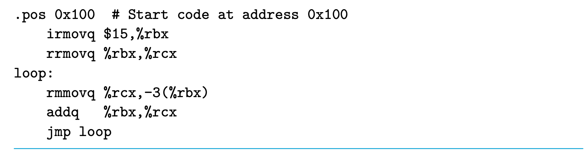

---

**练习题 4.2（答案见第 517 页）**

对于下列每个字节序列，确定其编码的 Y86-64 指令序列。如果序列中存在无效字节，则展示到该点之前的指令序列，并指出无效值所在位置。每个序列均给出起始地址，后跟冒号和字节序列。

A. `0x100: 30f3fcffffffffffffff40630008000000000000`

B. `0x200: a06f800c020000000000000030f30a00000000000000`

C. `0x300: 50540700000000000000010f0b01f`

D. `0x400: 611373000400000000000000`

E. `0x500: 6362a0f0`

---

<!-- Page 0389 -->

>**旁注 RISC 与 CISC 指令集**
>
>x86-64 有时被称为"复杂指令集计算机"（CISC，读作"sisk"），与之相对的是被归类为"精简指令集计算机"（RISC，读作"risk"）的 ISA。历史上，CISC 机器出现更早，从最早的计算机演化而来。到 1980 年代初，大型机和小型机的指令集已相当庞大，因为机器设计者不断加入支持高级任务的新指令，例如操作循环缓冲区、执行十进制运算和多项式求值等。最早的微处理器出现于 1970 年代初，由于当时集成电路技术对单芯片实现施加了严格限制，其指令集相当有限。微处理器迅速发展，到 1980 年代初，走上了与大型机和小型机相同的指令集复杂化道路。x86 系列沿着这条路演化成 IA32，进而发展为今天的 x86-64，并随着新型应用的需求不断加入新类别的指令而持续演进。
>
>RISC 设计理念在 1980 年代初作为上述趋势的替代方案而发展起来。IBM 的一批硬件和编译器专家深受 IBM 研究员 John Cocke 思想的影响，认识到他们可以为一种更简单的指令集形式生成高效代码。实际上，许多正被加入指令集的高级指令难以用编译器生成，且很少被使用。更简单的指令集可以用少得多的硬件实现，并能组织成高效的流水线结构（与本章后面所描述的类似）。IBM 直到多年后开发 Power 和 PowerPC ISA 时才将这一想法商业化。
>
>RISC 概念由加州大学伯克利分校的 David Patterson 教授和斯坦福大学的 John Hennessy 教授进一步发展。Patterson 将这类新型机器命名为 RISC，并将现有的机器命名为 CISC——此前并不需要为这种几乎普遍存在的指令集形式起特别的名字。
>
>比较 CISC 与最初的 RISC 指令集，可以发现以下一般特征：
>
>| CISC                                                        | 早期 RISC                                                 |
>| ----------------------------------------------------------- | ------------------------------------------------------- |
>| 指令数量庞大。描述完整指令集的 Intel 文档 [51] 超过 1200 页。                    | 指令数量大幅减少——通常少于 100 条。                                   |
>| 某些指令执行时间较长。例如，将整块内存从一个位置复制到另一个位置的指令，以及在内存与多个寄存器之间批量复制数据的指令。 | 不存在执行时间很长的指令。一些早期 RISC 机器甚至没有整数乘法指令，需要编译器将乘法实现为一系列加法操作。 |
>| 变长指令编码。x86-64 指令长度可从 1 字节到 15 字节不等。                         | 定长指令编码。通常所有指令均编码为 4 字节。                                 |
>| 操作数指定格式多样。在 x86-64 中，一个内存操作数说明符可以包含位移、基址寄存器、变址寄存器以及比例因子的多种组合。                                                                                                | 简单的寻址格式。通常仅支持基址加位移（base + displacement）寻址。                                                                                                                   |
>| 算术和逻辑运算既可以作用于内存操作数，也可以作用于寄存器操作数。                                                                                                                             | 算术和逻辑运算仅使用寄存器操作数。对内存的访问仅通过加载（load）指令（从内存读入寄存器）和存储（store）指令（从寄存器写回内存）完成。这种约定称为“加载/存储（load/store）架构”。                                                          |
>| 实现细节对机器级程序隐藏。ISA 在程序与其执行方式之间提供了清晰的抽象层。                                                                                                                       | 实现细节暴露给机器级程序。一些 RISC 机器禁止特定指令序列，并且某些跳转指令在下一条指令执行后才生效。编译器需要在这些约束下进行性能优化。                                                                                      |
>| 使用条件码。指令执行会产生特殊标志位副作用，并用于条件分支测试。                                                                                                                             | 不使用条件码。改为通过显式测试指令，将测试结果存储在普通寄存器中，用于条件判断。                                                                                                                     |
>| 以栈为主的过程调用机制。栈用于传递过程参数和保存返回地址。                                                                                                                                | 以寄存器为主的过程调用机制。寄存器用于传递过程参数和保存返回地址，因此某些过程可以完全避免内存访问。通常处理器拥有更多（最多可达 32 个）寄存器。                                                                                   |
>
>Y86-64 指令集兼具 CISC 和 RISC 指令集的特征。在 CISC 方面，它拥有条件码和可变长度指令，并使用栈来存储返回地址。在 RISC 方面，它采用加载/存储体系结构和规则的指令编码，并通过寄存器传递过程参数。可以将其视为取 CISC 指令集（x86）并运用一些 RISC 原则加以简化的结果。

---

<!-- Page 0390 -->

---

<!-- Page 0391 -->

>**旁注 RISC 与 CISC 之争**
>
>整个 1980 年代，计算机体系结构领域围绕 RISC 与 CISC 指令集的优劣展开了激烈争论。RISC 的支持者声称，通过精简指令集设计、先进编译器技术和流水线处理器实现的结合，可以用同等硬件获得更强的计算能力。CISC 的支持者则反驳说，完成同一任务所需的 CISC 指令更少，因此其机器可以达到更高的整体性能。
>
>各大公司相继推出了 RISC 处理器产品线，包括 Sun Microsystems（SPARC）、IBM 和 Motorola（PowerPC）以及 Digital Equipment Corporation（Alpha）。英国公司 Acorn Computers Ltd. 开发了自己的体系结构 ARM（最初是"Acorn RISC machine"的缩写），该体系结构在手机等嵌入式应用中得到了广泛应用。
>
>1990 年代初，随着 RISC 和 CISC 在最纯粹形式下都不如融合两者优点的设计这一点逐渐明朗，这场争论也逐渐平息。RISC 机器不断演进，引入了越来越多的指令，其中许多需要多个时钟周期执行。如今的 RISC 机器指令库中拥有数百条指令，已与"精简指令集机器"之名相去甚远。将实现细节暴露给机器级程序这一想法被证明是短视的：随着采用更先进硬件结构的新型处理器问世，许多此类细节变得无关紧要，但它们仍作为指令集的一部分保留下来。尽管如此，RISC 设计的核心——适合在流水线机器上执行的指令集——依然是其精髓所在。
>
>更新的 CISC 机器同样利用了高性能流水线结构。如我们将在 5.7 节讨论的，它们先取出 CISC 指令，再动态地将其翻译为一系列更简单的类 RISC 操作。例如，将寄存器加到内存的指令被翻译为三个操作：读取原始内存值、执行加法、将结果写回内存。由于这种动态翻译通常可以在实际指令执行之前提前完成，处理器可以保持非常高的执行速率。
>
>除技术因素外，市场因素在决定不同指令集成败方面也发挥了重要作用。通过保持与现有处理器的兼容性，Intel 的 x86 使得从一代处理器迁移到下一代变得轻而易举。随着集成电路技术的进步，Intel 和其他 x86 处理器制造商借助 RISC 技术克服了原始 8086 指令集设计带来的低效，实现了与最佳 RISC 机器相当的性能。如我们在 3.1 节所见，IA32 向 x86-64 的演进提供了将 RISC 若干特性融入 x86 家族的机会。在桌面、笔记本和服务器计算领域，x86 已近乎垄断。
>
>RISC 处理器在嵌入式处理器市场表现出色，广泛应用于蜂窝电话、汽车制动系统和互联网家电等场景。在这些应用中，降低成本和功耗比保持向后兼容性更为重要。就销售的处理器数量而言，这是一个规模庞大且持续增长的市场。

### 4.1.4 Y86-64 异常

Y86-64 的程序员可见状态（图 4.1）包含一个状态码 Stat，用于描述执行程序的总体状态。该状态码的可能取值如图 4.5 所示。代码值 1（名为 AOK）表示程序正在正常执行，其他代码则表示发生了某种异常。代码 2（HLT）表示处理器执行了 `halt` 指令；代码 3（ADR）表示处理器在取指或读写数据时试图访问无效内存地址（我们限制了最大地址，超出限制的任何访问都将触发 ADR 异常）；代码 4（INS）表示遇到了无效指令代码。

---

<!-- Page 0392 -->


| 图 4.5 Y86-64 状态码。在我们的设计中，处理器在遇到 AOK 以外的任何状态码时都会停机。|
| :-------------------------------: |

对于 Y86-64，当遇到上述任何异常时，我们让处理器直接停止执行指令。在更完整的设计中，处理器通常会调用异常处理程序——一个专门处理特定异常类型的过程。如第 8 章所述，异常处理程序可以配置为产生不同的效果，例如终止程序或调用用户定义的信号处理程序。

### 4.1.5 Y86-64 程序

图 4.6 展示了以下 C 函数的 x86-64 和 Y86-64 汇编代码：

```c
long sum(long *start, long count)
{
    long sum = 0;
    while (count) {
        sum += *start;
        start++;
        count--;
    }
    return sum;
}
```

x86-64 代码由 gcc 编译器生成。Y86-64 代码与之类似，但有以下差异：

- Y86-64 代码将常数加载到寄存器（第 2–3 行），因为它无法在算术指令中使用立即数数据。

---

<!-- Page 0393 -->

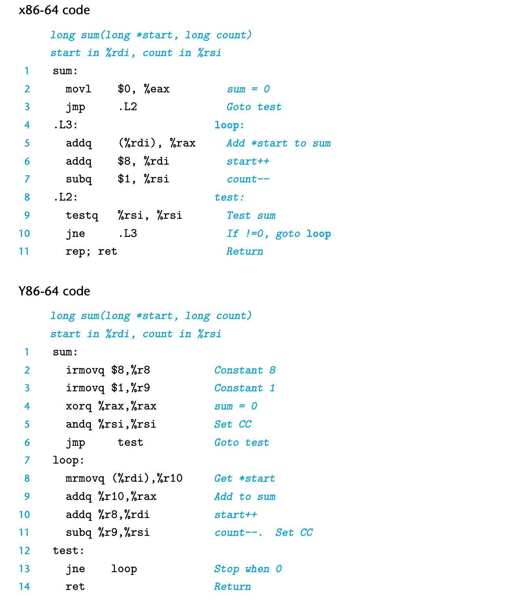

| 图 4.6 Y86-64 与 x86-64 汇编程序的比较。sum 函数计算整数数组的和。Y86-64 代码遵循与 x86-64 代码相同的总体模式。|
| :-------------------------------: |

---

<!-- Page 0394 -->

- Y86-64 代码需要两条指令（第 8–9 行）从内存中读取一个值并加到寄存器，而 x86-64 代码只需一条 `addq` 指令（第 5 行）即可完成。

- 我们手工编写的 Y86-64 实现利用了 `subq` 指令（第 11 行）同时设置条件码的性质，因此不需要 gcc 生成的代码中的 `testq` 指令（第 9 行）。但为此，Y86-64 代码必须在进入循环之前用 `andq` 指令（第 5 行）设置好条件码。

图 4.7 展示了一个完整的 Y86-64 汇编代码程序文件示例，程序同时包含数据和指令。指示符（directive）告知汇编器代码或数据的放置位置及对齐方式，程序还指定了栈的位置、数据初始化、程序初始化和程序终止等事项。

在该程序中，以 `.` 开头的行是汇编器指示符，告知汇编器调整代码生成地址或插入若干数据字。指示符 `.pos 0`（第 2 行）表示汇编器从地址 0 开始生成代码，这是所有 Y86-64 程序的起始地址。下一条指令（第 3 行）初始化栈指针。标签 `stack` 在程序末尾（第 40 行）通过 `.pos` 指示符（第 39 行）声明为地址 0x200，因此栈从该地址开始向低地址增长，需确保栈不会增长到覆盖代码或其他程序数据。

程序第 8–13 行声明了一个含四个字的数组，各元素值为：

```
0x000d000d000d000d, 0x00c000c000c000c0,
0x0b000b000b000b00, 0xa000a000a000a000
```

标签 `array` 表示数组起始处，按 8 字节边界对齐（使用 `.align` 指示符）。第 16–19 行展示了一个"main"过程，它对四字数组调用 sum 函数，然后停止。

如本例所示，由于我们创建 Y86-64 代码的唯一工具是汇编器，程序员必须完成通常由编译器、链接器和运行时系统承担的任务。好在我们只需处理小型程序，简单的机制已经足够。

图 4.8 展示了用我们称为 YAS 的汇编器对图 4.7 所示代码进行汇编的结果。汇编器输出为 ASCII 格式以便阅读。在包含指令或数据的汇编文件行中，目标代码包含一个地址，后跟 1 到 10 字节的值。

我们实现了一个称为 YIS 的指令集模拟器，其目的是模拟 Y86-64 机器代码程序的执行，而不试图模拟任何特定处理器实现的行为。这种模拟形式在实际硬件尚未可用时可用于调试程序，同时也能验证硬件模拟结果或在硬件上运行程序的输出。在我们的示例目标代码上运行时，YIS 生成如下输出：

---

<!-- Page 0395 -->

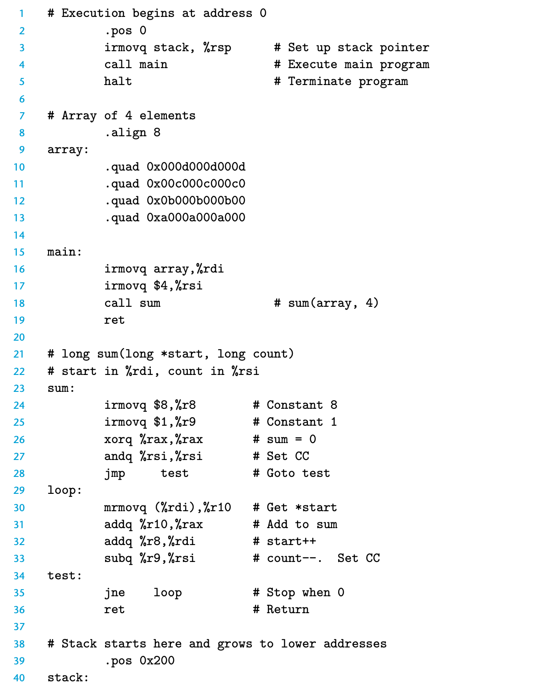

| 图 4.7 用 Y86-64 汇编代码编写的示例程序。调用 sum 函数计算四元素数组的和。|
| :-------------------------------: |

---

<!-- Page 0396 -->


| 图 4.8 YAS 汇编器的输出。每行包含一个十六进制地址和 1 到 10 字节的目标代码。|
| :-------------------------------: |

---

<!-- Page 0397 -->

```
Stopped in 34 steps at PC = 0x13. Status 'HLT', CC Z=1 S=0 O=0
Changes to registers:
%rax: 0x0000000000000000 0x0000abcdabcdabcd
%rsp: 0x0000000000000000 0x0000000000000200
%rdi: 0x0000000000000000 0x0000000000000038
%r8:  0x0000000000000000 0x0000000000000008
%r9:  0x0000000000000000 0x0000000000000001
%r10: 0x0000000000000000 0x0000a000a000a000

Changes to memory:
0x01f0: 0x0000000000000000 0x0000000000000055
0x01f8: 0x0000000000000000 0x0000000000000013
```

模拟输出的第一行汇总了执行情况以及 PC 和程序状态的结果值。在打印寄存器和内存值时，仅打印在模拟过程中发生变化的字（寄存器或内存中的）。原始值（此处均为零）显示在左侧，最终值显示在右侧。由输出可见，寄存器 `%rax` 包含 `0xabcdabcdabcdabcd`，即传递给 sum 过程的四元素数组之和。此外，从地址 0x200 开始向低地址增长的栈已被使用，导致地址 0x1f0–0x1f8 处的内存字发生变化。可执行代码的最大地址为 0x090，因此压栈和弹栈操作未破坏可执行代码。

---

**练习题 4.3（答案见第 518 页）**

机器级程序中的一个常见模式是将常数值加到寄存器。使用目前介绍的 Y86-64 指令，这需要先用 `irmovq` 将常数加载到某个寄存器，再用 `addq` 将该值加到目标寄存器。假设我们想增加一条新指令 `iaddq`，格式如下：

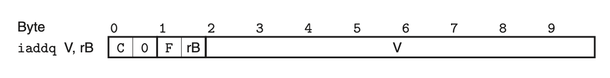

该指令将常数值 V 加到寄存器 rB。

将图 4.6 中的 Y86-64 sum 函数改写为使用 `iaddq` 指令的版本。在原始版本中，我们专门用寄存器 %r8 和 %r9 保存常数值，现在可以完全避免使用这两个寄存器。

---

<!-- Page 0398 -->

**练习题 4.4（答案见第 518 页）**

编写 Y86-64 代码，实现如下 C 代码所示的递归求积函数 `rproduct`：

```c
long rproduct(long *start, long count)
{
    if (count <= 1)
        return 1;
    return *start * rproduct(start + 1, count - 1);
}
```

使用与 x86-64 代码相同的参数传递和寄存器保存约定。可以先在 x86-64 机器上编译该 C 代码，然后将指令翻译为 Y86-64。

---

**练习题 4.5（答案见第 519 页）**

修改图 4.6 中 Y86-64 的 sum 函数，实现计算数组元素绝对值之和的函数 `absSum`。在内层循环中使用条件跳转(jump)指令。

---

**练习题 4.6（答案见第 519 页）**

修改图 4.6 中 Y86-64 的 sum 函数，实现计算数组元素绝对值之和的函数 `absSum`。在内层循环中使用条件传送(move)指令。

---

### 4.1.6 Y86-64 指令的若干细节

大多数 Y86-64 指令以直接了当的方式变换程序状态，因此定义每条指令的预期效果并不困难。但有两种不寻常的指令组合需要特别关注。

`pushq` 指令既将栈指针减 8，又将寄存器值写入内存。因此，当执行 `pushq` `%rsp` 时，处理器应如何处理并不完全明确，因为被压入的寄存器正是被同一条指令修改的那个。可能有两种约定：(1) 压入 `%rsp` 的原始值；(2) 压入 `%rsp` 递减后的值。

对于 Y86-64 处理器，我们采用与 x86-64 相同的约定，具体由以下练习题确定。

---

**练习题 4.7（答案见第 520 页）**

让我们确定 `pushq` `%rsp` 指令在 x86-64 处理器上的行为。我们可以尝试阅读 Intel 的文档，但更简单的方法是在真实机器上做实验。C 编译器通常不会生成这条指令，因此我们必须使用手写汇编代码完成此任务。以下是我们编写的一个测试函数（第 214 页网络旁注 ASM:EASM 介绍了如何编写 C 代码与手写汇编代码混合的程序）：

---

<!-- Page 0399 -->

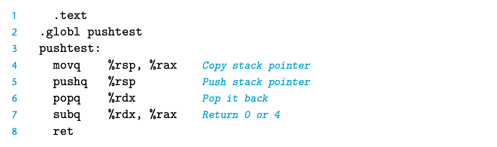

在我们的实验中，函数 `pushtest` 始终返回 0。这对 x86-64 下 `pushq` `%rsp` 指令的行为意味着什么？

类似的歧义也存在于 `popq` `%rsp` 指令。它既可以将从内存读取的值设置给 `%rsp`，也可以将递增后的栈指针设置给 `%rsp`。与练习题 4.7 一样，让我们通过实验确定 x86-64 机器处理该指令的方式，然后设计我们的 Y86-64 机器遵循相同的约定。

---

**练习题 4.8（答案见第 520 页）**

以下汇编代码函数让我们确定 x86-64 中 `popq` `%rsp` 指令的行为：

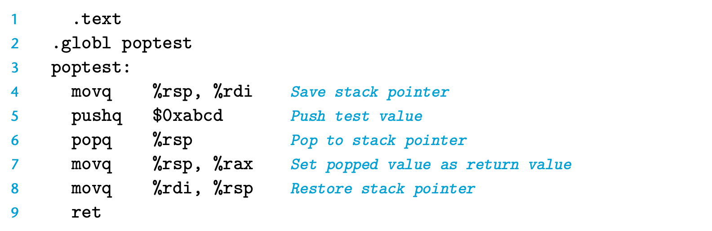

我们发现该函数始终返回 0xabcd。这对 `popq` `%rsp` 的行为意味着什么？哪条其他 Y86-64 指令会有完全相同的行为？

---

<!-- Page 0400 -->

>**旁注 细节决定成败：x86 不同型号之间的不一致性**
>
>练习题 4.7 和 4.8 旨在帮助我们为压入或弹出栈指针的指令制定一套一致的约定。我们几乎不会有意执行这两种操作，因此自然会有疑问："为什么要为这样细枝末节的细节费心？"
>
>从以下 Intel PUSH 指令文档节选中，可以学到关于一致性重要性的若干有益教训：
>
>对于从 Intel 286 起的 IA-32 处理器，PUSH ESP 指令压入的是该指令执行之前 ESP 寄存器的值。（对于 Intel 64 架构、IA-32 架构的实地址模式和虚拟 8086 模式亦如此。）对于 Intel 8086 处理器，PUSH SP 指令压入的是 SP 寄存器的新值（即递减 2 之后的值）。（PUSH ESP 指令。Intel Corporation. 50.）
>
>尽管这段说明的确切细节可能难以理解，但我们可以看出：根据 x86 处理器所处的工作模式，执行压入栈指针寄存器的指令时会有不同行为——某些模式压入原始值，其他模式压入递减后的值。（有趣的是，弹出到栈指针寄存器不存在相应的歧义。）这种不一致性有两个弊端：
>
>- 降低了代码可移植性。程序的行为可能因处理器模式而异。尽管这条特定指令极为罕见，但即便是潜在的不兼容性也可能造成严重后果。
>
>- 使文档更加复杂。如我们所见，需要添加特别说明来尝试澄清差异。x86 的文档本已足够复杂，无需再添加此类特殊情况。
>
>因此，我们得出结论：提前理清细节并追求完全的一致性，从长远来看可以避免许多麻烦。

## 4.2 逻辑设计与硬件控制语言 HCL

在硬件设计中，电子电路用于对位进行函数计算，并以不同类型的存储元件存储位值。现代大多数电路技术以信号线上的高电压或低电压来表示不同的位值。在当前技术中，逻辑值 1 由约 1.0 伏的高电压表示，逻辑值 0 由约 0.0 伏的低电压表示。实现数字系统需要三个主要组件：用于对位进行函数计算的组合逻辑、用于存储位的存储元件，以及用于调节存储元件更新的时钟信号。

本节简要介绍这些不同组件，同时引入 HCL（硬件控制语言），即我们用来描述不同处理器设计控制逻辑的语言。我们在这里只非正式地描述 HCL。HCL 的完整参考资料见第 508 页网络旁注 ARCH:HCL。

---

<!-- Page 0401 -->

>**旁注 现代逻辑设计**
>
>曾经，硬件设计者通过绘制逻辑电路的原理图（先是纸笔，后来用计算机图形终端）来创建电路设计。如今，大多数设计用硬件描述语言（HDL）表达——这是一种看起来类似编程语言的文本符号，但用于描述硬件结构而非程序行为。最常用的语言是语法类似 C 的 Verilog 和语法类似 Ada 编程语言的 VHDL。这些语言最初设计用于创建数字电路的仿真模型。1980 年代中期，研究人员开发了逻辑综合程序，可以从 HDL 描述生成高效的电路设计。现在有许多商业综合程序，这已成为生成数字电路的主流技术。从手工设计电路到综合电路的转变，可类比于从用汇编语言编写程序到用高级语言编写程序并让编译器生成机器代码的转变。
>
>我们的 HCL 语言仅表达硬件设计的控制部分，只有有限的操作集且没有模块化能力。然而，如我们将要看到的，控制逻辑是设计微处理器中最困难的部分。我们开发了可以直接将 HCL 翻译为 Verilog 的工具，通过将这些代码与基本硬件单元的 Verilog 代码相结合，可以生成 HDL 描述，从而综合出实际工作的微处理器。通过仔细地分离、设计和测试控制逻辑，我们可以以合理的工作量创建一个工作的微处理器。第 503 页网络旁注 ARCH:VLOG 描述了如何生成 Y86-64 处理器的 Verilog 版本。

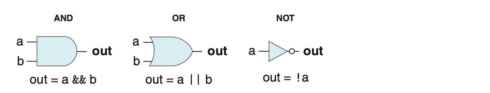

| 图 4.9 逻辑门类型。每个门的输出等于其输入的某个布尔函数。|
| :-------------------------------: |

### 4.2.1 逻辑门

逻辑门是数字电路的基本计算元件，其输出等于输入位值的某个布尔函数。图 4.9 展示了布尔函数 AND（与）、OR（或）和 NOT（非）的标准符号。HCL 表达式显示在门符号下方，使用 C 语言风格的运算符（2.1.8 节）：`&&` 表示 AND，`||` 表示 OR，`!` 表示 NOT。我们使用这些运算符而非 C 语言的位级运算符 `&`、`|` 和 `~`，因为逻辑门操作的是单位数量，而非整个字。尽管图中只展示了 AND 门和 OR 门的两输入版本，但在 n > 2 时将它们用作 n 路操作也很常见。在 HCL 中我们仍用二元运算符表示，因此一个有输入 a、b、c 的三输入 AND 门的操作用 HCL 表达式 `a && b && c` 描述。

逻辑门始终处于激活状态。如果门的某个输入发生变化，则经过很短的时间后，输出将相应地发生变化。

---

<!-- Page 0402 -->

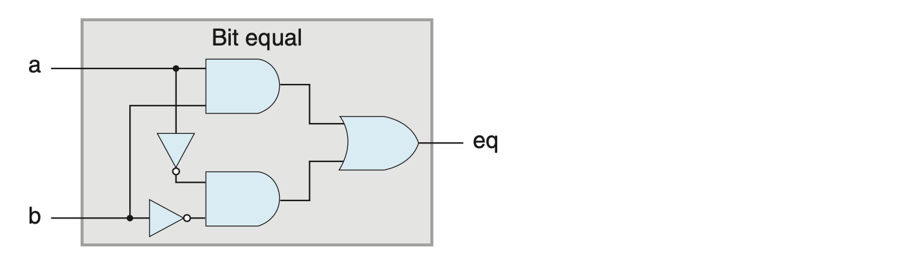

| 图 4.10：用于测试位相等的组合电路。当两个输入都为 0 或都为 1 时，输出等于 1。|
| :-------------------------------: |

### 4.2.2 组合电路与 HCL 布尔表达式

通过将若干逻辑门组合成网络，我们可以构造称为组合电路的计算模块。对网络的构造方式有若干限制：

- 每个逻辑门的输入必须恰好连接到以下之一：(1) 系统的某个输入（称为主输入），(2) 某个存储元件的输出连接，或 (3) 某个逻辑门的输出。

- 两个或多个逻辑门的输出不能连接在一起，否则它们可能试图将连线驱动到不同电压，可能导致无效电压或电路故障。

- 网络必须无环，即不能有路径经过一系列门形成回路。这类回路可能导致网络计算的函数出现歧义。

图 4.10 展示了一个我们将会用到的简单组合电路示例。它有两个输入 a 和 b，生成一个输出 eq：若 a 和 b 都为 1（由上方 AND 门检测）或都为 0（由下方 AND 门检测），则输出为 1。在 HCL 中，该网络的函数写为：

```
bool eq = (a && b) || (!a && !b);
```

这段代码简单地将位级（数据类型为 bool）信号 eq 定义为输入 a 和 b 的函数。如本例所示，HCL 使用 C 风格语法，用 `=` 将信号名与表达式关联。但与 C 不同，我们不将其视为执行计算并将结果赋给某个内存位置，而仅仅是给表达式命名的方式。

---

**练习题 4.9（答案见第 520 页）**

编写信号 xor 的 HCL 表达式，使其等于输入 a 和 b 的异或（EXCLUSIVE-OR）。上面定义的信号 xor 和 eq 之间有什么关系？

---

图 4.11 展示了另一个简单但有用的组合电路示例，称为多路选择器（通常简称为"MUX"）。

---

<!-- Page 0403 -->

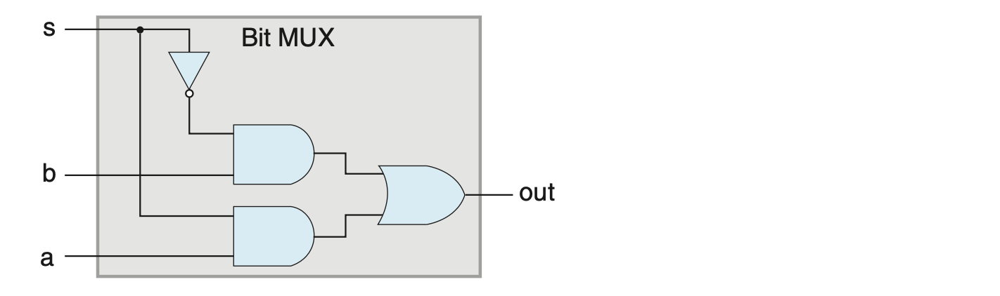

| 图 4.11：单位多路选择器电路。当控制信号 s 为 1 时，输出等于输入 a；当 s 为 0 时，输出等于输入 b。|
| :-------------------------------: |

多路选择器根据控制输入信号的值，从一组不同的数据信号中选择一个。在这个单位多路选择器中，两个数据信号是输入位 a 和 b，控制信号是输入位 s。当 s 为 1 时输出等于 a，当 s 为 0 时输出等于 b。在该电路中可以看到，两个 AND 门决定是否将各自的数据输入传递到 OR 门：上方 AND 门在 s 为 0 时（因为其另一输入为 !s）传递信号 b，下方 AND 门在 s 为 1 时传递信号 a。同样，我们可以用 HCL 表达式写出输出信号，使用与组合电路中相同的运算：

```
bool out = (s && a) || (!s && b);
```

我们的 HCL 表达式展示了组合逻辑电路与 C 中逻辑表达式之间清晰的对应关系——两者都用布尔运算对输入计算函数。但这两种计算表达方式之间有若干值得注意的区别：

- 由于组合电路由一系列逻辑门组成，其输出会持续响应输入的变化——若某个输入改变，经过一定延迟后输出也会随之改变。相比之下，C 表达式只有在程序执行中遇到时才会被求值。

- C 中的逻辑表达式允许参数为任意整数，将 0 解释为 FALSE，其他值解释为 TRUE；而我们的逻辑门只对位值 0 和 1 进行运算。

- C 中的逻辑表达式具有短路求值性质——如果仅通过求值第一个参数就能确定 AND 或 OR 操作的结果，则不会对第二个参数求值。例如，表达式 `(a && !a) && func(b,c)` 中 func 不会被调用，因为 `(a && !a)` 求值为 0。相比之下，组合逻辑没有任何短路求值规则，门只是简单地响应输入的变化。

---

<!-- Page 0404 -->

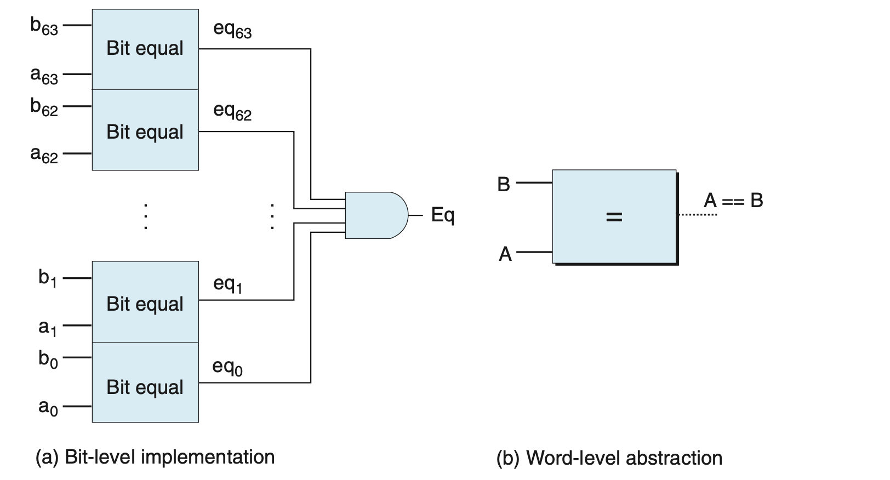

| 图 4.12 字级相等测试电路。当字 A 的每个位等于字 B 对应的位时，输出等于 1。字级相等是 HCL 中的运算之一。|
| :-------------------------------: |

### 4.2.3 字级组合电路与 HCL 整数表达式

通过组合大量逻辑门网络，我们可以构造出计算更复杂函数的组合电路。通常，我们设计对数据字进行操作的电路——数据字是一组位级信号，表示一个整数或某种控制模式。例如，我们的处理器设计将包含大量字，字长从 4 到 64 位不等，分别表示整数、地址、指令代码和寄存器标识符。

执行字级计算的组合电路，是利用逻辑门根据输入字的各个位来计算输出字的各个位构造而成的。例如，图 4.12 展示了一个组合电路，用于测试两个 64 位字 A 和 B 是否相等，即当且仅当 A 的每个位等于 B 对应的位时，输出为 1。该电路使用 64 个图 4.10 所示的单位相等电路实现，其输出通过一个 AND 门合并形成电路输出。

在 HCL 中，我们将任何字级信号声明为 int 类型，不指定字长（为简洁起见）。在完整的硬件描述语言中，每个字可以声明特定的位数。HCL 允许对字进行相等比较，因此图 4.12 所示电路的功能可以在字级表达为：

$$\text{bool Eq} = (A == B);$$

其中参数 A 和 B 为 int 类型。注意我们使用与 C 相同的语法约定，`=` 表示赋值，`==` 表示相等

---

<!-- Page 0405 -->

如图 4.12 右侧所示，我们用中等粗细的线表示字级电路，代表承载字各个位的一组导线；单位信号则用虚线表示。

---
**练习题 4.10（答案见第 520 页）**

假设你想用练习题 4.9 中的异或电路（而非位级相等电路）实现一个字级相等电路。为一个 64 位字设计这样的电路，使用 64 个位级异或电路和两个附加逻辑门。

---

图 4.13 展示了字级多路选择器的电路。该电路根据控制输入位 s，生成一个 64 位字 Out，等于两个输入字 A 或 B 之一。该电路由 64 个相同的子电路组成，每个子电路的结构类似于图 4.11 中的单位多路选择器。字级版本通过只生成一次 !s 并在每个位位置复用，减少了反相器的数量，而不是简单地复制单位多路选择器 64 次。

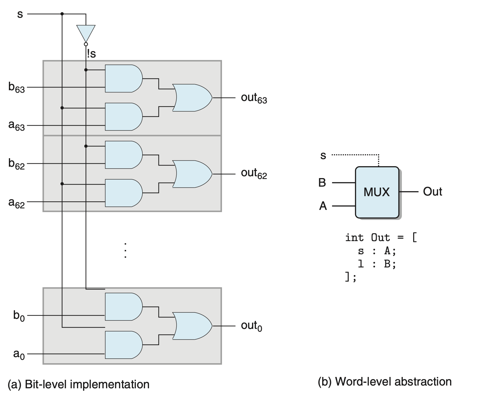

| 图 4.13 字级多路选择器电路。当控制信号 s 为 1 时，输出等于输入字 A；否则等于 B。多路选择器在 HCL 中用 case 表达式描述。|
| :-------------------------------: |

---

<!-- Page 0406 -->

在我们的处理器设计中将广泛使用多路选择器，允许我们根据某个控制条件从多个来源中选择一个字。在 HCL 中，多路选择功能用 case 表达式描述。case 表达式的一般形式如下：

```
[
    select_1 : expr_1;
    select_2 : expr_2;
    :
    select_k : expr_k;
]
```

该表达式包含一系列情况，每个情况 $i$ 由布尔表达式 $\text{select}_i$（指示何时选择该情况）和整数表达式 $\text{expr}_i$（指示结果值）组成。

与 C 的 switch 语句不同，我们不要求不同的选择表达式互斥。逻辑上，选择表达式按序求值，第一个产生 1 的情况被选中。例如，图 4.13 的字级多路选择器可以用 HCL 描述为：

```
word Out = [
    s: A;
    1: B;
];
```

在这段代码中，第二个选择表达式简单地为 1，表示如果之前没有任何情况被选中，则选择该情况——这是在 HCL 中指定默认情况的方式，几乎所有 case 表达式都以此结尾。

允许非互斥的选择表达式使 HCL 代码更易读。实际的硬件多路选择器必须有互斥的信号来控制哪个输入字传递到输出（如图 4.13 中的信号 s 和 !s）。为将 HCL case 表达式转换为硬件，逻辑综合程序需要分析选择表达式集合，通过确保只选择第一个匹配的情况来解决任何可能的冲突。

选择表达式可以是任意布尔表达式，情况数量也可以任意多。这使得 case 表达式可以描述有许多输入信号选择且选择条件复杂的模块。例如，考虑图 4.14 所示的 4 路多路选择器。该电路根据控制信号 s1 和 s0（视为一个 2 位二进制数）从四个输入字 A、B、C 和 D 中选择，可以用布尔表达式描述不同的控制位模式组合来表达：

```
word Out4 = [
    !s1 && !s0 : A; # 00
    !s1 &&  s0 : B; # 01
     s1 && !s0 : C; # 10
     s1 &&  s0 : D; # 11
];
```

---

<!-- Page 0407 -->

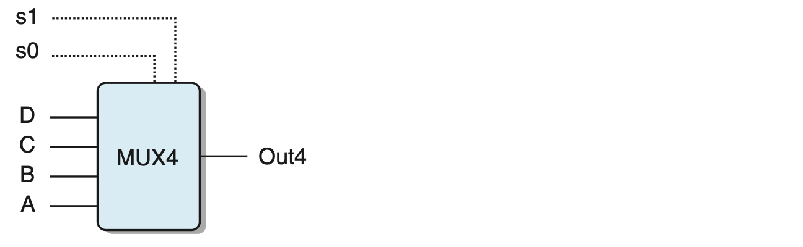

| 图 4.14：四路多路选择器。控制信号 s1 和 s0 的不同组合决定哪个数据输入被传送到输出。|
| :-------------------------------: |

右侧的注释（以 `#` 开头到行尾的任何文本均为注释）说明了哪种 s1 和 s0 的组合会使该情况被选中。注意，由于只选择第一个匹配的情况，选择表达式有时可以简化：例如，第二个表达式可以写成 `!s1`，而非更完整的 `!s1 && s0`，因为 s1 等于 0 的另一种可能已经作为第一个选择表达式给出了；类似地，第三个表达式可以写成 `!s0`，第四个可以直接写成 1。

作为最后一个例子，假设我们想设计一个逻辑电路，求一组字 A、B 和 C 中的最小值，如下图所示：

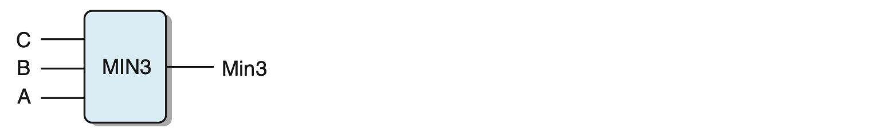

可以用 HCL case 表达式表达如下：

```
word Min3 = [
    A <= B && A <= C : A;
    B <= A && B <= C : B;
    1 : C;
];
```

---

**练习题 4.11（答案见第 520 页）**

上述计算三个字最小值的 HCL 代码包含四个形如 $X \leq Y$ 的比较表达式。请改写代码，使其只用三次比较就能计算出相同的结果。

---

<!-- Page 0408 -->

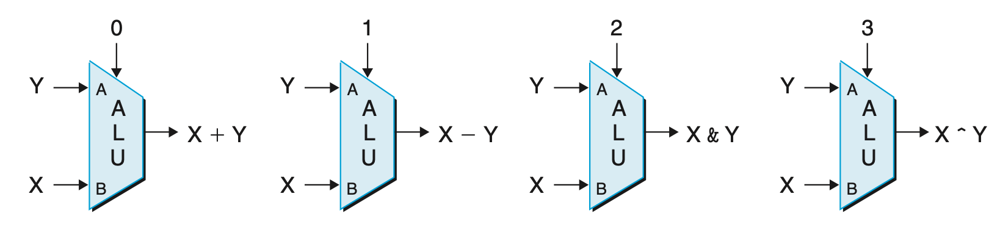

| 图 4.15 算术/逻辑单元（ALU）。根据功能输入的设置，电路将执行四种不同的算术和逻辑操作之一。|
| :-------------------------------: |

---

**练习题 4.12（答案见第 520 页）**

编写 HCL 代码，描述一个电路，对字输入 A、B 和 C 选取三个值的中间值（即输出等于三个输入中既非最小值又非最大值的那个字）。

---

组合逻辑电路可以设计成对字级数据执行多种不同类型的操作，详细设计超出本书的讨论范围。其中一个重要的组合电路是算术/逻辑单元（ALU），其抽象层面的示意图如图 4.15 所示。在我们的版本中，电路有三个输入：两个数据输入 A 和 B，以及一个控制输入。根据控制输入的设置，电路对数据输入执行不同的算术或逻辑操作。注意，该 ALU 的四种操作对应于 Y86-64 指令集支持的四种整数操作，控制值与这些指令的功能码（图 4.3）一致。还要注意减法操作数的顺序：A 输入被从 B 输入中减去，这一顺序是为了与 `subq` 指令中参数的顺序相一致。

### 4.2.4 集合成员测试

在我们的处理器设计中，经常需要将一个信号与多个可能的匹配信号进行比较，例如测试正在处理的某条指令的代码是否属于某类指令代码。作为一个简单例子，假设我们想通过从一个 2 位信号 code 中选取高位和低位，来生成图 4.14 中 4 路多路选择器的信号 s1 和 s0：

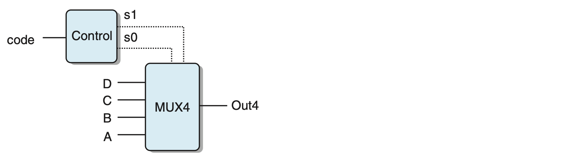

---

<!-- Page 0409 -->

在该电路中，2 位信号 code 将控制对四个数据字 A、B、C 和 D 的选择。可以使用基于 code 可能取值的等值测试来表达信号 s1 和 s0 的生成：

```
bool s1 = code == 2 || code == 3;
bool s0 = code == 1 || code == 3;
```

可以写出更简洁的表达式，表述 s1 在 code 属于集合 {2, 3} 时为 1，s0 在 code 属于集合 {1, 3} 时为 1：

```
bool s1 = code in { 2, 3 };
bool s0 = code in { 1, 3 };
```

集合成员测试的一般形式为：

```
iexpr in {iexpr1, iexpr2, ..., iexprk}
```

其中被测试的值（iexpr）和候选匹配值（iexpr₁ 到 iexprₖ）均为整数表达式。

### 4.2.5 存储器与时钟控制

组合电路就其本质而言不存储任何信息，它们只是对输入信号作出响应，生成等于输入某个函数的输出。要创建时序电路——即具有状态并对该状态进行计算的系统——我们必须引入以位的形式存储信息的设备。我们的存储设备都由单一时钟控制，时钟是一个周期性信号，用于确定何时将新值加载到设备中。我们考虑两类存储设备：

**时钟寄存器**（或简称寄存器）存储单个位或字。时钟信号控制将输入处的值加载到寄存器中。

**随机存取存储器**（或简称内存）存储多个字，使用地址选择应读取或写入哪个字。随机存取存储器的例子包括：(1) 处理器的虚拟内存系统，硬件与操作系统软件的结合使处理器看起来可以访问大地址空间中的任意字；(2) 寄存器文件，其中寄存器标识符充当地址。在 Y86-64 处理器中，寄存器文件保存 15 个程序寄存器（%rax 至 %r14）。

可以看到，在谈论硬件与机器语言编程时，"寄存器"一词有两种略微不同的含义。在硬件中，寄存器通过其输入和输出线直接连接到电路的其余部分；在机器级编程中，寄存器表示 CPU 中一小组可寻址的字，其地址由寄存器 ID 组成。这些字通常存储在寄存器文件中，不过我们将会看到，硬件有时可以将一个字直接从一条指令传递到另一条指令，以避免先写再读寄存器文件的延迟。在必要时，为避免歧义，我们分别将这两类寄存器称为"硬件寄存器"和"程序寄存器"。

---

<!-- Page 0410 -->

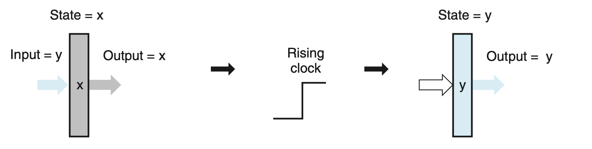

| 图 4.16 寄存器操作。在时钟信号上升之前，寄存器输出保持当前寄存器状态不变。当时钟上升时，寄存器输入处的值被捕获并成为新的寄存器状态。|
| :-------------------------------: |

图 4.16 给出了硬件寄存器及其工作方式的更详细视图。大部分时间内，寄存器保持固定状态（记为 x），生成等于当前状态的输出。信号通过寄存器前面的组合逻辑传播，为寄存器输入创建新值（记为 y），但只要时钟为低，寄存器输出就保持不变。当时钟上升时，输入信号被加载到寄存器作为其下一个状态（y），这将成为新的寄存器输出，直到下一个时钟上升。关键一点是：寄存器作为电路不同部分之间的屏障，值只有在每个时钟周期的时钟上升后才从寄存器输入传播到输出。我们的 Y86-64 处理器将使用时钟寄存器来保存程序计数器（PC）、条件码（CC）和程序状态（Stat）。

以下图示展示了一个典型的寄存器文件：

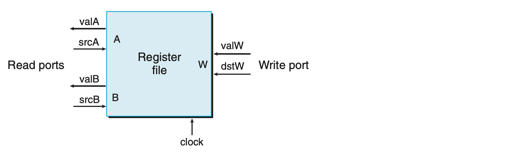

该寄存器文件有两个读端口（A 和 B）以及一个写端口（W）。这种多端口随机存取存储器允许同时进行多个读写操作。在如图所示的寄存器文件中，电路可以读取两个程序寄存器的值，同时更新第三个寄存器的状态。每个端口都有一个地址输入，指示应选择哪个程序寄存器，以及一个数据输出或输入，提供该程序寄存器的值。地址使用图 4.4 所示的编码的寄存器标识符。两个读端口的地址输入分别为 srcA 和 srcB（"source A"和"source B"的缩写），数据输出为 valA 和 valB（"value A"和"value B"的缩写）。写端口的地址输入为 dstW（"destination W"的缩写），数据输入为 valW（"value W"的缩写）。

---

<!-- Page 0411 -->

寄存器文件不是组合电路，因为它有内部存储。但在我们的实现中，读取寄存器文件的方式类似于将其视为以地址为输入、以数据为输出的组合逻辑块：当 srcA 或 srcB 被设置为某个寄存器 ID 时，经过一定延迟后，对应程序寄存器中存储的值将分别出现在 valA 或 valB 上。例如，将 srcA 设为 3 将导致读取程序寄存器 `%rbx` 的值，该值将出现在输出 valA 上。

向寄存器文件写入字由时钟信号控制，方式类似于将值加载到时钟寄存器。每次时钟上升时，输入 valW 上的值被写入 dstW 上寄存器 ID 所指示的程序寄存器。当 dstW 被设置为特殊 ID 值 0xF 时，不写入任何程序寄存器。由于寄存器文件既可读又可写，一个自然的问题是："如果电路同时尝试读取和写入同一个寄存器会发生什么？"答案很简单：如果读端口和写端口使用了相同的寄存器 ID，那么当时钟上升时，读端口的数据输出将从旧值过渡到新值。在将寄存器文件纳入处理器设计时，我们将确保考虑到这一特性。

我们的处理器有一个用于存储程序数据的随机存取存储器，如下图所示：

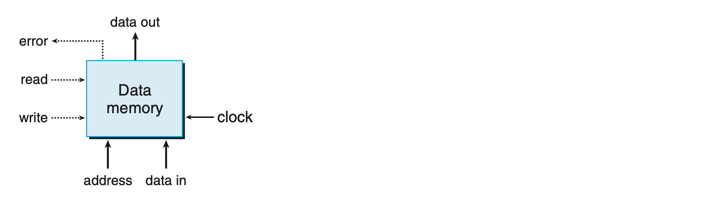

该存储器有一个地址输入、一个用于写入的数据输入和一个用于读取的数据输出。与寄存器文件类似，读取存储器的操作方式类似于组合逻辑：如果在地址输入上提供一个地址并将写控制信号设为 0，则经过一定延迟后，存储在该地址处的值将出现在数据输出上。如果地址超出范围，错误信号将被设为 1，否则设为 0。写入存储器由时钟控制：将 address 设为所需地址，data in 设为所需值，write 设为 1，当时钟信号到来时，存储器中指定位置将被更新（前提是地址有效）。与读取操作一样，如果地址无效，错误信号将被设为 1。该信号由组合逻辑生成，因为所需的边界检查纯粹是地址输入的函数，不涉及保存任何状态。

---

<!-- Page 0412 -->

>**旁注 实际内存设计**
>
>全规模微处理器中的存储器系统远比我们设计中假设的简单模型复杂得多。它由多种形式的硬件存储器组成，包括多个随机存取存储器、非易失性存储器或磁盘，以及用于管理这些设备的各种硬件和软件机制。存储器系统的设计和特性将在第 6 章中描述。
>
>尽管如此，我们简单的存储器设计可以用于较小的系统，并为更复杂系统中处理器与存储器之间的接口提供抽象。
>
>我们的处理器还包含一个只读存储器，用于读取指令。在大多数实际系统中，这些存储器被合并为一个具有两个端口的单一存储器：一个用于读取指令，另一个用于读取或写入数据。

## 4.3 Y86-64 的顺序实现

现在我们拥有了实现 Y86-64 处理器所需的组件。作为第一步，我们描述一个称为 SEQ（顺序处理器）的处理器。SEQ 在每个时钟周期内执行处理一条完整指令所需的所有步骤。然而，这将需要很长的时钟周期，导致时钟频率过低。我们开发 SEQ 的目的是为最终实现高效流水线处理器提供第一步。

### 4.3.1 将处理组织为阶段

一般而言，处理一条指令涉及多种操作。我们将这些操作组织为特定的阶段序列，尽管不同指令的动作差异很大，但我们力图使所有指令遵循统一的序列。每个步骤中的详细处理取决于正在执行的特定指令。建立这个框架将使我们能够设计一个最大限度利用硬件的处理器。以下是对各阶段及其内部操作的非正式描述：

**取指（Fetch）**。取指阶段使用程序计数器（PC）作为内存地址，从内存中读取指令的字节。从指令中提取指令说明符字节的两个 4 位部分，分别称为 icode（指令代码）和 ifun（指令功能）。可能还要取出寄存器说明符字节，给出一个或两个寄存器操作数说明符 rA 和 rB；也可能要取出一个 8 字节常数字 valC。计算 valP 为按顺序紧随当前指令的下一条指令的地址，即 valP 等于 PC 的值加上取出指令的长度。

---

<!-- Page 0413 -->

**译码（Decode）**。译码阶段从寄存器文件读取最多两个操作数，得到值 valA 和/或 valB。通常读取指令字段 rA 和 rB 所指定的寄存器，但对某些指令则读取 `%rsp` 寄存器。

**执行（Execute）**。在执行阶段，算术/逻辑单元（ALU）或执行指令指定的操作（根据 ifun 的值），或计算内存引用的有效地址，或递增/递减栈指针。我们将结果值称为 valE。条件码可能被设置。对于条件传送指令，该阶段将评估条件码和移动条件（由 ifun 给出），只有当条件满足时才允许更新目的寄存器。类似地，对于跳转指令，确定是否应该执行跳转。

**访存（Memory）**。访存阶段可以向内存写入数据，也可以从内存读取数据。读取的值称为 valM。

**写回（Write back）**。写回阶段向寄存器文件写入最多两个结果。

**更新 PC（PC update）**。PC 被设置为下一条指令的地址。

处理器无限循环地执行这些阶段。在我们的简化实现中，处理器在遇到任何异常时停止——即执行 halt 或无效指令，或试图读写无效地址时。在更完整的设计中，处理器将进入异常处理模式，开始执行由异常类型决定的特殊代码。

从上述描述可以看出，执行一条指令需要相当多的处理工作：不仅要执行指令规定的操作，还必须计算地址、更新栈指针、确定下一条指令的地址。幸运的是，对于每条指令，整体流程可以是相似的。在硬件设计中，使用非常简单且统一的结构非常重要——我们希望最小化硬件总量，且最终必须将其映射到集成电路芯片的二维表面上。降低复杂性的一种方法是让不同指令尽可能多地共享硬件。例如，我们的每个处理器设计都包含一个算术/逻辑单元，根据正在执行的指令类型以不同方式使用。在硬件中复制逻辑块的代价远高于在软件中拥有多份代码的代价，在硬件系统中处理众多特殊情况和特例也比在软件中更为困难。

我们的挑战是将不同指令所需的计算安排到这个通用框架中。我们将使用图 4.17 所示代码来说明不同 Y86-64 指令的处理过程。图 4.18 至图 4.21 包含描述不同 Y86-64 指令如何经过各个阶段的表格，值得仔细研究——这些表格的形式使得直接映射到硬件成为可能。表格中的每一行描述对某个信号或存储状态的赋值（用赋值运算符 `←` 表示），应视为从上至下顺序求值。在后续将计算映射到硬件时，我们会发现不需要以严格的顺序执行这些求值。

---

<!-- Page 0414 -->

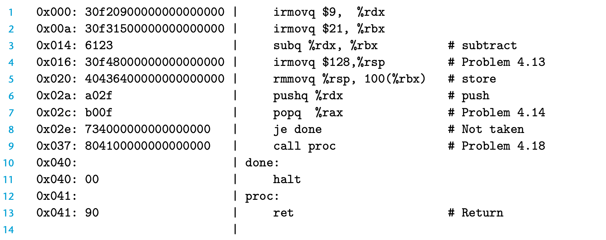

| 图 4.17 Y86-64 指令序列示例。我们将追踪这些指令经过不同阶段的处理过程。|
| :-------------------------------: |

图 4.18 展示了 `OPq`（整数和逻辑操作）、`rrmovq`（寄存器到寄存器传送）和 `irmovq`（立即数到寄存器传送）指令类型所需的处理。我们首先考虑整数操作。观察图 4.2 可以看出，我们精心选择了指令编码，使四种整数操作（`addq`、`subq`、`andq` 和 `xorq`）具有相同的 icode 值，可以用完全相同的步骤序列处理，只是 ALU 计算必须根据 ifun 中编码的特定指令操作进行设置。

整数操作指令的处理遵循上述通用模式：在取指阶段不需要常数字，因此 valP 计算为 PC + 2；在译码阶段读取两个操作数；在执行阶段将它们连同功能说明符 ifun 一起提供给 ALU，使 valE 成为指令结果，这个计算表示为 valB OP valA（其中 OP 表示 ifun 指定的操作）。注意两个参数的顺序——这与 Y86-64（和 x86-64）的约定一致，例如指令 `subq %rax, %rdx` 应计算 R[%rdx] - R[%rax]。这些指令在访存阶段不做任何事情，但 valE 在写回阶段被写入寄存器 rB，PC 被设置为 valP 以完成指令执行。

执行 `rrmovq` 指令的过程与算术操作非常相似，但不需要取出第二个寄存器操作数。我们将第二个 ALU 输入设为零并与第一个相加，得到 valE = valA，然后写入寄存器文件。`irmovq` 的处理类似，但使用常数值 valC 作为第一个 ALU 输入。此外，由于 `irmovq` 的指令格式较长，程序计数器必须增加 10。这两条指令都不改变条件码。

---

<!-- Page 0415 -->

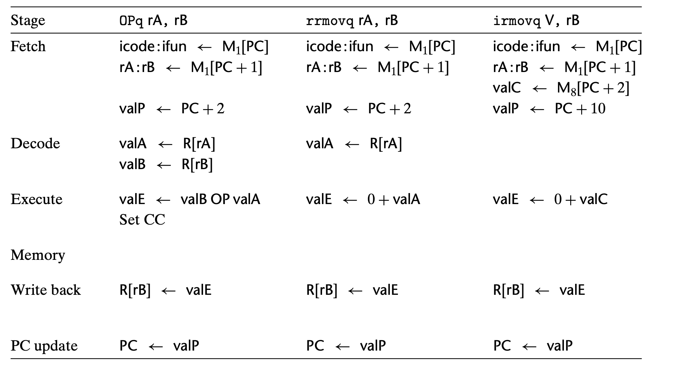

| 图 4.18 Y86-64 指令 OPq、rrmovq 和 irmovq 顺序实现中的计算。这些指令计算一个值并将结果存储到寄存器中。符号 icode:ifun 表示指令字节的两个组成部分，rA:rB 表示寄存器说明符字节的两个组成部分。符号 $\text{M}_1[x]$ 表示访问（读取或写入）内存地址 x 处的 1 字节，$\text{M}_8[x]$ 表示访问 8 字节。|
| :-------------------------------: |

**练习题 4.13（答案见第 521 页）**

填写下表右列，描述图 4.17 目标代码第 4 行 `irmovq` 指令的处理过程：

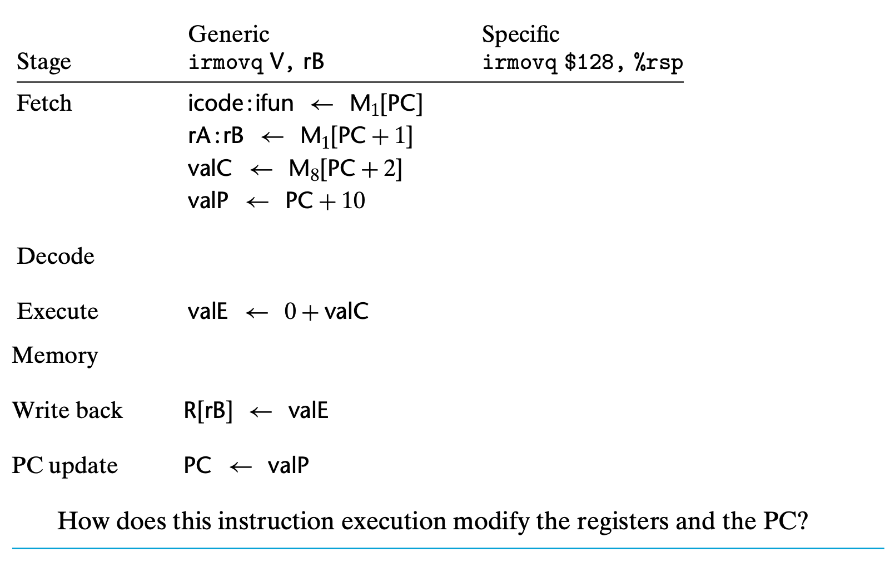

---

<!-- Page 0416 -->

>**旁注 追踪 subq 指令的执行**
>
>以一个例子来说明，我们追踪图 4.17 目标代码第 3 行 subq 指令的处理过程。可以看出，前两条指令分别将寄存器 %rdx 和 %rbx 初始化为 9 和 21；该指令位于地址 0x014，由 2 字节组成，值为 0x61 和 0x23。各阶段的处理如下表所示，左列为处理 OPq 指令的通用规则（图 4.18），右列为此特定指令的计算：
>
>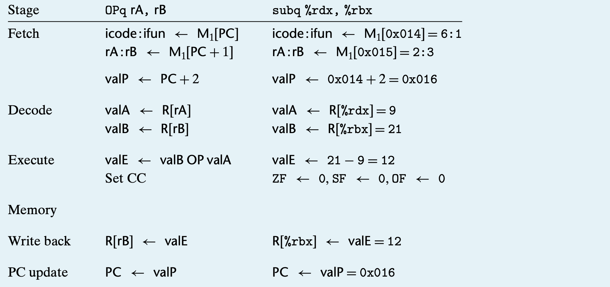
>
>如该追踪所示，指令达到了将寄存器 %rbx 设为 12、将三个条件码全部设为零、PC 增加 2 的预期效果。

图 4.19 展示了内存写和读指令 `rmmovq` 和 `mrmovq` 所需的处理，基本流程与前面相同，但使用 ALU 将 valC 与 valB 相加，得到内存操作的有效地址（偏移量与基址寄存器值之和）。在访存阶段，要么将寄存器值 valA 写入内存，要么从中读取 valM。

---

<!-- Page 0417 -->

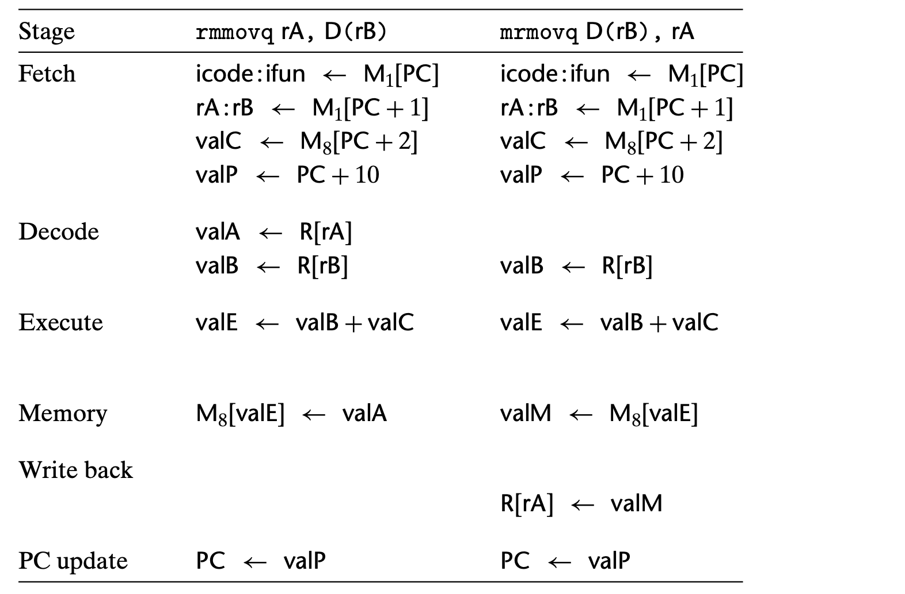

| 图 4.19 Y86-64 指令 rmmovq 和 mrmovq 顺序实现中的计算。这些指令读取或写入内存。|
| :-------------------------------: |

图 4.20 展示了处理 `pushq` 和 `popq` 指令所需的步骤。这是 Y86-64 中最难实现的指令，因为它们既要访问内存，又要递增或递减栈指针。尽管两条指令的流程类似，但有重要区别。

`pushq` 指令的开始与前面的指令类似，但在译码阶段将 `%rsp` 用作第二个寄存器操作数的标识符，得到栈指针作为值 valB。在执行阶段，使用 ALU 将栈指针减 8，这个递减后的值既用于内存写入地址，也在写回阶段存回 `%rsp`。通过使用 valE 作为写操作的地址，我们遵守了 Y86-64（和 x86-64）的约定：`pushq` 应在写入之前先递减栈指针，即使栈指针的实际更新要等到内存操作完成之后才发生。

popq 指令的处理与 `pushq` 非常相似，但在译码阶段读取两份栈指针的副本。这显然是冗余的，但我们将看到，将栈指针同时作为 valA 和 valB 使后续流程与其他指令更相似，增强了设计的整体一致性。我们在执行阶段用 ALU 将栈指针加 8，但用未递增的值作为内存操作的地址。在写回阶段，同时用递增后的栈指针更新栈指针寄存器，并用从内存读取的值更新寄存器 rA。使用未递增的栈指针作为内存读取地址，保留了 Y86-64（和 x86-64）约定：`popq` 应先读取内存，然后再递增栈指针。

---

<!-- Page 0418 -->

>**旁注 追踪 rmmovq 指令的执行**
>
>我们追踪图 4.17 目标代码第 5 行 rmmovq 指令的处理过程。可以看出，前一条指令将寄存器 %rsp 初始化为 128，而 %rbx 仍保持为 12（由第 3 行 subq 指令计算所得）。该指令位于地址 0x020，由 10 字节组成：前 2 字节值为 0x40 和 0x43，最后 8 字节是数字 0x0000000000000064（十进制 100）的字节逆序表示。各阶段处理过程如下：
>
>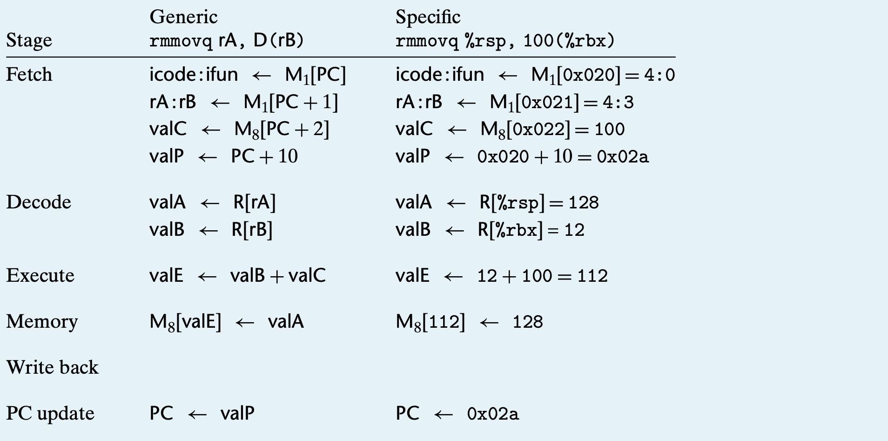
>
>如该追踪所示，该指令的效果是将 128 写入内存地址 112，并将 PC 增加 10。

---

**练习题 4.14（答案见第 522 页）**

填写下表右列，描述图 4.17 目标代码第 7 行 popq 指令的处理过程：

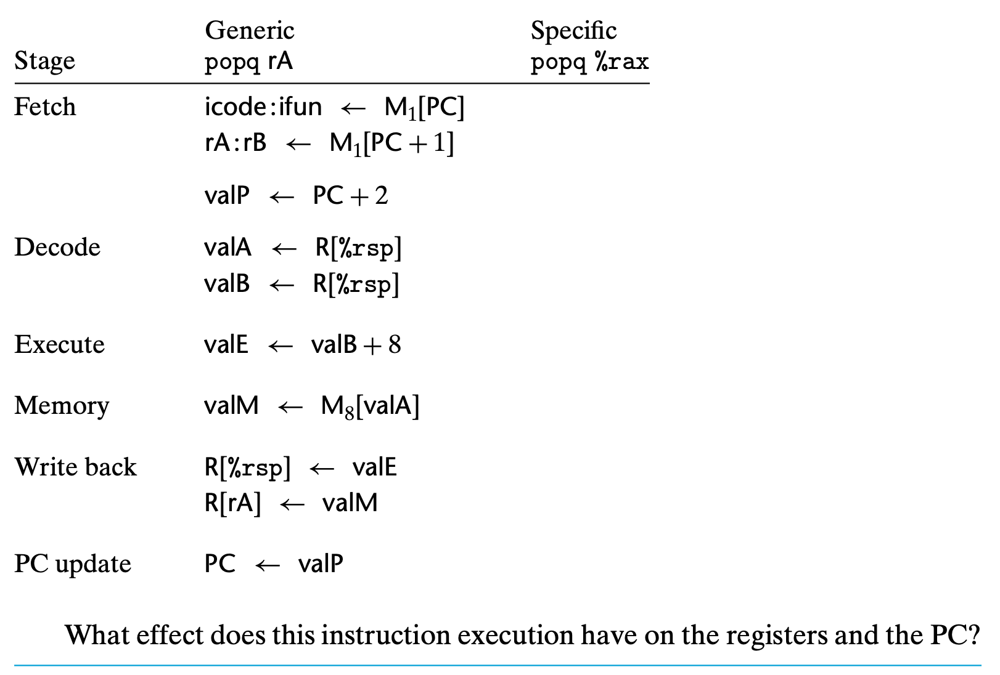

---

<!-- Page 0419 -->

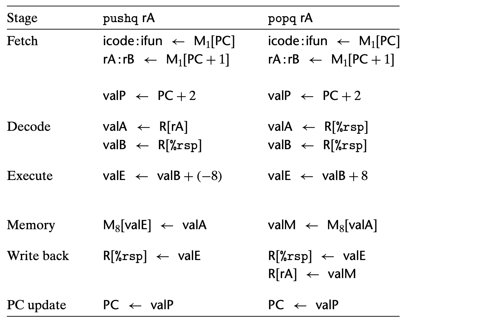

| 图 4.20 Y86-64 指令 pushq 和 popq 顺序实现中的计算。这些指令实现压栈和弹栈操作。|
| :-------------------------------: |

---

**练习题 4.15（答案见第 522 页）**

根据图 4.20 所列步骤，`pushq %rsp `指令的效果是什么？这是否符合练习题 4.7 中确定的 Y86-64 所期望的行为？

---

<!-- Page 0420 -->

>**旁注 追踪 pushq 指令的执行**
>
>我们追踪图 4.17 目标代码第 6 行 pushq 指令的处理过程。此时寄存器 %rdx 中为 9，%rsp 中为 128。该指令位于地址 0x02a，由 2 字节组成，值为 0xa0 和 0x2f。各阶段处理过程如下：
>
>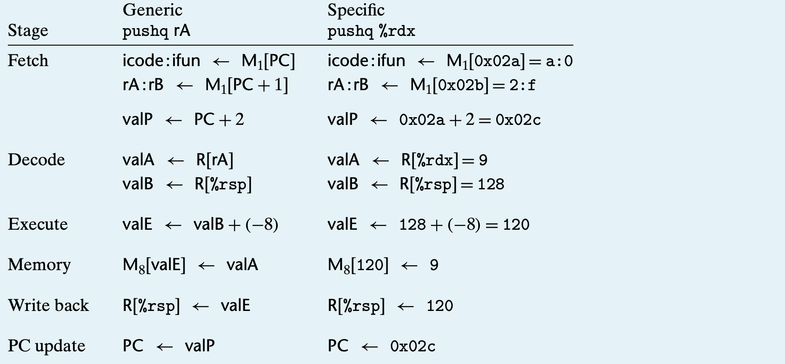
>
>如该追踪所示，该指令的效果是将 %rsp 设为 120，将 9 写入地址 120，PC 增加 2。

---

**练习题 4.16（答案见第 522 页）**

假设 `popq` 写回阶段中的两次寄存器写入按图 4.20 所列顺序发生。执行 `popq %rsp` 的效果是什么？这是否符合练习题 4.8 中确定的 Y86-64 所期望的行为？

---

图 4.21 给出了处理三种控制传送指令（各种跳转、call 和 ret）所需的步骤。可以看出，我们可以用与前述指令相同的整体流程实现这些指令。

与整数操作一样，我们可以统一处理所有跳转指令，因为它们只在是否执行跳转这一点上有所不同。跳转指令的取指和译码阶段与前述指令非常类似，只是不需要寄存器说明符字节。在执行阶段，检查条件码和跳转条件以决定是否执行跳转，产生一个 1 位信号 Cnd。在更新 PC 阶段，测试该标志：若为 1 则将 PC 设为 valC（跳转目标），若为 0 则设为 valP（后续指令的地址）。我们的符号 `x? a : b` 类似于 C 中的条件表达式——当 x 为 1 时产生 a，为 0 时产生 b。

---

<!-- Page 0421 -->

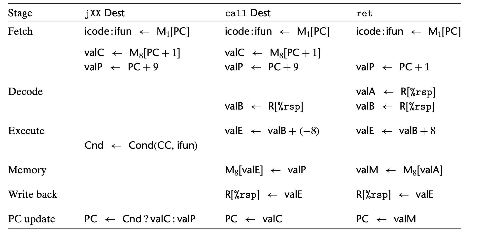

| 图 4.21 Y86-64 指令 jXX、call 和 ret 顺序实现中的计算。这些指令导致控制转移。|
| :-------------------------------: |

---

**练习题 4.17（答案见第 522 页）**

由指令编码（图 4.2 和图 4.3）可知，`rrmovq` 指令是一类更通用指令（包括条件传送）的无条件版本。说明如何修改 `rrmovq` 指令的步骤以同时处理六条条件传送指令。参考 jXX 指令实现（图 4.21）处理条件行为的方式可能有所帮助。

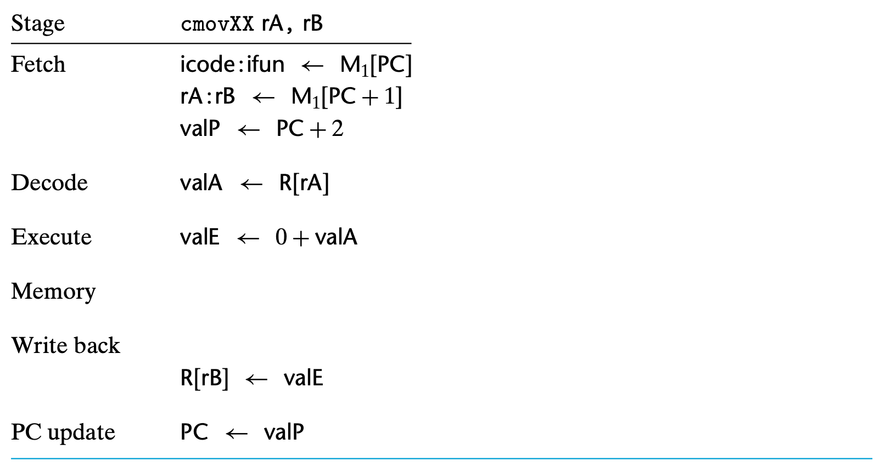

---

<!-- Page 0422 -->

>**旁注 追踪 je 指令的执行**
>
>我们追踪图 4.17 目标代码第 8 行 je 指令的处理过程。条件码均被第 3 行 subq 指令设为零，因此不执行跳转。该指令位于地址 0x02e，由 9 字节组成：第一个字节值为 0x73，其余 8 字节是跳转目标 0x0000000000000040 的字节逆序表示。各阶段处理过程如下：
>
>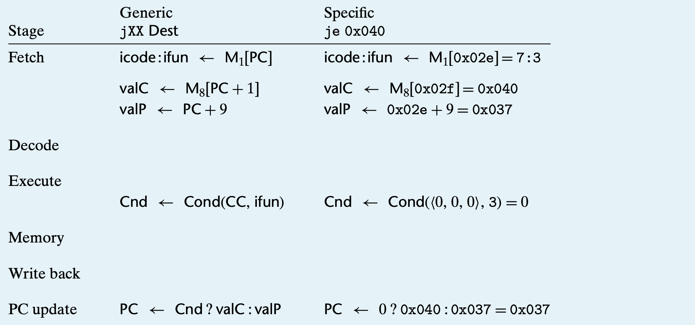
>
>如该追踪所示，该指令的效果是将 PC 增加 9。

`call` 和 `ret` 指令与 `pushq` 和 `popq` 指令有一定相似性，但压入和弹出的是程序计数器的值。对于 `call` 指令，我们压入 valP（即 `call` 指令之后那条指令的地址）；在更新 PC 阶段，将 PC 设置为 valC（调用目标）。对于 `ret` 指令，我们在更新 PC 阶段将从栈中弹出的值 valM 赋给 PC。

---

**练习题 4.18（答案见第 523 页）**

填写下表右列，描述图 4.17 目标代码第 9 行 call 指令的处理过程：

>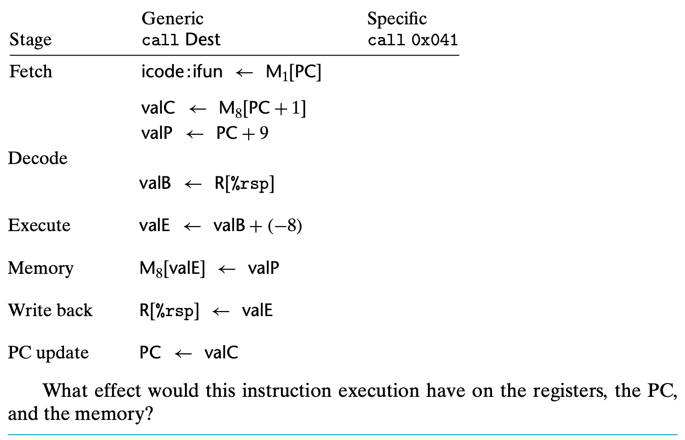

---

<!-- Page 0423 -->

>**旁注 追踪 ret 指令的执行**
>
>我们追踪图 4.17 目标代码第 13 行 ret 指令的处理过程。该指令地址为 0x041，由单字节 0x90 编码。之前的 call 指令将 %rsp 设为 120，并将返回地址 0x040 存储在内存地址 120 处。各阶段处理过程如下：

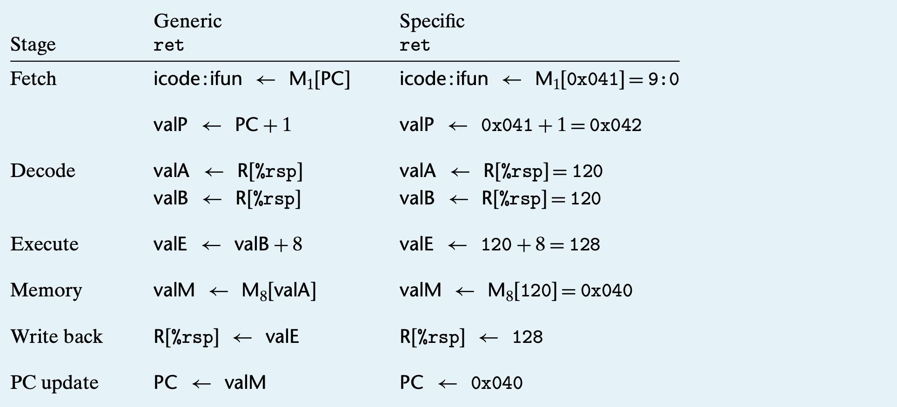

>如该追踪所示，该指令的效果是将 PC 设为 0x040（halt 指令的地址），并将 %rsp 设为 128。

我们已经建立了一个统一的框架，能够处理所有不同类型的 Y86-64 指令。尽管这些指令的行为差异很大，我们仍能将处理组织为六个阶段。我们的任务现在是创建实现这些阶段并将它们连接在一起的硬件设计。

---

<!-- Page 0424 -->

### 4.3.2 SEQ 硬件结构

实现所有 Y86-64 指令所需的计算可以组织为一系列六个基本阶段：取指、译码、执行、访存、写回和更新 PC。图 4.22 展示了可执行这些计算的硬件结构的抽象视图。程序计数器存储在一个寄存器中，位于图左下角（标记为"PC"）。信息沿导线（以粗灰线分组显示）流动，先向上再向右。处理由与不同阶段关联的硬件单元执行。右侧向下返回的反馈路径包含要写入寄存器文件的更新值和更新后的程序计数器。在 SEQ 中，所有硬件单元的处理都在单个时钟周期内发生（如 4.3.3 节所述）。此图省略了一些小的组合逻辑块以及操作不同硬件单元、将适当值路由到这些单元所需的所有控制逻辑——这些细节将在后面补充。我们采用从下到上的处理器绘图方式是非常规的，在开始设计流水线处理器时我们将解释这一约定的原因。

硬件单元与不同的处理阶段相关联：

**取指**：使用程序计数器寄存器作为地址，指令存储器读取指令的字节。PC 递增器计算 valP（递增后的程序计数器）。

**译码**：寄存器文件有两个读端口 A 和 B，通过它们同时读取寄存器值 valA 和 valB。

**执行**：执行阶段根据指令类型以不同方式使用算术/逻辑单元（ALU）。对于整数操作，执行指定的操作；对于其他指令，将其用作加法器来计算递增或递减的栈指针、计算有效地址，或者简单地通过加零将其某个输入传递到输出。

条件码寄存器（CC）保存三个条件码位。条件码的新值由 ALU 计算。执行条件传送指令时，是否更新目的寄存器的决定基于条件码和传送条件。类似地，执行跳转指令时，分支信号 Cnd 基于条件码和跳转类型计算。

**访存**：执行内存指令时，数据存储器读取或写入内存中的一个字。指令存储器和数据存储器访问相同的内存位置，但用途不同。

**写回**：寄存器文件有两个写端口。E 端口用于写入 ALU 计算的值，M 端口用于写入从数据存储器读取的值。

**程序计数器更新**。程序计数器的新值选取为：valP（下一条指令的地址）、valC（由调用或跳转指令指定的目标地址），或valM（从存储器读取的返回地址）。

---

<!-- Page 0425 -->

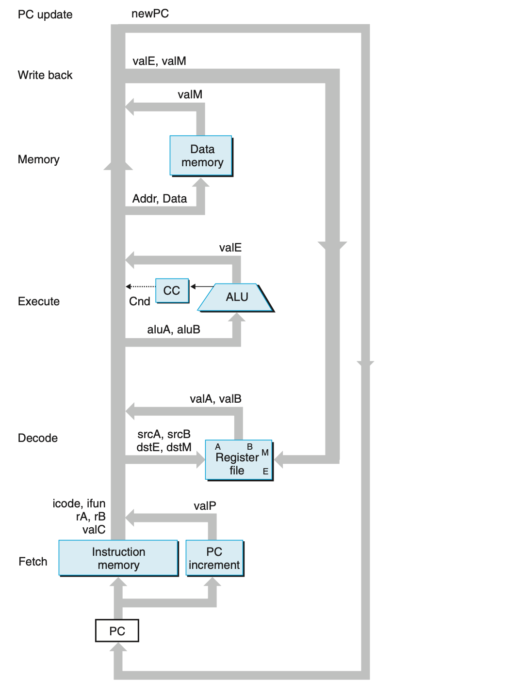

| 图 4.22 SEQ（顺序实现）的抽象视图。执行一条指令时处理的信息按顺时针流动，从图左下角的程序计数器（PC）开始取指。|
| :-------------------------------: |

---

<!-- Page 0426 -->

图 4.23 给出了实现 SEQ 所需硬件的更详细视图（尽管要到分别检查各个阶段时才能看到完整细节）。我们看到与前面相同的硬件单元集合，但现在导线被明确显示。在此图以及其他硬件示意图中，我们使用以下绘图约定：

- 时钟寄存器显示为白色矩形。程序计数器 PC 是 SEQ 中唯一的时钟寄存器。

- 硬件单元显示为浅蓝色方框，包括存储器、ALU 等。所有处理器实现将使用相同的基本单元集合，我们将这些单元视为"黑盒"，不深入其详细设计。

- 控制逻辑块绘制为灰色圆角矩形，用于从一组信号源中选择或计算某个布尔函数，我们将对这些块进行完整的详细检查，包括开发 HCL 描述。

- 导线名称标注在白色圆圈中，这仅仅是导线上的标签，不是任何硬件元件。

- 字宽数据连接显示为中等粗细的线，每条线实际上代表一束 64 根并行连接的导线，用于将一个字从硬件的一个部分传送到另一个部分。

- 字节及更窄的数据连接显示为细线，每条线实际上代表一束 4 或 8 根导线，具体取决于这些导线上必须传输什么类型的值。

- 单位连接显示为虚线，代表芯片上各单元和块之间传递的控制值。

图 4.18 至图 4.21 所示的所有计算都有一个特点：每行要么表示计算某个特定值（如 valP），要么表示激活某个硬件单元（如存储器）。这些计算和动作列在图 4.24 的第二列中。除了我们已描述的信号外，该列表还包含四个寄存器 ID 信号：srcA（valA 的来源）、srcB（valB 的来源）、dstE（valE 写入的寄存器）和 dstM（valM 写入的寄存器）。

图 4.24 右侧两列分别展示了 `OPq` 和 `mrmovq` 指令的计算，以说明各计算值。为将计算映射到硬件，我们需要实现控制逻辑，在不同硬件单元之间传输数据并以这样的方式操作这些单元：对每种不同的指令类型执行规定的操作。这就是图 4.23 中灰色圆角矩形所示的控制逻辑块的用途。我们的任务是依次检查各个阶段，为这些块创建详细设计。

---

<!-- Page 0427 -->

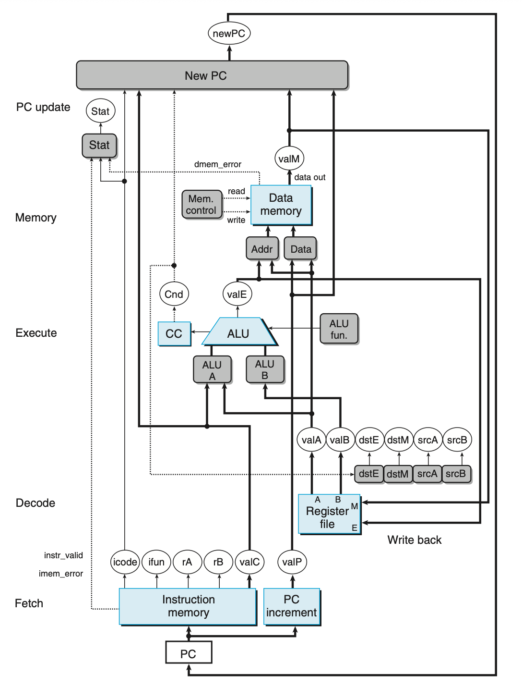

| 图 4.23 SEQ（顺序实现）的硬件结构。部分控制信号以及寄存器和控制字连接未显示。|
| :-------------------------------: |

---

<!-- Page 0428 -->

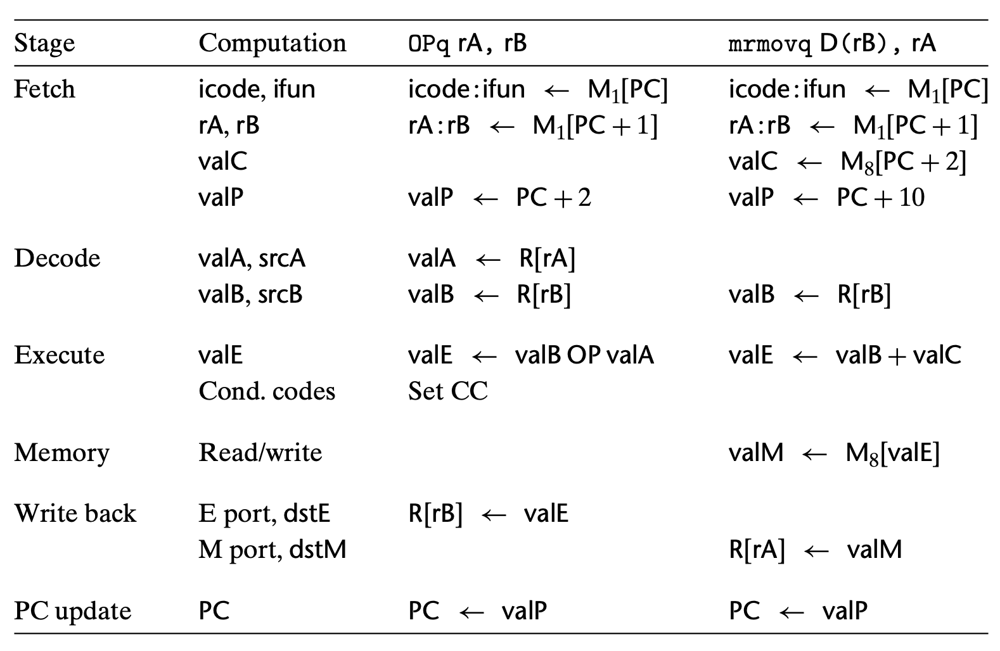

| 图 4.24 识别顺序实现中的不同计算步骤。第二列标识 SEQ 各阶段中被计算的值或被执行的操作。OPq 和 mrmovq 指令的计算作为示例显示。|
| :-------------------------------: |

### 4.3.3 SEQ 时序

在介绍图 4.18 至图 4.21 的表格时，我们说过应将其视为用编程符号写成的内容，赋值从上到下依次执行。另一方面，图 4.23 的硬件结构以本质上不同的方式工作：单次时钟转换触发通过组合逻辑的流动，执行整条指令。让我们看看硬件如何实现这些表格中列出的行为。

SEQ 的实现由组合逻辑和两种形式的存储设备组成：时钟寄存器（程序计数器和条件码寄存器）以及随机存取存储器（寄存器文件、指令存储器和数据存储器）。组合逻辑不需要任何时序或控制——每当输入变化时，值就通过逻辑门网络传播。如前所述，我们还假设从随机存取存储器中读取的操作方式类似于组合逻辑：根据地址输入生成输出字。对于较小的存储器（如寄存器文件），我们也可以使用特殊时钟电路对较大的电路模拟此效果。由于指令存储器仅用于读取指令，因此我们可以将该单元视为组合逻辑来处理。

---

<!-- Page 0429 -->

这样，仅剩下四个硬件单元需要对其时序进行显式控制——程序计数器、条件码寄存器、数据存储器和寄存器文件。这些单元由单一时钟信号控制，该信号触发新值载入寄存器以及值写入随机存取存储器。程序计数器在每个时钟周期都被载入新的指令地址。条件码寄存器仅在执行整数运算指令时被载入。数据存储器仅在执行 `rmmovq`、`pushq` 或 `call` 指令时被写入。寄存器文件的两个写端口允许每个周期更新两个程序寄存器，但我们可以使用特殊寄存器 ID 0xF 作为端口地址，表示该端口不执行任何写操作。

对寄存器和存储器的这种时钟控制，是我们处理器中控制活动时序所需的全部内容。我们的硬件能够实现与图 4.18 到图 4.21 表格中所示赋值序列顺序执行相同的效果，即使所有状态更新实际上是同时发生的，且仅在时钟上升沿开始下一个周期时才发生。这种等价性成立，是因为 Y86-64 指令集的性质，以及我们以这样的方式组织计算，使我们的设计遵循以下原理：

**原理：禁止回读**

处理器永远不需要回读某条指令已更新的状态，来完成该指令的处理。

这一原理对我们实现的成功至关重要。举例说明：假设我们通过先将 `%rsp` 减 8，再用更新后的 `%rsp` 值作为写操作地址来实现 `pushq` 指令。这种做法将违反上述原理，因为它需要从寄存器文件中读取已更新的栈指针来执行内存操作。相反，我们的实现（图 4.20）将栈指针的递减值作为信号 valE 生成，然后同时用该信号作为寄存器写的数据和内存写的地址。这样，当时钟上升沿开始下一个时钟周期时，就可以同时执行寄存器写和内存写操作。

作为该原理的另一个说明：某些指令（整数运算指令）会设置条件码，某些指令（条件传送和跳转指令）会读取条件码，但没有任何指令既需要设置又需要读取条件码。尽管条件码直到时钟上升沿开始下一个时钟周期时才被设置，但在任何指令尝试读取它们之前，条件码就已更新完毕。

图 4.25 展示了 SEQ 硬件如何处理以下代码序列中第 3 行和第 4 行的指令（以汇编代码显示，指令地址列在左侧）：

---

<!-- Page 0430 -->

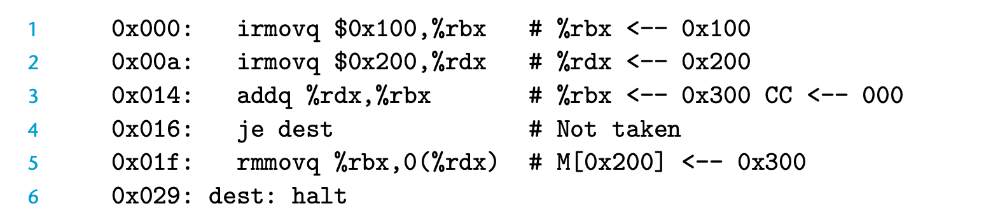

标记为 ① 至 ④ 的每幅图，展示了四个状态元素以及组合逻辑和状态元素之间的连接。我们将组合逻辑展示为包裹在条件码寄存器周围，因为部分组合逻辑（如算术逻辑单元）产生条件码寄存器的输入，而其他部分（如分支计算和程序计数器选择逻辑）以条件码寄存器作为输入。寄存器文件和数据存储器的读写连接分开显示，因为读操作像组合逻辑一样在这些单元中传播，而写操作由时钟控制。

图 4.25 中的色彩编码标示了电路信号与正在执行的不同指令之间的关系。我们假设处理从条件码开始，按 ZF、SF、OF 的顺序，初始值为 100。在时钟周期 3 开始时（位置 ①），状态元素保存着第二条 `irmovq` 指令（代码第 2 行）更新后的状态，以浅灰色显示。组合逻辑以白色显示，表明它还没有时间对状态变化做出反应。时钟周期从地址 0x014 载入程序计数器开始，导致 `addq` 指令（代码第 3 行，以蓝色显示）被取指并处理。值流过组合逻辑，包括从随机存取存储器中读取。在周期结束时（位置 ②），组合逻辑已为条件码生成了新值（000），为程序寄存器 %rbx 生成了更新，并为程序计数器生成了新值（0x016）。此时，组合逻辑已按 `addq` 指令（蓝色）更新，但状态仍保存着第二条 `irmovq` 指令（浅灰色）设置的值。

当时钟上升开始第 4 个周期时（位置 ③），程序计数器、寄存器文件和条件码寄存器的更新发生，以蓝色显示，但组合逻辑尚未对这些变化做出反应，以白色显示。在本周期中，`je` 指令（代码第 4 行，以深灰色显示）被取指并执行。由于条件码 ZF 为 0，分支未被采用。在周期结束时（位置 ④），为程序计数器生成了新值 0x01f。组合逻辑已按 `je` 指令（深灰色）更新，但状态仍保存着 `addq` 指令（蓝色）设置的值，直到下一个周期开始。

如本例所示，使用时钟控制状态元素的更新，结合值通过组合逻辑的传播，足以控制我们 SEQ 实现中每条指令所执行的计算。每次时钟从低电平转为高电平，处理器就开始执行一条新指令。

---

<!-- Page 0431 -->

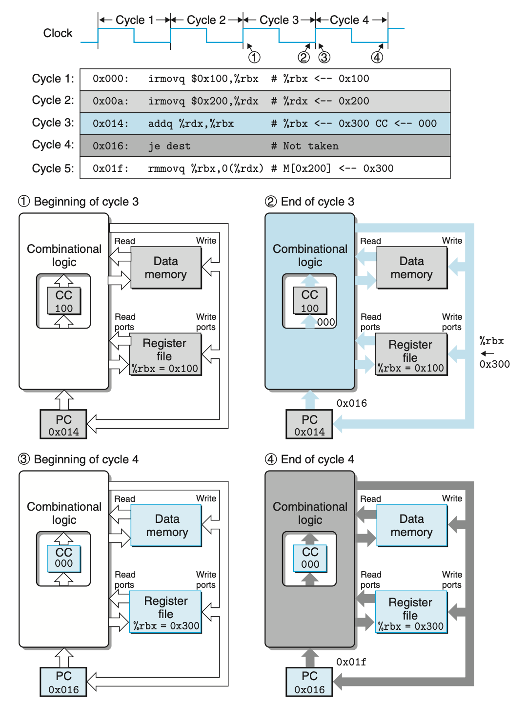

| 图 4.25 追踪 SEQ 的两个执行周期。每个周期开始时，状态元素（程序计数器、条件码寄存器、寄存器文件和数据存储器）按上一条指令设置的状态存储值。信号通过组合逻辑传播，为状态元素产生新值。这些值在下一个周期开始时被载入状态元素。|
| :-------------------------------: |

---

<!-- Page 0432 -->

### 4.3.4 SEQ 阶段实现

在本节中，我们为实现 SEQ 所需的控制逻辑块设计 HCL 描述。SEQ 的完整 HCL 描述见第 508 页的 Web 补充内容 ARCH:HCL。我们在此展示一些示例块，其他块作为练习题给出。我们建议你完成这些练习，以此检验你对各块与不同指令计算需求之间关系的理解。

SEQ 的 HCL 描述中，我们未在此列出的部分是对可作为 HCL 运算参数的不同整数信号和布尔信号的定义。这包括各硬件信号的名称，以及不同指令码、功能码、寄存器名称、算术逻辑单元运算和状态码的常量值。只有那些必须在控制逻辑中显式引用的常量才会列出。图 4.26 中记录了我们使用的常量。按照惯例，我们使用大写名称表示常量值。

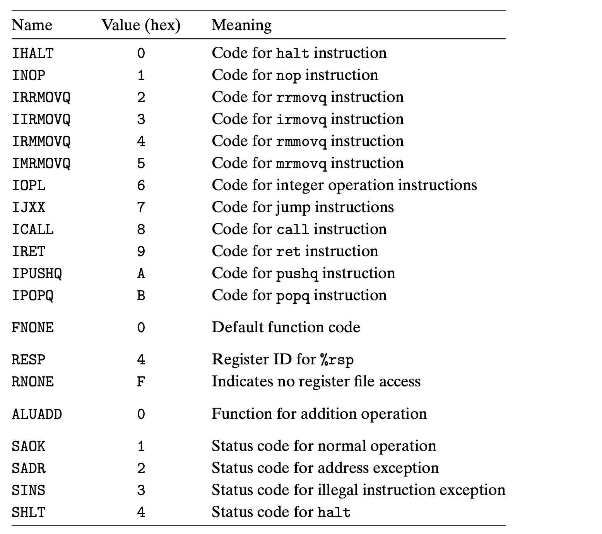
| 图 4.26 HCL 描述中使用的常量值。这些值代表指令、功能码、寄存器 ID、算术逻辑单元运算和状态码的编码。|
| :-------------------------------: |

---

<!-- Page 0433 -->

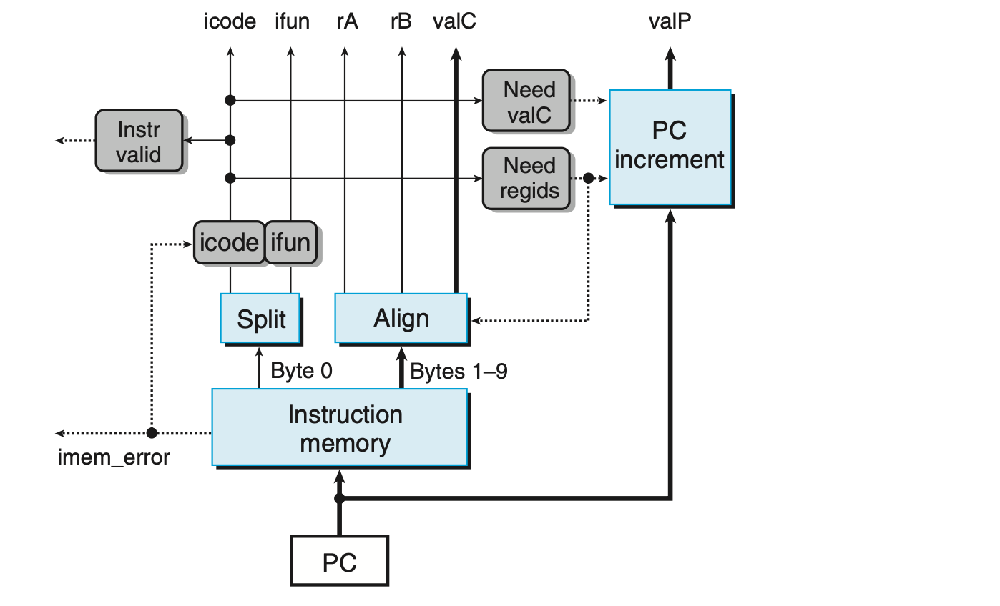
| 图 4.27 SEQ 取指阶段。从指令存储器读取 10 个字节，以程序计数器作为起始地址。从这些字节中生成不同的指令字段。程序计数器增量块计算信号 valP。|
| :-------------------------------: |

除图 4.18 至图 4.21 中展示的指令外，我们还包含了对 `nop` 和 `halt` 指令的处理。`nop` 指令只是流经各阶段而无需过多处理，除了将程序计数器加 1。`halt` 指令导致处理器状态被设置为 HLT，使其停止运行。

**取指阶段**

如图 4.27 所示，取指阶段包含指令存储器硬件单元。该单元每次以程序计数器作为第一个字节（字节 0）的地址，从内存读取 10 个字节。该字节被解释为指令字节，由标记为"Split"的单元分解为两个 4 位量。标记为"icode"和"ifun"的控制逻辑块随后将指令码和功能码计算为：要么等于从内存读取的值，要么在指令地址无效（由信号 imem_error 指示）时，等于对应于 nop 指令的值。基于 icode 的值，我们可以计算三个 1 位信号（以虚线显示）：

**instr_valid**：该字节是否对应一条合法的 Y86-64 指令？该信号用于检测非法指令。

**need_regids**：该指令是否包含寄存器说明符字节？

**need_valC**：该指令是否包含常量字？

信号 instr_valid 和 imem_error（在指令地址越界时产生）用于在访存阶段生成状态码。

---

<!-- Page 0434 -->

以下 HCL 代码根据 icode 的值是否属于包含寄存器说明符字节的指令来计算 need_regids：

```hcl
bool need_regids =
    icode in { IRRMOVQ, IOPQ, IPUSHQ, IPOPQ,
               IIRMOVQ, IRMMOVQ, IMRMOVQ };
```

---

**练习题 4.19（答案见第 523 页）**

为 SEQ 实现中的信号 need_valC 编写 HCL 代码。

---

如图 4.27 所示，从指令存储器读取的其余 9 个字节编码了寄存器说明符字节和常量字的某种组合。这些字节由标记为"Align"的硬件单元处理，生成寄存器字段和常量字。当计算得到的信号 need_regids 为 1 时，字节 1 被分解为寄存器说明符 rA 和 rB。若 need_regids 为 0，则两个寄存器说明符均设为 0xF（RNONE），表示该指令未指定任何寄存器。还需注意（图 4.2），对于只有一个寄存器操作数的指令，寄存器说明符字节的另一个字段为 0xF（RNONE）。因此，我们可以假设信号 rA 和 rB 要么编码我们希望访问的寄存器，要么表示不需要寄存器访问。标记为"Align"的单元还生成常量字 valC，该值可以是字节 1–8 或字节 2–9，具体取决于信号 need_regids 的值。

程序计数器增量硬件单元根据程序计数器的当前值以及信号 need_regids 和 need_valC 生成信号 valP。对于程序计数器值 $p$、need_regids 值 $r$ 和 need_valC 值 $i$，增量单元生成值 $p + 1 + r + 8i$。

**译码和写回阶段**

图 4.28 提供了 SEQ 中实现译码和写回阶段的逻辑的详细视图。这两个阶段合并处理，因为它们都需要访问寄存器文件。

寄存器文件有四个端口，支持最多两次同时读取（端口 A 和 B）和两次同时写入（端口 E 和 M）。每个端口都有地址连接和数据连接，其中地址连接是寄存器 ID，数据连接是一组 64 根导线，作为寄存器文件读端口的输出字或写端口的输入字。两个读端口的地址输入为 srcA 和 srcB，两个写端口的地址输入为 dstE 和 dstM。地址端口上的特殊标识符 0xF（RNONE）表示不应访问任何寄存器。

图 4.28 底部的四个块基于指令码 icode、寄存器说明符 rA 和 rB，以及可能在执行阶段计算的条件信号 Cnd，为寄存器文件生成四个不同的寄存器 ID。寄存器 ID srcA 指示应读取哪个寄存器以生成 valA。

---

<!-- Page 0435 -->

所需的值取决于指令类型，如图 4.18 至图 4.21 中译码阶段第一行所示。将所有这些条目合并为单一计算，得到 srcA 的以下 HCL 描述（回忆 RESP 是 `%rsp` 的寄存器 ID）：

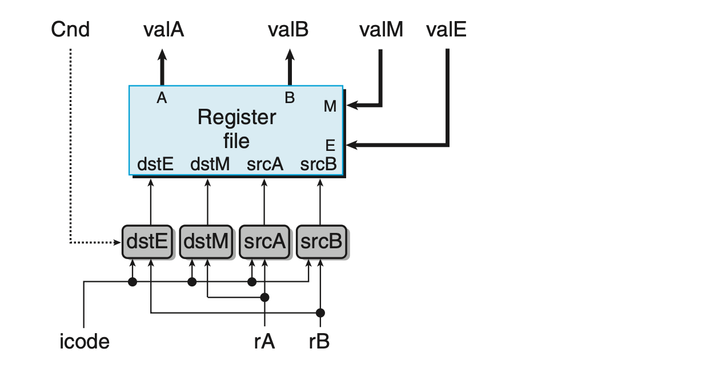
| 图 4.28 SEQ 译码和写回阶段。指令字段被译码，为寄存器文件使用的四个地址（两个读地址和两个写地址）生成寄存器标识符。从寄存器文件读取的值成为信号 valA 和 valB。两个写回值 valE 和 valM 作为写操作的数据。|
| :-------------------------------: |

```hcl
word srcA = [
    icode in { IRRMOVQ, IRMMOVQ, IOPQ, IPUSHQ } : rA;
    icode in { IPOPQ, IRET } : RRSP;
    1 : RNONE; # Don't need register
].
```

---

**练习题 4.20（答案见第 524 页）**

寄存器信号 srcB 指示应读取哪个寄存器以生成信号 valB。所需的值在图 4.18 至图 4.21 的译码阶段第二步中给出。为 srcB 编写 HCL 代码。

---

寄存器 ID dstE 指示写端口 E 的目标寄存器，计算值 valE 将被存入该寄存器。这在图 4.18 至图 4.21 中作为写回阶段的第一步给出。如果暂时忽略条件传送指令，我们可以将所有不同指令的目标寄存器合并，得到 dstE 的以下 HCL 描述：

```hcl
# WARNING: Conditional move not implemented correctly here
word dstE = [
    icode in { IRRMOVQ } : rB;
    icode in { IIRMOVQ, IOPQ } : rB;
    icode in { IPUSHQ, IPOPQ, ICALL, IRET } : RRSP;
    1 : RNONE;  # Don't write any register
];
```

我们将在研究执行阶段时重新讨论该信号以及如何实现条件传送。

---

<!-- Page 0436 -->

**练习题 4.21（答案见第 524 页）**

寄存器 ID dstM 指示写端口 M 的目标寄存器，从内存读取的值 valM 将被存入该寄存器。这在图 4.18 至图 4.21 中作为写回阶段的第二步给出。为 dstM 编写 HCL 代码。

---

**练习题 4.22（答案见第 524 页）**

只有 `popq` 指令同时使用寄存器文件的两个写端口。对于指令 `popq %rsp`，两个写端口 E 和 M 将使用相同的地址，但数据不同。为处理这一冲突，我们必须在两个写端口之间建立优先级，当两者在同一周期内尝试写入同一寄存器时，只有较高优先级端口的写操作生效。根据练习题 4.8 中确定的期望行为，应给予哪个端口更高的优先级？

---

**执行阶段**

执行阶段包含算术/逻辑单元（ALU）。该单元根据 alufun 信号的设置，对输入 aluA 和 aluB 执行加法、减法、与或异或运算。这些数据和控制信号由三个控制块生成，如图 4.29 所示。算术逻辑单元的输出成为信号 valE。

在图 4.18 至图 4.21 中，每条指令的算术逻辑单元计算作为执行阶段的第一步给出。操作数以 aluB 在前、aluA 在后的顺序列出，以确保 `subq` 指令从 valB 中减去 valA。我们可以看到，aluA 的值可以是 valA、valC，或者 -8 或 +8，具体取决于指令类型。因此，我们可以将生成 aluA 的控制块的行为表示为：

```hcl
word aluA = [
    icode in { IRRMOVQ, IOPQ } : valA;
    icode in { IIRMOVQ, IRMMOVQ, IMRMOVQ } : valC;
    icode in { ICALL, IPUSHQ } : -8;
    icode in { IRET, IPOPQ } : 8;
    # Other instructions don't need ALU
];
```

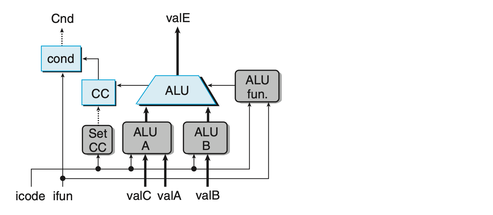

| 图 4.29：SEQ 执行阶段。算术逻辑单元要么执行整数运算指令的操作，要么作为加法器使用。条件码寄存器根据算术逻辑单元的输出值进行设置。对条件码值进行测试，以确定是否应采用分支。|
| :-------------------------------: |

---

<!-- Page 0437 -->

**练习题 4.23（答案见第 524 页）**

根据图 4.18 至图 4.21 中执行阶段第一步的第一个操作数，为 SEQ 中的信号 aluB 编写 HCL 描述。

---

观察执行阶段中算术逻辑单元执行的操作，我们可以看到它大多用作加法器。但对于 `OPq` 指令，我们希望它使用指令 `ifun` 字段中编码的操作。因此，我们可以将算术逻辑单元控制的 HCL 描述写为：

```hcl
word alufun = [
    icode == IOPQ : ifun;
    1 : ALUADD;
];
```

执行阶段还包含条件码寄存器。算术逻辑单元每次运算都会生成条件码所基于的三个信号——零标志、符号标志和溢出标志。但我们只希望在执行 `OPq` 指令时设置条件码。因此，我们生成一个控制条件码寄存器是否应更新的信号 `set_cc`：

```hcl
bool set_cc = icode in { IOPQ };
```

标记为"cond"的硬件单元利用条件码和功能码的组合，判断是否应执行条件分支或条件数据传送（图 4.3）。它生成信号 Cnd，用于条件传送中 dstE 的设置以及条件分支的下一个程序计数器逻辑。对于其他指令，Cnd 信号可能被设置为 1 或 0，具体取决于指令的功能码和条件码的设置，但它将被控制逻辑忽略。我们省略了该单元的详细设计。

---

**练习题 4.24（答案见第 524 页）**

条件传送指令（简写为 cmovXX）的指令码为 `IRRMOVQ`。如图 4.28 所示，我们可以通过利用执行阶段生成的 Cnd 信号来实现这些指令。修改 dstE 的 HCL 代码以实现这些指令。

---

**访存阶段**

访存阶段的任务是读取或写入程序数据。如图 4.30 所示，两个控制块生成内存地址和内存输入数据（用于写操作）的值。另外两个块生成控制信号，指示是执行读操作还是写操作。执行读操作时，数据存储器生成值 valM。

---

<!-- Page 0438 -->

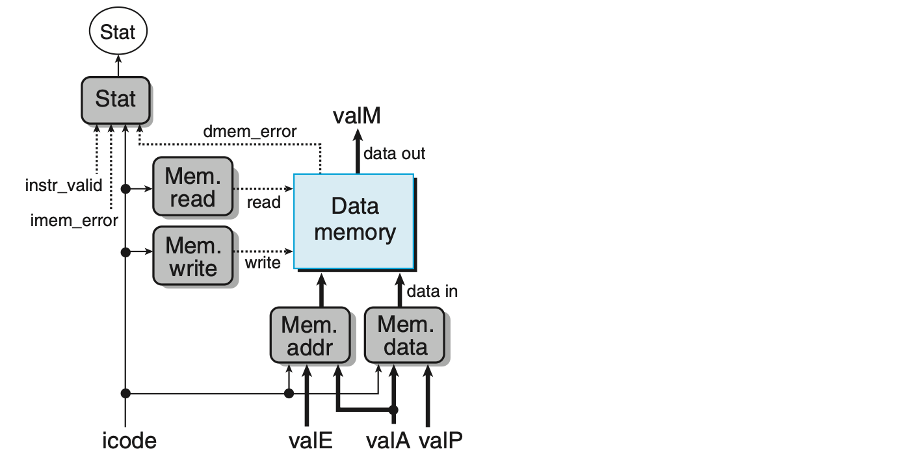

| 图 4.30：SEQ 访存阶段。数据存储器可以写入或读取内存值。从内存读取的值构成信号 valM。|
| :-------------------------------: |

图 4.18 至图 4.21 的访存阶段展示了每类指令所需的内存操作。观察可知，内存读写的地址始终是 valE 或 valA。我们可以用 HCL 描述该块如下：

```hcl
word mem_addr = [
    icode in { IRMMOVQ, IPUSHQ, ICALL, IMRMOVQ } : valE;
    icode in { IPOPQ, IRET } : valA;
    # Other instructions don't need address
];
```

---

**练习题 4.25（答案见第 524 页）**

观察图 4.18 至图 4.21 中不同指令的内存操作，我们可以看到内存写操作的数据始终是 valA 或 valP。为 SEQ 中的信号 mem_data 编写 HCL 代码。

我们只希望对从内存读取数据的指令设置控制信号 mem_read，如以下 HCL 代码所示：

```hcl
bool mem_read = icode in { IMRMOVQ, IPOPQ, IRET };
```

---

**练习题 4.26（答案见第 525 页）**

我们只希望对向内存写入数据的指令设置控制信号 mem_write。为 SEQ 中的信号 mem_write 编写 HCL 代码。

---

<!-- Page 0439 -->

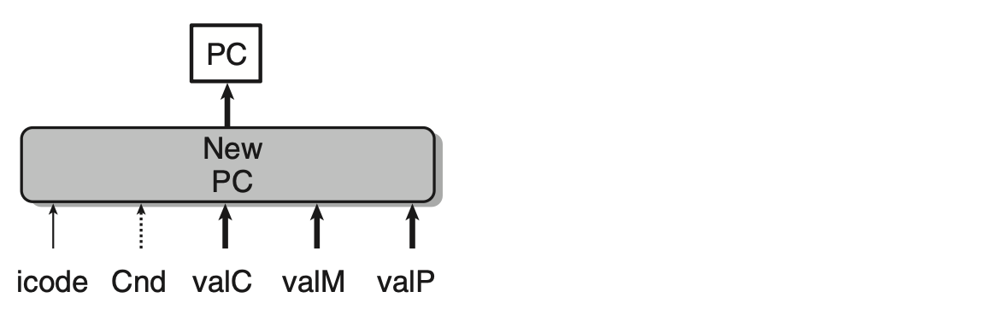

| 图 4.31：SEQ 程序计数器更新阶段。下一个程序计数器值从信号 valC、valM 和 valP 中选取，具体取决于指令码和分支标志。|
| :-------------------------------: |

访存阶段的最后一个功能是根据取指阶段生成的 icode、imem_error 和 instr_valid 值，以及数据存储器生成的信号 dmem_error，计算指令执行的状态码 Stat。

---

**练习题 4.27（答案见第 525 页）**

为 Stat 编写 HCL 代码，生成四种状态码 SAOK、SADR、SINS 和 SHLT（见图 4.26）。

---

**程序计数器更新阶段**

SEQ 中的最后阶段生成程序计数器的新值（见图 4.31）。如图 4.18 至图 4.21 的最后步骤所示，新的程序计数器将是 valC、valM 或 valP，具体取决于指令类型以及是否应采用分支。该选择可以用 HCL 描述如下：

```hcl
word new_pc = [
    # Call. Use instruction constant
    icode == ICALL : valC;
    # Taken branch. Use instruction constant
    icode == IJXX && Cnd : valC;
    # Completion of RET instruction. Use value from stack
    icode == IRET : valM;
    # Default: Use incremented PC
    1 : valP;
];
```

**SEQ 总结**

我们已经完成了 Y86-64 处理器的完整设计。通过将执行每条不同指令所需的步骤组织为统一的流程，我们可以用少量不同的硬件单元以及单一时钟来控制计算时序，从而实现整个处理器。控制逻辑必须在这些单元之间路由信号，并根据指令类型和分支条件生成适当的控制信号。

---

<!-- Page 0440 -->

SEQ 唯一的问题是它太慢了。时钟必须运行得足够慢，以便信号能在单个周期内传播通过所有阶段。例如，考虑对 `ret` 指令的处理。从时钟周期开始时已更新的程序计数器出发，必须从指令存储器读取指令，必须从寄存器文件读取栈指针，算术逻辑单元必须将栈指针加 8，还必须从内存读取返回地址，才能确定程序计数器的下一个值。所有这些都必须在时钟周期结束前完成。

这种实现方式对硬件单元的利用率不高，因为每个单元在整个时钟周期中只有一小部分时间处于活动状态。我们将看到，通过引入流水线，可以实现更好的性能。

## 4.4 流水线的通用原则

在尝试设计流水线化的 Y86-64 处理器之前，让我们先考虑流水线系统的一些通用特性和原则。流水线系统对于曾经在自助餐厅排队取餐或在自动洗车场洗过车的人来说都不陌生。在流水线系统中，要执行的任务被分解为一系列离散的阶段。在自助餐厅，这涉及供应沙拉、主菜、甜点和饮料。在洗车场，这涉及喷水和肥皂水、刷洗、涂蜡和烘干。我们不是让一位顾客从头到尾完成整个序列后再让下一位顾客开始，而是允许多位顾客同时在系统中行进。

流水线的一个关键特性是它增加了系统的吞吐量（即单位时间内服务的顾客数量），但也可能略微增加延迟（即服务单个顾客所需的时间）。例如，在自助餐厅中，只想要甜点的顾客在非流水线系统中可以很快通过，只停在甜点区。而在流水线系统中，试图直接到甜点区的顾客则会引起其他顾客的不满。

### 4.4.1 计算流水线

将焦点转移到计算流水线，"顾客"是指令，而各阶段执行指令执行的某个部分。图 4.32(a) 展示了一个简单的非流水线硬件系统示例。它由执行某种计算的组合逻辑，加上一个用于保存该计算结果的寄存器组成。时钟信号控制寄存器在某个固定时间间隔加载。这类系统的一个例子是 CD 播放器中的解码器。输入信号是从 CD 表面读取的比特，组合逻辑块被实现为组合逻辑，意味着信号将通过一系列逻辑门传播，在经过一定时延后，输出成为输入的某个函数。

---

<!-- Page 0441 -->

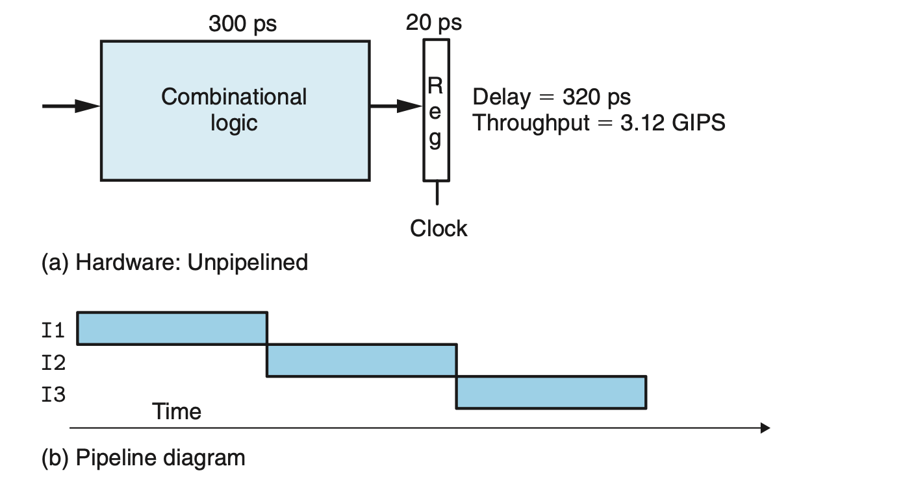

| 图 4.32 非流水线计算硬件。在每个 320 皮秒周期内，系统花 300 皮秒评估组合逻辑函数，花 20 皮秒将结果存入输出寄存器。|
| :-------------------------------: |

在当代逻辑设计中，我们以皮秒（缩写"ps"，即 $10^{-12}$ 秒）为单位测量电路延迟。在本例中，我们假设组合逻辑需要 300 ps，而寄存器加载需要 20 ps。图 4.32 展示了一种称为流水线图的时序图。在该图中，时间从左向右流动。一系列指令（此处命名为 I1、I2 和 I3）从上到下排列。实线矩形指示这些指令被执行的时间段。在此实现中，我们必须在开始下一条指令之前完成当前指令。因此，矩形框在垂直方向上互不重叠。以下公式给出了我们操作该系统的最大速率：

$$Throughput=\frac{1 \text{ instruction}}{(20+300) \text{ picoseconds}}\cdot\frac{1000 \text{ picoseconds}}{1 \text{ nanosecond}}\approx3.12 \text{ GIPS}$$

我们以每秒十亿条指令（缩写 GIPS）为单位表示吞吐量。从开始到结束执行单条指令所需的总时间称为延迟。在该系统中，延迟为 320 ps，是吞吐量的倒数。

假设我们可以将系统执行的计算分为三个阶段 A、B 和 C，每个阶段各需 100 ps，如图 4.33 所示。然后，我们可以在各阶段之间插入流水线寄存器，使每条指令分三步通过系统，从开始到结束需要三个完整的时钟周期。如图 4.33 的流水线图所示，当 I1 从 A 移到 B 时，I2 就可以进入阶段 A，以此类推。在稳定状态下，所有三个阶段都处于活动状态，每个时钟周期有一条指令离开系统，同时有一条新指令进入系统。我们可以在流水线图的第三个时钟周期看到这一点：I1 在阶段 C，I2 在阶段 B，I3 在阶段 A。在这个系统中，我们可以每 $100 + 20 = 120$ 皮秒触发一次时钟，吞吐量约为 8.33 GIPS。由于处理单条指令需要 3 个时钟周期，该流水线的延迟为 $3 \times 120 = 360$ ps。我们以少量额外硬件和延迟略微增加（360/320 = 1.12）的代价，将系统吞吐量提高了 8.33/3.12 = 2.67 倍。延迟的增加是由于增加的流水线寄存器带来的时间开销。

---

<!-- Page 0442 -->

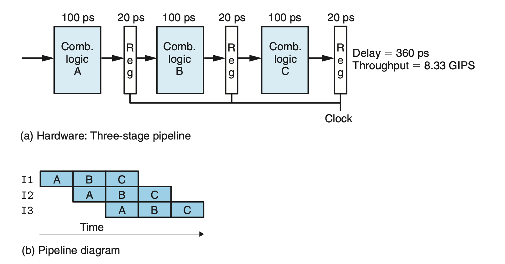

| 图 4.33 三阶段流水线计算硬件。计算被分为阶段 A、B 和 C。在每个 120 ps 周期内，每条指令推进一个阶段。|
| :-------------------------------: |

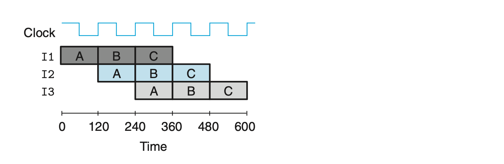

| 图 4.34 三阶段流水线时序。时钟信号的上升沿控制指令从一个流水线阶段移动到下一个阶段。|
| :-------------------------------: |

### 4.4.2 流水线操作详解

为了更好地理解流水线的工作原理，让我们详细研究流水线计算的时序和操作。图 4.34 展示了我们已经研究过的三阶段流水线（图 4.33）的流水线图。指令在流水线阶段之间的传递由时钟信号控制，如流水线图上方所示。每 120 ps，该信号从 0 上升到 1，启动下一组流水线阶段的计算。

图 4.35 追踪了 240 到 360 之间的电路活动，此时指令 I1（深灰色）在阶段 C 中传播，指令 I2（蓝色）在阶段 B 中传播，I3（浅灰色）在阶段 A 中传播。在时刻 240 时钟上升沿之前（位置 ①），指令 I2 在阶段 A 中计算的值已到达第一个流水线寄存器的输入端，但其状态和输出仍保持为指令 I1 在阶段 A 中计算的值。指令 I1 在阶段 B 中计算的值已到达第二个流水线寄存器的输入端。当时钟上升时，这些输入被加载到流水线寄存器中，成为寄存器的输出（位置 ②）。同时，阶段 A 的输入被设置为启动指令 I3 的计算。信号随后通过各阶段的组合逻辑传播（位置 ③）。如位置 ③ 图中弯曲波前所示，信号在不同部分的传播速率可能不同。在时刻 360 之前，结果值到达流水线寄存器的输入端（位置 ④）。当时刻 360 时钟上升时，每条指令已推进通过一个流水线阶段。

---

<!-- Page 0443 -->

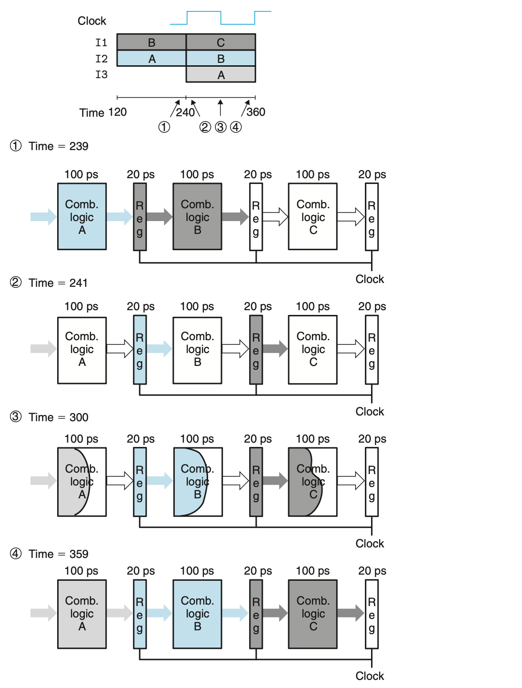

| 图 4.35 一个时钟周期的流水线操作。在时刻 240 时钟上升沿之前（位置 ①），指令 I1（深灰色）和 I2（蓝色）已完成阶段 B 和 A。时钟上升后，这些指令开始通过阶段 C 和 B 传播，而指令 I3（浅灰色）开始通过阶段 A 传播（位置 ② 和 ③）。在时钟再次上升前，各指令的结果已传播到流水线寄存器的输入端（位置 ④）。|
| :-------------------------------: |

---

<!-- Page 0444 -->

从这对流水线操作的详细观察中，我们可以看出：降低时钟频率不会改变流水线行为。信号传播到流水线寄存器的输入端，但在时钟上升之前，寄存器状态不会发生变化。另一方面，如果时钟运行得太快，会产生灾难性后果：值没有时间通过组合逻辑传播，因此时钟上升时寄存器输入尚未有效。

正如我们在 SEQ 处理器时序讨论（第 4.3.3 节）中所见，在组合逻辑块之间设置时钟寄存器这一简单机制，足以控制流水线中指令的流动。随着时钟反复上升和下降，不同指令流经流水线各阶段，互不干扰。

### 4.4.3 流水线的局限性

图 4.33 的例子展示了理想的流水线系统，在该系统中，我们能够将计算分为三个独立阶段，每个阶段所需时间为原始逻辑的三分之一。不幸的是，其他因素往往会降低流水线的有效性。

**不均匀的阶段划分**

图 4.36 展示了一个系统，我们将计算分为三个阶段，但各阶段的延迟从 50 到 150 ps 不等。所有阶段的延迟之和仍为 300 ps。然而，时钟的运行速率受到最慢阶段延迟的限制。如该图中的流水线图所示，阶段 A 在每个时钟周期中将空闲（白色框）100 ps，而阶段 C 将空闲 50 ps。只有阶段 B 会持续活动。我们必须将时钟周期设置为 $150 + 20 = 170$ 皮秒，吞吐量为 5.88 GIPS。此外，由于时钟频率降低，延迟将增加到 510 ps。

将系统计算划分为一系列具有均匀延迟的阶段，对硬件设计者来说可能是一个重大挑战。通常，处理器中的某些硬件单元，如算术逻辑单元和存储器，无法细分为延迟更短的多个单元。这使得创建一组平衡的阶段变得困难。我们在设计流水线化的 Y86-64 处理器时不会关注这一层次的细节，但理解时序优化在实际系统设计中的重要性是有必要的。

---

<!-- Page 0445 -->

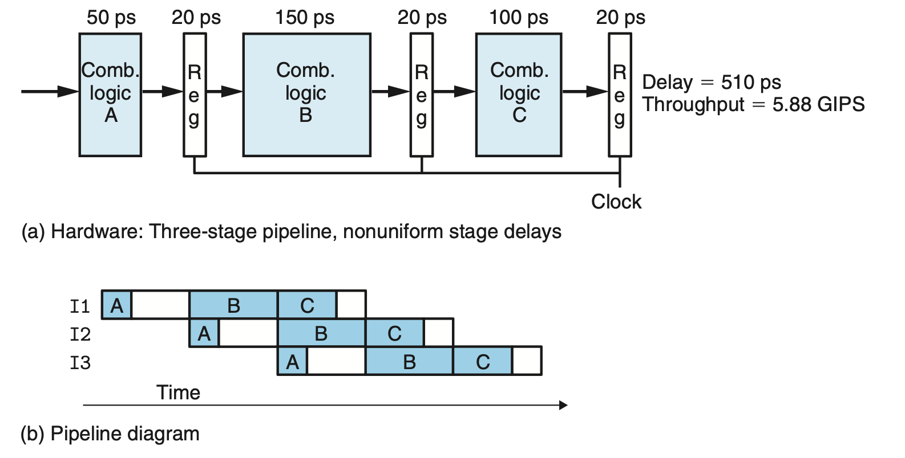

| 图 4.36 不均匀阶段延迟对流水线的限制。系统吞吐量受最慢阶段速度的限制。|
| :-------------------------------: |

---

**练习题 4.28（答案见第 525 页）**

假设我们分析图 4.32 的组合逻辑，发现它可以被分解为一系列六个块，命名为 A 到 F，延迟分别为 80、30、60、50、70 和 10 ps，如下图所示：

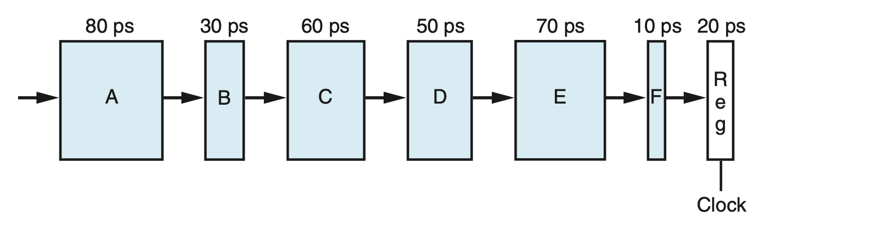

我们可以通过在这些块对之间插入流水线寄存器来创建该设计的流水线版本。根据插入流水线寄存器的位置，会产生不同的流水线深度（阶段数）和最大吞吐量组合。假设流水线寄存器的延迟为 20 ps。

A. 插入单个寄存器得到两阶段流水线。应在何处插入寄存器以最大化吞吐量？吞吐量和延迟各是多少？

B. 应在何处插入两个寄存器，以最大化三阶段流水线的吞吐量？吞吐量和延迟各是多少？

C. 应在何处插入三个寄存器，以最大化四阶段流水线的吞吐量？吞吐量和延迟各是多少？

D. 能产生最大可达吞吐量的最少阶段数是多少？描述该设计、其吞吐量和延迟。

---

<!-- Page 0446 -->

**深度流水线的收益递减**

图 4.37 说明了流水线的另一个局限性。在本例中，我们将计算分为六个阶段，每个阶段需要 50 ps。在每对阶段之间插入流水线寄存器，得到六阶段流水线。该系统的最小时钟周期为 $50 + 20 = 70$ 皮秒，吞吐量为 14.29 GIPS。因此，在将流水线阶段数翻倍的同时，性能提升了 14.29/8.33 = 1.71 倍。即使我们将每个计算块所需的时间减半，也无法实现吞吐量翻倍，这是因为流水线寄存器的延迟。这一延迟成为流水线吞吐量的限制因素。在我们的新设计中，这一延迟占总时钟周期的 28.6%。

现代处理器采用非常深的流水线（15 个或更多阶段），以尽量提高处理器时钟频率。处理器架构师将指令执行分解为大量非常简单的步骤，使每个阶段的延迟非常小。电路设计者仔细设计流水线寄存器以最小化其延迟。芯片设计者还必须仔细设计时钟分配网络，以确保时钟在整个芯片上的同一时刻发生变化。所有这些因素都增加了高速微处理器设计的挑战性。

---

**练习题 4.29（答案见第 526 页）**

假设我们可以将图 4.32 的系统分为任意数量 $k$ 个流水线阶段，每个阶段的延迟为 300/$k$，每个流水线寄存器的延迟为 20 ps。

A：系统的延迟和吞吐量分别作为 $k$ 的函数是多少？

B：吞吐量的最终极限是多少？

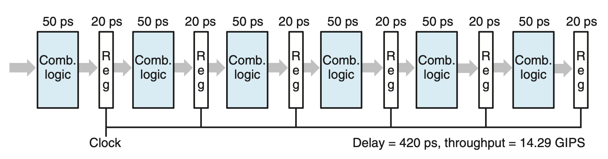

| 图 4.37 流水线开销导致的限制。随着组合逻辑被分为更短的块，寄存器更新的延迟成为限制因素。|
| :-------------------------------: |

---

<!-- Page 0447 -->

### 4.4.4 带反馈的系统流水线化

到目前为止，我们只考虑了通过流水线的对象——无论是汽车、人还是指令——彼此完全独立的系统。然而，对于执行 x86-64 或 Y86-64 等机器程序的系统，连续指令之间存在潜在的依赖关系。例如，考虑以下 Y86-64 指令序列：

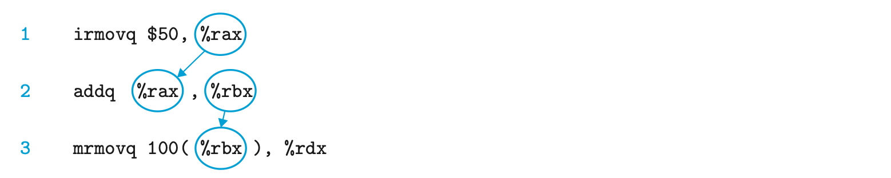

在这三条指令序列中，每对相邻指令之间存在数据依赖，如寄存器名称上的圆圈和它们之间的箭头所示。`irmovq` 指令（第 1 行）将其结果存入 `%rax`，随后 `addq` 指令（第 2 行）必须读取 `%rax`；该指令将其结果存入 `%rbx`，随后 `mrmovq` 指令（第 3 行）必须读取 `%rbx`。

另一种顺序依赖的来源是指令控制流。考虑以下 Y86-64 指令序列：

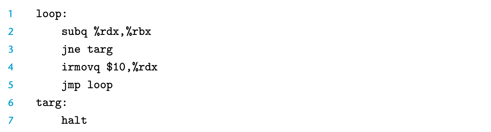

`jne` 指令（第 3 行）创建了一个控制依赖，因为条件测试的结果决定了下一条执行的指令是 `irmovq` 指令（第 4 行）还是 `halt` 指令（第 7 行）。在我们的 SEQ 设计中，这些依赖通过图 4.22 右侧所示的反馈路径来处理。该反馈将更新后的寄存器值传回寄存器文件，并将新的程序计数器值传回程序计数器寄存器。

图 4.38 说明了在包含反馈路径的系统中引入流水线的风险。在原始系统（图 4.38(a)）中，每条在原始系统中的指令结果被反馈给下一条指令。这在流水线图（图 4.38(b)）中有所体现，其中 I1 的结果成为 I2 的输入，依此类推。如果我们尝试以最直接的方式将其转换为三阶段流水线（图 4.38(c)），则系统的行为会发生改变。如图 4.38(c) 所示，I1 的结果变成了 I4 的输入。在试图通过流水线加速系统的过程中，我们改变了系统的行为。

---

<!-- Page 0448 -->

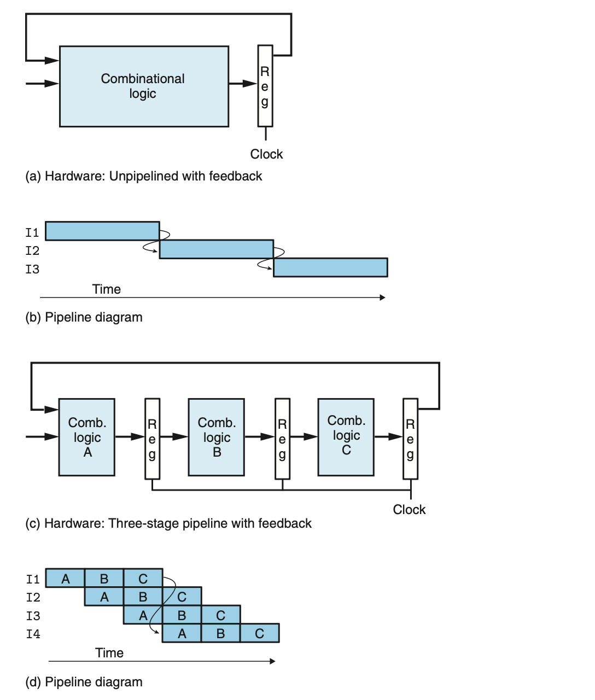

| 图 4.38 由于逻辑依赖对流水线的限制。从带反馈的非流水线系统 (a) 转为流水线系统 (c) 时，系统的计算行为发生了改变，这可以从两个流水线图 (b) 和 (d) 中看出。|
| :-------------------------------: |

---

<!-- Page 0449 -->

在将流水线引入 Y86-64 处理器时，我们必须正确处理反馈效应。显然，像图 4.38 例子中那样改变系统行为是不可接受的。我们必须以某种方式处理指令间的数据和控制依赖，使最终行为与 ISA 定义的模型相匹配。

## 4.5 Y86-64 的流水线实现

我们终于准备好着手本章的主要任务——设计流水线化的 Y86-64 处理器。我们从对顺序处理器 SEQ 进行小改动入手，将程序计数器的计算移入取指阶段。然后在各阶段之间添加流水线寄存器。我们的第一次尝试不能正确处理各种数据依赖和控制依赖。通过一些修改，我们最终实现了一个高效的流水线处理器，能够实现 Y86-64 ISA。

### 4.5.1 SEQ+：重排计算阶段

作为向流水线设计的过渡步骤，我们必须对 SEQ 五个阶段的顺序进行轻微调整，使程序计数器更新阶段出现在时钟周期的开始，而非结束。这种变换只需对整体硬件结构进行最小限度的改动，并且能更好地适应流水线阶段内活动的时序安排。我们将这种修改后的设计称为 SEQ+。

我们可以通过让程序计数器更新阶段的逻辑在时钟周期开始时计算当前指令的程序计数器值，将其移到周期开始处。图 4.39 展示了 SEQ 和 SEQ+ 在程序计数器计算上的差异。对于 SEQ（图 4.39(a)），程序计数器计算发生在时钟周期结束时，根据当前时钟周期内计算的信号值为程序计数器寄存器计算新值。对于 SEQ+（图 4.39(b)），我们创建状态寄存器来保存一条指令执行期间计算的信号。然后，当新的时钟周期开始时，这些值通过完全相同的逻辑传播，计算当前指令的程序计数器。我们将这些寄存器标记为"pIcode"、"pCnd"等，表示在任意给定周期内，它们保存着上一个周期生成的控制信号。

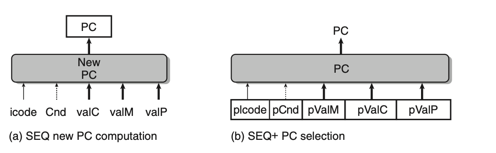

| 图 4.39 程序计数器计算时序的转换。使用 SEQ+，我们在指令执行的第一步就计算当前状态的程序计数器值。|
| :-------------------------------: |

---

<!-- Page 0450 -->

>**旁注 SEQ+ 中程序计数器在哪里？**
>
>SEQ+ 有一个有趣的特点：没有存储程序计数器的硬件寄存器。相反，程序计数器是根据上一条指令存储的一些状态信息动态计算的。这是一个小例证，说明了我们可以以与 ISA 所隐含的概念模型不同的方式实现处理器，只要处理器能正确执行任意机器语言程序即可。我们不需要以程序员可见状态所指示的形式对状态进行编码，只要处理器能为程序员可见状态的任意部分（例如程序计数器）生成正确的值即可。在创建流水线设计时，我们将更多地利用这一原则。乱序执行技术（如第 5.7 节所述）将这一思想发挥到极致，以与机器级程序中完全不同的顺序执行指令。


图 4.40 展示了 SEQ+ 硬件的更详细视图。我们可以看到它包含与 SEQ（图 4.23）中完全相同的硬件单元和控制块，但程序计数器逻辑从顶部（在时钟周期结束时活动）移到了底部（在时钟周期开始时活动）。

从 SEQ 到 SEQ+ 的状态元素移位是一种称为电路重定时（circuit retiming）[68] 的通用变换的例子。重定时在不改变系统逻辑行为的情况下改变系统的状态表示。它经常用于平衡流水线系统各阶段之间的延迟。

### 4.5.2 插入流水线寄存器

在创建流水线 Y86-64 处理器的第一次尝试中，我们在 SEQ+ 的各阶段之间插入流水线寄存器并对信号进行一定的重排，得到 PIPE− 处理器，其中名称中的"−"表示该处理器的性能略低于我们最终的处理器设计。PIPE− 的结构如图 4.41 所示。流水线寄存器在图中以蓝色方框表示，每个方框包含不同的字段，以白色方框显示。由于有多个字段，每个流水线寄存器保存多个字节和字。与两个顺序处理器硬件结构（图 4.23 和图 4.40）中圆角方框标签不同，这些白色方框代表实际的硬件组件。

注意，PIPE− 使用的硬件单元与我们的顺序设计 SEQ（图 4.40）几乎相同，只是各阶段之间由流水线寄存器分隔。两个系统中信号的差异将在第 4.5.3 节中讨论。

流水线寄存器的标记如下：

**F** 保存程序计数器的预测值，稍后将讨论。

**D** 位于取指和译码阶段之间，保存最近取指的指令信息，供译码阶段处理。

**E** 位于译码和执行阶段之间，保存最近译码的指令及从寄存器文件读取的值，供执行阶段处理。

**M** 位于执行和访存阶段之间，保存最近执行指令的结果，供访存阶段处理。它还保存分支条件和分支目标的信息，供处理条件跳转使用。

**W** 位于访存阶段和反馈路径之间，反馈路径将计算结果提供给寄存器文件进行写入，并在完成 `ret` 指令时将返回地址提供给程序计数器选择逻辑。

---

<!-- Page 0451 -->

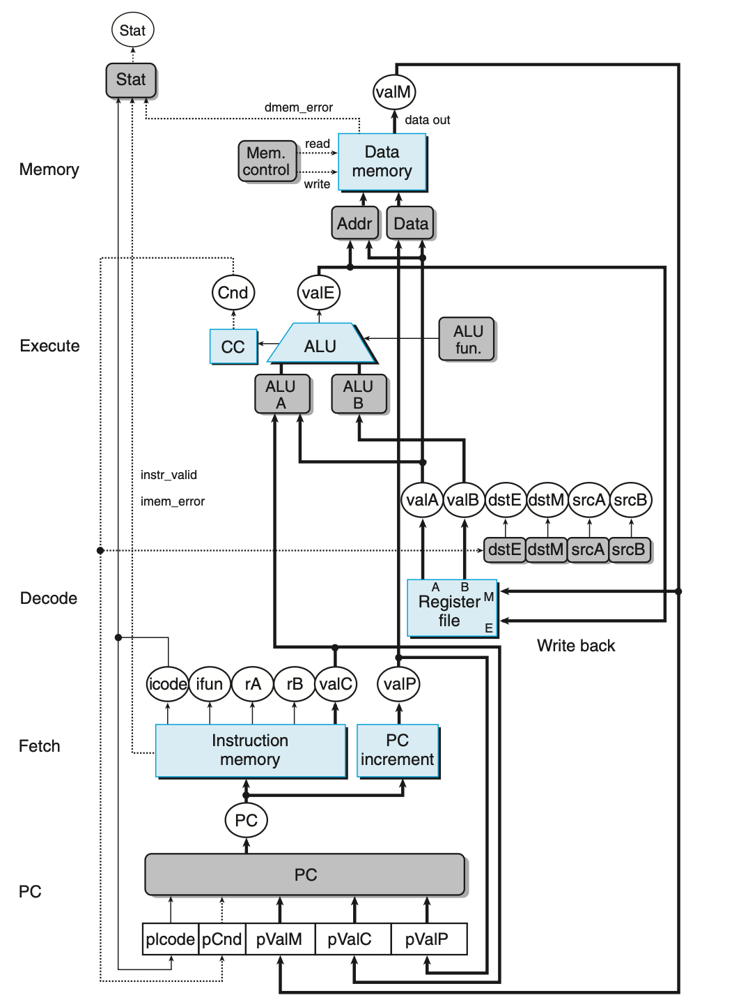

| 图 4.40 SEQ+ 硬件结构。将程序计数器计算从时钟周期结束移至开始，使其更适合流水线化。|
| :-------------------------------: |

---

<!-- Page 0452 -->

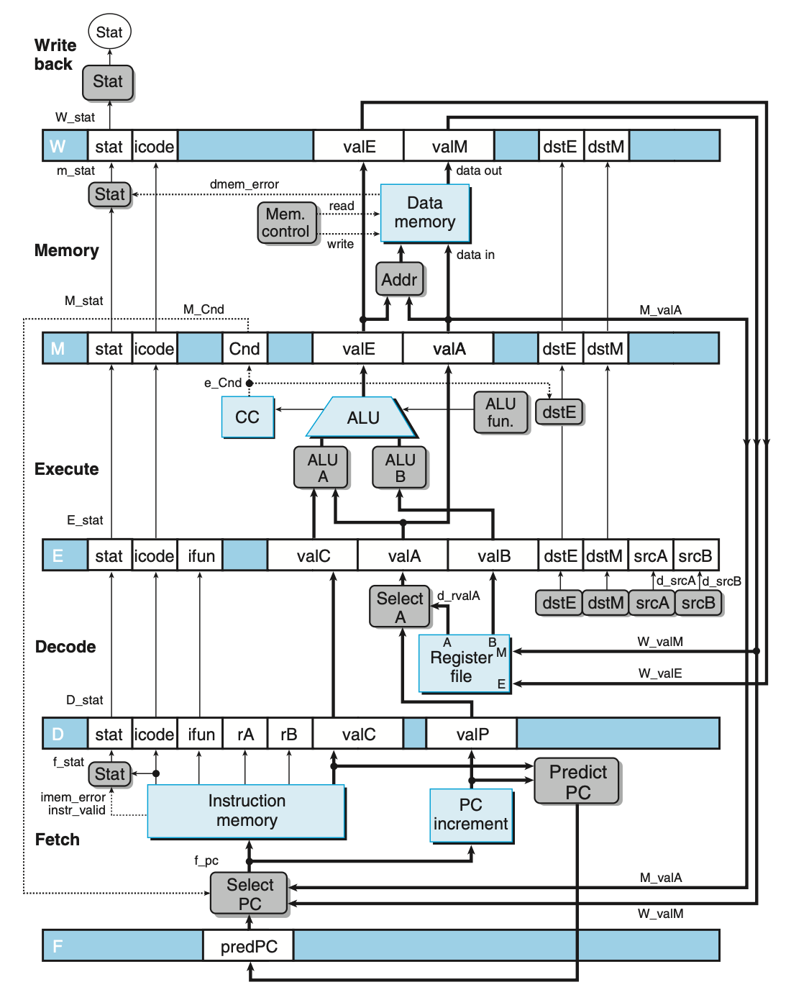

| 图 4.41 PIPE− 的硬件结构（初始流水线实现）。通过在 SEQ+（图 4.40）中插入流水线寄存器，我们创建了一个五阶段流水线。该版本还有一些缺点，稍后将处理。|
| :-------------------------------: |

---

<!-- Page 0453 -->

图 4.42 展示了以下代码序列如何在五阶段流水线中流动，注释中将指令标记为 I1 至 I5 以供参考：

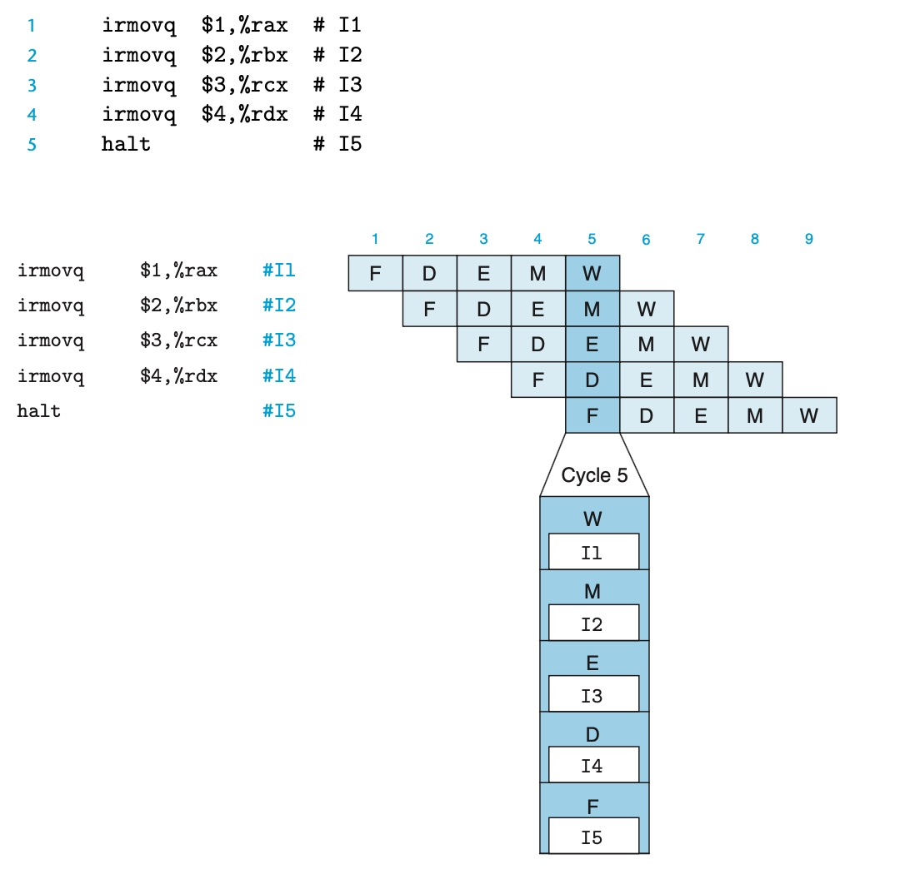

| 图4.42 指令流经流水线的示例。|
| :-------------------------------: |

---

<!-- Page 0454 -->

图的右侧展示了该指令序列的流水线图。与第 4.4 节简单流水线计算单元的流水线图一样，该图展示了每条指令通过各流水线阶段的过程，时间从左向右增加。顶部的数字标识不同阶段发生的时钟周期。例如，在第 1 个周期，指令 I1 被取指，然后继续通过流水线各阶段，其结果在第 5 个周期结束后被写入寄存器文件。指令 I2 在第 2 个周期被取指，其结果在第 6 个周期结束后写回，以此类推。图底部展示了第 5 个周期流水线的展开视图。此时，每个流水线阶段都有一条指令。

从图 4.42 中，我们还可以解释为什么我们约定将处理器绘制为指令从下到上流动。第 5 个周期的展开视图展示了流水线各阶段，取指阶段在底部，写回阶段在顶部，与我们的流水线硬件图（图 4.41）一致。如果我们观察流水线各阶段中指令的顺序，会发现它们与程序清单中的顺序相同。由于程序的正常流程是从上到下，因此我们通过让流水线从下到上流动来保持这种顺序。这种约定在使用本书配套的模拟器时特别有用。

### 4.5.3 信号的重排和重命名

我们的顺序实现 SEQ 和 SEQ+ 每次只处理一条指令，因此 valC、srcA 和 valE 等信号有唯一的值。在我们的流水线设计中，与流经系统的不同指令相关联的这些值将有多个版本。例如，在 PIPE− 的详细结构中，有四个标记为"Stat"的白色方框，它们保存四条不同指令的状态码（见图 4.41）。我们必须非常小心地使用正确版本的信号，否则可能出现严重错误，例如将一条指令计算的结果存储到另一条指令指定的目标寄存器中。

我们采用一种命名方案：存储在流水线寄存器中的信号可以通过在其名称前加上流水线寄存器的大写名称来唯一标识。例如，四个状态码命名为 D_stat、E_stat、M_stat 和 W_stat。我们还需要引用某些刚在阶段内计算的信号，这些信号通过在信号名称前加上阶段名称的第一个小写字母来标记。以状态码为例，我们可以看到取指阶段和访存阶段中标记为"Stat"的控制逻辑块，这些块的输出因此命名为 f_stat 和 m_stat。我们还可以看到，整体处理器的实际状态 Stat 由写回阶段中的一个块根据流水线寄存器 W 中的状态值计算。

SEQ+ 的译码阶段和 PIPE− 的译码阶段都生成信号 dstE 和 dstM，指示值 valE 和 valM 的目标寄存器。在 SEQ+ 中，我们可以将这些信号直接连接到寄存器文件写端口的地址输入。在 PIPE− 中，这些信号在流水线中通过执行和访存阶段传递，只有到达写回阶段时才指向寄存器文件（在各阶段的更详细视图中可以看到）。这样做是为了确保写端口地址和数据输入保存来自同一指令的值。否则，写回阶段会写入写回阶段中指令的值，但使用译码阶段中指令的寄存器 ID。一般原则是：我们希望将特定指令的所有信息保存在单个流水线阶段中。

---

<!-- Page 0455 -->

>**旁注 信号 M_stat 和 m_stat 的区别是什么？**
>
>在我们的命名系统中，大写前缀"D"、"E"、"M"和"W"指流水线寄存器，因此 M_stat 指流水线寄存器 M 的状态码字段。小写前缀"f"、"d"、"e"、"m"和"w"指流水线阶段，因此 m_stat 指控制逻辑块在访存阶段生成的状态信号。
>
>理解这一命名约定对于理解我们流水线处理器的操作至关重要。

PIPE− 中有一个块在 SEQ+ 中没有完全相同的形式，即译码阶段中标记为"Select A"的块。该块通过选择流水线寄存器 D 中的 valP 或从寄存器文件 A 端口读取的值，为流水线寄存器 E 生成值 valA。包含该块的目的是减少必须传递给流水线寄存器 E 和 M 的状态量。在所有不同的指令中，只有 call 需要在访存阶段使用 valP。只有跳转指令需要在执行阶段使用 valP 的值（在分支未被采用时）。这些指令都不需要从寄存器文件读取的值。因此，通过合并这两个信号并作为单一信号 valA 传递，我们可以减少流水线寄存器状态量。这消除了 SEQ（图 4.23）和 SEQ+（图 4.40）中标记为"Data"的块的需要，该块的作用类似。在硬件设计中，仔细识别信号的使用方式，然后通过合并这样的信号来减少寄存器状态和连线量，是常见的做法。

如图 4.41 所示，流水线寄存器包含状态码 stat 字段，该字段最初在取指阶段计算，在访存阶段可能被修改。我们将在第 4.5.6 节讨论如何实现异常事件的处理，届时我们已经介绍了正常指令执行的实现。目前只需说明：最系统的方法是在每条指令通过流水线时与其关联一个状态码，如图中所示。

### 4.5.4 下一个程序计数器预测

在 PIPE− 的设计中，我们已采取一些措施来正确处理控制依赖。流水线设计的目标是每个时钟周期发射一条新指令，即每个时钟周期都有一条新指令进入执行阶段并最终完成。实现这一目标将产生每个周期一条指令的吞吐量。为此，我们必须在取指当前指令后立即确定下一条指令的位置。不幸的是，如果取指的指令是条件分支，我们要等到几个周期之后，指令通过执行阶段后才能知道是否应采用分支。类似地，如果取指的指令是 `ret`，我们要等到指令通过访存阶段后才能确定返回位置。

---

<!-- Page 0456 -->

>**旁注 其他分支预测策略**
>
>我们的设计采用"总是预测采用"（always taken）分支预测策略。研究表明，该策略的成功率约为 60%[44, 122]。相反，"总是预测不采用"（never taken，NT）策略的成功率约为 40%。一种稍微复杂的策略称为"后向采用、前向不采用"（backward taken, forward not taken，BTFNT），预测跳转到比下一条指令地址更低地址的分支将被采用，而跳转到更高地址的分支不被采用。该策略的成功率约为 65%。这种改进源于这样一个事实：循环由后向分支封闭，且循环通常执行多次；而前向分支用于条件操作，这类分支不太可能被采用。在习题 4.55 和 4.56 中，你可以修改 Y86-64 流水线处理器来实现 NT 和 BTFNT 分支预测策略。
>
>如第 3.6.6 节所述，错误预测的分支会显著降低程序性能，因此在可能时尽量使用条件数据传送而非条件控制传送。

除条件跳转指令和 `ret` 外，我们可以根据取指阶段计算的信息确定下一条指令的地址。对于 `call` 和 `jmp`（无条件跳转），下一条指令的地址将是 valC（指令中的常量字），而对于所有其他指令，则是 valP（下一条指令的地址）。因此，在大多数情况下，通过预测程序计数器的下一个值，我们可以实现每个时钟周期发射一条新指令的目标。对于大多数指令类型，我们的预测将完全可靠。对于条件跳转，我们可以预测分支被采用（新程序计数器值为 valC）或不被采用（新程序计数器值为 valP）。在任何情况下，我们都必须以某种方式处理预测错误的情况，即我们取指并部分执行了错误的指令。我们将在第 4.5.8 节回到这个问题。

这种猜测分支方向然后根据猜测开始取指的技术称为分支预测（branch prediction）。几乎所有处理器都以某种形式使用分支预测。关于预测分支是否被采用的有效策略，已经进行了大量实验研究[46，第 2.3 节]。一些系统为此任务专用了大量硬件。在我们的设计中，我们将使用预测条件分支总是被采用的简单策略，因此我们将预测程序计数器的新值为 valC。

对于 `ret` 指令产生的新程序计数器值，我们仍然面临预测问题。与条件跳转不同，我们有几乎无限多的可能结果，因为返回地址将是栈顶的任意字。在我们的设计中，我们不会尝试预测任何返回地址的值。相反，我们将简单地暂停处理任何更多指令，直到 `ret` 指令通过写回阶段。我们将在第 4.5.8 节回到这部分实现。

---

<!-- Page 0457 -->

>**旁注 使用栈进行返回地址预测**
>
>对于大多数程序，预测返回地址非常容易，因为过程调用和返回成对出现。大多数时候，当过程被调用时，它会返回到调用后面的指令。高性能处理器利用这一特性，在取指单元中包含一个硬件栈，保存过程调用指令生成的返回地址。每次执行过程调用指令时，其返回地址被压入栈中。当取指一条返回指令时，从该栈顶弹出一个值用作预测的返回地址。与分支预测一样，必须提供一种机制，用于在预测错误时进行恢复，因为有时调用和返回不匹配。一般来说，预测非常可靠。该硬件栈不属于程序员可见状态。

PIPE− 的取指阶段（如图 4.41 底部所示）负责预测程序计数器的下一个值并选择实际用于取指的程序计数器。我们可以看到，标记为"Predict PC"的块可以选择 valP（由程序计数器增量器计算）或 valC（来自取指的指令）。该值作为程序计数器的预测值存储在流水线寄存器 F 中。标记为"Select PC"的块类似于 SEQ+ 程序计数器选择阶段（图 4.40）中标记为"PC"的块。它从三个值中选择一个作为指令存储器的地址：预测的程序计数器、到达流水线寄存器 M 的未采用分支指令的 valP 值（存储在寄存器 M_valA 中），或 `ret` 指令到达流水线寄存器 W 时的返回地址值（存储在 W_valM 中）。

### 4.5.5 流水线冒险

我们的结构 PIPE− 是创建流水线 Y86-64 处理器的良好开端。但回顾第 4.4.4 节的讨论，在包含反馈的系统中引入流水线可能会在连续指令之间存在依赖关系时产生问题。在完成设计之前，我们必须解决这一问题。这些依赖可以分为两种形式：（1）数据依赖，即一条指令计算的结果被后续指令用作数据；（2）控制依赖，即一条指令决定后续指令的位置，如执行跳转、调用或返回时。当这些依赖有可能导致流水线的错误计算时，它们被称为冒险（hazard）。与依赖一样，冒险可分为数据冒险和控制冒险。我们先关注数据冒险，然后再考虑控制冒险。

---

<!-- Page 0458 -->

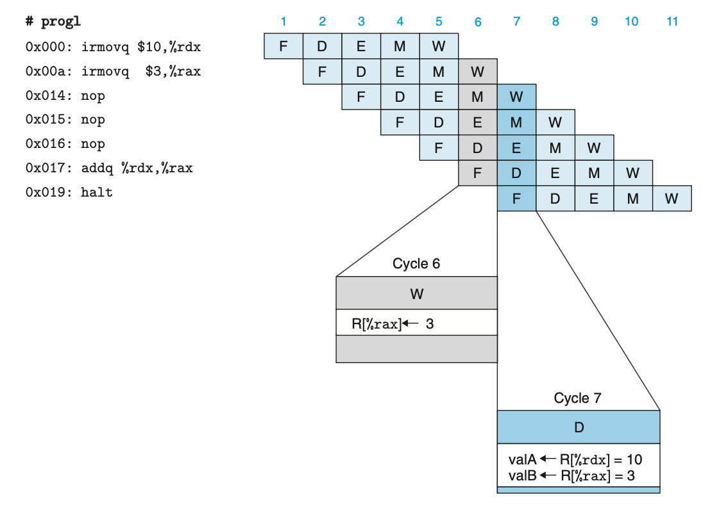

| 图 4.43 在没有特殊流水线控制的情况下对 prog1 的流水线执行。在第 6 个周期，第二条 irmovq 将其结果写入程序寄存器 %rax。addq 指令在第 7 个周期读取其源操作数，因此可以得到 %rdx 和 %rax 的正确值。|
| :-------------------------------: |

图 4.43 说明了 PIPE− 处理器对我们称之为 prog1 的指令序列的处理过程。在本例及后续示例中，我们假设程序寄存器初始值均为 0。该代码将值 10 和 3 加载到程序寄存器 %rdx 和 %rax 中，执行三条 `nop` 指令，然后将寄存器 %rdx 与 %rax 相加。我们将注意力集中在两条 `irmovq` 指令与 `addq` 指令之间的数据依赖所产生的潜在数据冒险上。图的右侧展示了该指令序列的流水线图。第 6 和第 7 个周期的流水线阶段在流水线图中高亮显示。图下方展示了第 6 个周期写回活动和第 7 个周期译码活动的展开视图。在第 7 个周期开始后，两条 `irmovq` 指令都已通过写回阶段，因此寄存器文件保存了 %rdx 和 %rax 的更新值。`addq` 指令在第 7 个周期通过译码阶段时，将读取其源操作数的正确值。两条 `irmovq` 指令与 `addq` 指令之间的数据依赖在本例中没有造成数据冒险。

我们看到 prog1 能正确流过我们的流水线并得到正确结果，因为三条 `nop` 指令在具有数据依赖关系的指令之间造成了延迟。让我们看看去掉这些 `nop` 指令后会发生什么。图 4.44 说明了名为 prog2 的程序的流水线流程——在生成寄存器 %rdx 和 %rax 值的两条 `irmovq` 指令与以这两个寄存器为操作数的 `addq` 指令之间包含两条 `nop` 指令。在本例中，关键步骤发生在第 6 个周期，此时 addq 指令从寄存器文件读取其操作数。图下方展示了该周期内流水线活动的展开视图。第一条 `irmovq` 指令已通过写回阶段，因此程序寄存器 %rdx 已在寄存器文件中更新。第二条 `irmovq` 指令在该周期处于写回阶段，因此对程序寄存器 %rax 的写入只在第 7 个周期时钟上升沿时发生。结果，对于寄存器 %rax 将读取错误值零（回忆我们假设所有寄存器初始值均为零），因为该寄存器的待写入操作尚未发生。显然，我们必须对流水线进行调整以正确处理这种冒险。

---

<!-- Page 0459 -->

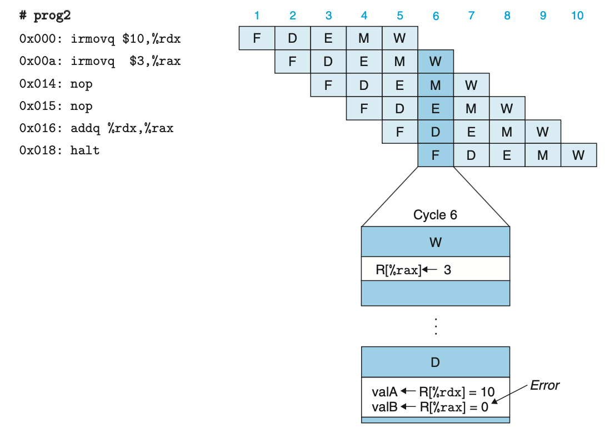

| 图 4.44 在没有特殊流水线控制的情况下对 prog2 的流水线执行。对程序寄存器 %rax 的写入直到第 7 个周期开始才发生，因此 addq 指令在译码阶段获得了该寄存器的错误值。|
| :-------------------------------: |

图 4.45 展示了在 `irmovq` 指令和 `addq` 指令之间只有一条 `nop` 指令时的情况，即程序 prog3。现在我们必须检查第 5 个周期内 `addq` 指令通过译码阶段时的流水线行为。不幸的是，对寄存器 %rdx 的待写入操作仍在写回阶段，对 %rax 的待写入操作仍在访存阶段。因此，addq 指令的两个操作数都将获得错误值。

---

<!-- Page 0460 -->

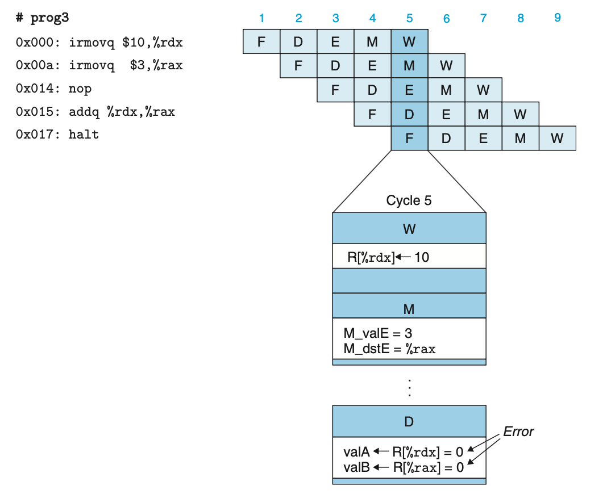

| 图 4.45 在没有特殊流水线控制的情况下对 prog3 的流水线执行。在第 5 个周期，addq 指令从寄存器文件读取其源操作数。对寄存器 %rdx 的待写入操作仍在写回阶段，对寄存器 %rax 的待写入操作仍在访存阶段。两个操作数 valA 和 valB 都得到错误值。|
| :-------------------------------: |

图 4.46 展示了在 `irmovq` 指令和 `addq` 指令之间去掉所有 `nop` 指令时的情况，即程序 prog4。现在我们必须检查第 4 个周期内 `addq` 指令通过译码阶段时的流水线行为。不幸的是，对寄存器 %rdx 的待写入操作仍在访存阶段，而 %rax 的新值正在执行阶段被计算。因此，`addq` 指令的两个操作数都将获得错误值。

这些例子说明，当一条指令的操作数被前面三条指令中的任何一条更新时，就可能出现数据冒险。这些冒险的出现是因为我们的流水线处理器在译码阶段从寄存器文件读取指令的操作数，但要到三个周期之后，指令通过写回阶段后，才将指令的结果写入寄存器文件。

---

<!-- Page 0461 -->

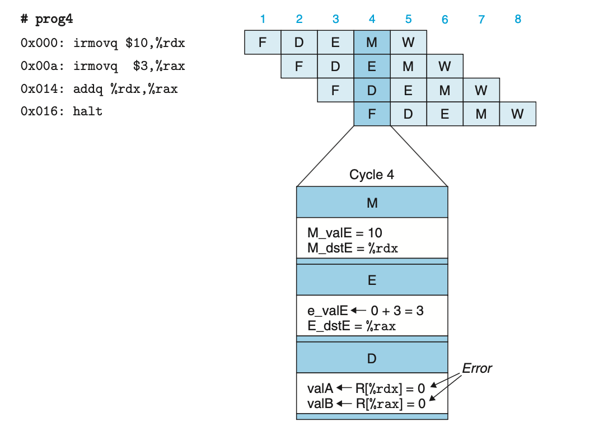

| 图 4.46 在没有特殊流水线控制的情况下对 prog4 的流水线执行。在第 4 个周期，addq 指令从寄存器文件读取其源操作数。对寄存器 %rdx 的待写入操作仍在访存阶段，寄存器 %rax 的新值正在执行阶段被计算。两个操作数 valA 和 valB 都得到错误值。|
| :-------------------------------: |

**通过暂停避免数据冒险**

一种非常通用的避免冒险的技术是暂停（stalling），即处理器将一条或多条指令在流水线中阻塞，直到冒险条件不再成立。我们的处理器可以通过将某条指令阻塞在译码阶段来避免数据冒险，直到生成其源操作数的指令已通过写回阶段。该机制的详细内容将在第 4.5.8 节讨论，它涉及对流水线控制逻辑的简单增强。暂停的效果如图 4.47（prog2）和图 4.48（prog4）所示（我们省略了 prog3，因为它的操作与另外两个例子类似）。当 `addq` 指令处于译码阶段时，流水线控制逻辑检测到执行、访存或写回阶段中至少有一条指令将更新寄存器 %rdx 或 %rax。它不是让 `addq` 指令带着错误结果通过该阶段，而是将其阻塞，使其在译码阶段额外停留一个（prog2）或三个（prog4）周期。对于三个程序，`addq` 指令最终都在第 7 个周期获得其两个源操作数的正确值，然后继续流经流水线。

---

<!-- Page 0462 -->

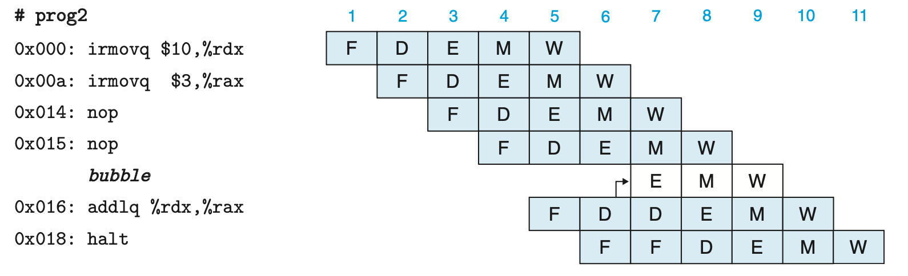

| 图 4.47 使用暂停对 prog2 的流水线执行。在第 6 个周期译码 addq 指令后，暂停控制逻辑检测到写回阶段中对寄存器 %rax 的待写入操作导致数据冒险。它向执行阶段注入一个气泡，并在第 7 个周期重复对 addq 指令的译码。实际上，机器动态插入了一条 nop 指令，产生与 prog1（图 4.43）相似的流程。|
| :-------------------------------: |

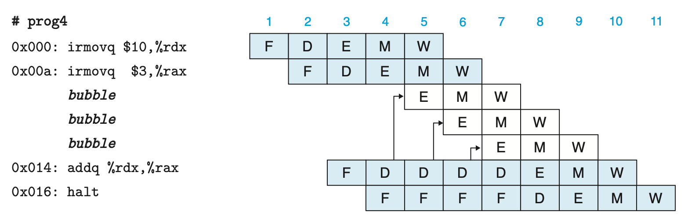

| 图 4.48 使用暂停对 prog4 的流水线执行。在第 4 个周期译码 addq 指令后，暂停控制逻辑检测到两个源寄存器的数据冒险。它向执行阶段注入一个气泡，并在第 5 个周期重复对 addq 指令的译码。它再次检测到两个源寄存器的冒险，注入一个气泡，并在第 6 个周期重复对 addq 指令的译码。此时仍检测到源寄存器 %rax 的冒险，注入一个气泡，并在第 7 个周期重复对 addq 指令的译码。实际上，机器动态插入了三条 nop 指令，产生与 prog1（图 4.43）相似的流程。|
| :-------------------------------: |

在将 `addq` 指令阻塞在译码阶段的同时，我们还必须将其后面的 `halt` 指令阻塞在取指阶段。我们可以通过保持程序计数器的固定值来实现这一点，使 `halt` 指令在暂停完成之前被反复取指。

暂停涉及在某些阶段阻塞一组指令，同时允许其他指令继续流经流水线。对于那些通常会处理 `addq` 指令的阶段，每次我们在译码阶段阻塞一条指令时，就向执行阶段注入一个气泡来处理这些情况。气泡类似于动态生成的空指令——它不会对寄存器、内存、条件码或程序状态造成任何改变。这些气泡在图 4.47 和图 4.48 的流水线图中以白色方框表示。在这些图中，`addq` 指令的"D"框与一个流水线气泡的"E"框之间的箭头表示：在执行阶段注入了气泡，取代了通常会从译码阶段流向执行阶段的 `addq` 指令。我们将在第 4.5.8 节详细讨论使流水线暂停和注入气泡的机制。

---

<!-- Page 0463 -->

>**旁注 数据冒险的分类**
>
>当一条指令更新了后续指令将要读取的程序状态的某个部分时，就可能发生冒险。对于 Y86-64，程序状态包括程序寄存器、程序计数器、内存、条件码寄存器和状态寄存器。让我们看看我们提出的设计中，对于每种形式的状态可能出现的冒险情况。
>
>**程序寄存器**：这些是我们已经识别的冒险。它们的产生是因为寄存器文件在一个阶段被读取，在另一个阶段被写入，导致不同指令之间可能发生意外的相互作用。
>
>**程序计数器**：更新和读取程序计数器之间的冲突会产生控制冒险。当我们的取指阶段逻辑在取指下一条指令之前能正确预测程序计数器的新值时，不会产生冒险。错误预测的分支和 `ret` 指令需要特殊处理，将在第 4.5.5 节讨论。
>
>**内存**：数据存储器的写和读都发生在访存阶段。当读取内存的指令到达该阶段时，任何前面写入内存的指令都已完成写入。另一方面，在访存阶段写数据的指令与取指阶段读取指令之间可能存在干扰，因为指令存储器和数据存储器共用同一个地址空间。这只在含有自修改代码的程序中才会发生，即指令将某个内存区域写入，后来又从该区域取指。一些系统有复杂的机制来检测和避免此类冒险，而其他系统则简单地规定程序不应使用自修改代码。为简单起见，我们假设程序不会自修改，因此不需要采取特殊措施在程序执行期间根据数据存储器的更新来更新指令存储器。
>
>**条件码寄存器**：由执行阶段的整数运算写入，由执行阶段的条件传送和访存阶段的条件跳转读取。当条件传送或跳转到达执行阶段时，任何前面的整数运算都已完成该阶段。不会产生冒险。
>
>**状态寄存器**：程序状态可能会受到流经流水线的指令的影响。我们将状态码与流水线中每条指令关联的机制，使处理器能在异常发生时有序停机，将在第 4.5.6 节讨论。
>
>这一分析表明，我们只需处理寄存器数据冒险、控制冒险，以及确保正确处理异常。这种系统分析对设计复杂系统非常重要——它可以识别实现系统的潜在困难，并指导生成用于检验系统正确性的测试程序。

---

<!-- Page 0464 -->

通过使用暂停来处理数据冒险，我们实际上通过动态生成 prog1（图 4.43）所展示的流水线流程来执行程序 prog2 和 prog4。为 prog2 注入一个气泡，为 prog4 注入三个气泡，其效果与在第二条 `irmovq` 指令和 `addq` 指令之间插入三条 `nop` 指令相同。该机制可以较容易地实现（见习题 4.53），但性能不佳。在许多情况下，一条指令更新某个寄存器，紧随其后的指令又使用同一寄存器。这将导致流水线暂停最多三个周期，大幅降低整体吞吐量。

**通过转发避免数据冒险**

我们的 PIPE− 设计在译码阶段从寄存器文件读取源操作数，但写回阶段可能存在对其中一个源寄存器的待写入操作。与其暂停等待写入完成，不如将即将写入的值直接传递给流水线寄存器 E 作为源操作数。图 4.49 展示了这一策略，以 prog2 第 6 个周期流水线图的展开视图为例。译码阶段逻辑检测到寄存器 %rax 是操作数 valB 的源寄存器，且写端口 E 上也有对 %rax 的待写入操作。因此，它可以通过简单地使用提供给端口 E 的数据字（信号 W_valE）作为操作数 valB 的值来避免暂停。这种将结果值直接从一个流水线阶段传递到较早阶段的技术通常称为数据转发（data forwarding，简称转发，有时也称旁路 bypassing）。它允许 prog2 的指令无需暂停地通过流水线。数据转发需要在基本硬件结构中添加额外的数据连接和控制逻辑。

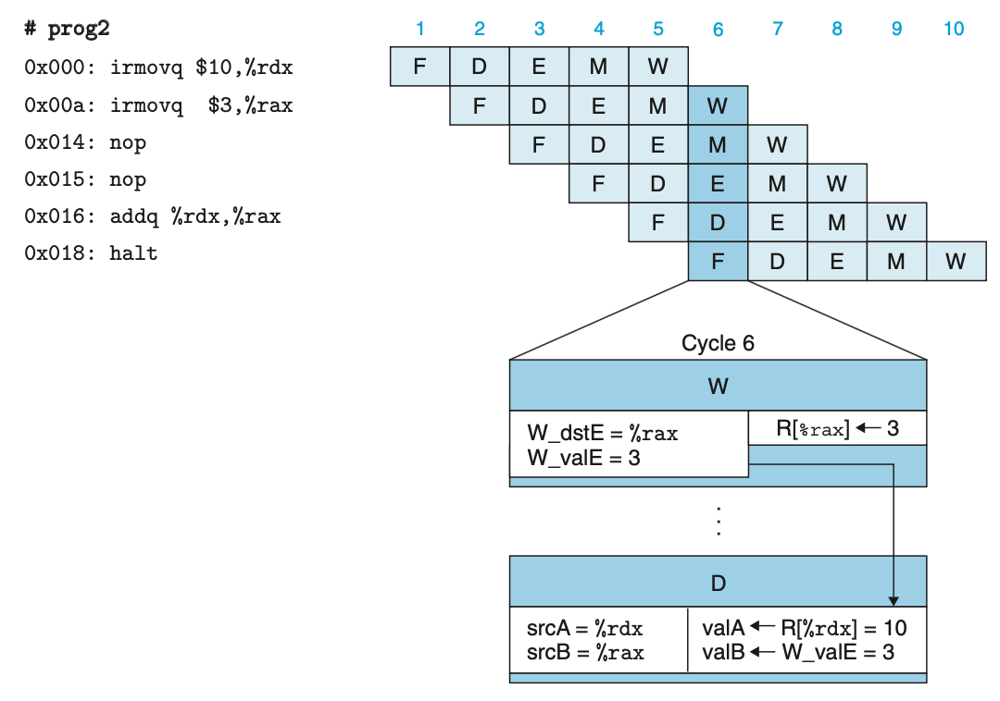

| 图 4.49 使用转发对 prog2 的流水线执行。在第 6 个周期，译码阶段逻辑检测到写回阶段中对寄存器 %rax 存在待写入操作。它将该值用于源操作数 valB，而不是从寄存器文件读取的值。|
| :-------------------------------: |

---

<!-- Page 0465 -->

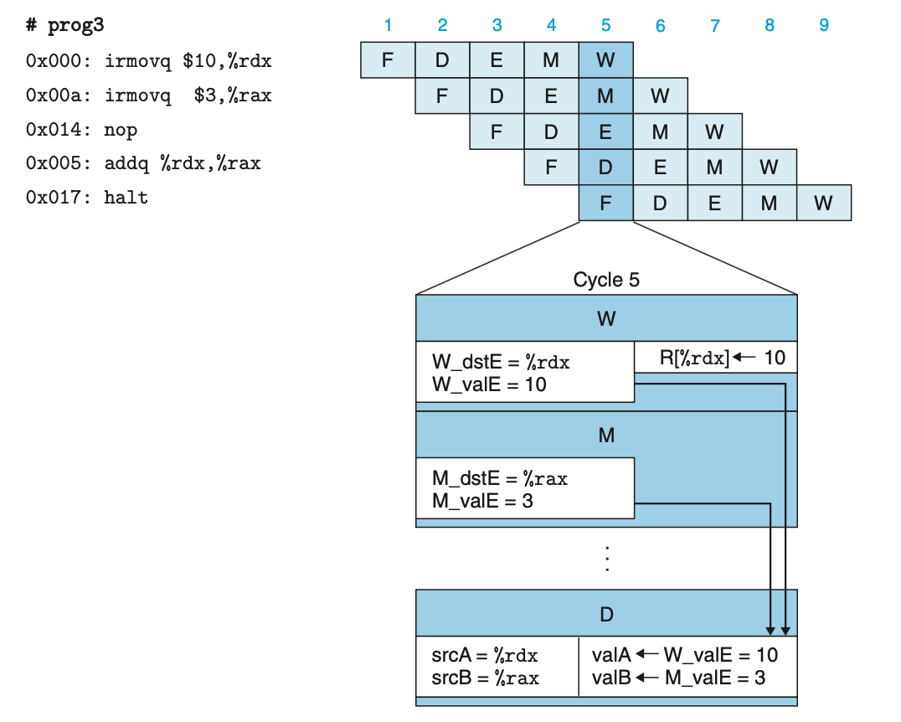

| 图 4.50 使用转发对 prog3 的流水线执行。在第 5 个周期，译码阶段逻辑检测到写回阶段中对寄存器 %rdx 存在待写入操作，访存阶段中对寄存器 %rax 存在待写入操作。它将这些值分别用于 valA 和 valB，而不是从寄存器文件读取的值。|
| :-------------------------------: |

如图 4.50 所示，当访存阶段存在对某寄存器的待写入操作时，也可以使用数据转发，从而避免程序 prog3 的暂停。在第 5 个周期，译码阶段逻辑检测到写回阶段端口 E 上有对寄存器 %rdx 的待写入操作，以及对寄存器 %rax 的待写入操作正在通往端口 E 但仍在访存阶段。与其暂停等待写入发生，不如使用写回阶段的值（信号 W_valE）作为操作数 valA，以及访存阶段的值（信号 M_valE）作为操作数 valB。

---

<!-- Page 0466 -->

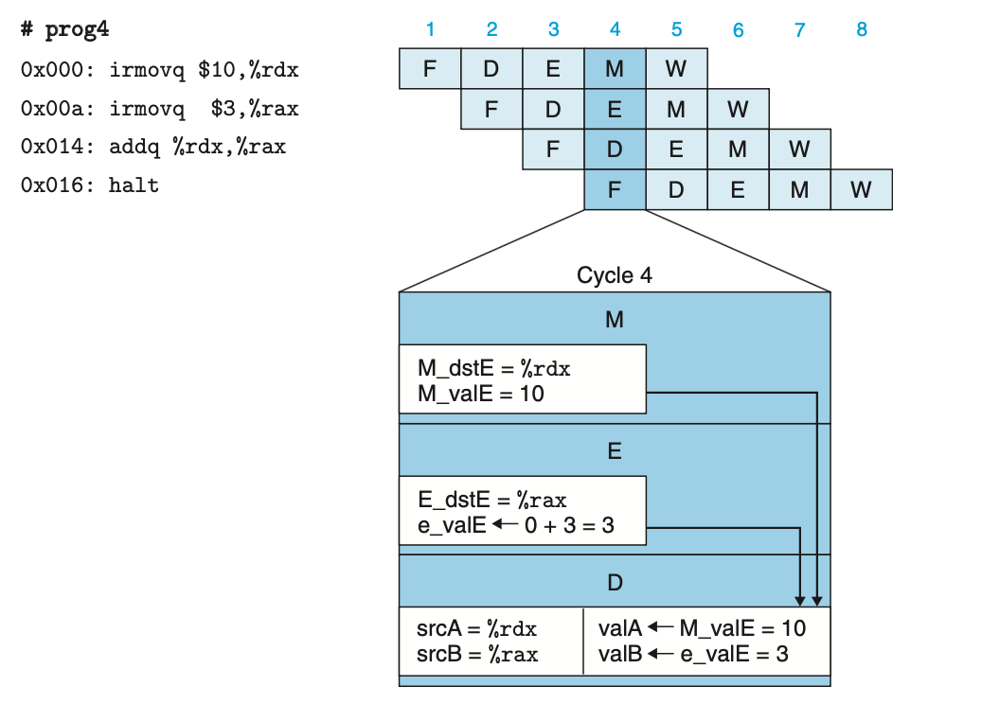

| 图 4.51 使用转发对 prog4 的流水线执行。在第 4 个周期，译码阶段逻辑检测到访存阶段中对寄存器 %rdx 存在待写入操作。它还检测到执行阶段正在计算寄存器 %rax 的新值。它将这些值分别用于 valA 和 valB，而不是从寄存器文件读取的值。|
| :-------------------------------: |

为充分利用数据转发，我们还可以将执行阶段新计算的值传递给译码阶段，从而避免程序 prog4 的暂停，如图 4.51 所示。在第 4 个周期，译码阶段逻辑检测到访存阶段中对寄存器 %rdx 有待写入操作，以及执行阶段的算术逻辑单元正在计算的值稍后将写入寄存器 %rax。它可以使用访存阶段的值（信号 M_valE）作为操作数 valA，并使用算术逻辑单元输出（信号 e_valE）作为操作数 valB。注意，使用算术逻辑单元输出不会引入任何时序问题。译码阶段只需要在时钟周期结束前生成信号 valA 和 valB，以便在时钟上升沿启动下一个周期时，流水线寄存器 E 可以加载译码阶段的结果。算术逻辑单元输出将在此之前有效。

程序 prog2 至 prog4 中展示的转发，都涉及由算术逻辑单元生成并发往写端口 E 的值的转发。转发也可以用于从内存读取并发往写端口 M 的值。从访存阶段，我们可以转发刚从数据存储器读取的值（信号 m_valM）。从写回阶段，我们可以转发对端口 M 的待写入操作（信号 W_valM）。这样总共有五个不同的转发源（e_valE、m_valM、M_valE、W_valM 和 W_valE）和两个不同的转发目的地（valA 和 valB）。

---

<!-- Page 0467 -->

图 4.49 至图 4.51 的展开视图还展示了译码阶段逻辑如何确定是使用寄存器文件中的值还是使用转发值。与每个将被写回寄存器文件的值相关联的是目标寄存器 ID。逻辑可以将这些 ID 与源寄存器 ID srcA 和 srcB 进行比较，以检测转发的情况。可能有多个目标寄存器 ID 与某个源 ID 匹配。我们必须在不同转发源之间建立优先级来处理这种情况，这将在我们研究转发逻辑的详细设计时讨论。

图 4.52 展示了 PIPE 的结构，它是 PIPE− 的扩展版本，能够通过转发处理数据冒险。将其与 PIPE−（图 4.41）的结构相比较，可以看到五个转发源的值被反馈到译码阶段中标记为"Sel+Fwd A"和"Fwd B"的两个块。标记为"Sel+Fwd A"的块将 PIPE− 中标记为"Select A"的块的作用与转发逻辑结合在一起。它允许流水线寄存器 E 的 valA 既可以是递增后的程序计数器 valP、从寄存器文件 A 端口读取的值，也可以是转发值之一。标记为"Fwd B"的块实现源操作数 valB 的转发逻辑。

**加载/使用数据冒险**

有一类数据冒险不能纯粹通过转发来处理，因为内存读取在流水线中发生较晚。图 4.53 说明了一个加载/使用冒险的例子，其中一条指令（地址 0x028 处的 `mrmovq`）从内存中读取寄存器 %rax 的值，而下一条指令（地址 0x032 处的 `addq`）需要该值作为源操作数。图下方展示了第 7 和第 8 个周期的展开视图（假设所有程序寄存器初始值为 0）。`addq` 指令在第 7 个周期需要该寄存器的值，但 `mrmovq` 指令直到第 8 个周期才生成该值。为了从 `mrmovq` "转发"到 `addq`，转发逻辑必须让值在时间上倒退！由于这显然不可能，我们必须找到其他机制来处理这种形式的数据冒险。（寄存器 %rbx 的数据冒险——其值由地址 0x01e 处的 `irmovq` 指令生成，由地址 0x032 处的 `addq` 指令使用——可以通过转发来处理。）

如图 4.54 所示，我们可以通过暂停和转发的组合来避免加载/使用数据冒险。这需要对控制逻辑进行修改，但可以使用现有的旁路路径。当 `mrmovq` 指令通过执行阶段时，流水线控制逻辑检测到译码阶段的指令（`addq`）需要从内存读取的结果。它将译码阶段的指令阻塞一个周期，向执行阶段注入一个气泡。如第 8 个周期的展开视图所示，从内存读取的值可以从访存阶段转发给译码阶段中的 `addq` 指令。寄存器 %rbx 的值也从写回阶段转发到访存阶段。如流水线图中第 7 个周期"D"框与第 8 个周期"E"框之间的箭头所示，注入的气泡替换了通常会继续流经流水线的 `addq` 指令。

---

<!-- Page 0468 -->

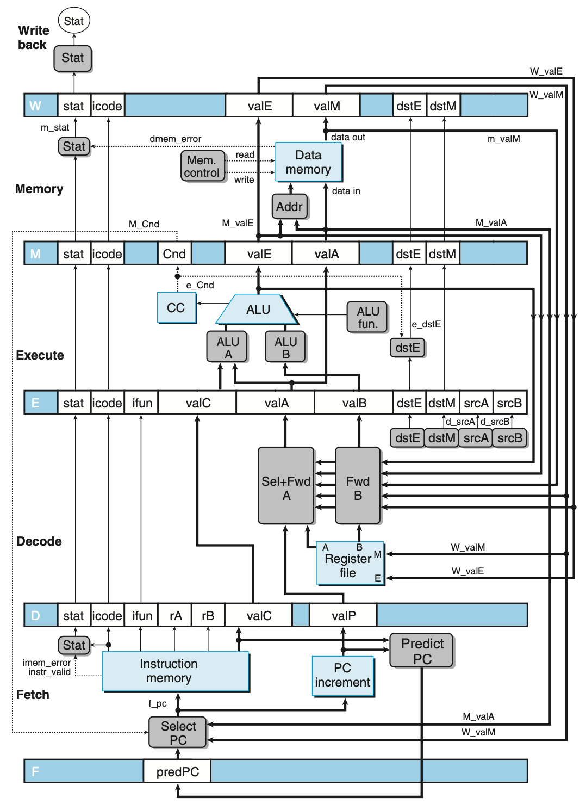

| 图 4.52 PIPE 的硬件结构（最终流水线实现）。额外的旁路路径使得能够转发前面三条指令的结果，从而使我们能够在不暂停流水线的情况下处理大多数形式的数据冒险。|
| :-------------------------------: |

---

<!-- Page 0469 -->

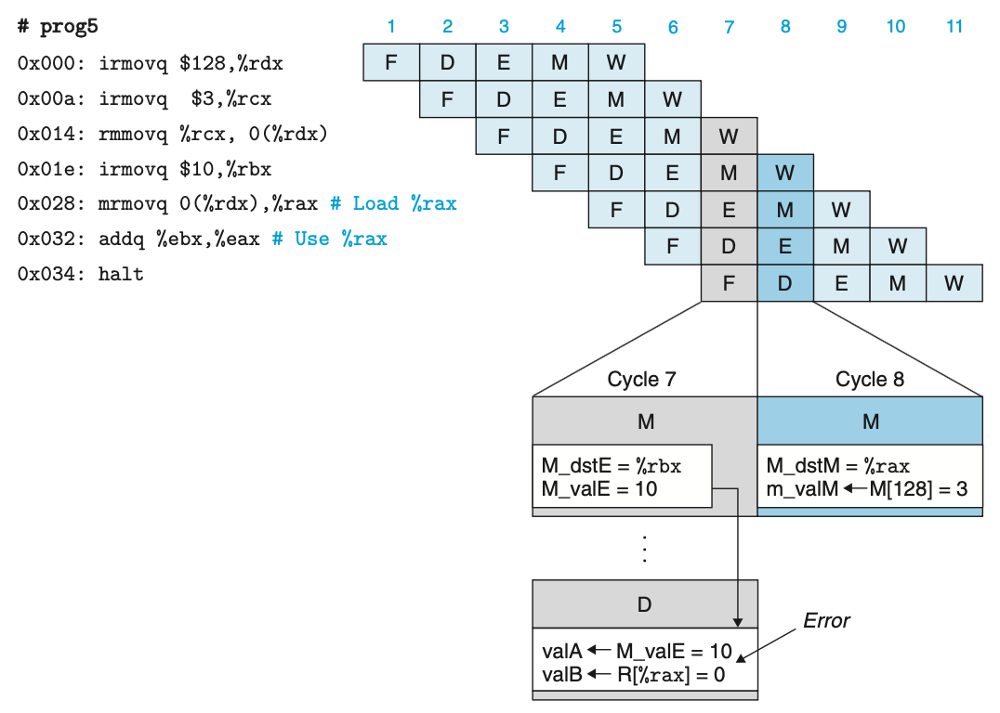

| 图 4.53 加载/使用数据冒险示例。addq 指令在第 7 个周期的译码阶段需要寄存器 %rax 的值。前面的 mrmovq 指令在第 8 个周期的访存阶段才读取该寄存器的新值，这对 addq 指令来说已经太晚了。|
| :-------------------------------: |

这种通过暂停来处理加载/使用冒险的方式称为加载互锁（load interlock）。加载互锁与转发相结合，足以处理所有可能形式的数据冒险。由于只有加载互锁会降低流水线吞吐量，我们几乎可以实现每个时钟周期发射一条新指令的吞吐量目标。

**避免控制冒险**

当处理器无法根据取指阶段的当前指令可靠地确定下一条指令的地址时，就会出现控制冒险。如第 4.5.4 节所述，在我们的流水线处理器中，控制冒险只会对 `ret` 和跳转指令发生。此外，后一种情况只在条件跳转方向被错误预测时才会造成困难。在本节中，我们对如何处理这些冒险提供一个高层次的视图，详细实现将在第 4.5.8 节作为流水线控制更通用讨论的一部分给出。

对于 `ret` 指令，考虑以下示例程序（以汇编代码显示，左侧为各指令的地址，以供参考）：

---

<!-- Page 0470 -->

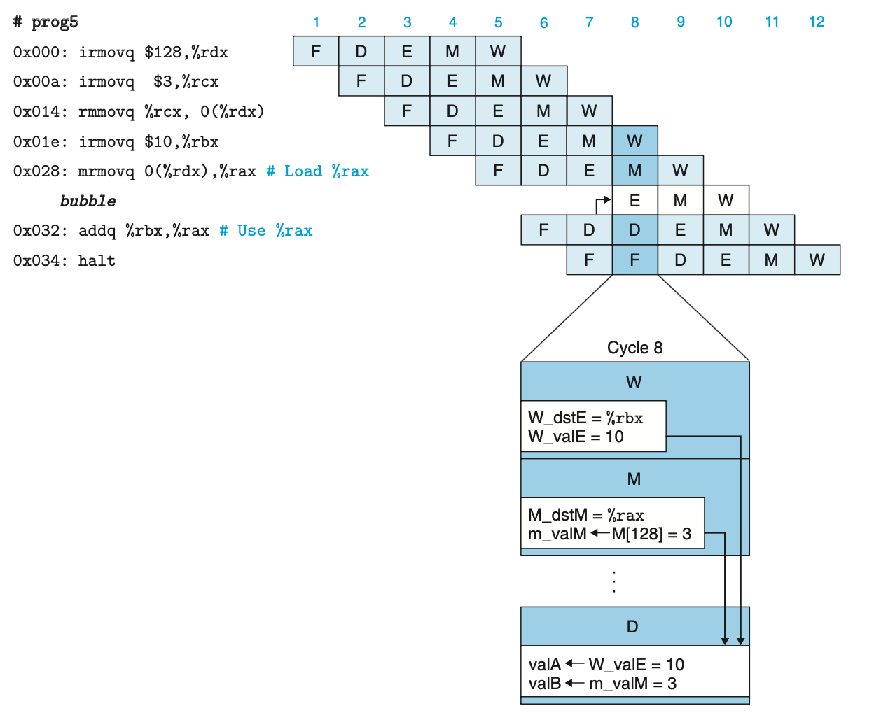

| 图 4.54 通过暂停处理加载/使用冒险。通过在译码阶段将 addq 指令暂停一个周期，可以将 mrmovq 指令在访存阶段的值转发给译码阶段中的 addq 指令作为 valB。|
| :-------------------------------: |

```asm
0x000: irmovq stack,%rsp  # Initialize stack pointer
0x00a: call proc          # Procedure call
0x013: irmovq $10,%rdx    # Return point
0x01d: halt
0x020: .pos 0x20
0x020: proc:              # proc:
0x020: ret                # Return immediately
0x021: rrmovq %rdx,%rbx   # Not executed
0x030: .pos 0x30
0x030: stack:             # stack: Stack pointer
```

图 4.55 展示了我们希望流水线如何处理 `ret` 指令。与我们之前的流水线图一样，该图展示了时间向右增加的流水线活动。与之前不同的是，指令的列出顺序与程序中的顺序不同，因为该程序涉及指令不按线性顺序执行的控制流。通过查看指令地址来识别程序中的不同指令是很有用的。

---

<!-- Page 0471 -->

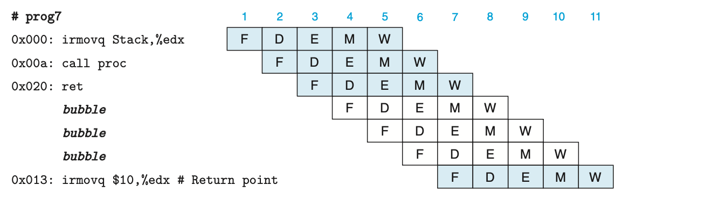

| 图 4.55 ret 指令处理的简化视图。流水线应在 ret 通过译码、执行和访存阶段时暂停，并在此过程中注入三个气泡。一旦 ret 到达写回阶段（第 7 个周期），程序计数器选择逻辑将选择返回地址作为取指地址。|
| :-------------------------------: |

如图所示，`ret` 指令在第 3 个周期被取指，然后向下流经流水线，在第 7 个周期到达写回阶段。当它通过译码、执行和访存阶段时，流水线无法进行任何有用的活动。相反，我们要向流水线中注入三个气泡。一旦 `ret` 指令到达写回阶段，程序计数器选择逻辑将把程序计数器设置为返回地址，因此取指阶段将取指返回点处的 `irmovq` 指令（地址 0x013）。

为处理错误预测的分支，考虑以下程序（以汇编代码显示，左侧为指令地址，以供参考）：

```asm
0x000: xorq %rax,%rax
0x002: jne target         # Not taken
0x00b: irmovq $1, %rax    # Fall through
0x015: halt
0x016: target:
0x016: irmovq $2, %rdx    # Target
0x020: irmovq $3, %rbx    # Target+1
0x02a: halt
```

图 4.56 展示了这些指令是如何处理的。与之前一样，指令按进入流水线的顺序列出，而不是程序中发生的顺序。由于跳转指令被预测为采用，跳转目标处的指令将在第 3 个周期被取指，之后的指令将在第 4 个周期被取指。当分支逻辑在第 4 个周期检测到跳转不应被采用时，已有两条不应继续执行的指令被取指。幸运的是，这两条指令都没有改变程序员可见状态。这只能发生在指令到达执行阶段时，此时它可能导致条件码发生变化。此时，流水线可以简单地取消（有时称为指令清除 instruction squashing）这两条被错误取指的指令，方法是在下一个周期向译码和执行阶段注入气泡，同时取指跳转指令后面的指令。这两条被错误取指的指令将简单地从流水线中消失，因此不会对程序员可见状态产生任何影响。唯一的缺点是浪费了两个时钟周期的指令处理能力。

---

<!-- Page 0472 -->

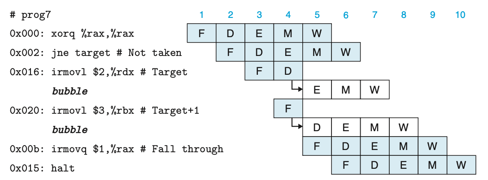

| 图 4.56 处理错误预测的分支指令。流水线预测分支将被采用，因此开始在跳转目标处取指。在第 4 个周期当跳转指令流经执行阶段时检测到错误预测之前，已取了两条指令。在第 5 个周期，流水线通过向译码和执行阶段注入气泡来取消两条目标指令，同时取指跳转后面的指令。|
| :-------------------------------: |

对控制冒险的这一讨论表明，通过仔细考虑流水线控制逻辑，控制冒险是可以处理的。暂停和向流水线中注入气泡等技术在出现特殊条件时可以动态调整流水线流程。如第 4.5.8 节所述，对基本时钟寄存器设计的简单扩展，将使我们能够暂停阶段并向流水线寄存器注入气泡，作为流水线控制逻辑的一部分。

### 4.5.6 异常处理

如第 8 章所述，处理器中的各种活动都可能导致异常控制流，即程序执行的正常链断裂。异常可以由内部（执行程序）或外部（某种外部信号）生成。我们的指令集体系结构包含三种不同的内部生成异常，分别由以下原因引起：(1) `halt` 指令，(2) 具有无效指令和功能码组合的指令，以及 (3) 试图访问无效地址（用于指令取指或数据读写）。更完整的处理器设计还会处理外部异常，例如处理器收到网络接口已收到新数据包或用户点击了鼠标按钮的信号。处理异常是任何微处理器设计的一个挑战性方面。异常可能在不可预测的时刻发生，它们需要在处理器流水线中的指令流中创建一个干净的断点。我们对三种内部异常的处理仅揭示了正确检测和处理异常真正复杂性的冰山一角。

---

<!-- Page 0473 -->

我们将导致异常的指令称为异常指令（excepting instruction）。对于无效指令地址，不存在实际的异常指令，但将无效地址处的某种"虚拟指令"视为异常指令是有用的。在我们简化的 ISA 模型中，我们希望处理器在遇到异常时停机，并设置适当的状态码，如图 4.5 所示。应当显示所有在异常指令之前的指令都已完成，但后面的指令不应对程序员可见状态产生任何影响。在更完整的设计中，处理器将通过调用异常处理程序（操作系统的一部分）继续执行，但实现异常处理的这一部分超出了我们介绍的范围。

在流水线系统中，异常处理涉及几个微妙之处。首先，多条指令可能同时触发异常。例如，在一个流水线操作周期中，取指阶段可能有一条 `halt` 指令，而数据存储器可能为访存阶段的指令报告越界的数据地址。我们必须确定处理器应向操作系统报告哪个异常。基本规则是优先考虑由流水线中位置最靠后的指令触发的异常。在上面的例子中，这将是访存阶段的指令试图访问越界地址的异常。就机器语言程序而言，访存阶段的指令应在取指阶段的指令之前执行，因此只有这个异常应该报告给操作系统。

第二个微妙之处发生在一条指令首先被取指并开始执行，产生异常，后来由于错误预测的分支而被取消。以下是这种程序的一个例子（以目标代码形式）：

```asm
0x000: xorq %rax,%rax
0x002: jne target         # Not taken
0x00b: irmovq $1, %rax    # Fall through
0x015: halt
0x016: target:
0x016: .byte 0xFF         # Invalid instruction code
```

在这个程序中，流水线将预测分支被采用，因此它将取指并尝试将值为 0xFF 的字节作为指令使用（在汇编代码中使用 .byte 指令生成）。因此，译码阶段将检测到非法指令异常。随后，流水线将发现分支不应被采用，因此地址 0x016 处的指令根本不应被取指。流水线控制逻辑将取消该指令，但我们希望避免触发异常。

---

<!-- Page 0474 -->

第三个微妙之处源于流水线处理器在不同阶段更新系统状态的不同部分。导致异常的指令后面的某条指令可能在异常指令完成之前修改某些状态。例如，考虑以下代码序列（我们假设用户程序不允许访问 64 位地址范围上端的地址）：

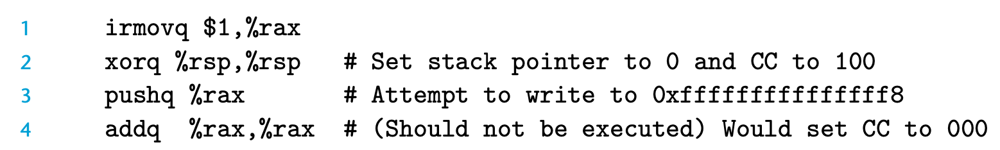

`pushq` 指令会导致地址异常，因为栈指针递减后会环绕到 0xfffffffffffff8。该异常在访存阶段被检测到。同一周期内，`addq` 指令在执行阶段，它将导致条件码被设置为新值。这将违反我们的要求：异常指令之后的任何指令都不应对系统状态产生任何影响。

一般来说，通过将异常处理逻辑合并到流水线结构中，我们可以正确选择不同异常，并避免对因错误预测分支而取指的指令触发异常。这就是我们在每个流水线寄存器中包含状态码 stat 的动机（图 4.41 和图 4.52）。如果指令在其处理的某个阶段产生异常，状态字段就被设置以指示异常的性质。异常状态与该指令的其他信息一起通过流水线传播，直到到达写回阶段。此时，流水线控制逻辑检测到异常的发生并停止执行。

为了避免超出异常指令的任何指令更新程序员可见状态，当访存或写回阶段的指令导致异常时，流水线控制逻辑必须禁止对条件码寄存器或数据存储器的任何更新。在上面的示例程序中，控制逻辑将检测到访存阶段的 `pushq` 导致了异常，因此执行阶段的 `addq` 指令对条件码寄存器的更新将被禁止。

让我们考虑这种异常处理方法如何处理我们提到的微妙之处。当流水线的一个或多个阶段发生异常时，信息简单地存储在流水线寄存器的状态字段中。该事件对流水线中指令的流动没有影响，直到异常指令到达最终流水线阶段，但它会禁止流水线中后续指令对程序员可见状态（条件码寄存器和存储器）的任何更新。由于指令到达写回阶段的顺序与非流水线处理器中执行的顺序相同，我们保证第一个遇到异常的指令将首先到达写回阶段，此时程序执行可以停止，流水线寄存器 W 中的状态码可以记录为程序状态。如果某条指令被取指但后来被取消，有关该指令的任何异常状态信息也将被取消。异常指令后面的任何指令都不能改变程序员可见状态。将异常状态与指令的所有其他信息一起通过流水线传递这一简单规则，提供了一种简单可靠的异常处理机制。

---

<!-- Page 0475 -->

### 4.5.7 PIPE 阶段实现

我们现在已经为 PIPE 创建了整体结构，这是我们带有转发功能的流水线 Y86-64 处理器。它使用与早期顺序设计相同的硬件单元集，另加了流水线寄存器、一些重新配置的逻辑块和额外的流水线控制逻辑。在本节中，我们将研究不同逻辑块的设计，把流水线控制逻辑的设计留到下一节。许多逻辑块与 SEQ 和 SEQ+ 中的对应块相同，只是我们必须从流水线寄存器（以流水线寄存器名称的大写字母作为前缀）或阶段计算（以阶段名称第一个小写字母作为前缀）中选择不同信号的适当版本。

举例来说，将 SEQ 中生成 srcA 信号的逻辑的 HCL 代码与 PIPE 中的对应代码进行比较：

```hcl
# Code from SEQ
word srcA = [
    icode in { IRRMOVQ, IRMMOVQ, IOPQ, IPUSHQ } : rA;
    icode in { IPOPQ, IRET } : RRSP;
    1 : RNONE; # Don't need register
];

# Code from PIPE
word d_srcA = [
    D_icode in { IRRMOVQ, IRMMOVQ, IOPQ, IPUSHQ } : D_rA;
    D_icode in { IPOPQ, IRET } : RRSP;
    1 : RNONE; # Don't need register
];
```

它们的唯一区别在于 PIPE 信号添加的前缀：D_ 用于源值，表示信号来自流水线寄存器 D；d_ 用于结果值，表示它在译码阶段生成。为避免重复，我们不在此展示仅因名称前缀而与 SEQ 不同的块的 HCL 代码。作为参考，PIPE 的完整 HCL 代码在第 508 页的 Web 补充内容 ARCH:HCL 中给出。

**程序计数器选择和取指阶段**

图 4.57 提供了 PIPE 取指阶段逻辑的详细视图。如前所述，该阶段还必须选择程序计数器的当前值并预测下一个程序计数器值。从存储器读取指令和提取不同指令字段的硬件单元与我们在 SEQ 中考虑的相同（见第 4.3.4 节的取指阶段）。

---

<!-- Page 0476 -->

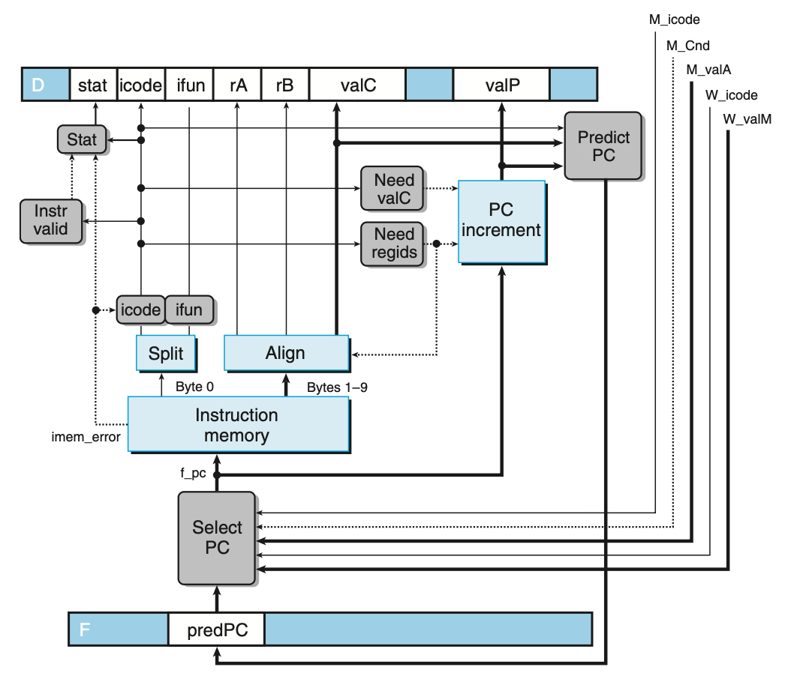

| 图 4.57 PIPE 程序计数器选择和取指逻辑。在一个时钟周期时间限制内，处理器只能预测下一条指令的地址。|
| :-------------------------------: |

程序计数器选择逻辑从三个程序计数器源中选择。当错误预测的分支进入访存阶段时，该指令的 valP 值（指示后续指令的地址）从流水线寄存器 M 读取（信号 M_valA）。当 `ret` 指令进入写回阶段时，返回地址从流水线寄存器 W 读取（信号 W_valM）。所有其他情况使用存储在流水线寄存器 F 中的预测程序计数器值（信号 F_predPC）：

```hcl
word f_pc = [
    # Mispredicted branch. Fetch at incremented PC
    M_icode == IJXX && !M_Cnd : M_valA;
    # Completion of RET instruction
    W_icode == IRET : W_valM;
    # Default: Use predicted value of PC
    1 : F_predPC;
];
```

---

<!-- Page 0477 -->

程序计数器预测逻辑对于取指的指令是 `call` 或 `jump` 时选择 valC，否则选择 valP：

```hcl
word f_predPC = [
    f_icode in { IJXX, ICALL } : f_valC;
    1 : f_valP;
];
```

标记为"Instr valid"、"Need regids"和"Need valC"的逻辑块与 SEQ 相同，使用适当命名的源信号。

与 SEQ 不同，我们必须将指令状态的计算分为两部分。在取指阶段，我们可以测试由于指令地址越界而导致的内存错误，以及检测非法指令或 `halt` 指令。检测无效数据地址必须推迟到访存阶段。

---

**练习题 4.30（答案见第 526 页）**

为信号 f_stat 编写 HCL 代码，为取指指令提供临时状态。

---

**译码和写回阶段**

图 4.58 提供了 PIPE 译码和写回逻辑的详细视图。标记为 dstE、dstM、srcA 和 srcB 的块与 SEQ 实现中的对应块非常相似。注意，提供给写端口的寄存器 ID 来自写回阶段（信号 W_dstE 和 W_dstM），而不是来自译码阶段。这是因为我们希望写操作发生到写回阶段指令指定的目标寄存器中。

---

**练习题 4.31（答案见第 526 页）**

译码阶段中标记为"dstE"的块根据流水线寄存器 D 中取指指令的字段，生成寄存器文件 E 端口的寄存器 ID。在 PIPE 的 HCL 描述中，结果信号命名为 d_dstE。基于 SEQ 信号 dstE 的 HCL 描述（见第 4.3.4 节中 SEQ 的译码阶段），为该信号编写 HCL 代码。暂不考虑实现条件传送的逻辑。

---

该阶段的大部分复杂性与转发逻辑相关。如前所述，标记为"Sel+Fwd A"的块有两个作用：它将 valP 信号合并到后续阶段的 valA 信号中以减少流水线寄存器中的状态量，同时实现源操作数 valA 的转发逻辑。

信号 valA 和 valP 的合并利用了这样一个事实：只有 `call` 和跳转指令在后续阶段需要 valP 的值，而这些指令不需要从寄存器文件 A 端口读取的值。该选择由本阶段的 icode 信号控制。当信号 D_icode 匹配 `call` 或 `jXX` 的指令代码时，该块应选择 D_valP 作为其输出。

---

<!-- Page 0478 -->

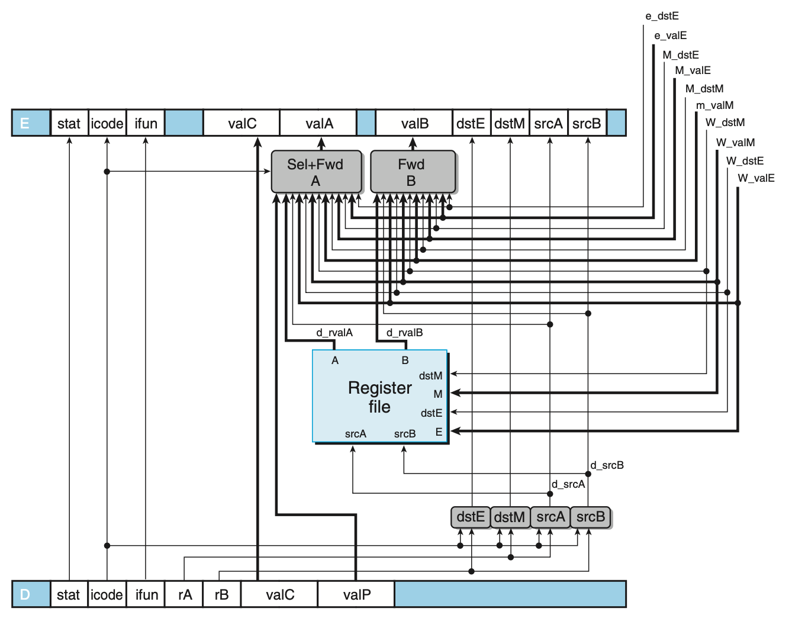

| 图 4.58 PIPE 译码和写回阶段逻辑。没有指令同时需要 valP 和从寄存器端口 A 读取的值，因此这两者可以合并为后续阶段的信号 valA。标记为"Sel+Fwd A"的块执行此任务，并实现源操作数 valA 的转发逻辑。标记为"Fwd B"的块实现源操作数 valB 的转发逻辑。寄存器写地址由写回阶段的 dstE 和 dstM 信号指定，而不是由译码阶段指定，因为它正在写入当前处于写回阶段的指令的结果。|
| :-------------------------------: |

如 4.5.5 节所述，有五个不同的转发源，每个转发源具有一个数据字和一个目标寄存器 ID：

---

<!-- Page 0479 -->

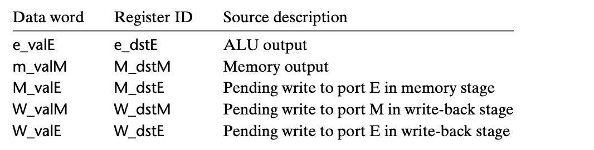

如果没有任何转发条件成立，则该块应选择 d_rvalA（从寄存器端口 A 读取的值）作为其输出。

综合以上内容，我们得到流水线寄存器 E 的 valA 新值的 HCL 描述：

```hcl
word d_valA = [
    D_icode in { ICALL, IJXX } : D_valP;  # Use incremented PC
    d_srcA == e_dstE : e_valE;     # Forward valE from execute
    d_srcA == M_dstM : m_valM;     # Forward valM from memory
    d_srcA == M_dstE : M_valE;     # Forward valE from memory
    d_srcA == W_dstM : W_valM;     # Forward valM from write back
    d_srcA == W_dstE : W_valE;     # Forward valE from write back
    1 : d_rvalA; # Use value read from register file
];
```

上述 HCL 代码中五个转发源的优先级非常重要。该优先级由 HCL 代码测试五个目标寄存器 ID 的顺序决定。如果选择任何其他顺序，流水线对某些程序的行为将不正确。图 4.59 展示了一个需要正确设置执行阶段和访存阶段转发源优先级的程序示例。在该程序中，前两条指令写入寄存器 %rdx，而第三条指令使用该寄存器作为源操作数。当 `rrmovq` 指令在第 4 周期到达译码阶段时，转发逻辑必须在两个目标为其源寄存器的值之间进行选择。应该选择哪个？为了设置优先级，我们必须考虑机器语言程序逐条执行时的行为。第一条 `irmovq` 指令将寄存器 %rdx 设置为 10，第二条将其设置为 3，然后 `rrmovq` 指令从 %rdx 读取 3。为了模拟这种行为，我们的流水线实现应该始终优先考虑最早流水线阶段的转发源，因为它持有程序序列中设置该寄存器的最新指令。因此，上述 HCL 代码中的逻辑首先检测执行阶段的转发源，然后是访存阶段的转发源，最后是写回阶段的转发源。访存阶段或写回阶段中两个转发源之间的优先级问题仅针对指令 `popq %rsp`，因为只有该指令可能尝试同时向同一寄存器进行两次写入。

---

<!-- Page 0480 -->

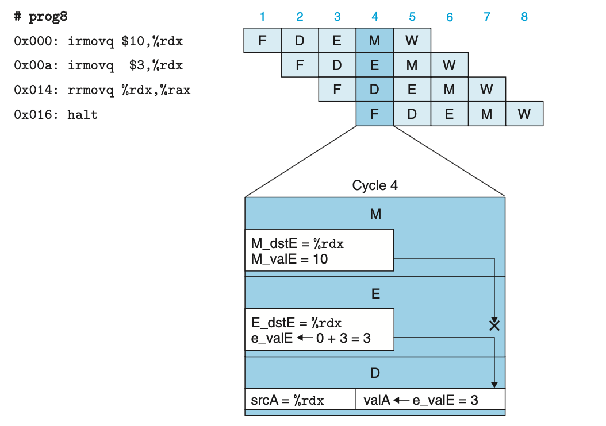

| 图 4.59 转发优先级演示。在第 4 周期，%rdx 的值同时来自执行阶段和访存阶段。转发逻辑应选择执行阶段的值，因为它代表该寄存器最新生成的值。|
| :-------------------------------: |

---

**练习题 4.32（答案见第 526 页）**

假设 d_valA 的 HCL 代码中第三和第四种情况（来自访存阶段的两个转发源）的顺序被颠倒。请描述以下程序中 `rrmovq` 指令（第 5 行）的结果行为：


---

**练习题 4.33（答案见第 527 页）**

假设 d_valA 的 HCL 代码中第五和第六种情况（来自写回阶段的两个转发源）的顺序被颠倒。请编写一个将被错误执行的 Y86-64 程序。描述错误如何发生及其对程序行为的影响。

---

<!-- Page 0481 -->

**练习题 4.34（答案见第 527 页）**

为信号 d_valB 编写 HCL 代码，给出提供给流水线寄存器 E 的源操作数 valB 的值。

---

写回阶段还有一个小的剩余部分。如图 4.52 所示，整体处理器状态 Stat 由一个基于流水线寄存器 W 中状态值的块计算得出。回顾 4.1.1 节，该代码应指示正常操作（AOK）或三种异常条件之一。由于流水线寄存器 W 保存着最近完成的指令的状态，因此自然地使用该值作为整体处理器状态的指示。唯一需要考虑的特殊情况是写回阶段中存在气泡。这属于正常操作，因此该情况下状态码应为 AOK：

```hcl
word Stat = [
    W_stat == SBUB : SAOK;
    1 : W_stat;
];
```

**执行阶段**

图 4.60 展示了 PIPE 的执行阶段逻辑。硬件单元和逻辑块与 SEQ 中的相同，只是信号名称做了适当重命名。我们可以看到信号 e_valE 和 e_dstE 作为转发源之一指向译码阶段。一个区别是标记为"Set CC"的逻辑（决定是否更新条件码）有信号 m_stat 和 W_stat 作为输入。这些信号用于检测导致异常的指令正在通过后续流水线阶段的情况，因此应该禁止对条件码的任何更新。该设计方面将在 4.5.8 节中讨论。

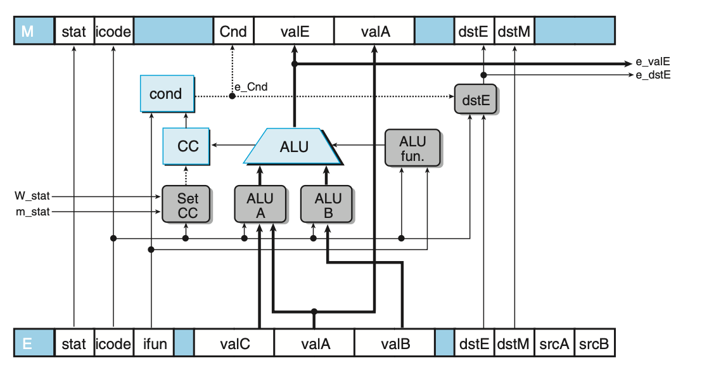

| 图 4.60 PIPE 执行阶段逻辑。该设计部分与 SEQ 实现中的逻辑非常相似。|
| :-------------------------------: |

---

<!-- Page 0482 -->

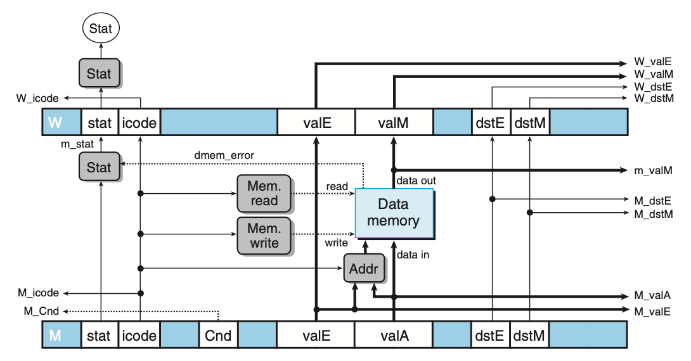

| 图 4.61 PIPE 访存阶段逻辑。来自流水线寄存器 M 和 W 的许多信号向下传递到早期阶段，以提供写回结果、指令地址和转发结果。|
| :-------------------------------: |

---

**练习题 4.35（答案见第 527 页）**

在 d_valA 的 HCL 代码的第二种情况中，使用信号 e_dstE 来检查是否选择 ALU 输出 e_valE 作为转发源。假设改用信号 E_dstE（流水线寄存器 E 中的目标寄存器 ID）进行此选择。请编写一个使用这种修改后的转发逻辑会产生错误结果的 Y86-64 程序。

---

**访存阶段**

图 4.61 展示了 PIPE 的访存阶段逻辑。将其与 SEQ 的访存阶段（图 4.30）进行比较，我们可以看到，如前所述，SEQ 中标记为"Mem. data"的块在 PIPE 中不存在。该块用于在数据源 valP（用于 call 指令）和 valA 之间进行选择，但该选择现在由译码阶段标记为"Sel+Fwd A"的块执行。该阶段中的大多数其他块与 SEQ 中的对应块相同，只是信号名称做了适当重命名。在该图中，我们还可以看到流水线寄存器 M 和 W 中的许多值作为转发和流水线控制逻辑的一部分提供给电路的其他部分。

---

<!-- Page 0483 -->

**练习题 4.36（答案见第 528 页）**

在该阶段，我们可以通过检测数据存储器的无效地址来完成状态码 Stat 的计算。为信号 m_stat 编写 HCL 代码。

---

### 4.5.8 流水线控制逻辑

现在我们准备通过创建流水线控制逻辑来完成 PIPE 的设计。该逻辑必须处理以下四种控制情况，这些情况是数据转发和分支预测等其他机制无法解决的：

**加载/使用冒险**：流水线必须在从内存读取值的指令与使用该值的指令之间停顿一个周期。

**处理 ret**：流水线必须停顿，直到 ret 指令到达写回阶段。

**错误预测的分支**：当分支逻辑检测到跳转不应被采用时，几条位于分支目标的指令将已经开始通过流水线。这些指令必须被取消，并且应从跳转指令之后的指令处重新开始取指。

**异常**：当一条指令导致异常时，我们希望禁止后续指令更新程序员可见状态，并在异常指令到达写回阶段时停机。

我们将逐一介绍每种情况的期望操作，然后开发控制逻辑来处理所有这些情况。

**特殊控制情况的期望处理**

对于加载/使用冒险，我们已在 4.5.5 节中描述了期望的流水线操作，如图 4.54 中的示例所示。只有 `mrmovq` 和 `popq` 指令从内存读取数据。当（1）这两条指令之一位于执行阶段，且（2）需要目标寄存器的指令位于译码阶段时，我们希望在下一周期将第二条指令保持在译码阶段，并向执行阶段注入一个气泡。此后，转发逻辑将解决数据冒险。流水线可以通过保持流水线寄存器 D 不变来阻止译码阶段的指令前进。同时，它还应保持流水线寄存器 F 不变，以便下一条指令将被再次取指。总之，实现该流水线流需要检测冒险条件、保持流水线寄存器 F 和 D 不变，并向执行阶段注入气泡。

对于 `ret` 指令的处理，我们已在 4.5.5 节中描述了期望的流水线操作。流水线应停顿三个周期，直到 `ret` 指令通过访存阶段时读取返回地址。

---

<!-- Page 0484 -->

这通过图 4.55 中的简化流水线图进行了说明，针对以下程序的处理：

```asm
0x000: irmovq stack,%rsp  # Initialize stack pointer
0x00a: call proc          # Procedure call
0x013: irmovq $10,%rdx    # Return point
0x01d: halt
0x020:.pos 0x20
0x020: proc:              # proc:
0x020: ret                # Return immediately
0x021: rrmovq %rdx,%rbx   # Not executed
0x030:.pos 0x30
0x030: stack:             # stack: Stack pointer
```

图 4.62 提供了该示例程序中 `ret` 指令处理的详细视图。关键观察是：在我们的流水线中，无法向取指阶段注入气泡。每个周期，取指阶段都从指令存储器中读取某条指令。查看 4.5.7 节中实现程序计数器预测逻辑的 HCL 代码，我们可以看到，对于 `ret` 指令，程序计数器的新值被预测为 valP，即后续指令的地址。在我们的示例程序中，这将是 0x021，即 `ret` 后面的 `rrmovq` 指令的地址。这种预测对于本例并不正确，对大多数情况也不会正确，但在我们的设计中并不打算正确预测返回地址。在三个时钟周期内，取指阶段停顿，导致 `rrmovq` 指令被取指，但随后在译码阶段被替换为气泡。图 4.62 通过三次取指（每次都有一个箭头向下指向通过剩余流水线阶段的气泡）说明了这一过程。最终，`irmovq` 指令在第 7 周期被取指。将图 4.62 与图 4.55 进行比较，我们看到我们的实现实现了期望的效果，但存在连续三个周期取指错误指令这一略微奇特的现象。

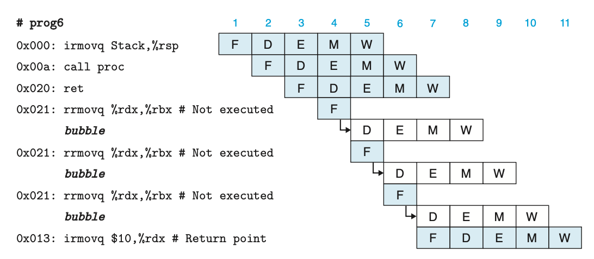

| 图 4.62 ret 指令的详细处理。取指阶段反复取指 ret 后面的 rrmovq 指令，但流水线控制逻辑向译码阶段注入气泡，而不是允许 rrmovq 指令继续。其结果等效于图 4.55 所示的行为。|
| :-------------------------------: |

---

<!-- Page 0485 -->

当发生错误预测的分支时，我们已在 4.5.5 节中描述了期望的流水线操作，并在图 4.56 中进行了说明。当跳转指令到达执行阶段时，错误预测将被检测到。随后，控制逻辑在下一周期向译码阶段和执行阶段注入气泡，导致两条错误取指的指令被取消。同一周期，流水线将正确指令读入取指阶段。

对于导致异常的指令，我们必须使流水线实现与期望的 ISA 行为相匹配，即所有先前指令完成，而后续指令均不对程序状态产生任何影响。实现这些效果较为复杂，原因在于：（1）异常在程序执行的两个不同阶段（取指和访存）被检测到；（2）程序状态在三个不同阶段（执行、访存和写回）被更新。

我们的阶段设计在每个流水线寄存器中包含一个状态码 stat，以跟踪每条指令通过流水线阶段时的状态。当发生异常时，我们将该信息记录为指令状态的一部分，并继续取指、译码和执行指令，就好像什么都没有发生一样。当异常指令到达访存阶段时，我们采取措施阻止后续指令修改程序员可见状态：（1）禁止执行阶段指令设置条件码，（2）向访存阶段注入气泡以禁止对数据存储器的任何写入，（3）当写回阶段有异常指令时停顿写回阶段，从而使流水线停机。

图 4.63 中的流水线图说明了当导致异常的指令后面跟着一条会改变条件码的指令时，我们的流水线控制如何处理这种情况。在第 6 周期，pushq 指令到达访存阶段并产生内存错误。同一周期，执行阶段中的 addq 指令为条件码生成新值。当异常指令位于访存或写回阶段时，我们禁止设置条件码（通过检查信号 m_stat 和 W_stat，然后将信号 set_cc 设置为零）。在图 4.63 的示例中，我们还可以看到向访存阶段注入气泡并将异常指令停顿在写回阶段的组合——pushq 指令保持停顿在写回阶段，后续指令均无法通过执行阶段。

通过这种流水线状态信号、控制条件码设置和控制流水线阶段的组合，我们实现了异常处理的期望行为：异常指令之前的所有指令均完成，而后续指令均不对程序员可见状态产生任何影响。

**检测特殊控制条件**

图 4.64 总结了需要特殊流水线控制的条件。它给出了描述三种特殊情况产生条件的表达式。

---

<!-- Page 0486 -->

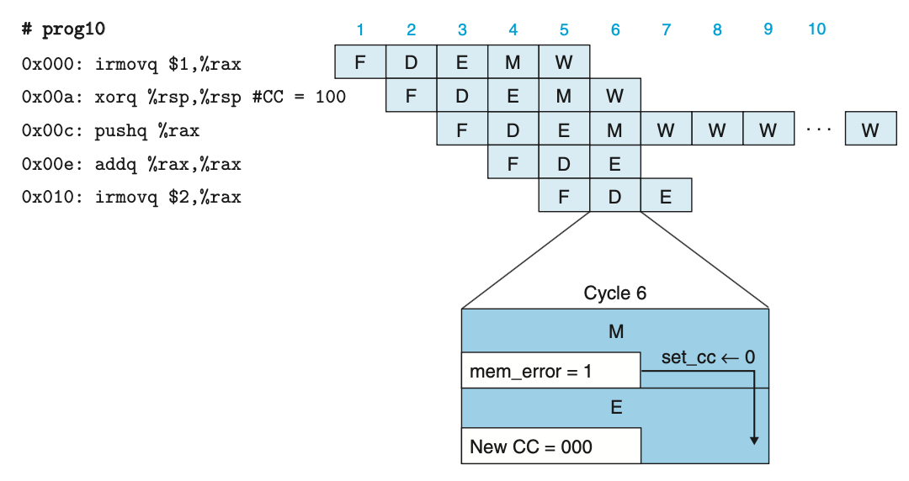

| 图 4.63 处理无效内存引用异常。在第 6 周期，pushq 指令的无效内存引用导致条件码的更新被禁用。流水线开始向访存阶段注入气泡，并将异常指令停顿在写回阶段。|
| :-------------------------------: |

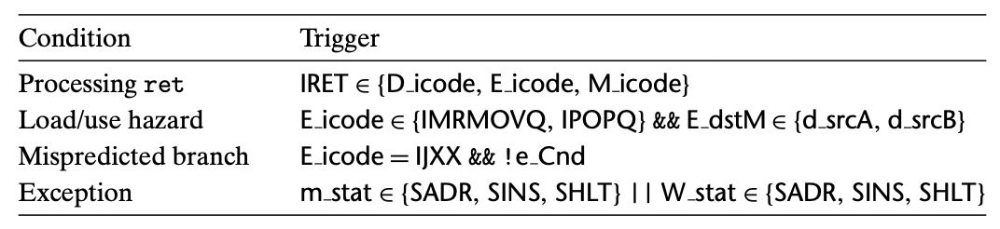

| 图 4.64 流水线控制逻辑的检测条件。四种不同的条件需要通过停顿流水线或取消部分执行的指令来改变流水线流。|
| :-------------------------------: |

这些表达式由简单的组合逻辑块实现，这些逻辑块必须在时钟周期结束前生成结果，以便在时钟上升开始下一个周期时控制流水线寄存器的操作。在一个时钟周期内，流水线寄存器 D、E 和 M 分别保存处于译码、执行和访存流水线阶段的指令状态。当接近时钟周期结束时，信号 d_srcA 和 d_srcB 将被设置为译码阶段指令的源操作数寄存器 ID。检测 `ret` 指令通过流水线只需检查译码、执行和访存阶段指令的指令代码。检测加载/使用冒险需要检查执行阶段指令的类型（`mrmovq` 或 `popq`），并将其目标寄存器与译码阶段指令的源寄存器进行比较。流水线控制逻辑应在跳转指令位于执行阶段时检测错误预测的分支，以便在指令进入访存阶段时设置恢复错误预测所需的条件。当跳转指令位于执行阶段时，信号 e_Cnd 指示跳转是否应被采用。我们通过检查访存和写回阶段的指令状态值来检测异常指令。对于访存阶段，我们使用在阶段内计算的信号 m_stat，而不是流水线寄存器中的 M_stat。该内部信号包含了数据存储器地址错误的可能性。

---

<!-- Page 0487 -->

**流水线控制机制**

图 4.65 展示了允许流水线控制逻辑在流水线寄存器中保持指令或向流水线注入气泡的低层机制。这些机制涉及对 4.2.5 节所描述的基本时钟寄存器的小扩展。假设每个流水线寄存器有两个控制输入：stall（停顿）和 bubble（气泡）。这些信号的设置决定了时钟上升时流水线寄存器如何更新。在正常操作下（图 4.65(a)），这两个输入均设置为 0，使寄存器将其输入加载为新状态。当 stall 信号设置为 1 时（图 4.65(b)），状态更新被禁用。相反，寄存器将保持其先前状态，这使得可以在某个流水线阶段中保持指令。当 bubble 信号设置为 1 时（图 4.65(c)），寄存器的状态将被设置为某种固定的复位配置，使其状态等效于 nop 指令。流水线寄存器复位配置中特定的 1 和 0 模式取决于该流水线寄存器中的字段集合。例如，要向流水线寄存器 D 注入气泡，我们希望 icode 字段设置为常量值 INOP（图 4.26）。要向流水线寄存器 E 注入气泡，我们希望 icode 字段设置为 INOP，并将 dstE、dstM、srcA 和 srcB 字段设置为常量 RNONE。确定复位配置是硬件设计者在设计流水线寄存器时的任务之一。我们不在此深入讨论细节。将 bubble 和 stall 信号同时设置为 1 将被视为错误。

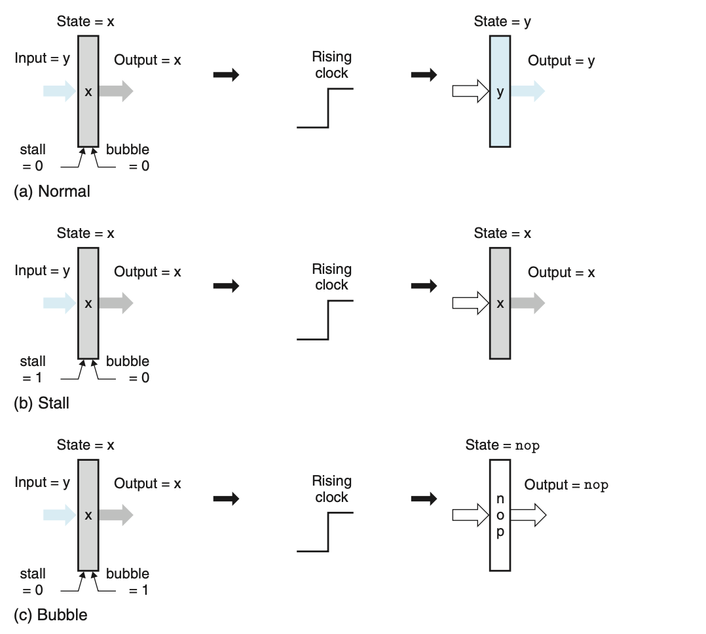

| 图 4.65 额外的流水线寄存器操作。（a）正常情况下，当时钟上升时，寄存器的状态和输出被设置为输入值。（b）在停顿模式下，状态保持固定在其先前值。（c）在气泡模式下，状态被 nop 操作的状态覆盖。|
| :-------------------------------: |

---

<!-- Page 0488 -->

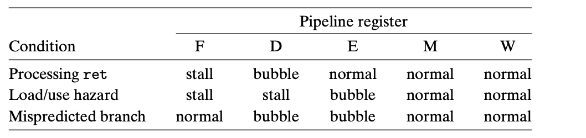

| 图 4.66 流水线控制逻辑的操作。不同的条件需要通过停顿流水线或取消部分执行的指令来改变流水线流。|
| :-------------------------------: |

图 4.66 中的表格展示了不同流水线阶段对三种特殊情况应采取的操作。每种情况都涉及流水线寄存器正常、停顿和气泡操作的某种组合。在时序方面，流水线寄存器的停顿和气泡控制信号由组合逻辑块生成。这些值必须在时钟上升时有效，从而在下一个时钟周期开始时，使每个流水线寄存器执行加载、停顿或气泡操作。通过对流水线寄存器设计的这种小扩展，我们可以使用组合逻辑、时钟寄存器和随机访问存储器等基本构建块来实现完整的流水线，包括其所有控制。

**控制条件的组合**

在我们迄今对特殊流水线控制条件的讨论中，我们假设在任何单个时钟周期内最多只会出现一种特殊情况。系统设计中的一个常见错误是未能处理多种特殊情况同时出现的情况。让我们分析这些可能性。我们不必担心涉及程序异常的组合，因为我们已经精心设计了异常处理机制来考虑流水线中的其他指令。图 4.67 展示了导致其他三种特殊控制情况的流水线状态图。这些图展示了译码、执行和访存阶段的块，阴影框表示条件出现时必须满足的特定约束。加载/使用冒险要求执行阶段的指令从内存读取值到寄存器，且译码阶段的指令以该寄存器为源操作数。错误预测的分支要求执行阶段的指令为跳转指令。`ret` 指令有三种可能情况——该指令可以位于译码、执行或访存阶段中的任意一个。随着 `ret` 指令在流水线中移动，早期流水线阶段将包含气泡。

---

<!-- Page 0489 -->

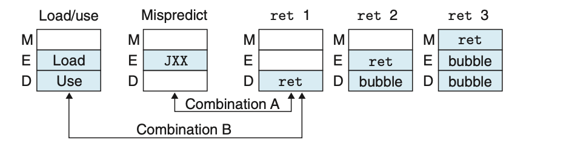

| 图 4.67 特殊控制条件的流水线状态。箭头所示的两对组合可以同时出现。|
| :-------------------------------: |

从这些图中我们可以看出，大多数控制条件是互斥的。例如，不可能同时存在加载/使用冒险和错误预测的分支，因为前者要求执行阶段有一条加载指令（`mrmovq` 或 `popq`），而后者要求有一条跳转指令。类似地，第二和第三种 `ret` 组合不能与加载/使用冒险或错误预测的分支同时出现。只有箭头所示的两种组合可以同时出现。

组合 A 涉及执行阶段的一条未采用跳转指令和译码阶段的一条 `ret` 指令。构成这种组合需要 `ret` 位于未采用分支的目标处。流水线控制逻辑应检测到分支被错误预测，因此取消 `ret` 指令。

---

**练习题 4.37（答案见第 528 页）**

编写一个 Y86-64 汇编语言程序，使得组合 A 出现，并确定控制逻辑是否正确处理了它。

---

将组合 A 条件（图 4.66）的控制操作合并，我们得到以下流水线控制操作（假设气泡或停顿优先于正常操作）：

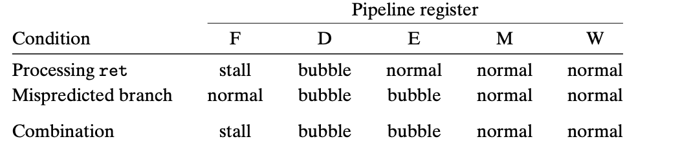

---

<!-- Page 0490 -->

也就是说，它将像错误预测的分支一样处理，但在取指阶段有一个停顿。幸运的是，在下一个周期，程序计数器选择逻辑将选择跳转之后指令的地址，而不是预测的程序计数器，因此流水线寄存器 F 发生什么并不重要。我们得出结论，流水线将正确处理这种组合。

组合 B 涉及加载/使用冒险，其中加载指令设置寄存器 %rsp，而 `ret` 指令随后以该寄存器为源操作数，因为它必须从栈中弹出返回地址。流水线控制逻辑应在译码阶段保持 `ret` 指令。

---

**练习题 4.38（答案见第 528 页）**

编写一个 Y86-64 汇编语言程序，使得组合 B 出现，如果流水线正确操作则以 `halt` 指令结束。

---

将组合 B 条件（图 4.66）的控制操作合并，我们得到以下流水线控制操作：

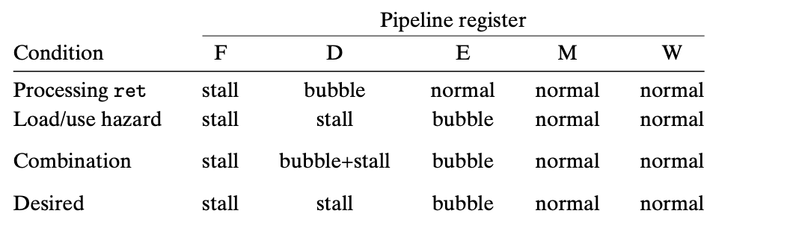

如果两组操作都被触发，控制逻辑将试图停顿 `ret` 指令以避免加载/使用冒险，同时由于 `ret` 指令而向译码阶段注入气泡。显然，我们不希望流水线同时执行这两组操作。相反，我们希望它只采取加载/使用冒险的操作，处理 `ret` 指令的操作应推迟一个周期。

这一分析表明，组合 B 需要特殊处理。事实上，我们最初对 PIPE 控制逻辑的实现未能正确处理这种组合。尽管该设计通过了许多模拟测试，但它有一个微妙的错误，只有通过我们刚才所做的分析才被发现。当执行具有组合 B 的程序时，控制逻辑会将流水线寄存器 D 的 bubble 和 stall 信号都设置为 1。这个例子说明了系统分析的重要性。仅通过运行正常程序不太可能发现这个错误。如果未被检测到，流水线将无法忠实实现 ISA 行为。

**控制逻辑实现**

图 4.68 展示了流水线控制逻辑的整体结构。基于流水线寄存器和流水线阶段的信号，控制逻辑生成流水线寄存器的停顿和气泡控制信号，并确定条件码寄存器是否应该更新。我们可以将图 4.64 的检测条件与图 4.66 的操作相结合，创建不同流水线控制信号的 HCL 描述。

---

<!-- Page 0491 -->

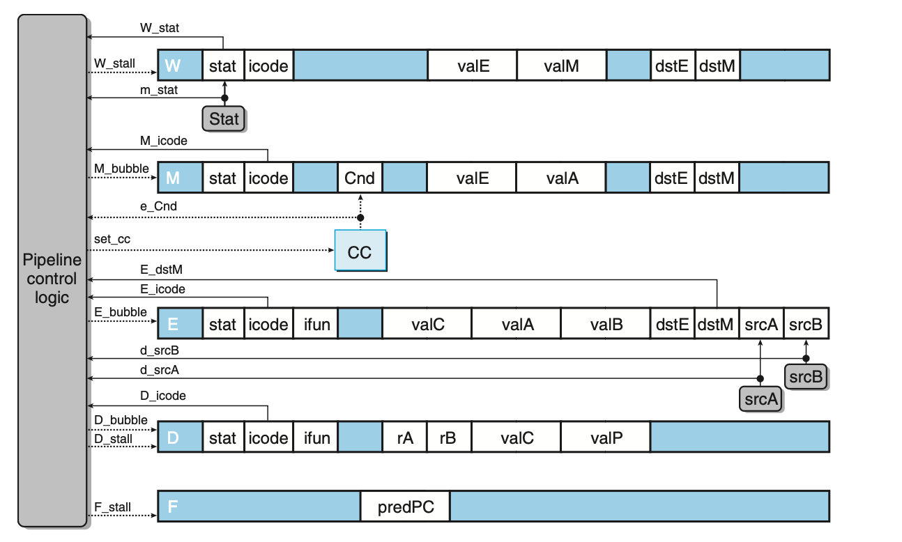

| 图 4.68 PIPE 流水线控制逻辑。该逻辑覆盖了指令通过流水线的正常流，以处理过程返回、错误预测分支、加载/使用冒险和程序异常等特殊情况。|
| :-------------------------------: |

流水线寄存器 F 必须在加载/使用冒险或 `ret` 指令时停顿：

```hcl
bool F_stall =
    # Conditions for a load/use hazard
    E_icode in { IMRMOVQ, IPOPQ } &&
    E_dstM in { d_srcA, d_srcB } ||
    # Stalling at fetch while ret passes through pipeline
    IRET in { D_icode, E_icode, M_icode };
```

---

**练习题 4.39（答案见第 529 页）**

为 PIPE 实现中的信号 D_stall 编写 HCL 代码。

---

流水线寄存器 D 必须在错误预测的分支或 `ret` 指令时设置为气泡。但如前一节的分析所示，在存在加载/使用冒险时不应注入气泡。

---

<!-- Page 0492 -->

```hcl
bool D_bubble =
    # Mispredicted branch
    (E_icode == IJXX && !e_Cnd) ||
    # Stalling at fetch while ret passes through pipeline
    # but not condition for a load/use hazard
    !(E_icode in { IMRMOVQ, IPOPQ } && E_dstM in { d_srcA, d_srcB }) &&
    IRET in { D_icode, E_icode, M_icode };
```

---

**练习题 4.40（答案见第 529 页）**

为 PIPE 实现中的信号 E_bubble 编写 HCL 代码。

---

**练习题 4.41（答案见第 529 页）**

为 PIPE 实现中的信号 set_cc 编写 HCL 代码。这应该仅发生在 `OPq` 指令时，并应考虑程序异常的影响。

---

**练习题 4.42（答案见第 529 页）**

为 PIPE 实现中的信号 M_bubble 和 W_stall 编写 HCL 代码。后者需要修改图 4.64 中列出的异常条件。

---

这涵盖了所有特殊流水线控制信号值。在 PIPE 的完整 HCL 代码中，所有其他流水线控制信号被设置为零。

### 4.5.9 性能分析

我们可以看到，需要流水线控制逻辑采取特殊操作的条件都会导致流水线无法实现每个时钟周期发射一条新指令的目标。我们可以通过确定向流水线注入气泡的频率来衡量这种低效性，因为这些会导致未使用的流水线周期。一条 ret 指令产生三个气泡，一个加载/使用冒险产生一个，一条错误预测的分支产生两个。我们可以通过计算 PIPE 每执行一条指令所需平均时钟周期数的估计值来量化这些惩罚对整体性能的影响，这一指标称为 CPI（"每指令周期数"）。该指标是流水线平均吞吐量的倒数，但时间以时钟周期而非皮秒计量。它是衡量设计架构效率的有用指标。

---

<!-- Page 0493 -->

>**旁注 测试设计**
>
>正如我们所见，即使是简单的微处理器设计，也有很多引入缺陷的方式。在流水线设计中，不同流水线阶段的指令之间存在许多微妙的相互作用。我们看到，许多设计挑战涉及不常见的指令（如弹出到栈指针）或不常见的指令组合（如未采用的跳转后面跟着 ret）。我们还看到，异常处理为可能的流水线行为增加了全新的维度。那么，我们如何确保我们的设计是正确的呢？对于硬件制造商来说，这是一个主要关注点，因为他们不能简单地报告错误并让用户通过互联网下载代码补丁。即使是简单的逻辑设计错误也可能产生严重后果，尤其是随着微处理器越来越多地用于操作对我们的生活和健康至关重要的系统，如汽车防抱死制动系统、心脏起搏器和飞机控制系统。
>
>仅在运行许多"典型"程序时模拟设计并不是测试系统的充分手段。相反，彻底的测试需要设计系统地生成许多测试的方法，这些测试将尽可能多地覆盖不同的指令和指令组合。在创建我们的 Y86-64 处理器设计时，我们还设计了多个测试脚本，每个脚本生成许多不同的测试，运行处理器的模拟，并将结果寄存器和内存值与我们的 YIS 指令集模拟器产生的值进行比较。以下是这些脚本的简要描述：
>
>**optest**：运行 49 个不同 Y86-64 指令的测试，使用不同的源和目标寄存器
>
>**jtest**：运行 64 个不同跳转和 call 指令的测试，使用是否采用分支的不同组合
>
>**cmtest**：运行 28 个不同条件移动指令的测试，使用不同的控制组合
>
>**htest**：运行 600 个不同数据冒险可能性的测试，使用不同的源和目标指令组合，以及指令对之间不同数量的 nop 指令
>
>**ctest**：测试 22 种不同的控制组合，基于与 4.5.8 节类似的分析
>
>**etest**：测试 12 种不同的组合，其中一条指令导致异常，其后的指令可能改变程序员可见状态
>
>该测试方法的关键思想是尽可能系统地生成测试，这些测试会创建可能导致流水线错误的不同条件。

---

<!-- Page 0494 -->

>**旁注 形式化验证我们的设计**
>
>即使设计通过了大量测试，我们也不能确定它对所有可能的程序都能正确运行。即使我们只考虑由短代码段组成的测试，我们可以测试的可能程序数量也是难以想象的巨大。然而，更新的形式化验证方法有望提供工具，严格考虑系统的所有可能行为，并确定是否存在任何设计错误。
>
>我们能够将形式化验证应用于我们 Y86-64 处理器的早期版本 [13]。我们建立了一个框架来比较流水线设计 PIPE 和非流水线版本 SEQ 的行为。也就是说，它能够证明对于任意机器语言程序，两个处理器将对程序员可见状态产生相同的影响。当然，我们的验证器实际上无法运行所有可能的程序，因为它们有无限多个。相反，它使用了一种归纳证明的形式，逐周期地展示两个处理器之间的一致性。进行这种分析需要使用符号方法对硬件进行推理，其中我们将所有程序值视为任意整数，并将 ALU 抽象为某种"黑盒"，在其参数上计算某些未指定的函数。我们仅假设 SEQ 和 PIPE 的 ALU 计算相同的函数。
>
>我们使用控制逻辑的 HCL 描述来生成符号处理器模型的控制逻辑，这样我们就可以发现 HCL 代码中的任何错误。能够证明 SEQ 和 PIPE 是相同的并不保证它们中的任何一个都忠实地实现了指令集架构。然而，它将发现由于不正确的流水线设计导致的任何错误，而这是设计错误的主要来源。
>
>在我们的实验中，我们不仅验证了类似于本章中介绍的 PIPE 版本，还验证了几个变体（作为作业题给出），其中我们添加了更多指令、修改了硬件能力或使用了不同的分支预测策略。有趣的是，我们在所有设计中只发现了一个错误，涉及问题 4.58 描述的变体的解决方案中的控制组合 B（4.5.8 节中描述）。这暴露了我们测试机制的一个弱点，促使我们在 ctest 测试脚本中添加了额外的情况。
>
>形式化验证仍处于早期发展阶段。这些工具通常难以使用，且没有能力验证大型设计。我们能够验证我们的处理器，部分原因在于它们的相对简单性。即便如此，也需要数周的努力和多次运行工具，每次需要长达 8 小时的计算机时间。这是一个活跃的研究领域，一些工具正在商业化，部分已在英特尔、AMD 和 IBM 等公司使用。

如果我们忽略异常的性能影响（按定义，这只会极少发生），另一种理解 CPI 的方式是想象我们在某个基准程序上运行处理器，观察执行阶段的操作。在每个周期，执行阶段要么（1）处理一条指令，该指令继续通过剩余阶段完成，要么（2）处理由于三种特殊情况之一而注入的气泡。如果该阶段共处理了 $C_i$ 条指令和 $C_b$ 个气泡，则处理器需要大约 $C_i + C_b$ 个总时钟周期来执行 $C_i$ 条指令。我们说"大约"是因为我们忽略了启动指令流经流水线所需的周期。然后我们可以按如下方式计算该基准的 CPI：

 $$ \mathrm{CPI}=\frac{C_{i}+C_{b}}{C_{i}}=1.0+\frac{C_{b}}{C_{i}} $$

也就是说，CPI 等于 1.0 加上一个惩罚项 $C_{b}/C_{i}$，表示每执行一条指令注入的平均气泡数。由于只有三种不同的指令类型会导致气泡被注入，我们可以将这个惩罚项分解为三个分量：

---

<!-- Page 0495 -->

>**旁注 ARCH:VLOG——流水线 Y86-64 处理器的 Verilog 实现**
>
>如前所述，现代逻辑设计涉及用硬件描述语言编写硬件设计的文本表示。然后可以通过模拟和各种形式化验证工具对设计进行测试。一旦对设计有信心，就可以使用逻辑综合工具将设计转换为实际的逻辑电路。
>
>我们已经开发了 Verilog 硬件描述语言中我们 Y86-64 处理器设计的模型。这些设计结合了实现处理器基本构建块的模块，以及直接从 HCL 描述生成的控制逻辑。我们已经能够综合其中的一些设计，将逻辑电路描述下载到现场可编程门阵列（FPGA）硬件上，并在实际程序上运行处理器。

 $$ \mathrm{CPI}=1.0+lp+mp+rp $$

其中 $lp$（"加载惩罚"）是由于加载/使用冒险停顿而注入气泡的平均频率，$mp$（"错误预测分支惩罚"）是由于错误预测的分支而取消指令时注入气泡的平均频率，$rp$（"返回惩罚"）是由于 ret 指令停顿而注入气泡的平均频率。这些惩罚中的每一个都表示出于特定原因注入的气泡总数（$C_b$ 的某部分）除以执行的指令总数（$C_i$）。

为了估计这些惩罚，我们需要知道相关指令（加载、条件分支和返回）出现的频率，以及对于每种指令，特定条件出现的频率。我们为 CPI 计算选择以下一组频率（这些与文献 [44] 和 [46] 中报告的测量结果相当）：

- 加载指令（`mrmovq` 和 `popq`）占所有执行指令的 25%。其中 20% 导致加载/使用冒险。
- 条件分支占所有执行指令的 20%。其中 60% 被采用，40% 未被采用。
- 返回指令占所有执行指令的 2%。

因此，我们可以将每个惩罚估计为指令类型的频率、条件出现的频率和条件发生时注入的气泡数的乘积：

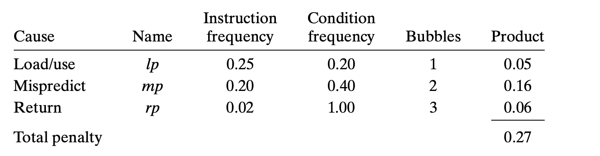

---

<!-- Page 0496 -->

三个惩罚之和为 0.27，得出 CPI 为 1.27。

我们的目标是设计一个每周期能发射一条指令的流水线，即 CPI 为 1.0。我们没有完全实现这一目标，但整体性能仍然相当不错。我们还可以看到，任何进一步降低 CPI 的努力都应该专注于错误预测的分支。它们在我们 0.27 的总惩罚中占 0.16，因为条件分支很常见，我们的预测策略经常失败，而且每次错误预测我们要取消两条指令。

---

**练习题 4.43（答案见第 530 页）**

假设我们使用一种成功率为 65% 的分支预测策略，例如"向后采用，向前不采用"（BTFNT），如 4.5.4 节所述。假设所有其他频率不受影响，对 CPI 有什么影响？

---

**练习题 4.44（答案见第 530 页）**

让我们分析对你在问题 4.5 和 4.6 中编写的程序使用条件数据传送与条件控制传送的相对性能。假设我们使用这些程序来计算一个很长数组中绝对值的总和，因此整体性能主要由内循环所需的周期数决定。假设我们的跳转指令被预测为采用，约 50% 的数组值为正数。

A. 平均而言，两个程序的内循环中执行多少条指令？

B. 平均而言，两个程序的内循环中会注入多少个气泡？

C. 两个程序每个数组元素所需的平均时钟周期数是多少？

---

### 4.5.10 尚未完成的工作

我们已经为 PIPE 流水线微处理器创建了结构，设计了控制逻辑块，并实现了流水线控制逻辑来处理正常流水线流不足以应对的特殊情况。但是，PIPE 缺少实际微处理器设计中所需的几个关键特性。我们将重点介绍其中的一些，并讨论添加它们需要什么。

**多周期指令**

Y86-64 指令集中的所有指令都涉及简单操作，例如加法。这些可以在执行阶段的单个时钟周期内处理。在更完整的指令集中，我们还需要实现需要更复杂操作的指令，例如整数乘法和除法以及浮点操作。在 PIPE 这样中等性能的处理器中，这些操作的典型执行时间从浮点加法的 3 或 4 个周期到整数除法的 64 个周期不等。为了实现这些指令，我们需要额外的硬件来执行计算，以及协调这些指令与流水线其他部分处理的机制。

---

<!-- Page 0497 -->

一种实现多周期指令的简单方法是扩展执行阶段逻辑，增加整数和浮点算术单元。指令在执行阶段停留所需的时钟周期数，导致取指和译码阶段停顿。这种方法实现简单，但结果性能不是很好。

更好的性能可以通过使用独立于主流水线运行的特殊硬件功能单元来处理更复杂的操作来实现。通常，有一个功能单元用于执行整数乘法和除法，另一个用于执行浮点操作。当指令进入译码阶段时，可以发射到特殊单元。当该单元执行操作时，流水线继续处理其他指令。通常，浮点单元本身是流水线化的，因此多个操作可以在主流水线和不同单元中并发执行。

不同单元的操作必须同步以避免不正确的行为。例如，如果不同单元处理的不同操作之间存在数据依赖关系，控制逻辑可能需要停顿系统的一部分，直到由系统其他部分处理的某个操作的结果完成。通常，不同形式的转发被用于将结果从系统的一部分传递到其他部分，就像我们在 PIPE 的不同阶段之间看到的那样。整体设计变得比 PIPE 更复杂，但停顿、转发和流水线控制等相同技术可用于使整体行为与顺序 ISA 模型匹配。

**与内存系统的接口**

在我们对 PIPE 的介绍中，我们假设指令取指单元和数据存储器都可以在一个时钟周期内读取或写入任意内存位置。我们还忽略了由自修改代码引起的可能冒险，其中一条指令写入后续指令被取指的内存区域。此外，我们根据虚拟地址引用内存位置，而这些需要在实际读或写操作执行之前转换为物理地址。显然，在单个时钟周期内完成所有这些处理是不现实的。更糟糕的是，被访问的内存值可能驻留在磁盘上，需要数百万个时钟周期才能读入处理器内存。

正如第 6 章和第 9 章将要讨论的，处理器的内存系统使用多种硬件存储器和操作系统软件的组合来管理虚拟内存系统。内存系统采用分层结构，由速度更快但容量较小的内存存储部分数据，这些数据由速度较慢但容量更大的内存进行备份。在最靠近处理器的层次，高速缓存提供对最频繁引用的内存位置的快速访问。典型的处理器有两个一级高速缓存——一个用于读取指令，另一个用于读取和写入数据。另一种称为转换后备缓冲区（TLB）的缓存存储器提供从虚拟地址到物理地址的快速转换。通过使用 TLB 和高速缓存的组合，在大多数情况下，确实可以在单个时钟周期内读取指令并读取或写入数据。因此，我们对处理器内存引用的简化视图实际上是相当合理的。

---

<!-- Page 0498 -->

尽管高速缓存保存着最频繁引用的内存位置，但有时会发生缓存未命中，即对不在缓存中的某个位置进行引用。在最好的情况下，缺失的数据可以从更高级别的缓存或处理器主内存中检索，需要 3 到 20 个时钟周期。同时，流水线简单地停顿，将指令保持在取指或访存阶段，直到缓存可以执行读或写操作。就我们的流水线设计而言，这可以通过向流水线控制逻辑添加更多停顿条件来实现。缓存未命中及其与流水线的同步完全由硬件处理，将所需时间保持在少量时钟周期内。

在某些情况下，被引用的内存位置实际上存储在磁盘或非易失性存储器中。当这种情况发生时，硬件会发出缺页异常信号。与其他异常一样，这将导致处理器调用操作系统的异常处理程序代码。该代码将建立从磁盘到主内存的传输。传输完成后，操作系统将返回到原始程序，其中导致缺页的指令将被重新执行。这次，内存引用将成功，尽管可能导致缓存未命中。让硬件调用操作系统例程，然后控制返回硬件，使硬件和系统软件能够协作处理缺页。由于访问磁盘可能需要数百万个时钟周期，操作系统缺页处理程序执行的数千个处理周期对性能影响很小。

从处理器的角度来看，停顿处理短时间缓存未命中与异常处理处理长时间缺页的组合，解决了由内存层次结构引起的内存访问时间不可预测性问题。

## 4.6 总结

我们已经看到，指令集体系结构（ISA）在处理器行为（以指令集及其编码表示）与处理器实现方式之间提供了一层抽象。ISA 提供了一种对程序执行非常顺序化的视图，即在下一条指令开始之前，当前指令会被完整执行。

---

<!-- Page 0499 -->

>**旁注 最先进的微处理器设计**
>
>五级流水线（如我们在 PIPE 处理器中展示的）代表了 1980 年代中期处理器设计的最高水平。Patterson 的研究小组在伯克利开发的 RISC 原型处理器，成为 Sun Microsystems 于 1987 年开发的第一款 SPARC 处理器的基础。Hennessy 的研究小组在斯坦福开发的处理器，由 MIPS Technologies（一家由 Hennessy 创立的公司）于 1986 年商业化。这两款处理器都使用了五级流水线。Intel i486 处理器也使用了五级流水线，尽管各阶段职责的划分有所不同，包括两个译码阶段和一个合并的执行/访存阶段 [27]。
>
>这些流水线设计的吞吐量上限为每时钟周期最多一条指令。第 4.5.9 节描述的 CPI（"每指令周期数"）度量永远不会小于 1.0，因为不同阶段每次只能处理一条指令。更近期的处理器支持超标量操作，即通过并行取指、译码和执行多条指令来实现小于 1.0 的 CPI。随着超标量处理器的普及，公认的性能度量已从 CPI 转移到其倒数——每周期平均执行的指令数，即 IPC，对于超标量处理器而言可以超过 1.0。最先进的设计采用一种称为乱序执行的技术，以可能与程序中出现顺序完全不同的顺序并行执行多条指令，同时保持顺序 ISA 模型所隐含的整体行为。这种执行形式将在第 5 章作为程序优化讨论的一部分加以描述。
>
>然而，流水线处理器并非只是历史遗迹。大多数销售的处理器用于嵌入式系统，控制汽车功能、消费产品和其他设备，其中处理器对系统用户并不直接可见。在这些应用中，流水线处理器（如我们在本章探讨的）的简单性降低了与更高性能型号相比的成本和功耗。
>
>最近，随着多核处理器的兴起，一些人认为，与集成少量更复杂的处理器相比，在单个芯片上集成许多简单处理器可以获得更多的整体计算能力。这种策略有时被称为"众核"处理器 [10]。

我们通过从 x86-64 指令出发，大幅简化数据类型、寻址模式和指令编码，定义了 Y86-64 指令集。由此产生的 ISA 同时具有 RISC 和 CISC 指令集的特征。然后，我们将不同指令所需的处理组织成五个阶段，每个阶段的操作根据正在执行的指令而变化。由此，我们构建了 SEQ 处理器，其中每个时钟周期通过让一条完整指令流经所有五个阶段来执行该指令。

流水线通过让不同阶段并发运行来提高系统的吞吐量性能。在任意时刻，不同阶段正在处理多个操作。在引入这种并发性时，我们必须小心地提供与顺序执行程序相同的程序级行为。我们通过重新排列 SEQ 的各部分得到 SEQ+，然后添加流水线寄存器来创建 PIPE− 流水线，从而引入了流水线。

---

<!-- Page 0500 -->

>**旁注 ARCH:HCL——Y86-64 处理器的 HCL 描述**
>
>在本章中，我们查看了几个简单逻辑设计以及 Y86-64 处理器 SEQ 和 PIPE 控制逻辑的部分 HCL 代码。作为参考，我们提供了 HCL 语言的文档以及两个处理器控制逻辑的完整 HCL 描述。每个描述只需要五到七页的 HCL 代码，值得完整研究。

我们通过添加转发逻辑来加速将结果从一条指令传递到另一条指令，从而提高了流水线性能。一些特殊情况需要额外的流水线控制逻辑来停顿或取消部分流水线阶段。

我们的设计包括了处理异常的基本机制，确保只有直到发生异常的指令才会影响程序员可见状态。实现完整的异常处理将更加具有挑战性。在采用更高程度流水线和并行性的系统中，正确处理异常变得更加复杂。

在本章中，我们学到了关于处理器设计的几个重要教训：

- **管理复杂性是首要任务。** 我们希望充分利用硬件资源，以最低成本获得最高性能。我们通过为处理所有不同指令类型创建一个非常简单且统一的框架来实现这一点。有了这个框架，我们可以在处理不同指令类型的逻辑之间共享硬件单元。

- **我们不需要直接实现 ISA。** 直接实现 ISA 意味着一种非常顺序化的设计。为了获得更高性能，我们希望利用硬件同时执行许多操作的能力。这导致了流水线设计的使用。通过精心的设计和分析，我们可以处理各种流水线冒险，使运行程序的整体效果与 ISA 模型所得到的效果完全一致。

- **硬件设计者必须一丝不苟。** 一旦芯片被制造出来，纠正任何错误几乎是不可能的。第一次就把设计做对非常重要。这意味着要仔细分析不同的指令类型和组合，即使是那些看起来没有意义的情况，例如弹出到栈指针。设计必须通过系统化的仿真测试程序进行彻底测试。在开发 PIPE 的控制逻辑时，我们的设计存在一个微妙的错误，只有经过仔细和系统地分析控制组合后才被发现。

### 4.6.1 Y86-64 模拟器

本章的实验材料包括 SEQ 和 PIPE 处理器的模拟器。每个模拟器都有两个版本：

---

<!-- Page 0501 -->

图形用户界面（GUI）版本在图形窗口中显示内存、程序代码和处理器状态。这提供了一种便于观察指令如何流经处理器的方式。控制面板还允许你以交互方式重置、单步执行或运行模拟器。

- 文本版本运行相同的模拟器，但仅通过打印到终端来显示信息。该版本对于调试不如图形版本有用，但允许对处理器进行自动化测试。

模拟器的控制逻辑通过将逻辑块的 HCL 声明转换为 C 代码来生成。该代码随后与其余仿真代码一起编译和链接。这种组合使你能够使用模拟器测试原始设计的变体。还提供了测试脚本，可以彻底检验不同指令和不同冒险可能性。

## 参考文献注记

对于那些有兴趣深入了解逻辑设计的人，Katz 和 Borriello 的逻辑设计教材 [58] 是一本标准的入门教材，强调硬件描述语言的使用。Hennessy 和 Patterson 的计算机体系结构教材 [46] 对处理器设计进行了广泛介绍，包括简单流水线（如我们在本章中介绍的）和并行执行更多指令的高级处理器。Shriver 和 Smith [101] 对 AMD 制造的 Intel 兼容 x86-64 处理器进行了非常深入的介绍。

## 家庭作业

**4.45 ◆**

在第 3.4.2 节中，x86-64 的 `pushq` 指令被描述为先递减栈指针，然后将寄存器存储到栈指针位置。因此，如果我们有形如 `pushq REG` 的指令（REG 为某个寄存器），它等价于以下代码序列：

```
subq $8, %rsp      递减栈指针
movq REG, (%rsp)   将 REG 存入栈
```

A. 根据练习题 4.7 中的分析，这个代码序列能否正确描述指令 `pushq %rsp` 的行为？请说明。

B. 如何重写该代码序列，使其能正确描述 REG 为 `%rsp` 以及其他任何寄存器的情况？

---

**4.46 ◆**

在第 3.4.2 节中，x86-64 的 `popq` 指令被描述为将栈顶结果复制到目标寄存器，然后递增栈指针。因此，如果我们有形如 `popq REG` 的指令，它等价于以下代码序列：

---

<!-- Page 0502 -->

```
movq (%rsp), REG   从栈中读取 REG
addq $8,%rsp       递增栈指针
```

A. 根据练习题 4.8 中的分析，这个代码序列能否正确描述指令 `popq %rsp` 的行为？请说明。

B. 如何重写该代码序列，使其能正确描述 REG 为 `%rsp` 以及其他任何寄存器的情况？

---

**4.47 ◆◆◆**

你的任务是编写一个 Y86-64 程序来执行冒泡排序。以下 C 函数使用数组引用实现了冒泡排序，供参考：

```c
/* 冒泡排序：数组版本 */
void bubble_a(long *data, long count) {
    long i, last;
    for (last = count - 1; last > 0; last--) {
        for (i = 0; i < last; i++)
            if (data[i + 1] < data[i]) {
                /* 交换相邻元素 */
                long t = data[i + 1];
                data[i + 1] = data[i];
                data[i] = t;
            }
        }
    }
}
```

A. 编写并测试一个使用指针引用数组元素（而非数组索引）的 C 版本。

B. 编写并测试一个由函数和测试代码组成的 Y86-64 程序。你可能会发现参照编译 C 代码生成的 x86-64 代码来实现会有所帮助。虽然指针比较通常使用无符号算术，但本题可以使用有符号算术。

---

**4.48 ◆◆**

修改你为题 4.47 编写的代码，使用不含跳转且最多三条条件传送的方式实现冒泡排序函数（第 6-11 行）中的测试和交换。

---

**4.49 ◆◆◆**

修改你为题 4.47 编写的代码，使用不含跳转且仅用一条条件传送的方式实现冒泡排序函数（第 6-11 行）中的测试和交换。

---

**4.50 ◆◆◆**

在第 3.6.8 节中，我们看到实现 switch 语句的常用方法是创建一组代码块，然后使用跳转表对这些块进行索引。考虑使用跳转表在 Y86-64 中实现 `switchv`。虽然 Y86-64 指令集不包含间接跳转指令，但你可以通过将计算出的地址压栈，然后执行 `ret` 指令来达到相同效果。实现类似 C 代码中所示的测试代码，以证明你的 `switchv` 实现能处理显式列出的情况以及触发 default 分支的情况。

---

<!-- Page 0503 -->

图 4.69 中所示的 `switchv` 函数 C 代码及其相关测试代码。

```c
#include <stdio.h>
/* switch 语句使用示例 */

long switchv(long idx) {
    long result = 0;
    switch(idx) {
        case 0:
            result = 0xaaa;
            break;
        case 2:
        case 5:
            result = 0xbbb;
            break;
        case 3:
            result = 0xccc;
            break;
        default:
            result = 0xddd;
    }
    return result;
}

/* 测试代码 */
#define CNT 8
#define MINVAL -1

int main() {
    long vals[CNT];
    long i;
    for (i = 0; i < CNT; i++) {
        vals[i] = switchv(i + MINVAL);
        printf("idx = %ld, val = 0x%lx\n", i + MINVAL, vals[i]);
    }
    return 0;
}
```

**图 4.69** switch 语句可以转换为 Y86-64 代码，这需要实现一个跳转表。

---

<!-- Page 0504 -->

**4.51 ◆**

练习题 4.3 介绍了 `iaddq` 指令，用于将立即数加到寄存器。描述实现该指令所执行的计算。以 `irmovq` 和 `OPq`（图 4.18）的计算为参考。

---

**4.52 ◆◆**

文件 `seq-full.hcl` 包含 SEQ 的 HCL 描述，以及常量 `IIADDQ`（十六进制值为 C，即 `iaddq` 的指令代码）的声明。修改控制逻辑块的 HCL 描述，以实现练习题 4.3 和题 4.51 中描述的 `iaddq` 指令。请参阅实验材料，了解如何为你的方案生成模拟器以及如何测试它。

---

**4.53 ◆◆◆**

假设我们想基于 PIPE−（图 4.41）的结构创建一个低成本流水线处理器，不使用任何旁路。该设计将通过停顿来处理所有数据相关，直到生成所需值的指令通过写回阶段。

文件 `pipe-stall.hcl` 包含 PIPE HCL 代码的修改版本，其中旁路逻辑已被禁用。即 `e_valA` 和 `e_valB` 信号简单地声明如下：

```hcl
## 不要修改以下代码。
## 无转发。valA 要么是 valP，要么是从寄存器文件读取的值
word d_valA = [
    D_icode in { ICALL, IJXX } : D_valP; # 使用递增的 PC
    1 : d_rvalA; # 使用从寄存器文件读取的值
];
## 无转发。valB 是从寄存器文件读取的值
word d_valB = d_rvalB;
```

修改该文件末尾的流水线控制逻辑，使其能正确处理所有可能的控制和数据冒险。作为设计工作的一部分，你应当分析不同的控制情况组合，就像我们设计 PIPE 流水线控制逻辑时所做的那样。你会发现可能出现许多不同的组合，因为需要流水线停顿的条件更多。确保你的控制逻辑能正确处理每种组合。请参阅实验材料了解如何生成和测试模拟器。

---

**4.54 ◆◆**

文件 `pipe-full.hcl` 包含 PIPE HCL 描述的副本，以及常量 `IIADDQ` 的声明。修改该文件以实现练习题 4.3 和题 4.51 中描述的 `iaddq` 指令。请参阅实验材料，了解如何为你的方案生成模拟器以及如何测试它。

---

<!-- Page 0505 -->

**4.55 ◆◆◆**

文件 `pipe-nt.hcl` 包含 PIPE HCL 代码的副本，以及常量 `J_YES`（值为 0，即无条件跳转指令的功能码）的声明。修改分支预测逻辑，使其预测条件跳转为不跳转，同时继续预测无条件跳转和 `call` 为跳转。你需要设计一种方法，将 `valC`（跳转目标地址）传送到流水线寄存器 M，以便从预测错误的分支中恢复。请参阅实验材料了解如何生成和测试模拟器。

---

**4.56 ◆◆◆**

文件 `pipe-btfnt.hcl` 包含 PIPE HCL 代码的副本，以及常量 `J_YES`（值为 0，即无条件跳转指令的功能码）的声明。修改分支预测逻辑，使其在 `valC < valP`（后向分支）时预测条件跳转为跳转，在 `valC ≥ valP`（前向分支）时预测为不跳转。（由于 Y86-64 不支持无符号算术，应使用有符号比较来实现该测试。）继续预测无条件跳转和 `call` 为跳转。你需要设计一种方法，将 `valC` 和 `valP` 都传送到流水线寄存器 M，以便从预测错误的分支中恢复。请参阅实验材料了解如何生成和测试模拟器。

---

**4.57 ◆◆◆**

在 PIPE 的设计中，当一条指令执行加载操作（将值从内存读入寄存器）且下一条指令以该寄存器为源操作数时，我们会产生停顿。当源操作数在执行阶段被使用时，停顿是避免冒险的唯一方法。但对于第二条指令将源操作数存储到内存的情况（如 `rmmovq` 或 `pushq` 指令），这种停顿是不必要的。考虑以下代码示例：

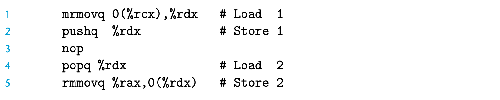

在第 1 行和第 2 行中，`mrmovq` 指令将一个值从内存读入 `%rdx`，然后 `pushq` 指令将该值压栈。我们的 PIPE 设计会停顿 `pushq` 指令以避免加载/使用冒险。然而，注意 `pushq` 指令直到到达访存阶段才需要 `%rdx` 的值。我们可以添加一条额外的旁路路径（如图 4.70 所示），将内存输出（信号 `m_valM`）转发到流水线寄存器 M 中的 `valA` 字段。在下一个时钟周期，该转发值便可写入内存。这种技术称为**加载转发**。

注意，上述代码序列中的第二个示例（第 4 行和第 5 行）无法使用加载转发。`popq` 指令加载的值被下一条指令用于地址计算，该值在执行阶段而非访存阶段就需要用到。

---

<!-- Page 0506 -->

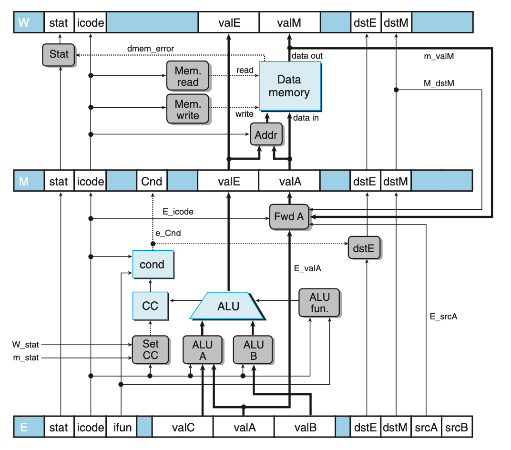

| 图 4.70 支持加载转发的执行和访存阶段。通过添加从内存输出到流水线寄存器 M 中 valA 源的旁路路径，我们可以对一种形式的加载/使用冒险使用转发而非停顿。这是题 4.57 的主题。|
| :-------------------------------: |

A. 编写一个逻辑公式描述加载/使用冒险的检测条件，类似于图 4.64 中给出的公式，但在可以使用加载转发的情况下不会引发停顿。

B. 文件 `pipe-lf.hcl` 包含 PIPE 控制逻辑的修改版本。其中定义了信号 `e_valA` 以实现图 4.70 中标记为"Fwd A"的模块。它还将流水线控制逻辑中加载/使用冒险的条件设为零，因此流水线控制逻辑不会检测任何形式的加载/使用冒险。修改该 HCL 描述以实现加载转发。请参阅实验材料了解如何生成和测试模拟器。

---

<!-- Page 0507 -->

**4.58 ◆◆◆**

我们的流水线设计有些不切实际，因为我们为寄存器文件设置了两个写端口，但只有 `popq` 指令需要同时写入寄存器文件两次。其他指令因此可以使用单个写端口，共用该端口来写入 `valE` 和 `valM`。下图展示了写回逻辑的修改版本，其中我们将写回寄存器 ID（`W_dstE` 和 `W_dstM`）合并为单一信号 `w_dstE`，将写回值（`W_valE` 和 `W_valM`）合并为单一信号 `w_valE`：

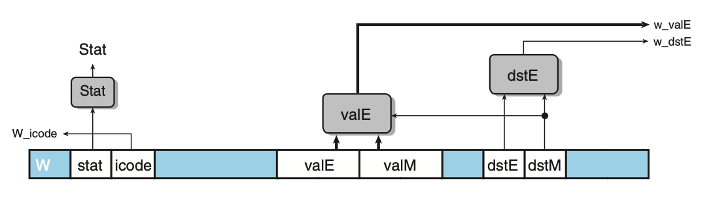

执行合并的逻辑用 HCL 编写如下：

```hcl
## 设置 E 端口寄存器 ID
word w_dstE = [
    ## 从 valM 写入
    W_dstM != RNONE : W_dstM;
    1: W_dstE;
];
## 设置 E 端口值
word w_valE = [
    W_dstM != RNONE : W_valM;
    1: W_valE;
];
```

这些多路复用器的控制由 `dstE` 决定——当它指示有某个寄存器时，选择端口 E 的值；否则选择端口 M 的值。

在仿真模型中，我们可以禁用寄存器端口 M，如下面的 HCL 代码所示：

```hcl
## 禁用寄存器端口 M
## 设置 M 端口寄存器 ID
word w_dstM = RNONE;
## 设置 M 端口值
word w_valM = 0;
```

挑战在于设计处理 `popq` 的方法。一种方法是使用控制逻辑动态处理指令 `popq rA`，使其效果等同于以下两条指令序列：

---

<!-- Page 0508 -->

```
iaddq $8, %rsp
mrmovq -8(%rsp), rA
```

（参见练习题 4.3 了解 `iaddq` 指令的描述。）注意两条指令的顺序，以确保 `popq %rsp` 能正确工作。你可以通过让译码阶段的逻辑以与上述 `iaddq` 相同的方式处理 `popq`，但预测下一条 PC 等于当前 PC 来实现这一点。在下一个周期，`popq` 指令被重新取指，但指令代码被转换为特殊值 `IPOP2`。这被视为一条特殊指令，其行为与上述 `mrmovq` 指令相同。

文件 `pipe-1w.hcl` 包含上述修改后的写端口逻辑。其中声明了常量 `IPOP2`（十六进制值为 E）。还包含信号 `f_icode` 的定义，该信号生成流水线寄存器 D 的 `icode` 字段。可以修改该定义，以便在第二次取指 `popq` 指令时插入指令代码 `IPOP2`。HCL 文件还包含信号 `f_pc` 的声明，即取指阶段由标记为"选择 PC"的模块（图 4.57）生成的程序计数器值。

修改该文件中的控制逻辑，以我们描述的方式处理 `popq` 指令。请参阅实验材料了解如何生成和测试模拟器。

---

**4.59 ◆◆**

比较三个版本冒泡排序（题 4.47、4.48 和 4.49）的性能。解释为什么某个版本比其他版本性能更好。

## 练习题解答

**练习题 4.1 解答（第 396 页）**

手动编码指令颇为繁琐，但这将加深你对汇编代码被汇编器转换为字节序列这一概念的理解。在以下 Y86-64 汇编器的输出中，每行显示一个地址和从该地址开始的字节序列：

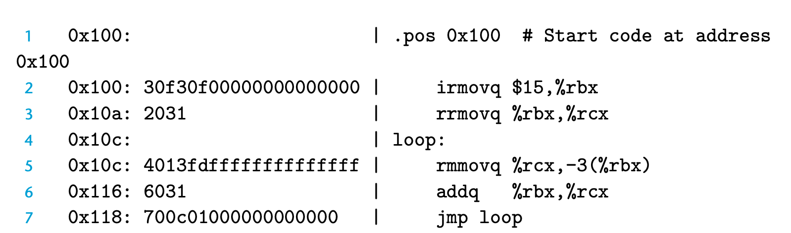


以下几个编码特征值得注意：

- 十进制 15（第 2 行）的十六进制表示为 0x

---

<!-- Page 0509 -->

- 十进制 -3（第 3 行）的十六进制表示为 0xffffeti

- 代码从地址 0x100 开始。第一条指令需要 10 个字节，第二条需要 2 个字节。因此，循环目标地址为 0x0000010c。将这些字节以逆序写出为 `0c 01 00 00 00 00 00`。

---

**练习题 4.2 解答（第 396 页）**

手动解码字节序列有助于理解处理器所面临的任务——它必须读取字节序列并确定要执行的指令。以下展示了用于生成每个字节序列的汇编代码，左侧可以看到每条指令的地址和字节序列。

A. 包含立即数和地址偏移量的一些操作：

```
0x100: 30f3fcffffffff ff   | irmovq $-4, %rbx
0x10a: 4063000800000000 00 | rmmovq %rsi, 0x800(%rbx)
0x114: 00                  | halt
```

B. 包含函数调用的代码：

```
0x200: a06f                | pushq %rsi
0x202: 800c020000000000 00 | call proc
0x20b: 00                  | halt
0x20c:                     | proc:
0x20c: 30f30a0000000000 00 | irmovq $10,%rbx
0x216: 90                  | ret
```

C. 包含非法指令说明符字节 0xf0 的代码：

```
0x300: 50540700000000000000 | mrmovq 7(%rsp),%rbp
0x30a: 10                   | nop
0x30b: f0                   | .byte 0xf0 # Invalid instruction code
0x30c: b01f                 | popq %rcx
```

D. 包含跳转操作的代码：

```
0x400:                    | loop:
0x400: 6113               | subq %rcx, %rbx
0x402: 730004000000000000 | je loop
0x40b: 00                 | halt
```

E. 包含 pushq 指令中无效第二字节的代码：

```
0x500: 6362              | xorq %rsi,%rdx
0x502: a0                | .byte 0xa0  # pushq 指令
code
0x503: f0                | .byte 0xf0  # 无效寄存器说明符字节
specifier byte                        
```

---

<!-- Page 0510 -->

**练习题 4.3 解答（第 405 页）**

使用 `iaddq` 指令，我们可以将 `sum` 函数改写为：

```asm
# long sum(long *start, long count)
# start in %rdi, count in %rsi
sum:
    xorq %rax,%rax     # sum = 0
    andq %rsi,%rsi     # 设置条件码
    jmp     test

loop:
    mrmovq (%rdi), %r10    # 获取 *start
    addq %r10,%rax         # 加到 sum
    iaddq $8,%rdi          # start++
    iaddq $-1,%rsi         # count--

test:
    jne     loop           # 为 0 时停止
    ret
```

---

**练习题 4.4 解答（第 406 页）**

在 x86-64 机器上运行 gcc，会为 `rproduct` 生成以下代码：

```asm
  long rproduct(long *start, long count)
  start in %rdi, count in %rsi
rproduct:
  movl $1, %eax
  testq %rsi, %rsi
  jle .L9
  pushq %rbx
  movq (%rdi), %rbx
  subq $1, %rsi
  addq $8, %rdi
  call rproduct
  imulq %rbx, %rax
  popq %rbx
.L9:
  rep; ret
```

可以轻松地将其改写为 Y86-64 代码：

```asm
# long rproduct(long *start, long count)
# start in %rdi, count in %rsi
rproduct:
    xorq     %rax,%rax         # 将返回值设为 1
    andq     %rsi,%rsi         # 设置条件码
    je       return            # 若 count <= 0，返回 1
    pushq     %rbx             # 保存被调用者保存寄存器
    mrmovq (%rdi),%rbx    # 获取 *start
    irmovq $-1,%r10
    addq %r10,%rsi        # count--
    irmovq $8,%r10
    addq %r10,%rdi        # start++
    call rproduct
    imulq %rbx,%rax       # 将 *start 乘入乘积
    popq %rbx             # 恢复被调用者保存寄存器
return:
    ret
```

---

<!-- Page 0511 -->

**练习题 4.5 解答（第 406 页）**

本题让你有机会尝试编写汇编代码。

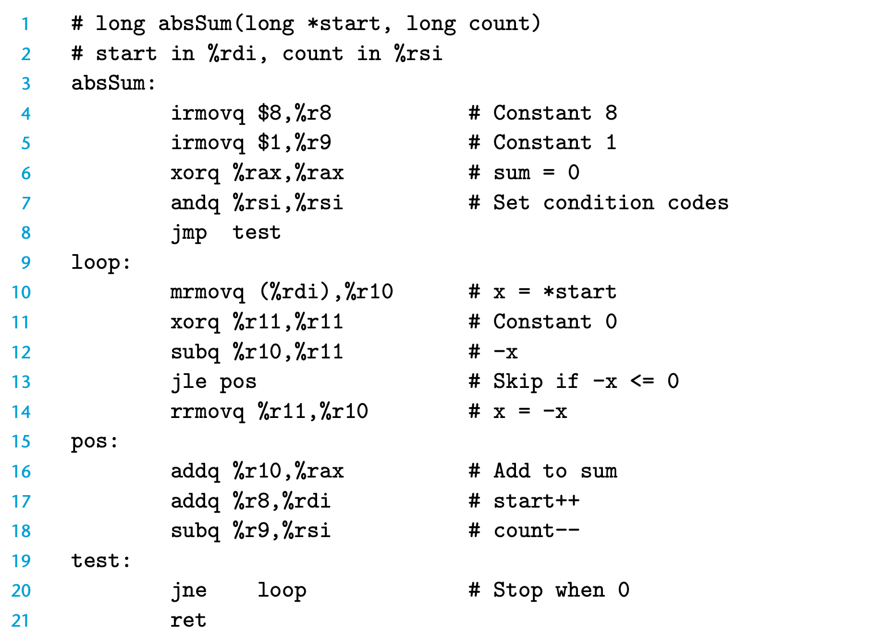

---

**练习题 4.6 解答（第 406 页）**

本题让你有机会尝试使用条件传送编写汇编代码。我们只展示循环的代码，其余部分与练习题 4.5 相同：

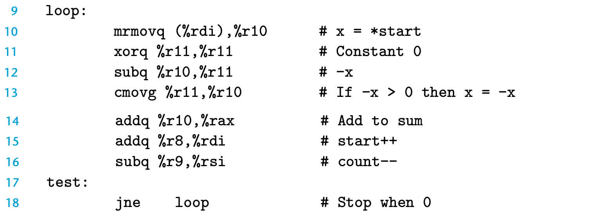

---

<!-- Page 0512 -->

**练习题 4.7 解答（第 406 页）**

虽然很难想象这条特定指令有什么实际用途，但在设计系统时避免规范中的任何歧义非常重要。我们希望为该指令的行为确定一个合理的约定，并确保每个实现都遵守该约定。

该测试中的 `subq` 指令将 `%rsp` 的初始值与压入栈中的值进行比较。减法结果为零这一事实意味着压入的是 `%rsp` 的旧值。

---

**练习题 4.8 解答（第 407 页）**

更难以想象为什么有人会想要弹出到栈指针。尽管如此，我们应该确定一个约定并坚持下去。这段代码将 0xabcd 压入栈，弹出到 `%rsp`，并返回弹出的值。由于结果等于 0xabcd，我们可以推断 `popq %rsp` 将栈指针设置为从内存读取的值。因此，它等价于指令 `mrmovq (%rsp), %rsp`。

---

**练习题 4.9 解答（第 410 页）**

异或（EXCLUSIVE-OR）函数要求两个位具有相反的值：

```
bool xor = (!a && b) || (a && !b);
```

一般来说，信号 `eq` 和 `xor` 互为补。即当一个为 1 时另一个为 0。

---

**练习题 4.10 解答（第 413 页）**

异或电路的输出将是位相等值的补。利用德摩根定律（第 88 页旁注 DATA:BOOL），我们可以用或和非来实现与，得到图 4.71 所示的电路。

---

**练习题 4.11 解答（第 415 页）**

我们可以看到，case 表达式的第二部分可以写为：

```
B <= C           : B;
```

由于第一行将检测 A 为最小元素的情况，第二行只需确定 B 还是 C 为最小值。

---

**练习题 4.12 解答（第 416 页）**

该设计是求三个输入最小值设计的变体：

---

<!-- Page 0513 -->

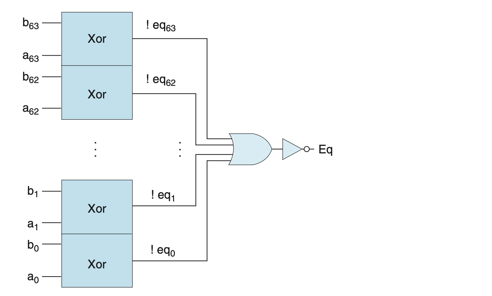

| 图 4.71 练习题 4.10 的解答。|
| :-------------------------------: |

```hcl
word Med3 = [
    A <= B && B <= C : B;
    C <= B && B <= A : B;
    B <= A && A <= C : A;
    C <= A && A <= B : A;
    1                : C;
];
```

---

**练习题 4.13 解答（第 423 页）**

这些练习使阶段计算更加具体。从目标代码可以看出，该指令位于地址 0x016，共 10 个字节，前两个字节为 0x30 和 0xf4，最后 8 个字节是 0x00000000000000080（十进制 128）的字节逆序版本。

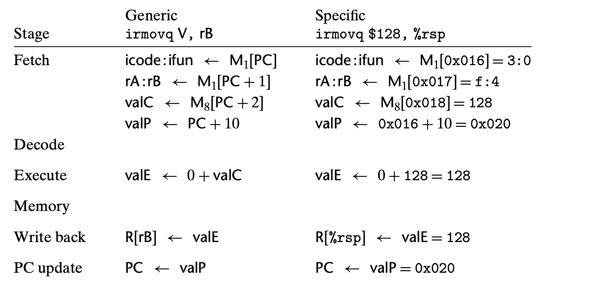

该指令将寄存器 `%rsp` 设置为 128，并将 PC 递增 10。

---

<!-- Page 0514 -->

**练习题 4.14 解答（第 426 页）**

可以看出该指令位于地址 0x02c，共 2 个字节，值为 0xb0 和 0x00f。`%rsp` 被 `pushq` 指令（第 6 行）设置为 120，该指令还在此内存位置存储了 9。

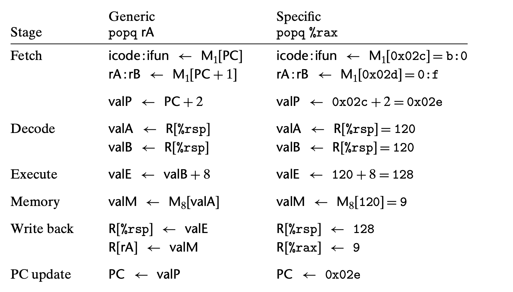

该指令将 `%rax` 设置为 9，将 `%rsp` 设置为 128，并将 PC 递增 2。

---

**练习题 4.15 解答（第 427 页）**

追踪图 4.20 中列出的步骤，当 rA 等于 `%rsp` 时，可以看出在访存阶段，该指令会将 `valA`（栈指针的原始值）存储到内存，与我们在 x86-64 中发现的结果一致。

---

**练习题 4.16 解答（第 428 页）**

追踪图 4.20 中列出的步骤，当 rA 等于 `%rsp` 时，可以看出两个写回操作都会更新 `%rsp`。由于写入 `valM` 的操作最后执行，该指令的净效果是将从内存读取的值写入 `%rsp`，与我们在 x86-64 中观察到的结果一致。

---

**练习题 4.17 解答（第 429 页）**

实现条件传送只需对寄存器到寄存器传送进行微小修改。我们只需根据条件测试的结果来决定是否执行写回步骤：

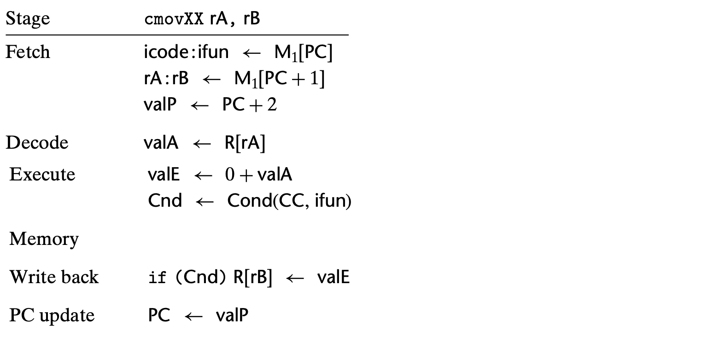

---

<!-- Page 0515 -->

**练习题 4.18 解答（第 430 页）**

可以看出该指令位于地址 0x037，共 9 个字节，第一个字节值为 0x80，最后 8 个字节是 0x00000000000000041（调用目标）的字节逆序版本。栈指针由 `popq` 指令（第 7 行）设置为 128。

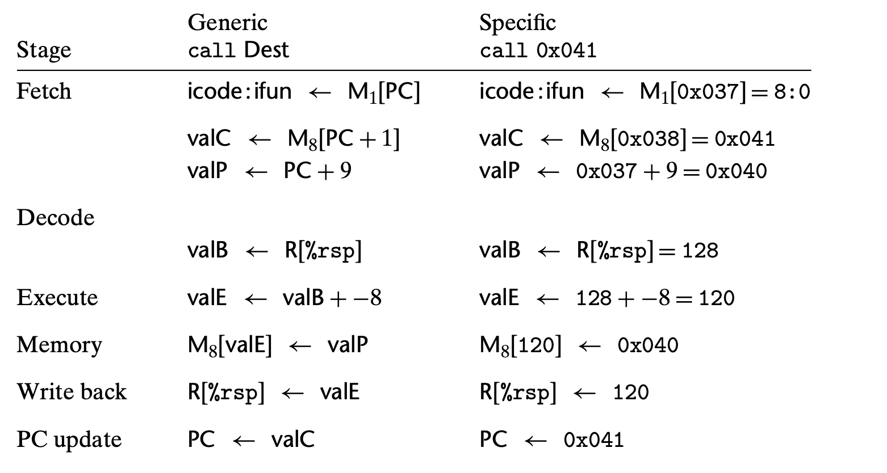

该指令的效果是将 `%rsp` 设置为 120，在此内存地址存储 0x040（返回地址），并将 PC 设置为 0x041（调用目标）。

---

**练习题 4.19 解答（第 442 页）**

本题及其他练习题中的所有 HCL 代码都很直接，但尝试自己生成将有助于思考不同指令及其处理方式。对于本题，我们只需查看 Y86-64 指令集（图 4.2），确定哪些指令有常量字段。

```hcl
bool need_valC =
    icode in { IIRMOVQ, IRMMOVQ, IMRMOVQ, IJXX, ICALL };
```

---

<!-- Page 0516 -->

**练习题 4.20 解答（第 443 页）**

该代码与 `srcA` 的代码类似。

```hcl
word srcB = [
    icode in { IOPQ, IRMMOVQ, IMRMOVQ } : rB;
    icode in { IPUSHQ, IPOPQ, ICALL, IRET } : RRSP;
    1 : RNONE;  # 不需要寄存器
];
```

---

**练习题 4.21 解答（第 444 页）**

该代码与 `dstE` 的代码类似。

```hcl
word dstM = [
    icode in { IMRMOVQ, IPOPQ } : rA;
    1 : RNONE;  # 不写入任何寄存器
];
```

---

**练习题 4.22 解答（第 444 页）**

正如我们在练习题 4.16 中发现的，我们希望通过 M 端口的写操作优先于通过 E 端口的写操作，以便将从内存读取的值存入 `%rsp`。

---

**练习题 4.23 解答（第 445 页）**

该代码与 `aluA` 的代码类似。

```hcl
word aluB = [
    icode in { IRMMOVQ, IMRMOVQ, IOPQ, ICALL, IPUSHQ, IRET, IPOPQ } : valB;
    icode in { IRMMOVQ, IIRMOVQ } : 0;
    # 其他指令不需要 ALU
];
```

---

**练习题 4.24 解答（第 445 页）**

实现条件传送出奇地简单：当条件不满足时，我们通过将目标寄存器设为 `RNONE` 来禁止写入寄存器文件。

```hcl
word dstE = [
    icode in { IRRMOVQ } && Cnd : rB;
    icode in { IIRMOVQ, IOPQ } : rB;
    icode in { IPUSHQ, IPOPQ, ICALL, IRET } : RRSP;
    1 : RNONE;  # 不写入任何寄存器
];
```

---

**练习题 4.25 解答（第 446 页）**

该代码与 `mem_addr` 的代码类似。

---

<!-- Page 0517 -->

```hcl
# 来自寄存器的值
icode in { IRMMOVQ, IPUSHQ } : valA;
# 返回 PC
icode == ICALL : valP;
# 默认：不写入任何内容
];
```

---

**练习题 4.26 解答（第 446 页）**

该代码与 `mem_read` 的代码类似。

```hcl
bool mem_write = icode in { IRMMOVQ, IPUSHQ, ICALL };
```

---

**练习题 4.27 解答（第 447 页）**

计算 `Stat` 字段需要从多个阶段收集状态信息：

```hcl
## 确定指令状态
word Stat = [
    imem_error || dmem_error : SADR;
    !instr_valid: SINS;
    icode == IHALT : SHLT;
    1 : SAOK;
];
```

---

**练习题 4.28 解答（第 453 页）**

本题是寻找一组划分之间最优平衡的有趣练习，提供了多种计算流水线吞吐量和延迟的机会。

A. 对于两级流水线，最佳划分是将模块 A、B、C 放在第一阶段，D、E、F 放在第二阶段。第一阶段的延迟为 170 ps，给出总周期时间为 $170 + 20 = 190$ ps。因此吞吐量为 5.26 GIPS，延迟为 380 ps。

B. 对于三级流水线，应将模块 A 和 B 放在第一阶段，C 和 D 放在第二阶段，E 和 F 放在第三阶段。前两个阶段的延迟为 110 ps，给出总周期时间为 130 ps，吞吐量为 7.69 GIPS，延迟为 390 ps。

C. 对于四级流水线，应将模块 A 放在第一阶段，B 和 C 放在第二阶段，D 放在第三阶段，E 和 F 放在第四阶段。第二阶段需要 90 ps，给出总周期时间为 110 ps，吞吐量为 9.09 GIPS，延迟为 440 ps。

D. 最优设计是五级流水线，每个模块各占一个阶段，只有第五阶段包含模块 E 和 F。周期时间为 $80 + 20 = 100$ ps，吞吐量约为 10.00 GIPS，延迟为 500 ps。增加更多阶段没有帮助，因为流水线不能以低于每 100 ps 一个周期的速度运行。

---

<!-- Page 0518 -->

**练习题 4.29 解答（第 454 页）**

每个阶段的组合逻辑需要 $300/k$ ps，流水线寄存器需要 20 ps。

A. 总延迟为 $300 + 20k$ ps，吞吐量（单位 GIPS）为：

$$\frac{1{,}000}{\frac{300}{k}+20}=\frac{1{,}000k}{300+20k}$$

B. 当 $k$ 趋向无穷时，吞吐量趋近于 $1{,}000/20 = 50$ GIPS。当然，延迟也会趋向无穷。

本题量化了深度流水线的收益递减现象。当我们尝试将逻辑细分为许多阶段时，流水线寄存器的延迟成为限制因素。

---

**练习题 4.30 解答（第 485 页）**

该代码与 SEQ 中对应的代码非常相似，只是我们还不能确定数据内存是否会为该指令生成错误信号。

```hcl
# 确定取指指令的状态码
word f_stat = [
    imem_error: SADR;
    !instr_valid: SINS;
    f_icode == IHALT : SHLT;
    1 : SAOK;
];
```

---

**练习题 4.31 解答（第 485 页）**

该代码只需在 SEQ 代码中的信号名称前添加 `d_` 和 `D_` 前缀。

```hcl
word d_dstE = [
    D_icode in { IRRMOVQ, IRMOVQ, IOPQ } : D_rB;
    D_icode in { IPUSHQ, IPOPQ, ICALL, IRET } : RRSP;
    1 : RNONE; # 不写入任何寄存器
];
```

---

**练习题 4.32 解答（第 488 页）**

`rrmovq` 指令（第 5 行）将因 `popq` 指令（第 4 行）引起的加载/使用冒险而停顿一个周期。当它进入译码阶段时，`popq` 指令将处于访存阶段，使 `M_dstE` 和 `M_dstM` 都等于 `%rsp`。如果两种情况的顺序颠倒，则来自 `M_valE` 的写回将优先，导致递增后的栈指针作为参数传递给 `rrmovq` 指令。这与练习题 4.8 中确定的处理 `popq %rsp` 的约定不一致。

---

<!-- Page 0519 -->

**练习题 4.33 解答（第 488 页）**

本题让你体验处理器设计中的一项重要任务——为新处理器设计测试程序。一般来说，我们应该有能够检验所有不同冒险可能性的测试程序，如果某种相关性未被正确处理，程序将产生错误结果。

对于本例，我们可以使用练习题 4.32 中所示程序的略微修改版本：

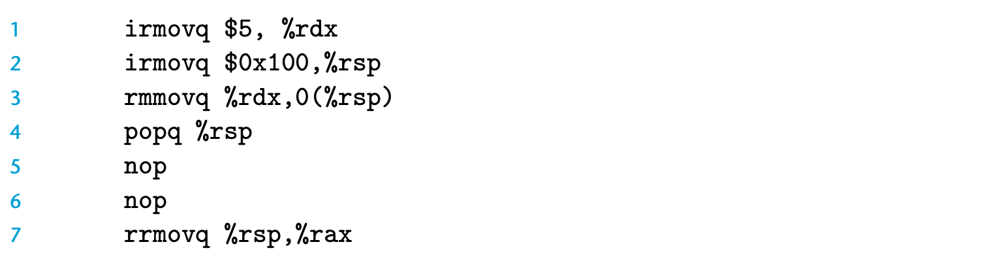

两条 `nop` 指令将使 `popq` 指令处于写回阶段，而 `rrmovq` 指令处于译码阶段。如果写回阶段的两个转发源被赋予错误的优先级，则寄存器 `%rax` 将被设置为递增后的程序计数器，而非从内存读取的值。

---

**练习题 4.34 解答（第 489 页）**

该逻辑只需检查五个转发源：

```hcl
word d_valB = [
    d_srcB == e_dstE : e_valE;   # 从执行阶段转发 valE
    d_srcB == M_dstM : m_valM;   # 从访存阶段转发 valM
    d_srcB == M_dstE : M_valE;   # 从访存阶段转发 valE
    d_srcB == W_dstM : W_valM;   # 从写回阶段转发 valM
    d_srcB == W_dstE : W_valE;   # 从写回阶段转发 valE
    1 : d_rvalB;                 # 使用从寄存器文件读取的值
];
```

---

**练习题 4.35 解答（第 490 页）**

这一改变无法处理条件传送未满足条件、因此将 `dstE` 值设为 `RNONE` 的情况。由此产生的值可能被转发到下一条指令，即使条件传送并未发生。


---

<!-- Page 0520 -->

该代码将寄存器 `%rdx` 初始化为 0x321。条件数据传送不发生，因此最后的 `addq` 指令应将 `%rdx` 中的值加倍得到 0x642。然而，在修改后的设计中，条件传送的源值 0x321 被转发到 ALU 输入 `valA`，而输入 `valB` 正确地得到操作数值 0x123。这两个输入相加产生结果 0x444。

---

**练习题 4.36 解答（第 491 页）**

该代码完成了对该指令状态码的计算。

```hcl
## 更新状态
word m_stat = [
    dmem_error : SADR;
    1 : M_stat;
];
```

---

**练习题 4.37 解答（第 497 页）**

以下测试程序旨在建立控制组合 A（图 4.67）并检测是否出现问题：

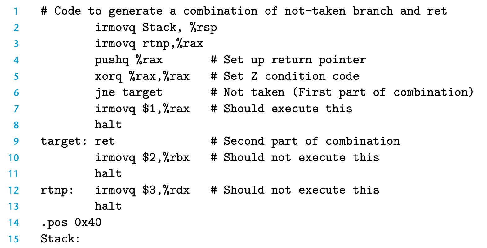

该程序的设计使得如果出现问题（例如 `ret` 指令实际被执行），程序将执行某条额外的 `irmovq` 指令然后停止。因此，流水线中的错误会导致某个寄存器被错误更新。该代码说明了实现测试程序所需的谨慎：必须设置潜在的错误条件，然后检测错误是否发生。

---

**练习题 4.38 解答（第 498 页）**

以下测试程序旨在建立控制组合 B（图 4.67）。模拟器会检测流水线寄存器的气泡和停顿控制信号都设为零的情况，因此我们的测试程序只需建立该组合即可被检测到。最大的挑战是使程序在正确处理时能做出有意义的动作。

---

<!-- Page 0521 -->

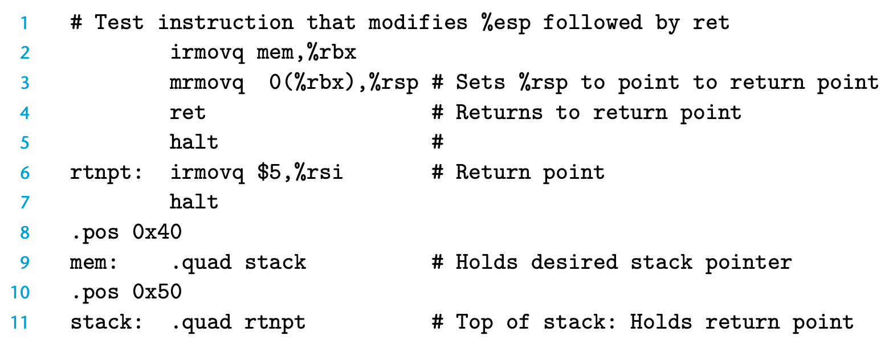

该程序在内存中使用两个初始化的字。第一个字（`mem`）存放第二个字（`stack`——所需栈指针）的地址。第二个字存放 `ret` 指令所需返回点的地址。程序将栈指针加载到 `%rsp` 并执行 `ret` 指令。

---

**练习题 4.39 解答（第 499 页）**

从图 4.66 可以看出，流水线寄存器 D 必须为加载/使用冒险而停顿：

```hcl
bool D_stall =
    # 加载/使用冒险的条件
    E_icode in { IMRMOVQ, IPOPQ } &&
    E_dstM in { d_srcA, d_srcB };
```

---

**练习题 4.40 解答（第 500 页）**

从图 4.66 可以看出，流水线寄存器 E 必须在加载/使用冒险或分支预测错误时插入气泡：

```hcl
bool E_bubble =
    # 分支预测错误
    (E_icode == IJXX && !e_Cnd) ||
    # 加载/使用冒险的条件
    E_icode in { IMRMOVQ, IPOPQ } &&
    E_dstM in { d_srcA, d_srcB };
```

---

**练习题 4.41 解答（第 500 页）**

该控制需要检查正在执行指令的代码，并检查流水线下游的异常。

```hcl
## 条件码是否应更新？
bool set_cc = E_icode == IOPQ &&
    # 仅在正常操作期间更改状态
    !m_stat in { SADR, SINS, SHLT } &&
    !W_stat in { SADR, SINS, SHLT };
```

---

**练习题 4.42 解答（第 500 页）**

在下一个周期向访存阶段注入气泡，需要检查当前周期访存阶段或写回阶段是否存在异常。

---

<!-- Page 0522 -->

```hcl
# 一旦异常经过访存阶段就开始注入气泡
bool M_bubble = m_stat in { SADR, SINS, SHLT } ||
                W_stat in { SADR, SINS, SHLT };
```

对于停顿写回阶段，我们只检查该阶段指令的状态。如果在异常指令处于访存阶段时也停顿，则该指令将无法进入写回阶段。

```hcl
bool W_stall = W_stat in { SADR, SINS, SHLT };
```

---

**练习题 4.43 解答（第 504 页）**

此时预测错误频率为 0.35，给出 $mp = 0.20 \times 0.35 \times 2 = 0.14$，总体 CPI 为 1.25。这似乎是一个相当有限的收益，但如果实现新分支预测策略的代价不太高，则这是值得的。

---

**练习题 4.44 解答（第 504 页）**

这种简化分析——专注于内层循环——是估算程序性能的有用方法。只要数组足够大，代码其他部分所花费的时间可以忽略不计。

A. 使用条件跳转的代码内层循环有 11 条指令，当数组元素为零或负数时全部执行，当数组元素为正数时执行 10 条。平均为 10.5 条。使用条件传送的代码内层循环有 10 条指令，每次全部执行。

B. 关闭循环的跳转预测正确，除了循环终止时。对于非常长的数组，这一次预测错误对性能影响可以忽略。对于基于跳转的代码，气泡的唯一其他来源是条件跳转，这取决于数组元素是否为正数。这将导致两个气泡，但只有 50% 的时间发生，所以平均为 1.0。条件传送代码中没有气泡。

C. 我们的条件跳转代码每个数组元素平均需要 $10.5 + 1.0 = 11.5$ 个周期（最佳情况 11 个周期，最差情况 12 个周期），而条件传送代码在所有情况下都需要 10.0 个周期。

我们的流水线的分支预测错误惩罚只有两个周期——远优于高性能处理器深度流水线的惩罚。因此，使用条件传送对程序性能影响不大。

