# 第 05 章：优化程序性能

<!-- Page 0523 -->

5.1 优化编译器的能力和局限性 534

5.2 表达程序性能 538

5.3 程序示例 540

5.4 消除循环低效率 544

5.5 减少过程调用 548

5.6 消除不必要的内存引用 550

5.7 理解现代处理器 553

5.8 循环展开 567

5.9 增强并行性 572

5.10 优化组合代码的结果总结 583

5.11 一些限制因素 584

5.12 理解内存性能 589

5.13 现实世界：性能改进技术 597

5.14 识别和消除性能瓶颈 598

5.15 总结 604

参考文献说明 605

家庭作业 606

练习题答案 609

---

<!-- Page 0524 -->

编写程序的首要目标必须是使其在所有可能的条件下都能正确工作。运行快速但给出错误结果的程序没有任何实用价值。程序员必须编写清晰简洁的代码，不仅要让自己能够理解，还要让其他人在代码审查和后续修改时能够阅读和理解代码。

另一方面，在许多情况下，让程序快速运行也是一个重要考虑因素。如果程序必须实时处理视频帧或网络数据包，那么运行缓慢的程序将无法提供所需的功能。当计算任务要求极高，需要数天或数周才能执行时，让它运行快 20% 就可以产生重大影响。在本章中，我们将探索如何通过几种不同类型的程序优化来使程序运行得更快。

编写高效程序需要几种类型的活动。首先，我们必须选择一组合适的算法和数据结构。其次，我们必须编写编译器能够有效优化的源代码，以生成高效的可执行代码。对于第二部分，理解优化编译器的能力和局限性很重要。程序编写方式的看似微小的变化可能会对编译器优化程度产生很大差异。某些编程语言比其他语言更容易优化。C 的某些特性，例如执行指针算术和类型转换的能力，使得编译器难以对其进行优化。程序员通常可以通过使编译器更容易生成高效代码的方式来编写程序。处理特别苛刻的计算的第三种技术是将任务划分为可以在多个核心和多个处理器的某种组合上并行计算的部分。我们将把性能增强的这一方面推迟到第 12 章。即使在利用并行性时，每个并行线程以最高性能执行也很重要，因此本章的材料在任何情况下都保持相关性。

在进行程序开发和优化时，我们必须考虑代码将如何使用以及哪些关键因素影响它。一般来说，程序员必须在程序的实现、维护难易程度与运行速度之间做出权衡。在算法层面，一个简单的插入排序可以在几分钟内编程完成，而一个高效的排序例程可能需要一天或更长时间来实现和优化。在编码层面，许多低级优化往往会降低代码的可读性和模块化，使程序更容易出现错误，更难修改或扩展。对于将在性能关键环境中重复执行的代码，广泛的优化可能是合适的。一个挑战是在进行广泛转换的同时保持代码的某种程度的优雅性和可读性。

我们描述了许多提高代码性能的技术。理想情况下，编译器应该能够接受我们编写的任何代码，并生成具有指定行为的最高效的机器级程序。现代编译器采用复杂的分析和优化形式，并且它们不断改进。然而，即使是最好的编译器也可能被优化阻碍因素所挫败——程序行为的某些方面强烈依赖于执行环境。程序员必须通过编写易于优化的代码来帮助编译器。

---

<!-- Page 0525 -->

优化程序的第一步是消除不必要的工作，使代码尽可能高效地执行其预期任务。这包括消除不必要的函数调用、条件测试和内存引用。这些优化不依赖于目标机器的任何特定属性。

为了最大化程序的性能，程序员和编译器都需要一个目标机器的模型，指定指令如何处理以及不同操作的时序特性。例如，编译器必须知道时序信息才能决定是否应该使用乘法指令或某种移位和加法的组合。现代计算机使用复杂的技术来处理机器级程序，并行执行许多指令，并可能以与它们在程序中出现的顺序不同的顺序执行。程序员必须了解这些处理器的工作原理，才能调整他们的程序以获得最大速度。我们基于英特尔和 AMD 处理器的最新设计提出了这样一台机器的高级模型。我们还设计了一种图形数据流符号来可视化处理器执行指令的过程，通过它我们可以预测程序性能。

通过对处理器操作的理解，我们可以在程序优化中采取第二步，利用处理器提供指令级并行性的能力，同时执行多条指令。我们涵盖了几种程序转换，这些转换减少了计算不同部分之间的数据依赖性，提高了它们可以执行的并行度。

我们通过讨论与优化大型程序相关的问题来结束本章。我们描述了代码性能分析器的使用——测量程序不同部分性能的工具。这种分析可以帮助找到代码中的低效率并识别程序中应该集中优化工作的部分。

在本次演示中，我们让代码优化看起来像是按特定顺序对代码应用一系列转换的简单线性过程。实际上，这项任务远非如此简单。需要大量的试错实验。这在我们接近后期优化阶段时尤其如此，在这些阶段，看似很小的变化可能会导致性能的重大变化，而某些非常有前途的技术被证明是无效的。正如我们将在下面的示例中看到的，很难准确解释为什么特定的代码序列具有特定的执行时间。性能可能取决于处理器设计的许多详细特性，对于这些特性我们的文档或理解相对较少。这是尝试许多不同变化和技术组合的另一个原因。

研究程序的汇编代码表示是获得对编译器和生成代码如何运行的理解的最有效方法之一。一个好的策略是从仔细查看内部循环的代码开始，识别降低性能的属性，如过多的内存引用和寄存器的不良使用。从汇编代码开始，我们还可以预测哪些操作将并行执行以及它们将如何充分利用处理器资源。正如我们将看到的，我们通常可以通过识别关键路径来确定执行循环所需的时间（或至少是时间的下限），关键路径是在循环的重复执行期间形成的数据依赖链。然后我们可以返回并修改源代码，试图引导编译器朝着更高效的实现方向发展。

---

<!-- Page 0526 -->

大多数主要的编译器，包括 GCC，都在不断更新和改进，尤其是在优化能力方面。一个有用的策略是只对程序进行足够的重写，使其达到编译器可以生成高效代码的程度。通过这种方式，我们避免像使用能力最小的编译器那样损害代码的可读性、模块化和可移植性。同样，通过测量和检查生成的汇编代码来迭代修改代码和分析其性能是有帮助的。

对于初学者程序员来说，为了诱导编译器生成高效代码而不断修改源代码可能看起来很奇怪，但这确实是许多高性能程序的编写方式。与用汇编语言编写代码的替代方案相比，这种间接方法的优点是生成的代码仍然可以在其他机器上运行，尽管可能不是以峰值性能。

## 5.1 优化编译器的能力和局限性

现代编译器采用复杂的算法来确定程序中计算了哪些值以及如何使用它们。然后，它们可以利用机会来简化表达式、在多个不同的地方使用单个计算，以及减少必须执行给定计算的次数。大多数编译器，包括 GCC，为用户提供对应用哪些优化的一些控制。如第 3 章所述，最简单的控制是指定优化级别。例如，使用命令行选项 `-Og` 调用 GCC 指定它应该应用一组基本的优化。

使用选项 `-O1` 或更高（例如 `-O2` 或 `-O3`）调用 GCC 将导致它应用更广泛的优化。这些可以进一步提高程序性能，但它们可能会扩大程序大小，并且可能使使用标准调试工具调试程序变得更加困难。在我们的演示中，我们主要考虑使用优化级别 `-O1` 编译的代码，尽管级别 `-O2` 已成为使用 GCC 的大多数软件项目的公认标准。我们故意限制优化级别，以演示用 C 编写函数的不同方式如何影响编译器生成的代码的效率。我们将发现，我们可以编写 C 代码，当只使用选项 `-O1` 编译时，其性能远远超过使用最高可能优化级别编译的更幼稚的版本。

编译器必须小心地只对程序应用安全的优化，这意味着对于程序可能遇到的所有可能情况，生成的程序将具有与未优化版本完全相同的行为，直到 C 语言标准提供的保证的限制。限制编译器仅执行安全优化，可消除潜在的异常运行时行为来源，但这也意味着程序员必须付出更多努力，以编写出能被编译器转换为高效机器级代码的程序。为了理解决定哪些程序转换是安全的挑战，请考虑以下两个过程：

---

<!-- Page 0527 -->

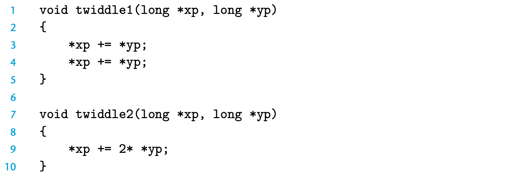

乍一看，这两个过程似乎具有相同的行为。它们都将指针 yp 指定的位置存储的值的两倍加到 xp 指定的位置。另一方面，函数 twiddle2 更高效。它只需要三次内存引用（读 *xp、读 *yp、写 *xp），而 twiddle1 需要六次（两次读 *xp、两次读 *yp 和两次写 *xp）。因此，如果给编译器提供过程 twiddle1 来编译，人们可能会认为它可以基于 twiddle2 执行的计算生成更高效的代码。

然而，考虑 xp 和 yp 相等的情况。那么函数 twiddle1 将执行以下计算：


结果将是 xp 处的值将增加 4 倍。另一方面，函数 twiddle2 将执行以下计算：


结果将是 xp 处的值将增加 3 倍。编译器对 twiddle1 将如何调用一无所知，因此它必须假设参数 xp 和 yp 可能相等。因此，它不能生成 twiddle2 风格的代码作为 twiddle1 的优化版本。

两个指针可能指定相同内存位置的情况称为内存别名 (memory aliasing)。在仅执行安全优化时，编译器必须假设不同的指针可能是别名的。作为另一个例子，对于具有指针变量 p 和 q 的程序，考虑以下代码序列：

```c
x = 1000; y = 3000;
*q = y;     /* 3000 */
*p = x;     /* 1000 */
t1 = *q;    /* 1000 or 3000 */
```

---

<!-- Page 0528 -->

为 t1 计算的值取决于指针 p 和 q 是否是别名——如果不是，它将等于 3,000，但如果是，它将等于 1,000。这导致了主要的优化阻碍因素之一，即程序的某些方面可能严重限制编译器生成优化代码的机会。如果编译器无法确定两个指针是否可能是别名，它必须假设任何一种情况都是可能的，从而限制可能的优化集。

---

**练习题 5.1（答案见第 609 页）**

以下问题说明了内存别名如何导致意外的程序行为。考虑以下交换两个值的过程：

```c
/* Swap value x at xp with value y at yp */
void swap(long *xp, long *yp)
{
    *xp = *xp + *yp; /* x+y       */
    *yp = *xp - *yp; /* x+y-y = x */
    *xp = *xp - *yp; /* x+y-x = y */
}
```

如果使用 xp 等于 yp 调用此过程，会有什么效果？

---

第二个优化阻碍因素是由于函数调用。作为一个例子，考虑以下两个过程：

```c
long f();

long func1() {
    return f() + f() + f() + f();
}

long func2() {
    return 4 * f();
}
```

乍一看，两者似乎计算相同的结果，但 func2 只调用 f 一次，而 func1 调用它四次。当给定 func1 作为源时，很容易生成 func2 风格的代码。

然而，考虑 f 的以下代码：

```c
long counter = 0;

long f() {
    return counter++;
}
```

这个函数有副作用——它修改了全局程序状态的某些部分。改变它被调用的次数会改变程序行为。特别是，调用 func1 将返回 $0 + 1 + 2 + 3 = 6$，而调用 func2 将返回 $4 \cdot 0 = 0$，假设两者都从全局变量 counter 设置为零开始。

---

<!-- Page 0529 -->

>**旁注 通过内联替换优化函数调用**
>
>涉及函数调用的代码可以通过称为内联替换（或简称"内联"）的过程进行优化，其中函数调用被函数体的代码替换。例如，我们可以通过替换函数 f 的四个实例化来扩展 func1 的代码：
>
>```c
>/* Result of inlining f in func1 */
>long func1in() {
>    long t = counter++; /* +0 */
>    t += counter++;    /* +1 */
>    t += counter++;    /* +2 */
>    t += counter++;    /* +3 */
>    return t;
>}
>```
>
>这种转换既减少了函数调用的开销，又允许对扩展代码进行进一步优化。例如，编译器可以合并 func1in 中全局变量 counter 的更新以生成函数的优化版本：
>
>```c
>/* Optimization of inclined code */
>long func1opt() {
>    long t = 4 * counter + 6;
>    counter += 4;
>    return t;
>}
>```
>
>对于 f 的这个特定定义，此代码忠实地再现了 func1 的行为。
>
>最近版本的 GCC 尝试这种形式的优化，无论是在使用命令行选项 `-finline` 时，还是对于优化级别 `-O1` 及更高级别。不幸的是，GCC 只尝试对单个文件中定义的函数进行内联。这意味着它不会应用于常见情况，即在一个文件中定义一组库函数但在其他文件中的函数调用它们。
>
>有时最好防止编译器执行内联替换。一种情况是当使用符号调试器（如 GDB，如第 3.10.2 节所述）评估代码时。如果函数调用通过内联替换被优化掉，则任何跟踪或为该调用设置断点的尝试都将失败。第二种情况是通过性能分析评估程序性能时，如第 5.14.1 节所述。通过内联替换消除的函数调用将不会被正确分析。


大多数编译器不会尝试确定函数是否没有副作用，因此是诸如 func2 中尝试的优化的候选者。相反，编译器假设最坏的情况并保持函数调用完整。

---

<!-- Page 0530 -->

在编译器中，GCC 在优化能力方面被认为是足够的，但不是特别出色的。它执行基本优化，但不对程序执行更"激进"的编译器所做的彻底转换。因此，使用 GCC 的程序员必须更加努力地以简化编译器生成高效代码任务的方式编写程序。

## 5.2 表达程序性能

我们引入了每元素周期数 (cycles per element) 的度量，缩写为 CPE，以一种可以指导我们改进代码的方式表达程序性能。CPE 测量帮助我们在详细层面理解迭代程序的循环性能。它适用于执行重复计算的程序，例如处理图像中的像素或计算矩阵乘积中的元素。

处理器的活动排序由提供某个频率的规则信号的时钟控制，通常以千兆赫兹 (GHz)，即每秒数十亿个周期表示。例如，当产品文献将系统描述为"4 GHz"处理器时，这意味着处理器时钟以 $4.0 \times 10^{9}$ 周期/秒的速度运行。每个时钟周期所需的时间由时钟频率的倒数给出。这些通常以纳秒（1 纳秒是 $10^{-9}$ 秒）或皮秒（1 皮秒是 $10^{-12}$ 秒）表示。例如，4 GHz 时钟的周期可以表示为 0.25 纳秒或 250 皮秒。从程序员的角度来看，用时钟周期而不是纳秒或皮秒来表示测量更具指导意义。这样，测量表示正在执行多少条指令，而不是时钟运行的速度。

许多过程包含一个迭代一组元素的循环。例如，图 5.1 中的函数 psum1 和 psum2 都计算长度为 n 的向量的前缀和。对于向量 $\vec{a} = \langle a_0, a_1, \ldots, a_{n-1} \rangle$，前缀和 $\vec{p} = \langle p_0, p_1, \ldots, p_{n-1} \rangle$ 定义为

$$\begin{aligned}&p_{0}=a_{0}\\&p_{i}=p_{i-1}+a_{i},\quad1\leq i<n \tag{5.1}
\end{aligned}$$

函数 psum1 每次迭代计算结果向量的一个元素。函数 psum2 使用一种称为循环展开的技术每次迭代计算两个元素。我们将在本章后面探讨循环展开的好处。（有关分析和优化前缀和计算的更多信息，请参见问题 5.11、5.12 和 5.19。）

此类过程所需的时间可以表征为常数加上与处理的元素数量成比例的因子。例如，图 5.2 显示了这两个函数对于 n 的一系列值所需的时钟周期数的图。使用最小二乘拟合，我们发现 psum1 和 psum2 的运行时间（以时钟周期为单位）可以分别由方程 $368 + 9.0n$ 和 $368 + 6.0n$ 近似。这些方程表明由于计时代码和启动过程、设置循环和完成所需的 368 个周期的开销过程，加上每元素 6.0 或 9.0 个周期的线性因子。对于较大的 n 值（比如大于 200），运行时间将由线性因子主导。我们将这些项中的系数称为有效的每元素周期数。我们更喜欢测量每元素的周期数而不是每次迭代的周期数，因为诸如循环展开之类的技术允许我们使用更少的迭代来完成计算，但我们的最终关注点是程序对于给定向量长度运行的速度。我们将努力集中在最小化计算的 CPE 上。通过这个度量，CPE 为 6.0 的 psum2 优于 CPE 为 9.0 的 psum1。

---

<!-- Page 0531 -->

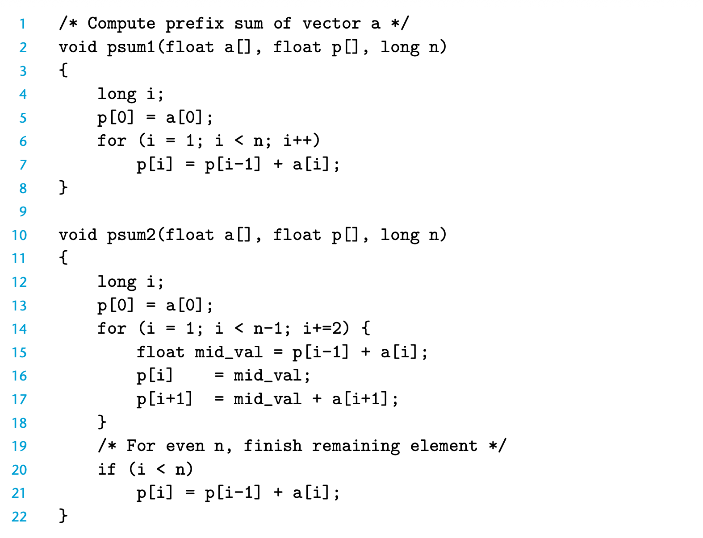

| 图 5.1 前缀和函数。这些函数提供了我们如何表达程序性能的示例。|
| :-------------------------------: |

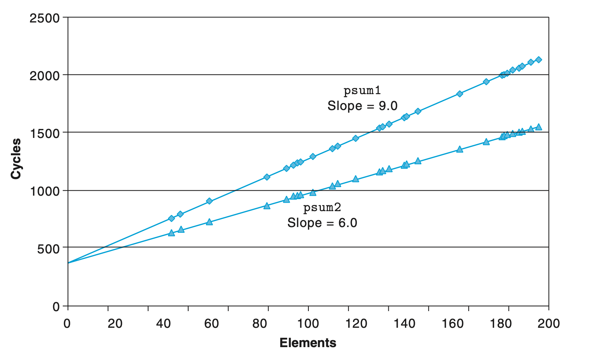

| 图 5.2 前缀和函数的性能。直线的斜率表示每元素时钟周期数 (CPE)。|
| :-------------------------------: |

---

<!-- Page 0532 -->

>**旁注 什么是最小二乘拟合？**
>
>对于一组数据点 $(x_{1}, y_{1}), \ldots (x_{n}, y_{n})$，我们经常尝试绘制一条最能近似这些数据所代表的 X-Y 趋势的直线。通过最小二乘拟合，我们寻找形式为 $y = mx + b$ 的直线，该直线最小化以下误差度量：
>
>$$E(m,b)=\sum_{i=1,n}(mx_{i}+b-y_{i})^{2}$$
>
>可以通过找到 $E(m, b)$ 关于 m 和 b 的导数并将其设置为 0 来推导计算 m 和 b 的算法。

---

**练习题 5.2（答案见第 609 页）**

在本章后面，我们将从一个函数开始，生成许多不同的变体，这些变体保留函数的行为，但具有不同的性能特性。对于其中三个变体，我们发现运行时间（以时钟周期为单位）可以由以下函数近似：

版本 1: 60 + 35n

版本 2: 136 + 4n

版本 3: 157 + 1.25n

对于什么 n 值，每个版本将是三者中最快的？请记住 n 将始终是整数。

---

## 5.3 程序示例

为了演示如何系统地将抽象程序转换为更高效的代码，我们将使用基于图 5.3 所示的向量数据结构的运行示例。向量用两块内存表示：头部和数据数组。头部是一个结构，声明如下：

---

<!-- Page 0533 -->

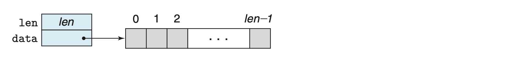

| 图 5.3 向量抽象数据类型。向量由头部信息加上指定长度的数组表示。|
| :-------------------------------: |


```c
/* Create abstract data type for vector */
typedef struct {
    long len;
    data_t *data;
} vec_rec, *vec_ptr;
```

该声明使用 `data_t` 来指定底层元素的数据类型。在我们的评估中，我们测量了整数（C int 和 long）和浮点（C float 和 double）数据的代码性能。我们通过为不同的类型声明分别编译和运行程序来实现这一点，例如以下用于数据类型 long 的声明：

```c
typedef long data_t;
```

我们分配数据数组块以将向量元素存储为 len 个 `data_t` 类型对象的数组。

图 5.4 显示了一些用于生成向量、访问向量元素和确定向量长度的基本过程。需要注意的一个重要特性是 get_vec_element，向量访问例程，对每个向量引用执行边界检查。这段代码类似于许多其他语言（包括 Java）中使用的数组表示。边界检查减少了程序错误的可能性，但也会减慢程序执行速度。

作为优化示例，考虑图 5.5 所示的代码，该代码根据某些操作将向量中的所有元素组合成单个值。通过使用编译时常量 IDENT 和 OP 的不同定义，可以重新编译代码以对数据执行不同的操作。特别是，使用声明

```c
#define IDENT 0
#define OP +
```

它对向量的元素求和。使用声明

```c
#define IDENT 1
#define OP *
```

它计算向量元素的乘积。

在我们的演示中，我们将通过代码的一系列转换，编写组合函数的不同版本。为了衡量进度，我们在具有英特尔 Core i7 Haswell 处理器的机器上测量了函数的 CPE 性能，我们将其称为参考机器。该处理器的一些特性在第 3.1 节中给出。这些测量以程序在一台特定机器上运行的方式来表征性能，因此不能保证在其他机器和编译器组合上有可比的性能。然而，我们已经将结果与许多不同编译器/处理器组合的结果进行了比较，发现它们与此处给出的结果基本一致。

---

<!-- Page 0534 -->

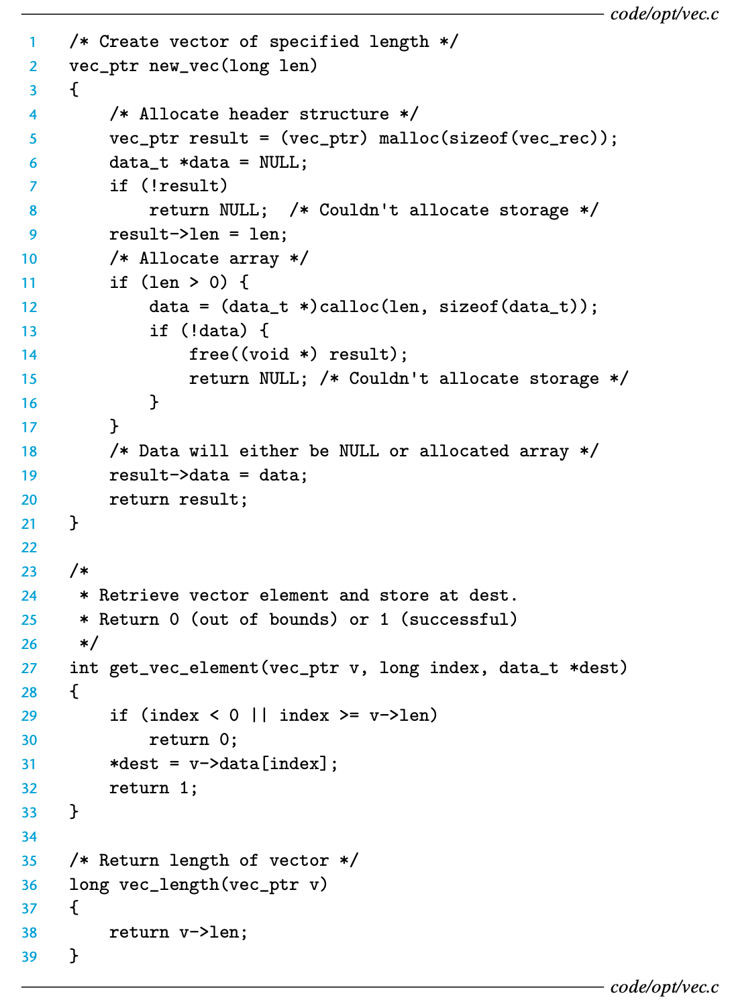

| 图 5.4 向量抽象数据类型的实现。在实际程序中，数据类型 data_t 被声明为 int、long、float 或 double。|
| :-------------------------------: |

---

<!-- Page 0535 -->

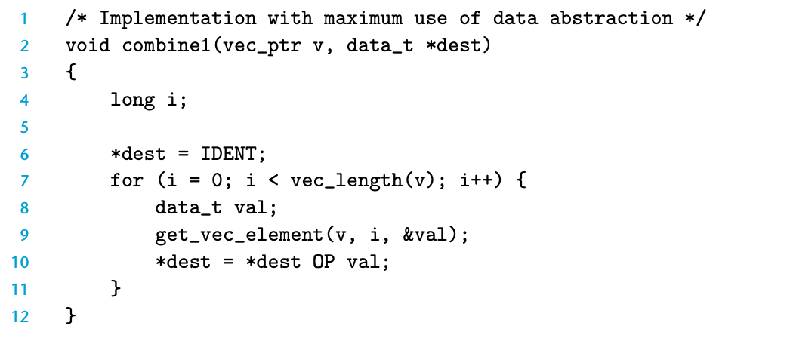

| 图 5.5 组合操作的初始实现。使用恒等元素 IDENT 和组合操作 OP 的不同声明，我们可以测量不同操作的例程。|
| :-------------------------------: |

当我们进行一系列转换时，我们会发现许多转换只能带来最小的性能提升，而其他转换则具有更显著的效果。确定应用哪些转换组合确实是编写快速代码"黑色艺术"的一部分。一些不能提供可测量好处的组合确实无效，而其他组合则是使编译器能够进一步优化的重要方式。根据我们的经验，最好的方法涉及实验和分析的结合：反复尝试不同的方法，执行测量，并检查汇编代码表示以识别潜在的性能瓶颈。

作为起点，下表显示了 combine1 在我们的参考机器上运行的 CPE 测量，具有不同的操作（加法或乘法）和数据类型（长整数和双精度浮点）的组合。我们对许多不同程序的实验表明，对 32 位和 64 位整数的操作具有相同的性能，除了涉及除法操作的代码。同样，我们发现对单精度或双精度浮点数据进行操作的程序具有相同的性能。因此，在我们的表中，我们将只显示整数数据和浮点数据的单独结果。

---

<!-- Page 0536 -->

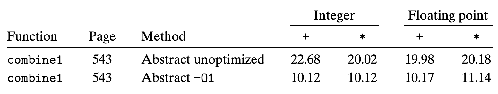

可以看到我们的测量可能有些不精确。整数求和更可能的CPE数值为 23.0 0而非 22.68，而整数乘法的数值更可能是 20.0 而非 20.02。我们不会"捏造"我们的数字使它们看起来不错，而是会呈现我们实际获得的测量结果。有许多因素使可靠地测量某些代码序列所需的精确时钟周期数的任务变得复杂。在检查这些数字时，在心理上将结果上下舍入几百分之一个时钟周期是有帮助的。

未优化的代码提供了 C 代码到机器代码的直接翻译，通常具有明显的低效率。通过简单地提供命令行选项 `-O1`，我们启用了一组基本的优化。正如所见，这显著提高了程序性能——超过 2 倍——而程序员无需付出任何努力。一般来说，养成启用某种级别的优化的习惯是好的。（使用优化级别 `-Og` 获得了类似的性能结果。）对于我们剩余的测量，我们在生成和测量程序时使用优化级别 `-O1` 和 `-O2`。

## 5.4 消除循环低效率

观察图 5.5 所示的过程 combine1，它调用函数 vec_length 作为 for 循环的测试条件。回想我们关于如何将包含循环的代码翻译成机器级程序的讨论（第 3.6.7 节），测试条件必须在循环的每次迭代中进行评估。另一方面，向量的长度在循环进行时不会改变。因此，我们可以只计算一次向量长度并在测试条件中使用此值。

图 5.6 显示了一个名为 combine2 的修改版本。它在开头调用 vec_length 并将结果分配给局部变量 length。这种转换对某些数据类型和操作的整体性能有明显影响，而对其他数据类型和操作的影响最小甚至没有。无论如何，这种转换是消除低效率所必需的，这些低效率在我们尝试进一步优化时会成为瓶颈。

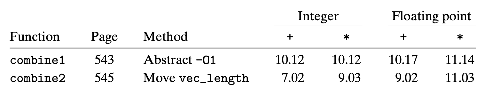

这种优化是一类称为代码移动 (code motion) 的通用优化的实例。它们涉及识别执行多次的计算（例如，在循环内），但计算结果不会改变。因此，我们可以将计算移动到代码的早期部分，该部分不会被如此频繁地评估。在这种情况下，我们将对 vec_length 的调用从循环内移动到循环之前。

---

<!-- Page 0537 -->

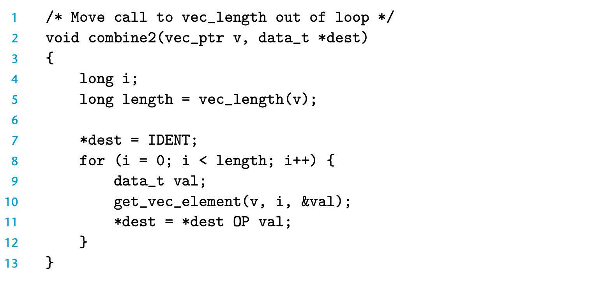

| 图 5.6 提高循环测试的效率。通过将对 `length` 的调用移出循环测试，我们消除了在每次迭代中执行它的需要。|
| :-------------------------------: |

优化编译器尝试执行代码移动。不幸的是，如前所述，它们对于改变过程被调用的位置或次数的转换通常非常谨慎。它们无法可靠地检测函数是否会有副作用，因此它们假设它可能有。例如，如果 vec_length 有一些副作用，那么 combine1 和 combine2 可能会有不同的行为。为了改进代码，程序员通常必须通过显式执行代码移动来帮助编译器。

作为 combine1 中看到的循环低效率的极端例子，考虑图 5.7 所示的过程 lower1。此过程的风格类似于几位学生作为网络编程项目的一部分提交的例程。其目的是将字符串中的所有大写字母转换为小写。该过程遍历字符串，将每个大写字符转换为小写。大小写转换涉及将 'A' 到 'Z' 范围内的字符移动到 'a' 到 'z' 范围。

库函数 `strlen` 作为 lower1 循环测试的一部分被调用。尽管 `strlen` 通常采用特殊的 x86 字符串处理指令实现，但其整体执行过程与图 5.7 中展示的简化版本相似。由于 C `中的字符串是以空终止的字符序列，strlen` 只能通过遍历序列直到遇到空字符来确定字符串的长度。对于长度为 n `的字符串，strlen` 花费的时间与 n 成正比。由于 `strlen` 在 lower1 的 n 次迭代中的每一次都被调用，因此 lower1 的总运行时间在字符串长度上是二次的，与 $n^{2}$ 成正比。

---

<!-- Page 0538 -->

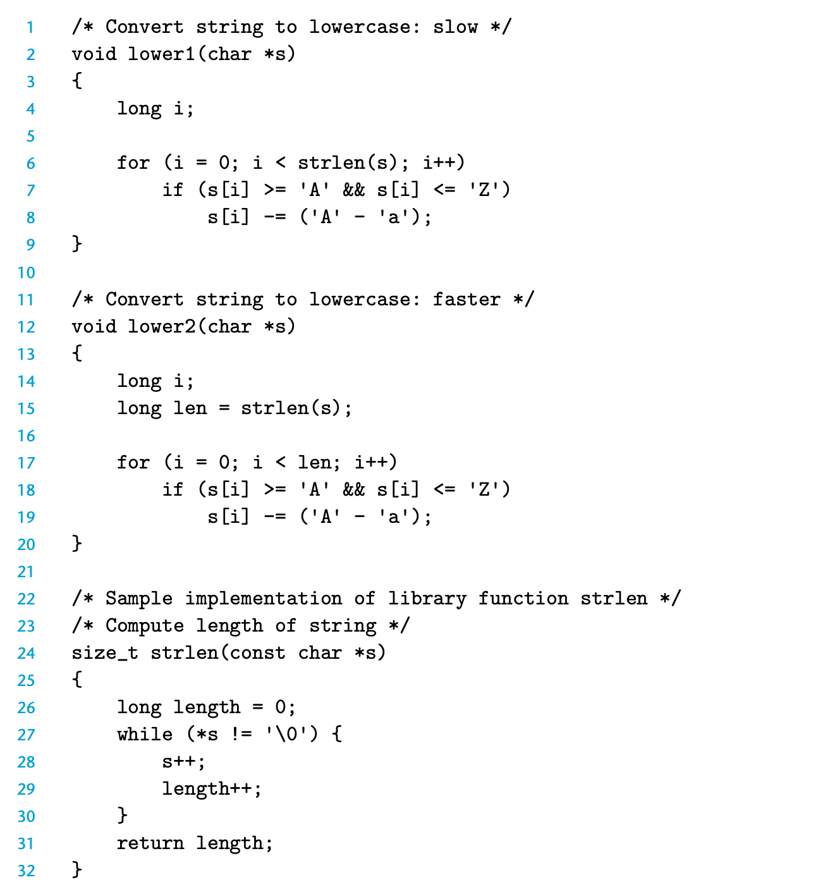

| 图 5.7 小写转换例程。这两个过程具有截然不同的性能。|
| :-------------------------------: |

这一分析得到了对不同长度字符串的函数实际测量的证实，如图 5.8 所示（并使用 strlen 的库版本）。lower1 的运行时间图随着字符串长度的增加而急剧上升（图 5.8(a)）。图 5.8(b) 显示了七种不同长度（与图中显示的不同）的运行时间，每种长度都是 2 的幂。观察到对于 lower1，字符串长度每增加一倍会导致运行时间增加四倍。这是二次运行时间的明显指标。对于长度为 1,048,576 的字符串，lower1 需要超过 17 分钟的 CPU 时间。

---

<!-- Page 0539 -->

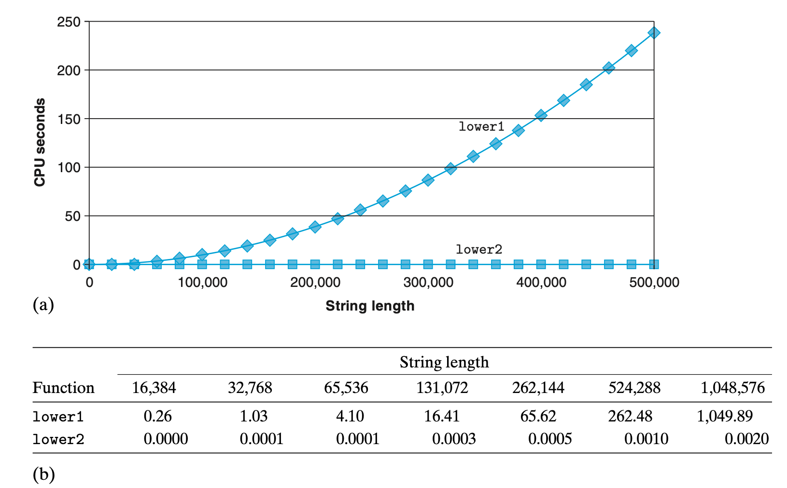

| 图 5.8 小写转换例程的比较性能。原始代码 lower1 由于低效的循环结构而具有二次运行时间。修改后的代码 lower2 具有线性运行时间。|
| :-------------------------------: |

图 5.7 所示的函数 lower2 与 lower1 相同，除了我们已将对 `strlen` 的调用移出循环。性能显著改善。对于长度为 1,048,576 的字符串，该函数只需 2.0 毫秒——比 lower1 快超过 500,000 倍。字符串长度每增加一倍会导致运行时间增加一倍——线性运行时间的明显指标。对于更长的字符串，运行时间改进将更大。

在理想世界中，编译器会识别出循环测试中对 `strlen` 的每次调用都会返回相同的结果，因此调用可以移出循环。这需要非常复杂的分析，因为 `strlen` 检查字符串的元素，而这些值在 lower1 进行时正在改变。编译器需要检测到即使字符串中的字符正在改变，也没有从非零设置为零，反之亦然。即使是最复杂的编译器，即使它们采用内联，这样的分析也远远超出了它们的能力，因此程序员必须自己进行这样的转换。

这个例子说明了编写程序中的一个常见问题，其中看似微不足道的代码具有隐藏的渐近低效率。人们不会期望小写转换例程成为程序性能的限制因素。通常，程序在小数据集上进行测试和分析，对于这些数据集，lower1 的性能是足够的。然而，当程序最终部署时，该过程完全有可能应用于超过一百万个字符的字符串。突然之间，这段良性的代码成为了主要的性能瓶颈。相比之下，lower2 的性能对于任意长度的字符串都是足够的。关于这类问题发生在主要编程项目中的故事比比皆是。有能力的程序员的部分工作是避免引入这种渐近低效率。

---

<!-- Page 0540 -->

**练习题 5.3（答案见第 609 页）**

考虑以下函数：
```c
long min(long x, long y) { return x < y? x : y; }
long max(long x, long y) { return x < y? y : x; }
void incr(long *xp, long v) { *xp += v; }
long square(long x) { return x*x; }
```
以下三个代码片段调用这些函数：
```c
A. for (i = min(x, y); i < max(x, y); incr(&i, 1))
     t += square(i);
B. for (i = max(x, y) - 1; i >= min(x, y); incr(&i, -1))
     t += square(i);
C. long low = min(x, y);
   long high = max(x, y);

   for (i = low; i < high; incr(&i, 1))
        t += square(i);
```

假设 x 等于 10，y 等于 100。填写下表，指示代码片段 A-C 中每个函数被调用的次数：

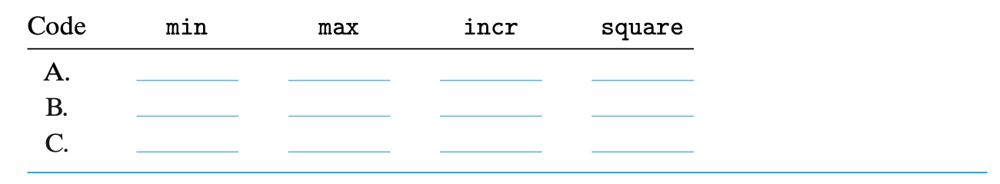

## 5.5 减少过程调用

正如我们所看到的，过程调用会产生开销，还会阻止大多数形式的程序优化。我们可以在 combine2 的代码（图 5.6）中看到，get_vec_element 在每次循环迭代时都被调用以检索下一个向量元素。此函数在每次向量引用时都根据循环边界检查向量索引 i，这是低效率的明显来源。当处理任意数组访问时，边界检查可能是一个有用的功能，但对 combine2 代码的简单分析表明所有引用都是有效的。

---

<!-- Page 0541 -->

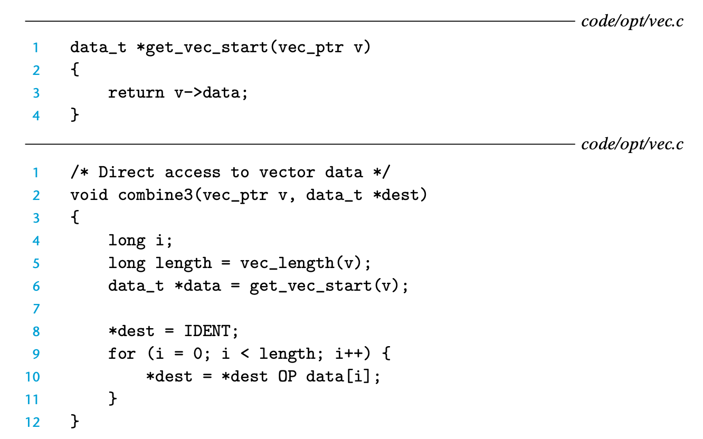

| 图 5.9 消除循环内的函数调用。生成的代码没有显示性能提升，但它启用了额外的优化。|
| :-------------------------------: |

假设我们将函数 get_vec_start 添加到我们的抽象数据类型。此函数返回数据数组的起始地址，如图 5.9 所示。然后我们可以编写该图中显示为 combine3 的过程，在内部循环中没有函数调用。它不是通过函数调用检索每个向量元素，而是直接访问数组。纯粹主义者可能会说这种转换严重损害了程序的模块化。原则上，向量抽象数据类型的用户甚至不需要知道向量内容存储为数组，而不是某些其他数据结构（如链表）。更实用的程序员会认为这种转换是实现高性能结果的必要步骤。

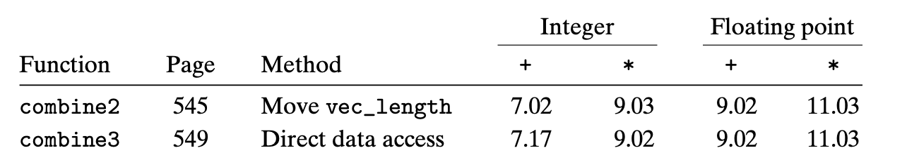

令人惊讶的是，没有明显的性能改进。实际上，整数和的性能略有下降。显然，内部循环中的其他操作正在形成瓶颈，限制性能超过对 get_vec_element 的调用。我们将稍后返回到这个函数（第 5.11.2 节）并看看为什么 combine2 的重复边界检查不会导致性能损失。现在，我们可以将这种转换视为一系列步骤之一，这些步骤最终将导致性能的大幅提高。

---

<!-- Page 0542 -->

## 5.6 消除不必要的内存引用

combine3 的代码在指针 dest 指定的位置累积由组合操作计算的值。通过检查编译代码的内部循环生成的汇编代码可以看到此属性。我们在这里显示为数据类型 double 生成的 x86-64 代码，并以乘法作为组合操作：

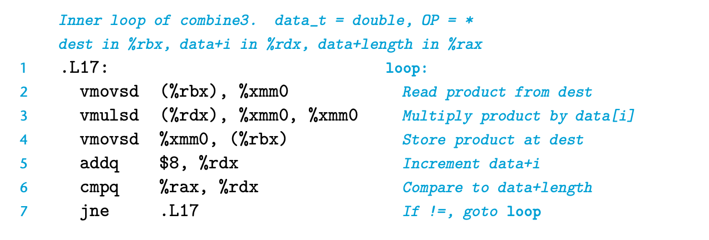

我们在此循环代码中看到对应于指针 dest 的地址保存在寄存器 %rbx 中。它还将代码转换为在寄存器 %rdx 中维护指向第 $i$ 个数据元素的指针，在注释中显示为 data+i。此指针在每次迭代中递增 8。循环终止通过将此指针与存储在寄存器 %rax 中的指针进行比较来检测。我们可以看到累积值在每次迭代中都从内存读取和写入内存。这种读取和写入是浪费的，因为在每次迭代开始时从 dest 读取的值应该只是在上一次迭代结束时写入的值。

我们可以通过以图 5.10 中 combine4 的风格重写代码来消除这种不必要的内存读写。我们引入一个临时变量 acc，该变量在循环中用于累积计算值。结果仅在循环完成后存储在 dest 处。如下面的汇编代码所示，编译器现在可以使用寄存器 %xmm0 来保存累积值。与 combine3 中的循环相比，我们已将每次迭代的内存操作从两次读取和一次写入减少到只有一次读取。

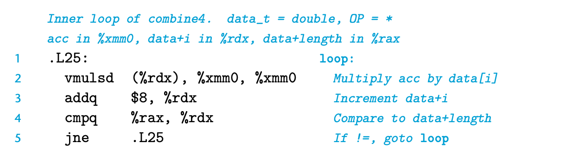

我们看到程序性能有显著改进，如下表所示：

---

<!-- Page 0543 -->

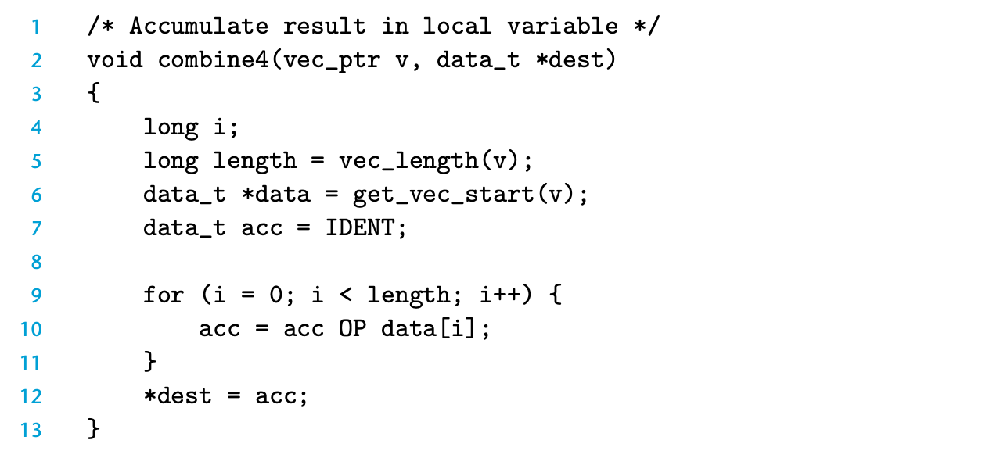

| 图 5.10 在临时变量中累积结果。将累积值保存在局部变量 acc（"累加器"的缩写）中消除了在每次循环迭代中从内存中检索它并写回更新值的需要。|
| :-------------------------------: |

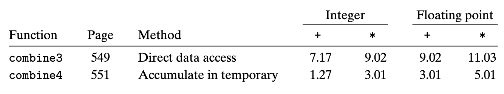

我们所有的时间都提高了 $2.2 \times$ 到 $5.7 \times$ 的倍数，整数加法情况下降到只有 1.27 个时钟周期每元素。

同样，人们可能会认为编译器应该能够自动将图 5.9 所示的 combine3 代码转换为在寄存器中累积值，就像它对图 5.10 所示的 combine4 代码所做的那样。然而，实际上，由于内存别名，这两个函数可能具有不同的行为。例如，考虑整数数据以乘法作为操作和 1 作为恒等元素的情况。设 v = [2, 3, 5] 是一个包含三个元素的向量，并考虑以下两个函数调用：

```c
combine3(v, get_vec_start(v) + 2);
combine4(v, get_vec_start(v) + 2);
```

也就是说，我们在向量的最后一个元素和存储结果的目标之间创建了一个别名。这两个函数然后将执行如下：

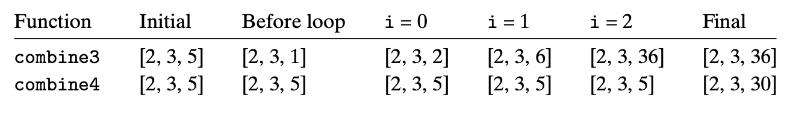

---

<!-- Page 0544 -->

如前所示，combine3 在目标处累积其结果，在这种情况下是最终向量元素。因此，此值首先设置为 1，然后设置为 $2 \cdot 1 = 2$，然后设置为 $3 \cdot 2 = 6$。在最后一次迭代中，此值然后乘以自身以产生最终值 36。对于 combine4 的情况，向量保持不变直到结束，当最终元素设置为计算结果 $1 \cdot 2 \cdot 3 \cdot 5 = 30$。

当然，我们显示 combine3 和 combine4 之间区别的例子是高度人为的。人们可能会认为 combine4 的行为更符合函数描述的意图。不幸的是，编译器无法对函数可能使用的条件和程序员的意图做出判断。相反，当给定 combine3 来编译时，保守的方法是继续读写内存，即使这样效率较低。

---

**练习题 5.4（答案见第 610 页）**

当我们使用 GCC 以命令行选项 `-O2` 编译 combine3 时，我们获得的代码具有比 `-O1` 更好的 CPE 性能：

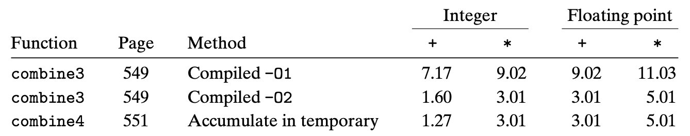

我们实现了与 combine4 相当的性能，除了整数求和的情况，但即使在此情况下也显著提升。在检查编译器生成的汇编代码时，我们发现内部循环的一个有趣变体：

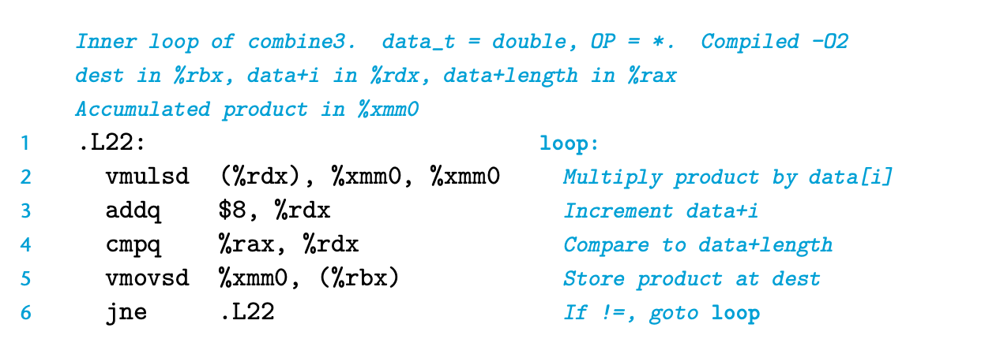

我们可以将此与使用优化级别 1 创建的版本进行比较：

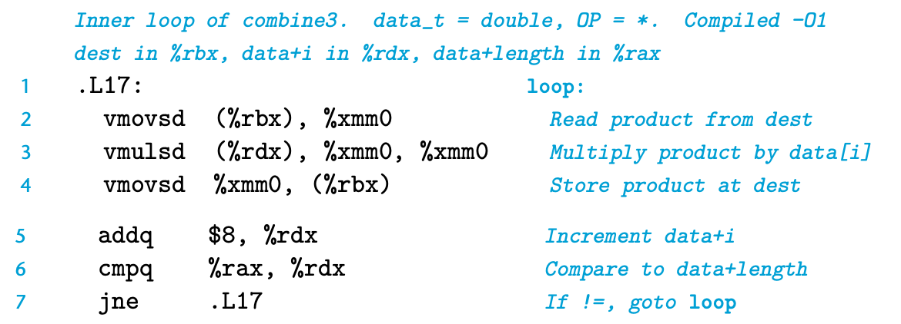

---

<!-- Page 0545 -->

我们看到，除了一些指令重新排序外，唯一的区别是更优化的版本不包含实现从 dest 指定位置读取的 vmovsd（第 2 行）。

A. 寄存器 %xmm0 在这两个循环中的作用有何不同？

B. 更优化的版本是否会忠实地实现 combine3 的 C 代码，包括当 dest 和向量数据之间存在内存别名时？

C. 要么解释为什么这种优化保留了所需的行为，要么给出一个示例，其中它会产生与较少优化代码不同的结果。

通过这最后的转换，我们达到了一个点，每个要计算的元素只需要 1.25-5 个时钟周期。这比我们首次启用优化时的原始 9-11 个周期有了很大改进。我们现在想看看究竟是什么因素限制了我们代码的性能，以及我们如何能进一步改进。

## 5.7 理解现代处理器

到目前为止，我们应用的优化不依赖于目标机器的任何特性。它们只是减少了过程调用的开销并消除了一些导致优化编译器困难的关键"优化阻碍因素"。当我们寻求进一步提高性能时，我们必须考虑利用处理器微架构的优化——也就是处理器执行指令的底层系统设计。要榨尽每一丝性能，需要对程序进行深入剖析，同时针对目标处理器优化代码生成过程。尽管如此，我们可以应用一些基本优化，这些优化将在大类处理器上产生整体性能改进。我们在这里报告的详细性能结果可能不适用于其他机器，但操作和优化的一般原理适用于各种各样的机器。

为了理解提高性能的方法，我们需要对现代处理器的微架构有基本的了解。由于可以集成到单个芯片上的大量晶体管，现代微处理器采用复杂的硬件来尝试最大化程序性能。其结果是，它们的实际操作与通过查看机器级程序所感知的视图大不相同。在代码层面，似乎指令是一次执行一条的，其中每条指令涉及从寄存器或内存中获取值、执行操作以及将结果存储回寄存器或内存位置。在实际处理器中，许多指令被同时评估，这种现象称为指令级并行性 (instruction-level parallelism)。在某些设计中，可能有 100 条或更多指令"正在执行中"。采用复杂的机制来确保这种并行执行的行为准确捕获机器级程序所需的顺序语义模型。这是现代微处理器的显著成就之一：它们采用复杂而奇特的微架构，其中多条指令可以并行执行，同时呈现简单的顺序指令执行的操作视图。

---

<!-- Page 0546 -->

尽管现代微处理器的详细设计远远超出了本书的范围，但对其操作原理有一个大致的了解，就足以理解它们如何实现指令级并行性。我们将看到，有两个不同的下界刻画了程序的最大性能。当一系列操作必须按严格顺序执行时，会遇到**延迟界限**（*latency bound*），因为下一个操作必须等待前一个操作的结果。当代码中的数据依赖限制了处理器利用指令级并行性的能力时，这一界限就会成为性能瓶颈。另一方面，**吞吐量界限**（*throughput bound*）刻画了处理器功能单元的原始计算能力。当不存在关键的数据依赖时，吞吐量界限将成为程序性能的最终限制。

### 5.7.1 整体操作

图 5.11 展示了现代微处理器的一个高度简化视图。我们假设的处理器设计大致参考了近期英特尔处理器的结构。这类处理器通常被称为**超标量**（*superscalar*），即每个时钟周期可以执行多个操作；同时也是**乱序执行**（*out of order*）的，即指令的实际执行顺序不必与其在机器级程序中的顺序一致。

整体设计包含两个主要部分：

* **指令控制单元（ICU, Instruction Control Unit）**：负责从内存中读取指令序列，并将其转换为一组对程序数据执行的原始操作。
* **执行单元（EU, Execution Unit）**：负责执行这些操作。

与第 4 章讨论的简单顺序流水线相比，乱序处理器需要更多、更复杂的硬件支持，但能够实现更高程度的指令级并行性。

ICU 从**指令高速缓存**（*instruction cache*）中读取指令——这是一种存放最近访问指令的高速存储器。通常，ICU 会在当前执行位置之前提前取指，以便有足够时间完成解码，并将操作发送到 EU。

然而，当程序遇到分支时，程序可能沿两个不同方向继续执行。分支可能被采纳（*taken*），控制流跳转至分支目标；也可能不被采纳（*not taken*），控制流继续顺序执行下一条指令。

现代处理器采用**分支预测**（*branch prediction*）技术来猜测分支是否会被采纳，并预测其目标地址。通过**推测执行**（*speculative execution*），处理器在尚未确认分支结果之前，就开始获取、解码并执行预测路径上的指令。如果后来发现预测错误，处理器会将状态恢复到分支点，并沿正确路径重新执行。

图中标记为“取指控制”的模块包含分支预测逻辑，用于决定接下来应获取哪些指令。

---

<!-- Page 0547 -->

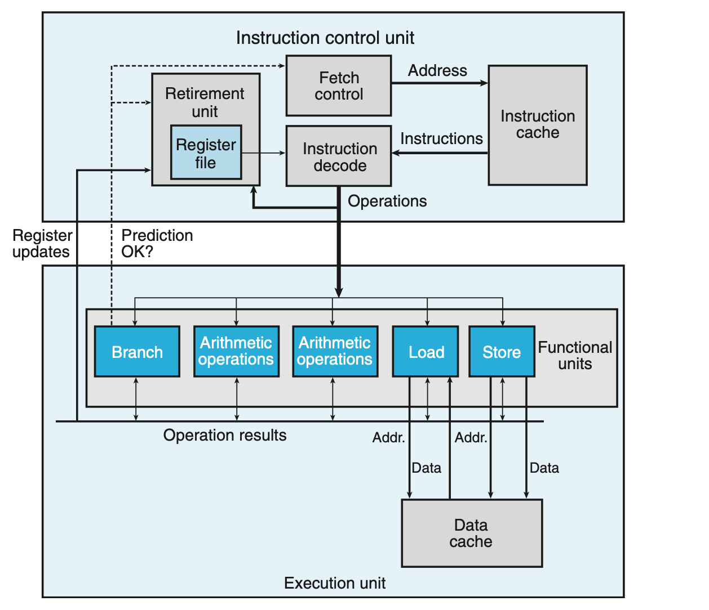

| 图 5.11 乱序处理器框图。指令控制单元负责读取指令并生成原始操作，执行单元执行操作并判断分支预测是否正确。 |
| :-----------------------------------------------------: |

指令解码逻辑将程序指令转换为一组原始操作（也称为微操作，*micro-operations*）。每个微操作执行一个简单计算任务，例如加法、内存读取或写入。

在具有复杂指令集的体系结构（例如 x86）中，一条指令可能被解码为多个微操作。具体的解码方式在不同处理器之间存在差异，并通常属于厂商的专有技术。幸运的是，我们无需了解底层实现细节，也可以对程序进行有效优化。

---

<!-- Page 0548 -->

在典型的 x86 实现中，仅对寄存器进行操作的指令，例如：

```asm
addq %rax,%rdx
```

通常会被转换为单个微操作。

而涉及内存访问的指令，例如：

```asm
addq %rax,8(%rdx)
```

则会被拆分为多个微操作，将内存访问与算术计算分离。例如，该指令会被解码为三个操作：

1. 从内存加载数据；
2. 将加载值与寄存器 `%rax` 中的值相加；
3. 将结果写回内存。

这种拆分使不同的专用硬件单元可以分工协作，从而并行执行多条指令的不同部分。

EU 从 ICU 接收操作，通常每个时钟周期可以接收多个操作。这些操作被分派至一组**功能单元**（*functional units*），每类单元专门处理特定类型的操作。

* **加载单元（load unit）**：负责从内存读取数据，并包含用于地址计算的加法器。
* **存储单元（store unit）**：负责将数据写入内存，同样包含地址计算逻辑。

加载和存储单元通过**数据高速缓存**（*data cache*）访问内存。

在推测执行过程中，操作会被执行，但其最终结果在确认分支预测正确之前，不会写入程序寄存器或内存。若预测错误，EU 将丢弃分支点之后的所有计算结果，并通知分支单元重新取指。正如第 3.6.6 节所述，错误预测会带来显著的性能损失，因为重新取指、解码和分发操作需要时间。

图 5.11 还显示，不同功能单元被设计为支持不同类型的操作。标记为“算术操作”的单元通常支持整数与浮点操作的不同组合。随着晶体管数量的增加，新一代处理器不断扩展功能单元的数量、支持的操作种类以及执行性能。

功能单元通常被设计为支持多种操作类型，以适应不同程序的需求。例如，有的程序主要执行整数运算，而有的程序则以浮点运算为主。若功能单元类型过于单一，将无法充分利用硬件资源。

---

<!-- Page 0549 -->

例如，我们的参考机器——Intel Core i7 Haswell——包含 8 个功能单元（编号 0–7），部分功能如下：

0. 整数算术、浮点乘法、整数和浮点除法、分支
1. 整数算术、浮点加法、整数乘法、浮点乘法
2. 加载、地址计算
3. 加载、地址计算
4. 存储
5. 整数算术
6. 整数算术、分支
7. 存储地址计算

其中，“整数算术”包括加法、位运算和移位等基本操作；乘除法需要更专用的硬件资源。可以看到，存储操作需要两个功能单元：一个用于地址计算，另一个用于实际数据写入。

这种配置允许多个同类型操作并行执行。例如：

* 4 个单元可执行整数运算；
* 2 个单元可执行加载操作；
* 2 个单元可执行浮点乘法。

这些资源数量将直接影响程序可达到的最大吞吐量。

在 ICU 内部，**退役单元**（*retirement unit*）负责维护程序的顺序语义。图中寄存器文件（包括整数、浮点、SSE 和 AVX 寄存器）受退役单元控制。

当指令被解码时，其相关信息被放入一个先进先出队列。随后会发生两种情况之一：

* 若指令执行完成，且相关分支预测正确，则该指令**退役**，其结果写入程序寄存器；
* 若相关分支预测错误，则该指令被刷新，已计算结果被丢弃。

这种机制确保错误预测不会影响程序状态。

---

<!-- Page 0550 -->

> **旁注：乱序处理的历史**
>
> 乱序执行最早出现在 1964 年的 CDC 6600 处理器中，该处理器拥有 10 个独立功能单元，主频为 10 MHz，当时被视为科学计算领域的顶级机器。
>
> 1966 年，IBM 在 360/91 处理器中引入乱序执行（仅用于浮点指令）。此后约 25 年间，该技术主要用于高性能计算机。
>
> 1990 年，IBM 在 RS/6000 系列中重新引入乱序处理，其设计成为 PowerPC 架构的基础。1993 年发布的 601 型号成为首个采用乱序执行的单芯片微处理器。1995 年，英特尔在 Pentium Pro 中引入乱序执行，其微架构与本节讨论的参考机器类似。

如前所述，程序寄存器的更新仅在指令退役时发生，且必须确认相关分支预测正确。

为加快指令间结果传递，大量数据在执行单元之间直接交换（图中标为“操作结果”）。执行单元之间可以直接转发结果，这是一种比第 4.5.5 节所述数据转发更为精细的实现方式。

控制执行单元之间操作数通信的关键机制称为**寄存器重命名**（*register renaming*）。

当一条更新寄存器 $r$ 的指令被解码时，会生成一个唯一标签 $t$ 作为该操作结果的标识。系统将条目 $(r, t)$ 添加到映射表中，用于记录寄存器与操作标签之间的对应关系。

当后续指令使用寄存器 $r$ 作为操作数时，其微操作将以标签 $t$ 作为数据来源。若某执行单元完成操作并产生结果 $(v, t)$，表示标签为 $t$ 的操作得到值 $v$，则所有等待标签 $t$ 的操作即可直接使用 $v$ 作为源操作数。

这种机制允许结果在执行单元之间直接转发，而无需写回寄存器文件后再读取，从而使后续操作能够在前一操作完成后立即开始。

重命名表仅记录存在待写操作的寄存器。若某指令使用寄存器 $r$ 且当前没有对应标签，则其操作数直接从寄存器文件中读取。

借助寄存器重命名机制，处理器可以对整个操作序列进行推测执行，即使程序寄存器的实际更新要等到分支结果确认之后才发生。

---

<!-- Page 0551 -->

<!-- Page 0555 -->

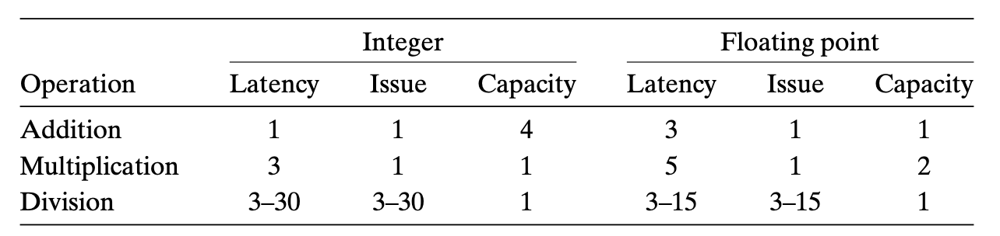

| 图 5.12 参考机器操作的延迟、发射时间和容量特性。延迟表示执行实际操作所需的总时钟周期数，而发射时间表示两个独立操作之间的最小周期数。容量表示可以同时发射多少个这些操作。除法的时间取决于数据值。 |
| :-------------------------------------------------------------------------------------------------: |

### 5.7.2 功能单元性能

图 5.12 展示了英特尔 Core i7 Haswell 参考机器上一些算术操作的性能数据。这些数据通过测量并参考英特尔文献 [49] 获得，对其他处理器也具有代表性。每个操作由三个特征参数描述：

* **延迟（latency）**：完成一次操作所需的总时钟周期数
* **发射时间（issue time）**：两个相同类型的独立操作之间的最小时钟周期数
* **容量（capacity）**：能够执行该操作的功能单元数量

可以看到，从整数运算到浮点运算，延迟逐渐增加。同时，加法和乘法操作的发射时间均为 1，意味着处理器可以在每个时钟周期启动一个新的同类操作。

这种短发射时间得益于**流水线（pipelining）**技术。流水线功能单元由多个阶段构成，每个阶段完成操作的一部分。例如，典型的浮点加法器包含三个阶段（因此延迟为 3 个周期）：

1. 处理指数
2. 执行尾数加法
3. 对结果进行舍入

操作可以在不同阶段中重叠执行，而不必等待前一个操作完全结束。只有当存在连续且逻辑独立的操作时，才能充分利用这一特性。

发射时间为 1 的功能单元称为**完全流水线化**（fully pipelined）单元——它们能够在每个时钟周期启动一个新操作。容量大于 1 则表示存在多个相同功能单元。

我们还注意到，用于整数除法、浮点除法以及浮点平方根的除法器**不是流水线化的**——其发射时间等于延迟。这意味着一个除法必须完全执行完毕，才能开始下一次除法。

此外，除法的延迟和发射时间以范围形式给出，因为某些被除数与除数的组合需要更多计算步骤。除法较长的延迟与发射时间，使其成为相对昂贵的操作。

---

<!-- Page 0552 -->

表达发射时间的另一种常见方式是使用**最大吞吐量（maximum throughput）**，其定义为发射时间的倒数。

* 完全流水线化单元的最大吞吐量为：每周期 1 次操作
* 发射时间更高的单元具有更低的最大吞吐量

多个功能单元可进一步提高吞吐量。若某操作容量为 $C$，发射时间为 $I$，则处理器理论上可以达到每周期 $ \frac{C}{I} $ 次操作的吞吐量。

例如，我们的参考机器能够以每周期 2 次的速率执行浮点乘法。

电路设计者可以构建具有不同性能特性的功能单元。实现更短延迟或流水线化通常需要更多硬件资源，尤其对于乘法和浮点运算等复杂操作。

由于芯片面积有限，CPU 设计者必须在功能单元数量与性能之间取得平衡。他们通过评估大量基准程序，将更多资源分配给关键操作。如图 5.12 所示，在 Core i7 Haswell 的设计中，整数乘法以及浮点乘法和加法被认为是关键操作，因此为其提供了低延迟与高度流水线化的实现。而除法较少使用且难以优化，因此性能相对较弱。

这些操作的延迟、发射时间和容量会影响组合函数的性能。我们可以用两个基本界限来描述其对 CPE（Cycles Per Element）的影响：

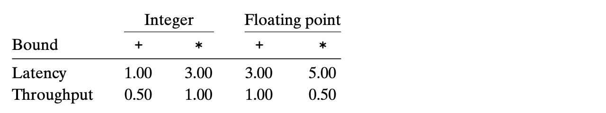

* **延迟界限（latency bound）**：必须严格顺序执行的操作链所决定的最小 CPE
* **吞吐量界限（throughput bound）**：由功能单元的最大结果产生速率所决定的最小 CPE

例如：

* 只有一个整数乘法器，且发射时间为 1，因此最多每周期 1 次乘法
* 有四个整数加法单元，因此理论上可达到每周期 4 次加法

然而，从内存加载数据也会形成额外的吞吐量限制。两个加载单元限制为每周期最多读取 2 个数据值，对应吞吐量界限 0.50。

我们将在不同版本的组合函数中展示延迟界限与吞吐量界限的影响。

---

<!-- Page 0553 -->

### 5.7.3 处理器操作的抽象模型

为了分析现代处理器上机器级程序的性能，我们使用**数据流表示（data-flow representation）**。这是一种图形化表示方法，用于显示操作之间的数据依赖关系，以及这些依赖如何约束执行顺序。

这些依赖关系形成图中的**关键路径（critical path）**，从而为执行所需的时钟周期数提供下界。

在深入技术细节之前，我们先回顾函数 `combine4` 的 CPE 测量结果：

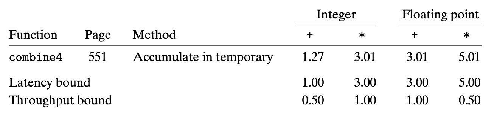

可以看到，这些结果与处理器的延迟界限一致（整数加法除外）。这并非巧合——它说明函数性能由和或积计算的延迟主导。

计算 $n$ 个元素的和或积，大约需要

$$
L \cdot n + K
$$

个时钟周期，其中：

* $L$：组合操作的延迟
* $K$：函数调用与循环控制开销

因此，

$$
\text{CPE} = L
$$

---

**从机器级代码到数据流图**

我们的数据流表示是非正式的，目的是直观展示数据依赖如何影响性能。

我们以 `combine4`（图 5.10）为例，仅关注循环部分。假设数据类型为 double，操作为乘法。编译后循环包含四条指令：

* `%rdx`：指向 `data[i]`
* `%rax`：指向数组末尾
* `%xmm0`：保存累积值 `acc`

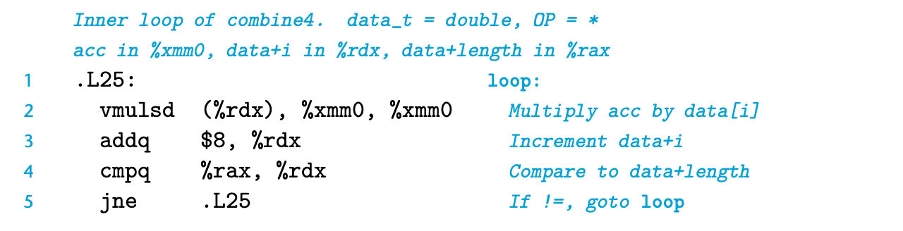

---

<!-- Page 0554 -->

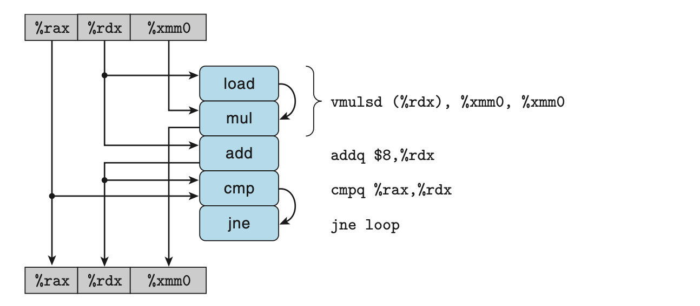

| 图 5.13 combine4 内部循环代码的图形表示。指令被动态翻译为一个或两个操作，每个操作从其他操作或寄存器接收值，并为其他操作和寄存器产生值。最终指令的目标标记为 loop，并跳转回第一条指令。 |
| :---------------------------------------------------------------------------------------------------: |

如图 5.13 所示，四条指令被扩展为五个操作。`vmulsd` 被分解为：

1. 加载内存操作数
2. 执行乘法

左侧框图表示寄存器之间的数据传递：

* `%rax` 仅作为源寄存器
* `%rdx` 在循环中既读又写
* `%xmm0` 被乘法操作更新

某些操作产生的值并不对应寄存器，例如加载结果直接传给 `mul`。

---

对于循环代码段，寄存器可分为四类：

---

<!-- Page 0555 -->

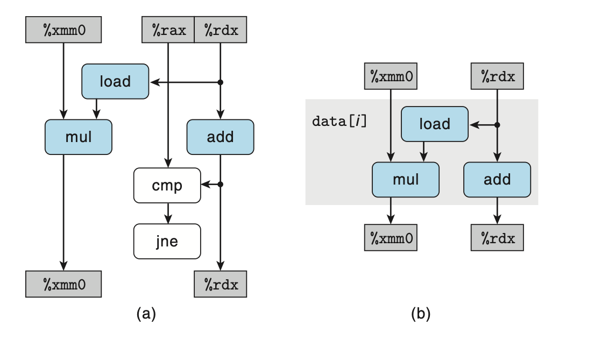

| 图 5.14 将 combine4 操作抽象为数据流图。我们重新排列图 5.13 的运算符以更清楚地显示数据依赖性 (a)，然后进一步仅显示使用一次迭代的值来为下一次迭代产生新值的操作 (b)。 |
| :-----------------------------------------------------------------------------------------------: |

### 寄存器分类

**只读（Read-only）**
在循环中仅作为源操作数使用，不被修改。此处为 `%rax`。

**只写（Write-only）**
仅作为目标寄存器。本例中无。

**本地（Local）**
在循环内部更新与使用，但不跨迭代传递。条件码寄存器属于此类。

**循环（Loop）**
跨迭代传递值，既作为源又作为目标。本例中为 `%rdx` 与 `%xmm0`，分别对应 `data+i` 与 `acc`。

循环寄存器之间形成的依赖链决定了性能限制。

图 5.14 是图 5.13 的进一步抽象，仅保留影响执行时间的数据依赖。

在图 5.14(a) 中：

* 重新排列运算符以清晰显示数据流
* 白色操作表示不参与循环寄存器依赖链

`cmp` 与 `jne` 不直接影响数据流。我们假设分支预测正确，因此不会影响性能。它们仅用于检测循环终止条件，并在预测错误时通知指令控制单元。

---

<!-- Page 0556 -->

在图 5.14(b) 中，我们去除了左侧以白色标出的运算符，仅保留循环寄存器。剩下的是一个抽象模板，用于展示一次循环迭代在循环寄存器之间所形成的数据依赖关系。从图中可以看到，从一次迭代到下一次迭代存在两条数据依赖链。

一条依赖链位于左侧，表示程序变量 `acc` 的连续值之间的依赖关系，该值存储在寄存器 `%xmm0` 中。循环通过将旧值与加载得到的数据元素相乘，计算 `acc` 的新值。

另一条依赖链位于右侧，表示指向第 $i$ 个数据元素的指针的连续值之间的依赖关系。在每次迭代中，旧指针值既用作加载操作的地址，又通过加法递增以计算新的指针值。

图 5.15 通过简单地复制图 5.14(b) 中的模板 $n$ 次，给出了函数 `combine4` 内部循环执行 $n$ 次迭代时的数据流表示。可以看到，程序中存在两条数据链依赖：一条对应通过 `mul` 操作更新 `acc`，另一条对应通过 `add` 操作更新 `data+i`。

已知浮点乘法的延迟为 5 个周期，整数加法的延迟为 1 个周期，因此左侧依赖链构成关键路径，需要 $5n$ 个周期才能完成；而右侧依赖链仅需 $n$ 个周期，不会成为性能瓶颈。

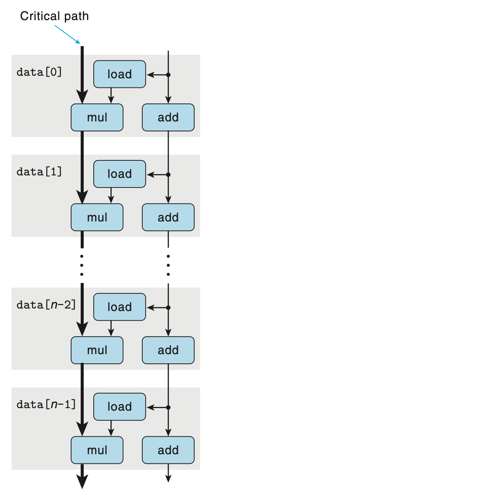

| 图 5.15 combine4 内部循环 $n$ 次操作的数据流表示。乘法操作序列构成限制程序性能的关键路径。 |
| :-----------------------------------------------------: |

---

<!-- Page 0557 -->

图 5.15 解释了为何在执行浮点乘法时，`combine4` 的 CPE 等于延迟界限 5 个周期。在函数执行过程中，浮点乘法器成为限制资源。循环中所需的其他操作——包括更新和测试指针值 `data+i` 以及从内存读取数据——都可以与乘法并行执行。

当计算每个 `acc` 的新值时，该结果必须等待 5 个周期后才能用于下一次乘法运算，因此形成了长度为 $5n$ 的关键路径。

对于其他数据类型和操作组合，其数据流结构与图 5.15 类似，只是左侧依赖链由不同的数据操作构成。只要某个操作的延迟大于 1 且为 $L$，我们测得的 CPE 就等于 $L$，表明该依赖链构成性能限制的关键路径。

**其他性能因素**

另一方面，对于整数加法的情况，我们测得 `combine4` 的 CPE 为 1.27，慢于根据图 5.15 左右两条依赖链所预测的 1.00。这说明：数据流图中的关键路径仅给出了程序执行周期数的下界。

实际性能还可能受到其他因素的限制，例如：

* 可用功能单元的数量；
* 每个周期功能单元之间可传递的数据量。

在整数加法作为组合操作的情况下，数据操作速度足够快，以至于其他操作无法及时提供所需数据。要精确解释为何每个元素需要 1.27 个周期，必须掌握比公开资料更为详细的硬件设计信息。

总结对 `combine4` 的性能分析：其抽象数据流表示表明存在一条长度为 $L \cdot n$ 的关键路径，该路径由 `acc` 的连续更新形成，因此 CPE 至少为 $L$。这一结论与除整数加法外的测量结果一致；对于整数加法，测得的 CPE 为 1.27，而非关键路径预测的 1.00。

这表明延迟界限对组合操作的执行速度构成了根本限制。接下来的任务是通过重构程序以增强指令级并行性，使性能限制由吞吐量界限决定，从而获得低于或接近 1.00 的 CPE。

---

<!-- Page 0558 -->

**练习题 5.5（答案见第 611 页）**

假设我们希望编写一个函数来计算多项式值。一个 $n$ 次多项式由系数集合 $a_0, a_1, a_2, \ldots, a_n$ 定义。对于给定的 $x$，多项式的值为：

$$
a_0 + a_1 x + a_2 x^2 + \cdots + a_n x^n \tag{5.2}
$$

可以通过如下函数实现多项式计算。函数参数包括系数数组 `a`、变量 $x$ 以及多项式次数 `degree`（即式 5.2 中的 $n$）。该函数在单个循环中同时计算各项之和以及 $x$ 的连续幂。

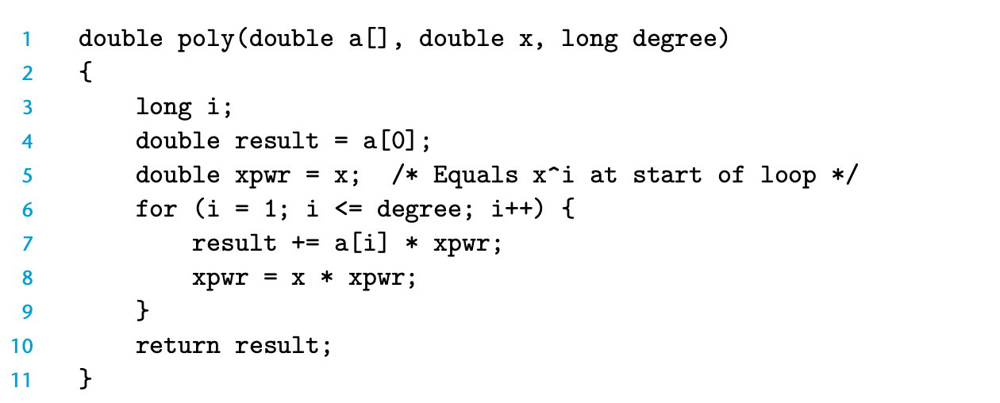

A. 对于次数为 $n$ 的多项式，该代码执行多少次加法？多少次乘法？

B. 在参考机器上，算术操作的延迟如图 5.12 所示。我们测得该函数的 CPE 为 5.00。请根据第 7–8 行操作在迭代之间形成的数据依赖关系，解释该 CPE 的来源。

---

**练习题 5.6（答案见第 611 页）**

继续探讨练习题 5.5 中的多项式求值方法。通过应用霍纳法（Horner's method），可以减少乘法次数。该方法以英国数学家威廉·G·霍纳（William G. Horner，1786–1837）命名，其核心思想是逐层提取 $x$，得到如下形式：

$$
a_0 + x(a_1 + x(a_2 + \cdots + x(a_{n-1} + x a_n)\cdots)) \tag{5.3}
$$

使用霍纳法，可以通过如下代码实现多项式求值：

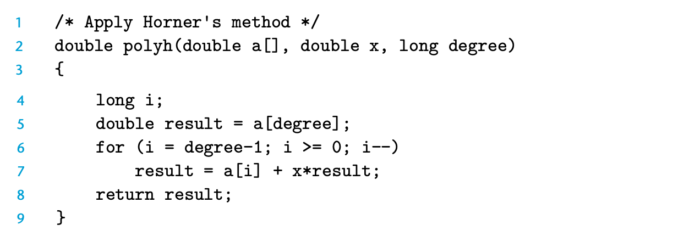

---

<!-- Page 0559 -->

A. 对于次数为 $n$ 的多项式，该代码执行多少次加法？多少次乘法？

B. 在参考机器上，算术操作的延迟如图 5.12 所示。我们测得该函数的 CPE 为 8.00。请根据函数第 7 行操作在迭代之间形成的数据依赖关系，解释该 CPE 的来源。

C. 解释为什么练习题 5.5 中的函数尽管执行更多操作，却运行得更快。

---

## 5.8 循环展开

循环展开（loop unrolling）是一种程序变换技术，通过在每次迭代中处理多个元素来减少循环的总迭代次数。我们在函数 `psum2`（图 5.1）中已经见过这种方法：每次迭代计算两个前缀和元素，从而将迭代次数减半。

循环展开可通过两种方式提升性能：

1. 减少不直接贡献于最终结果的操作数量，例如循环索引更新与条件分支；
2. 暴露更多优化机会，从而缩短整体关键路径。

本节仅讨论简单的循环展开，而不涉及进一步的代码变换。

图 5.16 展示了组合代码的一个版本，采用“$2 \times 1$ 循环展开”方式。第一个循环每次跨越数组中的两个元素：循环索引 $i$ 每次递增 2，在单次迭代中对元素 $i$ 和 $i+1$ 应用组合操作。

通常，向量长度未必是 2 的倍数，因此必须保证代码对任意长度都能正确工作。为此：

* 将循环上界设置为 $n - 1$；
* 仅当 $i < n - 1$ 时执行循环。

这样最大访问索引 $i+1$ 满足：

$$
i + 1 < (n - 1) + 1 = n
$$

这一思想可推广到按任意因子 $k$ 展开循环，即形成 $k \times 1$ 循环展开。具体做法如下：

* 将循环上界设置为 $n - k + 1$；
* 在每次迭代中对元素 $i$ 到 $i + k - 1$ 应用组合操作；
* 循环索引 $i$ 每次递增 $k$。

此时最大访问索引 $i + k - 1 < n$。

此外，还需使用第二个循环处理剩余的元素，该循环将执行 0 到 $k - 1$ 次。对于 $k = 2$，可以用简单条件语句处理最后一次迭代；但对于 $k > 2$，使用循环更为通用。因此，即便在 $k = 2$ 时，我们也采用统一的循环形式。

这种变换称为“$k \times 1$ 循环展开”，因为我们按因子 $k$ 展开循环，但仍在单个变量 `acc` 中累积结果。

---

<!-- Page 0560 -->

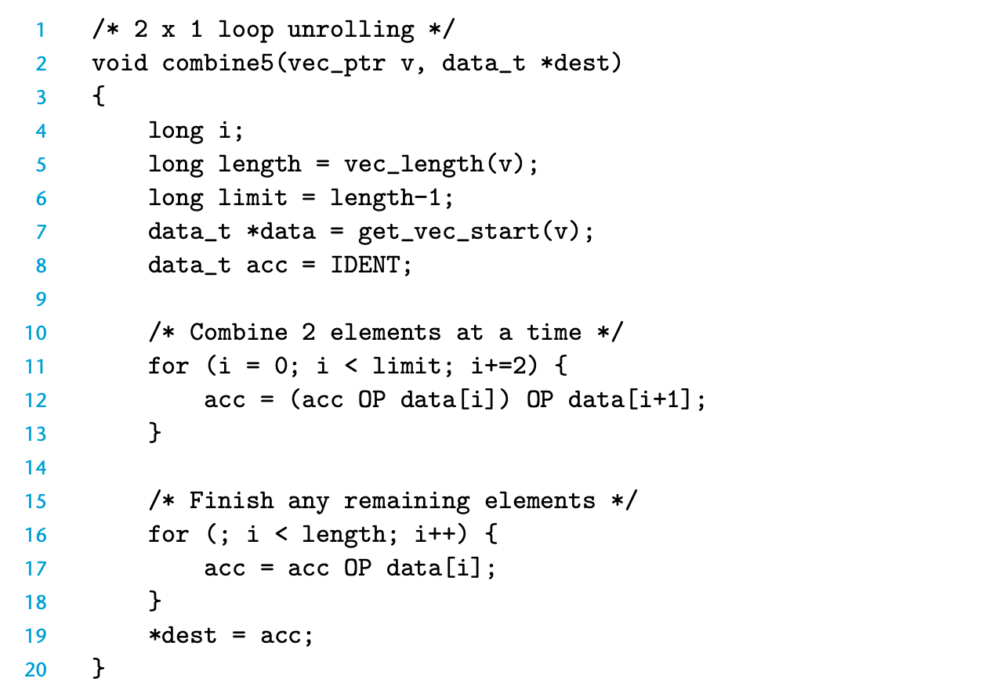

| 图 5.16 应用 $2 \times 1$ 循环展开。该变换可降低循环控制开销的影响。 |
| :------------------------------------------: |

**练习题 5.7（答案见第 611 页）**

将 `combine5` 的代码修改为按因子 $k = 5$ 展开循环。

当我们测量展开因子 $k = 2$（`combine5`）和 $k = 3$ 的性能时，得到如下结果：

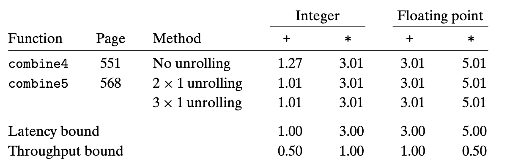

---

<!-- Page 0561 -->

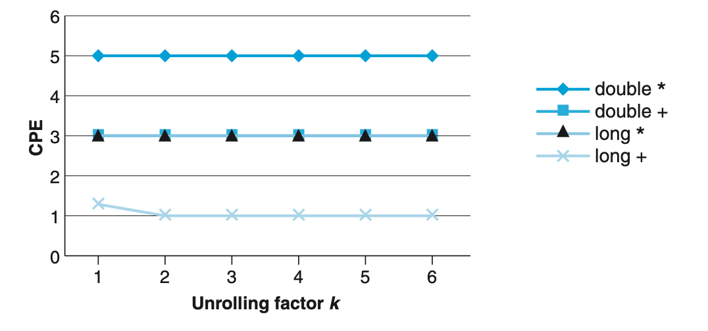

| 图 5.17 不同程度 $k \times 1$ 循环展开的 CPE 性能。只有整数加法通过这种变换获得了改进。 |
| :------------------------------------------------------: |

我们可以看到，整数加法的 CPE 得到了改善，达到了延迟界限 1.00。这一结果可归因于循环开销操作的减少。通过降低相对于向量求和所需加法次数的开销操作比例，我们最终使整数加法的 1 个周期延迟成为限制性能的主要因素。另一方面，其他情况并未获得改进——它们已经达到了各自的延迟界限。图 5.17 展示了将循环最多展开 10 倍时的 CPE 测量结果。可以看到，我们在展开 2 倍和 3 倍时观察到的趋势仍然持续——没有任何情况低于其延迟界限。

为了理解为什么 $k \times 1$ 展开无法将性能提升到延迟界限之下，我们来分析 `combine5` 内部循环在 $k = 2$ 时的机器级代码。当类型 `data_t` 为 `double` 且操作为乘法时，会生成如下代码：

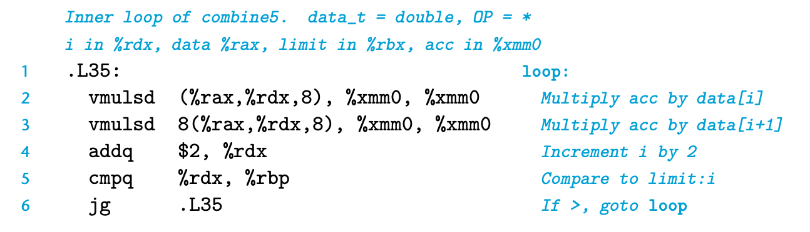

可以看到，GCC 使用了更直接的数组引用翻译方式，相比之下，为 `combine4` 生成的是基于指针的代码。循环索引 `i` 保存在寄存器 `%rdx` 中，`data` 的地址保存在寄存器 `%rax` 中。与之前一样，累积值 `acc` 保存在向量寄存器 `%xmm0` 中。循环展开后产生了两个 `vmulsd` 指令——一个将 `data[i]` 乘到 `acc` 上，第二个将 `data[i+1]` 乘到 `acc` 上。

图 5.18 展示了该代码的图形表示。每条 `vmulsd` 指令都被翻译为两个操作：一个从内存加载数组元素，另一个将该值与累积值相乘。在这里可以看到，寄存器 `%xmm0` 在每次循环执行中都会被读取和写入两次。我们可以按照图 5.19(a) 所示的过程对该图进行重排、简化和抽象，得到图 5.19(b) 所示的模板。随后将该模板复制 $n/2$ 次，以表示长度为 $n$ 的向量计算过程，从而得到如图 5.20 所示的数据流表示。

可以看到，该图的关键路径上仍然包含 $n$ 个 `mul` 操作——虽然迭代次数减半，但每次迭代中包含两个顺序执行的乘法操作。由于关键路径是未展开代码性能的限制因素，因此在 $k \times 1$ 循环展开中，这一点仍然成立。

---

<!-- Page 0562 -->

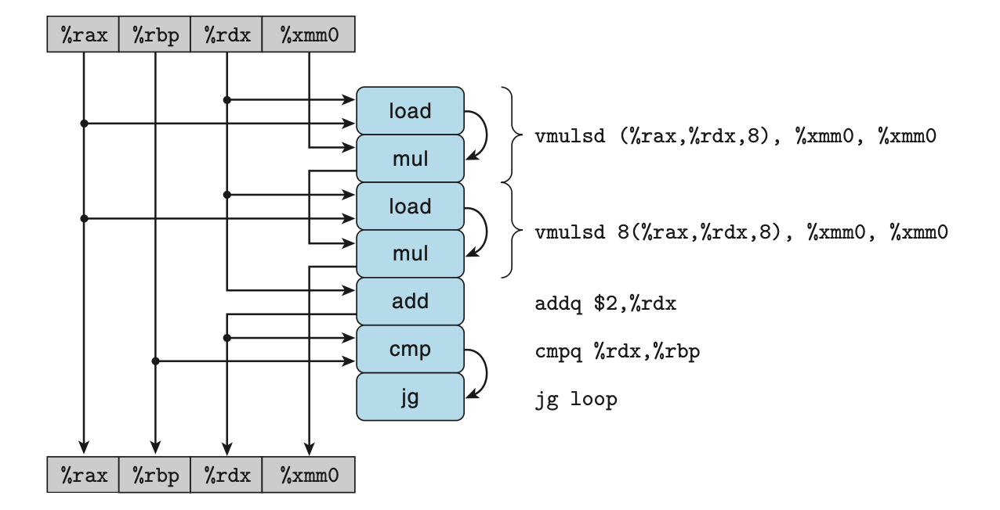

| 图 5.18 `combine5` 内部循环代码的图形表示。每次迭代包含两个 `vmulsd` 指令，每条指令都被翻译为一次加载操作和一次乘法操作。 |
| :------------------------------------------------------------------------: |

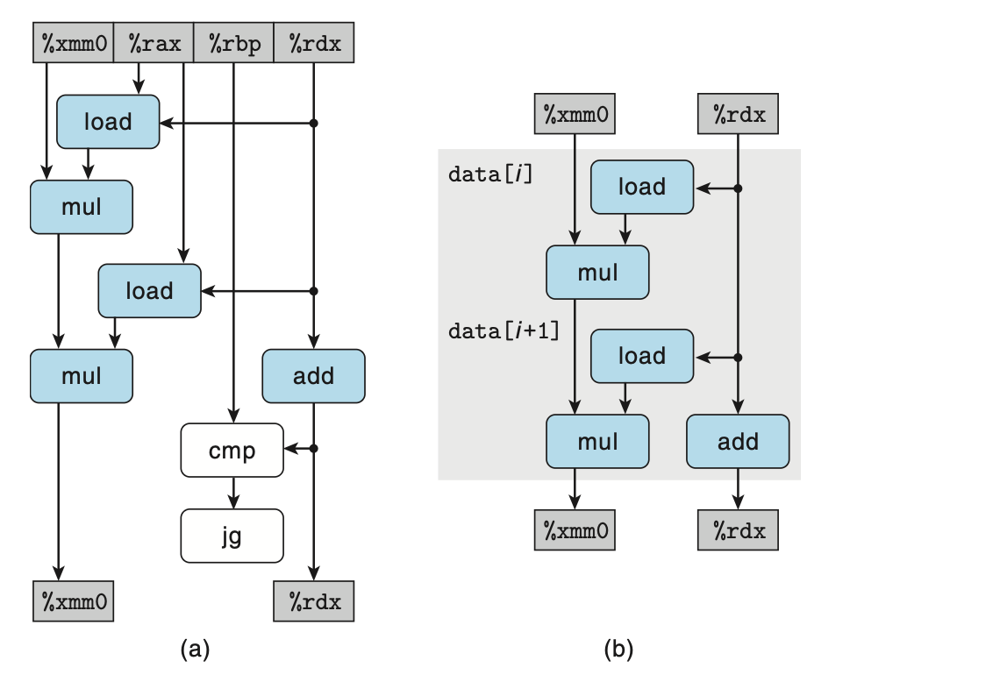

| 图 5.19 将 `combine5` 操作抽象为数据流图。我们对图 5.18 的表示进行重排、简化与抽象，以展示连续迭代之间的数据依赖关系 (a)。可以看到，每次迭代必须顺序执行两次乘法 (b)。 |
| :-------------------------------------------------------------------------------------------------: |

---

<!-- Page 0563 -->

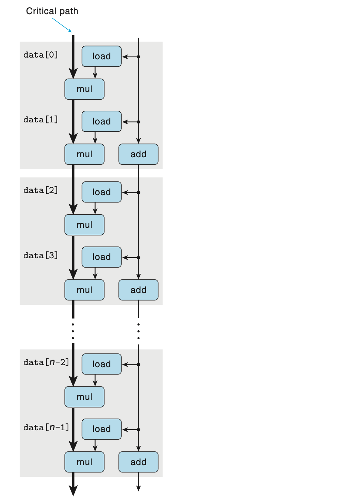

| 图 5.20 `combine5` 在长度为 $n$ 的向量上执行时的数据流表示。即使循环展开了 2 倍，关键路径上仍然包含 $n$ 个 `mul` 操作。 |
| :----------------------------------------------------------------------------: |

> **旁注：让编译器展开循环**
>
> 循环展开很容易由编译器自动完成。许多编译器都将其作为优化策略的一部分。当使用优化级别 3 或更高（例如 `-O3`）调用时，GCC 会执行一定形式的循环展开。

---

<!-- Page 0564 -->

## 5.9 增强并行性

到目前为止，我们的函数性能受限于算术单元的延迟界限。然而，正如前文所述，执行加法和乘法的功能单元都是完全流水线化的，这意味着它们可以在每个时钟周期启动一个新操作，并且某些操作还可以由多个功能单元并行执行。硬件本身具备以更高速率执行乘法和加法的能力，但我们的代码却无法利用这一点——即使进行了循环展开——因为我们将结果累积到单一变量 `acc` 中。只有在前一次计算完成之后，才能计算 `acc` 的新值。

即便用于计算 `acc` 的功能单元能够在每个时钟周期启动新操作，它实际上也只能每 $L$ 个周期启动一次，其中 $L$ 是组合操作的延迟。下面我们将探讨如何打破这种顺序依赖关系，从而获得优于延迟界限的性能。

### 5.9.1 多个累加器

对于满足结合律和交换律的组合操作（例如整数加法或乘法），我们可以将操作集合划分为两个或更多部分，分别计算后再合并结果，从而提高性能。

例如，设 $P_n$ 表示元素 $a_0, a_1, \ldots, a_{n-1}$ 的乘积：

$$
P_n = \prod_{i=0}^{n-1} a_i
$$

假设 $n$ 为偶数，则可以将其写为：

$$
P_n = PE_n \times PO_n
$$

其中，$PE_n$ 是偶数下标元素的乘积，$PO_n$ 是奇数下标元素的乘积：

$$
PE_n = \prod_{i=0}^{n/2-1} a_{2i}
$$

$$
PO_n = \prod_{i=0}^{n/2-1} a_{2i+1}
$$

图 5.21 展示了采用该方法的代码实现。该实现同时使用了双向循环展开（每次迭代处理更多元素）以及双路并行，在变量 `acc0` 中累积偶数下标元素，在变量 `acc1` 中累积奇数下标元素。因此，我们将其称为 “$2 \times 2$ 循环展开”。

与之前一样，我们还包含了第二个循环，用于处理向量长度不是 2 的倍数时的剩余元素。最后，再对 `acc0` 和 `acc1` 应用组合操作以计算最终结果。

将单纯的循环展开与双路并行循环展开进行比较，可以得到如下性能结果：

---

<!-- Page 0565 -->

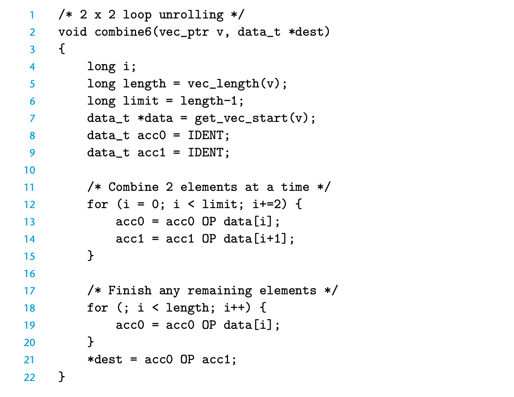

| 图 5.21 应用 $2 \times 2$ 循环展开。通过维护多个累加器，该方法能够更好地利用多个功能单元及其流水线能力。 |
| :------------------------------------------------------------: |

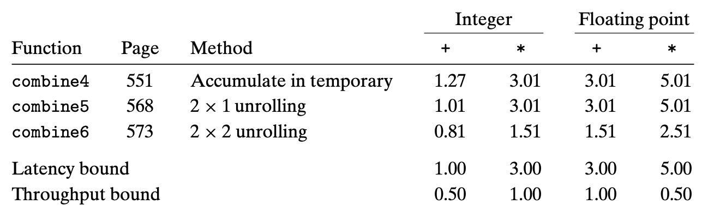

可以看到，所有情况的性能都得到了提升。整数乘法、浮点加法和浮点乘法的性能约提升了 2 倍，整数加法也有所改进。更为重要的是，我们突破了由延迟界限施加的性能瓶颈。处理器不再需要等到前一个和或积操作完成之后，才能启动下一个操作。

为了理解 `combine6` 的性能，我们从图 5.22 所示的代码与操作序列入手。按照图 5.23 所示的过程，可以推导出一个模板，用于展示迭代之间的数据依赖关系。与 `combine5` 类似，内部循环包含两个 `vmulsd` 操作，但这些指令被翻译为读写不同寄存器的 `mul` 操作，它们之间不存在数据依赖关系（见图 5.23(b)）。

随后将该模板复制 $n/2$ 次（图 5.24），以建模函数在长度为 $n$ 的向量上的执行过程。此时可以看到存在两条关键路径：一条用于计算偶数元素的乘积（程序值 `acc0`），另一条用于计算奇数元素的乘积（程序值 `acc1`）。每条关键路径仅包含 $n/2$ 个操作，因此得到的 CPE 约为：

$$
\frac{5.00}{2} = 2.50
$$

类似的分析可以解释我们在不同数据类型和组合操作下观察到的约 $L/2$ 的 CPE（其中 $L$ 为操作延迟）。从本质上讲，该程序利用了功能单元的能力，使其利用率提高了 2 倍。

唯一的例外是整数加法。虽然我们已经将 CPE 降低到 1.0 以下，但由于循环开销仍然过高，无法达到理论极限 0.50。

---

<!-- Page 0566 -->

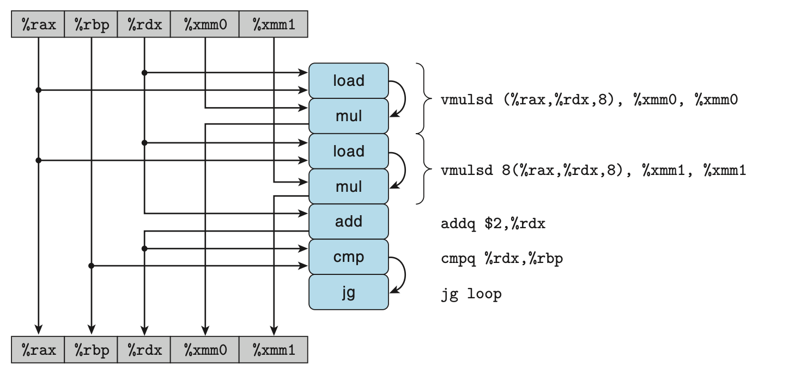

| 图 5.22 combine6 内部循环代码的图形表示。每次迭代包含两个 vmulsd 指令，每个指令都会被翻译为一次加载操作和一次 mul 操作。 |
| :------------------------------------------------------------------------: |

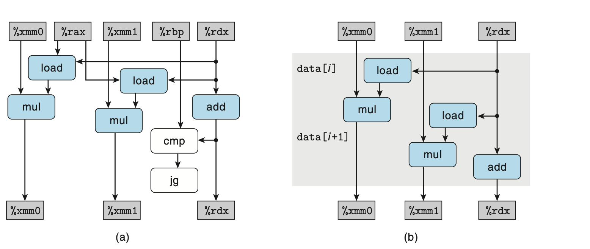

| 图 5.23 将 combine6 操作抽象为数据流图。我们对图 5.22 的表示进行重新排列、简化与抽象，以展示连续迭代之间的数据依赖关系 (a)。可以看到，两个 mul 操作之间不存在依赖关系 (b)。 |
| :-----------------------------------------------------------------------------------------------------: |

---

<!-- Page 0567 -->

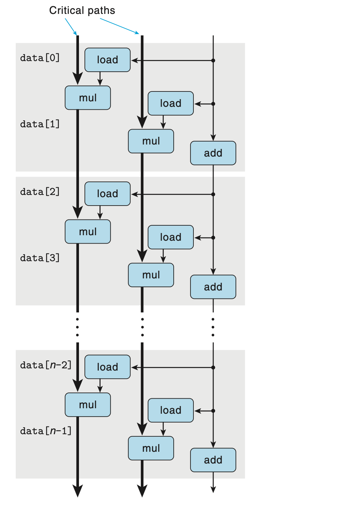

| 图 5.24 combine6 在长度为 n 的向量上执行操作时的数据流表示。此时存在两条关键路径，每条路径包含 n/2 个操作。 |
| :---------------------------------------------------------------: |

我们可以将多累加器转换推广为：按因子 $k$ 展开循环，并并行累积 $k$ 个值，从而得到 $k \times k$ 的循环展开形式。图 5.25 展示了当 $k$ 取值最多为 10 时该转换的效果。可以看到，当 $k$ 足够大时，程序在所有情况下都几乎达到吞吐量界限。

整数加法在 $k = 7$ 时达到 CPE 为 0.54，接近由两个加载单元决定的吞吐量界限 0.50。当 $k \geq 3$ 时，整数乘法和浮点加法的 CPE 为 1.01，接近其功能单元所设定的吞吐量界限 1.00。当 $k \geq 10$ 时，浮点乘法的 CPE 为 0.51，接近由两个浮点乘法器和两个加载单元共同决定的吞吐量界限 0.50。值得注意的是，尽管乘法比加法更复杂，我们的代码在浮点乘法上的吞吐量几乎达到浮点加法的两倍。

---

<!-- Page 0568 -->

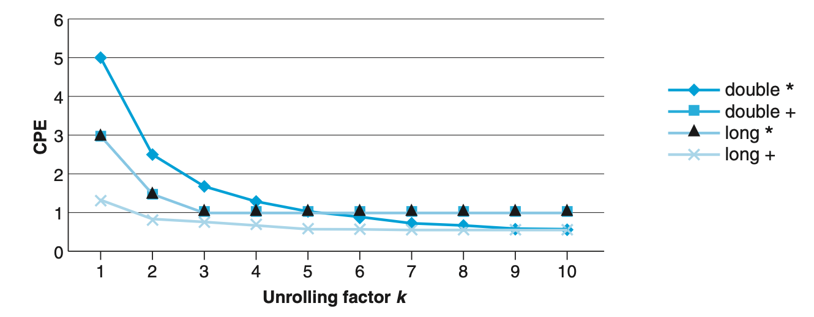

| 图 5.25 $k \times k$ 循环展开的 CPE 性能。通过这种转换，所有 CPE 都得到改善，并接近或达到其吞吐量界限。 |
| :----------------------------------------------------------------: |

一般而言，只有当程序能够使所有可执行该操作的功能单元始终保持流水线满载时，才能达到操作的吞吐量界限。对于延迟为 $L$、容量为 $C$ 的操作，这意味着展开因子必须满足

$$
k \geq C \cdot L
$$

例如，浮点乘法的 $C = 2$、$L = 5$，因此需要 $k \geq 10$。浮点加法的 $C = 1$、$L = 3$，当 $k \geq 3$ 时即可实现最大吞吐量。

在执行 $k \times k$ 展开转换时，必须考虑是否保持了原始函数的语义。我们在第 2 章中已经看到，二进制补码算术满足交换律和结合律，即使发生溢出也是如此。因此，对于整数数据类型，combine6 的计算结果在所有情况下都与 combine5 相同。优化编译器可能首先通过循环展开将 combine4 中的代码转换为类似 combine5 的双向展开形式，然后再通过引入并行性转换为类似 combine6 的代码。一些编译器确实会执行这种或类似的转换，以提升整数运算的性能。

然而，浮点乘法和加法并不满足结合律。因此，combine5 和 combine6 可能因舍入误差或溢出而产生不同结果。例如，设想一种乘积计算：所有偶数索引元素的绝对值非常大，而奇数索引元素非常接近 0.0。在这种情况下，乘积 $PE_n$ 可能发生溢出，或 $PO_n$ 可能发生下溢，即使整体乘积 $P_n$ 的顺序计算是正常的。

不过，在大多数实际应用中，这种模式出现的可能性较低。由于大多数物理现象是连续的，数值数据通常较为平滑且表现良好。即便存在不连续性，也通常不会形成导致上述极端情况的周期性模式。严格按顺序相乘不太可能比先分别计算两组乘积再相乘在准确性上有本质优势。对于大多数应用而言，获得 $2 \times$ 的性能提升远比因特殊数据模式而产生不同结果的风险更有价值。

尽管如此，程序开发者仍应与潜在用户确认，是否存在可能使修改后算法不可接受的特殊情况。由于编译器无法判断这种行为改变所带来的风险（哪怕极小），大多数编译器不会对浮点代码进行此类转换。

---

<!-- Page 0569 -->

### 5.9.2 重结合转换

现在我们探讨另一种打破顺序依赖、从而将性能提升至延迟界限之外的方法。我们已经看到，combine5 的 $k \times 1$ 循环展开并未改变用于组合向量元素形成和或积的操作集合。然而，只需对代码做出极小修改，就可以从根本上改变组合方式，并显著提升程序性能。

图 5.26 展示了函数 combine7。它与 combine5 的展开代码（图 5.16）唯一的区别在于内部循环中元素的组合方式。

在 combine5 中，组合由下列语句完成：

```
12  acc = (acc OP data[i]) OP data[i+1];
```

而在 combine7 中，组合由以下语句完成：

```
12  acc = acc OP (data[i] OP data[i+1]);
```

二者仅在括号位置上有所不同。我们将这种转换称为**重结合转换（reassociation transformation）**，因为它改变了向量元素与累积值 acc 的结合顺序。这种形式称为 “$2 \times 1a$” 循环展开。

对未经训练的读者而言，这两条语句看似几乎相同。然而，当我们测量 CPE 时，却得到令人惊讶的结果：

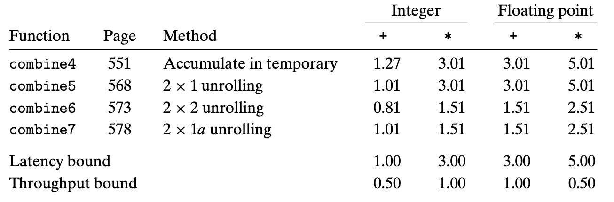

---

<!-- Page 0570 -->

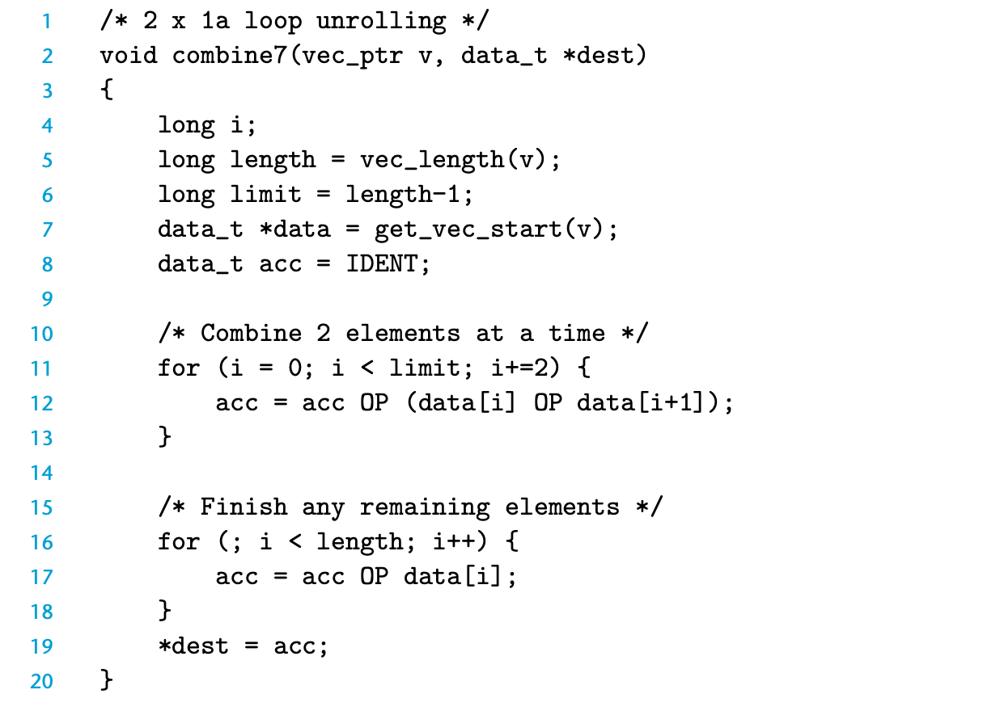

| 图 5.26 应用 $2 \times 1a$ 展开。通过重结合算术，该方法增加了可并行执行的操作数量。 |
| :--------------------------------------------------: |

在整数加法情况下，其性能与 $k \times 1$ 展开（combine5）相当；而在其余三种情况下，其性能与采用并行累加器的 combine6 相当，相比 $k \times 1$ 展开性能提升近一倍。这些情况已经突破了延迟界限所施加的性能障碍。

图 5.27 展示了 combine7 内部循环的代码（以乘法为组合操作、double 为数据类型）如何被解码为一系列操作以及对应的数据依赖关系。我们看到，vmovsd 与第一条 vmulsd 指令生成的加载操作从内存中读取向量元素 $i$ 和 $i + 1$，第一条 mul 操作将它们相乘；第二条 mul 操作再将该结果与累积值 acc 相乘。

图 5.28(a) 展示了如何对图 5.27 的操作进行重新排列、细化与抽象，以得到表示单次迭代数据依赖关系的模板（图 5.28(b)）。与 combine5 和 combine6 的模板类似，我们仍然有两个加载和两个 mul 操作，但只有一个 mul 操作在循环迭代之间形成数据依赖链。

当我们将该模板复制 $n/2$ 次，以表示对 $n$ 个向量元素执行乘法计算（图 5.29）时，可以看到关键路径上仅有 $n/2$ 个操作。每次迭代中的第一次乘法无需等待前一次迭代的累积值即可执行。因此，最小可能的 CPE 约降低为原来的一半。

---

<!-- Page 0571 -->

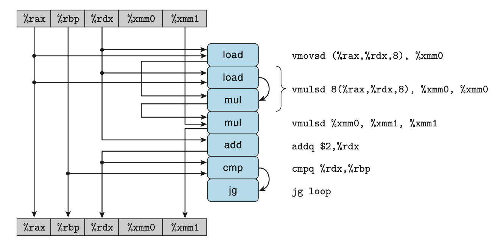

| 图 5.27 combine7 内部循环代码的图形化表示。每次迭代都会被解码为与 combine5 或 combine6 类似的操作，但其数据依赖关系不同。 |
| :----------------------------------------------------------------------------: |

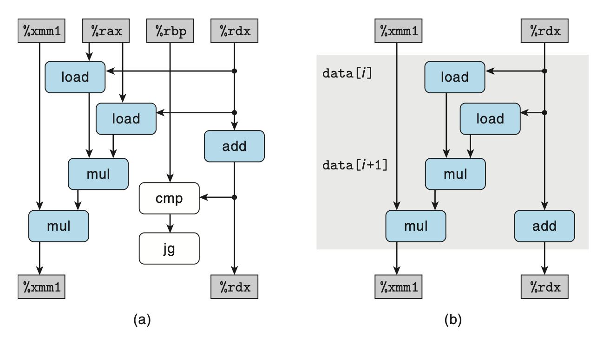

| 图 5.28 将 combine7 的操作抽象为数据流图。我们对图 5.27 的表示进行了重新排列、简化与抽象，以展示连续迭代之间的数据依赖关系。上方的 mul 操作将两个向量元素相乘，而下方的 mul 操作则将该结果与循环变量 acc 相乘。 |
| :------------------------------------------------------------------------------------------------------------------------: |

---

<!-- Page 0572 -->

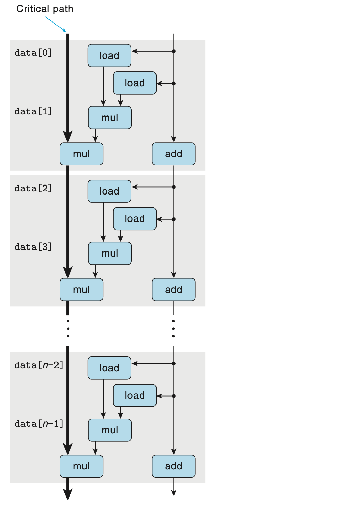

| 图 5.29 combine7 在长度为 n 的向量上运行时的数据流表示。我们只有一条关键路径，但它仅包含 $n/2$ 个操作。 |
| :--------------------------------------------------------------: |

图 5.30 展示了应用重结合（reassociation）变换以实现我们称为 $k \times 1a$ 循环展开的效果，其中 $k$ 最多为 10。可以看到，这种变换所带来的性能提升，与通过 $k \times k$ 展开并维护 $k$ 个独立累加器所获得的效果相似。在所有情况下，我们的性能都接近功能单元所施加的吞吐量上限。

在执行重结合变换时，我们再次改变了向量元素之间的组合顺序。对于整数加法与乘法而言，由于这些操作满足结合律，这种重新排序不会影响最终结果。而在浮点运算中，我们则必须重新评估该重结合是否会显著影响计算结果。我们认为，对于大多数应用场景而言，这种差异通常可以忽略。

---

<!-- Page 0573 -->

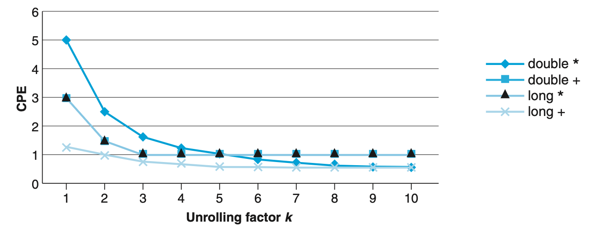

| 图 5.30 $k \times 1a$ 循环展开的 CPE 性能表现。通过这种变换，所有 CPE 均得到改善，并且几乎达到其吞吐量上限。 |
| :-------------------------------------------------------------------: |

总而言之，重结合变换可以减少关键路径上的操作数量，从而更充分地利用多个功能单元及其流水线能力，实现更高的性能。大多数编译器不会对浮点运算进行重结合优化，因为浮点运算并不保证满足结合律。当前版本的 GCC 的确会对整数运算进行重结合，但效果并不总是理想。总体而言，我们发现，循环展开并并行累积多个值，是实现性能提升的更为可靠的方法。

---

**练习题 5.8（答案见第 612 页）**

考虑下面这个函数，用于计算包含 $n$ 个双精度数的数组的乘积。我们对循环进行了 3 倍展开。

```c
double aprod(double a[], long n)
{
    long i;
    double x, y, z;
    double r = 1;
    for (i = 0; i < n - 2; i += 3) {
        x = a[i]; y = a[i + 1]; z = a[i + 2];
        r = r * x * y * z; /* Product computation */
    }
    for (; i < n; i++)
        r *= a[i];
    return r;
}
```

---

<!-- Page 0574 -->

对于标记为 “Product computation” 的语句，我们可以通过添加括号形成五种不同的结合方式，如下所示：

$$
\begin{array}{l}
\mathrm{r}=(\mathrm{r}*\mathrm{x})*\mathrm{y}*\mathrm{z};   /* A1 */ \\
\mathrm{r}=(\mathrm{r}*(\mathrm{x}*\mathrm{y}))*\mathrm{z}; /* A2 */ \\
\mathrm{r}=\mathrm{r}*((\mathrm{x}*\mathrm{y})*\mathrm{z}); /* A3 */ \\
\mathrm{r}=\mathrm{r}*(\mathrm{x}*(\mathrm{y}*\mathrm{z})); /* A4 */ \\
\mathrm{r}=(\mathrm{r}*\mathrm{x})*(\mathrm{y}*\mathrm{z}); /* A5 */
\end{array}
$$

假设我们在一台浮点乘法延迟为 5 个时钟周期的机器上运行这些函数。请确定在给定乘法数据依赖关系的情况下，其 CPE 的下界。（提示：绘制数据流图有助于分析每次迭代中 r 的计算方式。）

---

> **Web Aside OPT: SIMD 通过向量指令实现更高并行性**
>
> 如第 3.1 节所述，英特尔于 1999 年引入了 SSE 指令。SSE 是 “Streaming SIMD Extensions”（流式 SIMD 扩展）的缩写，而 SIMD（发音为 “sim-dee”）则是 “Single Instruction, Multiple Data”（单指令多数据）的缩写。SSE 经历了多代发展，最新版本称为高级向量扩展（AVX, Advanced Vector Extensions）。
>
> SIMD 执行模型是在单条指令中对整个数据向量进行操作。这些向量保存在一组专用向量寄存器中，命名为 %ymm0–%ymm15。当前 AVX 向量寄存器长度为 32 字节，因此每个寄存器可以容纳 8 个 32 位数字或 4 个 64 位数字，这些数字既可以是整数，也可以是浮点数。
>
> AVX 指令可以对这些寄存器执行向量操作，例如并行地对 8 组或 4 组数据进行加法或乘法。例如，若 YMM 寄存器 %ymm0 包含 8 个单精度浮点数，记为 $a_0, \ldots, a_7$，而 %rcx 包含另一组 8 个单精度浮点数的内存地址，记为 $b_0, \ldots, b_7$，则指令：
>
> ```asm
> vmulps (%rcx), %ymm0, %ymm1
> ```
>
> 会从内存中读取 8 个值，并并行执行 8 次乘法，计算
>
> $$
> a_i \leftarrow a_i \cdot b_i, \quad 0 \le i \le 7
> $$
>
> 并将得到的 8 个乘积存入向量寄存器 %ymm1。由此可见，单条指令即可对多个数据元素执行计算，因此称为 “SIMD”。
>
> GCC 支持 C 语言扩展，使程序员可以用向量操作形式编写程序，并将其编译为 AVX 向量指令（以及基于早期 SSE 指令的代码）。相比直接使用汇编语言，这种方式更加可取，因为 GCC 还能为其他处理器上的向量指令生成相应代码。
>
> 通过结合 GCC 优化、循环展开和多个累加器，我们能够为组合函数实现如下性能：

---

<!-- Page 0575 -->

> Web Aside OPT: SIMD 通过向量指令实现更高并行性（续）
>
> 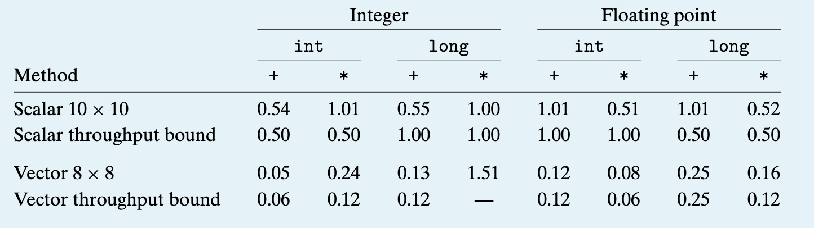
>
> 在该图中，第一组数据对应于采用 combine6 风格编写的传统标量代码，按因子 10 展开并维护 10 个累加器。第二组数据则对应于可由 GCC 编译为 AVX 向量代码的实现版本。除了使用向量操作之外，该版本还将主循环展开 8 倍，并维护 8 个独立的向量累加器。
>
> 我们分别给出了 32 位和 64 位数据的结果。对于 32 位数据，向量指令实现 8 路并行；而对于 64 位数据，则仅实现 4 路并行。
>
> 可以看到，在 32 位情况下，向量代码几乎实现了 8 倍性能提升；在 64 位情况下，四种操作中有三种接近 4 倍提升。唯一表现不佳的是 long 类型整数乘法，因为 AVX 指令集并未提供并行 64 位整数乘法指令，因此 GCC 无法为该情况生成向量代码。
>
> 向量指令为组合操作引入了新的吞吐量上限。对于 32 位操作，该上限为标量限制的 $1/8$；对于 64 位操作，则为 $1/4$。我们的代码在多种数据类型与操作组合下几乎达到了这些理论上限。

## 5.10 优化组合代码的结果总结

我们为最大化向量元素加法或乘法例程性能所做的努力显然取得了成效。下面总结了在未使用 AVX 向量并行性的情况下，仅采用标量代码所获得的结果：

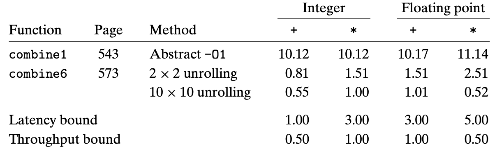

---

<!-- Page 0576 -->

通过多种优化手段，我们已经能够实现接近 0.50 和 1.00 吞吐量上界的 CPE，仅受功能单元容量的限制。这相较于原始代码实现了 $10\text{–}20\times$ 的性能提升，而且全部基于普通的 C 代码与标准编译器完成。

如果进一步重写代码以利用较新的 SIMD 指令，还可以额外获得接近 $4\times$ 或 $8\times$ 的性能提升。例如，对于单精度乘法，CPE 从原始的 11.14 降至 0.06，总体性能提升超过 $180\times$。这一例子表明，现代处理器具备极其强大的计算能力，但往往需要通过高度程式化的编程方式，才能充分激发这种潜力。

## 5.11 一些限制因素

我们已经看到，程序数据流图中的关键路径为程序执行时间给出了一个基本下界。也就是说，如果程序中存在一条数据依赖链，其总延迟为 $T$，那么程序至少需要 $T$ 个周期才能完成执行。

我们还看到，功能单元的吞吐量上界同样会对执行时间施加约束。也就是说，假设某种操作总共需要执行 $N$ 次，微处理器中有 $C$ 个可执行该操作的功能单元，每个单元的发射间隔为 $I$，那么程序至少需要

$$
\frac{N \cdot I}{C}
$$

个周期才能完成执行。

在本节中，我们将讨论其他一些限制实际机器上程序性能的因素。

### 5.11.1 寄存器溢出

循环并行性的收益受限于汇编代码中可表达计算的能力。如果程序的并行度 $P$ 超过可用寄存器数量，编译器就不得不进行寄存器溢出（spilling），将部分临时变量存储到内存中，通常是在运行时栈上分配空间。例如，下面的测量结果比较了将 `combine6` 的多累加器策略扩展到 $k=10$ 与 $k=20$ 时的表现：

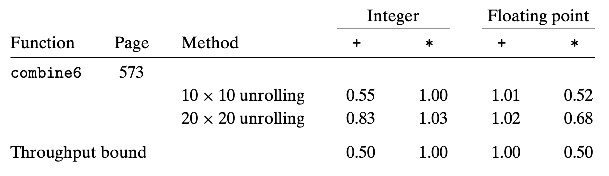

---

<!-- Page 0577 -->

可以看到，CPE 并未随着展开程度的增加而改善，某些情况下甚至变得更差。现代 x86-64 处理器拥有 16 个整数寄存器，并且可使用 16 个 YMM 寄存器存储浮点数据。一旦循环变量数量超过可用寄存器数量，程序就必须在栈上分配空间。

例如，下面代码展示了在 $10\times10$ 展开的内部循环中更新累加器 `acc0` 的方式：

更新 $10\times10$ 展开中的累加器 acc0

```asm
vmulsd (%rdx), %xmm0, %xmm0    # acc0 *= data[i]
```

可以看到，累加器保存在寄存器 `%xmm0` 中，程序只需从内存读取 `data[i]` 并与该寄存器中的值相乘即可。

而在 $20\times20$ 展开的版本中，对应代码则截然不同：

更新 $20\times20$ 展开中的累加器 acc0

```asm
vmovsd 40(%rsp), %xmm0
vmulsd (%rdx), %xmm0, %xmm0
vmovsd %xmm0, 40(%rsp)
```

此时累加器作为局部变量存储在栈上，位于栈指针偏移 40 字节处。程序必须先从内存读取累加器的值以及 `data[i]`，进行乘法运算后，再将结果写回内存。

一旦编译器不得不进行寄存器溢出，维护多个累加器所带来的优势很可能会丧失。幸运的是，x86-64 提供了相对充足的寄存器资源，因此大多数循环在发生寄存器溢出之前，通常已经受限于吞吐量瓶颈。

### 5.11.2 分支预测与错误预测惩罚

我们在第 3.6.6 节通过实验证明，当分支预测逻辑未能正确预测分支是否被采纳时，条件分支可能会导致显著的错误预测惩罚。现在，在理解了处理器的工作机制之后，我们可以更清楚地解释这一惩罚产生的原因。

现代处理器能够超前工作，在当前指令执行之前就从内存中读取并解码后续指令，从而确定操作类型与操作数。只要指令按照顺序执行，指令流水线便能高效运行。

当遇到分支指令时，处理器必须猜测程序将走哪条路径。对于条件跳转，需要预测分支是否被采纳；对于间接跳转（例如跳转表）或过程返回，则需要预测目标地址。本节重点关注条件分支。

在采用推测执行（speculative execution）的处理器中，处理器会开始执行预测路径上的指令，但在确认实际结果之前，不会真正修改寄存器或内存。一旦预测被验证为正确，处理器就会“提交”这些推测执行的结果；若预测错误，则必须丢弃所有推测结果，并从正确位置重新开始取指。这一过程需要重新填充指令流水线，从而产生错误预测惩罚。

---

<!-- Page 0578 -->

我们在第 3.6.6 节中提到，所有支持 x86-64 的现代 x86 处理器都提供条件移动（conditional move）指令。在编译条件语句或表达式时，GCC 可以生成基于条件移动的代码，而不是传统的基于控制转移的实现方式。

条件移动的基本思想是：先计算条件表达式两个分支的结果，然后使用条件移动指令选择所需的值。正如第 4.5.7 节所述，条件移动指令可以作为普通指令流水线的一部分执行，不需要预测分支是否成立，因此也不会产生错误预测惩罚。

那么，C 程序员应如何避免分支错误预测对性能造成影响？在我们参考机器上，错误预测惩罚高达 19 个周期，代价极为显著。虽然没有简单的统一答案，但以下原则通常适用。

**不要过度关注可预测分支**

尽管错误预测可能代价高昂，但这并不意味着所有分支都会降低程序性能。事实上，现代处理器的分支预测机制能够很好地识别规律性模式和长期趋势。例如，在组合例程中，循环结束分支通常会被预测为“被采纳”，因此仅在最后一次迭代时发生一次错误预测。

再例如，我们从 `combine2` 改写为 `combine3` 时，将 `get_vec_element` 移出内部循环，如下图所示：

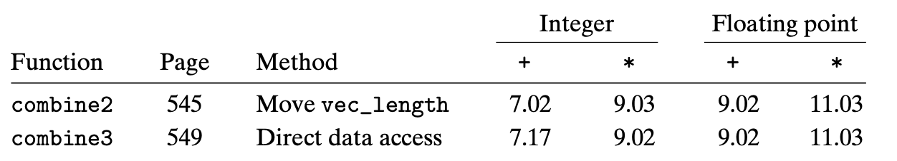

CPE 并未改善，尽管转换消除了每次迭代中对索引是否越界的两个条件判断。原因在于这些检查始终成功，因此具有高度可预测性。

为了评估边界检查对性能的影响，我们修改了 `combine4` 的内部循环，将对数据元素的直接访问替换为内联形式的 `get_vec_element` 代码版本。我们将其称为“通过向量数据结构访问元素”的实现。

---

<!-- Page 0579 -->

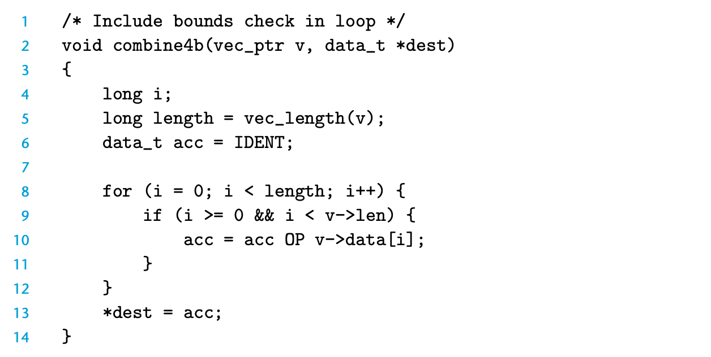

随后比较有无边界检查时函数的 CPE：

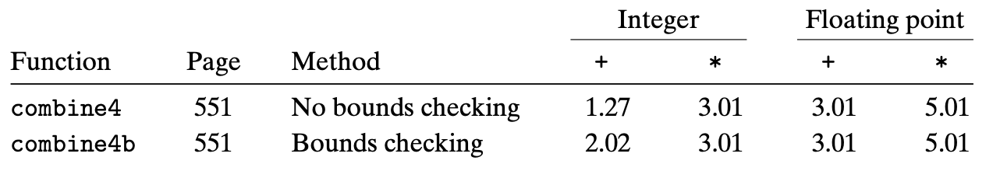

在整数加法情况下，带边界检查的版本略慢，但在其他三种情形下性能相同。这些情况的性能受组合操作延迟限制。执行边界检查所需的额外计算可以与组合操作并行完成。由于分支高度可预测，它们不会对关键路径上的指令获取与执行产生显著影响。

**编写易于使用条件移动实现的代码**

分支预测仅对规律性模式可靠。程序中许多测试本质上不可预测，例如依赖数据特征（数值正负等）。对于此类不可预测情况，如果编译器能够使用条件数据传输而非条件控制转移生成代码，性能将显著提升。

虽然 C 程序员无法直接控制这一点，但某些表达条件行为的方式更容易被编译为条件移动指令。

我们发现，GCC 更容易为“函数式”风格代码生成条件移动指令——即先计算值，再根据条件更新状态；相比之下，“命令式”风格代码——根据条件选择性地更新状态——更容易生成分支。

---

<!-- Page 0580 -->

两种风格并无严格规则，下面通过示例说明。假设有两个整数数组 `a` 和 `b`，对于每个位置 $i$，我们希望将

* $a[i]$ 设为 $\min(a[i], b[i])$
* $b[i]$ 设为 $\max(a[i], b[i])$

命令式实现方式是在每个位置检查并在乱序时交换两个元素：

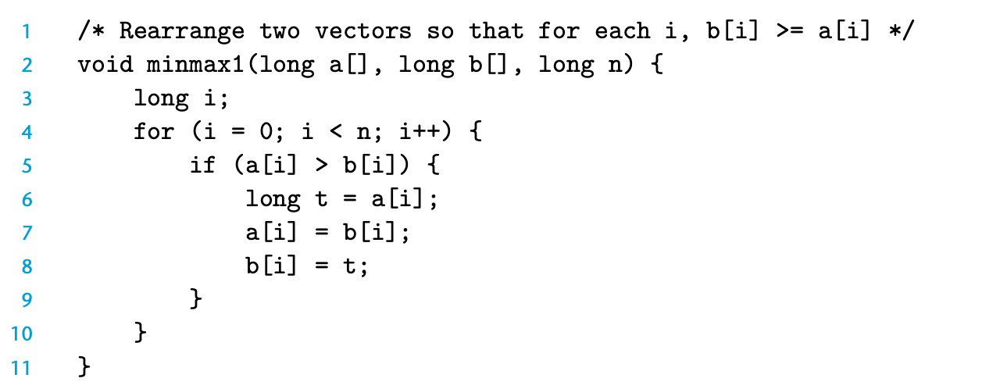

测量结果显示，对于随机数据，CPE 约为 13.5；对于可预测数据，CPE 为 2.5–3.5，说明错误预测惩罚约为 20 个周期。

函数式实现方式是在每个位置直接计算最小值与最大值，然后分别赋值：

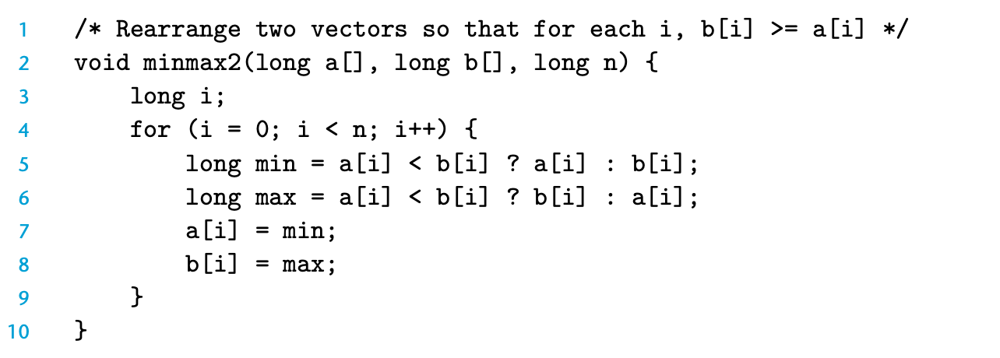

测量结果表明，无论数据是否可预测，CPE 均约为 4.0。（我们还验证了生成的汇编代码确实使用了条件移动指令。）

如第 3.6.6 节所述，并非所有条件行为都能通过条件数据传输实现，因此有时不可避免地会生成分支，并可能遭遇预测失败。然而，正如上述示例所示，程序员通过巧妙设计代码结构，往往可以使代码更适合转换为条件数据传输。

这通常需要实验：编写多个版本，检查生成的汇编代码，并测量实际性能。

---

<!-- Page 0581 -->

**练习题 5.9（答案见第 612 页）**

归并排序中“合并”步骤的传统实现需要三个循环 [98]：

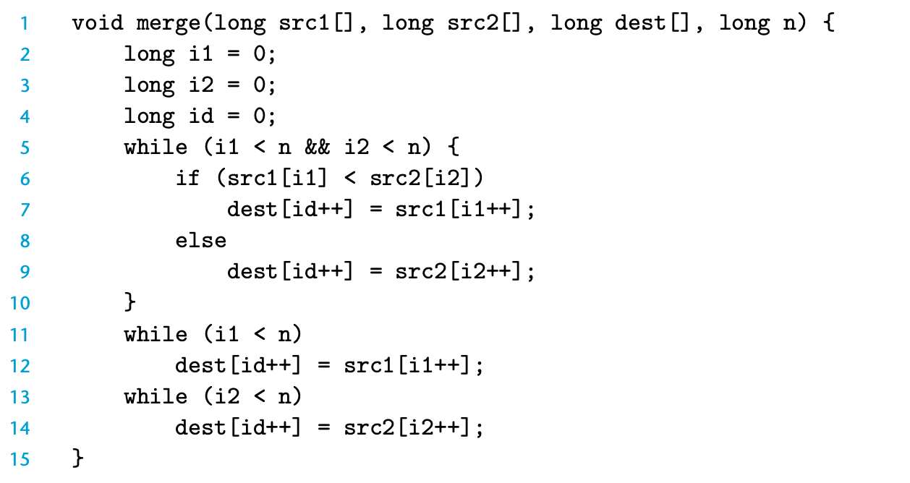

将变量 `i1` 和 `i2` 与 `n` 进行比较所产生的分支具有良好的预测性能——唯一的错误预测发生在条件首次变为假时。相比之下，对于典型数据，第 6 行中对 `src1[i1]` 和 `src2[i2]` 的比较是高度不可预测的。该比较控制一个条件分支，在随机数据上运行时会产生约 15.0 的 CPE（元素总数为 $2n$）。

请重写代码，使第一个循环中条件语句（第 6–9 行）的效果能够通过**条件移动指令**（conditional move）实现。

## 5.12 理解内存性能

到目前为止，我们编写的所有代码以及运行的所有测试都只访问了相对较少的内存。例如，组合（combine）例程是在长度小于 1,000 个元素的向量上测量的，所需数据不超过 8,000 字节。所有现代处理器都包含一个或多个高速缓存（cache），用于提供对少量数据的高速访问。

在本节中，我们将进一步研究涉及加载（load：从内存读入寄存器）和存储（store：从寄存器写入内存）操作的程序性能，并假设所有数据均保存在高速缓存中。第 6 章将更详细地介绍高速缓存的工作原理、性能特性，以及如何编写能够充分利用高速缓存的代码。

---

<!-- Page 0582 -->

如图 5.11 所示，现代处理器配备了专用的加载和存储功能单元。这些单元内部带有缓冲区，用于保存尚未完成的内存操作请求。例如，我们的参考机器具有两个加载单元，每个单元最多可容纳 72 个未完成的读取请求；此外，它还有一个存储单元，配备一个最多可容纳 42 个写请求的存储缓冲区。每个功能单元都可以在每个时钟周期启动 1 次操作。

### 5.12.1 加载性能

包含加载操作的程序性能取决于加载单元的流水线能力和访问延迟。

在我们使用参考机器进行组合操作的实验中发现，对于任意数据类型和组合运算，只要未使用 SIMD 指令，CPE 从未低于 0.50。限制 CPE 的一个关键因素在于：每计算一个元素都需要从内存中读取一个值。由于存在两个加载单元，且每个单元每个时钟周期最多启动 1 次加载操作，因此 CPE 不可能低于 0.50。

对于必须为每个元素加载 $k$ 个值的应用程序，其 CPE 不可能低于 $ \frac{k}{2} $（例如参见问题 5.15）。

在此前的示例中，我们尚未观察到加载延迟对性能的影响。这是因为加载地址仅依赖于循环索引 $i$，因此加载操作不构成关键路径的一部分。

为了确定机器上加载操作的延迟，可以构造一段加载链，其中一次加载的结果决定下一次加载的地址。例如，考虑图 5.31 中的函数 `list_len`，它用于计算链表长度。在该函数的循环中，变量 `ls` 的每一个新值都依赖于对指针 `ls->next` 的加载结果。

我们的测量结果显示，函数 `list_len` 的 CPE 为 4.00，我们认为这直接反映了加载操作的延迟。为说明这一点，请观察其循环对应的汇编代码：

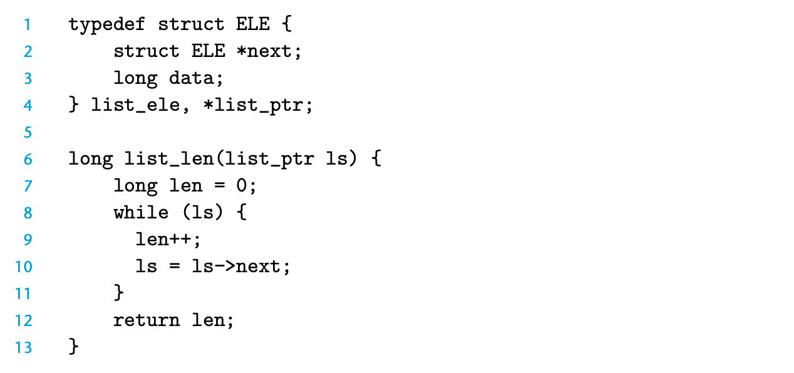

| 图 5.31 链表函数。其性能受加载操作延迟限制。 |
| :-----------------------: |

---

<!-- Page 0583 -->

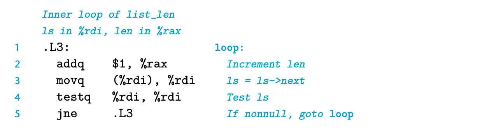

第 3 行的 `movq` 指令构成该循环的关键瓶颈。寄存器 `%rdi` 的每一个新值都依赖于以前一个 `%rdi` 值为地址的加载结果。因此，当前迭代的加载操作必须等待上一轮加载完成后才能开始。

函数的 CPE 为 4.00，正是由加载延迟决定的。事实上，这与参考机器 L1 高速缓存的记录访问时间（4 个周期，见第 6.4 节）完全一致。

### 5.12.2 存储性能

在此前所有示例中，我们主要分析了以加载操作为主的函数，即从内存读取数据到寄存器。与之对应的是存储操作，它将寄存器中的值写入内存。存储操作的性能，尤其是其与加载操作之间的交互，涉及若干微妙问题。

与加载操作类似，在大多数情况下，存储操作也可以完全流水线化运行，即每个周期启动一次存储操作。例如，图 5.32 中的函数将长度为 $n$ 的数组 `dest` 的所有元素设为 0。测量结果显示其 CPE 为 1.0，这是在具有单一存储单元的机器上可以达到的最佳性能。

与此前分析的其他操作不同，存储操作不会影响寄存器值。因此，从本质上讲，一系列存储操作本身不会形成数据依赖链。只有加载操作可能受到存储操作的影响，因为只有加载操作会读取先前写入内存的数据。

图 5.33 所示的函数 `write_read` 展示了加载与存储之间可能的交互。图中还给出了两个示例执行过程：对一个包含两个元素的数组 `a`（初值分别为 $-10$ 和 $17$）调用该函数，参数 `cnt = 3`。

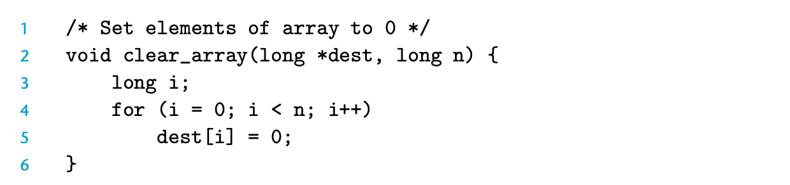

| 图 5.32 将数组元素设置为 0 的函数。该代码实现 CPE 为 1.0。 |
| :------------------------------------: |

---

<!-- Page 0584 -->

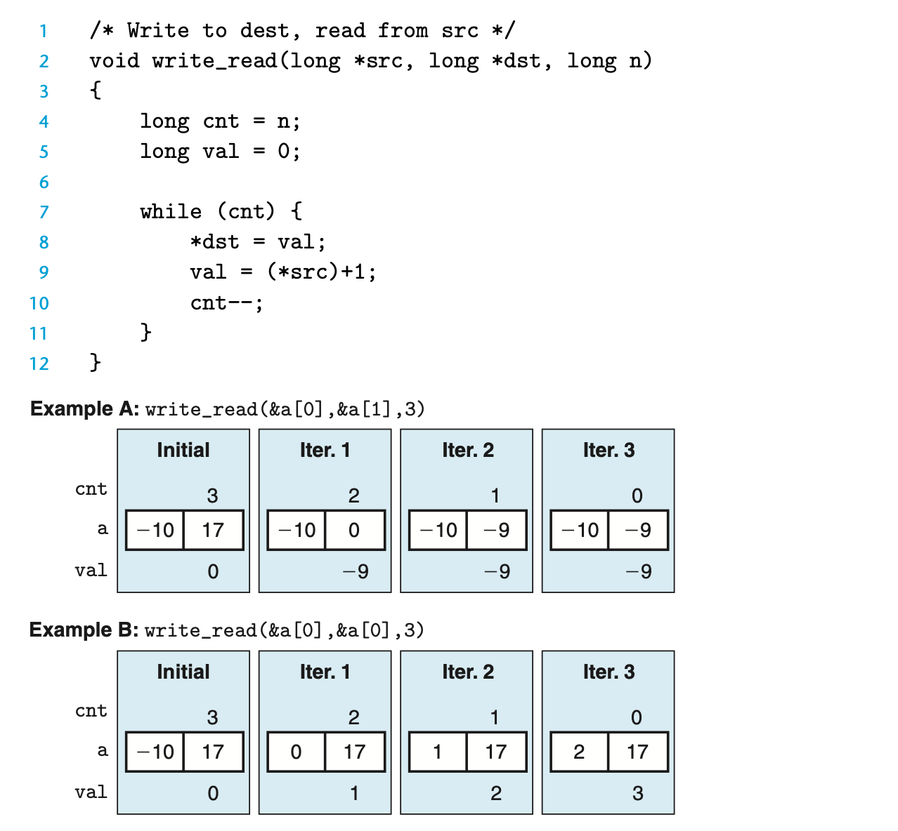

| 图 5.33 写入与读取内存位置的代码及示例执行。当参数 `src` 和 `dest` 相等时，展示了存储与加载之间的交互。 |
| :------------------------------------------------------------: |

在图 5.33 的示例 A 中，参数 `src` 指向数组元素 `a[0]`，而 `dest` 指向 `a[1]`。此时，每次通过 `*src` 的加载都会得到值 $-10$。因此，两次迭代后，数组元素分别为 $-10$ 和 $-9$。从 `src` 读取的值不会受到写入 `dest` 的影响。进一步测量得到该情形的 CPE 为 1.3。

在示例 B 中，`src` 和 `dest` 均指向数组元素 `a[0]`。此时，每次通过 `*src` 的加载都会得到前一次通过 `*dest` 存储的值。

---

<!-- Page 0585 -->

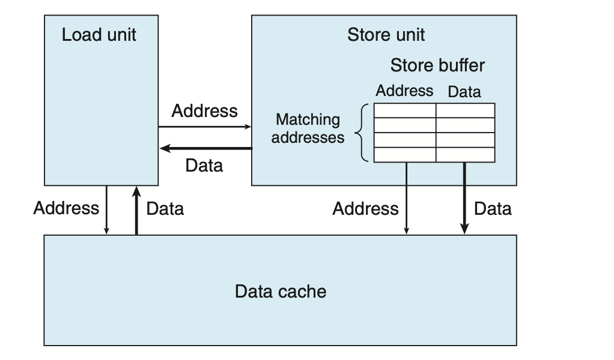

| 图 5.34 加载与存储单元的细节。存储单元维护一个待处理写操作的缓冲区。加载单元必须检查地址以检测写/读依赖性。 |
| :-------------------------------------------------------: |

因此，该位置将被依次写入递增的数值。一般而言，如果函数 `write_read` 使用相同的 `src` 与 `dest` 指针调用，且参数 `cnt = n > 0`，则最终该位置的值将变为

$$
n - 1
$$

该示例展示了所谓的**写/读依赖**（write/read dependency）现象——即内存读取的结果依赖于最近一次内存写入。

性能测量显示示例 B 的 CPE 为 7.3。写/读依赖导致处理时间额外增加约 6 个时钟周期。

要理解处理器如何区分这两种情况，以及为何其中一种运行更慢，我们需要更深入地分析加载和存储执行单元的结构，如图 5.34 所示。

存储单元包含一个存储缓冲区，用于保存已发出但尚未完成的写操作的地址和数据（完成意味着数据已更新到数据高速缓存中）。该缓冲区允许连续执行多个存储操作，而无需等待每次写入都更新高速缓存。

当发生加载操作时，加载单元必须检查存储缓冲区中是否存在地址匹配的条目。如果找到匹配（即写入与读取的地址存在重叠），则直接从存储缓冲区中获取对应数据作为加载结果。

GCC 为 `write_read` 内部循环生成如下代码：

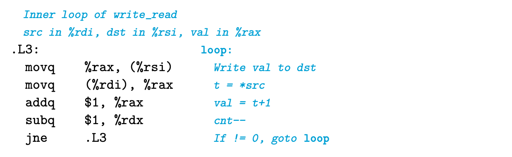

---

<!-- Page 0586 -->

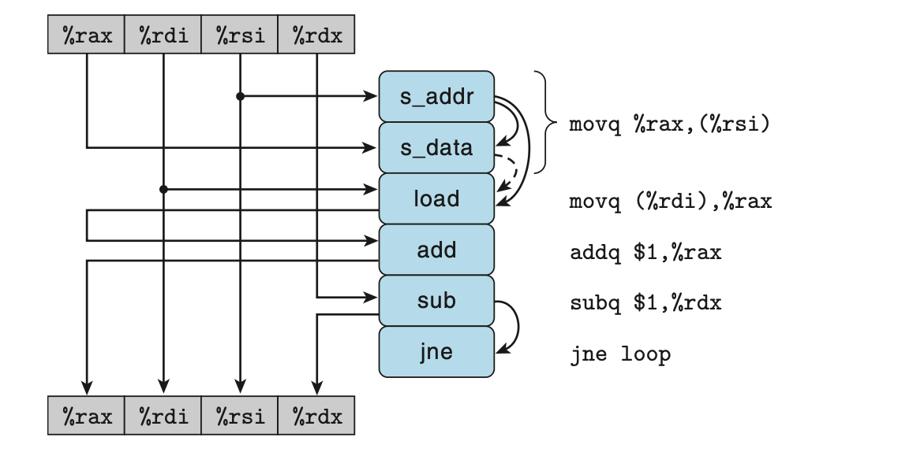

| 图 5.35 write_read 内部循环代码的图形表示。第一个 movl 指令被解码为单独的操作，以计算存储地址并将数据存储到内存。|
| :-------------------------------: |

图 5.35 显示了此循环代码的数据流表示。指令 movq %rax, (%rsi) 被转换为两个操作：s_addr 指令计算存储操作的地址，在存储缓冲区中创建一个条目，并为该条目设置地址字段。s_data 操作设置条目的数据字段。如我们将看到的，这两个计算独立执行的事实可能对程序性能很重要。这促使了参考机器中这些操作的单独功能单元。

除了由寄存器的写入和读取引起的操作之间的数据依赖性之外，运算符右侧的弧表示这些操作的一组隐式依赖性。特别是，s_addr 操作的地址计算必须明显先于 s_data 操作。此外，由解码指令 movq (%rdi), %rax 生成的加载操作必须检查任何待处理存储操作的地址，在它和 s_addr 操作之间创建数据依赖性。该图显示了 s_data 和加载操作之间的虚线弧。此依赖性是有条件的：如果两个地址匹配，加载操作必须等到 s_data 将其结果存入存储缓冲区，但如果两个地址不同，两个操作可以独立进行。

图 5.36 说明了 write_read 内部循环的操作之间的数据依赖性。在图 5.36(a) 中，我们重新排列了操作以允许更清楚地看到依赖性。我们已标记了涉及加载和存储操作的三个依赖性以特别注意。标记为"1"的弧表示在数据可以存储之前必须计算存储地址的要求。标记为"2"的弧表示加载操作需要将其地址与任何待处理存储操作的地址进行比较。最后，标记为"3"的虚线弧表示当加载和存储地址匹配时产生的条件数据依赖性。

图 5.36(b) 说明了当我们去掉那些不直接影响从一次迭代到下一次迭代的数据流的操作时会发生什么。数据流图仅显示两条依赖链：左侧的链，数据值被存储、加载和递增（仅适用于地址匹配的情况）；以及右侧的链，递减变量 cnt。

---

<!-- Page 0587 -->

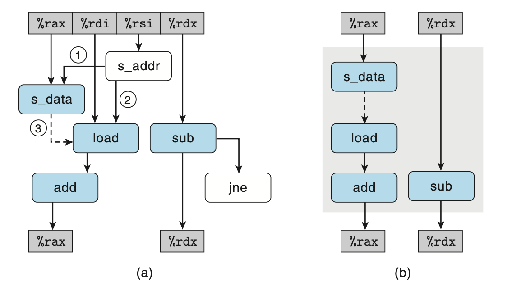

| 图 5.36 抽象 write_read 的操作。我们首先重新排列图 5.35 的运算符 (a)，然后仅显示那些使用一次迭代的值为下一次迭代产生新值的操作 (b)。|
| :-------------------------------: |

我们现在可以理解函数 write_read 的性能特性。图 5.37 说明了其内部循环的多次迭代形成的数据依赖性。对于图 5.33 中的示例 A，具有不同的源地址和目标地址，加载和存储操作可以独立进行，因此唯一的关键路径由变量 cnt 的递减形成，产生 CPE 界限 1.0。对于具有匹配源地址和目标地址的示例 B，s_data 和加载指令之间的数据依赖性导致形成涉及数据被存储、加载和递增的关键路径。我们发现这三个操作的序列总共需要约 7 个时钟周期。

如这两个示例所示，内存操作的实现涉及许多微妙之处。对于寄存器上的操作，处理器可以在将指令解码为操作时确定哪些指令将影响哪些其他指令。另一方面，对于内存操作，在计算加载和存储地址之前，处理器无法预测哪些将影响哪些其他操作。内存操作的高效处理对许多程序的性能至关重要。内存子系统利用许多优化，例如当操作可以独立进行时的潜在并行性。

---

**练习题 5.10（答案见第 613 页）**

作为具有潜在加载-存储交互的代码的另一个例子，考虑以下函数将一个数组的内容复制到另一个数组：

```c
void copy_array(long *src, long *dest, long n)
{
    long i;
    for (i = 0; i < n; i++)
        dest[i] = src[i];
}
```

---

<!-- Page 0588 -->

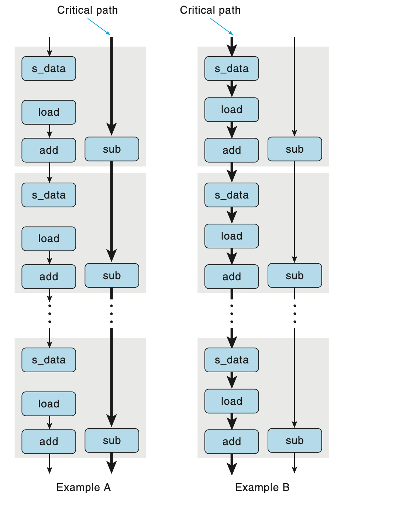

| 图 5.37 函数 write_read 的数据流表示。当两个地址不匹配时，唯一的关键路径由 cnt 的递减形成（示例 A）。当它们匹配时，数据被存储、加载和递增的链形成关键路径（示例 B）。|
| :-------------------------------: |

假设 a 是长度为 1,000 的数组，初始化为每个元素 a[i] 等于 i。

A. 调用 copy_array(a+1, a, 999) 的效果是什么？

B. 调用 copy_array(a, a+1, 999) 的效果是什么？

C. 我们的性能测量表明，部分 A 的调用的 CPE 为 1.2（当循环展开 4 倍时下降到 1.0），而部分 B 的调用的 CPE 为 5.0。你将这种性能差异归因于什么因素？

D. 你期望调用 copy_array(a, a, 999) 获得什么性能？

---

<!-- Page 0589 -->

**练习题 5.11（答案见第 613 页）**

我们看到我们对前缀和函数 psum1（图 5.1）的测量在执行基本操作（浮点加法）的延迟仅为 3 个时钟周期的机器上产生了 9.00 的 CPE。让我们尝试理解为什么我们的函数表现如此糟糕。

以下是函数内部循环的汇编代码：

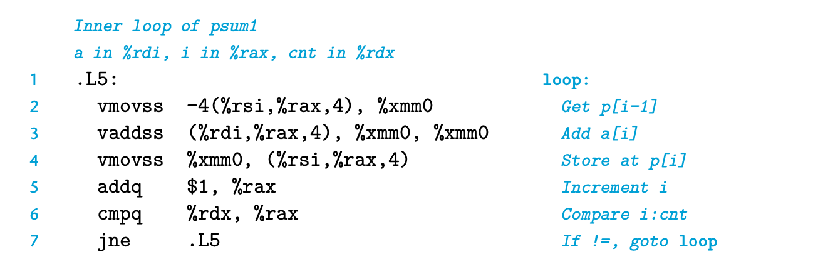

执行类似于为 combine3（图 5.14）和 write_read（图 5.36）显示的分析，以绘制此循环创建的数据依赖性，因此形成随着计算进行的关键路径。解释为什么 CPE 如此之高。

---

**练习题 5.12（答案见第 613 页）**

重写 psum1 的代码（图 5.1），使其不需要重复从内存中检索 p[i] 的值。你不需要使用循环展开。我们测量生成的代码的 CPE 为 3.00，受浮点加法的延迟限制。

---

## 5.13 现实世界：性能改进技术

尽管我们只考虑了有限的一组应用程序，但我们可以从中汲取关于如何编写高效代码的重要经验。我们描述了优化程序性能的一些基本策略：

**高级设计**。为手头的问题选择适当的算法和数据结构。特别要警惕避免产生渐近性能差的算法或编码技术。

**基本编码原则**。避免优化阻碍因素，以便编译器可以生成高效的代码。

    - 消除过多的函数调用。尽可能将计算移出循环。考虑选择性地牺牲程序模块化以获得更高的效率。

---

<!-- Page 0590 -->

    - 消除不必要的内存引用。引入临时变量来保存中间结果。仅在计算出最终值时才将结果存储在数组或全局变量中。

**低级优化**。构建代码以利用硬件能力。

    - 展开循环以减少开销并启用进一步的优化。

    - 通过诸如多累加器和重结合等技术找到增加指令级并行性的方法。

    - 以函数式风格重写条件操作，以启用通过条件数据传输进行编译。

对读者的最后建议是，在为提高效率而重写程序时要警惕避免引入错误。在引入新变量、更改循环边界和使代码整体更复杂时很容易出错。一种有用的技术是使用检查代码在优化时测试函数的每个版本，以确保在此过程中不引入错误。检查代码对函数的新版本应用一系列测试，并确保它们产生与原始版本相同的结果。测试用例集必须随着高度优化的代码变得更加广泛，因为有更多的情况需要考虑。例如，使用循环展开的检查代码需要测试许多不同的循环边界，以确保它处理结尾所需的所有不同可能数量的单步迭代。

## 5.14 识别和消除性能瓶颈

到目前为止，我们只考虑了优化小程序，其中程序中有一些明确的地方限制其性能，因此应该是我们优化工作的重点。在处理大型程序时，即使知道将优化工作集中在哪里也可能很困难。在本节中，我们描述如何使用代码分析器 (code profiler)，即在程序执行时收集程序性能数据的分析工具。我们还讨论代码优化的一些一般原则，包括第 1.9.1 节中介绍的阿姆达尔定律的含义。

### 5.14.1 程序分析

程序分析涉及运行程序的一个版本，其中已合并仪器代码以确定程序的不同部分需要多少时间。它对于识别我们应该在优化工作中关注的程序部分非常有用。分析的一个优势是它可以在实际程序在真实基准数据上运行时执行。

Unix 系统提供分析程序 GPROF。此程序生成两种形式的信息。首先，它确定程序中每个函数花费了多少 CPU 时间。其次，它计算每个函数被调用的次数，按执行调用的函数分类。这两种形式的信息都可能非常有用。这些时间数据揭示了不同功能模块在决定总运行时间中的相对重要性。调用信息允许我们理解程序的动态行为。

---

<!-- Page 0591 -->

使用 GPROF 进行分析需要三个步骤，如 C 程序 prog.c 所示，它使用命令行参数 file.txt 运行：

1. 程序必须编译和链接以进行分析。使用 GCC（和其他 C 编译器），这只需在命令行上包含运行时标志 -pg。重要的是确保编译器不尝试通过内联替换执行任何优化，否则对函数的调用可能无法准确制表。我们使用优化标志 -Og，保证函数调用将被正确跟踪。

    ```bash
    linux> gcc -Og -pg prog.c -o prog
    ```

2. 然后程序像往常一样执行：

    ```bash
    linux>./prog file.txt
    ```

    它运行得稍慢（约 2 倍），但除此之外，唯一的区别是它生成一个文件 gmon.out。

3. 调用 GPROF 来分析 gmon.out 中的数据：

    ```bash
    linux> gprof prog
    ```

分析报告的第一部分列出了执行不同函数所花费的时间，按降序排序。例如，以下清单显示了程序中三个最耗时的函数的这部分报告：

每一行代表所有调用某个函数所花费的时间。第一列表示花费在函数上的总时间的百分比。第二列显示到此行为止（包括此行）的累积时间。第三列显示在此特定函数上花费的时间，第四列显示它被调用的次数（不包括递归调用）。在我们的示例中，函数 sort_words 只被调用一次，但这一次调用需要 203.66 秒，而函数 find_ele_rec 被调用了 965,027 次（不包括递归调用），总共需要 4.85 秒。函数 Strlen 通过调用库函数 strlen 来计算字符串的长度。库函数调用通常不会在 GPROF 的结果中显示。它们的时间通常报告为调用它们的函数的一部分。通过创建"包装器函数"Strlen，我们可以可靠地跟踪对 strlen 的调用，显示它被调用了 12,511,031 次但只需要总共 0.30 秒。

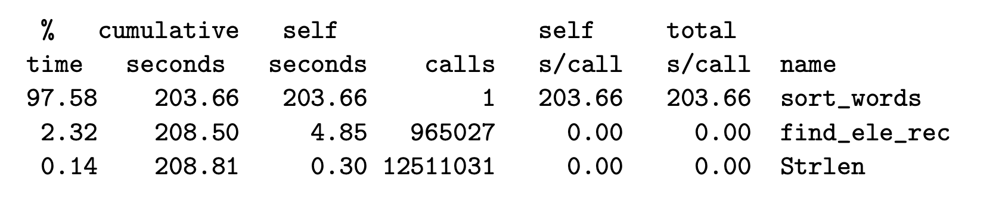

---

<!-- Page 0592 -->

分析报告的第二部分显示函数的调用历史。以下是递归函数 find_ele_rec 的历史：

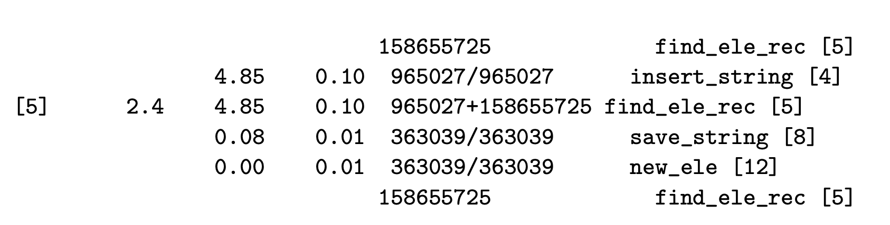

此历史显示了调用 find_ele_rec 的函数以及它调用的函数。前两行显示对函数的调用：158,655,725 次递归调用，以及函数 insert_string 的 965,027 次调用（它本身被调用 965,027 次）。函数 find_ele_rec 反过来调用了两个其他函数，save_string 和 new_ele，每个函数总共 363,039 次。

从这些调用数据中，我们通常可以推断出有关程序行为的有用信息。例如，函数 find_ele_rec 是一个递归过程，它扫描哈希桶的链表以查找特定字符串。对于此函数，将递归调用次数与顶级调用次数进行比较可提供有关这些列表遍历长度的统计信息。鉴于它们的比率为 164.4:1，我们可以推断程序每次平均扫描约 164 个元素。

GPROF 的一些属性值得注意：

- 时序不是很精确。它基于一个简单的间隔计数方案，其中编译后的程序为每个函数维护一个计数器，记录执行该函数所花费的时间。操作系统使程序以某个规则的时间间隔 $\delta$ 中断。$\delta$ 的典型值在 1.0 到 10.0 毫秒之间。然后它确定程序在中断发生时正在执行的函数，并将该函数的计数器递增 $\delta$。当然，可能会发生这样的情况：此函数刚刚开始执行并且很快就会完成，但由于自上次中断以来，它被分配了完整的执行成本。某些其他函数可能在两次中断之间运行，因此根本不收取任何时间。

    在很长一段时间内，该方案效果相当不错。从统计上讲，每个函数都应该根据执行它所花费的相对时间收费。然而，对于运行时间不到约 1 秒的程序，这些数字应该被视为仅粗略估计。

- 调用信息相当可靠，假设没有执行内联替换。编译后的程序为每个调用者和被调用者的组合维护一个计数器。每次调用过程时，相应的计数器就会递增。

- 默认情况下，不显示库函数的时序。相反，这些时间被合并到调用函数的时间中。

---

<!-- Page 0593 -->

### 5.14.2 使用分析工具指导优化

作为使用分析器指导程序优化的示例，我们创建了一个涉及几个不同任务和数据结构的应用程序。此应用程序分析文本文档的 n-gram 统计信息，其中 n-gram 是文档中出现的 n 个单词的序列。对于 n = 1，我们收集单个单词的统计信息，对于 n = 2 收集单词对的统计信息，依此类推。对于给定的 n 值，我们的程序读取文本文件，创建一个唯一 n-gram 表及其每个出现的次数，然后按出现的降序对 n-gram 进行排序。

作为基准，我们在一个包含威廉·莎士比亚全集的文件上运行它，总共 965,028 个单词，其中 23,706 个是唯一的。我们发现对于 n = 1，即使是编写不佳的分析程序也可以在不到 1 秒内轻松处理整个文件，因此我们设置 n = 2 以使事情更具挑战性。对于 n = 2 的情况，n-gram 被称为 bigram（发音为"bye-grams"）。我们确定莎士比亚的作品包含 363,039 个唯一的 bigram。最常见的是"I am"，出现 1,892 次。也许他最著名的 bigram，"to be"，出现 1,020 次。完全有 266,018 个 bigram 只出现一次。

我们的程序由以下部分组成。我们创建了多个版本，从不同部分的简单算法开始，然后用更复杂的算法替换它们：

1. 每个单词从文件中读取并转换为小写。我们的初始版本使用函数 lower1（图 5.7），我们知道由于重复调用 strlen 而具有二次运行时间。

2. 哈希函数应用于字符串以创建一个介于 0 和 s - 1 之间的数字，用于具有 s 个桶的哈希表。我们的初始函数简单地将字符的 ASCII 码相加模 s。

3. 每个哈希桶组织为链表。程序扫描此列表以查找匹配的条目。如果找到一个，则增加此 n-gram 的频率。否则，创建一个新的列表元素。我们的初始版本递归执行此操作，在列表末尾插入新元素。

4. 一旦生成表，我们根据频率对所有元素进行排序。我们的初始版本使用插入排序。

图 5.38 显示了我们的 n-gram 频率分析程序的六个不同版本的分析结果。对于每个版本，我们将时间分为以下类别：

排序。按频率对 n-gram 进行排序

列表。扫描链表以查找匹配的 n-gram，必要时插入新元素

小写。将字符串转换为小写

Strlen。计算字符串长度

哈希。计算哈希函数

其余。所有其他函数的总和

---

<!-- Page 0594 -->

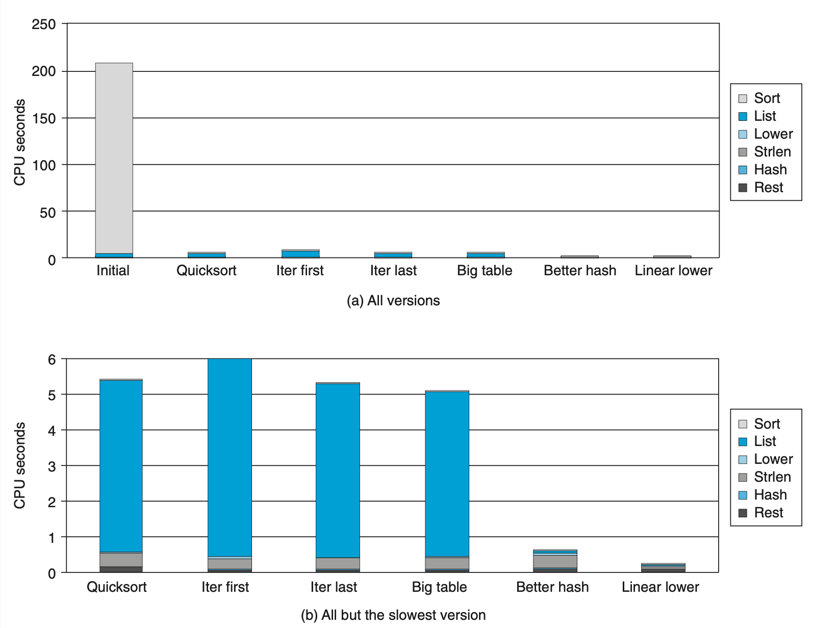

| 图 5.38 bigram 频率计数程序不同版本的分析结果。时间根据程序中的不同主要操作进行划分。|
| :-------------------------------: |

如图的 (a) 部分所示，我们的初始版本需要 3.5 分钟，大部分时间花费在排序上。这并不奇怪，因为插入排序具有二次运行时间，程序排序了 363,039 个值。

在我们的下一个版本中，我们使用库函数 qsort 执行排序，该函数基于快速排序算法 [98]。它的预期运行时间为 $O(n \log n)$。此版本在图中标记为"Quicksort"。更高效的排序算法将排序时间减少到可以忽略不计，总运行时间减少到约 5.4 秒。图的 (b) 部分以我们可以更清楚地看到它们的比例显示剩余版本的时间。

---

<!-- Page 0595 -->

随着排序的改进，我们现在发现列表扫描成为瓶颈。认为效率低下是由于函数的递归结构，我们将其替换为迭代函数，显示为"Iter first"。令人惊讶的是，运行时间增加到约 7.5 秒。经过更仔细的研究，我们发现两个列表函数之间存在微妙的差异。递归版本在列表末尾插入新元素，而迭代版本在前面插入它们。为了最大化性能，我们希望最频繁的 n-gram 出现在列表的开头附近。这样，函数将快速定位常见情况。假设 n-gram 在整个文档中均匀分布，我们会期望频繁的 n-gram 的第一次出现在不太频繁的 n-gram 之前。通过在末尾插入新 n-gram，第一个函数倾向于按频率的降序对 n-gram 进行排序，而第二个函数倾向于做相反的事情。因此，我们创建了第三个列表扫描函数，该函数使用迭代但在此列表末尾插入新元素。使用此版本，显示为"Iter last"，时间下降到约 5.3 秒，略好于递归版本。这些测量表明，作为优化工作的一部分，对程序运行实验的重要性。我们最初假设将递归代码转换为迭代代码会提高其性能，并没有考虑添加到列表末尾或开头之间的区别。严格按顺序乘以元素不太可能比独立乘以两组然后将这些乘积相乘在一起提供根本上更好的准确性。对于大多数应用程序，实现 $2 \times$ 的性能提升超过了为奇怪数据模式产生不同结果的风险。尽管如此，程序开发人员应该与潜在用户核实，看看是否存在可能导致修订算法不可接受的特殊条件。大多数编译器不会尝试使用浮点代码进行此类转换，因为它们无法判断引入可能改变程序行为的转换的风险，无论多么小。

接下来，我们考虑哈希表结构。初始版本只有 1,021 个桶（通常，桶的数量被选择为素数以增强哈希函数在桶中均匀分布键的能力）。对于具有 363,039 个条目的表，这将意味着 363,039/1,021 = 355.6 的平均负载。这解释了为什么如此多的时间花费在执行列表操作上——搜索涉及测试大量候选 n-gram。它还解释了为什么性能对列表排序如此敏感。然后我们将桶的数量增加到 199,999，将平均负载减少到 1.8。然而，奇怪的是，我们的总运行时间仅下降到 5.1 秒，差异仅为 0.2 秒。

经过进一步检查，我们可以看到使用较大表的最小性能提升是由于哈希函数的选择不佳。简单地对字符串的字符代码求和不会产生非常宽的值范围。特别是，字母的最大代码值为 122，因此 n 个字符的字符串将生成最多 122n 的总和。我们文档中最长的 bigram，"honorificabilitudinitatibus thou" 总和仅为 3,371，因此我们哈希表中的大多数桶将未使用。此外，可交换的哈希函数（如加法）不区分字符串中字符的不同可能排序。例如，单词"rat"和"tar"将生成相同的总和。

我们切换到使用移位和异或操作的哈希函数。使用此版本，显示为"Better hash"，时间下降到 0.6 秒。更系统的方法是更仔细地研究键在桶中的分布，确保它接近如果哈希函数具有均匀输出分布时所期望的结果。

---

<!-- Page 0596 -->

最后，我们已将运行时间减少到大部分时间花费在 strlen 中的点，并且 strlen 的大部分调用作为小写转换的一部分发生。我们已经看到函数 lower1 具有二次性能，特别是对于长字符串。此文档中的单词足够短，可以避免二次性能的灾难性后果；最长的 bigram 只有 32 个字符。尽管如此，切换到 lower2，显示为"Linear lower"，产生了显著的改进，总时间下降到约 0.2 秒。

通过这个练习，我们已经展示了代码分析可以帮助将简单应用程序所需的时间从 3.5 分钟下降到 0.2 秒，产生约 $1,000 \times$ 的性能提升。分析器帮助我们将注意力集中在程序最耗时的部分，并提供有关过程调用结构的有用信息。我们代码中的一些瓶颈，例如使用二次排序例程，很容易预料到，而其他瓶颈，例如是附加到列表的开头还是结尾，只有通过仔细分析才会出现。

我们可以看到，分析是工具箱中拥有的有用工具，但它不应该是唯一的工具。时序测量不完美，特别是对于较短（少于 1 秒）的运行时间。更重要的是，结果仅适用于测试的特定数据。例如，如果我们在由较少数量的较长字符串组成的数据上运行原始函数，我们会发现小写转换例程是主要的性能瓶颈。更糟糕的是，如果它只分析具有短单词的文档，我们可能永远不会检测到隐藏的瓶颈，例如 lower1 的二次性能。一般来说，分析可以帮助我们针对典型情况进行优化，假设我们在代表性数据上运行程序，但我们还应该确保程序对所有可能的情况都具有良好的性能。这主要涉及避免产生较差渐近性能的算法（如插入排序）和不良编程实践（如 lower1）。

第 1.9.1 节中描述的阿姆达尔定律提供了关于通过针对性优化可以获得的性能提升的一些额外见解。对于我们的 n-gram 代码，当我们用快速排序替换插入排序时，我们看到总执行时间从 209.0 秒下降到 5.4 秒。初始版本在其 209.0 秒中花费了 203.7 秒执行插入排序，给出 $\alpha = 0.974$，即受加速影响的时间分数。使用快速排序，排序时间变得可以忽略不计，产生预测加速 $209/\alpha = 39.0$，接近测量的加速 38.5。我们能够获得大的加速，因为排序构成了整体执行时间的很大一部分。然而，当一个瓶颈被消除时，就会出现一个新的瓶颈，因此获得额外的加速需要关注程序的其他部分。

## 5.15 总结

尽管大多数关于代码优化的演示描述了编译器如何生成高效代码，但应用程序程序员可以做很多事情来帮助编译器完成此任务。没有编译器可以用好的算法或数据替换低效的算法或数据结构，因此程序设计的这些方面应该仍然是程序员的主要关注点。我们还看到，优化阻碍因素（如内存别名和过程调用）严重限制了编译器执行广泛优化的能力。程序员必须承担消除这些的主要责任。这些应该简单地被视为良好编程实践的一部分，因为它们有助于消除不需要的工作。

---

<!-- Page 0597 -->

超越基本级别的性能调整需要对处理器的微架构有一定的了解，描述处理器实现其指令集架构的底层机制。对于乱序处理器的情况，仅了解有关功能单元的操作、能力、延迟和发射时间的一些信息就可以为预测程序性能建立基线。

我们研究了一系列技术——包括循环展开、创建多个累加器和重结合——可以利用现代处理器提供的指令级并行性。当我们深入优化时，研究生成的汇编代码并尝试理解机器如何执行计算变得很重要。通过识别程序中数据依赖性确定的关键路径，特别是在循环的不同迭代之间，可以获得很多收益。我们还可以计算计算的吞吐量界限，基于必须计算的操作数量以及执行这些操作的单元的数量和发射时间。

涉及条件分支或与内存系统的复杂交互的程序比我们首先考虑的简单循环程序更难分析和优化。基本策略是尝试使分支更可预测或使它们适合使用条件数据传输实现。我们还必须注意存储和加载操作之间的交互。将值保存在局部变量中，允许它们存储在寄存器中，通常会有所帮助。

在处理大型程序时，将优化工作集中在消耗最多时间的部分变得很重要。代码分析器和相关工具可以帮助我们系统地评估和改进程序性能。我们描述了 GPROF，一个标准的 Unix 分析工具。更复杂的分析器可用，例如来自英特尔的 VTUNE 程序开发系统，以及在 Linux 系统上通常可用的 VALGRIND。这些工具可以将执行时间分解到过程级别以下，以估计程序每个基本块的性能。（基本块是一系列指令，其中间没有控制转移，因此块总是完整执行。）

## 参考文献说明

我们的重点是从程序员的角度描述代码优化，演示如何编写代码以使编译器更容易生成高效代码。Chellappa、Franchetti 和 Püschel 的扩展论文 [19]

---

<!-- Page 0598 -->

采用了类似的方法，但更详细地介绍了处理器的特性。

许多出版物从编译器的角度描述代码优化，制定编译器可以生成更高效代码的方法。Muchnick 的书被认为是最全面的 [80]。Wadleigh 和 Crawford 关于软件优化的书 [115] 涵盖了我们介绍的一些材料，但它还描述了在并行机器上获得高性能的过程。Mahlke 等人的早期论文 [75] 描述了如何将为将程序映射到并行机器而开发的几种技术适应以利用现代处理器的指令级并行性。本文涵盖了我们提出的代码转换，包括循环展开、多累加器（他们称之为累加器变量扩展）和重结合（他们称之为树高度减少）。

我们对乱序处理器操作的介绍相当简短和抽象。可以在高级计算机体系结构教科书中找到更完整的一般原理描述，例如 Hennessy 和 Patterson 的教科书 [46，第 2-3 章]。Shen 和 Lipasti 的书 [100] 提供了现代处理器设计的深入处理。

## 家庭作业

**5.13 ◆◆**

假设我们希望编写一个计算两个向量 u 和 v 的内积的过程。该函数的抽象版本对于 x86-64 的不同类型的整数和浮点数据具有 14–18 的 CPE。通过对我们将抽象程序 combine1 转换为更高效的 combine4 所做的相同类型的转换，我们得到以下代码：

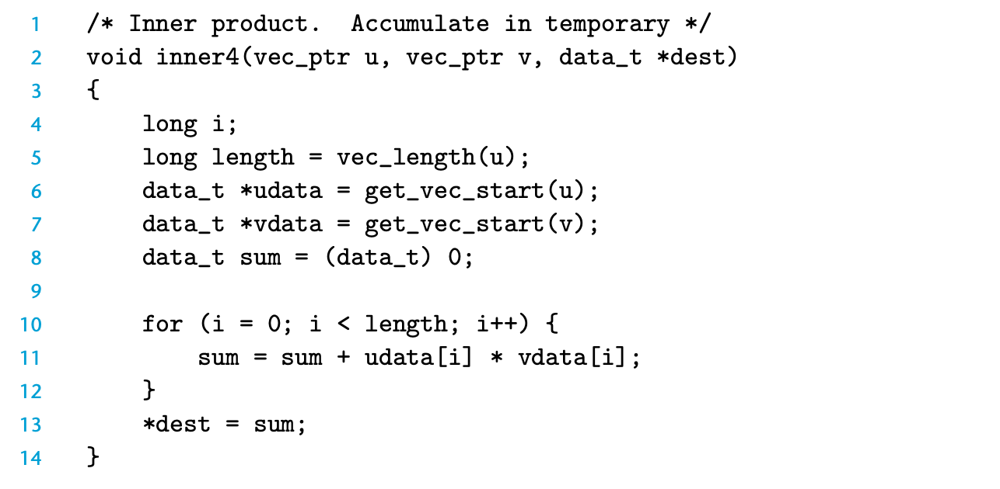

我们的测量显示此函数对于整数数据的 CPE 为 1.50，对于浮点数据的 CPE 为 3.00。对于数据类型 double，内部循环的 x86-64 汇编代码如下：

---

<!-- Page 0599 -->

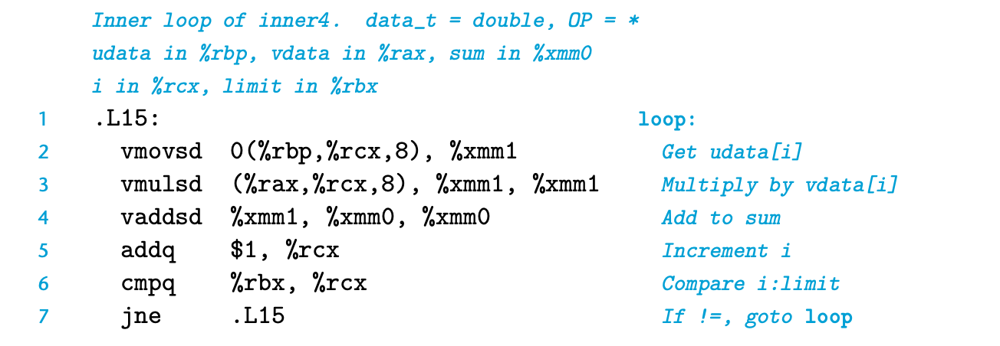

假设功能单元具有图 5.12 中列出的特性。

A. 以图 5.13 和 5.14 的风格绘制此指令序列将如何解码为操作并显示它们之间的数据依赖性如何创建操作的关键路径。

B. 对于数据类型 double，关键路径确定的 CPE 的下界是多少？

C. 假设整数代码也有类似的指令序列，关键路径确定的整数数据的 CPE 的下界是多少？

D. 解释浮点版本如何具有 3.00 的 CPE，即使乘法操作需要 5 个时钟周期。

**5.14 ◆**

编写问题 5.13 中描述的内积过程的一个版本，该版本使用 $6 \times 1$ 循环展开。对于 x86-64，我们对展开版本的测量对于整数数据给出 CPE 为 1.07，但对于两种浮点数据仍为 3.01。

A. 解释为什么在英特尔 Core i7 Haswell 处理器上运行的内积过程的任何（标量）版本都无法实现小于 1.00 的 CPE。

B. 解释为什么浮点数据的性能没有随循环展开而改善。

**5.15 ◆**

编写问题 5.13 中描述的内积过程的一个版本，该版本使用 $6 \times 6$ 循环展开。我们对此函数与 x86-64 的测量对于整数数据给出 CPE 为 1.06，对于浮点数据给出 1.01。

什么因素将性能限制在 CPE 为 1.00？

**5.16 ◆**

编写问题 5.13 中描述的内积过程的一个版本，该版本使用 $6 \times 1a$ 循环展开以启用更大的并行性。我们对此函数的测量对于整数数据给出 CPE 为 1.10，对于浮点数据给出 1.05。

**5.17 ◆◆**

库函数 memset 具有以下原型：

```c
void *memset(void *s, int c, size_t n);
```

---

<!-- Page 0600 -->

此函数用 c 的低位字节的副本填充从 s 开始的内存区域的 n 个字节。例如，它可以通过为 c 提供参数 0 来将内存区域清零，但其他值也是可能的。

以下是 memset 的直接实现：

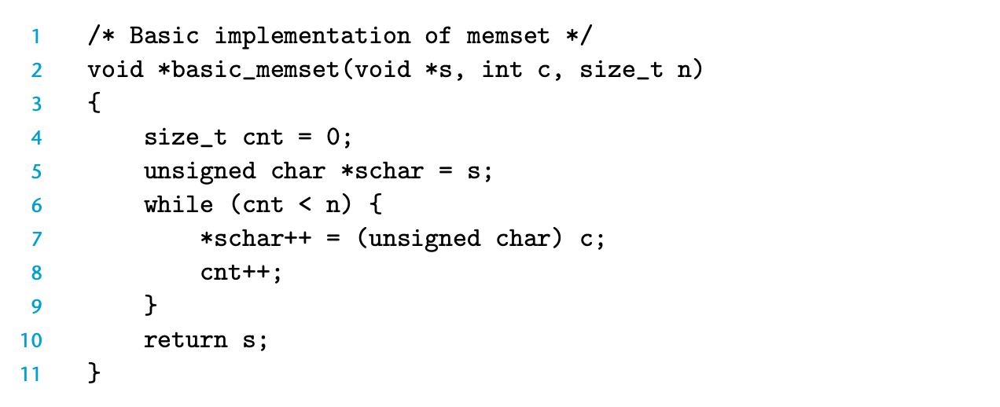

通过使用数据类型 unsigned long 的字来打包 c 的八个副本，然后使用字级写入步进通过区域，实现该函数的更高效版本。你可能会发现执行额外的循环展开也很有帮助。在我们的参考机器上，我们能够将 CPE 从直接实现的 1.00 降低到 0.127。也就是说，程序能够每个时钟周期写入 8 个字节。

以下是一些额外的指南。为了确保可移植性，让 K 表示你运行程序的机器的 sizeof(unsigned long) 的值。

• 你不得调用任何库函数。

- 你的代码应该适用于 n 的任意值，包括当它不是 K 的倍数时。你可以以类似于我们完成循环展开的最后几次迭代的方式来做到这一点。

- 你应该编写代码，使其在任何机器上编译和正确运行，无论 K 的值如何。使用 sizeof 操作来做到这一点。

- 在某些机器上，未对齐的写入可能比对齐的写入慢得多。（在某些非 x86 机器上，它们甚至可能导致分段错误。）编写代码，使其以字节级写入开始，直到目标地址是 K 的倍数，然后执行字级写入，然后（如有必要）以字节级写入完成。

- 注意 cnt 足够小以至于某些循环的上界变为负数的情况。使用涉及 size of 运算符的表达式，测试可能使用无符号算术执行。（参见第 2.2.8 节和问题 2.72。）

**5.18 ◆◆◆**

我们在练习题 5.5 和 5.6 中考虑了多项式评估的任务，既有直接评估也有霍纳方法的评估。尝试

---

<!-- Page 0601 -->

使用我们探索的优化技术（包括循环展开、并行累积和重结合）编写更快的函数版本。你会发现许多不同的方法将霍纳方案和直接评估与这些优化技术混合在一起。

理想情况下，你应该能够达到接近机器吞吐量极限的 CPE。我们的最佳版本在参考机器上实现了 1.07 的 CPE。

**5.19 ◆◆◆**

在问题 5.12 中，我们能够将前缀和计算的 CPE 降低到 3.00，受此机器上浮点加法的延迟限制。简单的循环展开没有改善事情。

使用循环展开和重结合的组合，编写前缀和的代码，使其实现小于机器上浮点加法延迟的 CPE。这样做实际上需要增加执行的加法数量。例如，我们的双向展开版本每次迭代需要三次加法，而我们的四向展开版本需要五次。我们的最佳实现在参考机器上实现了 1.67 的 CPE。

确定机器的吞吐量和延迟极限如何限制你可以为前缀和操作实现的最小 CPE。

## 练习题答案

**练习题 5.1 答案（第 536 页）**

这个问题说明了内存别名的一些微妙影响。

如以下注释代码所示，效果将是将 xp 处的值设置为零：

```c
*xp = *xp + *xp; /*2x*/
*xp = *xp - *xp; /*2x-2x=0*/
*xp = *xp - *xp; /*0-0=0*/
```

此示例说明我们对程序行为的直觉经常是错误的。我们自然会考虑 xp 和 yp 不同的情况，但忽略了它们可能相等的可能性。错误通常是由于程序员没有预料到的条件而产生的。

**练习题 5.2 答案（第 540 页）**

这个问题说明了 CPE 和绝对性能之间的关系。它可以使用基本代数求解。我们发现对于 $n \leq 2$，版本 1 最快。版本 2 对于 $3 \leq n \leq 7$ 最快，版本 3 对于 $n \geq 8$ 最快。

**练习题 5.3 答案（第 548 页）**

这是一个简单的练习，但重要的是要认识到 for 循环的四个语句——初始化、测试、更新和主体——被执行不同的次数。

---

<!-- Page 0602 -->

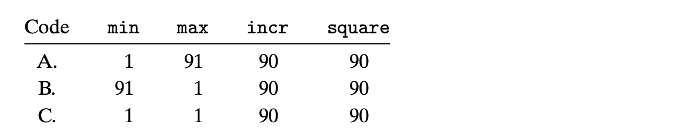

**练习题 5.4 答案（第 552 页）**

此汇编代码演示了 GCC 检测到的巧妙优化机会。值得仔细研究此代码以更好地理解代码优化的微妙之处。

A. 在优化较少的代码中，寄存器 %xmm0 只是用作临时值，在每次循环迭代中设置和使用。在优化更多的代码中，它更多地以 combine4 中变量 acc 的方式使用，累积向量元素的乘积。然而，与 combine4 的不同之处在于，位置 dest 在每次迭代中由第二个 vmovsd 指令更新。

我们可以看到此优化版本的操作非常类似于以下 C 代码：

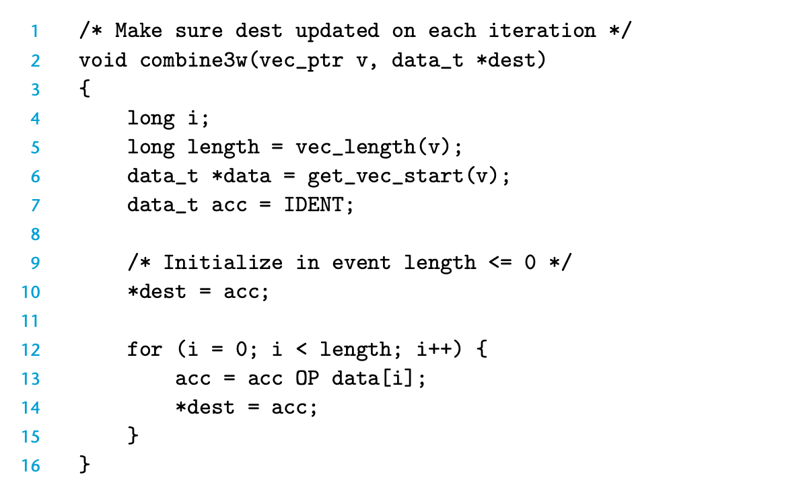

B. combine3 的两个版本将具有相同的功能，即使有内存别名。

C. 此转换可以在不改变程序行为的情况下进行，因为除了第一次迭代外，在每次迭代开始时从 dest 读取的值将是在上一次迭代结束时写入此寄存器的相同值。

---

<!-- Page 0603 -->

因此，组合指令可以简单地在循环开始时使用 %xmm0 中已有的值。

**练习题 5.5 答案（第 566 页）**

多项式评估是解决许多问题的核心技术。例如，多项式函数通常用于在数学库中近似三角函数。

A. 该函数执行 2n 次乘法和 n 次加法。

B. 我们可以看到这里的性能限制计算是表达式 $x_{pwr} = x * x_{pwr}$ 的重复计算。这需要浮点乘法（5 个时钟周期），并且一次迭代的计算在前一次迭代完成之前无法开始。result 的更新仅需要在连续迭代之间进行浮点加法（3 个时钟周期）。

**练习题 5.6 答案（第 566 页）**

这个问题演示了最小化计算中的操作数量可能不会提高其性能。

A. 该函数执行 n 次乘法和 n 次加法，是原始函数 poly 的一半乘法次数。

B. 我们可以看到这里的性能限制计算是表达式 result = a[i] + x*result 的重复计算。从前一次迭代的 result 值开始，我们必须首先将其乘以 x（5 个时钟周期），然后将其加到 a[i]（3 个周期），然后才有此迭代的值。因此，每次迭代施加 8 个周期的最小延迟，正是我们测量的 CPE。

C. 尽管函数 poly 中的每次迭代需要两次乘法而不是一次，但每次迭代沿关键路径只有一次乘法发生。

**练习题 5.7 答案（第 568 页）**

以下代码直接遵循我们为按因子 k 展开循环所陈述的规则：

```c
void unroll5(vec_ptr v, data_t *dest)
{
    long i;
    long length = vec_length(v);
    long limit = length-4;
    data_t *data = get_vec_start(v);
    data_t acc = IDENT;
}
```

---

<!-- Page 0604 -->

```c
/* Combine 5 elements at a time */
for (i = 0; i < limit; i+=5) {
    acc = acc OP data[i] OP data[i+1];
    acc = acc OP data[i+2] OP data[i+3];
    acc = acc OP data[i+4];
}
/* Finish any remaining elements */
for (; i < length; i++) {
    acc = acc OP data[i];
}
*dest = acc;
}
```

**练习题 5.8 答案（第 581 页）**

这个问题演示了程序中的小改动如何产生显著的性能差异，特别是在具有乱序执行的机器上。图 5.39 绘制了函数单次迭代的三个乘法操作。在此图中，显示为蓝色框的操作沿关键路径——它们需要按顺序计算以计算循环变量 r 的新值。显示为浅色框的操作可以与关键路径操作并行计算。对于沿关键路径有 P 个操作的循环，每次迭代将需要至少 5P 个时钟周期，并将计算三个元素的乘积，给出 CPE 的下界 5P/3。这意味着 A1 的下界为 5.00，A2 和 A5 的下界为 3.33，A3 和 A4 的下界为 1.67。我们在英特尔 Core i7 Haswell 处理器上运行这些函数，发现它可以实现这些 CPE 值。

**练习题 5.9 答案（第 589 页）**

这是另一个演示，编码风格的细微变化可以使编译器更容易检测使用条件移动的机会：

```c
while (i1 < n && i2 < n) {
    long v1 = src1[i1];
}
```

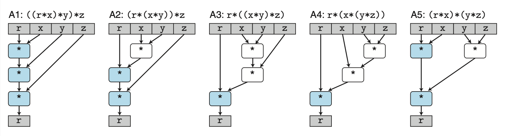

| 图 5.39 问题 5.8 中情况的乘法操作之间的数据依赖性。显示为蓝色框的操作形成迭代的关键路径。|
| :-------------------------------: |

---

<!-- Page 0605 -->

```c
long v2 = src2[i2];
long take1 = v1 < v2;
dest[id++] = take1? v1 : v2;
i1 += take1;
i2 += (1-take1);
}
```

我们测量此版本代码的 CPE 约为 12.0，比原始 CPE 15.0 有适度改进。

**练习题 5.10 答案（第 595 页）**

这个问题要求你分析程序中潜在的加载-存储交互。

A. 它将为 $0 \leq i \leq 998$ 将每个元素 a[i] 设置为 $i + 1$。

B. 它将为 $1 \leq i \leq 999$ 将每个元素 a[i] 设置为 0。

C. 在第二种情况下，一次迭代的加载取决于前一次迭代的存储结果。因此，连续迭代之间存在写/读依赖性。

D. 它将给出 CPE 为 1.2，与示例 A 相同，因为存储和后续加载之间没有依赖性。

**练习题 5.11 答案（第 597 页）**

我们可以看到此函数在连续迭代之间具有写/读依赖性——一次迭代的目标值 p[i] 与下一次迭代的源值 p[i-1] 匹配。因此，为每次迭代形成一条关键路径，包括存储（来自前一次迭代）、加载和浮点加法。CPE 测量值 9.0 与我们对 write_read 的 CPE 为 7.3 的测量一致（当存在数据依赖性时），因为 write_read 涉及整数加法（1 个时钟周期延迟），而 psum1 涉及浮点加法（3 个时钟周期延迟）。

**练习题 5.12 答案（第 597 页）**

这是该函数的修订版本：

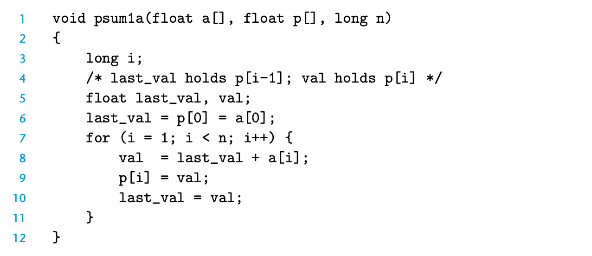

---

<!-- Page 0606 -->

我们引入一个局部变量 last_val。在迭代 i 开始时，它保存 p[i-1] 的值。然后我们计算 val 为 p[i] 的值并为 last_val 的新值。

此版本编译为以下汇编代码：

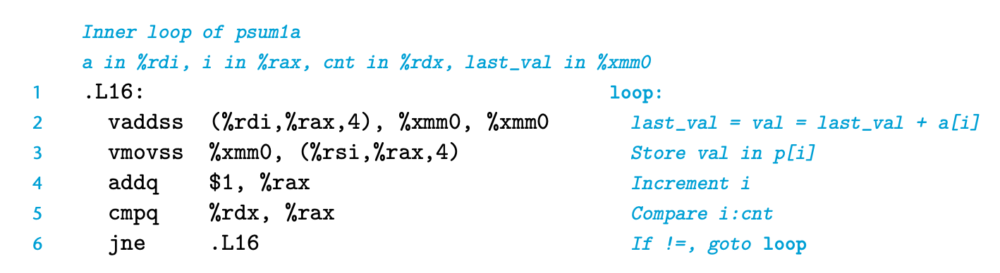

此代码将 last_val 保存在 %xmm0 中，避免了需要从内存中读取 p[i-1]，从而消除了 psum1 中看到的写/读依赖性。

---
