# 第 6 章：存储器层次结构

<!-- Page 0607 -->

6.1 存储技术 617

6.2 局部性 640

6.3 存储器层次结构 645

6.4 高速缓存存储器 650

6.5 编写高速缓存友好的代码 669

6.6 综合：高速缓存对程序性能的影响 675

6.7 小结 684

参考文献注记 684

课后习题 685

练习题答案 696

---

<!-- Page 0608 -->

在本书对系统的学习中，我们一直依赖一个简单的计算机系统模型：CPU 负责执行指令，内存系统为 CPU 保存指令和数据。在这个简单模型中，内存系统是一个线性的字节数组，CPU 可以在恒定的时间内访问每个内存位置。虽然这个模型在一定程度上是有效的，但它并不反映现代系统的真实工作方式。

实际上，**内存系统**（memory system）是一个由不同容量、成本和访问时间的存储设备构成的层次结构。CPU 寄存器保存最常用的数据。CPU 附近的小型、快速高速**缓存存储器**（cache memory）充当主内存中部分数据和指令的暂存区，而主内存本身访问速度相对较慢。主内存是大型、慢速磁盘上数据的暂存区，而磁盘又常常充当通过网络连接的其他机器上的磁盘或磁带所存储数据的暂存区。

存储器层次结构之所以有效，是因为编写良好的程序倾向于更频繁地访问某一层的存储，而较少访问下一层的存储。因此，下一层的存储可以更慢，从而体积更大、每位成本更低。整体效果是形成了一个大型存储池，其成本接近层次结构底部的廉价存储，但向程序提供数据的速度却接近层次结构顶部的快速存储。

作为程序员，你需要理解存储器层次结构，因为它对应用程序的性能有重大影响。如果程序所需的数据存储在 CPU 寄存器中，则在执行指令期间可以在 0 个周期内访问。如果存储在高速缓存中，则需要 4 到 75 个周期。如果存储在主内存中，则需要数百个周期。而如果存储在磁盘上，则需要数千万个周期！

因此，计算机系统中有一个根本而持久的思想：如果你理解系统如何在存储器层次结构中上下移动数据，就可以编写应用程序，使其数据项存储在层次结构的较高层，从而让 CPU 能更快地访问它们。

这个思想的核心是计算机程序的一个基本属性，称为**局部性**（locality）。具有良好局部性的程序倾向于反复访问同一组数据项，或者倾向于访问相邻的数据项集合。与局部性差的程序相比，具有良好局部性的程序倾向于从存储器层次结构的较高层访问更多数据项，因此运行更快。例如，在我们的 Core i7 系统上，执行相同数量算术操作但局部性程度不同的矩阵乘法内核，其运行时间可以相差近 40 倍！

在本章中，我们将介绍基本的存储技术——SRAM 内存、DRAM 内存、ROM 内存以及旋转磁盘和固态硬盘——并描述它们如何组织成层次结构。特别地，我们重点关注充当 CPU 与主内存之间暂存区的高速缓存存储器，因为它们对应用程序性能的影响最大。我们将向你展示如何分析 C 程序的局部性，并介绍改善程序局部性的技术。你还将学习一种有趣的方法，通过"存储器山"来描述特定机器上存储器层次结构的性能，该方法将读访问时间表示为局部性的函数。

---

<!-- Page 0609 -->

## 6.1 存储技术

计算机技术的巨大成功在很大程度上源于存储技术的巨大进步。早期计算机只有几千字节的随机访问存储器。最早的 IBM PC 甚至没有硬盘。这种情况在 1982 年 IBM PC-XT 推出后发生了改变，该机型配备了 10 兆字节的磁盘。到 2015 年，典型机器的磁盘存储量是当时的 30 万倍，而存储量每隔几年就翻一番。

### 6.1.1 随机访问存储器

**随机访问存储器**（RAM）有两种类型——静态型和动态型。**静态 RAM**（SRAM）**比动态 RAM**（DRAM）更快，但价格也显著更高。SRAM 用于高速缓存存储器，既可在 CPU 芯片上，也可在片外。DRAM 用于主内存以及图形系统的帧缓冲区。通常，台式系统的 SRAM 不超过几十兆字节，但 DRAM 则有数百或数千兆字节。

**静态 RAM**

SRAM 将每个位存储在一个双稳态存储单元中。每个单元由一个六晶体管电路实现。这个电路具有这样的特性：它可以无限期地保持在两种不同电压配置（即状态）之一中。任何其他状态都是不稳定的——从那里开始，电路会迅速移向其中一个稳定状态。这样的存储单元类似于图 6.1 所示的倒置摆。

该摆在完全向左或完全向右倾斜时是稳定的。从任何其他位置，摆都会倒向某一侧。理论上，摆也可以无限期地在垂直位置保持平衡，但这个状态是亚稳态的——最微小的扰动就会使它开始倒落，一旦倒落就永远不会回到垂直位置。

由于其双稳态特性，SRAM 存储单元只要保持通电，就会无限期地保留其值。即使受到电气噪声等干扰使电压发生扰动，一旦干扰消除，电路就会恢复到稳定值。

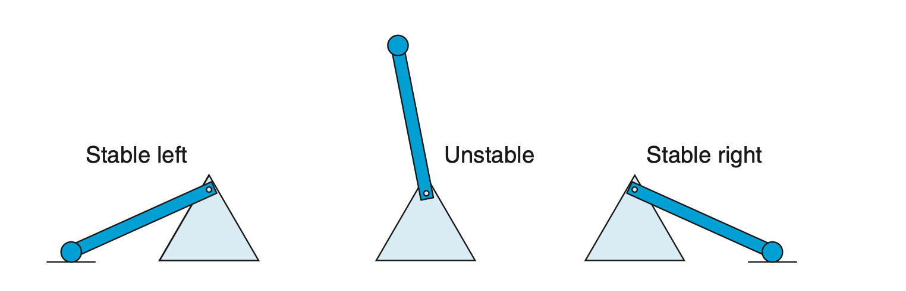

| 图 6.1 倒置摆。与 SRAM 单元一样，摆只有两种稳定配置（即状态）。|
| :-------------------------------: |

---

<!-- Page 0610 -->

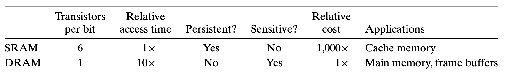

| 图 6.2 DRAM 和 SRAM 存储器的特性。 |
| :-------------------------------: |

**动态 RAM**

DRAM 将每个位作为电容器上的电荷存储。这个电容器非常小——通常约为 30 femtofarads，即 $30 \times 10^{-15}$ 法拉（farads）。不过，法拉是一个非常大的度量单位。DRAM 存储可以做得非常密集——每个单元由一个电容器和一个访问晶体管组成。然而，与 SRAM 不同，DRAM 存储单元对任何干扰都非常敏感。当电容器电压受到干扰时，它永远无法恢复。光线照射会导致电容器电压发生变化。事实上，数码相机和摄像机中的传感器本质上就是 DRAM 单元的阵列。

各种漏电流来源会导致 DRAM 单元在大约 10 到 100 毫秒的时间内失去电荷。幸运的是，对于以纳秒为时钟周期的计算机来说，这个保持时间相当长。内存系统必须通过读出再写入的方式定期刷新每个内存位。一些系统还使用纠错码，计算机字使用额外几位进行编码（例如，64 位的字可能用 72 位编码），这样电路就能检测并纠正字中的任何单个错误位。

图 6.2 总结了 SRAM 和 DRAM 内存的特性。只要通电，SRAM 就能保持数据。与 DRAM 不同，SRAM 无需刷新。SRAM 的访问速度比 DRAM 更快。SRAM 对光线和电气噪声等干扰不敏感。权衡之处在于，SRAM 单元使用的晶体管比 DRAM 单元多，因此密度更低、成本更高、功耗更大。

**传统 DRAM**

DRAM 芯片中的单元（位）被划分为 $d$ 个超单元，每个超单元由 $w$ 个 DRAM 单元组成。一个 $d \times w$ 的 DRAM 共存储 $dw$ 位信息。超单元被组织为具有 $r$ 行和 $c$ 列的矩形阵列，其中 $rc = d$。每个超单元的地址形式为 $(i, j)$，其中 $i$ 表示行，$j$ 表示列。

例如，图 6.3 显示了一个 $16 \times 8$ DRAM 芯片的组织结构，其中 $d = 16$ 个超单元，每个超单元 $w = 8$ 位，$r = 4$ 行，$c = 4$ 列。阴影框表示地址 $(2, 1)$ 处的超单元。信息通过称为引脚的外部连接器流入和流出芯片。每个引脚携带 1 位信号。图 6.3 显示了其中两组引脚：8 个数据引脚，可以传输 1 字节进出芯片，以及两个携带 2 位行列超单元地址的 addr 引脚。其他携带控制信息的引脚未显示。

---

<!-- Page 0611 -->

>**旁注 术语说明**
>
>存储界从未就 DRAM 阵列元素的标准名称达成共识。计算机体系结构师倾向于将其称为"单元（cell）"，这与 DRAM 存储单元的术语重叠。电路设计师倾向于将其称为"字（word）"，这又与主内存的字产生混淆。为避免歧义，我们采用了"超单元（supercell）"这一明确的术语。

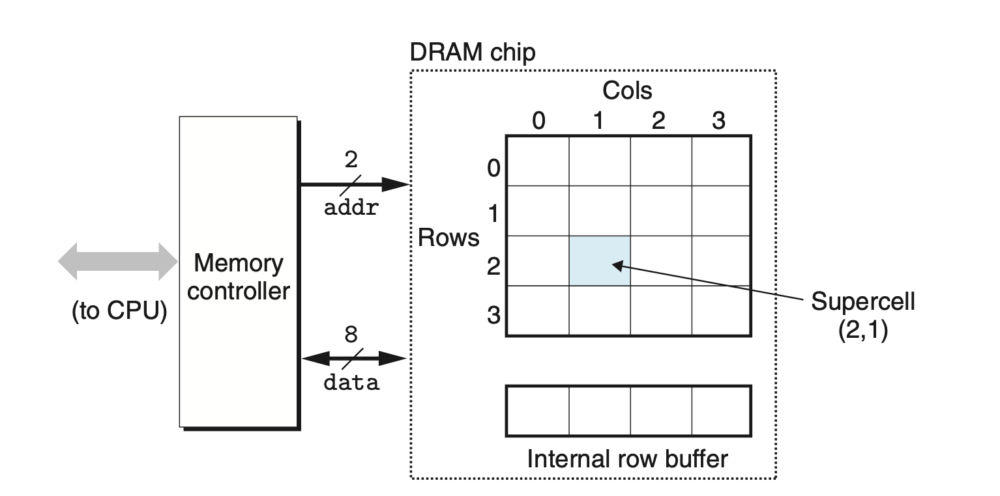

| 图 6.3 128 位 $16 \times 8$ DRAM 芯片的高层视图。 |
| :-------------------------------: |

每个 DRAM 芯片连接到一些电路，称为**内存控制器（memory controller）**，它可以一次向每个 DRAM 芯片传输或从中接收 $w$ 位。要读取超单元 $(i, j)$ 的内容，内存控制器向 DRAM 发送行地址 $i$，随后发送列地址 $j$。DRAM 的响应是将超单元 $(i, j)$ 的内容发送回控制器。行地址 $i$ 称为 **RAS**（行地址选通，Row Access Strobe）请求，列地址 $j$ 称为 **CAS**（列地址选通，Column Access Strobe）请求。注意，RAS 和 CAS 请求共享相同的 DRAM 地址引脚。

例如，要从图 6.3 的 $16 \times 8$ DRAM 中读取超单元 $(2, 1)$，内存控制器发送行地址 2，如图 6.4(a) 所示。DRAM 的响应是将第 2 行的全部内容复制到内部行缓冲区中。接着，内存控制器发送列地址 1，如图 6.4(b) 所示。DRAM 的响应是从行缓冲区中复制超单元 $(2, 1)$ 的 8 位，并将其发送给内存控制器。

电路设计师将 DRAM 组织为二维数组而非线性数组的原因之一是减少芯片上的地址引脚数量。例如，如果我们示例中的 128 位 DRAM 被组织为地址从 0 到 15 的 16 个超单元的线性数组，则芯片将需要 4 个地址引脚而非 2 个。二维数组组织的缺点是地址必须分两步发送，这增加了访问时间。

---

<!-- Page 0612 -->

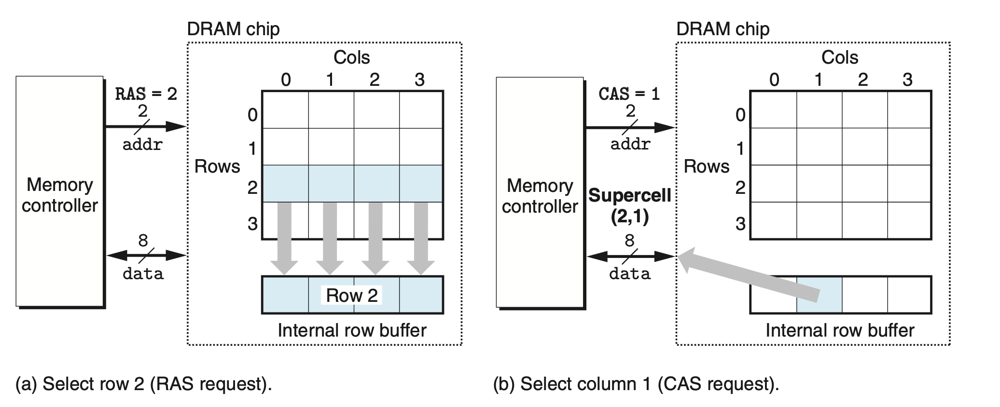

| 图 6.4 读取 DRAM 超单元的内容。 （a）选择第 2 行（RAS 请求）。(b) 选择第 1 列（CAS 请求）。|
| :-------------------------------: |

**内存模块**

DRAM 芯片封装在内存模块中，插入主系统板（主板）上的扩展槽。Core i7 系统使用 240 引脚的**双列直插式内存模块**（DIMM），以 64 位为单位向内存控制器传输数据。

图 6.5 展示了内存模块的基本原理。示例模块使用 8 个 64 兆位 $8M \times 8$ DRAM 芯片（编号 0 到 7）存储总计 64 MB（兆字节）。每个超单元存储主内存的 1 字节，主内存中字节地址 $A$ 处的每个 64 位字由 8 个超单元表示，这些超单元的对应超单元地址为 $(i, j)$。在图 6.5 的示例中，DRAM 0 存储第一个（低位）字节，DRAM 1 存储下一个字节，以此类推。

要获取内存地址 $A$ 处的字，内存控制器将 $A$ 转换为超单元地址 $(i, j)$ 并将其发送到内存模块，内存模块随后将 $i$ 和 $j$ 广播到每个 DRAM。作为响应，每个 DRAM 输出其 $(i, j)$ 超单元的 8 位内容。模块中的电路收集这些输出并将其组合成一个 64 位字，返回给内存控制器。

通过将多个内存模块连接到内存控制器，可以聚合主内存。在这种情况下，当控制器接收到地址 $A$ 时，控制器选择包含 $A$ 的模块 $k$，将 $A$ 转换为 $(i, j)$ 形式，并将 $(i, j)$ 发送到模块 $k$。

---

**练习题 6.1（答案见第 696 页）** 在下面的题目中，设 $r$ 为 DRAM 阵列的行数，$c$ 为列数，$b_r$ 为寻址行所需的位数，$b_c$ 为寻址列所需的位数。对于以下每种 DRAM，确定使 $\max(b_r, b_c)$（寻址阵列行或列所需的最大位数）最小化的 2 的幂次方阵列维度。

---

<!-- Page 0613 -->

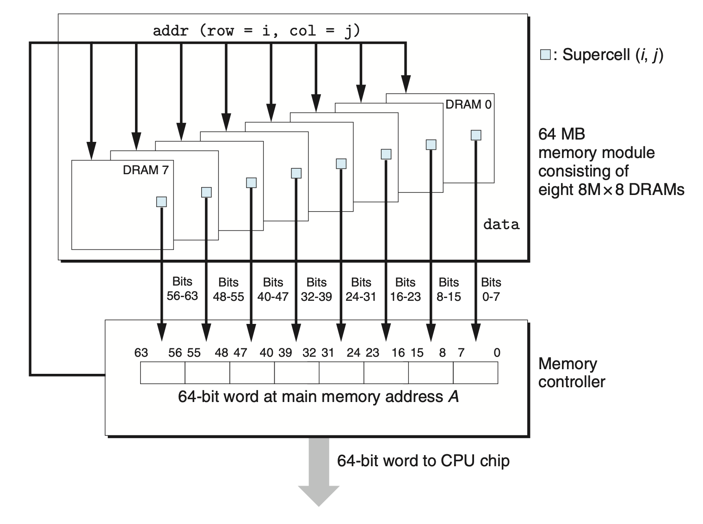

| 图6.5 读取内存模块的内容。|
| :-------------------------------: |

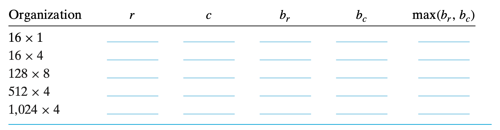

**增强型 DRAM**

DRAM 内存有许多种类，随着制造商努力跟上处理器速度的快速提升，新型号不断出现在市场上。每种都基于传统 DRAM 单元，并进行了优化以提高基本 DRAM 单元的访问速度。

- **快速页模式 DRAM（FPM DRAM）**。传统 DRAM 将整行超单元复制到其内部行缓冲区，使用其中一个，然后丢弃其余的。FPM DRAM 通过允许对同一行的连续访问直接从行缓冲区提供服务来改善这一点。例如，要从传统 DRAM 的第 $i$ 行读取四个超单元，内存控制器必须发送四个 RAS/CAS 请求，即使每次的行地址 $i$ 相同。要从 FPM DRAM 的同一行读取超单元，内存控制器发送一个初始 RAS/CAS 请求，然后发送三个 CAS 请求。初始 RAS/CAS 请求将第 $i$ 行复制到行缓冲区，并返回由 CAS 寻址的超单元。接下来的三个超单元直接从行缓冲区提供服务，因此比初始超单元返回得更快。

---

<!-- Page 0614 -->

- **扩展数据输出 DRAM（EDO DRAM）**。FPM DRAM 的增强形式，允许各个 CAS 信号在时间上间隔更紧密。

- **同步 DRAM（SDRAM）**。传统、FPM 和 EDO DRAM 都是异步的，它们使用一组显式控制信号与内存控制器通信。SDRAM 将许多这些控制信号替换为驱动内存控制器的同一外部时钟信号的上升沿。不深入细节，净效果是 SDRAM 能够以比其异步对应物更快的速率输出其超单元的内容。

- **双倍数据速率同步 DRAM（DDR SDRAM）**。DDR SDRAM 是 SDRAM 的增强版，通过将两个时钟沿都用作控制信号来使 DRAM 速度翻倍。不同类型的 DDR SDRAM 以小型预取缓冲区的大小为特征，该缓冲区增加了有效带宽：DDR（2 位）、DDR2（4 位）和 DDR3（8 位）。

- **视频 RAM（VRAM）**。用于图形系统的帧缓冲区。VRAM 在精神上与 FPM DRAM 相似。两个主要区别是：(1) VRAM 输出是通过依次移出内部缓冲区的全部内容产生的；(2) VRAM 允许对内存进行并发读写。因此，系统在用帧缓冲区中的像素绘制屏幕（读取）的同时，可以并发地写入下一次更新的新值（写入）。

**非易失性存储器**

DRAM 和 SRAM 是易失性的，即一旦断电就会丢失信息。另一方面，非易失性存储器即使断电也能保留信息。非易失性存储器有多种类型。出于历史原因，它们被统称为只读存储器（ROM），尽管某些类型的 ROM 既可以写入也可以读取。ROM 的区别在于可重编程（写入）的次数以及重编程的机制。

>**旁注 DRAM 技术的历史普及情况**
>
>直到 1995 年，大多数 PC 都使用 FPM DRAM 构建。1996 年至 1999 年，EDO DRAM 主导了市场，而 FPM DRAM 几乎销声匿迹。SDRAM 于 1995 年首次出现在高端系统中，到 2002 年，大多数 PC 都使用 SDRAM 和 DDR SDRAM 构建。到 2010 年，大多数服务器和台式机系统都使用 DDR3 SDRAM 构建。事实上，Intel Core i7 仅支持 DDR3 SDRAM。

---

<!-- Page 0615 -->

每个存储单元包含一种熔丝，可以通过大电流一次性熔断。

**可擦可编程** ROM（EPROM）有一个透明石英窗口，允许光线到达存储单元。通过石英窗口照射紫外线可以将 EPROM 单元清除为零。对 EPROM 编程是使用专用设备向 EPROM 写入 1 来完成的。EPROM 可以被擦除和重编程大约 1,000 次。电可擦可编程 PROM（EEPROM）类似于 EPROM，但它不需要单独的物理编程设备，因此可以在印刷电路板上就地重编程。EEPROM 在磨损之前可以重编程大约 $10^5$ 次。

**闪存**（flash memory）是一种基于 EEPROM 的非易失性存储器，已成为重要的存储技术。闪存无处不在，为众多电子设备提供快速、耐用的非易失性存储，包括数码相机、手机、音乐播放器以及笔记本电脑、台式机和服务器计算机系统。在 6.1.3 节中，我们将详细介绍一种新型的基于闪存的磁盘驱动器，称为固态硬盘（SSD），它提供了比传统旋转磁盘更快、更坚固、更省电的替代方案。

存储在 ROM 设备中的程序通常被称为**固件（firmware）**。当计算机系统上电时，它运行存储在 ROM 中的固件。一些系统在固件中提供一小组基本输入输出功能——例如，PC 的 BIOS（基本输入/输出系统）例程。显卡和磁盘驱动器控制器等复杂设备也依靠固件来转换来自 CPU 的 I/O（输入/输出）请求。

**访问主内存**

数据通过称为**总线**的共享电气导线在处理器和 DRAM 主内存之间来回流动。CPU 和内存之间的每次数据传输都通过一系列步骤完成，这些步骤称为**总线事务**（bus transaction）。读事务将数据从主内存传输到 CPU。写事务将数据从 CPU 传输到主内存。

总线是一组并行导线，携带地址、数据和控制信号。根据特定的总线设计，数据和地址信号可以共享同一组导线，也可以使用不同的组。此外，两个以上的设备可以共享同一总线。控制线携带同步事务并标识当前正在执行的事务类型的信号。例如，这个事务是主内存感兴趣的，还是磁盘控制器等其他 I/O 设备感兴趣的？该事务是读还是写？总线上的信息是地址还是数据项？

图 6.6 展示了一个示例计算机系统的配置。主要组件是 CPU 芯片、我们称为 I/O 桥的芯片组（包括内存控制器）以及构成主内存的 DRAM 内存模块。这些组件通过一对总线相连：一条**系统总线**连接 CPU 与 I/O 桥接器，一条**内存总线**连接 I/O 桥接器与主内存。I/O 桥将系统总线的电信号转换为内存总线的电信号。如我们将看到的，I/O 桥还将系统总线和内存总线连接到磁盘和显卡等 I/O 设备共享的 I/O 总线。但现在，我们将重点放在内存总线上。

---

<!-- Page 0616 -->

>**旁注 总线设计说明**
>
>总线设计是计算机系统中一个复杂且快速变化的方面。不同供应商开发不同的总线架构作为差异化产品的手段。例如，某些 Intel 系统使用称为北桥和南桥的芯片组，分别将 CPU 连接到内存和 I/O 设备。在较旧的 Pentium 和 Core 2 系统中，前端总线（FSB）将 CPU 连接到北桥。AMD 系统用 HyperTransport 互连替代了 FSB，而较新的 Intel Core i7 系统则使用 QuickPath 互连。这些不同总线架构的细节超出了本书的范围。相反，我们将使用图 6.6 中的高层总线架构作为贯穿全书的示例。这是一个简单但有用的抽象，使我们能够具体说明，同时不过于依赖任何专有设计的细节。

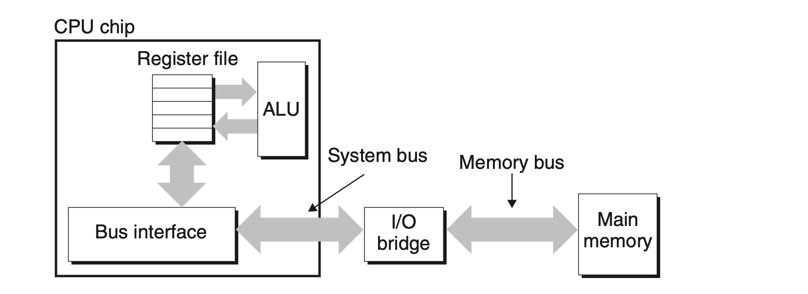

| 图 6.6 连接 CPU 和主内存的示例总线结构。 |
| :-------------------------------: |

考虑当 CPU 执行如下加载操作时会发生什么：

```
movq A,%rax
```

其中地址 $A$ 的内容被加载到寄存器 `%rax`。CPU 芯片上称为**总线接口**的电路在总线上发起一个读事务。读事务包括三步。首先，CPU 将地址 $A$ 放到系统总线上，I/O 桥将信号传递到内存总线（图 6.7(a)）。接着，主内存感知到内存总线上的地址信号，从内存总线读取地址，从 DRAM 中取出数据，并将数据写入内存总线。I/O 桥将内存总线信号转换为系统总线信号并传递到系统总线（图 6.7(b)）。最后，CPU 感知到系统总线上的数据，从总线读取数据，并将数据复制到寄存器 `%rax`（图 6.7(c)）。

相反地，当 CPU 执行如下存储操作时：

```
movq %rax,A
```

---

<!-- Page 0617 -->

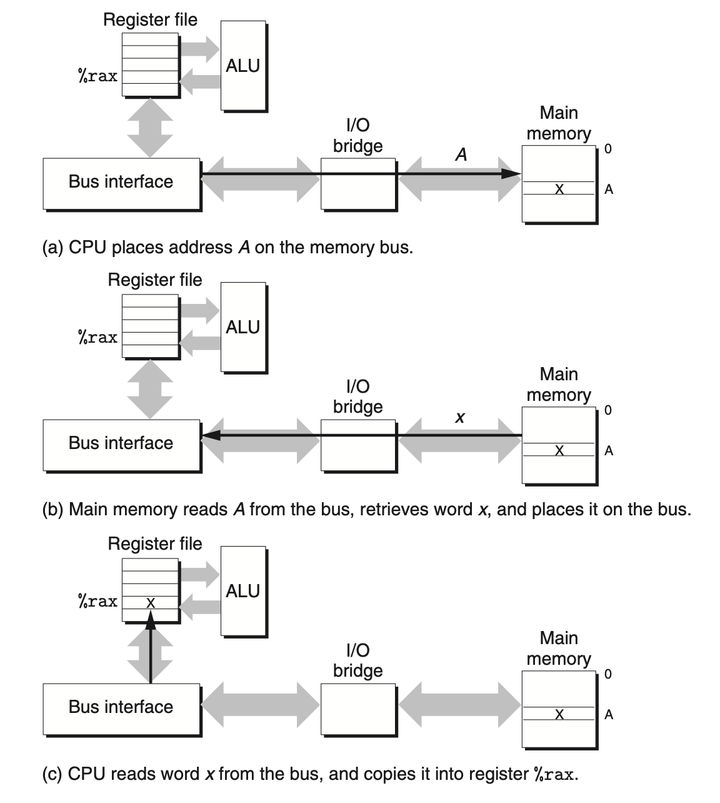

| 图 6.7 加载操作的内存读事务：movq A, %rax。 (a) CPU 将地址 A 放到内存总线上。 (b) 主内存从总线读取 A，取出字 x，并将其放到总线上。 (c) CPU 从总线读取字 x，并将其复制到寄存器 %rax。|
| :-------------------------------: |

其中寄存器 `%rax` 的内容被写入地址 $A$，CPU 发起一个写事务。同样，有三个基本步骤。首先，CPU 将地址放到系统总线上。内存从内存总线读取地址并等待数据到来（图 6.8(a)）。接着，CPU 将 `%rax` 中的数据复制到系统总线上（图 6.8(b)）。最后，主内存从内存总线读取数据并将位存储到 DRAM 中（图 6.8(c)）。

### 6.1.2 磁盘存储

磁盘是主力存储设备，可存储大量数据，量级为数百至数千吉字节，而基于 RAM 的内存仅有数百或数千兆字节。然而，从磁盘读取信息大约需要毫秒级时间，比从 DRAM 读取慢十万倍，比从 SRAM 读取慢一百万倍。

---

<!-- Page 0618 -->

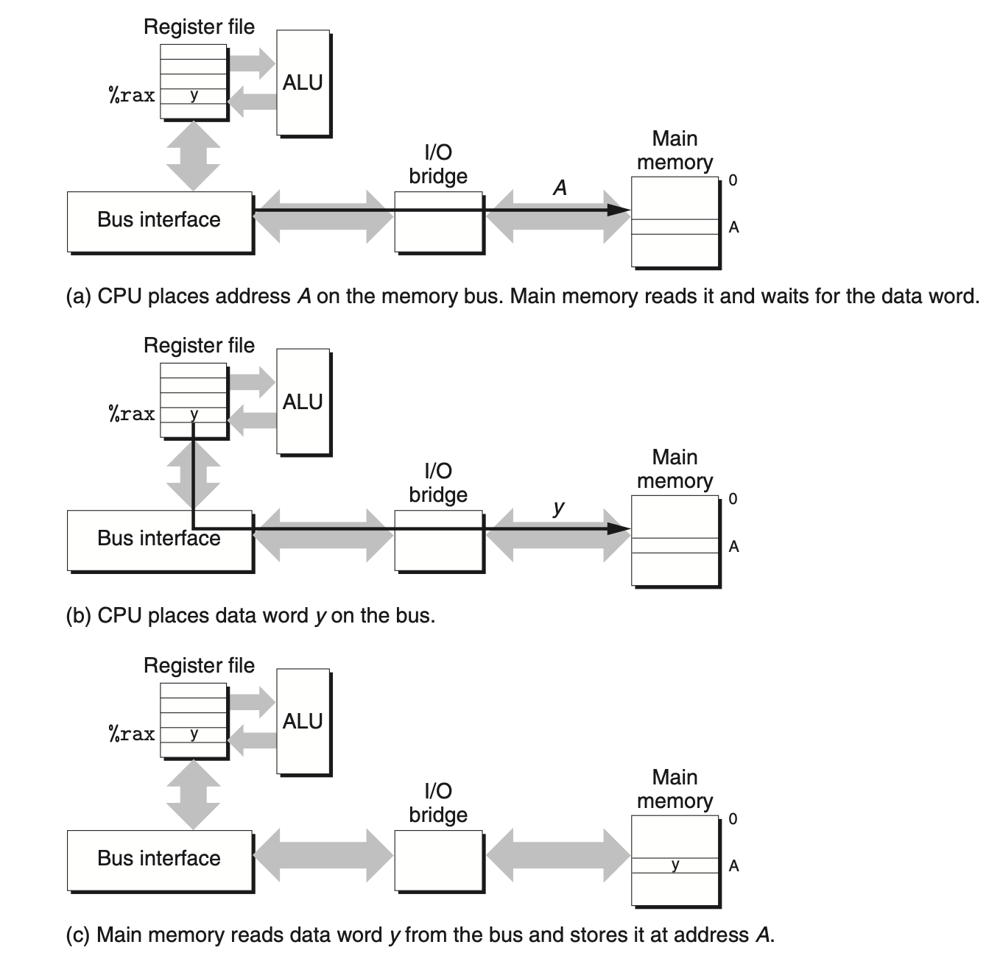

| 图 6.8 存储操作的内存写事务：movq %rax, A。 (a) CPU 将地址 A 放到内存总线上。主内存读取地址并等待数据字。 (b) CPU 将数据字 y 放到总线上。 (c) 主内存从总线读取数据字 y 并将其存储到地址 A。 |
| :-------------------------------: |

**磁盘几何结构**

磁盘由**盘片**（platter）构成。每个盘片有两面，即**表面**（surface），涂有磁性记录材料。盘片中心的旋转主轴以固定转速旋转盘片，通常在每分钟 5,400 到 15,000 转（RPM）之间。磁盘通常包含一个或多个封装在密封容器中的这种盘片。

图 6.9(a) 展示了典型磁盘表面的几何结构。每个表面由一组同心圆环组成，称为**磁道**（track）。每条磁道被划分为一组**扇区**（sector）。每个扇区包含等量的数据位（通常为 512 字节），编码在扇区磁性材料中。扇区之间由**间隙**（gap）分隔，间隙中不存储数据位。间隙存储标识扇区的格式化位。

---

<!-- Page 0619 -->

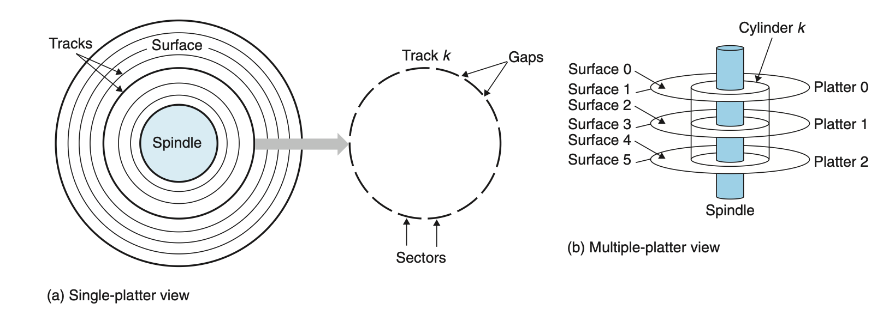

| 图 6.9 磁盘几何结构。 (a) 单盘片视图 (b) 多盘片视图 |
| :-------------------------------: |

如图 6.9(b) 所示，磁盘由一个或多个叠放在一起并封装在密封包装中的盘片组成。整个组件通常称为**磁盘驱动器**（disk drive），不过我们通常将其简称为磁盘。有时我们将磁盘称为**旋转磁盘**（rotating disk），以区别于没有运动部件的基于闪存的固态硬盘（SSD）。

磁盘制造商用**柱面**（cylinder）来描述多盘片驱动器的几何结构，柱面是所有表面上距主轴中心等距的磁道的集合。例如，如果一个驱动器有三个盘片和六个表面，且每个表面上的磁道编号一致，则柱面 $k$ 是第 $k$ 条磁道的六个实例的集合。

**磁盘容量**

磁盘可记录的最大位数称为其**最大容量**，简称**容量**（capacity）。磁盘容量由以下技术因素决定：

- **记录密度**（bits/in）。可以压入磁道 1 英寸段的位数。

- **磁道密度**（tracks/in）。可以压入从盘片中心延伸的半径 1 英寸段的磁道数。

- **面密度**（bits/ $\text{in}^{2}$）。记录密度与磁道密度的乘积。

磁盘制造商不懈地努力提高面密度（以及容量），该值每隔几年就翻一番。最初设计于面密度较低时代的磁盘，将每条磁道划分为相同数量的扇区，该数量由最内层磁道上可记录的扇区数决定。为了保持每条磁道的扇区数固定，外层磁道上的扇区间距更大。这在面密度相对较低时是合理的方法，然而，随着面密度的提高，扇区之间的间隙（不存储数据位的地方）变得不可接受地大。因此，现代大容量磁盘使用一种称为**多区域记录**（multiple zone recording）的技术，其中柱面集合被划分为称为**记录区域**（recording zone）的不相交子集。每个区域由连续的柱面集合组成。每个区域中每个柱面的每条磁道具有相同数量的扇区，该数量由可以压入该区域最内层磁道的扇区数决定。

---

<!-- Page 0620 -->

>**旁注 1G 字节有多大？**
>
>不幸的是，千（K）、兆（M）、吉（G）和太（T）等前缀的含义取决于上下文。对于与 DRAM 和 SRAM 容量相关的度量，通常 $K = 2^{10}$，$M = 2^{20}$，$G = 2^{30}$，$T = 2^{40}$。对于与磁盘和网络等 I/O 设备容量相关的度量，通常 $K = 10^3$，$M = 10^6$，$G = 10^9$，$T = 10^{12}$。速率和吞吐量通常也使用这些前缀值。
>
>幸运的是，对于我们通常依赖的粗略估算，两种假设在实践中都适用。例如，$2^{30}$ 和 $10^9$ 之间的相对差异并不大：$(2^{30}-10^9)/10^9 \approx 7\%$。类似地，$(2^{40}-10^{12})/10^{12} \approx 10\%$。

磁盘容量由以下公式给出：

$$\text{容量} = \frac{\#字节}{\text{扇区}} \times \frac{\text{平均}\#\text{扇区}}{\text{磁道}} \times \frac{\#\text{磁道}}{\text{表面}} \times \frac{\#\text{表面}}{\text{盘片}} \times \frac{\#\text{盘片}}{\text{磁盘}}$$

例如，假设我们有一个磁盘，有 5 个盘片，每个扇区 512 字节，每个表面 20,000 条磁道，平均每条磁道 300 个扇区。则磁盘容量为：

$$\begin{aligned}\text{容量} &= \frac{512\ \text{字节}}{\text{扇区}} \times \frac{300\ \text{扇区}}{\text{磁道}} \times \frac{20{,}000\ \text{磁道}}{\text{表面}} \times \frac{2\ \text{表面}}{\text{盘片}} \times \frac{5\ \text{盘片}}{\text{磁盘}} \\ &= 30{,}720{,}000{,}000\ \text{字节} \\ &= 30.72\ \text{GB}\end{aligned}$$

注意，制造商以吉字节（GB）或太字节（TB）为单位表示磁盘容量，其中 $1\ \text{GB} = 10^9$ 字节，$1\ \text{TB} = 10^{12}$ 字节。

---

**练习题 6.2（答案见第 697 页）** 一个磁盘有 3 个盘片、15,000 个柱面、平均每条磁道 500 个扇区、每个扇区 1,024 字节，其容量是多少？

---

**磁盘操作**

磁盘使用连接到**传动臂**（actuator arm）末端的**读/写头**（read/write head）来读写存储在磁性表面的位，如图 6.10(a) 所示。通过沿径向轴前后移动传动臂，驱动器可以将读/写头定位在表面的任意磁道上。这种机械运动称为**寻道（seek）**。一旦读/写头定位在目标磁道上，当磁道上的每个位依次经过读/写头时，读/写头可以感知位的值（读位）或改变位的值（写位）。有多个盘片的磁盘为每个表面配备一个单独的读/写头，如图 6.10(b) 所示。读/写头垂直对齐并同步移动。在任意时刻，所有读/写头都定位在同一柱面上。

---

<!-- Page 0621 -->

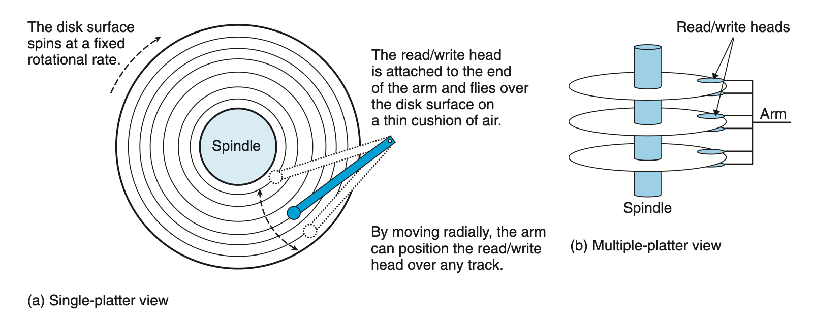

| 图 6.10 磁盘动态特性。 (a) 单盘片视图； (b) 多盘片视图 |
| :-------------------------------: |

传动臂末端的读/写头在磁盘表面上方约 0.1 微米的高度、约 80 千米/时的速度下飞行（字面意义）。这类似于将一栋摩天大楼侧放，在距地面 2.5 厘米（1 英寸）的高度绕地球飞行，且每圈只需 8 秒！在这样的容差下，表面上的一粒微小灰尘就像一块巨大的石头。如果读/写头撞上这样一块"石头"，读/写头就会停止飞行并坠落到表面（即所谓的**磁头碰撞**）。因此，磁盘总是密封在气密包装中。

磁盘以扇区大小为单位读写数据。访问一个扇区的时间有三个主要组成部分：寻道时间、旋转延迟和传输时间：

- **寻道时间**（seek time）。要读取某个目标扇区的内容，传动臂首先将读/写头定位在包含目标扇区的磁道上。移动传动臂所需的时间称为**寻道时间**。寻道时间 $T_{\text{seek}}$ 取决于读/写头之前的位置和传动臂在表面移动的速度。现代驱动器中的平均寻道时间 $T_{\text{avg seek}}$，通过对数千次随机扇区寻道取均值来测量，通常约为 3 到 9 毫秒。单次寻道的最大时间 $T_{\text{max seek}}$ 可高达 20 毫秒。

---

<!-- Page 0622 -->

- **旋转延迟**（rotational latency）：当磁头定位于磁道上方后，驱动器等待目标扇区的第一比特数据经过磁头下方。此步骤的执行效果取决于磁头抵达目标磁道时磁盘表面的位置以及磁盘的转速。在最坏情况下，读/写头刚好错过目标扇区，需要等待磁盘完整旋转一圈。因此，最大旋转延迟（以秒为单位）为：

    $$T_{\text{max rotation}} = \frac{1}{\text{RPM}} \times \frac{60\ \text{秒}}{1\ \text{分钟}}$$

    平均旋转延迟 $T_{\text{avg rotation}}$ 简单地等于 $T_{\text{max rotation}}$ 的一半。

- **传输时间**（transfer time）。当目标扇区的第一位在读/写头下方时，驱动器即可开始读写扇区内容。一个扇区的传输时间取决于转速和每条磁道的扇区数。因此，我们可以粗略估算一个扇区的平均传输时间（以秒为单位）为：

    $$T_{\text{avg transfer}} = \frac{1}{\text{RPM}} \times \frac{1}{\text{（平均每磁道扇区数）}} \times \frac{60\ \text{秒}}{1\ \text{分钟}}$$

我们可以将磁盘扇区的平均访问时间估算为平均寻道时间、平均旋转延迟和平均传输时间之和。例如，考虑一个具有以下参数的磁盘：

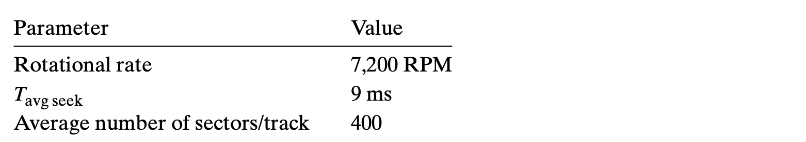

对于这个磁盘，平均旋转延迟（以毫秒为单位）为：

$$\begin{aligned}T_{\text{avg rotation}} &= 1/2 \times T_{\text{max rotation}} \\ &= 1/2 \times (60\ \text{秒}/7{,}200\ \text{RPM}) \times 1{,}000\ \text{毫秒/秒} \\ &\approx 4\ \text{ms}\end{aligned}$$

平均传输时间为：

$$\begin{aligned}T_{\text{avg transfer}} &= 60/7{,}200\ \text{RPM} \times 1/400\ \text{扇区/磁道} \times 1{,}000\ \text{毫秒/秒} \\ &\approx 0.02\ \text{ms}\end{aligned}$$

综合起来，估算的总访问时间为：

$$\begin{aligned}T_{\text{access}} &= T_{\text{avg seek}} + T_{\text{avg rotation}} + T_{\text{avg transfer}} \\ &= 9\ \text{ms} + 4\ \text{ms} + 0.02\ \text{ms} \\ &= 13.02\ \text{ms}\end{aligned}$$

---

<!-- Page 0623 -->

这个例子说明了一些重要的观点：

- 访问磁盘扇区中 512 字节的时间主要由寻道时间和旋转延迟决定。访问扇区中第一个字节需要较长时间，但其余字节实际上是免费的。

- 由于寻道时间和旋转延迟大致相同，寻道时间的两倍是估算磁盘访问时间的简单而合理的规则。

- 存储在 SRAM 中的 64 位字的访问时间约为 4 ns，DRAM 约为 60 ns。因此，从内存读取 512 字节扇区大小块的时间，SRAM 约为 256 ns，DRAM 约为 4,000 ns。磁盘访问时间约为 10 ms，是 SRAM 的约 40,000 倍，是 DRAM 的约 2,500 倍。

---

**练习题 6.3（答案见第 697 页）** 估算访问以下磁盘扇区的平均时间（毫秒）：

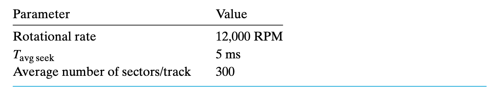

---

**逻辑磁盘块**

如我们所见，现代磁盘具有复杂的几何结构，有多个表面和不同的记录区域。为了对操作系统隐藏这种复杂性，现代磁盘将其几何结构呈现为一个更简单的视图：$B$ 个扇区大小的**逻辑块**（logical block）序列，编号为 $0, 1, \ldots, B-1$。磁盘包装中一个小型硬件/固件设备，称为**磁盘控制器**（disk controller），维护逻辑块编号到实际（物理）磁盘扇区的映射。

当操作系统想要执行 I/O 操作（如将磁盘扇区读入主内存）时，它向磁盘控制器发送命令，要求读取特定的逻辑块编号。控制器上的固件执行快速表查找，将逻辑块编号转换为唯一标识对应物理扇区的三元组 (surface, track, sector)。控制器上的硬件解释这个三元组，将读/写头移动到适当的柱面，等待扇区经过读/写头，将读/写头感知的位收集到控制器上的小型内存缓冲区中，然后将其复制到主内存。

---

**练习题 6.4（答案见第 697 页）** 假设一个由 512 字节逻辑块组成的 1 MB 文件存储在具有以下特性的磁盘驱动器上：

---

<!-- Page 0624 -->

>**旁注 格式化磁盘容量**
>
>在磁盘可以用来存储数据之前，必须由磁盘控制器对其进行格式化。这包括在扇区之间的间隙中填入标识扇区的信息、识别任何有表面缺陷的柱面并将其停用，以及在每个区域中划出一组柱面作为备用，当该区域中的一个或多个柱面在磁盘使用寿命期间出现故障时可以启用。磁盘制造商引用的格式化容量由于这些备用柱面的存在而小于最大容量。

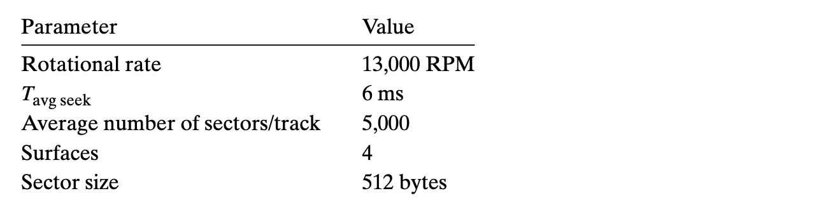

对于下面的每种情况，假设程序顺序读取文件的逻辑块，一个接一个，定位到第一个块的时间为 $T_{\text{avg seek}} + T_{\text{avg rotation}}$。

A. 最佳情况：在逻辑块到磁盘扇区的最优映射（即顺序）下，估算读取文件所需的最优时间（毫秒）。

B. 随机情况：如果块被随机映射到磁盘扇区，估算读取文件所需的时间（毫秒）。

---

**连接 I/O 设备**

显卡、显示器、鼠标、键盘和磁盘等输入/输出（I/O）设备通过 **I/O 总线**连接到 CPU 和主内存。与特定于 CPU 的系统总线和内存总线不同，I/O 总线被设计为独立于底层 CPU。图 6.11 展示了连接 CPU、主内存和 I/O 设备的典型 I/O 总线结构。

虽然 I/O 总线比系统总线和内存总线慢，但它可以容纳各种第三方 I/O 设备。例如，图 6.11 中的总线连接了三种不同类型的设备：

- **通用串行总线（USB）控制器**是连接到 USB 总线的设备的导管，USB 是连接各种外围 I/O 设备（包括键盘、鼠标、调制解调器、数码相机、游戏控制器、打印机、外部磁盘驱动器和固态硬盘）的广泛流行标准。USB 3.0 总线的最大带宽为 625 MB/s，USB 3.1 总线的最大带宽为 1,250 MB/s。

---

<!-- Page 0625 -->

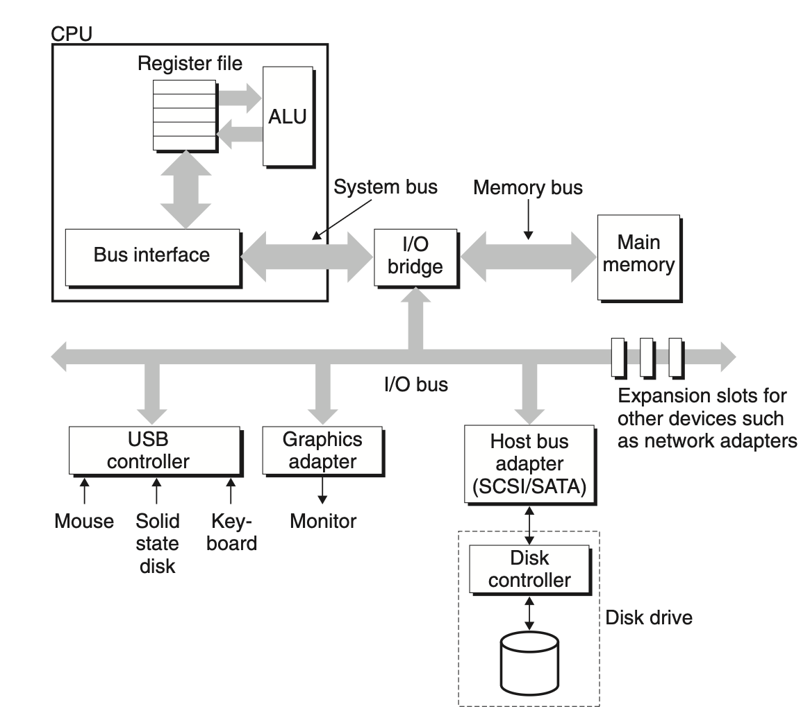

| 图 6.11 连接 CPU、主内存和 I/O 设备的示例总线结构。 |
| :-------------------------------: |

- **显卡**（或适配器）包含负责代表 CPU 在显示器上绘制像素的硬件和软件逻辑。

- **主机总线适配器**，使用特定主机总线接口定义的通信协议将一个或多个磁盘连接到 I/O 总线。磁盘最流行的两种接口是 SCSI（发音为"scuzzy"）和 SATA（发音为"sat-uh"）。SCSI 磁盘通常比 SATA 驱动器更快更贵。SCSI 主机总线适配器（通常称为 SCSI 控制器）可以支持多个磁盘驱动器，而 SATA 适配器只能支持一个驱动器。

通过将适配器插入主板上的空扩展槽（可直接电气连接到总线），可以将网络适配器等附加设备连接到 I/O 总线。

**访问磁盘**

虽然详细描述 I/O 设备如何工作以及如何编程超出了我们的范围，但我们可以给出一个大致的概念。例如，图 6.12 总结了 CPU 从磁盘读取数据时发生的步骤。

---

<!-- Page 0626 -->

>**旁注 I/O 总线设计的进步**
>
>图 6.11 中的 I/O 总线是一个简单的抽象，使我们能够具体说明，而不过于依赖任何特定系统的细节。它基于**外围组件互连**（PCI）总线，该总线在 2010 年前后很流行。在 PCI 模型中，系统中的每个设备共享总线，每次只有一个设备可以访问这些导线。在现代系统中，共享 PCI 总线已被 PCI Express（PCIe）总线取代，PCIe 总线是一组由交换机连接的高速串行点对点链路，类似于你将在第 11 章学习的交换以太网。PCIe 总线的最大吞吐量为 16 GB/s，比最大吞吐量为 533 MB/s 的 PCI 总线快一个数量级。除了可测量的 I/O 性能之外，不同总线设计之间的差异对应用程序不可见，因此我们将在全书中使用简单的共享总线抽象。

CPU 使用一种称为**内存映射 I/O**（memory-mapped I/O）的技术向 I/O 设备发出命令（图 6.12(a)）。在使用内存映射 I/O 的系统中，地址空间中的一块地址被保留用于与 I/O 设备通信。这些地址中的每一个都称为 **I/O 端口**。每个设备在连接到总线时被关联（或映射）到一个或多个端口。

举一个简单的例子，假设磁盘控制器被映射到端口 `0xa0`。那么 CPU 可能通过向地址 `0xa0` 执行三条存储指令来发起磁盘读取：第一条指令发送一个命令字，告诉磁盘发起读取，以及其他参数，如读取完成时是否中断 CPU（我们将在第 8.1 节讨论中断）。第二条指令指示应读取的逻辑块编号。第三条指令指示磁盘扇区内容应存储的主内存地址。

发出请求后，CPU 通常会在磁盘执行读取时进行其他工作。回想一下，一个时钟周期为 1 ns 的 1 GHz 处理器在读取磁盘所需的 16 ms 内可以潜在地执行 1600 万条指令。在传输进行时简单地等待什么都不做将是极大的浪费。

磁盘控制器收到来自 CPU 的读命令后，将逻辑块编号转换为扇区地址，读取扇区内容，并将内容直接传输到主内存，无需 CPU 的任何干预（图 6.12(b)）。设备在没有 CPU 参与的情况下自行执行读或写总线事务的过程称为**直接内存访问**（DMA，Direct Memory Access）。数据的传输称为 **DMA 传输**。

DMA 传输完成且磁盘扇区内容安全存储在主内存中后，磁盘控制器通过向 CPU 发送**中断**信号来通知 CPU（图 6.12(c)）。基本思想是中断信号触发 CPU 芯片上的外部引脚，这导致 CPU 停止当前工作并跳转到操作系统例程。该例程记录 I/O 已完成的事实，然后将控制权返回到 CPU 被中断的位置。

---

<!-- Page 0627 -->

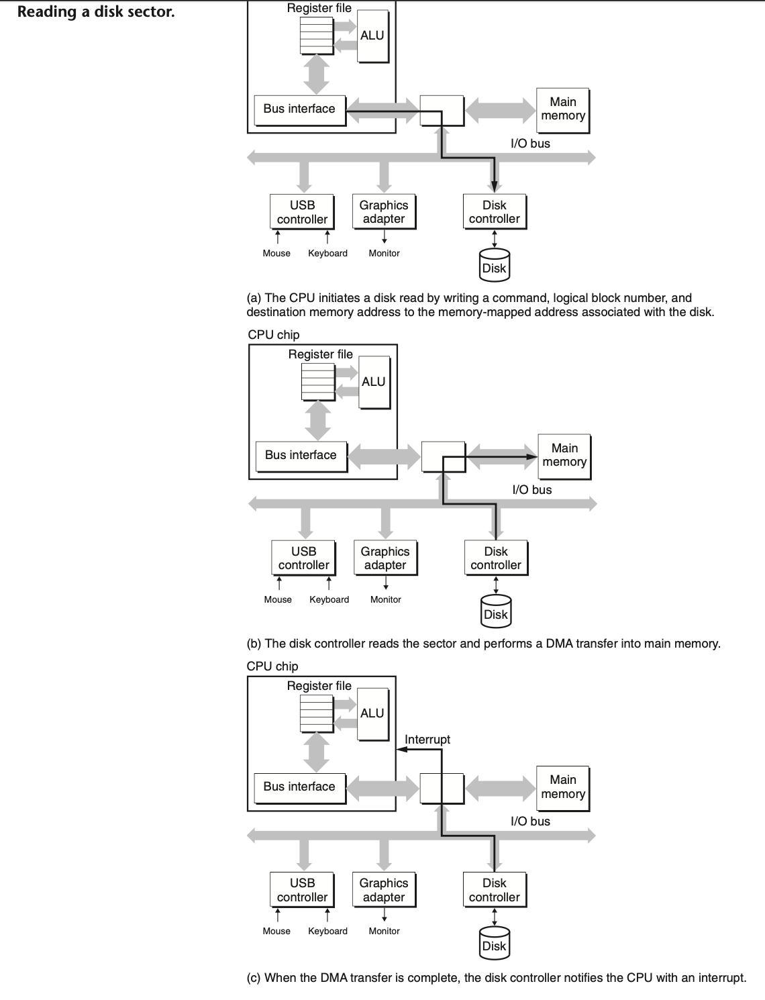

| 图6.12 读取磁盘扇区。 (a) CPU 通过向与磁盘关联的内存映射地址写入命令、逻辑块编号和目标内存地址来发起磁盘读取。 (b) 磁盘控制器读取扇区并执行 DMA 传输到主内存。 (c) 磁盘控制器发送中断信号通知 CPU DMA 传输已完成。 |
| :-------------------------------: |

---

<!-- Page 0628 -->

>**旁注 一款商用磁盘驱动器的特性**
>
>磁盘制造商在其网站上发布了大量有用的高层技术信息。例如，希捷（Seagate）网站包含以下关于其热门产品 Barracuda 7400 的信息（Seagate.com）。
>
>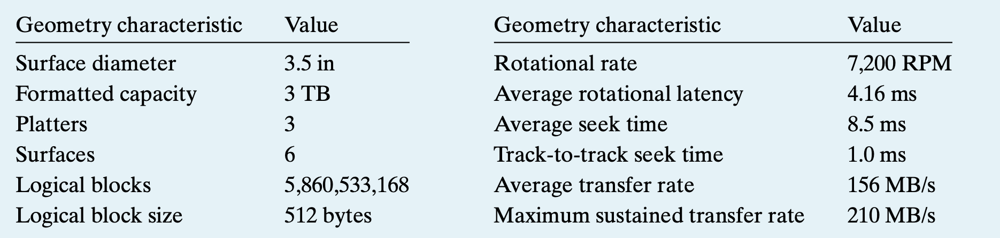

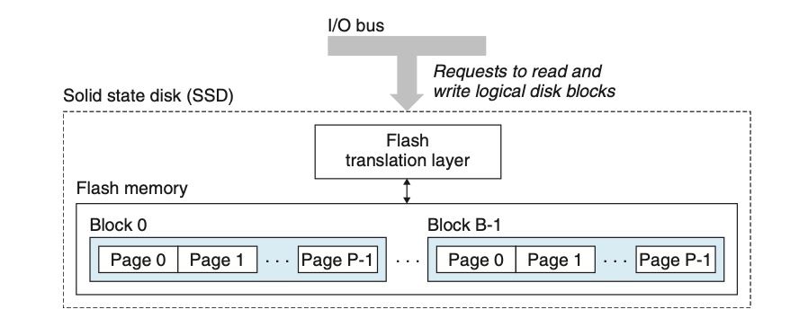

| 图6.13 固态硬盘（SSD）。|
| :-------------------------------: |

### 6.1.3 固态硬盘

固态硬盘（SSD）是一种基于闪存（第 6.1.1 节）的存储技术，在某些情况下是传统旋转磁盘的有吸引力的替代品。图 6.13 展示了基本思路。SSD 包插入 I/O 总线（通常是 USB 或 SATA）上的标准磁盘槽，其行为与任何其他磁盘相同，处理来自 CPU 读写逻辑磁盘块的请求。SSD 包由一个或多个闪存芯片组成，取代了传统旋转磁盘中的机械驱动器，以及一个**闪存转换层**（flash translation layer），这是一种硬件/固件设备，扮演与磁盘控制器相同的角色，将对逻辑块的请求转换为对底层物理设备的访问。

图 6.14 展示了典型 SSD 的性能特性。注意，从 SSD 读取比写入更快。随机读写性能之间的差异由底层闪存的基本特性造成。如图 6.13 所示，闪存由 $B$ 个块的序列组成，每个块由 $P$ 个页面组成。通常，页面大小为 512 字节到 4 KB，一个块由 32 到 128 个页面组成，总块大小范围从 16 KB 到 512 KB 不等。数据以页面为单位读写。一个页面只有在其所属的整个块被擦除后才能写入（通常，这意味着块中所有位被设置为 1）。然而，一旦块被擦除，块中的每个页面可以写入一次而无需进一步擦除。一个块在大约 100,000 次重复写入后会磨损报废，一旦磨损就无法再使用。

---

<!-- Page 0629 -->

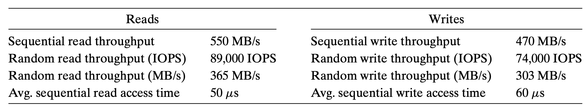

| 图 6.14 商用固态硬盘的性能特性。资料来源：Intel SSD 730 产品规格 [53]。IOPS 为每秒 I/O 操作次数。吞吐量数据基于读写 4 KB 块。 |
| :-------------------------------: |

随机写入较慢有两个原因。首先，擦除一个块需要相对较长的时间，约为 1 毫秒，比访问一个页面的时间长一个数量级以上。其次，如果写操作试图修改包含现有数据的页面 $p$（即不是全 1），那么同一块中包含有用数据的任何页面必须在写入页面 $p$ 之前复制到新的（已擦除的）块。制造商在闪存转换层中开发了复杂的逻辑，试图摊销擦除块的高成本并最小化写入时的内部复制次数，但随机写入性能不太可能达到读取性能。

与旋转磁盘相比，SSD 有许多优势。它们由半导体内存构建，没有运动部件，因此比旋转磁盘具有更快的随机访问时间，耗电更少，更加耐用。然而，也有一些缺点。首先，由于闪存块在重复写入后会磨损，SSD 也有可能磨损。闪存转换层中的**磨损均衡**（wear-leveling）逻辑试图通过将擦除操作均匀分布在所有块上来最大化每个块的使用寿命。在实践中，磨损均衡逻辑非常出色，SSD 磨损需要很多年（见练习题 6.5）。其次，SSD 每字节的价格约为旋转磁盘的 30 倍，因此典型存储容量明显小于旋转磁盘。然而，随着 SSD 越来越普及，SSD 价格正在迅速下降，两者之间的差距正在缩小。

SSD 已经完全取代了便携式音乐设备中的旋转磁盘，在笔记本电脑中作为磁盘替代品也很受欢迎，甚至开始出现在台式机和服务器中。虽然旋转磁盘依然存在，但 SSD 显然是一个重要的替代方案。

---

**练习题 6.5（答案见第 698 页）** 

如我们所见，SSD 的一个潜在缺点是底层闪存可能磨损。例如，对于图 6.14 中的 SSD，Intel 保证在驱动器磨损之前大约可以写入 128 petabytes（$128 \times 10^{15}$ 字节）的数据。基于这个假设，估算该 SSD 在以下工作负载下的使用寿命（年）：

---

<!-- Page 0630 -->

A. 顺序写入的最坏情况：SSD 以 470 MB/s 的速率持续写入（设备的平均顺序写入吞吐量）。

B. 随机写入的最坏情况：SSD 以 303 MB/s 的速率持续写入（设备的平均随机写入吞吐量）。

C. 平均情况：SSD 以每天 20 GB 的速率写入（某些计算机制造商在其移动计算机工作负载仿真中假设的平均每日写入速率）。

### 6.1.4 存储技术趋势

从我们对存储技术的讨论中，有几个重要的概念值得关注。

**不同的存储技术具有不同的价格和性能权衡。** SRAM 比 DRAM 稍快，DRAM 比磁盘快得多。另一方面，快速存储总是比慢速存储更昂贵。SRAM 每字节的成本高于 DRAM，DRAM 的成本远高于磁盘。SSD 的价格和性能介于 DRAM 和旋转磁盘之间。

**不同存储技术的价格和性能属性正在以截然不同的速率变化。** 图 6.15 总结了自 1985 年（第一批 PC 推出后不久）以来存储技术的价格和性能属性。这些数字来自行业杂志的历史期刊和网络。尽管这些数据来自非正式调查，但其中揭示了一些有趣的趋势。

自 1985 年以来，SRAM 技术的成本和性能以大致相同的速率提升。访问时间和每兆字节成本均下降了约 100 倍（图 6.15(a)）。然而，DRAM 和磁盘的趋势则更加显著和分化。DRAM 每兆字节的成本下降了 44,000 倍（超过四个数量级！），而 DRAM 访问时间仅下降了 10 倍（图 6.15(b)）。磁盘技术遵循了与 DRAM 相同的趋势，且更加显著。自 1980 年以来，磁盘存储每兆字节的成本已暴跌了超过 3,000,000 倍（超过六个数量级！），而访问时间的改善却慢得多，仅提升了 25 倍（图 6.15(c)）。这些惊人的长期趋势突出了存储和磁盘技术的一个基本事实：提高密度（从而降低成本）比降低访问时间容易得多。

**DRAM 和磁盘性能落后于 CPU 性能。** 如图 6.15(d) 所示，1985 年至 2010 年间 CPU 时钟周期时间提升了 500 倍。如果我们看**有效周期时间**——我们将其定义为单个 CPU（处理器）的周期时间除以其处理器核心数——那么 1985 年至 2010 年间的提升幅度更大，达到 2,000 倍。

---

<!-- Page 0631 -->

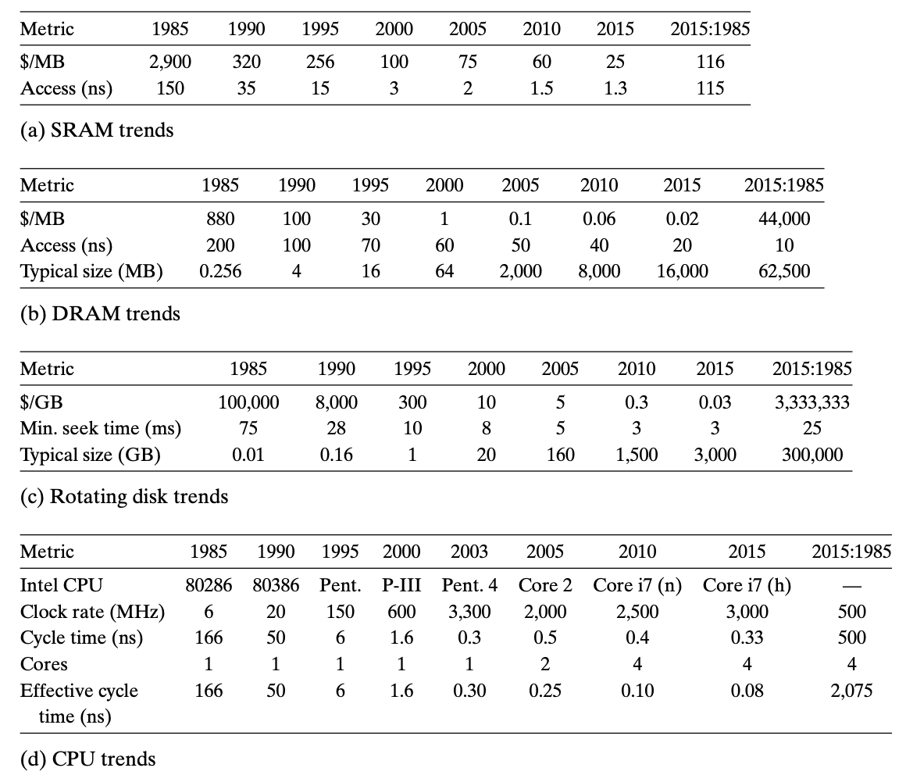

| 图 6.15 存储和处理技术趋势。2010 年前后的 Core i7 使用 Nehalem 工艺核心；2015 年前后的 Core i7 使用 Haswell 核心。 (a) SRAM 趋势 (b) DRAM 趋势 (c) 旋转磁盘趋势 (d) CPU 趋势 |
| :-------------------------------: |

CPU 性能曲线在 2003 年前后的分叉反映了多核处理器的引入（见第 641 页的旁注）。在此分叉之后，单个核心的时钟周期时间实际上先略有增加，然后才再次开始下降，但下降速率比以前慢。

注意，SRAM 性能虽然落后，但大体上跟得上。然而，DRAM 和磁盘性能与 CPU 性能之间的差距实际上在不断扩大。直到 2003 年前后多核处理器问世之前，这一性能差距主要是延迟的函数，DRAM 和磁盘访问时间的降低速度慢于单个处理器的周期时间。然而，随着多核技术的引入，这种性能差距日益成为吞吐量的函数——多个处理器核心可并行向 DRAM 和磁盘发出请求。

---

<!-- Page 0632 -->

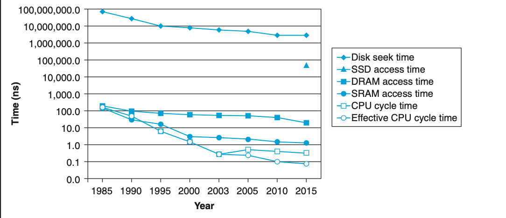

| 图 6.16 磁盘、DRAM 和 CPU 速度之间的差距。 |
| :-------------------------------: |

各种趋势在图 6.16 中得到了清晰展示，该图以半对数坐标绘制了图 6.15 中的访问时间和周期时间。

正如我们将在第 6.4 节中看到的，现代计算机大量使用基于 SRAM 的高速缓存来试图弥合处理器-内存差距。这种方法之所以有效，是因为应用程序的一个基本属性——局部性，我们接下来将讨论这个话题。

---

**练习题 6.6（答案见第 698 页）** 

使用图 6.15(c) 中 2005 年至 2015 年的数据，估算何时能以 200 美元购买 1 petabyte（$10^{15}$ 字节）的旋转磁盘存储。假设使用实际美元（不考虑通货膨胀）。

---

## 6.2 局部性

编写良好的计算机程序往往表现出良好的局部性。也就是说，它们倾向于引用最近引用过的数据项附近的数据项，或者是最近被引用过的数据项本身。这种倾向称为**局部性原理**（principle of locality），是一个持久性概念，对硬件和软件系统的设计和性能有着巨大影响。

局部性通常被描述为具有两种不同形式：**时间局部性**（temporal locality）和**空间局部性**（spatial locality）。在具有良好空间局部性的程序中，如果某个内存位置被引用一次，那么该程序很可能在近期内引用其附近的内存位置。

---

<!-- Page 0633 -->

>**旁注 时钟周期停滞的时代：多核处理器的诞生**
>
>计算机的历史以一些深刻改变产业和世界的重大事件为标志。有趣的是，这些转折点往往大约每十年发生一次：20 世纪 50 年代 Fortran 的开发、60 年代初 IBM 360 的推出、70 年代初互联网（当时称为 ARPANET）的兴起、80 年代初 IBM PC 的推出，以及 90 年代初万维网的创建。
>
>最近的这类事件发生在 21 世纪初，当时计算机制造商正面临所谓的"功耗墙"，发现他们无法再像以前那样快速提高 CPU 时钟频率，因为芯片会消耗太多电能。解决方案是通过用多个较小的处理器核心替换单个大处理器来提高性能，每个核心都是能够独立并行执行程序的完整处理器。这种多核方法之所以有效，部分是因为处理器消耗的功率与 $P = fCV^2$ 成正比，其中 $f$ 是时钟频率，$C$ 是电容，$V$ 是电压。电容 $C$ 大致与面积成正比，因此只要核心的总面积保持不变，多个核心消耗的功率就可以保持不变。只要特征尺寸继续以指数摩尔定律速率缩小，每个处理器中的核心数量（以及其有效性能）就会持续增加。
>
>从这一点开始，计算机性能的提升不再依赖时钟频率的提高，而是依赖每个处理器中核心数量的增加，以及体系结构创新对运行在这些核心上的程序效率的提升。我们可以在图 6.16 中清楚地看到这一趋势。CPU 时钟周期时间在 2003 年达到最低点，然后实际上开始上升，然后趋于平稳，并以比以前更慢的速率再次开始下降。然而，由于多核处理器的出现（2004 年的双核和 2007 年的四核），有效周期时间继续以接近以前速率下降。

程序员应该理解局部性原理，因为一般来说，具有良好局部性的程序比局部性差的程序运行更快。现代计算机系统的各个层次，从硬件到操作系统再到应用程序，都被设计为利用局部性。在硬件层面，局部性原理使计算机设计者能够通过引入称为**高速缓存存储器**（cache memory）的小型快速存储器来加速主内存访问，这些存储器保存最近引用的指令和数据项的块。在操作系统层面，局部性原理允许系统将主内存用作虚拟地址空间中最近引用数据块的高速缓存。类似地，操作系统使用主内存来缓存磁盘文件系统中最近使用的磁盘块。局部性原理在应用程序设计中也起着关键作用。例如，Web 浏览器利用时间局部性，将最近引用的文档缓存在本地磁盘上。高流量 Web 服务器将最近请求的文档保存在前端磁盘高速缓存中，无需服务器的任何干预就能满足对这些文档的请求。

---

<!-- Page 0634 -->

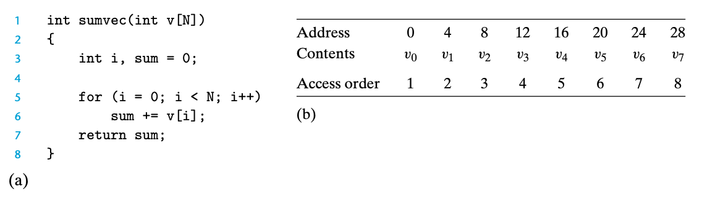

| 图 6.17 (a) 一个局部性良好的函数。(b) 向量 v 的引用模式（N = 8）。注意向量元素的访问顺序与其在内存中存储的顺序相同。 |
| :-------------------------------: |

### 6.2.1 对程序数据引用的局部性

考虑图 6.17(a) 中对向量元素求和的简单函数。这个函数局部性好吗？要回答这个问题，我们查看每个变量的引用模式。在这个例子中，`sum` 变量在每次循环迭代中被引用一次，因此关于 `sum` 具有良好的时间局部性。另一方面，由于 `sum` 是一个标量，关于 `sum` 没有空间局部性。

如图 6.17(b) 所示，向量 `v` 的元素按照它们在内存中存储的顺序顺序读取，一个接一个（为方便起见，我们假设数组从地址 0 开始）。因此，关于变量 `v`，函数具有良好的空间局部性，但时间局部性差，因为每个向量元素只被访问一次。由于函数对循环体中的每个变量具有良好的空间或时间局部性，我们可以得出结论：`sumvec` 函数具有良好的局部性。

像 `sumvec` 这样顺序访问向量每个元素的函数被称为具有**步幅-1 引用模式**（stride-1 reference pattern）（相对于元素大小）。有时我们将步幅-1 引用模式称为**顺序引用模式**。访问连续向量每第 $k$ 个元素称为**步幅-k 引用模式**。步幅-1 引用模式是程序中空间局部性的常见和重要来源。一般来说，随着步幅增大，空间局部性减小。

步幅对于引用多维数组的程序也是一个重要问题。例如，考虑图 6.18(a) 中对二维数组元素求和的 `sumarrayrows` 函数。

双重嵌套循环以**行主序**（row-major order）读取数组元素，即内层循环读取第一行的元素，然后是第二行，以此类推。`sumarrayrows` 函数具有良好的空间局部性，因为它以数组存储的相同行主序引用数组（图 6.18(b)）。结果是一个具有优秀空间局部性的步幅-1 引用模式。

---

<!-- Page 0635 -->

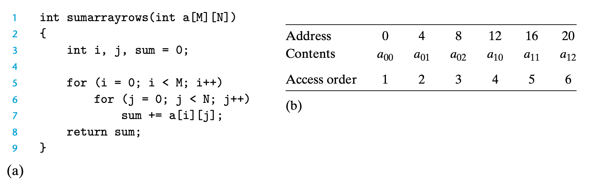

| 图 6.18 (a) 另一个局部性良好的函数。(b) 数组 a 的引用模式（M = 2，N = 3）。由于数组按其在内存中存储的行主序访问，具有良好的空间局部性。 |
| :-------------------------------: |

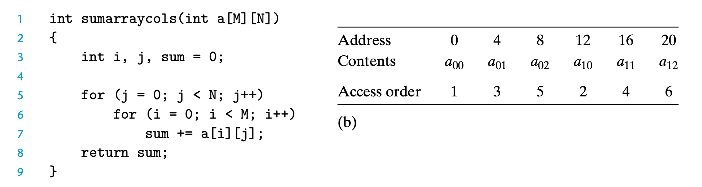

| 图 6.19 (a) 一个空间局部性差的函数。(b) 数组 a 的引用模式（M = 2，N = 3）。该函数空间局部性差，因为它以步幅-N 引用模式扫描内存。 |
| :-------------------------------: |

看似微不足道的程序改变会对其局部性产生重大影响。例如，图 6.19(a) 中的 `sumarraycols` 函数与图 6.18(a) 中的 `sumarrayrows` 函数计算相同的结果。唯一的区别是我们交换了 `i` 和 `j` 循环。交换循环会对其局部性产生什么影响？

`sumarraycols` 函数空间局部性差，因为它按列而非按行扫描数组。由于 C 数组在内存中按行存储，结果是一个步幅-N 引用模式，如图 6.19(b) 所示。

### 6.2.2 取指的局部性

由于程序指令存储在内存中且必须由 CPU 取出（读取），我们也可以评估程序关于其指令取出的局部性。例如，在图 6.17 中，for 循环体中的指令按顺序内存顺序执行，因此该循环具有良好的空间局部性。由于循环体被多次执行，它也具有良好的时间局部性。

---

<!-- Page 0636 -->

代码区别于程序数据的一个重要属性是代码在运行时很少被修改。当程序执行时，CPU 从内存读取其指令。CPU 很少覆盖或修改这些指令。

### 6.2.3 局部性小结

在本节中，我们介绍了局部性的基本概念，并确定了一些定性评估程序局部性的简单规则：

- 反复引用相同变量的程序具有良好的时间局部性。

- 对于具有步幅-k 引用模式的程序，步幅越小，空间局部性越好。具有步幅-1 引用模式的程序具有良好的空间局部性。以大步幅在内存中跳跃的程序空间局部性差。

- 循环关于指令取出具有良好的时间和空间局部性。循环体越小、循环迭代次数越多，局部性越好。

在本章后面，当我们了解了高速缓存存储器及其工作原理后，我们将向你展示如何用高速缓存命中和缺失来量化局部性的概念。你还将清楚地理解为什么具有良好局部性的程序通常比局部性差的程序运行更快。尽管如此，知道如何快速浏览源代码并对程序的局部性有一个高层次的感觉，是程序员需要掌握的一项有用而重要的技能。

---

**练习题 6.7（答案见第 698 页）** 

重新排列以下函数中的循环，使其以步幅-1 引用模式扫描三维数组 a。

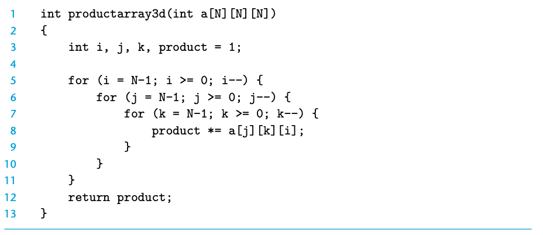

---

<!-- Page 0637 -->

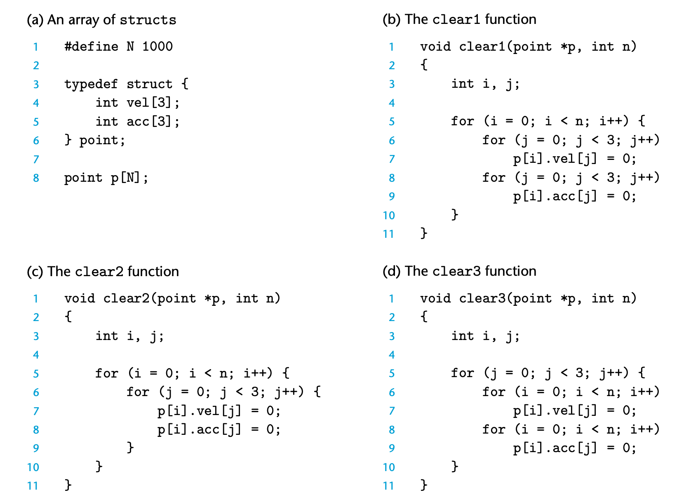

| 图 6.20 练习题 6.8 的代码示例。 |
| :-------------------------------: |

---

**练习题 6.8（答案见第 699 页）** 

图 6.20 中的三个函数执行相同的操作，但空间局部性程度不同。按空间局部性对这些函数进行排名，并解释你得出排名的理由。

---

## 6.3 存储器层次结构

第 6.1 节和第 6.2 节描述了存储技术和计算机软件的一些基本而持久的属性：

- **存储技术**：不同的存储技术具有差异很大的访问时间。更快的技术每字节成本高于更慢的技术，且容量更小。CPU 与主内存速度之间的差距正在扩大。

- **计算机软件**：编写良好的程序倾向于表现出良好的局部性。

---

<!-- Page 0638 -->

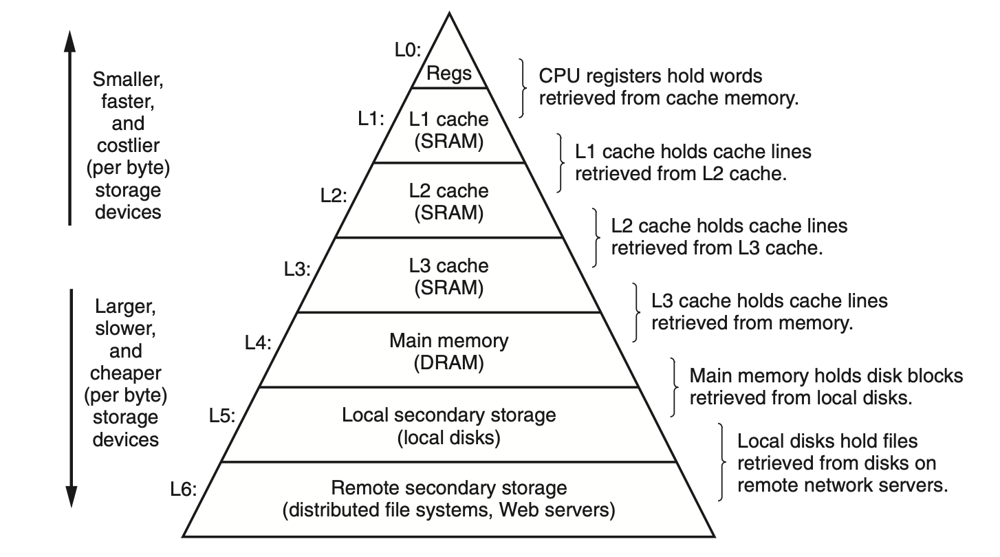

| 图 6.21 存储器层次结构。 |
| :-------------------------------: |

在计算机领域最令人愉快的巧合之一是，硬件和软件的这些基本属性完美地相互补充。它们的互补性质提示了一种组织内存系统的方法，称为**存储器层次结构**（memory hierarchy），被所有现代计算机系统采用。图 6.21 展示了典型的存储器层次结构。

一般来说，从较高层移到较低层时，存储设备变得更慢、更便宜、容量更大。在最高层（L0）是少量快速 CPU 寄存器，CPU 可以在单个时钟周期内访问。接下来是一个或多个中小型基于 SRAM 的高速缓存存储器，可以在几个 CPU 时钟周期内访问。之后是可以在数十到数百个时钟周期内访问的大型基于 DRAM 的主内存。接下来是慢速但容量巨大的本地磁盘。最后，一些系统甚至包括可以通过网络访问的远程服务器上的额外磁盘层。例如，分布式文件系统（如 Andrew 文件系统（AFS）或网络文件系统（NFS））允许程序访问存储在远程网络连接服务器上的文件。类似地，万维网允许程序访问存储在世界任何地方的 Web 服务器上的远程文件。

### 6.3.1 存储器层次结构中的缓存

一般来说，**高速缓存**（cache，发音为"cash"）是一个小型、快速的存储设备，充当存储在较大、较慢设备中数据对象的暂存区。使用高速缓存的过程称为**缓存**（caching，发音为"cashing"）。

存储层次结构的核心思想在于：对于每个 $k$ 层，速度更快、体积更小的存储设备作为缓存，为 $k+1$ 层中更大、更慢的存储设备提供支持。换言之，层次结构中的每一层都缓存来自下一个较低层的数据对象。例如，本地磁盘充当通过网络从远程磁盘检索的文件（如 Web 页面）的高速缓存，主内存充当本地磁盘上数据的高速缓存，以此类推，直到我们达到最小的高速缓存——CPU 寄存器集。

---

<!-- Page 0639 -->

>**旁注 其他存储器层次结构**
>
>我们展示了一个存储器层次结构的例子，但其他组合也是可能的，甚至很常见。例如，包括 Google 数据中心在内的许多站点将本地磁盘备份到存档磁带上。在某些站点，人工操作员根据需要手动将磁带安装到磁带驱动器上；在其他站点，磁带机器人自动处理这项任务。无论哪种情况，磁带集合代表了存储器层次结构中的一个层次，位于本地磁盘层之下，相同的一般原则同样适用。磁带每字节比磁盘更便宜，这允许站点存档本地磁盘的多个快照。代价是磁带的访问时间比磁盘更长。另一个例子是，固态硬盘在存储器层次结构中发挥着越来越重要的作用，弥合了 DRAM 和旋转磁盘之间的鸿沟。

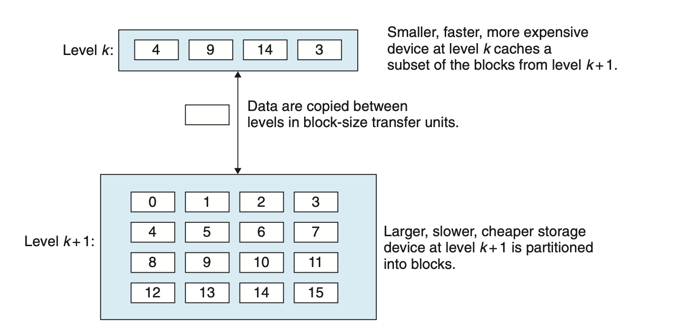

| 图 6.22 存储器层次结构中缓存的基本原理。 |
| :-------------------------------: |

图 6.22 展示了存储器层次结构中缓存的一般概念。层次 $k+1$ 处的存储被划分为称为**块**（block）的连续数据对象块。每个块都有唯一的地址或名称，将其与其他块区分开来。块可以是固定大小（通常情况）或可变大小（例如，存储在 Web 服务器上的远程 HTML 文件）。例如，图 6.22 中层次 $k+1$ 的存储被划分为 16 个固定大小的块，编号为 0 到 15。

类似地，层次 $k$ 的存储被划分为一组更小的块，其大小与层次 $k+1$ 的块相同。在任意时刻，层次 $k$ 的高速缓存包含来自层次 $k+1$ 的块子集的副本。例如，在图 6.22 中，层次 $k$ 的高速缓存可以容纳四个块，目前包含块 4、9、14 和 3 的副本。

---

<!-- Page 0640 -->

数据总是以块大小为传输单位在层次 $k$ 和层次 $k+1$ 之间来回复制。重要的是要认识到，虽然在层次结构中任何特定相邻层次对之间的块大小是固定的，但其他层次对可以有不同的块大小。例如，在图 6.21 中，L1 和 L0 之间的传输通常使用字大小的块。L2 和 L1 之间（以及 L3 和 L2、L4 和 L3 之间）的传输通常使用数十字节的块。L5 和 L4 之间的传输使用数百或数千字节的块。一般来说，层次结构中较低的设备（离 CPU 较远）访问时间较长，因此倾向于使用较大的块大小以摊销这些较长的访问时间。

**高速缓存命中**

当程序需要来自层次 $k+1$ 的特定数据对象 $d$ 时，它首先在当前存储在层次 $k$ 的某个块中查找 $d$。如果 $d$ 恰好在层次 $k$ 被缓存，那么我们就得到了所谓的**高速缓存命中**（cache hit）。程序直接从层次 $k$ 读取 $d$，根据存储器层次结构的性质，这比从层次 $k+1$ 读取 $d$ 更快。例如，具有良好时间局部性的程序可能从块 14 读取数据对象，导致层次 $k$ 的高速缓存命中。

**高速缓存缺失**

另一方面，如果数据对象 $d$ 没有在层次 $k$ 被缓存，那么我们就得到了所谓的**高速缓存缺失**（cache miss）。当发生缺失时，层次 $k$ 的高速缓存从层次 $k+1$ 的高速缓存中取出包含 $d$ 的块，如果层次 $k$ 的高速缓存已满，则可能覆盖现有块。

覆盖现有块的过程称为**替换**（replacing）或**驱逐**（evicting）该块。被驱逐的块有时称为**牺牲块**（victim block）。关于替换哪个块的决定由高速缓存的**替换策略**（replacement policy）决定。例如，具有随机替换策略的高速缓存会随机选择一个牺牲块。具有**最近最少使用（LRU）替换策略**的高速缓存会选择在最遥远的过去最后被访问的块。

层次 $k$ 的高速缓存从层次 $k+1$ 取出块后，程序可以像以前一样从层次 $k$ 读取 $d$。例如，在图 6.22 中，从层次 $k$ 高速缓存中的块 12 读取数据对象将导致高速缓存缺失，因为块 12 目前不在层次 $k$ 的高速缓存中。一旦它从层次 $k+1$ 复制到层次 $k$，块 12 将留在那里以期待后续访问。

**高速缓存缺失的类型**

有时区分不同类型的高速缓存缺失是有帮助的。如果层次 $k$ 的高速缓存为空，那么任何数据对象的访问都将缺失。空的高速缓存有时称为**冷高速缓存**（cold cache），这类缺失称为**强制性缺失**（compulsory miss）或**冷缺失**（cold miss）。冷缺失很重要，因为它们通常是瞬态事件，在高速缓存被反复内存访问预热后，在稳定状态下可能不会发生。

---

<!-- Page 0641 -->

无论何时发生缺失，层次 $k$ 的高速缓存必须实现某种**放置策略**（placement policy），确定从层次 $k+1$ 取得的块放置在何处。最灵活的放置策略是允许来自层次 $k+1$ 的任何块存储在层次 $k$ 的任何块中。对于位于存储器层次结构高处（靠近 CPU）并以硬件实现且速度至关重要的高速缓存，这种策略通常太昂贵，因为随机放置的块定位成本很高。

因此，硬件高速缓存通常实现更简单的放置策略，将层次 $k+1$ 的特定块限制在层次 $k$ 的一小部分（有时是单个）块中。例如，在图 6.22 中，我们可能决定层次 $k+1$ 的块 $i$ 必须放置在层次 $k$ 的块 $(i \bmod 4)$ 中。例如，层次 $k+1$ 的块 0、4、8 和 12 将映射到层次 $k$ 的块 0；块 1、5、9 和 13 将映射到块 1；以此类推。注意，图 6.22 中的示例高速缓存就使用了这种策略。

这类限制性放置策略会导致一种称为**冲突缺失**（conflict miss）的缺失类型，在这种情况下，高速缓存足够大以保存被引用的数据对象，但由于它们映射到同一个高速缓存块，高速缓存不断缺失。例如，在图 6.22 中，如果程序依次请求块 0、块 8、块 0、块 8，等等，那么对这两个块的每次引用都会在层次 $k$ 的高速缓存中缺失，即使该高速缓存总共可以容纳四个块。

程序通常以一系列**阶段**（phase）（例如，循环）运行，其中每个阶段访问某个相当固定的高速缓存块集合。例如，嵌套循环可能反复访问同一数组的元素。这组块称为该阶段的**工作集**（working set）。当工作集的大小超过高速缓存的大小时，高速缓存将经历所谓的**容量缺失**（capacity miss）。换言之，高速缓存太小，无法处理这个特定的工作集。

**高速缓存管理**

如我们所指出的，存储器层次结构的本质是每个层次的存储设备都是下一个较低层次的高速缓存。在每个层次，某种形式的逻辑必须管理高速缓存。我们的意思是，某些东西必须将高速缓存存储划分为块，在不同层次之间传输块，决定何时发生命中和缺失，然后处理它们。管理高速缓存的逻辑可以是硬件、软件或两者的组合。

例如，编译器管理寄存器文件，这是高速缓存层次结构的最高层。它决定何时在发生缺失时发出加载指令，并确定将数据存储在哪个寄存器中。L1、L2 和 L3 高速缓存完全由内置在高速缓存中的硬件逻辑管理。在具有虚拟内存的系统中，DRAM 主内存充当存储在磁盘上的数据块的高速缓存，由操作系统软件和 CPU 上的地址转换硬件的组合管理。对于具有分布式文件系统（如 AFS）的机器，本地磁盘充当由在本地机器上运行的 AFS 客户端进程管理的高速缓存。在大多数情况下，高速缓存自动运行，不需要程序的任何特定或明确的操作。

---

<!-- Page 0642 -->

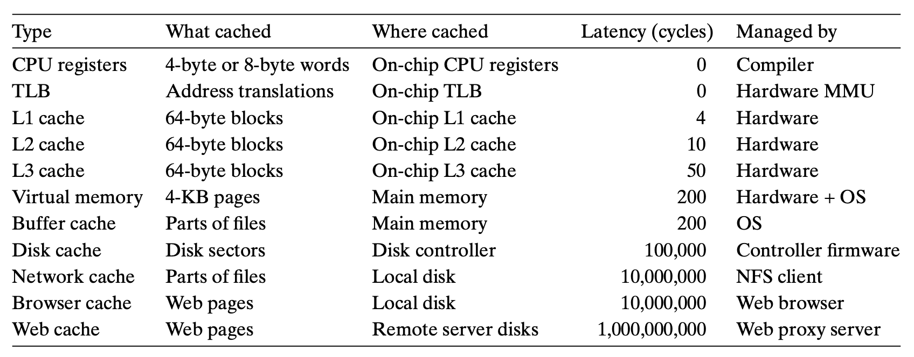

| 图 6.23 现代计算机系统中缓存的普遍性。缩写：TLB：转换后备缓冲区；MMU：内存管理单元；OS：操作系统；NFS：网络文件系统。 |
| :-------------------------------: |

### 6.3.2 存储器层次结构概念小结

总结一下，基于缓存的存储器层次结构之所以有效，是因为较慢的存储比较快的存储更便宜，并且程序倾向于表现出局部性：

- **利用时间局部性**。由于时间局部性，相同的数据对象可能被多次重用。一旦数据对象在第一次缺失时被复制到高速缓存，我们可以预期该对象会有许多后续命中。由于高速缓存比下一个较低层的存储更快，这些后续命中可以比原始缺失快得多地得到服务。

- **利用空间局部性**。块通常包含多个数据对象。由于空间局部性，我们可以预期，缺失后复制块的成本将被对该块内其他对象的后续引用所摊销。

现代系统中到处都在使用高速缓存。如图 6.23 所示，高速缓存用于 CPU 芯片、操作系统、分布式文件系统以及万维网。它们由硬件和软件的各种组合构建和管理。注意，图 6.23 中有一些我们尚未介绍的术语和缩写，我们在这里列出它们是为了说明高速缓存的普遍性。

## 6.4 高速缓存存储器

早期计算机系统的存储器层次结构仅由三个层次组成：CPU 寄存器、主内存和磁盘存储。然而，由于 CPU 和主内存之间差距的不断扩大，系统设计者不得不插入一个小型 SRAM 高速缓存存储器，称为 **L1 高速缓存（一级高速缓存）**，位于 CPU 寄存器文件和主内存之间，如图 6.24 所示。L1 高速缓存的访问速度几乎与寄存器一样快，通常约为 4 个时钟周期。

---

<!-- Page 0643 -->

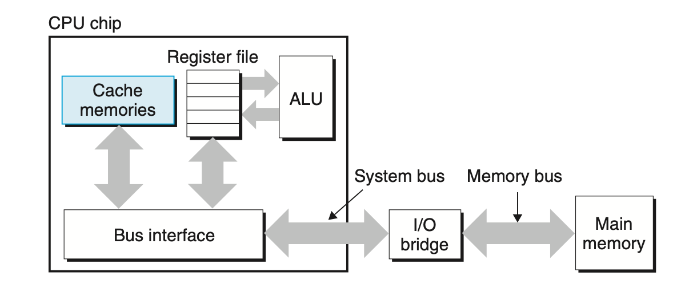

| 图 6.24 高速缓存存储器的典型总线结构。 |
| :-------------------------------: |

随着 CPU 和主内存之间性能差距的持续扩大，系统设计者通过在 L1 高速缓存和主内存之间插入一个额外的更大高速缓存（称为 **L2 高速缓存**）来应对，L2 高速缓存可以在约 10 个时钟周期内访问。许多现代系统还包括一个更大的高速缓存，称为 **L3 高速缓存**，位于存储器层次结构中 L2 高速缓存和主内存之间，可以在约 50 个周期内访问。虽然这些安排有相当多的变化，但总体原则是相同的。在下一节的讨论中，我们将假设一个简单的存储器层次结构，CPU 和主内存之间只有一个 L1 高速缓存。

### 6.4.1 通用高速缓存存储器组织

考虑一个计算机系统，其中每个内存地址有 $m$ 位，构成 $M = 2^m$ 个唯一地址。如图 6.25(a) 所示，这类机器的高速缓存被组织为 $S = 2^s$ 个**高速缓存组**（cache set）的数组。每个组由 $E$ 条**高速缓存行**（cache line）组成。每行由一个 $B = 2^b$ 字节的数据块、一个表示该行是否包含有效信息的**有效位**（valid bit），以及 $t = m - (b + s)$ 个**标记位（tag bit）**（当前块内存地址的位子集，唯一标识存储在高速缓存行中的块）组成。

一般来说，高速缓存的组织可以用元组 $(S, E, B, m)$ 描述。高速缓存的大小（或容量）$C$ 以所有块的总大小表示，不包括标记位和有效位。因此，$C = S \times E \times B$。

当 CPU 被加载指令指示从主内存地址 $A$ 读取一个字时，它将地址 $A$ 发送给高速缓存。如果高速缓存保存着地址 $A$ 处字的副本，它立即将该字发回给 CPU。那么高速缓存如何知道它是否包含地址 $A$ 处字的副本呢？高速缓存的组织方式使它可以通过简单地检查地址的位来找到请求的字，类似于使用极其简单哈希函数的哈希表。其工作原理如下：

参数 $S$ 和 $B$ 将 $m$ 个地址位划分为图 6.25(b) 所示的三个字段。$A$ 中的 $s$ 个**组索引位**（set index bit）形成一个索引指向组数组。第一个组是组 0，第二个组是组 1，依此类推。当解释为无符号整数时，组索引位告诉我们该字必须存储在哪个组中。一旦我们知道该字必须包含在哪个组中，$A$ 中的标记位告诉我们组中的哪一行（如果有的话）包含该字。当且仅当有效位被设置且行中的标记位与地址 $A$ 中的标记位匹配时，该组中的一行包含该字。一旦我们找到了由组索引标识的组中由标记标识的行，$b$ 个**块偏移位**（block offset bit）给出字在 $B$ 字节数据块中的偏移量。

---

<!-- Page 0644 -->

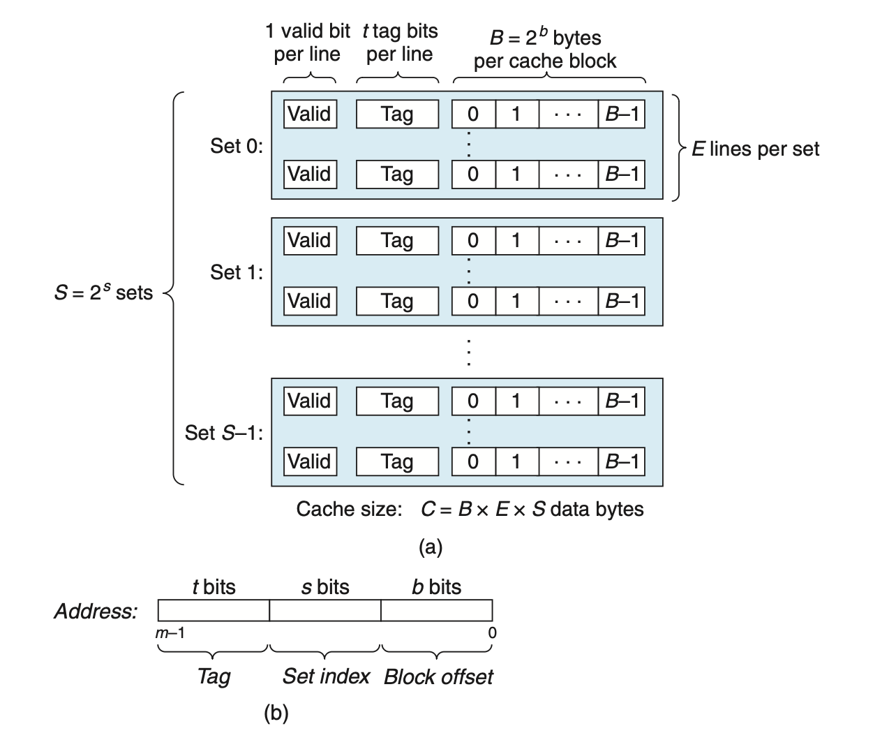

| 图 6.25 高速缓存的通用组织 $(S, E, B, m)$。 (a) 高速缓存是一个组的数组。每个组包含一行或多行。每行包含一个有效位、一些标记位和一个数据块。(b) 高速缓存组织将 $m$ 个地址位划分为 $t$ 个标记位、$s$ 个组索引位和 $b$ 个块偏移位。|
| :-------------------------------: |

正如你可能注意到的，高速缓存的描述使用了很多符号。图 6.26 总结了这些符号以供参考。

---

**练习题 6.9（答案见第 699 页）** 

下表给出了多个不同高速缓存的参数。对于每个高速缓存，确定高速缓存组数 $(S)$、标记位数 $(t)$、组索引位数 $(s)$ 和块偏移位数 $(b)$。

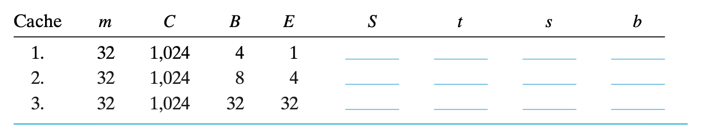

---

<!-- Page 0645 -->

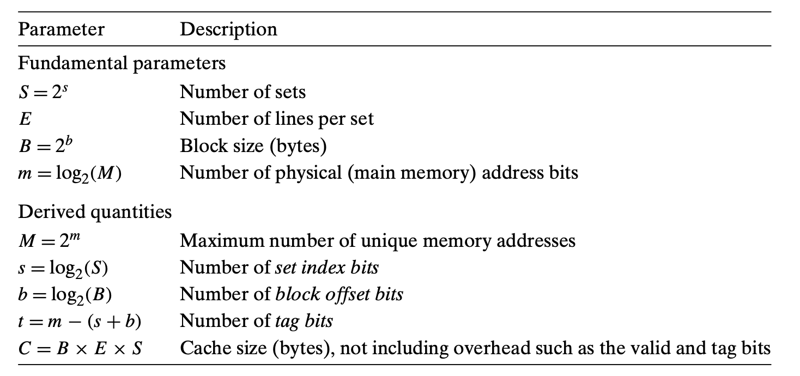

| 图 6.26 高速缓存参数摘要。|
| :-------------------------------: |

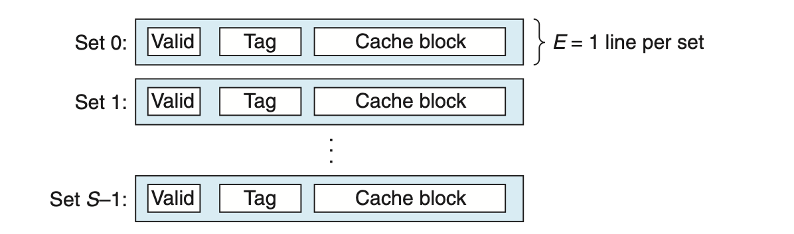

| 图 6.27 直接映射高速缓存（$E = 1$）。每组恰好有一行。|
| :-------------------------------: |

### 6.4.2 直接映射高速缓存

高速缓存根据 $E$（每组高速缓存行数）分为不同类别。每组恰好有一行（$E = 1$）的高速缓存称为**直接映射高速缓存**（direct-mapped cache）（见图 6.27）。直接映射高速缓存是实现和理解都最简单的，因此我们将用它来说明高速缓存工作原理的一些一般概念。

假设我们有一个系统，包含 CPU、寄存器文件、L1 高速缓存和主内存。当 CPU 执行读取内存字 $w$ 的指令时，它向 L1 高速缓存请求该字。如果 L1 高速缓存有 $w$ 的缓存副本，则我们有 L1 高速缓存命中，高速缓存迅速提取 $w$ 并将其返回给 CPU。否则，我们有高速缓存缺失，CPU 必须等待 L1 高速缓存从主内存请求包含 $w$ 的块的副本。当请求的块最终从内存到达时，L1 高速缓存将块存储在其某条高速缓存行中，从存储的块中提取字 $w$，并将其返回给 CPU。高速缓存确定请求是命中还是缺失，然后提取请求字的过程包括三步：(1) 组选择，(2) 行匹配，(3) 字提取。

---

<!-- Page 0646 -->

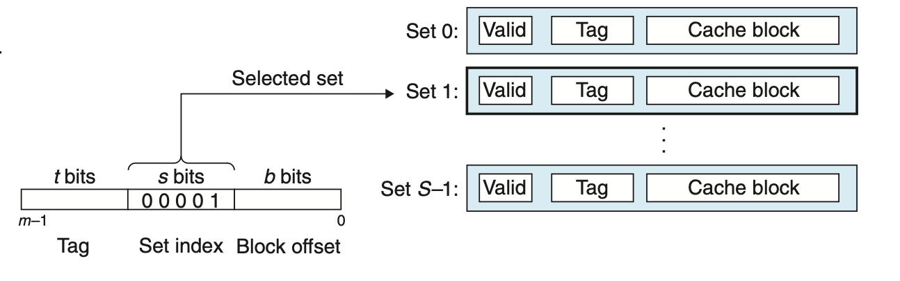

| 图 6.28 直接映射高速缓存中的组选择。 |
| :-------------------------------: |

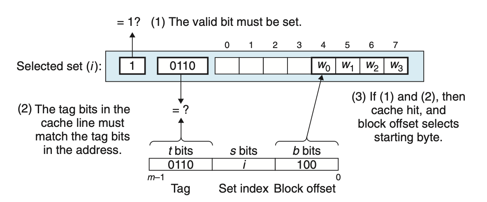

| 图 6.29 直接映射高速缓存中的行匹配和字选择。在高速缓存块中，$w_0$ 表示字 $w$ 的低位字节，$w_1$ 表示下一个字节，依此类推。 |
| :-------------------------------: |

**直接映射高速缓存中的组选择**

在这一步中，高速缓存从字 $w$ 的地址中间提取 $s$ 个组索引位。这些位被解释为对应于组号的无符号整数。换言之，如果我们将高速缓存看作一个组的一维数组，那么组索引位形成这个数组的索引。图 6.28 展示了直接映射高速缓存中组选择的工作原理。在这个例子中，组索引位 $00001_2$ 被解释为选择组 1 的整数索引。

**直接映射高速缓存中的行匹配**

现在我们在上一步中选择了某个组 $i$，下一步是确定字 $w$ 的副本是否存储在组 $i$ 中的某条高速缓存行中。在直接映射高速缓存中，这既简单又快速，因为每组恰好有一行。当且仅当有效位被设置且高速缓存行中的标记与 $w$ 的地址中的标记匹配时，$w$ 的副本包含在该行中。

图 6.29 展示了直接映射高速缓存中行匹配的工作原理。在这个例子中，选定组中恰好有一条高速缓存行。该行的有效位被设置，因此我们知道标记和块中的位是有意义的。由于高速缓存行中的标记位与地址中的标记位匹配，我们知道我们想要的字的副本确实存储在该行中。换言之，我们有高速缓存命中。另一方面，如果有效位未被设置或标记不匹配，那么我们将有高速缓存缺失。

---

<!-- Page 0647 -->

**直接映射高速缓存中的字选择**

一旦命中，我们就知道 $w$ 存在于某个块中。最后一步确定所需字在块中的起始位置。如图 6.29 所示，块偏移位为我们提供了所需字中第一个字节的偏移量。类似于将高速缓存视为行数组，我们可以把块视为字节数组，块偏移则是该数组的下标。在这个例子中，块偏移位 $100_2$ 表示 $w$ 的副本从块中的第 4 个字节开始。（我们假定字长为 4 字节。）

**直接映射高速缓存中不命中时的行替换**

如果高速缓存不命中，就需要从存储器层次结构的下一层中取出所请求的块，并将该新块存储到组索引位所指示的组中的某条高速缓存行里。通常情况下，若该组中所有有效高速缓存行都已被占用，则必须驱逐其中一条已有行。对于直接映射高速缓存，由于每个组只有一条行，替换策略十分简单：用新取来的行直接替换当前行即可。

**综合实例：直接映射高速缓存的工作过程**

高速缓存用于选组和识别行的机制极为简单，这是因为硬件必须在几纳秒内完成这些操作。然而，以这种方式操作位对于我们人类而言可能令人困惑。一个具体的例子有助于厘清这一过程。假设有一个直接映射高速缓存，其参数为：

$$ (S,\;E,\;B,\;m)=(4,\;1,\;2,\;4) $$

也就是说，该高速缓存有 4 个组，每组 1 行，每块 2 字节，地址为 4 位。我们还假设每个字只有 1 个字节。这些假设当然完全不现实，但它们有助于使示例保持简洁。

初次学习高速缓存时，逐一列举整个地址空间并划分各位是非常有益的，如图 6.30 所示。关于这个枚举空间，有几点值得注意：

- 标记位与索引位的拼接唯一标识了内存中的每个块。例如，块 0 由地址 0 和 1 组成，块 1 由地址 2 和 3 组成，块 2 由地址 4 和 5 组成，以此类推。

- 由于内存共有 8 个块但高速缓存只有 4 个组，因此多个块会映射到同一高速缓存组（即具有相同的组索引）。例如，块 0 和块 4 都映射到组 0，块 1 和块 5 都映射到组 1，以此类推。

- 映射到同一高速缓存组的块由标记位唯一区分。例如，块 0 的标记位为 0，块 4 的标记位为 1；块 1 的标记位为 0，块 5 的标记位为 1，以此类推。

---

<!-- Page 0648 -->

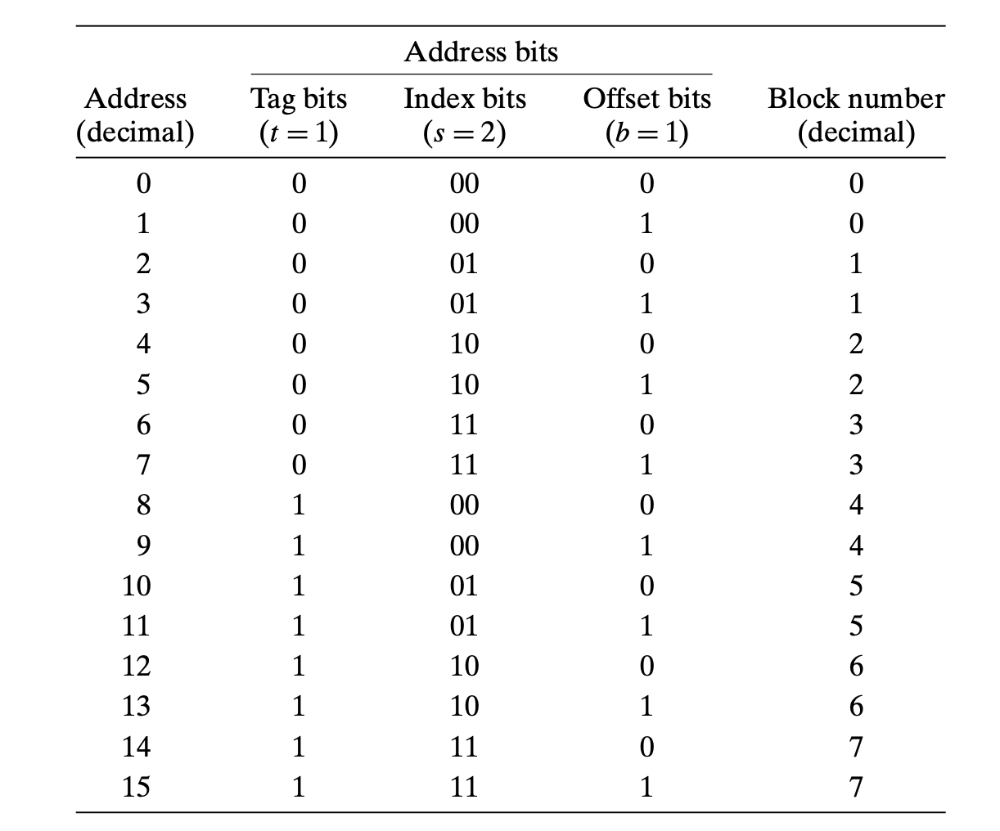

| 图 6.30 直接映射高速缓存示例的 4 位地址空间。 |
| :-------------------------------: |

让我们模拟 CPU 依次执行一系列读操作时高速缓存的工作情况。请记住，在本例中我们假设 CPU 读取 1 字节的字。尽管这种手动模拟既繁琐又可能让人想跳过，但根据我们的经验，学生只有亲自完成几次这样的模拟，才能真正理解高速缓存的工作原理。

初始时，高速缓存为空（即每个有效位均为 0）：

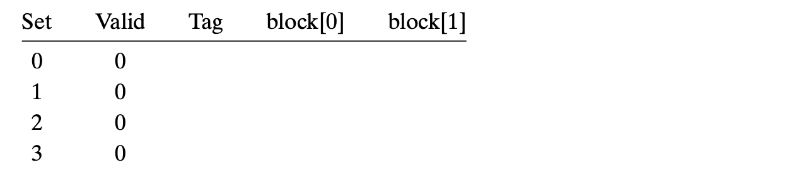

表中每一行代表一条高速缓存行。第一列表示该行所属的组，这仅是为了方便查看，实际上并不是高速缓存的组成部分。接下来的四列表示每条高速缓存行中的实际位。现在，让我们看看当 CPU 依次执行读操作时会发生什么：

1. **读取地址 0 处的字**。由于组 0 的有效位为 0，这是一次不命中。高速缓存从内存（或更低层的高速缓存）中取出块 0，将其存入组 0，然后从新装载的高速缓存行的 block[0] 中返回 m[0]（内存地址 0 处的内容）。

<!-- Page 0649 -->

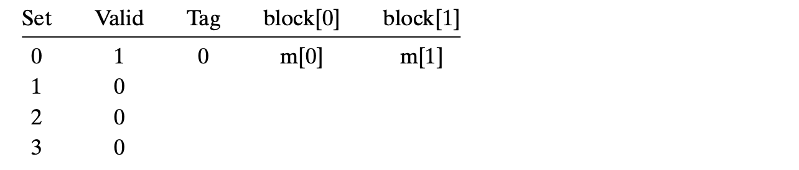

2. **读取地址 1 处的字**。这是一次命中。高速缓存立即从该高速缓存行的 block[1] 中返回 m[1]，高速缓存状态不变。

3. **读取地址 13 处的字**。由于组 2 中的高速缓存行无效，这是一次不命中。高速缓存将块 6 装入组 2，并从新高速缓存行的 block[1] 中返回 m[13]。

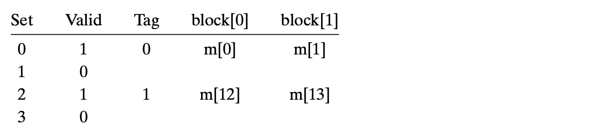

4. **读取地址 8 处的字**。这是一次不命中。组 0 中的高速缓存行有效，但标记不匹配。高速缓存将块 4 装入组 0（替换掉之前读地址 0 时装入的行），并从新高速缓存行的 block[0] 中返回 m[8]。

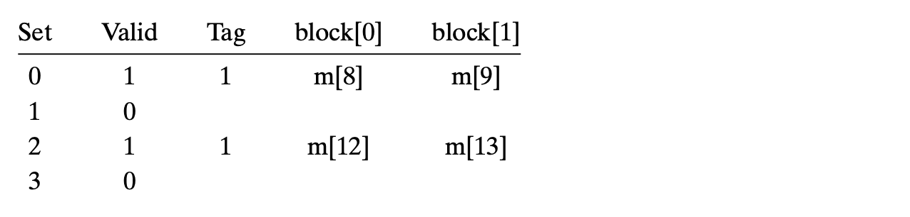

5. **再次读取地址 0 处的字**。这又是一次不命中，原因是我们刚刚在读取地址 8 时替换掉了块 0。这类不命中是一个**冲突不命中** (conflict miss) 的典型示例：高速缓存中明明还有空位，却因为反复交替访问映射到同一组的块而导致不命中。

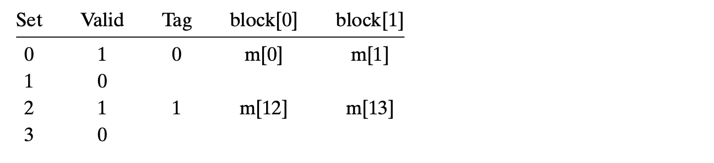

---

<!-- Page 0650 -->

**直接映射高速缓存中的冲突不命中**

冲突不命中在实际程序中很常见，并可能导致令人费解的性能问题。直接映射高速缓存中的冲突不命中，往往发生在程序访问大小为 2 的幂次方的数组时。例如，考虑下面这个计算两个向量点积的函数：

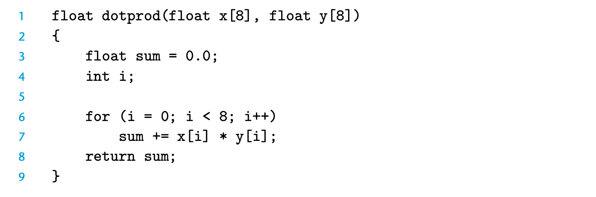


该函数对 `x` 和 `y` 具有良好的空间局部性，因此我们可能期望它能获得较高的命中率。然而，这并非总是成立。

假设 float 占 4 字节，`x` 从地址 0 开始连续存储 32 字节，`y` 紧随 `x` 之后从地址 32 开始。为简化起见，假设块大小为 16 字节（足够容纳 4 个 float），高速缓存共有 2 个组，总容量为 32 字节。假设变量 `sum` 实际存储在 CPU 寄存器中，不需要访问内存。在这些假设下，`x[i]` 和 `y[i]` 将映射到相同的高速缓存组：

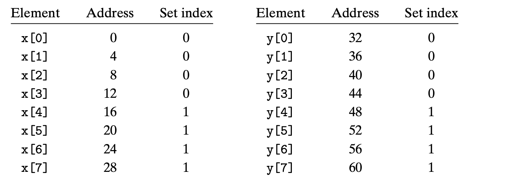

在运行时，循环第一次迭代引用 `x[0]`，发生不命中，导致包含 `x[0]`–`x[3]` 的块被装入组 0。下一次引用 `y[0]` 又不命中，包含 `y[0]`–`y[3]` 的块被复制到组 0，覆盖了之前装入的 `x` 的值。在下一次迭代中，对 `x[1]` 的引用又不命中，`x[0]`–`x[3]` 的块被重新装入组 0，覆盖了 `y[0]`–`y[3]` 的块。至此产生了冲突不命中，实际上后续对 `x` 和 `y` 的每次引用都会导致冲突不命中，我们在 `x` 和 `y` 的块之间**反复抖动** (thrashing)。**抖动**描述的是高速缓存反复装入和驱逐同一组高速缓存块的任何情形。

---

<!-- Page 0651 -->

>**旁注 为什么用中间位作为组索引？**
>
>你可能想知道，为什么高速缓存使用地址的中间位作为组索引，而不是高位。原因在于中间位更优。图 6.31 解释了原因。若使用高位作为索引，某些连续的内存块将映射到同一高速缓存组。例如图中，前四个块都映射到第一个高速缓存组，接下来四个块都映射到第二个组，以此类推。如果程序具有良好的空间局部性并按顺序扫描数组元素，那么在任意时刻高速缓存只能保存数组中大小等于一个块的片段，这是对高速缓存的低效利用。相比之下，使用中间位索引时，相邻块总是映射到不同的高速缓存组。在这种情况下，高速缓存可以保存整个大小为 $C$ 的数组片段，其中 $C$ 为高速缓存的容量。

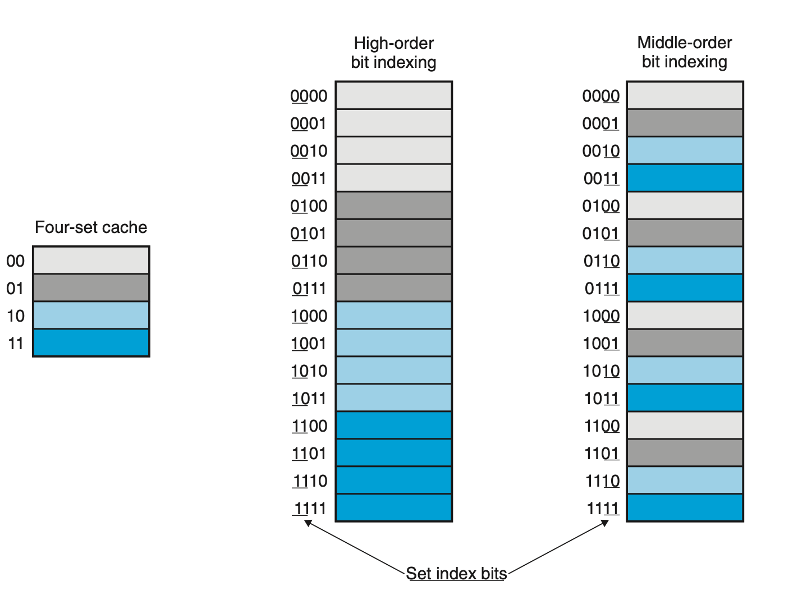

| 图 6.31 为什么高速缓存使用中间位作为索引。 |
| :-------------------------------: |

最终结论是：尽管程序具有良好的空间局部性，且高速缓存中有足够的空间同时容纳 `x[i]` 和 `y[i]` 的块，但每次引用都会产生冲突不命中，因为这些块映射到同一高速缓存组。这种抖动导致性能下降 2 到 3 倍的情况并不罕见。另外请注意，尽管我们的示例极为简单，但这一问题对于更大、更真实的直接映射高速缓存同样存在。

幸运的是，一旦程序员意识到问题所在，抖动就很容易修复。一个简单的解决方法是在每个数组末尾添加 $B$ 个字节的填充。

---

<!-- Page 0652 -->

例如，将 `x` 定义为 `float x[12]` 而不是 `float x[8]`。假设 `y` 紧随 `x` 之后存储，数组元素到组的映射如下：

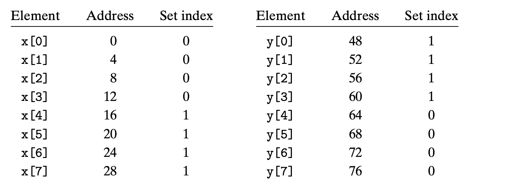

在 `x` 末尾添加填充后，`x[i]` 和 `y[i]` 现在映射到不同的组，从而消除了抖动冲突不命中。

---

**练习题 6.10（答案见第 699 页）**

在前面的 dotprod 示例中，一旦对数组 `x` 进行了填充，对 `x` 和 `y` 的总引用中有多大比例会命中？

---

**练习题 6.11（答案见第 699 页）**

假设有一个假想高速缓存，使用地址的高位 $s$ 位作为组索引。对于这样的高速缓存，连续的内存块片段会映射到同一高速缓存组。

A. 每个连续数组片段中有多少个块？

B. 考虑如下在配有 $(S, E, B, m) = (512, 1, 32, 32)$ 高速缓存的系统上运行的代码：
```c
int array[4096];
for (i = 0; i < 4096; i++)
    sum += array[i];
```
在任意时刻，高速缓存中最多能存储多少个数组块？

---

### 6.4.3 组相联高速缓存

直接映射高速缓存中冲突不命中的根本原因在于每个组只有一条行（即 $E = 1$）的限制。**组相联高速缓存** (set associative cache) 放宽了这一限制，使每个组可以容纳多条高速缓存行。满足 $1 < E < C/B$ 的高速缓存通常称为 $E$ 路组相联高速缓存。

---

<!-- Page 0653 -->

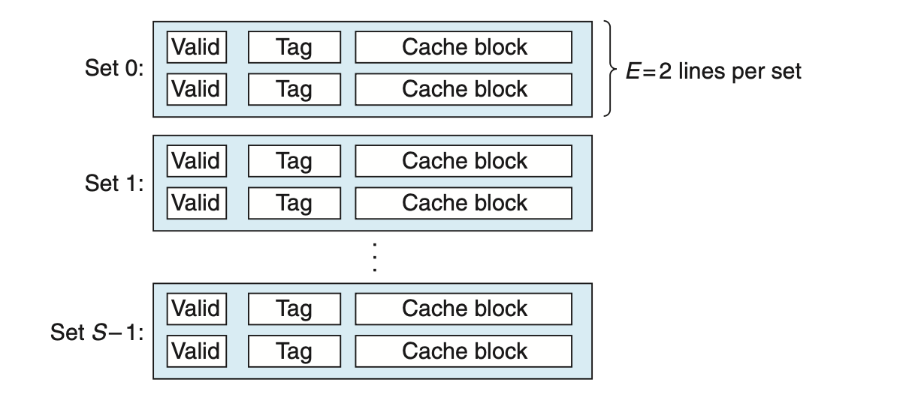

| 图 6.32 组相联高速缓存 $(1 < E < C/B)$。在组相联高速缓存中，每个组包含多条行。本例展示了一个二路组相联高速缓存。|
| :-------------------------------: |

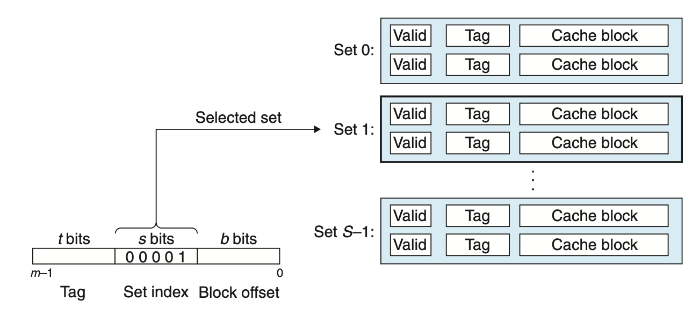

| 图 6.33 组相联高速缓存中的组选择。|
| :-------------------------------: |

我们将在下一节讨论 $E = C/B$ 的特殊情况。图 6.32 展示了二路组相联高速缓存的组织结构。

**组相联高速缓存中的组选择**

组相联高速缓存中的组选择与直接映射高速缓存相同，由组索引位标识对应的组。图 6.33 总结了这一原理。

**组相联高速缓存中的行匹配与字选择**

组相联高速缓存中的行匹配比直接映射高速缓存更为复杂，因为它需要检查多条行的标记位和有效位，以确定所请求的字是否在组中。传统内存是一个以地址为输入并返回对应存储值的值数组；而**相联存储器** (associative memory) 则是一个（键, 值）对数组，以键为输入，返回与输入键匹配的某个（键, 值）对中的值。因此，我们可以将组相联高速缓存中的每个组视为一个小型相联存储器，其中键是标记位与有效位的拼接，值是块的内容。

---

<!-- Page 0654 -->

图 6.34 展示了相联高速缓存中行匹配的基本思路。这里的一个重要概念是：组中的任意一行都可以包含映射到该组的任意内存块。因此，高速缓存必须搜索组中的每一行，寻找有效且标记与地址中标记相匹配的行。若找到这样的行，则发生命中，块偏移从块中选取字，与之前相同。

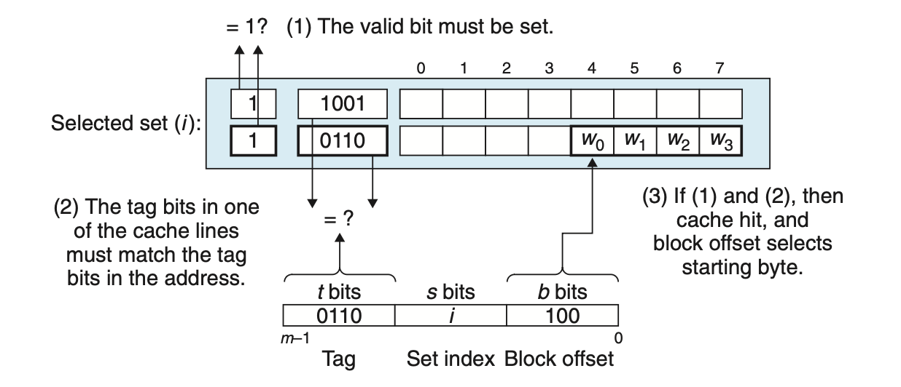

| 图 6.34 组相联高速缓存中的行匹配与字选择。 |
| :-------------------------------: |

**组相联高速缓存中不命中时的行替换**

如果 CPU 请求的字未存储在组中的任何一行中，则发生高速缓存不命中，高速缓存必须从内存中取出包含该字的块。然而，取得块之后应替换哪条行？如果组中存在空行，那它自然是优选候选。但如果组中没有空行，则必须选择一条非空行并期望 CPU 短期内不会再引用被替换的行。

对于程序员而言，在代码中利用高速缓存替换策略的知识非常困难，因此我们在此不作详细介绍。最简单的替换策略是随机选择一条行进行替换。其他更复杂的策略借助局部性原理，力图降低被替换行在近期内再被引用的概率。例如，**最不频繁使用** (Least Frequently Used, LFU) 策略会替换在过去某个时间窗口内引用次数最少的行；**最近最少使用** (Least Recently Used, LRU) 策略会替换在过去最久未被访问的行。所有这些策略都需要额外的时间和硬件开销。但随着我们沿存储器层次结构向下移动，远离 CPU，不命中的代价越来越高，采用好的替换策略来减少不命中也就越来越值得。

### 6.4.4 全相联高速缓存

**全相联高速缓存** (fully associative cache) 由单个组（即 $E = C/B$）构成，包含所有高速缓存行。图 6.35 展示了其基本组织结构。

---

<!-- Page 0655 -->

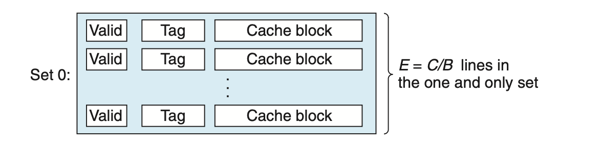

| 图 6.35：全相联高速缓存（$E = C/B$）。在全相联高速缓存中，单个组包含所有行。 |
| :-------------------------------: |

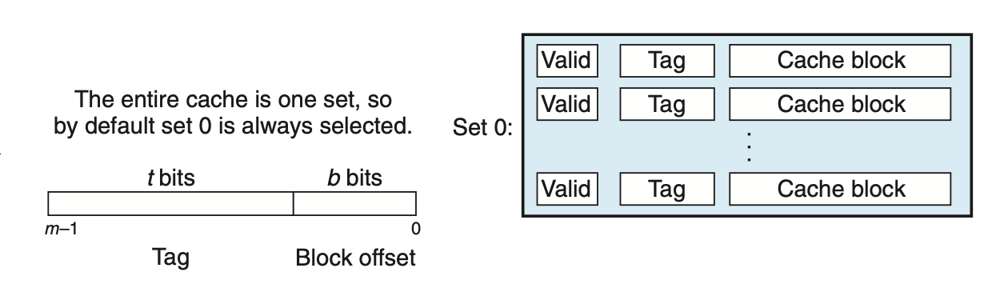

| 图 6.36：全相联高速缓存中的组选择。注意地址中没有组索引位。 |
| :-------------------------------: |

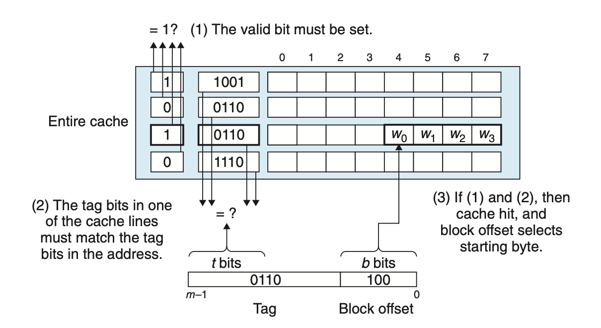

| 图 6.37：全相联高速缓存中的行匹配与字选择。 |
| :-------------------------------: |

**全相联高速缓存中的组选择**

全相联高速缓存中的组选择极为简单，因为只有一个组，如图 6.36 所示。注意地址中没有组索引位，地址仅被划分为标记位和块偏移位。

**全相联高速缓存中的行匹配与字选择**

全相联高速缓存中的行匹配与字选择与组相联高速缓存相同，如图 6.37 所示。区别主要在于规模大小。

由于高速缓存电路必须并行搜索大量匹配的标记，构建既大又快的相联高速缓存十分困难且代价高昂。因此，全相联高速缓存只适合用于小型高速缓存，例如虚拟内存系统中用于缓存页表项的转换后备缓冲器 (Translation Lookaside Buffer, TLB)（第 9.6.2 节）。

---

<!-- Page 0656 -->

**练习题 6.12（答案见第 699 页）**

下列习题将帮助你巩固对高速缓存工作原理的理解。假设以下条件：

- 内存按字节寻址。
- 内存访问针对 1 字节的字（而非 4 字节的字）。
- 地址宽度为 13 位。
- 高速缓存为二路组相联（$E = 2$），块大小为 4 字节（$B = 4$），共 8 个组（$S = 8$）。

高速缓存内容如下，所有数字均以十六进制给出。

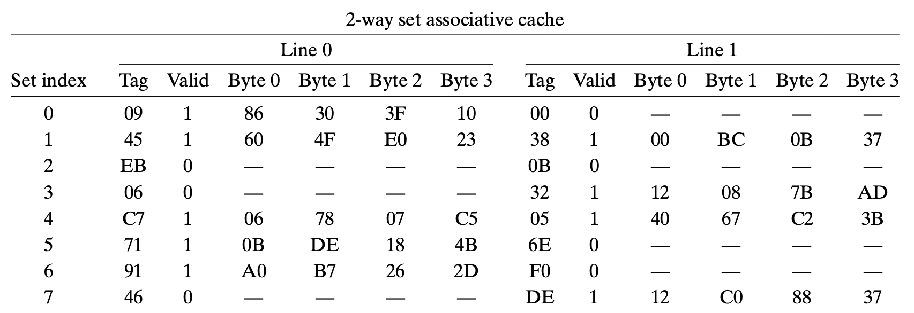

下图展示了地址格式（每格 1 位），请标注（通过标记图中字段）以下用于确定各项的位域：

CO：高速缓存块偏移

CI：高速缓存组索引

CT：高速缓存标记


---

**练习题 6.13（答案见第 700 页）**

假设在问题 6.12 的机器上运行的程序引用了地址 0x0D53 处的 1 字节数据。请指出被访问的缓存条目，并以十六进制表示返回的缓存字节值。同时说明是否发生缓存未命中。若不命中，在"Cache byte returned"中填入"—"。

---

<!-- Page 0657 -->

A. 地址格式（每格 1 位）：

B. 内存引用：

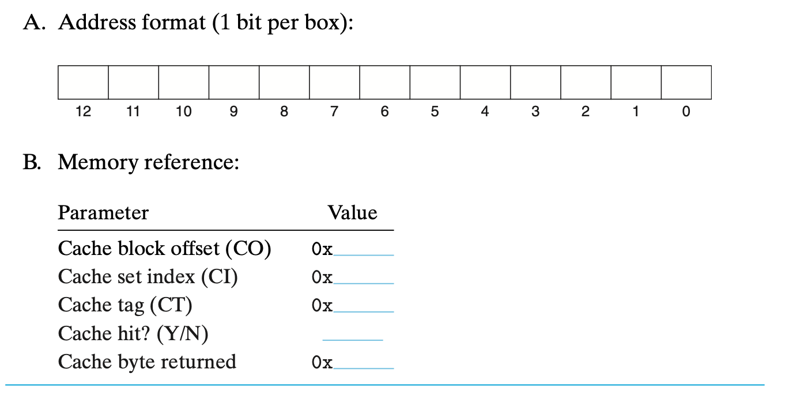

---

**练习题 6.14（答案见第 700 页）**

对内存地址 0x0CB4 重复练习题 6.13。

A. 地址格式（每格 1 位）：

B. 内存引用：

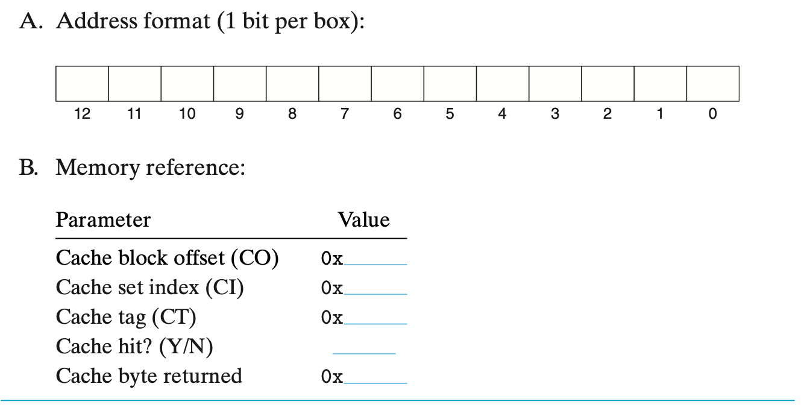

---

**练习题 6.15（答案见第 700 页）**

对内存地址 0x0A31 重复练习题 6.13。

A. 地址格式（每格 1 位）：

B. 内存引用：

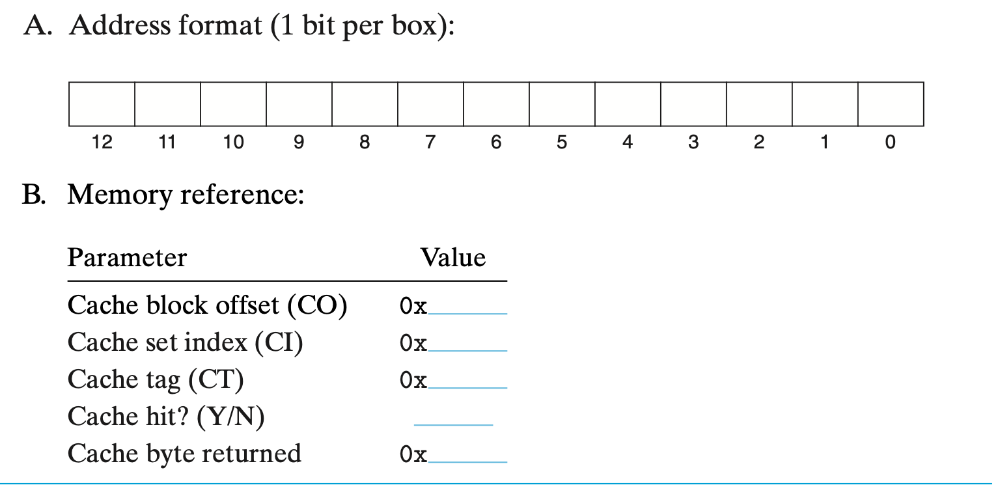

---

<!-- Page 0658 -->

**练习题 6.16（答案见第 701 页）**

对于练习题 6.12 中的高速缓存，列出所有命中组 3 的十六进制内存地址。

---

### 6.4.5 写操作的问题

如前所述，高速缓存的读操作十分直观：首先在高速缓存中查找所需字 $w$ 的副本；若命中，立即返回 $w$；若不命中，从存储器层次结构的下一层取出包含 $w$ 的块，将该块存入某条高速缓存行（可能驱逐一条有效行），然后返回 $w$。

写操作则稍为复杂。假设我们写一个已在高速缓存中的字 $w$（写命中）。高速缓存更新其中的 $w$ 副本后，该如何更新下一层中 $w$ 的副本？最简单的方法称为**直写** (write-through)：立即将 $w$ 的高速缓存块写入下一层。直写虽然简单，但每次写操作都会引起总线流量，是其缺点所在。另一种方法称为**写回** (write-back)：尽可能推迟更新，仅当替换算法驱逐该块时才将更新后的块写入下一层。由于局部性，写回可以显著减少总线流量，但它有一个额外的复杂性：高速缓存必须为每条高速缓存行维护一个额外的**脏位** (dirty bit)，以标识该高速缓存块是否已被修改。

另一个问题是如何处理写不命中。一种方法称为**写分配** (write-allocate)：从下一层将对应块装入高速缓存，再更新该高速缓存块。写分配试图利用写的空间局部性，但其缺点是每次不命中都会引发一次从下一层到高速缓存的块传输。另一种方法称为**非写分配** (no-write-allocate)：绕过高速缓存，直接将字写入下一层。直写高速缓存通常采用非写分配，写回高速缓存通常采用写分配。

针对写操作优化高速缓存是一个微妙而困难的问题，这里仅作初步介绍。具体细节因系统而异，往往是专有信息且文档不完整。对于试图编写高效高速缓存友好程序的程序员，我们建议采用**写回、写分配**高速缓存的思维模型，理由如下：通常情况下，存储器层次结构中较低层次的高速缓存更倾向于使用写回而非直写，因为较低层的传输时间更长。例如，虚拟内存系统（以主内存作为磁盘上存储块的高速缓存）完全采用写回策略。随着逻辑密度的提高，写回的复杂性正在变得越来越不成问题，现代系统的各个层次都在使用写回高速缓存。因此，该假设与当前趋势相符。另一个采用写回、写分配假设的原因是它与读操作的处理方式具有对称性——写回、写分配同样试图利用局部性。这样，我们就可以从高层次出发，编写具有良好空间局部性和时间局部性的程序，而不必针对特定的内存系统进行优化。

---

<!-- Page 0659 -->

### 6.4.6 真实高速缓存层次结构剖析

至此，我们假设高速缓存只存储程序数据。但事实上，高速缓存既可以存储指令，也可以存储数据。只存储指令的高速缓存称为**指令高速缓存** (i-cache)，只存储程序数据的高速缓存称为**数据高速缓存** (d-cache)，同时存储指令和数据的高速缓存称为**统一高速缓存** (unified cache)。现代处理器通常包含独立的指令高速缓存和数据高速缓存，原因如下：采用两个独立的高速缓存，处理器可以同时读取一条指令字和一个数据字；指令高速缓存通常是只读的，因此更为简单；两个高速缓存通常针对不同的访问模式进行优化，可以具有不同的块大小、相联度和容量；此外，独立的高速缓存可确保数据访问不会与指令访问之间产生冲突不命中，反之亦然，代价是可能略微增加容量不命中。

图 6.38 展示了 Intel Core i7 处理器的高速缓存层次结构。每颗 CPU 芯片有 4 个核心，每个核心有各自私有的 L1 指令高速缓存、L1 数据高速缓存和 L2 统一高速缓存，所有核心共享一个片上 L3 统一高速缓存。该层次结构的一个有趣特点是：所有 SRAM 高速缓存都集成在 CPU 芯片内。

图 6.39 总结了 Core i7 各级高速缓存的基本特性。

### 6.4.7 高速缓存参数对性能的影响

评估高速缓存性能有多项指标：

- **不命中率 (Miss rate)**：程序（或程序的某部分）执行期间访问内存时不命中的比例，计算公式为 $\text{\#misses} / \text{\#references}$。

- **命中率 (Hit rate)**：内存引用中命中的比例，计算公式为 $1 - \text{miss rate}$。

- **命中时间 (Hit time)**：将高速缓存中的字传送到 CPU 所需的时间，包括组选择、行识别和字选择的时间。L1 高速缓存的命中时间约为几个时钟周期。

---

<!-- Page 0660 -->

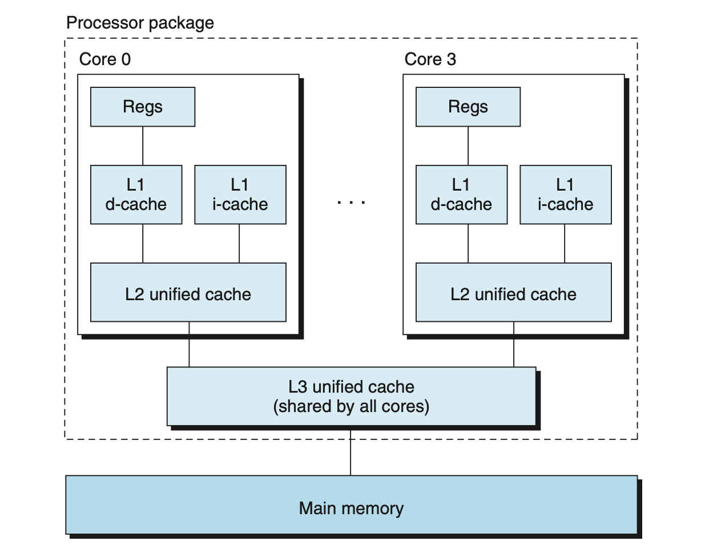

| 图 6.38 Intel Core i7 高速缓存层次结构。 |
| :-------------------------------: |

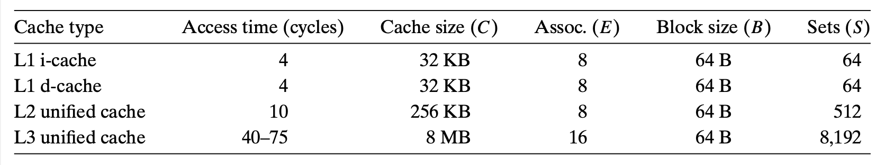

| 图 6.39 Intel Core i7 高速缓存层次结构的特性。 |
| :-------------------------------: |

- **不命中惩罚 (Miss penalty)**：因不命中而产生的额外时间开销。L1 不命中由 L2 服务的惩罚约为 10 个周期；由 L3 服务约为 50 个周期；由主内存服务约为 200 个周期。

优化高速缓存的性价比权衡是一项微妙的工作，需要在真实基准代码上进行大量模拟，超出了本书的讨论范围。不过，我们可以识别一些定性的权衡关系。

**高速缓存容量的影响**

一方面，更大的高速缓存往往能提高命中率；另一方面，使大容量内存运行更快始终更为困难。因此，更大的高速缓存往往会增加命中时间。这就是为什么 L1 高速缓存比 L2 小，L2 又比 L3 小。

---

<!-- Page 0661 -->

**块大小的影响**

较大的块有利有弊。一方面，较大的块可以利用程序中可能存在的空间局部性来提高命中率；另一方面，对于给定的高速缓存容量，较大的块意味着高速缓存行数更少，这对时间局部性强于空间局部性的程序可能有损命中率。较大的块还会对不命中惩罚产生负面影响，因为块越大，传输时间越长。Core i7 等现代系统折中采用 64 字节的高速缓存块。

**相联度的影响**

这里的问题是参数 $E$（每组高速缓存行数）的选择对性能的影响。较高相联度（即较大的 $E$）的优势在于降低了高速缓存因冲突不命中而导致抖动的脆弱性。然而，较高的相联度代价高昂：实现更复杂，运行速度更难提升，每行需要更多标记位和额外的 LRU 状态位，控制逻辑也更复杂。较高的相联度可能因复杂性增加而延长命中时间，也可能因选择被驱逐行的复杂性增加而延长不命中惩罚。

相联度的选择最终归结为命中时间与不命中惩罚之间的权衡。传统上，追求高时钟频率的高性能系统会对 L1 高速缓存（不命中惩罚仅为几个周期）采用较低的相联度，而对不命中惩罚较高的较低层次高速缓存采用较高的相联度。例如，在 Intel Core i7 系统中，L1 和 L2 高速缓存为 8 路组相联，L3 高速缓存为 16 路组相联。

#### 写策略的影响

直写高速缓存实现更简单，可以使用与高速缓存独立工作的写缓冲区来更新内存；读不命中的代价也较低，因为不会触发内存写操作。另一方面，写回高速缓存能减少数据传输次数，从而为执行 DMA 的 I/O 设备提供更多内存带宽。此外，随着我们沿层次结构向下移动、传输时间增加，减少传输次数变得越来越重要。总体而言，层次结构中越低层的高速缓存越可能使用写回而非直写。

## 6.5 编写高速缓存友好的代码

在 6.2 节中，我们介绍了局部性的概念，并从定性角度探讨了什么构成良好的局部性。现在我们理解了高速缓存的工作原理，可以更精确地加以描述。具有较好局部性的程序往往具有较低的不命中率，而不命中率较低的程序往往比不命中率较高的程序运行更快。因此，优秀的程序员应当始终努力编写高速缓存友好的代码，即具有良好局部性的代码。下面是我们用来确保代码高速缓存友好的基本方法。

---

<!-- Page 0662 -->

>**旁注 高速缓存行、组与块：有何区别？**
>
>区分高速缓存行、组和块很容易混淆，让我们来回顾这些概念并确保理解清晰：
>
>- **块 (block)** 是在高速缓存与主内存（或低层高速缓存）之间来回传输的固定大小的信息单元。
>
>- **行 (line)** 是高速缓存中存储一个块的容器，同时还包含有效位和标记位等其他信息。
>
>- **组 (set)** 是由一条或多条行组成的集合。直接映射高速缓存中的组只含一条行；组相联和全相联高速缓存中的组含有多条行。
>
>在直接映射高速缓存中，组与行确实等价。但在相联高速缓存中，组与行是截然不同的概念，不能互换使用。
>
>由于一行始终存储一个块，"行"和"块"两个术语常被互换使用。例如，系统专业人员通常说高速缓存的"行大小"，实际上指的是块大小。这种用法十分常见，只要理解了块与行的区别，就不会产生混淆。

1. **让常见情形快速运行**。程序通常将大部分时间花在少数核心函数上，而这些函数又通常将大部分时间花在少数循环上。因此，专注于核心函数的内层循环，忽略其余部分。

2. **最小化每个内层循环中的高速缓存不命中次数**。在其他条件相同（如访存总次数）的情况下，不命中率更低的循环运行更快。

为了了解这在实践中的效果，考虑 6.2 节中的 `sumvec` 函数：

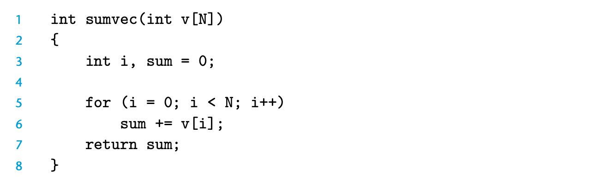

这个函数是高速缓存友好的吗？首先，循环体中局部变量 `i` 和 `sum` 具有良好的时间局部性。事实上，由于它们是局部变量，任何合理的优化编译器都会将它们缓存在寄存器堆中（存储器层次结构的最高层）。现在考虑对向量 `v` 的步长为 1 的引用。通常，若高速缓存的块大小为 $B$ 字节，则步长为 $k$ 的引用模式（$k$ 以字为单位）每次循环迭代平均产生 $\min(1, (\text{字长} \times k)/B)$ 次不命中。当 $k=1$ 时不命中次数最少，因此对 `v` 的步长为 1 的引用确实是高速缓存友好的。

---

<!-- Page 0663 -->

例如，假设 `v` 按块对齐，字长为 4 字节，高速缓存块为 4 个字，且高速缓存初始为空（冷高速缓存）。则无论高速缓存组织方式如何，对 `v` 的引用将产生如下命中/不命中模式：

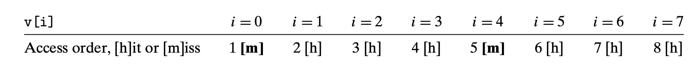

在本例中，对 `v[0]` 的引用不命中，包含 `v[0]`–`v[3]` 的块从内存装入高速缓存，因此接下来三次引用均命中；对 `v[4]` 的引用又触发一次不命中，新块被装入高速缓存，后三次引用均命中，以此类推。总体而言，四次引用中三次命中，这是冷高速缓存条件下能达到的最优结果。

综上，简单的 `sumvec` 示例说明了编写高速缓存友好代码的两个重要原则：

- **对局部变量的重复引用是有益的**，因为编译器可以将它们缓存在寄存器堆中（时间局部性）。
- **步长为 1 的引用模式是有益的**，因为存储器层次结构各层的高速缓存都将数据存储为连续块（空间局部性）。

对于操作多维数组的程序，空间局部性尤为重要。例如，考虑 6.2 节中的 `summarrayrows` 函数，它以行主序对二维数组求和：

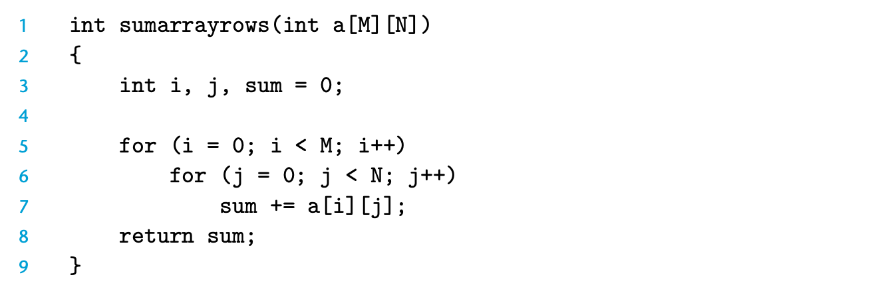


由于 C 语言以行主序存储数组，该函数的内层循环具有与 `sumvec` 相同的步长为 1 的访问模式。在与 `sumvec` 相同的高速缓存假设下，对数组 `a` 的引用将产生如下命中/不命中模式：

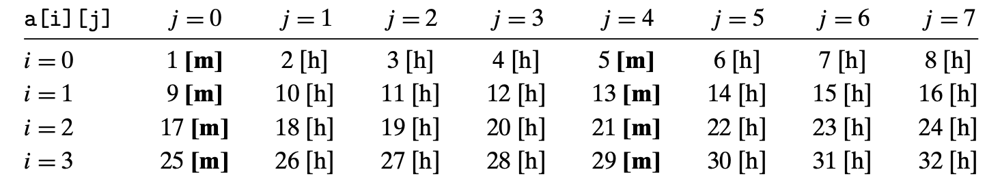

---

<!-- Page 0664 -->

但如果交换循环的顺序（按列扫描数组），情况将大不相同：

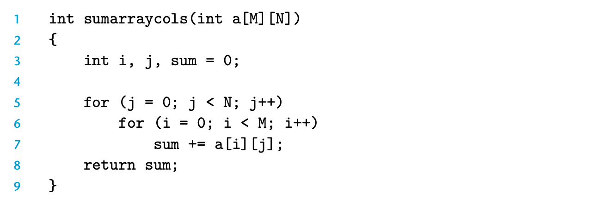

在这种情况下，我们按列而非按行扫描数组。如果整个数组恰好可以装入高速缓存，则不命中率仍为 1/4。然而，如果数组大于高速缓存（更常见的情况），则对 `a[i][j]` 的每次访问都会不命中！

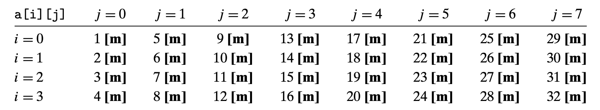

较高的不命中率会对运行时间产生显著影响。例如，在我们的桌面机上，对于大型数组，`summarrayrows` 的运行速度比 `summarraycols` 快 25 倍。总之，程序员应当关注程序的局部性，并努力编写能够利用局部性的程序。

---

**练习题 6.17（答案见第 701 页）**

矩阵转置（交换行与列）是信号处理和科学计算中的重要问题，从局部性角度来看也十分有趣，因为其引用模式既涉及行访问，又涉及列访问。例如，考虑如下转置例程：

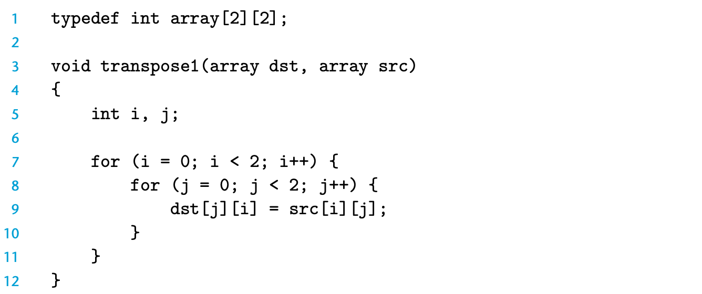

---

<!-- Page 0665 -->

假设以下条件：

- `sizeof(int) = 4`。
- `src` 数组从地址 0 开始，`dst` 数组从地址 16（十进制）开始。
- 存在一个单路 L1 数据高速缓存，直接映射，直写，写分配，块大小为 8 字节。
- 高速缓存的总数据容量为 16 字节，且初始为空。
- 对 `src` 和 `dst` 数组的访问分别是读不命中和写不命中的唯一来源。

A. 对每个 row 和 col，指出对 `src[row][col]` 的访问和对 `dst[row][col]` 的访问是命中 (h) 还是不命中 (m)。例如，读 `src[0][0]` 是不命中，写 `dst[0][0]` 也是不命中。

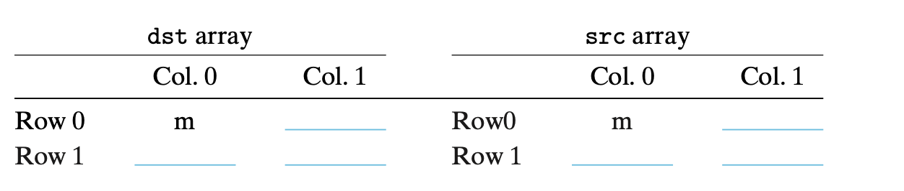

B. 对容量为 32 字节数据的高速缓存重复上述问题。

---

**练习题 6.18（答案见第 702 页）**

近期热门游戏 SimAquarium 的核心是一个紧密循环，用于计算 512 个藻类的平均位置。你正在评估其在如下机器上的高速缓存性能：2048 字节直接映射数据高速缓存，块大小为 32 字节（$B = 32$）。给定如下定义：

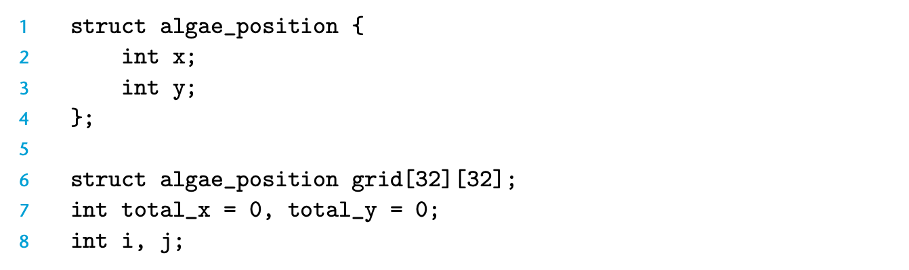

还假设以下条件：

- `sizeof(int) = 4`。
- `grid` 从内存地址 0 开始。
- 高速缓存初始为空。
- 唯一的内存访问是对数组 `grid` 元素的访问；变量 `i`、`j`、`total_x`、`total_y` 存储在寄存器中。

---

<!-- Page 0666 -->

确定以下代码的缓存性能：

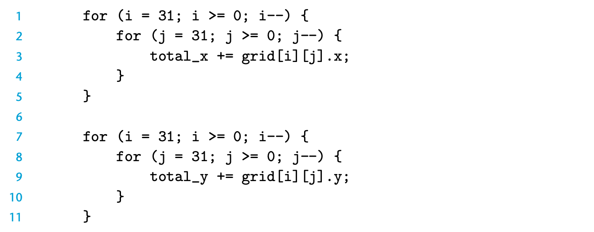

A. 读操作总次数是多少？

B. 高速缓存不命中的读操作次数是多少？

C. 不命中率是多少？

---

**练习题 6.19（答案见第 702 页）**

基于练习题 6.18 的假设，确定以下代码的高速缓存性能：

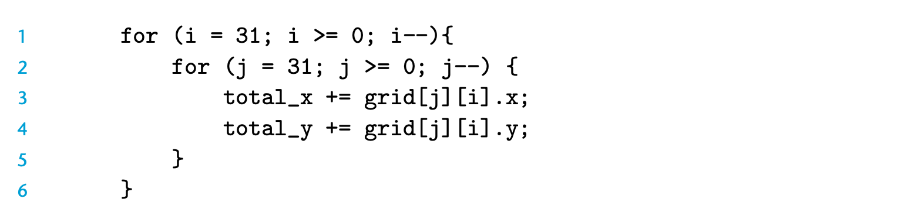

A. 读操作总次数是多少？

B. 高速缓存命中的读操作次数是多少？

C. 命中率是多少？

D. 若高速缓存容量翻倍，不命中率将是多少？

---

**练习题 6.20（答案见第 702 页）**

基于练习题 6.18 的假设，确定以下代码的高速缓存性能：

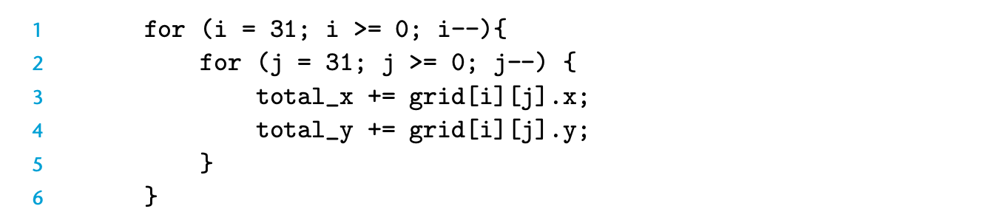

---


<!-- Page 0667 -->

A. 读操作总次数是多少？

B. 高速缓存命中的读操作次数是多少？

C. 命中率是多少？

D. 若高速缓存容量翻倍，命中率将是多少？

## 6.6 综合：高速缓存对程序性能的影响

本节通过研究高速缓存对在真实机器上运行的程序性能的影响，对存储器层次结构的讨论作一总结。

### 6.6.1 存储器山

程序从存储器系统读取数据的速率称为**读吞吐量** (read throughput)，有时也称为**读带宽** (read bandwidth)。若程序在 $s$ 秒内读取了 $n$ 字节，则该时段内的读吞吐量为 $n/s$，通常以 MB/s 为单位表示。

如果编写一个在紧密循环中发出一系列读请求的程序，所测得的读吞吐量可以帮助我们了解该特定读访问序列下存储器系统的性能。图 6.40 展示了一对用于测量特定读序列读吞吐量的函数。

`test` 函数通过以步长 `stride` 扫描数组的前 `elems` 个元素来生成读序列。为了提高内层循环的可用并行性，它采用了 $4 \times 4$ 循环展开（第 5.9 节）。`run` 函数是一个包装函数，调用 `test` 并返回所测的读吞吐量。第 37 行对 `test` 函数的调用用于预热高速缓存。第 38 行的 `fcycl2` 函数以 `elements` 和 `stride` 为参数调用 `test`，并估计 `test` 函数的运行时间（以 CPU 周期计）。注意，`run` 函数的 `size` 参数以字节为单位，而传递给 `test` 函数的对应 `elements` 参数以数组元素个数为单位。另外，第 39 行将 MB/s 计算为 $10^6$ 字节/秒，而非 $2^{20}$ 字节/秒。

`run` 函数的 `size` 和 `stride` 参数使我们能够控制所生成读序列的时间局部性和空间局部性程度。较小的 `size` 值对应较小的工作集，从而具有更好的时间局部性；较小的 `stride` 值则对应更好的空间局部性。若用不同的 `size` 和 `stride` 值反复调用 `run` 函数，便可恢复出读吞吐量关于时间局部性和空间局部性的二维函数，这个函数称为**存储器山** (memory mountain)[112]。

每台计算机都有一座独特的存储器山，刻画了其存储器系统的性能特征。图 6.41 展示了 Intel Core i7 Haswell 系统的存储器山。在此示例中，`size` 从 16 KB 变化到 128 MB，`stride` 从 1 到 12 个元素变化，每个元素为 8 字节的 `long int`。

---

<!-- Page 0668 -->

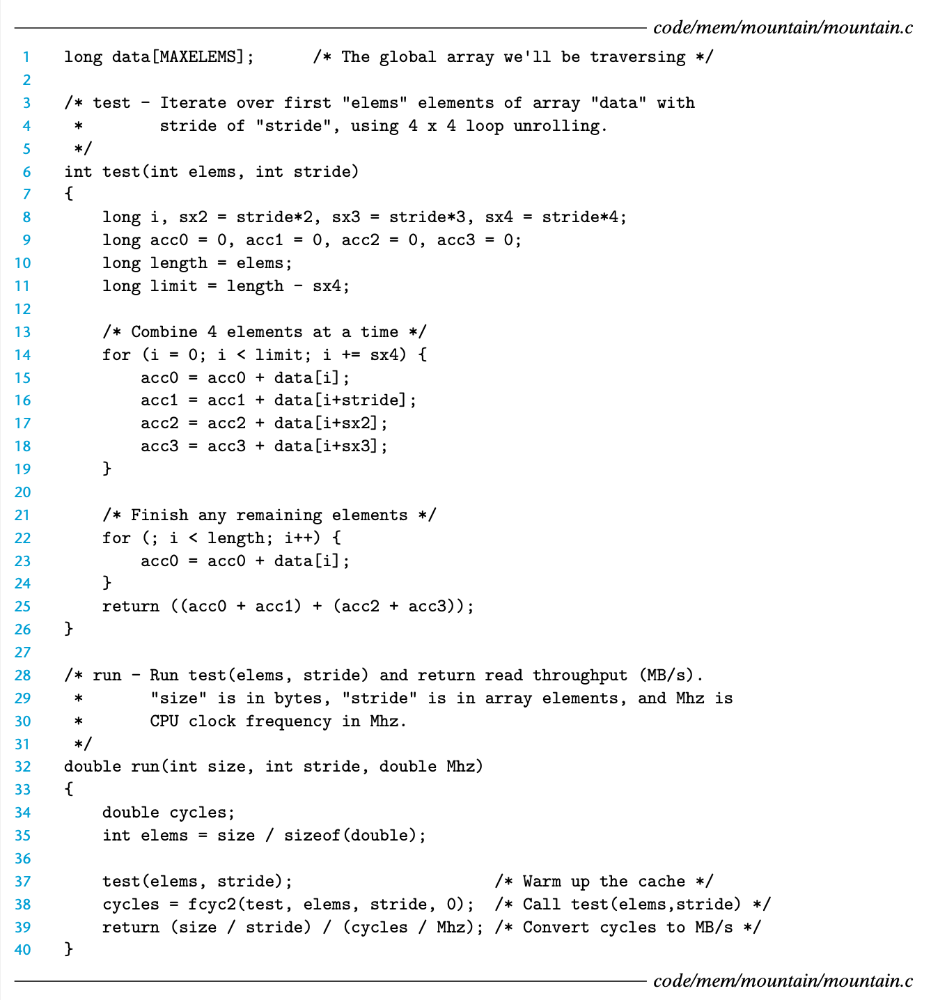

| 图 6.40 测量并计算读吞吐量的函数。通过以不同的 size（对应时间局部性）和 stride（对应空间局部性）调用 run 函数，可以生成特定计算机的存储器山。 |
| :-------------------------------: |

---

<!-- Page 0669 -->

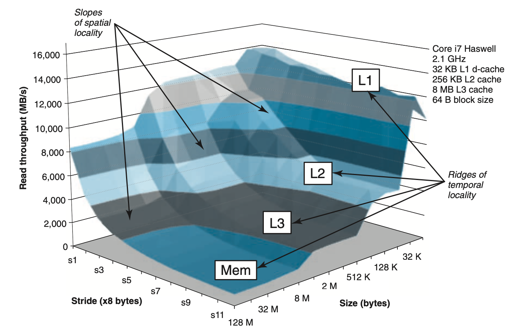

| 图 6.41 存储器山。展示了读吞吐量关于时间局部性和空间局部性的函数。 |
| :-------------------------------: |

Core i7 存储器山的地貌揭示了丰富的结构。垂直于 size 轴方向有四条山脊，分别对应工作集完全装入 L1 高速缓存、L2 高速缓存、L3 高速缓存和主内存的时间局部性区域。注意，L1 山脊的最高峰（CPU 读速率超过 14 GB/s）与主内存山脊的最低点（CPU 读速率约为 900 MB/s）之间相差一个数量级以上。

在 L2、L3 和主内存山脊上，随着步长增大、空间局部性降低，各自都呈现出向下倾斜的空间局部性坡面。注意，即便工作集过大无法装入任何高速缓存，主内存山脊上的最高点也比最低点高出 8 倍。因此，即使程序的时间局部性较差，空间局部性仍能发挥重要作用。

有一条特别有趣的平坦山脊线，它沿垂直于步长轴的方向延伸，对应步长为 1 的情形——此时读吞吐量约为较平稳的 12 GB/s，即使工作集已超过 L1 和 L2 的容量。这显然得益于 Core i7 存储器系统中的硬件预取机制，该机制能自动识别步长为 1 的顺序访问模式，并尝试在访问之前将对应块预取到高速缓存中。尽管具体的预取算法细节未见文档，但从存储器山可以清楚地看出，该算法对小步长效果最佳——这又是在代码中优先使用顺序步长为 1 访问的另一个理由。

---

<!-- Page 0670 -->

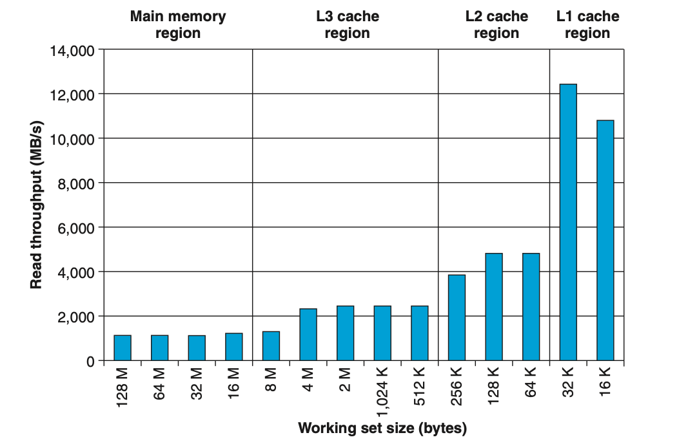

| 图 6.42 存储器山中的时间局部性山脊。该图展示了图 6.41 中步长 = 8 时的切片。 |
| :-------------------------------: |

若我们沿山体水平切片（保持步长不变，如图 6.42 所示），可以看到高速缓存容量和时间局部性对性能的影响。当 size 不超过 32 KB 时，工作集完全装入 L1 数据高速缓存，读操作以约 12 GB/s 的吞吐量由 L1 提供服务；当 size 不超过 256 KB 时，工作集完全装入统一 L2 高速缓存；当 size 不超过 8 MB 时，工作集完全装入统一 L3 高速缓存；更大的工作集则主要由主内存服务。

在 L2 和 L3 高速缓存区域的最左端（分别对应工作集大小等于各自容量 256 KB 和 8 MB 的位置），读吞吐量出现明显下降。目前尚不完全清楚下降的确切原因，只有通过详细的高速缓存仿真才能确认，但这些下降很可能是由与其他代码和数据行的冲突造成的。

沿相反方向（保持工作集大小不变）对存储器山切片，可以了解空间局部性对读吞吐量的影响。例如，图 6.43 展示了工作集固定为 4 MB 的切片，该切片沿图 6.41 中的 L3 山脊延伸——此时工作集完全装入 L3 高速缓存，但对 L2 而言过大。

注意，当步长从 1 增大到 8 个字时，读吞吐量稳步下降。在此区域，L2 不命中会导致一个块从 L3 传输到 L2，之后在该块中根据步长大小产生若干次命中。随着步长增大，L2 不命中与命中的比值也随之增大，而由于不命中比命中耗时更长，读吞吐量随之降低。

---

<!-- Page 0671 -->

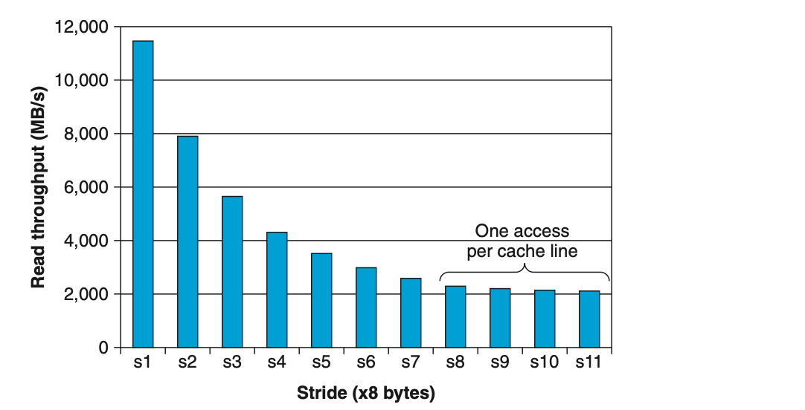

| 图 6.43 空间局部性坡面。该图展示了图 6.41 中 size = 4 MB 时的切片。 |
| :-------------------------------: |

一旦步长达到 8 个 8 字节的字（在本系统上等于 64 字节的块大小），每次读请求都会在 L2 中不命中，必须由 L3 服务。因此，步长至少为 8 时，读吞吐量为一个恒定值，由 L3 向 L2 传输高速缓存块的速率决定。

综上，存储器系统的性能并不能用单一数字来描述，而是一座随时间局部性和空间局部性变化、高低差可达一个数量级以上的"山"。明智的程序员应努力构建在山峰而非山谷处运行的程序，目标是利用时间局部性使频繁使用的字从 L1 高速缓存中取出，同时利用空间局部性使尽可能多的字从单条 L1 高速缓存行中访问。

---

**练习题 6.21（答案见第 702 页）**

利用图 6.41 中的存储器山，估计从 L1 数据高速缓存读取一个 16 字节字所需的 CPU 周期数。

---

### 6.6.2 重排循环以提高空间局部性

考虑两个 $n \times n$ 矩阵相乘的问题：$C = AB$。例如当 $n = 2$ 时：

$$
\begin{pmatrix}
c_{11} & c_{12} \\
c_{21} & c_{22}
\end{pmatrix}
=
\begin{pmatrix}
a_{11} & a_{12} \\
a_{21} & a_{22}
\end{pmatrix}
\begin{pmatrix}
b_{11} & b_{12} \\
b_{21} & b_{22}
\end{pmatrix}
$$

---

<!-- Page 0672 -->

$$c_{11}=a_{11}b_{11}+a_{12}b_{21}$$

$$c_{12}=a_{11}b_{12}+a_{12}b_{22}$$

$$c_{21}=a_{21}b_{11}+a_{22}b_{21}$$

$$c_{22}=a_{21}b_{12}+a_{22}b_{22}$$

矩阵乘法函数通常使用三层嵌套循环实现，分别由下标 $i$、$j$、$k$ 标识。通过对循环顺序进行全排列并作少量代码调整，可以得到图 6.44 所示的六个功能等价的矩阵乘法版本，每个版本由其循环顺序唯一标识。

从高层次来看，六个版本相当类似：若加法满足结合律，则每个版本计算出相同的结果。每个版本共执行 $O(n^3)$ 次操作，且加法和乘法次数相同；$A$ 和 $B$ 中每个 $n^2$ 个元素各被读取 $n$ 次；$C$ 的每个 $n^2$ 个元素通过对 $n$ 个值求和得到。然而，若分析最内层循环迭代的行为，会发现各版本在访问次数和局部性方面存在差异。为便于分析，我们作如下假设：

- 每个数组均为 $n \times n$ 的 `double` 数组，`sizeof(double) = 8`。
- 存在一个块大小为 32 字节（$B = 32$）的单一高速缓存。
- 数组大小 $n$ 足够大，单行矩阵数据无法装入 L1 高速缓存。
- 编译器将局部变量存储在寄存器中，因此循环内对局部变量的引用不需要任何 load 或 store 指令。

图 6.45 总结了内层循环分析的结果。注意，六个版本分为三个等价类，以内层循环中访问的矩阵对来命名。例如，版本 $ijk$ 和 $jik$ 属于 AB 类，因为它们在最内层循环中访问数组 $A$ 和 $B$（不访问 $C$）。对于每个类，我们统计了每次内层循环迭代的 load（读）次数和 store（写）次数，以及每次循环迭代中对 $A$、$B$、$C$ 的不命中引用次数，以及每次迭代的总不命中次数。

AB 类例程的内层循环（图 6.44(a) 和 (b)）以步长 1 扫描数组 $A$ 的某行。由于每个高速缓存块容纳四个 8 字节的字，对 $A$ 的不命中率为每迭代 0.25 次。而内层循环以步长 $n$ 扫描 $B$ 的某列——由于 $n$ 较大，每次访问数组 $B$ 都会不命中，共计每迭代 1.25 次不命中。

AC 类例程（图 6.44(c) 和 (d)）的内层循环存在一些问题：每次迭代执行两次 load 和一次 store（相比之下，AB 类例程每次迭代执行两次 load、无 store）。此外，内层循环以步长 $n$ 扫描 $A$ 和 $C$ 的列，导致每次 load 都不命中，共计每迭代 2 次不命中。注意，循环顺序的调换降低了与 AB 类例程相比的空间局部性。

---

<!-- Page 0673 -->

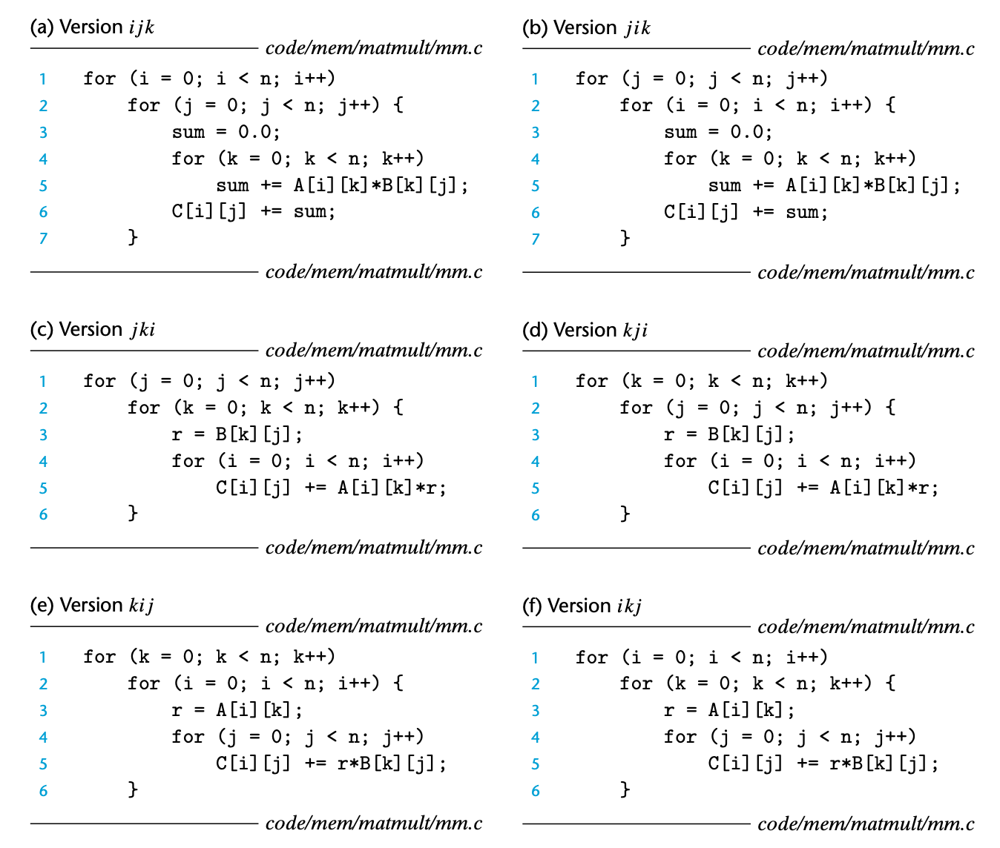

| 图 6.44 矩阵乘法的六个版本。每个版本由其循环顺序唯一标识。 |
| :-------------------------------: |

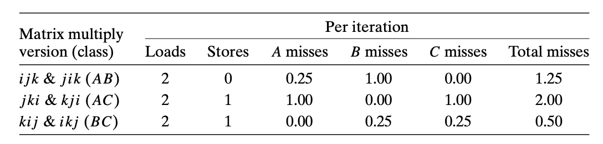

| 图 6.45 矩阵乘法内层循环分析。六个版本分为三个等价类，以内层循环中访问的矩阵对命名。 |
| :-------------------------------: |

---

<!-- Page 0674 -->

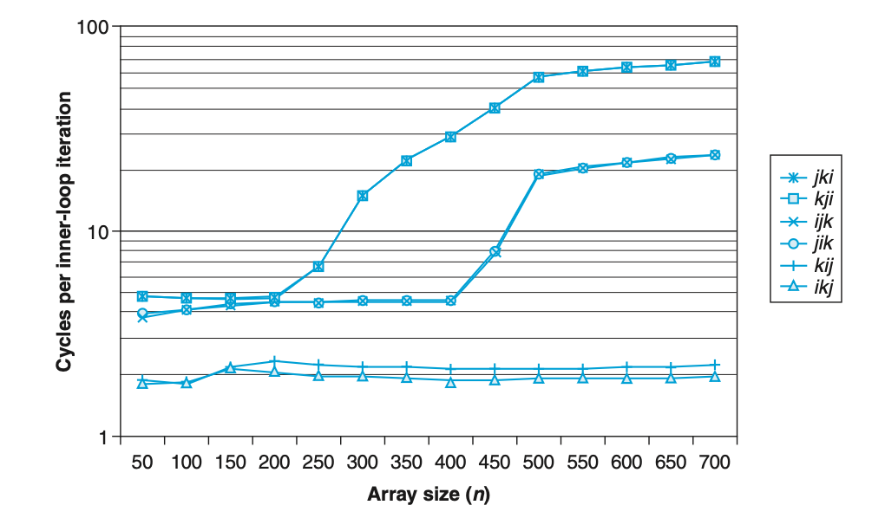

| 图 6.46 Core i7 矩阵乘法性能。 |
| :-------------------------------: |

BC 类例程（图 6.44(d) 和 (e)）呈现了一个有趣的权衡：它们需要两次 load 和一次 store，比 AB 类例程多一次内存操作；但由于内层循环以步长 1 行主序扫描 $B$ 和 $C$，每个数组的不命中率仅为每迭代 0.25 次，合计每迭代 0.50 次不命中。

图 6.46 总结了不同版本矩阵乘法在 Core i7 系统上的性能，图中绘制了不同数组大小 $n$ 下每次内层循环迭代所测的 CPU 周期数。

该图有几点值得关注：

- 当 $n$ 较大时，最快版本比最慢版本快约 40 倍，尽管两者执行相同数量的浮点运算。
- 每次迭代内存引用次数和不命中次数相同的版本对，性能几乎完全相同。
- 从每次迭代的访问次数和不命中次数来看，内存行为最差的两个版本比其他四个版本（不命中次数或访问次数更少）慢得多。
- 在本例中，不命中率比总内存访问次数更能预测性能。例如，每迭代 0.5 次不命中的 BC 类例程，性能远好于每迭代 1.25 次不命中的 AB 类例程，尽管 BC 类例程在内部循环中执行的内存引用次数（两次加载和一次存储）多于 AB 类例程（两次加载）。

---

<!-- Page 0675 -->

>**旁注 MEM:BLOCKING 利用分块提高时间局部性**
>
>有一种称为**分块 (blocking)** 的有趣技术，可以提高内层循环的时间局部性。分块的基本思路是将程序中的数据结构组织为称为块 (block) 的大型数据片段（注意，此处的"块"指的是应用层面的数据片段，而非高速缓存块）。程序的结构使其先将一个块装入 L1 高速缓存，对该块执行所有需要的读写操作，然后丢弃该块，装入下一块，如此反复。
>
>与改善空间局部性的简单循环变换不同，分块会使代码更难阅读和理解。因此，它最适合用于优化编译器或频繁执行的库例程。由于 Core i7 复杂的预取硬件，分块并不能提高其矩阵乘法性能。然而，该技术仍值得学习和理解，因为它是一个通用概念，在不支持预取的系统上可以带来显著的性能提升。

- 当 $n$ 较大时，最快版本对（kij 和 ikj）的性能保持稳定。即使数组远大于所有 SRAM 高速缓存，预取硬件也足够智能，能识别步长为 1 的访问模式，并足够快地跟上紧密内层循环中的内存访问。这是 Intel 工程师在设计该存储器系统方面的杰出成就，为程序员开发具有良好空间局部性的程序提供了更多激励。

### 6.6.3 在程序中利用局部性

如我们所见，存储器系统被组织为存储设备的层次结构，体积更小、速度更快的设备位于顶部，体积更大、速度更慢的设备位于底部。由于这种层次结构，程序访问内存地址的有效速率不能用单一数字描述，而是一个随程序局部性（即我们所称的存储器山）剧烈变化、可达数量级差异的函数。具有良好局部性的程序主要从快速的高速缓存存储器中取数据；而局部性较差的程序则主要从相对缓慢的 DRAM 主内存中取数据。

理解存储器层次结构本质的程序员可以利用这种理解，编写更高效的程序，而无需关心具体的存储器系统组织方式。特别地，我们推荐以下技术：

- 将注意力集中在内层循环上，因为大部分计算和内存访问都发生在那里。
- 通过按内存中存储的顺序，以步长 1 顺序读取数据对象，尽量提高程序的空间局部性。
- 通过尽可能多次地使用某个数据对象，尽量提高程序的时间局部性。

---

<!-- Page 0676 -->

## 6.7 总结

基本的存储技术包括随机访问存储器 (RAM)、非易失性存储器 (ROM) 和磁盘。RAM 有两种基本形式。静态 RAM (SRAM) 速度更快、价格更贵，用于高速缓存存储器。动态 RAM (DRAM) 速度较慢、价格较低，用于主内存和图形帧缓冲区。ROM 在断电后仍能保留信息，用于存储固件。旋转磁盘是一种机械式非易失性存储设备，可以极低的每位成本存储海量数据，但访问时间远长于 DRAM。基于非易失性闪存的固态硬盘 (SSD) 正日益成为某些应用场景中旋转磁盘的有吸引力替代品。

一般而言，速度更快的存储技术每位成本更高、容量更小。这些技术的价格和性能特性以截然不同的速率变化。特别是，DRAM 和磁盘的访问时间远大于 CPU 周期时间。系统通过将内存组织为存储设备的层次结构来弥合这些差距——体积更小、速度更快的设备位于顶部，体积更大、速度更慢的设备位于底部。由于精心编写的程序具有良好的局部性，大多数数据都从较高层次取得，效果上形成一个以较高层次速率运行、却具有较低层次成本和容量的存储器系统。

程序员可以通过编写具有良好空间局部性和时间局部性的程序，显著提高程序的运行速度。充分利用基于 SRAM 的高速缓存存储器尤为重要。主要从高速缓存取数据的程序，运行速度可以远超主要从内存取数据的程序。

### 参考文献注释

内存和磁盘技术更新迅速。根据我们的经验，最佳技术信息来源是各制造商维护的网页。Micron、东芝 (Toshiba) 和三星 (Samsung) 等公司提供了大量内存器件的最新技术信息；希捷 (Seagate) 和西部数据 (Western Digital) 的页面则提供了同样有用的磁盘信息。

电路与逻辑设计教材提供了关于内存技术的详细信息 [58, 89]。IEEE Spectrum 发表了一系列关于 DRAM 的综述文章 [55]。计算机体系结构国际研讨会 (ISCA) 和高性能计算机体系结构研讨会 (HPCA) 是表征 DRAM 内存性能的常见论坛 [28, 29, 18]。

Wilkes 撰写了关于高速缓存存储器的最早论文 [117]，Smith 撰写了一篇经典综述 [104]，Przybylski 撰写了一本关于高速缓存设计的权威著作 [86]，Hennessy 和 Patterson 对高速缓存设计问题进行了全面讨论 [46]，Levinthal 撰写了关于 Intel Core i7 的全面性能指南 [70]。

Stricker 在 [112] 中引入了存储器山的概念，作为存储器系统的综合表征，并在后续的工作报告中非正式地提出了"存储器山"这一术语。编译器研究人员通过自动执行我们在第 6.6 节中讨论的那些手动代码变换，研究人员已做了大量工作来提高局部性 [22, 32, 66, 72, 79, 87, 119]。Carter 等人提出了一种高速缓存感知内存控制器 [17]。其他研究人员开发了**高速缓存无关** (cache-oblivious) 算法，这类算法无需显式了解底层高速缓存结构即可高效运行 [30, 38, 39, 9]。

---

<!-- Page 0677 -->

关于磁盘存储的构建与使用，存在大量文献。许多存储研究人员寻求将单块磁盘聚合为更大、更健壮、更安全的存储池的方法 [20, 40, 41, 83, 121]；另一些研究人员则致力于利用高速缓存和局部性来提高磁盘访问性能 [12, 21]。Exokernel 等系统提供了对磁盘和内存资源更强的用户级控制 [57]；Andrew File System [78] 和 Coda [94] 等系统将存储器层次结构扩展至计算机网络和移动笔记本电脑。Schindler 和 Ganger 开发了一个有趣的工具，可以自动表征 SCSI 磁盘驱动器的几何结构和性能 [95]。研究人员还研究了构建和使用基于闪存的 SSD 的技术 [8, 81]。

## 课后习题

**习题 6.22 ◆◆**

假设你被要求设计一个每条磁道位数恒定的旋转磁盘。你知道每条磁道的位数由最内侧磁道的周长决定（可以假设其等于中心孔的周长）。因此，如果把盘片中心的孔做得更大，每条磁道的位数增加，但磁道总数减少。设 $r$ 为盘片半径，$x \cdot r$ 为孔的半径，问 $x$ 取何值时磁盘容量最大？

---

**习题 6.23 ◆**

估计访问以下磁盘上某扇区的平均时间（单位：ms）：

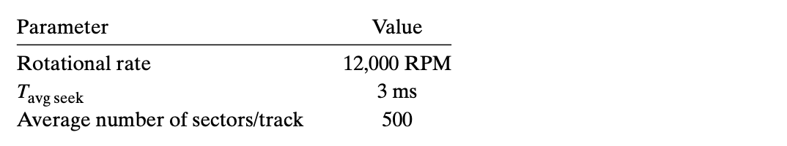

---

**习题 6.24 ◆◆**

假设一个由 512 字节逻辑块组成的 2 MB 文件存储在具有以下特性的磁盘驱动器上：

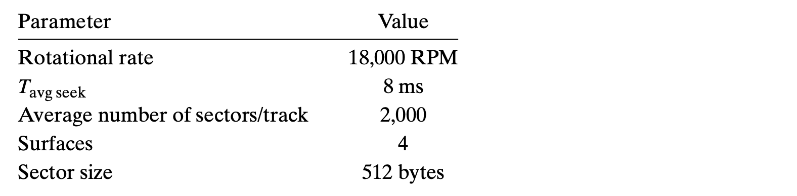

---

<!-- Page 0678 -->

在以下各种情况下，假设程序按顺序逐一读取文件的逻辑块，且定位磁头到第一块所需时间为 $T_{avg\ seek} + T_{avg\ rotation}$。

A. **最佳情况**：在逻辑块到磁盘扇区的最优映射（即顺序映射）下，估计读取文件所需的最短时间（ms）。

B. **随机情况**：若块被随机映射到磁盘扇区，估计读取文件所需时间（ms）。

---

**习题 6.25 ◆**

下表给出了若干不同高速缓存的参数。请填写表中缺少的字段。其中 $m$ 为物理地址位数，$C$ 为高速缓存容量（数据字节数），$B$ 为块大小（字节），$E$ 为相联度，$S$ 为组数，$t$ 为标记位数，$s$ 为组索引位数，$b$ 为块偏移位数。

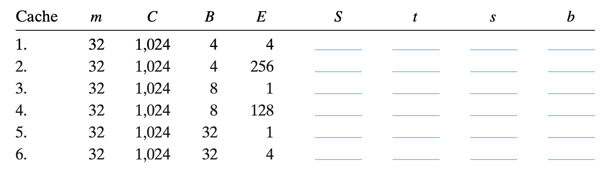

---

**习题 6.26 ◆**

下表给出了若干不同高速缓存的参数，请填写缺少的字段（参数含义同习题 6.25）。

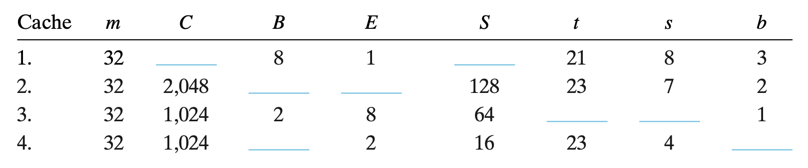

---

**习题 6.27 ◆**

本题涉及练习题 6.12 中的高速缓存。

A. 列出所有命中组 1 的十六进制内存地址。

B. 列出所有命中组 6 的十六进制内存地址。

---

**习题 6.28 ◆◆**

本题涉及练习题 6.12 中的高速缓存。

A. 列出所有命中组 2 的十六进制内存地址。

---

<!-- Page 0679 -->

B. 列出所有命中组 4 的十六进制内存地址。

C. 列出所有命中组 5 的十六进制内存地址。

D. 列出所有命中组 7 的十六进制内存地址。

---

**习题 6.29 ◆◆**

假设有一个具有以下属性的系统：

- 内存按字节寻址。
- 内存访问针对 1 字节的字（而非 4 字节的字）。
- 地址宽度为 12 位。
- 高速缓存为二路组相联（$E = 2$），块大小为 4 字节（$B = 4$），共 4 个组（$S = 4$）。

高速缓存内容如下，所有地址、标记和值均以十六进制表示：

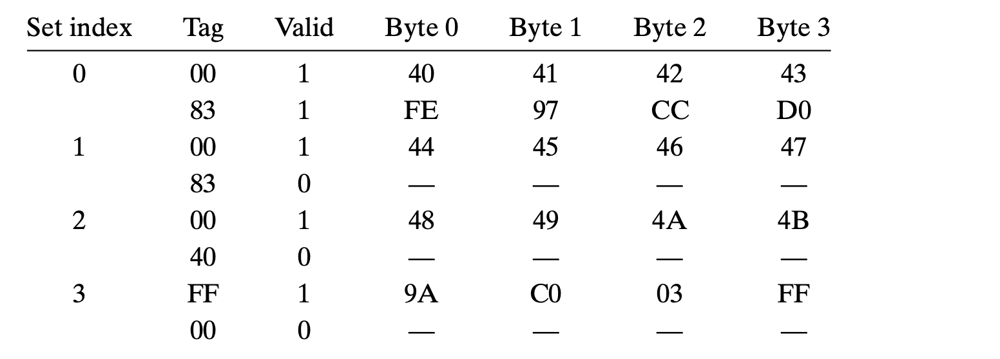

A. 下图展示了地址格式（每格 1 位），请标注用于确定以下各项的位域：

    CO：高速缓存块偏移；

    CI：高速缓存组索引；

    CT：高速缓存标记

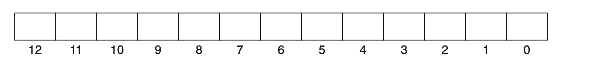

B. 对于以下按顺序执行的内存访问，指出每次是否命中，若为读操作且可从高速缓存信息推断出值则给出该值。


---

<!-- Page 0680 -->

**习题 6.30 ◆**

假设有一个具有以下属性的系统：

- 内存按字节寻址。
- 内存访问针对 1 字节的字。
- 地址宽度为 13 位。
- 高速缓存为四路组相联（$E = 4$），块大小为 4 字节（$B = 4$），共 8 个组（$S = 8$）。

高速缓存内容如下（所有地址、标记和值均以十六进制给出）。Index 列包含每组的组索引；Tag 列包含每行的标记；V 列包含有效位；Bytes 0-3 列包含每行的数据（从左到右，字节 0 在最左）。

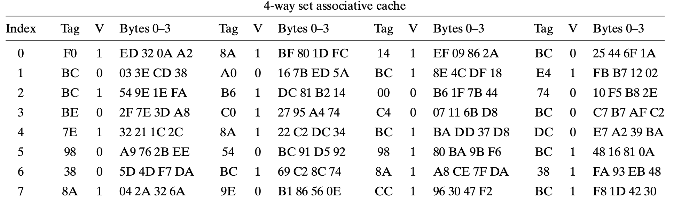

A. 该高速缓存的容量 $C$（字节数）是多少？

B. 下框展示了地址格式（每格 1 位），请标注用于确定以下各项的位域：

    CO：高速缓存块偏移；

    CI：高速缓存组索引；

    CT：高速缓存标记

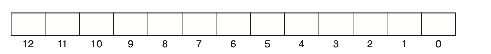

---

**习题 6.31 ◆◆**

假设使用习题 6.30 中高速缓存的程序访问地址 0x071A 处的 1 字节字。指出所访问的高速缓存条目和以十六进制返回的高速缓存字节值，并指出是否发生不命中。若不命中，在"Cache byte returned"处填入"—"。提示：注意有效位！

---

<!-- Page 0681 -->

A. 地址格式（每格 1 位）：

B. 内存引用：

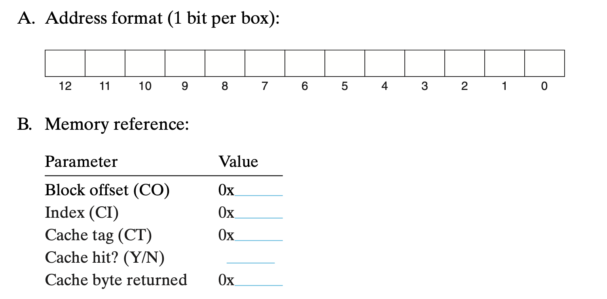

---

**习题 6.32 ◆◆**

对内存地址 0x16E8 重复习题 6.31。

A. 地址格式（每格 1 位）：

B. 内存引用：

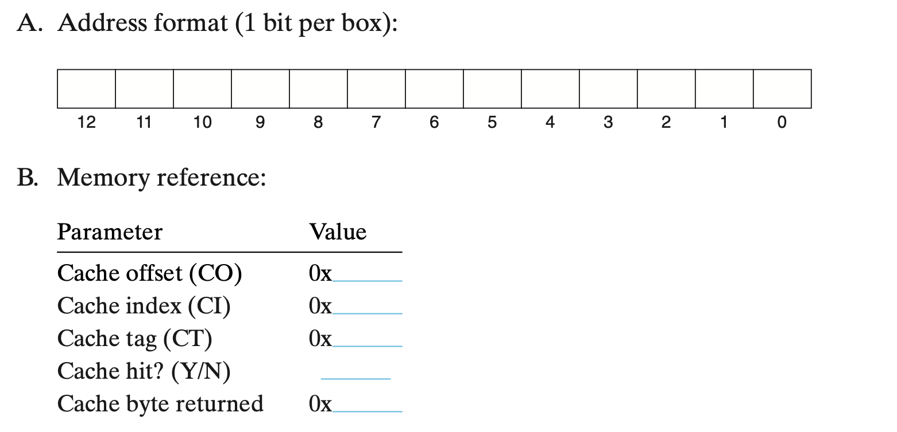

---

**习题 6.33 ◆◆**

对于习题 6.30 中的高速缓存，列出命中组 2 的所有内存地址（十六进制，共 8 个）。

---

**习题 6.34 ◆◆**

考虑如下矩阵转置例程：

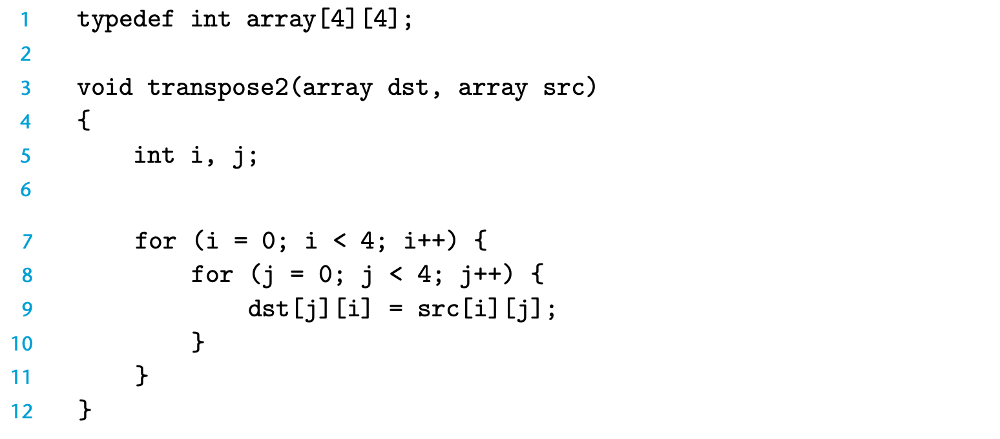

---

<!-- Page 0682 -->

假设该代码在具有以下属性的机器上运行：

- `sizeof(int) = 4`。
- `src` 数组从地址 0 开始，`dst` 数组从地址 64（十进制）开始。
- 存在一个单路 L1 数据高速缓存，直接映射，直写，写分配，块大小为 16 字节。
- 高速缓存总数据容量为 32 字节，且初始为空。
- 对 `src` 和 `dst` 数组的访问分别是读不命中和写不命中的唯一来源。

A. 对每个 row 和 col，指出对 `src[row][col]` 和 `dst[row][col]` 的访问是命中 (h) 还是不命中 (m)。例如，读 `src[0][0]` 是不命中，写 `dst[0][0]` 也是不命中。

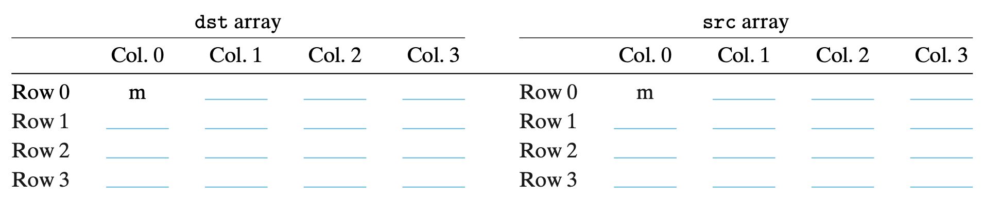

---

**习题 6.35 ◆◆**

对总数据容量为 128 字节的高速缓存重复习题 6.34。

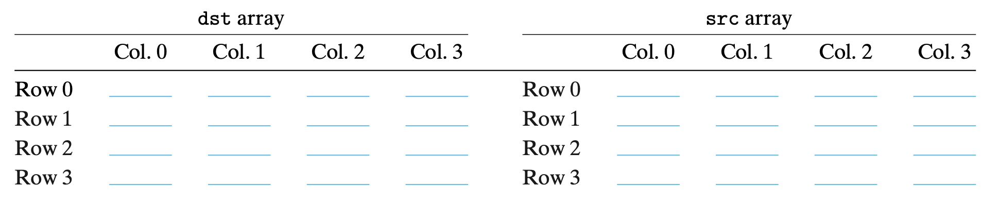

---

**习题 6.36 ◆◆**

本题测试你分析 C 代码高速缓存行为的能力。给定以下代码进行分析：

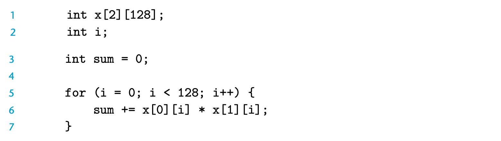

---

<!-- Page 0683 -->

假设在以下条件下执行：

- `sizeof(int) = 4`。
- 数组 `x` 从内存地址 0x0 开始，以行主序存储。
- 以下各情况中，高速缓存初始均为空。
- 唯一的内存访问是对数组 `x` 元素的访问，所有其他变量存储在寄存器中。

在上述假设下，估计以下各情况的不命中率：

A. **情况 1**：高速缓存为 512 字节，直接映射，16 字节高速缓存块。不命中率是多少？

B. **情况 2**：若高速缓存容量翻倍为 1024 字节，不命中率是多少？

C. **情况 3**：高速缓存为 512 字节，二路组相联，采用 LRU 替换策略，16 字节高速缓存块。高速缓存不命中率是多少？

D. 对于情况 3，更大的高速缓存容量能否降低不命中率？为什么？

E. 对于情况 3，更大的块大小能否降低不命中率？为什么？

---

**习题 6.37 ◆◆**

本题进一步测试你分析 C 代码高速缓存行为的能力。假设在以下条件下执行图 6.47 中的三个求和函数：

- `sizeof(int) = 4`。
- 机器配有 4 KB 直接映射高速缓存，块大小为 16 字节。
- 在两层循环中，代码只对数组数据进行内存访问；循环下标和 `sum` 值存储在寄存器中。
- 数组 `a` 从内存地址 0x08000000 开始存储。

填写下表，给出 $N = 64$ 和 $N = 60$ 两种情况下的近似高速缓存不命中率。

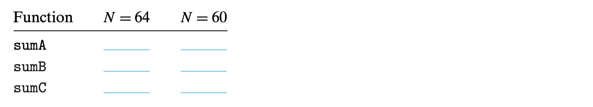

---

<!-- Page 0684 -->

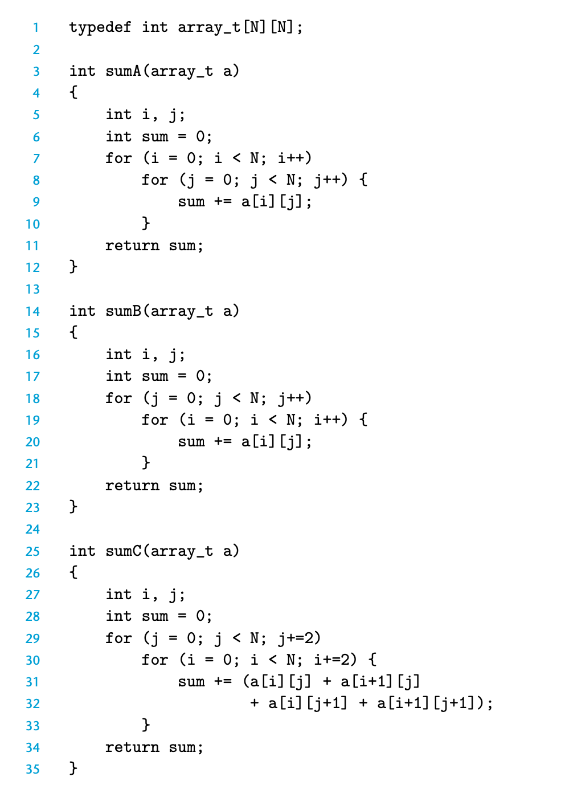

| 图 6.47 习题 6.37 中引用的函数。 |
| :-------------------------------: |

---

**习题 6.38 ◆**

3M 公司决定通过在白纸上印黄色方块来制造便利贴。作为印刷过程的一部分，需要为方块中的每个点设置 CMYK（青、品红、黄、黑）值。3M 聘请你来确定以下算法在配有 1024 字节直接映射数据高速缓存（块大小为 16 字节）的机器上的效率。给定如下定义：

---

<!-- Page 0685 -->

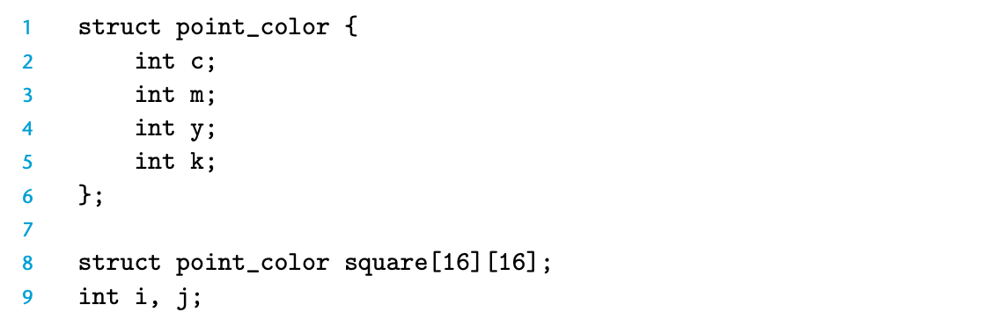

假设以下条件：
- `sizeof(int) = 4`。
- `square` 从内存地址 0 开始。
- 高速缓存初始为空。
- 唯一的内存访问是对数组 `square` 元素的访问；变量 `i` 和 `j` 存储在寄存器中。

确定以下代码的高速缓存性能：

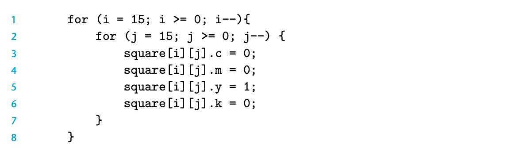

A. 写操作总次数是多少？

B. 命中的写操作次数是多少？

C. 命中率是多少？

---

**习题 6.39 ◆**

基于习题 6.38 的假设，确定以下代码的高速缓存性能：

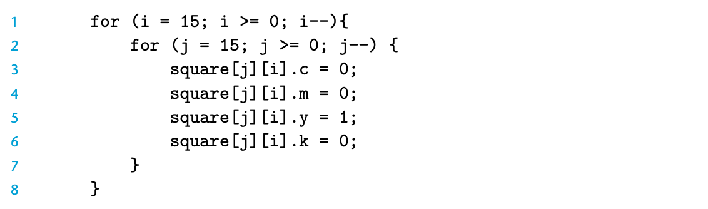

---

<!-- Page 0686 -->

A. 写操作总次数是多少？

B. 命中的写操作次数是多少？

C. 命中率是多少？

---

**习题 6.40 ◆**

基于习题 6.38 的假设，确定以下代码的高速缓存性能：

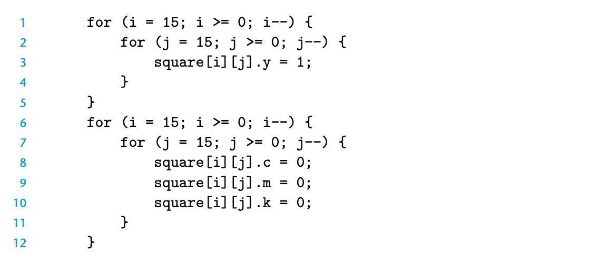

A. 写操作总次数是多少？

B. 命中的写操作次数是多少？

C. 命中率是多少？

---

**习题 6.41 ◆◆**

你正在编写一款希望为你带来名声和财富的新 3D 游戏。你目前正在开发一个在绘制下一帧之前清空屏幕缓冲区的函数。你所用的屏幕是一个 $640 \times 480$ 的像素数组。机器配有 32 KB 直接映射高速缓存，高速缓存行大小为 8 字节。你使用的 C 结构体如下：

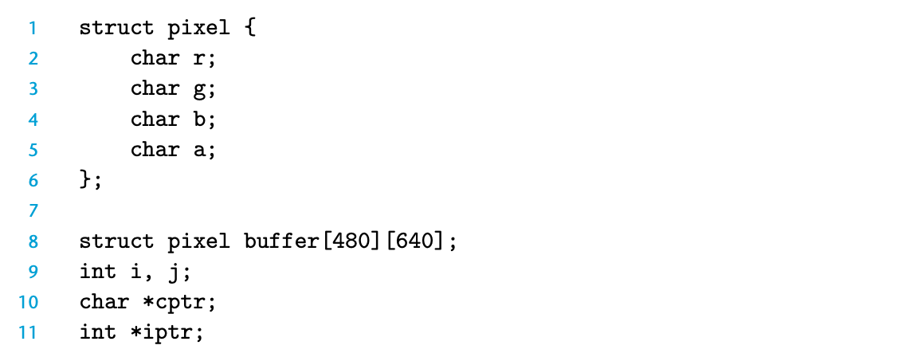

假设：
- `sizeof(char) = 1`，`sizeof(int) = 4`

---

<!-- Page 0687 -->

- `buffer` 从内存地址 0 开始。
- 高速缓存初始为空。
- 唯一的内存访问是对数组 `buffer` 的元素进行的。变量 `i`、`j`、`cptr` 和 `iptr` 存储在寄存器中。

以下代码中，写操作有多少百分比会命中高速缓存？

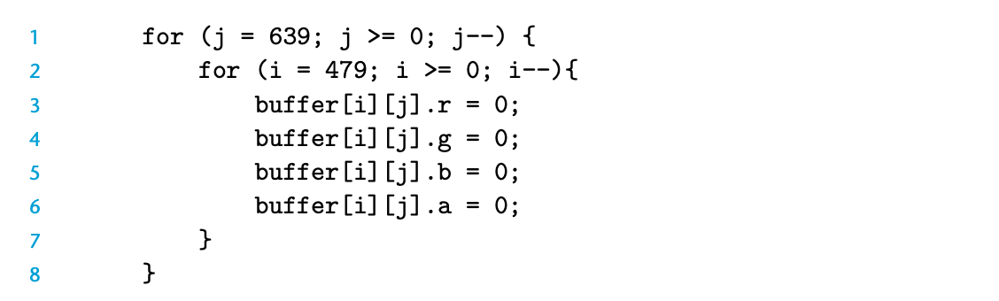

---

**习题 6.42 ◆◆**

在习题 6.41 的假设条件下，以下代码中写操作有多少百分比会命中高速缓存？

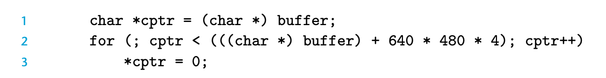

---

**习题 6.43 ◆◆**

在习题 6.41 的假设条件下，以下代码中写操作有多少百分比会命中高速缓存？


---

**习题 6.44 ◆◆◆**

从 CS:APP 官方网站下载 mountain 程序并在你的 PC/Linux 系统上运行。利用结果估算你的系统中各级高速缓存的大小。

---

**习题 6.45 ◆◆◆◆**

在本题中，你将把第 5 章和第 6 章所学的概念应用于内存密集型应用的代码优化问题。考虑一个将 $N \times N$ 的 `int` 类型矩阵的元素复制并转置的过程。即对于源矩阵 $S$ 和目标矩阵 $D$，我们希望将每个元素 $s_{i,j}$ 复制到 $d_{j,i}$。该代码可以用简单的循环来实现：

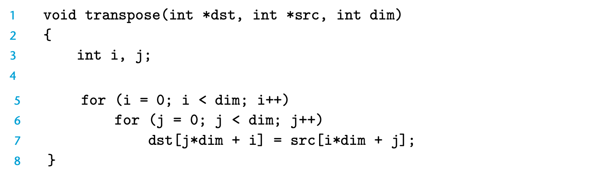

---

<!-- Page 0688 -->

其中，过程的参数是指向目标矩阵（`dst`）和源矩阵（`src`）的指针，以及矩阵大小 $N$（`dim`）。你的任务是设计一个运行尽可能快的转置程序。

---

**习题 6.46 ◆◆◆◆**

本题是习题 6.45 的一个有趣变体。考虑将有向图 $g$ 转换为其无向对应图 $g'$ 的问题。当且仅当原图 $g$ 中存在从 $u$ 到 $v$ 或从 $v$ 到 $u$ 的边时，图 $g'$ 中才有从顶点 $u$ 到顶点 $v$ 的边。图 $g$ 由其邻接矩阵 $G$ 表示，规则如下：若 $g$ 中有 $N$ 个顶点，则 $G$ 是一个 $N \times N$ 矩阵，其元素全为 0 或 1。设 $g$ 的顶点命名为 $v_{0}, v_{1}, v_{2}, \ldots, v_{N-1}$，则当存在从 $v_i$ 到 $v_j$ 的边时 $G[i][j]=1$，否则为 0。注意，邻接矩阵对角线上的元素始终为 1，且无向图的邻接矩阵是对称的。该代码可以用简单的循环来实现：

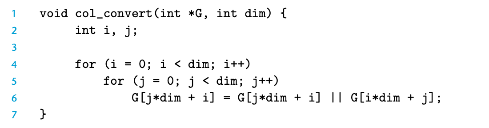

你的任务是设计一个运行尽可能快的转换程序。与之前一样，你需要应用第 5 章和第 6 章所学的概念来得出一个好的解决方案。

## 练习题答案

**练习题 6.1 解答（第 620 页）**

这里的思路是通过最小化长宽比 $\max(r, c)/\min(r, c)$ 来减少地址位数。换句话说，数组越接近正方形，所需的地址位数就越少。

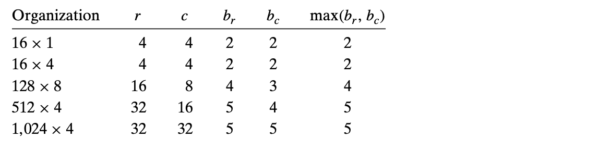

---

<!-- Page 0689 -->

**练习题 6.2 解答（第 628 页）**

这道小练习的要点是确保你理解柱面与磁道之间的关系。一旦理清这一点，只需代入公式计算即可：

$$\begin{aligned}\text{磁盘容量}&=\frac{1{,}024\ \text{字节}}{\text{扇区}}\times\frac{500\ \text{扇区}}{\text{磁道}}\times\frac{15{,}000\ \text{磁道}}{\text{盘面}}\times\frac{2\ \text{盘面}}{\text{盘片}}\times\frac{3\ \text{盘片}}{\text{磁盘}}\\&=46{,}080{,}000{,}000\ \text{字节}\\&=46.08\ \text{GB}\end{aligned}$$

---

**练习题 6.3 解答（第 631 页）**

本题的解答是对磁盘访问时间公式的直接应用。平均旋转延迟（毫秒）为：

$$\begin{aligned}T_{avg\ rotation}&=1/2\times T_{max\ rotation}\\&=1/2\times(60\ \text{秒}/12{,}000\ \text{RPM})\times 1{,}000\ \text{ms/秒}\\&\approx 2.5\ \text{ms}\end{aligned}$$

平均传输时间为：

$$\begin{aligned}T_{avg\ transfer}&=(60\ \text{秒}/12{,}000\ \text{RPM})\times 1/300\ \text{扇区/磁道}\times 1{,}000\ \text{ms/秒}\\&\approx 0.016\ \text{ms}\end{aligned}$$

综合以上，总估计访问时间为：

$$\begin{aligned}T_{access}&=T_{avg\ seek}+T_{avg\ rotation}+T_{avg\ transfer}\\&=5\ \text{ms}+2.5\ \text{ms}+0.016\ \text{ms}\\&\approx 7.516\ \text{ms}\end{aligned}$$

---

**练习题 6.4 解答（第 631 页）**

本题能很好地检验你对影响磁盘性能因素的理解。首先，我们需要确定文件和磁盘的一些基本参数。该文件由 10,000 个 512 字节的逻辑块组成。对于该磁盘，$T_{avg\ seek} = 6$ ms，$T_{max\ rotation} = 4.61$ ms，$T_{avg\ rotation} = 2.30$ ms。

A. 最优情况：在最优情况下，这些块被映射到相邻的扇区，位于同一柱面上，可以依次读取而无需移动磁头。一旦磁头定位到第一个扇区，只需磁盘旋转两圈（每圈 5,000 个扇区）即可读取全部 10,000 个块。因此，读取文件的总时间为 $T_{avg\ seek} + T_{avg\ rotation} + 2 \times T_{max\ rotation} = 6 + 2.30 + 9.22 = 17.52$ ms。

B. 随机情况：在此情况下，块被随机映射到扇区，读取 10,000 个块中的每一个都需要 $T_{avg\ seek} + T_{avg\ rotation}$ ms，因此读取文件的总时间为 $(T_{avg\ seek} + T_{avg\ rotation}) \times 10{,}000 = 83{,}000$ ms（即 83 秒！）。

由此可见，对磁盘进行碎片整理往往是个好主意！

---

<!-- Page 0690 -->

**练习题 6.5 解答（第 637 页）**

本题是一道简单的习题，能让你对固态硬盘（SSD）的可行性有一些有趣的认识。回想一下，对于磁盘，$1\ \text{PB} = 10^{9}\ \text{MB}$。以下是对各种情况的单位换算所得出的预测时间：

A. 最坏情况下的顺序写入（520 MB/s）：

$(10^{9} \times 128) \times (1/520) \times (1/(86{,}400 \times 365)) \approx 7\ \text{年}$

B. 最坏情况下的随机写入（205 MB/s）：

$(10^{9} \times 128) \times (1/205) \times (1/(86{,}400 \times 365)) \approx 19\ \text{年}$

C. 平均情况（50 GB/天）：

$$(10^{9}\times 128)\times(1/50{,}000)\times(1/365)\approx 6{,}912\ \text{年}$$

因此，即使 SSD 持续运行，它至少也能使用 7 年，这比大多数计算机的预期使用寿命还要长。

---

**练习题 6.6 解答（第 640 页）**

在 2005 年到 2015 年的 10 年间，旋转磁盘的单位价格下降了 166 倍，这意味着价格大约每 18 个月下降约 2 倍。假设这一趋势持续，2015 年约需 $30,000 的 PB 级存储，在经历约 8 次这样的价格减半后将降至 200 美元以下。由于每次减半约需 18 个月，我们预计 PB 级存储价格将在约 2027 年降至 200 美元左右。

---

**练习题 6.7 解答（第 644 页）**

为了创建步长为 1 的引用模式，必须对循环进行排列，使最右边的下标变化最快。

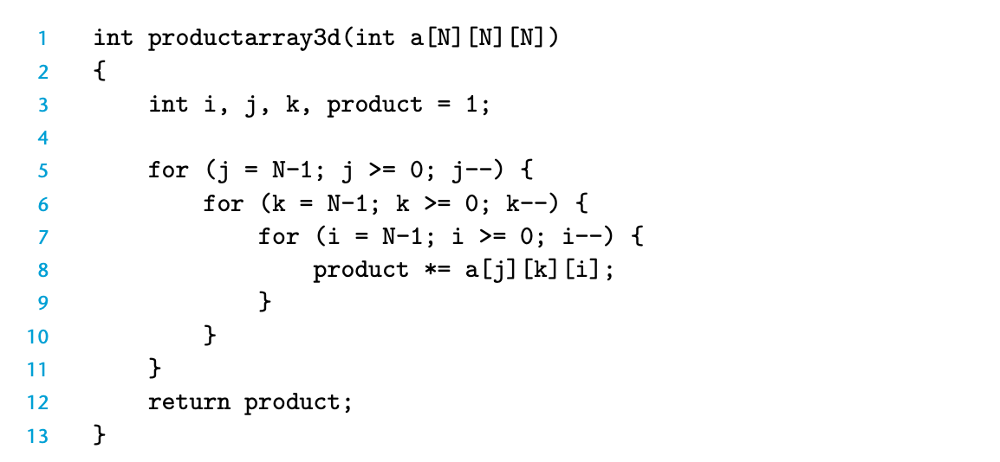

这是一个重要的思想，请确保你理解为什么这种特定的循环

---

<!-- Page 0691 -->

**练习题 6.8 解答（第 645 页）**

解决这道题的关键是在脑海中想象数组在内存中的布局，然后分析引用模式。函数 `clear1` 使用步长为 1 的引用模式访问数组，因此显然具有最好的空间局部性。函数 `clear2` 依次扫描 $N$ 个结构体，这是好的，但在每个结构体内部，它以非步长为 1 的方式跳跃访问，偏移量依次为：0、12、4、16、8、20。因此 `clear2` 的空间局部性比 `clear1` 差。函数 `clear3` 不仅在每个结构体内部跳跃访问，还在结构体之间跳跃。因此 `clear3` 的空间局部性比 `clear2` 和 `clear1` 都差。

---

**练习题 6.9 解答（第 652 页）**

本题的解答是对图 6.26 中各高速缓存参数定义的直接应用。虽然不是很有趣，但在真正理解高速缓存工作原理之前，你需要先理解高速缓存的组织方式是如何将地址位划分成不同分区的。

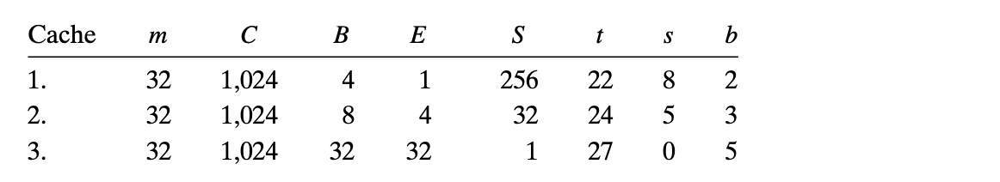

---

**练习题 6.10 解答（第 660 页）**

填充消除了冲突不命中。因此，四分之三的引用是命中的。

---

**练习题 6.11 解答（第 660 页）**

有时，理解为什么某种做法是坏主意，有助于你理解为什么另一种做法是好主意。这里，我们考察的坏主意是用高位比特而非中间位比特来索引高速缓存。

A. 使用高位比特索引时，每个连续的数组块由 $2^{t}$ 个块组成，其中 $t$ 是标记位数。因此，数组的前 $2^{t}$ 个连续块映射到组 0，接下来的 $2^{t}$ 个块映射到组 1，以此类推。

B. 对于参数为 $(S, E, B, m) = (512, 1, 32, 32)$ 的直接映射高速缓存，高速缓存容量为 512 个 32 字节的块，每个缓存行中有 $t = 18$ 个标记位。因此，数组中的前 $2^{18}$ 个块将映射到组 0，接下来的 $2^{18}$ 个块映射到组 1。由于我们的数组只有 $(4{,}096 \times 4)/32 = 512$ 个块，数组中所有的块都映射到组 0。因此，任何时刻高速缓存最多只能保存 1 个数组块，即使该数组小到足以完全放入高速缓存中。显然，使用高位比特索引会导致高速缓存利用率极低。

---

**练习题 6.12 解答（第 664 页）**

最低 2 位是块偏移（CO），其后是 3 位组索引（CI），其余位作为标记（CT）：

---

<!-- Page 0692 -->

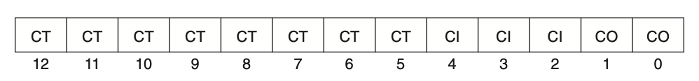

---

**练习题 6.13 解答（第 664 页）**

地址：0x0D53

A. 地址格式（每格 1 位）：

B. 内存引用：

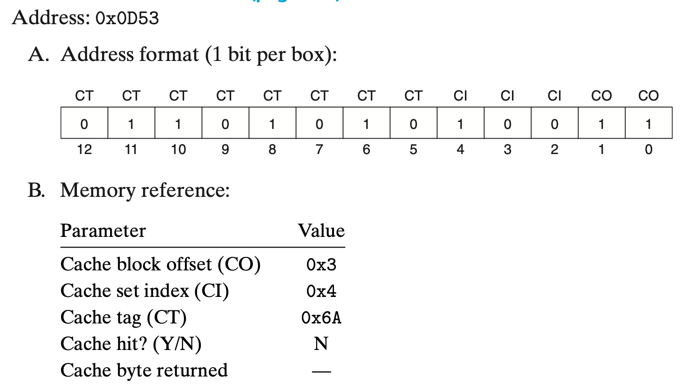

---

**练习题 6.14 解答（第 665 页）**

地址：0x0CB4

A. 地址格式（每格 1 位）：

B. 内存引用：

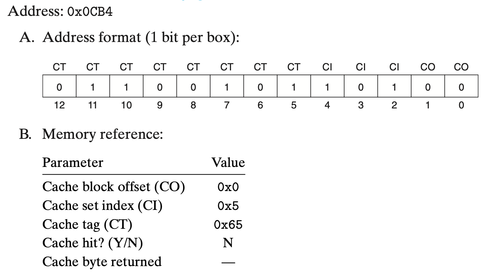

---

**练习题 6.15 解答（第 665 页）**

地址：0x0A31

A. 地址格式（每格 1 位）：

B. 内存引用：

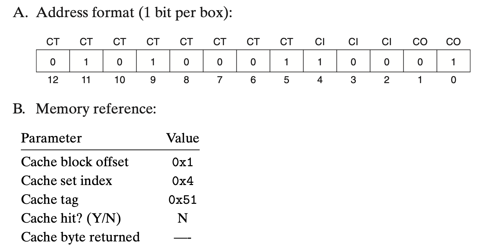

---

<!-- Page 0693 -->

**练习题 6.16 解答（第 666 页）**

本题是练习题 6.12–6.15 的逆向版本，要求你从高速缓存的内容反推出会命中特定组的地址。在此情况下，组 3 包含一个有效行，其标记为 0x32。由于该组中只有一个有效行，有四个地址会命中。这些地址的二进制形式为 0 0110 0100 11xx。因此，命中组 3 的四个十六进制地址为：

```
0x064C、0x064D、0x064E 和 0x064F
```

---

**练习题 6.17 解答（第 672 页）**

A. 解决本题的关键是想象图 6.48 所示的场景。注意每个缓存行恰好容纳数组的一行，高速缓存的大小恰好能容纳一个数组，且对于所有 $i$，`src` 的第 $i$ 行和 `dst` 的第 $i$ 行映射到同一个缓存行。由于高速缓存太小无法同时容纳两个数组，对一个数组的引用会不断驱逐另一个数组的有用缓存行。例如，写 `dst[0][0]` 时会驱逐读取 `src[0][0]` 时加载的缓存行。因此，当我们接下来读取 `src[0][1]` 时会发生不命中。

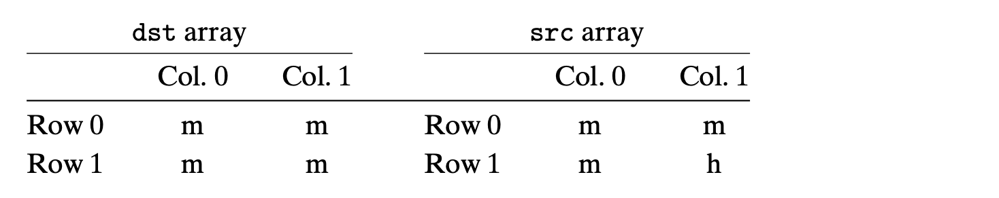

B. 当高速缓存为 32 字节时，它足以容纳两个数组。因此，唯一的不命中是初始的冷不命中。

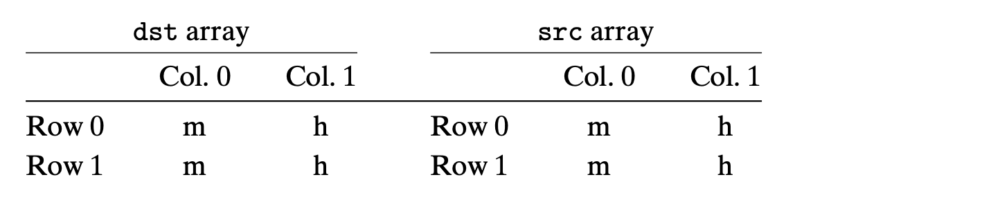

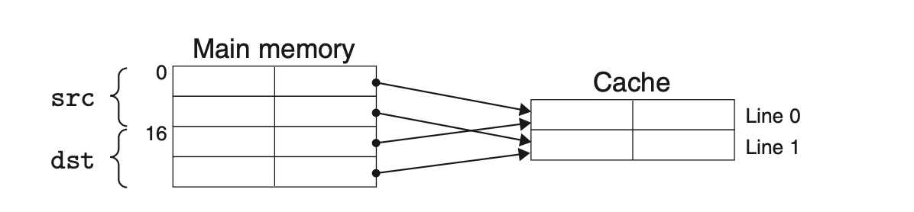

| 图 6.48 习题 6.17 的解答示意图。 |
| :-------------------------------: |

---

<!-- Page 0694 -->

**练习题 6.18 解答（第 673 页）**

每个 32 字节的缓存行容纳两个相邻的 `algae_position` 结构体。每个循环按内存顺序访问这些结构体，每次读取一个整型元素。因此每个循环的访问模式为：不命中、命中、不命中、命中，依此类推。注意，对于本题，我们无需逐一枚举读取次数和不命中次数，就可以预测不命中率。

A. 读访问总次数是多少？2,048 次读取。

B. 在高速缓存中不命中的读访问总次数是多少？1,024 次不命中。

C. 不命中率是多少？1024/2048 = 50%。

---

**练习题 6.19 解答（第 674 页）**

解决本题的关键在于注意高速缓存只能容纳数组的 1/2。因此，对数组后半部分的按列扫描会驱逐前半部分扫描时加载的缓存行。例如，读取 `grid[8][0]` 的第一个元素时，会驱逐读取 `grid[0][0]` 元素时加载的缓存行。该缓存行还包含 `grid[0][1]`。因此，当我们开始扫描下一列时，对 `grid[0][1]` 第一个元素的引用会发生不命中。

A. 读访问总次数是多少？2,048 次读取。

B. 在高速缓存中命中的读访问总次数是多少？1,024 次不命中。

C. 命中率是多少？1024/2048 = 50%。

D. 如果高速缓存大小增加一倍，命中率会是多少？如果高速缓存大小增加一倍，它就能容纳整个 `grid` 数组。唯一的不命中将是初始冷不命中，命中率将为 $\frac{3}{4} = 75\%$。

---

**练习题 6.20 解答（第 674 页）**

该循环具有良好的步长为 1 的引用模式，因此唯一的不命中是初始冷不命中。

A. 读访问总次数是多少？2,048 次读取。

B. 在高速缓存中命中的读访问总次数是多少？1,536 次命中。

C. 命中率是多少？1536/2048 = 75%。

D. 如果高速缓存大小增加一倍，命中率会是多少？无论缓存增大多少，都不会改变不命中率，因为冷不命中是不可避免的。

---

**练习题 6.21 解答（第 679 页）**

使用大步长从 L1 读取的持续吞吐量约为 12,000 MB/s，时钟频率为 2,100 MHz，单次读取访问的单位为 16 字节的长整型。因此，从该图可以估算出，在这台机器上从 L1 访问一个字大约需要 $2{,}100/12{,}000 \times 16 = 2.8 \approx 3.0$ 个时钟周期，这大约比标称的 4 周期 L1 延迟快 1.25 倍。这是由于 $4 \times 4$ 展开循环的并行性，允许多个加载操作同时进行。
